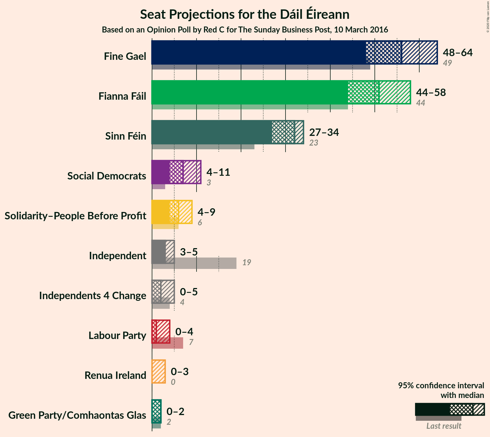
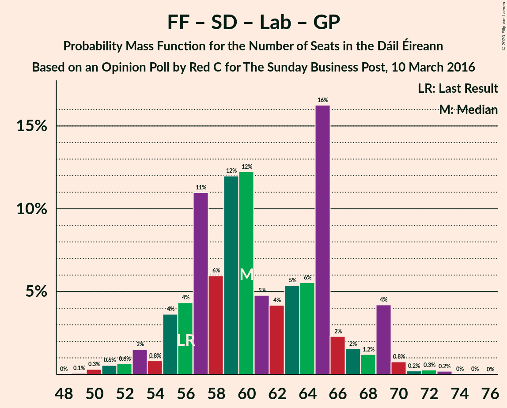
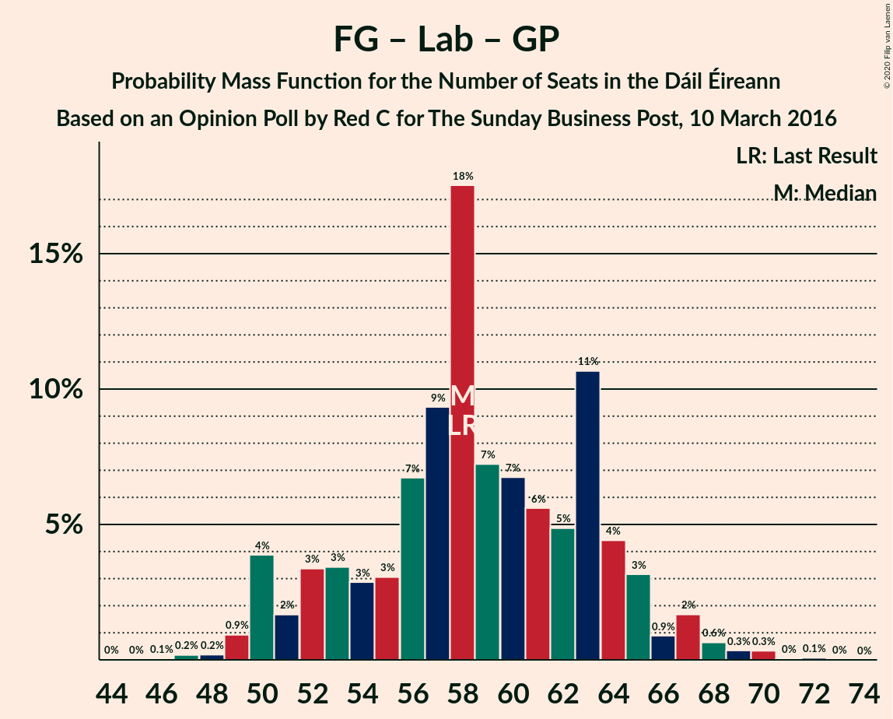
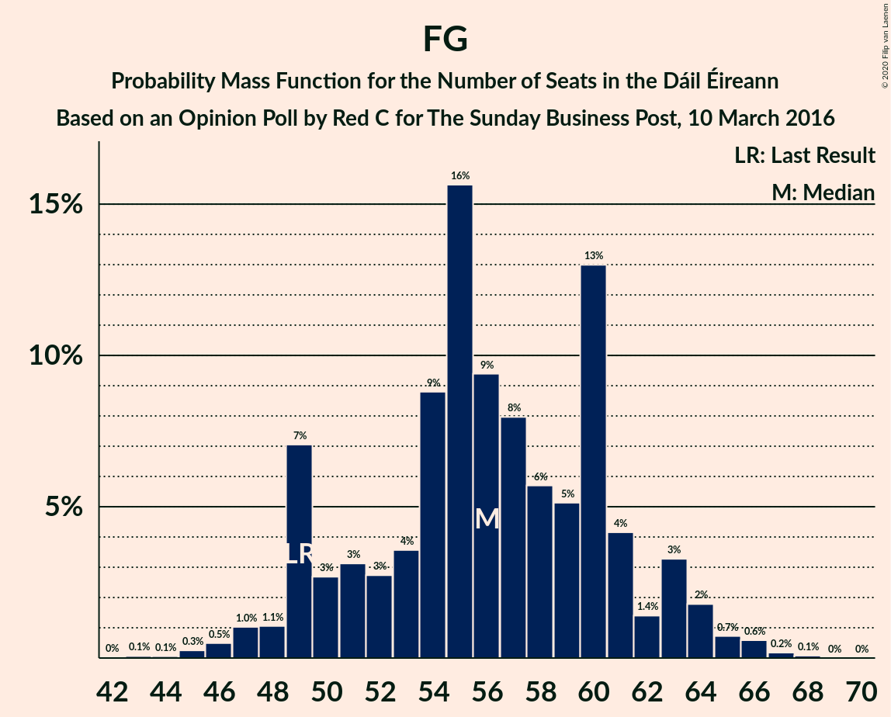
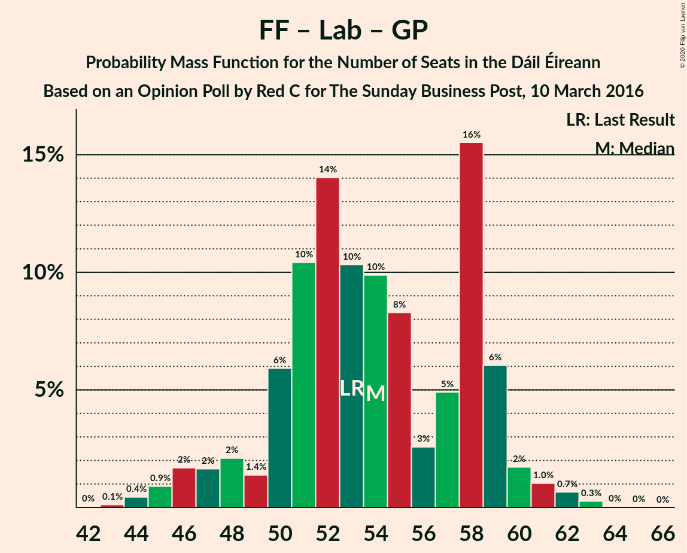

# Opinion Poll by Red C for The Sunday Business Post, 10 March 2016

<a href="#voting-intentions">Voting Intentions</a> | <a href="#seats">Seats</a> | <a href="#coalitions">Coalitions</a> | <a href="#technical-information">Technical Information</a>

## Voting Intentions

### Confidence Intervals

| Party | Last Result | Poll Result | 80% Confidence Interval | 90% Confidence Interval | 95% Confidence Interval | 99% Confidence Interval |
|:-----:|:-----------:|:-----------:|:-----------------------:|:-----------------------:|:-----------------------:|:-----------------------:|
| Fine Gael | 25.5% | 27.2% | 25.5–29.1% |25.0–29.6% |24.6–30.1% |23.7–31.0% |
| Fianna Fáil | 24.3% | 25.2% | 23.5–27.1% |23.1–27.6% |22.6–28.0% |21.9–28.9% |
| Sinn Féin | 13.8% | 15.1% | 13.7–16.6% |13.4–17.1% |13.0–17.5% |12.4–18.2% |
| Independent | 15.9% | 7.7% | 6.7–8.8% |6.4–9.2% |6.2–9.5% |5.7–10.1% |
| Social Democrats | 3.0% | 5.1% | 4.3–6.1% |4.1–6.4% |3.9–6.6% |3.5–7.1% |
| Labour Party | 6.6% | 4.1% | 3.4–5.0% |3.2–5.3% |3.0–5.5% |2.7–6.0% |
| Solidarity–People Before Profit | 3.9% | 4.1% | 3.4–5.0% |3.2–5.3% |3.0–5.5% |2.7–6.0% |
| Green Party/Comhaontas Glas | 2.7% | 3.0% | 2.4–3.8% |2.2–4.0% |2.1–4.2% |1.8–4.6% |
| Renua Ireland | 2.2% | 2.0% | 1.5–2.7% |1.4–2.9% |1.3–3.1% |1.1–3.4% |
| Independents 4 Change | 1.5% | 1.0% | 0.7–1.5% |0.6–1.7% |0.5–1.8% |0.4–2.1% |

*Note:* The poll result column reflects the actual value used in the calculations. Published results may vary slightly, and in addition be rounded to fewer digits.

## Seats

### Confidence Intervals

| Party | Last Result | Median | 80% Confidence Interval | 90% Confidence Interval | 95% Confidence Interval | 99% Confidence Interval |
|:-----:|:-----------:|:------:|:-----------------------:|:-----------------------:|:-----------------------:|:-----------------------:|
| <a href="#fine-gael">Fine Gael</a> | 49 | 55 | 51–60 |49–64 |49–64 |47–66 |
| <a href="#fianna-fáil">Fianna Fáil</a> | 44 | 51 | 49–55 |47–56 |44–58 |41–59 |
| <a href="#sinn-féin">Sinn Féin</a> | 23 | 33 | 29–34 |28–34 |28–34 |25–35 |
| <a href="#independent">Independent</a> | 19 | 3 | 3 |3 |3–5 |3–10 |
| <a href="#social-democrats">Social Democrats</a> | 3 | 7 | 4–11 |4–11 |4–11 |4–11 |
| <a href="#labour-party">Labour Party</a> | 7 | 1 | 0–4 |0–4 |0–4 |0–5 |
| <a href="#solidarity–people-before-profit">Solidarity–People Before Profit</a> | 6 | 4 | 4–9 |4–9 |4–9 |3–10 |
| <a href="#green-party/comhaontas-glas">Green Party/Comhaontas Glas</a> | 2 | 2 | 0–2 |0–2 |0–2 |0–3 |
| <a href="#renua-ireland">Renua Ireland</a> | 0 | 0 | 0–3 |0–3 |0–5 |0–5 |
| <a href="#independents-4-change">Independents 4 Change</a> | 4 | 2 | 0–4 |0–4 |0–4 |0–5 |

### Fine Gael

*For a full overview of the results for this party, see the [Fine Gael](party-finegael.html) page.*

| Number of Seats | Probability | Accumulated | Special Marks |
|:---------------:|:-----------:|:-----------:|:-------------:|
| 44 | 0% | 100% |  |
| 45 | 0.3% | 99.9% |  |
| 46 | 0.1% | 99.7% |  |
| 47 | 0.2% | 99.5% |  |
| 48 | 1.3% | 99.3% |  |
| 49 | 4% | 98% | Last Result |
| 50 | 2% | 94% |  |
| 51 | 1.1% | 91% |  |
| 52 | 11% | 90% |  |
| 53 | 15% | 79% |  |
| 54 | 12% | 64% |  |
| 55 | 6% | 52% | Median |
| 56 | 2% | 46% |  |
| 57 | 5% | 44% |  |
| 58 | 0.6% | 40% |  |
| 59 | 6% | 39% |  |
| 60 | 24% | 33% |  |
| 61 | 0.9% | 9% |  |
| 62 | 0.7% | 8% |  |
| 63 | 0.9% | 8% |  |
| 64 | 6% | 7% |  |
| 65 | 0.1% | 0.6% |  |
| 66 | 0.4% | 0.5% |  |
| 67 | 0% | 0.1% |  |
| 68 | 0.1% | 0.1% |  |
| 69 | 0% | 0% |  |

### Fianna Fáil

*For a full overview of the results for this party, see the [Fianna Fáil](party-fiannafáil.html) page.*

| Number of Seats | Probability | Accumulated | Special Marks |
|:---------------:|:-----------:|:-----------:|:-------------:|
| 40 | 0.2% | 100% |  |
| 41 | 0.5% | 99.8% |  |
| 42 | 0.6% | 99.3% |  |
| 43 | 0.2% | 98.7% |  |
| 44 | 2% | 98.5% | Last Result |
| 45 | 0.2% | 96% |  |
| 46 | 0.9% | 96% |  |
| 47 | 0.6% | 95% |  |
| 48 | 0.7% | 95% |  |
| 49 | 13% | 94% |  |
| 50 | 29% | 80% |  |
| 51 | 23% | 52% | Median |
| 52 | 2% | 29% |  |
| 53 | 15% | 27% |  |
| 54 | 0.4% | 12% |  |
| 55 | 4% | 12% |  |
| 56 | 4% | 8% |  |
| 57 | 1.0% | 4% |  |
| 58 | 0.3% | 3% |  |
| 59 | 2% | 2% |  |
| 60 | 0% | 0% |  |

### Sinn Féin

*For a full overview of the results for this party, see the [Sinn Féin](party-sinnféin.html) page.*

| Number of Seats | Probability | Accumulated | Special Marks |
|:---------------:|:-----------:|:-----------:|:-------------:|
| 20 | 0% | 100% |  |
| 21 | 0% | 99.9% |  |
| 22 | 0% | 99.9% |  |
| 23 | 0.1% | 99.9% | Last Result |
| 24 | 0.1% | 99.9% |  |
| 25 | 0.6% | 99.8% |  |
| 26 | 0% | 99.2% |  |
| 27 | 0.2% | 99.1% |  |
| 28 | 7% | 98.9% |  |
| 29 | 7% | 92% |  |
| 30 | 5% | 85% |  |
| 31 | 5% | 80% |  |
| 32 | 23% | 75% |  |
| 33 | 40% | 53% | Median |
| 34 | 11% | 12% |  |
| 35 | 0.9% | 1.1% |  |
| 36 | 0% | 0.1% |  |
| 37 | 0.1% | 0.1% |  |
| 38 | 0% | 0% |  |

### Independent

*For a full overview of the results for this party, see the [Independent](party-independent.html) page.*

| Number of Seats | Probability | Accumulated | Special Marks |
|:---------------:|:-----------:|:-----------:|:-------------:|
| 3 | 96% | 100% | Median |
| 4 | 1.3% | 4% |  |
| 5 | 2% | 3% |  |
| 6 | 0.5% | 1.3% |  |
| 7 | 0% | 0.8% |  |
| 8 | 0.1% | 0.8% |  |
| 9 | 0.1% | 0.7% |  |
| 10 | 0.6% | 0.7% |  |
| 11 | 0% | 0.1% |  |
| 12 | 0% | 0% |  |
| 13 | 0% | 0% |  |
| 14 | 0% | 0% |  |
| 15 | 0% | 0% |  |
| 16 | 0% | 0% |  |
| 17 | 0% | 0% |  |
| 18 | 0% | 0% |  |
| 19 | 0% | 0% | Last Result |

### Social Democrats

*For a full overview of the results for this party, see the [Social Democrats](party-socialdemocrats.html) page.*

| Number of Seats | Probability | Accumulated | Special Marks |
|:---------------:|:-----------:|:-----------:|:-------------:|
| 3 | 0% | 100% | Last Result |
| 4 | 23% | 100% |  |
| 5 | 8% | 77% |  |
| 6 | 8% | 68% |  |
| 7 | 22% | 60% | Median |
| 8 | 14% | 38% |  |
| 9 | 2% | 24% |  |
| 10 | 2% | 21% |  |
| 11 | 20% | 20% |  |
| 12 | 0% | 0% |  |

### Labour Party

*For a full overview of the results for this party, see the [Labour Party](party-labourparty.html) page.*

| Number of Seats | Probability | Accumulated | Special Marks |
|:---------------:|:-----------:|:-----------:|:-------------:|
| 0 | 11% | 100% |  |
| 1 | 69% | 89% | Median |
| 2 | 5% | 20% |  |
| 3 | 2% | 15% |  |
| 4 | 13% | 14% |  |
| 5 | 0.6% | 0.9% |  |
| 6 | 0.3% | 0.3% |  |
| 7 | 0% | 0% | Last Result |

### Solidarity–People Before Profit

*For a full overview of the results for this party, see the [Solidarity–People Before Profit](party-solidarity–peoplebeforeprofit.html) page.*

| Number of Seats | Probability | Accumulated | Special Marks |
|:---------------:|:-----------:|:-----------:|:-------------:|
| 3 | 0.9% | 100% |  |
| 4 | 67% | 99.1% | Median |
| 5 | 4% | 32% |  |
| 6 | 7% | 28% | Last Result |
| 7 | 6% | 21% |  |
| 8 | 1.3% | 15% |  |
| 9 | 13% | 14% |  |
| 10 | 0.9% | 0.9% |  |
| 11 | 0% | 0% |  |

### Green Party/Comhaontas Glas

*For a full overview of the results for this party, see the [Green Party/Comhaontas Glas](party-greenpartycomhaontasglas.html) page.*

| Number of Seats | Probability | Accumulated | Special Marks |
|:---------------:|:-----------:|:-----------:|:-------------:|
| 0 | 39% | 100% |  |
| 1 | 9% | 61% |  |
| 2 | 51% | 52% | Last Result, Median |
| 3 | 0.8% | 1.2% |  |
| 4 | 0.3% | 0.3% |  |
| 5 | 0% | 0% |  |

### Renua Ireland

*For a full overview of the results for this party, see the [Renua Ireland](party-renuaireland.html) page.*

| Number of Seats | Probability | Accumulated | Special Marks |
|:---------------:|:-----------:|:-----------:|:-------------:|
| 0 | 54% | 100% | Last Result, Median |
| 1 | 2% | 46% |  |
| 2 | 34% | 44% |  |
| 3 | 7% | 10% |  |
| 4 | 0.1% | 3% |  |
| 5 | 3% | 3% |  |
| 6 | 0% | 0% |  |

### Independents 4 Change

*For a full overview of the results for this party, see the [Independents 4 Change](party-independents4change.html) page.*

| Number of Seats | Probability | Accumulated | Special Marks |
|:---------------:|:-----------:|:-----------:|:-------------:|
| 0 | 21% | 100% |  |
| 1 | 23% | 79% |  |
| 2 | 7% | 55% | Median |
| 3 | 20% | 49% |  |
| 4 | 27% | 29% | Last Result |
| 5 | 2% | 2% |  |
| 6 | 0% | 0% |  |

## Coalitions

### Confidence Intervals

| Coalition | Last Result | Median | Majority? | 80% Confidence Interval | 90% Confidence Interval | 95% Confidence Interval | 99% Confidence Interval |
|:---------:|:-----------:|:------:|:---------:|:-----------------------:|:-----------------------:|:-----------------------:|:-----------------------:|
| Fine Gael – Fianna Fáil | 93 | 107 | 100% | 102–112 | 102–114 | 102–114 | 98–114 |
| Fianna Fáil – Sinn Féin | 67 | 83 | 87% | 79–87 | 78–89 | 76–89 | 73–90 |
| Fine Gael – Social Democrats – Labour Party – Green Party/Comhaontas Glas | 61 | 65 | 0% | 61–70 | 60–72 | 59–73 | 56–76 |
| Fianna Fáil – Social Democrats – Labour Party – Green Party/Comhaontas Glas | 56 | 61 | 0% | 56–65 | 56–67 | 54–68 | 50–73 |
| Fine Gael – Labour Party – Green Party/Comhaontas Glas | 58 | 60 | 0% | 54–63 | 52–67 | 51–67 | 49–68 |
| Fine Gael – Green Party/Comhaontas Glas | 51 | 56 | 0% | 53–62 | 50–66 | 50–66 | 48–67 |
| Fine Gael – Labour Party | 56 | 58 | 0% | 53–62 | 50–65 | 50–65 | 47–67 |
| Fine Gael | 49 | 55 | 0% | 51–60 | 49–64 | 49–64 | 47–66 |
| Fianna Fáil – Labour Party – Green Party/Comhaontas Glas | 53 | 53 | 0% | 52–58 | 49–59 | 46–61 | 44–62 |
| Fianna Fáil – Labour Party | 51 | 52 | 0% | 51–57 | 47–57 | 46–60 | 43–61 |
| Fianna Fáil – Green Party/Comhaontas Glas | 46 | 52 | 0% | 51–56 | 48–57 | 44–59 | 43–61 |

### Fine Gael – Fianna Fáil

| Number of Seats | Probability | Accumulated | Special Marks |
|:---------------:|:-----------:|:-----------:|:-------------:|
| 93 | 0% | 100% | Last Result |
| 94 | 0% | 100% |  |
| 95 | 0% | 100% |  |
| 96 | 0% | 100% |  |
| 97 | 0.1% | 99.9% |  |
| 98 | 0.5% | 99.9% |  |
| 99 | 0.3% | 99.4% |  |
| 100 | 0.6% | 99.0% |  |
| 101 | 0.5% | 98% |  |
| 102 | 9% | 98% |  |
| 103 | 26% | 89% |  |
| 104 | 2% | 62% |  |
| 105 | 6% | 60% |  |
| 106 | 2% | 53% | Median |
| 107 | 2% | 52% |  |
| 108 | 8% | 49% |  |
| 109 | 0.8% | 41% |  |
| 110 | 4% | 41% |  |
| 111 | 25% | 37% |  |
| 112 | 6% | 12% |  |
| 113 | 0.3% | 5% |  |
| 114 | 5% | 5% |  |
| 115 | 0% | 0.1% |  |
| 116 | 0% | 0.1% |  |
| 117 | 0% | 0.1% |  |
| 118 | 0% | 0.1% |  |
| 119 | 0% | 0.1% |  |
| 120 | 0% | 0% |  |

### Fianna Fáil – Sinn Féin

| Number of Seats | Probability | Accumulated | Special Marks |
|:---------------:|:-----------:|:-----------:|:-------------:|
| 67 | 0% | 100% | Last Result |
| 68 | 0% | 100% |  |
| 69 | 0% | 100% |  |
| 70 | 0.3% | 100% |  |
| 71 | 0.1% | 99.7% |  |
| 72 | 0.1% | 99.6% |  |
| 73 | 0.2% | 99.5% |  |
| 74 | 0.3% | 99.3% |  |
| 75 | 1.0% | 99.0% |  |
| 76 | 2% | 98% |  |
| 77 | 0.7% | 97% |  |
| 78 | 2% | 96% |  |
| 79 | 5% | 94% |  |
| 80 | 2% | 89% |  |
| 81 | 18% | 87% | Majority |
| 82 | 7% | 70% |  |
| 83 | 16% | 63% |  |
| 84 | 31% | 47% | Median |
| 85 | 3% | 16% |  |
| 86 | 0.6% | 13% |  |
| 87 | 6% | 13% |  |
| 88 | 0.4% | 7% |  |
| 89 | 5% | 6% |  |
| 90 | 1.1% | 1.4% |  |
| 91 | 0.1% | 0.3% |  |
| 92 | 0.1% | 0.2% |  |
| 93 | 0.1% | 0.1% |  |
| 94 | 0% | 0% |  |

### Fine Gael – Social Democrats – Labour Party – Green Party/Comhaontas Glas

| Number of Seats | Probability | Accumulated | Special Marks |
|:---------------:|:-----------:|:-----------:|:-------------:|
| 53 | 0.1% | 100% |  |
| 54 | 0.3% | 99.9% |  |
| 55 | 0% | 99.5% |  |
| 56 | 0.3% | 99.5% |  |
| 57 | 0.7% | 99.2% |  |
| 58 | 0.1% | 98.5% |  |
| 59 | 3% | 98% |  |
| 60 | 3% | 95% |  |
| 61 | 5% | 92% | Last Result |
| 62 | 7% | 87% |  |
| 63 | 8% | 79% |  |
| 64 | 0.3% | 71% |  |
| 65 | 22% | 71% | Median |
| 66 | 0.5% | 49% |  |
| 67 | 26% | 48% |  |
| 68 | 8% | 23% |  |
| 69 | 4% | 15% |  |
| 70 | 2% | 11% |  |
| 71 | 0.2% | 9% |  |
| 72 | 5% | 9% |  |
| 73 | 2% | 4% |  |
| 74 | 1.0% | 2% |  |
| 75 | 0.5% | 1.1% |  |
| 76 | 0.1% | 0.6% |  |
| 77 | 0.1% | 0.5% |  |
| 78 | 0.3% | 0.3% |  |
| 79 | 0% | 0.1% |  |
| 80 | 0% | 0.1% |  |
| 81 | 0% | 0% | Majority |

### Fianna Fáil – Social Democrats – Labour Party – Green Party/Comhaontas Glas

| Number of Seats | Probability | Accumulated | Special Marks |
|:---------------:|:-----------:|:-----------:|:-------------:|
| 48 | 0% | 100% |  |
| 49 | 0% | 99.9% |  |
| 50 | 0.5% | 99.9% |  |
| 51 | 0.3% | 99.4% |  |
| 52 | 0.2% | 99.2% |  |
| 53 | 1.4% | 98.9% |  |
| 54 | 0.9% | 98% |  |
| 55 | 0.4% | 97% |  |
| 56 | 23% | 96% | Last Result |
| 57 | 1.0% | 74% |  |
| 58 | 7% | 73% |  |
| 59 | 4% | 66% |  |
| 60 | 9% | 62% |  |
| 61 | 5% | 53% | Median |
| 62 | 18% | 48% |  |
| 63 | 0.8% | 30% |  |
| 64 | 14% | 29% |  |
| 65 | 5% | 14% |  |
| 66 | 5% | 10% |  |
| 67 | 2% | 5% |  |
| 68 | 0.7% | 3% |  |
| 69 | 0.9% | 2% |  |
| 70 | 0.3% | 1.2% |  |
| 71 | 0.2% | 1.0% |  |
| 72 | 0.3% | 0.8% |  |
| 73 | 0.3% | 0.5% |  |
| 74 | 0% | 0.2% |  |
| 75 | 0.2% | 0.2% |  |
| 76 | 0% | 0% |  |

### Fine Gael – Labour Party – Green Party/Comhaontas Glas

| Number of Seats | Probability | Accumulated | Special Marks |
|:---------------:|:-----------:|:-----------:|:-------------:|
| 47 | 0.3% | 100% |  |
| 48 | 0.1% | 99.7% |  |
| 49 | 0.3% | 99.6% |  |
| 50 | 0.2% | 99.3% |  |
| 51 | 4% | 99.1% |  |
| 52 | 1.3% | 95% |  |
| 53 | 1.3% | 94% |  |
| 54 | 4% | 93% |  |
| 55 | 15% | 89% |  |
| 56 | 15% | 74% |  |
| 57 | 1.2% | 59% |  |
| 58 | 5% | 58% | Last Result, Median |
| 59 | 1.4% | 53% |  |
| 60 | 17% | 52% |  |
| 61 | 23% | 35% |  |
| 62 | 2% | 12% |  |
| 63 | 0.6% | 10% |  |
| 64 | 1.3% | 10% |  |
| 65 | 0.9% | 8% |  |
| 66 | 2% | 8% |  |
| 67 | 5% | 6% |  |
| 68 | 0.4% | 0.6% |  |
| 69 | 0.1% | 0.2% |  |
| 70 | 0.1% | 0.1% |  |
| 71 | 0% | 0.1% |  |
| 72 | 0% | 0% |  |

### Fine Gael – Green Party/Comhaontas Glas

| Number of Seats | Probability | Accumulated | Special Marks |
|:---------------:|:-----------:|:-----------:|:-------------:|
| 45 | 0.2% | 100% |  |
| 46 | 0% | 99.7% |  |
| 47 | 0.1% | 99.7% |  |
| 48 | 0.3% | 99.6% |  |
| 49 | 0.2% | 99.3% |  |
| 50 | 5% | 99.1% |  |
| 51 | 1.1% | 94% | Last Result |
| 52 | 3% | 93% |  |
| 53 | 2% | 90% |  |
| 54 | 9% | 88% |  |
| 55 | 21% | 79% |  |
| 56 | 12% | 58% |  |
| 57 | 5% | 46% | Median |
| 58 | 0.7% | 41% |  |
| 59 | 6% | 40% |  |
| 60 | 22% | 34% |  |
| 61 | 0.9% | 12% |  |
| 62 | 2% | 11% |  |
| 63 | 0.9% | 9% |  |
| 64 | 2% | 8% |  |
| 65 | 0.8% | 6% |  |
| 66 | 5% | 5% |  |
| 67 | 0.4% | 0.6% |  |
| 68 | 0% | 0.2% |  |
| 69 | 0.1% | 0.1% |  |
| 70 | 0% | 0% |  |

### Fine Gael – Labour Party

| Number of Seats | Probability | Accumulated | Special Marks |
|:---------------:|:-----------:|:-----------:|:-------------:|
| 45 | 0% | 100% |  |
| 46 | 0% | 99.9% |  |
| 47 | 0.4% | 99.9% |  |
| 48 | 0.2% | 99.5% |  |
| 49 | 1.0% | 99.3% |  |
| 50 | 4% | 98% |  |
| 51 | 0.5% | 94% |  |
| 52 | 3% | 94% |  |
| 53 | 11% | 91% |  |
| 54 | 15% | 80% |  |
| 55 | 6% | 65% |  |
| 56 | 0.4% | 58% | Last Result, Median |
| 57 | 3% | 58% |  |
| 58 | 15% | 55% |  |
| 59 | 0.9% | 40% |  |
| 60 | 7% | 39% |  |
| 61 | 22% | 32% |  |
| 62 | 1.3% | 10% |  |
| 63 | 1.0% | 9% |  |
| 64 | 0.5% | 8% |  |
| 65 | 5% | 7% |  |
| 66 | 1.2% | 2% |  |
| 67 | 0.4% | 0.6% |  |
| 68 | 0.1% | 0.2% |  |
| 69 | 0.1% | 0.1% |  |
| 70 | 0% | 0% |  |

### Fine Gael

| Number of Seats | Probability | Accumulated | Special Marks |
|:---------------:|:-----------:|:-----------:|:-------------:|
| 44 | 0% | 100% |  |
| 45 | 0.3% | 99.9% |  |
| 46 | 0.1% | 99.7% |  |
| 47 | 0.2% | 99.5% |  |
| 48 | 1.3% | 99.3% |  |
| 49 | 4% | 98% | Last Result |
| 50 | 2% | 94% |  |
| 51 | 1.1% | 91% |  |
| 52 | 11% | 90% |  |
| 53 | 15% | 79% |  |
| 54 | 12% | 64% |  |
| 55 | 6% | 52% | Median |
| 56 | 2% | 46% |  |
| 57 | 5% | 44% |  |
| 58 | 0.6% | 40% |  |
| 59 | 6% | 39% |  |
| 60 | 24% | 33% |  |
| 61 | 0.9% | 9% |  |
| 62 | 0.7% | 8% |  |
| 63 | 0.9% | 8% |  |
| 64 | 6% | 7% |  |
| 65 | 0.1% | 0.6% |  |
| 66 | 0.4% | 0.5% |  |
| 67 | 0% | 0.1% |  |
| 68 | 0.1% | 0.1% |  |
| 69 | 0% | 0% |  |

### Fianna Fáil – Labour Party – Green Party/Comhaontas Glas

| Number of Seats | Probability | Accumulated | Special Marks |
|:---------------:|:-----------:|:-----------:|:-------------:|
| 43 | 0.2% | 100% |  |
| 44 | 0.7% | 99.8% |  |
| 45 | 0.2% | 99.1% |  |
| 46 | 2% | 98.9% |  |
| 47 | 0.3% | 97% |  |
| 48 | 0.7% | 97% |  |
| 49 | 2% | 96% |  |
| 50 | 0.8% | 94% |  |
| 51 | 0.3% | 93% |  |
| 52 | 23% | 93% |  |
| 53 | 34% | 70% | Last Result |
| 54 | 11% | 36% | Median |
| 55 | 12% | 26% |  |
| 56 | 0.4% | 13% |  |
| 57 | 2% | 13% |  |
| 58 | 5% | 11% |  |
| 59 | 2% | 6% |  |
| 60 | 1.2% | 4% |  |
| 61 | 2% | 3% |  |
| 62 | 0.5% | 0.8% |  |
| 63 | 0.1% | 0.3% |  |
| 64 | 0.2% | 0.2% |  |
| 65 | 0% | 0% |  |

### Fianna Fáil – Labour Party

| Number of Seats | Probability | Accumulated | Special Marks |
|:---------------:|:-----------:|:-----------:|:-------------:|
| 41 | 0% | 100% |  |
| 42 | 0.2% | 99.9% |  |
| 43 | 0.7% | 99.7% |  |
| 44 | 0.9% | 99.0% |  |
| 45 | 0.2% | 98% |  |
| 46 | 2% | 98% |  |
| 47 | 1.1% | 96% |  |
| 48 | 0.4% | 95% |  |
| 49 | 1.0% | 95% |  |
| 50 | 1.3% | 94% |  |
| 51 | 28% | 92% | Last Result |
| 52 | 24% | 64% | Median |
| 53 | 18% | 40% |  |
| 54 | 9% | 22% |  |
| 55 | 0.6% | 13% |  |
| 56 | 2% | 12% |  |
| 57 | 6% | 10% |  |
| 58 | 1.2% | 4% |  |
| 59 | 0.5% | 3% |  |
| 60 | 2% | 3% |  |
| 61 | 0.3% | 0.5% |  |
| 62 | 0.2% | 0.2% |  |
| 63 | 0% | 0% |  |

### Fianna Fáil – Green Party/Comhaontas Glas

| Number of Seats | Probability | Accumulated | Special Marks |
|:---------------:|:-----------:|:-----------:|:-------------:|
| 42 | 0.2% | 100% |  |
| 43 | 1.0% | 99.7% |  |
| 44 | 1.4% | 98.8% |  |
| 45 | 0.1% | 97% |  |
| 46 | 1.2% | 97% | Last Result |
| 47 | 0.2% | 96% |  |
| 48 | 1.1% | 96% |  |
| 49 | 1.4% | 95% |  |
| 50 | 1.0% | 93% |  |
| 51 | 34% | 92% |  |
| 52 | 29% | 59% |  |
| 53 | 14% | 29% | Median |
| 54 | 2% | 15% |  |
| 55 | 2% | 13% |  |
| 56 | 1.5% | 11% |  |
| 57 | 6% | 10% |  |
| 58 | 0.9% | 4% |  |
| 59 | 0.9% | 3% |  |
| 60 | 2% | 2% |  |
| 61 | 0.8% | 0.8% |  |
| 62 | 0% | 0% |  |

## Technical Information

### Opinion Poll

+ **Polling firm:** Red C
+ **Commissioner(s):** The Sunday Business Post
+ **Fieldwork period:** 10 March 2016

### Calculations

+ **Sample size:** 1006
+ **Simulations done:** 131,072
+ **Error estimate:** 2.65%

