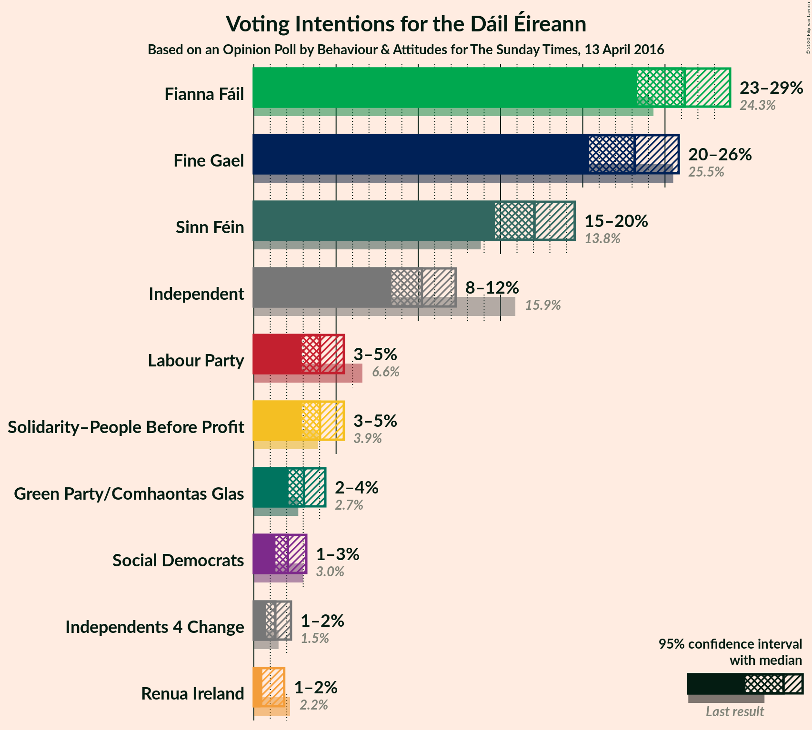
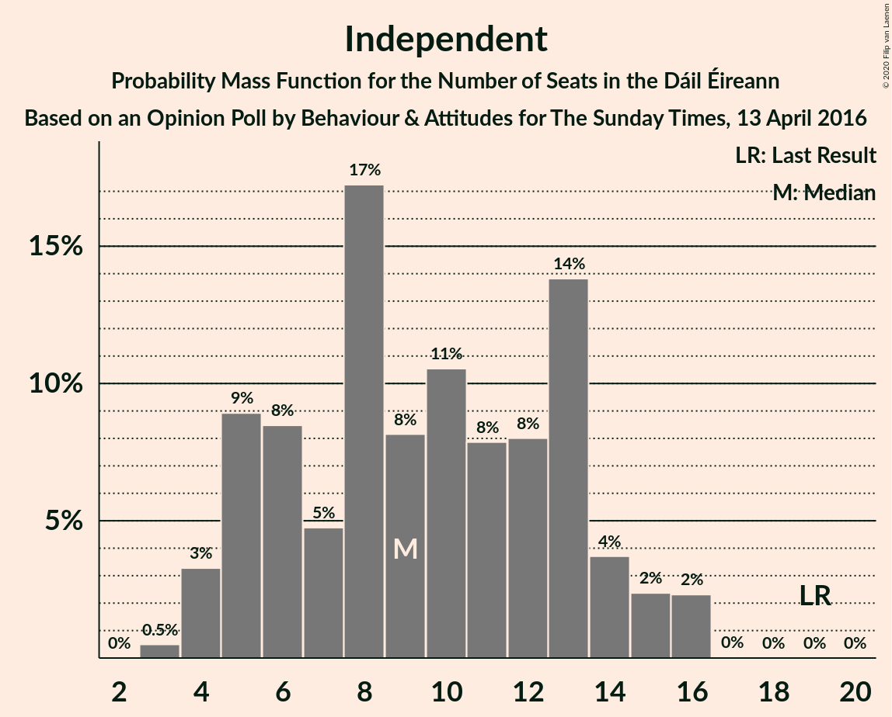
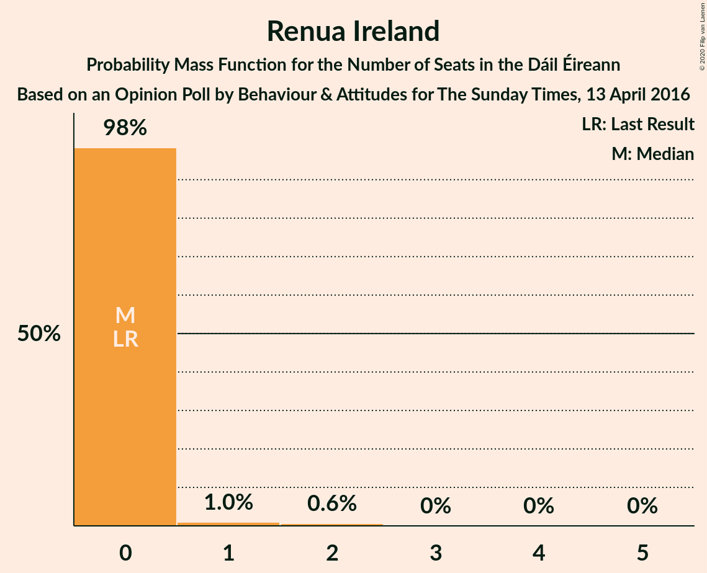
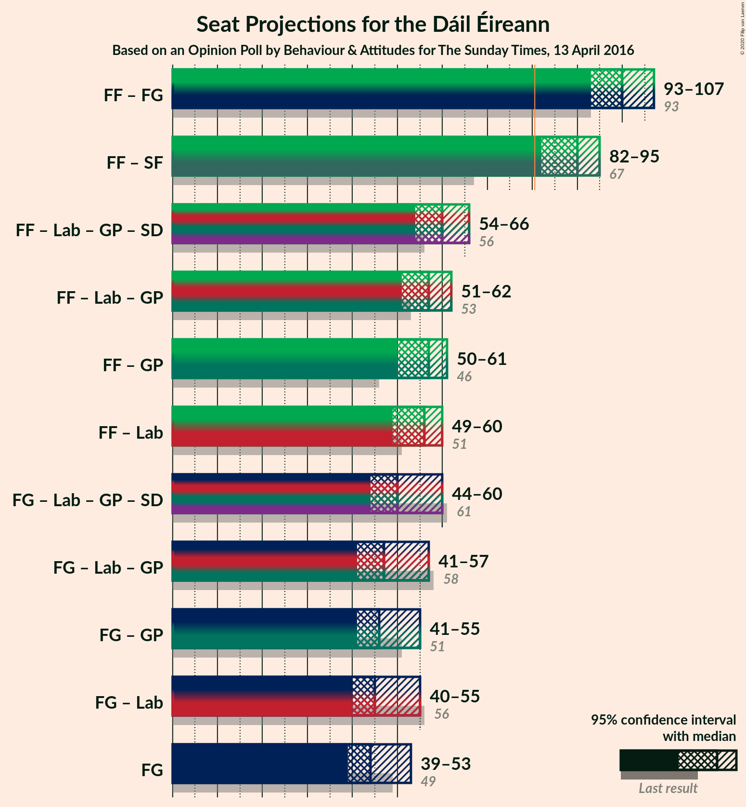
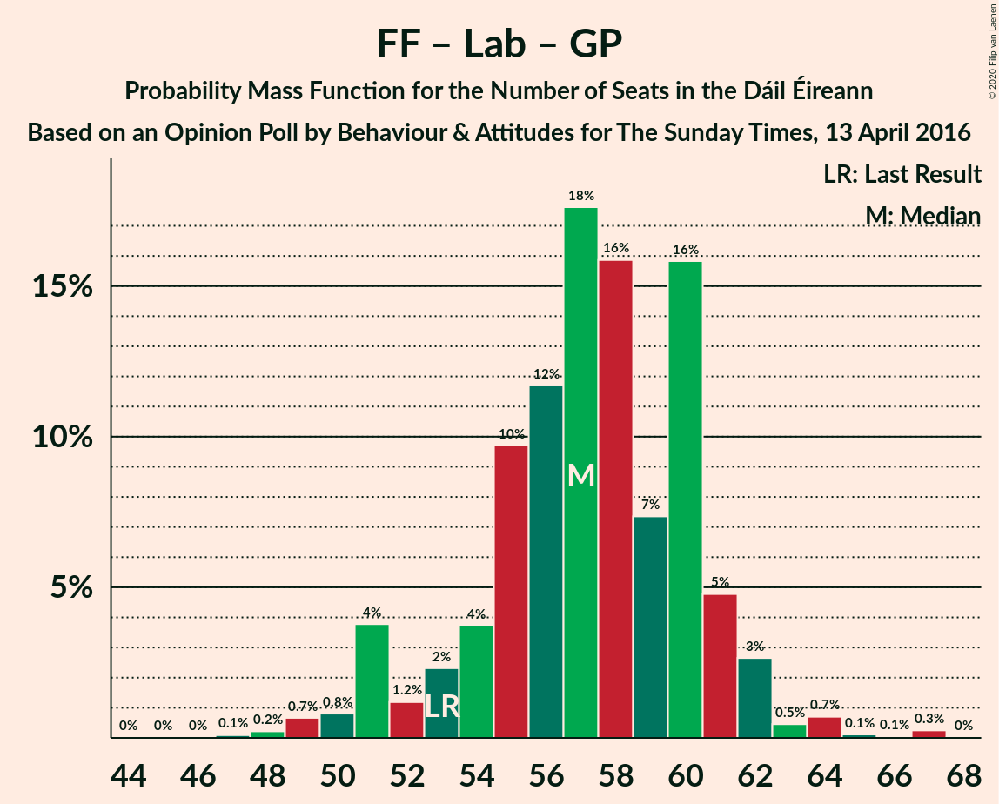
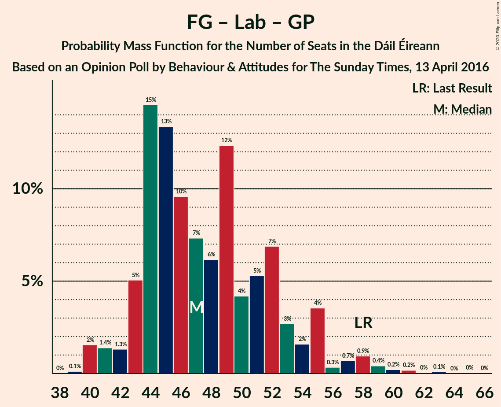
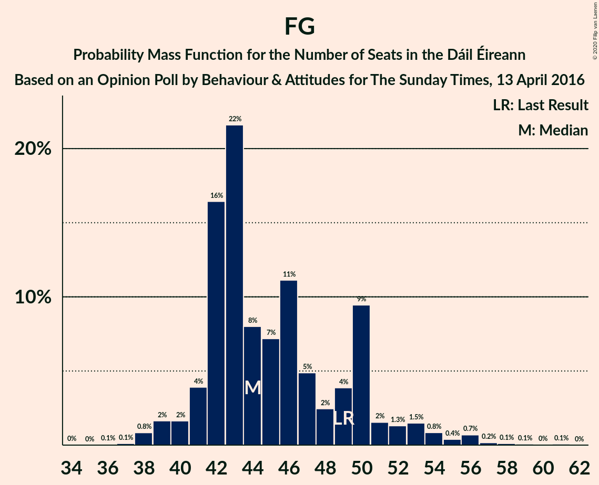

# Opinion Poll by Behaviour & Attitudes for The Sunday Times, 13 April 2016

<a href="#voting-intentions">Voting Intentions</a> | <a href="#seats">Seats</a> | <a href="#coalitions">Coalitions</a> | <a href="#technical-information">Technical Information</a>

## Voting Intentions

### Confidence Intervals

| Party | Last Result | Poll Result | 80% Confidence Interval | 90% Confidence Interval | 95% Confidence Interval | 99% Confidence Interval |
|:-----:|:-----------:|:-----------:|:-----------------------:|:-----------------------:|:-----------------------:|:-----------------------:|
| Fianna Fáil | 24.3% | 26.2% | 24.2–27.9% |23.7–28.5% |23.3–29.0% |22.5–29.9% |
| Fine Gael | 25.5% | 23.2% | 21.3–24.8% |20.8–25.4% |20.4–25.8% |19.6–26.7% |
| Sinn Féin | 13.8% | 17.1% | 15.5–18.6% |15.0–19.1% |14.7–19.5% |14.0–20.3% |
| Independent | 15.9% | 10.2% | 9.0–11.5% |8.6–11.9% |8.4–12.3% |7.8–13.0% |
| Labour Party | 6.6% | 4.0% | 3.3–5.0% |3.1–5.2% |2.9–5.5% |2.6–6.0% |
| Solidarity–People Before Profit | 3.9% | 4.0% | 3.3–5.0% |3.1–5.2% |2.9–5.5% |2.6–6.0% |
| Green Party/Comhaontas Glas | 2.7% | 3.0% | 2.4–3.9% |2.2–4.1% |2.1–4.3% |1.8–4.8% |
| Social Democrats | 3.0% | 2.1% | 1.6–2.8% |1.4–3.0% |1.3–3.2% |1.1–3.6% |
| Independents 4 Change | 1.5% | 1.3% | 0.9–1.9% |0.8–2.1% |0.7–2.3% |0.6–2.6% |
| Renua Ireland | 2.2% | 0.3% | 0.7–1.5% |0.6–1.7% |0.5–1.8% |0.4–2.1% |

*Note:* The poll result column reflects the actual value used in the calculations. Published results may vary slightly, and in addition be rounded to fewer digits.

## Seats

### Confidence Intervals

| Party | Last Result | Median | 80% Confidence Interval | 90% Confidence Interval | 95% Confidence Interval | 99% Confidence Interval |
|:-----:|:-----------:|:------:|:-----------------------:|:-----------------------:|:-----------------------:|:-----------------------:|
| <a href="#fianna-fáil">Fianna Fáil</a> | 44 | 55 | 50–58 |49–59 |48–59 |46–61 |
| <a href="#fine-gael">Fine Gael</a> | 49 | 44 | 42–50 |41–52 |39–53 |38–56 |
| <a href="#sinn-féin">Sinn Féin</a> | 23 | 35 | 33–37 |32–38 |31–38 |28–40 |
| <a href="#independent">Independent</a> | 19 | 9 | 5–13 |5–14 |4–15 |4–16 |
| <a href="#labour-party">Labour Party</a> | 7 | 1 | 0–3 |0–4 |0–5 |0–7 |
| <a href="#solidarity–people-before-profit">Solidarity–People Before Profit</a> | 6 | 7 | 5–9 |4–9 |4–10 |3–10 |
| <a href="#green-party/comhaontas-glas">Green Party/Comhaontas Glas</a> | 2 | 2 | 1–2 |0–3 |0–3 |0–3 |
| <a href="#social-democrats">Social Democrats</a> | 3 | 3 | 3–4 |3–4 |2–4 |1–5 |
| <a href="#independents-4-change">Independents 4 Change</a> | 4 | 3 | 1–5 |0–5 |0–5 |0–5 |
| <a href="#renua-ireland">Renua Ireland</a> | 0 | 0 | 0 |0 |0 |0–2 |

### Fianna Fáil

*For a full overview of the results for this party, see the [Fianna Fáil](party-fiannafáil.html) page.*

| Number of Seats | Probability | Accumulated | Special Marks |
|:---------------:|:-----------:|:-----------:|:-------------:|
| 43 | 0% | 100% |  |
| 44 | 0.1% | 99.9% | Last Result |
| 45 | 0.2% | 99.8% |  |
| 46 | 0.2% | 99.6% |  |
| 47 | 1.4% | 99.4% |  |
| 48 | 0.6% | 98% |  |
| 49 | 2% | 97% |  |
| 50 | 6% | 95% |  |
| 51 | 6% | 89% |  |
| 52 | 8% | 83% |  |
| 53 | 4% | 75% |  |
| 54 | 16% | 71% |  |
| 55 | 6% | 55% | Median |
| 56 | 20% | 49% |  |
| 57 | 6% | 29% |  |
| 58 | 17% | 23% |  |
| 59 | 3% | 5% |  |
| 60 | 2% | 2% |  |
| 61 | 0.5% | 0.6% |  |
| 62 | 0.1% | 0.1% |  |
| 63 | 0% | 0% |  |

### Fine Gael

*For a full overview of the results for this party, see the [Fine Gael](party-finegael.html) page.*

| Number of Seats | Probability | Accumulated | Special Marks |
|:---------------:|:-----------:|:-----------:|:-------------:|
| 36 | 0.1% | 100% |  |
| 37 | 0.1% | 99.9% |  |
| 38 | 0.8% | 99.8% |  |
| 39 | 2% | 98.9% |  |
| 40 | 2% | 97% |  |
| 41 | 4% | 96% |  |
| 42 | 16% | 92% |  |
| 43 | 22% | 75% |  |
| 44 | 8% | 54% | Median |
| 45 | 7% | 46% |  |
| 46 | 11% | 39% |  |
| 47 | 5% | 27% |  |
| 48 | 2% | 23% |  |
| 49 | 4% | 20% | Last Result |
| 50 | 9% | 16% |  |
| 51 | 2% | 7% |  |
| 52 | 1.3% | 5% |  |
| 53 | 1.5% | 4% |  |
| 54 | 0.8% | 2% |  |
| 55 | 0.4% | 2% |  |
| 56 | 0.7% | 1.2% |  |
| 57 | 0.2% | 0.5% |  |
| 58 | 0.1% | 0.3% |  |
| 59 | 0.1% | 0.2% |  |
| 60 | 0% | 0.1% |  |
| 61 | 0.1% | 0.1% |  |
| 62 | 0% | 0% |  |

### Sinn Féin

*For a full overview of the results for this party, see the [Sinn Féin](party-sinnféin.html) page.*

| Number of Seats | Probability | Accumulated | Special Marks |
|:---------------:|:-----------:|:-----------:|:-------------:|
| 23 | 0% | 100% | Last Result |
| 24 | 0% | 100% |  |
| 25 | 0% | 100% |  |
| 26 | 0% | 100% |  |
| 27 | 0.3% | 100% |  |
| 28 | 0.7% | 99.7% |  |
| 29 | 0.5% | 99.0% |  |
| 30 | 0.6% | 98.5% |  |
| 31 | 1.2% | 98% |  |
| 32 | 2% | 97% |  |
| 33 | 14% | 94% |  |
| 34 | 25% | 81% |  |
| 35 | 13% | 55% | Median |
| 36 | 22% | 42% |  |
| 37 | 14% | 20% |  |
| 38 | 4% | 6% |  |
| 39 | 0.6% | 2% |  |
| 40 | 1.3% | 2% |  |
| 41 | 0.3% | 0.5% |  |
| 42 | 0.1% | 0.2% |  |
| 43 | 0% | 0% |  |

### Independent

*For a full overview of the results for this party, see the [Independent](party-independent.html) page.*

| Number of Seats | Probability | Accumulated | Special Marks |
|:---------------:|:-----------:|:-----------:|:-------------:|
| 3 | 0.5% | 100% |  |
| 4 | 3% | 99.5% |  |
| 5 | 9% | 96% |  |
| 6 | 8% | 87% |  |
| 7 | 5% | 79% |  |
| 8 | 17% | 74% |  |
| 9 | 8% | 57% | Median |
| 10 | 11% | 49% |  |
| 11 | 8% | 38% |  |
| 12 | 8% | 30% |  |
| 13 | 14% | 22% |  |
| 14 | 4% | 8% |  |
| 15 | 2% | 5% |  |
| 16 | 2% | 2% |  |
| 17 | 0% | 0% |  |
| 18 | 0% | 0% |  |
| 19 | 0% | 0% | Last Result |

### Labour Party

*For a full overview of the results for this party, see the [Labour Party](party-labourparty.html) page.*

| Number of Seats | Probability | Accumulated | Special Marks |
|:---------------:|:-----------:|:-----------:|:-------------:|
| 0 | 46% | 100% |  |
| 1 | 31% | 54% | Median |
| 2 | 13% | 23% |  |
| 3 | 3% | 10% |  |
| 4 | 4% | 7% |  |
| 5 | 2% | 4% |  |
| 6 | 1.0% | 2% |  |
| 7 | 0.4% | 0.5% | Last Result |
| 8 | 0% | 0.1% |  |
| 9 | 0.1% | 0.1% |  |
| 10 | 0% | 0% |  |

### Solidarity–People Before Profit

*For a full overview of the results for this party, see the [Solidarity–People Before Profit](party-solidarity–peoplebeforeprofit.html) page.*

| Number of Seats | Probability | Accumulated | Special Marks |
|:---------------:|:-----------:|:-----------:|:-------------:|
| 3 | 0.9% | 100% |  |
| 4 | 8% | 99.1% |  |
| 5 | 15% | 91% |  |
| 6 | 14% | 76% | Last Result |
| 7 | 20% | 62% | Median |
| 8 | 18% | 42% |  |
| 9 | 21% | 25% |  |
| 10 | 4% | 4% |  |
| 11 | 0% | 0% |  |

### Green Party/Comhaontas Glas

*For a full overview of the results for this party, see the [Green Party/Comhaontas Glas](party-greenpartycomhaontasglas.html) page.*

| Number of Seats | Probability | Accumulated | Special Marks |
|:---------------:|:-----------:|:-----------:|:-------------:|
| 0 | 6% | 100% |  |
| 1 | 39% | 94% |  |
| 2 | 48% | 55% | Last Result, Median |
| 3 | 7% | 7% |  |
| 4 | 0.3% | 0.4% |  |
| 5 | 0% | 0.1% |  |
| 6 | 0% | 0% |  |

### Social Democrats

*For a full overview of the results for this party, see the [Social Democrats](party-socialdemocrats.html) page.*

| Number of Seats | Probability | Accumulated | Special Marks |
|:---------------:|:-----------:|:-----------:|:-------------:|
| 1 | 0.5% | 100% |  |
| 2 | 2% | 99.5% |  |
| 3 | 82% | 97% | Last Result, Median |
| 4 | 14% | 15% |  |
| 5 | 0.8% | 0.9% |  |
| 6 | 0% | 0% |  |

### Independents 4 Change

*For a full overview of the results for this party, see the [Independents 4 Change](party-independents4change.html) page.*

| Number of Seats | Probability | Accumulated | Special Marks |
|:---------------:|:-----------:|:-----------:|:-------------:|
| 0 | 5% | 100% |  |
| 1 | 11% | 95% |  |
| 2 | 13% | 83% |  |
| 3 | 21% | 70% | Median |
| 4 | 35% | 49% | Last Result |
| 5 | 14% | 14% |  |
| 6 | 0% | 0% |  |

### Renua Ireland

*For a full overview of the results for this party, see the [Renua Ireland](party-renuaireland.html) page.*

| Number of Seats | Probability | Accumulated | Special Marks |
|:---------------:|:-----------:|:-----------:|:-------------:|
| 0 | 98% | 100% | Last Result, Median |
| 1 | 1.0% | 2% |  |
| 2 | 0.6% | 0.7% |  |
| 3 | 0% | 0% |  |

## Coalitions

### Confidence Intervals

| Coalition | Last Result | Median | Majority? | 80% Confidence Interval | 90% Confidence Interval | 95% Confidence Interval | 99% Confidence Interval |
|:---------:|:-----------:|:------:|:---------:|:-----------------------:|:-----------------------:|:-----------------------:|:-----------------------:|
| Fianna Fáil – Fine Gael | 93 | 100 | 100% | 96–104 | 95–106 | 93–107 | 90–110 |
| Fianna Fáil – Sinn Féin | 67 | 90 | 99.3% | 84–94 | 83–95 | 82–95 | 80–99 |
| Fianna Fáil – Labour Party – Green Party/Comhaontas Glas – Social Democrats | 56 | 60 | 0% | 57–64 | 54–65 | 54–66 | 52–68 |
| Fianna Fáil – Labour Party – Green Party/Comhaontas Glas | 53 | 57 | 0% | 54–60 | 51–61 | 51–62 | 49–64 |
| Fianna Fáil – Green Party/Comhaontas Glas | 46 | 57 | 0% | 52–59 | 51–60 | 50–61 | 47–63 |
| Fianna Fáil – Labour Party | 51 | 56 | 0% | 52–59 | 50–60 | 49–60 | 48–63 |
| Fine Gael – Labour Party – Green Party/Comhaontas Glas – Social Democrats | 61 | 50 | 0% | 47–56 | 46–58 | 44–60 | 43–63 |
| Fine Gael – Labour Party – Green Party/Comhaontas Glas | 58 | 47 | 0% | 44–53 | 43–55 | 41–57 | 40–60 |
| Fine Gael – Green Party/Comhaontas Glas | 51 | 46 | 0% | 43–52 | 42–53 | 41–55 | 39–58 |
| Fine Gael – Labour Party | 56 | 45 | 0% | 42–52 | 41–53 | 40–55 | 39–58 |
| Fine Gael | 49 | 44 | 0% | 42–50 | 41–52 | 39–53 | 38–56 |

### Fianna Fáil – Fine Gael

| Number of Seats | Probability | Accumulated | Special Marks |
|:---------------:|:-----------:|:-----------:|:-------------:|
| 88 | 0.1% | 100% |  |
| 89 | 0.2% | 99.9% |  |
| 90 | 0.3% | 99.7% |  |
| 91 | 0.2% | 99.4% |  |
| 92 | 0.9% | 99.2% |  |
| 93 | 2% | 98% | Last Result |
| 94 | 1.4% | 96% |  |
| 95 | 3% | 95% |  |
| 96 | 10% | 92% |  |
| 97 | 5% | 83% |  |
| 98 | 16% | 77% |  |
| 99 | 9% | 62% | Median |
| 100 | 11% | 52% |  |
| 101 | 15% | 41% |  |
| 102 | 7% | 26% |  |
| 103 | 5% | 19% |  |
| 104 | 7% | 14% |  |
| 105 | 1.4% | 7% |  |
| 106 | 2% | 6% |  |
| 107 | 1.3% | 4% |  |
| 108 | 1.0% | 2% |  |
| 109 | 0.9% | 1.4% |  |
| 110 | 0.3% | 0.5% |  |
| 111 | 0.2% | 0.2% |  |
| 112 | 0% | 0% |  |

### Fianna Fáil – Sinn Féin

| Number of Seats | Probability | Accumulated | Special Marks |
|:---------------:|:-----------:|:-----------:|:-------------:|
| 67 | 0% | 100% | Last Result |
| 68 | 0% | 100% |  |
| 69 | 0% | 100% |  |
| 70 | 0% | 100% |  |
| 71 | 0% | 100% |  |
| 72 | 0% | 100% |  |
| 73 | 0% | 100% |  |
| 74 | 0% | 100% |  |
| 75 | 0% | 100% |  |
| 76 | 0% | 100% |  |
| 77 | 0.1% | 100% |  |
| 78 | 0.1% | 99.9% |  |
| 79 | 0.2% | 99.8% |  |
| 80 | 0.3% | 99.6% |  |
| 81 | 0.7% | 99.3% | Majority |
| 82 | 1.2% | 98.6% |  |
| 83 | 2% | 97% |  |
| 84 | 6% | 95% |  |
| 85 | 5% | 89% |  |
| 86 | 4% | 84% |  |
| 87 | 4% | 80% |  |
| 88 | 14% | 76% |  |
| 89 | 11% | 62% |  |
| 90 | 9% | 50% | Median |
| 91 | 6% | 41% |  |
| 92 | 5% | 35% |  |
| 93 | 13% | 30% |  |
| 94 | 10% | 17% |  |
| 95 | 4% | 7% |  |
| 96 | 0.9% | 2% |  |
| 97 | 0.6% | 1.5% |  |
| 98 | 0.2% | 0.9% |  |
| 99 | 0.6% | 0.7% |  |
| 100 | 0.1% | 0.1% |  |
| 101 | 0% | 0% |  |

### Fianna Fáil – Labour Party – Green Party/Comhaontas Glas – Social Democrats

| Number of Seats | Probability | Accumulated | Special Marks |
|:---------------:|:-----------:|:-----------:|:-------------:|
| 48 | 0% | 100% |  |
| 49 | 0% | 99.9% |  |
| 50 | 0.1% | 99.9% |  |
| 51 | 0.1% | 99.8% |  |
| 52 | 0.7% | 99.7% |  |
| 53 | 0.9% | 99.0% |  |
| 54 | 4% | 98% |  |
| 55 | 1.3% | 95% |  |
| 56 | 2% | 93% | Last Result |
| 57 | 4% | 91% |  |
| 58 | 10% | 87% |  |
| 59 | 12% | 78% |  |
| 60 | 17% | 66% |  |
| 61 | 15% | 49% | Median |
| 62 | 5% | 34% |  |
| 63 | 19% | 29% |  |
| 64 | 5% | 10% |  |
| 65 | 3% | 5% |  |
| 66 | 2% | 3% |  |
| 67 | 0.8% | 1.3% |  |
| 68 | 0.1% | 0.5% |  |
| 69 | 0.1% | 0.4% |  |
| 70 | 0.3% | 0.3% |  |
| 71 | 0% | 0% |  |

### Fianna Fáil – Labour Party – Green Party/Comhaontas Glas

| Number of Seats | Probability | Accumulated | Special Marks |
|:---------------:|:-----------:|:-----------:|:-------------:|
| 45 | 0% | 100% |  |
| 46 | 0% | 99.9% |  |
| 47 | 0.1% | 99.9% |  |
| 48 | 0.2% | 99.8% |  |
| 49 | 0.7% | 99.6% |  |
| 50 | 0.8% | 98.9% |  |
| 51 | 4% | 98% |  |
| 52 | 1.2% | 94% |  |
| 53 | 2% | 93% | Last Result |
| 54 | 4% | 91% |  |
| 55 | 10% | 87% |  |
| 56 | 12% | 77% |  |
| 57 | 18% | 66% |  |
| 58 | 16% | 48% | Median |
| 59 | 7% | 32% |  |
| 60 | 16% | 25% |  |
| 61 | 5% | 9% |  |
| 62 | 3% | 4% |  |
| 63 | 0.5% | 2% |  |
| 64 | 0.7% | 1.1% |  |
| 65 | 0.1% | 0.4% |  |
| 66 | 0.1% | 0.3% |  |
| 67 | 0.3% | 0.3% |  |
| 68 | 0% | 0% |  |

### Fianna Fáil – Green Party/Comhaontas Glas

| Number of Seats | Probability | Accumulated | Special Marks |
|:---------------:|:-----------:|:-----------:|:-------------:|
| 43 | 0% | 100% |  |
| 44 | 0% | 99.9% |  |
| 45 | 0.1% | 99.9% |  |
| 46 | 0.1% | 99.9% | Last Result |
| 47 | 0.3% | 99.7% |  |
| 48 | 0.6% | 99.5% |  |
| 49 | 1.3% | 98.8% |  |
| 50 | 1.1% | 98% |  |
| 51 | 4% | 96% |  |
| 52 | 4% | 92% |  |
| 53 | 6% | 88% |  |
| 54 | 8% | 82% |  |
| 55 | 7% | 74% |  |
| 56 | 15% | 68% |  |
| 57 | 15% | 53% | Median |
| 58 | 12% | 38% |  |
| 59 | 18% | 26% |  |
| 60 | 5% | 8% |  |
| 61 | 1.3% | 3% |  |
| 62 | 1.1% | 2% |  |
| 63 | 0.6% | 0.7% |  |
| 64 | 0% | 0% |  |

### Fianna Fáil – Labour Party

| Number of Seats | Probability | Accumulated | Special Marks |
|:---------------:|:-----------:|:-----------:|:-------------:|
| 44 | 0% | 100% |  |
| 45 | 0.1% | 99.9% |  |
| 46 | 0.2% | 99.9% |  |
| 47 | 0.2% | 99.7% |  |
| 48 | 0.7% | 99.5% |  |
| 49 | 1.5% | 98.8% |  |
| 50 | 4% | 97% |  |
| 51 | 2% | 94% | Last Result |
| 52 | 4% | 91% |  |
| 53 | 9% | 88% |  |
| 54 | 10% | 79% |  |
| 55 | 10% | 69% |  |
| 56 | 24% | 59% | Median |
| 57 | 3% | 34% |  |
| 58 | 11% | 31% |  |
| 59 | 13% | 20% |  |
| 60 | 4% | 7% |  |
| 61 | 1.3% | 2% |  |
| 62 | 0.3% | 0.8% |  |
| 63 | 0.1% | 0.5% |  |
| 64 | 0.1% | 0.4% |  |
| 65 | 0% | 0.3% |  |
| 66 | 0.3% | 0.3% |  |
| 67 | 0% | 0% |  |

### Fine Gael – Labour Party – Green Party/Comhaontas Glas – Social Democrats

| Number of Seats | Probability | Accumulated | Special Marks |
|:---------------:|:-----------:|:-----------:|:-------------:|
| 42 | 0.1% | 100% |  |
| 43 | 1.0% | 99.8% |  |
| 44 | 2% | 98.8% |  |
| 45 | 1.4% | 97% |  |
| 46 | 1.5% | 95% |  |
| 47 | 18% | 94% |  |
| 48 | 14% | 76% |  |
| 49 | 9% | 62% |  |
| 50 | 7% | 54% | Median |
| 51 | 4% | 47% |  |
| 52 | 13% | 42% |  |
| 53 | 5% | 29% |  |
| 54 | 5% | 24% |  |
| 55 | 7% | 18% |  |
| 56 | 3% | 11% |  |
| 57 | 2% | 9% |  |
| 58 | 4% | 7% |  |
| 59 | 0.4% | 3% |  |
| 60 | 0.5% | 3% |  |
| 61 | 1.2% | 2% | Last Result |
| 62 | 0.5% | 1.1% |  |
| 63 | 0.1% | 0.6% |  |
| 64 | 0.2% | 0.5% |  |
| 65 | 0.1% | 0.3% |  |
| 66 | 0% | 0.2% |  |
| 67 | 0.1% | 0.1% |  |
| 68 | 0% | 0.1% |  |
| 69 | 0% | 0% |  |

### Fine Gael – Labour Party – Green Party/Comhaontas Glas

| Number of Seats | Probability | Accumulated | Special Marks |
|:---------------:|:-----------:|:-----------:|:-------------:|
| 39 | 0.1% | 100% |  |
| 40 | 2% | 99.8% |  |
| 41 | 1.4% | 98% |  |
| 42 | 1.3% | 97% |  |
| 43 | 5% | 96% |  |
| 44 | 15% | 91% |  |
| 45 | 13% | 76% |  |
| 46 | 10% | 63% |  |
| 47 | 7% | 53% | Median |
| 48 | 6% | 46% |  |
| 49 | 12% | 40% |  |
| 50 | 4% | 27% |  |
| 51 | 5% | 23% |  |
| 52 | 7% | 18% |  |
| 53 | 3% | 11% |  |
| 54 | 2% | 8% |  |
| 55 | 4% | 7% |  |
| 56 | 0.3% | 3% |  |
| 57 | 0.7% | 3% |  |
| 58 | 0.9% | 2% | Last Result |
| 59 | 0.4% | 1.0% |  |
| 60 | 0.2% | 0.6% |  |
| 61 | 0.2% | 0.4% |  |
| 62 | 0% | 0.2% |  |
| 63 | 0.1% | 0.2% |  |
| 64 | 0% | 0.1% |  |
| 65 | 0% | 0.1% |  |
| 66 | 0% | 0% |  |

### Fine Gael – Green Party/Comhaontas Glas

| Number of Seats | Probability | Accumulated | Special Marks |
|:---------------:|:-----------:|:-----------:|:-------------:|
| 38 | 0.1% | 100% |  |
| 39 | 0.6% | 99.9% |  |
| 40 | 2% | 99.3% |  |
| 41 | 2% | 98% |  |
| 42 | 2% | 96% |  |
| 43 | 7% | 94% |  |
| 44 | 28% | 86% |  |
| 45 | 5% | 58% |  |
| 46 | 9% | 53% | Median |
| 47 | 7% | 44% |  |
| 48 | 9% | 37% |  |
| 49 | 6% | 28% |  |
| 50 | 3% | 22% |  |
| 51 | 8% | 19% | Last Result |
| 52 | 5% | 11% |  |
| 53 | 1.2% | 6% |  |
| 54 | 2% | 5% |  |
| 55 | 0.8% | 3% |  |
| 56 | 0.7% | 2% |  |
| 57 | 0.8% | 1.4% |  |
| 58 | 0.2% | 0.6% |  |
| 59 | 0.1% | 0.4% |  |
| 60 | 0.1% | 0.3% |  |
| 61 | 0.1% | 0.2% |  |
| 62 | 0.1% | 0.1% |  |
| 63 | 0% | 0% |  |

### Fine Gael – Labour Party

| Number of Seats | Probability | Accumulated | Special Marks |
|:---------------:|:-----------:|:-----------:|:-------------:|
| 37 | 0.1% | 100% |  |
| 38 | 0.3% | 99.9% |  |
| 39 | 2% | 99.6% |  |
| 40 | 1.1% | 98% |  |
| 41 | 2% | 97% |  |
| 42 | 11% | 95% |  |
| 43 | 11% | 83% |  |
| 44 | 17% | 73% |  |
| 45 | 6% | 55% | Median |
| 46 | 7% | 49% |  |
| 47 | 14% | 42% |  |
| 48 | 4% | 27% |  |
| 49 | 3% | 24% |  |
| 50 | 8% | 20% |  |
| 51 | 2% | 13% |  |
| 52 | 2% | 10% |  |
| 53 | 5% | 8% |  |
| 54 | 0.4% | 3% |  |
| 55 | 0.8% | 3% |  |
| 56 | 0.4% | 2% | Last Result |
| 57 | 0.6% | 2% |  |
| 58 | 0.5% | 0.9% |  |
| 59 | 0.2% | 0.5% |  |
| 60 | 0% | 0.2% |  |
| 61 | 0% | 0.2% |  |
| 62 | 0.1% | 0.1% |  |
| 63 | 0% | 0.1% |  |
| 64 | 0% | 0% |  |

### Fine Gael

| Number of Seats | Probability | Accumulated | Special Marks |
|:---------------:|:-----------:|:-----------:|:-------------:|
| 36 | 0.1% | 100% |  |
| 37 | 0.1% | 99.9% |  |
| 38 | 0.8% | 99.8% |  |
| 39 | 2% | 98.9% |  |
| 40 | 2% | 97% |  |
| 41 | 4% | 96% |  |
| 42 | 16% | 92% |  |
| 43 | 22% | 75% |  |
| 44 | 8% | 54% | Median |
| 45 | 7% | 46% |  |
| 46 | 11% | 39% |  |
| 47 | 5% | 27% |  |
| 48 | 2% | 23% |  |
| 49 | 4% | 20% | Last Result |
| 50 | 9% | 16% |  |
| 51 | 2% | 7% |  |
| 52 | 1.3% | 5% |  |
| 53 | 1.5% | 4% |  |
| 54 | 0.8% | 2% |  |
| 55 | 0.4% | 2% |  |
| 56 | 0.7% | 1.2% |  |
| 57 | 0.2% | 0.5% |  |
| 58 | 0.1% | 0.3% |  |
| 59 | 0.1% | 0.2% |  |
| 60 | 0% | 0.1% |  |
| 61 | 0.1% | 0.1% |  |
| 62 | 0% | 0% |  |

## Technical Information

### Opinion Poll

+ **Polling firm:** Behaviour & Attitudes
+ **Commissioner(s):** The Sunday Times
+ **Fieldwork period:** 13 April 2016

### Calculations

+ **Sample size:** 920
+ **Simulations done:** 1,048,575
+ **Error estimate:** 1.63%

