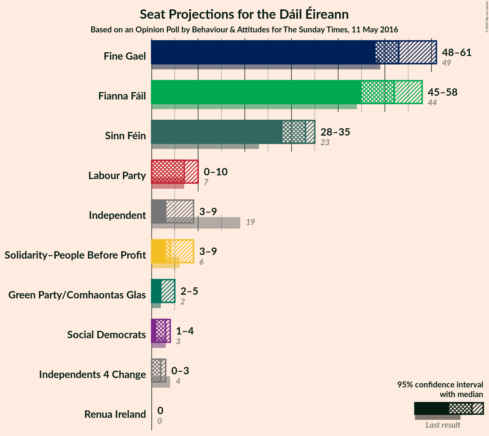
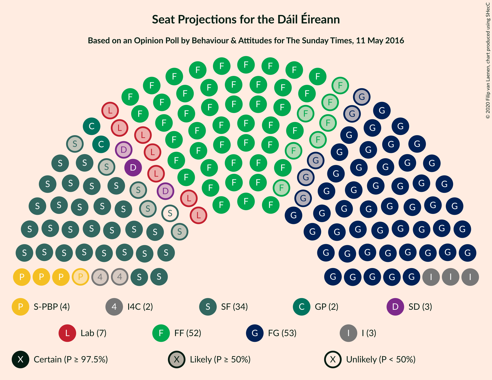
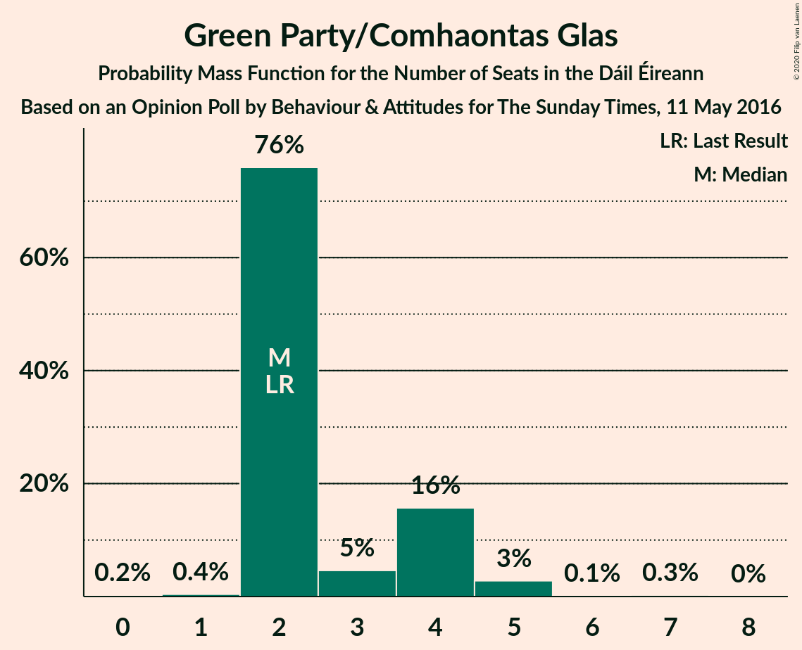
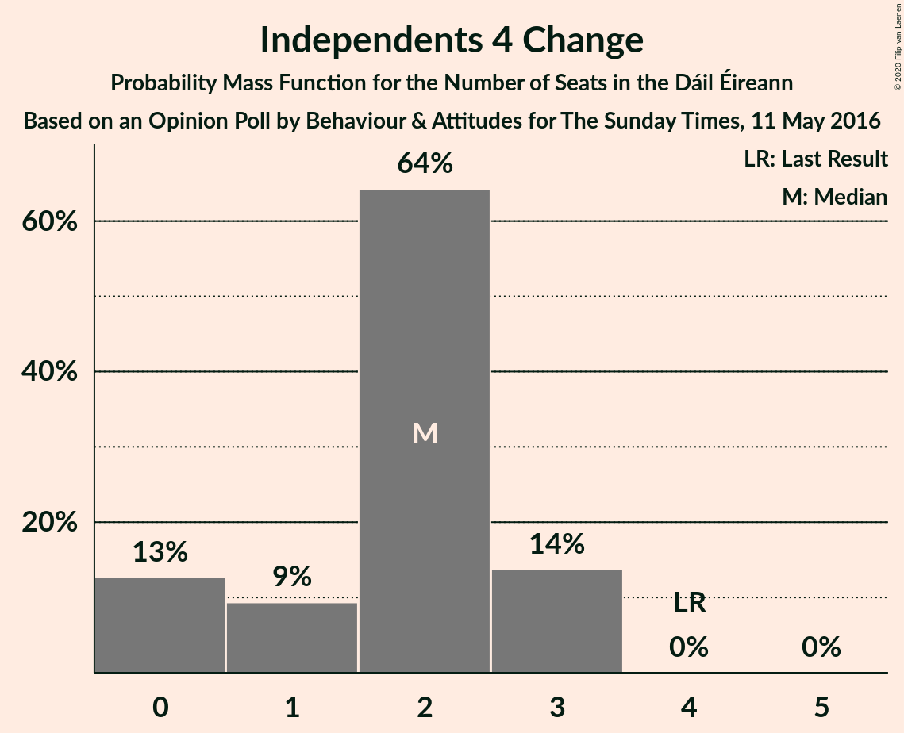
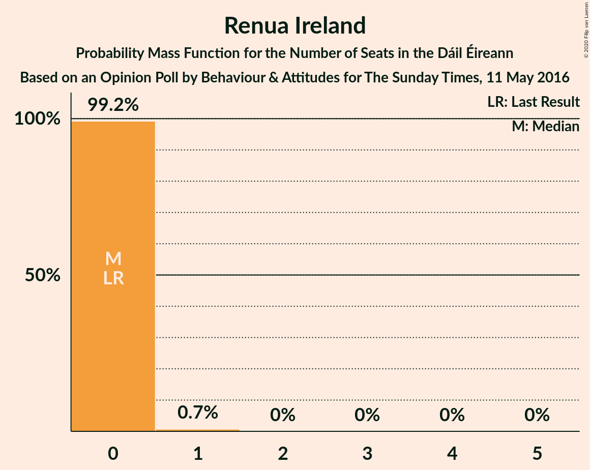
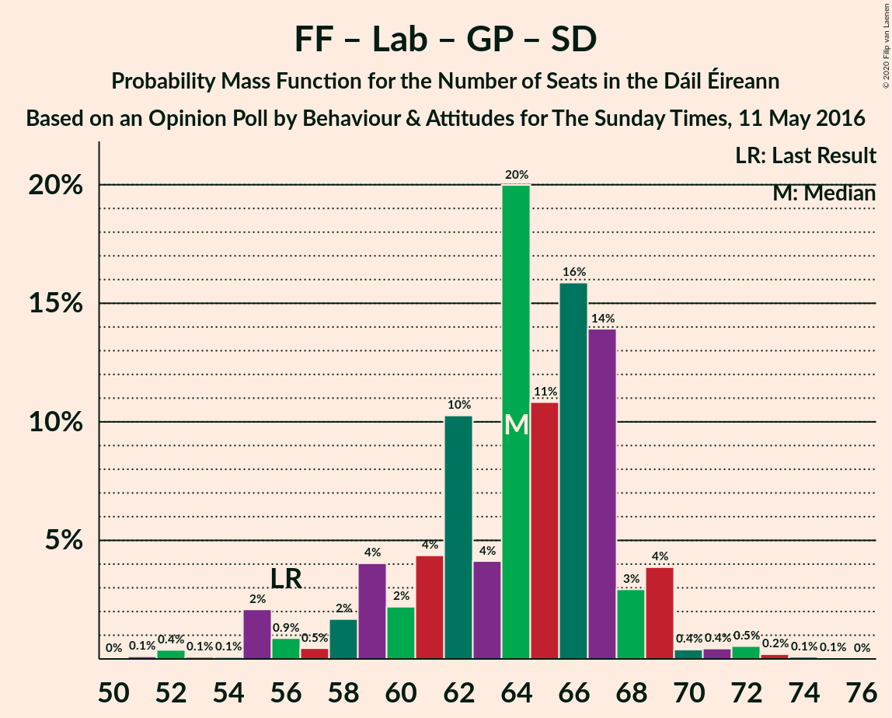
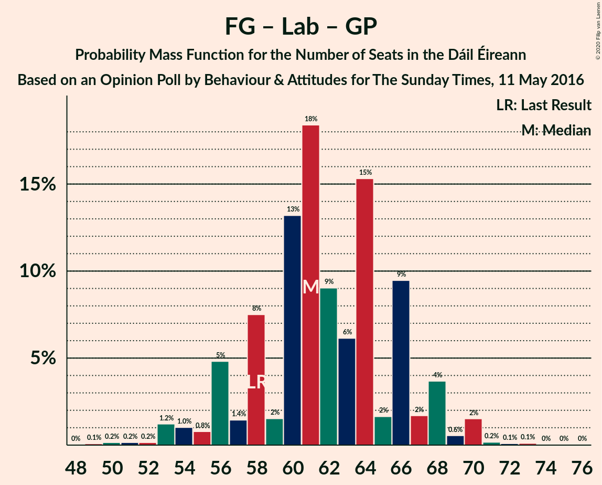

# Opinion Poll by Behaviour & Attitudes for The Sunday Times, 11 May 2016

<a href="#voting-intentions">Voting Intentions</a> | <a href="#seats">Seats</a> | <a href="#coalitions">Coalitions</a> | <a href="#technical-information">Technical Information</a>

## Voting Intentions

### Confidence Intervals

| Party | Last Result | Poll Result | 80% Confidence Interval | 90% Confidence Interval | 95% Confidence Interval | 99% Confidence Interval |
|:-----:|:-----------:|:-----------:|:-----------------------:|:-----------------------:|:-----------------------:|:-----------------------:|
| Fianna Fáil | 24.3% | 26.9% | 25.1–28.9% |24.6–29.5% |24.1–29.9% |23.3–30.9% |
| Fine Gael | 25.5% | 25.9% | 24.1–27.9% |23.6–28.4% |23.2–28.9% |22.3–29.9% |
| Sinn Féin | 13.8% | 15.9% | 14.4–17.6% |14.0–18.1% |13.7–18.5% |13.0–19.3% |
| Independent | 15.9% | 7.6% | 6.5–8.8% |6.3–9.2% |6.0–9.5% |5.5–10.1% |
| Labour Party | 6.6% | 5.0% | 4.2–6.1% |4.0–6.4% |3.8–6.6% |3.4–7.2% |
| Solidarity–People Before Profit | 3.9% | 4.0% | 3.3–5.0% |3.1–5.3% |2.9–5.5% |2.6–6.0% |
| Green Party/Comhaontas Glas | 2.7% | 4.0% | 3.3–5.0% |3.1–5.3% |2.9–5.5% |2.6–6.0% |
| Social Democrats | 3.0% | 2.0% | 1.5–2.7% |1.4–3.0% |1.3–3.2% |1.1–3.6% |
| Independents 4 Change | 1.5% | 1.0% | 0.7–1.6% |0.6–1.8% |0.5–1.9% |0.4–2.2% |
| Renua Ireland | 2.2% | 0.2% | 0.1–0.6% |0.1–0.7% |0.1–0.8% |0.0–1.0% |

*Note:* The poll result column reflects the actual value used in the calculations. Published results may vary slightly, and in addition be rounded to fewer digits.

## Seats

### Confidence Intervals

| Party | Last Result | Median | 80% Confidence Interval | 90% Confidence Interval | 95% Confidence Interval | 99% Confidence Interval |
|:-----:|:-----------:|:------:|:-----------------------:|:-----------------------:|:-----------------------:|:-----------------------:|
| <a href="#fianna-fáil">Fianna Fáil</a> | 44 | 54 | 52–57 |51–57 |49–57 |47–59 |
| <a href="#fine-gael">Fine Gael</a> | 49 | 50 | 48–53 |48–57 |48–58 |44–60 |
| <a href="#sinn-féin">Sinn Féin</a> | 23 | 33 | 29–35 |29–35 |28–35 |28–37 |
| <a href="#independent">Independent</a> | 19 | 4 | 3–4 |3–4 |3–4 |2–8 |
| <a href="#labour-party">Labour Party</a> | 7 | 4 | 1–5 |1–6 |1–8 |0–11 |
| <a href="#solidarity–people-before-profit">Solidarity–People Before Profit</a> | 6 | 8 | 5–8 |5–9 |4–9 |3–9 |
| <a href="#green-party/comhaontas-glas">Green Party/Comhaontas Glas</a> | 2 | 3 | 2–3 |2–3 |1–4 |1–5 |
| <a href="#social-democrats">Social Democrats</a> | 3 | 4 | 3–4 |3–4 |3–4 |2–4 |
| <a href="#independents-4-change">Independents 4 Change</a> | 4 | 2 | 0–4 |0–5 |0–5 |0–5 |
| <a href="#renua-ireland">Renua Ireland</a> | 0 | 0 | 0 |0 |0 |0 |

### Fianna Fáil

*For a full overview of the results for this party, see the [Fianna Fáil](party-fiannafáil.html) page.*

| Number of Seats | Probability | Accumulated | Special Marks |
|:---------------:|:-----------:|:-----------:|:-------------:|
| 44 | 0.1% | 100% | Last Result |
| 45 | 0.1% | 99.8% |  |
| 46 | 0.1% | 99.7% |  |
| 47 | 0.2% | 99.5% |  |
| 48 | 0.2% | 99.4% |  |
| 49 | 4% | 99.2% |  |
| 50 | 0.3% | 95% |  |
| 51 | 5% | 95% |  |
| 52 | 5% | 90% |  |
| 53 | 0.6% | 85% |  |
| 54 | 52% | 85% | Median |
| 55 | 5% | 33% |  |
| 56 | 8% | 27% |  |
| 57 | 17% | 20% |  |
| 58 | 0.3% | 2% |  |
| 59 | 2% | 2% |  |
| 60 | 0.2% | 0.2% |  |
| 61 | 0% | 0% |  |

### Fine Gael

*For a full overview of the results for this party, see the [Fine Gael](party-finegael.html) page.*

| Number of Seats | Probability | Accumulated | Special Marks |
|:---------------:|:-----------:|:-----------:|:-------------:|
| 42 | 0.1% | 100% |  |
| 43 | 0% | 99.8% |  |
| 44 | 0.5% | 99.8% |  |
| 45 | 0.7% | 99.3% |  |
| 46 | 0.3% | 98.7% |  |
| 47 | 0.7% | 98% |  |
| 48 | 44% | 98% |  |
| 49 | 0.5% | 53% | Last Result |
| 50 | 7% | 53% | Median |
| 51 | 8% | 45% |  |
| 52 | 5% | 37% |  |
| 53 | 23% | 32% |  |
| 54 | 0.7% | 10% |  |
| 55 | 2% | 9% |  |
| 56 | 0.3% | 7% |  |
| 57 | 2% | 7% |  |
| 58 | 3% | 5% |  |
| 59 | 0.2% | 1.4% |  |
| 60 | 1.0% | 1.2% |  |
| 61 | 0.1% | 0.2% |  |
| 62 | 0% | 0.1% |  |
| 63 | 0% | 0.1% |  |
| 64 | 0% | 0.1% |  |
| 65 | 0% | 0% |  |

### Sinn Féin

*For a full overview of the results for this party, see the [Sinn Féin](party-sinnféin.html) page.*

| Number of Seats | Probability | Accumulated | Special Marks |
|:---------------:|:-----------:|:-----------:|:-------------:|
| 23 | 0% | 100% | Last Result |
| 24 | 0% | 100% |  |
| 25 | 0% | 100% |  |
| 26 | 0.1% | 99.9% |  |
| 27 | 0.2% | 99.9% |  |
| 28 | 2% | 99.7% |  |
| 29 | 8% | 97% |  |
| 30 | 0.6% | 90% |  |
| 31 | 0.5% | 89% |  |
| 32 | 11% | 88% |  |
| 33 | 51% | 78% | Median |
| 34 | 11% | 26% |  |
| 35 | 14% | 15% |  |
| 36 | 0.9% | 2% |  |
| 37 | 0.3% | 0.7% |  |
| 38 | 0.4% | 0.5% |  |
| 39 | 0% | 0% |  |

### Independent

*For a full overview of the results for this party, see the [Independent](party-independent.html) page.*

| Number of Seats | Probability | Accumulated | Special Marks |
|:---------------:|:-----------:|:-----------:|:-------------:|
| 2 | 2% | 100% |  |
| 3 | 45% | 98% |  |
| 4 | 51% | 53% | Median |
| 5 | 1.4% | 2% |  |
| 6 | 0.1% | 0.8% |  |
| 7 | 0.1% | 0.7% |  |
| 8 | 0.2% | 0.6% |  |
| 9 | 0% | 0.5% |  |
| 10 | 0% | 0.5% |  |
| 11 | 0.5% | 0.5% |  |
| 12 | 0% | 0% |  |
| 13 | 0% | 0% |  |
| 14 | 0% | 0% |  |
| 15 | 0% | 0% |  |
| 16 | 0% | 0% |  |
| 17 | 0% | 0% |  |
| 18 | 0% | 0% |  |
| 19 | 0% | 0% | Last Result |

### Labour Party

*For a full overview of the results for this party, see the [Labour Party](party-labourparty.html) page.*

| Number of Seats | Probability | Accumulated | Special Marks |
|:---------------:|:-----------:|:-----------:|:-------------:|
| 0 | 2% | 100% |  |
| 1 | 22% | 98% |  |
| 2 | 6% | 76% |  |
| 3 | 2% | 70% |  |
| 4 | 51% | 69% | Median |
| 5 | 12% | 17% |  |
| 6 | 2% | 6% |  |
| 7 | 0.3% | 3% | Last Result |
| 8 | 0.8% | 3% |  |
| 9 | 1.0% | 2% |  |
| 10 | 0.3% | 1.0% |  |
| 11 | 0.4% | 0.6% |  |
| 12 | 0.2% | 0.3% |  |
| 13 | 0% | 0% |  |

### Solidarity–People Before Profit

*For a full overview of the results for this party, see the [Solidarity–People Before Profit](party-solidarity–peoplebeforeprofit.html) page.*

| Number of Seats | Probability | Accumulated | Special Marks |
|:---------------:|:-----------:|:-----------:|:-------------:|
| 2 | 0.1% | 100% |  |
| 3 | 0.7% | 99.9% |  |
| 4 | 2% | 99.2% |  |
| 5 | 20% | 97% |  |
| 6 | 12% | 77% | Last Result |
| 7 | 6% | 65% |  |
| 8 | 52% | 59% | Median |
| 9 | 7% | 7% |  |
| 10 | 0.4% | 0.4% |  |
| 11 | 0% | 0% |  |

### Green Party/Comhaontas Glas

*For a full overview of the results for this party, see the [Green Party/Comhaontas Glas](party-greenpartycomhaontasglas.html) page.*

| Number of Seats | Probability | Accumulated | Special Marks |
|:---------------:|:-----------:|:-----------:|:-------------:|
| 0 | 0.1% | 100% |  |
| 1 | 4% | 99.9% |  |
| 2 | 28% | 96% | Last Result |
| 3 | 64% | 68% | Median |
| 4 | 4% | 4% |  |
| 5 | 0.3% | 0.7% |  |
| 6 | 0.3% | 0.4% |  |
| 7 | 0% | 0.1% |  |
| 8 | 0% | 0% |  |

### Social Democrats

*For a full overview of the results for this party, see the [Social Democrats](party-socialdemocrats.html) page.*

| Number of Seats | Probability | Accumulated | Special Marks |
|:---------------:|:-----------:|:-----------:|:-------------:|
| 1 | 0.3% | 100% |  |
| 2 | 0.4% | 99.7% |  |
| 3 | 22% | 99.3% | Last Result |
| 4 | 77% | 77% | Median |
| 5 | 0.1% | 0.1% |  |
| 6 | 0% | 0% |  |

### Independents 4 Change

*For a full overview of the results for this party, see the [Independents 4 Change](party-independents4change.html) page.*

| Number of Seats | Probability | Accumulated | Special Marks |
|:---------------:|:-----------:|:-----------:|:-------------:|
| 0 | 23% | 100% |  |
| 1 | 13% | 77% |  |
| 2 | 52% | 64% | Median |
| 3 | 0.6% | 13% |  |
| 4 | 7% | 12% | Last Result |
| 5 | 5% | 5% |  |
| 6 | 0% | 0% |  |

### Renua Ireland

*For a full overview of the results for this party, see the [Renua Ireland](party-renuaireland.html) page.*

| Number of Seats | Probability | Accumulated | Special Marks |
|:---------------:|:-----------:|:-----------:|:-------------:|
| 0 | 100% | 100% | Last Result, Median |

## Coalitions

### Confidence Intervals

| Coalition | Last Result | Median | Majority? | 80% Confidence Interval | 90% Confidence Interval | 95% Confidence Interval | 99% Confidence Interval |
|:---------:|:-----------:|:------:|:---------:|:-----------------------:|:-----------------------:|:-----------------------:|:-----------------------:|
| Fianna Fáil – Fine Gael | 93 | 104 | 100% | 102–110 | 102–110 | 101–110 | 99–112 |
| Fianna Fáil – Sinn Féin | 67 | 87 | 98% | 84–92 | 83–92 | 81–92 | 80–93 |
| Fine Gael – Labour Party – Green Party/Comhaontas Glas – Social Democrats | 61 | 59 | 0% | 59–64 | 59–67 | 58–69 | 53–69 |
| Fianna Fáil – Labour Party – Green Party/Comhaontas Glas – Social Democrats | 56 | 65 | 0% | 60–67 | 58–67 | 56–68 | 56–73 |
| Fine Gael – Labour Party – Green Party/Comhaontas Glas | 58 | 55 | 0% | 55–61 | 55–63 | 54–66 | 49–66 |
| Fianna Fáil – Labour Party – Green Party/Comhaontas Glas | 53 | 61 | 0% | 57–64 | 54–64 | 52–64 | 52–70 |
| Fine Gael – Labour Party | 56 | 54 | 0% | 52–58 | 52–60 | 51–64 | 47–64 |
| Fianna Fáil – Labour Party | 51 | 58 | 0% | 55–61 | 52–61 | 50–62 | 49–67 |
| Fianna Fáil – Green Party/Comhaontas Glas | 46 | 57 | 0% | 55–59 | 53–59 | 51–61 | 50–63 |
| Fine Gael – Green Party/Comhaontas Glas | 51 | 53 | 0% | 51–56 | 51–59 | 50–60 | 46–62 |
| Fine Gael | 49 | 50 | 0% | 48–53 | 48–57 | 48–58 | 44–60 |

### Fianna Fáil – Fine Gael

| Number of Seats | Probability | Accumulated | Special Marks |
|:---------------:|:-----------:|:-----------:|:-------------:|
| 93 | 0% | 100% | Last Result |
| 94 | 0% | 100% |  |
| 95 | 0% | 100% |  |
| 96 | 0.2% | 100% |  |
| 97 | 0.1% | 99.8% |  |
| 98 | 0.1% | 99.7% |  |
| 99 | 0.6% | 99.5% |  |
| 100 | 0.3% | 98.9% |  |
| 101 | 2% | 98.6% |  |
| 102 | 45% | 97% |  |
| 103 | 0.7% | 52% |  |
| 104 | 5% | 51% | Median |
| 105 | 7% | 46% |  |
| 106 | 5% | 39% |  |
| 107 | 5% | 34% |  |
| 108 | 4% | 29% |  |
| 109 | 9% | 25% |  |
| 110 | 14% | 16% |  |
| 111 | 1.0% | 2% |  |
| 112 | 0.6% | 0.9% |  |
| 113 | 0.1% | 0.3% |  |
| 114 | 0.1% | 0.2% |  |
| 115 | 0% | 0% |  |

### Fianna Fáil – Sinn Féin

| Number of Seats | Probability | Accumulated | Special Marks |
|:---------------:|:-----------:|:-----------:|:-------------:|
| 67 | 0% | 100% | Last Result |
| 68 | 0% | 100% |  |
| 69 | 0% | 100% |  |
| 70 | 0% | 100% |  |
| 71 | 0% | 100% |  |
| 72 | 0% | 100% |  |
| 73 | 0% | 100% |  |
| 74 | 0% | 100% |  |
| 75 | 0% | 100% |  |
| 76 | 0.1% | 99.9% |  |
| 77 | 0% | 99.9% |  |
| 78 | 0.1% | 99.8% |  |
| 79 | 0.2% | 99.7% |  |
| 80 | 1.2% | 99.5% |  |
| 81 | 2% | 98% | Majority |
| 82 | 0.2% | 97% |  |
| 83 | 5% | 96% |  |
| 84 | 4% | 91% |  |
| 85 | 10% | 87% |  |
| 86 | 0.8% | 77% |  |
| 87 | 52% | 76% | Median |
| 88 | 1.1% | 24% |  |
| 89 | 7% | 23% |  |
| 90 | 0.3% | 16% |  |
| 91 | 1.0% | 16% |  |
| 92 | 13% | 15% |  |
| 93 | 2% | 2% |  |
| 94 | 0.1% | 0.2% |  |
| 95 | 0% | 0% |  |

### Fine Gael – Labour Party – Green Party/Comhaontas Glas – Social Democrats

| Number of Seats | Probability | Accumulated | Special Marks |
|:---------------:|:-----------:|:-----------:|:-------------:|
| 51 | 0.1% | 100% |  |
| 52 | 0.4% | 99.9% |  |
| 53 | 0.1% | 99.5% |  |
| 54 | 0.1% | 99.4% |  |
| 55 | 0.4% | 99.3% |  |
| 56 | 0.2% | 98.9% |  |
| 57 | 0.8% | 98.7% |  |
| 58 | 2% | 98% |  |
| 59 | 49% | 96% |  |
| 60 | 18% | 47% |  |
| 61 | 4% | 29% | Last Result, Median |
| 62 | 9% | 25% |  |
| 63 | 1.0% | 16% |  |
| 64 | 8% | 15% |  |
| 65 | 0.7% | 7% |  |
| 66 | 1.0% | 6% |  |
| 67 | 2% | 5% |  |
| 68 | 0.4% | 3% |  |
| 69 | 3% | 3% |  |
| 70 | 0% | 0.3% |  |
| 71 | 0.1% | 0.2% |  |
| 72 | 0% | 0.1% |  |
| 73 | 0% | 0.1% |  |
| 74 | 0.1% | 0.1% |  |
| 75 | 0% | 0% |  |

### Fianna Fáil – Labour Party – Green Party/Comhaontas Glas – Social Democrats

| Number of Seats | Probability | Accumulated | Special Marks |
|:---------------:|:-----------:|:-----------:|:-------------:|
| 51 | 0.1% | 100% |  |
| 52 | 0% | 99.9% |  |
| 53 | 0% | 99.9% |  |
| 54 | 0% | 99.9% |  |
| 55 | 0.3% | 99.9% |  |
| 56 | 2% | 99.5% | Last Result |
| 57 | 1.1% | 97% |  |
| 58 | 1.5% | 96% |  |
| 59 | 0.2% | 95% |  |
| 60 | 5% | 94% |  |
| 61 | 4% | 90% |  |
| 62 | 3% | 86% |  |
| 63 | 2% | 83% |  |
| 64 | 14% | 81% |  |
| 65 | 52% | 67% | Median |
| 66 | 2% | 15% |  |
| 67 | 9% | 13% |  |
| 68 | 3% | 4% |  |
| 69 | 0.2% | 1.0% |  |
| 70 | 0.1% | 0.8% |  |
| 71 | 0.1% | 0.7% |  |
| 72 | 0.1% | 0.6% |  |
| 73 | 0.5% | 0.6% |  |
| 74 | 0% | 0% |  |

### Fine Gael – Labour Party – Green Party/Comhaontas Glas

| Number of Seats | Probability | Accumulated | Special Marks |
|:---------------:|:-----------:|:-----------:|:-------------:|
| 47 | 0.1% | 100% |  |
| 48 | 0% | 99.9% |  |
| 49 | 0.4% | 99.9% |  |
| 50 | 0% | 99.5% |  |
| 51 | 0.1% | 99.4% |  |
| 52 | 0.4% | 99.3% |  |
| 53 | 0.2% | 98.9% |  |
| 54 | 1.4% | 98.7% |  |
| 55 | 50% | 97% |  |
| 56 | 14% | 48% |  |
| 57 | 8% | 34% | Median |
| 58 | 9% | 27% | Last Result |
| 59 | 2% | 17% |  |
| 60 | 3% | 16% |  |
| 61 | 6% | 13% |  |
| 62 | 1.3% | 7% |  |
| 63 | 2% | 6% |  |
| 64 | 0.5% | 4% |  |
| 65 | 0.2% | 3% |  |
| 66 | 3% | 3% |  |
| 67 | 0.1% | 0.3% |  |
| 68 | 0.2% | 0.3% |  |
| 69 | 0% | 0.1% |  |
| 70 | 0% | 0.1% |  |
| 71 | 0.1% | 0.1% |  |
| 72 | 0.1% | 0.1% |  |
| 73 | 0% | 0% |  |

### Fianna Fáil – Labour Party – Green Party/Comhaontas Glas

| Number of Seats | Probability | Accumulated | Special Marks |
|:---------------:|:-----------:|:-----------:|:-------------:|
| 48 | 0.1% | 100% |  |
| 49 | 0% | 99.9% |  |
| 50 | 0% | 99.9% |  |
| 51 | 0.2% | 99.9% |  |
| 52 | 2% | 99.7% |  |
| 53 | 1.2% | 97% | Last Result |
| 54 | 1.5% | 96% |  |
| 55 | 0.2% | 95% |  |
| 56 | 0.1% | 95% |  |
| 57 | 8% | 94% |  |
| 58 | 1.3% | 86% |  |
| 59 | 2% | 85% |  |
| 60 | 15% | 83% |  |
| 61 | 52% | 68% | Median |
| 62 | 2% | 16% |  |
| 63 | 2% | 15% |  |
| 64 | 11% | 13% |  |
| 65 | 0.9% | 2% |  |
| 66 | 0.1% | 0.9% |  |
| 67 | 0.1% | 0.8% |  |
| 68 | 0.1% | 0.7% |  |
| 69 | 0.1% | 0.6% |  |
| 70 | 0.5% | 0.6% |  |
| 71 | 0% | 0% |  |

### Fine Gael – Labour Party

| Number of Seats | Probability | Accumulated | Special Marks |
|:---------------:|:-----------:|:-----------:|:-------------:|
| 45 | 0.2% | 100% |  |
| 46 | 0.1% | 99.8% |  |
| 47 | 0.2% | 99.7% |  |
| 48 | 0.1% | 99.5% |  |
| 49 | 0.1% | 99.4% |  |
| 50 | 0.4% | 99.3% |  |
| 51 | 1.4% | 98.8% |  |
| 52 | 45% | 97% |  |
| 53 | 1.2% | 52% |  |
| 54 | 21% | 51% | Median |
| 55 | 13% | 29% |  |
| 56 | 0.8% | 16% | Last Result |
| 57 | 0.4% | 15% |  |
| 58 | 8% | 15% |  |
| 59 | 0.4% | 7% |  |
| 60 | 1.2% | 6% |  |
| 61 | 2% | 5% |  |
| 62 | 0.1% | 3% |  |
| 63 | 0.2% | 3% |  |
| 64 | 3% | 3% |  |
| 65 | 0% | 0.4% |  |
| 66 | 0.2% | 0.3% |  |
| 67 | 0% | 0.1% |  |
| 68 | 0% | 0.1% |  |
| 69 | 0.1% | 0.1% |  |
| 70 | 0.1% | 0.1% |  |
| 71 | 0% | 0% |  |

### Fianna Fáil – Labour Party

| Number of Seats | Probability | Accumulated | Special Marks |
|:---------------:|:-----------:|:-----------:|:-------------:|
| 47 | 0.2% | 100% |  |
| 48 | 0.1% | 99.7% |  |
| 49 | 0.1% | 99.6% |  |
| 50 | 2% | 99.5% |  |
| 51 | 1.2% | 97% | Last Result |
| 52 | 2% | 96% |  |
| 53 | 0.1% | 95% |  |
| 54 | 4% | 95% |  |
| 55 | 0.6% | 90% |  |
| 56 | 6% | 90% |  |
| 57 | 2% | 84% |  |
| 58 | 65% | 81% | Median |
| 59 | 1.4% | 16% |  |
| 60 | 2% | 15% |  |
| 61 | 9% | 13% |  |
| 62 | 2% | 4% |  |
| 63 | 0.5% | 1.4% |  |
| 64 | 0.1% | 0.9% |  |
| 65 | 0.2% | 0.8% |  |
| 66 | 0% | 0.6% |  |
| 67 | 0.2% | 0.6% |  |
| 68 | 0.4% | 0.4% |  |
| 69 | 0% | 0% |  |

### Fianna Fáil – Green Party/Comhaontas Glas

| Number of Seats | Probability | Accumulated | Special Marks |
|:---------------:|:-----------:|:-----------:|:-------------:|
| 46 | 0% | 100% | Last Result |
| 47 | 0.1% | 99.9% |  |
| 48 | 0.1% | 99.9% |  |
| 49 | 0.2% | 99.7% |  |
| 50 | 0.2% | 99.5% |  |
| 51 | 4% | 99.3% |  |
| 52 | 0.2% | 95% |  |
| 53 | 3% | 95% |  |
| 54 | 1.2% | 92% |  |
| 55 | 6% | 91% |  |
| 56 | 4% | 85% |  |
| 57 | 54% | 81% | Median |
| 58 | 0.6% | 28% |  |
| 59 | 24% | 27% |  |
| 60 | 0.4% | 3% |  |
| 61 | 1.2% | 3% |  |
| 62 | 0.3% | 2% |  |
| 63 | 1.3% | 1.3% |  |
| 64 | 0% | 0.1% |  |
| 65 | 0% | 0% |  |

### Fine Gael – Green Party/Comhaontas Glas

| Number of Seats | Probability | Accumulated | Special Marks |
|:---------------:|:-----------:|:-----------:|:-------------:|
| 45 | 0.1% | 100% |  |
| 46 | 0.4% | 99.8% |  |
| 47 | 0.4% | 99.5% |  |
| 48 | 0.4% | 99.1% |  |
| 49 | 0.7% | 98.7% |  |
| 50 | 0.9% | 98% |  |
| 51 | 44% | 97% | Last Result |
| 52 | 3% | 53% |  |
| 53 | 3% | 50% | Median |
| 54 | 14% | 47% |  |
| 55 | 18% | 34% |  |
| 56 | 7% | 16% |  |
| 57 | 1.1% | 9% |  |
| 58 | 0.1% | 8% |  |
| 59 | 3% | 8% |  |
| 60 | 3% | 5% |  |
| 61 | 0.1% | 2% |  |
| 62 | 1.1% | 1.4% |  |
| 63 | 0.1% | 0.3% |  |
| 64 | 0% | 0.2% |  |
| 65 | 0% | 0.1% |  |
| 66 | 0.1% | 0.1% |  |
| 67 | 0% | 0% |  |

### Fine Gael

| Number of Seats | Probability | Accumulated | Special Marks |
|:---------------:|:-----------:|:-----------:|:-------------:|
| 42 | 0.1% | 100% |  |
| 43 | 0% | 99.8% |  |
| 44 | 0.5% | 99.8% |  |
| 45 | 0.7% | 99.3% |  |
| 46 | 0.3% | 98.7% |  |
| 47 | 0.7% | 98% |  |
| 48 | 44% | 98% |  |
| 49 | 0.5% | 53% | Last Result |
| 50 | 7% | 53% | Median |
| 51 | 8% | 45% |  |
| 52 | 5% | 37% |  |
| 53 | 23% | 32% |  |
| 54 | 0.7% | 10% |  |
| 55 | 2% | 9% |  |
| 56 | 0.3% | 7% |  |
| 57 | 2% | 7% |  |
| 58 | 3% | 5% |  |
| 59 | 0.2% | 1.4% |  |
| 60 | 1.0% | 1.2% |  |
| 61 | 0.1% | 0.2% |  |
| 62 | 0% | 0.1% |  |
| 63 | 0% | 0.1% |  |
| 64 | 0% | 0.1% |  |
| 65 | 0% | 0% |  |

## Technical Information

### Opinion Poll

+ **Polling firm:** Behaviour & Attitudes
+ **Commissioner(s):** The Sunday Times
+ **Fieldwork period:** 11 May 2016

### Calculations

+ **Sample size:** 898
+ **Simulations done:** 131,072
+ **Error estimate:** 1.72%

