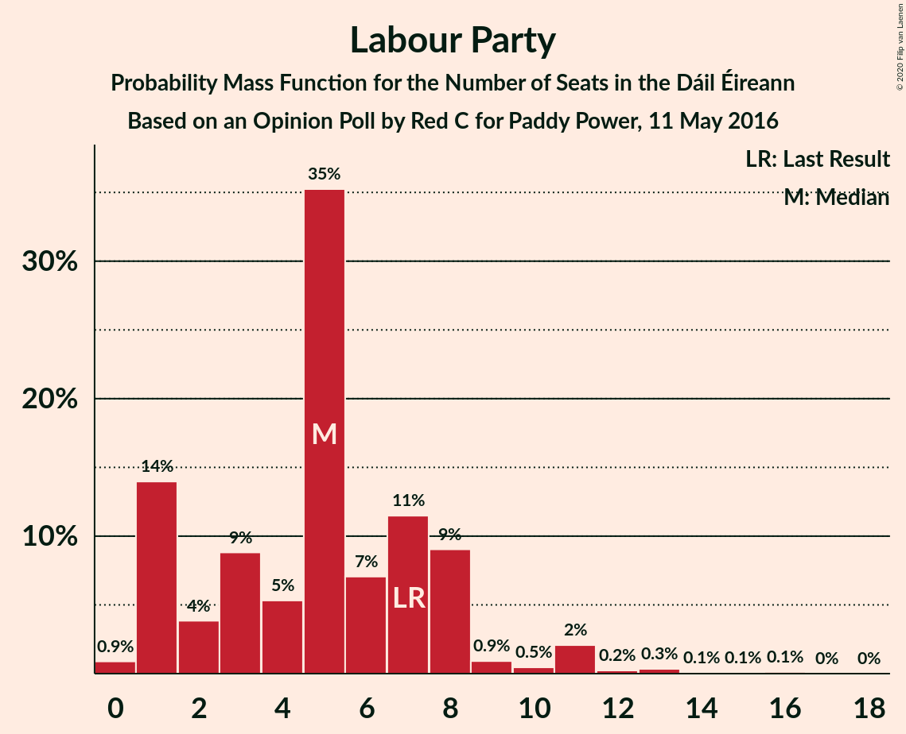
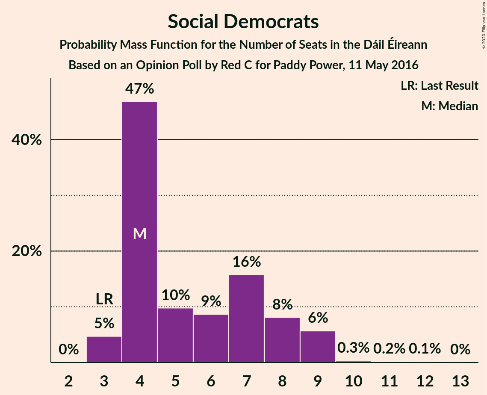
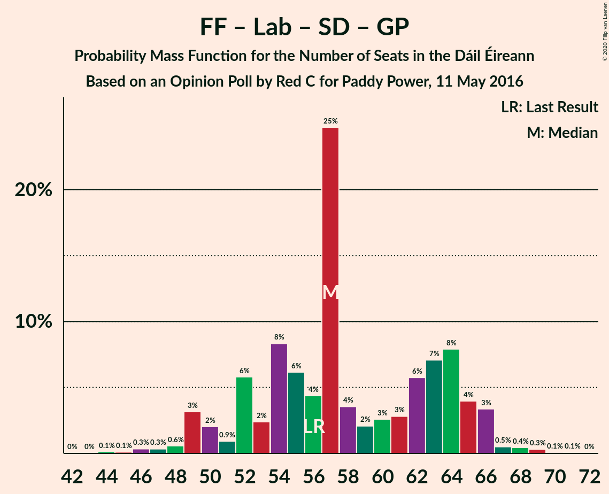
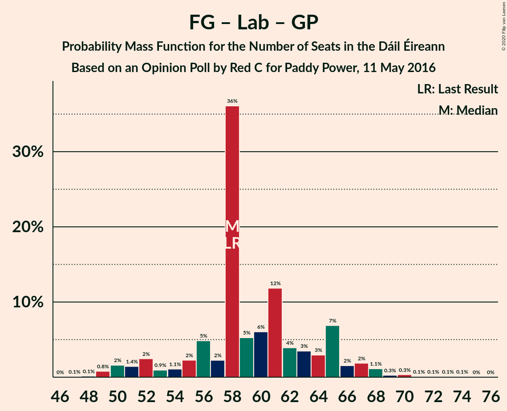
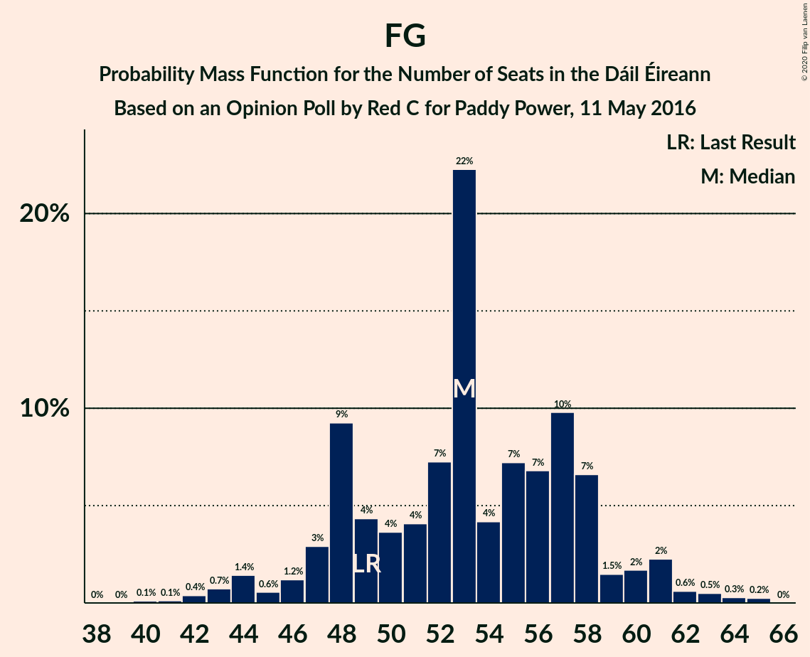

# Opinion Poll by Red C for Paddy Power, 11 May 2016

<a href="#voting-intentions">Voting Intentions</a> | <a href="#seats">Seats</a> | <a href="#coalitions">Coalitions</a> | <a href="#technical-information">Technical Information</a>

## Voting Intentions

### Confidence Intervals

| Party | Last Result | Poll Result | 80% Confidence Interval | 90% Confidence Interval | 95% Confidence Interval | 99% Confidence Interval |
|:-----:|:-----------:|:-----------:|:-----------------------:|:-----------------------:|:-----------------------:|:-----------------------:|
| Fine Gael | 25.5% | 27.0% | 25.3–28.8% |24.8–29.4% |24.4–29.8% |23.5–30.7% |
| Fianna Fáil | 24.3% | 25.0% | 23.3–26.8% |22.9–27.3% |22.5–27.8% |21.7–28.7% |
| Sinn Féin | 13.8% | 16.0% | 14.6–17.5% |14.2–18.0% |13.8–18.4% |13.2–19.1% |
| Independent | 15.9% | 8.5% | 7.4–9.7% |7.1–10.0% |6.9–10.3% |6.4–11.0% |
| Solidarity–People Before Profit | 3.9% | 6.0% | 5.2–7.1% |4.9–7.4% |4.7–7.7% |4.3–8.2% |
| Labour Party | 6.6% | 5.0% | 4.2–6.0% |4.0–6.3% |3.8–6.6% |3.5–7.1% |
| Social Democrats | 3.0% | 4.0% | 3.3–5.0% |3.2–5.2% |3.0–5.4% |2.7–5.9% |
| Green Party/Comhaontas Glas | 2.7% | 3.0% | 2.4–3.8% |2.2–4.0% |2.1–4.2% |1.8–4.6% |
| Independents 4 Change | 1.5% | 1.1% | 0.8–1.6% |0.7–1.8% |0.6–1.9% |0.5–2.2% |
| Renua Ireland | 2.2% | 1.0% | 0.7–1.5% |0.6–1.7% |0.5–1.8% |0.4–2.1% |

*Note:* The poll result column reflects the actual value used in the calculations. Published results may vary slightly, and in addition be rounded to fewer digits.

## Seats

### Confidence Intervals

| Party | Last Result | Median | 80% Confidence Interval | 90% Confidence Interval | 95% Confidence Interval | 99% Confidence Interval |
|:-----:|:-----------:|:------:|:-----------------------:|:-----------------------:|:-----------------------:|:-----------------------:|
| <a href="#fine-gael">Fine Gael</a> | 49 | 51 | 49–56 |48–60 |48–60 |45–62 |
| <a href="#fianna-fáil">Fianna Fáil</a> | 44 | 54 | 47–56 |43–57 |40–59 |40–59 |
| <a href="#sinn-féin">Sinn Féin</a> | 23 | 34 | 28–34 |28–34 |27–34 |25–36 |
| <a href="#independent">Independent</a> | 19 | 3 | 3–5 |3–5 |3–8 |3–8 |
| <a href="#solidarity–people-before-profit">Solidarity–People Before Profit</a> | 6 | 9 | 9–10 |9–10 |8–10 |5–10 |
| <a href="#labour-party">Labour Party</a> | 7 | 3 | 1–4 |1–5 |1–7 |0–8 |
| <a href="#social-democrats">Social Democrats</a> | 3 | 5 | 4–7 |4–7 |4–7 |3–8 |
| <a href="#green-party/comhaontas-glas">Green Party/Comhaontas Glas</a> | 2 | 2 | 0–2 |0–2 |0–2 |0–3 |
| <a href="#independents-4-change">Independents 4 Change</a> | 4 | 1 | 0–4 |0–5 |0–5 |0–5 |
| <a href="#renua-ireland">Renua Ireland</a> | 0 | 0 | 0 |0 |0 |0 |

### Fine Gael

*For a full overview of the results for this party, see the [Fine Gael](party-finegael.html) page.*

| Number of Seats | Probability | Accumulated | Special Marks |
|:---------------:|:-----------:|:-----------:|:-------------:|
| 42 | 0.1% | 100% |  |
| 43 | 0.1% | 99.9% |  |
| 44 | 0.1% | 99.9% |  |
| 45 | 1.1% | 99.8% |  |
| 46 | 0.3% | 98.7% |  |
| 47 | 0.5% | 98% |  |
| 48 | 3% | 98% |  |
| 49 | 37% | 95% | Last Result |
| 50 | 6% | 58% |  |
| 51 | 11% | 52% | Median |
| 52 | 15% | 41% |  |
| 53 | 1.4% | 27% |  |
| 54 | 6% | 25% |  |
| 55 | 3% | 19% |  |
| 56 | 7% | 17% |  |
| 57 | 0.5% | 10% |  |
| 58 | 1.4% | 9% |  |
| 59 | 2% | 8% |  |
| 60 | 4% | 6% |  |
| 61 | 0.1% | 2% |  |
| 62 | 1.2% | 1.5% |  |
| 63 | 0.1% | 0.3% |  |
| 64 | 0.1% | 0.2% |  |
| 65 | 0.1% | 0.1% |  |
| 66 | 0% | 0% |  |

### Fianna Fáil

*For a full overview of the results for this party, see the [Fianna Fáil](party-fiannafáil.html) page.*

| Number of Seats | Probability | Accumulated | Special Marks |
|:---------------:|:-----------:|:-----------:|:-------------:|
| 38 | 0% | 100% |  |
| 39 | 0.1% | 99.9% |  |
| 40 | 3% | 99.9% |  |
| 41 | 0.1% | 97% |  |
| 42 | 0.9% | 96% |  |
| 43 | 1.0% | 95% |  |
| 44 | 0.9% | 94% | Last Result |
| 45 | 2% | 94% |  |
| 46 | 0.9% | 91% |  |
| 47 | 5% | 90% |  |
| 48 | 4% | 86% |  |
| 49 | 15% | 81% |  |
| 50 | 1.1% | 66% |  |
| 51 | 1.5% | 65% |  |
| 52 | 3% | 64% |  |
| 53 | 0.6% | 61% |  |
| 54 | 45% | 60% | Median |
| 55 | 1.3% | 16% |  |
| 56 | 9% | 14% |  |
| 57 | 2% | 5% |  |
| 58 | 0.9% | 4% |  |
| 59 | 3% | 3% |  |
| 60 | 0% | 0% |  |

### Sinn Féin

*For a full overview of the results for this party, see the [Sinn Féin](party-sinnféin.html) page.*

| Number of Seats | Probability | Accumulated | Special Marks |
|:---------------:|:-----------:|:-----------:|:-------------:|
| 19 | 0% | 100% |  |
| 20 | 0% | 99.9% |  |
| 21 | 0% | 99.9% |  |
| 22 | 0% | 99.9% |  |
| 23 | 0.1% | 99.9% | Last Result |
| 24 | 0.1% | 99.9% |  |
| 25 | 0.5% | 99.8% |  |
| 26 | 2% | 99.3% |  |
| 27 | 0.8% | 98% |  |
| 28 | 9% | 97% |  |
| 29 | 3% | 88% |  |
| 30 | 7% | 85% |  |
| 31 | 1.0% | 78% |  |
| 32 | 15% | 76% |  |
| 33 | 6% | 61% |  |
| 34 | 53% | 55% | Median |
| 35 | 0.1% | 2% |  |
| 36 | 1.1% | 2% |  |
| 37 | 0.4% | 0.4% |  |
| 38 | 0% | 0% |  |

### Independent

*For a full overview of the results for this party, see the [Independent](party-independent.html) page.*

| Number of Seats | Probability | Accumulated | Special Marks |
|:---------------:|:-----------:|:-----------:|:-------------:|
| 3 | 76% | 100% | Median |
| 4 | 9% | 24% |  |
| 5 | 11% | 15% |  |
| 6 | 2% | 5% |  |
| 7 | 0.4% | 3% |  |
| 8 | 2% | 3% |  |
| 9 | 0.1% | 0.3% |  |
| 10 | 0.1% | 0.2% |  |
| 11 | 0.1% | 0.1% |  |
| 12 | 0% | 0% |  |
| 13 | 0% | 0% |  |
| 14 | 0% | 0% |  |
| 15 | 0% | 0% |  |
| 16 | 0% | 0% |  |
| 17 | 0% | 0% |  |
| 18 | 0% | 0% |  |
| 19 | 0% | 0% | Last Result |

### Solidarity–People Before Profit

*For a full overview of the results for this party, see the [Solidarity–People Before Profit](party-solidarity–peoplebeforeprofit.html) page.*

| Number of Seats | Probability | Accumulated | Special Marks |
|:---------------:|:-----------:|:-----------:|:-------------:|
| 4 | 0.2% | 100% |  |
| 5 | 0.5% | 99.8% |  |
| 6 | 0.1% | 99.3% | Last Result |
| 7 | 0.5% | 99.2% |  |
| 8 | 4% | 98.7% |  |
| 9 | 57% | 95% | Median |
| 10 | 38% | 38% |  |
| 11 | 0.1% | 0.1% |  |
| 12 | 0% | 0% |  |

### Labour Party

*For a full overview of the results for this party, see the [Labour Party](party-labourparty.html) page.*

| Number of Seats | Probability | Accumulated | Special Marks |
|:---------------:|:-----------:|:-----------:|:-------------:|
| 0 | 2% | 100% |  |
| 1 | 18% | 98% |  |
| 2 | 8% | 80% |  |
| 3 | 45% | 72% | Median |
| 4 | 22% | 27% |  |
| 5 | 1.0% | 5% |  |
| 6 | 1.5% | 4% |  |
| 7 | 2% | 3% | Last Result |
| 8 | 0.6% | 0.8% |  |
| 9 | 0% | 0.3% |  |
| 10 | 0.1% | 0.2% |  |
| 11 | 0.1% | 0.2% |  |
| 12 | 0% | 0.1% |  |
| 13 | 0% | 0.1% |  |
| 14 | 0% | 0.1% |  |
| 15 | 0% | 0.1% |  |
| 16 | 0% | 0% |  |

### Social Democrats

*For a full overview of the results for this party, see the [Social Democrats](party-socialdemocrats.html) page.*

| Number of Seats | Probability | Accumulated | Special Marks |
|:---------------:|:-----------:|:-----------:|:-------------:|
| 3 | 0.5% | 100% | Last Result |
| 4 | 28% | 99.5% |  |
| 5 | 40% | 72% | Median |
| 6 | 12% | 31% |  |
| 7 | 19% | 20% |  |
| 8 | 0.6% | 0.9% |  |
| 9 | 0% | 0.2% |  |
| 10 | 0% | 0.2% |  |
| 11 | 0.2% | 0.2% |  |
| 12 | 0% | 0% |  |

### Green Party/Comhaontas Glas

*For a full overview of the results for this party, see the [Green Party/Comhaontas Glas](party-greenpartycomhaontasglas.html) page.*

| Number of Seats | Probability | Accumulated | Special Marks |
|:---------------:|:-----------:|:-----------:|:-------------:|
| 0 | 16% | 100% |  |
| 1 | 9% | 84% |  |
| 2 | 75% | 76% | Last Result, Median |
| 3 | 0.5% | 0.6% |  |
| 4 | 0.1% | 0.1% |  |
| 5 | 0% | 0% |  |

### Independents 4 Change

*For a full overview of the results for this party, see the [Independents 4 Change](party-independents4change.html) page.*

| Number of Seats | Probability | Accumulated | Special Marks |
|:---------------:|:-----------:|:-----------:|:-------------:|
| 0 | 18% | 100% |  |
| 1 | 51% | 82% | Median |
| 2 | 8% | 32% |  |
| 3 | 12% | 24% |  |
| 4 | 6% | 12% | Last Result |
| 5 | 6% | 6% |  |
| 6 | 0% | 0% |  |

### Renua Ireland

*For a full overview of the results for this party, see the [Renua Ireland](party-renuaireland.html) page.*

| Number of Seats | Probability | Accumulated | Special Marks |
|:---------------:|:-----------:|:-----------:|:-------------:|
| 0 | 99.7% | 100% | Last Result, Median |
| 1 | 0.1% | 0.3% |  |
| 2 | 0.2% | 0.2% |  |
| 3 | 0% | 0% |  |

## Coalitions

### Confidence Intervals

| Coalition | Last Result | Median | Majority? | 80% Confidence Interval | 90% Confidence Interval | 95% Confidence Interval | 99% Confidence Interval |
|:---------:|:-----------:|:------:|:---------:|:-----------------------:|:-----------------------:|:-----------------------:|:-----------------------:|
| Fine Gael – Fianna Fáil | 93 | 103 | 100% | 99–108 | 99–108 | 99–111 | 96–113 |
| Fianna Fáil – Sinn Féin | 67 | 84 | 83% | 79–88 | 75–88 | 74–91 | 73–91 |
| Fine Gael – Labour Party – Social Democrats – Green Party/Comhaontas Glas | 61 | 61 | 0% | 59–66 | 57–69 | 56–70 | 52–72 |
| Fianna Fáil – Labour Party – Social Democrats – Green Party/Comhaontas Glas | 56 | 64 | 0% | 54–67 | 51–67 | 49–67 | 49–67 |
| Fine Gael – Labour Party – Green Party/Comhaontas Glas | 58 | 56 | 0% | 53–61 | 52–65 | 52–65 | 47–67 |
| Fine Gael – Labour Party | 56 | 54 | 0% | 51–60 | 50–63 | 50–64 | 46–66 |
| Fianna Fáil – Labour Party – Green Party/Comhaontas Glas | 53 | 59 | 0% | 50–60 | 46–62 | 45–63 | 45–63 |
| Fine Gael – Green Party/Comhaontas Glas | 51 | 52 | 0% | 51–58 | 50–62 | 50–62 | 46–63 |
| Fianna Fáil – Labour Party | 51 | 57 | 0% | 48–60 | 46–60 | 43–61 | 43–61 |
| Fianna Fáil – Green Party/Comhaontas Glas | 46 | 56 | 0% | 48–56 | 44–58 | 42–61 | 42–61 |
| Fine Gael | 49 | 51 | 0% | 49–56 | 48–60 | 48–60 | 45–62 |

### Fine Gael – Fianna Fáil

| Number of Seats | Probability | Accumulated | Special Marks |
|:---------------:|:-----------:|:-----------:|:-------------:|
| 93 | 0.1% | 100% | Last Result |
| 94 | 0.1% | 99.9% |  |
| 95 | 0.1% | 99.8% |  |
| 96 | 1.0% | 99.7% |  |
| 97 | 0.4% | 98.6% |  |
| 98 | 0.6% | 98% |  |
| 99 | 8% | 98% |  |
| 100 | 8% | 90% |  |
| 101 | 3% | 82% |  |
| 102 | 4% | 78% |  |
| 103 | 41% | 74% |  |
| 104 | 4% | 34% |  |
| 105 | 8% | 29% | Median |
| 106 | 2% | 21% |  |
| 107 | 4% | 19% |  |
| 108 | 11% | 15% |  |
| 109 | 1.1% | 4% |  |
| 110 | 0.2% | 3% |  |
| 111 | 1.0% | 3% |  |
| 112 | 0% | 2% |  |
| 113 | 2% | 2% |  |
| 114 | 0% | 0.1% |  |
| 115 | 0% | 0% |  |

### Fianna Fáil – Sinn Féin

| Number of Seats | Probability | Accumulated | Special Marks |
|:---------------:|:-----------:|:-----------:|:-------------:|
| 67 | 0% | 100% | Last Result |
| 68 | 0% | 100% |  |
| 69 | 0% | 100% |  |
| 70 | 0% | 99.9% |  |
| 71 | 0.1% | 99.9% |  |
| 72 | 0.1% | 99.8% |  |
| 73 | 0.2% | 99.7% |  |
| 74 | 3% | 99.5% |  |
| 75 | 2% | 96% |  |
| 76 | 2% | 95% |  |
| 77 | 0.4% | 93% |  |
| 78 | 1.5% | 92% |  |
| 79 | 6% | 91% |  |
| 80 | 2% | 85% |  |
| 81 | 9% | 83% | Majority |
| 82 | 1.2% | 73% |  |
| 83 | 10% | 72% |  |
| 84 | 17% | 62% |  |
| 85 | 1.1% | 45% |  |
| 86 | 1.1% | 44% |  |
| 87 | 2% | 43% |  |
| 88 | 37% | 40% | Median |
| 89 | 0.1% | 3% |  |
| 90 | 0.1% | 3% |  |
| 91 | 3% | 3% |  |
| 92 | 0% | 0.1% |  |
| 93 | 0% | 0% |  |

### Fine Gael – Labour Party – Social Democrats – Green Party/Comhaontas Glas

| Number of Seats | Probability | Accumulated | Special Marks |
|:---------------:|:-----------:|:-----------:|:-------------:|
| 51 | 0.4% | 100% |  |
| 52 | 0.1% | 99.6% |  |
| 53 | 0% | 99.5% |  |
| 54 | 0.7% | 99.4% |  |
| 55 | 0.8% | 98.8% |  |
| 56 | 3% | 98% |  |
| 57 | 0.6% | 95% |  |
| 58 | 2% | 95% |  |
| 59 | 41% | 93% |  |
| 60 | 1.3% | 52% |  |
| 61 | 4% | 50% | Last Result, Median |
| 62 | 3% | 46% |  |
| 63 | 20% | 43% |  |
| 64 | 11% | 23% |  |
| 65 | 0.6% | 11% |  |
| 66 | 1.5% | 11% |  |
| 67 | 1.3% | 9% |  |
| 68 | 2% | 8% |  |
| 69 | 3% | 6% |  |
| 70 | 2% | 3% |  |
| 71 | 0.2% | 1.1% |  |
| 72 | 0.7% | 0.9% |  |
| 73 | 0% | 0.2% |  |
| 74 | 0% | 0.2% |  |
| 75 | 0% | 0.1% |  |
| 76 | 0.1% | 0.1% |  |
| 77 | 0% | 0% |  |

### Fianna Fáil – Labour Party – Social Democrats – Green Party/Comhaontas Glas

| Number of Seats | Probability | Accumulated | Special Marks |
|:---------------:|:-----------:|:-----------:|:-------------:|
| 47 | 0% | 100% |  |
| 48 | 0.2% | 99.9% |  |
| 49 | 3% | 99.7% |  |
| 50 | 1.2% | 96% |  |
| 51 | 0.2% | 95% |  |
| 52 | 2% | 95% |  |
| 53 | 0.6% | 92% |  |
| 54 | 4% | 92% |  |
| 55 | 0.5% | 87% |  |
| 56 | 4% | 87% | Last Result |
| 57 | 2% | 83% |  |
| 58 | 9% | 81% |  |
| 59 | 0.8% | 72% |  |
| 60 | 2% | 72% |  |
| 61 | 5% | 69% |  |
| 62 | 4% | 64% |  |
| 63 | 2% | 61% |  |
| 64 | 37% | 58% | Median |
| 65 | 0.7% | 21% |  |
| 66 | 8% | 20% |  |
| 67 | 12% | 12% |  |
| 68 | 0.2% | 0.5% |  |
| 69 | 0.1% | 0.3% |  |
| 70 | 0.1% | 0.2% |  |
| 71 | 0% | 0.2% |  |
| 72 | 0.1% | 0.1% |  |
| 73 | 0% | 0% |  |

### Fine Gael – Labour Party – Green Party/Comhaontas Glas

| Number of Seats | Probability | Accumulated | Special Marks |
|:---------------:|:-----------:|:-----------:|:-------------:|
| 47 | 0.5% | 100% |  |
| 48 | 0.6% | 99.4% |  |
| 49 | 0.3% | 98.8% |  |
| 50 | 0.1% | 98.5% |  |
| 51 | 0.7% | 98% |  |
| 52 | 3% | 98% |  |
| 53 | 6% | 95% |  |
| 54 | 37% | 89% |  |
| 55 | 0.6% | 52% |  |
| 56 | 17% | 51% | Median |
| 57 | 7% | 34% |  |
| 58 | 8% | 27% | Last Result |
| 59 | 7% | 19% |  |
| 60 | 2% | 12% |  |
| 61 | 0.5% | 10% |  |
| 62 | 0.8% | 10% |  |
| 63 | 1.4% | 9% |  |
| 64 | 2% | 7% |  |
| 65 | 3% | 6% |  |
| 66 | 2% | 2% |  |
| 67 | 0.6% | 0.7% |  |
| 68 | 0% | 0.2% |  |
| 69 | 0% | 0.1% |  |
| 70 | 0% | 0.1% |  |
| 71 | 0.1% | 0.1% |  |
| 72 | 0% | 0% |  |

### Fine Gael – Labour Party

| Number of Seats | Probability | Accumulated | Special Marks |
|:---------------:|:-----------:|:-----------:|:-------------:|
| 45 | 0.5% | 100% |  |
| 46 | 0.1% | 99.5% |  |
| 47 | 0.8% | 99.5% |  |
| 48 | 0.1% | 98.7% |  |
| 49 | 0.2% | 98.6% |  |
| 50 | 4% | 98% |  |
| 51 | 6% | 95% |  |
| 52 | 37% | 89% |  |
| 53 | 0.8% | 52% |  |
| 54 | 6% | 51% | Median |
| 55 | 5% | 45% |  |
| 56 | 17% | 40% | Last Result |
| 57 | 7% | 23% |  |
| 58 | 4% | 16% |  |
| 59 | 2% | 12% |  |
| 60 | 1.0% | 10% |  |
| 61 | 0.8% | 9% |  |
| 62 | 0.3% | 8% |  |
| 63 | 5% | 8% |  |
| 64 | 2% | 3% |  |
| 65 | 0.2% | 0.8% |  |
| 66 | 0.4% | 0.6% |  |
| 67 | 0% | 0.2% |  |
| 68 | 0% | 0.1% |  |
| 69 | 0% | 0.1% |  |
| 70 | 0.1% | 0.1% |  |
| 71 | 0% | 0% |  |

### Fianna Fáil – Labour Party – Green Party/Comhaontas Glas

| Number of Seats | Probability | Accumulated | Special Marks |
|:---------------:|:-----------:|:-----------:|:-------------:|
| 42 | 0% | 100% |  |
| 43 | 0.2% | 99.9% |  |
| 44 | 0.2% | 99.7% |  |
| 45 | 4% | 99.6% |  |
| 46 | 2% | 96% |  |
| 47 | 0.1% | 94% |  |
| 48 | 2% | 94% |  |
| 49 | 0.7% | 92% |  |
| 50 | 5% | 91% |  |
| 51 | 0.7% | 87% |  |
| 52 | 12% | 86% |  |
| 53 | 1.1% | 74% | Last Result |
| 54 | 1.4% | 73% |  |
| 55 | 7% | 71% |  |
| 56 | 2% | 64% |  |
| 57 | 2% | 62% |  |
| 58 | 0.5% | 60% |  |
| 59 | 43% | 60% | Median |
| 60 | 11% | 17% |  |
| 61 | 0.9% | 6% |  |
| 62 | 2% | 5% |  |
| 63 | 3% | 3% |  |
| 64 | 0.2% | 0.3% |  |
| 65 | 0% | 0.1% |  |
| 66 | 0% | 0% |  |

### Fine Gael – Green Party/Comhaontas Glas

| Number of Seats | Probability | Accumulated | Special Marks |
|:---------------:|:-----------:|:-----------:|:-------------:|
| 44 | 0.1% | 100% |  |
| 45 | 0.1% | 99.9% |  |
| 46 | 0.7% | 99.8% |  |
| 47 | 0.6% | 99.2% |  |
| 48 | 0.3% | 98.5% |  |
| 49 | 0.6% | 98% |  |
| 50 | 4% | 98% |  |
| 51 | 36% | 94% | Last Result |
| 52 | 15% | 58% |  |
| 53 | 13% | 43% | Median |
| 54 | 8% | 30% |  |
| 55 | 2% | 22% |  |
| 56 | 1.3% | 20% |  |
| 57 | 3% | 19% |  |
| 58 | 6% | 15% |  |
| 59 | 0.5% | 9% |  |
| 60 | 2% | 8% |  |
| 61 | 0.3% | 6% |  |
| 62 | 5% | 6% |  |
| 63 | 0.5% | 1.0% |  |
| 64 | 0.2% | 0.5% |  |
| 65 | 0.1% | 0.3% |  |
| 66 | 0.1% | 0.1% |  |
| 67 | 0% | 0% |  |

### Fianna Fáil – Labour Party

| Number of Seats | Probability | Accumulated | Special Marks |
|:---------------:|:-----------:|:-----------:|:-------------:|
| 41 | 0.2% | 100% |  |
| 42 | 0.2% | 99.8% |  |
| 43 | 4% | 99.6% |  |
| 44 | 0.6% | 96% |  |
| 45 | 0.2% | 95% |  |
| 46 | 2% | 95% |  |
| 47 | 2% | 94% |  |
| 48 | 4% | 92% |  |
| 49 | 0.8% | 87% |  |
| 50 | 9% | 86% |  |
| 51 | 0.4% | 77% | Last Result |
| 52 | 4% | 76% |  |
| 53 | 7% | 72% |  |
| 54 | 2% | 65% |  |
| 55 | 2% | 63% |  |
| 56 | 0.9% | 61% |  |
| 57 | 42% | 60% | Median |
| 58 | 3% | 19% |  |
| 59 | 1.2% | 16% |  |
| 60 | 11% | 15% |  |
| 61 | 4% | 4% |  |
| 62 | 0.4% | 0.4% |  |
| 63 | 0% | 0.1% |  |
| 64 | 0% | 0.1% |  |
| 65 | 0% | 0% |  |

### Fianna Fáil – Green Party/Comhaontas Glas

| Number of Seats | Probability | Accumulated | Special Marks |
|:---------------:|:-----------:|:-----------:|:-------------:|
| 39 | 0% | 100% |  |
| 40 | 0.1% | 99.9% |  |
| 41 | 0.1% | 99.9% |  |
| 42 | 3% | 99.8% |  |
| 43 | 0.1% | 96% |  |
| 44 | 1.3% | 96% |  |
| 45 | 2% | 95% |  |
| 46 | 2% | 93% | Last Result |
| 47 | 0.4% | 91% |  |
| 48 | 4% | 91% |  |
| 49 | 5% | 87% |  |
| 50 | 1.3% | 82% |  |
| 51 | 15% | 81% |  |
| 52 | 2% | 66% |  |
| 53 | 2% | 64% |  |
| 54 | 1.2% | 61% |  |
| 55 | 2% | 60% |  |
| 56 | 52% | 58% | Median |
| 57 | 1.3% | 7% |  |
| 58 | 1.5% | 5% |  |
| 59 | 1.0% | 4% |  |
| 60 | 0.2% | 3% |  |
| 61 | 3% | 3% |  |
| 62 | 0% | 0% |  |

### Fine Gael

| Number of Seats | Probability | Accumulated | Special Marks |
|:---------------:|:-----------:|:-----------:|:-------------:|
| 42 | 0.1% | 100% |  |
| 43 | 0.1% | 99.9% |  |
| 44 | 0.1% | 99.9% |  |
| 45 | 1.1% | 99.8% |  |
| 46 | 0.3% | 98.7% |  |
| 47 | 0.5% | 98% |  |
| 48 | 3% | 98% |  |
| 49 | 37% | 95% | Last Result |
| 50 | 6% | 58% |  |
| 51 | 11% | 52% | Median |
| 52 | 15% | 41% |  |
| 53 | 1.4% | 27% |  |
| 54 | 6% | 25% |  |
| 55 | 3% | 19% |  |
| 56 | 7% | 17% |  |
| 57 | 0.5% | 10% |  |
| 58 | 1.4% | 9% |  |
| 59 | 2% | 8% |  |
| 60 | 4% | 6% |  |
| 61 | 0.1% | 2% |  |
| 62 | 1.2% | 1.5% |  |
| 63 | 0.1% | 0.3% |  |
| 64 | 0.1% | 0.2% |  |
| 65 | 0.1% | 0.1% |  |
| 66 | 0% | 0% |  |

## Technical Information

### Opinion Poll

+ **Polling firm:** Red C
+ **Commissioner(s):** Paddy Power
+ **Fieldwork period:** 11 May 2016

### Calculations

+ **Sample size:** 1015
+ **Simulations done:** 131,072
+ **Error estimate:** 1.83%

