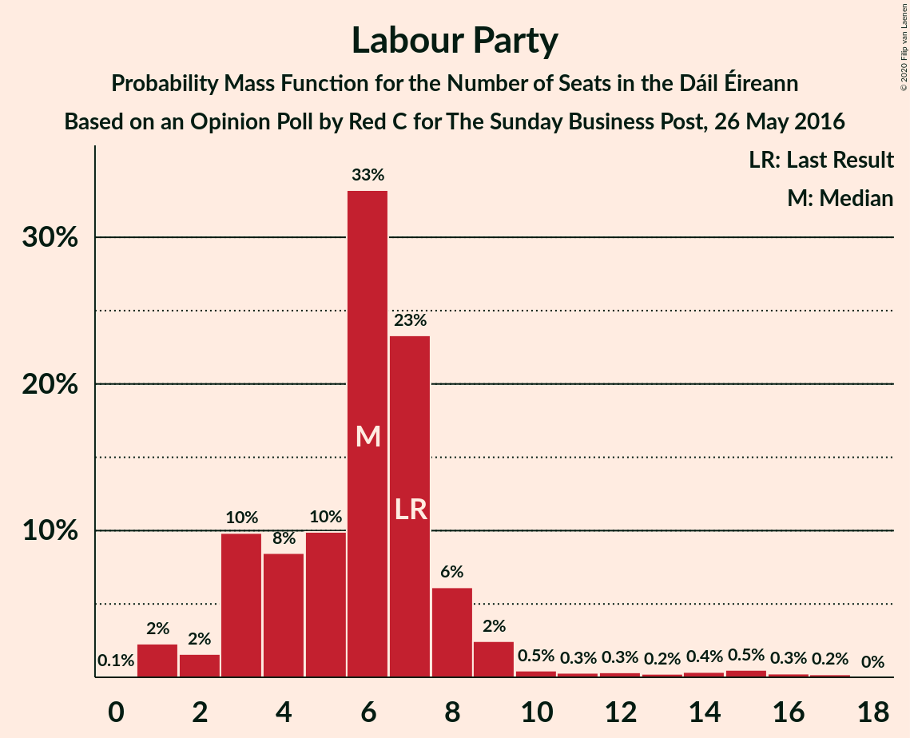
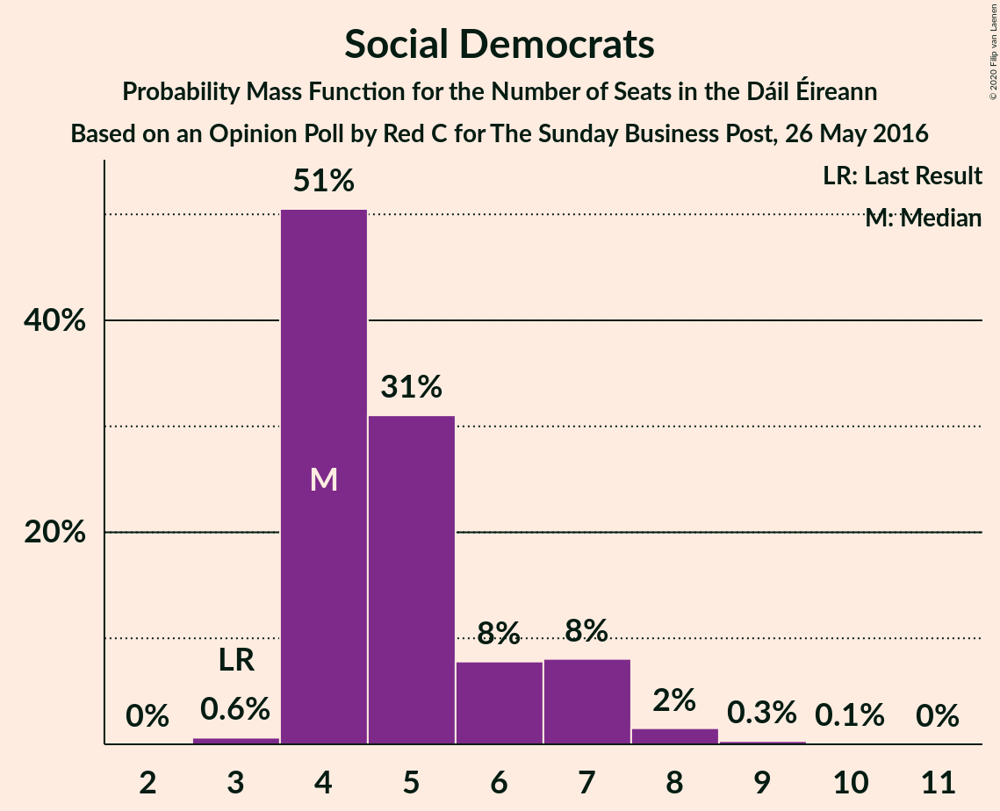
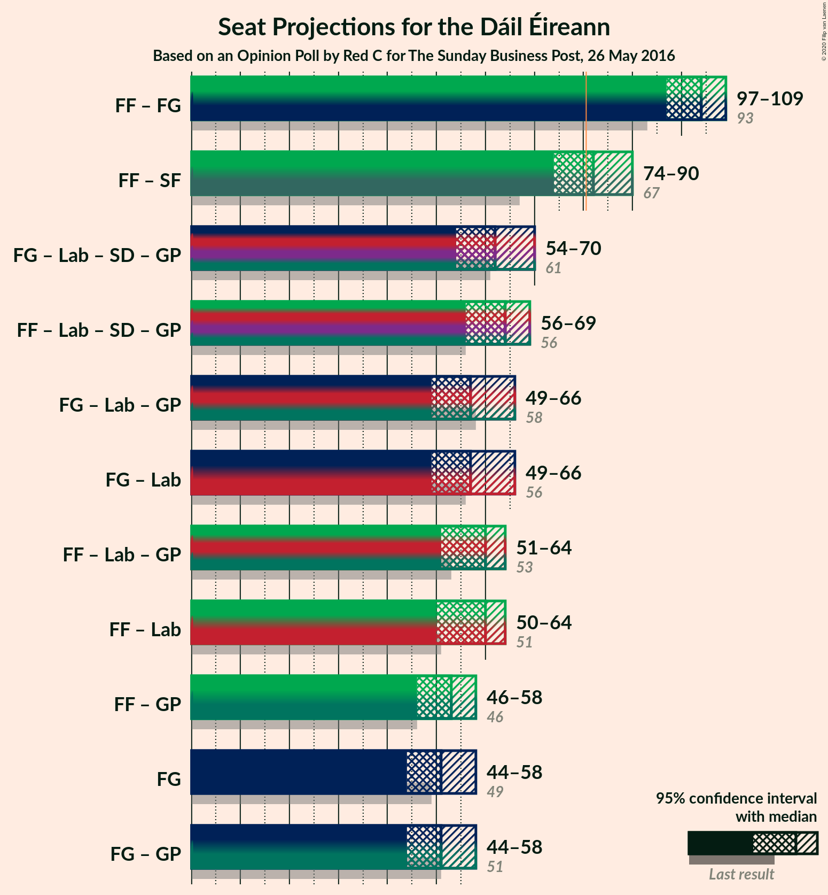
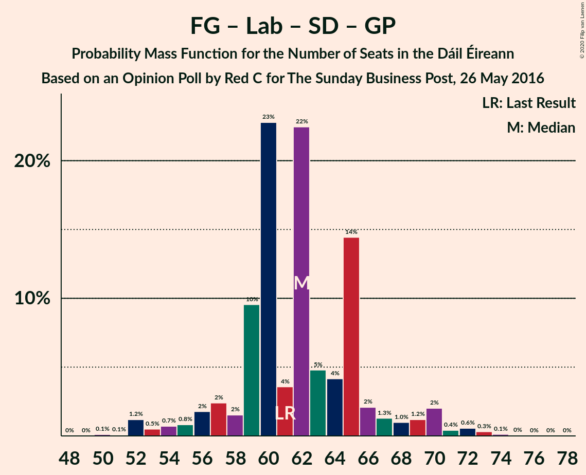
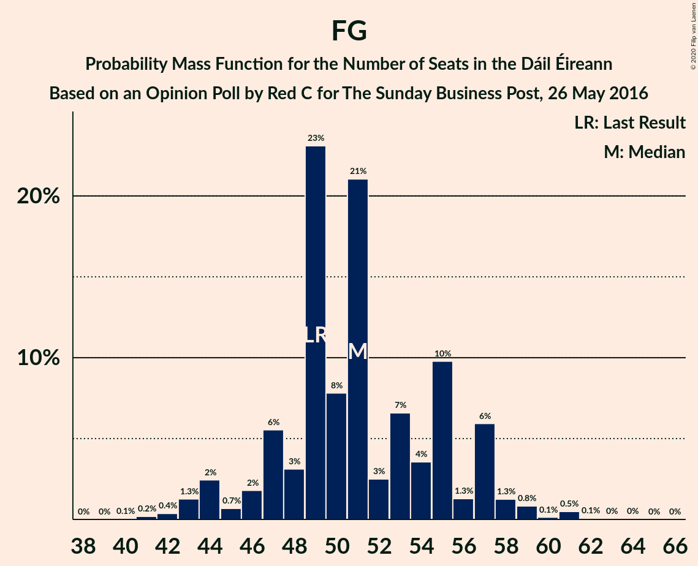

# Opinion Poll by Red C for The Sunday Business Post, 26 May 2016

<a href="#voting-intentions">Voting Intentions</a> | <a href="#seats">Seats</a> | <a href="#coalitions">Coalitions</a> | <a href="#technical-information">Technical Information</a>

## Voting Intentions

### Confidence Intervals

| Party | Last Result | Poll Result | 80% Confidence Interval | 90% Confidence Interval | 95% Confidence Interval | 99% Confidence Interval |
|:-----:|:-----------:|:-----------:|:-----------------------:|:-----------------------:|:-----------------------:|:-----------------------:|
| Fine Gael | 25.5% | 26.2% | 24.5–28.0% |24.0–28.6% |23.6–29.0% |22.8–29.9% |
| Fianna Fáil | 24.3% | 26.2% | 24.5–28.0% |24.0–28.6% |23.6–29.0% |22.8–29.9% |
| Sinn Féin | 13.8% | 15.1% | 13.8–16.7% |13.4–17.1% |13.0–17.5% |12.4–18.3% |
| Independent | 15.9% | 9.4% | 8.3–10.7% |8.0–11.0% |7.7–11.3% |7.2–12.0% |
| Labour Party | 6.6% | 6.1% | 5.2–7.2% |5.0–7.5% |4.8–7.7% |4.4–8.3% |
| Solidarity–People Before Profit | 3.9% | 5.1% | 4.3–6.1% |4.1–6.4% |3.9–6.6% |3.5–7.1% |
| Social Democrats | 3.0% | 4.0% | 3.3–4.9% |3.1–5.2% |2.9–5.4% |2.6–5.9% |
| Green Party/Comhaontas Glas | 2.7% | 2.0% | 1.5–2.7% |1.4–2.9% |1.3–3.1% |1.1–3.4% |
| Independents 4 Change | 1.5% | 1.2% | 0.9–1.8% |0.8–1.9% |0.7–2.1% |0.5–2.4% |
| Renua Ireland | 2.2% | 0.3% | 0.2–0.7% |0.1–0.8% |0.1–0.9% |0.1–1.1% |

*Note:* The poll result column reflects the actual value used in the calculations. Published results may vary slightly, and in addition be rounded to fewer digits.

## Seats

### Confidence Intervals

| Party | Last Result | Median | 80% Confidence Interval | 90% Confidence Interval | 95% Confidence Interval | 99% Confidence Interval |
|:-----:|:-----------:|:------:|:-----------------------:|:-----------------------:|:-----------------------:|:-----------------------:|
| <a href="#fine-gael">Fine Gael</a> | 49 | 51 | 47–56 |45–57 |44–58 |42–61 |
| <a href="#fianna-fáil">Fianna Fáil</a> | 44 | 53 | 49–56 |47–57 |46–57 |43–58 |
| <a href="#sinn-féin">Sinn Féin</a> | 23 | 29 | 26–34 |25–34 |23–34 |22–36 |
| <a href="#independent">Independent</a> | 19 | 5 | 3–9 |3–9 |3–10 |3–12 |
| <a href="#labour-party">Labour Party</a> | 7 | 6 | 3–8 |3–9 |2–10 |1–15 |
| <a href="#solidarity–people-before-profit">Solidarity–People Before Profit</a> | 6 | 9 | 6–10 |5–10 |5–10 |4–10 |
| <a href="#social-democrats">Social Democrats</a> | 3 | 4 | 4–7 |4–7 |4–7 |3–8 |
| <a href="#green-party/comhaontas-glas">Green Party/Comhaontas Glas</a> | 2 | 0 | 0–1 |0–1 |0–1 |0–2 |
| <a href="#independents-4-change">Independents 4 Change</a> | 4 | 2 | 0–4 |0–5 |0–5 |0–5 |
| <a href="#renua-ireland">Renua Ireland</a> | 0 | 0 | 0 |0 |0 |0 |

### Fine Gael

*For a full overview of the results for this party, see the [Fine Gael](party-finegael.html) page.*

| Number of Seats | Probability | Accumulated | Special Marks |
|:---------------:|:-----------:|:-----------:|:-------------:|
| 40 | 0.1% | 100% |  |
| 41 | 0.2% | 99.9% |  |
| 42 | 0.4% | 99.7% |  |
| 43 | 1.3% | 99.4% |  |
| 44 | 2% | 98% |  |
| 45 | 0.7% | 96% |  |
| 46 | 2% | 95% |  |
| 47 | 6% | 93% |  |
| 48 | 3% | 88% |  |
| 49 | 23% | 85% | Last Result |
| 50 | 8% | 61% |  |
| 51 | 21% | 54% | Median |
| 52 | 3% | 33% |  |
| 53 | 7% | 30% |  |
| 54 | 4% | 23% |  |
| 55 | 10% | 20% |  |
| 56 | 1.3% | 10% |  |
| 57 | 6% | 9% |  |
| 58 | 1.3% | 3% |  |
| 59 | 0.8% | 2% |  |
| 60 | 0.1% | 0.8% |  |
| 61 | 0.5% | 0.7% |  |
| 62 | 0.1% | 0.2% |  |
| 63 | 0% | 0.1% |  |
| 64 | 0% | 0.1% |  |
| 65 | 0% | 0% |  |

### Fianna Fáil

*For a full overview of the results for this party, see the [Fianna Fáil](party-fiannafáil.html) page.*

| Number of Seats | Probability | Accumulated | Special Marks |
|:---------------:|:-----------:|:-----------:|:-------------:|
| 40 | 0.2% | 100% |  |
| 41 | 0.1% | 99.8% |  |
| 42 | 0.2% | 99.7% |  |
| 43 | 0.2% | 99.6% |  |
| 44 | 0.3% | 99.4% | Last Result |
| 45 | 1.4% | 99.1% |  |
| 46 | 2% | 98% |  |
| 47 | 1.2% | 96% |  |
| 48 | 3% | 95% |  |
| 49 | 15% | 92% |  |
| 50 | 1.4% | 77% |  |
| 51 | 6% | 75% |  |
| 52 | 8% | 70% |  |
| 53 | 23% | 62% | Median |
| 54 | 23% | 38% |  |
| 55 | 4% | 15% |  |
| 56 | 4% | 11% |  |
| 57 | 5% | 7% |  |
| 58 | 1.4% | 2% |  |
| 59 | 0.3% | 0.3% |  |
| 60 | 0% | 0% |  |

### Sinn Féin

*For a full overview of the results for this party, see the [Sinn Féin](party-sinnféin.html) page.*

| Number of Seats | Probability | Accumulated | Special Marks |
|:---------------:|:-----------:|:-----------:|:-------------:|
| 18 | 0% | 100% |  |
| 19 | 0.1% | 99.9% |  |
| 20 | 0.1% | 99.9% |  |
| 21 | 0.2% | 99.8% |  |
| 22 | 0.2% | 99.5% |  |
| 23 | 2% | 99.4% | Last Result |
| 24 | 2% | 97% |  |
| 25 | 1.1% | 96% |  |
| 26 | 21% | 95% |  |
| 27 | 2% | 74% |  |
| 28 | 3% | 72% |  |
| 29 | 28% | 69% | Median |
| 30 | 5% | 41% |  |
| 31 | 13% | 37% |  |
| 32 | 5% | 23% |  |
| 33 | 8% | 19% |  |
| 34 | 10% | 11% |  |
| 35 | 0.2% | 0.8% |  |
| 36 | 0.6% | 0.7% |  |
| 37 | 0.1% | 0.1% |  |
| 38 | 0% | 0% |  |

### Independent

*For a full overview of the results for this party, see the [Independent](party-independent.html) page.*

| Number of Seats | Probability | Accumulated | Special Marks |
|:---------------:|:-----------:|:-----------:|:-------------:|
| 3 | 13% | 100% |  |
| 4 | 13% | 87% |  |
| 5 | 39% | 74% | Median |
| 6 | 8% | 36% |  |
| 7 | 4% | 28% |  |
| 8 | 2% | 24% |  |
| 9 | 19% | 22% |  |
| 10 | 0.8% | 3% |  |
| 11 | 0.6% | 2% |  |
| 12 | 1.2% | 2% |  |
| 13 | 0.3% | 0.5% |  |
| 14 | 0.2% | 0.2% |  |
| 15 | 0% | 0% |  |
| 16 | 0% | 0% |  |
| 17 | 0% | 0% |  |
| 18 | 0% | 0% |  |
| 19 | 0% | 0% | Last Result |

### Labour Party

*For a full overview of the results for this party, see the [Labour Party](party-labourparty.html) page.*

| Number of Seats | Probability | Accumulated | Special Marks |
|:---------------:|:-----------:|:-----------:|:-------------:|
| 0 | 0.1% | 100% |  |
| 1 | 2% | 99.9% |  |
| 2 | 2% | 98% |  |
| 3 | 10% | 96% |  |
| 4 | 8% | 86% |  |
| 5 | 10% | 78% |  |
| 6 | 33% | 68% | Median |
| 7 | 23% | 35% | Last Result |
| 8 | 6% | 11% |  |
| 9 | 2% | 5% |  |
| 10 | 0.5% | 3% |  |
| 11 | 0.3% | 2% |  |
| 12 | 0.3% | 2% |  |
| 13 | 0.2% | 2% |  |
| 14 | 0.4% | 1.3% |  |
| 15 | 0.5% | 1.0% |  |
| 16 | 0.3% | 0.5% |  |
| 17 | 0.2% | 0.2% |  |
| 18 | 0% | 0% |  |

### Solidarity–People Before Profit

*For a full overview of the results for this party, see the [Solidarity–People Before Profit](party-solidarity–peoplebeforeprofit.html) page.*

| Number of Seats | Probability | Accumulated | Special Marks |
|:---------------:|:-----------:|:-----------:|:-------------:|
| 3 | 0.3% | 100% |  |
| 4 | 0.5% | 99.7% |  |
| 5 | 8% | 99.2% |  |
| 6 | 2% | 91% | Last Result |
| 7 | 6% | 89% |  |
| 8 | 7% | 83% |  |
| 9 | 45% | 75% | Median |
| 10 | 31% | 31% |  |
| 11 | 0% | 0% |  |

### Social Democrats

*For a full overview of the results for this party, see the [Social Democrats](party-socialdemocrats.html) page.*

| Number of Seats | Probability | Accumulated | Special Marks |
|:---------------:|:-----------:|:-----------:|:-------------:|
| 3 | 0.6% | 100% | Last Result |
| 4 | 51% | 99.4% | Median |
| 5 | 31% | 49% |  |
| 6 | 8% | 18% |  |
| 7 | 8% | 10% |  |
| 8 | 2% | 2% |  |
| 9 | 0.3% | 0.4% |  |
| 10 | 0.1% | 0.1% |  |
| 11 | 0% | 0% |  |

### Green Party/Comhaontas Glas

*For a full overview of the results for this party, see the [Green Party/Comhaontas Glas](party-greenpartycomhaontasglas.html) page.*

| Number of Seats | Probability | Accumulated | Special Marks |
|:---------------:|:-----------:|:-----------:|:-------------:|
| 0 | 87% | 100% | Median |
| 1 | 11% | 13% |  |
| 2 | 2% | 2% | Last Result |
| 3 | 0% | 0% |  |

### Independents 4 Change

*For a full overview of the results for this party, see the [Independents 4 Change](party-independents4change.html) page.*

| Number of Seats | Probability | Accumulated | Special Marks |
|:---------------:|:-----------:|:-----------:|:-------------:|
| 0 | 13% | 100% |  |
| 1 | 29% | 87% |  |
| 2 | 32% | 58% | Median |
| 3 | 4% | 26% |  |
| 4 | 14% | 23% | Last Result |
| 5 | 8% | 8% |  |
| 6 | 0% | 0% |  |

### Renua Ireland

*For a full overview of the results for this party, see the [Renua Ireland](party-renuaireland.html) page.*

| Number of Seats | Probability | Accumulated | Special Marks |
|:---------------:|:-----------:|:-----------:|:-------------:|
| 0 | 100% | 100% | Last Result, Median |

## Coalitions

### Confidence Intervals

| Coalition | Last Result | Median | Majority? | 80% Confidence Interval | 90% Confidence Interval | 95% Confidence Interval | 99% Confidence Interval |
|:---------:|:-----------:|:------:|:---------:|:-----------------------:|:-----------------------:|:-----------------------:|:-----------------------:|
| Fianna Fáil – Fine Gael | 93 | 104 | 100% | 99–107 | 99–108 | 97–109 | 93–112 |
| Fianna Fáil – Sinn Féin | 67 | 82 | 57% | 79–86 | 75–87 | 74–90 | 72–90 |
| Fine Gael – Labour Party – Social Democrats – Green Party/Comhaontas Glas | 61 | 62 | 0% | 59–65 | 56–68 | 54–70 | 52–73 |
| Fianna Fáil – Labour Party – Social Democrats – Green Party/Comhaontas Glas | 56 | 64 | 0% | 58–68 | 57–68 | 56–69 | 53–73 |
| Fine Gael – Labour Party – Green Party/Comhaontas Glas | 58 | 57 | 0% | 53–61 | 51–63 | 49–66 | 47–68 |
| Fine Gael – Labour Party | 56 | 57 | 0% | 53–61 | 51–63 | 49–66 | 47–68 |
| Fianna Fáil – Labour Party – Green Party/Comhaontas Glas | 53 | 60 | 0% | 53–62 | 52–64 | 51–64 | 48–68 |
| Fianna Fáil – Labour Party | 51 | 60 | 0% | 53–62 | 52–64 | 50–64 | 48–68 |
| Fianna Fáil – Green Party/Comhaontas Glas | 46 | 53 | 0% | 49–56 | 47–57 | 46–58 | 43–59 |
| Fine Gael | 49 | 51 | 0% | 47–56 | 45–57 | 44–58 | 42–61 |
| Fine Gael – Green Party/Comhaontas Glas | 51 | 51 | 0% | 47–56 | 46–57 | 44–58 | 42–61 |

### Fianna Fáil – Fine Gael

| Number of Seats | Probability | Accumulated | Special Marks |
|:---------------:|:-----------:|:-----------:|:-------------:|
| 90 | 0% | 100% |  |
| 91 | 0.1% | 99.9% |  |
| 92 | 0.2% | 99.8% |  |
| 93 | 0.4% | 99.5% | Last Result |
| 94 | 0.4% | 99.1% |  |
| 95 | 0.5% | 98.7% |  |
| 96 | 0.6% | 98% |  |
| 97 | 0.6% | 98% |  |
| 98 | 2% | 97% |  |
| 99 | 6% | 95% |  |
| 100 | 5% | 89% |  |
| 101 | 2% | 84% |  |
| 102 | 6% | 82% |  |
| 103 | 25% | 77% |  |
| 104 | 31% | 52% | Median |
| 105 | 3% | 20% |  |
| 106 | 5% | 18% |  |
| 107 | 6% | 13% |  |
| 108 | 4% | 7% |  |
| 109 | 0.9% | 3% |  |
| 110 | 1.3% | 2% |  |
| 111 | 0.2% | 0.8% |  |
| 112 | 0.3% | 0.6% |  |
| 113 | 0.1% | 0.2% |  |
| 114 | 0% | 0.1% |  |
| 115 | 0% | 0.1% |  |
| 116 | 0.1% | 0.1% |  |
| 117 | 0% | 0% |  |

### Fianna Fáil – Sinn Féin

| Number of Seats | Probability | Accumulated | Special Marks |
|:---------------:|:-----------:|:-----------:|:-------------:|
| 67 | 0% | 100% | Last Result |
| 68 | 0% | 99.9% |  |
| 69 | 0% | 99.9% |  |
| 70 | 0.1% | 99.9% |  |
| 71 | 0.1% | 99.7% |  |
| 72 | 0.2% | 99.7% |  |
| 73 | 0.5% | 99.5% |  |
| 74 | 2% | 99.0% |  |
| 75 | 2% | 97% |  |
| 76 | 0.5% | 95% |  |
| 77 | 2% | 94% |  |
| 78 | 1.3% | 92% |  |
| 79 | 19% | 91% |  |
| 80 | 15% | 72% |  |
| 81 | 4% | 57% | Majority |
| 82 | 4% | 53% | Median |
| 83 | 27% | 49% |  |
| 84 | 3% | 22% |  |
| 85 | 6% | 18% |  |
| 86 | 6% | 13% |  |
| 87 | 2% | 6% |  |
| 88 | 1.1% | 5% |  |
| 89 | 0.5% | 3% |  |
| 90 | 3% | 3% |  |
| 91 | 0.2% | 0.3% |  |
| 92 | 0.1% | 0.2% |  |
| 93 | 0.1% | 0.1% |  |
| 94 | 0% | 0% |  |

### Fine Gael – Labour Party – Social Democrats – Green Party/Comhaontas Glas

| Number of Seats | Probability | Accumulated | Special Marks |
|:---------------:|:-----------:|:-----------:|:-------------:|
| 50 | 0.1% | 100% |  |
| 51 | 0.1% | 99.9% |  |
| 52 | 1.2% | 99.8% |  |
| 53 | 0.5% | 98.6% |  |
| 54 | 0.7% | 98% |  |
| 55 | 0.8% | 97% |  |
| 56 | 2% | 97% |  |
| 57 | 2% | 95% |  |
| 58 | 2% | 92% |  |
| 59 | 10% | 91% |  |
| 60 | 23% | 81% |  |
| 61 | 4% | 59% | Last Result, Median |
| 62 | 22% | 55% |  |
| 63 | 5% | 32% |  |
| 64 | 4% | 28% |  |
| 65 | 14% | 24% |  |
| 66 | 2% | 9% |  |
| 67 | 1.3% | 7% |  |
| 68 | 1.0% | 6% |  |
| 69 | 1.2% | 5% |  |
| 70 | 2% | 4% |  |
| 71 | 0.4% | 2% |  |
| 72 | 0.6% | 1.1% |  |
| 73 | 0.3% | 0.5% |  |
| 74 | 0.1% | 0.2% |  |
| 75 | 0% | 0.1% |  |
| 76 | 0% | 0.1% |  |
| 77 | 0% | 0% |  |

### Fianna Fáil – Labour Party – Social Democrats – Green Party/Comhaontas Glas

| Number of Seats | Probability | Accumulated | Special Marks |
|:---------------:|:-----------:|:-----------:|:-------------:|
| 50 | 0.1% | 100% |  |
| 51 | 0% | 99.9% |  |
| 52 | 0.1% | 99.8% |  |
| 53 | 0.3% | 99.8% |  |
| 54 | 0.9% | 99.4% |  |
| 55 | 0.8% | 98.5% |  |
| 56 | 1.1% | 98% | Last Result |
| 57 | 6% | 97% |  |
| 58 | 3% | 90% |  |
| 59 | 10% | 88% |  |
| 60 | 1.4% | 78% |  |
| 61 | 4% | 76% |  |
| 62 | 3% | 72% |  |
| 63 | 6% | 69% | Median |
| 64 | 24% | 63% |  |
| 65 | 23% | 39% |  |
| 66 | 4% | 16% |  |
| 67 | 1.2% | 11% |  |
| 68 | 5% | 10% |  |
| 69 | 3% | 5% |  |
| 70 | 1.0% | 2% |  |
| 71 | 0.3% | 1.3% |  |
| 72 | 0.4% | 1.0% |  |
| 73 | 0.1% | 0.6% |  |
| 74 | 0.2% | 0.5% |  |
| 75 | 0.1% | 0.2% |  |
| 76 | 0.1% | 0.1% |  |
| 77 | 0% | 0.1% |  |
| 78 | 0% | 0% |  |

### Fine Gael – Labour Party – Green Party/Comhaontas Glas

| Number of Seats | Probability | Accumulated | Special Marks |
|:---------------:|:-----------:|:-----------:|:-------------:|
| 45 | 0.1% | 100% |  |
| 46 | 0.2% | 99.9% |  |
| 47 | 0.2% | 99.7% |  |
| 48 | 1.2% | 99.4% |  |
| 49 | 0.9% | 98% |  |
| 50 | 2% | 97% |  |
| 51 | 1.4% | 96% |  |
| 52 | 3% | 94% |  |
| 53 | 5% | 91% |  |
| 54 | 3% | 86% |  |
| 55 | 26% | 83% |  |
| 56 | 3% | 57% |  |
| 57 | 5% | 55% | Median |
| 58 | 22% | 49% | Last Result |
| 59 | 4% | 28% |  |
| 60 | 7% | 24% |  |
| 61 | 10% | 17% |  |
| 62 | 1.3% | 7% |  |
| 63 | 1.0% | 6% |  |
| 64 | 1.3% | 5% |  |
| 65 | 0.8% | 4% |  |
| 66 | 2% | 3% |  |
| 67 | 0.5% | 1.0% |  |
| 68 | 0.2% | 0.6% |  |
| 69 | 0.2% | 0.3% |  |
| 70 | 0.1% | 0.1% |  |
| 71 | 0% | 0.1% |  |
| 72 | 0% | 0% |  |

### Fine Gael – Labour Party

| Number of Seats | Probability | Accumulated | Special Marks |
|:---------------:|:-----------:|:-----------:|:-------------:|
| 45 | 0.1% | 100% |  |
| 46 | 0.2% | 99.8% |  |
| 47 | 1.2% | 99.6% |  |
| 48 | 0.3% | 98% |  |
| 49 | 1.2% | 98% |  |
| 50 | 2% | 97% |  |
| 51 | 1.3% | 95% |  |
| 52 | 3% | 94% |  |
| 53 | 6% | 91% |  |
| 54 | 6% | 86% |  |
| 55 | 24% | 80% |  |
| 56 | 2% | 56% | Last Result |
| 57 | 5% | 54% | Median |
| 58 | 24% | 49% |  |
| 59 | 2% | 25% |  |
| 60 | 6% | 23% |  |
| 61 | 10% | 17% |  |
| 62 | 1.2% | 7% |  |
| 63 | 1.0% | 6% |  |
| 64 | 1.0% | 4% |  |
| 65 | 0.8% | 3% |  |
| 66 | 2% | 3% |  |
| 67 | 0.5% | 1.0% |  |
| 68 | 0.2% | 0.5% |  |
| 69 | 0.2% | 0.3% |  |
| 70 | 0.1% | 0.1% |  |
| 71 | 0% | 0.1% |  |
| 72 | 0% | 0% |  |

### Fianna Fáil – Labour Party – Green Party/Comhaontas Glas

| Number of Seats | Probability | Accumulated | Special Marks |
|:---------------:|:-----------:|:-----------:|:-------------:|
| 45 | 0% | 100% |  |
| 46 | 0.1% | 99.9% |  |
| 47 | 0.1% | 99.9% |  |
| 48 | 0.3% | 99.8% |  |
| 49 | 0.4% | 99.5% |  |
| 50 | 1.1% | 99.0% |  |
| 51 | 2% | 98% |  |
| 52 | 5% | 96% |  |
| 53 | 3% | 91% | Last Result |
| 54 | 4% | 88% |  |
| 55 | 11% | 85% |  |
| 56 | 4% | 74% |  |
| 57 | 3% | 70% |  |
| 58 | 5% | 67% |  |
| 59 | 5% | 62% | Median |
| 60 | 41% | 57% |  |
| 61 | 2% | 15% |  |
| 62 | 5% | 13% |  |
| 63 | 0.8% | 8% |  |
| 64 | 5% | 7% |  |
| 65 | 0.5% | 2% |  |
| 66 | 1.1% | 2% |  |
| 67 | 0.3% | 0.9% |  |
| 68 | 0.2% | 0.6% |  |
| 69 | 0.2% | 0.4% |  |
| 70 | 0.1% | 0.2% |  |
| 71 | 0.1% | 0.1% |  |
| 72 | 0% | 0% |  |

### Fianna Fáil – Labour Party

| Number of Seats | Probability | Accumulated | Special Marks |
|:---------------:|:-----------:|:-----------:|:-------------:|
| 45 | 0% | 100% |  |
| 46 | 0.1% | 99.9% |  |
| 47 | 0.1% | 99.8% |  |
| 48 | 0.4% | 99.7% |  |
| 49 | 0.6% | 99.3% |  |
| 50 | 2% | 98.8% |  |
| 51 | 2% | 97% | Last Result |
| 52 | 4% | 95% |  |
| 53 | 4% | 91% |  |
| 54 | 3% | 87% |  |
| 55 | 11% | 84% |  |
| 56 | 4% | 74% |  |
| 57 | 3% | 70% |  |
| 58 | 8% | 66% |  |
| 59 | 3% | 59% | Median |
| 60 | 42% | 56% |  |
| 61 | 3% | 14% |  |
| 62 | 3% | 11% |  |
| 63 | 0.7% | 8% |  |
| 64 | 5% | 7% |  |
| 65 | 0.5% | 2% |  |
| 66 | 1.0% | 2% |  |
| 67 | 0.2% | 0.8% |  |
| 68 | 0.3% | 0.6% |  |
| 69 | 0.2% | 0.3% |  |
| 70 | 0% | 0.1% |  |
| 71 | 0.1% | 0.1% |  |
| 72 | 0% | 0% |  |

### Fianna Fáil – Green Party/Comhaontas Glas

| Number of Seats | Probability | Accumulated | Special Marks |
|:---------------:|:-----------:|:-----------:|:-------------:|
| 40 | 0.1% | 100% |  |
| 41 | 0.1% | 99.8% |  |
| 42 | 0.2% | 99.7% |  |
| 43 | 0.2% | 99.6% |  |
| 44 | 0.2% | 99.4% |  |
| 45 | 0.5% | 99.2% |  |
| 46 | 2% | 98.8% | Last Result |
| 47 | 1.5% | 96% |  |
| 48 | 3% | 95% |  |
| 49 | 14% | 92% |  |
| 50 | 2% | 78% |  |
| 51 | 5% | 76% |  |
| 52 | 8% | 71% |  |
| 53 | 20% | 62% | Median |
| 54 | 27% | 42% |  |
| 55 | 4% | 16% |  |
| 56 | 4% | 12% |  |
| 57 | 4% | 8% |  |
| 58 | 4% | 4% |  |
| 59 | 0.4% | 0.5% |  |
| 60 | 0.1% | 0.2% |  |
| 61 | 0% | 0% |  |

### Fine Gael

| Number of Seats | Probability | Accumulated | Special Marks |
|:---------------:|:-----------:|:-----------:|:-------------:|
| 40 | 0.1% | 100% |  |
| 41 | 0.2% | 99.9% |  |
| 42 | 0.4% | 99.7% |  |
| 43 | 1.3% | 99.4% |  |
| 44 | 2% | 98% |  |
| 45 | 0.7% | 96% |  |
| 46 | 2% | 95% |  |
| 47 | 6% | 93% |  |
| 48 | 3% | 88% |  |
| 49 | 23% | 85% | Last Result |
| 50 | 8% | 61% |  |
| 51 | 21% | 54% | Median |
| 52 | 3% | 33% |  |
| 53 | 7% | 30% |  |
| 54 | 4% | 23% |  |
| 55 | 10% | 20% |  |
| 56 | 1.3% | 10% |  |
| 57 | 6% | 9% |  |
| 58 | 1.3% | 3% |  |
| 59 | 0.8% | 2% |  |
| 60 | 0.1% | 0.8% |  |
| 61 | 0.5% | 0.7% |  |
| 62 | 0.1% | 0.2% |  |
| 63 | 0% | 0.1% |  |
| 64 | 0% | 0.1% |  |
| 65 | 0% | 0% |  |

### Fine Gael – Green Party/Comhaontas Glas

| Number of Seats | Probability | Accumulated | Special Marks |
|:---------------:|:-----------:|:-----------:|:-------------:|
| 40 | 0.1% | 100% |  |
| 41 | 0.1% | 99.9% |  |
| 42 | 0.4% | 99.8% |  |
| 43 | 0.3% | 99.5% |  |
| 44 | 3% | 99.2% |  |
| 45 | 0.6% | 96% |  |
| 46 | 1.4% | 95% |  |
| 47 | 6% | 94% |  |
| 48 | 3% | 88% |  |
| 49 | 22% | 86% |  |
| 50 | 9% | 64% |  |
| 51 | 21% | 55% | Last Result, Median |
| 52 | 3% | 34% |  |
| 53 | 6% | 31% |  |
| 54 | 3% | 24% |  |
| 55 | 11% | 22% |  |
| 56 | 2% | 11% |  |
| 57 | 6% | 9% |  |
| 58 | 1.1% | 3% |  |
| 59 | 1.3% | 2% |  |
| 60 | 0.1% | 0.9% |  |
| 61 | 0.4% | 0.7% |  |
| 62 | 0.2% | 0.3% |  |
| 63 | 0.1% | 0.1% |  |
| 64 | 0% | 0.1% |  |
| 65 | 0% | 0% |  |

## Technical Information

### Opinion Poll

+ **Polling firm:** Red C
+ **Commissioner(s):** The Sunday Business Post
+ **Fieldwork period:** 26 May 2016

### Calculations

+ **Sample size:** 1004
+ **Simulations done:** 1,048,575
+ **Error estimate:** 1.48%

