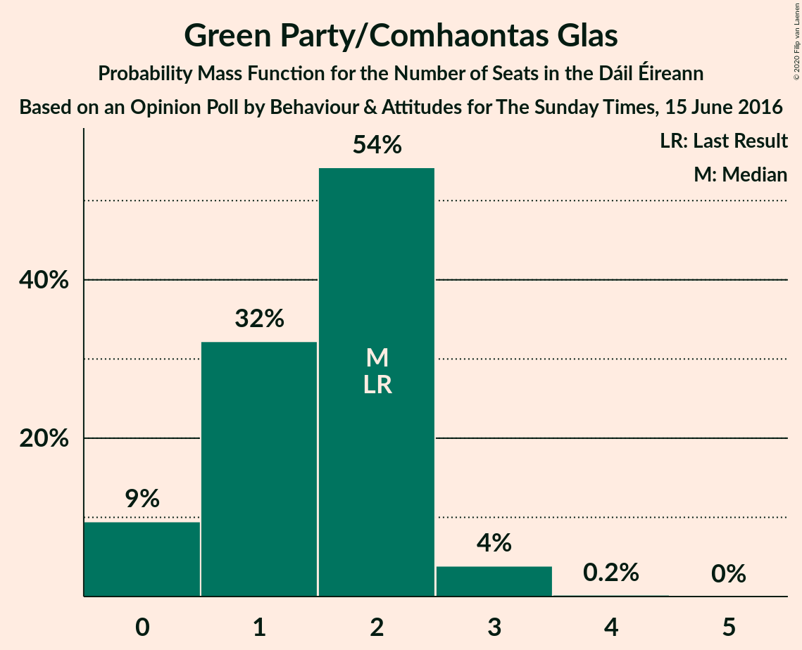
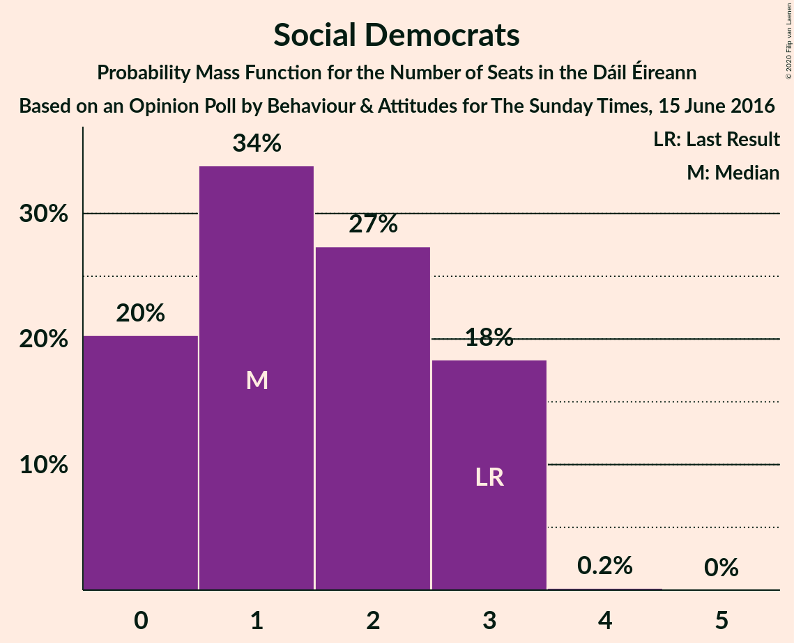
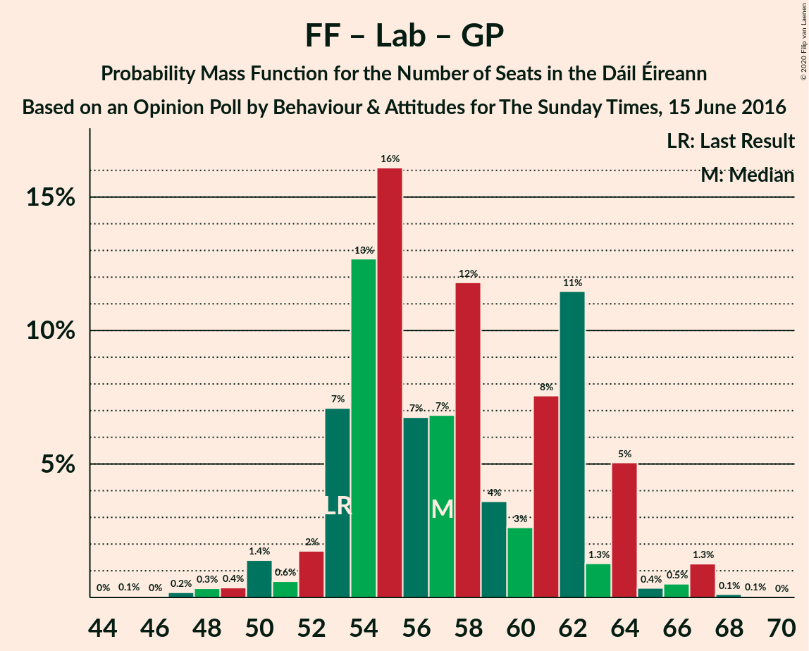

# Opinion Poll by Behaviour & Attitudes for The Sunday Times, 15 June 2016

<a href="#voting-intentions">Voting Intentions</a> | <a href="#seats">Seats</a> | <a href="#coalitions">Coalitions</a> | <a href="#technical-information">Technical Information</a>

## Voting Intentions

### Confidence Intervals

| Party | Last Result | Poll Result | 80% Confidence Interval | 90% Confidence Interval | 95% Confidence Interval | 99% Confidence Interval |
|:-----:|:-----------:|:-----------:|:-----------------------:|:-----------------------:|:-----------------------:|:-----------------------:|
| Fianna Fáil | 24.3% | 26.3% | 24.5–28.2% |24.0–28.8% |23.5–29.2% |22.7–30.2% |
| Fine Gael | 25.5% | 25.3% | 23.5–27.2% |23.0–27.8% |22.6–28.2% |21.7–29.2% |
| Sinn Féin | 13.8% | 17.2% | 15.7–18.9% |15.2–19.4% |14.9–19.8% |14.2–20.6% |
| Independent | 15.9% | 9.4% | 8.3–10.8% |8.0–11.2% |7.7–11.5% |7.2–12.2% |
| Labour Party | 6.6% | 5.0% | 4.2–6.1% |4.0–6.4% |3.8–6.7% |3.4–7.2% |
| Solidarity–People Before Profit | 3.9% | 4.1% | 3.3–5.0% |3.1–5.3% |3.0–5.5% |2.6–6.1% |
| Green Party/Comhaontas Glas | 2.7% | 3.1% | 2.4–3.9% |2.3–4.2% |2.1–4.4% |1.9–4.9% |
| Independents 4 Change | 1.5% | 1.2% | 0.9–1.8% |0.7–2.0% |0.7–2.1% |0.5–2.5% |
| Social Democrats | 3.0% | 1.0% | 0.7–1.6% |0.6–1.7% |0.5–1.9% |0.4–2.2% |
| Renua Ireland | 2.2% | 1.0% | 0.7–1.6% |0.6–1.7% |0.5–1.9% |0.4–2.2% |

*Note:* The poll result column reflects the actual value used in the calculations. Published results may vary slightly, and in addition be rounded to fewer digits.

## Seats

### Confidence Intervals

| Party | Last Result | Median | 80% Confidence Interval | 90% Confidence Interval | 95% Confidence Interval | 99% Confidence Interval |
|:-----:|:-----------:|:------:|:-----------------------:|:-----------------------:|:-----------------------:|:-----------------------:|
| <a href="#fianna-fáil">Fianna Fáil</a> | 44 | 55 | 47–59 |47–59 |45–59 |45–59 |
| <a href="#fine-gael">Fine Gael</a> | 49 | 46 | 43–55 |43–59 |43–60 |41–61 |
| <a href="#sinn-féin">Sinn Féin</a> | 23 | 38 | 32–38 |30–39 |29–41 |29–42 |
| <a href="#independent">Independent</a> | 19 | 7 | 4–8 |3–10 |3–12 |3–15 |
| <a href="#labour-party">Labour Party</a> | 7 | 2 | 1–7 |1–8 |0–10 |0–13 |
| <a href="#solidarity–people-before-profit">Solidarity–People Before Profit</a> | 6 | 8 | 4–9 |4–9 |3–9 |3–10 |
| <a href="#green-party/comhaontas-glas">Green Party/Comhaontas Glas</a> | 2 | 1 | 1–3 |0–3 |0–3 |0–4 |
| <a href="#independents-4-change">Independents 4 Change</a> | 4 | 0 | 0–4 |0–5 |0–5 |0–5 |
| <a href="#social-democrats">Social Democrats</a> | 3 | 1 | 0–3 |0–3 |0–3 |0–3 |
| <a href="#renua-ireland">Renua Ireland</a> | 0 | 0 | 0 |0 |0 |0–1 |

### Fianna Fáil

*For a full overview of the results for this party, see the [Fianna Fáil](party-fiannafáil.html) page.*

| Number of Seats | Probability | Accumulated | Special Marks |
|:---------------:|:-----------:|:-----------:|:-------------:|
| 41 | 0.1% | 100% |  |
| 42 | 0.1% | 99.9% |  |
| 43 | 0.1% | 99.9% |  |
| 44 | 0.1% | 99.7% | Last Result |
| 45 | 2% | 99.6% |  |
| 46 | 0.8% | 97% |  |
| 47 | 6% | 96% |  |
| 48 | 0.5% | 90% |  |
| 49 | 4% | 89% |  |
| 50 | 4% | 85% |  |
| 51 | 5% | 82% |  |
| 52 | 3% | 76% |  |
| 53 | 15% | 74% |  |
| 54 | 1.5% | 58% |  |
| 55 | 7% | 57% | Median |
| 56 | 3% | 50% |  |
| 57 | 7% | 47% |  |
| 58 | 2% | 40% |  |
| 59 | 38% | 38% |  |
| 60 | 0.3% | 0.3% |  |
| 61 | 0.1% | 0.1% |  |
| 62 | 0% | 0% |  |

### Fine Gael

*For a full overview of the results for this party, see the [Fine Gael](party-finegael.html) page.*

| Number of Seats | Probability | Accumulated | Special Marks |
|:---------------:|:-----------:|:-----------:|:-------------:|
| 39 | 0.1% | 100% |  |
| 40 | 0.1% | 99.9% |  |
| 41 | 1.1% | 99.7% |  |
| 42 | 0.7% | 98.6% |  |
| 43 | 38% | 98% |  |
| 44 | 5% | 60% |  |
| 45 | 4% | 54% |  |
| 46 | 3% | 50% | Median |
| 47 | 2% | 47% |  |
| 48 | 3% | 44% |  |
| 49 | 1.2% | 41% | Last Result |
| 50 | 6% | 40% |  |
| 51 | 9% | 34% |  |
| 52 | 3% | 26% |  |
| 53 | 7% | 23% |  |
| 54 | 1.5% | 16% |  |
| 55 | 5% | 14% |  |
| 56 | 2% | 9% |  |
| 57 | 0.6% | 7% |  |
| 58 | 1.4% | 7% |  |
| 59 | 1.4% | 5% |  |
| 60 | 3% | 4% |  |
| 61 | 1.3% | 1.5% |  |
| 62 | 0.1% | 0.1% |  |
| 63 | 0% | 0.1% |  |
| 64 | 0% | 0.1% |  |
| 65 | 0% | 0% |  |

### Sinn Féin

*For a full overview of the results for this party, see the [Sinn Féin](party-sinnféin.html) page.*

| Number of Seats | Probability | Accumulated | Special Marks |
|:---------------:|:-----------:|:-----------:|:-------------:|
| 23 | 0% | 100% | Last Result |
| 24 | 0% | 100% |  |
| 25 | 0% | 100% |  |
| 26 | 0% | 100% |  |
| 27 | 0.1% | 99.9% |  |
| 28 | 0.1% | 99.8% |  |
| 29 | 4% | 99.7% |  |
| 30 | 1.0% | 95% |  |
| 31 | 0.3% | 94% |  |
| 32 | 5% | 94% |  |
| 33 | 4% | 89% |  |
| 34 | 16% | 86% |  |
| 35 | 8% | 70% |  |
| 36 | 2% | 62% |  |
| 37 | 3% | 60% |  |
| 38 | 48% | 57% | Median |
| 39 | 6% | 10% |  |
| 40 | 0.3% | 4% |  |
| 41 | 2% | 3% |  |
| 42 | 1.5% | 2% |  |
| 43 | 0.1% | 0.1% |  |
| 44 | 0% | 0% |  |

### Independent

*For a full overview of the results for this party, see the [Independent](party-independent.html) page.*

| Number of Seats | Probability | Accumulated | Special Marks |
|:---------------:|:-----------:|:-----------:|:-------------:|
| 3 | 5% | 100% |  |
| 4 | 10% | 95% |  |
| 5 | 14% | 85% |  |
| 6 | 16% | 71% |  |
| 7 | 7% | 54% | Median |
| 8 | 39% | 47% |  |
| 9 | 0.6% | 9% |  |
| 10 | 3% | 8% |  |
| 11 | 0.9% | 5% |  |
| 12 | 2% | 4% |  |
| 13 | 0.8% | 2% |  |
| 14 | 0.5% | 1.0% |  |
| 15 | 0.3% | 0.6% |  |
| 16 | 0.3% | 0.3% |  |
| 17 | 0% | 0% |  |
| 18 | 0% | 0% |  |
| 19 | 0% | 0% | Last Result |

### Labour Party

*For a full overview of the results for this party, see the [Labour Party](party-labourparty.html) page.*

| Number of Seats | Probability | Accumulated | Special Marks |
|:---------------:|:-----------:|:-----------:|:-------------:|
| 0 | 4% | 100% |  |
| 1 | 18% | 96% |  |
| 2 | 44% | 78% | Median |
| 3 | 8% | 34% |  |
| 4 | 4% | 26% |  |
| 5 | 8% | 22% |  |
| 6 | 2% | 13% |  |
| 7 | 6% | 12% | Last Result |
| 8 | 2% | 5% |  |
| 9 | 0.4% | 3% |  |
| 10 | 2% | 3% |  |
| 11 | 0.3% | 0.9% |  |
| 12 | 0% | 0.6% |  |
| 13 | 0.1% | 0.6% |  |
| 14 | 0.3% | 0.5% |  |
| 15 | 0.1% | 0.2% |  |
| 16 | 0.1% | 0.1% |  |
| 17 | 0% | 0% |  |

### Solidarity–People Before Profit

*For a full overview of the results for this party, see the [Solidarity–People Before Profit](party-solidarity–peoplebeforeprofit.html) page.*

| Number of Seats | Probability | Accumulated | Special Marks |
|:---------------:|:-----------:|:-----------:|:-------------:|
| 3 | 4% | 100% |  |
| 4 | 7% | 96% |  |
| 5 | 16% | 89% |  |
| 6 | 3% | 73% | Last Result |
| 7 | 7% | 70% |  |
| 8 | 46% | 63% | Median |
| 9 | 15% | 16% |  |
| 10 | 2% | 2% |  |
| 11 | 0% | 0% |  |

### Green Party/Comhaontas Glas

*For a full overview of the results for this party, see the [Green Party/Comhaontas Glas](party-greenpartycomhaontasglas.html) page.*

| Number of Seats | Probability | Accumulated | Special Marks |
|:---------------:|:-----------:|:-----------:|:-------------:|
| 0 | 9% | 100% |  |
| 1 | 54% | 91% | Median |
| 2 | 24% | 36% | Last Result |
| 3 | 12% | 13% |  |
| 4 | 0.5% | 0.6% |  |
| 5 | 0.1% | 0.1% |  |
| 6 | 0% | 0% |  |

### Independents 4 Change

*For a full overview of the results for this party, see the [Independents 4 Change](party-independents4change.html) page.*

| Number of Seats | Probability | Accumulated | Special Marks |
|:---------------:|:-----------:|:-----------:|:-------------:|
| 0 | 57% | 100% | Median |
| 1 | 4% | 43% |  |
| 2 | 4% | 39% |  |
| 3 | 4% | 35% |  |
| 4 | 22% | 31% | Last Result |
| 5 | 10% | 10% |  |
| 6 | 0% | 0% |  |

### Social Democrats

*For a full overview of the results for this party, see the [Social Democrats](party-socialdemocrats.html) page.*

| Number of Seats | Probability | Accumulated | Special Marks |
|:---------------:|:-----------:|:-----------:|:-------------:|
| 0 | 18% | 100% |  |
| 1 | 53% | 82% | Median |
| 2 | 10% | 28% |  |
| 3 | 18% | 18% | Last Result |
| 4 | 0.3% | 0.3% |  |
| 5 | 0% | 0% |  |

### Renua Ireland

*For a full overview of the results for this party, see the [Renua Ireland](party-renuaireland.html) page.*

| Number of Seats | Probability | Accumulated | Special Marks |
|:---------------:|:-----------:|:-----------:|:-------------:|
| 0 | 98% | 100% | Last Result, Median |
| 1 | 2% | 2% |  |
| 2 | 0.2% | 0.2% |  |
| 3 | 0% | 0% |  |

## Coalitions

### Confidence Intervals

| Coalition | Last Result | Median | Majority? | 80% Confidence Interval | 90% Confidence Interval | 95% Confidence Interval | 99% Confidence Interval |
|:---------:|:-----------:|:------:|:---------:|:-----------------------:|:-----------------------:|:-----------------------:|:-----------------------:|
| Fianna Fáil – Fine Gael | 93 | 102 | 100% | 98–107 | 97–109 | 96–111 | 91–112 |
| Fianna Fáil – Sinn Féin | 67 | 92 | 96% | 82–97 | 81–97 | 79–97 | 78–97 |
| Fianna Fáil – Labour Party – Green Party/Comhaontas Glas – Social Democrats | 56 | 63 | 0% | 54–65 | 54–67 | 51–67 | 49–69 |
| Fianna Fáil – Labour Party – Green Party/Comhaontas Glas | 53 | 61 | 0% | 53–62 | 52–64 | 49–66 | 48–67 |
| Fine Gael – Labour Party – Green Party/Comhaontas Glas – Social Democrats | 61 | 53 | 0% | 47–63 | 47–64 | 47–66 | 46–69 |
| Fianna Fáil – Labour Party | 51 | 60 | 0% | 52–61 | 50–62 | 48–64 | 47–65 |
| Fine Gael – Labour Party – Green Party/Comhaontas Glas | 58 | 51 | 0% | 46–61 | 46–63 | 46–64 | 45–66 |
| Fine Gael – Labour Party | 56 | 49 | 0% | 45–60 | 45–62 | 45–62 | 44–64 |
| Fianna Fáil – Green Party/Comhaontas Glas | 46 | 57 | 0% | 49–60 | 48–60 | 46–61 | 46–61 |
| Fine Gael – Green Party/Comhaontas Glas | 51 | 47 | 0% | 44–56 | 44–60 | 44–61 | 42–63 |
| Fine Gael | 49 | 46 | 0% | 43–55 | 43–59 | 43–60 | 41–61 |

### Fianna Fáil – Fine Gael

| Number of Seats | Probability | Accumulated | Special Marks |
|:---------------:|:-----------:|:-----------:|:-------------:|
| 89 | 0.3% | 100% |  |
| 90 | 0.1% | 99.7% |  |
| 91 | 0.1% | 99.6% |  |
| 92 | 0.1% | 99.5% |  |
| 93 | 0.2% | 99.3% | Last Result |
| 94 | 0.7% | 99.1% |  |
| 95 | 0.5% | 98% |  |
| 96 | 0.8% | 98% |  |
| 97 | 6% | 97% |  |
| 98 | 3% | 91% |  |
| 99 | 2% | 89% |  |
| 100 | 2% | 87% |  |
| 101 | 7% | 85% | Median |
| 102 | 41% | 78% |  |
| 103 | 9% | 36% |  |
| 104 | 3% | 27% |  |
| 105 | 4% | 24% |  |
| 106 | 9% | 20% |  |
| 107 | 3% | 10% |  |
| 108 | 2% | 8% |  |
| 109 | 1.4% | 6% |  |
| 110 | 1.2% | 4% |  |
| 111 | 0.7% | 3% |  |
| 112 | 2% | 2% |  |
| 113 | 0% | 0.2% |  |
| 114 | 0.1% | 0.1% |  |
| 115 | 0% | 0% |  |

### Fianna Fáil – Sinn Féin

| Number of Seats | Probability | Accumulated | Special Marks |
|:---------------:|:-----------:|:-----------:|:-------------:|
| 67 | 0% | 100% | Last Result |
| 68 | 0% | 100% |  |
| 69 | 0% | 100% |  |
| 70 | 0% | 100% |  |
| 71 | 0% | 100% |  |
| 72 | 0.1% | 100% |  |
| 73 | 0% | 99.9% |  |
| 74 | 0% | 99.9% |  |
| 75 | 0% | 99.9% |  |
| 76 | 0.1% | 99.9% |  |
| 77 | 0.1% | 99.8% |  |
| 78 | 2% | 99.7% |  |
| 79 | 0.6% | 98% |  |
| 80 | 0.5% | 97% |  |
| 81 | 2% | 96% | Majority |
| 82 | 5% | 95% |  |
| 83 | 4% | 89% |  |
| 84 | 6% | 85% |  |
| 85 | 3% | 80% |  |
| 86 | 2% | 76% |  |
| 87 | 5% | 74% |  |
| 88 | 4% | 70% |  |
| 89 | 2% | 66% |  |
| 90 | 3% | 63% |  |
| 91 | 8% | 60% |  |
| 92 | 5% | 52% |  |
| 93 | 1.0% | 47% | Median |
| 94 | 6% | 46% |  |
| 95 | 4% | 40% |  |
| 96 | 0.2% | 36% |  |
| 97 | 36% | 36% |  |
| 98 | 0.1% | 0.1% |  |
| 99 | 0% | 0% |  |

### Fianna Fáil – Labour Party – Green Party/Comhaontas Glas – Social Democrats

| Number of Seats | Probability | Accumulated | Special Marks |
|:---------------:|:-----------:|:-----------:|:-------------:|
| 47 | 0.1% | 100% |  |
| 48 | 0.1% | 99.9% |  |
| 49 | 0.4% | 99.8% |  |
| 50 | 0.5% | 99.5% |  |
| 51 | 2% | 99.0% |  |
| 52 | 0.5% | 97% |  |
| 53 | 0.9% | 96% |  |
| 54 | 8% | 95% |  |
| 55 | 7% | 87% |  |
| 56 | 4% | 80% | Last Result |
| 57 | 4% | 76% |  |
| 58 | 3% | 72% |  |
| 59 | 5% | 69% | Median |
| 60 | 2% | 64% |  |
| 61 | 6% | 62% |  |
| 62 | 2% | 55% |  |
| 63 | 40% | 53% |  |
| 64 | 2% | 13% |  |
| 65 | 4% | 11% |  |
| 66 | 1.4% | 6% |  |
| 67 | 3% | 5% |  |
| 68 | 0.7% | 2% |  |
| 69 | 0.8% | 1.0% |  |
| 70 | 0.1% | 0.1% |  |
| 71 | 0% | 0% |  |

### Fianna Fáil – Labour Party – Green Party/Comhaontas Glas

| Number of Seats | Probability | Accumulated | Special Marks |
|:---------------:|:-----------:|:-----------:|:-------------:|
| 46 | 0.1% | 100% |  |
| 47 | 0% | 99.9% |  |
| 48 | 2% | 99.8% |  |
| 49 | 0.7% | 98% |  |
| 50 | 0.4% | 97% |  |
| 51 | 0.7% | 97% |  |
| 52 | 2% | 96% |  |
| 53 | 7% | 94% | Last Result |
| 54 | 8% | 87% |  |
| 55 | 5% | 79% |  |
| 56 | 2% | 74% |  |
| 57 | 3% | 72% |  |
| 58 | 1.2% | 69% | Median |
| 59 | 9% | 67% |  |
| 60 | 6% | 58% |  |
| 61 | 3% | 53% |  |
| 62 | 41% | 50% |  |
| 63 | 3% | 9% |  |
| 64 | 2% | 7% |  |
| 65 | 2% | 5% |  |
| 66 | 2% | 3% |  |
| 67 | 0.8% | 0.9% |  |
| 68 | 0% | 0.1% |  |
| 69 | 0% | 0% |  |

### Fine Gael – Labour Party – Green Party/Comhaontas Glas – Social Democrats

| Number of Seats | Probability | Accumulated | Special Marks |
|:---------------:|:-----------:|:-----------:|:-------------:|
| 44 | 0% | 100% |  |
| 45 | 0.2% | 99.9% |  |
| 46 | 0.3% | 99.8% |  |
| 47 | 36% | 99.5% |  |
| 48 | 4% | 63% |  |
| 49 | 1.0% | 59% |  |
| 50 | 3% | 58% | Median |
| 51 | 2% | 55% |  |
| 52 | 2% | 53% |  |
| 53 | 2% | 51% |  |
| 54 | 5% | 49% |  |
| 55 | 4% | 44% |  |
| 56 | 8% | 39% |  |
| 57 | 4% | 32% |  |
| 58 | 3% | 28% |  |
| 59 | 2% | 25% |  |
| 60 | 4% | 24% |  |
| 61 | 5% | 19% | Last Result |
| 62 | 3% | 14% |  |
| 63 | 5% | 11% |  |
| 64 | 2% | 6% |  |
| 65 | 0.5% | 5% |  |
| 66 | 3% | 4% |  |
| 67 | 0.1% | 2% |  |
| 68 | 1.0% | 2% |  |
| 69 | 0.3% | 0.6% |  |
| 70 | 0.2% | 0.3% |  |
| 71 | 0% | 0.1% |  |
| 72 | 0% | 0.1% |  |
| 73 | 0% | 0.1% |  |
| 74 | 0% | 0.1% |  |
| 75 | 0.1% | 0.1% |  |
| 76 | 0% | 0% |  |

### Fianna Fáil – Labour Party

| Number of Seats | Probability | Accumulated | Special Marks |
|:---------------:|:-----------:|:-----------:|:-------------:|
| 45 | 0.1% | 100% |  |
| 46 | 0.2% | 99.9% |  |
| 47 | 2% | 99.7% |  |
| 48 | 0.7% | 98% |  |
| 49 | 0.4% | 97% |  |
| 50 | 4% | 97% |  |
| 51 | 2% | 93% | Last Result |
| 52 | 7% | 91% |  |
| 53 | 2% | 84% |  |
| 54 | 11% | 83% |  |
| 55 | 0.9% | 72% |  |
| 56 | 6% | 71% |  |
| 57 | 4% | 65% | Median |
| 58 | 9% | 61% |  |
| 59 | 2% | 53% |  |
| 60 | 7% | 51% |  |
| 61 | 37% | 44% |  |
| 62 | 3% | 7% |  |
| 63 | 0.5% | 4% |  |
| 64 | 3% | 4% |  |
| 65 | 0.8% | 0.9% |  |
| 66 | 0% | 0.1% |  |
| 67 | 0% | 0% |  |

### Fine Gael – Labour Party – Green Party/Comhaontas Glas

| Number of Seats | Probability | Accumulated | Special Marks |
|:---------------:|:-----------:|:-----------:|:-------------:|
| 43 | 0.1% | 100% |  |
| 44 | 0.3% | 99.9% |  |
| 45 | 0.2% | 99.6% |  |
| 46 | 37% | 99.4% |  |
| 47 | 4% | 63% |  |
| 48 | 3% | 58% |  |
| 49 | 2% | 55% | Median |
| 50 | 2% | 53% |  |
| 51 | 0.7% | 50% |  |
| 52 | 0.9% | 49% |  |
| 53 | 0.4% | 48% |  |
| 54 | 9% | 48% |  |
| 55 | 7% | 39% |  |
| 56 | 7% | 33% |  |
| 57 | 3% | 26% |  |
| 58 | 4% | 23% | Last Result |
| 59 | 0.5% | 19% |  |
| 60 | 5% | 18% |  |
| 61 | 7% | 13% |  |
| 62 | 0.5% | 7% |  |
| 63 | 2% | 6% |  |
| 64 | 1.4% | 4% |  |
| 65 | 0.9% | 2% |  |
| 66 | 0.8% | 1.3% |  |
| 67 | 0.1% | 0.4% |  |
| 68 | 0% | 0.3% |  |
| 69 | 0.2% | 0.2% |  |
| 70 | 0% | 0.1% |  |
| 71 | 0% | 0.1% |  |
| 72 | 0.1% | 0.1% |  |
| 73 | 0% | 0% |  |

### Fine Gael – Labour Party

| Number of Seats | Probability | Accumulated | Special Marks |
|:---------------:|:-----------:|:-----------:|:-------------:|
| 42 | 0.3% | 100% |  |
| 43 | 0.1% | 99.7% |  |
| 44 | 0.7% | 99.5% |  |
| 45 | 42% | 98.8% |  |
| 46 | 2% | 57% |  |
| 47 | 0.6% | 55% |  |
| 48 | 3% | 55% | Median |
| 49 | 2% | 52% |  |
| 50 | 1.0% | 50% |  |
| 51 | 0.6% | 49% |  |
| 52 | 2% | 48% |  |
| 53 | 9% | 46% |  |
| 54 | 9% | 37% |  |
| 55 | 6% | 28% |  |
| 56 | 3% | 22% | Last Result |
| 57 | 2% | 19% |  |
| 58 | 0.5% | 16% |  |
| 59 | 4% | 16% |  |
| 60 | 5% | 11% |  |
| 61 | 0.7% | 6% |  |
| 62 | 3% | 6% |  |
| 63 | 0.9% | 2% |  |
| 64 | 1.0% | 1.4% |  |
| 65 | 0.2% | 0.5% |  |
| 66 | 0% | 0.3% |  |
| 67 | 0.1% | 0.3% |  |
| 68 | 0% | 0.1% |  |
| 69 | 0% | 0.1% |  |
| 70 | 0.1% | 0.1% |  |
| 71 | 0% | 0% |  |

### Fianna Fáil – Green Party/Comhaontas Glas

| Number of Seats | Probability | Accumulated | Special Marks |
|:---------------:|:-----------:|:-----------:|:-------------:|
| 43 | 0.1% | 100% |  |
| 44 | 0.1% | 99.9% |  |
| 45 | 0.2% | 99.8% |  |
| 46 | 2% | 99.6% | Last Result |
| 47 | 0.6% | 97% |  |
| 48 | 6% | 97% |  |
| 49 | 2% | 91% |  |
| 50 | 0.7% | 90% |  |
| 51 | 2% | 89% |  |
| 52 | 7% | 87% |  |
| 53 | 12% | 81% |  |
| 54 | 4% | 69% |  |
| 55 | 3% | 65% |  |
| 56 | 6% | 61% | Median |
| 57 | 6% | 55% |  |
| 58 | 0.7% | 49% |  |
| 59 | 8% | 48% |  |
| 60 | 37% | 40% |  |
| 61 | 3% | 3% |  |
| 62 | 0.1% | 0.1% |  |
| 63 | 0% | 0% |  |

### Fine Gael – Green Party/Comhaontas Glas

| Number of Seats | Probability | Accumulated | Special Marks |
|:---------------:|:-----------:|:-----------:|:-------------:|
| 41 | 0.2% | 100% |  |
| 42 | 1.2% | 99.8% |  |
| 43 | 0.5% | 98.6% |  |
| 44 | 37% | 98% |  |
| 45 | 0.7% | 61% |  |
| 46 | 8% | 61% |  |
| 47 | 3% | 52% | Median |
| 48 | 3% | 49% |  |
| 49 | 0.6% | 46% |  |
| 50 | 4% | 46% |  |
| 51 | 4% | 42% | Last Result |
| 52 | 2% | 38% |  |
| 53 | 14% | 36% |  |
| 54 | 4% | 22% |  |
| 55 | 3% | 18% |  |
| 56 | 5% | 15% |  |
| 57 | 1.5% | 9% |  |
| 58 | 1.0% | 8% |  |
| 59 | 0.7% | 7% |  |
| 60 | 2% | 6% |  |
| 61 | 2% | 5% |  |
| 62 | 0.9% | 2% |  |
| 63 | 1.3% | 1.4% |  |
| 64 | 0% | 0.1% |  |
| 65 | 0% | 0.1% |  |
| 66 | 0% | 0% |  |

### Fine Gael

| Number of Seats | Probability | Accumulated | Special Marks |
|:---------------:|:-----------:|:-----------:|:-------------:|
| 39 | 0.1% | 100% |  |
| 40 | 0.1% | 99.9% |  |
| 41 | 1.1% | 99.7% |  |
| 42 | 0.7% | 98.6% |  |
| 43 | 38% | 98% |  |
| 44 | 5% | 60% |  |
| 45 | 4% | 54% |  |
| 46 | 3% | 50% | Median |
| 47 | 2% | 47% |  |
| 48 | 3% | 44% |  |
| 49 | 1.2% | 41% | Last Result |
| 50 | 6% | 40% |  |
| 51 | 9% | 34% |  |
| 52 | 3% | 26% |  |
| 53 | 7% | 23% |  |
| 54 | 1.5% | 16% |  |
| 55 | 5% | 14% |  |
| 56 | 2% | 9% |  |
| 57 | 0.6% | 7% |  |
| 58 | 1.4% | 7% |  |
| 59 | 1.4% | 5% |  |
| 60 | 3% | 4% |  |
| 61 | 1.3% | 1.5% |  |
| 62 | 0.1% | 0.1% |  |
| 63 | 0% | 0.1% |  |
| 64 | 0% | 0.1% |  |
| 65 | 0% | 0% |  |

## Technical Information

### Opinion Poll

+ **Polling firm:** Behaviour & Attitudes
+ **Commissioner(s):** The Sunday Times
+ **Fieldwork period:** 15 June 2016

### Calculations

+ **Sample size:** 913
+ **Simulations done:** 131,072
+ **Error estimate:** 3.37%

