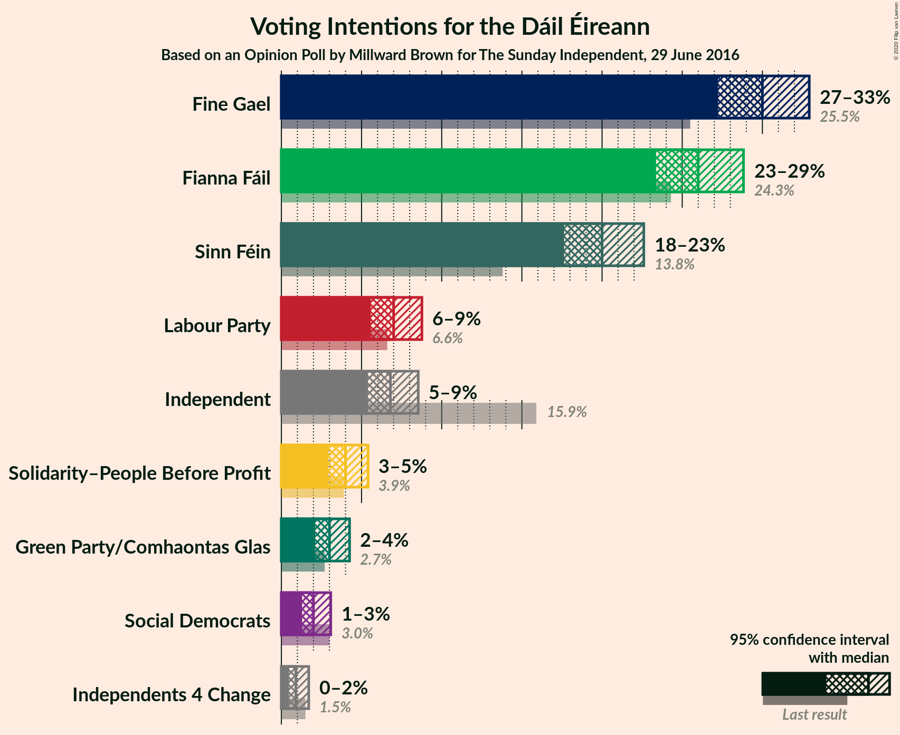
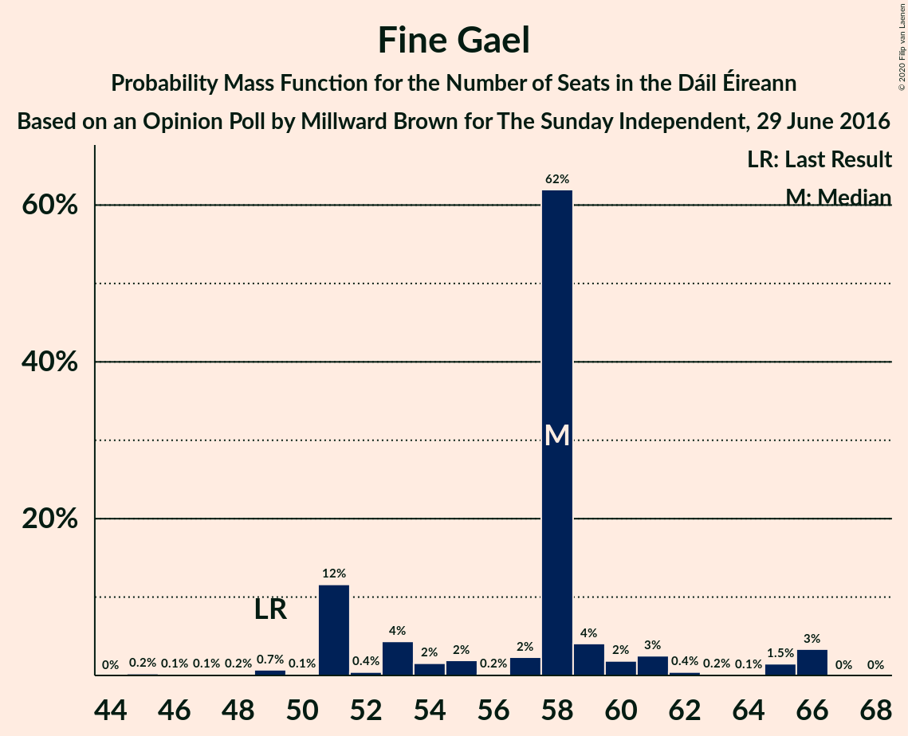
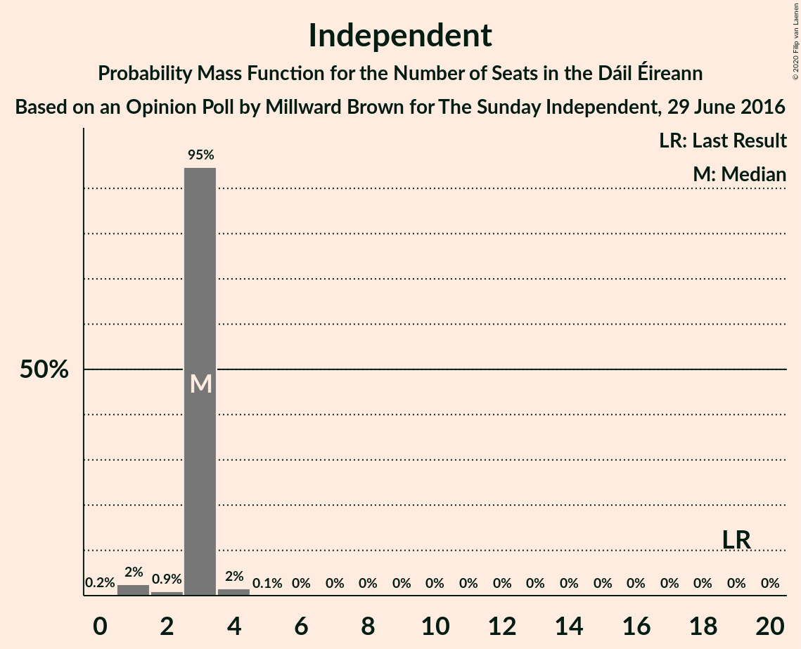
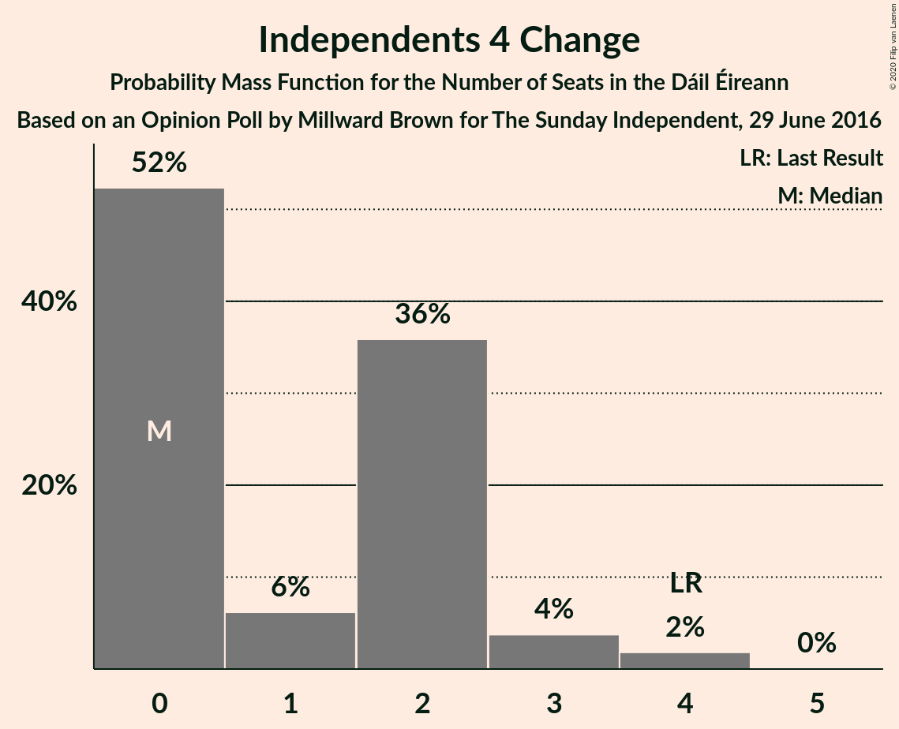
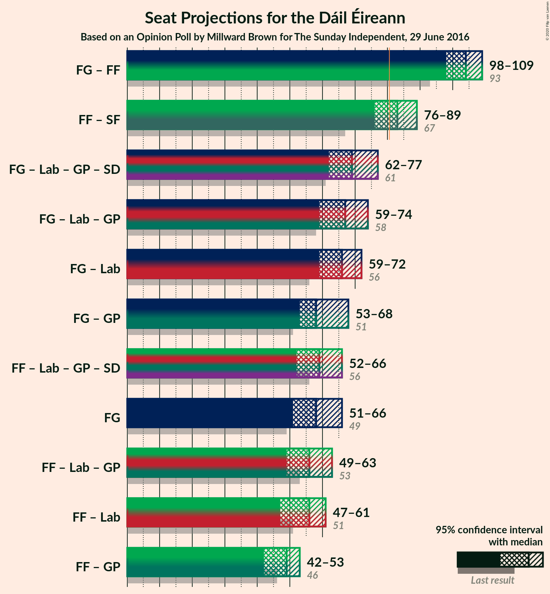
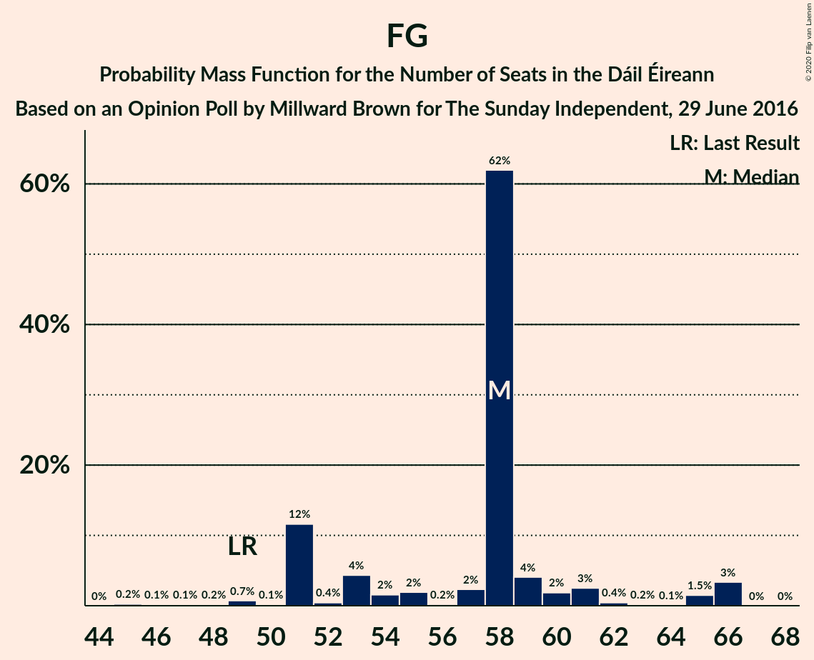
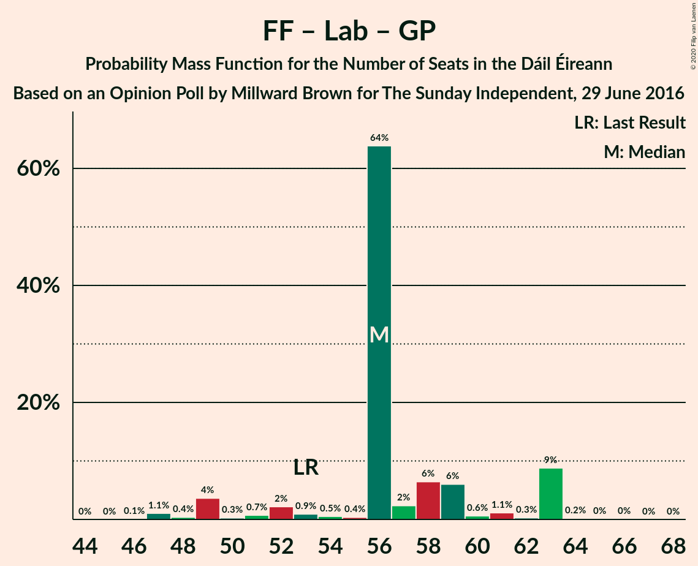

# Opinion Poll by Millward Brown for The Sunday Independent, 29 June 2016

<a href="#voting-intentions">Voting Intentions</a> | <a href="#seats">Seats</a> | <a href="#coalitions">Coalitions</a> | <a href="#technical-information">Technical Information</a>

## Voting Intentions

### Confidence Intervals

| Party | Last Result | Poll Result | 80% Confidence Interval | 90% Confidence Interval | 95% Confidence Interval | 99% Confidence Interval |
|:-----:|:-----------:|:-----------:|:-----------------------:|:-----------------------:|:-----------------------:|:-----------------------:|
| Fine Gael | 25.5% | 30.0% | 28.2–31.9% |27.7–32.4% |27.2–32.9% |26.4–33.9% |
| Fianna Fáil | 24.3% | 26.0% | 24.3–27.8% |23.8–28.4% |23.4–28.8% |22.6–29.7% |
| Sinn Féin | 13.8% | 20.0% | 18.4–21.7% |18.0–22.2% |17.6–22.6% |16.9–23.4% |
| Labour Party | 6.6% | 7.0% | 6.1–8.2% |5.8–8.5% |5.6–8.8% |5.2–9.3% |
| Independent | 15.9% | 6.8% | 5.9–7.9% |5.6–8.3% |5.4–8.5% |5.0–9.1% |
| Solidarity–People Before Profit | 3.9% | 4.0% | 3.3–4.9% |3.1–5.2% |2.9–5.4% |2.7–5.9% |
| Green Party/Comhaontas Glas | 2.7% | 3.0% | 2.4–3.8% |2.2–4.1% |2.1–4.3% |1.9–4.7% |
| Social Democrats | 3.0% | 2.0% | 1.5–2.7% |1.4–2.9% |1.3–3.1% |1.1–3.4% |
| Independents 4 Change | 1.5% | 0.9% | 0.6–1.4% |0.5–1.6% |0.5–1.7% |0.4–2.0% |

*Note:* The poll result column reflects the actual value used in the calculations. Published results may vary slightly, and in addition be rounded to fewer digits.

## Seats

### Confidence Intervals

| Party | Last Result | Median | 80% Confidence Interval | 90% Confidence Interval | 95% Confidence Interval | 99% Confidence Interval |
|:-----:|:-----------:|:------:|:-----------------------:|:-----------------------:|:-----------------------:|:-----------------------:|
| <a href="#fine-gael">Fine Gael</a> | 49 | 58 | 51–59 |51–63 |51–66 |47–66 |
| <a href="#fianna-fáil">Fianna Fáil</a> | 44 | 47 | 45–51 |41–51 |41–52 |39–53 |
| <a href="#sinn-féin">Sinn Féin</a> | 23 | 35 | 34–36 |34–39 |34–40 |32–41 |
| <a href="#labour-party">Labour Party</a> | 7 | 9 | 6–10 |6–10 |5–13 |3–17 |
| <a href="#independent">Independent</a> | 19 | 3 | 3 |3 |1–3 |1–4 |
| <a href="#solidarity–people-before-profit">Solidarity–People Before Profit</a> | 6 | 4 | 3–5 |3–8 |3–9 |3–9 |
| <a href="#green-party/comhaontas-glas">Green Party/Comhaontas Glas</a> | 2 | 2 | 0–2 |0–2 |0–2 |0–3 |
| <a href="#social-democrats">Social Democrats</a> | 3 | 3 | 3 |2–3 |1–3 |1–4 |
| <a href="#independents-4-change">Independents 4 Change</a> | 4 | 0 | 0–2 |0–3 |0–3 |0–4 |

### Fine Gael

*For a full overview of the results for this party, see the [Fine Gael](party-finegael.html) page.*

| Number of Seats | Probability | Accumulated | Special Marks |
|:---------------:|:-----------:|:-----------:|:-------------:|
| 45 | 0.2% | 100% |  |
| 46 | 0.1% | 99.7% |  |
| 47 | 0.1% | 99.6% |  |
| 48 | 0.2% | 99.5% |  |
| 49 | 0.7% | 99.3% | Last Result |
| 50 | 0.1% | 98.6% |  |
| 51 | 12% | 98% |  |
| 52 | 0.4% | 87% |  |
| 53 | 4% | 86% |  |
| 54 | 2% | 82% |  |
| 55 | 2% | 80% |  |
| 56 | 0.2% | 79% |  |
| 57 | 2% | 78% |  |
| 58 | 62% | 76% | Median |
| 59 | 4% | 14% |  |
| 60 | 2% | 10% |  |
| 61 | 3% | 8% |  |
| 62 | 0.4% | 6% |  |
| 63 | 0.2% | 5% |  |
| 64 | 0.1% | 5% |  |
| 65 | 1.5% | 5% |  |
| 66 | 3% | 3% |  |
| 67 | 0% | 0% |  |

### Fianna Fáil

*For a full overview of the results for this party, see the [Fianna Fáil](party-fiannafáil.html) page.*

| Number of Seats | Probability | Accumulated | Special Marks |
|:---------------:|:-----------:|:-----------:|:-------------:|
| 38 | 0.1% | 100% |  |
| 39 | 1.0% | 99.9% |  |
| 40 | 0.2% | 98.9% |  |
| 41 | 5% | 98.7% |  |
| 42 | 2% | 94% |  |
| 43 | 1.1% | 92% |  |
| 44 | 0.4% | 91% | Last Result |
| 45 | 3% | 91% |  |
| 46 | 37% | 88% |  |
| 47 | 0.9% | 51% | Median |
| 48 | 26% | 50% |  |
| 49 | 8% | 24% |  |
| 50 | 3% | 16% |  |
| 51 | 9% | 13% |  |
| 52 | 3% | 4% |  |
| 53 | 0.4% | 0.7% |  |
| 54 | 0.2% | 0.3% |  |
| 55 | 0.1% | 0.2% |  |
| 56 | 0% | 0.1% |  |
| 57 | 0% | 0% |  |

### Sinn Féin

*For a full overview of the results for this party, see the [Sinn Féin](party-sinnféin.html) page.*

| Number of Seats | Probability | Accumulated | Special Marks |
|:---------------:|:-----------:|:-----------:|:-------------:|
| 23 | 0% | 100% | Last Result |
| 24 | 0% | 100% |  |
| 25 | 0% | 100% |  |
| 26 | 0% | 100% |  |
| 27 | 0% | 100% |  |
| 28 | 0% | 100% |  |
| 29 | 0% | 100% |  |
| 30 | 0.1% | 100% |  |
| 31 | 0.1% | 99.9% |  |
| 32 | 0.5% | 99.8% |  |
| 33 | 1.2% | 99.3% |  |
| 34 | 9% | 98% |  |
| 35 | 75% | 90% | Median |
| 36 | 5% | 14% |  |
| 37 | 0.8% | 9% |  |
| 38 | 3% | 8% |  |
| 39 | 2% | 6% |  |
| 40 | 4% | 4% |  |
| 41 | 0.6% | 0.9% |  |
| 42 | 0.1% | 0.3% |  |
| 43 | 0.1% | 0.1% |  |
| 44 | 0% | 0.1% |  |
| 45 | 0% | 0% |  |

### Labour Party

*For a full overview of the results for this party, see the [Labour Party](party-labourparty.html) page.*

| Number of Seats | Probability | Accumulated | Special Marks |
|:---------------:|:-----------:|:-----------:|:-------------:|
| 1 | 0.1% | 100% |  |
| 2 | 0.2% | 99.9% |  |
| 3 | 0.3% | 99.7% |  |
| 4 | 0.3% | 99.3% |  |
| 5 | 2% | 99.1% |  |
| 6 | 32% | 97% |  |
| 7 | 6% | 65% | Last Result |
| 8 | 7% | 59% |  |
| 9 | 4% | 52% | Median |
| 10 | 44% | 48% |  |
| 11 | 1.2% | 4% |  |
| 12 | 0.6% | 3% |  |
| 13 | 0.3% | 3% |  |
| 14 | 0.8% | 2% |  |
| 15 | 0.2% | 1.5% |  |
| 16 | 0.6% | 1.2% |  |
| 17 | 0.5% | 0.6% |  |
| 18 | 0% | 0.1% |  |
| 19 | 0% | 0% |  |

### Independent

*For a full overview of the results for this party, see the [Independent](party-independent.html) page.*

| Number of Seats | Probability | Accumulated | Special Marks |
|:---------------:|:-----------:|:-----------:|:-------------:|
| 0 | 0.2% | 100% |  |
| 1 | 2% | 99.8% |  |
| 2 | 0.9% | 97% |  |
| 3 | 95% | 96% | Median |
| 4 | 2% | 2% |  |
| 5 | 0.1% | 0.1% |  |
| 6 | 0% | 0% |  |
| 7 | 0% | 0% |  |
| 8 | 0% | 0% |  |
| 9 | 0% | 0% |  |
| 10 | 0% | 0% |  |
| 11 | 0% | 0% |  |
| 12 | 0% | 0% |  |
| 13 | 0% | 0% |  |
| 14 | 0% | 0% |  |
| 15 | 0% | 0% |  |
| 16 | 0% | 0% |  |
| 17 | 0% | 0% |  |
| 18 | 0% | 0% |  |
| 19 | 0% | 0% | Last Result |

### Solidarity–People Before Profit

*For a full overview of the results for this party, see the [Solidarity–People Before Profit](party-solidarity–peoplebeforeprofit.html) page.*

| Number of Seats | Probability | Accumulated | Special Marks |
|:---------------:|:-----------:|:-----------:|:-------------:|
| 0 | 0.1% | 100% |  |
| 1 | 0.1% | 99.9% |  |
| 2 | 0.1% | 99.8% |  |
| 3 | 50% | 99.7% |  |
| 4 | 5% | 50% | Median |
| 5 | 37% | 45% |  |
| 6 | 2% | 7% | Last Result |
| 7 | 0.3% | 6% |  |
| 8 | 2% | 5% |  |
| 9 | 4% | 4% |  |
| 10 | 0.2% | 0.2% |  |
| 11 | 0% | 0% |  |

### Green Party/Comhaontas Glas

*For a full overview of the results for this party, see the [Green Party/Comhaontas Glas](party-greenpartycomhaontasglas.html) page.*

| Number of Seats | Probability | Accumulated | Special Marks |
|:---------------:|:-----------:|:-----------:|:-------------:|
| 0 | 49% | 100% |  |
| 1 | 1.2% | 51% |  |
| 2 | 50% | 50% | Last Result, Median |
| 3 | 0.6% | 0.6% |  |
| 4 | 0% | 0% |  |

### Social Democrats

*For a full overview of the results for this party, see the [Social Democrats](party-socialdemocrats.html) page.*

| Number of Seats | Probability | Accumulated | Special Marks |
|:---------------:|:-----------:|:-----------:|:-------------:|
| 0 | 0.3% | 100% |  |
| 1 | 4% | 99.7% |  |
| 2 | 2% | 96% |  |
| 3 | 92% | 94% | Last Result, Median |
| 4 | 1.4% | 1.5% |  |
| 5 | 0% | 0% |  |

### Independents 4 Change

*For a full overview of the results for this party, see the [Independents 4 Change](party-independents4change.html) page.*

| Number of Seats | Probability | Accumulated | Special Marks |
|:---------------:|:-----------:|:-----------:|:-------------:|
| 0 | 52% | 100% | Median |
| 1 | 6% | 48% |  |
| 2 | 36% | 41% |  |
| 3 | 4% | 6% |  |
| 4 | 2% | 2% | Last Result |
| 5 | 0% | 0% |  |

## Coalitions

### Confidence Intervals

| Coalition | Last Result | Median | Majority? | 80% Confidence Interval | 90% Confidence Interval | 95% Confidence Interval | 99% Confidence Interval |
|:---------:|:-----------:|:------:|:---------:|:-----------------------:|:-----------------------:|:-----------------------:|:-----------------------:|
| Fine Gael – Fianna Fáil | 93 | 104 | 100% | 102–107 | 100–108 | 98–109 | 93–110 |
| Fianna Fáil – Sinn Féin | 67 | 83 | 88% | 79–86 | 76–88 | 76–89 | 74–90 |
| Fine Gael – Labour Party – Green Party/Comhaontas Glas – Social Democrats | 61 | 69 | 0% | 66–72 | 64–75 | 62–77 | 61–77 |
| Fine Gael – Labour Party – Green Party/Comhaontas Glas | 58 | 67 | 0% | 63–69 | 61–72 | 59–74 | 58–74 |
| Fine Gael – Labour Party | 56 | 66 | 0% | 61–68 | 59–72 | 59–72 | 57–74 |
| Fine Gael – Green Party/Comhaontas Glas | 51 | 58 | 0% | 53–60 | 53–65 | 53–68 | 48–68 |
| Fianna Fáil – Labour Party – Green Party/Comhaontas Glas – Social Democrats | 56 | 59 | 0% | 58–64 | 52–66 | 52–66 | 50–66 |
| Fine Gael | 49 | 58 | 0% | 51–59 | 51–63 | 51–66 | 47–66 |
| Fianna Fáil – Labour Party – Green Party/Comhaontas Glas | 53 | 56 | 0% | 55–61 | 49–63 | 49–63 | 47–63 |
| Fianna Fáil – Labour Party | 51 | 56 | 0% | 54–60 | 47–61 | 47–61 | 47–62 |
| Fianna Fáil – Green Party/Comhaontas Glas | 46 | 49 | 0% | 45–52 | 43–53 | 42–53 | 40–55 |

### Fine Gael – Fianna Fáil

| Number of Seats | Probability | Accumulated | Special Marks |
|:---------------:|:-----------:|:-----------:|:-------------:|
| 90 | 0.4% | 100% |  |
| 91 | 0% | 99.6% |  |
| 92 | 0% | 99.6% |  |
| 93 | 0.4% | 99.5% | Last Result |
| 94 | 0.1% | 99.1% |  |
| 95 | 0% | 99.0% |  |
| 96 | 0.5% | 99.0% |  |
| 97 | 0.4% | 98% |  |
| 98 | 0.7% | 98% |  |
| 99 | 0.8% | 97% |  |
| 100 | 4% | 97% |  |
| 101 | 2% | 93% |  |
| 102 | 11% | 91% |  |
| 103 | 3% | 80% |  |
| 104 | 35% | 77% |  |
| 105 | 3% | 41% | Median |
| 106 | 26% | 38% |  |
| 107 | 5% | 12% |  |
| 108 | 4% | 7% |  |
| 109 | 0.4% | 3% |  |
| 110 | 2% | 2% |  |
| 111 | 0.1% | 0.2% |  |
| 112 | 0.1% | 0.1% |  |
| 113 | 0% | 0% |  |

### Fianna Fáil – Sinn Féin

| Number of Seats | Probability | Accumulated | Special Marks |
|:---------------:|:-----------:|:-----------:|:-------------:|
| 67 | 0% | 100% | Last Result |
| 68 | 0% | 100% |  |
| 69 | 0% | 100% |  |
| 70 | 0% | 100% |  |
| 71 | 0% | 100% |  |
| 72 | 0% | 100% |  |
| 73 | 0.4% | 100% |  |
| 74 | 0.1% | 99.6% |  |
| 75 | 0.7% | 99.4% |  |
| 76 | 4% | 98.7% |  |
| 77 | 1.4% | 95% |  |
| 78 | 0.2% | 93% |  |
| 79 | 4% | 93% |  |
| 80 | 2% | 89% |  |
| 81 | 36% | 88% | Majority |
| 82 | 1.0% | 52% | Median |
| 83 | 27% | 51% |  |
| 84 | 2% | 24% |  |
| 85 | 4% | 22% |  |
| 86 | 13% | 19% |  |
| 87 | 0.5% | 6% |  |
| 88 | 1.4% | 5% |  |
| 89 | 3% | 4% |  |
| 90 | 0.6% | 1.1% |  |
| 91 | 0.1% | 0.5% |  |
| 92 | 0.3% | 0.4% |  |
| 93 | 0% | 0% |  |

### Fine Gael – Labour Party – Green Party/Comhaontas Glas – Social Democrats

| Number of Seats | Probability | Accumulated | Special Marks |
|:---------------:|:-----------:|:-----------:|:-------------:|
| 57 | 0% | 100% |  |
| 58 | 0% | 99.9% |  |
| 59 | 0.1% | 99.9% |  |
| 60 | 0.2% | 99.8% |  |
| 61 | 0.3% | 99.6% | Last Result |
| 62 | 3% | 99.3% |  |
| 63 | 0.2% | 96% |  |
| 64 | 5% | 96% |  |
| 65 | 0.6% | 91% |  |
| 66 | 9% | 91% |  |
| 67 | 1.0% | 82% |  |
| 68 | 3% | 81% |  |
| 69 | 30% | 78% |  |
| 70 | 2% | 48% |  |
| 71 | 35% | 46% |  |
| 72 | 2% | 10% | Median |
| 73 | 0.9% | 9% |  |
| 74 | 0.7% | 8% |  |
| 75 | 2% | 7% |  |
| 76 | 0.3% | 5% |  |
| 77 | 4% | 4% |  |
| 78 | 0% | 0.2% |  |
| 79 | 0.1% | 0.2% |  |
| 80 | 0% | 0% |  |

### Fine Gael – Labour Party – Green Party/Comhaontas Glas

| Number of Seats | Probability | Accumulated | Special Marks |
|:---------------:|:-----------:|:-----------:|:-------------:|
| 55 | 0% | 100% |  |
| 56 | 0.2% | 99.9% |  |
| 57 | 0% | 99.8% |  |
| 58 | 0.3% | 99.7% | Last Result |
| 59 | 3% | 99.5% |  |
| 60 | 0.3% | 96% |  |
| 61 | 4% | 96% |  |
| 62 | 0.3% | 92% |  |
| 63 | 10% | 92% |  |
| 64 | 0.9% | 82% |  |
| 65 | 2% | 81% |  |
| 66 | 29% | 79% |  |
| 67 | 2% | 50% |  |
| 68 | 38% | 49% |  |
| 69 | 2% | 10% | Median |
| 70 | 0.6% | 8% |  |
| 71 | 0.6% | 8% |  |
| 72 | 2% | 7% |  |
| 73 | 0.2% | 5% |  |
| 74 | 4% | 4% |  |
| 75 | 0% | 0.2% |  |
| 76 | 0.1% | 0.2% |  |
| 77 | 0% | 0% |  |

### Fine Gael – Labour Party

| Number of Seats | Probability | Accumulated | Special Marks |
|:---------------:|:-----------:|:-----------:|:-------------:|
| 53 | 0% | 100% |  |
| 54 | 0% | 99.9% |  |
| 55 | 0% | 99.9% |  |
| 56 | 0.2% | 99.9% | Last Result |
| 57 | 0.6% | 99.7% |  |
| 58 | 0.4% | 99.1% |  |
| 59 | 6% | 98.6% |  |
| 60 | 0.3% | 93% |  |
| 61 | 10% | 92% |  |
| 62 | 0.8% | 82% |  |
| 63 | 2% | 81% |  |
| 64 | 27% | 79% |  |
| 65 | 0.7% | 52% |  |
| 66 | 1.4% | 51% |  |
| 67 | 3% | 50% | Median |
| 68 | 39% | 47% |  |
| 69 | 0.8% | 8% |  |
| 70 | 0.7% | 8% |  |
| 71 | 0.6% | 7% |  |
| 72 | 5% | 6% |  |
| 73 | 0.1% | 0.8% |  |
| 74 | 0.6% | 0.7% |  |
| 75 | 0% | 0.1% |  |
| 76 | 0% | 0% |  |

### Fine Gael – Green Party/Comhaontas Glas

| Number of Seats | Probability | Accumulated | Special Marks |
|:---------------:|:-----------:|:-----------:|:-------------:|
| 47 | 0.3% | 100% |  |
| 48 | 0.2% | 99.6% |  |
| 49 | 0.1% | 99.4% |  |
| 50 | 0.1% | 99.3% |  |
| 51 | 0.9% | 99.2% | Last Result |
| 52 | 0.3% | 98% |  |
| 53 | 14% | 98% |  |
| 54 | 1.0% | 84% |  |
| 55 | 2% | 83% |  |
| 56 | 0.7% | 81% |  |
| 57 | 2% | 80% |  |
| 58 | 35% | 79% |  |
| 59 | 6% | 43% |  |
| 60 | 28% | 37% | Median |
| 61 | 3% | 9% |  |
| 62 | 1.0% | 6% |  |
| 63 | 0.3% | 5% |  |
| 64 | 0.1% | 5% |  |
| 65 | 1.0% | 5% |  |
| 66 | 0.2% | 4% |  |
| 67 | 0.6% | 4% |  |
| 68 | 3% | 3% |  |
| 69 | 0% | 0% |  |

### Fianna Fáil – Labour Party – Green Party/Comhaontas Glas – Social Democrats

| Number of Seats | Probability | Accumulated | Special Marks |
|:---------------:|:-----------:|:-----------:|:-------------:|
| 50 | 1.1% | 100% |  |
| 51 | 0.4% | 98.9% |  |
| 52 | 4% | 98.5% |  |
| 53 | 0.3% | 95% |  |
| 54 | 0.7% | 95% |  |
| 55 | 2% | 94% |  |
| 56 | 0.8% | 92% | Last Result |
| 57 | 0.6% | 91% |  |
| 58 | 0.4% | 90% |  |
| 59 | 67% | 90% |  |
| 60 | 4% | 23% |  |
| 61 | 5% | 20% | Median |
| 62 | 4% | 14% |  |
| 63 | 0.3% | 11% |  |
| 64 | 1.2% | 11% |  |
| 65 | 0.3% | 9% |  |
| 66 | 9% | 9% |  |
| 67 | 0.2% | 0.3% |  |
| 68 | 0% | 0.1% |  |
| 69 | 0% | 0.1% |  |
| 70 | 0% | 0% |  |

### Fine Gael

| Number of Seats | Probability | Accumulated | Special Marks |
|:---------------:|:-----------:|:-----------:|:-------------:|
| 45 | 0.2% | 100% |  |
| 46 | 0.1% | 99.7% |  |
| 47 | 0.1% | 99.6% |  |
| 48 | 0.2% | 99.5% |  |
| 49 | 0.7% | 99.3% | Last Result |
| 50 | 0.1% | 98.6% |  |
| 51 | 12% | 98% |  |
| 52 | 0.4% | 87% |  |
| 53 | 4% | 86% |  |
| 54 | 2% | 82% |  |
| 55 | 2% | 80% |  |
| 56 | 0.2% | 79% |  |
| 57 | 2% | 78% |  |
| 58 | 62% | 76% | Median |
| 59 | 4% | 14% |  |
| 60 | 2% | 10% |  |
| 61 | 3% | 8% |  |
| 62 | 0.4% | 6% |  |
| 63 | 0.2% | 5% |  |
| 64 | 0.1% | 5% |  |
| 65 | 1.5% | 5% |  |
| 66 | 3% | 3% |  |
| 67 | 0% | 0% |  |

### Fianna Fáil – Labour Party – Green Party/Comhaontas Glas

| Number of Seats | Probability | Accumulated | Special Marks |
|:---------------:|:-----------:|:-----------:|:-------------:|
| 46 | 0.1% | 100% |  |
| 47 | 1.1% | 99.9% |  |
| 48 | 0.4% | 98.9% |  |
| 49 | 4% | 98% |  |
| 50 | 0.3% | 95% |  |
| 51 | 0.7% | 95% |  |
| 52 | 2% | 94% |  |
| 53 | 0.9% | 92% | Last Result |
| 54 | 0.5% | 91% |  |
| 55 | 0.4% | 90% |  |
| 56 | 64% | 90% |  |
| 57 | 2% | 26% |  |
| 58 | 6% | 24% | Median |
| 59 | 6% | 17% |  |
| 60 | 0.6% | 11% |  |
| 61 | 1.1% | 10% |  |
| 62 | 0.3% | 9% |  |
| 63 | 9% | 9% |  |
| 64 | 0.2% | 0.3% |  |
| 65 | 0% | 0.1% |  |
| 66 | 0% | 0.1% |  |
| 67 | 0% | 0% |  |

### Fianna Fáil – Labour Party

| Number of Seats | Probability | Accumulated | Special Marks |
|:---------------:|:-----------:|:-----------:|:-------------:|
| 44 | 0.1% | 100% |  |
| 45 | 0% | 99.9% |  |
| 46 | 0.4% | 99.9% |  |
| 47 | 5% | 99.6% |  |
| 48 | 0.1% | 95% |  |
| 49 | 0.8% | 95% |  |
| 50 | 0.5% | 94% |  |
| 51 | 0.4% | 93% | Last Result |
| 52 | 2% | 93% |  |
| 53 | 0.8% | 91% |  |
| 54 | 29% | 90% |  |
| 55 | 0.7% | 62% |  |
| 56 | 36% | 61% | Median |
| 57 | 7% | 25% |  |
| 58 | 6% | 17% |  |
| 59 | 0.8% | 11% |  |
| 60 | 0.9% | 10% |  |
| 61 | 9% | 9% |  |
| 62 | 0.4% | 0.6% |  |
| 63 | 0.1% | 0.2% |  |
| 64 | 0.1% | 0.1% |  |
| 65 | 0% | 0.1% |  |
| 66 | 0% | 0.1% |  |
| 67 | 0% | 0% |  |

### Fianna Fáil – Green Party/Comhaontas Glas

| Number of Seats | Probability | Accumulated | Special Marks |
|:---------------:|:-----------:|:-----------:|:-------------:|
| 39 | 0.4% | 100% |  |
| 40 | 0.1% | 99.5% |  |
| 41 | 2% | 99.4% |  |
| 42 | 1.2% | 98% |  |
| 43 | 4% | 96% |  |
| 44 | 1.0% | 93% |  |
| 45 | 2% | 92% |  |
| 46 | 35% | 90% | Last Result |
| 47 | 3% | 54% |  |
| 48 | 2% | 52% |  |
| 49 | 4% | 50% | Median |
| 50 | 27% | 46% |  |
| 51 | 5% | 19% |  |
| 52 | 5% | 14% |  |
| 53 | 9% | 9% |  |
| 54 | 0.2% | 0.8% |  |
| 55 | 0.5% | 0.6% |  |
| 56 | 0.1% | 0.2% |  |
| 57 | 0% | 0% |  |

## Technical Information

### Opinion Poll

+ **Polling firm:** Millward Brown
+ **Commissioner(s):** The Sunday Independent
+ **Fieldwork period:** 29 June 2016

### Calculations

+ **Sample size:** 1000
+ **Simulations done:** 131,072
+ **Error estimate:** 1.59%

