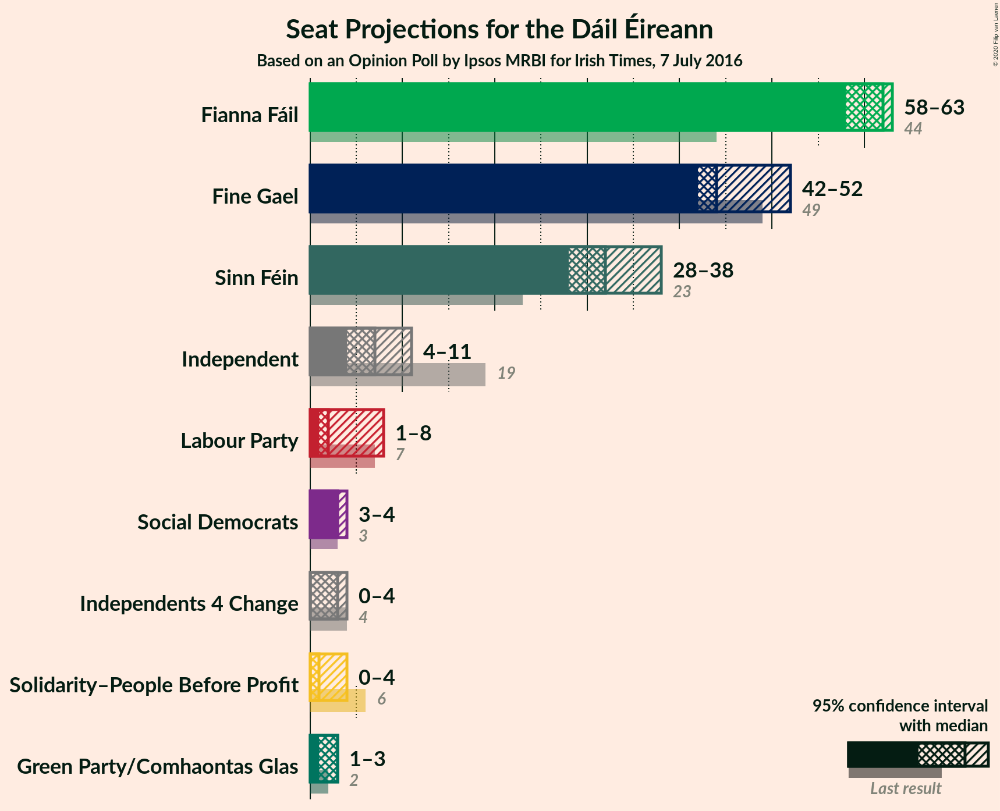
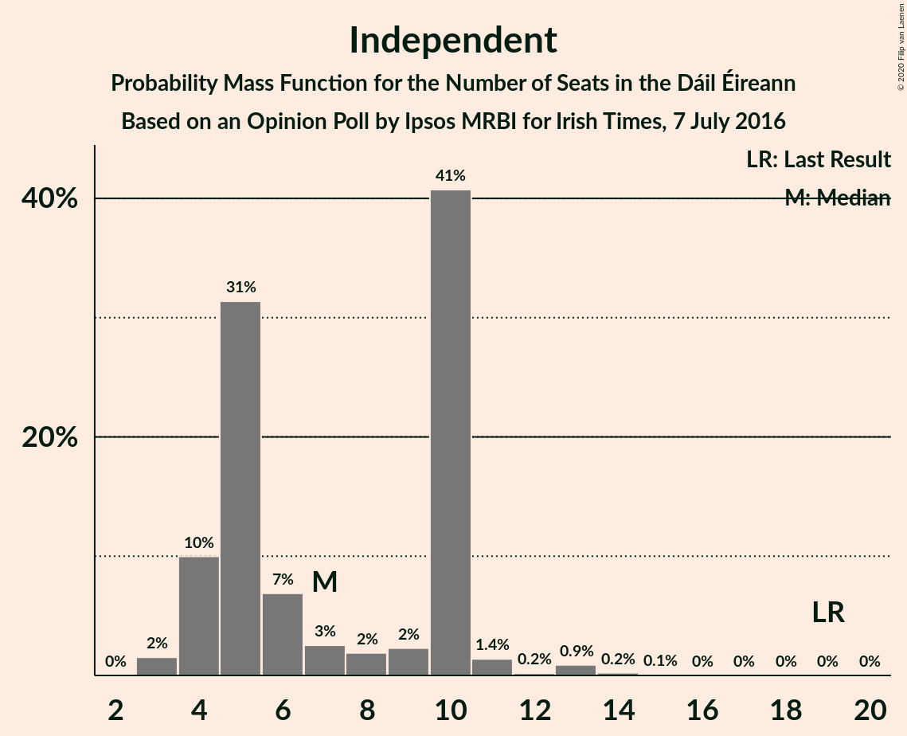
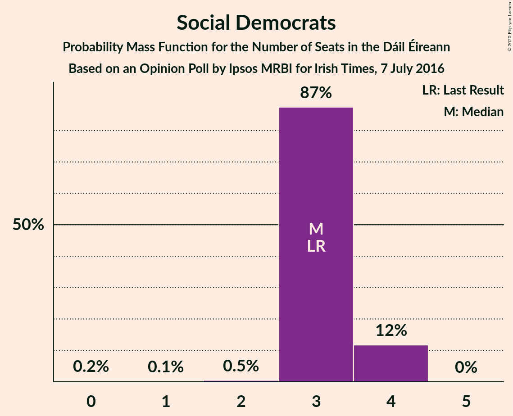
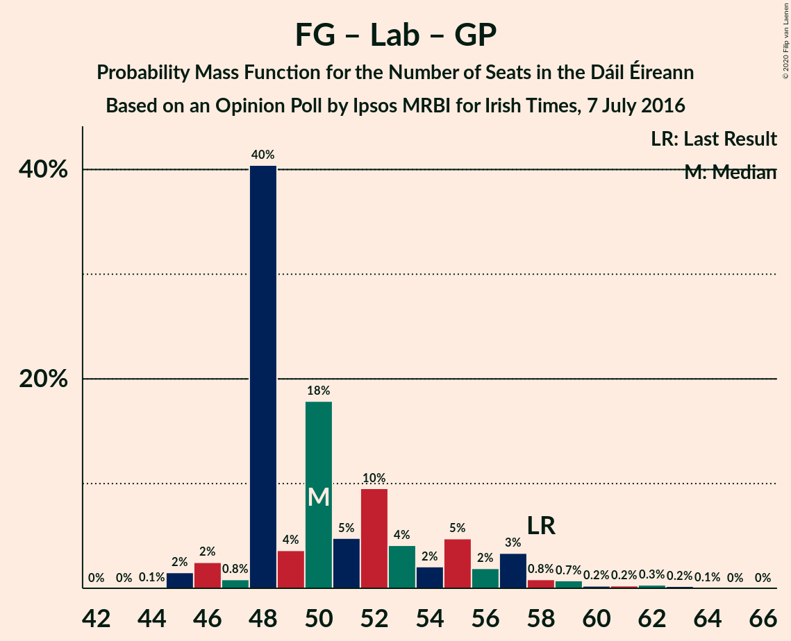

# Opinion Poll by Ipsos MRBI for Irish Times, 7 July 2016

<a href="#voting-intentions">Voting Intentions</a> | <a href="#seats">Seats</a> | <a href="#coalitions">Coalitions</a> | <a href="#technical-information">Technical Information</a>

## Voting Intentions

### Confidence Intervals

| Party | Last Result | Poll Result | 80% Confidence Interval | 90% Confidence Interval | 95% Confidence Interval | 99% Confidence Interval |
|:-----:|:-----------:|:-----------:|:-----------------------:|:-----------------------:|:-----------------------:|:-----------------------:|
| Fianna Fáil | 24.3% | 33.3% | 31.6–35.1% |31.1–35.6% |30.7–36.1% |29.9–36.9% |
| Fine Gael | 25.5% | 24.2% | 22.7–25.9% |22.3–26.4% |21.9–26.8% |21.2–27.6% |
| Sinn Féin | 13.8% | 16.2% | 14.9–17.6% |14.5–18.0% |14.2–18.4% |13.6–19.1% |
| Independent | 15.9% | 9.4% | 8.4–10.6% |8.1–10.9% |7.9–11.2% |7.4–11.8% |
| Labour Party | 6.6% | 5.1% | 4.3–6.0% |4.1–6.2% |4.0–6.5% |3.6–7.0% |
| Green Party/Comhaontas Glas | 2.7% | 4.0% | 3.4–4.8% |3.2–5.1% |3.0–5.3% |2.7–5.7% |
| Solidarity–People Before Profit | 3.9% | 2.0% | 1.6–2.6% |1.4–2.8% |1.3–3.0% |1.2–3.3% |
| Social Democrats | 3.0% | 2.0% | 1.6–2.6% |1.4–2.8% |1.3–3.0% |1.2–3.3% |
| Independents 4 Change | 1.5% | 1.2% | 0.9–1.7% |0.8–1.8% |0.7–2.0% |0.6–2.2% |

*Note:* The poll result column reflects the actual value used in the calculations. Published results may vary slightly, and in addition be rounded to fewer digits.

## Seats

### Confidence Intervals

| Party | Last Result | Median | 80% Confidence Interval | 90% Confidence Interval | 95% Confidence Interval | 99% Confidence Interval |
|:-----:|:-----------:|:------:|:-----------------------:|:-----------------------:|:-----------------------:|:-----------------------:|
| <a href="#fianna-fáil">Fianna Fáil</a> | 44 | 62 | 60–63 |59–63 |58–63 |57–63 |
| <a href="#fine-gael">Fine Gael</a> | 49 | 44 | 43–49 |42–51 |42–52 |41–54 |
| <a href="#sinn-féin">Sinn Féin</a> | 23 | 32 | 30–37 |29–37 |28–38 |27–39 |
| <a href="#independent">Independent</a> | 19 | 7 | 4–10 |4–10 |4–11 |3–13 |
| <a href="#labour-party">Labour Party</a> | 7 | 2 | 2–6 |1–7 |1–8 |0–9 |
| <a href="#green-party/comhaontas-glas">Green Party/Comhaontas Glas</a> | 2 | 3 | 2–3 |1–3 |1–3 |1–5 |
| <a href="#solidarity–people-before-profit">Solidarity–People Before Profit</a> | 6 | 1 | 0–3 |0–3 |0–4 |0–4 |
| <a href="#social-democrats">Social Democrats</a> | 3 | 3 | 3–4 |3–4 |3–4 |2–4 |
| <a href="#independents-4-change">Independents 4 Change</a> | 4 | 3 | 0–4 |0–4 |0–4 |0–5 |

### Fianna Fáil

*For a full overview of the results for this party, see the [Fianna Fáil](party-fiannafáil.html) page.*

| Number of Seats | Probability | Accumulated | Special Marks |
|:---------------:|:-----------:|:-----------:|:-------------:|
| 44 | 0% | 100% | Last Result |
| 45 | 0% | 100% |  |
| 46 | 0% | 100% |  |
| 47 | 0% | 100% |  |
| 48 | 0% | 100% |  |
| 49 | 0% | 100% |  |
| 50 | 0% | 100% |  |
| 51 | 0% | 100% |  |
| 52 | 0% | 100% |  |
| 53 | 0% | 100% |  |
| 54 | 0% | 100% |  |
| 55 | 0.2% | 99.9% |  |
| 56 | 0.1% | 99.8% |  |
| 57 | 0.6% | 99.6% |  |
| 58 | 2% | 99.1% |  |
| 59 | 5% | 97% |  |
| 60 | 3% | 92% |  |
| 61 | 8% | 89% |  |
| 62 | 68% | 81% | Median |
| 63 | 13% | 13% |  |
| 64 | 0% | 0% |  |

### Fine Gael

*For a full overview of the results for this party, see the [Fine Gael](party-finegael.html) page.*

| Number of Seats | Probability | Accumulated | Special Marks |
|:---------------:|:-----------:|:-----------:|:-------------:|
| 39 | 0% | 100% |  |
| 40 | 0.2% | 99.9% |  |
| 41 | 0.8% | 99.7% |  |
| 42 | 5% | 98.9% |  |
| 43 | 43% | 94% |  |
| 44 | 17% | 51% | Median |
| 45 | 4% | 34% |  |
| 46 | 4% | 30% |  |
| 47 | 11% | 27% |  |
| 48 | 5% | 16% |  |
| 49 | 2% | 11% | Last Result |
| 50 | 2% | 9% |  |
| 51 | 4% | 6% |  |
| 52 | 1.2% | 3% |  |
| 53 | 0.7% | 1.3% |  |
| 54 | 0.3% | 0.6% |  |
| 55 | 0.2% | 0.2% |  |
| 56 | 0% | 0% |  |

### Sinn Féin

*For a full overview of the results for this party, see the [Sinn Féin](party-sinnféin.html) page.*

| Number of Seats | Probability | Accumulated | Special Marks |
|:---------------:|:-----------:|:-----------:|:-------------:|
| 23 | 0% | 100% | Last Result |
| 24 | 0% | 100% |  |
| 25 | 0.2% | 99.9% |  |
| 26 | 0.2% | 99.7% |  |
| 27 | 1.1% | 99.6% |  |
| 28 | 2% | 98% |  |
| 29 | 4% | 97% |  |
| 30 | 7% | 92% |  |
| 31 | 2% | 86% |  |
| 32 | 40% | 84% | Median |
| 33 | 4% | 43% |  |
| 34 | 7% | 39% |  |
| 35 | 11% | 32% |  |
| 36 | 2% | 21% |  |
| 37 | 16% | 19% |  |
| 38 | 1.4% | 3% |  |
| 39 | 2% | 2% |  |
| 40 | 0% | 0% |  |

### Independent

*For a full overview of the results for this party, see the [Independent](party-independent.html) page.*

| Number of Seats | Probability | Accumulated | Special Marks |
|:---------------:|:-----------:|:-----------:|:-------------:|
| 3 | 2% | 100% |  |
| 4 | 10% | 98% |  |
| 5 | 31% | 88% |  |
| 6 | 7% | 57% |  |
| 7 | 3% | 50% | Median |
| 8 | 2% | 48% |  |
| 9 | 2% | 46% |  |
| 10 | 41% | 43% |  |
| 11 | 1.4% | 3% |  |
| 12 | 0.2% | 1.4% |  |
| 13 | 0.9% | 1.2% |  |
| 14 | 0.2% | 0.3% |  |
| 15 | 0.1% | 0.1% |  |
| 16 | 0% | 0% |  |
| 17 | 0% | 0% |  |
| 18 | 0% | 0% |  |
| 19 | 0% | 0% | Last Result |

### Labour Party

*For a full overview of the results for this party, see the [Labour Party](party-labourparty.html) page.*

| Number of Seats | Probability | Accumulated | Special Marks |
|:---------------:|:-----------:|:-----------:|:-------------:|
| 0 | 1.1% | 100% |  |
| 1 | 4% | 98.9% |  |
| 2 | 61% | 95% | Median |
| 3 | 19% | 34% |  |
| 4 | 1.1% | 14% |  |
| 5 | 0.8% | 13% |  |
| 6 | 4% | 13% |  |
| 7 | 5% | 9% | Last Result |
| 8 | 3% | 4% |  |
| 9 | 0.3% | 0.8% |  |
| 10 | 0.1% | 0.5% |  |
| 11 | 0.2% | 0.4% |  |
| 12 | 0.2% | 0.2% |  |
| 13 | 0% | 0% |  |

### Green Party/Comhaontas Glas

*For a full overview of the results for this party, see the [Green Party/Comhaontas Glas](party-greenpartycomhaontasglas.html) page.*

| Number of Seats | Probability | Accumulated | Special Marks |
|:---------------:|:-----------:|:-----------:|:-------------:|
| 0 | 0.1% | 100% |  |
| 1 | 8% | 99.9% |  |
| 2 | 27% | 92% | Last Result |
| 3 | 63% | 65% | Median |
| 4 | 0.9% | 2% |  |
| 5 | 0.9% | 1.3% |  |
| 6 | 0.3% | 0.4% |  |
| 7 | 0% | 0% |  |

### Solidarity–People Before Profit

*For a full overview of the results for this party, see the [Solidarity–People Before Profit](party-solidarity–peoplebeforeprofit.html) page.*

| Number of Seats | Probability | Accumulated | Special Marks |
|:---------------:|:-----------:|:-----------:|:-------------:|
| 0 | 17% | 100% |  |
| 1 | 58% | 83% | Median |
| 2 | 6% | 25% |  |
| 3 | 16% | 19% |  |
| 4 | 2% | 3% |  |
| 5 | 0.2% | 0.2% |  |
| 6 | 0% | 0% | Last Result |

### Social Democrats

*For a full overview of the results for this party, see the [Social Democrats](party-socialdemocrats.html) page.*

| Number of Seats | Probability | Accumulated | Special Marks |
|:---------------:|:-----------:|:-----------:|:-------------:|
| 0 | 0.2% | 100% |  |
| 1 | 0.1% | 99.8% |  |
| 2 | 0.5% | 99.7% |  |
| 3 | 87% | 99.2% | Last Result, Median |
| 4 | 12% | 12% |  |
| 5 | 0% | 0% |  |

### Independents 4 Change

*For a full overview of the results for this party, see the [Independents 4 Change](party-independents4change.html) page.*

| Number of Seats | Probability | Accumulated | Special Marks |
|:---------------:|:-----------:|:-----------:|:-------------:|
| 0 | 12% | 100% |  |
| 1 | 22% | 88% |  |
| 2 | 7% | 67% |  |
| 3 | 45% | 60% | Median |
| 4 | 14% | 15% | Last Result |
| 5 | 0.8% | 0.8% |  |
| 6 | 0% | 0% |  |

## Coalitions

### Confidence Intervals

| Coalition | Last Result | Median | Majority? | 80% Confidence Interval | 90% Confidence Interval | 95% Confidence Interval | 99% Confidence Interval |
|:---------:|:-----------:|:------:|:---------:|:-----------------------:|:-----------------------:|:-----------------------:|:-----------------------:|
| Fianna Fáil – Fine Gael | 93 | 105 | 100% | 105–110 | 104–111 | 104–112 | 100–114 |
| Fianna Fáil – Sinn Féin | 67 | 94 | 100% | 91–99 | 90–99 | 88–99 | 86–100 |
| Fianna Fáil – Labour Party – Green Party/Comhaontas Glas – Social Democrats | 56 | 70 | 0% | 68–73 | 66–74 | 65–75 | 65–76 |
| Fianna Fáil – Labour Party – Green Party/Comhaontas Glas | 53 | 67 | 0% | 65–70 | 63–71 | 62–72 | 62–73 |
| Fianna Fáil – Labour Party | 51 | 64 | 0% | 63–68 | 61–69 | 61–70 | 60–70 |
| Fianna Fáil – Green Party/Comhaontas Glas | 46 | 65 | 0% | 63–65 | 61–65 | 60–65 | 59–66 |
| Fine Gael – Labour Party – Green Party/Comhaontas Glas – Social Democrats | 61 | 53 | 0% | 51–58 | 50–60 | 50–61 | 48–65 |
| Fine Gael – Labour Party – Green Party/Comhaontas Glas | 58 | 50 | 0% | 48–55 | 48–57 | 46–58 | 45–62 |
| Fine Gael – Labour Party | 56 | 47 | 0% | 45–53 | 45–54 | 44–55 | 44–59 |
| Fine Gael – Green Party/Comhaontas Glas | 51 | 46 | 0% | 46–52 | 44–53 | 44–54 | 43–56 |
| Fine Gael | 49 | 44 | 0% | 43–49 | 42–51 | 42–52 | 41–54 |

### Fianna Fáil – Fine Gael

| Number of Seats | Probability | Accumulated | Special Marks |
|:---------------:|:-----------:|:-----------:|:-------------:|
| 93 | 0% | 100% | Last Result |
| 94 | 0% | 100% |  |
| 95 | 0% | 100% |  |
| 96 | 0% | 100% |  |
| 97 | 0% | 100% |  |
| 98 | 0% | 100% |  |
| 99 | 0.2% | 99.9% |  |
| 100 | 0.3% | 99.7% |  |
| 101 | 0.2% | 99.5% |  |
| 102 | 0.4% | 99.2% |  |
| 103 | 0.9% | 98.9% |  |
| 104 | 5% | 98% |  |
| 105 | 43% | 92% |  |
| 106 | 20% | 50% | Median |
| 107 | 0.9% | 29% |  |
| 108 | 5% | 29% |  |
| 109 | 7% | 24% |  |
| 110 | 8% | 17% |  |
| 111 | 4% | 9% |  |
| 112 | 3% | 5% |  |
| 113 | 0.3% | 1.2% |  |
| 114 | 0.6% | 0.9% |  |
| 115 | 0.2% | 0.3% |  |
| 116 | 0.1% | 0.1% |  |
| 117 | 0% | 0% |  |

### Fianna Fáil – Sinn Féin

| Number of Seats | Probability | Accumulated | Special Marks |
|:---------------:|:-----------:|:-----------:|:-------------:|
| 67 | 0% | 100% | Last Result |
| 68 | 0% | 100% |  |
| 69 | 0% | 100% |  |
| 70 | 0% | 100% |  |
| 71 | 0% | 100% |  |
| 72 | 0% | 100% |  |
| 73 | 0% | 100% |  |
| 74 | 0% | 100% |  |
| 75 | 0% | 100% |  |
| 76 | 0% | 100% |  |
| 77 | 0% | 100% |  |
| 78 | 0% | 100% |  |
| 79 | 0% | 100% |  |
| 80 | 0% | 100% |  |
| 81 | 0% | 100% | Majority |
| 82 | 0% | 100% |  |
| 83 | 0% | 100% |  |
| 84 | 0.4% | 100% |  |
| 85 | 0.1% | 99.6% |  |
| 86 | 0.1% | 99.5% |  |
| 87 | 0.8% | 99.4% |  |
| 88 | 1.2% | 98.6% |  |
| 89 | 0.5% | 97% |  |
| 90 | 4% | 97% |  |
| 91 | 5% | 93% |  |
| 92 | 5% | 88% |  |
| 93 | 2% | 83% |  |
| 94 | 41% | 81% | Median |
| 95 | 4% | 40% |  |
| 96 | 4% | 36% |  |
| 97 | 10% | 32% |  |
| 98 | 5% | 22% |  |
| 99 | 17% | 17% |  |
| 100 | 0.6% | 0.7% |  |
| 101 | 0% | 0.1% |  |
| 102 | 0.1% | 0.1% |  |
| 103 | 0% | 0% |  |

### Fianna Fáil – Labour Party – Green Party/Comhaontas Glas – Social Democrats

| Number of Seats | Probability | Accumulated | Special Marks |
|:---------------:|:-----------:|:-----------:|:-------------:|
| 56 | 0% | 100% | Last Result |
| 57 | 0% | 100% |  |
| 58 | 0% | 100% |  |
| 59 | 0% | 100% |  |
| 60 | 0% | 100% |  |
| 61 | 0% | 100% |  |
| 62 | 0% | 100% |  |
| 63 | 0.1% | 100% |  |
| 64 | 0.1% | 99.9% |  |
| 65 | 2% | 99.8% |  |
| 66 | 3% | 97% |  |
| 67 | 2% | 95% |  |
| 68 | 4% | 92% |  |
| 69 | 7% | 88% |  |
| 70 | 51% | 81% | Median |
| 71 | 18% | 31% |  |
| 72 | 0.9% | 13% |  |
| 73 | 4% | 12% |  |
| 74 | 4% | 9% |  |
| 75 | 3% | 5% |  |
| 76 | 1.1% | 1.2% |  |
| 77 | 0.1% | 0.1% |  |
| 78 | 0% | 0% |  |

### Fianna Fáil – Labour Party – Green Party/Comhaontas Glas

| Number of Seats | Probability | Accumulated | Special Marks |
|:---------------:|:-----------:|:-----------:|:-------------:|
| 53 | 0% | 100% | Last Result |
| 54 | 0% | 100% |  |
| 55 | 0% | 100% |  |
| 56 | 0% | 100% |  |
| 57 | 0% | 100% |  |
| 58 | 0% | 100% |  |
| 59 | 0% | 100% |  |
| 60 | 0.1% | 100% |  |
| 61 | 0.1% | 99.9% |  |
| 62 | 2% | 99.8% |  |
| 63 | 4% | 97% |  |
| 64 | 2% | 94% |  |
| 65 | 4% | 92% |  |
| 66 | 10% | 88% |  |
| 67 | 48% | 78% | Median |
| 68 | 17% | 30% |  |
| 69 | 1.3% | 13% |  |
| 70 | 5% | 12% |  |
| 71 | 3% | 6% |  |
| 72 | 3% | 4% |  |
| 73 | 0.4% | 0.5% |  |
| 74 | 0.1% | 0.1% |  |
| 75 | 0% | 0.1% |  |
| 76 | 0% | 0% |  |

### Fianna Fáil – Labour Party

| Number of Seats | Probability | Accumulated | Special Marks |
|:---------------:|:-----------:|:-----------:|:-------------:|
| 51 | 0% | 100% | Last Result |
| 52 | 0% | 100% |  |
| 53 | 0% | 100% |  |
| 54 | 0% | 100% |  |
| 55 | 0% | 100% |  |
| 56 | 0% | 100% |  |
| 57 | 0% | 100% |  |
| 58 | 0.2% | 100% |  |
| 59 | 0.3% | 99.8% |  |
| 60 | 0.8% | 99.5% |  |
| 61 | 5% | 98.8% |  |
| 62 | 3% | 94% |  |
| 63 | 5% | 91% |  |
| 64 | 52% | 87% | Median |
| 65 | 21% | 35% |  |
| 66 | 2% | 14% |  |
| 67 | 0.5% | 12% |  |
| 68 | 4% | 11% |  |
| 69 | 3% | 7% |  |
| 70 | 3% | 4% |  |
| 71 | 0.1% | 0.2% |  |
| 72 | 0% | 0.1% |  |
| 73 | 0.1% | 0.1% |  |
| 74 | 0% | 0% |  |

### Fianna Fáil – Green Party/Comhaontas Glas

| Number of Seats | Probability | Accumulated | Special Marks |
|:---------------:|:-----------:|:-----------:|:-------------:|
| 46 | 0% | 100% | Last Result |
| 47 | 0% | 100% |  |
| 48 | 0% | 100% |  |
| 49 | 0% | 100% |  |
| 50 | 0% | 100% |  |
| 51 | 0% | 100% |  |
| 52 | 0% | 100% |  |
| 53 | 0% | 100% |  |
| 54 | 0% | 100% |  |
| 55 | 0% | 100% |  |
| 56 | 0% | 100% |  |
| 57 | 0.1% | 100% |  |
| 58 | 0.1% | 99.8% |  |
| 59 | 0.4% | 99.8% |  |
| 60 | 3% | 99.4% |  |
| 61 | 4% | 96% |  |
| 62 | 2% | 93% |  |
| 63 | 7% | 91% |  |
| 64 | 15% | 83% |  |
| 65 | 68% | 69% | Median |
| 66 | 0.7% | 1.0% |  |
| 67 | 0.4% | 0.4% |  |
| 68 | 0% | 0% |  |

### Fine Gael – Labour Party – Green Party/Comhaontas Glas – Social Democrats

| Number of Seats | Probability | Accumulated | Special Marks |
|:---------------:|:-----------:|:-----------:|:-------------:|
| 47 | 0.1% | 100% |  |
| 48 | 1.4% | 99.8% |  |
| 49 | 0.7% | 98% |  |
| 50 | 3% | 98% |  |
| 51 | 40% | 95% |  |
| 52 | 1.3% | 55% | Median |
| 53 | 20% | 53% |  |
| 54 | 5% | 34% |  |
| 55 | 8% | 29% |  |
| 56 | 5% | 21% |  |
| 57 | 3% | 16% |  |
| 58 | 4% | 13% |  |
| 59 | 3% | 9% |  |
| 60 | 3% | 6% |  |
| 61 | 1.4% | 3% | Last Result |
| 62 | 0.3% | 2% |  |
| 63 | 0.4% | 1.3% |  |
| 64 | 0.3% | 0.9% |  |
| 65 | 0.3% | 0.6% |  |
| 66 | 0.2% | 0.3% |  |
| 67 | 0.1% | 0.1% |  |
| 68 | 0% | 0% |  |

### Fine Gael – Labour Party – Green Party/Comhaontas Glas

| Number of Seats | Probability | Accumulated | Special Marks |
|:---------------:|:-----------:|:-----------:|:-------------:|
| 44 | 0.1% | 100% |  |
| 45 | 2% | 99.9% |  |
| 46 | 2% | 98% |  |
| 47 | 0.8% | 96% |  |
| 48 | 40% | 95% |  |
| 49 | 4% | 55% | Median |
| 50 | 18% | 51% |  |
| 51 | 5% | 33% |  |
| 52 | 10% | 28% |  |
| 53 | 4% | 19% |  |
| 54 | 2% | 15% |  |
| 55 | 5% | 13% |  |
| 56 | 2% | 8% |  |
| 57 | 3% | 6% |  |
| 58 | 0.8% | 3% | Last Result |
| 59 | 0.7% | 2% |  |
| 60 | 0.2% | 1.1% |  |
| 61 | 0.2% | 0.9% |  |
| 62 | 0.3% | 0.6% |  |
| 63 | 0.2% | 0.3% |  |
| 64 | 0.1% | 0.1% |  |
| 65 | 0% | 0% |  |

### Fine Gael – Labour Party

| Number of Seats | Probability | Accumulated | Special Marks |
|:---------------:|:-----------:|:-----------:|:-------------:|
| 42 | 0% | 100% |  |
| 43 | 0.3% | 99.9% |  |
| 44 | 4% | 99.6% |  |
| 45 | 39% | 95% |  |
| 46 | 1.1% | 56% | Median |
| 47 | 19% | 55% |  |
| 48 | 2% | 36% |  |
| 49 | 8% | 34% |  |
| 50 | 7% | 26% |  |
| 51 | 6% | 19% |  |
| 52 | 1.5% | 13% |  |
| 53 | 5% | 12% |  |
| 54 | 2% | 7% |  |
| 55 | 2% | 5% |  |
| 56 | 0.8% | 2% | Last Result |
| 57 | 0.3% | 1.4% |  |
| 58 | 0.2% | 1.0% |  |
| 59 | 0.3% | 0.8% |  |
| 60 | 0.5% | 0.5% |  |
| 61 | 0% | 0% |  |

### Fine Gael – Green Party/Comhaontas Glas

| Number of Seats | Probability | Accumulated | Special Marks |
|:---------------:|:-----------:|:-----------:|:-------------:|
| 41 | 0.1% | 100% |  |
| 42 | 0.2% | 99.9% |  |
| 43 | 2% | 99.7% |  |
| 44 | 3% | 98% |  |
| 45 | 4% | 95% |  |
| 46 | 43% | 91% |  |
| 47 | 17% | 48% | Median |
| 48 | 6% | 31% |  |
| 49 | 7% | 25% |  |
| 50 | 7% | 18% |  |
| 51 | 0.7% | 11% | Last Result |
| 52 | 3% | 11% |  |
| 53 | 4% | 8% |  |
| 54 | 2% | 4% |  |
| 55 | 0.8% | 2% |  |
| 56 | 1.0% | 1.3% |  |
| 57 | 0.3% | 0.3% |  |
| 58 | 0% | 0% |  |

### Fine Gael

| Number of Seats | Probability | Accumulated | Special Marks |
|:---------------:|:-----------:|:-----------:|:-------------:|
| 39 | 0% | 100% |  |
| 40 | 0.2% | 99.9% |  |
| 41 | 0.8% | 99.7% |  |
| 42 | 5% | 98.9% |  |
| 43 | 43% | 94% |  |
| 44 | 17% | 51% | Median |
| 45 | 4% | 34% |  |
| 46 | 4% | 30% |  |
| 47 | 11% | 27% |  |
| 48 | 5% | 16% |  |
| 49 | 2% | 11% | Last Result |
| 50 | 2% | 9% |  |
| 51 | 4% | 6% |  |
| 52 | 1.2% | 3% |  |
| 53 | 0.7% | 1.3% |  |
| 54 | 0.3% | 0.6% |  |
| 55 | 0.2% | 0.2% |  |
| 56 | 0% | 0% |  |

## Technical Information

### Opinion Poll

+ **Polling firm:** Ipsos MRBI
+ **Commissioner(s):** Irish Times
+ **Fieldwork period:** 7 July 2016

### Calculations

+ **Sample size:** 1200
+ **Simulations done:** 131,072
+ **Error estimate:** 0.98%

