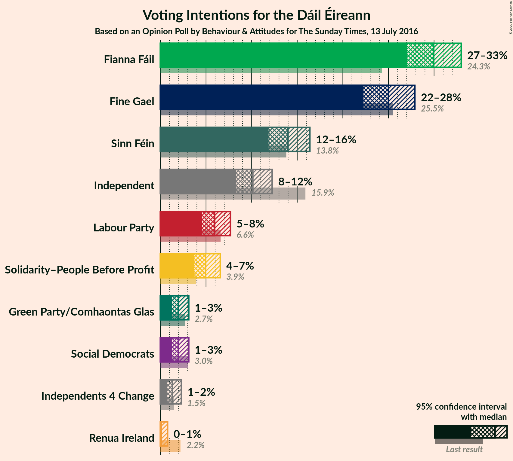
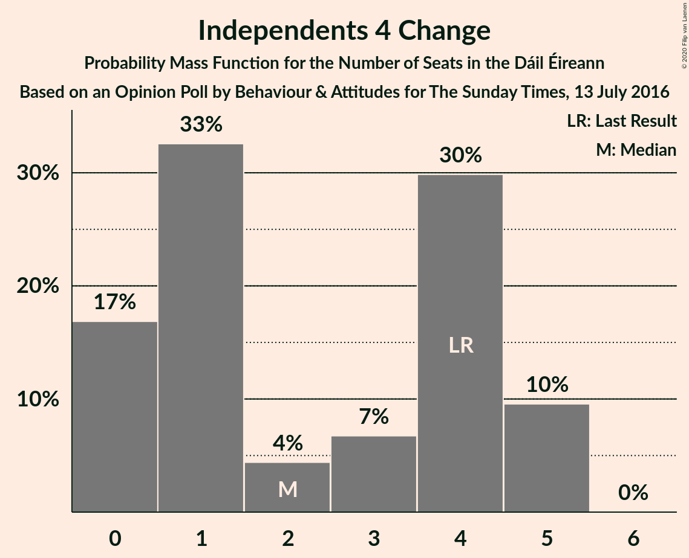
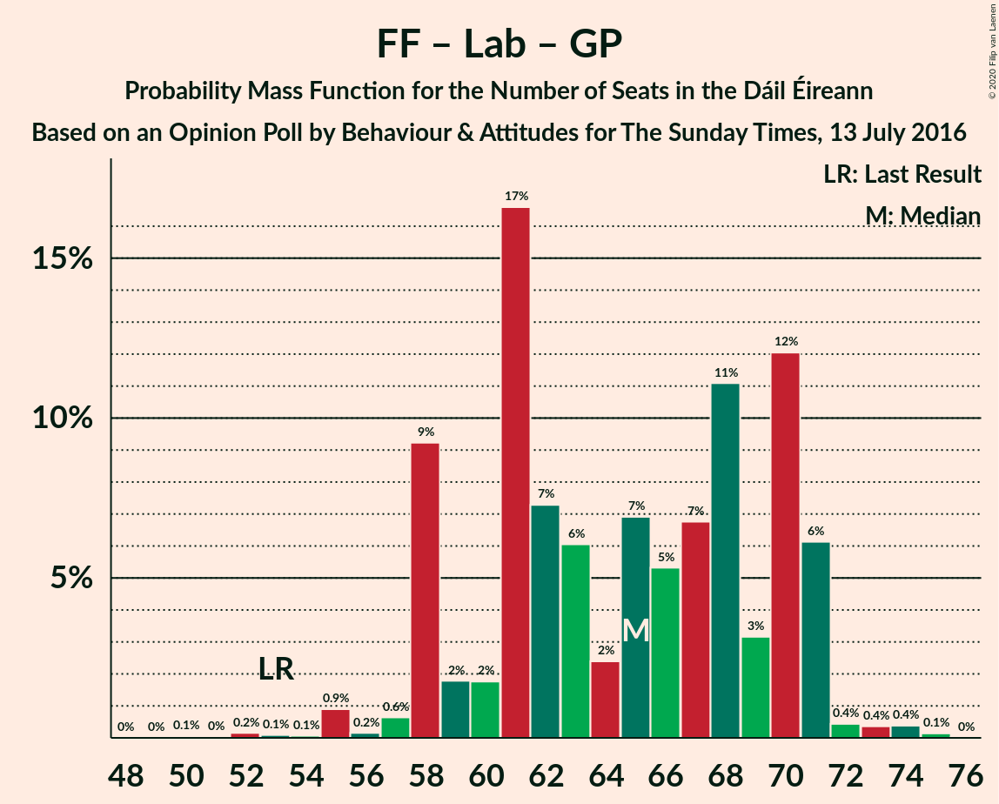
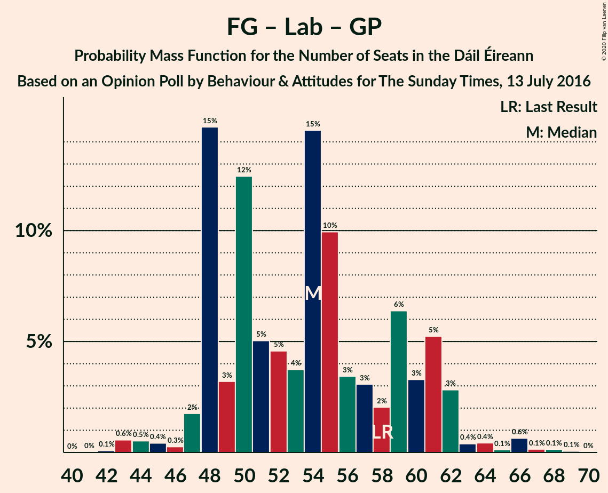
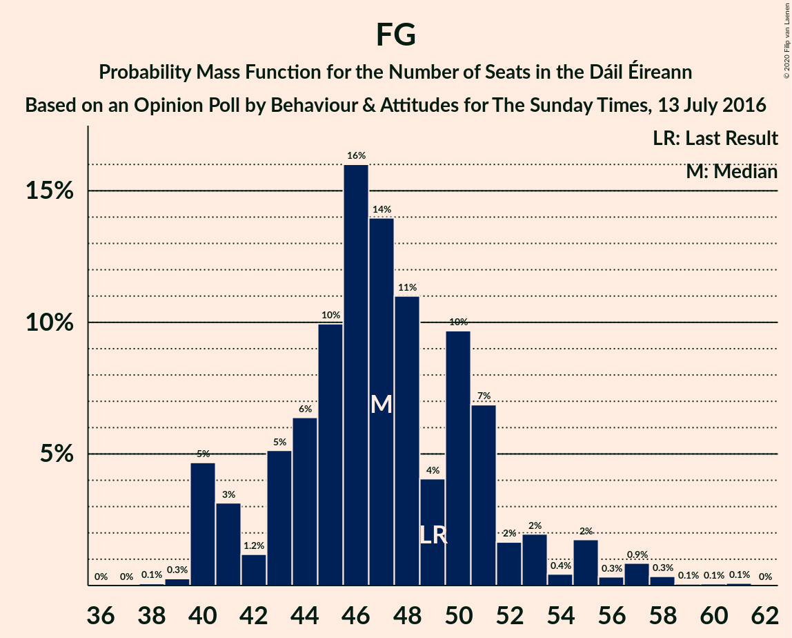

# Opinion Poll by Behaviour & Attitudes for The Sunday Times, 13 July 2016

<a href="#voting-intentions">Voting Intentions</a> | <a href="#seats">Seats</a> | <a href="#coalitions">Coalitions</a> | <a href="#technical-information">Technical Information</a>

## Voting Intentions

### Confidence Intervals

| Party | Last Result | Poll Result | 80% Confidence Interval | 90% Confidence Interval | 95% Confidence Interval | 99% Confidence Interval |
|:-----:|:-----------:|:-----------:|:-----------------------:|:-----------------------:|:-----------------------:|:-----------------------:|
| Fianna Fáil | 24.3% | 29.9% | 28.0–31.9% |27.5–32.5% |27.0–33.0% |26.1–34.0% |
| Fine Gael | 25.5% | 25.0% | 23.2–26.9% |22.7–27.4% |22.3–27.9% |21.4–28.8% |
| Sinn Féin | 13.8% | 14.0% | 12.6–15.5% |12.2–16.0% |11.9–16.4% |11.2–17.2% |
| Independent | 15.9% | 10.1% | 8.9–11.5% |8.6–11.9% |8.3–12.3% |7.8–13.0% |
| Labour Party | 6.6% | 5.9% | 5.0–7.1% |4.8–7.4% |4.6–7.7% |4.2–8.3% |
| Solidarity–People Before Profit | 3.9% | 5.0% | 4.1–6.0% |3.9–6.3% |3.7–6.6% |3.4–7.1% |
| Social Democrats | 3.0% | 2.0% | 1.5–2.7% |1.4–2.9% |1.2–3.1% |1.1–3.5% |
| Green Party/Comhaontas Glas | 2.7% | 2.0% | 1.5–2.7% |1.4–2.9% |1.2–3.1% |1.1–3.5% |
| Independents 4 Change | 1.5% | 1.3% | 0.9–2.0% |0.8–2.1% |0.8–2.3% |0.6–2.6% |
| Renua Ireland | 2.2% | 0.2% | 0.1–0.6% |0.1–0.7% |0.1–0.8% |0.0–1.0% |

*Note:* The poll result column reflects the actual value used in the calculations. Published results may vary slightly, and in addition be rounded to fewer digits.

## Seats

### Confidence Intervals

| Party | Last Result | Median | 80% Confidence Interval | 90% Confidence Interval | 95% Confidence Interval | 99% Confidence Interval |
|:-----:|:-----------:|:------:|:-----------------------:|:-----------------------:|:-----------------------:|:-----------------------:|
| <a href="#fianna-fáil">Fianna Fáil</a> | 44 | 59 | 56–61 |54–62 |52–62 |51–62 |
| <a href="#fine-gael">Fine Gael</a> | 49 | 47 | 42–51 |40–51 |40–53 |39–60 |
| <a href="#sinn-féin">Sinn Féin</a> | 23 | 28 | 20–30 |20–33 |20–34 |18–34 |
| <a href="#independent">Independent</a> | 19 | 6 | 5–12 |4–13 |4–14 |3–15 |
| <a href="#labour-party">Labour Party</a> | 7 | 6 | 2–12 |1–12 |1–12 |0–14 |
| <a href="#solidarity–people-before-profit">Solidarity–People Before Profit</a> | 6 | 9 | 5–9 |5–9 |5–10 |3–10 |
| <a href="#social-democrats">Social Democrats</a> | 3 | 3 | 2–4 |2–4 |2–4 |1–4 |
| <a href="#green-party/comhaontas-glas">Green Party/Comhaontas Glas</a> | 2 | 0 | 0–1 |0–1 |0–1 |0–2 |
| <a href="#independents-4-change">Independents 4 Change</a> | 4 | 3 | 1–4 |0–5 |0–5 |0–5 |
| <a href="#renua-ireland">Renua Ireland</a> | 0 | 0 | 0 |0 |0 |0 |

### Fianna Fáil

*For a full overview of the results for this party, see the [Fianna Fáil](party-fiannafáil.html) page.*

| Number of Seats | Probability | Accumulated | Special Marks |
|:---------------:|:-----------:|:-----------:|:-------------:|
| 44 | 0% | 100% | Last Result |
| 45 | 0% | 100% |  |
| 46 | 0% | 100% |  |
| 47 | 0% | 100% |  |
| 48 | 0% | 100% |  |
| 49 | 0.1% | 99.9% |  |
| 50 | 0.2% | 99.8% |  |
| 51 | 0.2% | 99.7% |  |
| 52 | 2% | 99.5% |  |
| 53 | 0.5% | 97% |  |
| 54 | 2% | 97% |  |
| 55 | 4% | 94% |  |
| 56 | 3% | 91% |  |
| 57 | 7% | 88% |  |
| 58 | 22% | 81% |  |
| 59 | 43% | 59% | Median |
| 60 | 2% | 16% |  |
| 61 | 8% | 14% |  |
| 62 | 6% | 6% |  |
| 63 | 0% | 0% |  |

### Fine Gael

*For a full overview of the results for this party, see the [Fine Gael](party-finegael.html) page.*

| Number of Seats | Probability | Accumulated | Special Marks |
|:---------------:|:-----------:|:-----------:|:-------------:|
| 38 | 0.4% | 100% |  |
| 39 | 0.3% | 99.5% |  |
| 40 | 7% | 99.3% |  |
| 41 | 0.6% | 92% |  |
| 42 | 3% | 92% |  |
| 43 | 4% | 89% |  |
| 44 | 6% | 85% |  |
| 45 | 2% | 79% |  |
| 46 | 9% | 77% |  |
| 47 | 21% | 68% | Median |
| 48 | 25% | 48% |  |
| 49 | 4% | 23% | Last Result |
| 50 | 0.7% | 18% |  |
| 51 | 13% | 18% |  |
| 52 | 2% | 5% |  |
| 53 | 0.3% | 3% |  |
| 54 | 0.2% | 2% |  |
| 55 | 0.9% | 2% |  |
| 56 | 0.1% | 1.3% |  |
| 57 | 0.4% | 1.2% |  |
| 58 | 0.1% | 0.8% |  |
| 59 | 0.1% | 0.7% |  |
| 60 | 0.1% | 0.6% |  |
| 61 | 0.4% | 0.5% |  |
| 62 | 0% | 0.1% |  |
| 63 | 0% | 0.1% |  |
| 64 | 0% | 0% |  |

### Sinn Féin

*For a full overview of the results for this party, see the [Sinn Féin](party-sinnféin.html) page.*

| Number of Seats | Probability | Accumulated | Special Marks |
|:---------------:|:-----------:|:-----------:|:-------------:|
| 14 | 0% | 100% |  |
| 15 | 0% | 99.9% |  |
| 16 | 0% | 99.9% |  |
| 17 | 0.4% | 99.9% |  |
| 18 | 0% | 99.5% |  |
| 19 | 0.7% | 99.5% |  |
| 20 | 9% | 98.8% |  |
| 21 | 1.1% | 90% |  |
| 22 | 16% | 88% |  |
| 23 | 4% | 72% | Last Result |
| 24 | 5% | 68% |  |
| 25 | 0.7% | 63% |  |
| 26 | 2% | 62% |  |
| 27 | 1.4% | 60% |  |
| 28 | 24% | 59% | Median |
| 29 | 16% | 35% |  |
| 30 | 9% | 18% |  |
| 31 | 3% | 10% |  |
| 32 | 0.8% | 6% |  |
| 33 | 1.5% | 5% |  |
| 34 | 4% | 4% |  |
| 35 | 0% | 0.3% |  |
| 36 | 0.2% | 0.2% |  |
| 37 | 0% | 0% |  |

### Independent

*For a full overview of the results for this party, see the [Independent](party-independent.html) page.*

| Number of Seats | Probability | Accumulated | Special Marks |
|:---------------:|:-----------:|:-----------:|:-------------:|
| 3 | 2% | 100% |  |
| 4 | 3% | 98% |  |
| 5 | 23% | 95% |  |
| 6 | 24% | 72% | Median |
| 7 | 1.0% | 47% |  |
| 8 | 16% | 46% |  |
| 9 | 0.8% | 30% |  |
| 10 | 4% | 30% |  |
| 11 | 4% | 25% |  |
| 12 | 13% | 21% |  |
| 13 | 4% | 8% |  |
| 14 | 1.4% | 4% |  |
| 15 | 2% | 2% |  |
| 16 | 0.1% | 0.1% |  |
| 17 | 0% | 0% |  |
| 18 | 0% | 0% |  |
| 19 | 0% | 0% | Last Result |

### Labour Party

*For a full overview of the results for this party, see the [Labour Party](party-labourparty.html) page.*

| Number of Seats | Probability | Accumulated | Special Marks |
|:---------------:|:-----------:|:-----------:|:-------------:|
| 0 | 1.0% | 100% |  |
| 1 | 8% | 99.0% |  |
| 2 | 5% | 91% |  |
| 3 | 15% | 86% |  |
| 4 | 5% | 71% |  |
| 5 | 4% | 66% |  |
| 6 | 19% | 62% | Median |
| 7 | 2% | 43% | Last Result |
| 8 | 3% | 41% |  |
| 9 | 17% | 38% |  |
| 10 | 7% | 21% |  |
| 11 | 0.8% | 14% |  |
| 12 | 12% | 14% |  |
| 13 | 0.3% | 2% |  |
| 14 | 1.2% | 2% |  |
| 15 | 0.1% | 0.3% |  |
| 16 | 0% | 0.2% |  |
| 17 | 0.1% | 0.1% |  |
| 18 | 0% | 0% |  |

### Solidarity–People Before Profit

*For a full overview of the results for this party, see the [Solidarity–People Before Profit](party-solidarity–peoplebeforeprofit.html) page.*

| Number of Seats | Probability | Accumulated | Special Marks |
|:---------------:|:-----------:|:-----------:|:-------------:|
| 3 | 0.7% | 100% |  |
| 4 | 0.7% | 99.3% |  |
| 5 | 14% | 98.7% |  |
| 6 | 3% | 85% | Last Result |
| 7 | 6% | 81% |  |
| 8 | 11% | 75% |  |
| 9 | 60% | 63% | Median |
| 10 | 3% | 3% |  |
| 11 | 0% | 0% |  |

### Social Democrats

*For a full overview of the results for this party, see the [Social Democrats](party-socialdemocrats.html) page.*

| Number of Seats | Probability | Accumulated | Special Marks |
|:---------------:|:-----------:|:-----------:|:-------------:|
| 1 | 1.0% | 100% |  |
| 2 | 12% | 99.0% |  |
| 3 | 67% | 87% | Last Result, Median |
| 4 | 20% | 20% |  |
| 5 | 0% | 0% |  |

### Green Party/Comhaontas Glas

*For a full overview of the results for this party, see the [Green Party/Comhaontas Glas](party-greenpartycomhaontasglas.html) page.*

| Number of Seats | Probability | Accumulated | Special Marks |
|:---------------:|:-----------:|:-----------:|:-------------:|
| 0 | 61% | 100% | Median |
| 1 | 37% | 39% |  |
| 2 | 2% | 2% | Last Result |
| 3 | 0% | 0% |  |

### Independents 4 Change

*For a full overview of the results for this party, see the [Independents 4 Change](party-independents4change.html) page.*

| Number of Seats | Probability | Accumulated | Special Marks |
|:---------------:|:-----------:|:-----------:|:-------------:|
| 0 | 6% | 100% |  |
| 1 | 41% | 94% |  |
| 2 | 2% | 53% |  |
| 3 | 19% | 50% | Median |
| 4 | 23% | 31% | Last Result |
| 5 | 8% | 8% |  |
| 6 | 0% | 0% |  |

### Renua Ireland

*For a full overview of the results for this party, see the [Renua Ireland](party-renuaireland.html) page.*

| Number of Seats | Probability | Accumulated | Special Marks |
|:---------------:|:-----------:|:-----------:|:-------------:|
| 0 | 100% | 100% | Last Result, Median |

## Coalitions

### Confidence Intervals

| Coalition | Last Result | Median | Majority? | 80% Confidence Interval | 90% Confidence Interval | 95% Confidence Interval | 99% Confidence Interval |
|:---------:|:-----------:|:------:|:---------:|:-----------------------:|:-----------------------:|:-----------------------:|:-----------------------:|
| Fianna Fáil – Fine Gael | 93 | 106 | 100% | 100–110 | 99–110 | 99–111 | 97–116 |
| Fianna Fáil – Sinn Féin | 67 | 87 | 75% | 78–89 | 78–90 | 78–90 | 75–93 |
| Fianna Fáil – Labour Party – Green Party/Comhaontas Glas – Social Democrats | 56 | 69 | 0% | 62–74 | 61–74 | 58–74 | 58–76 |
| Fianna Fáil – Labour Party – Green Party/Comhaontas Glas | 53 | 65 | 0% | 59–71 | 57–71 | 55–71 | 55–73 |
| Fianna Fáil – Labour Party | 51 | 65 | 0% | 59–71 | 57–71 | 55–71 | 55–73 |
| Fine Gael – Labour Party – Green Party/Comhaontas Glas – Social Democrats | 61 | 57 | 0% | 51–64 | 51–64 | 47–64 | 47–69 |
| Fianna Fáil – Green Party/Comhaontas Glas | 46 | 59 | 0% | 56–61 | 55–62 | 52–63 | 52–63 |
| Fine Gael – Labour Party – Green Party/Comhaontas Glas | 58 | 53 | 0% | 48–61 | 48–61 | 44–61 | 44–66 |
| Fine Gael – Labour Party | 56 | 53 | 0% | 47–60 | 47–60 | 44–61 | 43–66 |
| Fine Gael – Green Party/Comhaontas Glas | 51 | 48 | 0% | 42–52 | 40–52 | 40–54 | 39–60 |
| Fine Gael | 49 | 47 | 0% | 42–51 | 40–51 | 40–53 | 39–60 |

### Fianna Fáil – Fine Gael

| Number of Seats | Probability | Accumulated | Special Marks |
|:---------------:|:-----------:|:-----------:|:-------------:|
| 93 | 0% | 100% | Last Result |
| 94 | 0.2% | 100% |  |
| 95 | 0.1% | 99.7% |  |
| 96 | 0.1% | 99.6% |  |
| 97 | 0.4% | 99.5% |  |
| 98 | 0.6% | 99.1% |  |
| 99 | 5% | 98% |  |
| 100 | 5% | 94% |  |
| 101 | 10% | 89% |  |
| 102 | 0.9% | 79% |  |
| 103 | 2% | 78% |  |
| 104 | 0.4% | 77% |  |
| 105 | 7% | 76% |  |
| 106 | 42% | 69% | Median |
| 107 | 7% | 27% |  |
| 108 | 5% | 20% |  |
| 109 | 0.8% | 15% |  |
| 110 | 12% | 15% |  |
| 111 | 0.5% | 3% |  |
| 112 | 0.3% | 2% |  |
| 113 | 0.1% | 2% |  |
| 114 | 0.1% | 2% |  |
| 115 | 0.7% | 1.5% |  |
| 116 | 0.6% | 0.8% |  |
| 117 | 0% | 0.2% |  |
| 118 | 0% | 0.1% |  |
| 119 | 0.1% | 0.1% |  |
| 120 | 0% | 0% |  |

### Fianna Fáil – Sinn Féin

| Number of Seats | Probability | Accumulated | Special Marks |
|:---------------:|:-----------:|:-----------:|:-------------:|
| 67 | 0% | 100% | Last Result |
| 68 | 0% | 100% |  |
| 69 | 0% | 99.9% |  |
| 70 | 0.1% | 99.9% |  |
| 71 | 0% | 99.9% |  |
| 72 | 0% | 99.9% |  |
| 73 | 0% | 99.8% |  |
| 74 | 0.1% | 99.8% |  |
| 75 | 0.5% | 99.7% |  |
| 76 | 0.3% | 99.2% |  |
| 77 | 0.5% | 98.8% |  |
| 78 | 8% | 98% |  |
| 79 | 2% | 90% |  |
| 80 | 13% | 88% |  |
| 81 | 9% | 75% | Majority |
| 82 | 6% | 67% |  |
| 83 | 0.9% | 60% |  |
| 84 | 2% | 59% |  |
| 85 | 2% | 57% |  |
| 86 | 2% | 55% |  |
| 87 | 11% | 53% | Median |
| 88 | 20% | 42% |  |
| 89 | 13% | 22% |  |
| 90 | 7% | 9% |  |
| 91 | 0.1% | 2% |  |
| 92 | 0.5% | 2% |  |
| 93 | 0.7% | 1.2% |  |
| 94 | 0% | 0.5% |  |
| 95 | 0.4% | 0.5% |  |
| 96 | 0% | 0% |  |

### Fianna Fáil – Labour Party – Green Party/Comhaontas Glas – Social Democrats

| Number of Seats | Probability | Accumulated | Special Marks |
|:---------------:|:-----------:|:-----------:|:-------------:|
| 54 | 0.1% | 100% |  |
| 55 | 0.1% | 99.9% |  |
| 56 | 0% | 99.8% | Last Result |
| 57 | 0% | 99.7% |  |
| 58 | 2% | 99.7% |  |
| 59 | 0.4% | 97% |  |
| 60 | 0.5% | 97% |  |
| 61 | 3% | 97% |  |
| 62 | 4% | 94% |  |
| 63 | 0.4% | 90% |  |
| 64 | 7% | 89% |  |
| 65 | 13% | 82% |  |
| 66 | 6% | 69% |  |
| 67 | 2% | 64% |  |
| 68 | 1.3% | 61% | Median |
| 69 | 16% | 60% |  |
| 70 | 16% | 44% |  |
| 71 | 6% | 28% |  |
| 72 | 0.7% | 22% |  |
| 73 | 0.5% | 21% |  |
| 74 | 19% | 21% |  |
| 75 | 0.7% | 1.4% |  |
| 76 | 0.2% | 0.7% |  |
| 77 | 0.1% | 0.4% |  |
| 78 | 0.3% | 0.3% |  |
| 79 | 0% | 0% |  |

### Fianna Fáil – Labour Party – Green Party/Comhaontas Glas

| Number of Seats | Probability | Accumulated | Special Marks |
|:---------------:|:-----------:|:-----------:|:-------------:|
| 51 | 0.1% | 100% |  |
| 52 | 0.1% | 99.9% |  |
| 53 | 0% | 99.8% | Last Result |
| 54 | 0% | 99.8% |  |
| 55 | 2% | 99.7% |  |
| 56 | 0.2% | 97% |  |
| 57 | 3% | 97% |  |
| 58 | 0.4% | 94% |  |
| 59 | 4% | 94% |  |
| 60 | 0.6% | 90% |  |
| 61 | 7% | 89% |  |
| 62 | 2% | 82% |  |
| 63 | 16% | 80% |  |
| 64 | 2% | 64% |  |
| 65 | 16% | 61% | Median |
| 66 | 0.7% | 45% |  |
| 67 | 16% | 44% |  |
| 68 | 6% | 28% |  |
| 69 | 0.6% | 22% |  |
| 70 | 0.5% | 21% |  |
| 71 | 19% | 21% |  |
| 72 | 0.7% | 1.3% |  |
| 73 | 0.3% | 0.7% |  |
| 74 | 0.2% | 0.4% |  |
| 75 | 0.2% | 0.3% |  |
| 76 | 0% | 0% |  |

### Fianna Fáil – Labour Party

| Number of Seats | Probability | Accumulated | Special Marks |
|:---------------:|:-----------:|:-----------:|:-------------:|
| 51 | 0.1% | 100% | Last Result |
| 52 | 0.1% | 99.9% |  |
| 53 | 0% | 99.8% |  |
| 54 | 0.1% | 99.7% |  |
| 55 | 2% | 99.7% |  |
| 56 | 2% | 97% |  |
| 57 | 0.9% | 95% |  |
| 58 | 0.5% | 94% |  |
| 59 | 4% | 94% |  |
| 60 | 7% | 89% |  |
| 61 | 1.2% | 82% |  |
| 62 | 12% | 81% |  |
| 63 | 6% | 69% |  |
| 64 | 3% | 63% |  |
| 65 | 16% | 61% | Median |
| 66 | 4% | 45% |  |
| 67 | 16% | 41% |  |
| 68 | 4% | 25% |  |
| 69 | 1.4% | 21% |  |
| 70 | 8% | 20% |  |
| 71 | 11% | 12% |  |
| 72 | 0.5% | 1.2% |  |
| 73 | 0.3% | 0.7% |  |
| 74 | 0.2% | 0.3% |  |
| 75 | 0.2% | 0.2% |  |
| 76 | 0% | 0% |  |

### Fine Gael – Labour Party – Green Party/Comhaontas Glas – Social Democrats

| Number of Seats | Probability | Accumulated | Special Marks |
|:---------------:|:-----------:|:-----------:|:-------------:|
| 46 | 0.2% | 100% |  |
| 47 | 3% | 99.8% |  |
| 48 | 0.2% | 97% |  |
| 49 | 0.3% | 97% |  |
| 50 | 1.0% | 97% |  |
| 51 | 8% | 96% |  |
| 52 | 1.4% | 88% |  |
| 53 | 14% | 87% |  |
| 54 | 4% | 72% |  |
| 55 | 0.5% | 69% |  |
| 56 | 7% | 68% | Median |
| 57 | 27% | 61% |  |
| 58 | 1.4% | 34% |  |
| 59 | 0.8% | 33% |  |
| 60 | 14% | 32% |  |
| 61 | 1.4% | 18% | Last Result |
| 62 | 0.6% | 17% |  |
| 63 | 4% | 16% |  |
| 64 | 11% | 12% |  |
| 65 | 0.3% | 2% |  |
| 66 | 0.4% | 1.3% |  |
| 67 | 0.1% | 0.9% |  |
| 68 | 0.1% | 0.7% |  |
| 69 | 0.2% | 0.6% |  |
| 70 | 0% | 0.5% |  |
| 71 | 0.4% | 0.5% |  |
| 72 | 0% | 0.1% |  |
| 73 | 0% | 0% |  |

### Fianna Fáil – Green Party/Comhaontas Glas

| Number of Seats | Probability | Accumulated | Special Marks |
|:---------------:|:-----------:|:-----------:|:-------------:|
| 46 | 0% | 100% | Last Result |
| 47 | 0% | 100% |  |
| 48 | 0% | 100% |  |
| 49 | 0.1% | 100% |  |
| 50 | 0.1% | 99.9% |  |
| 51 | 0.1% | 99.7% |  |
| 52 | 3% | 99.6% |  |
| 53 | 0.3% | 97% |  |
| 54 | 0.3% | 97% |  |
| 55 | 4% | 96% |  |
| 56 | 3% | 92% |  |
| 57 | 4% | 89% |  |
| 58 | 17% | 85% |  |
| 59 | 34% | 68% | Median |
| 60 | 18% | 34% |  |
| 61 | 9% | 15% |  |
| 62 | 4% | 7% |  |
| 63 | 3% | 3% |  |
| 64 | 0.1% | 0.1% |  |
| 65 | 0% | 0% |  |

### Fine Gael – Labour Party – Green Party/Comhaontas Glas

| Number of Seats | Probability | Accumulated | Special Marks |
|:---------------:|:-----------:|:-----------:|:-------------:|
| 43 | 0.2% | 100% |  |
| 44 | 3% | 99.8% |  |
| 45 | 0.1% | 97% |  |
| 46 | 0.4% | 97% |  |
| 47 | 0.9% | 97% |  |
| 48 | 8% | 96% |  |
| 49 | 1.3% | 88% |  |
| 50 | 16% | 87% |  |
| 51 | 2% | 70% |  |
| 52 | 0.5% | 69% |  |
| 53 | 22% | 68% | Median |
| 54 | 2% | 46% |  |
| 55 | 11% | 44% |  |
| 56 | 0.9% | 33% |  |
| 57 | 14% | 32% |  |
| 58 | 1.2% | 18% | Last Result |
| 59 | 0.6% | 17% |  |
| 60 | 4% | 16% |  |
| 61 | 10% | 12% |  |
| 62 | 0.3% | 2% |  |
| 63 | 0.8% | 2% |  |
| 64 | 0.1% | 0.8% |  |
| 65 | 0.1% | 0.7% |  |
| 66 | 0.2% | 0.6% |  |
| 67 | 0% | 0.5% |  |
| 68 | 0% | 0.5% |  |
| 69 | 0.4% | 0.4% |  |
| 70 | 0% | 0% |  |

### Fine Gael – Labour Party

| Number of Seats | Probability | Accumulated | Special Marks |
|:---------------:|:-----------:|:-----------:|:-------------:|
| 42 | 0.1% | 100% |  |
| 43 | 0.5% | 99.9% |  |
| 44 | 2% | 99.4% |  |
| 45 | 0.1% | 97% |  |
| 46 | 0.7% | 97% |  |
| 47 | 7% | 96% |  |
| 48 | 2% | 89% |  |
| 49 | 6% | 88% |  |
| 50 | 12% | 82% |  |
| 51 | 1.2% | 70% |  |
| 52 | 4% | 68% |  |
| 53 | 19% | 65% | Median |
| 54 | 12% | 46% |  |
| 55 | 1.5% | 34% |  |
| 56 | 1.0% | 32% | Last Result |
| 57 | 13% | 31% |  |
| 58 | 1.0% | 18% |  |
| 59 | 1.4% | 17% |  |
| 60 | 12% | 15% |  |
| 61 | 1.5% | 3% |  |
| 62 | 1.0% | 2% |  |
| 63 | 0.1% | 0.9% |  |
| 64 | 0.1% | 0.8% |  |
| 65 | 0.1% | 0.7% |  |
| 66 | 0.2% | 0.6% |  |
| 67 | 0% | 0.5% |  |
| 68 | 0% | 0.4% |  |
| 69 | 0.4% | 0.4% |  |
| 70 | 0% | 0% |  |

### Fine Gael – Green Party/Comhaontas Glas

| Number of Seats | Probability | Accumulated | Special Marks |
|:---------------:|:-----------:|:-----------:|:-------------:|
| 38 | 0.1% | 100% |  |
| 39 | 0.4% | 99.9% |  |
| 40 | 7% | 99.5% |  |
| 41 | 0.4% | 92% |  |
| 42 | 3% | 92% |  |
| 43 | 1.0% | 89% |  |
| 44 | 7% | 88% |  |
| 45 | 4% | 81% |  |
| 46 | 1.1% | 78% |  |
| 47 | 26% | 77% | Median |
| 48 | 20% | 50% |  |
| 49 | 12% | 31% |  |
| 50 | 0.5% | 19% |  |
| 51 | 3% | 18% | Last Result |
| 52 | 12% | 15% |  |
| 53 | 0.6% | 3% |  |
| 54 | 0.1% | 3% |  |
| 55 | 0.7% | 2% |  |
| 56 | 0.5% | 2% |  |
| 57 | 0.2% | 1.2% |  |
| 58 | 0.3% | 1.0% |  |
| 59 | 0.1% | 0.7% |  |
| 60 | 0.1% | 0.6% |  |
| 61 | 0.4% | 0.5% |  |
| 62 | 0% | 0.1% |  |
| 63 | 0% | 0.1% |  |
| 64 | 0% | 0% |  |

### Fine Gael

| Number of Seats | Probability | Accumulated | Special Marks |
|:---------------:|:-----------:|:-----------:|:-------------:|
| 38 | 0.4% | 100% |  |
| 39 | 0.3% | 99.5% |  |
| 40 | 7% | 99.3% |  |
| 41 | 0.6% | 92% |  |
| 42 | 3% | 92% |  |
| 43 | 4% | 89% |  |
| 44 | 6% | 85% |  |
| 45 | 2% | 79% |  |
| 46 | 9% | 77% |  |
| 47 | 21% | 68% | Median |
| 48 | 25% | 48% |  |
| 49 | 4% | 23% | Last Result |
| 50 | 0.7% | 18% |  |
| 51 | 13% | 18% |  |
| 52 | 2% | 5% |  |
| 53 | 0.3% | 3% |  |
| 54 | 0.2% | 2% |  |
| 55 | 0.9% | 2% |  |
| 56 | 0.1% | 1.3% |  |
| 57 | 0.4% | 1.2% |  |
| 58 | 0.1% | 0.8% |  |
| 59 | 0.1% | 0.7% |  |
| 60 | 0.1% | 0.6% |  |
| 61 | 0.4% | 0.5% |  |
| 62 | 0% | 0.1% |  |
| 63 | 0% | 0.1% |  |
| 64 | 0% | 0% |  |

## Technical Information

### Opinion Poll

+ **Polling firm:** Behaviour & Attitudes
+ **Commissioner(s):** The Sunday Times
+ **Fieldwork period:** 13 July 2016

### Calculations

+ **Sample size:** 909
+ **Simulations done:** 131,072
+ **Error estimate:** 2.29%

