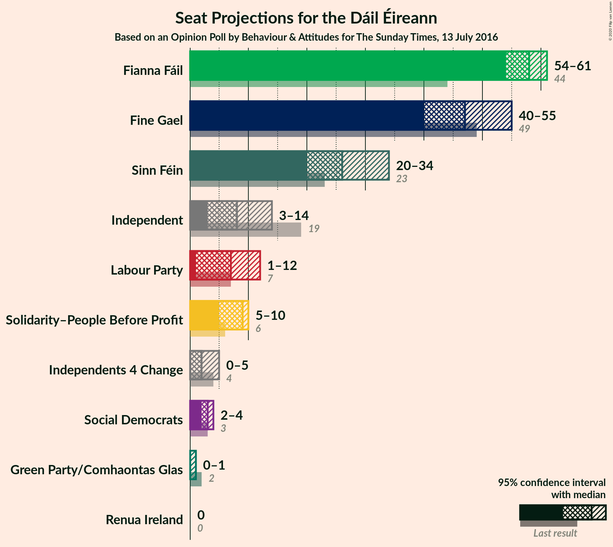
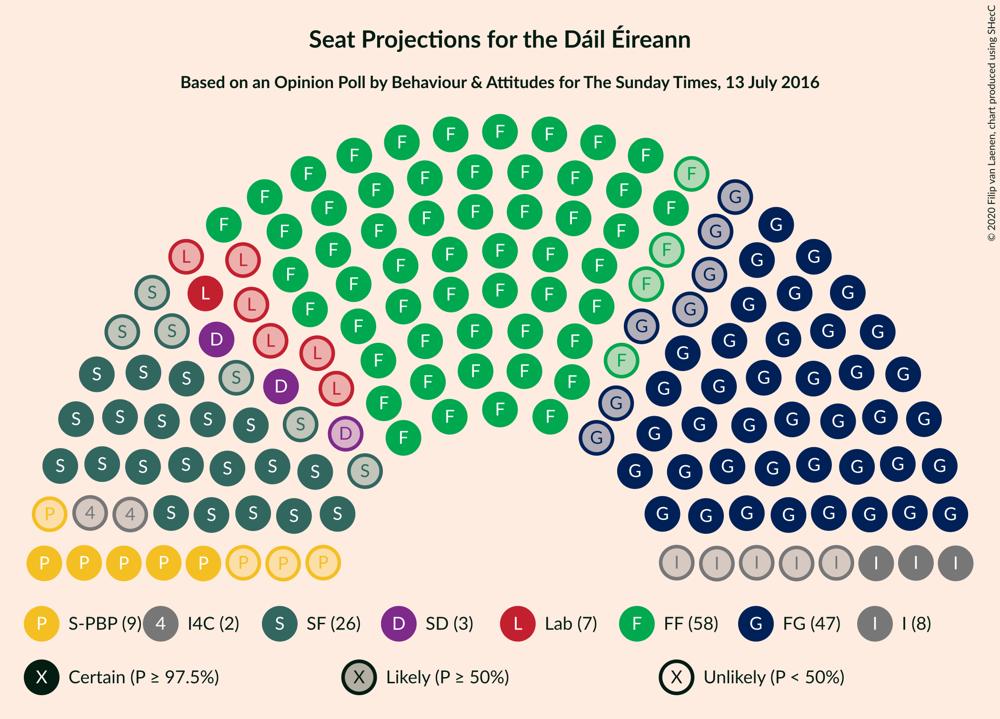
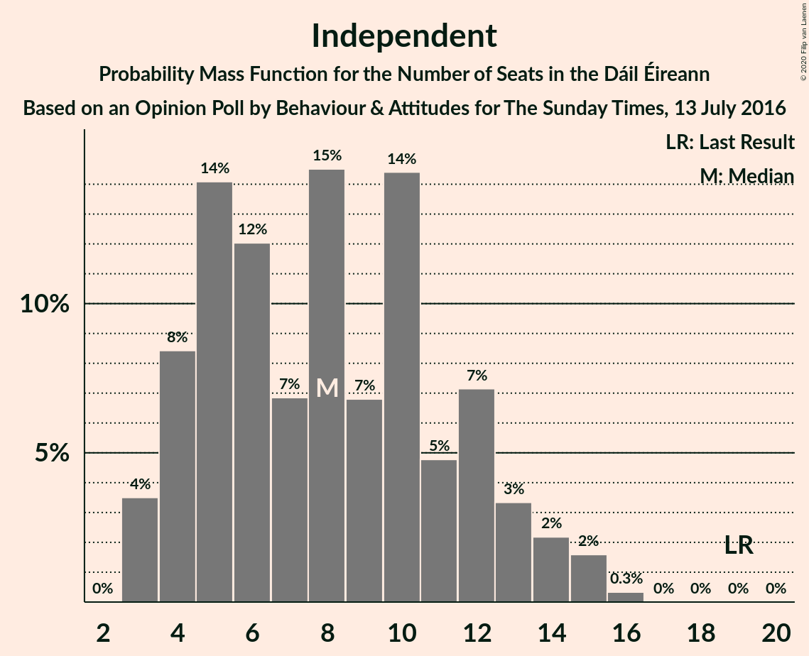
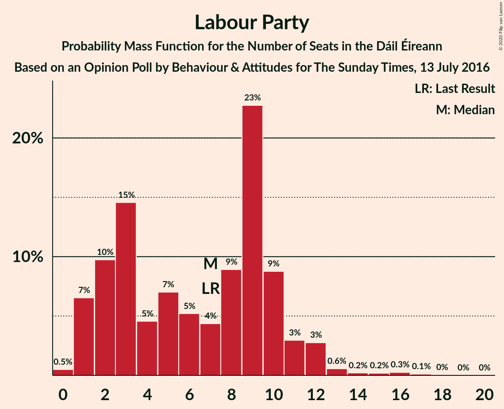
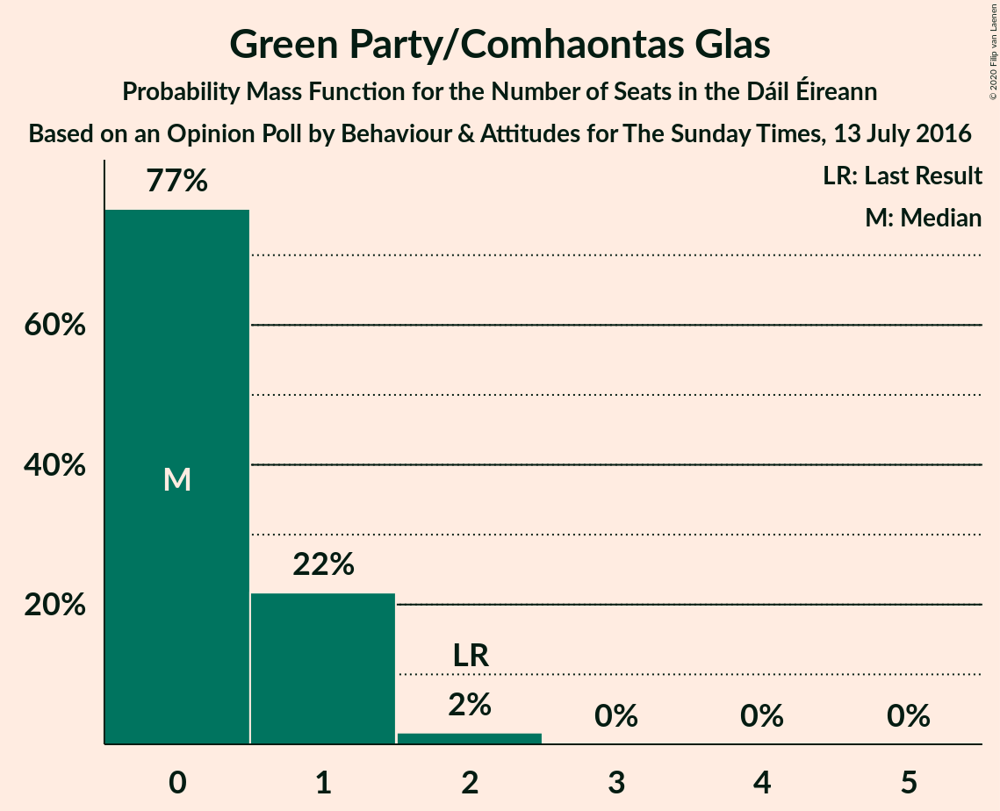
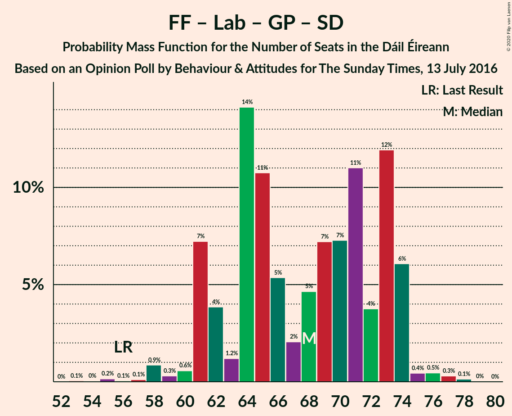

# Opinion Poll by Behaviour & Attitudes for The Sunday Times, 13 July 2016

<a href="#voting-intentions">Voting Intentions</a> | <a href="#seats">Seats</a> | <a href="#coalitions">Coalitions</a> | <a href="#technical-information">Technical Information</a>

## Voting Intentions

### Confidence Intervals

| Party | Last Result | Poll Result | 80% Confidence Interval | 90% Confidence Interval | 95% Confidence Interval | 99% Confidence Interval |
|:-----:|:-----------:|:-----------:|:-----------------------:|:-----------------------:|:-----------------------:|:-----------------------:|
| Fianna Fáil | 24.3% | 29.9% | 28.0–31.9% |27.5–32.5% |27.0–33.0% |26.1–34.0% |
| Fine Gael | 25.5% | 25.0% | 23.2–26.9% |22.7–27.4% |22.3–27.9% |21.4–28.8% |
| Sinn Féin | 13.8% | 14.0% | 12.6–15.5% |12.2–16.0% |11.9–16.4% |11.2–17.2% |
| Independent | 15.9% | 10.1% | 8.9–11.5% |8.6–11.9% |8.3–12.3% |7.8–13.0% |
| Labour Party | 6.6% | 5.9% | 5.0–7.1% |4.8–7.4% |4.6–7.7% |4.2–8.3% |
| Solidarity–People Before Profit | 3.9% | 5.0% | 4.1–6.0% |3.9–6.3% |3.7–6.6% |3.4–7.1% |
| Social Democrats | 3.0% | 2.0% | 1.5–2.7% |1.4–2.9% |1.2–3.1% |1.1–3.5% |
| Green Party/Comhaontas Glas | 2.7% | 2.0% | 1.5–2.7% |1.4–2.9% |1.2–3.1% |1.1–3.5% |
| Independents 4 Change | 1.5% | 1.3% | 0.9–2.0% |0.8–2.1% |0.8–2.3% |0.6–2.6% |
| Renua Ireland | 2.2% | 0.2% | 0.1–0.6% |0.1–0.7% |0.1–0.8% |0.0–1.0% |

*Note:* The poll result column reflects the actual value used in the calculations. Published results may vary slightly, and in addition be rounded to fewer digits.

## Seats

### Confidence Intervals

| Party | Last Result | Median | 80% Confidence Interval | 90% Confidence Interval | 95% Confidence Interval | 99% Confidence Interval |
|:-----:|:-----------:|:------:|:-----------------------:|:-----------------------:|:-----------------------:|:-----------------------:|
| <a href="#fianna-fáil">Fianna Fáil</a> | 44 | 58 | 55–61 |54–61 |54–61 |50–62 |
| <a href="#fine-gael">Fine Gael</a> | 49 | 47 | 43–51 |40–53 |40–55 |40–58 |
| <a href="#sinn-féin">Sinn Féin</a> | 23 | 26 | 22–32 |20–34 |20–34 |17–34 |
| <a href="#independent">Independent</a> | 19 | 8 | 4–12 |4–13 |3–14 |3–15 |
| <a href="#labour-party">Labour Party</a> | 7 | 7 | 2–10 |1–11 |1–12 |1–15 |
| <a href="#solidarity–people-before-profit">Solidarity–People Before Profit</a> | 6 | 9 | 6–9 |5–10 |5–10 |4–10 |
| <a href="#social-democrats">Social Democrats</a> | 3 | 3 | 3–4 |3–4 |2–4 |1–4 |
| <a href="#green-party/comhaontas-glas">Green Party/Comhaontas Glas</a> | 2 | 0 | 0–1 |0–1 |0–1 |0–2 |
| <a href="#independents-4-change">Independents 4 Change</a> | 4 | 2 | 0–4 |0–5 |0–5 |0–5 |
| <a href="#renua-ireland">Renua Ireland</a> | 0 | 0 | 0 |0 |0 |0 |

### Fianna Fáil

*For a full overview of the results for this party, see the [Fianna Fáil](party-fiannafáil.html) page.*

| Number of Seats | Probability | Accumulated | Special Marks |
|:---------------:|:-----------:|:-----------:|:-------------:|
| 44 | 0% | 100% | Last Result |
| 45 | 0% | 100% |  |
| 46 | 0% | 100% |  |
| 47 | 0.1% | 100% |  |
| 48 | 0% | 99.9% |  |
| 49 | 0.4% | 99.9% |  |
| 50 | 0.1% | 99.5% |  |
| 51 | 0.4% | 99.4% |  |
| 52 | 0.8% | 99.0% |  |
| 53 | 0.7% | 98% |  |
| 54 | 5% | 98% |  |
| 55 | 3% | 92% |  |
| 56 | 8% | 89% |  |
| 57 | 20% | 81% |  |
| 58 | 19% | 61% | Median |
| 59 | 14% | 42% |  |
| 60 | 13% | 28% |  |
| 61 | 13% | 15% |  |
| 62 | 2% | 2% |  |
| 63 | 0% | 0% |  |

### Fine Gael

*For a full overview of the results for this party, see the [Fine Gael](party-finegael.html) page.*

| Number of Seats | Probability | Accumulated | Special Marks |
|:---------------:|:-----------:|:-----------:|:-------------:|
| 38 | 0.1% | 100% |  |
| 39 | 0.3% | 99.9% |  |
| 40 | 5% | 99.6% |  |
| 41 | 3% | 95% |  |
| 42 | 1.2% | 92% |  |
| 43 | 5% | 91% |  |
| 44 | 6% | 86% |  |
| 45 | 10% | 79% |  |
| 46 | 16% | 69% |  |
| 47 | 14% | 53% | Median |
| 48 | 11% | 39% |  |
| 49 | 4% | 28% | Last Result |
| 50 | 10% | 24% |  |
| 51 | 7% | 14% |  |
| 52 | 2% | 8% |  |
| 53 | 2% | 6% |  |
| 54 | 0.4% | 4% |  |
| 55 | 2% | 4% |  |
| 56 | 0.3% | 2% |  |
| 57 | 0.9% | 1.5% |  |
| 58 | 0.3% | 0.6% |  |
| 59 | 0.1% | 0.3% |  |
| 60 | 0.1% | 0.2% |  |
| 61 | 0.1% | 0.1% |  |
| 62 | 0% | 0% |  |

### Sinn Féin

*For a full overview of the results for this party, see the [Sinn Féin](party-sinnféin.html) page.*

| Number of Seats | Probability | Accumulated | Special Marks |
|:---------------:|:-----------:|:-----------:|:-------------:|
| 14 | 0.1% | 100% |  |
| 15 | 0.1% | 99.9% |  |
| 16 | 0% | 99.8% |  |
| 17 | 0.4% | 99.7% |  |
| 18 | 0.2% | 99.3% |  |
| 19 | 1.0% | 99.2% |  |
| 20 | 3% | 98% |  |
| 21 | 2% | 95% |  |
| 22 | 5% | 93% |  |
| 23 | 8% | 88% | Last Result |
| 24 | 9% | 80% |  |
| 25 | 5% | 71% |  |
| 26 | 18% | 66% | Median |
| 27 | 5% | 47% |  |
| 28 | 5% | 42% |  |
| 29 | 15% | 38% |  |
| 30 | 3% | 22% |  |
| 31 | 6% | 19% |  |
| 32 | 3% | 13% |  |
| 33 | 3% | 9% |  |
| 34 | 6% | 7% |  |
| 35 | 0.1% | 0.3% |  |
| 36 | 0.1% | 0.2% |  |
| 37 | 0% | 0% |  |

### Independent

*For a full overview of the results for this party, see the [Independent](party-independent.html) page.*

| Number of Seats | Probability | Accumulated | Special Marks |
|:---------------:|:-----------:|:-----------:|:-------------:|
| 3 | 4% | 100% |  |
| 4 | 8% | 96% |  |
| 5 | 14% | 88% |  |
| 6 | 12% | 74% |  |
| 7 | 7% | 62% |  |
| 8 | 15% | 55% | Median |
| 9 | 7% | 41% |  |
| 10 | 14% | 34% |  |
| 11 | 5% | 19% |  |
| 12 | 7% | 15% |  |
| 13 | 3% | 7% |  |
| 14 | 2% | 4% |  |
| 15 | 2% | 2% |  |
| 16 | 0.3% | 0.3% |  |
| 17 | 0% | 0% |  |
| 18 | 0% | 0% |  |
| 19 | 0% | 0% | Last Result |

### Labour Party

*For a full overview of the results for this party, see the [Labour Party](party-labourparty.html) page.*

| Number of Seats | Probability | Accumulated | Special Marks |
|:---------------:|:-----------:|:-----------:|:-------------:|
| 0 | 0.5% | 100% |  |
| 1 | 7% | 99.5% |  |
| 2 | 10% | 93% |  |
| 3 | 15% | 83% |  |
| 4 | 5% | 69% |  |
| 5 | 7% | 64% |  |
| 6 | 5% | 57% |  |
| 7 | 4% | 52% | Last Result, Median |
| 8 | 9% | 48% |  |
| 9 | 23% | 39% |  |
| 10 | 9% | 16% |  |
| 11 | 3% | 7% |  |
| 12 | 3% | 4% |  |
| 13 | 0.6% | 1.4% |  |
| 14 | 0.2% | 0.8% |  |
| 15 | 0.2% | 0.6% |  |
| 16 | 0.3% | 0.4% |  |
| 17 | 0.1% | 0.2% |  |
| 18 | 0% | 0.1% |  |
| 19 | 0% | 0% |  |

### Solidarity–People Before Profit

*For a full overview of the results for this party, see the [Solidarity–People Before Profit](party-solidarity–peoplebeforeprofit.html) page.*

| Number of Seats | Probability | Accumulated | Special Marks |
|:---------------:|:-----------:|:-----------:|:-------------:|
| 3 | 0.3% | 100% |  |
| 4 | 0.7% | 99.7% |  |
| 5 | 6% | 99.0% |  |
| 6 | 6% | 93% | Last Result |
| 7 | 8% | 87% |  |
| 8 | 26% | 79% |  |
| 9 | 47% | 53% | Median |
| 10 | 7% | 7% |  |
| 11 | 0% | 0% |  |

### Social Democrats

*For a full overview of the results for this party, see the [Social Democrats](party-socialdemocrats.html) page.*

| Number of Seats | Probability | Accumulated | Special Marks |
|:---------------:|:-----------:|:-----------:|:-------------:|
| 1 | 0.7% | 100% |  |
| 2 | 2% | 99.3% |  |
| 3 | 84% | 97% | Last Result, Median |
| 4 | 13% | 13% |  |
| 5 | 0.1% | 0.1% |  |
| 6 | 0% | 0% |  |

### Green Party/Comhaontas Glas

*For a full overview of the results for this party, see the [Green Party/Comhaontas Glas](party-greenpartycomhaontasglas.html) page.*

| Number of Seats | Probability | Accumulated | Special Marks |
|:---------------:|:-----------:|:-----------:|:-------------:|
| 0 | 77% | 100% | Median |
| 1 | 22% | 23% |  |
| 2 | 2% | 2% | Last Result |
| 3 | 0% | 0% |  |

### Independents 4 Change

*For a full overview of the results for this party, see the [Independents 4 Change](party-independents4change.html) page.*

| Number of Seats | Probability | Accumulated | Special Marks |
|:---------------:|:-----------:|:-----------:|:-------------:|
| 0 | 17% | 100% |  |
| 1 | 33% | 83% |  |
| 2 | 4% | 51% | Median |
| 3 | 7% | 46% |  |
| 4 | 30% | 39% | Last Result |
| 5 | 10% | 10% |  |
| 6 | 0% | 0% |  |

### Renua Ireland

*For a full overview of the results for this party, see the [Renua Ireland](party-renuaireland.html) page.*

| Number of Seats | Probability | Accumulated | Special Marks |
|:---------------:|:-----------:|:-----------:|:-------------:|
| 0 | 100% | 100% | Last Result, Median |

## Coalitions

### Confidence Intervals

| Coalition | Last Result | Median | Majority? | 80% Confidence Interval | 90% Confidence Interval | 95% Confidence Interval | 99% Confidence Interval |
|:---------:|:-----------:|:------:|:---------:|:-----------------------:|:-----------------------:|:-----------------------:|:-----------------------:|
| Fianna Fáil – Fine Gael | 93 | 105 | 100% | 100–109 | 100–110 | 98–112 | 97–115 |
| Fianna Fáil – Sinn Féin | 67 | 86 | 87% | 80–90 | 78–91 | 76–91 | 75–93 |
| Fianna Fáil – Labour Party – Green Party/Comhaontas Glas – Social Democrats | 56 | 68 | 0% | 62–73 | 61–74 | 61–74 | 58–76 |
| Fianna Fáil – Labour Party – Green Party/Comhaontas Glas | 53 | 65 | 0% | 58–70 | 58–71 | 58–71 | 55–74 |
| Fianna Fáil – Labour Party | 51 | 65 | 0% | 58–70 | 58–70 | 58–71 | 54–73 |
| Fine Gael – Labour Party – Green Party/Comhaontas Glas – Social Democrats | 61 | 57 | 0% | 51–63 | 51–64 | 50–65 | 46–69 |
| Fianna Fáil – Green Party/Comhaontas Glas | 46 | 58 | 0% | 56–61 | 54–61 | 54–62 | 50–63 |
| Fine Gael – Labour Party – Green Party/Comhaontas Glas | 58 | 54 | 0% | 48–61 | 48–61 | 47–62 | 43–66 |
| Fine Gael – Labour Party | 56 | 53 | 0% | 48–60 | 47–61 | 46–62 | 43–66 |
| Fine Gael | 49 | 47 | 0% | 43–51 | 40–53 | 40–55 | 40–58 |
| Fine Gael – Green Party/Comhaontas Glas | 51 | 47 | 0% | 43–51 | 41–53 | 40–55 | 40–58 |

### Fianna Fáil – Fine Gael

| Number of Seats | Probability | Accumulated | Special Marks |
|:---------------:|:-----------:|:-----------:|:-------------:|
| 93 | 0% | 100% | Last Result |
| 94 | 0% | 99.9% |  |
| 95 | 0.1% | 99.9% |  |
| 96 | 0.3% | 99.8% |  |
| 97 | 0.8% | 99.6% |  |
| 98 | 1.3% | 98.8% |  |
| 99 | 2% | 97% |  |
| 100 | 9% | 95% |  |
| 101 | 4% | 86% |  |
| 102 | 7% | 82% |  |
| 103 | 3% | 75% |  |
| 104 | 6% | 72% |  |
| 105 | 21% | 66% | Median |
| 106 | 16% | 45% |  |
| 107 | 8% | 29% |  |
| 108 | 8% | 21% |  |
| 109 | 3% | 13% |  |
| 110 | 7% | 10% |  |
| 111 | 0.6% | 3% |  |
| 112 | 0.7% | 3% |  |
| 113 | 0.3% | 2% |  |
| 114 | 0.8% | 2% |  |
| 115 | 0.3% | 0.7% |  |
| 116 | 0.2% | 0.4% |  |
| 117 | 0.2% | 0.2% |  |
| 118 | 0% | 0% |  |

### Fianna Fáil – Sinn Féin

| Number of Seats | Probability | Accumulated | Special Marks |
|:---------------:|:-----------:|:-----------:|:-------------:|
| 67 | 0% | 100% | Last Result |
| 68 | 0% | 100% |  |
| 69 | 0% | 100% |  |
| 70 | 0% | 99.9% |  |
| 71 | 0% | 99.9% |  |
| 72 | 0% | 99.9% |  |
| 73 | 0.1% | 99.8% |  |
| 74 | 0.2% | 99.7% |  |
| 75 | 0.8% | 99.5% |  |
| 76 | 2% | 98.7% |  |
| 77 | 0.7% | 97% |  |
| 78 | 2% | 96% |  |
| 79 | 3% | 94% |  |
| 80 | 4% | 92% |  |
| 81 | 8% | 87% | Majority |
| 82 | 9% | 80% |  |
| 83 | 8% | 71% |  |
| 84 | 6% | 63% | Median |
| 85 | 3% | 56% |  |
| 86 | 10% | 53% |  |
| 87 | 20% | 44% |  |
| 88 | 10% | 24% |  |
| 89 | 2% | 15% |  |
| 90 | 7% | 13% |  |
| 91 | 4% | 5% |  |
| 92 | 0.8% | 2% |  |
| 93 | 0.5% | 1.0% |  |
| 94 | 0.2% | 0.4% |  |
| 95 | 0.1% | 0.2% |  |
| 96 | 0.1% | 0.1% |  |
| 97 | 0% | 0% |  |

### Fianna Fáil – Labour Party – Green Party/Comhaontas Glas – Social Democrats

| Number of Seats | Probability | Accumulated | Special Marks |
|:---------------:|:-----------:|:-----------:|:-------------:|
| 53 | 0.1% | 100% |  |
| 54 | 0% | 99.9% |  |
| 55 | 0.2% | 99.9% |  |
| 56 | 0.1% | 99.7% | Last Result |
| 57 | 0.1% | 99.7% |  |
| 58 | 0.9% | 99.6% |  |
| 59 | 0.3% | 98.7% |  |
| 60 | 0.6% | 98% |  |
| 61 | 7% | 98% |  |
| 62 | 4% | 91% |  |
| 63 | 1.2% | 87% |  |
| 64 | 14% | 86% |  |
| 65 | 11% | 71% |  |
| 66 | 5% | 61% |  |
| 67 | 2% | 55% |  |
| 68 | 5% | 53% | Median |
| 69 | 7% | 49% |  |
| 70 | 7% | 41% |  |
| 71 | 11% | 34% |  |
| 72 | 4% | 23% |  |
| 73 | 12% | 19% |  |
| 74 | 6% | 7% |  |
| 75 | 0.4% | 1.4% |  |
| 76 | 0.5% | 0.9% |  |
| 77 | 0.3% | 0.5% |  |
| 78 | 0.1% | 0.2% |  |
| 79 | 0% | 0% |  |

### Fianna Fáil – Labour Party – Green Party/Comhaontas Glas

| Number of Seats | Probability | Accumulated | Special Marks |
|:---------------:|:-----------:|:-----------:|:-------------:|
| 50 | 0.1% | 100% |  |
| 51 | 0% | 99.9% |  |
| 52 | 0.2% | 99.9% |  |
| 53 | 0.1% | 99.7% | Last Result |
| 54 | 0.1% | 99.6% |  |
| 55 | 0.9% | 99.6% |  |
| 56 | 0.2% | 98.7% |  |
| 57 | 0.6% | 98.5% |  |
| 58 | 9% | 98% |  |
| 59 | 2% | 89% |  |
| 60 | 2% | 87% |  |
| 61 | 17% | 85% |  |
| 62 | 7% | 69% |  |
| 63 | 6% | 61% |  |
| 64 | 2% | 55% |  |
| 65 | 7% | 53% | Median |
| 66 | 5% | 46% |  |
| 67 | 7% | 41% |  |
| 68 | 11% | 34% |  |
| 69 | 3% | 23% |  |
| 70 | 12% | 20% |  |
| 71 | 6% | 7% |  |
| 72 | 0.4% | 1.3% |  |
| 73 | 0.4% | 0.9% |  |
| 74 | 0.4% | 0.5% |  |
| 75 | 0.1% | 0.2% |  |
| 76 | 0% | 0% |  |

### Fianna Fáil – Labour Party

| Number of Seats | Probability | Accumulated | Special Marks |
|:---------------:|:-----------:|:-----------:|:-------------:|
| 50 | 0.1% | 100% |  |
| 51 | 0% | 99.9% | Last Result |
| 52 | 0.2% | 99.9% |  |
| 53 | 0.1% | 99.7% |  |
| 54 | 0.3% | 99.6% |  |
| 55 | 0.8% | 99.3% |  |
| 56 | 0.3% | 98.6% |  |
| 57 | 0.6% | 98% |  |
| 58 | 10% | 98% |  |
| 59 | 2% | 88% |  |
| 60 | 7% | 86% |  |
| 61 | 14% | 79% |  |
| 62 | 6% | 65% |  |
| 63 | 5% | 59% |  |
| 64 | 2% | 54% |  |
| 65 | 7% | 52% | Median |
| 66 | 5% | 44% |  |
| 67 | 7% | 39% |  |
| 68 | 10% | 32% |  |
| 69 | 4% | 22% |  |
| 70 | 14% | 18% |  |
| 71 | 3% | 4% |  |
| 72 | 0.5% | 1.2% |  |
| 73 | 0.5% | 0.8% |  |
| 74 | 0.2% | 0.3% |  |
| 75 | 0% | 0.1% |  |
| 76 | 0% | 0% |  |

### Fine Gael – Labour Party – Green Party/Comhaontas Glas – Social Democrats

| Number of Seats | Probability | Accumulated | Special Marks |
|:---------------:|:-----------:|:-----------:|:-------------:|
| 45 | 0.1% | 100% |  |
| 46 | 0.6% | 99.9% |  |
| 47 | 0.4% | 99.3% |  |
| 48 | 0.5% | 98.9% |  |
| 49 | 0.3% | 98% |  |
| 50 | 2% | 98% |  |
| 51 | 14% | 96% |  |
| 52 | 4% | 83% |  |
| 53 | 13% | 79% |  |
| 54 | 3% | 66% |  |
| 55 | 3% | 63% |  |
| 56 | 5% | 59% |  |
| 57 | 16% | 54% | Median |
| 58 | 10% | 38% |  |
| 59 | 4% | 28% |  |
| 60 | 3% | 25% |  |
| 61 | 1.5% | 22% | Last Result |
| 62 | 6% | 20% |  |
| 63 | 5% | 15% |  |
| 64 | 5% | 10% |  |
| 65 | 3% | 5% |  |
| 66 | 0.4% | 2% |  |
| 67 | 0.3% | 2% |  |
| 68 | 0.2% | 1.2% |  |
| 69 | 0.6% | 1.0% |  |
| 70 | 0.2% | 0.4% |  |
| 71 | 0.2% | 0.2% |  |
| 72 | 0% | 0.1% |  |
| 73 | 0% | 0% |  |

### Fianna Fáil – Green Party/Comhaontas Glas

| Number of Seats | Probability | Accumulated | Special Marks |
|:---------------:|:-----------:|:-----------:|:-------------:|
| 46 | 0% | 100% | Last Result |
| 47 | 0.1% | 100% |  |
| 48 | 0% | 99.9% |  |
| 49 | 0.1% | 99.9% |  |
| 50 | 0.4% | 99.8% |  |
| 51 | 0.3% | 99.4% |  |
| 52 | 0.8% | 99.1% |  |
| 53 | 0.5% | 98% |  |
| 54 | 5% | 98% |  |
| 55 | 3% | 93% |  |
| 56 | 7% | 90% |  |
| 57 | 15% | 83% |  |
| 58 | 21% | 68% | Median |
| 59 | 14% | 47% |  |
| 60 | 15% | 33% |  |
| 61 | 13% | 18% |  |
| 62 | 4% | 5% |  |
| 63 | 0.8% | 0.9% |  |
| 64 | 0.1% | 0.1% |  |
| 65 | 0% | 0% |  |

### Fine Gael – Labour Party – Green Party/Comhaontas Glas

| Number of Seats | Probability | Accumulated | Special Marks |
|:---------------:|:-----------:|:-----------:|:-------------:|
| 42 | 0.1% | 100% |  |
| 43 | 0.6% | 99.9% |  |
| 44 | 0.5% | 99.3% |  |
| 45 | 0.4% | 98.8% |  |
| 46 | 0.3% | 98% |  |
| 47 | 2% | 98% |  |
| 48 | 15% | 96% |  |
| 49 | 3% | 82% |  |
| 50 | 12% | 79% |  |
| 51 | 5% | 66% |  |
| 52 | 5% | 61% |  |
| 53 | 4% | 56% |  |
| 54 | 15% | 53% | Median |
| 55 | 10% | 38% |  |
| 56 | 3% | 28% |  |
| 57 | 3% | 25% |  |
| 58 | 2% | 22% | Last Result |
| 59 | 6% | 20% |  |
| 60 | 3% | 13% |  |
| 61 | 5% | 10% |  |
| 62 | 3% | 5% |  |
| 63 | 0.4% | 2% |  |
| 64 | 0.4% | 2% |  |
| 65 | 0.1% | 1.1% |  |
| 66 | 0.6% | 1.0% |  |
| 67 | 0.1% | 0.4% |  |
| 68 | 0.1% | 0.2% |  |
| 69 | 0.1% | 0.1% |  |
| 70 | 0% | 0% |  |

### Fine Gael – Labour Party

| Number of Seats | Probability | Accumulated | Special Marks |
|:---------------:|:-----------:|:-----------:|:-------------:|
| 42 | 0.1% | 100% |  |
| 43 | 0.7% | 99.9% |  |
| 44 | 0.5% | 99.1% |  |
| 45 | 0.3% | 98.6% |  |
| 46 | 0.8% | 98% |  |
| 47 | 3% | 97% |  |
| 48 | 13% | 95% |  |
| 49 | 4% | 81% |  |
| 50 | 14% | 77% |  |
| 51 | 6% | 63% |  |
| 52 | 3% | 58% |  |
| 53 | 6% | 55% |  |
| 54 | 14% | 49% | Median |
| 55 | 8% | 35% |  |
| 56 | 3% | 27% | Last Result |
| 57 | 3% | 24% |  |
| 58 | 3% | 21% |  |
| 59 | 5% | 18% |  |
| 60 | 4% | 13% |  |
| 61 | 5% | 9% |  |
| 62 | 3% | 5% |  |
| 63 | 0.4% | 2% |  |
| 64 | 0.3% | 1.4% |  |
| 65 | 0.1% | 1.1% |  |
| 66 | 0.6% | 1.0% |  |
| 67 | 0.1% | 0.4% |  |
| 68 | 0.1% | 0.2% |  |
| 69 | 0.1% | 0.1% |  |
| 70 | 0% | 0% |  |

### Fine Gael

| Number of Seats | Probability | Accumulated | Special Marks |
|:---------------:|:-----------:|:-----------:|:-------------:|
| 38 | 0.1% | 100% |  |
| 39 | 0.3% | 99.9% |  |
| 40 | 5% | 99.6% |  |
| 41 | 3% | 95% |  |
| 42 | 1.2% | 92% |  |
| 43 | 5% | 91% |  |
| 44 | 6% | 86% |  |
| 45 | 10% | 79% |  |
| 46 | 16% | 69% |  |
| 47 | 14% | 53% | Median |
| 48 | 11% | 39% |  |
| 49 | 4% | 28% | Last Result |
| 50 | 10% | 24% |  |
| 51 | 7% | 14% |  |
| 52 | 2% | 8% |  |
| 53 | 2% | 6% |  |
| 54 | 0.4% | 4% |  |
| 55 | 2% | 4% |  |
| 56 | 0.3% | 2% |  |
| 57 | 0.9% | 1.5% |  |
| 58 | 0.3% | 0.6% |  |
| 59 | 0.1% | 0.3% |  |
| 60 | 0.1% | 0.2% |  |
| 61 | 0.1% | 0.1% |  |
| 62 | 0% | 0% |  |

### Fine Gael – Green Party/Comhaontas Glas

| Number of Seats | Probability | Accumulated | Special Marks |
|:---------------:|:-----------:|:-----------:|:-------------:|
| 39 | 0.1% | 100% |  |
| 40 | 5% | 99.8% |  |
| 41 | 2% | 95% |  |
| 42 | 3% | 94% |  |
| 43 | 4% | 91% |  |
| 44 | 4% | 86% |  |
| 45 | 13% | 83% |  |
| 46 | 14% | 70% |  |
| 47 | 15% | 56% | Median |
| 48 | 7% | 41% |  |
| 49 | 10% | 34% |  |
| 50 | 8% | 25% |  |
| 51 | 8% | 17% | Last Result |
| 52 | 2% | 9% |  |
| 53 | 2% | 7% |  |
| 54 | 0.6% | 4% |  |
| 55 | 2% | 4% |  |
| 56 | 0.4% | 2% |  |
| 57 | 0.7% | 2% |  |
| 58 | 0.4% | 0.8% |  |
| 59 | 0.2% | 0.4% |  |
| 60 | 0.1% | 0.2% |  |
| 61 | 0.1% | 0.1% |  |
| 62 | 0% | 0.1% |  |
| 63 | 0% | 0% |  |

## Technical Information

### Opinion Poll

+ **Polling firm:** Behaviour & Attitudes
+ **Commissioner(s):** The Sunday Times
+ **Fieldwork period:** 13 July 2016

### Calculations

+ **Sample size:** 909
+ **Simulations done:** 1,048,576
+ **Error estimate:** 3.25%

