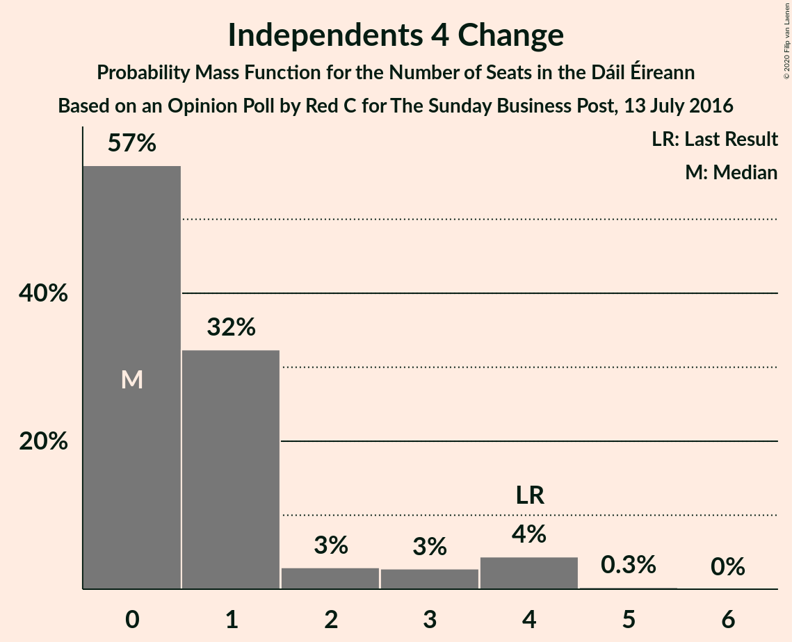

# Opinion Poll by Red C for The Sunday Business Post, 13 July 2016

<a href="#voting-intentions">Voting Intentions</a> | <a href="#seats">Seats</a> | <a href="#coalitions">Coalitions</a> | <a href="#technical-information">Technical Information</a>

## Voting Intentions

### Confidence Intervals

| Party | Last Result | Poll Result | 80% Confidence Interval | 90% Confidence Interval | 95% Confidence Interval | 99% Confidence Interval |
|:-----:|:-----------:|:-----------:|:-----------------------:|:-----------------------:|:-----------------------:|:-----------------------:|
| Fianna Fáil | 24.3% | 28.7% | 26.9–30.6% |26.4–31.1% |26.0–31.6% |25.1–32.5% |
| Fine Gael | 25.5% | 25.7% | 24.0–27.5% |23.5–28.0% |23.1–28.5% |22.3–29.4% |
| Sinn Féin | 13.8% | 12.8% | 11.6–14.3% |11.2–14.7% |10.9–15.1% |10.3–15.8% |
| Independent | 15.9% | 6.7% | 5.8–7.8% |5.5–8.1% |5.3–8.4% |4.9–9.0% |
| Labour Party | 6.6% | 6.0% | 5.1–7.1% |4.9–7.4% |4.7–7.6% |4.3–8.2% |
| Solidarity–People Before Profit | 3.9% | 5.0% | 4.2–6.0% |4.0–6.3% |3.8–6.5% |3.4–7.0% |
| Social Democrats | 3.0% | 4.0% | 3.3–4.9% |3.1–5.2% |2.9–5.4% |2.6–5.9% |
| Green Party/Comhaontas Glas | 2.7% | 4.0% | 3.3–4.9% |3.1–5.2% |2.9–5.4% |2.6–5.9% |
| Renua Ireland | 2.2% | 1.0% | 0.7–1.5% |0.6–1.7% |0.5–1.8% |0.4–2.1% |
| Independents 4 Change | 1.5% | 0.8% | 0.5–1.3% |0.5–1.4% |0.4–1.6% |0.3–1.8% |

*Note:* The poll result column reflects the actual value used in the calculations. Published results may vary slightly, and in addition be rounded to fewer digits.

## Seats

### Confidence Intervals

| Party | Last Result | Median | 80% Confidence Interval | 90% Confidence Interval | 95% Confidence Interval | 99% Confidence Interval |
|:-----:|:-----------:|:------:|:-----------------------:|:-----------------------:|:-----------------------:|:-----------------------:|
| <a href="#fianna-fáil">Fianna Fáil</a> | 44 | 58 | 54–59 |54–60 |54–60 |51–61 |
| <a href="#fine-gael">Fine Gael</a> | 49 | 51 | 47–55 |46–59 |46–60 |43–61 |
| <a href="#sinn-féin">Sinn Féin</a> | 23 | 27 | 21–29 |20–30 |19–31 |16–33 |
| <a href="#independent">Independent</a> | 19 | 3 | 3 |3 |3 |2–5 |
| <a href="#labour-party">Labour Party</a> | 7 | 6 | 3–10 |3–11 |1–11 |1–14 |
| <a href="#solidarity–people-before-profit">Solidarity–People Before Profit</a> | 6 | 9 | 7–10 |6–10 |6–10 |4–10 |
| <a href="#social-democrats">Social Democrats</a> | 3 | 5 | 4–6 |4–7 |4–8 |3–10 |
| <a href="#green-party/comhaontas-glas">Green Party/Comhaontas Glas</a> | 2 | 2 | 2–4 |2–4 |1–4 |1–5 |
| <a href="#renua-ireland">Renua Ireland</a> | 0 | 0 | 0 |0 |0 |0 |
| <a href="#independents-4-change">Independents 4 Change</a> | 4 | 0 | 0–2 |0–3 |0–4 |0–4 |

### Fianna Fáil

*For a full overview of the results for this party, see the [Fianna Fáil](party-fiannafáil.html) page.*

| Number of Seats | Probability | Accumulated | Special Marks |
|:---------------:|:-----------:|:-----------:|:-------------:|
| 44 | 0% | 100% | Last Result |
| 45 | 0% | 100% |  |
| 46 | 0% | 100% |  |
| 47 | 0.1% | 100% |  |
| 48 | 0.1% | 99.9% |  |
| 49 | 0.1% | 99.8% |  |
| 50 | 0.1% | 99.7% |  |
| 51 | 0.2% | 99.6% |  |
| 52 | 0.4% | 99.4% |  |
| 53 | 1.4% | 99.0% |  |
| 54 | 8% | 98% |  |
| 55 | 5% | 90% |  |
| 56 | 27% | 85% |  |
| 57 | 7% | 58% |  |
| 58 | 16% | 51% | Median |
| 59 | 25% | 35% |  |
| 60 | 8% | 10% |  |
| 61 | 1.4% | 2% |  |
| 62 | 0.5% | 0.5% |  |
| 63 | 0% | 0% |  |

### Fine Gael

*For a full overview of the results for this party, see the [Fine Gael](party-finegael.html) page.*

| Number of Seats | Probability | Accumulated | Special Marks |
|:---------------:|:-----------:|:-----------:|:-------------:|
| 41 | 0% | 100% |  |
| 42 | 0.3% | 99.9% |  |
| 43 | 0.3% | 99.6% |  |
| 44 | 0.2% | 99.3% |  |
| 45 | 1.1% | 99.1% |  |
| 46 | 4% | 98% |  |
| 47 | 10% | 94% |  |
| 48 | 4% | 85% |  |
| 49 | 16% | 81% | Last Result |
| 50 | 11% | 65% |  |
| 51 | 15% | 54% | Median |
| 52 | 14% | 39% |  |
| 53 | 5% | 25% |  |
| 54 | 10% | 20% |  |
| 55 | 2% | 10% |  |
| 56 | 2% | 8% |  |
| 57 | 1.2% | 7% |  |
| 58 | 0.6% | 6% |  |
| 59 | 1.4% | 5% |  |
| 60 | 3% | 4% |  |
| 61 | 0.4% | 0.8% |  |
| 62 | 0.1% | 0.5% |  |
| 63 | 0.2% | 0.3% |  |
| 64 | 0.1% | 0.2% |  |
| 65 | 0% | 0.1% |  |
| 66 | 0.1% | 0.1% |  |
| 67 | 0% | 0% |  |

### Sinn Féin

*For a full overview of the results for this party, see the [Sinn Féin](party-sinnféin.html) page.*

| Number of Seats | Probability | Accumulated | Special Marks |
|:---------------:|:-----------:|:-----------:|:-------------:|
| 13 | 0% | 100% |  |
| 14 | 0.1% | 99.9% |  |
| 15 | 0.2% | 99.8% |  |
| 16 | 0.1% | 99.6% |  |
| 17 | 0.7% | 99.5% |  |
| 18 | 0.3% | 98.8% |  |
| 19 | 3% | 98% |  |
| 20 | 2% | 95% |  |
| 21 | 3% | 93% |  |
| 22 | 4% | 90% |  |
| 23 | 10% | 86% | Last Result |
| 24 | 2% | 76% |  |
| 25 | 10% | 74% |  |
| 26 | 7% | 64% |  |
| 27 | 12% | 57% | Median |
| 28 | 19% | 45% |  |
| 29 | 19% | 26% |  |
| 30 | 3% | 7% |  |
| 31 | 0.7% | 3% |  |
| 32 | 1.0% | 2% |  |
| 33 | 0.9% | 1.3% |  |
| 34 | 0.4% | 0.4% |  |
| 35 | 0% | 0% |  |

### Independent

*For a full overview of the results for this party, see the [Independent](party-independent.html) page.*

| Number of Seats | Probability | Accumulated | Special Marks |
|:---------------:|:-----------:|:-----------:|:-------------:|
| 0 | 0.2% | 100% |  |
| 1 | 0.2% | 99.8% |  |
| 2 | 1.0% | 99.7% |  |
| 3 | 97% | 98.6% | Median |
| 4 | 1.4% | 2% |  |
| 5 | 0.6% | 0.7% |  |
| 6 | 0% | 0.1% |  |
| 7 | 0% | 0% |  |
| 8 | 0% | 0% |  |
| 9 | 0% | 0% |  |
| 10 | 0% | 0% |  |
| 11 | 0% | 0% |  |
| 12 | 0% | 0% |  |
| 13 | 0% | 0% |  |
| 14 | 0% | 0% |  |
| 15 | 0% | 0% |  |
| 16 | 0% | 0% |  |
| 17 | 0% | 0% |  |
| 18 | 0% | 0% |  |
| 19 | 0% | 0% | Last Result |

### Labour Party

*For a full overview of the results for this party, see the [Labour Party](party-labourparty.html) page.*

| Number of Seats | Probability | Accumulated | Special Marks |
|:---------------:|:-----------:|:-----------:|:-------------:|
| 0 | 0.2% | 100% |  |
| 1 | 3% | 99.8% |  |
| 2 | 2% | 97% |  |
| 3 | 16% | 95% |  |
| 4 | 17% | 80% |  |
| 5 | 8% | 62% |  |
| 6 | 27% | 55% | Median |
| 7 | 4% | 28% | Last Result |
| 8 | 6% | 25% |  |
| 9 | 7% | 19% |  |
| 10 | 3% | 12% |  |
| 11 | 7% | 9% |  |
| 12 | 1.0% | 2% |  |
| 13 | 0.5% | 1.2% |  |
| 14 | 0.5% | 0.7% |  |
| 15 | 0.1% | 0.2% |  |
| 16 | 0% | 0.1% |  |
| 17 | 0% | 0.1% |  |
| 18 | 0.1% | 0.1% |  |
| 19 | 0% | 0% |  |

### Solidarity–People Before Profit

*For a full overview of the results for this party, see the [Solidarity–People Before Profit](party-solidarity–peoplebeforeprofit.html) page.*

| Number of Seats | Probability | Accumulated | Special Marks |
|:---------------:|:-----------:|:-----------:|:-------------:|
| 3 | 0.2% | 100% |  |
| 4 | 0.7% | 99.8% |  |
| 5 | 1.3% | 99.1% |  |
| 6 | 5% | 98% | Last Result |
| 7 | 6% | 93% |  |
| 8 | 10% | 87% |  |
| 9 | 54% | 77% | Median |
| 10 | 23% | 23% |  |
| 11 | 0% | 0% |  |

### Social Democrats

*For a full overview of the results for this party, see the [Social Democrats](party-socialdemocrats.html) page.*

| Number of Seats | Probability | Accumulated | Special Marks |
|:---------------:|:-----------:|:-----------:|:-------------:|
| 3 | 0.6% | 100% | Last Result |
| 4 | 42% | 99.4% |  |
| 5 | 37% | 58% | Median |
| 6 | 11% | 20% |  |
| 7 | 5% | 9% |  |
| 8 | 3% | 4% |  |
| 9 | 0.3% | 0.8% |  |
| 10 | 0.1% | 0.5% |  |
| 11 | 0.4% | 0.4% |  |
| 12 | 0% | 0% |  |

### Green Party/Comhaontas Glas

*For a full overview of the results for this party, see the [Green Party/Comhaontas Glas](party-greenpartycomhaontasglas.html) page.*

| Number of Seats | Probability | Accumulated | Special Marks |
|:---------------:|:-----------:|:-----------:|:-------------:|
| 0 | 0.1% | 100% |  |
| 1 | 4% | 99.9% |  |
| 2 | 75% | 96% | Last Result, Median |
| 3 | 9% | 22% |  |
| 4 | 12% | 13% |  |
| 5 | 0.8% | 1.0% |  |
| 6 | 0.1% | 0.3% |  |
| 7 | 0.2% | 0.2% |  |
| 8 | 0% | 0% |  |

### Renua Ireland

*For a full overview of the results for this party, see the [Renua Ireland](party-renuaireland.html) page.*

| Number of Seats | Probability | Accumulated | Special Marks |
|:---------------:|:-----------:|:-----------:|:-------------:|
| 0 | 99.8% | 100% | Last Result, Median |
| 1 | 0.1% | 0.2% |  |
| 2 | 0.1% | 0.1% |  |
| 3 | 0% | 0% |  |

### Independents 4 Change

*For a full overview of the results for this party, see the [Independents 4 Change](party-independents4change.html) page.*

| Number of Seats | Probability | Accumulated | Special Marks |
|:---------------:|:-----------:|:-----------:|:-------------:|
| 0 | 57% | 100% | Median |
| 1 | 32% | 43% |  |
| 2 | 3% | 10% |  |
| 3 | 3% | 7% |  |
| 4 | 4% | 5% | Last Result |
| 5 | 0.3% | 0.3% |  |
| 6 | 0% | 0% |  |

## Coalitions

### Confidence Intervals

| Coalition | Last Result | Median | Majority? | 80% Confidence Interval | 90% Confidence Interval | 95% Confidence Interval | 99% Confidence Interval |
|:---------:|:-----------:|:------:|:---------:|:-----------------------:|:-----------------------:|:-----------------------:|:-----------------------:|
| Fianna Fáil – Fine Gael | 93 | 108 | 100% | 105–112 | 104–114 | 103–115 | 100–117 |
| Fianna Fáil – Sinn Féin | 67 | 85 | 80% | 79–88 | 76–88 | 74–89 | 72–92 |
| Fianna Fáil – Labour Party – Green Party/Comhaontas Glas – Social Democrats | 56 | 71 | 0.2% | 66–76 | 66–77 | 64–77 | 63–80 |
| Fine Gael – Labour Party – Green Party/Comhaontas Glas – Social Democrats | 61 | 63 | 0% | 61–68 | 59–72 | 59–74 | 55–75 |
| Fianna Fáil – Labour Party – Green Party/Comhaontas Glas | 53 | 65 | 0% | 61–70 | 61–72 | 60–73 | 58–73 |
| Fianna Fáil – Labour Party | 51 | 63 | 0% | 59–68 | 59–69 | 57–70 | 55–71 |
| Fine Gael – Labour Party – Green Party/Comhaontas Glas | 58 | 58 | 0% | 56–63 | 55–68 | 53–68 | 51–70 |
| Fine Gael – Labour Party | 56 | 56 | 0% | 53–61 | 52–65 | 51–66 | 48–68 |
| Fianna Fáil – Green Party/Comhaontas Glas | 46 | 60 | 0% | 57–62 | 56–63 | 56–63 | 53–64 |
| Fine Gael – Green Party/Comhaontas Glas | 51 | 53 | 0% | 49–57 | 49–61 | 48–62 | 45–64 |
| Fine Gael | 49 | 51 | 0% | 47–55 | 46–59 | 46–60 | 43–61 |

### Fianna Fáil – Fine Gael

| Number of Seats | Probability | Accumulated | Special Marks |
|:---------------:|:-----------:|:-----------:|:-------------:|
| 93 | 0% | 100% | Last Result |
| 94 | 0% | 100% |  |
| 95 | 0% | 100% |  |
| 96 | 0% | 100% |  |
| 97 | 0% | 100% |  |
| 98 | 0.1% | 99.9% |  |
| 99 | 0.1% | 99.8% |  |
| 100 | 0.2% | 99.7% |  |
| 101 | 0.9% | 99.5% |  |
| 102 | 0.5% | 98.6% |  |
| 103 | 3% | 98% |  |
| 104 | 3% | 95% |  |
| 105 | 8% | 92% |  |
| 106 | 6% | 84% |  |
| 107 | 14% | 78% |  |
| 108 | 24% | 64% |  |
| 109 | 7% | 40% | Median |
| 110 | 16% | 33% |  |
| 111 | 7% | 17% |  |
| 112 | 2% | 10% |  |
| 113 | 3% | 8% |  |
| 114 | 2% | 5% |  |
| 115 | 2% | 4% |  |
| 116 | 0.4% | 1.3% |  |
| 117 | 0.5% | 0.9% |  |
| 118 | 0.2% | 0.5% |  |
| 119 | 0.1% | 0.3% |  |
| 120 | 0% | 0.1% |  |
| 121 | 0.1% | 0.1% |  |
| 122 | 0% | 0% |  |

### Fianna Fáil – Sinn Féin

| Number of Seats | Probability | Accumulated | Special Marks |
|:---------------:|:-----------:|:-----------:|:-------------:|
| 67 | 0% | 100% | Last Result |
| 68 | 0% | 100% |  |
| 69 | 0.1% | 100% |  |
| 70 | 0.1% | 99.9% |  |
| 71 | 0.1% | 99.8% |  |
| 72 | 0.2% | 99.7% |  |
| 73 | 1.2% | 99.5% |  |
| 74 | 3% | 98% |  |
| 75 | 0.7% | 96% |  |
| 76 | 1.0% | 95% |  |
| 77 | 0.9% | 94% |  |
| 78 | 2% | 93% |  |
| 79 | 9% | 91% |  |
| 80 | 2% | 82% |  |
| 81 | 10% | 80% | Majority |
| 82 | 4% | 70% |  |
| 83 | 7% | 66% |  |
| 84 | 7% | 59% |  |
| 85 | 23% | 52% | Median |
| 86 | 8% | 29% |  |
| 87 | 10% | 21% |  |
| 88 | 7% | 11% |  |
| 89 | 2% | 4% |  |
| 90 | 0.6% | 2% |  |
| 91 | 0.7% | 1.2% |  |
| 92 | 0.5% | 0.6% |  |
| 93 | 0.1% | 0.1% |  |
| 94 | 0% | 0% |  |

### Fianna Fáil – Labour Party – Green Party/Comhaontas Glas – Social Democrats

| Number of Seats | Probability | Accumulated | Special Marks |
|:---------------:|:-----------:|:-----------:|:-------------:|
| 56 | 0% | 100% | Last Result |
| 57 | 0% | 100% |  |
| 58 | 0% | 100% |  |
| 59 | 0.1% | 100% |  |
| 60 | 0.1% | 99.9% |  |
| 61 | 0.1% | 99.8% |  |
| 62 | 0.1% | 99.7% |  |
| 63 | 0.7% | 99.6% |  |
| 64 | 2% | 98.9% |  |
| 65 | 1.4% | 97% |  |
| 66 | 13% | 96% |  |
| 67 | 7% | 83% |  |
| 68 | 6% | 76% |  |
| 69 | 13% | 70% |  |
| 70 | 6% | 57% |  |
| 71 | 22% | 51% | Median |
| 72 | 4% | 29% |  |
| 73 | 4% | 25% |  |
| 74 | 7% | 20% |  |
| 75 | 2% | 13% |  |
| 76 | 2% | 11% |  |
| 77 | 6% | 9% |  |
| 78 | 1.0% | 2% |  |
| 79 | 0.6% | 1.2% |  |
| 80 | 0.4% | 0.6% |  |
| 81 | 0.1% | 0.2% | Majority |
| 82 | 0.1% | 0.1% |  |
| 83 | 0% | 0% |  |

### Fine Gael – Labour Party – Green Party/Comhaontas Glas – Social Democrats

| Number of Seats | Probability | Accumulated | Special Marks |
|:---------------:|:-----------:|:-----------:|:-------------:|
| 55 | 0.6% | 100% |  |
| 56 | 0.3% | 99.4% |  |
| 57 | 0.7% | 99.1% |  |
| 58 | 0.8% | 98% |  |
| 59 | 3% | 98% |  |
| 60 | 3% | 95% |  |
| 61 | 23% | 92% | Last Result |
| 62 | 8% | 69% |  |
| 63 | 13% | 61% |  |
| 64 | 8% | 49% | Median |
| 65 | 5% | 40% |  |
| 66 | 9% | 35% |  |
| 67 | 13% | 26% |  |
| 68 | 3% | 12% |  |
| 69 | 2% | 10% |  |
| 70 | 1.0% | 8% |  |
| 71 | 0.8% | 7% |  |
| 72 | 1.5% | 6% |  |
| 73 | 0.9% | 4% |  |
| 74 | 2% | 4% |  |
| 75 | 0.9% | 1.2% |  |
| 76 | 0.1% | 0.3% |  |
| 77 | 0.1% | 0.2% |  |
| 78 | 0% | 0.1% |  |
| 79 | 0.1% | 0.1% |  |
| 80 | 0% | 0% |  |

### Fianna Fáil – Labour Party – Green Party/Comhaontas Glas

| Number of Seats | Probability | Accumulated | Special Marks |
|:---------------:|:-----------:|:-----------:|:-------------:|
| 53 | 0.1% | 100% | Last Result |
| 54 | 0.1% | 99.9% |  |
| 55 | 0.1% | 99.8% |  |
| 56 | 0% | 99.7% |  |
| 57 | 0.2% | 99.7% |  |
| 58 | 0.5% | 99.5% |  |
| 59 | 1.5% | 99.0% |  |
| 60 | 1.2% | 98% |  |
| 61 | 11% | 96% |  |
| 62 | 10% | 85% |  |
| 63 | 6% | 75% |  |
| 64 | 15% | 69% |  |
| 65 | 6% | 54% |  |
| 66 | 6% | 49% | Median |
| 67 | 21% | 43% |  |
| 68 | 3% | 22% |  |
| 69 | 3% | 18% |  |
| 70 | 6% | 15% |  |
| 71 | 2% | 10% |  |
| 72 | 3% | 8% |  |
| 73 | 4% | 5% |  |
| 74 | 0.3% | 0.5% |  |
| 75 | 0.1% | 0.2% |  |
| 76 | 0.1% | 0.1% |  |
| 77 | 0% | 0% |  |

### Fianna Fáil – Labour Party

| Number of Seats | Probability | Accumulated | Special Marks |
|:---------------:|:-----------:|:-----------:|:-------------:|
| 51 | 0.1% | 100% | Last Result |
| 52 | 0.1% | 99.9% |  |
| 53 | 0.1% | 99.8% |  |
| 54 | 0.1% | 99.7% |  |
| 55 | 0.2% | 99.7% |  |
| 56 | 1.0% | 99.4% |  |
| 57 | 2% | 98% |  |
| 58 | 0.8% | 96% |  |
| 59 | 12% | 95% |  |
| 60 | 11% | 83% |  |
| 61 | 6% | 72% |  |
| 62 | 14% | 66% |  |
| 63 | 7% | 52% |  |
| 64 | 6% | 45% | Median |
| 65 | 18% | 39% |  |
| 66 | 4% | 21% |  |
| 67 | 2% | 17% |  |
| 68 | 6% | 15% |  |
| 69 | 5% | 9% |  |
| 70 | 3% | 4% |  |
| 71 | 0.6% | 0.9% |  |
| 72 | 0.1% | 0.3% |  |
| 73 | 0.1% | 0.1% |  |
| 74 | 0% | 0% |  |

### Fine Gael – Labour Party – Green Party/Comhaontas Glas

| Number of Seats | Probability | Accumulated | Special Marks |
|:---------------:|:-----------:|:-----------:|:-------------:|
| 48 | 0% | 100% |  |
| 49 | 0.1% | 99.9% |  |
| 50 | 0.3% | 99.9% |  |
| 51 | 0.7% | 99.6% |  |
| 52 | 0.6% | 98.9% |  |
| 53 | 2% | 98% |  |
| 54 | 1.3% | 96% |  |
| 55 | 4% | 95% |  |
| 56 | 15% | 91% |  |
| 57 | 16% | 76% |  |
| 58 | 13% | 60% | Last Result |
| 59 | 5% | 47% | Median |
| 60 | 7% | 42% |  |
| 61 | 8% | 36% |  |
| 62 | 14% | 28% |  |
| 63 | 4% | 14% |  |
| 64 | 2% | 9% |  |
| 65 | 2% | 8% |  |
| 66 | 0.8% | 6% |  |
| 67 | 0.4% | 6% |  |
| 68 | 3% | 5% |  |
| 69 | 0.9% | 2% |  |
| 70 | 1.3% | 2% |  |
| 71 | 0.1% | 0.3% |  |
| 72 | 0% | 0.2% |  |
| 73 | 0.1% | 0.1% |  |
| 74 | 0% | 0% |  |

### Fine Gael – Labour Party

| Number of Seats | Probability | Accumulated | Special Marks |
|:---------------:|:-----------:|:-----------:|:-------------:|
| 46 | 0% | 100% |  |
| 47 | 0.1% | 99.9% |  |
| 48 | 0.4% | 99.9% |  |
| 49 | 0.8% | 99.4% |  |
| 50 | 1.0% | 98.6% |  |
| 51 | 2% | 98% |  |
| 52 | 4% | 96% |  |
| 53 | 3% | 92% |  |
| 54 | 15% | 89% |  |
| 55 | 16% | 74% |  |
| 56 | 12% | 58% | Last Result |
| 57 | 7% | 46% | Median |
| 58 | 11% | 39% |  |
| 59 | 4% | 28% |  |
| 60 | 13% | 24% |  |
| 61 | 4% | 12% |  |
| 62 | 1.1% | 8% |  |
| 63 | 0.9% | 7% |  |
| 64 | 0.7% | 6% |  |
| 65 | 0.5% | 5% |  |
| 66 | 4% | 5% |  |
| 67 | 0.4% | 1.3% |  |
| 68 | 0.7% | 0.9% |  |
| 69 | 0.1% | 0.3% |  |
| 70 | 0% | 0.1% |  |
| 71 | 0% | 0.1% |  |
| 72 | 0% | 0.1% |  |
| 73 | 0% | 0% |  |

### Fianna Fáil – Green Party/Comhaontas Glas

| Number of Seats | Probability | Accumulated | Special Marks |
|:---------------:|:-----------:|:-----------:|:-------------:|
| 46 | 0% | 100% | Last Result |
| 47 | 0% | 100% |  |
| 48 | 0% | 100% |  |
| 49 | 0.1% | 100% |  |
| 50 | 0.1% | 99.9% |  |
| 51 | 0.1% | 99.8% |  |
| 52 | 0.1% | 99.8% |  |
| 53 | 0.2% | 99.7% |  |
| 54 | 0.3% | 99.5% |  |
| 55 | 0.9% | 99.2% |  |
| 56 | 5% | 98% |  |
| 57 | 6% | 93% |  |
| 58 | 26% | 87% |  |
| 59 | 7% | 62% |  |
| 60 | 13% | 54% | Median |
| 61 | 26% | 42% |  |
| 62 | 10% | 16% |  |
| 63 | 4% | 6% |  |
| 64 | 2% | 2% |  |
| 65 | 0.2% | 0.3% |  |
| 66 | 0.1% | 0.1% |  |
| 67 | 0% | 0% |  |

### Fine Gael – Green Party/Comhaontas Glas

| Number of Seats | Probability | Accumulated | Special Marks |
|:---------------:|:-----------:|:-----------:|:-------------:|
| 44 | 0.3% | 100% |  |
| 45 | 0.2% | 99.7% |  |
| 46 | 0.2% | 99.5% |  |
| 47 | 0.9% | 99.3% |  |
| 48 | 3% | 98% |  |
| 49 | 6% | 95% |  |
| 50 | 3% | 89% |  |
| 51 | 16% | 87% | Last Result |
| 52 | 14% | 71% |  |
| 53 | 18% | 56% | Median |
| 54 | 11% | 39% |  |
| 55 | 5% | 28% |  |
| 56 | 10% | 23% |  |
| 57 | 4% | 14% |  |
| 58 | 2% | 9% |  |
| 59 | 2% | 7% |  |
| 60 | 0.5% | 6% |  |
| 61 | 1.0% | 5% |  |
| 62 | 2% | 4% |  |
| 63 | 0.8% | 2% |  |
| 64 | 0.8% | 1.1% |  |
| 65 | 0.1% | 0.3% |  |
| 66 | 0.1% | 0.2% |  |
| 67 | 0.1% | 0.1% |  |
| 68 | 0% | 0.1% |  |
| 69 | 0% | 0% |  |

### Fine Gael

| Number of Seats | Probability | Accumulated | Special Marks |
|:---------------:|:-----------:|:-----------:|:-------------:|
| 41 | 0% | 100% |  |
| 42 | 0.3% | 99.9% |  |
| 43 | 0.3% | 99.6% |  |
| 44 | 0.2% | 99.3% |  |
| 45 | 1.1% | 99.1% |  |
| 46 | 4% | 98% |  |
| 47 | 10% | 94% |  |
| 48 | 4% | 85% |  |
| 49 | 16% | 81% | Last Result |
| 50 | 11% | 65% |  |
| 51 | 15% | 54% | Median |
| 52 | 14% | 39% |  |
| 53 | 5% | 25% |  |
| 54 | 10% | 20% |  |
| 55 | 2% | 10% |  |
| 56 | 2% | 8% |  |
| 57 | 1.2% | 7% |  |
| 58 | 0.6% | 6% |  |
| 59 | 1.4% | 5% |  |
| 60 | 3% | 4% |  |
| 61 | 0.4% | 0.8% |  |
| 62 | 0.1% | 0.5% |  |
| 63 | 0.2% | 0.3% |  |
| 64 | 0.1% | 0.2% |  |
| 65 | 0% | 0.1% |  |
| 66 | 0.1% | 0.1% |  |
| 67 | 0% | 0% |  |

## Technical Information

### Opinion Poll

+ **Polling firm:** Red C
+ **Commissioner(s):** The Sunday Business Post
+ **Fieldwork period:** 13 July 2016

### Calculations

+ **Sample size:** 1004
+ **Simulations done:** 1,048,575
+ **Error estimate:** 3.09%

