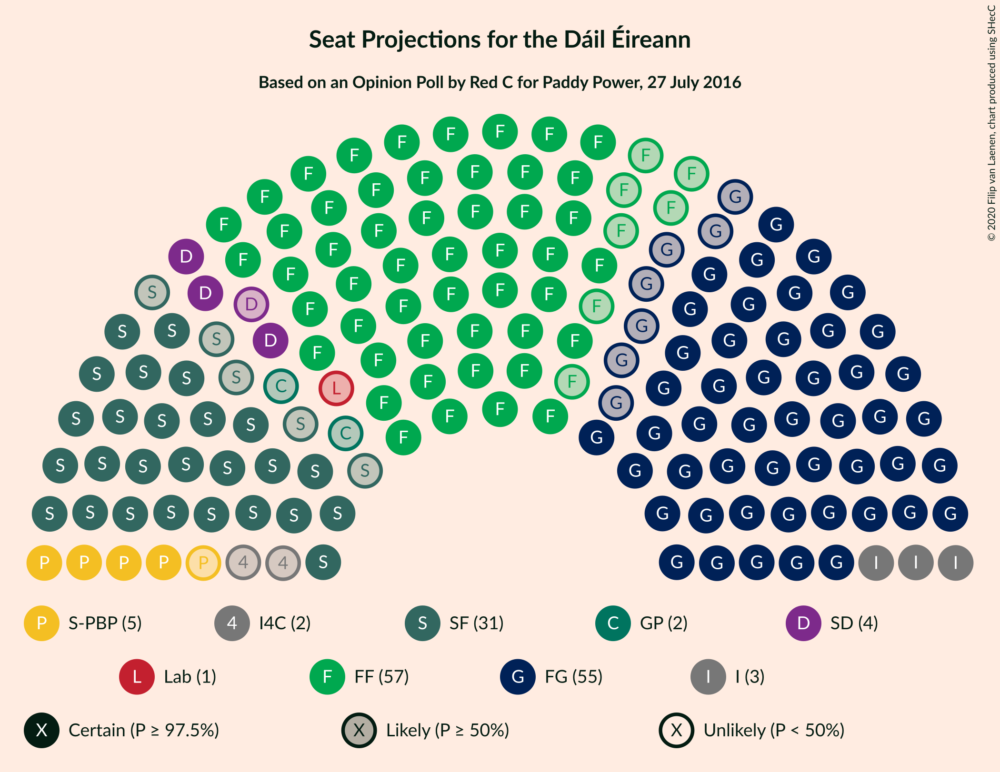
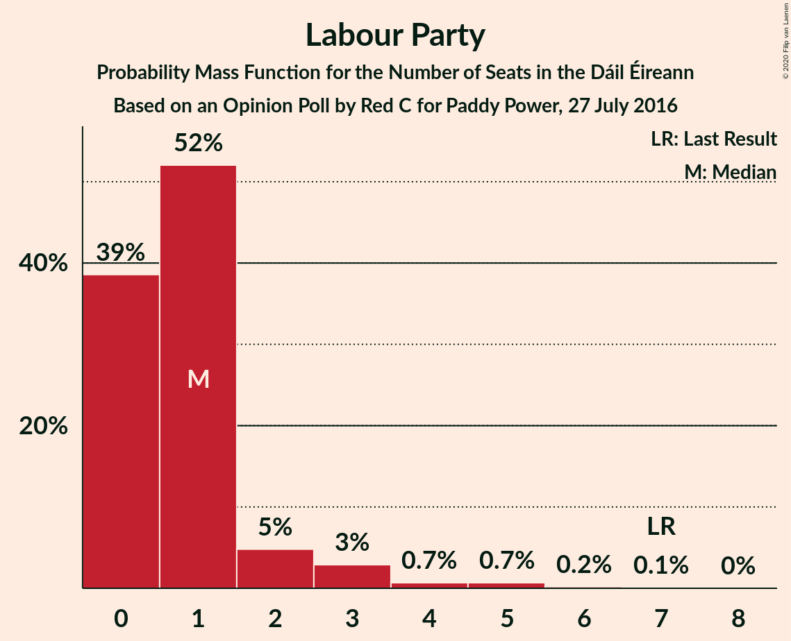
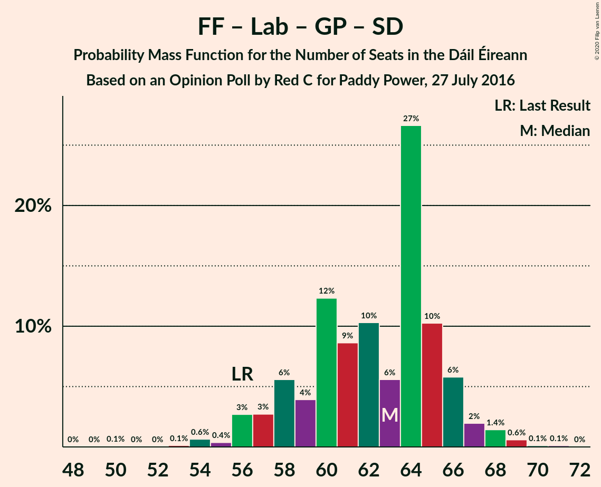
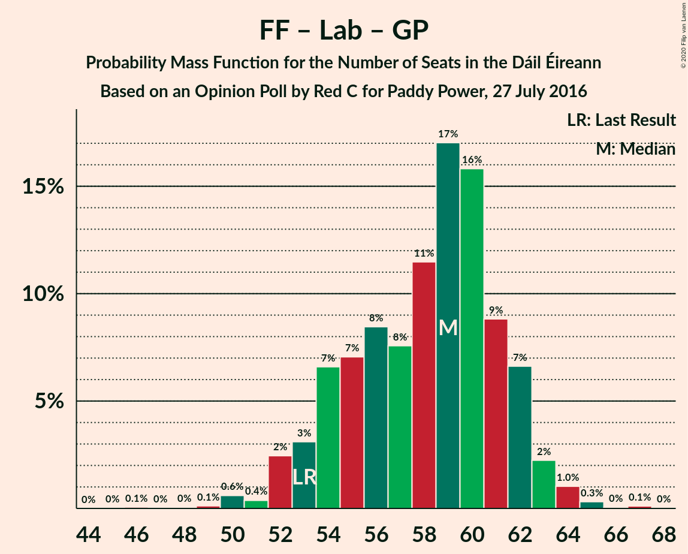

# Opinion Poll by Red C for Paddy Power, 27 July 2016

<a href="#voting-intentions">Voting Intentions</a> | <a href="#seats">Seats</a> | <a href="#coalitions">Coalitions</a> | <a href="#technical-information">Technical Information</a>

## Voting Intentions

### Confidence Intervals

| Party | Last Result | Poll Result | 80% Confidence Interval | 90% Confidence Interval | 95% Confidence Interval | 99% Confidence Interval |
|:-----:|:-----------:|:-----------:|:-----------------------:|:-----------------------:|:-----------------------:|:-----------------------:|
| Fianna Fáil | 24.3% | 28.2% | 26.4–30.1% |25.9–30.6% |25.5–31.1% |24.7–32.0% |
| Fine Gael | 25.5% | 27.2% | 25.5–29.1% |25.0–29.6% |24.5–30.1% |23.7–31.0% |
| Sinn Féin | 13.8% | 15.1% | 13.7–16.6% |13.3–17.1% |13.0–17.5% |12.4–18.2% |
| Independent | 15.9% | 8.5% | 7.5–9.7% |7.2–10.1% |6.9–10.4% |6.4–11.0% |
| Labour Party | 6.6% | 4.0% | 3.3–4.9% |3.1–5.2% |2.9–5.4% |2.7–5.9% |
| Solidarity–People Before Profit | 3.9% | 4.0% | 3.3–4.9% |3.1–5.2% |2.9–5.4% |2.7–5.9% |
| Social Democrats | 3.0% | 3.0% | 2.4–3.8% |2.2–4.1% |2.1–4.3% |1.9–4.7% |
| Green Party/Comhaontas Glas | 2.7% | 3.0% | 2.4–3.8% |2.2–4.1% |2.1–4.3% |1.9–4.7% |
| Independents 4 Change | 1.5% | 1.1% | 0.8–1.7% |0.7–1.8% |0.6–2.0% |0.5–2.3% |
| Renua Ireland | 2.2% | 0.3% | 0.2–0.7% |0.1–0.8% |0.1–0.9% |0.1–1.1% |

*Note:* The poll result column reflects the actual value used in the calculations. Published results may vary slightly, and in addition be rounded to fewer digits.

## Seats

### Confidence Intervals

| Party | Last Result | Median | 80% Confidence Interval | 90% Confidence Interval | 95% Confidence Interval | 99% Confidence Interval |
|:-----:|:-----------:|:------:|:-----------------------:|:-----------------------:|:-----------------------:|:-----------------------:|
| <a href="#fianna-fáil">Fianna Fáil</a> | 44 | 57 | 52–59 |51–60 |50–60 |48–60 |
| <a href="#fine-gael">Fine Gael</a> | 49 | 55 | 50–59 |49–61 |48–62 |46–64 |
| <a href="#sinn-féin">Sinn Féin</a> | 23 | 31 | 28–34 |26–34 |26–35 |24–35 |
| <a href="#independent">Independent</a> | 19 | 3 | 3–6 |3–7 |3–8 |3–10 |
| <a href="#labour-party">Labour Party</a> | 7 | 1 | 0–1 |0–2 |0–3 |0–5 |
| <a href="#solidarity–people-before-profit">Solidarity–People Before Profit</a> | 6 | 5 | 4–9 |4–9 |4–9 |3–10 |
| <a href="#social-democrats">Social Democrats</a> | 3 | 4 | 4–5 |3–5 |3–5 |3–6 |
| <a href="#green-party/comhaontas-glas">Green Party/Comhaontas Glas</a> | 2 | 2 | 0–2 |0–2 |0–2 |0–3 |
| <a href="#independents-4-change">Independents 4 Change</a> | 4 | 2 | 0–4 |0–4 |0–5 |0–5 |
| <a href="#renua-ireland">Renua Ireland</a> | 0 | 0 | 0 |0 |0 |0 |

### Fianna Fáil

*For a full overview of the results for this party, see the [Fianna Fáil](party-fiannafáil.html) page.*

| Number of Seats | Probability | Accumulated | Special Marks |
|:---------------:|:-----------:|:-----------:|:-------------:|
| 44 | 0% | 100% | Last Result |
| 45 | 0.1% | 100% |  |
| 46 | 0.1% | 99.9% |  |
| 47 | 0.1% | 99.8% |  |
| 48 | 0.3% | 99.7% |  |
| 49 | 0.6% | 99.4% |  |
| 50 | 3% | 98.8% |  |
| 51 | 2% | 96% |  |
| 52 | 11% | 94% |  |
| 53 | 9% | 83% |  |
| 54 | 3% | 74% |  |
| 55 | 8% | 71% |  |
| 56 | 11% | 62% |  |
| 57 | 17% | 52% | Median |
| 58 | 18% | 34% |  |
| 59 | 9% | 16% |  |
| 60 | 7% | 8% |  |
| 61 | 0.1% | 0.4% |  |
| 62 | 0.2% | 0.2% |  |
| 63 | 0% | 0% |  |

### Fine Gael

*For a full overview of the results for this party, see the [Fine Gael](party-finegael.html) page.*

| Number of Seats | Probability | Accumulated | Special Marks |
|:---------------:|:-----------:|:-----------:|:-------------:|
| 43 | 0.1% | 100% |  |
| 44 | 0.1% | 99.9% |  |
| 45 | 0.1% | 99.7% |  |
| 46 | 0.8% | 99.6% |  |
| 47 | 0.7% | 98.8% |  |
| 48 | 2% | 98% |  |
| 49 | 3% | 96% | Last Result |
| 50 | 9% | 94% |  |
| 51 | 13% | 85% |  |
| 52 | 5% | 72% |  |
| 53 | 5% | 67% |  |
| 54 | 12% | 62% |  |
| 55 | 7% | 50% | Median |
| 56 | 13% | 43% |  |
| 57 | 6% | 30% |  |
| 58 | 7% | 24% |  |
| 59 | 10% | 17% |  |
| 60 | 1.1% | 7% |  |
| 61 | 2% | 6% |  |
| 62 | 2% | 3% |  |
| 63 | 0.6% | 1.2% |  |
| 64 | 0.1% | 0.6% |  |
| 65 | 0.4% | 0.5% |  |
| 66 | 0% | 0.1% |  |
| 67 | 0% | 0.1% |  |
| 68 | 0% | 0% |  |

### Sinn Féin

*For a full overview of the results for this party, see the [Sinn Féin](party-sinnféin.html) page.*

| Number of Seats | Probability | Accumulated | Special Marks |
|:---------------:|:-----------:|:-----------:|:-------------:|
| 18 | 0.1% | 100% |  |
| 19 | 0% | 99.9% |  |
| 20 | 0% | 99.9% |  |
| 21 | 0.1% | 99.8% |  |
| 22 | 0.1% | 99.8% |  |
| 23 | 0.1% | 99.7% | Last Result |
| 24 | 0.7% | 99.6% |  |
| 25 | 1.0% | 98.9% |  |
| 26 | 4% | 98% |  |
| 27 | 2% | 94% |  |
| 28 | 6% | 92% |  |
| 29 | 5% | 86% |  |
| 30 | 26% | 81% |  |
| 31 | 14% | 55% | Median |
| 32 | 17% | 41% |  |
| 33 | 8% | 24% |  |
| 34 | 12% | 16% |  |
| 35 | 3% | 4% |  |
| 36 | 0.3% | 0.4% |  |
| 37 | 0.1% | 0.2% |  |
| 38 | 0.1% | 0.1% |  |
| 39 | 0% | 0% |  |

### Independent

*For a full overview of the results for this party, see the [Independent](party-independent.html) page.*

| Number of Seats | Probability | Accumulated | Special Marks |
|:---------------:|:-----------:|:-----------:|:-------------:|
| 3 | 54% | 100% | Median |
| 4 | 30% | 46% |  |
| 5 | 6% | 16% |  |
| 6 | 3% | 10% |  |
| 7 | 4% | 7% |  |
| 8 | 1.3% | 3% |  |
| 9 | 0.6% | 2% |  |
| 10 | 0.8% | 1.3% |  |
| 11 | 0.3% | 0.5% |  |
| 12 | 0.1% | 0.2% |  |
| 13 | 0.1% | 0.1% |  |
| 14 | 0.1% | 0.1% |  |
| 15 | 0% | 0% |  |
| 16 | 0% | 0% |  |
| 17 | 0% | 0% |  |
| 18 | 0% | 0% |  |
| 19 | 0% | 0% | Last Result |

### Labour Party

*For a full overview of the results for this party, see the [Labour Party](party-labourparty.html) page.*

| Number of Seats | Probability | Accumulated | Special Marks |
|:---------------:|:-----------:|:-----------:|:-------------:|
| 0 | 39% | 100% |  |
| 1 | 52% | 61% | Median |
| 2 | 5% | 9% |  |
| 3 | 3% | 5% |  |
| 4 | 0.7% | 2% |  |
| 5 | 0.7% | 1.0% |  |
| 6 | 0.2% | 0.3% |  |
| 7 | 0.1% | 0.1% | Last Result |
| 8 | 0% | 0% |  |

### Solidarity–People Before Profit

*For a full overview of the results for this party, see the [Solidarity–People Before Profit](party-solidarity–peoplebeforeprofit.html) page.*

| Number of Seats | Probability | Accumulated | Special Marks |
|:---------------:|:-----------:|:-----------:|:-------------:|
| 3 | 0.6% | 100% |  |
| 4 | 23% | 99.4% |  |
| 5 | 29% | 77% | Median |
| 6 | 11% | 47% | Last Result |
| 7 | 3% | 37% |  |
| 8 | 5% | 33% |  |
| 9 | 28% | 28% |  |
| 10 | 0.7% | 0.7% |  |
| 11 | 0% | 0% |  |

### Social Democrats

*For a full overview of the results for this party, see the [Social Democrats](party-socialdemocrats.html) page.*

| Number of Seats | Probability | Accumulated | Special Marks |
|:---------------:|:-----------:|:-----------:|:-------------:|
| 3 | 6% | 100% | Last Result |
| 4 | 70% | 94% | Median |
| 5 | 23% | 24% |  |
| 6 | 1.2% | 1.4% |  |
| 7 | 0.1% | 0.2% |  |
| 8 | 0.1% | 0.1% |  |
| 9 | 0% | 0% |  |

### Green Party/Comhaontas Glas

*For a full overview of the results for this party, see the [Green Party/Comhaontas Glas](party-greenpartycomhaontasglas.html) page.*

| Number of Seats | Probability | Accumulated | Special Marks |
|:---------------:|:-----------:|:-----------:|:-------------:|
| 0 | 10% | 100% |  |
| 1 | 37% | 90% |  |
| 2 | 51% | 52% | Last Result, Median |
| 3 | 1.1% | 1.3% |  |
| 4 | 0.2% | 0.2% |  |
| 5 | 0% | 0% |  |

### Independents 4 Change

*For a full overview of the results for this party, see the [Independents 4 Change](party-independents4change.html) page.*

| Number of Seats | Probability | Accumulated | Special Marks |
|:---------------:|:-----------:|:-----------:|:-------------:|
| 0 | 16% | 100% |  |
| 1 | 27% | 84% |  |
| 2 | 18% | 57% | Median |
| 3 | 9% | 40% |  |
| 4 | 27% | 31% | Last Result |
| 5 | 3% | 3% |  |
| 6 | 0% | 0% |  |

### Renua Ireland

*For a full overview of the results for this party, see the [Renua Ireland](party-renuaireland.html) page.*

| Number of Seats | Probability | Accumulated | Special Marks |
|:---------------:|:-----------:|:-----------:|:-------------:|
| 0 | 100% | 100% | Last Result, Median |

## Coalitions

### Confidence Intervals

| Coalition | Last Result | Median | Majority? | 80% Confidence Interval | 90% Confidence Interval | 95% Confidence Interval | 99% Confidence Interval |
|:---------:|:-----------:|:------:|:---------:|:-----------------------:|:-----------------------:|:-----------------------:|:-----------------------:|
| Fianna Fáil – Fine Gael | 93 | 111 | 100% | 106–114 | 106–115 | 105–117 | 102–120 |
| Fianna Fáil – Sinn Féin | 67 | 88 | 97% | 83–90 | 82–92 | 80–92 | 77–94 |
| Fine Gael – Labour Party – Green Party/Comhaontas Glas – Social Democrats | 61 | 60 | 0% | 56–66 | 56–67 | 55–68 | 52–70 |
| Fianna Fáil – Labour Party – Green Party/Comhaontas Glas – Social Democrats | 56 | 63 | 0% | 58–66 | 57–66 | 56–67 | 54–69 |
| Fine Gael – Labour Party – Green Party/Comhaontas Glas | 58 | 56 | 0% | 52–62 | 51–63 | 51–64 | 48–66 |
| Fianna Fáil – Labour Party – Green Party/Comhaontas Glas | 53 | 59 | 0% | 54–62 | 53–62 | 52–63 | 50–64 |
| Fine Gael – Green Party/Comhaontas Glas | 51 | 56 | 0% | 52–61 | 51–62 | 50–63 | 47–65 |
| Fine Gael – Labour Party | 56 | 55 | 0% | 50–60 | 50–62 | 49–63 | 46–65 |
| Fianna Fáil – Green Party/Comhaontas Glas | 46 | 58 | 0% | 53–61 | 53–61 | 51–62 | 49–62 |
| Fine Gael | 49 | 55 | 0% | 50–59 | 49–61 | 48–62 | 46–64 |
| Fianna Fáil – Labour Party | 51 | 57 | 0% | 53–60 | 52–61 | 51–61 | 49–63 |

### Fianna Fáil – Fine Gael

| Number of Seats | Probability | Accumulated | Special Marks |
|:---------------:|:-----------:|:-----------:|:-------------:|
| 93 | 0% | 100% | Last Result |
| 94 | 0% | 100% |  |
| 95 | 0% | 100% |  |
| 96 | 0% | 100% |  |
| 97 | 0% | 100% |  |
| 98 | 0% | 100% |  |
| 99 | 0% | 100% |  |
| 100 | 0.1% | 99.9% |  |
| 101 | 0.2% | 99.8% |  |
| 102 | 0.3% | 99.6% |  |
| 103 | 0.7% | 99.3% |  |
| 104 | 0.8% | 98.6% |  |
| 105 | 3% | 98% |  |
| 106 | 9% | 95% |  |
| 107 | 6% | 86% |  |
| 108 | 12% | 80% |  |
| 109 | 5% | 68% |  |
| 110 | 8% | 63% |  |
| 111 | 11% | 55% |  |
| 112 | 22% | 44% | Median |
| 113 | 5% | 22% |  |
| 114 | 9% | 17% |  |
| 115 | 3% | 8% |  |
| 116 | 2% | 5% |  |
| 117 | 2% | 3% |  |
| 118 | 0.2% | 2% |  |
| 119 | 0.4% | 1.3% |  |
| 120 | 0.6% | 1.0% |  |
| 121 | 0.3% | 0.3% |  |
| 122 | 0% | 0% |  |

### Fianna Fáil – Sinn Féin

| Number of Seats | Probability | Accumulated | Special Marks |
|:---------------:|:-----------:|:-----------:|:-------------:|
| 67 | 0% | 100% | Last Result |
| 68 | 0% | 100% |  |
| 69 | 0% | 100% |  |
| 70 | 0% | 100% |  |
| 71 | 0% | 100% |  |
| 72 | 0% | 100% |  |
| 73 | 0% | 100% |  |
| 74 | 0.1% | 100% |  |
| 75 | 0.1% | 99.9% |  |
| 76 | 0.1% | 99.7% |  |
| 77 | 0.2% | 99.6% |  |
| 78 | 1.0% | 99.4% |  |
| 79 | 0.5% | 98% |  |
| 80 | 0.7% | 98% |  |
| 81 | 1.4% | 97% | Majority |
| 82 | 3% | 96% |  |
| 83 | 5% | 92% |  |
| 84 | 9% | 87% |  |
| 85 | 17% | 79% |  |
| 86 | 4% | 62% |  |
| 87 | 8% | 58% |  |
| 88 | 26% | 50% | Median |
| 89 | 6% | 25% |  |
| 90 | 9% | 18% |  |
| 91 | 4% | 10% |  |
| 92 | 3% | 5% |  |
| 93 | 2% | 2% |  |
| 94 | 0.5% | 0.7% |  |
| 95 | 0.2% | 0.2% |  |
| 96 | 0% | 0% |  |

### Fine Gael – Labour Party – Green Party/Comhaontas Glas – Social Democrats

| Number of Seats | Probability | Accumulated | Special Marks |
|:---------------:|:-----------:|:-----------:|:-------------:|
| 49 | 0.1% | 100% |  |
| 50 | 0.1% | 99.9% |  |
| 51 | 0.2% | 99.8% |  |
| 52 | 0.4% | 99.6% |  |
| 53 | 1.1% | 99.2% |  |
| 54 | 0.6% | 98% |  |
| 55 | 2% | 98% |  |
| 56 | 10% | 96% |  |
| 57 | 2% | 86% |  |
| 58 | 15% | 84% |  |
| 59 | 7% | 68% |  |
| 60 | 12% | 61% |  |
| 61 | 7% | 50% | Last Result |
| 62 | 8% | 43% | Median |
| 63 | 10% | 36% |  |
| 64 | 3% | 25% |  |
| 65 | 4% | 22% |  |
| 66 | 11% | 18% |  |
| 67 | 2% | 6% |  |
| 68 | 2% | 4% |  |
| 69 | 1.0% | 2% |  |
| 70 | 0.6% | 1.0% |  |
| 71 | 0.1% | 0.3% |  |
| 72 | 0.1% | 0.2% |  |
| 73 | 0.1% | 0.1% |  |
| 74 | 0% | 0% |  |

### Fianna Fáil – Labour Party – Green Party/Comhaontas Glas – Social Democrats

| Number of Seats | Probability | Accumulated | Special Marks |
|:---------------:|:-----------:|:-----------:|:-------------:|
| 50 | 0.1% | 100% |  |
| 51 | 0% | 99.9% |  |
| 52 | 0% | 99.9% |  |
| 53 | 0.1% | 99.8% |  |
| 54 | 0.6% | 99.7% |  |
| 55 | 0.4% | 99.1% |  |
| 56 | 3% | 98.7% | Last Result |
| 57 | 3% | 96% |  |
| 58 | 6% | 93% |  |
| 59 | 4% | 88% |  |
| 60 | 12% | 84% |  |
| 61 | 9% | 71% |  |
| 62 | 10% | 63% |  |
| 63 | 6% | 53% |  |
| 64 | 27% | 47% | Median |
| 65 | 10% | 20% |  |
| 66 | 6% | 10% |  |
| 67 | 2% | 4% |  |
| 68 | 1.4% | 2% |  |
| 69 | 0.6% | 0.8% |  |
| 70 | 0.1% | 0.2% |  |
| 71 | 0.1% | 0.1% |  |
| 72 | 0% | 0% |  |

### Fine Gael – Labour Party – Green Party/Comhaontas Glas

| Number of Seats | Probability | Accumulated | Special Marks |
|:---------------:|:-----------:|:-----------:|:-------------:|
| 45 | 0% | 100% |  |
| 46 | 0.1% | 99.9% |  |
| 47 | 0.3% | 99.9% |  |
| 48 | 0.4% | 99.6% |  |
| 49 | 1.1% | 99.2% |  |
| 50 | 0.6% | 98% |  |
| 51 | 3% | 98% |  |
| 52 | 9% | 94% |  |
| 53 | 2% | 86% |  |
| 54 | 16% | 83% |  |
| 55 | 14% | 67% |  |
| 56 | 4% | 54% |  |
| 57 | 6% | 50% |  |
| 58 | 11% | 44% | Last Result, Median |
| 59 | 9% | 33% |  |
| 60 | 4% | 25% |  |
| 61 | 6% | 20% |  |
| 62 | 8% | 14% |  |
| 63 | 3% | 6% |  |
| 64 | 2% | 4% |  |
| 65 | 0.9% | 2% |  |
| 66 | 0.5% | 0.8% |  |
| 67 | 0.1% | 0.3% |  |
| 68 | 0.1% | 0.2% |  |
| 69 | 0% | 0.1% |  |
| 70 | 0% | 0% |  |

### Fianna Fáil – Labour Party – Green Party/Comhaontas Glas

| Number of Seats | Probability | Accumulated | Special Marks |
|:---------------:|:-----------:|:-----------:|:-------------:|
| 46 | 0.1% | 100% |  |
| 47 | 0% | 99.9% |  |
| 48 | 0% | 99.9% |  |
| 49 | 0.1% | 99.8% |  |
| 50 | 0.6% | 99.7% |  |
| 51 | 0.4% | 99.1% |  |
| 52 | 2% | 98.8% |  |
| 53 | 3% | 96% | Last Result |
| 54 | 7% | 93% |  |
| 55 | 7% | 87% |  |
| 56 | 8% | 80% |  |
| 57 | 8% | 71% |  |
| 58 | 11% | 64% |  |
| 59 | 17% | 52% |  |
| 60 | 16% | 35% | Median |
| 61 | 9% | 19% |  |
| 62 | 7% | 10% |  |
| 63 | 2% | 4% |  |
| 64 | 1.0% | 2% |  |
| 65 | 0.3% | 0.5% |  |
| 66 | 0% | 0.2% |  |
| 67 | 0.1% | 0.1% |  |
| 68 | 0% | 0% |  |

### Fine Gael – Green Party/Comhaontas Glas

| Number of Seats | Probability | Accumulated | Special Marks |
|:---------------:|:-----------:|:-----------:|:-------------:|
| 44 | 0.1% | 100% |  |
| 45 | 0.1% | 99.9% |  |
| 46 | 0.1% | 99.8% |  |
| 47 | 0.4% | 99.7% |  |
| 48 | 0.7% | 99.3% |  |
| 49 | 1.1% | 98.6% |  |
| 50 | 2% | 98% |  |
| 51 | 5% | 96% | Last Result |
| 52 | 9% | 90% |  |
| 53 | 12% | 82% |  |
| 54 | 6% | 70% |  |
| 55 | 13% | 64% |  |
| 56 | 4% | 51% |  |
| 57 | 13% | 47% | Median |
| 58 | 9% | 33% |  |
| 59 | 4% | 24% |  |
| 60 | 6% | 20% |  |
| 61 | 8% | 14% |  |
| 62 | 2% | 6% |  |
| 63 | 3% | 4% |  |
| 64 | 0.9% | 2% |  |
| 65 | 0.4% | 0.9% |  |
| 66 | 0.4% | 0.5% |  |
| 67 | 0.1% | 0.1% |  |
| 68 | 0% | 0.1% |  |
| 69 | 0% | 0% |  |

### Fine Gael – Labour Party

| Number of Seats | Probability | Accumulated | Special Marks |
|:---------------:|:-----------:|:-----------:|:-------------:|
| 44 | 0.1% | 100% |  |
| 45 | 0.2% | 99.9% |  |
| 46 | 0.4% | 99.7% |  |
| 47 | 0.9% | 99.4% |  |
| 48 | 0.5% | 98% |  |
| 49 | 2% | 98% |  |
| 50 | 6% | 96% |  |
| 51 | 3% | 89% |  |
| 52 | 15% | 86% |  |
| 53 | 6% | 71% |  |
| 54 | 13% | 65% |  |
| 55 | 4% | 53% |  |
| 56 | 9% | 48% | Last Result, Median |
| 57 | 7% | 39% |  |
| 58 | 7% | 32% |  |
| 59 | 7% | 25% |  |
| 60 | 10% | 17% |  |
| 61 | 2% | 7% |  |
| 62 | 2% | 5% |  |
| 63 | 2% | 3% |  |
| 64 | 0.4% | 1.2% |  |
| 65 | 0.5% | 0.8% |  |
| 66 | 0.2% | 0.3% |  |
| 67 | 0.1% | 0.1% |  |
| 68 | 0% | 0.1% |  |
| 69 | 0% | 0% |  |

### Fianna Fáil – Green Party/Comhaontas Glas

| Number of Seats | Probability | Accumulated | Special Marks |
|:---------------:|:-----------:|:-----------:|:-------------:|
| 46 | 0.1% | 100% | Last Result |
| 47 | 0% | 99.9% |  |
| 48 | 0.1% | 99.8% |  |
| 49 | 0.3% | 99.8% |  |
| 50 | 0.7% | 99.5% |  |
| 51 | 2% | 98.8% |  |
| 52 | 1.2% | 96% |  |
| 53 | 9% | 95% |  |
| 54 | 8% | 87% |  |
| 55 | 7% | 79% |  |
| 56 | 7% | 72% |  |
| 57 | 8% | 66% |  |
| 58 | 13% | 57% |  |
| 59 | 22% | 44% | Median |
| 60 | 11% | 22% |  |
| 61 | 6% | 10% |  |
| 62 | 4% | 4% |  |
| 63 | 0.1% | 0.3% |  |
| 64 | 0.2% | 0.2% |  |
| 65 | 0% | 0% |  |

### Fine Gael

| Number of Seats | Probability | Accumulated | Special Marks |
|:---------------:|:-----------:|:-----------:|:-------------:|
| 43 | 0.1% | 100% |  |
| 44 | 0.1% | 99.9% |  |
| 45 | 0.1% | 99.7% |  |
| 46 | 0.8% | 99.6% |  |
| 47 | 0.7% | 98.8% |  |
| 48 | 2% | 98% |  |
| 49 | 3% | 96% | Last Result |
| 50 | 9% | 94% |  |
| 51 | 13% | 85% |  |
| 52 | 5% | 72% |  |
| 53 | 5% | 67% |  |
| 54 | 12% | 62% |  |
| 55 | 7% | 50% | Median |
| 56 | 13% | 43% |  |
| 57 | 6% | 30% |  |
| 58 | 7% | 24% |  |
| 59 | 10% | 17% |  |
| 60 | 1.1% | 7% |  |
| 61 | 2% | 6% |  |
| 62 | 2% | 3% |  |
| 63 | 0.6% | 1.2% |  |
| 64 | 0.1% | 0.6% |  |
| 65 | 0.4% | 0.5% |  |
| 66 | 0% | 0.1% |  |
| 67 | 0% | 0.1% |  |
| 68 | 0% | 0% |  |

### Fianna Fáil – Labour Party

| Number of Seats | Probability | Accumulated | Special Marks |
|:---------------:|:-----------:|:-----------:|:-------------:|
| 45 | 0% | 100% |  |
| 46 | 0% | 99.9% |  |
| 47 | 0.1% | 99.9% |  |
| 48 | 0.1% | 99.8% |  |
| 49 | 0.4% | 99.7% |  |
| 50 | 1.2% | 99.3% |  |
| 51 | 3% | 98% | Last Result |
| 52 | 2% | 95% |  |
| 53 | 11% | 93% |  |
| 54 | 9% | 83% |  |
| 55 | 4% | 74% |  |
| 56 | 13% | 69% |  |
| 57 | 7% | 57% |  |
| 58 | 26% | 50% | Median |
| 59 | 9% | 24% |  |
| 60 | 8% | 15% |  |
| 61 | 6% | 7% |  |
| 62 | 0.8% | 2% |  |
| 63 | 0.6% | 0.8% |  |
| 64 | 0.1% | 0.3% |  |
| 65 | 0.1% | 0.1% |  |
| 66 | 0% | 0.1% |  |
| 67 | 0% | 0% |  |

## Technical Information

### Opinion Poll

+ **Polling firm:** Red C
+ **Commissioner(s):** Paddy Power
+ **Fieldwork period:** 27 July 2016

### Calculations

+ **Sample size:** 1000
+ **Simulations done:** 1,048,576
+ **Error estimate:** 2.15%

