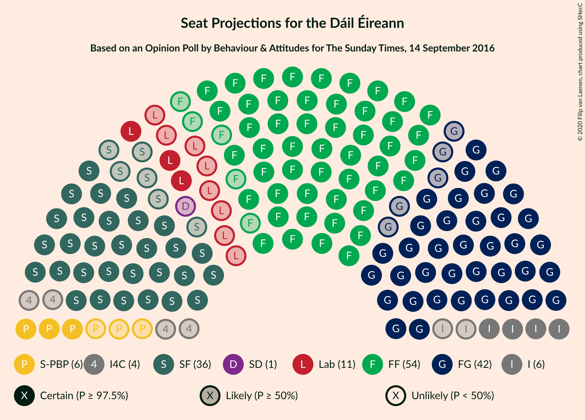
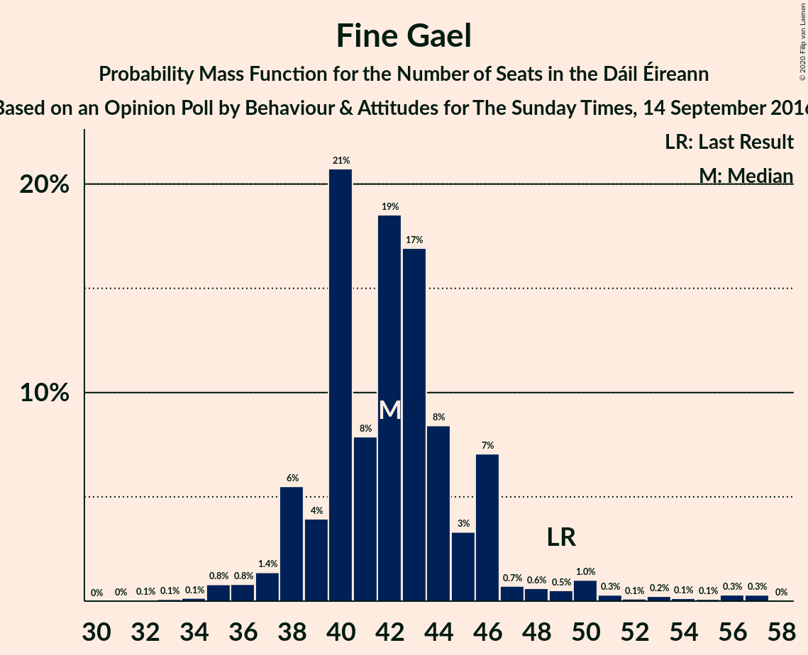
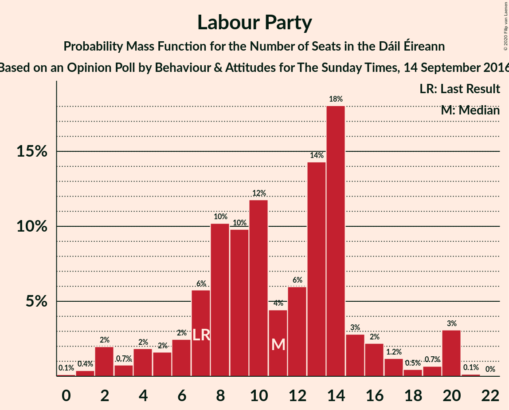
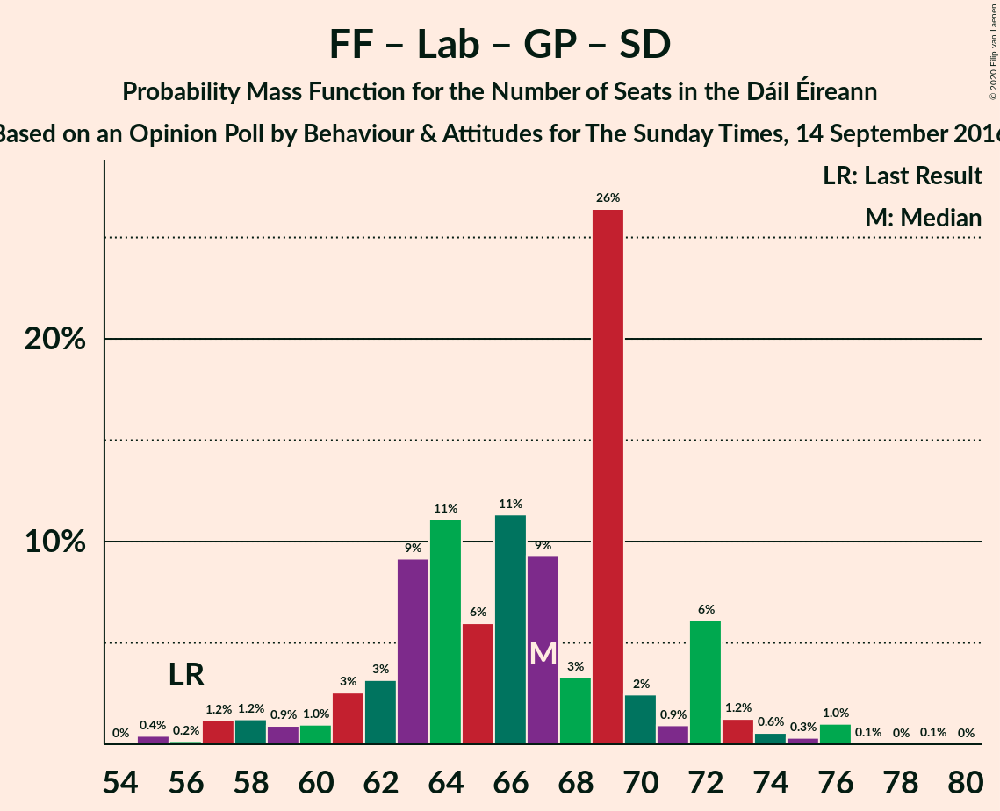
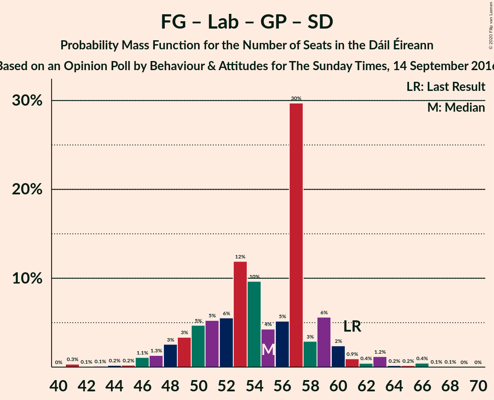
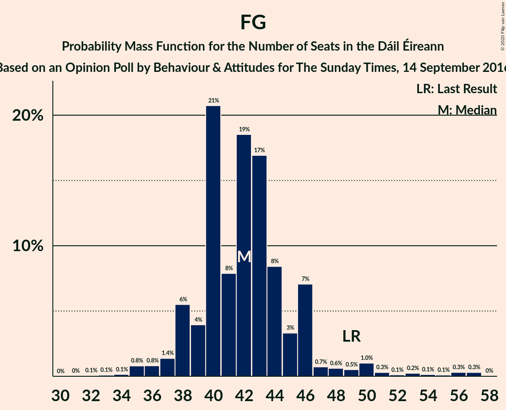

# Opinion Poll by Behaviour & Attitudes for The Sunday Times, 14 September 2016

<a href="#voting-intentions">Voting Intentions</a> | <a href="#seats">Seats</a> | <a href="#coalitions">Coalitions</a> | <a href="#technical-information">Technical Information</a>

## Voting Intentions

### Confidence Intervals

| Party | Last Result | Poll Result | 80% Confidence Interval | 90% Confidence Interval | 95% Confidence Interval | 99% Confidence Interval |
|:-----:|:-----------:|:-----------:|:-----------------------:|:-----------------------:|:-----------------------:|:-----------------------:|
| Fianna Fáil | 24.3% | 28.2% | 26.4–30.2% |25.8–30.7% |25.4–31.2% |24.5–32.2% |
| Fine Gael | 25.5% | 23.2% | 21.4–25.0% |20.9–25.6% |20.5–26.0% |19.7–26.9% |
| Sinn Féin | 13.8% | 18.1% | 16.6–19.8% |16.1–20.3% |15.7–20.8% |15.0–21.6% |
| Independent | 15.9% | 10.2% | 9.0–11.6% |8.7–12.0% |8.4–12.4% |7.9–13.0% |
| Labour Party | 6.6% | 7.0% | 6.1–8.2% |5.8–8.6% |5.5–8.9% |5.1–9.5% |
| Solidarity–People Before Profit | 3.9% | 4.1% | 3.3–5.0% |3.1–5.3% |3.0–5.6% |2.6–6.1% |
| Green Party/Comhaontas Glas | 2.7% | 2.0% | 1.5–2.7% |1.4–2.9% |1.2–3.1% |1.1–3.5% |
| Independents 4 Change | 1.5% | 1.3% | 0.9–2.0% |0.8–2.1% |0.7–2.3% |0.6–2.6% |
| Social Democrats | 3.0% | 1.0% | 0.7–1.6% |0.6–1.7% |0.5–1.9% |0.4–2.2% |
| Renua Ireland | 2.2% | 0.1% | 0.1–0.6% |0.1–0.7% |0.1–0.8% |0.0–1.0% |

*Note:* The poll result column reflects the actual value used in the calculations. Published results may vary slightly, and in addition be rounded to fewer digits.

## Seats

### Confidence Intervals

| Party | Last Result | Median | 80% Confidence Interval | 90% Confidence Interval | 95% Confidence Interval | 99% Confidence Interval |
|:-----:|:-----------:|:------:|:-----------------------:|:-----------------------:|:-----------------------:|:-----------------------:|
| <a href="#fianna-fáil">Fianna Fáil</a> | 44 | 54 | 51–57 |50–60 |49–61 |47–62 |
| <a href="#fine-gael">Fine Gael</a> | 49 | 42 | 39–46 |38–46 |37–50 |35–56 |
| <a href="#sinn-féin">Sinn Féin</a> | 23 | 36 | 33–39 |31–39 |30–40 |28–42 |
| <a href="#independent">Independent</a> | 19 | 6 | 4–11 |4–13 |4–14 |3–16 |
| <a href="#labour-party">Labour Party</a> | 7 | 11 | 7–15 |4–17 |3–20 |2–20 |
| <a href="#solidarity–people-before-profit">Solidarity–People Before Profit</a> | 6 | 6 | 5–8 |3–9 |3–9 |3–10 |
| <a href="#green-party/comhaontas-glas">Green Party/Comhaontas Glas</a> | 2 | 0 | 0–1 |0–1 |0–1 |0–2 |
| <a href="#independents-4-change">Independents 4 Change</a> | 4 | 4 | 0–4 |0–5 |0–5 |0–5 |
| <a href="#social-democrats">Social Democrats</a> | 3 | 1 | 0–3 |0–3 |0–3 |0–3 |
| <a href="#renua-ireland">Renua Ireland</a> | 0 | 0 | 0 |0 |0 |0 |

### Fianna Fáil

*For a full overview of the results for this party, see the [Fianna Fáil](party-fiannafáil.html) page.*

| Number of Seats | Probability | Accumulated | Special Marks |
|:---------------:|:-----------:|:-----------:|:-------------:|
| 44 | 0% | 100% | Last Result |
| 45 | 0.2% | 99.9% |  |
| 46 | 0.2% | 99.8% |  |
| 47 | 0.7% | 99.5% |  |
| 48 | 0.7% | 98.8% |  |
| 49 | 1.0% | 98% |  |
| 50 | 5% | 97% |  |
| 51 | 5% | 92% |  |
| 52 | 20% | 87% |  |
| 53 | 15% | 67% |  |
| 54 | 12% | 52% | Median |
| 55 | 19% | 40% |  |
| 56 | 9% | 21% |  |
| 57 | 5% | 12% |  |
| 58 | 1.3% | 8% |  |
| 59 | 1.3% | 6% |  |
| 60 | 2% | 5% |  |
| 61 | 0.9% | 3% |  |
| 62 | 2% | 2% |  |
| 63 | 0% | 0% |  |

### Fine Gael

*For a full overview of the results for this party, see the [Fine Gael](party-finegael.html) page.*

| Number of Seats | Probability | Accumulated | Special Marks |
|:---------------:|:-----------:|:-----------:|:-------------:|
| 32 | 0.1% | 100% |  |
| 33 | 0.1% | 99.9% |  |
| 34 | 0.1% | 99.8% |  |
| 35 | 0.8% | 99.7% |  |
| 36 | 0.8% | 98.9% |  |
| 37 | 1.4% | 98% |  |
| 38 | 6% | 97% |  |
| 39 | 4% | 91% |  |
| 40 | 21% | 87% |  |
| 41 | 8% | 67% |  |
| 42 | 19% | 59% | Median |
| 43 | 17% | 40% |  |
| 44 | 8% | 23% |  |
| 45 | 3% | 15% |  |
| 46 | 7% | 11% |  |
| 47 | 0.7% | 4% |  |
| 48 | 0.6% | 4% |  |
| 49 | 0.5% | 3% | Last Result |
| 50 | 1.0% | 3% |  |
| 51 | 0.3% | 2% |  |
| 52 | 0.1% | 1.2% |  |
| 53 | 0.2% | 1.1% |  |
| 54 | 0.1% | 0.9% |  |
| 55 | 0.1% | 0.7% |  |
| 56 | 0.3% | 0.6% |  |
| 57 | 0.3% | 0.3% |  |
| 58 | 0% | 0% |  |

### Sinn Féin

*For a full overview of the results for this party, see the [Sinn Féin](party-sinnféin.html) page.*

| Number of Seats | Probability | Accumulated | Special Marks |
|:---------------:|:-----------:|:-----------:|:-------------:|
| 23 | 0% | 100% | Last Result |
| 24 | 0% | 100% |  |
| 25 | 0.3% | 100% |  |
| 26 | 0.1% | 99.7% |  |
| 27 | 0.1% | 99.6% |  |
| 28 | 0.1% | 99.5% |  |
| 29 | 0.4% | 99.4% |  |
| 30 | 4% | 99.0% |  |
| 31 | 2% | 95% |  |
| 32 | 2% | 94% |  |
| 33 | 4% | 91% |  |
| 34 | 12% | 88% |  |
| 35 | 19% | 76% |  |
| 36 | 11% | 57% | Median |
| 37 | 20% | 46% |  |
| 38 | 13% | 27% |  |
| 39 | 10% | 14% |  |
| 40 | 1.1% | 3% |  |
| 41 | 0.8% | 2% |  |
| 42 | 1.4% | 2% |  |
| 43 | 0.1% | 0.1% |  |
| 44 | 0% | 0% |  |

### Independent

*For a full overview of the results for this party, see the [Independent](party-independent.html) page.*

| Number of Seats | Probability | Accumulated | Special Marks |
|:---------------:|:-----------:|:-----------:|:-------------:|
| 3 | 2% | 100% |  |
| 4 | 18% | 98% |  |
| 5 | 17% | 80% |  |
| 6 | 31% | 63% | Median |
| 7 | 8% | 32% |  |
| 8 | 7% | 24% |  |
| 9 | 3% | 17% |  |
| 10 | 3% | 15% |  |
| 11 | 2% | 12% |  |
| 12 | 1.3% | 10% |  |
| 13 | 5% | 9% |  |
| 14 | 2% | 3% |  |
| 15 | 1.0% | 2% |  |
| 16 | 0.5% | 0.6% |  |
| 17 | 0.1% | 0.1% |  |
| 18 | 0% | 0% |  |
| 19 | 0% | 0% | Last Result |

### Labour Party

*For a full overview of the results for this party, see the [Labour Party](party-labourparty.html) page.*

| Number of Seats | Probability | Accumulated | Special Marks |
|:---------------:|:-----------:|:-----------:|:-------------:|
| 0 | 0.1% | 100% |  |
| 1 | 0.4% | 99.9% |  |
| 2 | 2% | 99.5% |  |
| 3 | 0.7% | 98% |  |
| 4 | 2% | 97% |  |
| 5 | 2% | 95% |  |
| 6 | 2% | 93% |  |
| 7 | 6% | 91% | Last Result |
| 8 | 10% | 85% |  |
| 9 | 10% | 75% |  |
| 10 | 12% | 65% |  |
| 11 | 4% | 53% | Median |
| 12 | 6% | 49% |  |
| 13 | 14% | 43% |  |
| 14 | 18% | 29% |  |
| 15 | 3% | 11% |  |
| 16 | 2% | 8% |  |
| 17 | 1.2% | 6% |  |
| 18 | 0.5% | 4% |  |
| 19 | 0.7% | 4% |  |
| 20 | 3% | 3% |  |
| 21 | 0.1% | 0.2% |  |
| 22 | 0% | 0% |  |

### Solidarity–People Before Profit

*For a full overview of the results for this party, see the [Solidarity–People Before Profit](party-solidarity–peoplebeforeprofit.html) page.*

| Number of Seats | Probability | Accumulated | Special Marks |
|:---------------:|:-----------:|:-----------:|:-------------:|
| 1 | 0.1% | 100% |  |
| 2 | 0.2% | 99.9% |  |
| 3 | 5% | 99.7% |  |
| 4 | 3% | 94% |  |
| 5 | 37% | 91% |  |
| 6 | 31% | 54% | Last Result, Median |
| 7 | 10% | 24% |  |
| 8 | 6% | 14% |  |
| 9 | 6% | 7% |  |
| 10 | 1.0% | 1.0% |  |
| 11 | 0% | 0% |  |

### Green Party/Comhaontas Glas

*For a full overview of the results for this party, see the [Green Party/Comhaontas Glas](party-greenpartycomhaontasglas.html) page.*

| Number of Seats | Probability | Accumulated | Special Marks |
|:---------------:|:-----------:|:-----------:|:-------------:|
| 0 | 89% | 100% | Median |
| 1 | 9% | 11% |  |
| 2 | 2% | 2% | Last Result |
| 3 | 0% | 0% |  |

### Independents 4 Change

*For a full overview of the results for this party, see the [Independents 4 Change](party-independents4change.html) page.*

| Number of Seats | Probability | Accumulated | Special Marks |
|:---------------:|:-----------:|:-----------:|:-------------:|
| 0 | 12% | 100% |  |
| 1 | 4% | 88% |  |
| 2 | 23% | 85% |  |
| 3 | 7% | 62% |  |
| 4 | 50% | 55% | Last Result, Median |
| 5 | 5% | 5% |  |
| 6 | 0% | 0% |  |

### Social Democrats

*For a full overview of the results for this party, see the [Social Democrats](party-socialdemocrats.html) page.*

| Number of Seats | Probability | Accumulated | Special Marks |
|:---------------:|:-----------:|:-----------:|:-------------:|
| 0 | 21% | 100% |  |
| 1 | 42% | 79% | Median |
| 2 | 8% | 37% |  |
| 3 | 29% | 29% | Last Result |
| 4 | 0% | 0% |  |

### Renua Ireland

*For a full overview of the results for this party, see the [Renua Ireland](party-renuaireland.html) page.*

| Number of Seats | Probability | Accumulated | Special Marks |
|:---------------:|:-----------:|:-----------:|:-------------:|
| 0 | 100% | 100% | Last Result, Median |

## Coalitions

### Confidence Intervals

| Coalition | Last Result | Median | Majority? | 80% Confidence Interval | 90% Confidence Interval | 95% Confidence Interval | 99% Confidence Interval |
|:---------:|:-----------:|:------:|:---------:|:-----------------------:|:-----------------------:|:-----------------------:|:-----------------------:|
| Fianna Fáil – Fine Gael | 93 | 96 | 100% | 92–101 | 89–104 | 89–104 | 86–109 |
| Fianna Fáil – Sinn Féin | 67 | 90 | 99.4% | 86–94 | 84–96 | 83–97 | 80–99 |
| Fianna Fáil – Labour Party – Green Party/Comhaontas Glas – Social Democrats | 56 | 67 | 0% | 62–71 | 61–72 | 58–73 | 56–76 |
| Fianna Fáil – Labour Party – Green Party/Comhaontas Glas | 53 | 66 | 0% | 61–70 | 59–72 | 56–72 | 55–74 |
| Fianna Fáil – Labour Party | 51 | 65 | 0% | 61–69 | 59–72 | 56–72 | 55–74 |
| Fine Gael – Labour Party – Green Party/Comhaontas Glas – Social Democrats | 61 | 55 | 0% | 50–59 | 48–60 | 47–62 | 43–66 |
| Fianna Fáil – Green Party/Comhaontas Glas | 46 | 54 | 0% | 51–57 | 50–60 | 49–61 | 47–62 |
| Fine Gael – Labour Party – Green Party/Comhaontas Glas | 58 | 54 | 0% | 49–58 | 47–59 | 46–60 | 42–65 |
| Fine Gael – Labour Party | 56 | 54 | 0% | 48–58 | 47–58 | 45–59 | 42–64 |
| Fine Gael | 49 | 42 | 0% | 39–46 | 38–46 | 37–50 | 35–56 |
| Fine Gael – Green Party/Comhaontas Glas | 51 | 42 | 0% | 39–46 | 38–46 | 37–50 | 35–56 |

### Fianna Fáil – Fine Gael

| Number of Seats | Probability | Accumulated | Special Marks |
|:---------------:|:-----------:|:-----------:|:-------------:|
| 83 | 0.1% | 100% |  |
| 84 | 0.1% | 99.9% |  |
| 85 | 0.2% | 99.7% |  |
| 86 | 0.7% | 99.6% |  |
| 87 | 0.8% | 98.8% |  |
| 88 | 0.3% | 98% |  |
| 89 | 4% | 98% |  |
| 90 | 1.4% | 93% |  |
| 91 | 1.2% | 92% |  |
| 92 | 15% | 91% |  |
| 93 | 7% | 76% | Last Result |
| 94 | 4% | 69% |  |
| 95 | 10% | 65% |  |
| 96 | 8% | 55% | Median |
| 97 | 6% | 47% |  |
| 98 | 19% | 41% |  |
| 99 | 7% | 22% |  |
| 100 | 4% | 15% |  |
| 101 | 4% | 11% |  |
| 102 | 1.0% | 8% |  |
| 103 | 1.2% | 7% |  |
| 104 | 3% | 5% |  |
| 105 | 0.7% | 2% |  |
| 106 | 0.7% | 1.5% |  |
| 107 | 0.1% | 0.8% |  |
| 108 | 0.1% | 0.7% |  |
| 109 | 0.5% | 0.6% |  |
| 110 | 0.1% | 0.1% |  |
| 111 | 0% | 0% |  |

### Fianna Fáil – Sinn Féin

| Number of Seats | Probability | Accumulated | Special Marks |
|:---------------:|:-----------:|:-----------:|:-------------:|
| 67 | 0% | 100% | Last Result |
| 68 | 0% | 100% |  |
| 69 | 0% | 100% |  |
| 70 | 0% | 100% |  |
| 71 | 0% | 100% |  |
| 72 | 0% | 100% |  |
| 73 | 0% | 100% |  |
| 74 | 0% | 100% |  |
| 75 | 0% | 100% |  |
| 76 | 0% | 100% |  |
| 77 | 0% | 100% |  |
| 78 | 0% | 100% |  |
| 79 | 0.2% | 99.9% |  |
| 80 | 0.3% | 99.7% |  |
| 81 | 0.2% | 99.4% | Majority |
| 82 | 0.8% | 99.2% |  |
| 83 | 1.2% | 98% |  |
| 84 | 4% | 97% |  |
| 85 | 2% | 94% |  |
| 86 | 6% | 92% |  |
| 87 | 23% | 86% |  |
| 88 | 3% | 64% |  |
| 89 | 5% | 61% |  |
| 90 | 8% | 56% | Median |
| 91 | 10% | 48% |  |
| 92 | 20% | 38% |  |
| 93 | 6% | 18% |  |
| 94 | 5% | 12% |  |
| 95 | 2% | 7% |  |
| 96 | 3% | 6% |  |
| 97 | 1.2% | 3% |  |
| 98 | 0.4% | 1.5% |  |
| 99 | 0.7% | 1.0% |  |
| 100 | 0.3% | 0.3% |  |
| 101 | 0% | 0.1% |  |
| 102 | 0% | 0.1% |  |
| 103 | 0% | 0% |  |

### Fianna Fáil – Labour Party – Green Party/Comhaontas Glas – Social Democrats

| Number of Seats | Probability | Accumulated | Special Marks |
|:---------------:|:-----------:|:-----------:|:-------------:|
| 54 | 0% | 100% |  |
| 55 | 0.4% | 99.9% |  |
| 56 | 0.2% | 99.5% | Last Result |
| 57 | 1.2% | 99.4% |  |
| 58 | 1.2% | 98% |  |
| 59 | 0.9% | 97% |  |
| 60 | 1.0% | 96% |  |
| 61 | 3% | 95% |  |
| 62 | 3% | 93% |  |
| 63 | 9% | 89% |  |
| 64 | 11% | 80% |  |
| 65 | 6% | 69% |  |
| 66 | 11% | 63% | Median |
| 67 | 9% | 52% |  |
| 68 | 3% | 43% |  |
| 69 | 26% | 39% |  |
| 70 | 2% | 13% |  |
| 71 | 0.9% | 10% |  |
| 72 | 6% | 9% |  |
| 73 | 1.2% | 3% |  |
| 74 | 0.6% | 2% |  |
| 75 | 0.3% | 1.5% |  |
| 76 | 1.0% | 1.2% |  |
| 77 | 0.1% | 0.2% |  |
| 78 | 0% | 0.1% |  |
| 79 | 0.1% | 0.1% |  |
| 80 | 0% | 0% |  |

### Fianna Fáil – Labour Party – Green Party/Comhaontas Glas

| Number of Seats | Probability | Accumulated | Special Marks |
|:---------------:|:-----------:|:-----------:|:-------------:|
| 52 | 0.1% | 100% |  |
| 53 | 0% | 99.9% | Last Result |
| 54 | 0.1% | 99.9% |  |
| 55 | 0.7% | 99.7% |  |
| 56 | 2% | 99.1% |  |
| 57 | 0.6% | 97% |  |
| 58 | 0.9% | 97% |  |
| 59 | 1.3% | 96% |  |
| 60 | 3% | 94% |  |
| 61 | 3% | 91% |  |
| 62 | 7% | 88% |  |
| 63 | 15% | 81% |  |
| 64 | 12% | 66% |  |
| 65 | 4% | 54% | Median |
| 66 | 19% | 50% |  |
| 67 | 6% | 31% |  |
| 68 | 14% | 26% |  |
| 69 | 2% | 12% |  |
| 70 | 2% | 10% |  |
| 71 | 3% | 8% |  |
| 72 | 3% | 5% |  |
| 73 | 1.3% | 2% |  |
| 74 | 0.4% | 0.7% |  |
| 75 | 0.1% | 0.3% |  |
| 76 | 0.1% | 0.2% |  |
| 77 | 0% | 0.1% |  |
| 78 | 0.1% | 0.1% |  |
| 79 | 0% | 0% |  |

### Fianna Fáil – Labour Party

| Number of Seats | Probability | Accumulated | Special Marks |
|:---------------:|:-----------:|:-----------:|:-------------:|
| 51 | 0% | 100% | Last Result |
| 52 | 0.1% | 100% |  |
| 53 | 0% | 99.9% |  |
| 54 | 0.2% | 99.9% |  |
| 55 | 0.7% | 99.7% |  |
| 56 | 2% | 99.0% |  |
| 57 | 0.7% | 97% |  |
| 58 | 1.5% | 97% |  |
| 59 | 2% | 95% |  |
| 60 | 3% | 94% |  |
| 61 | 3% | 90% |  |
| 62 | 10% | 87% |  |
| 63 | 15% | 78% |  |
| 64 | 10% | 63% |  |
| 65 | 4% | 53% | Median |
| 66 | 18% | 50% |  |
| 67 | 6% | 31% |  |
| 68 | 14% | 25% |  |
| 69 | 2% | 11% |  |
| 70 | 1.3% | 9% |  |
| 71 | 3% | 8% |  |
| 72 | 3% | 5% |  |
| 73 | 1.2% | 2% |  |
| 74 | 0.4% | 0.7% |  |
| 75 | 0.1% | 0.3% |  |
| 76 | 0.1% | 0.2% |  |
| 77 | 0% | 0.1% |  |
| 78 | 0.1% | 0.1% |  |
| 79 | 0% | 0% |  |

### Fine Gael – Labour Party – Green Party/Comhaontas Glas – Social Democrats

| Number of Seats | Probability | Accumulated | Special Marks |
|:---------------:|:-----------:|:-----------:|:-------------:|
| 41 | 0.3% | 100% |  |
| 42 | 0.1% | 99.6% |  |
| 43 | 0.1% | 99.6% |  |
| 44 | 0.2% | 99.4% |  |
| 45 | 0.2% | 99.3% |  |
| 46 | 1.1% | 99.0% |  |
| 47 | 1.3% | 98% |  |
| 48 | 3% | 97% |  |
| 49 | 3% | 94% |  |
| 50 | 5% | 91% |  |
| 51 | 5% | 86% |  |
| 52 | 6% | 81% |  |
| 53 | 12% | 75% |  |
| 54 | 10% | 63% | Median |
| 55 | 4% | 54% |  |
| 56 | 5% | 49% |  |
| 57 | 30% | 44% |  |
| 58 | 3% | 14% |  |
| 59 | 6% | 12% |  |
| 60 | 2% | 6% |  |
| 61 | 0.9% | 4% | Last Result |
| 62 | 0.4% | 3% |  |
| 63 | 1.2% | 2% |  |
| 64 | 0.2% | 1.0% |  |
| 65 | 0.2% | 0.8% |  |
| 66 | 0.4% | 0.6% |  |
| 67 | 0.1% | 0.2% |  |
| 68 | 0.1% | 0.1% |  |
| 69 | 0% | 0% |  |

### Fianna Fáil – Green Party/Comhaontas Glas

| Number of Seats | Probability | Accumulated | Special Marks |
|:---------------:|:-----------:|:-----------:|:-------------:|
| 45 | 0.2% | 100% |  |
| 46 | 0.2% | 99.8% | Last Result |
| 47 | 0.6% | 99.6% |  |
| 48 | 0.7% | 98.9% |  |
| 49 | 0.9% | 98% |  |
| 50 | 5% | 97% |  |
| 51 | 5% | 92% |  |
| 52 | 20% | 87% |  |
| 53 | 15% | 68% |  |
| 54 | 12% | 53% | Median |
| 55 | 16% | 41% |  |
| 56 | 11% | 25% |  |
| 57 | 5% | 14% |  |
| 58 | 2% | 9% |  |
| 59 | 1.4% | 7% |  |
| 60 | 2% | 6% |  |
| 61 | 1.2% | 3% |  |
| 62 | 2% | 2% |  |
| 63 | 0.1% | 0.1% |  |
| 64 | 0% | 0% |  |

### Fine Gael – Labour Party – Green Party/Comhaontas Glas

| Number of Seats | Probability | Accumulated | Special Marks |
|:---------------:|:-----------:|:-----------:|:-------------:|
| 40 | 0.1% | 100% |  |
| 41 | 0.3% | 99.9% |  |
| 42 | 0.1% | 99.6% |  |
| 43 | 0.6% | 99.5% |  |
| 44 | 0.7% | 98.9% |  |
| 45 | 0.6% | 98% |  |
| 46 | 2% | 98% |  |
| 47 | 2% | 96% |  |
| 48 | 4% | 94% |  |
| 49 | 3% | 90% |  |
| 50 | 8% | 87% |  |
| 51 | 8% | 79% |  |
| 52 | 11% | 71% |  |
| 53 | 5% | 60% | Median |
| 54 | 21% | 56% |  |
| 55 | 7% | 35% |  |
| 56 | 14% | 28% |  |
| 57 | 2% | 13% |  |
| 58 | 6% | 11% | Last Result |
| 59 | 2% | 5% |  |
| 60 | 1.2% | 3% |  |
| 61 | 0.5% | 2% |  |
| 62 | 0.4% | 1.4% |  |
| 63 | 0.2% | 0.9% |  |
| 64 | 0.2% | 0.7% |  |
| 65 | 0.4% | 0.6% |  |
| 66 | 0.1% | 0.2% |  |
| 67 | 0.1% | 0.1% |  |
| 68 | 0% | 0% |  |

### Fine Gael – Labour Party

| Number of Seats | Probability | Accumulated | Special Marks |
|:---------------:|:-----------:|:-----------:|:-------------:|
| 39 | 0.1% | 100% |  |
| 40 | 0% | 99.9% |  |
| 41 | 0.3% | 99.9% |  |
| 42 | 0.5% | 99.5% |  |
| 43 | 0.5% | 99.0% |  |
| 44 | 0.5% | 98.6% |  |
| 45 | 1.1% | 98% |  |
| 46 | 2% | 97% |  |
| 47 | 3% | 95% |  |
| 48 | 4% | 93% |  |
| 49 | 4% | 89% |  |
| 50 | 6% | 85% |  |
| 51 | 10% | 79% |  |
| 52 | 10% | 69% |  |
| 53 | 4% | 59% | Median |
| 54 | 21% | 55% |  |
| 55 | 8% | 34% |  |
| 56 | 14% | 27% | Last Result |
| 57 | 2% | 13% |  |
| 58 | 7% | 11% |  |
| 59 | 2% | 4% |  |
| 60 | 0.5% | 2% |  |
| 61 | 0.5% | 2% |  |
| 62 | 0.4% | 1.3% |  |
| 63 | 0.2% | 0.9% |  |
| 64 | 0.2% | 0.7% |  |
| 65 | 0.4% | 0.5% |  |
| 66 | 0% | 0.1% |  |
| 67 | 0.1% | 0.1% |  |
| 68 | 0% | 0% |  |

### Fine Gael

| Number of Seats | Probability | Accumulated | Special Marks |
|:---------------:|:-----------:|:-----------:|:-------------:|
| 32 | 0.1% | 100% |  |
| 33 | 0.1% | 99.9% |  |
| 34 | 0.1% | 99.8% |  |
| 35 | 0.8% | 99.7% |  |
| 36 | 0.8% | 98.9% |  |
| 37 | 1.4% | 98% |  |
| 38 | 6% | 97% |  |
| 39 | 4% | 91% |  |
| 40 | 21% | 87% |  |
| 41 | 8% | 67% |  |
| 42 | 19% | 59% | Median |
| 43 | 17% | 40% |  |
| 44 | 8% | 23% |  |
| 45 | 3% | 15% |  |
| 46 | 7% | 11% |  |
| 47 | 0.7% | 4% |  |
| 48 | 0.6% | 4% |  |
| 49 | 0.5% | 3% | Last Result |
| 50 | 1.0% | 3% |  |
| 51 | 0.3% | 2% |  |
| 52 | 0.1% | 1.2% |  |
| 53 | 0.2% | 1.1% |  |
| 54 | 0.1% | 0.9% |  |
| 55 | 0.1% | 0.7% |  |
| 56 | 0.3% | 0.6% |  |
| 57 | 0.3% | 0.3% |  |
| 58 | 0% | 0% |  |

### Fine Gael – Green Party/Comhaontas Glas

| Number of Seats | Probability | Accumulated | Special Marks |
|:---------------:|:-----------:|:-----------:|:-------------:|
| 32 | 0.1% | 100% |  |
| 33 | 0.1% | 99.9% |  |
| 34 | 0.1% | 99.8% |  |
| 35 | 0.7% | 99.7% |  |
| 36 | 0.8% | 99.0% |  |
| 37 | 1.2% | 98% |  |
| 38 | 5% | 97% |  |
| 39 | 4% | 92% |  |
| 40 | 20% | 88% |  |
| 41 | 7% | 68% |  |
| 42 | 18% | 61% | Median |
| 43 | 18% | 42% |  |
| 44 | 8% | 24% |  |
| 45 | 3% | 17% |  |
| 46 | 9% | 13% |  |
| 47 | 0.5% | 4% |  |
| 48 | 0.4% | 4% |  |
| 49 | 0.9% | 4% |  |
| 50 | 0.8% | 3% |  |
| 51 | 0.6% | 2% | Last Result |
| 52 | 0.2% | 1.3% |  |
| 53 | 0.2% | 1.1% |  |
| 54 | 0.1% | 0.9% |  |
| 55 | 0.1% | 0.7% |  |
| 56 | 0.3% | 0.6% |  |
| 57 | 0.3% | 0.3% |  |
| 58 | 0% | 0% |  |

## Technical Information

### Opinion Poll

+ **Polling firm:** Behaviour & Attitudes
+ **Commissioner(s):** The Sunday Times
+ **Fieldwork period:** 14 September 2016

### Calculations

+ **Sample size:** 910
+ **Simulations done:** 1,048,575
+ **Error estimate:** 2.27%

