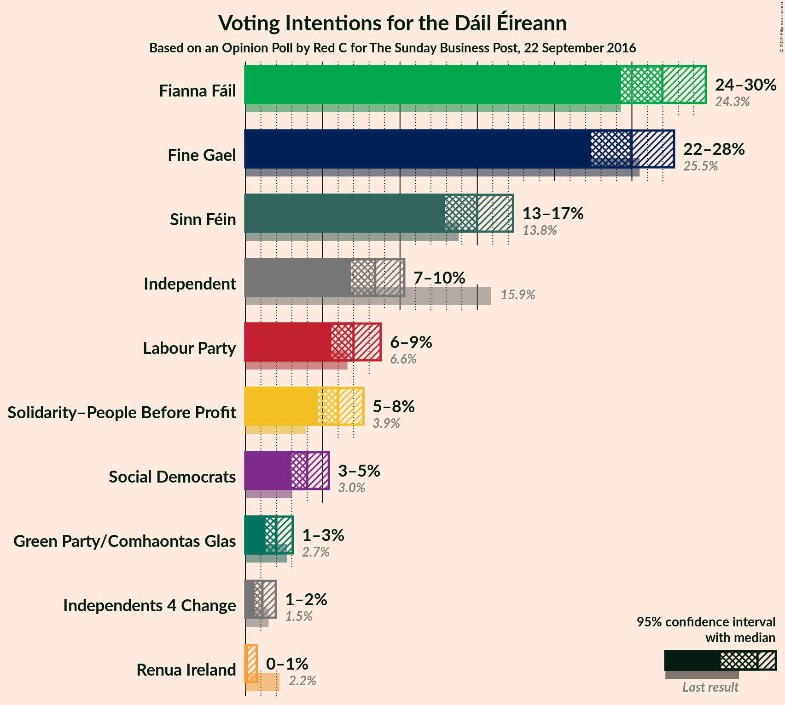
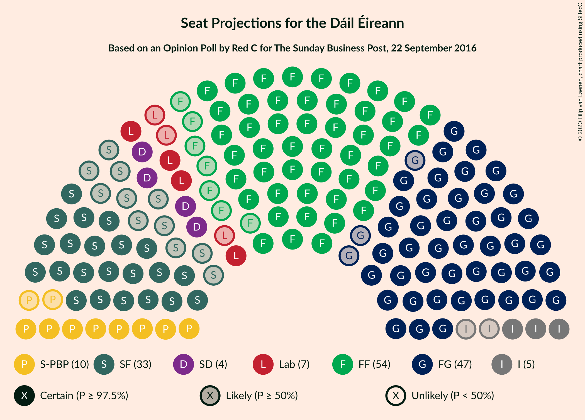
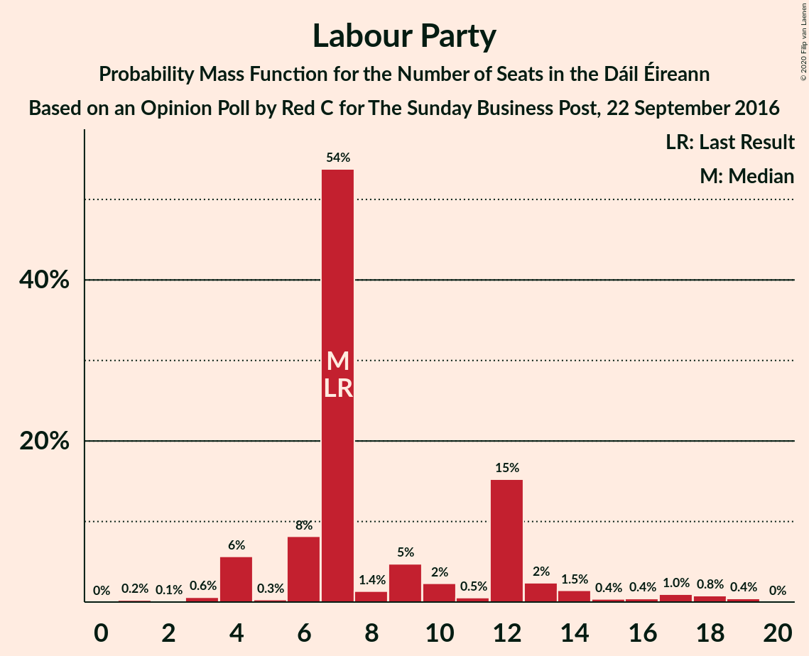
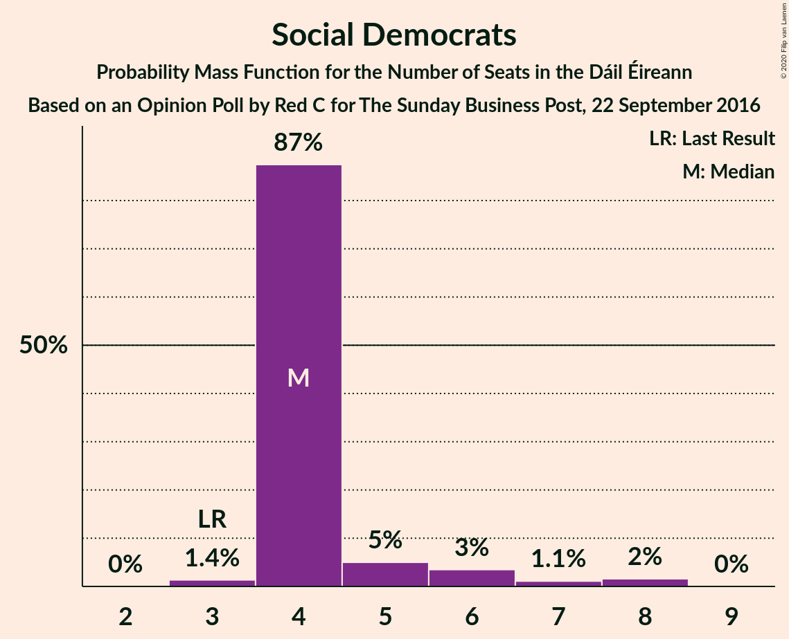
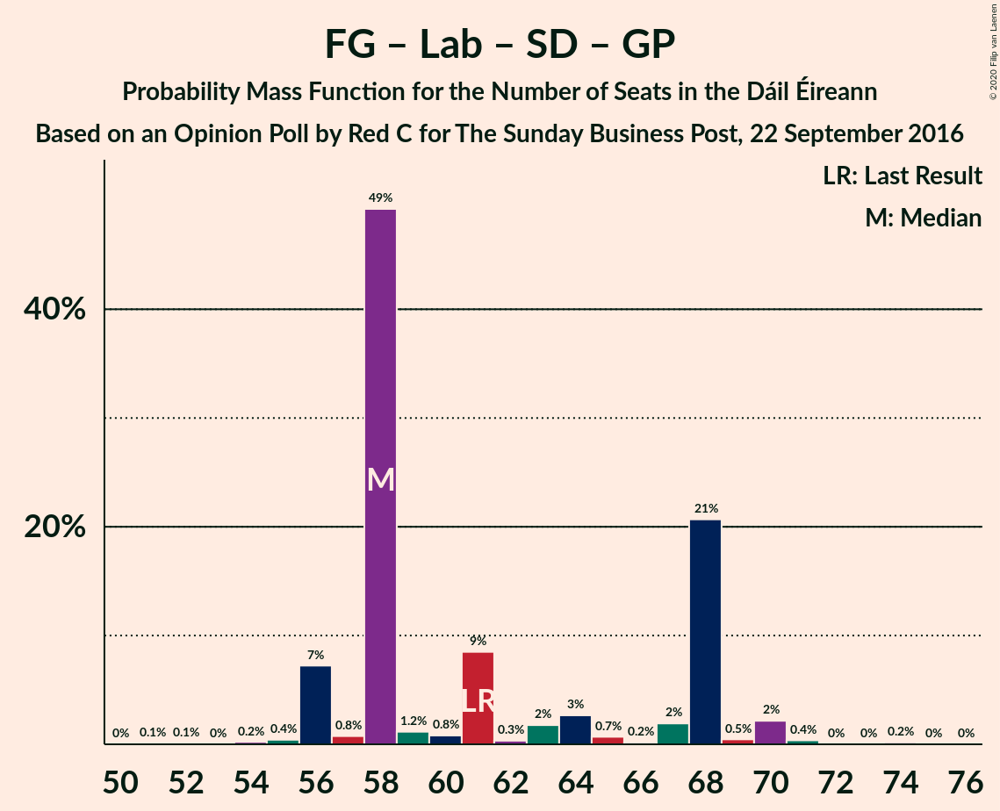
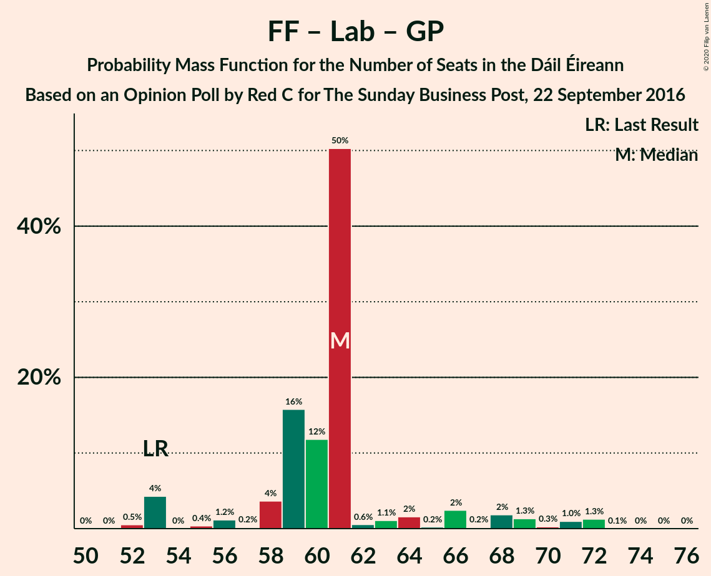
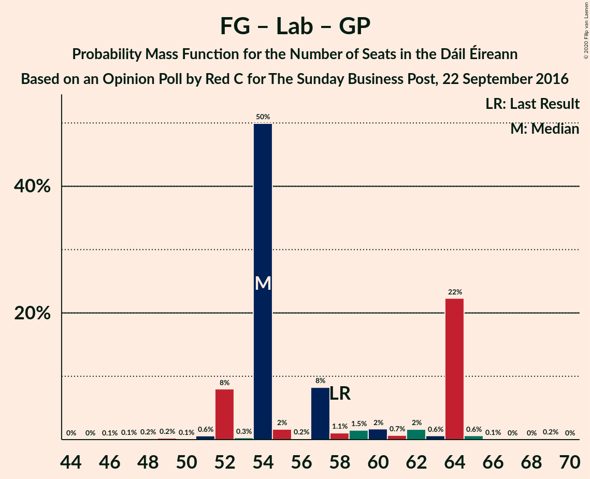
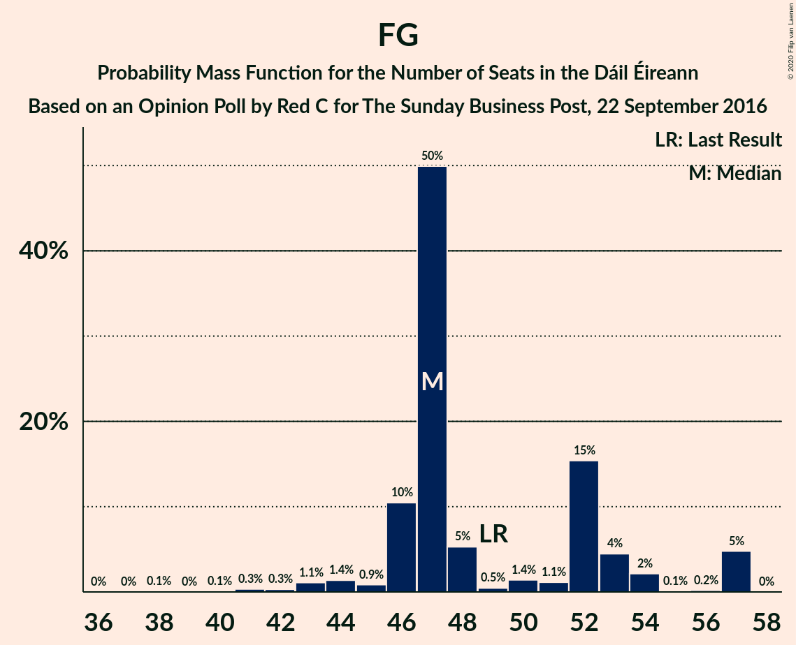

# Opinion Poll by Red C for The Sunday Business Post, 22 September 2016

<a href="#voting-intentions">Voting Intentions</a> | <a href="#seats">Seats</a> | <a href="#coalitions">Coalitions</a> | <a href="#technical-information">Technical Information</a>

## Voting Intentions

### Confidence Intervals

| Party | Last Result | Poll Result | 80% Confidence Interval | 90% Confidence Interval | 95% Confidence Interval | 99% Confidence Interval |
|:-----:|:-----------:|:-----------:|:-----------------------:|:-----------------------:|:-----------------------:|:-----------------------:|
| Fianna Fáil | 24.3% | 26.9% | 25.2–28.8% |24.7–29.3% |24.3–29.8% |23.5–30.7% |
| Fine Gael | 25.5% | 25.0% | 23.3–26.8% |22.8–27.3% |22.4–27.7% |21.6–28.6% |
| Sinn Féin | 13.8% | 15.0% | 13.6–16.5% |13.2–16.9% |12.9–17.3% |12.3–18.1% |
| Independent | 15.9% | 8.4% | 7.3–9.6% |7.1–10.0% |6.8–10.3% |6.4–10.9% |
| Labour Party | 6.6% | 7.0% | 6.1–8.1% |5.8–8.5% |5.6–8.7% |5.1–9.3% |
| Solidarity–People Before Profit | 3.9% | 6.0% | 5.1–7.1% |4.9–7.4% |4.7–7.6% |4.3–8.2% |
| Social Democrats | 3.0% | 4.0% | 3.3–4.9% |3.1–5.2% |2.9–5.4% |2.6–5.9% |
| Green Party/Comhaontas Glas | 2.7% | 2.0% | 1.5–2.7% |1.4–2.9% |1.3–3.1% |1.1–3.4% |
| Independents 4 Change | 1.5% | 1.1% | 0.8–1.7% |0.7–1.8% |0.6–2.0% |0.5–2.3% |
| Renua Ireland | 2.2% | 0.2% | 0.1–0.5% |0.1–0.6% |0.1–0.7% |0.0–0.9% |

*Note:* The poll result column reflects the actual value used in the calculations. Published results may vary slightly, and in addition be rounded to fewer digits.

## Seats

### Confidence Intervals

| Party | Last Result | Median | 80% Confidence Interval | 90% Confidence Interval | 95% Confidence Interval | 99% Confidence Interval |
|:-----:|:-----------:|:------:|:-----------------------:|:-----------------------:|:-----------------------:|:-----------------------:|
| <a href="#fianna-fáil">Fianna Fáil</a> | 44 | 54 | 47–54 |47–56 |47–57 |44–58 |
| <a href="#fine-gael">Fine Gael</a> | 49 | 47 | 46–53 |46–56 |44–57 |41–57 |
| <a href="#sinn-féin">Sinn Féin</a> | 23 | 33 | 25–34 |24–34 |22–34 |21–36 |
| <a href="#independent">Independent</a> | 19 | 5 | 3–5 |3–5 |3–5 |3–10 |
| <a href="#labour-party">Labour Party</a> | 7 | 7 | 6–12 |4–13 |4–16 |3–18 |
| <a href="#solidarity–people-before-profit">Solidarity–People Before Profit</a> | 6 | 10 | 9–10 |9–10 |8–10 |7–10 |
| <a href="#social-democrats">Social Democrats</a> | 3 | 4 | 4–5 |4–6 |4–7 |3–8 |
| <a href="#green-party/comhaontas-glas">Green Party/Comhaontas Glas</a> | 2 | 0 | 0 |0 |0–1 |0–2 |
| <a href="#independents-4-change">Independents 4 Change</a> | 4 | 0 | 0–4 |0–4 |0–4 |0–5 |
| <a href="#renua-ireland">Renua Ireland</a> | 0 | 0 | 0 |0 |0 |0 |

### Fianna Fáil

*For a full overview of the results for this party, see the [Fianna Fáil](party-fiannafáil.html) page.*

| Number of Seats | Probability | Accumulated | Special Marks |
|:---------------:|:-----------:|:-----------:|:-------------:|
| 39 | 0.2% | 100% |  |
| 40 | 0% | 99.8% |  |
| 41 | 0% | 99.8% |  |
| 42 | 0% | 99.8% |  |
| 43 | 0% | 99.8% |  |
| 44 | 0.9% | 99.8% | Last Result |
| 45 | 0% | 98.9% |  |
| 46 | 0.1% | 98.9% |  |
| 47 | 15% | 98.8% |  |
| 48 | 0.5% | 84% |  |
| 49 | 8% | 83% |  |
| 50 | 1.3% | 75% |  |
| 51 | 0.4% | 74% |  |
| 52 | 2% | 74% |  |
| 53 | 6% | 72% |  |
| 54 | 56% | 66% | Median |
| 55 | 4% | 10% |  |
| 56 | 2% | 6% |  |
| 57 | 3% | 3% |  |
| 58 | 0.5% | 0.7% |  |
| 59 | 0.1% | 0.1% |  |
| 60 | 0% | 0.1% |  |
| 61 | 0% | 0% |  |

### Fine Gael

*For a full overview of the results for this party, see the [Fine Gael](party-finegael.html) page.*

| Number of Seats | Probability | Accumulated | Special Marks |
|:---------------:|:-----------:|:-----------:|:-------------:|
| 38 | 0.1% | 100% |  |
| 39 | 0% | 99.9% |  |
| 40 | 0.1% | 99.9% |  |
| 41 | 0.3% | 99.8% |  |
| 42 | 0.3% | 99.4% |  |
| 43 | 1.1% | 99.1% |  |
| 44 | 1.4% | 98% |  |
| 45 | 0.9% | 97% |  |
| 46 | 10% | 96% |  |
| 47 | 50% | 85% | Median |
| 48 | 5% | 35% |  |
| 49 | 0.5% | 30% | Last Result |
| 50 | 1.4% | 30% |  |
| 51 | 1.1% | 28% |  |
| 52 | 15% | 27% |  |
| 53 | 4% | 12% |  |
| 54 | 2% | 7% |  |
| 55 | 0.1% | 5% |  |
| 56 | 0.2% | 5% |  |
| 57 | 5% | 5% |  |
| 58 | 0% | 0% |  |

### Sinn Féin

*For a full overview of the results for this party, see the [Sinn Féin](party-sinnféin.html) page.*

| Number of Seats | Probability | Accumulated | Special Marks |
|:---------------:|:-----------:|:-----------:|:-------------:|
| 20 | 0.1% | 100% |  |
| 21 | 2% | 99.9% |  |
| 22 | 2% | 98% |  |
| 23 | 1.3% | 97% | Last Result |
| 24 | 5% | 95% |  |
| 25 | 0.3% | 90% |  |
| 26 | 0.7% | 90% |  |
| 27 | 0.8% | 89% |  |
| 28 | 17% | 88% |  |
| 29 | 0.8% | 71% |  |
| 30 | 2% | 70% |  |
| 31 | 0.5% | 69% |  |
| 32 | 4% | 68% |  |
| 33 | 50% | 64% | Median |
| 34 | 13% | 13% |  |
| 35 | 0.2% | 0.8% |  |
| 36 | 0.6% | 0.6% |  |
| 37 | 0% | 0% |  |

### Independent

*For a full overview of the results for this party, see the [Independent](party-independent.html) page.*

| Number of Seats | Probability | Accumulated | Special Marks |
|:---------------:|:-----------:|:-----------:|:-------------:|
| 3 | 25% | 100% |  |
| 4 | 18% | 75% |  |
| 5 | 55% | 57% | Median |
| 6 | 0.8% | 2% |  |
| 7 | 0.1% | 1.4% |  |
| 8 | 0.4% | 1.3% |  |
| 9 | 0.2% | 0.9% |  |
| 10 | 0.3% | 0.6% |  |
| 11 | 0% | 0.4% |  |
| 12 | 0.3% | 0.3% |  |
| 13 | 0% | 0% |  |
| 14 | 0% | 0% |  |
| 15 | 0% | 0% |  |
| 16 | 0% | 0% |  |
| 17 | 0% | 0% |  |
| 18 | 0% | 0% |  |
| 19 | 0% | 0% | Last Result |

### Labour Party

*For a full overview of the results for this party, see the [Labour Party](party-labourparty.html) page.*

| Number of Seats | Probability | Accumulated | Special Marks |
|:---------------:|:-----------:|:-----------:|:-------------:|
| 1 | 0.2% | 100% |  |
| 2 | 0.1% | 99.8% |  |
| 3 | 0.6% | 99.6% |  |
| 4 | 6% | 99.1% |  |
| 5 | 0.3% | 93% |  |
| 6 | 8% | 93% |  |
| 7 | 54% | 85% | Last Result, Median |
| 8 | 1.4% | 31% |  |
| 9 | 5% | 30% |  |
| 10 | 2% | 25% |  |
| 11 | 0.5% | 23% |  |
| 12 | 15% | 22% |  |
| 13 | 2% | 7% |  |
| 14 | 1.5% | 5% |  |
| 15 | 0.4% | 3% |  |
| 16 | 0.4% | 3% |  |
| 17 | 1.0% | 2% |  |
| 18 | 0.8% | 1.3% |  |
| 19 | 0.4% | 0.5% |  |
| 20 | 0% | 0% |  |

### Solidarity–People Before Profit

*For a full overview of the results for this party, see the [Solidarity–People Before Profit](party-solidarity–peoplebeforeprofit.html) page.*

| Number of Seats | Probability | Accumulated | Special Marks |
|:---------------:|:-----------:|:-----------:|:-------------:|
| 5 | 0.4% | 100% |  |
| 6 | 0.1% | 99.6% | Last Result |
| 7 | 0.7% | 99.5% |  |
| 8 | 2% | 98.8% |  |
| 9 | 14% | 96% |  |
| 10 | 82% | 82% | Median |
| 11 | 0% | 0% |  |

### Social Democrats

*For a full overview of the results for this party, see the [Social Democrats](party-socialdemocrats.html) page.*

| Number of Seats | Probability | Accumulated | Special Marks |
|:---------------:|:-----------:|:-----------:|:-------------:|
| 3 | 1.4% | 100% | Last Result |
| 4 | 87% | 98.6% | Median |
| 5 | 5% | 11% |  |
| 6 | 3% | 6% |  |
| 7 | 1.1% | 3% |  |
| 8 | 2% | 2% |  |
| 9 | 0% | 0% |  |

### Green Party/Comhaontas Glas

*For a full overview of the results for this party, see the [Green Party/Comhaontas Glas](party-greenpartycomhaontasglas.html) page.*

| Number of Seats | Probability | Accumulated | Special Marks |
|:---------------:|:-----------:|:-----------:|:-------------:|
| 0 | 96% | 100% | Median |
| 1 | 3% | 4% |  |
| 2 | 0.8% | 0.8% | Last Result |
| 3 | 0% | 0% |  |

### Independents 4 Change

*For a full overview of the results for this party, see the [Independents 4 Change](party-independents4change.html) page.*

| Number of Seats | Probability | Accumulated | Special Marks |
|:---------------:|:-----------:|:-----------:|:-------------:|
| 0 | 56% | 100% | Median |
| 1 | 4% | 44% |  |
| 2 | 7% | 41% |  |
| 3 | 20% | 34% |  |
| 4 | 13% | 13% | Last Result |
| 5 | 0.6% | 0.6% |  |
| 6 | 0% | 0% |  |

### Renua Ireland

*For a full overview of the results for this party, see the [Renua Ireland](party-renuaireland.html) page.*

| Number of Seats | Probability | Accumulated | Special Marks |
|:---------------:|:-----------:|:-----------:|:-------------:|
| 0 | 100% | 100% | Last Result, Median |

## Coalitions

### Confidence Intervals

| Coalition | Last Result | Median | Majority? | 80% Confidence Interval | 90% Confidence Interval | 95% Confidence Interval | 99% Confidence Interval |
|:---------:|:-----------:|:------:|:---------:|:-----------------------:|:-----------------------:|:-----------------------:|:-----------------------:|
| Fianna Fáil – Fine Gael | 93 | 101 | 100% | 99–103 | 97–110 | 96–110 | 91–110 |
| Fianna Fáil – Sinn Féin | 67 | 87 | 72% | 75–87 | 75–88 | 75–88 | 75–89 |
| Fianna Fáil – Labour Party – Social Democrats – Green Party/Comhaontas Glas | 56 | 65 | 0% | 62–69 | 60–73 | 57–75 | 57–78 |
| Fine Gael – Labour Party – Social Democrats – Green Party/Comhaontas Glas | 61 | 58 | 0% | 58–68 | 56–68 | 56–70 | 55–71 |
| Fianna Fáil – Labour Party – Green Party/Comhaontas Glas | 53 | 61 | 0% | 58–64 | 55–68 | 53–70 | 52–72 |
| Fianna Fáil – Labour Party | 51 | 61 | 0% | 58–63 | 55–68 | 53–70 | 52–71 |
| Fine Gael – Labour Party – Green Party/Comhaontas Glas | 58 | 54 | 0% | 54–64 | 52–64 | 52–64 | 49–65 |
| Fine Gael – Labour Party | 56 | 54 | 0% | 54–64 | 52–64 | 52–64 | 49–64 |
| Fianna Fáil – Green Party/Comhaontas Glas | 46 | 54 | 0% | 47–55 | 47–56 | 47–57 | 44–58 |
| Fine Gael | 49 | 47 | 0% | 46–53 | 46–56 | 44–57 | 41–57 |
| Fine Gael – Green Party/Comhaontas Glas | 51 | 47 | 0% | 46–53 | 46–56 | 44–57 | 41–57 |

### Fianna Fáil – Fine Gael

| Number of Seats | Probability | Accumulated | Special Marks |
|:---------------:|:-----------:|:-----------:|:-------------:|
| 88 | 0.1% | 100% |  |
| 89 | 0.1% | 99.9% |  |
| 90 | 0.1% | 99.8% |  |
| 91 | 1.0% | 99.8% |  |
| 92 | 0% | 98.7% |  |
| 93 | 0.2% | 98.7% | Last Result |
| 94 | 0.4% | 98.5% |  |
| 95 | 0.3% | 98% |  |
| 96 | 0.8% | 98% |  |
| 97 | 4% | 97% |  |
| 98 | 1.3% | 93% |  |
| 99 | 16% | 92% |  |
| 100 | 7% | 76% |  |
| 101 | 53% | 68% | Median |
| 102 | 6% | 16% |  |
| 103 | 0.4% | 10% |  |
| 104 | 0.2% | 10% |  |
| 105 | 1.0% | 9% |  |
| 106 | 0.1% | 8% |  |
| 107 | 0.1% | 8% |  |
| 108 | 1.4% | 8% |  |
| 109 | 0.1% | 7% |  |
| 110 | 6% | 7% |  |
| 111 | 0% | 0.2% |  |
| 112 | 0.2% | 0.2% |  |
| 113 | 0% | 0% |  |

### Fianna Fáil – Sinn Féin

| Number of Seats | Probability | Accumulated | Special Marks |
|:---------------:|:-----------:|:-----------:|:-------------:|
| 67 | 0% | 100% | Last Result |
| 68 | 0% | 100% |  |
| 69 | 0% | 100% |  |
| 70 | 0% | 100% |  |
| 71 | 0.2% | 100% |  |
| 72 | 0.1% | 99.8% |  |
| 73 | 0% | 99.7% |  |
| 74 | 0% | 99.7% |  |
| 75 | 15% | 99.7% |  |
| 76 | 0.8% | 84% |  |
| 77 | 7% | 84% |  |
| 78 | 0.3% | 76% |  |
| 79 | 2% | 76% |  |
| 80 | 0.9% | 73% |  |
| 81 | 4% | 72% | Majority |
| 82 | 0.9% | 68% |  |
| 83 | 7% | 67% |  |
| 84 | 0.6% | 61% |  |
| 85 | 1.2% | 60% |  |
| 86 | 2% | 59% |  |
| 87 | 49% | 57% | Median |
| 88 | 7% | 8% |  |
| 89 | 0.3% | 0.8% |  |
| 90 | 0.2% | 0.4% |  |
| 91 | 0.1% | 0.2% |  |
| 92 | 0% | 0.2% |  |
| 93 | 0.1% | 0.1% |  |
| 94 | 0.1% | 0.1% |  |
| 95 | 0% | 0% |  |

### Fianna Fáil – Labour Party – Social Democrats – Green Party/Comhaontas Glas

| Number of Seats | Probability | Accumulated | Special Marks |
|:---------------:|:-----------:|:-----------:|:-------------:|
| 56 | 0% | 100% | Last Result |
| 57 | 4% | 100% |  |
| 58 | 0% | 96% |  |
| 59 | 0.4% | 95% |  |
| 60 | 0.3% | 95% |  |
| 61 | 0.9% | 95% |  |
| 62 | 4% | 94% |  |
| 63 | 16% | 90% |  |
| 64 | 12% | 74% |  |
| 65 | 50% | 63% | Median |
| 66 | 0.4% | 12% |  |
| 67 | 2% | 12% |  |
| 68 | 0.2% | 10% |  |
| 69 | 1.1% | 10% |  |
| 70 | 0.4% | 9% |  |
| 71 | 0.4% | 9% |  |
| 72 | 3% | 8% |  |
| 73 | 3% | 6% |  |
| 74 | 0.1% | 3% |  |
| 75 | 0.7% | 3% |  |
| 76 | 0.9% | 2% |  |
| 77 | 0.9% | 2% |  |
| 78 | 0.5% | 0.7% |  |
| 79 | 0.1% | 0.1% |  |
| 80 | 0% | 0% |  |

### Fine Gael – Labour Party – Social Democrats – Green Party/Comhaontas Glas

| Number of Seats | Probability | Accumulated | Special Marks |
|:---------------:|:-----------:|:-----------:|:-------------:|
| 51 | 0.1% | 100% |  |
| 52 | 0.1% | 99.9% |  |
| 53 | 0% | 99.8% |  |
| 54 | 0.2% | 99.8% |  |
| 55 | 0.4% | 99.6% |  |
| 56 | 7% | 99.1% |  |
| 57 | 0.8% | 92% |  |
| 58 | 49% | 91% | Median |
| 59 | 1.2% | 42% |  |
| 60 | 0.8% | 41% |  |
| 61 | 9% | 40% | Last Result |
| 62 | 0.3% | 31% |  |
| 63 | 2% | 31% |  |
| 64 | 3% | 29% |  |
| 65 | 0.7% | 27% |  |
| 66 | 0.2% | 26% |  |
| 67 | 2% | 26% |  |
| 68 | 21% | 24% |  |
| 69 | 0.5% | 3% |  |
| 70 | 2% | 3% |  |
| 71 | 0.4% | 0.6% |  |
| 72 | 0% | 0.2% |  |
| 73 | 0% | 0.2% |  |
| 74 | 0.2% | 0.2% |  |
| 75 | 0% | 0% |  |

### Fianna Fáil – Labour Party – Green Party/Comhaontas Glas

| Number of Seats | Probability | Accumulated | Special Marks |
|:---------------:|:-----------:|:-----------:|:-------------:|
| 52 | 0.5% | 100% |  |
| 53 | 4% | 99.4% | Last Result |
| 54 | 0% | 95% |  |
| 55 | 0.4% | 95% |  |
| 56 | 1.2% | 95% |  |
| 57 | 0.2% | 94% |  |
| 58 | 4% | 93% |  |
| 59 | 16% | 90% |  |
| 60 | 12% | 74% |  |
| 61 | 50% | 62% | Median |
| 62 | 0.6% | 12% |  |
| 63 | 1.1% | 11% |  |
| 64 | 2% | 10% |  |
| 65 | 0.2% | 9% |  |
| 66 | 2% | 8% |  |
| 67 | 0.2% | 6% |  |
| 68 | 2% | 6% |  |
| 69 | 1.3% | 4% |  |
| 70 | 0.3% | 3% |  |
| 71 | 1.0% | 2% |  |
| 72 | 1.3% | 1.4% |  |
| 73 | 0.1% | 0.1% |  |
| 74 | 0% | 0.1% |  |
| 75 | 0% | 0.1% |  |
| 76 | 0% | 0% |  |

### Fianna Fáil – Labour Party

| Number of Seats | Probability | Accumulated | Special Marks |
|:---------------:|:-----------:|:-----------:|:-------------:|
| 51 | 0% | 100% | Last Result |
| 52 | 0.5% | 100% |  |
| 53 | 4% | 99.4% |  |
| 54 | 0.1% | 95% |  |
| 55 | 0.4% | 95% |  |
| 56 | 1.2% | 95% |  |
| 57 | 0.4% | 94% |  |
| 58 | 3% | 93% |  |
| 59 | 16% | 90% |  |
| 60 | 12% | 74% |  |
| 61 | 51% | 62% | Median |
| 62 | 0.5% | 11% |  |
| 63 | 1.0% | 11% |  |
| 64 | 1.5% | 10% |  |
| 65 | 0.1% | 8% |  |
| 66 | 2% | 8% |  |
| 67 | 0.2% | 6% |  |
| 68 | 3% | 6% |  |
| 69 | 0.1% | 3% |  |
| 70 | 0.2% | 3% |  |
| 71 | 2% | 2% |  |
| 72 | 0.2% | 0.4% |  |
| 73 | 0.1% | 0.1% |  |
| 74 | 0% | 0.1% |  |
| 75 | 0.1% | 0.1% |  |
| 76 | 0% | 0% |  |

### Fine Gael – Labour Party – Green Party/Comhaontas Glas

| Number of Seats | Probability | Accumulated | Special Marks |
|:---------------:|:-----------:|:-----------:|:-------------:|
| 46 | 0.1% | 100% |  |
| 47 | 0.1% | 99.9% |  |
| 48 | 0.2% | 99.8% |  |
| 49 | 0.2% | 99.7% |  |
| 50 | 0.1% | 99.4% |  |
| 51 | 0.6% | 99.3% |  |
| 52 | 8% | 98.7% |  |
| 53 | 0.3% | 91% |  |
| 54 | 50% | 90% | Median |
| 55 | 2% | 41% |  |
| 56 | 0.2% | 39% |  |
| 57 | 8% | 39% |  |
| 58 | 1.1% | 30% | Last Result |
| 59 | 1.5% | 29% |  |
| 60 | 2% | 28% |  |
| 61 | 0.7% | 26% |  |
| 62 | 2% | 26% |  |
| 63 | 0.6% | 24% |  |
| 64 | 22% | 23% |  |
| 65 | 0.6% | 1.0% |  |
| 66 | 0.1% | 0.3% |  |
| 67 | 0% | 0.2% |  |
| 68 | 0% | 0.2% |  |
| 69 | 0.2% | 0.2% |  |
| 70 | 0% | 0% |  |

### Fine Gael – Labour Party

| Number of Seats | Probability | Accumulated | Special Marks |
|:---------------:|:-----------:|:-----------:|:-------------:|
| 46 | 0.1% | 100% |  |
| 47 | 0.1% | 99.9% |  |
| 48 | 0.2% | 99.8% |  |
| 49 | 0.2% | 99.6% |  |
| 50 | 0.3% | 99.4% |  |
| 51 | 0.9% | 99.1% |  |
| 52 | 8% | 98% |  |
| 53 | 0.3% | 91% |  |
| 54 | 50% | 90% | Median |
| 55 | 2% | 40% |  |
| 56 | 0.2% | 39% | Last Result |
| 57 | 8% | 39% |  |
| 58 | 1.1% | 30% |  |
| 59 | 2% | 29% |  |
| 60 | 1.0% | 27% |  |
| 61 | 0.9% | 26% |  |
| 62 | 1.0% | 25% |  |
| 63 | 0.7% | 24% |  |
| 64 | 23% | 23% |  |
| 65 | 0.2% | 0.5% |  |
| 66 | 0.1% | 0.3% |  |
| 67 | 0% | 0.2% |  |
| 68 | 0% | 0.2% |  |
| 69 | 0.2% | 0.2% |  |
| 70 | 0% | 0% |  |

### Fianna Fáil – Green Party/Comhaontas Glas

| Number of Seats | Probability | Accumulated | Special Marks |
|:---------------:|:-----------:|:-----------:|:-------------:|
| 39 | 0.2% | 100% |  |
| 40 | 0% | 99.8% |  |
| 41 | 0% | 99.8% |  |
| 42 | 0% | 99.8% |  |
| 43 | 0% | 99.8% |  |
| 44 | 0.8% | 99.8% |  |
| 45 | 0.1% | 99.0% |  |
| 46 | 0.1% | 98.9% | Last Result |
| 47 | 15% | 98.8% |  |
| 48 | 0.5% | 84% |  |
| 49 | 8% | 83% |  |
| 50 | 1.1% | 75% |  |
| 51 | 0.3% | 74% |  |
| 52 | 1.4% | 74% |  |
| 53 | 6% | 73% |  |
| 54 | 57% | 67% | Median |
| 55 | 3% | 10% |  |
| 56 | 3% | 7% |  |
| 57 | 2% | 4% |  |
| 58 | 1.1% | 1.3% |  |
| 59 | 0.1% | 0.3% |  |
| 60 | 0.1% | 0.1% |  |
| 61 | 0% | 0% |  |

### Fine Gael

| Number of Seats | Probability | Accumulated | Special Marks |
|:---------------:|:-----------:|:-----------:|:-------------:|
| 38 | 0.1% | 100% |  |
| 39 | 0% | 99.9% |  |
| 40 | 0.1% | 99.9% |  |
| 41 | 0.3% | 99.8% |  |
| 42 | 0.3% | 99.4% |  |
| 43 | 1.1% | 99.1% |  |
| 44 | 1.4% | 98% |  |
| 45 | 0.9% | 97% |  |
| 46 | 10% | 96% |  |
| 47 | 50% | 85% | Median |
| 48 | 5% | 35% |  |
| 49 | 0.5% | 30% | Last Result |
| 50 | 1.4% | 30% |  |
| 51 | 1.1% | 28% |  |
| 52 | 15% | 27% |  |
| 53 | 4% | 12% |  |
| 54 | 2% | 7% |  |
| 55 | 0.1% | 5% |  |
| 56 | 0.2% | 5% |  |
| 57 | 5% | 5% |  |
| 58 | 0% | 0% |  |

### Fine Gael – Green Party/Comhaontas Glas

| Number of Seats | Probability | Accumulated | Special Marks |
|:---------------:|:-----------:|:-----------:|:-------------:|
| 38 | 0.1% | 100% |  |
| 39 | 0.1% | 99.9% |  |
| 40 | 0.1% | 99.9% |  |
| 41 | 0.3% | 99.8% |  |
| 42 | 0.3% | 99.4% |  |
| 43 | 0.5% | 99.2% |  |
| 44 | 2% | 98.7% |  |
| 45 | 0.5% | 97% |  |
| 46 | 10% | 96% |  |
| 47 | 51% | 87% | Median |
| 48 | 5% | 36% |  |
| 49 | 1.0% | 31% |  |
| 50 | 2% | 30% |  |
| 51 | 1.2% | 28% | Last Result |
| 52 | 15% | 27% |  |
| 53 | 4% | 12% |  |
| 54 | 2% | 7% |  |
| 55 | 0.2% | 5% |  |
| 56 | 0.2% | 5% |  |
| 57 | 5% | 5% |  |
| 58 | 0% | 0% |  |

## Technical Information

### Opinion Poll

+ **Polling firm:** Red C
+ **Commissioner(s):** The Sunday Business Post
+ **Fieldwork period:** 22 September 2016

### Calculations

+ **Sample size:** 1002
+ **Simulations done:** 131,072
+ **Error estimate:** 1.27%

