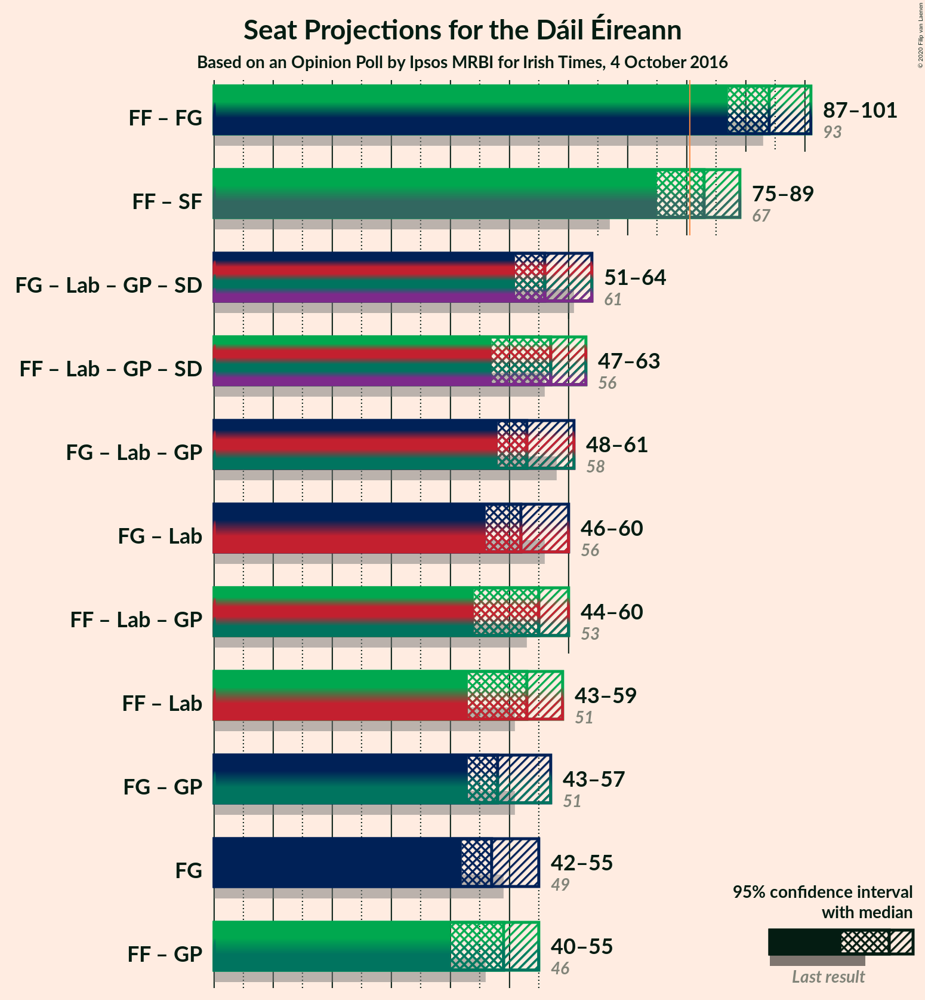
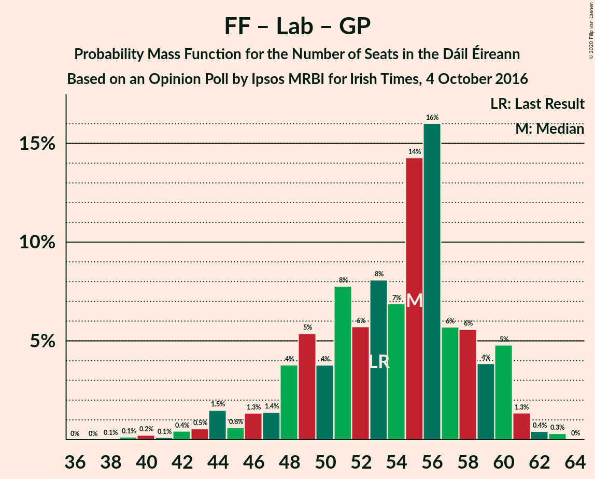

# Opinion Poll by Ipsos MRBI for Irish Times, 4 October 2016

<a href="#voting-intentions">Voting Intentions</a> | <a href="#seats">Seats</a> | <a href="#coalitions">Coalitions</a> | <a href="#technical-information">Technical Information</a>

## Voting Intentions

### Confidence Intervals

| Party | Last Result | Poll Result | 80% Confidence Interval | 90% Confidence Interval | 95% Confidence Interval | 99% Confidence Interval |
|:-----:|:-----------:|:-----------:|:-----------------------:|:-----------------------:|:-----------------------:|:-----------------------:|
| Fine Gael | 25.5% | 26.2% | 24.7–27.9% |24.2–28.4% |23.8–28.8% |23.1–29.6% |
| Fianna Fáil | 24.3% | 26.2% | 24.7–27.9% |24.2–28.4% |23.8–28.8% |23.1–29.6% |
| Sinn Féin | 13.8% | 19.2% | 17.8–20.7% |17.4–21.1% |17.0–21.5% |16.4–22.2% |
| Independent | 15.9% | 12.8% | 11.7–14.2% |11.3–14.5% |11.1–14.9% |10.5–15.5% |
| Labour Party | 6.6% | 5.1% | 4.3–6.0% |4.1–6.2% |4.0–6.5% |3.6–7.0% |
| Solidarity–People Before Profit | 3.9% | 3.0% | 2.5–3.7% |2.3–3.9% |2.2–4.1% |1.9–4.5% |
| Green Party/Comhaontas Glas | 2.7% | 3.0% | 2.5–3.7% |2.3–3.9% |2.2–4.1% |1.9–4.5% |
| Social Democrats | 3.0% | 2.0% | 1.6–2.6% |1.4–2.8% |1.3–3.0% |1.2–3.3% |
| Independents 4 Change | 1.5% | 1.6% | 1.2–2.2% |1.1–2.3% |1.0–2.5% |0.9–2.8% |

*Note:* The poll result column reflects the actual value used in the calculations. Published results may vary slightly, and in addition be rounded to fewer digits.

## Seats

### Confidence Intervals

| Party | Last Result | Median | 80% Confidence Interval | 90% Confidence Interval | 95% Confidence Interval | 99% Confidence Interval |
|:-----:|:-----------:|:------:|:-----------------------:|:-----------------------:|:-----------------------:|:-----------------------:|
| <a href="#fine-gael">Fine Gael</a> | 49 | 49 | 44–55 |43–55 |43–57 |40–58 |
| <a href="#fianna-fáil">Fianna Fáil</a> | 44 | 50 | 43–52 |43–54 |43–55 |41–56 |
| <a href="#sinn-féin">Sinn Féin</a> | 23 | 35 | 33–39 |33–39 |33–39 |31–40 |
| <a href="#independent">Independent</a> | 19 | 15 | 11–16 |9–16 |7–16 |7–16 |
| <a href="#labour-party">Labour Party</a> | 7 | 3 | 1–4 |1–6 |0–7 |0–7 |
| <a href="#solidarity–people-before-profit">Solidarity–People Before Profit</a> | 6 | 3 | 2–5 |1–5 |1–5 |1–6 |
| <a href="#green-party/comhaontas-glas">Green Party/Comhaontas Glas</a> | 2 | 1 | 1–2 |0–2 |0–2 |0–3 |
| <a href="#social-democrats">Social Democrats</a> | 3 | 3 | 3 |3 |2–3 |2–3 |
| <a href="#independents-4-change">Independents 4 Change</a> | 4 | 4 | 1–5 |1–5 |1–5 |0–5 |

### Fine Gael

*For a full overview of the results for this party, see the [Fine Gael](party-finegael.html) page.*

| Number of Seats | Probability | Accumulated | Special Marks |
|:---------------:|:-----------:|:-----------:|:-------------:|
| 38 | 0% | 100% |  |
| 39 | 0.3% | 99.9% |  |
| 40 | 0.2% | 99.6% |  |
| 41 | 0.4% | 99.4% |  |
| 42 | 0.5% | 99.0% |  |
| 43 | 4% | 98.5% |  |
| 44 | 13% | 95% |  |
| 45 | 10% | 81% |  |
| 46 | 5% | 71% |  |
| 47 | 5% | 66% |  |
| 48 | 5% | 61% |  |
| 49 | 28% | 55% | Last Result, Median |
| 50 | 3% | 28% |  |
| 51 | 3% | 25% |  |
| 52 | 2% | 22% |  |
| 53 | 3% | 20% |  |
| 54 | 0.5% | 18% |  |
| 55 | 14% | 17% |  |
| 56 | 0.5% | 3% |  |
| 57 | 1.4% | 3% |  |
| 58 | 0.9% | 1.4% |  |
| 59 | 0.3% | 0.5% |  |
| 60 | 0.1% | 0.1% |  |
| 61 | 0% | 0.1% |  |
| 62 | 0% | 0.1% |  |
| 63 | 0% | 0.1% |  |
| 64 | 0% | 0% |  |

### Fianna Fáil

*For a full overview of the results for this party, see the [Fianna Fáil](party-fiannafáil.html) page.*

| Number of Seats | Probability | Accumulated | Special Marks |
|:---------------:|:-----------:|:-----------:|:-------------:|
| 37 | 0% | 100% |  |
| 38 | 0.2% | 99.9% |  |
| 39 | 0.1% | 99.8% |  |
| 40 | 0.1% | 99.7% |  |
| 41 | 0.5% | 99.6% |  |
| 42 | 0.6% | 99.2% |  |
| 43 | 14% | 98.6% |  |
| 44 | 2% | 84% | Last Result |
| 45 | 3% | 83% |  |
| 46 | 9% | 80% |  |
| 47 | 6% | 71% |  |
| 48 | 4% | 66% |  |
| 49 | 7% | 62% |  |
| 50 | 38% | 55% | Median |
| 51 | 5% | 16% |  |
| 52 | 3% | 11% |  |
| 53 | 3% | 9% |  |
| 54 | 4% | 6% |  |
| 55 | 2% | 3% |  |
| 56 | 0.5% | 0.8% |  |
| 57 | 0% | 0.4% |  |
| 58 | 0.3% | 0.3% |  |
| 59 | 0% | 0% |  |

### Sinn Féin

*For a full overview of the results for this party, see the [Sinn Féin](party-sinnféin.html) page.*

| Number of Seats | Probability | Accumulated | Special Marks |
|:---------------:|:-----------:|:-----------:|:-------------:|
| 23 | 0% | 100% | Last Result |
| 24 | 0% | 100% |  |
| 25 | 0% | 100% |  |
| 26 | 0% | 100% |  |
| 27 | 0% | 100% |  |
| 28 | 0% | 100% |  |
| 29 | 0% | 99.9% |  |
| 30 | 0% | 99.9% |  |
| 31 | 0.4% | 99.9% |  |
| 32 | 0.5% | 99.5% |  |
| 33 | 13% | 98.9% |  |
| 34 | 32% | 85% |  |
| 35 | 7% | 54% | Median |
| 36 | 9% | 47% |  |
| 37 | 7% | 38% |  |
| 38 | 4% | 31% |  |
| 39 | 27% | 28% |  |
| 40 | 0.9% | 1.2% |  |
| 41 | 0.1% | 0.3% |  |
| 42 | 0.1% | 0.2% |  |
| 43 | 0% | 0% |  |

### Independent

*For a full overview of the results for this party, see the [Independent](party-independent.html) page.*

| Number of Seats | Probability | Accumulated | Special Marks |
|:---------------:|:-----------:|:-----------:|:-------------:|
| 5 | 0.1% | 100% |  |
| 6 | 0.3% | 99.9% |  |
| 7 | 2% | 99.6% |  |
| 8 | 1.2% | 97% |  |
| 9 | 2% | 96% |  |
| 10 | 0.9% | 94% |  |
| 11 | 28% | 93% |  |
| 12 | 3% | 66% |  |
| 13 | 3% | 63% |  |
| 14 | 3% | 60% |  |
| 15 | 21% | 56% | Median |
| 16 | 35% | 35% |  |
| 17 | 0.1% | 0.1% |  |
| 18 | 0% | 0% |  |
| 19 | 0% | 0% | Last Result |

### Labour Party

*For a full overview of the results for this party, see the [Labour Party](party-labourparty.html) page.*

| Number of Seats | Probability | Accumulated | Special Marks |
|:---------------:|:-----------:|:-----------:|:-------------:|
| 0 | 4% | 100% |  |
| 1 | 10% | 96% |  |
| 2 | 22% | 86% |  |
| 3 | 52% | 64% | Median |
| 4 | 3% | 12% |  |
| 5 | 2% | 9% |  |
| 6 | 4% | 7% |  |
| 7 | 3% | 4% | Last Result |
| 8 | 0.1% | 0.1% |  |
| 9 | 0% | 0.1% |  |
| 10 | 0% | 0% |  |

### Solidarity–People Before Profit

*For a full overview of the results for this party, see the [Solidarity–People Before Profit](party-solidarity–peoplebeforeprofit.html) page.*

| Number of Seats | Probability | Accumulated | Special Marks |
|:---------------:|:-----------:|:-----------:|:-------------:|
| 0 | 0.2% | 100% |  |
| 1 | 7% | 99.8% |  |
| 2 | 17% | 93% |  |
| 3 | 40% | 75% | Median |
| 4 | 17% | 35% |  |
| 5 | 17% | 19% |  |
| 6 | 1.4% | 2% | Last Result |
| 7 | 0.1% | 0.2% |  |
| 8 | 0.1% | 0.1% |  |
| 9 | 0% | 0% |  |

### Green Party/Comhaontas Glas

*For a full overview of the results for this party, see the [Green Party/Comhaontas Glas](party-greenpartycomhaontasglas.html) page.*

| Number of Seats | Probability | Accumulated | Special Marks |
|:---------------:|:-----------:|:-----------:|:-------------:|
| 0 | 8% | 100% |  |
| 1 | 64% | 92% | Median |
| 2 | 28% | 29% | Last Result |
| 3 | 0.9% | 0.9% |  |
| 4 | 0% | 0% |  |

### Social Democrats

*For a full overview of the results for this party, see the [Social Democrats](party-socialdemocrats.html) page.*

| Number of Seats | Probability | Accumulated | Special Marks |
|:---------------:|:-----------:|:-----------:|:-------------:|
| 0 | 0.2% | 100% |  |
| 1 | 0.1% | 99.8% |  |
| 2 | 3% | 99.6% |  |
| 3 | 96% | 96% | Last Result, Median |
| 4 | 0.4% | 0.4% |  |
| 5 | 0% | 0% |  |

### Independents 4 Change

*For a full overview of the results for this party, see the [Independents 4 Change](party-independents4change.html) page.*

| Number of Seats | Probability | Accumulated | Special Marks |
|:---------------:|:-----------:|:-----------:|:-------------:|
| 0 | 0.6% | 100% |  |
| 1 | 30% | 99.4% |  |
| 2 | 2% | 70% |  |
| 3 | 6% | 67% |  |
| 4 | 38% | 61% | Last Result, Median |
| 5 | 24% | 24% |  |
| 6 | 0% | 0% |  |

## Coalitions

### Confidence Intervals

| Coalition | Last Result | Median | Majority? | 80% Confidence Interval | 90% Confidence Interval | 95% Confidence Interval | 99% Confidence Interval |
|:---------:|:-----------:|:------:|:---------:|:-----------------------:|:-----------------------:|:-----------------------:|:-----------------------:|
| Fianna Fáil – Fine Gael | 93 | 98 | 100% | 93–100 | 91–102 | 91–104 | 89–106 |
| Fianna Fáil – Sinn Féin | 67 | 84 | 78% | 77–89 | 77–89 | 77–91 | 75–93 |
| Fine Gael – Labour Party – Green Party/Comhaontas Glas – Social Democrats | 61 | 56 | 0% | 50–62 | 50–62 | 49–63 | 47–64 |
| Fianna Fáil – Labour Party – Green Party/Comhaontas Glas – Social Democrats | 56 | 57 | 0% | 50–60 | 50–61 | 50–62 | 46–64 |
| Fine Gael – Labour Party – Green Party/Comhaontas Glas | 58 | 53 | 0% | 47–59 | 47–59 | 46–60 | 44–61 |
| Fianna Fáil – Labour Party – Green Party/Comhaontas Glas | 53 | 54 | 0% | 47–57 | 47–58 | 47–59 | 43–61 |
| Fine Gael – Green Party/Comhaontas Glas | 51 | 50 | 0% | 45–56 | 45–56 | 44–59 | 41–59 |
| Fine Gael – Labour Party | 56 | 52 | 0% | 46–58 | 46–58 | 45–58 | 43–60 |
| Fianna Fáil – Labour Party | 51 | 52 | 0% | 46–55 | 46–57 | 46–57 | 42–60 |
| Fine Gael | 49 | 49 | 0% | 44–55 | 43–55 | 43–57 | 40–58 |
| Fianna Fáil – Green Party/Comhaontas Glas | 46 | 51 | 0% | 44–53 | 44–55 | 44–56 | 42–57 |

### Fianna Fáil – Fine Gael

| Number of Seats | Probability | Accumulated | Special Marks |
|:---------------:|:-----------:|:-----------:|:-------------:|
| 86 | 0% | 100% |  |
| 87 | 0.2% | 99.9% |  |
| 88 | 0.1% | 99.7% |  |
| 89 | 0.8% | 99.7% |  |
| 90 | 0.2% | 98.9% |  |
| 91 | 5% | 98.7% |  |
| 92 | 3% | 94% |  |
| 93 | 3% | 91% | Last Result |
| 94 | 14% | 88% |  |
| 95 | 5% | 73% |  |
| 96 | 5% | 69% |  |
| 97 | 6% | 64% |  |
| 98 | 18% | 57% |  |
| 99 | 29% | 39% | Median |
| 100 | 1.3% | 11% |  |
| 101 | 4% | 9% |  |
| 102 | 1.3% | 6% |  |
| 103 | 0.2% | 4% |  |
| 104 | 2% | 4% |  |
| 105 | 2% | 2% |  |
| 106 | 0.6% | 0.7% |  |
| 107 | 0% | 0.1% |  |
| 108 | 0.1% | 0.1% |  |
| 109 | 0% | 0% |  |

### Fianna Fáil – Sinn Féin

| Number of Seats | Probability | Accumulated | Special Marks |
|:---------------:|:-----------:|:-----------:|:-------------:|
| 67 | 0% | 100% | Last Result |
| 68 | 0% | 100% |  |
| 69 | 0% | 100% |  |
| 70 | 0% | 100% |  |
| 71 | 0% | 100% |  |
| 72 | 0% | 99.9% |  |
| 73 | 0.1% | 99.9% |  |
| 74 | 0.1% | 99.8% |  |
| 75 | 0.2% | 99.7% |  |
| 76 | 0.1% | 99.5% |  |
| 77 | 14% | 99.4% |  |
| 78 | 0.8% | 85% |  |
| 79 | 4% | 84% |  |
| 80 | 3% | 81% |  |
| 81 | 3% | 78% | Majority |
| 82 | 10% | 75% |  |
| 83 | 8% | 65% |  |
| 84 | 9% | 57% |  |
| 85 | 6% | 48% | Median |
| 86 | 2% | 41% |  |
| 87 | 5% | 39% |  |
| 88 | 2% | 34% |  |
| 89 | 29% | 32% |  |
| 90 | 0.4% | 3% |  |
| 91 | 0.5% | 3% |  |
| 92 | 0.1% | 2% |  |
| 93 | 2% | 2% |  |
| 94 | 0% | 0.4% |  |
| 95 | 0% | 0.3% |  |
| 96 | 0% | 0.3% |  |
| 97 | 0.3% | 0.3% |  |
| 98 | 0% | 0% |  |

### Fine Gael – Labour Party – Green Party/Comhaontas Glas – Social Democrats

| Number of Seats | Probability | Accumulated | Special Marks |
|:---------------:|:-----------:|:-----------:|:-------------:|
| 45 | 0% | 100% |  |
| 46 | 0.2% | 99.9% |  |
| 47 | 0.5% | 99.7% |  |
| 48 | 0.5% | 99.2% |  |
| 49 | 2% | 98.7% |  |
| 50 | 11% | 97% |  |
| 51 | 5% | 86% |  |
| 52 | 5% | 80% |  |
| 53 | 5% | 75% |  |
| 54 | 7% | 70% |  |
| 55 | 2% | 63% |  |
| 56 | 33% | 61% | Median |
| 57 | 2% | 27% |  |
| 58 | 5% | 25% |  |
| 59 | 0.9% | 20% |  |
| 60 | 0.3% | 19% |  |
| 61 | 1.1% | 18% | Last Result |
| 62 | 14% | 17% |  |
| 63 | 2% | 3% |  |
| 64 | 0.7% | 1.0% |  |
| 65 | 0% | 0.3% |  |
| 66 | 0.1% | 0.3% |  |
| 67 | 0.1% | 0.2% |  |
| 68 | 0% | 0.1% |  |
| 69 | 0% | 0.1% |  |
| 70 | 0% | 0% |  |

### Fianna Fáil – Labour Party – Green Party/Comhaontas Glas – Social Democrats

| Number of Seats | Probability | Accumulated | Special Marks |
|:---------------:|:-----------:|:-----------:|:-------------:|
| 43 | 0.1% | 100% |  |
| 44 | 0.1% | 99.9% |  |
| 45 | 0.1% | 99.8% |  |
| 46 | 0.4% | 99.7% |  |
| 47 | 0.4% | 99.3% |  |
| 48 | 0.8% | 98.9% |  |
| 49 | 0.5% | 98% |  |
| 50 | 14% | 98% |  |
| 51 | 3% | 84% |  |
| 52 | 2% | 81% |  |
| 53 | 7% | 79% |  |
| 54 | 8% | 72% |  |
| 55 | 1.4% | 64% |  |
| 56 | 12% | 62% | Last Result |
| 57 | 33% | 51% | Median |
| 58 | 4% | 17% |  |
| 59 | 3% | 13% |  |
| 60 | 4% | 10% |  |
| 61 | 2% | 6% |  |
| 62 | 2% | 4% |  |
| 63 | 1.1% | 2% |  |
| 64 | 0.7% | 0.7% |  |
| 65 | 0% | 0% |  |

### Fine Gael – Labour Party – Green Party/Comhaontas Glas

| Number of Seats | Probability | Accumulated | Special Marks |
|:---------------:|:-----------:|:-----------:|:-------------:|
| 42 | 0% | 100% |  |
| 43 | 0.2% | 99.9% |  |
| 44 | 0.5% | 99.7% |  |
| 45 | 0.5% | 99.2% |  |
| 46 | 2% | 98.8% |  |
| 47 | 11% | 97% |  |
| 48 | 5% | 86% |  |
| 49 | 6% | 81% |  |
| 50 | 5% | 75% |  |
| 51 | 7% | 70% |  |
| 52 | 3% | 64% |  |
| 53 | 34% | 61% | Median |
| 54 | 2% | 28% |  |
| 55 | 4% | 25% |  |
| 56 | 2% | 21% |  |
| 57 | 0.3% | 19% |  |
| 58 | 1.1% | 18% | Last Result |
| 59 | 14% | 17% |  |
| 60 | 2% | 3% |  |
| 61 | 0.7% | 1.0% |  |
| 62 | 0.1% | 0.3% |  |
| 63 | 0.1% | 0.2% |  |
| 64 | 0.1% | 0.2% |  |
| 65 | 0% | 0.1% |  |
| 66 | 0% | 0.1% |  |
| 67 | 0% | 0% |  |

### Fianna Fáil – Labour Party – Green Party/Comhaontas Glas

| Number of Seats | Probability | Accumulated | Special Marks |
|:---------------:|:-----------:|:-----------:|:-------------:|
| 40 | 0.1% | 100% |  |
| 41 | 0.1% | 99.9% |  |
| 42 | 0.1% | 99.8% |  |
| 43 | 0.4% | 99.7% |  |
| 44 | 0.4% | 99.3% |  |
| 45 | 0.8% | 98.9% |  |
| 46 | 0.5% | 98% |  |
| 47 | 14% | 98% |  |
| 48 | 3% | 84% |  |
| 49 | 2% | 81% |  |
| 50 | 7% | 79% |  |
| 51 | 8% | 72% |  |
| 52 | 2% | 65% |  |
| 53 | 11% | 62% | Last Result |
| 54 | 34% | 52% | Median |
| 55 | 4% | 18% |  |
| 56 | 3% | 14% |  |
| 57 | 4% | 10% |  |
| 58 | 2% | 6% |  |
| 59 | 2% | 4% |  |
| 60 | 1.0% | 2% |  |
| 61 | 0.8% | 0.8% |  |
| 62 | 0% | 0% |  |

### Fine Gael – Green Party/Comhaontas Glas

| Number of Seats | Probability | Accumulated | Special Marks |
|:---------------:|:-----------:|:-----------:|:-------------:|
| 40 | 0.4% | 100% |  |
| 41 | 0.1% | 99.6% |  |
| 42 | 0.4% | 99.5% |  |
| 43 | 0.6% | 99.1% |  |
| 44 | 3% | 98.5% |  |
| 45 | 10% | 96% |  |
| 46 | 6% | 85% |  |
| 47 | 12% | 79% |  |
| 48 | 5% | 67% |  |
| 49 | 2% | 62% |  |
| 50 | 32% | 61% | Median |
| 51 | 2% | 28% | Last Result |
| 52 | 4% | 26% |  |
| 53 | 3% | 23% |  |
| 54 | 2% | 19% |  |
| 55 | 0.2% | 17% |  |
| 56 | 14% | 17% |  |
| 57 | 0.4% | 3% |  |
| 58 | 0.3% | 3% |  |
| 59 | 2% | 3% |  |
| 60 | 0.1% | 0.2% |  |
| 61 | 0.1% | 0.2% |  |
| 62 | 0% | 0.1% |  |
| 63 | 0% | 0.1% |  |
| 64 | 0% | 0.1% |  |
| 65 | 0% | 0% |  |

### Fine Gael – Labour Party

| Number of Seats | Probability | Accumulated | Special Marks |
|:---------------:|:-----------:|:-----------:|:-------------:|
| 41 | 0% | 100% |  |
| 42 | 0.2% | 99.9% |  |
| 43 | 0.4% | 99.7% |  |
| 44 | 0.5% | 99.3% |  |
| 45 | 3% | 98.8% |  |
| 46 | 13% | 96% |  |
| 47 | 6% | 83% |  |
| 48 | 2% | 77% |  |
| 49 | 8% | 74% |  |
| 50 | 4% | 66% |  |
| 51 | 5% | 62% |  |
| 52 | 31% | 57% | Median |
| 53 | 5% | 27% |  |
| 54 | 1.2% | 22% |  |
| 55 | 1.2% | 21% |  |
| 56 | 1.4% | 20% | Last Result |
| 57 | 0.8% | 18% |  |
| 58 | 15% | 18% |  |
| 59 | 1.3% | 2% |  |
| 60 | 0.3% | 0.8% |  |
| 61 | 0.2% | 0.4% |  |
| 62 | 0.1% | 0.2% |  |
| 63 | 0.1% | 0.2% |  |
| 64 | 0% | 0.1% |  |
| 65 | 0% | 0.1% |  |
| 66 | 0% | 0% |  |

### Fianna Fáil – Labour Party

| Number of Seats | Probability | Accumulated | Special Marks |
|:---------------:|:-----------:|:-----------:|:-------------:|
| 39 | 0.1% | 100% |  |
| 40 | 0.2% | 99.9% |  |
| 41 | 0.1% | 99.8% |  |
| 42 | 0.4% | 99.7% |  |
| 43 | 0.1% | 99.3% |  |
| 44 | 1.4% | 99.2% |  |
| 45 | 0.1% | 98% |  |
| 46 | 14% | 98% |  |
| 47 | 3% | 84% |  |
| 48 | 8% | 81% |  |
| 49 | 4% | 73% |  |
| 50 | 4% | 69% |  |
| 51 | 2% | 65% | Last Result |
| 52 | 16% | 63% |  |
| 53 | 28% | 46% | Median |
| 54 | 8% | 19% |  |
| 55 | 2% | 11% |  |
| 56 | 2% | 9% |  |
| 57 | 4% | 7% |  |
| 58 | 1.4% | 2% |  |
| 59 | 0.1% | 0.9% |  |
| 60 | 0.8% | 0.8% |  |
| 61 | 0% | 0% |  |

### Fine Gael

| Number of Seats | Probability | Accumulated | Special Marks |
|:---------------:|:-----------:|:-----------:|:-------------:|
| 38 | 0% | 100% |  |
| 39 | 0.3% | 99.9% |  |
| 40 | 0.2% | 99.6% |  |
| 41 | 0.4% | 99.4% |  |
| 42 | 0.5% | 99.0% |  |
| 43 | 4% | 98.5% |  |
| 44 | 13% | 95% |  |
| 45 | 10% | 81% |  |
| 46 | 5% | 71% |  |
| 47 | 5% | 66% |  |
| 48 | 5% | 61% |  |
| 49 | 28% | 55% | Last Result, Median |
| 50 | 3% | 28% |  |
| 51 | 3% | 25% |  |
| 52 | 2% | 22% |  |
| 53 | 3% | 20% |  |
| 54 | 0.5% | 18% |  |
| 55 | 14% | 17% |  |
| 56 | 0.5% | 3% |  |
| 57 | 1.4% | 3% |  |
| 58 | 0.9% | 1.4% |  |
| 59 | 0.3% | 0.5% |  |
| 60 | 0.1% | 0.1% |  |
| 61 | 0% | 0.1% |  |
| 62 | 0% | 0.1% |  |
| 63 | 0% | 0.1% |  |
| 64 | 0% | 0% |  |

### Fianna Fáil – Green Party/Comhaontas Glas

| Number of Seats | Probability | Accumulated | Special Marks |
|:---------------:|:-----------:|:-----------:|:-------------:|
| 38 | 0% | 100% |  |
| 39 | 0.1% | 99.9% |  |
| 40 | 0.1% | 99.8% |  |
| 41 | 0.1% | 99.7% |  |
| 42 | 0.4% | 99.6% |  |
| 43 | 0.4% | 99.2% |  |
| 44 | 15% | 98.9% |  |
| 45 | 1.4% | 84% |  |
| 46 | 0.8% | 83% | Last Result |
| 47 | 4% | 82% |  |
| 48 | 10% | 78% |  |
| 49 | 7% | 69% |  |
| 50 | 3% | 62% |  |
| 51 | 43% | 59% | Median |
| 52 | 1.2% | 16% |  |
| 53 | 6% | 15% |  |
| 54 | 0.9% | 9% |  |
| 55 | 4% | 8% |  |
| 56 | 3% | 4% |  |
| 57 | 0.4% | 0.8% |  |
| 58 | 0% | 0.4% |  |
| 59 | 0.3% | 0.3% |  |
| 60 | 0% | 0% |  |

## Technical Information

### Opinion Poll

+ **Polling firm:** Ipsos MRBI
+ **Commissioner(s):** Irish Times
+ **Fieldwork period:** 4 October 2016

### Calculations

+ **Sample size:** 1200
+ **Simulations done:** 131,072
+ **Error estimate:** 1.81%

