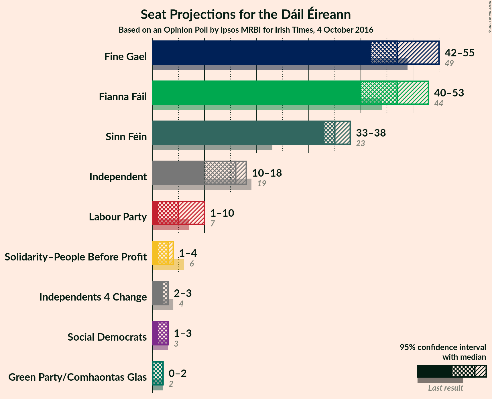
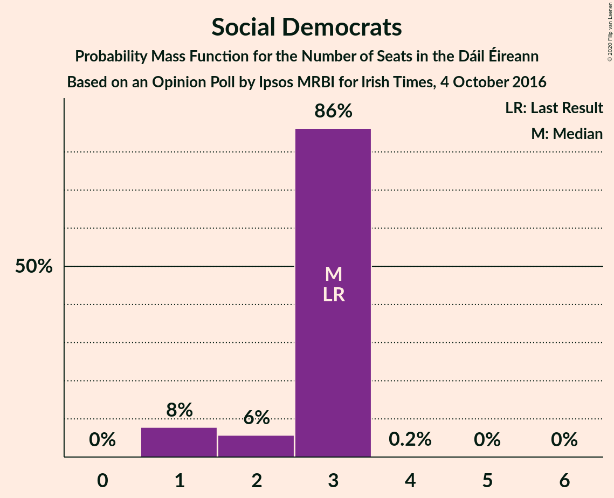
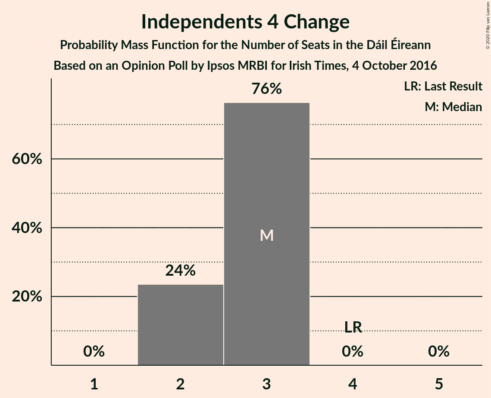
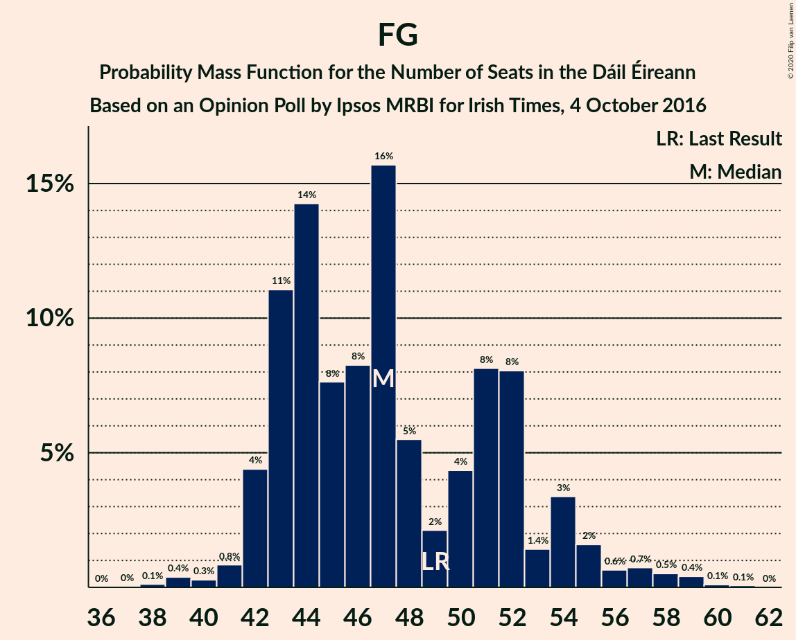

# Opinion Poll by Ipsos MRBI for Irish Times, 4 October 2016

<a href="#voting-intentions">Voting Intentions</a> | <a href="#seats">Seats</a> | <a href="#coalitions">Coalitions</a> | <a href="#technical-information">Technical Information</a>

## Voting Intentions

### Confidence Intervals

| Party | Last Result | Poll Result | 80% Confidence Interval | 90% Confidence Interval | 95% Confidence Interval | 99% Confidence Interval |
|:-----:|:-----------:|:-----------:|:-----------------------:|:-----------------------:|:-----------------------:|:-----------------------:|
| Fine Gael | 25.5% | 26.2% | 24.7–27.9% |24.2–28.4% |23.8–28.8% |23.1–29.6% |
| Fianna Fáil | 24.3% | 26.2% | 24.7–27.9% |24.2–28.4% |23.8–28.8% |23.1–29.6% |
| Sinn Féin | 13.8% | 19.2% | 17.8–20.7% |17.4–21.1% |17.0–21.5% |16.4–22.2% |
| Independent | 15.9% | 12.8% | 11.7–14.2% |11.3–14.5% |11.1–14.9% |10.5–15.5% |
| Labour Party | 6.6% | 5.1% | 4.3–6.0% |4.1–6.2% |4.0–6.5% |3.6–7.0% |
| Solidarity–People Before Profit | 3.9% | 3.0% | 2.5–3.7% |2.3–3.9% |2.2–4.1% |1.9–4.5% |
| Green Party/Comhaontas Glas | 2.7% | 3.0% | 2.5–3.7% |2.3–3.9% |2.2–4.1% |1.9–4.5% |
| Social Democrats | 3.0% | 2.0% | 1.6–2.6% |1.4–2.8% |1.3–3.0% |1.2–3.3% |
| Independents 4 Change | 1.5% | 1.6% | 1.2–2.2% |1.1–2.3% |1.0–2.5% |0.9–2.8% |

*Note:* The poll result column reflects the actual value used in the calculations. Published results may vary slightly, and in addition be rounded to fewer digits.

## Seats

### Confidence Intervals

| Party | Last Result | Median | 80% Confidence Interval | 90% Confidence Interval | 95% Confidence Interval | 99% Confidence Interval |
|:-----:|:-----------:|:------:|:-----------------------:|:-----------------------:|:-----------------------:|:-----------------------:|
| <a href="#fine-gael">Fine Gael</a> | 49 | 47 | 43–52 |42–54 |42–57 |40–59 |
| <a href="#fianna-fáil">Fianna Fáil</a> | 44 | 47 | 42–52 |41–52 |40–53 |36–55 |
| <a href="#sinn-féin">Sinn Féin</a> | 23 | 35 | 34–37 |34–37 |33–38 |31–39 |
| <a href="#independent">Independent</a> | 19 | 16 | 13–18 |11–18 |11–18 |9–19 |
| <a href="#labour-party">Labour Party</a> | 7 | 6 | 2–9 |2–10 |1–10 |1–12 |
| <a href="#solidarity–people-before-profit">Solidarity–People Before Profit</a> | 6 | 3 | 2–4 |2–4 |1–4 |1–6 |
| <a href="#green-party/comhaontas-glas">Green Party/Comhaontas Glas</a> | 2 | 2 | 0–2 |0–2 |0–3 |0–3 |
| <a href="#social-democrats">Social Democrats</a> | 3 | 3 | 2–3 |1–3 |1–3 |1–3 |
| <a href="#independents-4-change">Independents 4 Change</a> | 4 | 3 | 2–3 |2–3 |2–3 |2–3 |

### Fine Gael

*For a full overview of the results for this party, see the [Fine Gael](party-finegael.html) page.*

| Number of Seats | Probability | Accumulated | Special Marks |
|:---------------:|:-----------:|:-----------:|:-------------:|
| 37 | 0% | 100% |  |
| 38 | 0.2% | 99.9% |  |
| 39 | 0.2% | 99.8% |  |
| 40 | 0.4% | 99.5% |  |
| 41 | 0.4% | 99.2% |  |
| 42 | 6% | 98.7% |  |
| 43 | 14% | 93% |  |
| 44 | 12% | 79% |  |
| 45 | 10% | 67% |  |
| 46 | 4% | 56% |  |
| 47 | 15% | 52% | Median |
| 48 | 5% | 37% |  |
| 49 | 2% | 32% | Last Result |
| 50 | 5% | 29% |  |
| 51 | 8% | 24% |  |
| 52 | 9% | 16% |  |
| 53 | 2% | 7% |  |
| 54 | 1.3% | 5% |  |
| 55 | 1.0% | 4% |  |
| 56 | 0.6% | 3% |  |
| 57 | 1.4% | 3% |  |
| 58 | 0.3% | 1.2% |  |
| 59 | 0.7% | 0.9% |  |
| 60 | 0.1% | 0.3% |  |
| 61 | 0.1% | 0.1% |  |
| 62 | 0% | 0% |  |

### Fianna Fáil

*For a full overview of the results for this party, see the [Fianna Fáil](party-fiannafáil.html) page.*

| Number of Seats | Probability | Accumulated | Special Marks |
|:---------------:|:-----------:|:-----------:|:-------------:|
| 34 | 0.1% | 100% |  |
| 35 | 0.2% | 99.9% |  |
| 36 | 0.7% | 99.8% |  |
| 37 | 0.2% | 99.1% |  |
| 38 | 0.3% | 98.9% |  |
| 39 | 1.0% | 98.6% |  |
| 40 | 1.4% | 98% |  |
| 41 | 6% | 96% |  |
| 42 | 2% | 90% |  |
| 43 | 4% | 88% |  |
| 44 | 12% | 85% | Last Result |
| 45 | 7% | 73% |  |
| 46 | 3% | 66% |  |
| 47 | 17% | 62% | Median |
| 48 | 8% | 45% |  |
| 49 | 18% | 38% |  |
| 50 | 7% | 20% |  |
| 51 | 3% | 13% |  |
| 52 | 5% | 10% |  |
| 53 | 3% | 5% |  |
| 54 | 0.7% | 1.4% |  |
| 55 | 0.5% | 0.8% |  |
| 56 | 0.1% | 0.2% |  |
| 57 | 0.1% | 0.2% |  |
| 58 | 0% | 0% |  |

### Sinn Féin

*For a full overview of the results for this party, see the [Sinn Féin](party-sinnféin.html) page.*

| Number of Seats | Probability | Accumulated | Special Marks |
|:---------------:|:-----------:|:-----------:|:-------------:|
| 23 | 0% | 100% | Last Result |
| 24 | 0% | 100% |  |
| 25 | 0% | 100% |  |
| 26 | 0% | 100% |  |
| 27 | 0% | 100% |  |
| 28 | 0% | 100% |  |
| 29 | 0.1% | 100% |  |
| 30 | 0.1% | 99.9% |  |
| 31 | 0.4% | 99.8% |  |
| 32 | 0.6% | 99.4% |  |
| 33 | 2% | 98.8% |  |
| 34 | 32% | 97% |  |
| 35 | 21% | 65% | Median |
| 36 | 30% | 44% |  |
| 37 | 10% | 15% |  |
| 38 | 4% | 5% |  |
| 39 | 0.9% | 1.1% |  |
| 40 | 0.2% | 0.2% |  |
| 41 | 0% | 0% |  |

### Independent

*For a full overview of the results for this party, see the [Independent](party-independent.html) page.*

| Number of Seats | Probability | Accumulated | Special Marks |
|:---------------:|:-----------:|:-----------:|:-------------:|
| 6 | 0% | 100% |  |
| 7 | 0.1% | 99.9% |  |
| 8 | 0.3% | 99.8% |  |
| 9 | 0.8% | 99.5% |  |
| 10 | 1.1% | 98.8% |  |
| 11 | 3% | 98% |  |
| 12 | 1.3% | 95% |  |
| 13 | 12% | 94% |  |
| 14 | 12% | 81% |  |
| 15 | 11% | 70% |  |
| 16 | 21% | 59% | Median |
| 17 | 9% | 38% |  |
| 18 | 28% | 29% |  |
| 19 | 0.5% | 0.8% | Last Result |
| 20 | 0.2% | 0.2% |  |
| 21 | 0% | 0% |  |

### Labour Party

*For a full overview of the results for this party, see the [Labour Party](party-labourparty.html) page.*

| Number of Seats | Probability | Accumulated | Special Marks |
|:---------------:|:-----------:|:-----------:|:-------------:|
| 0 | 0.4% | 100% |  |
| 1 | 4% | 99.6% |  |
| 2 | 9% | 96% |  |
| 3 | 6% | 87% |  |
| 4 | 8% | 81% |  |
| 5 | 21% | 72% |  |
| 6 | 30% | 51% | Median |
| 7 | 6% | 21% | Last Result |
| 8 | 3% | 15% |  |
| 9 | 6% | 12% |  |
| 10 | 4% | 6% |  |
| 11 | 1.4% | 2% |  |
| 12 | 0.5% | 1.0% |  |
| 13 | 0.2% | 0.5% |  |
| 14 | 0.2% | 0.2% |  |
| 15 | 0.1% | 0.1% |  |
| 16 | 0% | 0% |  |

### Solidarity–People Before Profit

*For a full overview of the results for this party, see the [Solidarity–People Before Profit](party-solidarity–peoplebeforeprofit.html) page.*

| Number of Seats | Probability | Accumulated | Special Marks |
|:---------------:|:-----------:|:-----------:|:-------------:|
| 0 | 0.3% | 100% |  |
| 1 | 4% | 99.7% |  |
| 2 | 32% | 96% |  |
| 3 | 53% | 64% | Median |
| 4 | 10% | 11% |  |
| 5 | 0.4% | 1.0% |  |
| 6 | 0.4% | 0.5% | Last Result |
| 7 | 0.1% | 0.1% |  |
| 8 | 0% | 0% |  |

### Green Party/Comhaontas Glas

*For a full overview of the results for this party, see the [Green Party/Comhaontas Glas](party-greenpartycomhaontasglas.html) page.*

| Number of Seats | Probability | Accumulated | Special Marks |
|:---------------:|:-----------:|:-----------:|:-------------:|
| 0 | 11% | 100% |  |
| 1 | 37% | 89% |  |
| 2 | 49% | 52% | Last Result, Median |
| 3 | 2% | 3% |  |
| 4 | 0.2% | 0.3% |  |
| 5 | 0.1% | 0.1% |  |
| 6 | 0% | 0% |  |

### Social Democrats

*For a full overview of the results for this party, see the [Social Democrats](party-socialdemocrats.html) page.*

| Number of Seats | Probability | Accumulated | Special Marks |
|:---------------:|:-----------:|:-----------:|:-------------:|
| 1 | 8% | 100% |  |
| 2 | 6% | 92% |  |
| 3 | 86% | 86% | Last Result, Median |
| 4 | 0.2% | 0.3% |  |
| 5 | 0% | 0% |  |

### Independents 4 Change

*For a full overview of the results for this party, see the [Independents 4 Change](party-independents4change.html) page.*

| Number of Seats | Probability | Accumulated | Special Marks |
|:---------------:|:-----------:|:-----------:|:-------------:|
| 2 | 25% | 100% |  |
| 3 | 75% | 75% | Median |
| 4 | 0% | 0% | Last Result |

## Coalitions

### Confidence Intervals

| Coalition | Last Result | Median | Majority? | 80% Confidence Interval | 90% Confidence Interval | 95% Confidence Interval | 99% Confidence Interval |
|:---------:|:-----------:|:------:|:---------:|:-----------------------:|:-----------------------:|:-----------------------:|:-----------------------:|
| Fianna Fáil – Fine Gael | 93 | 94 | 100% | 90–99 | 89–100 | 87–102 | 84–104 |
| Fianna Fáil – Sinn Féin | 67 | 83 | 67% | 77–87 | 77–89 | 75–89 | 71–90 |
| Fine Gael – Labour Party – Green Party/Comhaontas Glas – Social Democrats | 61 | 56 | 0% | 53–62 | 52–62 | 51–64 | 50–67 |
| Fianna Fáil – Labour Party – Green Party/Comhaontas Glas – Social Democrats | 56 | 57 | 0% | 51–62 | 50–63 | 49–63 | 43–65 |
| Fine Gael – Labour Party – Green Party/Comhaontas Glas | 58 | 54 | 0% | 50–59 | 50–59 | 48–61 | 47–64 |
| Fianna Fáil – Labour Party – Green Party/Comhaontas Glas | 53 | 54 | 0% | 48–59 | 47–60 | 46–60 | 40–62 |
| Fine Gael – Labour Party | 56 | 52 | 0% | 48–58 | 48–58 | 46–60 | 45–63 |
| Fianna Fáil – Labour Party | 51 | 53 | 0% | 47–57 | 46–58 | 45–59 | 39–61 |
| Fine Gael – Green Party/Comhaontas Glas | 51 | 48 | 0% | 45–53 | 44–55 | 43–57 | 41–60 |
| Fine Gael | 49 | 47 | 0% | 43–52 | 42–54 | 42–57 | 40–59 |
| Fianna Fáil – Green Party/Comhaontas Glas | 46 | 49 | 0% | 43–53 | 42–54 | 40–55 | 37–57 |

### Fianna Fáil – Fine Gael

| Number of Seats | Probability | Accumulated | Special Marks |
|:---------------:|:-----------:|:-----------:|:-------------:|
| 83 | 0% | 100% |  |
| 84 | 1.5% | 99.9% |  |
| 85 | 0.1% | 98% |  |
| 86 | 0.5% | 98% |  |
| 87 | 0.7% | 98% |  |
| 88 | 1.1% | 97% |  |
| 89 | 1.3% | 96% |  |
| 90 | 11% | 95% |  |
| 91 | 12% | 83% |  |
| 92 | 5% | 71% |  |
| 93 | 12% | 66% | Last Result |
| 94 | 11% | 53% | Median |
| 95 | 10% | 42% |  |
| 96 | 10% | 32% |  |
| 97 | 6% | 22% |  |
| 98 | 5% | 16% |  |
| 99 | 5% | 11% |  |
| 100 | 1.4% | 6% |  |
| 101 | 2% | 4% |  |
| 102 | 0.6% | 3% |  |
| 103 | 1.4% | 2% |  |
| 104 | 0.4% | 0.7% |  |
| 105 | 0% | 0.2% |  |
| 106 | 0.2% | 0.2% |  |
| 107 | 0% | 0% |  |

### Fianna Fáil – Sinn Féin

| Number of Seats | Probability | Accumulated | Special Marks |
|:---------------:|:-----------:|:-----------:|:-------------:|
| 67 | 0% | 100% | Last Result |
| 68 | 0% | 100% |  |
| 69 | 0% | 100% |  |
| 70 | 0.1% | 99.9% |  |
| 71 | 0.5% | 99.8% |  |
| 72 | 0.3% | 99.4% |  |
| 73 | 0.3% | 99.0% |  |
| 74 | 0.6% | 98.8% |  |
| 75 | 0.8% | 98% |  |
| 76 | 0.9% | 97% |  |
| 77 | 7% | 97% |  |
| 78 | 9% | 90% |  |
| 79 | 11% | 81% |  |
| 80 | 2% | 70% |  |
| 81 | 11% | 67% | Majority |
| 82 | 4% | 57% | Median |
| 83 | 14% | 53% |  |
| 84 | 11% | 39% |  |
| 85 | 14% | 28% |  |
| 86 | 3% | 14% |  |
| 87 | 3% | 11% |  |
| 88 | 2% | 8% |  |
| 89 | 5% | 6% |  |
| 90 | 0.6% | 0.9% |  |
| 91 | 0.1% | 0.3% |  |
| 92 | 0.2% | 0.2% |  |
| 93 | 0% | 0% |  |

### Fine Gael – Labour Party – Green Party/Comhaontas Glas – Social Democrats

| Number of Seats | Probability | Accumulated | Special Marks |
|:---------------:|:-----------:|:-----------:|:-------------:|
| 46 | 0% | 100% |  |
| 47 | 0% | 99.9% |  |
| 48 | 0.1% | 99.9% |  |
| 49 | 0.1% | 99.8% |  |
| 50 | 1.1% | 99.7% |  |
| 51 | 3% | 98.6% |  |
| 52 | 2% | 96% |  |
| 53 | 18% | 94% |  |
| 54 | 8% | 76% |  |
| 55 | 9% | 68% |  |
| 56 | 10% | 59% |  |
| 57 | 11% | 49% |  |
| 58 | 6% | 38% | Median |
| 59 | 4% | 32% |  |
| 60 | 9% | 27% |  |
| 61 | 8% | 19% | Last Result |
| 62 | 7% | 11% |  |
| 63 | 1.5% | 4% |  |
| 64 | 0.8% | 3% |  |
| 65 | 0.4% | 2% |  |
| 66 | 0.7% | 1.2% |  |
| 67 | 0.2% | 0.5% |  |
| 68 | 0.2% | 0.3% |  |
| 69 | 0.1% | 0.1% |  |
| 70 | 0% | 0.1% |  |
| 71 | 0% | 0.1% |  |
| 72 | 0% | 0% |  |

### Fianna Fáil – Labour Party – Green Party/Comhaontas Glas – Social Democrats

| Number of Seats | Probability | Accumulated | Special Marks |
|:---------------:|:-----------:|:-----------:|:-------------:|
| 41 | 0.1% | 100% |  |
| 42 | 0.2% | 99.9% |  |
| 43 | 0.4% | 99.8% |  |
| 44 | 0.4% | 99.4% |  |
| 45 | 0.5% | 99.0% |  |
| 46 | 0.4% | 98.5% |  |
| 47 | 0.3% | 98% |  |
| 48 | 0.4% | 98% |  |
| 49 | 1.1% | 98% |  |
| 50 | 2% | 96% |  |
| 51 | 6% | 94% |  |
| 52 | 2% | 88% |  |
| 53 | 8% | 87% |  |
| 54 | 11% | 79% |  |
| 55 | 5% | 68% |  |
| 56 | 7% | 63% | Last Result |
| 57 | 12% | 56% |  |
| 58 | 14% | 45% | Median |
| 59 | 11% | 31% |  |
| 60 | 5% | 20% |  |
| 61 | 2% | 15% |  |
| 62 | 4% | 12% |  |
| 63 | 6% | 8% |  |
| 64 | 0.6% | 1.3% |  |
| 65 | 0.4% | 0.7% |  |
| 66 | 0.3% | 0.3% |  |
| 67 | 0% | 0% |  |

### Fine Gael – Labour Party – Green Party/Comhaontas Glas

| Number of Seats | Probability | Accumulated | Special Marks |
|:---------------:|:-----------:|:-----------:|:-------------:|
| 44 | 0.1% | 100% |  |
| 45 | 0.1% | 99.9% |  |
| 46 | 0.1% | 99.8% |  |
| 47 | 0.8% | 99.7% |  |
| 48 | 2% | 98.9% |  |
| 49 | 1.3% | 96% |  |
| 50 | 16% | 95% |  |
| 51 | 8% | 79% |  |
| 52 | 12% | 71% |  |
| 53 | 7% | 59% |  |
| 54 | 12% | 52% |  |
| 55 | 6% | 40% | Median |
| 56 | 5% | 34% |  |
| 57 | 9% | 29% |  |
| 58 | 9% | 20% | Last Result |
| 59 | 7% | 11% |  |
| 60 | 2% | 4% |  |
| 61 | 0.7% | 3% |  |
| 62 | 0.7% | 2% |  |
| 63 | 0.8% | 1.4% |  |
| 64 | 0.3% | 0.6% |  |
| 65 | 0.1% | 0.3% |  |
| 66 | 0.1% | 0.2% |  |
| 67 | 0% | 0.1% |  |
| 68 | 0% | 0.1% |  |
| 69 | 0% | 0% |  |

### Fianna Fáil – Labour Party – Green Party/Comhaontas Glas

| Number of Seats | Probability | Accumulated | Special Marks |
|:---------------:|:-----------:|:-----------:|:-------------:|
| 38 | 0.1% | 100% |  |
| 39 | 0.1% | 99.9% |  |
| 40 | 0.4% | 99.8% |  |
| 41 | 0.2% | 99.4% |  |
| 42 | 0.6% | 99.3% |  |
| 43 | 0.4% | 98.7% |  |
| 44 | 0.3% | 98% |  |
| 45 | 0.3% | 98% |  |
| 46 | 1.1% | 98% |  |
| 47 | 2% | 97% |  |
| 48 | 6% | 95% |  |
| 49 | 2% | 89% |  |
| 50 | 6% | 87% |  |
| 51 | 10% | 81% |  |
| 52 | 6% | 71% |  |
| 53 | 5% | 65% | Last Result |
| 54 | 11% | 60% |  |
| 55 | 16% | 49% | Median |
| 56 | 11% | 32% |  |
| 57 | 5% | 21% |  |
| 58 | 3% | 16% |  |
| 59 | 4% | 13% |  |
| 60 | 7% | 8% |  |
| 61 | 0.9% | 2% |  |
| 62 | 0.5% | 0.8% |  |
| 63 | 0.3% | 0.3% |  |
| 64 | 0% | 0% |  |

### Fine Gael – Labour Party

| Number of Seats | Probability | Accumulated | Special Marks |
|:---------------:|:-----------:|:-----------:|:-------------:|
| 42 | 0% | 100% |  |
| 43 | 0.1% | 99.9% |  |
| 44 | 0.1% | 99.9% |  |
| 45 | 0.6% | 99.8% |  |
| 46 | 2% | 99.2% |  |
| 47 | 2% | 97% |  |
| 48 | 11% | 95% |  |
| 49 | 10% | 84% |  |
| 50 | 12% | 74% |  |
| 51 | 7% | 62% |  |
| 52 | 6% | 55% |  |
| 53 | 11% | 48% | Median |
| 54 | 5% | 37% |  |
| 55 | 4% | 32% |  |
| 56 | 9% | 29% | Last Result |
| 57 | 8% | 19% |  |
| 58 | 6% | 11% |  |
| 59 | 2% | 5% |  |
| 60 | 0.9% | 3% |  |
| 61 | 1.0% | 2% |  |
| 62 | 0.5% | 1.1% |  |
| 63 | 0.3% | 0.6% |  |
| 64 | 0.1% | 0.3% |  |
| 65 | 0.1% | 0.2% |  |
| 66 | 0% | 0.1% |  |
| 67 | 0% | 0.1% |  |
| 68 | 0% | 0% |  |

### Fianna Fáil – Labour Party

| Number of Seats | Probability | Accumulated | Special Marks |
|:---------------:|:-----------:|:-----------:|:-------------:|
| 37 | 0% | 100% |  |
| 38 | 0.2% | 99.9% |  |
| 39 | 0.3% | 99.7% |  |
| 40 | 0.1% | 99.4% |  |
| 41 | 0.7% | 99.3% |  |
| 42 | 0.2% | 98.6% |  |
| 43 | 0.3% | 98% |  |
| 44 | 0.4% | 98% |  |
| 45 | 1.2% | 98% |  |
| 46 | 2% | 97% |  |
| 47 | 6% | 94% |  |
| 48 | 3% | 89% |  |
| 49 | 6% | 86% |  |
| 50 | 12% | 80% |  |
| 51 | 5% | 68% | Last Result |
| 52 | 12% | 63% |  |
| 53 | 14% | 51% | Median |
| 54 | 7% | 37% |  |
| 55 | 12% | 30% |  |
| 56 | 4% | 19% |  |
| 57 | 5% | 14% |  |
| 58 | 7% | 10% |  |
| 59 | 2% | 3% |  |
| 60 | 0.6% | 1.2% |  |
| 61 | 0.5% | 0.6% |  |
| 62 | 0% | 0.1% |  |
| 63 | 0% | 0% |  |

### Fine Gael – Green Party/Comhaontas Glas

| Number of Seats | Probability | Accumulated | Special Marks |
|:---------------:|:-----------:|:-----------:|:-------------:|
| 38 | 0% | 100% |  |
| 39 | 0% | 99.9% |  |
| 40 | 0.2% | 99.9% |  |
| 41 | 0.3% | 99.6% |  |
| 42 | 0.7% | 99.3% |  |
| 43 | 1.1% | 98.6% |  |
| 44 | 6% | 97% |  |
| 45 | 16% | 91% |  |
| 46 | 11% | 75% |  |
| 47 | 10% | 64% |  |
| 48 | 15% | 55% |  |
| 49 | 4% | 39% | Median |
| 50 | 3% | 35% |  |
| 51 | 7% | 32% | Last Result |
| 52 | 9% | 25% |  |
| 53 | 9% | 16% |  |
| 54 | 2% | 7% |  |
| 55 | 1.2% | 5% |  |
| 56 | 0.7% | 4% |  |
| 57 | 2% | 4% |  |
| 58 | 0.7% | 2% |  |
| 59 | 0.3% | 1.3% |  |
| 60 | 0.8% | 0.9% |  |
| 61 | 0.1% | 0.2% |  |
| 62 | 0% | 0.1% |  |
| 63 | 0% | 0% |  |

### Fine Gael

| Number of Seats | Probability | Accumulated | Special Marks |
|:---------------:|:-----------:|:-----------:|:-------------:|
| 37 | 0% | 100% |  |
| 38 | 0.2% | 99.9% |  |
| 39 | 0.2% | 99.8% |  |
| 40 | 0.4% | 99.5% |  |
| 41 | 0.4% | 99.2% |  |
| 42 | 6% | 98.7% |  |
| 43 | 14% | 93% |  |
| 44 | 12% | 79% |  |
| 45 | 10% | 67% |  |
| 46 | 4% | 56% |  |
| 47 | 15% | 52% | Median |
| 48 | 5% | 37% |  |
| 49 | 2% | 32% | Last Result |
| 50 | 5% | 29% |  |
| 51 | 8% | 24% |  |
| 52 | 9% | 16% |  |
| 53 | 2% | 7% |  |
| 54 | 1.3% | 5% |  |
| 55 | 1.0% | 4% |  |
| 56 | 0.6% | 3% |  |
| 57 | 1.4% | 3% |  |
| 58 | 0.3% | 1.2% |  |
| 59 | 0.7% | 0.9% |  |
| 60 | 0.1% | 0.3% |  |
| 61 | 0.1% | 0.1% |  |
| 62 | 0% | 0% |  |

### Fianna Fáil – Green Party/Comhaontas Glas

| Number of Seats | Probability | Accumulated | Special Marks |
|:---------------:|:-----------:|:-----------:|:-------------:|
| 35 | 0.1% | 100% |  |
| 36 | 0.1% | 99.9% |  |
| 37 | 0.5% | 99.8% |  |
| 38 | 0.4% | 99.3% |  |
| 39 | 0.4% | 98.9% |  |
| 40 | 1.1% | 98.6% |  |
| 41 | 1.2% | 97% |  |
| 42 | 5% | 96% |  |
| 43 | 3% | 91% |  |
| 44 | 2% | 89% |  |
| 45 | 12% | 87% |  |
| 46 | 7% | 75% | Last Result |
| 47 | 3% | 67% |  |
| 48 | 6% | 64% |  |
| 49 | 17% | 59% | Median |
| 50 | 15% | 41% |  |
| 51 | 8% | 26% |  |
| 52 | 6% | 18% |  |
| 53 | 6% | 12% |  |
| 54 | 1.4% | 6% |  |
| 55 | 3% | 4% |  |
| 56 | 0.9% | 2% |  |
| 57 | 0.5% | 0.7% |  |
| 58 | 0.1% | 0.2% |  |
| 59 | 0.1% | 0.2% |  |
| 60 | 0% | 0% |  |

## Technical Information

### Opinion Poll

+ **Polling firm:** Ipsos MRBI
+ **Commissioner(s):** Irish Times
+ **Fieldwork period:** 4 October 2016

### Calculations

+ **Sample size:** 1200
+ **Simulations done:** 524,288
+ **Error estimate:** 2.45%

