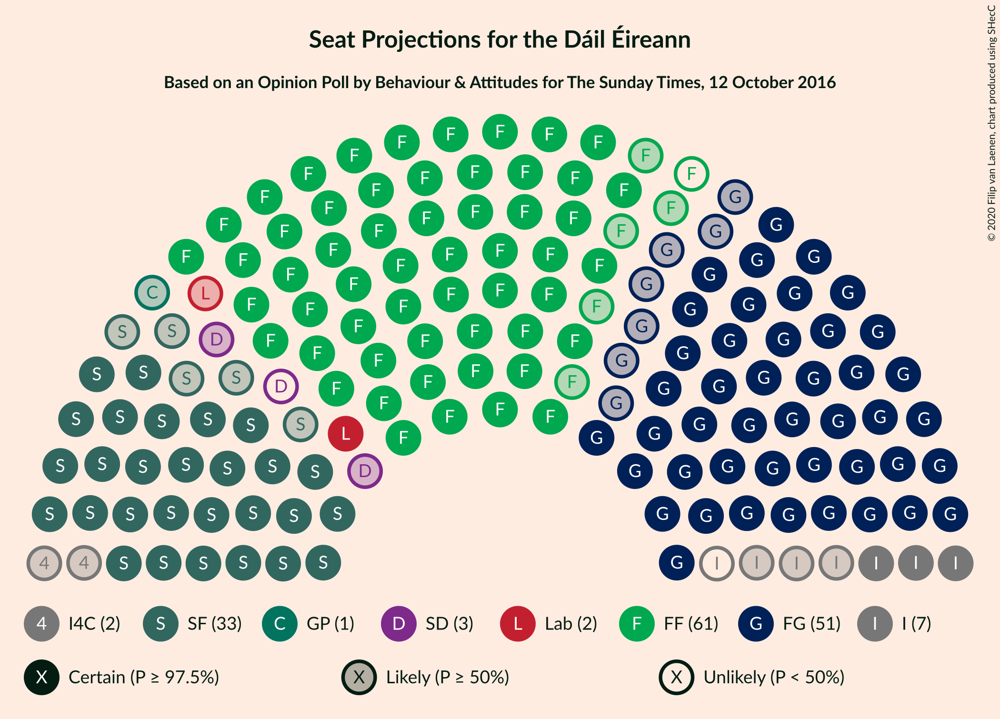
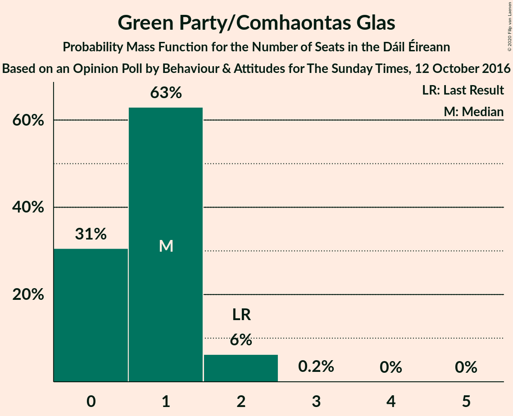
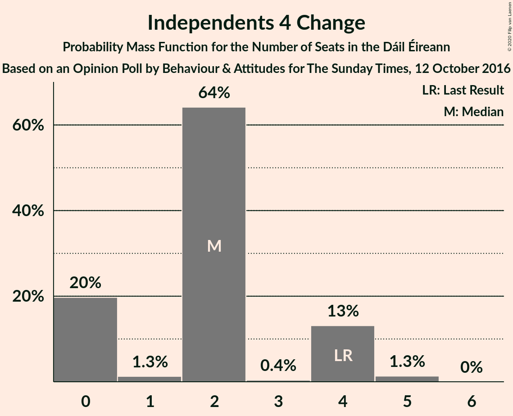
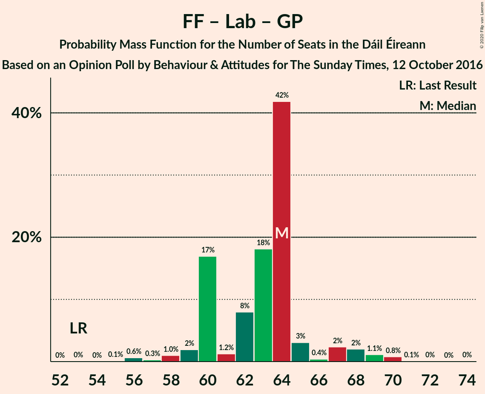
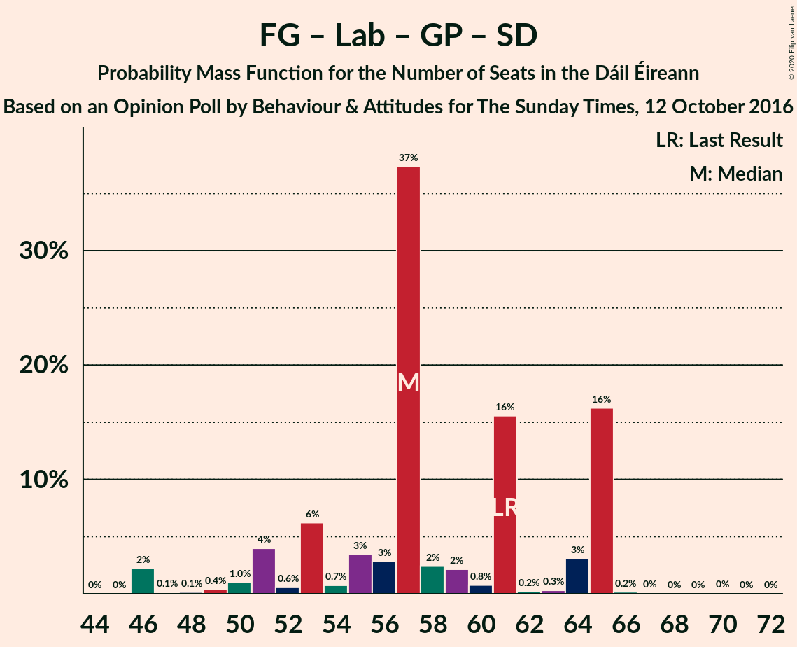

# Opinion Poll by Behaviour & Attitudes for The Sunday Times, 12 October 2016

<a href="#voting-intentions">Voting Intentions</a> | <a href="#seats">Seats</a> | <a href="#coalitions">Coalitions</a> | <a href="#technical-information">Technical Information</a>

## Voting Intentions

### Confidence Intervals

| Party | Last Result | Poll Result | 80% Confidence Interval | 90% Confidence Interval | 95% Confidence Interval | 99% Confidence Interval |
|:-----:|:-----------:|:-----------:|:-----------------------:|:-----------------------:|:-----------------------:|:-----------------------:|
| Fianna Fáil | 24.3% | 30.3% | 28.4–32.3% |27.9–32.9% |27.4–33.4% |26.5–34.4% |
| Fine Gael | 25.5% | 26.3% | 24.5–28.2% |24.0–28.8% |23.5–29.2% |22.7–30.2% |
| Sinn Féin | 13.8% | 17.1% | 15.6–18.8% |15.2–19.3% |14.8–19.7% |14.1–20.5% |
| Independent | 15.9% | 9.4% | 8.2–10.7% |7.9–11.1% |7.7–11.4% |7.1–12.1% |
| Labour Party | 6.6% | 5.0% | 4.2–6.1% |4.0–6.4% |3.8–6.6% |3.4–7.2% |
| Solidarity–People Before Profit | 3.9% | 2.1% | 1.6–2.8% |1.4–3.0% |1.3–3.2% |1.1–3.6% |
| Green Party/Comhaontas Glas | 2.7% | 2.1% | 1.6–2.8% |1.4–3.0% |1.3–3.2% |1.1–3.6% |
| Independents 4 Change | 1.5% | 1.2% | 0.9–1.8% |0.7–2.0% |0.7–2.1% |0.5–2.5% |
| Social Democrats | 3.0% | 1.0% | 0.7–1.6% |0.6–1.7% |0.5–1.9% |0.4–2.2% |
| Renua Ireland | 2.2% | 1.0% | 0.7–1.6% |0.6–1.7% |0.5–1.9% |0.4–2.2% |

*Note:* The poll result column reflects the actual value used in the calculations. Published results may vary slightly, and in addition be rounded to fewer digits.

## Seats

### Confidence Intervals

| Party | Last Result | Median | 80% Confidence Interval | 90% Confidence Interval | 95% Confidence Interval | 99% Confidence Interval |
|:-----:|:-----------:|:------:|:-----------------------:|:-----------------------:|:-----------------------:|:-----------------------:|
| <a href="#fianna-fáil">Fianna Fáil</a> | 44 | 60 | 57–61 |57–61 |55–62 |54–63 |
| <a href="#fine-gael">Fine Gael</a> | 49 | 51 | 48–57 |45–57 |44–57 |44–58 |
| <a href="#sinn-féin">Sinn Féin</a> | 23 | 33 | 30–39 |30–40 |28–40 |28–41 |
| <a href="#independent">Independent</a> | 19 | 6 | 3–7 |3–8 |3–9 |3–12 |
| <a href="#labour-party">Labour Party</a> | 7 | 2 | 2–6 |1–6 |1–8 |0–10 |
| <a href="#solidarity–people-before-profit">Solidarity–People Before Profit</a> | 6 | 0 | 0–3 |0–4 |0–4 |0–4 |
| <a href="#green-party/comhaontas-glas">Green Party/Comhaontas Glas</a> | 2 | 1 | 0–1 |0–2 |0–2 |0–2 |
| <a href="#independents-4-change">Independents 4 Change</a> | 4 | 2 | 0–4 |0–4 |0–4 |0–5 |
| <a href="#social-democrats">Social Democrats</a> | 3 | 2 | 0–3 |0–3 |0–3 |0–3 |
| <a href="#renua-ireland">Renua Ireland</a> | 0 | 0 | 0 |0 |0 |0–1 |

### Fianna Fáil

*For a full overview of the results for this party, see the [Fianna Fáil](party-fiannafáil.html) page.*

| Number of Seats | Probability | Accumulated | Special Marks |
|:---------------:|:-----------:|:-----------:|:-------------:|
| 44 | 0% | 100% | Last Result |
| 45 | 0% | 100% |  |
| 46 | 0% | 100% |  |
| 47 | 0% | 100% |  |
| 48 | 0% | 100% |  |
| 49 | 0% | 100% |  |
| 50 | 0% | 100% |  |
| 51 | 0.1% | 100% |  |
| 52 | 0.2% | 99.9% |  |
| 53 | 0.1% | 99.7% |  |
| 54 | 2% | 99.6% |  |
| 55 | 0.4% | 98% |  |
| 56 | 0.5% | 97% |  |
| 57 | 34% | 97% |  |
| 58 | 6% | 63% |  |
| 59 | 1.2% | 57% |  |
| 60 | 11% | 56% | Median |
| 61 | 41% | 45% |  |
| 62 | 3% | 3% |  |
| 63 | 0.6% | 0.7% |  |
| 64 | 0.1% | 0.1% |  |
| 65 | 0% | 0% |  |

### Fine Gael

*For a full overview of the results for this party, see the [Fine Gael](party-finegael.html) page.*

| Number of Seats | Probability | Accumulated | Special Marks |
|:---------------:|:-----------:|:-----------:|:-------------:|
| 42 | 0.1% | 100% |  |
| 43 | 0.2% | 99.9% |  |
| 44 | 2% | 99.7% |  |
| 45 | 3% | 97% |  |
| 46 | 0.7% | 94% |  |
| 47 | 2% | 93% |  |
| 48 | 2% | 91% |  |
| 49 | 6% | 90% | Last Result |
| 50 | 3% | 84% |  |
| 51 | 39% | 81% | Median |
| 52 | 0.8% | 42% |  |
| 53 | 2% | 42% |  |
| 54 | 4% | 40% |  |
| 55 | 2% | 36% |  |
| 56 | 3% | 34% |  |
| 57 | 30% | 32% |  |
| 58 | 1.0% | 2% |  |
| 59 | 0% | 0.5% |  |
| 60 | 0.2% | 0.5% |  |
| 61 | 0.2% | 0.3% |  |
| 62 | 0.1% | 0.1% |  |
| 63 | 0% | 0% |  |

### Sinn Féin

*For a full overview of the results for this party, see the [Sinn Féin](party-sinnféin.html) page.*

| Number of Seats | Probability | Accumulated | Special Marks |
|:---------------:|:-----------:|:-----------:|:-------------:|
| 23 | 0% | 100% | Last Result |
| 24 | 0% | 100% |  |
| 25 | 0.1% | 100% |  |
| 26 | 0.2% | 99.9% |  |
| 27 | 0.2% | 99.7% |  |
| 28 | 2% | 99.5% |  |
| 29 | 0.4% | 97% |  |
| 30 | 16% | 97% |  |
| 31 | 4% | 81% |  |
| 32 | 2% | 77% |  |
| 33 | 38% | 75% | Median |
| 34 | 6% | 38% |  |
| 35 | 1.3% | 32% |  |
| 36 | 2% | 30% |  |
| 37 | 16% | 29% |  |
| 38 | 0.2% | 13% |  |
| 39 | 5% | 13% |  |
| 40 | 7% | 7% |  |
| 41 | 0.7% | 0.7% |  |
| 42 | 0% | 0% |  |

### Independent

*For a full overview of the results for this party, see the [Independent](party-independent.html) page.*

| Number of Seats | Probability | Accumulated | Special Marks |
|:---------------:|:-----------:|:-----------:|:-------------:|
| 3 | 20% | 100% |  |
| 4 | 17% | 80% |  |
| 5 | 9% | 63% |  |
| 6 | 9% | 54% | Median |
| 7 | 38% | 45% |  |
| 8 | 3% | 7% |  |
| 9 | 2% | 4% |  |
| 10 | 1.0% | 2% |  |
| 11 | 0.2% | 0.8% |  |
| 12 | 0.3% | 0.6% |  |
| 13 | 0.1% | 0.3% |  |
| 14 | 0.1% | 0.2% |  |
| 15 | 0.1% | 0.1% |  |
| 16 | 0% | 0% |  |
| 17 | 0% | 0% |  |
| 18 | 0% | 0% |  |
| 19 | 0% | 0% | Last Result |

### Labour Party

*For a full overview of the results for this party, see the [Labour Party](party-labourparty.html) page.*

| Number of Seats | Probability | Accumulated | Special Marks |
|:---------------:|:-----------:|:-----------:|:-------------:|
| 0 | 2% | 100% |  |
| 1 | 6% | 98% |  |
| 2 | 62% | 92% | Median |
| 3 | 1.0% | 30% |  |
| 4 | 0.7% | 29% |  |
| 5 | 6% | 28% |  |
| 6 | 18% | 22% |  |
| 7 | 2% | 5% | Last Result |
| 8 | 1.3% | 3% |  |
| 9 | 0.3% | 2% |  |
| 10 | 1.2% | 1.3% |  |
| 11 | 0% | 0.1% |  |
| 12 | 0.1% | 0.1% |  |
| 13 | 0% | 0% |  |

### Solidarity–People Before Profit

*For a full overview of the results for this party, see the [Solidarity–People Before Profit](party-solidarity–peoplebeforeprofit.html) page.*

| Number of Seats | Probability | Accumulated | Special Marks |
|:---------------:|:-----------:|:-----------:|:-------------:|
| 0 | 51% | 100% | Median |
| 1 | 16% | 49% |  |
| 2 | 0.7% | 33% |  |
| 3 | 27% | 32% |  |
| 4 | 5% | 6% |  |
| 5 | 0.2% | 0.3% |  |
| 6 | 0.1% | 0.1% | Last Result |
| 7 | 0% | 0% |  |

### Green Party/Comhaontas Glas

*For a full overview of the results for this party, see the [Green Party/Comhaontas Glas](party-greenpartycomhaontasglas.html) page.*

| Number of Seats | Probability | Accumulated | Special Marks |
|:---------------:|:-----------:|:-----------:|:-------------:|
| 0 | 31% | 100% |  |
| 1 | 63% | 69% | Median |
| 2 | 6% | 6% | Last Result |
| 3 | 0.2% | 0.2% |  |
| 4 | 0% | 0% |  |

### Independents 4 Change

*For a full overview of the results for this party, see the [Independents 4 Change](party-independents4change.html) page.*

| Number of Seats | Probability | Accumulated | Special Marks |
|:---------------:|:-----------:|:-----------:|:-------------:|
| 0 | 20% | 100% |  |
| 1 | 1.3% | 80% |  |
| 2 | 64% | 79% | Median |
| 3 | 0.4% | 15% |  |
| 4 | 13% | 14% | Last Result |
| 5 | 1.3% | 1.3% |  |
| 6 | 0% | 0% |  |

### Social Democrats

*For a full overview of the results for this party, see the [Social Democrats](party-socialdemocrats.html) page.*

| Number of Seats | Probability | Accumulated | Special Marks |
|:---------------:|:-----------:|:-----------:|:-------------:|
| 0 | 18% | 100% |  |
| 1 | 23% | 82% |  |
| 2 | 18% | 59% | Median |
| 3 | 41% | 41% | Last Result |
| 4 | 0% | 0% |  |

### Renua Ireland

*For a full overview of the results for this party, see the [Renua Ireland](party-renuaireland.html) page.*

| Number of Seats | Probability | Accumulated | Special Marks |
|:---------------:|:-----------:|:-----------:|:-------------:|
| 0 | 99.3% | 100% | Last Result, Median |
| 1 | 0.5% | 0.7% |  |
| 2 | 0.2% | 0.2% |  |
| 3 | 0% | 0% |  |

## Coalitions

### Confidence Intervals

| Coalition | Last Result | Median | Majority? | 80% Confidence Interval | 90% Confidence Interval | 95% Confidence Interval | 99% Confidence Interval |
|:---------:|:-----------:|:------:|:---------:|:-----------------------:|:-----------------------:|:-----------------------:|:-----------------------:|
| Fianna Fáil – Fine Gael | 93 | 112 | 100% | 108–114 | 104–114 | 102–114 | 102–116 |
| Fianna Fáil – Sinn Féin | 67 | 94 | 100% | 87–98 | 87–100 | 87–100 | 85–102 |
| Fianna Fáil – Labour Party – Green Party/Comhaontas Glas – Social Democrats | 56 | 65 | 0% | 61–67 | 61–67 | 59–70 | 57–70 |
| Fianna Fáil – Labour Party – Green Party/Comhaontas Glas | 53 | 64 | 0% | 60–64 | 60–67 | 59–68 | 56–70 |
| Fianna Fáil – Labour Party | 51 | 63 | 0% | 59–63 | 59–67 | 58–68 | 56–69 |
| Fine Gael – Labour Party – Green Party/Comhaontas Glas – Social Democrats | 61 | 57 | 0% | 53–65 | 51–65 | 49–65 | 46–65 |
| Fine Gael – Labour Party – Green Party/Comhaontas Glas | 58 | 54 | 0% | 53–63 | 50–63 | 47–63 | 46–64 |
| Fine Gael – Labour Party | 56 | 53 | 0% | 51–63 | 50–63 | 47–63 | 45–63 |
| Fianna Fáil – Green Party/Comhaontas Glas | 46 | 61 | 0% | 57–62 | 57–62 | 56–62 | 54–63 |
| Fine Gael – Green Party/Comhaontas Glas | 51 | 52 | 0% | 49–58 | 45–58 | 45–58 | 45–59 |
| Fine Gael | 49 | 51 | 0% | 48–57 | 45–57 | 44–57 | 44–58 |

### Fianna Fáil – Fine Gael

| Number of Seats | Probability | Accumulated | Special Marks |
|:---------------:|:-----------:|:-----------:|:-------------:|
| 93 | 0% | 100% | Last Result |
| 94 | 0% | 100% |  |
| 95 | 0% | 100% |  |
| 96 | 0% | 100% |  |
| 97 | 0% | 100% |  |
| 98 | 0% | 100% |  |
| 99 | 0% | 100% |  |
| 100 | 0.2% | 99.9% |  |
| 101 | 0.1% | 99.8% |  |
| 102 | 3% | 99.7% |  |
| 103 | 0.1% | 97% |  |
| 104 | 3% | 96% |  |
| 105 | 0.6% | 94% |  |
| 106 | 0.5% | 93% |  |
| 107 | 0.4% | 92% |  |
| 108 | 3% | 92% |  |
| 109 | 5% | 89% |  |
| 110 | 2% | 83% |  |
| 111 | 2% | 81% | Median |
| 112 | 41% | 80% |  |
| 113 | 2% | 38% |  |
| 114 | 34% | 36% |  |
| 115 | 2% | 2% |  |
| 116 | 0.3% | 0.5% |  |
| 117 | 0.1% | 0.2% |  |
| 118 | 0% | 0.1% |  |
| 119 | 0% | 0% |  |

### Fianna Fáil – Sinn Féin

| Number of Seats | Probability | Accumulated | Special Marks |
|:---------------:|:-----------:|:-----------:|:-------------:|
| 67 | 0% | 100% | Last Result |
| 68 | 0% | 100% |  |
| 69 | 0% | 100% |  |
| 70 | 0% | 100% |  |
| 71 | 0% | 100% |  |
| 72 | 0% | 100% |  |
| 73 | 0% | 100% |  |
| 74 | 0% | 100% |  |
| 75 | 0% | 100% |  |
| 76 | 0% | 100% |  |
| 77 | 0% | 100% |  |
| 78 | 0% | 100% |  |
| 79 | 0% | 100% |  |
| 80 | 0% | 100% |  |
| 81 | 0% | 100% | Majority |
| 82 | 0.1% | 100% |  |
| 83 | 0.1% | 99.9% |  |
| 84 | 0.1% | 99.8% |  |
| 85 | 0.4% | 99.7% |  |
| 86 | 0.2% | 99.3% |  |
| 87 | 16% | 99.1% |  |
| 88 | 1.2% | 83% |  |
| 89 | 4% | 82% |  |
| 90 | 4% | 79% |  |
| 91 | 0.4% | 75% |  |
| 92 | 3% | 75% |  |
| 93 | 0.6% | 71% | Median |
| 94 | 54% | 71% |  |
| 95 | 3% | 17% |  |
| 96 | 4% | 14% |  |
| 97 | 0.3% | 10% |  |
| 98 | 0.7% | 10% |  |
| 99 | 2% | 9% |  |
| 100 | 6% | 7% |  |
| 101 | 0.3% | 0.9% |  |
| 102 | 0.6% | 0.6% |  |
| 103 | 0% | 0% |  |

### Fianna Fáil – Labour Party – Green Party/Comhaontas Glas – Social Democrats

| Number of Seats | Probability | Accumulated | Special Marks |
|:---------------:|:-----------:|:-----------:|:-------------:|
| 56 | 0.1% | 100% | Last Result |
| 57 | 0.3% | 99.8% |  |
| 58 | 0.4% | 99.5% |  |
| 59 | 2% | 99.1% |  |
| 60 | 2% | 97% |  |
| 61 | 16% | 96% |  |
| 62 | 3% | 79% |  |
| 63 | 5% | 76% |  |
| 64 | 6% | 71% |  |
| 65 | 18% | 65% | Median |
| 66 | 3% | 47% |  |
| 67 | 39% | 44% |  |
| 68 | 2% | 5% |  |
| 69 | 0.2% | 3% |  |
| 70 | 2% | 3% |  |
| 71 | 0.1% | 0.3% |  |
| 72 | 0% | 0.1% |  |
| 73 | 0% | 0.1% |  |
| 74 | 0% | 0.1% |  |
| 75 | 0% | 0% |  |

### Fianna Fáil – Labour Party – Green Party/Comhaontas Glas

| Number of Seats | Probability | Accumulated | Special Marks |
|:---------------:|:-----------:|:-----------:|:-------------:|
| 53 | 0% | 100% | Last Result |
| 54 | 0% | 99.9% |  |
| 55 | 0.1% | 99.9% |  |
| 56 | 0.6% | 99.8% |  |
| 57 | 0.3% | 99.2% |  |
| 58 | 1.0% | 98.9% |  |
| 59 | 2% | 98% |  |
| 60 | 17% | 96% |  |
| 61 | 1.2% | 79% |  |
| 62 | 8% | 78% |  |
| 63 | 18% | 70% | Median |
| 64 | 42% | 52% |  |
| 65 | 3% | 10% |  |
| 66 | 0.4% | 7% |  |
| 67 | 2% | 6% |  |
| 68 | 2% | 4% |  |
| 69 | 1.1% | 2% |  |
| 70 | 0.8% | 0.9% |  |
| 71 | 0.1% | 0.2% |  |
| 72 | 0% | 0.1% |  |
| 73 | 0% | 0.1% |  |
| 74 | 0% | 0% |  |

### Fianna Fáil – Labour Party

| Number of Seats | Probability | Accumulated | Special Marks |
|:---------------:|:-----------:|:-----------:|:-------------:|
| 51 | 0% | 100% | Last Result |
| 52 | 0% | 100% |  |
| 53 | 0.1% | 100% |  |
| 54 | 0.1% | 99.9% |  |
| 55 | 0.2% | 99.8% |  |
| 56 | 0.4% | 99.5% |  |
| 57 | 0.8% | 99.1% |  |
| 58 | 1.0% | 98% |  |
| 59 | 18% | 97% |  |
| 60 | 1.4% | 80% |  |
| 61 | 3% | 78% |  |
| 62 | 12% | 75% | Median |
| 63 | 53% | 63% |  |
| 64 | 3% | 10% |  |
| 65 | 0.9% | 7% |  |
| 66 | 0.3% | 7% |  |
| 67 | 3% | 6% |  |
| 68 | 3% | 4% |  |
| 69 | 0.8% | 1.0% |  |
| 70 | 0.1% | 0.2% |  |
| 71 | 0.1% | 0.1% |  |
| 72 | 0% | 0.1% |  |
| 73 | 0% | 0% |  |

### Fine Gael – Labour Party – Green Party/Comhaontas Glas – Social Democrats

| Number of Seats | Probability | Accumulated | Special Marks |
|:---------------:|:-----------:|:-----------:|:-------------:|
| 46 | 2% | 100% |  |
| 47 | 0.1% | 98% |  |
| 48 | 0.1% | 98% |  |
| 49 | 0.4% | 98% |  |
| 50 | 1.0% | 97% |  |
| 51 | 4% | 96% |  |
| 52 | 0.6% | 92% |  |
| 53 | 6% | 92% |  |
| 54 | 0.7% | 85% |  |
| 55 | 3% | 85% |  |
| 56 | 3% | 81% | Median |
| 57 | 37% | 78% |  |
| 58 | 2% | 41% |  |
| 59 | 2% | 39% |  |
| 60 | 0.8% | 36% |  |
| 61 | 16% | 36% | Last Result |
| 62 | 0.2% | 20% |  |
| 63 | 0.3% | 20% |  |
| 64 | 3% | 20% |  |
| 65 | 16% | 17% |  |
| 66 | 0.2% | 0.3% |  |
| 67 | 0% | 0.1% |  |
| 68 | 0% | 0.1% |  |
| 69 | 0% | 0.1% |  |
| 70 | 0% | 0.1% |  |
| 71 | 0% | 0% |  |

### Fine Gael – Labour Party – Green Party/Comhaontas Glas

| Number of Seats | Probability | Accumulated | Special Marks |
|:---------------:|:-----------:|:-----------:|:-------------:|
| 45 | 0.2% | 100% |  |
| 46 | 2% | 99.8% |  |
| 47 | 0.1% | 98% |  |
| 48 | 0.4% | 97% |  |
| 49 | 1.2% | 97% |  |
| 50 | 3% | 96% |  |
| 51 | 2% | 93% |  |
| 52 | 0.2% | 90% |  |
| 53 | 5% | 90% |  |
| 54 | 37% | 85% | Median |
| 55 | 4% | 48% |  |
| 56 | 5% | 44% |  |
| 57 | 0.5% | 39% |  |
| 58 | 3% | 38% | Last Result |
| 59 | 0.2% | 35% |  |
| 60 | 15% | 35% |  |
| 61 | 0% | 20% |  |
| 62 | 0.2% | 20% |  |
| 63 | 18% | 20% |  |
| 64 | 2% | 2% |  |
| 65 | 0% | 0.1% |  |
| 66 | 0.1% | 0.1% |  |
| 67 | 0% | 0.1% |  |
| 68 | 0% | 0% |  |

### Fine Gael – Labour Party

| Number of Seats | Probability | Accumulated | Special Marks |
|:---------------:|:-----------:|:-----------:|:-------------:|
| 44 | 0.1% | 100% |  |
| 45 | 2% | 99.9% |  |
| 46 | 0.1% | 98% |  |
| 47 | 0.1% | 98% |  |
| 48 | 1.0% | 97% |  |
| 49 | 0.6% | 96% |  |
| 50 | 5% | 96% |  |
| 51 | 6% | 91% |  |
| 52 | 0.7% | 85% |  |
| 53 | 37% | 85% | Median |
| 54 | 0.5% | 48% |  |
| 55 | 5% | 47% |  |
| 56 | 4% | 42% | Last Result |
| 57 | 1.0% | 38% |  |
| 58 | 2% | 37% |  |
| 59 | 15% | 35% |  |
| 60 | 0.1% | 20% |  |
| 61 | 0.3% | 20% |  |
| 62 | 2% | 20% |  |
| 63 | 17% | 17% |  |
| 64 | 0% | 0.1% |  |
| 65 | 0% | 0.1% |  |
| 66 | 0% | 0.1% |  |
| 67 | 0% | 0.1% |  |
| 68 | 0% | 0% |  |

### Fianna Fáil – Green Party/Comhaontas Glas

| Number of Seats | Probability | Accumulated | Special Marks |
|:---------------:|:-----------:|:-----------:|:-------------:|
| 46 | 0% | 100% | Last Result |
| 47 | 0% | 100% |  |
| 48 | 0% | 100% |  |
| 49 | 0% | 100% |  |
| 50 | 0% | 100% |  |
| 51 | 0% | 100% |  |
| 52 | 0.1% | 99.9% |  |
| 53 | 0.2% | 99.9% |  |
| 54 | 0.4% | 99.7% |  |
| 55 | 2% | 99.3% |  |
| 56 | 0.9% | 98% |  |
| 57 | 19% | 97% |  |
| 58 | 17% | 78% |  |
| 59 | 4% | 61% |  |
| 60 | 3% | 57% |  |
| 61 | 7% | 54% | Median |
| 62 | 46% | 47% |  |
| 63 | 0.8% | 1.0% |  |
| 64 | 0.2% | 0.2% |  |
| 65 | 0% | 0% |  |

### Fine Gael – Green Party/Comhaontas Glas

| Number of Seats | Probability | Accumulated | Special Marks |
|:---------------:|:-----------:|:-----------:|:-------------:|
| 42 | 0.1% | 100% |  |
| 43 | 0.2% | 99.9% |  |
| 44 | 0.2% | 99.8% |  |
| 45 | 5% | 99.5% |  |
| 46 | 0.2% | 94% |  |
| 47 | 1.1% | 94% |  |
| 48 | 2% | 93% |  |
| 49 | 2% | 91% |  |
| 50 | 3% | 89% |  |
| 51 | 7% | 87% | Last Result |
| 52 | 37% | 80% | Median |
| 53 | 1.1% | 43% |  |
| 54 | 5% | 42% |  |
| 55 | 2% | 37% |  |
| 56 | 0.7% | 35% |  |
| 57 | 17% | 34% |  |
| 58 | 15% | 17% |  |
| 59 | 0.9% | 1.4% |  |
| 60 | 0.1% | 0.5% |  |
| 61 | 0.2% | 0.4% |  |
| 62 | 0.2% | 0.3% |  |
| 63 | 0% | 0.1% |  |
| 64 | 0% | 0% |  |

### Fine Gael

| Number of Seats | Probability | Accumulated | Special Marks |
|:---------------:|:-----------:|:-----------:|:-------------:|
| 42 | 0.1% | 100% |  |
| 43 | 0.2% | 99.9% |  |
| 44 | 2% | 99.7% |  |
| 45 | 3% | 97% |  |
| 46 | 0.7% | 94% |  |
| 47 | 2% | 93% |  |
| 48 | 2% | 91% |  |
| 49 | 6% | 90% | Last Result |
| 50 | 3% | 84% |  |
| 51 | 39% | 81% | Median |
| 52 | 0.8% | 42% |  |
| 53 | 2% | 42% |  |
| 54 | 4% | 40% |  |
| 55 | 2% | 36% |  |
| 56 | 3% | 34% |  |
| 57 | 30% | 32% |  |
| 58 | 1.0% | 2% |  |
| 59 | 0% | 0.5% |  |
| 60 | 0.2% | 0.5% |  |
| 61 | 0.2% | 0.3% |  |
| 62 | 0.1% | 0.1% |  |
| 63 | 0% | 0% |  |

## Technical Information

### Opinion Poll

+ **Polling firm:** Behaviour & Attitudes
+ **Commissioner(s):** The Sunday Times
+ **Fieldwork period:** 12 October 2016

### Calculations

+ **Sample size:** 917
+ **Simulations done:** 131,072
+ **Error estimate:** 1.14%

