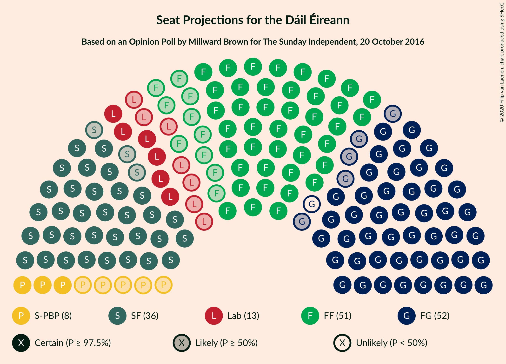
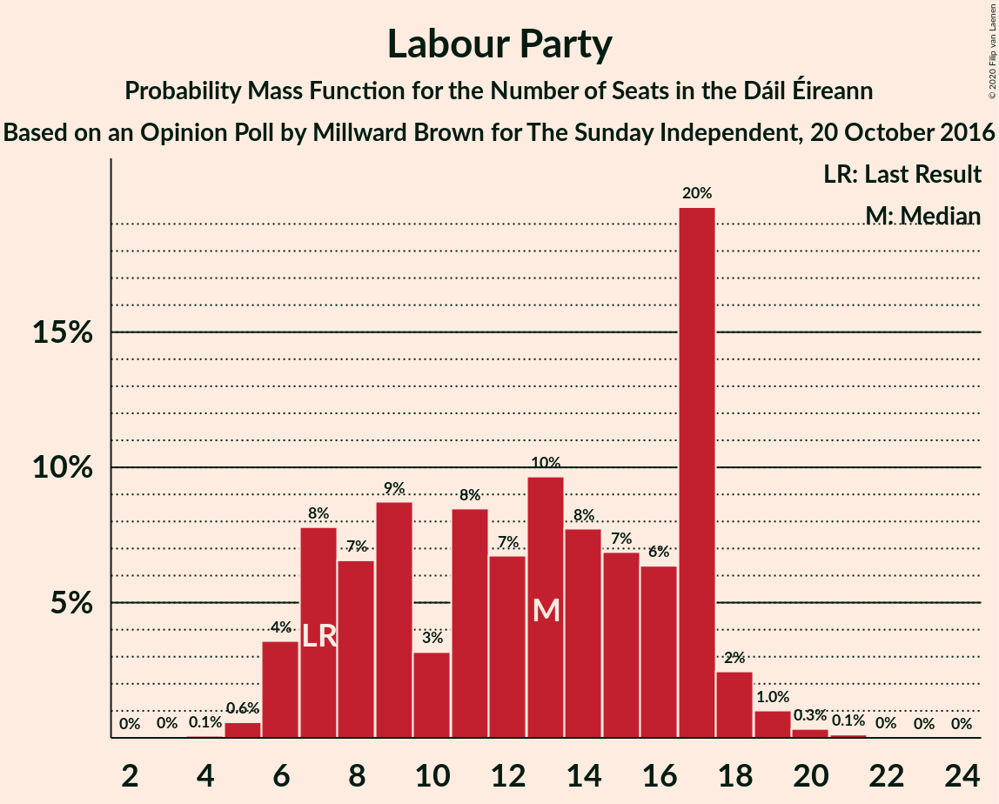
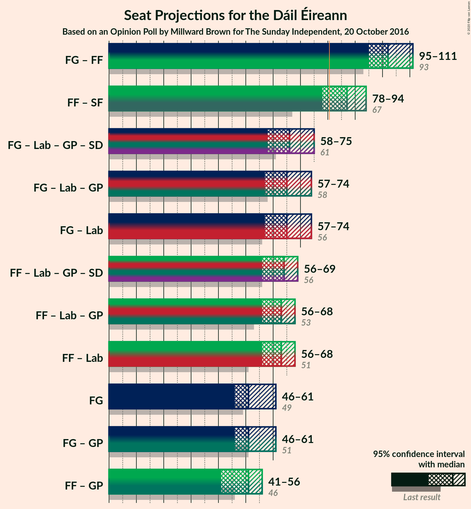

# Opinion Poll by Millward Brown for The Sunday Independent, 20 October 2016

<a href="#voting-intentions">Voting Intentions</a> | <a href="#seats">Seats</a> | <a href="#coalitions">Coalitions</a> | <a href="#technical-information">Technical Information</a>

## Voting Intentions

### Confidence Intervals

| Party | Last Result | Poll Result | 80% Confidence Interval | 90% Confidence Interval | 95% Confidence Interval | 99% Confidence Interval |
|:-----:|:-----------:|:-----------:|:-----------------------:|:-----------------------:|:-----------------------:|:-----------------------:|
| Fine Gael | 25.5% | 29.0% | 27.1–30.9% |26.6–31.5% |26.2–32.0% |25.3–32.9% |
| Fianna Fáil | 24.3% | 27.0% | 25.2–28.9% |24.7–29.4% |24.2–29.9% |23.4–30.8% |
| Sinn Féin | 13.8% | 20.0% | 18.4–21.7% |17.9–22.2% |17.5–22.6% |16.8–23.5% |
| Labour Party | 6.6% | 8.0% | 6.9–9.2% |6.6–9.6% |6.4–9.9% |5.9–10.5% |
| Solidarity–People Before Profit | 3.9% | 5.0% | 4.2–6.0% |4.0–6.3% |3.8–6.6% |3.4–7.1% |
| Independent | 15.9% | 2.5% | 2.0–3.3% |1.8–3.6% |1.7–3.8% |1.5–4.2% |
| Green Party/Comhaontas Glas | 2.7% | 2.0% | 1.5–2.7% |1.4–3.0% |1.3–3.1% |1.1–3.5% |
| Social Democrats | 3.0% | 1.0% | 0.7–1.5% |0.6–1.7% |0.5–1.8% |0.4–2.1% |
| Independents 4 Change | 1.5% | 0.3% | 0.2–0.7% |0.1–0.8% |0.1–0.9% |0.1–1.2% |

*Note:* The poll result column reflects the actual value used in the calculations. Published results may vary slightly, and in addition be rounded to fewer digits.

## Seats

### Confidence Intervals

| Party | Last Result | Median | 80% Confidence Interval | 90% Confidence Interval | 95% Confidence Interval | 99% Confidence Interval |
|:-----:|:-----------:|:------:|:-----------------------:|:-----------------------:|:-----------------------:|:-----------------------:|
| <a href="#fine-gael">Fine Gael</a> | 49 | 50 | 49–56 |46–59 |45–62 |44–63 |
| <a href="#fianna-fáil">Fianna Fáil</a> | 44 | 48 | 46–52 |42–54 |41–55 |40–56 |
| <a href="#sinn-féin">Sinn Féin</a> | 23 | 36 | 35–38 |34–40 |34–41 |32–43 |
| <a href="#labour-party">Labour Party</a> | 7 | 17 | 8–17 |7–17 |6–18 |5–19 |
| <a href="#solidarity–people-before-profit">Solidarity–People Before Profit</a> | 6 | 8 | 5–9 |4–10 |4–10 |3–10 |
| <a href="#independent">Independent</a> | 19 | 0 | 0 |0 |0 |0 |
| <a href="#green-party/comhaontas-glas">Green Party/Comhaontas Glas</a> | 2 | 0 | 0 |0 |0–1 |0–2 |
| <a href="#social-democrats">Social Democrats</a> | 3 | 0 | 0–1 |0–3 |0–3 |0–3 |
| <a href="#independents-4-change">Independents 4 Change</a> | 4 | 0 | 0 |0 |0 |0–1 |

### Fine Gael

*For a full overview of the results for this party, see the [Fine Gael](party-finegael.html) page.*

| Number of Seats | Probability | Accumulated | Special Marks |
|:---------------:|:-----------:|:-----------:|:-------------:|
| 42 | 0.1% | 100% |  |
| 43 | 0.1% | 99.9% |  |
| 44 | 2% | 99.8% |  |
| 45 | 2% | 98% |  |
| 46 | 3% | 96% |  |
| 47 | 0.3% | 93% |  |
| 48 | 2% | 93% |  |
| 49 | 2% | 91% | Last Result |
| 50 | 54% | 89% | Median |
| 51 | 9% | 35% |  |
| 52 | 5% | 26% |  |
| 53 | 5% | 21% |  |
| 54 | 4% | 16% |  |
| 55 | 2% | 13% |  |
| 56 | 0.8% | 11% |  |
| 57 | 1.3% | 10% |  |
| 58 | 3% | 8% |  |
| 59 | 1.0% | 5% |  |
| 60 | 0.8% | 4% |  |
| 61 | 0.2% | 3% |  |
| 62 | 2% | 3% |  |
| 63 | 0.4% | 0.6% |  |
| 64 | 0.1% | 0.3% |  |
| 65 | 0.2% | 0.2% |  |
| 66 | 0% | 0% |  |

### Fianna Fáil

*For a full overview of the results for this party, see the [Fianna Fáil](party-fiannafáil.html) page.*

| Number of Seats | Probability | Accumulated | Special Marks |
|:---------------:|:-----------:|:-----------:|:-------------:|
| 38 | 0.1% | 100% |  |
| 39 | 0.4% | 99.9% |  |
| 40 | 1.1% | 99.5% |  |
| 41 | 2% | 98% |  |
| 42 | 2% | 96% |  |
| 43 | 0.6% | 94% |  |
| 44 | 0.1% | 93% | Last Result |
| 45 | 0.3% | 93% |  |
| 46 | 5% | 93% |  |
| 47 | 3% | 88% |  |
| 48 | 52% | 85% | Median |
| 49 | 7% | 33% |  |
| 50 | 3% | 26% |  |
| 51 | 11% | 23% |  |
| 52 | 3% | 12% |  |
| 53 | 3% | 9% |  |
| 54 | 3% | 5% |  |
| 55 | 1.3% | 3% |  |
| 56 | 1.1% | 1.4% |  |
| 57 | 0.2% | 0.3% |  |
| 58 | 0% | 0.1% |  |
| 59 | 0% | 0% |  |

### Sinn Féin

*For a full overview of the results for this party, see the [Sinn Féin](party-sinnféin.html) page.*

| Number of Seats | Probability | Accumulated | Special Marks |
|:---------------:|:-----------:|:-----------:|:-------------:|
| 23 | 0% | 100% | Last Result |
| 24 | 0% | 100% |  |
| 25 | 0% | 100% |  |
| 26 | 0% | 100% |  |
| 27 | 0% | 100% |  |
| 28 | 0% | 100% |  |
| 29 | 0% | 100% |  |
| 30 | 0% | 100% |  |
| 31 | 0% | 99.9% |  |
| 32 | 1.0% | 99.9% |  |
| 33 | 0.6% | 98.9% |  |
| 34 | 3% | 98% |  |
| 35 | 7% | 95% |  |
| 36 | 65% | 88% | Median |
| 37 | 5% | 23% |  |
| 38 | 8% | 18% |  |
| 39 | 3% | 10% |  |
| 40 | 3% | 7% |  |
| 41 | 3% | 4% |  |
| 42 | 0.3% | 1.0% |  |
| 43 | 0.4% | 0.6% |  |
| 44 | 0.2% | 0.2% |  |
| 45 | 0% | 0% |  |

### Labour Party

*For a full overview of the results for this party, see the [Labour Party](party-labourparty.html) page.*

| Number of Seats | Probability | Accumulated | Special Marks |
|:---------------:|:-----------:|:-----------:|:-------------:|
| 4 | 0.1% | 100% |  |
| 5 | 0.6% | 99.9% |  |
| 6 | 2% | 99.4% |  |
| 7 | 4% | 97% | Last Result |
| 8 | 4% | 92% |  |
| 9 | 0.9% | 89% |  |
| 10 | 3% | 88% |  |
| 11 | 1.3% | 85% |  |
| 12 | 2% | 84% |  |
| 13 | 0.9% | 82% |  |
| 14 | 15% | 81% |  |
| 15 | 6% | 66% |  |
| 16 | 0.5% | 60% |  |
| 17 | 55% | 60% | Median |
| 18 | 2% | 4% |  |
| 19 | 2% | 2% |  |
| 20 | 0.1% | 0.3% |  |
| 21 | 0.1% | 0.2% |  |
| 22 | 0% | 0% |  |

### Solidarity–People Before Profit

*For a full overview of the results for this party, see the [Solidarity–People Before Profit](party-solidarity–peoplebeforeprofit.html) page.*

| Number of Seats | Probability | Accumulated | Special Marks |
|:---------------:|:-----------:|:-----------:|:-------------:|
| 3 | 1.3% | 100% |  |
| 4 | 4% | 98.7% |  |
| 5 | 8% | 94% |  |
| 6 | 2% | 86% | Last Result |
| 7 | 1.4% | 84% |  |
| 8 | 64% | 83% | Median |
| 9 | 10% | 19% |  |
| 10 | 9% | 9% |  |
| 11 | 0% | 0% |  |

### Independent

*For a full overview of the results for this party, see the [Independent](party-independent.html) page.*

| Number of Seats | Probability | Accumulated | Special Marks |
|:---------------:|:-----------:|:-----------:|:-------------:|
| 0 | 100% | 100% | Median |
| 1 | 0% | 0% |  |
| 2 | 0% | 0% |  |
| 3 | 0% | 0% |  |
| 4 | 0% | 0% |  |
| 5 | 0% | 0% |  |
| 6 | 0% | 0% |  |
| 7 | 0% | 0% |  |
| 8 | 0% | 0% |  |
| 9 | 0% | 0% |  |
| 10 | 0% | 0% |  |
| 11 | 0% | 0% |  |
| 12 | 0% | 0% |  |
| 13 | 0% | 0% |  |
| 14 | 0% | 0% |  |
| 15 | 0% | 0% |  |
| 16 | 0% | 0% |  |
| 17 | 0% | 0% |  |
| 18 | 0% | 0% |  |
| 19 | 0% | 0% | Last Result |

### Green Party/Comhaontas Glas

*For a full overview of the results for this party, see the [Green Party/Comhaontas Glas](party-greenpartycomhaontasglas.html) page.*

| Number of Seats | Probability | Accumulated | Special Marks |
|:---------------:|:-----------:|:-----------:|:-------------:|
| 0 | 96% | 100% | Median |
| 1 | 2% | 4% |  |
| 2 | 2% | 2% | Last Result |
| 3 | 0% | 0% |  |

### Social Democrats

*For a full overview of the results for this party, see the [Social Democrats](party-socialdemocrats.html) page.*

| Number of Seats | Probability | Accumulated | Special Marks |
|:---------------:|:-----------:|:-----------:|:-------------:|
| 0 | 83% | 100% | Median |
| 1 | 8% | 17% |  |
| 2 | 2% | 9% |  |
| 3 | 7% | 7% | Last Result |
| 4 | 0% | 0% |  |

### Independents 4 Change

*For a full overview of the results for this party, see the [Independents 4 Change](party-independents4change.html) page.*

| Number of Seats | Probability | Accumulated | Special Marks |
|:---------------:|:-----------:|:-----------:|:-------------:|
| 0 | 98.8% | 100% | Median |
| 1 | 0.8% | 1.2% |  |
| 2 | 0.2% | 0.4% |  |
| 3 | 0.2% | 0.3% |  |
| 4 | 0% | 0% | Last Result |

## Coalitions

### Confidence Intervals

| Coalition | Last Result | Median | Majority? | 80% Confidence Interval | 90% Confidence Interval | 95% Confidence Interval | 99% Confidence Interval |
|:---------:|:-----------:|:------:|:---------:|:-----------------------:|:-----------------------:|:-----------------------:|:-----------------------:|
| Fine Gael – Fianna Fáil | 93 | 98 | 100% | 98–105 | 96–109 | 95–109 | 93–112 |
| Fianna Fáil – Sinn Féin | 67 | 84 | 95% | 82–90 | 80–91 | 78–93 | 76–97 |
| Fine Gael – Labour Party – Green Party/Comhaontas Glas – Social Democrats | 61 | 67 | 0% | 61–69 | 59–73 | 58–76 | 55–76 |
| Fine Gael – Labour Party – Green Party/Comhaontas Glas | 58 | 67 | 0% | 60–68 | 58–73 | 57–76 | 55–76 |
| Fine Gael – Labour Party | 56 | 67 | 0% | 60–68 | 58–72 | 56–76 | 55–76 |
| Fianna Fáil – Labour Party – Green Party/Comhaontas Glas – Social Democrats | 56 | 65 | 0% | 58–65 | 57–68 | 55–69 | 55–70 |
| Fianna Fáil – Labour Party – Green Party/Comhaontas Glas | 53 | 65 | 0% | 58–65 | 57–67 | 55–68 | 54–70 |
| Fianna Fáil – Labour Party | 51 | 65 | 0% | 58–65 | 57–66 | 55–68 | 53–70 |
| Fine Gael | 49 | 50 | 0% | 49–56 | 46–59 | 45–62 | 44–63 |
| Fine Gael – Green Party/Comhaontas Glas | 51 | 50 | 0% | 49–56 | 46–59 | 45–62 | 44–64 |
| Fianna Fáil – Green Party/Comhaontas Glas | 46 | 48 | 0% | 46–52 | 42–54 | 41–55 | 40–56 |

### Fine Gael – Fianna Fáil

| Number of Seats | Probability | Accumulated | Special Marks |
|:---------------:|:-----------:|:-----------:|:-------------:|
| 92 | 0.2% | 100% |  |
| 93 | 0.9% | 99.7% | Last Result |
| 94 | 1.3% | 98.8% |  |
| 95 | 2% | 98% |  |
| 96 | 2% | 95% |  |
| 97 | 2% | 94% |  |
| 98 | 56% | 92% | Median |
| 99 | 3% | 36% |  |
| 100 | 9% | 33% |  |
| 101 | 3% | 24% |  |
| 102 | 1.2% | 21% |  |
| 103 | 5% | 20% |  |
| 104 | 2% | 15% |  |
| 105 | 4% | 13% |  |
| 106 | 1.2% | 9% |  |
| 107 | 0.9% | 7% |  |
| 108 | 0.8% | 6% |  |
| 109 | 4% | 6% |  |
| 110 | 1.1% | 2% |  |
| 111 | 0.1% | 0.7% |  |
| 112 | 0.2% | 0.5% |  |
| 113 | 0.3% | 0.3% |  |
| 114 | 0% | 0% |  |

### Fianna Fáil – Sinn Féin

| Number of Seats | Probability | Accumulated | Special Marks |
|:---------------:|:-----------:|:-----------:|:-------------:|
| 67 | 0% | 100% | Last Result |
| 68 | 0% | 100% |  |
| 69 | 0% | 100% |  |
| 70 | 0% | 100% |  |
| 71 | 0% | 100% |  |
| 72 | 0% | 100% |  |
| 73 | 0% | 100% |  |
| 74 | 0% | 100% |  |
| 75 | 0.4% | 100% |  |
| 76 | 0.5% | 99.6% |  |
| 77 | 0.1% | 99.1% |  |
| 78 | 3% | 99.0% |  |
| 79 | 0.5% | 96% |  |
| 80 | 1.0% | 96% |  |
| 81 | 2% | 95% | Majority |
| 82 | 6% | 93% |  |
| 83 | 3% | 86% |  |
| 84 | 53% | 83% | Median |
| 85 | 5% | 31% |  |
| 86 | 2% | 26% |  |
| 87 | 4% | 24% |  |
| 88 | 4% | 20% |  |
| 89 | 6% | 16% |  |
| 90 | 1.4% | 10% |  |
| 91 | 5% | 9% |  |
| 92 | 0.5% | 4% |  |
| 93 | 1.2% | 4% |  |
| 94 | 0.9% | 2% |  |
| 95 | 0.7% | 1.5% |  |
| 96 | 0.2% | 0.8% |  |
| 97 | 0.3% | 0.6% |  |
| 98 | 0% | 0.3% |  |
| 99 | 0.2% | 0.2% |  |
| 100 | 0.1% | 0.1% |  |
| 101 | 0% | 0% |  |

### Fine Gael – Labour Party – Green Party/Comhaontas Glas – Social Democrats

| Number of Seats | Probability | Accumulated | Special Marks |
|:---------------:|:-----------:|:-----------:|:-------------:|
| 54 | 0.1% | 100% |  |
| 55 | 1.3% | 99.9% |  |
| 56 | 0.2% | 98.6% |  |
| 57 | 0.9% | 98% |  |
| 58 | 2% | 98% |  |
| 59 | 2% | 96% |  |
| 60 | 2% | 93% |  |
| 61 | 2% | 91% | Last Result |
| 62 | 1.4% | 89% |  |
| 63 | 3% | 88% |  |
| 64 | 0.5% | 85% |  |
| 65 | 5% | 85% |  |
| 66 | 6% | 79% |  |
| 67 | 53% | 73% | Median |
| 68 | 8% | 20% |  |
| 69 | 4% | 13% |  |
| 70 | 2% | 8% |  |
| 71 | 0.3% | 7% |  |
| 72 | 0.7% | 6% |  |
| 73 | 0.9% | 6% |  |
| 74 | 0.9% | 5% |  |
| 75 | 1.0% | 4% |  |
| 76 | 3% | 3% |  |
| 77 | 0.1% | 0.2% |  |
| 78 | 0% | 0% |  |

### Fine Gael – Labour Party – Green Party/Comhaontas Glas

| Number of Seats | Probability | Accumulated | Special Marks |
|:---------------:|:-----------:|:-----------:|:-------------:|
| 53 | 0.1% | 100% |  |
| 54 | 0.1% | 99.9% |  |
| 55 | 1.3% | 99.8% |  |
| 56 | 0.3% | 98.6% |  |
| 57 | 1.2% | 98% |  |
| 58 | 4% | 97% | Last Result |
| 59 | 0.7% | 93% |  |
| 60 | 3% | 93% |  |
| 61 | 1.5% | 89% |  |
| 62 | 1.1% | 88% |  |
| 63 | 3% | 87% |  |
| 64 | 0.9% | 84% |  |
| 65 | 11% | 83% |  |
| 66 | 3% | 73% |  |
| 67 | 54% | 69% | Median |
| 68 | 6% | 15% |  |
| 69 | 3% | 10% |  |
| 70 | 0.4% | 6% |  |
| 71 | 0.5% | 6% |  |
| 72 | 0.5% | 6% |  |
| 73 | 1.0% | 5% |  |
| 74 | 0.6% | 4% |  |
| 75 | 0.7% | 4% |  |
| 76 | 3% | 3% |  |
| 77 | 0.1% | 0.1% |  |
| 78 | 0% | 0% |  |

### Fine Gael – Labour Party

| Number of Seats | Probability | Accumulated | Special Marks |
|:---------------:|:-----------:|:-----------:|:-------------:|
| 53 | 0.1% | 100% |  |
| 54 | 0.1% | 99.9% |  |
| 55 | 1.3% | 99.8% |  |
| 56 | 1.2% | 98.5% | Last Result |
| 57 | 0.4% | 97% |  |
| 58 | 4% | 97% |  |
| 59 | 0.8% | 93% |  |
| 60 | 3% | 92% |  |
| 61 | 1.4% | 89% |  |
| 62 | 1.4% | 88% |  |
| 63 | 3% | 87% |  |
| 64 | 0.9% | 84% |  |
| 65 | 12% | 83% |  |
| 66 | 3% | 72% |  |
| 67 | 54% | 69% | Median |
| 68 | 5% | 15% |  |
| 69 | 3% | 10% |  |
| 70 | 0.4% | 6% |  |
| 71 | 0.5% | 6% |  |
| 72 | 0.7% | 6% |  |
| 73 | 0.7% | 5% |  |
| 74 | 0.9% | 4% |  |
| 75 | 0.7% | 3% |  |
| 76 | 2% | 3% |  |
| 77 | 0.1% | 0.1% |  |
| 78 | 0% | 0% |  |

### Fianna Fáil – Labour Party – Green Party/Comhaontas Glas – Social Democrats

| Number of Seats | Probability | Accumulated | Special Marks |
|:---------------:|:-----------:|:-----------:|:-------------:|
| 49 | 0.1% | 100% |  |
| 50 | 0% | 99.9% |  |
| 51 | 0% | 99.9% |  |
| 52 | 0% | 99.9% |  |
| 53 | 0% | 99.8% |  |
| 54 | 0.2% | 99.8% |  |
| 55 | 4% | 99.5% |  |
| 56 | 0.1% | 96% | Last Result |
| 57 | 2% | 96% |  |
| 58 | 5% | 94% |  |
| 59 | 2% | 89% |  |
| 60 | 2% | 87% |  |
| 61 | 3% | 85% |  |
| 62 | 3% | 83% |  |
| 63 | 6% | 80% |  |
| 64 | 7% | 74% |  |
| 65 | 58% | 68% | Median |
| 66 | 2% | 10% |  |
| 67 | 2% | 8% |  |
| 68 | 2% | 6% |  |
| 69 | 2% | 4% |  |
| 70 | 2% | 2% |  |
| 71 | 0.2% | 0.3% |  |
| 72 | 0.1% | 0.1% |  |
| 73 | 0% | 0.1% |  |
| 74 | 0% | 0.1% |  |
| 75 | 0% | 0% |  |

### Fianna Fáil – Labour Party – Green Party/Comhaontas Glas

| Number of Seats | Probability | Accumulated | Special Marks |
|:---------------:|:-----------:|:-----------:|:-------------:|
| 49 | 0.1% | 100% |  |
| 50 | 0% | 99.9% |  |
| 51 | 0% | 99.9% |  |
| 52 | 0.1% | 99.8% |  |
| 53 | 0.1% | 99.8% | Last Result |
| 54 | 0.3% | 99.7% |  |
| 55 | 3% | 99.3% |  |
| 56 | 0.2% | 96% |  |
| 57 | 2% | 96% |  |
| 58 | 5% | 94% |  |
| 59 | 4% | 89% |  |
| 60 | 4% | 85% |  |
| 61 | 3% | 81% |  |
| 62 | 3% | 79% |  |
| 63 | 8% | 76% |  |
| 64 | 2% | 68% |  |
| 65 | 58% | 66% | Median |
| 66 | 3% | 8% |  |
| 67 | 2% | 5% |  |
| 68 | 2% | 3% |  |
| 69 | 0.2% | 2% |  |
| 70 | 1.3% | 1.4% |  |
| 71 | 0% | 0.1% |  |
| 72 | 0.1% | 0.1% |  |
| 73 | 0% | 0% |  |

### Fianna Fáil – Labour Party

| Number of Seats | Probability | Accumulated | Special Marks |
|:---------------:|:-----------:|:-----------:|:-------------:|
| 49 | 0.1% | 100% |  |
| 50 | 0% | 99.9% |  |
| 51 | 0% | 99.9% | Last Result |
| 52 | 0.1% | 99.8% |  |
| 53 | 0.3% | 99.8% |  |
| 54 | 0.4% | 99.4% |  |
| 55 | 3% | 99.0% |  |
| 56 | 0.1% | 96% |  |
| 57 | 2% | 96% |  |
| 58 | 5% | 93% |  |
| 59 | 4% | 88% |  |
| 60 | 4% | 85% |  |
| 61 | 2% | 81% |  |
| 62 | 3% | 79% |  |
| 63 | 9% | 76% |  |
| 64 | 1.0% | 67% |  |
| 65 | 58% | 66% | Median |
| 66 | 3% | 8% |  |
| 67 | 2% | 5% |  |
| 68 | 1.2% | 3% |  |
| 69 | 0.2% | 2% |  |
| 70 | 1.3% | 1.4% |  |
| 71 | 0% | 0.1% |  |
| 72 | 0.1% | 0.1% |  |
| 73 | 0% | 0% |  |

### Fine Gael

| Number of Seats | Probability | Accumulated | Special Marks |
|:---------------:|:-----------:|:-----------:|:-------------:|
| 42 | 0.1% | 100% |  |
| 43 | 0.1% | 99.9% |  |
| 44 | 2% | 99.8% |  |
| 45 | 2% | 98% |  |
| 46 | 3% | 96% |  |
| 47 | 0.3% | 93% |  |
| 48 | 2% | 93% |  |
| 49 | 2% | 91% | Last Result |
| 50 | 54% | 89% | Median |
| 51 | 9% | 35% |  |
| 52 | 5% | 26% |  |
| 53 | 5% | 21% |  |
| 54 | 4% | 16% |  |
| 55 | 2% | 13% |  |
| 56 | 0.8% | 11% |  |
| 57 | 1.3% | 10% |  |
| 58 | 3% | 8% |  |
| 59 | 1.0% | 5% |  |
| 60 | 0.8% | 4% |  |
| 61 | 0.2% | 3% |  |
| 62 | 2% | 3% |  |
| 63 | 0.4% | 0.6% |  |
| 64 | 0.1% | 0.3% |  |
| 65 | 0.2% | 0.2% |  |
| 66 | 0% | 0% |  |

### Fine Gael – Green Party/Comhaontas Glas

| Number of Seats | Probability | Accumulated | Special Marks |
|:---------------:|:-----------:|:-----------:|:-------------:|
| 42 | 0.1% | 100% |  |
| 43 | 0.1% | 99.9% |  |
| 44 | 1.5% | 99.8% |  |
| 45 | 2% | 98% |  |
| 46 | 3% | 96% |  |
| 47 | 0.2% | 93% |  |
| 48 | 2% | 93% |  |
| 49 | 1.3% | 91% |  |
| 50 | 53% | 90% | Median |
| 51 | 10% | 36% | Last Result |
| 52 | 5% | 26% |  |
| 53 | 5% | 22% |  |
| 54 | 4% | 17% |  |
| 55 | 1.1% | 13% |  |
| 56 | 2% | 12% |  |
| 57 | 1.5% | 10% |  |
| 58 | 3% | 9% |  |
| 59 | 0.7% | 5% |  |
| 60 | 0.8% | 4% |  |
| 61 | 0.5% | 4% |  |
| 62 | 2% | 3% |  |
| 63 | 0.1% | 0.6% |  |
| 64 | 0.1% | 0.6% |  |
| 65 | 0.5% | 0.5% |  |
| 66 | 0% | 0% |  |

### Fianna Fáil – Green Party/Comhaontas Glas

| Number of Seats | Probability | Accumulated | Special Marks |
|:---------------:|:-----------:|:-----------:|:-------------:|
| 38 | 0.1% | 100% |  |
| 39 | 0.4% | 99.9% |  |
| 40 | 1.1% | 99.5% |  |
| 41 | 2% | 98% |  |
| 42 | 2% | 96% |  |
| 43 | 0.6% | 94% |  |
| 44 | 0.3% | 94% |  |
| 45 | 0.3% | 93% |  |
| 46 | 4% | 93% | Last Result |
| 47 | 3% | 89% |  |
| 48 | 52% | 85% | Median |
| 49 | 7% | 33% |  |
| 50 | 3% | 27% |  |
| 51 | 11% | 23% |  |
| 52 | 3% | 12% |  |
| 53 | 3% | 9% |  |
| 54 | 3% | 6% |  |
| 55 | 2% | 4% |  |
| 56 | 1.1% | 1.4% |  |
| 57 | 0.2% | 0.3% |  |
| 58 | 0.1% | 0.1% |  |
| 59 | 0% | 0% |  |

## Technical Information

### Opinion Poll

+ **Polling firm:** Millward Brown
+ **Commissioner(s):** The Sunday Independent
+ **Fieldwork period:** 20 October 2016

### Calculations

+ **Sample size:** 942
+ **Simulations done:** 131,072
+ **Error estimate:** 2.03%

