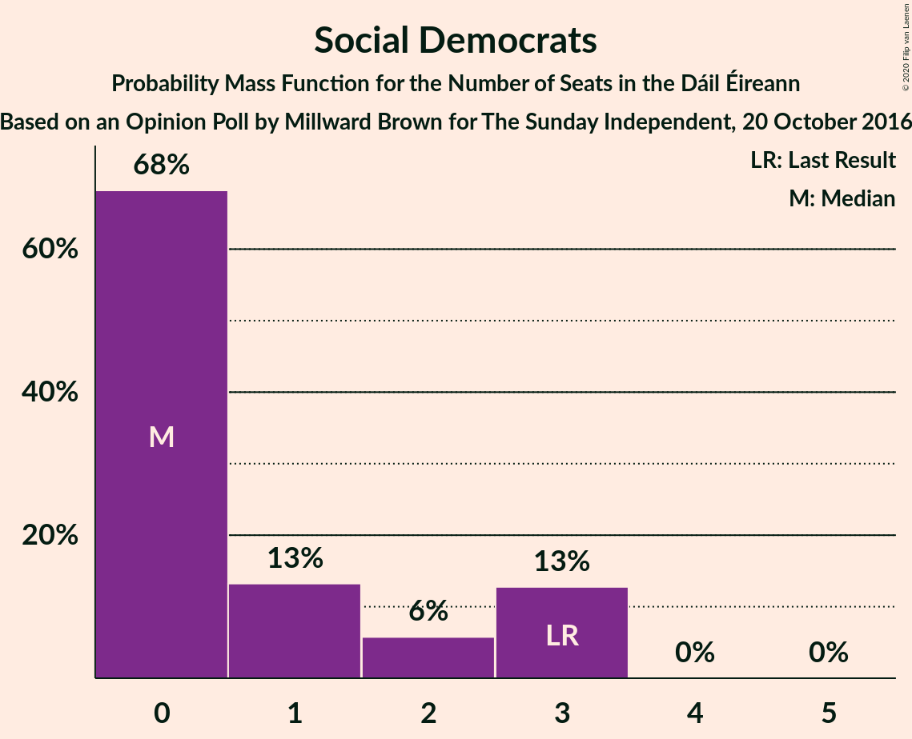

# Opinion Poll by Millward Brown for The Sunday Independent, 20 October 2016

<a href="#voting-intentions">Voting Intentions</a> | <a href="#seats">Seats</a> | <a href="#coalitions">Coalitions</a> | <a href="#technical-information">Technical Information</a>

## Voting Intentions

### Confidence Intervals

| Party | Last Result | Poll Result | 80% Confidence Interval | 90% Confidence Interval | 95% Confidence Interval | 99% Confidence Interval |
|:-----:|:-----------:|:-----------:|:-----------------------:|:-----------------------:|:-----------------------:|:-----------------------:|
| Fine Gael | 25.5% | 29.0% | 27.1–30.9% |26.6–31.5% |26.2–32.0% |25.3–32.9% |
| Fianna Fáil | 24.3% | 27.0% | 25.2–28.9% |24.7–29.4% |24.2–29.9% |23.4–30.8% |
| Sinn Féin | 13.8% | 20.0% | 18.4–21.7% |17.9–22.2% |17.5–22.6% |16.8–23.5% |
| Labour Party | 6.6% | 8.0% | 6.9–9.2% |6.6–9.6% |6.4–9.9% |5.9–10.5% |
| Solidarity–People Before Profit | 3.9% | 5.0% | 4.2–6.0% |4.0–6.3% |3.8–6.6% |3.4–7.1% |
| Independent | 15.9% | 2.5% | 2.0–3.3% |1.8–3.6% |1.7–3.8% |1.5–4.2% |
| Green Party/Comhaontas Glas | 2.7% | 2.0% | 1.5–2.7% |1.4–3.0% |1.3–3.1% |1.1–3.5% |
| Social Democrats | 3.0% | 1.0% | 0.7–1.5% |0.6–1.7% |0.5–1.8% |0.4–2.1% |
| Independents 4 Change | 1.5% | 0.3% | 0.2–0.7% |0.1–0.8% |0.1–0.9% |0.1–1.2% |

*Note:* The poll result column reflects the actual value used in the calculations. Published results may vary slightly, and in addition be rounded to fewer digits.

## Seats

### Confidence Intervals

| Party | Last Result | Median | 80% Confidence Interval | 90% Confidence Interval | 95% Confidence Interval | 99% Confidence Interval |
|:-----:|:-----------:|:------:|:-----------------------:|:-----------------------:|:-----------------------:|:-----------------------:|
| <a href="#fine-gael">Fine Gael</a> | 49 | 51 | 47–57 |46–59 |46–62 |44–63 |
| <a href="#fianna-fáil">Fianna Fáil</a> | 44 | 50 | 46–54 |43–54 |41–56 |40–57 |
| <a href="#sinn-féin">Sinn Féin</a> | 23 | 36 | 34–40 |33–41 |33–42 |31–43 |
| <a href="#labour-party">Labour Party</a> | 7 | 14 | 7–17 |7–17 |6–18 |5–19 |
| <a href="#solidarity–people-before-profit">Solidarity–People Before Profit</a> | 6 | 8 | 3–10 |3–10 |3–10 |3–10 |
| <a href="#independent">Independent</a> | 19 | 0 | 0 |0 |0 |0 |
| <a href="#green-party/comhaontas-glas">Green Party/Comhaontas Glas</a> | 2 | 0 | 0 |0–1 |0–1 |0–2 |
| <a href="#social-democrats">Social Democrats</a> | 3 | 0 | 0–2 |0–3 |0–3 |0–3 |
| <a href="#independents-4-change">Independents 4 Change</a> | 4 | 0 | 0 |0 |0 |0–1 |

### Fine Gael

*For a full overview of the results for this party, see the [Fine Gael](party-finegael.html) page.*

| Number of Seats | Probability | Accumulated | Special Marks |
|:---------------:|:-----------:|:-----------:|:-------------:|
| 42 | 0.1% | 100% |  |
| 43 | 0.2% | 99.9% |  |
| 44 | 0.7% | 99.7% |  |
| 45 | 1.2% | 99.0% |  |
| 46 | 8% | 98% |  |
| 47 | 2% | 90% |  |
| 48 | 4% | 88% |  |
| 49 | 3% | 85% | Last Result |
| 50 | 24% | 81% |  |
| 51 | 10% | 57% | Median |
| 52 | 9% | 47% |  |
| 53 | 5% | 38% |  |
| 54 | 13% | 33% |  |
| 55 | 5% | 20% |  |
| 56 | 3% | 15% |  |
| 57 | 5% | 13% |  |
| 58 | 3% | 8% |  |
| 59 | 1.2% | 5% |  |
| 60 | 1.1% | 4% |  |
| 61 | 0.5% | 3% |  |
| 62 | 2% | 3% |  |
| 63 | 0.5% | 0.7% |  |
| 64 | 0.1% | 0.2% |  |
| 65 | 0.2% | 0.2% |  |
| 66 | 0% | 0% |  |

### Fianna Fáil

*For a full overview of the results for this party, see the [Fianna Fáil](party-fiannafáil.html) page.*

| Number of Seats | Probability | Accumulated | Special Marks |
|:---------------:|:-----------:|:-----------:|:-------------:|
| 38 | 0.1% | 100% |  |
| 39 | 0.4% | 99.9% |  |
| 40 | 0.9% | 99.5% |  |
| 41 | 2% | 98.6% |  |
| 42 | 1.3% | 96% |  |
| 43 | 0.7% | 95% |  |
| 44 | 0.3% | 94% | Last Result |
| 45 | 0.8% | 94% |  |
| 46 | 3% | 93% |  |
| 47 | 6% | 90% |  |
| 48 | 23% | 84% |  |
| 49 | 8% | 61% |  |
| 50 | 7% | 53% | Median |
| 51 | 12% | 45% |  |
| 52 | 8% | 34% |  |
| 53 | 14% | 26% |  |
| 54 | 8% | 12% |  |
| 55 | 1.1% | 4% |  |
| 56 | 2% | 3% |  |
| 57 | 0.3% | 0.5% |  |
| 58 | 0.2% | 0.2% |  |
| 59 | 0% | 0% |  |

### Sinn Féin

*For a full overview of the results for this party, see the [Sinn Féin](party-sinnféin.html) page.*

| Number of Seats | Probability | Accumulated | Special Marks |
|:---------------:|:-----------:|:-----------:|:-------------:|
| 23 | 0% | 100% | Last Result |
| 24 | 0% | 100% |  |
| 25 | 0% | 100% |  |
| 26 | 0% | 100% |  |
| 27 | 0% | 100% |  |
| 28 | 0.1% | 100% |  |
| 29 | 0.1% | 99.9% |  |
| 30 | 0.1% | 99.8% |  |
| 31 | 0.2% | 99.7% |  |
| 32 | 2% | 99.5% |  |
| 33 | 3% | 98% |  |
| 34 | 8% | 95% |  |
| 35 | 16% | 87% |  |
| 36 | 33% | 71% | Median |
| 37 | 6% | 37% |  |
| 38 | 12% | 31% |  |
| 39 | 3% | 20% |  |
| 40 | 10% | 16% |  |
| 41 | 3% | 6% |  |
| 42 | 2% | 3% |  |
| 43 | 0.4% | 0.5% |  |
| 44 | 0.1% | 0.1% |  |
| 45 | 0% | 0% |  |

### Labour Party

*For a full overview of the results for this party, see the [Labour Party](party-labourparty.html) page.*

| Number of Seats | Probability | Accumulated | Special Marks |
|:---------------:|:-----------:|:-----------:|:-------------:|
| 4 | 0.1% | 100% |  |
| 5 | 0.7% | 99.9% |  |
| 6 | 4% | 99.1% |  |
| 7 | 7% | 95% | Last Result |
| 8 | 3% | 88% |  |
| 9 | 12% | 85% |  |
| 10 | 3% | 73% |  |
| 11 | 2% | 70% |  |
| 12 | 4% | 68% |  |
| 13 | 9% | 64% |  |
| 14 | 9% | 54% | Median |
| 15 | 11% | 45% |  |
| 16 | 3% | 34% |  |
| 17 | 27% | 31% |  |
| 18 | 2% | 4% |  |
| 19 | 1.4% | 2% |  |
| 20 | 0.3% | 0.4% |  |
| 21 | 0.1% | 0.2% |  |
| 22 | 0.1% | 0.1% |  |
| 23 | 0% | 0% |  |

### Solidarity–People Before Profit

*For a full overview of the results for this party, see the [Solidarity–People Before Profit](party-solidarity–peoplebeforeprofit.html) page.*

| Number of Seats | Probability | Accumulated | Special Marks |
|:---------------:|:-----------:|:-----------:|:-------------:|
| 3 | 10% | 100% |  |
| 4 | 3% | 90% |  |
| 5 | 12% | 86% |  |
| 6 | 7% | 75% | Last Result |
| 7 | 2% | 68% |  |
| 8 | 41% | 65% | Median |
| 9 | 13% | 24% |  |
| 10 | 11% | 11% |  |
| 11 | 0% | 0% |  |

### Independent

*For a full overview of the results for this party, see the [Independent](party-independent.html) page.*

| Number of Seats | Probability | Accumulated | Special Marks |
|:---------------:|:-----------:|:-----------:|:-------------:|
| 0 | 100% | 100% | Median |
| 1 | 0% | 0% |  |
| 2 | 0% | 0% |  |
| 3 | 0% | 0% |  |
| 4 | 0% | 0% |  |
| 5 | 0% | 0% |  |
| 6 | 0% | 0% |  |
| 7 | 0% | 0% |  |
| 8 | 0% | 0% |  |
| 9 | 0% | 0% |  |
| 10 | 0% | 0% |  |
| 11 | 0% | 0% |  |
| 12 | 0% | 0% |  |
| 13 | 0% | 0% |  |
| 14 | 0% | 0% |  |
| 15 | 0% | 0% |  |
| 16 | 0% | 0% |  |
| 17 | 0% | 0% |  |
| 18 | 0% | 0% |  |
| 19 | 0% | 0% | Last Result |

### Green Party/Comhaontas Glas

*For a full overview of the results for this party, see the [Green Party/Comhaontas Glas](party-greenpartycomhaontasglas.html) page.*

| Number of Seats | Probability | Accumulated | Special Marks |
|:---------------:|:-----------:|:-----------:|:-------------:|
| 0 | 93% | 100% | Median |
| 1 | 4% | 7% |  |
| 2 | 2% | 2% | Last Result |
| 3 | 0% | 0% |  |

### Social Democrats

*For a full overview of the results for this party, see the [Social Democrats](party-socialdemocrats.html) page.*

| Number of Seats | Probability | Accumulated | Special Marks |
|:---------------:|:-----------:|:-----------:|:-------------:|
| 0 | 71% | 100% | Median |
| 1 | 15% | 29% |  |
| 2 | 5% | 14% |  |
| 3 | 9% | 9% | Last Result |
| 4 | 0% | 0% |  |

### Independents 4 Change

*For a full overview of the results for this party, see the [Independents 4 Change](party-independents4change.html) page.*

| Number of Seats | Probability | Accumulated | Special Marks |
|:---------------:|:-----------:|:-----------:|:-------------:|
| 0 | 98% | 100% | Median |
| 1 | 2% | 2% |  |
| 2 | 0.1% | 0.3% |  |
| 3 | 0.1% | 0.2% |  |
| 4 | 0.1% | 0.1% | Last Result |
| 5 | 0% | 0% |  |

## Coalitions

### Confidence Intervals

| Coalition | Last Result | Median | Majority? | 80% Confidence Interval | 90% Confidence Interval | 95% Confidence Interval | 99% Confidence Interval |
|:---------:|:-----------:|:------:|:---------:|:-----------------------:|:-----------------------:|:-----------------------:|:-----------------------:|
| Fine Gael – Fianna Fáil | 93 | 101 | 100% | 98–107 | 97–109 | 95–110 | 92–112 |
| Fianna Fáil – Sinn Féin | 67 | 86 | 95% | 82–93 | 81–93 | 78–94 | 76–97 |
| Fine Gael – Labour Party – Green Party/Comhaontas Glas | 58 | 65 | 0% | 59–70 | 58–72 | 57–75 | 55–76 |
| Fine Gael – Labour Party – Green Party/Comhaontas Glas – Social Democrats | 61 | 67 | 0% | 60–71 | 59–72 | 57–75 | 55–77 |
| Fine Gael – Labour Party | 56 | 65 | 0% | 59–70 | 58–72 | 56–74 | 55–76 |
| Fianna Fáil – Labour Party – Green Party/Comhaontas Glas – Social Democrats | 56 | 64 | 0% | 59–68 | 57–68 | 55–69 | 53–71 |
| Fianna Fáil – Labour Party – Green Party/Comhaontas Glas | 53 | 64 | 0% | 58–67 | 57–67 | 55–68 | 52–70 |
| Fianna Fáil – Labour Party | 51 | 64 | 0% | 58–67 | 57–67 | 55–68 | 52–70 |
| Fine Gael | 49 | 51 | 0% | 47–57 | 46–59 | 46–62 | 44–63 |
| Fine Gael – Green Party/Comhaontas Glas | 51 | 51 | 0% | 47–57 | 46–59 | 46–62 | 44–63 |
| Fianna Fáil – Green Party/Comhaontas Glas | 46 | 50 | 0% | 47–54 | 43–54 | 41–56 | 40–57 |

### Fine Gael – Fianna Fáil

| Number of Seats | Probability | Accumulated | Special Marks |
|:---------------:|:-----------:|:-----------:|:-------------:|
| 91 | 0% | 100% |  |
| 92 | 0.4% | 99.9% |  |
| 93 | 0.7% | 99.5% | Last Result |
| 94 | 0.7% | 98.8% |  |
| 95 | 1.4% | 98% |  |
| 96 | 2% | 97% |  |
| 97 | 4% | 95% |  |
| 98 | 23% | 91% |  |
| 99 | 3% | 68% |  |
| 100 | 14% | 65% |  |
| 101 | 7% | 51% | Median |
| 102 | 4% | 44% |  |
| 103 | 6% | 40% |  |
| 104 | 6% | 34% |  |
| 105 | 6% | 28% |  |
| 106 | 4% | 22% |  |
| 107 | 9% | 18% |  |
| 108 | 2% | 9% |  |
| 109 | 4% | 7% |  |
| 110 | 0.9% | 3% |  |
| 111 | 1.1% | 2% |  |
| 112 | 0.5% | 0.9% |  |
| 113 | 0.4% | 0.4% |  |
| 114 | 0% | 0.1% |  |
| 115 | 0% | 0% |  |

### Fianna Fáil – Sinn Féin

| Number of Seats | Probability | Accumulated | Special Marks |
|:---------------:|:-----------:|:-----------:|:-------------:|
| 67 | 0% | 100% | Last Result |
| 68 | 0% | 100% |  |
| 69 | 0% | 100% |  |
| 70 | 0% | 100% |  |
| 71 | 0% | 100% |  |
| 72 | 0% | 100% |  |
| 73 | 0% | 100% |  |
| 74 | 0.1% | 100% |  |
| 75 | 0.2% | 99.9% |  |
| 76 | 0.8% | 99.7% |  |
| 77 | 1.0% | 98.9% |  |
| 78 | 1.3% | 98% |  |
| 79 | 0.6% | 97% |  |
| 80 | 1.0% | 96% |  |
| 81 | 2% | 95% | Majority |
| 82 | 6% | 93% |  |
| 83 | 4% | 88% |  |
| 84 | 28% | 84% |  |
| 85 | 6% | 56% |  |
| 86 | 5% | 50% | Median |
| 87 | 6% | 45% |  |
| 88 | 8% | 39% |  |
| 89 | 9% | 31% |  |
| 90 | 3% | 22% |  |
| 91 | 3% | 19% |  |
| 92 | 6% | 16% |  |
| 93 | 7% | 10% |  |
| 94 | 0.9% | 3% |  |
| 95 | 0.5% | 2% |  |
| 96 | 0.2% | 2% |  |
| 97 | 1.0% | 1.3% |  |
| 98 | 0% | 0.3% |  |
| 99 | 0.2% | 0.3% |  |
| 100 | 0% | 0% |  |

### Fine Gael – Labour Party – Green Party/Comhaontas Glas

| Number of Seats | Probability | Accumulated | Special Marks |
|:---------------:|:-----------:|:-----------:|:-------------:|
| 54 | 0.1% | 100% |  |
| 55 | 0.8% | 99.8% |  |
| 56 | 1.1% | 99.1% |  |
| 57 | 2% | 98% |  |
| 58 | 2% | 96% | Last Result |
| 59 | 5% | 94% |  |
| 60 | 5% | 89% |  |
| 61 | 5% | 85% |  |
| 62 | 5% | 80% |  |
| 63 | 11% | 75% |  |
| 64 | 6% | 64% |  |
| 65 | 9% | 58% | Median |
| 66 | 4% | 50% |  |
| 67 | 27% | 46% |  |
| 68 | 4% | 19% |  |
| 69 | 4% | 15% |  |
| 70 | 2% | 11% |  |
| 71 | 2% | 9% |  |
| 72 | 4% | 8% |  |
| 73 | 0.7% | 4% |  |
| 74 | 0.8% | 3% |  |
| 75 | 0.7% | 3% |  |
| 76 | 1.4% | 2% |  |
| 77 | 0.4% | 0.5% |  |
| 78 | 0% | 0.1% |  |
| 79 | 0% | 0% |  |

### Fine Gael – Labour Party – Green Party/Comhaontas Glas – Social Democrats

| Number of Seats | Probability | Accumulated | Special Marks |
|:---------------:|:-----------:|:-----------:|:-------------:|
| 54 | 0.1% | 100% |  |
| 55 | 0.7% | 99.9% |  |
| 56 | 1.1% | 99.2% |  |
| 57 | 1.0% | 98% |  |
| 58 | 1.3% | 97% |  |
| 59 | 2% | 96% |  |
| 60 | 5% | 94% |  |
| 61 | 3% | 88% | Last Result |
| 62 | 6% | 85% |  |
| 63 | 11% | 79% |  |
| 64 | 5% | 67% |  |
| 65 | 7% | 63% | Median |
| 66 | 5% | 56% |  |
| 67 | 28% | 50% |  |
| 68 | 5% | 22% |  |
| 69 | 5% | 17% |  |
| 70 | 2% | 13% |  |
| 71 | 2% | 11% |  |
| 72 | 4% | 9% |  |
| 73 | 0.8% | 5% |  |
| 74 | 0.5% | 4% |  |
| 75 | 1.1% | 3% |  |
| 76 | 1.4% | 2% |  |
| 77 | 0.6% | 0.9% |  |
| 78 | 0.2% | 0.3% |  |
| 79 | 0% | 0.1% |  |
| 80 | 0% | 0% |  |

### Fine Gael – Labour Party

| Number of Seats | Probability | Accumulated | Special Marks |
|:---------------:|:-----------:|:-----------:|:-------------:|
| 53 | 0.1% | 100% |  |
| 54 | 0.1% | 99.9% |  |
| 55 | 0.9% | 99.8% |  |
| 56 | 2% | 98.9% | Last Result |
| 57 | 1.1% | 97% |  |
| 58 | 2% | 96% |  |
| 59 | 5% | 94% |  |
| 60 | 5% | 89% |  |
| 61 | 5% | 84% |  |
| 62 | 6% | 79% |  |
| 63 | 10% | 74% |  |
| 64 | 7% | 64% |  |
| 65 | 8% | 56% | Median |
| 66 | 3% | 49% |  |
| 67 | 27% | 45% |  |
| 68 | 4% | 19% |  |
| 69 | 4% | 15% |  |
| 70 | 2% | 11% |  |
| 71 | 2% | 9% |  |
| 72 | 4% | 8% |  |
| 73 | 0.6% | 4% |  |
| 74 | 0.9% | 3% |  |
| 75 | 0.7% | 2% |  |
| 76 | 1.3% | 2% |  |
| 77 | 0.4% | 0.5% |  |
| 78 | 0% | 0.1% |  |
| 79 | 0% | 0% |  |

### Fianna Fáil – Labour Party – Green Party/Comhaontas Glas – Social Democrats

| Number of Seats | Probability | Accumulated | Special Marks |
|:---------------:|:-----------:|:-----------:|:-------------:|
| 49 | 0.1% | 100% |  |
| 50 | 0% | 99.9% |  |
| 51 | 0% | 99.9% |  |
| 52 | 0.3% | 99.9% |  |
| 53 | 0.4% | 99.6% |  |
| 54 | 0.3% | 99.1% |  |
| 55 | 2% | 98.9% |  |
| 56 | 1.3% | 97% | Last Result |
| 57 | 2% | 96% |  |
| 58 | 3% | 94% |  |
| 59 | 3% | 91% |  |
| 60 | 4% | 87% |  |
| 61 | 3% | 83% |  |
| 62 | 14% | 80% |  |
| 63 | 6% | 65% |  |
| 64 | 10% | 60% | Median |
| 65 | 28% | 50% |  |
| 66 | 6% | 22% |  |
| 67 | 5% | 16% |  |
| 68 | 6% | 10% |  |
| 69 | 2% | 5% |  |
| 70 | 2% | 2% |  |
| 71 | 0.3% | 0.7% |  |
| 72 | 0.2% | 0.4% |  |
| 73 | 0.1% | 0.2% |  |
| 74 | 0% | 0.1% |  |
| 75 | 0% | 0% |  |

### Fianna Fáil – Labour Party – Green Party/Comhaontas Glas

| Number of Seats | Probability | Accumulated | Special Marks |
|:---------------:|:-----------:|:-----------:|:-------------:|
| 49 | 0.1% | 100% |  |
| 50 | 0% | 99.9% |  |
| 51 | 0.1% | 99.9% |  |
| 52 | 0.5% | 99.8% |  |
| 53 | 0.5% | 99.3% | Last Result |
| 54 | 0.4% | 98.8% |  |
| 55 | 2% | 98% |  |
| 56 | 1.4% | 97% |  |
| 57 | 2% | 95% |  |
| 58 | 5% | 94% |  |
| 59 | 4% | 89% |  |
| 60 | 7% | 85% |  |
| 61 | 4% | 78% |  |
| 62 | 13% | 74% |  |
| 63 | 8% | 61% |  |
| 64 | 8% | 53% | Median |
| 65 | 29% | 45% |  |
| 66 | 4% | 16% |  |
| 67 | 8% | 12% |  |
| 68 | 1.4% | 4% |  |
| 69 | 0.8% | 2% |  |
| 70 | 1.4% | 2% |  |
| 71 | 0.1% | 0.3% |  |
| 72 | 0.1% | 0.2% |  |
| 73 | 0.1% | 0.1% |  |
| 74 | 0% | 0% |  |

### Fianna Fáil – Labour Party

| Number of Seats | Probability | Accumulated | Special Marks |
|:---------------:|:-----------:|:-----------:|:-------------:|
| 49 | 0.1% | 100% |  |
| 50 | 0.1% | 99.9% |  |
| 51 | 0.1% | 99.9% | Last Result |
| 52 | 0.5% | 99.7% |  |
| 53 | 0.6% | 99.2% |  |
| 54 | 0.4% | 98.6% |  |
| 55 | 1.4% | 98% |  |
| 56 | 2% | 97% |  |
| 57 | 2% | 95% |  |
| 58 | 5% | 93% |  |
| 59 | 4% | 88% |  |
| 60 | 8% | 85% |  |
| 61 | 3% | 77% |  |
| 62 | 15% | 74% |  |
| 63 | 7% | 59% |  |
| 64 | 8% | 52% | Median |
| 65 | 28% | 44% |  |
| 66 | 4% | 16% |  |
| 67 | 8% | 12% |  |
| 68 | 1.2% | 3% |  |
| 69 | 0.6% | 2% |  |
| 70 | 1.4% | 2% |  |
| 71 | 0.1% | 0.3% |  |
| 72 | 0.1% | 0.2% |  |
| 73 | 0.1% | 0.1% |  |
| 74 | 0% | 0% |  |

### Fine Gael

| Number of Seats | Probability | Accumulated | Special Marks |
|:---------------:|:-----------:|:-----------:|:-------------:|
| 42 | 0.1% | 100% |  |
| 43 | 0.2% | 99.9% |  |
| 44 | 0.7% | 99.7% |  |
| 45 | 1.2% | 99.0% |  |
| 46 | 8% | 98% |  |
| 47 | 2% | 90% |  |
| 48 | 4% | 88% |  |
| 49 | 3% | 85% | Last Result |
| 50 | 24% | 81% |  |
| 51 | 10% | 57% | Median |
| 52 | 9% | 47% |  |
| 53 | 5% | 38% |  |
| 54 | 13% | 33% |  |
| 55 | 5% | 20% |  |
| 56 | 3% | 15% |  |
| 57 | 5% | 13% |  |
| 58 | 3% | 8% |  |
| 59 | 1.2% | 5% |  |
| 60 | 1.1% | 4% |  |
| 61 | 0.5% | 3% |  |
| 62 | 2% | 3% |  |
| 63 | 0.5% | 0.7% |  |
| 64 | 0.1% | 0.2% |  |
| 65 | 0.2% | 0.2% |  |
| 66 | 0% | 0% |  |

### Fine Gael – Green Party/Comhaontas Glas

| Number of Seats | Probability | Accumulated | Special Marks |
|:---------------:|:-----------:|:-----------:|:-------------:|
| 42 | 0.1% | 100% |  |
| 43 | 0.2% | 99.9% |  |
| 44 | 0.6% | 99.7% |  |
| 45 | 1.1% | 99.1% |  |
| 46 | 7% | 98% |  |
| 47 | 2% | 91% |  |
| 48 | 4% | 89% |  |
| 49 | 3% | 85% |  |
| 50 | 24% | 81% |  |
| 51 | 9% | 58% | Last Result, Median |
| 52 | 10% | 49% |  |
| 53 | 4% | 39% |  |
| 54 | 14% | 34% |  |
| 55 | 4% | 20% |  |
| 56 | 3% | 16% |  |
| 57 | 5% | 13% |  |
| 58 | 3% | 8% |  |
| 59 | 1.1% | 5% |  |
| 60 | 1.1% | 4% |  |
| 61 | 0.6% | 3% |  |
| 62 | 2% | 3% |  |
| 63 | 0.4% | 0.7% |  |
| 64 | 0.1% | 0.3% |  |
| 65 | 0.2% | 0.3% |  |
| 66 | 0% | 0.1% |  |
| 67 | 0% | 0% |  |

### Fianna Fáil – Green Party/Comhaontas Glas

| Number of Seats | Probability | Accumulated | Special Marks |
|:---------------:|:-----------:|:-----------:|:-------------:|
| 38 | 0.1% | 100% |  |
| 39 | 0.4% | 99.9% |  |
| 40 | 0.9% | 99.5% |  |
| 41 | 2% | 98.6% |  |
| 42 | 1.2% | 96% |  |
| 43 | 0.6% | 95% |  |
| 44 | 0.4% | 95% |  |
| 45 | 0.7% | 94% |  |
| 46 | 3% | 94% | Last Result |
| 47 | 6% | 90% |  |
| 48 | 23% | 84% |  |
| 49 | 7% | 62% |  |
| 50 | 8% | 55% | Median |
| 51 | 12% | 47% |  |
| 52 | 8% | 34% |  |
| 53 | 13% | 26% |  |
| 54 | 9% | 13% |  |
| 55 | 2% | 5% |  |
| 56 | 2% | 3% |  |
| 57 | 0.3% | 0.7% |  |
| 58 | 0.3% | 0.4% |  |
| 59 | 0% | 0.1% |  |
| 60 | 0% | 0% |  |

## Technical Information

### Opinion Poll

+ **Polling firm:** Millward Brown
+ **Commissioner(s):** The Sunday Independent
+ **Fieldwork period:** 20 October 2016

### Calculations

+ **Sample size:** 942
+ **Simulations done:** 524,288
+ **Error estimate:** 2.24%

