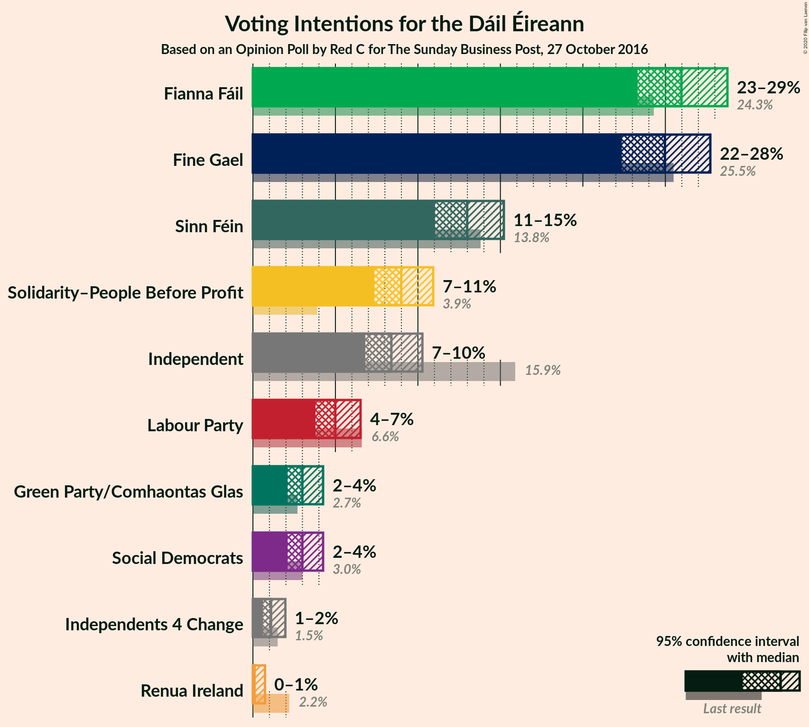
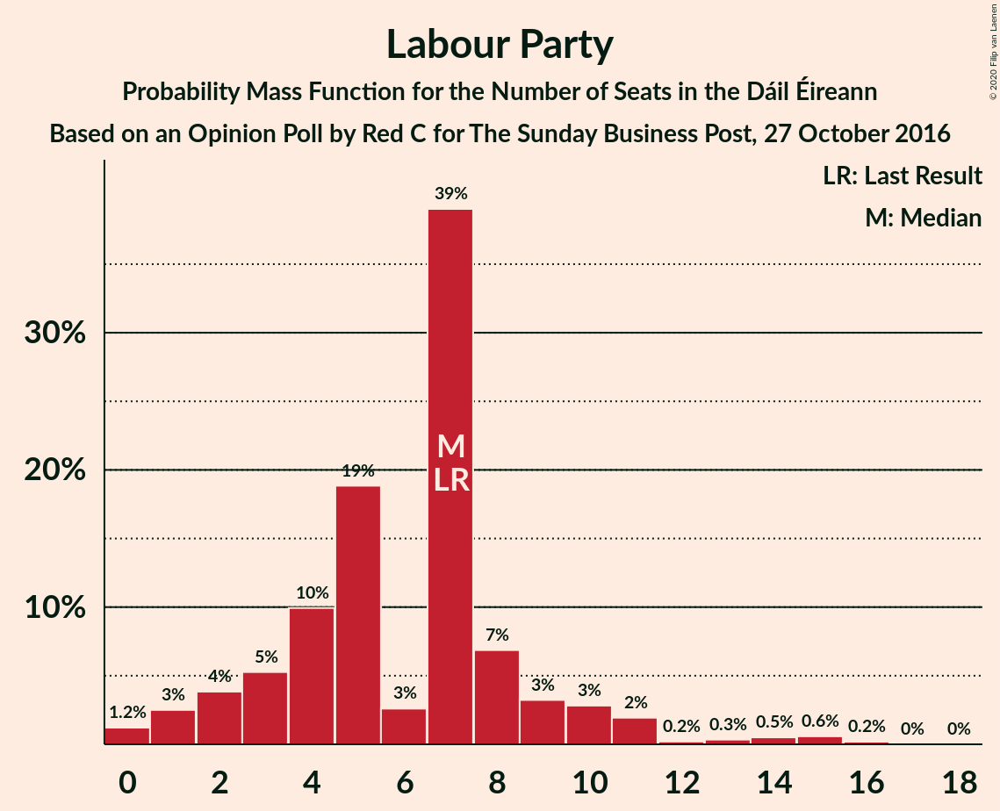
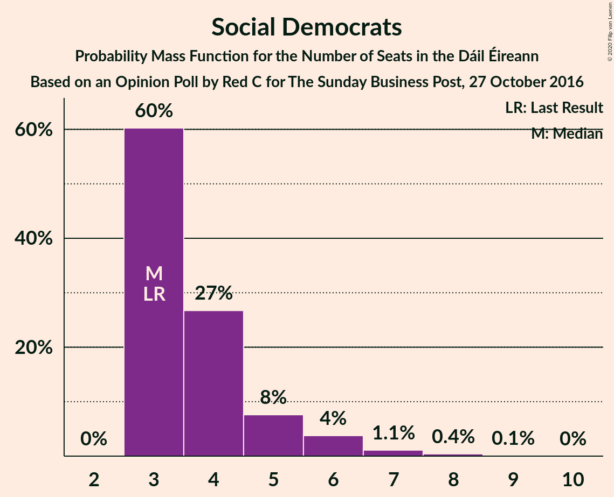
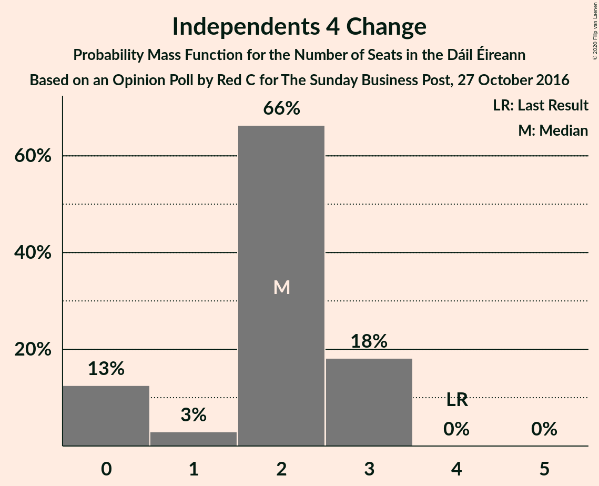
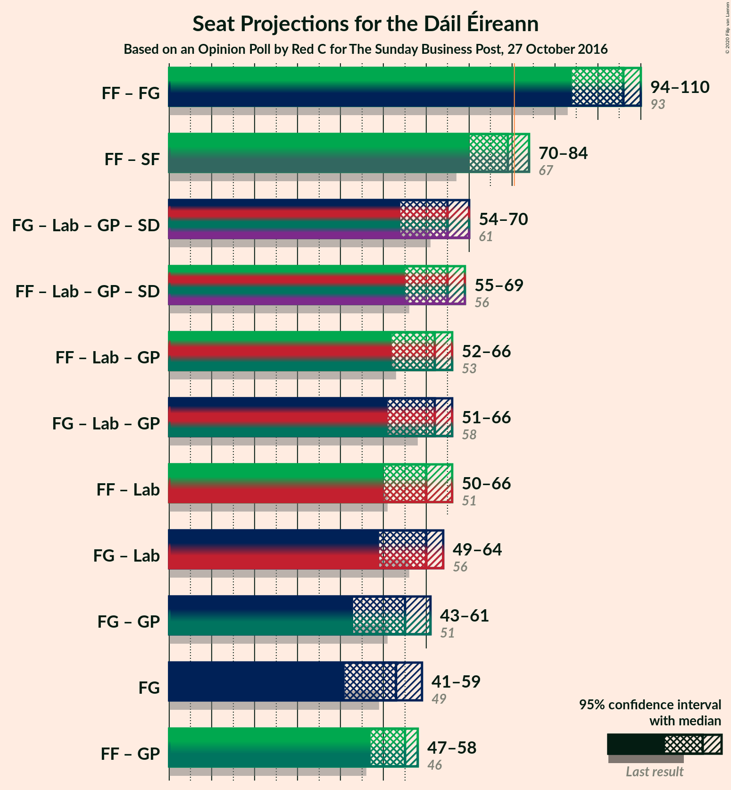
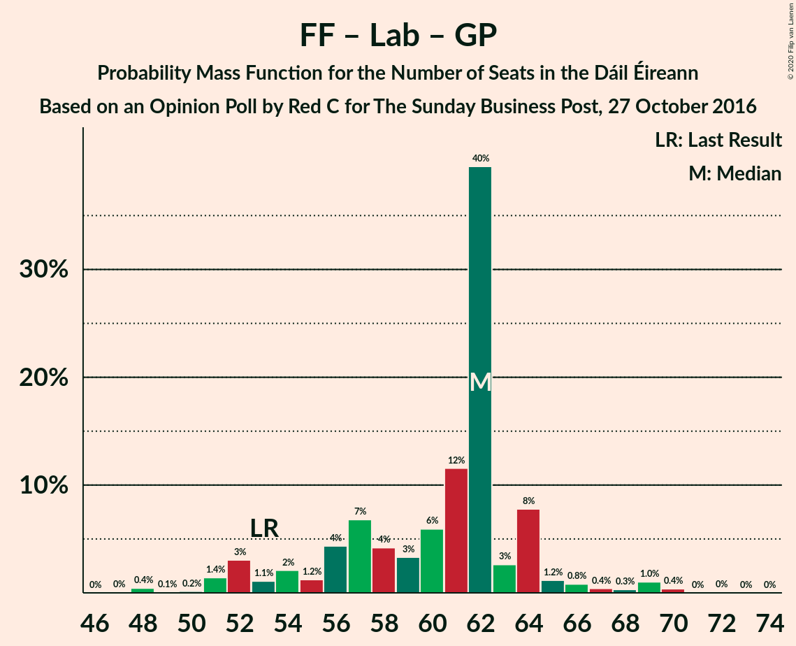
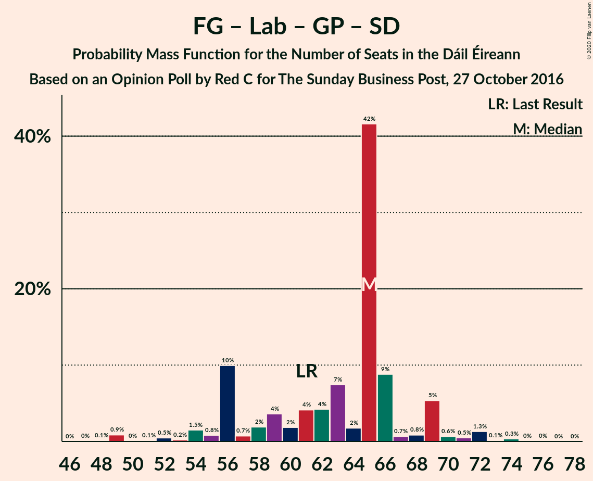
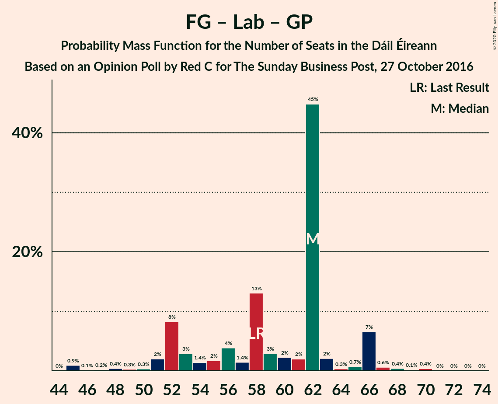

# Opinion Poll by Red C for The Sunday Business Post, 27 October 2016

<a href="#voting-intentions">Voting Intentions</a> | <a href="#seats">Seats</a> | <a href="#coalitions">Coalitions</a> | <a href="#technical-information">Technical Information</a>

## Voting Intentions

### Confidence Intervals

| Party | Last Result | Poll Result | 80% Confidence Interval | 90% Confidence Interval | 95% Confidence Interval | 99% Confidence Interval |
|:-----:|:-----------:|:-----------:|:-----------------------:|:-----------------------:|:-----------------------:|:-----------------------:|
| Fianna Fáil | 24.3% | 25.9% | 24.2–27.8% |23.7–28.3% |23.3–28.8% |22.5–29.7% |
| Fine Gael | 25.5% | 25.0% | 23.3–26.8% |22.8–27.3% |22.4–27.7% |21.6–28.6% |
| Sinn Féin | 13.8% | 13.0% | 11.7–14.4% |11.3–14.8% |11.0–15.2% |10.4–15.9% |
| Solidarity–People Before Profit | 3.9% | 9.0% | 7.9–10.2% |7.6–10.6% |7.4–10.9% |6.9–11.6% |
| Independent | 15.9% | 8.4% | 7.3–9.6% |7.1–10.0% |6.8–10.3% |6.4–10.9% |
| Labour Party | 6.6% | 5.0% | 4.2–6.0% |4.0–6.3% |3.8–6.5% |3.5–7.0% |
| Social Democrats | 3.0% | 3.0% | 2.4–3.8% |2.2–4.0% |2.1–4.3% |1.8–4.7% |
| Green Party/Comhaontas Glas | 2.7% | 3.0% | 2.4–3.8% |2.2–4.0% |2.1–4.3% |1.8–4.7% |
| Independents 4 Change | 1.5% | 1.1% | 0.8–1.7% |0.7–1.8% |0.6–2.0% |0.5–2.3% |
| Renua Ireland | 2.2% | 0.2% | 0.1–0.5% |0.1–0.6% |0.1–0.7% |0.0–0.9% |

*Note:* The poll result column reflects the actual value used in the calculations. Published results may vary slightly, and in addition be rounded to fewer digits.

## Seats

### Confidence Intervals

| Party | Last Result | Median | 80% Confidence Interval | 90% Confidence Interval | 95% Confidence Interval | 99% Confidence Interval |
|:-----:|:-----------:|:------:|:-----------------------:|:-----------------------:|:-----------------------:|:-----------------------:|
| <a href="#fianna-fáil">Fianna Fáil</a> | 44 | 55 | 55–56 |54–57 |54–58 |49–58 |
| <a href="#fine-gael">Fine Gael</a> | 49 | 50 | 50–51 |50–54 |48–54 |46–62 |
| <a href="#sinn-féin">Sinn Féin</a> | 23 | 28 | 26–28 |24–28 |21–29 |18–33 |
| <a href="#solidarity–people-before-profit">Solidarity–People Before Profit</a> | 6 | 11 | 11 |10–13 |10–14 |10–14 |
| <a href="#independent">Independent</a> | 19 | 4 | 4–6 |3–7 |3–7 |3–10 |
| <a href="#labour-party">Labour Party</a> | 7 | 4 | 3–4 |2–5 |1–7 |0–11 |
| <a href="#social-democrats">Social Democrats</a> | 3 | 4 | 4 |4 |4–6 |3–6 |
| <a href="#green-party/comhaontas-glas">Green Party/Comhaontas Glas</a> | 2 | 2 | 1–2 |1–2 |0–2 |0–2 |
| <a href="#independents-4-change">Independents 4 Change</a> | 4 | 2 | 1–2 |1–2 |1–4 |0–5 |
| <a href="#renua-ireland">Renua Ireland</a> | 0 | 0 | 0 |0 |0 |0 |

### Fianna Fáil

*For a full overview of the results for this party, see the [Fianna Fáil](party-fiannafáil.html) page.*

| Number of Seats | Probability | Accumulated | Special Marks |
|:---------------:|:-----------:|:-----------:|:-------------:|
| 44 | 0% | 100% | Last Result |
| 45 | 0% | 100% |  |
| 46 | 0.1% | 99.9% |  |
| 47 | 0% | 99.9% |  |
| 48 | 0% | 99.8% |  |
| 49 | 0.3% | 99.8% |  |
| 50 | 0.1% | 99.5% |  |
| 51 | 0.2% | 99.4% |  |
| 52 | 0.3% | 99.2% |  |
| 53 | 0.9% | 98.9% |  |
| 54 | 5% | 98% |  |
| 55 | 81% | 93% | Median |
| 56 | 7% | 12% |  |
| 57 | 0.8% | 5% |  |
| 58 | 4% | 4% |  |
| 59 | 0.1% | 0.2% |  |
| 60 | 0% | 0% |  |

### Fine Gael

*For a full overview of the results for this party, see the [Fine Gael](party-finegael.html) page.*

| Number of Seats | Probability | Accumulated | Special Marks |
|:---------------:|:-----------:|:-----------:|:-------------:|
| 42 | 0.1% | 100% |  |
| 43 | 0% | 99.9% |  |
| 44 | 0.2% | 99.9% |  |
| 45 | 0.1% | 99.7% |  |
| 46 | 0.5% | 99.6% |  |
| 47 | 0.8% | 99.1% |  |
| 48 | 0.9% | 98% |  |
| 49 | 2% | 97% | Last Result |
| 50 | 80% | 96% | Median |
| 51 | 7% | 16% |  |
| 52 | 3% | 9% |  |
| 53 | 0.4% | 6% |  |
| 54 | 4% | 6% |  |
| 55 | 0.5% | 2% |  |
| 56 | 0% | 1.4% |  |
| 57 | 0.1% | 1.4% |  |
| 58 | 0.1% | 1.3% |  |
| 59 | 0.1% | 1.2% |  |
| 60 | 0.1% | 1.1% |  |
| 61 | 0.3% | 1.0% |  |
| 62 | 0.5% | 0.7% |  |
| 63 | 0% | 0.2% |  |
| 64 | 0.2% | 0.2% |  |
| 65 | 0% | 0% |  |

### Sinn Féin

*For a full overview of the results for this party, see the [Sinn Féin](party-sinnféin.html) page.*

| Number of Seats | Probability | Accumulated | Special Marks |
|:---------------:|:-----------:|:-----------:|:-------------:|
| 14 | 0.2% | 100% |  |
| 15 | 0.1% | 99.8% |  |
| 16 | 0% | 99.7% |  |
| 17 | 0.2% | 99.7% |  |
| 18 | 0.1% | 99.5% |  |
| 19 | 1.1% | 99.5% |  |
| 20 | 0.5% | 98% |  |
| 21 | 0.8% | 98% |  |
| 22 | 0.2% | 97% |  |
| 23 | 0.4% | 97% | Last Result |
| 24 | 6% | 97% |  |
| 25 | 0.1% | 90% |  |
| 26 | 0.5% | 90% |  |
| 27 | 0.5% | 90% |  |
| 28 | 84% | 89% | Median |
| 29 | 4% | 5% |  |
| 30 | 0.2% | 1.2% |  |
| 31 | 0.3% | 1.1% |  |
| 32 | 0.1% | 0.8% |  |
| 33 | 0.2% | 0.7% |  |
| 34 | 0.5% | 0.5% |  |
| 35 | 0% | 0% |  |

### Solidarity–People Before Profit

*For a full overview of the results for this party, see the [Solidarity–People Before Profit](party-solidarity–peoplebeforeprofit.html) page.*

| Number of Seats | Probability | Accumulated | Special Marks |
|:---------------:|:-----------:|:-----------:|:-------------:|
| 6 | 0% | 100% | Last Result |
| 7 | 0% | 100% |  |
| 8 | 0% | 100% |  |
| 9 | 0% | 100% |  |
| 10 | 9% | 100% |  |
| 11 | 84% | 91% | Median |
| 12 | 1.0% | 6% |  |
| 13 | 0.1% | 5% |  |
| 14 | 5% | 5% |  |
| 15 | 0.2% | 0.2% |  |
| 16 | 0% | 0% |  |

### Independent

*For a full overview of the results for this party, see the [Independent](party-independent.html) page.*

| Number of Seats | Probability | Accumulated | Special Marks |
|:---------------:|:-----------:|:-----------:|:-------------:|
| 3 | 7% | 100% |  |
| 4 | 80% | 93% | Median |
| 5 | 2% | 13% |  |
| 6 | 5% | 11% |  |
| 7 | 4% | 6% |  |
| 8 | 0.6% | 2% |  |
| 9 | 0.2% | 1.1% |  |
| 10 | 0.4% | 0.8% |  |
| 11 | 0.1% | 0.4% |  |
| 12 | 0.2% | 0.3% |  |
| 13 | 0% | 0.1% |  |
| 14 | 0% | 0% |  |
| 15 | 0% | 0% |  |
| 16 | 0% | 0% |  |
| 17 | 0% | 0% |  |
| 18 | 0% | 0% |  |
| 19 | 0% | 0% | Last Result |

### Labour Party

*For a full overview of the results for this party, see the [Labour Party](party-labourparty.html) page.*

| Number of Seats | Probability | Accumulated | Special Marks |
|:---------------:|:-----------:|:-----------:|:-------------:|
| 0 | 1.4% | 100% |  |
| 1 | 3% | 98.6% |  |
| 2 | 4% | 95% |  |
| 3 | 5% | 91% |  |
| 4 | 81% | 86% | Median |
| 5 | 0.6% | 5% |  |
| 6 | 0.7% | 4% |  |
| 7 | 3% | 4% | Last Result |
| 8 | 0.1% | 1.2% |  |
| 9 | 0% | 1.0% |  |
| 10 | 0.2% | 1.0% |  |
| 11 | 0.6% | 0.8% |  |
| 12 | 0.1% | 0.1% |  |
| 13 | 0% | 0% |  |

### Social Democrats

*For a full overview of the results for this party, see the [Social Democrats](party-socialdemocrats.html) page.*

| Number of Seats | Probability | Accumulated | Special Marks |
|:---------------:|:-----------:|:-----------:|:-------------:|
| 3 | 2% | 100% | Last Result |
| 4 | 95% | 98% | Median |
| 5 | 0.4% | 3% |  |
| 6 | 2% | 3% |  |
| 7 | 0.4% | 0.4% |  |
| 8 | 0% | 0% |  |

### Green Party/Comhaontas Glas

*For a full overview of the results for this party, see the [Green Party/Comhaontas Glas](party-greenpartycomhaontasglas.html) page.*

| Number of Seats | Probability | Accumulated | Special Marks |
|:---------------:|:-----------:|:-----------:|:-------------:|
| 0 | 5% | 100% |  |
| 1 | 8% | 95% |  |
| 2 | 87% | 87% | Last Result, Median |
| 3 | 0% | 0% |  |

### Independents 4 Change

*For a full overview of the results for this party, see the [Independents 4 Change](party-independents4change.html) page.*

| Number of Seats | Probability | Accumulated | Special Marks |
|:---------------:|:-----------:|:-----------:|:-------------:|
| 0 | 2% | 100% |  |
| 1 | 14% | 98% |  |
| 2 | 82% | 84% | Median |
| 3 | 0.2% | 3% |  |
| 4 | 1.3% | 3% | Last Result |
| 5 | 1.4% | 1.4% |  |
| 6 | 0% | 0% |  |

### Renua Ireland

*For a full overview of the results for this party, see the [Renua Ireland](party-renuaireland.html) page.*

| Number of Seats | Probability | Accumulated | Special Marks |
|:---------------:|:-----------:|:-----------:|:-------------:|
| 0 | 100% | 100% | Last Result, Median |

## Coalitions

### Confidence Intervals

| Coalition | Last Result | Median | Majority? | 80% Confidence Interval | 90% Confidence Interval | 95% Confidence Interval | 99% Confidence Interval |
|:---------:|:-----------:|:------:|:---------:|:-----------------------:|:-----------------------:|:-----------------------:|:-----------------------:|
| Fianna Fáil – Fine Gael | 93 | 105 | 100% | 105–108 | 105–108 | 105–109 | 99–115 |
| Fianna Fáil – Sinn Féin | 67 | 83 | 92% | 82–83 | 78–84 | 77–85 | 71–88 |
| Fianna Fáil – Labour Party – Green Party/Comhaontas Glas – Social Democrats | 56 | 65 | 0% | 63–65 | 61–65 | 61–70 | 59–74 |
| Fianna Fáil – Labour Party – Green Party/Comhaontas Glas | 53 | 61 | 0% | 59–61 | 57–61 | 57–66 | 54–70 |
| Fianna Fáil – Labour Party | 51 | 59 | 0% | 58–59 | 57–59 | 57–65 | 53–69 |
| Fine Gael – Labour Party – Green Party/Comhaontas Glas – Social Democrats | 61 | 60 | 0% | 60–61 | 58–63 | 56–64 | 53–73 |
| Fine Gael – Labour Party – Green Party/Comhaontas Glas | 58 | 56 | 0% | 55–56 | 54–59 | 53–60 | 49–69 |
| Fianna Fáil – Green Party/Comhaontas Glas | 46 | 57 | 0% | 57 | 54–58 | 54–59 | 51–60 |
| Fine Gael – Labour Party | 56 | 54 | 0% | 54–55 | 53–58 | 51–58 | 48–68 |
| Fine Gael – Green Party/Comhaontas Glas | 51 | 52 | 0% | 52 | 52–54 | 50–54 | 47–64 |
| Fine Gael | 49 | 50 | 0% | 50–51 | 50–54 | 48–54 | 46–62 |

### Fianna Fáil – Fine Gael

| Number of Seats | Probability | Accumulated | Special Marks |
|:---------------:|:-----------:|:-----------:|:-------------:|
| 93 | 0% | 100% | Last Result |
| 94 | 0% | 100% |  |
| 95 | 0% | 100% |  |
| 96 | 0% | 100% |  |
| 97 | 0% | 100% |  |
| 98 | 0.2% | 99.9% |  |
| 99 | 0.2% | 99.7% |  |
| 100 | 0.2% | 99.4% |  |
| 101 | 0.1% | 99.2% |  |
| 102 | 0.7% | 99.1% |  |
| 103 | 0.4% | 98% |  |
| 104 | 0.4% | 98% |  |
| 105 | 81% | 98% | Median |
| 106 | 0.6% | 17% |  |
| 107 | 6% | 16% |  |
| 108 | 7% | 11% |  |
| 109 | 2% | 4% |  |
| 110 | 0.4% | 2% |  |
| 111 | 0.1% | 1.2% |  |
| 112 | 0% | 1.1% |  |
| 113 | 0% | 1.1% |  |
| 114 | 0.4% | 1.1% |  |
| 115 | 0.4% | 0.7% |  |
| 116 | 0% | 0.3% |  |
| 117 | 0% | 0.2% |  |
| 118 | 0% | 0.2% |  |
| 119 | 0.2% | 0.2% |  |
| 120 | 0% | 0% |  |

### Fianna Fáil – Sinn Féin

| Number of Seats | Probability | Accumulated | Special Marks |
|:---------------:|:-----------:|:-----------:|:-------------:|
| 67 | 0.1% | 100% | Last Result |
| 68 | 0.2% | 99.9% |  |
| 69 | 0.2% | 99.8% |  |
| 70 | 0% | 99.6% |  |
| 71 | 0.1% | 99.5% |  |
| 72 | 0.4% | 99.4% |  |
| 73 | 0.7% | 99.0% |  |
| 74 | 0.3% | 98% |  |
| 75 | 0.3% | 98% |  |
| 76 | 0.2% | 98% |  |
| 77 | 0.2% | 98% |  |
| 78 | 4% | 97% |  |
| 79 | 0.7% | 93% |  |
| 80 | 0.7% | 93% |  |
| 81 | 0.1% | 92% | Majority |
| 82 | 3% | 92% |  |
| 83 | 80% | 89% | Median |
| 84 | 4% | 9% |  |
| 85 | 3% | 5% |  |
| 86 | 0.2% | 2% |  |
| 87 | 1.3% | 2% |  |
| 88 | 0.4% | 0.5% |  |
| 89 | 0% | 0.1% |  |
| 90 | 0% | 0.1% |  |
| 91 | 0% | 0% |  |

### Fianna Fáil – Labour Party – Green Party/Comhaontas Glas – Social Democrats

| Number of Seats | Probability | Accumulated | Special Marks |
|:---------------:|:-----------:|:-----------:|:-------------:|
| 53 | 0% | 100% |  |
| 54 | 0% | 99.9% |  |
| 55 | 0.2% | 99.9% |  |
| 56 | 0% | 99.7% | Last Result |
| 57 | 0% | 99.7% |  |
| 58 | 0.2% | 99.7% |  |
| 59 | 0.3% | 99.5% |  |
| 60 | 0.3% | 99.2% |  |
| 61 | 4% | 99.0% |  |
| 62 | 0.8% | 95% |  |
| 63 | 4% | 94% |  |
| 64 | 2% | 89% |  |
| 65 | 84% | 88% | Median |
| 66 | 0.1% | 4% |  |
| 67 | 0.1% | 4% |  |
| 68 | 0.2% | 4% |  |
| 69 | 0.7% | 4% |  |
| 70 | 2% | 3% |  |
| 71 | 0.1% | 0.8% |  |
| 72 | 0% | 0.8% |  |
| 73 | 0% | 0.8% |  |
| 74 | 0.7% | 0.7% |  |
| 75 | 0% | 0% |  |

### Fianna Fáil – Labour Party – Green Party/Comhaontas Glas

| Number of Seats | Probability | Accumulated | Special Marks |
|:---------------:|:-----------:|:-----------:|:-------------:|
| 49 | 0% | 100% |  |
| 50 | 0% | 99.9% |  |
| 51 | 0.1% | 99.9% |  |
| 52 | 0.1% | 99.8% |  |
| 53 | 0% | 99.7% | Last Result |
| 54 | 0.2% | 99.7% |  |
| 55 | 0.2% | 99.5% |  |
| 56 | 0.2% | 99.2% |  |
| 57 | 4% | 99.1% |  |
| 58 | 0.5% | 95% |  |
| 59 | 7% | 94% |  |
| 60 | 2% | 87% |  |
| 61 | 81% | 85% | Median |
| 62 | 0.3% | 4% |  |
| 63 | 0.4% | 4% |  |
| 64 | 0.2% | 4% |  |
| 65 | 0.6% | 4% |  |
| 66 | 2% | 3% |  |
| 67 | 0% | 0.8% |  |
| 68 | 0% | 0.8% |  |
| 69 | 0% | 0.8% |  |
| 70 | 0.7% | 0.8% |  |
| 71 | 0% | 0% |  |

### Fianna Fáil – Labour Party

| Number of Seats | Probability | Accumulated | Special Marks |
|:---------------:|:-----------:|:-----------:|:-------------:|
| 48 | 0% | 100% |  |
| 49 | 0.1% | 99.9% |  |
| 50 | 0.1% | 99.9% |  |
| 51 | 0% | 99.7% | Last Result |
| 52 | 0.1% | 99.7% |  |
| 53 | 0.2% | 99.6% |  |
| 54 | 0.2% | 99.4% |  |
| 55 | 0.2% | 99.2% |  |
| 56 | 0.5% | 99.0% |  |
| 57 | 7% | 98.5% |  |
| 58 | 6% | 91% |  |
| 59 | 81% | 86% | Median |
| 60 | 0.4% | 5% |  |
| 61 | 0.4% | 4% |  |
| 62 | 0.2% | 4% |  |
| 63 | 0.5% | 4% |  |
| 64 | 0.2% | 3% |  |
| 65 | 2% | 3% |  |
| 66 | 0% | 0.8% |  |
| 67 | 0% | 0.8% |  |
| 68 | 0.1% | 0.8% |  |
| 69 | 0.6% | 0.6% |  |
| 70 | 0% | 0% |  |

### Fine Gael – Labour Party – Green Party/Comhaontas Glas – Social Democrats

| Number of Seats | Probability | Accumulated | Special Marks |
|:---------------:|:-----------:|:-----------:|:-------------:|
| 51 | 0.2% | 100% |  |
| 52 | 0.2% | 99.8% |  |
| 53 | 0% | 99.5% |  |
| 54 | 0.3% | 99.5% |  |
| 55 | 1.2% | 99.2% |  |
| 56 | 0.8% | 98% |  |
| 57 | 0.5% | 97% |  |
| 58 | 4% | 97% |  |
| 59 | 0.3% | 93% |  |
| 60 | 80% | 93% | Median |
| 61 | 7% | 13% | Last Result |
| 62 | 0.5% | 6% |  |
| 63 | 3% | 5% |  |
| 64 | 0.5% | 3% |  |
| 65 | 0.3% | 2% |  |
| 66 | 0.5% | 2% |  |
| 67 | 0.2% | 1.4% |  |
| 68 | 0.1% | 1.2% |  |
| 69 | 0.1% | 1.1% |  |
| 70 | 0.2% | 1.0% |  |
| 71 | 0.2% | 0.8% |  |
| 72 | 0% | 0.7% |  |
| 73 | 0.2% | 0.7% |  |
| 74 | 0.4% | 0.5% |  |
| 75 | 0% | 0.1% |  |
| 76 | 0% | 0% |  |

### Fine Gael – Labour Party – Green Party/Comhaontas Glas

| Number of Seats | Probability | Accumulated | Special Marks |
|:---------------:|:-----------:|:-----------:|:-------------:|
| 47 | 0% | 100% |  |
| 48 | 0.3% | 99.9% |  |
| 49 | 0.2% | 99.6% |  |
| 50 | 0.1% | 99.5% |  |
| 51 | 1.4% | 99.3% |  |
| 52 | 0.3% | 98% |  |
| 53 | 0.8% | 98% |  |
| 54 | 4% | 97% |  |
| 55 | 3% | 93% |  |
| 56 | 80% | 90% | Median |
| 57 | 4% | 10% |  |
| 58 | 0.3% | 6% | Last Result |
| 59 | 3% | 5% |  |
| 60 | 0.5% | 3% |  |
| 61 | 0.2% | 2% |  |
| 62 | 0.7% | 2% |  |
| 63 | 0.1% | 1.3% |  |
| 64 | 0.1% | 1.2% |  |
| 65 | 0.1% | 1.1% |  |
| 66 | 0.2% | 1.0% |  |
| 67 | 0.2% | 0.8% |  |
| 68 | 0% | 0.7% |  |
| 69 | 0.2% | 0.7% |  |
| 70 | 0.4% | 0.5% |  |
| 71 | 0% | 0.1% |  |
| 72 | 0% | 0.1% |  |
| 73 | 0% | 0% |  |

### Fianna Fáil – Green Party/Comhaontas Glas

| Number of Seats | Probability | Accumulated | Special Marks |
|:---------------:|:-----------:|:-----------:|:-------------:|
| 46 | 0% | 100% | Last Result |
| 47 | 0% | 100% |  |
| 48 | 0.1% | 99.9% |  |
| 49 | 0% | 99.8% |  |
| 50 | 0.1% | 99.8% |  |
| 51 | 0.4% | 99.8% |  |
| 52 | 0.2% | 99.4% |  |
| 53 | 0.3% | 99.2% |  |
| 54 | 4% | 98.9% |  |
| 55 | 1.1% | 95% |  |
| 56 | 1.5% | 94% |  |
| 57 | 84% | 92% | Median |
| 58 | 3% | 8% |  |
| 59 | 3% | 5% |  |
| 60 | 2% | 2% |  |
| 61 | 0.1% | 0.1% |  |
| 62 | 0% | 0% |  |

### Fine Gael – Labour Party

| Number of Seats | Probability | Accumulated | Special Marks |
|:---------------:|:-----------:|:-----------:|:-------------:|
| 46 | 0% | 100% |  |
| 47 | 0.2% | 99.9% |  |
| 48 | 0.3% | 99.7% |  |
| 49 | 1.3% | 99.4% |  |
| 50 | 0.2% | 98% |  |
| 51 | 1.0% | 98% |  |
| 52 | 0.2% | 97% |  |
| 53 | 7% | 97% |  |
| 54 | 80% | 90% | Median |
| 55 | 0.4% | 10% |  |
| 56 | 0.2% | 10% | Last Result |
| 57 | 4% | 10% |  |
| 58 | 3% | 5% |  |
| 59 | 0.1% | 2% |  |
| 60 | 0.9% | 2% |  |
| 61 | 0% | 1.3% |  |
| 62 | 0.1% | 1.2% |  |
| 63 | 0.1% | 1.2% |  |
| 64 | 0.2% | 1.1% |  |
| 65 | 0.2% | 0.9% |  |
| 66 | 0% | 0.7% |  |
| 67 | 0% | 0.7% |  |
| 68 | 0.6% | 0.7% |  |
| 69 | 0% | 0.1% |  |
| 70 | 0% | 0.1% |  |
| 71 | 0% | 0.1% |  |
| 72 | 0.1% | 0.1% |  |
| 73 | 0% | 0% |  |

### Fine Gael – Green Party/Comhaontas Glas

| Number of Seats | Probability | Accumulated | Special Marks |
|:---------------:|:-----------:|:-----------:|:-------------:|
| 43 | 0.1% | 100% |  |
| 44 | 0% | 99.9% |  |
| 45 | 0.3% | 99.9% |  |
| 46 | 0.1% | 99.7% |  |
| 47 | 0.3% | 99.5% |  |
| 48 | 1.0% | 99.3% |  |
| 49 | 0.3% | 98% |  |
| 50 | 0.6% | 98% |  |
| 51 | 2% | 97% | Last Result |
| 52 | 86% | 96% | Median |
| 53 | 0.4% | 9% |  |
| 54 | 7% | 9% |  |
| 55 | 0.4% | 2% |  |
| 56 | 0.1% | 2% |  |
| 57 | 0.5% | 2% |  |
| 58 | 0% | 1.4% |  |
| 59 | 0.1% | 1.4% |  |
| 60 | 0.2% | 1.3% |  |
| 61 | 0% | 1.1% |  |
| 62 | 0.2% | 1.1% |  |
| 63 | 0.3% | 0.9% |  |
| 64 | 0.4% | 0.6% |  |
| 65 | 0.2% | 0.2% |  |
| 66 | 0% | 0% |  |

### Fine Gael

| Number of Seats | Probability | Accumulated | Special Marks |
|:---------------:|:-----------:|:-----------:|:-------------:|
| 42 | 0.1% | 100% |  |
| 43 | 0% | 99.9% |  |
| 44 | 0.2% | 99.9% |  |
| 45 | 0.1% | 99.7% |  |
| 46 | 0.5% | 99.6% |  |
| 47 | 0.8% | 99.1% |  |
| 48 | 0.9% | 98% |  |
| 49 | 2% | 97% | Last Result |
| 50 | 80% | 96% | Median |
| 51 | 7% | 16% |  |
| 52 | 3% | 9% |  |
| 53 | 0.4% | 6% |  |
| 54 | 4% | 6% |  |
| 55 | 0.5% | 2% |  |
| 56 | 0% | 1.4% |  |
| 57 | 0.1% | 1.4% |  |
| 58 | 0.1% | 1.3% |  |
| 59 | 0.1% | 1.2% |  |
| 60 | 0.1% | 1.1% |  |
| 61 | 0.3% | 1.0% |  |
| 62 | 0.5% | 0.7% |  |
| 63 | 0% | 0.2% |  |
| 64 | 0.2% | 0.2% |  |
| 65 | 0% | 0% |  |

## Technical Information

### Opinion Poll

+ **Polling firm:** Red C
+ **Commissioner(s):** The Sunday Business Post
+ **Fieldwork period:** 27 October 2016

### Calculations

+ **Sample size:** 1002
+ **Simulations done:** 131,072
+ **Error estimate:** 1.80%

