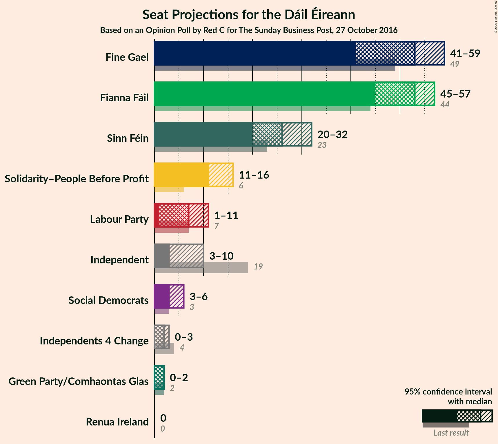
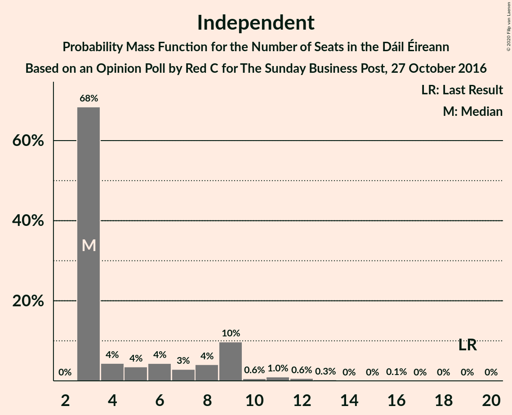
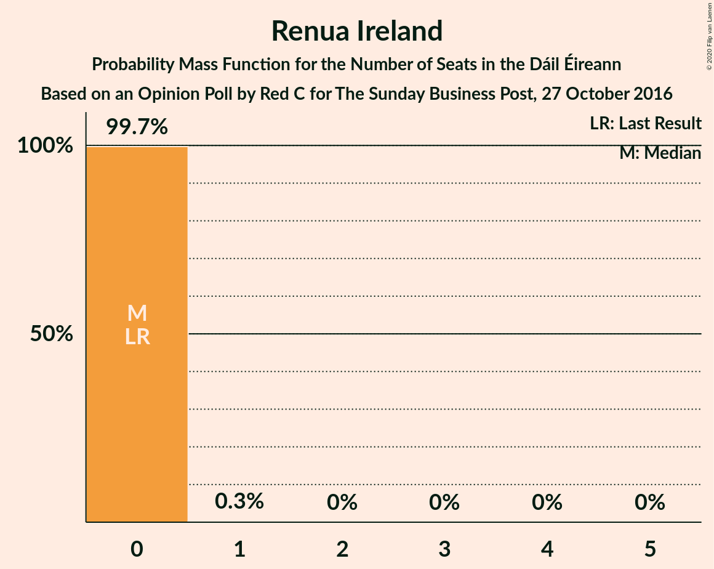
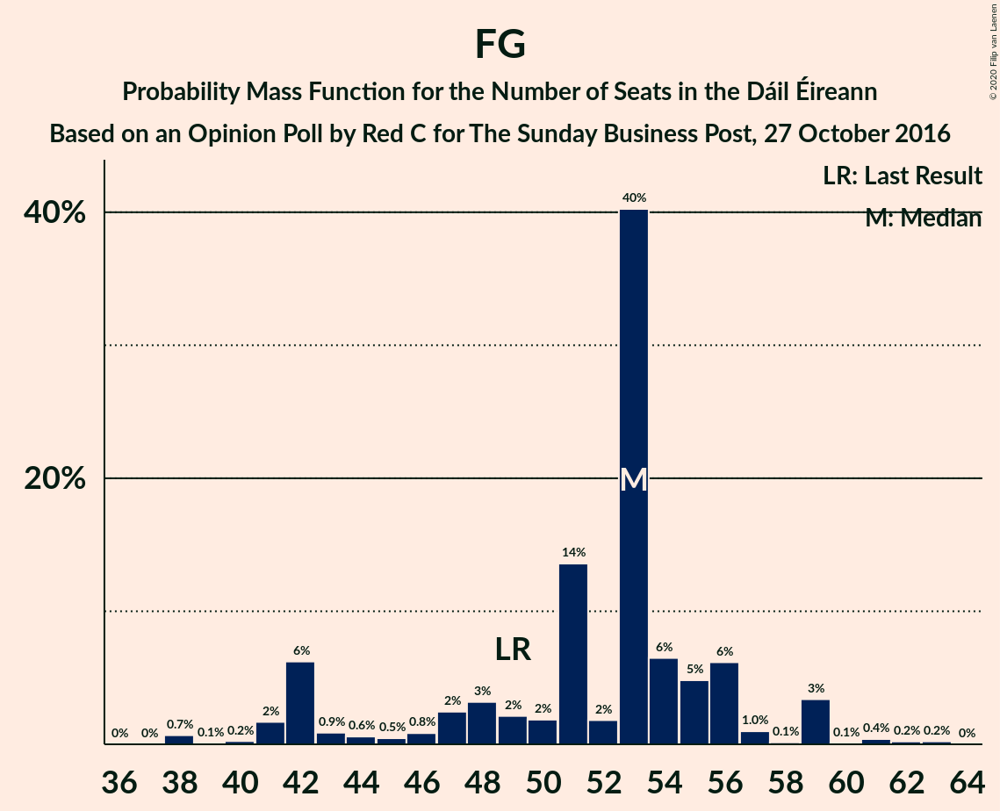

# Opinion Poll by Red C for The Sunday Business Post, 27 October 2016

<a href="#voting-intentions">Voting Intentions</a> | <a href="#seats">Seats</a> | <a href="#coalitions">Coalitions</a> | <a href="#technical-information">Technical Information</a>

## Voting Intentions

### Confidence Intervals

| Party | Last Result | Poll Result | 80% Confidence Interval | 90% Confidence Interval | 95% Confidence Interval | 99% Confidence Interval |
|:-----:|:-----------:|:-----------:|:-----------------------:|:-----------------------:|:-----------------------:|:-----------------------:|
| Fianna Fáil | 24.3% | 25.9% | 24.2–27.8% |23.7–28.3% |23.3–28.8% |22.5–29.7% |
| Fine Gael | 25.5% | 25.0% | 23.3–26.8% |22.8–27.3% |22.4–27.7% |21.6–28.6% |
| Sinn Féin | 13.8% | 13.0% | 11.7–14.4% |11.3–14.8% |11.0–15.2% |10.4–15.9% |
| Solidarity–People Before Profit | 3.9% | 9.0% | 7.9–10.2% |7.6–10.6% |7.4–10.9% |6.9–11.6% |
| Independent | 15.9% | 8.4% | 7.3–9.6% |7.1–10.0% |6.8–10.3% |6.4–10.9% |
| Labour Party | 6.6% | 5.0% | 4.2–6.0% |4.0–6.3% |3.8–6.5% |3.5–7.0% |
| Social Democrats | 3.0% | 3.0% | 2.4–3.8% |2.2–4.0% |2.1–4.3% |1.8–4.7% |
| Green Party/Comhaontas Glas | 2.7% | 3.0% | 2.4–3.8% |2.2–4.0% |2.1–4.3% |1.8–4.7% |
| Independents 4 Change | 1.5% | 1.1% | 0.8–1.7% |0.7–1.8% |0.6–2.0% |0.5–2.3% |
| Renua Ireland | 2.2% | 0.2% | 0.1–0.5% |0.1–0.6% |0.1–0.7% |0.0–0.9% |

*Note:* The poll result column reflects the actual value used in the calculations. Published results may vary slightly, and in addition be rounded to fewer digits.

## Seats

### Confidence Intervals

| Party | Last Result | Median | 80% Confidence Interval | 90% Confidence Interval | 95% Confidence Interval | 99% Confidence Interval |
|:-----:|:-----------:|:------:|:-----------------------:|:-----------------------:|:-----------------------:|:-----------------------:|
| <a href="#fianna-fáil">Fianna Fáil</a> | 44 | 53 | 49–54 |47–55 |45–57 |45–57 |
| <a href="#fine-gael">Fine Gael</a> | 49 | 53 | 44–56 |42–57 |41–59 |38–61 |
| <a href="#sinn-féin">Sinn Féin</a> | 23 | 26 | 23–30 |22–30 |20–32 |18–33 |
| <a href="#solidarity–people-before-profit">Solidarity–People Before Profit</a> | 6 | 11 | 11–13 |11–15 |11–16 |10–16 |
| <a href="#independent">Independent</a> | 19 | 3 | 3–9 |3–9 |3–10 |3–12 |
| <a href="#labour-party">Labour Party</a> | 7 | 7 | 3–8 |2–10 |1–11 |0–15 |
| <a href="#social-democrats">Social Democrats</a> | 3 | 3 | 3–5 |3–6 |3–6 |3–8 |
| <a href="#green-party/comhaontas-glas">Green Party/Comhaontas Glas</a> | 2 | 2 | 1–2 |0–2 |0–2 |0–3 |
| <a href="#independents-4-change">Independents 4 Change</a> | 4 | 2 | 0–3 |0–3 |0–3 |0–3 |
| <a href="#renua-ireland">Renua Ireland</a> | 0 | 0 | 0 |0 |0 |0 |

### Fianna Fáil

*For a full overview of the results for this party, see the [Fianna Fáil](party-fiannafáil.html) page.*

| Number of Seats | Probability | Accumulated | Special Marks |
|:---------------:|:-----------:|:-----------:|:-------------:|
| 41 | 0% | 100% |  |
| 42 | 0% | 99.9% |  |
| 43 | 0.1% | 99.9% |  |
| 44 | 0.3% | 99.8% | Last Result |
| 45 | 3% | 99.5% |  |
| 46 | 1.1% | 96% |  |
| 47 | 0.3% | 95% |  |
| 48 | 3% | 95% |  |
| 49 | 2% | 92% |  |
| 50 | 3% | 90% |  |
| 51 | 9% | 87% |  |
| 52 | 6% | 78% |  |
| 53 | 44% | 72% | Median |
| 54 | 19% | 28% |  |
| 55 | 4% | 9% |  |
| 56 | 2% | 5% |  |
| 57 | 2% | 3% |  |
| 58 | 0.2% | 0.4% |  |
| 59 | 0.1% | 0.1% |  |
| 60 | 0% | 0.1% |  |
| 61 | 0% | 0% |  |

### Fine Gael

*For a full overview of the results for this party, see the [Fine Gael](party-finegael.html) page.*

| Number of Seats | Probability | Accumulated | Special Marks |
|:---------------:|:-----------:|:-----------:|:-------------:|
| 38 | 0.7% | 100% |  |
| 39 | 0.1% | 99.3% |  |
| 40 | 0.2% | 99.2% |  |
| 41 | 2% | 98.9% |  |
| 42 | 6% | 97% |  |
| 43 | 0.9% | 91% |  |
| 44 | 0.6% | 90% |  |
| 45 | 0.5% | 90% |  |
| 46 | 0.8% | 89% |  |
| 47 | 2% | 88% |  |
| 48 | 3% | 86% |  |
| 49 | 2% | 83% | Last Result |
| 50 | 2% | 80% |  |
| 51 | 14% | 79% |  |
| 52 | 2% | 65% |  |
| 53 | 40% | 63% | Median |
| 54 | 6% | 23% |  |
| 55 | 5% | 16% |  |
| 56 | 6% | 12% |  |
| 57 | 1.0% | 5% |  |
| 58 | 0.1% | 5% |  |
| 59 | 3% | 4% |  |
| 60 | 0.1% | 1.0% |  |
| 61 | 0.4% | 0.9% |  |
| 62 | 0.2% | 0.5% |  |
| 63 | 0.2% | 0.3% |  |
| 64 | 0% | 0% |  |

### Sinn Féin

*For a full overview of the results for this party, see the [Sinn Féin](party-sinnféin.html) page.*

| Number of Seats | Probability | Accumulated | Special Marks |
|:---------------:|:-----------:|:-----------:|:-------------:|
| 16 | 0.1% | 100% |  |
| 17 | 0.1% | 99.9% |  |
| 18 | 1.4% | 99.8% |  |
| 19 | 0.8% | 98% |  |
| 20 | 0.8% | 98% |  |
| 21 | 0.9% | 97% |  |
| 22 | 3% | 96% |  |
| 23 | 3% | 93% | Last Result |
| 24 | 1.1% | 90% |  |
| 25 | 2% | 89% |  |
| 26 | 50% | 86% | Median |
| 27 | 4% | 37% |  |
| 28 | 8% | 33% |  |
| 29 | 15% | 25% |  |
| 30 | 6% | 11% |  |
| 31 | 1.2% | 4% |  |
| 32 | 2% | 3% |  |
| 33 | 2% | 2% |  |
| 34 | 0% | 0% |  |

### Solidarity–People Before Profit

*For a full overview of the results for this party, see the [Solidarity–People Before Profit](party-solidarity–peoplebeforeprofit.html) page.*

| Number of Seats | Probability | Accumulated | Special Marks |
|:---------------:|:-----------:|:-----------:|:-------------:|
| 6 | 0% | 100% | Last Result |
| 7 | 0% | 100% |  |
| 8 | 0% | 100% |  |
| 9 | 0% | 100% |  |
| 10 | 1.3% | 100% |  |
| 11 | 83% | 98.7% | Median |
| 12 | 2% | 16% |  |
| 13 | 5% | 14% |  |
| 14 | 2% | 8% |  |
| 15 | 3% | 6% |  |
| 16 | 3% | 3% |  |
| 17 | 0% | 0% |  |

### Independent

*For a full overview of the results for this party, see the [Independent](party-independent.html) page.*

| Number of Seats | Probability | Accumulated | Special Marks |
|:---------------:|:-----------:|:-----------:|:-------------:|
| 3 | 68% | 100% | Median |
| 4 | 4% | 32% |  |
| 5 | 4% | 27% |  |
| 6 | 4% | 24% |  |
| 7 | 3% | 19% |  |
| 8 | 4% | 16% |  |
| 9 | 10% | 12% |  |
| 10 | 0.6% | 3% |  |
| 11 | 1.0% | 2% |  |
| 12 | 0.6% | 1.1% |  |
| 13 | 0.3% | 0.5% |  |
| 14 | 0% | 0.2% |  |
| 15 | 0% | 0.1% |  |
| 16 | 0.1% | 0.1% |  |
| 17 | 0% | 0% |  |
| 18 | 0% | 0% |  |
| 19 | 0% | 0% | Last Result |

### Labour Party

*For a full overview of the results for this party, see the [Labour Party](party-labourparty.html) page.*

| Number of Seats | Probability | Accumulated | Special Marks |
|:---------------:|:-----------:|:-----------:|:-------------:|
| 0 | 1.2% | 100% |  |
| 1 | 3% | 98.8% |  |
| 2 | 4% | 96% |  |
| 3 | 5% | 92% |  |
| 4 | 10% | 87% |  |
| 5 | 19% | 77% |  |
| 6 | 3% | 58% |  |
| 7 | 39% | 56% | Last Result, Median |
| 8 | 7% | 17% |  |
| 9 | 3% | 10% |  |
| 10 | 3% | 7% |  |
| 11 | 2% | 4% |  |
| 12 | 0.2% | 2% |  |
| 13 | 0.3% | 2% |  |
| 14 | 0.5% | 1.3% |  |
| 15 | 0.6% | 0.8% |  |
| 16 | 0.2% | 0.2% |  |
| 17 | 0% | 0% |  |

### Social Democrats

*For a full overview of the results for this party, see the [Social Democrats](party-socialdemocrats.html) page.*

| Number of Seats | Probability | Accumulated | Special Marks |
|:---------------:|:-----------:|:-----------:|:-------------:|
| 3 | 60% | 100% | Last Result, Median |
| 4 | 27% | 40% |  |
| 5 | 8% | 13% |  |
| 6 | 4% | 5% |  |
| 7 | 1.1% | 2% |  |
| 8 | 0.4% | 0.5% |  |
| 9 | 0.1% | 0.1% |  |
| 10 | 0% | 0% |  |

### Green Party/Comhaontas Glas

*For a full overview of the results for this party, see the [Green Party/Comhaontas Glas](party-greenpartycomhaontasglas.html) page.*

| Number of Seats | Probability | Accumulated | Special Marks |
|:---------------:|:-----------:|:-----------:|:-------------:|
| 0 | 6% | 100% |  |
| 1 | 8% | 94% |  |
| 2 | 85% | 86% | Last Result, Median |
| 3 | 0.9% | 1.1% |  |
| 4 | 0.2% | 0.2% |  |
| 5 | 0% | 0% |  |

### Independents 4 Change

*For a full overview of the results for this party, see the [Independents 4 Change](party-independents4change.html) page.*

| Number of Seats | Probability | Accumulated | Special Marks |
|:---------------:|:-----------:|:-----------:|:-------------:|
| 0 | 13% | 100% |  |
| 1 | 3% | 87% |  |
| 2 | 66% | 85% | Median |
| 3 | 18% | 18% |  |
| 4 | 0% | 0% | Last Result |

### Renua Ireland

*For a full overview of the results for this party, see the [Renua Ireland](party-renuaireland.html) page.*

| Number of Seats | Probability | Accumulated | Special Marks |
|:---------------:|:-----------:|:-----------:|:-------------:|
| 0 | 99.7% | 100% | Last Result, Median |
| 1 | 0.3% | 0.3% |  |
| 2 | 0% | 0% |  |

## Coalitions

### Confidence Intervals

| Coalition | Last Result | Median | Majority? | 80% Confidence Interval | 90% Confidence Interval | 95% Confidence Interval | 99% Confidence Interval |
|:---------:|:-----------:|:------:|:---------:|:-----------------------:|:-----------------------:|:-----------------------:|:-----------------------:|
| Fianna Fáil – Fine Gael | 93 | 106 | 100% | 96–107 | 96–108 | 94–110 | 91–112 |
| Fianna Fáil – Sinn Féin | 67 | 79 | 28% | 75–83 | 74–83 | 70–84 | 69–86 |
| Fine Gael – Labour Party – Green Party/Comhaontas Glas – Social Democrats | 61 | 65 | 0% | 56–66 | 56–69 | 54–70 | 49–73 |
| Fianna Fáil – Labour Party – Green Party/Comhaontas Glas – Social Democrats | 56 | 65 | 0% | 60–68 | 56–68 | 55–69 | 55–73 |
| Fianna Fáil – Labour Party – Green Party/Comhaontas Glas | 53 | 62 | 0% | 56–64 | 52–64 | 52–66 | 48–69 |
| Fine Gael – Labour Party – Green Party/Comhaontas Glas | 58 | 62 | 0% | 52–63 | 52–66 | 51–66 | 45–69 |
| Fianna Fáil – Labour Party | 51 | 60 | 0% | 54–62 | 50–62 | 50–66 | 47–68 |
| Fine Gael – Labour Party | 56 | 60 | 0% | 50–62 | 50–64 | 49–64 | 43–68 |
| Fine Gael – Green Party/Comhaontas Glas | 51 | 55 | 0% | 45–58 | 44–58 | 43–61 | 40–63 |
| Fine Gael | 49 | 53 | 0% | 44–56 | 42–57 | 41–59 | 38–61 |
| Fianna Fáil – Green Party/Comhaontas Glas | 46 | 55 | 0% | 51–56 | 49–57 | 47–58 | 46–59 |

### Fianna Fáil – Fine Gael

| Number of Seats | Probability | Accumulated | Special Marks |
|:---------------:|:-----------:|:-----------:|:-------------:|
| 88 | 0.2% | 100% |  |
| 89 | 0% | 99.8% |  |
| 90 | 0.2% | 99.7% |  |
| 91 | 0% | 99.5% |  |
| 92 | 0.3% | 99.5% |  |
| 93 | 0.2% | 99.1% | Last Result |
| 94 | 2% | 98.9% |  |
| 95 | 0.8% | 97% |  |
| 96 | 7% | 96% |  |
| 97 | 2% | 89% |  |
| 98 | 0.6% | 87% |  |
| 99 | 0.5% | 87% |  |
| 100 | 1.0% | 86% |  |
| 101 | 3% | 85% |  |
| 102 | 6% | 83% |  |
| 103 | 2% | 77% |  |
| 104 | 6% | 75% |  |
| 105 | 14% | 69% |  |
| 106 | 40% | 55% | Median |
| 107 | 8% | 15% |  |
| 108 | 3% | 7% |  |
| 109 | 0.8% | 4% |  |
| 110 | 2% | 3% |  |
| 111 | 0.6% | 1.3% |  |
| 112 | 0.4% | 0.7% |  |
| 113 | 0.1% | 0.3% |  |
| 114 | 0.1% | 0.1% |  |
| 115 | 0% | 0% |  |

### Fianna Fáil – Sinn Féin

| Number of Seats | Probability | Accumulated | Special Marks |
|:---------------:|:-----------:|:-----------:|:-------------:|
| 65 | 0% | 100% |  |
| 66 | 0.1% | 99.9% |  |
| 67 | 0.2% | 99.9% | Last Result |
| 68 | 0.1% | 99.7% |  |
| 69 | 0.6% | 99.6% |  |
| 70 | 2% | 99.0% |  |
| 71 | 0.3% | 97% |  |
| 72 | 0.4% | 97% |  |
| 73 | 1.3% | 97% |  |
| 74 | 3% | 95% |  |
| 75 | 5% | 93% |  |
| 76 | 3% | 87% |  |
| 77 | 7% | 84% |  |
| 78 | 3% | 77% |  |
| 79 | 43% | 74% | Median |
| 80 | 2% | 31% |  |
| 81 | 1.3% | 28% | Majority |
| 82 | 11% | 27% |  |
| 83 | 13% | 16% |  |
| 84 | 1.3% | 3% |  |
| 85 | 1.3% | 2% |  |
| 86 | 0.8% | 0.9% |  |
| 87 | 0.1% | 0.1% |  |
| 88 | 0% | 0.1% |  |
| 89 | 0% | 0% |  |

### Fine Gael – Labour Party – Green Party/Comhaontas Glas – Social Democrats

| Number of Seats | Probability | Accumulated | Special Marks |
|:---------------:|:-----------:|:-----------:|:-------------:|
| 48 | 0.1% | 100% |  |
| 49 | 0.9% | 99.9% |  |
| 50 | 0% | 99.0% |  |
| 51 | 0.1% | 99.0% |  |
| 52 | 0.5% | 98.8% |  |
| 53 | 0.2% | 98% |  |
| 54 | 1.5% | 98% |  |
| 55 | 0.8% | 97% |  |
| 56 | 10% | 96% |  |
| 57 | 0.7% | 86% |  |
| 58 | 2% | 85% |  |
| 59 | 4% | 83% |  |
| 60 | 2% | 80% |  |
| 61 | 4% | 78% | Last Result |
| 62 | 4% | 74% |  |
| 63 | 7% | 69% |  |
| 64 | 2% | 62% |  |
| 65 | 42% | 60% | Median |
| 66 | 9% | 19% |  |
| 67 | 0.7% | 10% |  |
| 68 | 0.8% | 9% |  |
| 69 | 5% | 8% |  |
| 70 | 0.6% | 3% |  |
| 71 | 0.5% | 2% |  |
| 72 | 1.3% | 2% |  |
| 73 | 0.1% | 0.6% |  |
| 74 | 0.3% | 0.4% |  |
| 75 | 0% | 0.1% |  |
| 76 | 0% | 0.1% |  |
| 77 | 0% | 0% |  |

### Fianna Fáil – Labour Party – Green Party/Comhaontas Glas – Social Democrats

| Number of Seats | Probability | Accumulated | Special Marks |
|:---------------:|:-----------:|:-----------:|:-------------:|
| 50 | 0% | 100% |  |
| 51 | 0.2% | 99.9% |  |
| 52 | 0.1% | 99.7% |  |
| 53 | 0% | 99.7% |  |
| 54 | 0.1% | 99.6% |  |
| 55 | 4% | 99.5% |  |
| 56 | 0.3% | 95% | Last Result |
| 57 | 2% | 95% |  |
| 58 | 2% | 93% |  |
| 59 | 1.0% | 91% |  |
| 60 | 2% | 90% |  |
| 61 | 10% | 89% |  |
| 62 | 4% | 78% |  |
| 63 | 6% | 74% |  |
| 64 | 6% | 68% |  |
| 65 | 40% | 63% | Median |
| 66 | 8% | 23% |  |
| 67 | 2% | 15% |  |
| 68 | 9% | 13% |  |
| 69 | 2% | 4% |  |
| 70 | 0.4% | 2% |  |
| 71 | 0.5% | 2% |  |
| 72 | 1.0% | 2% |  |
| 73 | 0.1% | 0.5% |  |
| 74 | 0.4% | 0.4% |  |
| 75 | 0% | 0.1% |  |
| 76 | 0% | 0.1% |  |
| 77 | 0% | 0% |  |

### Fianna Fáil – Labour Party – Green Party/Comhaontas Glas

| Number of Seats | Probability | Accumulated | Special Marks |
|:---------------:|:-----------:|:-----------:|:-------------:|
| 47 | 0% | 100% |  |
| 48 | 0.4% | 99.9% |  |
| 49 | 0.1% | 99.5% |  |
| 50 | 0.2% | 99.4% |  |
| 51 | 1.4% | 99.2% |  |
| 52 | 3% | 98% |  |
| 53 | 1.1% | 95% | Last Result |
| 54 | 2% | 94% |  |
| 55 | 1.2% | 92% |  |
| 56 | 4% | 90% |  |
| 57 | 7% | 86% |  |
| 58 | 4% | 79% |  |
| 59 | 3% | 75% |  |
| 60 | 6% | 72% |  |
| 61 | 12% | 66% |  |
| 62 | 40% | 54% | Median |
| 63 | 3% | 15% |  |
| 64 | 8% | 12% |  |
| 65 | 1.2% | 4% |  |
| 66 | 0.8% | 3% |  |
| 67 | 0.4% | 2% |  |
| 68 | 0.3% | 2% |  |
| 69 | 1.0% | 1.5% |  |
| 70 | 0.4% | 0.5% |  |
| 71 | 0% | 0.1% |  |
| 72 | 0% | 0.1% |  |
| 73 | 0% | 0% |  |

### Fine Gael – Labour Party – Green Party/Comhaontas Glas

| Number of Seats | Probability | Accumulated | Special Marks |
|:---------------:|:-----------:|:-----------:|:-------------:|
| 44 | 0% | 100% |  |
| 45 | 0.9% | 99.9% |  |
| 46 | 0.1% | 99.0% |  |
| 47 | 0.2% | 98.9% |  |
| 48 | 0.4% | 98.8% |  |
| 49 | 0.3% | 98% |  |
| 50 | 0.3% | 98% |  |
| 51 | 2% | 98% |  |
| 52 | 8% | 96% |  |
| 53 | 3% | 88% |  |
| 54 | 1.4% | 85% |  |
| 55 | 2% | 83% |  |
| 56 | 4% | 82% |  |
| 57 | 1.4% | 78% |  |
| 58 | 13% | 76% | Last Result |
| 59 | 3% | 63% |  |
| 60 | 2% | 60% |  |
| 61 | 2% | 58% |  |
| 62 | 45% | 56% | Median |
| 63 | 2% | 11% |  |
| 64 | 0.3% | 9% |  |
| 65 | 0.7% | 9% |  |
| 66 | 7% | 8% |  |
| 67 | 0.6% | 2% |  |
| 68 | 0.4% | 1.0% |  |
| 69 | 0.1% | 0.6% |  |
| 70 | 0.4% | 0.5% |  |
| 71 | 0% | 0.1% |  |
| 72 | 0% | 0.1% |  |
| 73 | 0% | 0% |  |

### Fianna Fáil – Labour Party

| Number of Seats | Probability | Accumulated | Special Marks |
|:---------------:|:-----------:|:-----------:|:-------------:|
| 45 | 0% | 100% |  |
| 46 | 0.1% | 99.9% |  |
| 47 | 0.4% | 99.8% |  |
| 48 | 0.2% | 99.4% |  |
| 49 | 1.2% | 99.3% |  |
| 50 | 3% | 98% |  |
| 51 | 1.0% | 95% | Last Result |
| 52 | 1.2% | 94% |  |
| 53 | 2% | 93% |  |
| 54 | 3% | 91% |  |
| 55 | 5% | 87% |  |
| 56 | 3% | 82% |  |
| 57 | 7% | 79% |  |
| 58 | 5% | 73% |  |
| 59 | 13% | 67% |  |
| 60 | 39% | 54% | Median |
| 61 | 3% | 15% |  |
| 62 | 8% | 13% |  |
| 63 | 0.8% | 4% |  |
| 64 | 0.7% | 4% |  |
| 65 | 0.4% | 3% |  |
| 66 | 1.0% | 3% |  |
| 67 | 0.1% | 2% |  |
| 68 | 1.1% | 1.5% |  |
| 69 | 0.3% | 0.4% |  |
| 70 | 0% | 0.1% |  |
| 71 | 0% | 0% |  |

### Fine Gael – Labour Party

| Number of Seats | Probability | Accumulated | Special Marks |
|:---------------:|:-----------:|:-----------:|:-------------:|
| 42 | 0% | 100% |  |
| 43 | 0.8% | 99.9% |  |
| 44 | 0.1% | 99.1% |  |
| 45 | 0.1% | 99.0% |  |
| 46 | 0.3% | 98.9% |  |
| 47 | 0.3% | 98.5% |  |
| 48 | 0.2% | 98% |  |
| 49 | 2% | 98% |  |
| 50 | 8% | 96% |  |
| 51 | 2% | 88% |  |
| 52 | 2% | 86% |  |
| 53 | 2% | 84% |  |
| 54 | 2% | 82% |  |
| 55 | 3% | 80% |  |
| 56 | 11% | 77% | Last Result |
| 57 | 2% | 66% |  |
| 58 | 5% | 64% |  |
| 59 | 3% | 59% |  |
| 60 | 43% | 56% | Median |
| 61 | 3% | 13% |  |
| 62 | 1.2% | 10% |  |
| 63 | 0.3% | 9% |  |
| 64 | 6% | 9% |  |
| 65 | 0.8% | 2% |  |
| 66 | 0.8% | 2% |  |
| 67 | 0.2% | 0.7% |  |
| 68 | 0.4% | 0.5% |  |
| 69 | 0.1% | 0.2% |  |
| 70 | 0% | 0.1% |  |
| 71 | 0% | 0.1% |  |
| 72 | 0% | 0.1% |  |
| 73 | 0% | 0% |  |

### Fine Gael – Green Party/Comhaontas Glas

| Number of Seats | Probability | Accumulated | Special Marks |
|:---------------:|:-----------:|:-----------:|:-------------:|
| 39 | 0.1% | 100% |  |
| 40 | 0.7% | 99.9% |  |
| 41 | 0.2% | 99.3% |  |
| 42 | 0.3% | 99.1% |  |
| 43 | 2% | 98.8% |  |
| 44 | 6% | 97% |  |
| 45 | 0.4% | 90% |  |
| 46 | 0.4% | 90% |  |
| 47 | 0.6% | 90% |  |
| 48 | 1.3% | 89% |  |
| 49 | 2% | 88% |  |
| 50 | 4% | 85% |  |
| 51 | 3% | 82% | Last Result |
| 52 | 3% | 79% |  |
| 53 | 14% | 76% |  |
| 54 | 2% | 62% |  |
| 55 | 40% | 60% | Median |
| 56 | 5% | 21% |  |
| 57 | 4% | 15% |  |
| 58 | 7% | 12% |  |
| 59 | 0.2% | 5% |  |
| 60 | 0.2% | 4% |  |
| 61 | 3% | 4% |  |
| 62 | 0.1% | 0.9% |  |
| 63 | 0.3% | 0.8% |  |
| 64 | 0.2% | 0.5% |  |
| 65 | 0.2% | 0.3% |  |
| 66 | 0% | 0% |  |

### Fine Gael

| Number of Seats | Probability | Accumulated | Special Marks |
|:---------------:|:-----------:|:-----------:|:-------------:|
| 38 | 0.7% | 100% |  |
| 39 | 0.1% | 99.3% |  |
| 40 | 0.2% | 99.2% |  |
| 41 | 2% | 98.9% |  |
| 42 | 6% | 97% |  |
| 43 | 0.9% | 91% |  |
| 44 | 0.6% | 90% |  |
| 45 | 0.5% | 90% |  |
| 46 | 0.8% | 89% |  |
| 47 | 2% | 88% |  |
| 48 | 3% | 86% |  |
| 49 | 2% | 83% | Last Result |
| 50 | 2% | 80% |  |
| 51 | 14% | 79% |  |
| 52 | 2% | 65% |  |
| 53 | 40% | 63% | Median |
| 54 | 6% | 23% |  |
| 55 | 5% | 16% |  |
| 56 | 6% | 12% |  |
| 57 | 1.0% | 5% |  |
| 58 | 0.1% | 5% |  |
| 59 | 3% | 4% |  |
| 60 | 0.1% | 1.0% |  |
| 61 | 0.4% | 0.9% |  |
| 62 | 0.2% | 0.5% |  |
| 63 | 0.2% | 0.3% |  |
| 64 | 0% | 0% |  |

### Fianna Fáil – Green Party/Comhaontas Glas

| Number of Seats | Probability | Accumulated | Special Marks |
|:---------------:|:-----------:|:-----------:|:-------------:|
| 42 | 0% | 100% |  |
| 43 | 0% | 99.9% |  |
| 44 | 0% | 99.9% |  |
| 45 | 0.1% | 99.9% |  |
| 46 | 0.6% | 99.8% | Last Result |
| 47 | 3% | 99.2% |  |
| 48 | 1.0% | 96% |  |
| 49 | 0.9% | 95% |  |
| 50 | 3% | 94% |  |
| 51 | 3% | 91% |  |
| 52 | 5% | 88% |  |
| 53 | 8% | 83% |  |
| 54 | 7% | 75% |  |
| 55 | 42% | 68% | Median |
| 56 | 18% | 26% |  |
| 57 | 4% | 8% |  |
| 58 | 3% | 4% |  |
| 59 | 1.2% | 2% |  |
| 60 | 0.2% | 0.3% |  |
| 61 | 0% | 0.1% |  |
| 62 | 0.1% | 0.1% |  |
| 63 | 0% | 0% |  |

## Technical Information

### Opinion Poll

+ **Polling firm:** Red C
+ **Commissioner(s):** The Sunday Business Post
+ **Fieldwork period:** 27 October 2016

### Calculations

+ **Sample size:** 1002
+ **Simulations done:** 524,288
+ **Error estimate:** 1.43%

