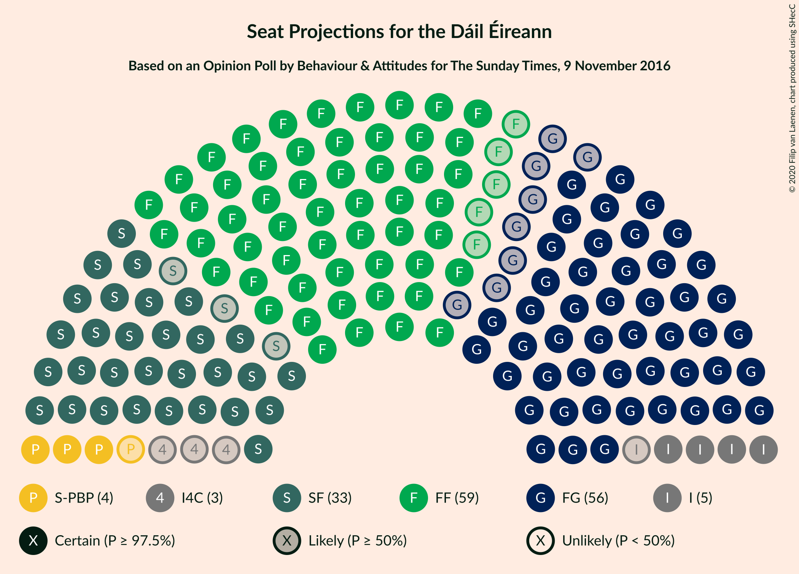
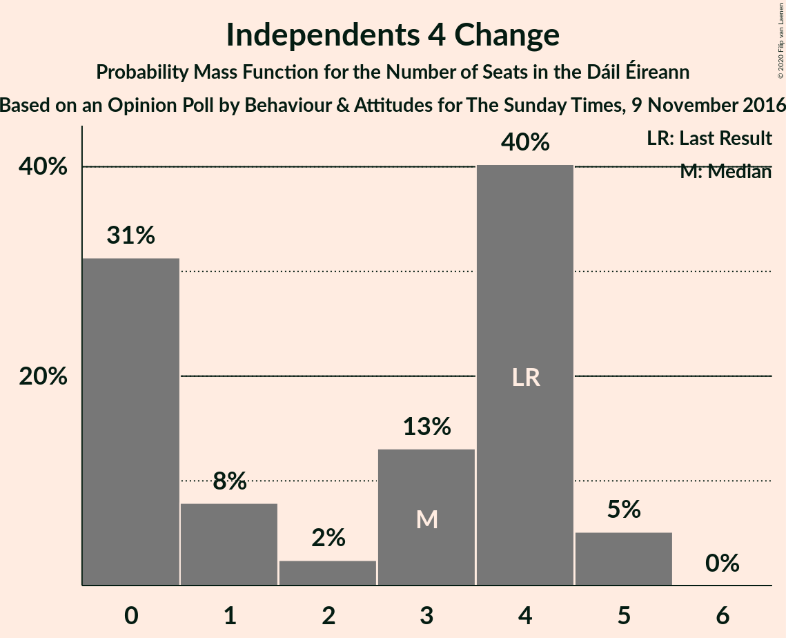
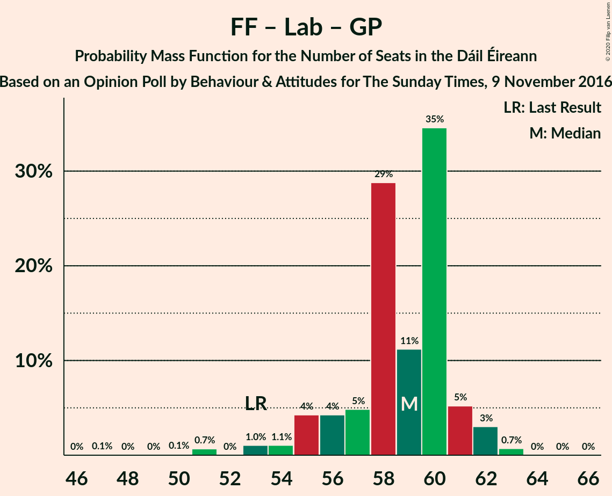

# Opinion Poll by Behaviour & Attitudes for The Sunday Times, 9 November 2016

<a href="#voting-intentions">Voting Intentions</a> | <a href="#seats">Seats</a> | <a href="#coalitions">Coalitions</a> | <a href="#technical-information">Technical Information</a>

## Voting Intentions

### Confidence Intervals

| Party | Last Result | Poll Result | 80% Confidence Interval | 90% Confidence Interval | 95% Confidence Interval | 99% Confidence Interval |
|:-----:|:-----------:|:-----------:|:-----------------------:|:-----------------------:|:-----------------------:|:-----------------------:|
| Fianna Fáil | 24.3% | 30.2% | 28.3–32.2% |27.8–32.8% |27.3–33.2% |26.4–34.2% |
| Fine Gael | 25.5% | 28.2% | 26.3–30.1% |25.8–30.7% |25.3–31.1% |24.5–32.1% |
| Sinn Féin | 13.8% | 17.1% | 15.6–18.8% |15.2–19.3% |14.8–19.7% |14.1–20.5% |
| Independent | 15.9% | 9.3% | 8.2–10.7% |7.9–11.0% |7.6–11.4% |7.1–12.0% |
| Labour Party | 6.6% | 3.0% | 2.4–3.9% |2.2–4.1% |2.1–4.4% |1.8–4.8% |
| Solidarity–People Before Profit | 3.9% | 3.0% | 2.4–3.9% |2.2–4.1% |2.1–4.4% |1.8–4.8% |
| Green Party/Comhaontas Glas | 2.7% | 2.1% | 1.6–2.8% |1.4–3.0% |1.3–3.2% |1.1–3.6% |
| Independents 4 Change | 1.5% | 1.2% | 0.8–1.8% |0.7–2.0% |0.7–2.1% |0.5–2.5% |
| Social Democrats | 3.0% | 0.2% | 0.1–0.6% |0.1–0.7% |0.1–0.8% |0.0–1.0% |
| Renua Ireland | 2.2% | 0.1% | 0.1–0.6% |0.1–0.7% |0.1–0.8% |0.0–1.0% |

*Note:* The poll result column reflects the actual value used in the calculations. Published results may vary slightly, and in addition be rounded to fewer digits.

## Seats

### Confidence Intervals

| Party | Last Result | Median | 80% Confidence Interval | 90% Confidence Interval | 95% Confidence Interval | 99% Confidence Interval |
|:-----:|:-----------:|:------:|:-----------------------:|:-----------------------:|:-----------------------:|:-----------------------:|
| <a href="#fianna-fáil">Fianna Fáil</a> | 44 | 59 | 55–60 |55–61 |54–61 |51–62 |
| <a href="#fine-gael">Fine Gael</a> | 49 | 56 | 51–58 |49–61 |48–62 |46–64 |
| <a href="#sinn-féin">Sinn Féin</a> | 23 | 33 | 31–35 |30–36 |30–36 |27–39 |
| <a href="#independent">Independent</a> | 19 | 5 | 4–8 |4–9 |4–11 |4–12 |
| <a href="#labour-party">Labour Party</a> | 7 | 0 | 0 |0 |0–1 |0–1 |
| <a href="#solidarity–people-before-profit">Solidarity–People Before Profit</a> | 6 | 4 | 4–5 |4–6 |3–6 |0–8 |
| <a href="#green-party/comhaontas-glas">Green Party/Comhaontas Glas</a> | 2 | 0 | 0–1 |0–1 |0–1 |0–2 |
| <a href="#independents-4-change">Independents 4 Change</a> | 4 | 3 | 0–4 |0–5 |0–5 |0–5 |
| <a href="#social-democrats">Social Democrats</a> | 3 | 0 | 0 |0 |0 |0–2 |
| <a href="#renua-ireland">Renua Ireland</a> | 0 | 0 | 0 |0 |0 |0 |

### Fianna Fáil

*For a full overview of the results for this party, see the [Fianna Fáil](party-fiannafáil.html) page.*

| Number of Seats | Probability | Accumulated | Special Marks |
|:---------------:|:-----------:|:-----------:|:-------------:|
| 44 | 0% | 100% | Last Result |
| 45 | 0% | 100% |  |
| 46 | 0.1% | 100% |  |
| 47 | 0% | 99.9% |  |
| 48 | 0% | 99.9% |  |
| 49 | 0% | 99.9% |  |
| 50 | 0.1% | 99.9% |  |
| 51 | 0.7% | 99.8% |  |
| 52 | 0.1% | 99.1% |  |
| 53 | 1.4% | 99.0% |  |
| 54 | 1.1% | 98% |  |
| 55 | 7% | 97% |  |
| 56 | 2% | 90% |  |
| 57 | 5% | 88% |  |
| 58 | 30% | 83% |  |
| 59 | 16% | 53% | Median |
| 60 | 30% | 37% |  |
| 61 | 6% | 7% |  |
| 62 | 1.4% | 2% |  |
| 63 | 0.2% | 0.2% |  |
| 64 | 0% | 0% |  |

### Fine Gael

*For a full overview of the results for this party, see the [Fine Gael](party-finegael.html) page.*

| Number of Seats | Probability | Accumulated | Special Marks |
|:---------------:|:-----------:|:-----------:|:-------------:|
| 42 | 0.1% | 100% |  |
| 43 | 0.1% | 99.9% |  |
| 44 | 0% | 99.8% |  |
| 45 | 0.1% | 99.8% |  |
| 46 | 1.3% | 99.6% |  |
| 47 | 0.6% | 98% |  |
| 48 | 0.6% | 98% |  |
| 49 | 3% | 97% | Last Result |
| 50 | 0.2% | 94% |  |
| 51 | 4% | 94% |  |
| 52 | 0.2% | 89% |  |
| 53 | 3% | 89% |  |
| 54 | 12% | 86% |  |
| 55 | 7% | 74% |  |
| 56 | 26% | 67% | Median |
| 57 | 6% | 41% |  |
| 58 | 26% | 35% |  |
| 59 | 1.5% | 9% |  |
| 60 | 2% | 8% |  |
| 61 | 1.0% | 6% |  |
| 62 | 3% | 5% |  |
| 63 | 1.0% | 2% |  |
| 64 | 0.4% | 0.7% |  |
| 65 | 0% | 0.3% |  |
| 66 | 0.3% | 0.3% |  |
| 67 | 0% | 0% |  |

### Sinn Féin

*For a full overview of the results for this party, see the [Sinn Féin](party-sinnféin.html) page.*

| Number of Seats | Probability | Accumulated | Special Marks |
|:---------------:|:-----------:|:-----------:|:-------------:|
| 23 | 0% | 100% | Last Result |
| 24 | 0.1% | 100% |  |
| 25 | 0% | 99.9% |  |
| 26 | 0% | 99.9% |  |
| 27 | 0.7% | 99.9% |  |
| 28 | 0.3% | 99.3% |  |
| 29 | 0.8% | 99.0% |  |
| 30 | 5% | 98% |  |
| 31 | 12% | 93% |  |
| 32 | 20% | 82% |  |
| 33 | 15% | 62% | Median |
| 34 | 13% | 47% |  |
| 35 | 28% | 34% |  |
| 36 | 4% | 6% |  |
| 37 | 0.1% | 2% |  |
| 38 | 0.2% | 2% |  |
| 39 | 1.3% | 2% |  |
| 40 | 0.2% | 0.4% |  |
| 41 | 0.2% | 0.2% |  |
| 42 | 0% | 0% |  |

### Independent

*For a full overview of the results for this party, see the [Independent](party-independent.html) page.*

| Number of Seats | Probability | Accumulated | Special Marks |
|:---------------:|:-----------:|:-----------:|:-------------:|
| 4 | 25% | 100% |  |
| 5 | 33% | 75% | Median |
| 6 | 30% | 43% |  |
| 7 | 2% | 13% |  |
| 8 | 4% | 11% |  |
| 9 | 4% | 7% |  |
| 10 | 0.2% | 3% |  |
| 11 | 1.0% | 3% |  |
| 12 | 1.4% | 2% |  |
| 13 | 0.1% | 0.2% |  |
| 14 | 0.1% | 0.1% |  |
| 15 | 0% | 0% |  |
| 16 | 0% | 0% |  |
| 17 | 0% | 0% |  |
| 18 | 0% | 0% |  |
| 19 | 0% | 0% | Last Result |

### Labour Party

*For a full overview of the results for this party, see the [Labour Party](party-labourparty.html) page.*

| Number of Seats | Probability | Accumulated | Special Marks |
|:---------------:|:-----------:|:-----------:|:-------------:|
| 0 | 97% | 100% | Median |
| 1 | 3% | 3% |  |
| 2 | 0.3% | 0.4% |  |
| 3 | 0% | 0% |  |
| 4 | 0% | 0% |  |
| 5 | 0% | 0% |  |
| 6 | 0% | 0% |  |
| 7 | 0% | 0% | Last Result |

### Solidarity–People Before Profit

*For a full overview of the results for this party, see the [Solidarity–People Before Profit](party-solidarity–peoplebeforeprofit.html) page.*

| Number of Seats | Probability | Accumulated | Special Marks |
|:---------------:|:-----------:|:-----------:|:-------------:|
| 0 | 2% | 100% |  |
| 1 | 0.3% | 98% |  |
| 2 | 0.2% | 98% |  |
| 3 | 1.0% | 98% |  |
| 4 | 81% | 97% | Median |
| 5 | 7% | 16% |  |
| 6 | 8% | 9% | Last Result |
| 7 | 0.3% | 1.0% |  |
| 8 | 0.2% | 0.6% |  |
| 9 | 0.5% | 0.5% |  |
| 10 | 0% | 0% |  |

### Green Party/Comhaontas Glas

*For a full overview of the results for this party, see the [Green Party/Comhaontas Glas](party-greenpartycomhaontasglas.html) page.*

| Number of Seats | Probability | Accumulated | Special Marks |
|:---------------:|:-----------:|:-----------:|:-------------:|
| 0 | 88% | 100% | Median |
| 1 | 10% | 12% |  |
| 2 | 2% | 2% | Last Result |
| 3 | 0% | 0% |  |

### Independents 4 Change

*For a full overview of the results for this party, see the [Independents 4 Change](party-independents4change.html) page.*

| Number of Seats | Probability | Accumulated | Special Marks |
|:---------------:|:-----------:|:-----------:|:-------------:|
| 0 | 31% | 100% |  |
| 1 | 8% | 69% |  |
| 2 | 2% | 61% |  |
| 3 | 13% | 58% | Median |
| 4 | 40% | 45% | Last Result |
| 5 | 5% | 5% |  |
| 6 | 0% | 0% |  |

### Social Democrats

*For a full overview of the results for this party, see the [Social Democrats](party-socialdemocrats.html) page.*

| Number of Seats | Probability | Accumulated | Special Marks |
|:---------------:|:-----------:|:-----------:|:-------------:|
| 0 | 98% | 100% | Median |
| 1 | 1.1% | 2% |  |
| 2 | 0.7% | 0.7% |  |
| 3 | 0% | 0% | Last Result |

### Renua Ireland

*For a full overview of the results for this party, see the [Renua Ireland](party-renuaireland.html) page.*

| Number of Seats | Probability | Accumulated | Special Marks |
|:---------------:|:-----------:|:-----------:|:-------------:|
| 0 | 100% | 100% | Last Result, Median |

## Coalitions

### Confidence Intervals

| Coalition | Last Result | Median | Majority? | 80% Confidence Interval | 90% Confidence Interval | 95% Confidence Interval | 99% Confidence Interval |
|:---------:|:-----------:|:------:|:---------:|:-----------------------:|:-----------------------:|:-----------------------:|:-----------------------:|
| Fianna Fáil – Fine Gael | 93 | 116 | 100% | 109–116 | 108–117 | 108–118 | 105–122 |
| Fianna Fáil – Sinn Féin | 67 | 92 | 99.9% | 89–94 | 88–94 | 87–95 | 84–99 |
| Fine Gael – Green Party/Comhaontas Glas | 51 | 56 | 0% | 51–58 | 49–62 | 48–63 | 46–64 |
| Fine Gael – Labour Party – Green Party/Comhaontas Glas | 58 | 56 | 0% | 51–58 | 49–62 | 48–63 | 46–65 |
| Fine Gael – Labour Party – Green Party/Comhaontas Glas – Social Democrats | 61 | 56 | 0% | 51–58 | 49–62 | 48–63 | 46–65 |
| Fianna Fáil – Green Party/Comhaontas Glas | 46 | 59 | 0% | 56–60 | 55–61 | 54–62 | 51–63 |
| Fianna Fáil – Labour Party – Green Party/Comhaontas Glas | 53 | 59 | 0% | 56–60 | 55–61 | 54–62 | 51–63 |
| Fianna Fáil – Labour Party – Green Party/Comhaontas Glas – Social Democrats | 56 | 59 | 0% | 56–60 | 55–61 | 54–62 | 51–63 |
| Fine Gael | 49 | 56 | 0% | 51–58 | 49–61 | 48–62 | 46–64 |
| Fine Gael – Labour Party | 56 | 56 | 0% | 51–58 | 49–61 | 48–62 | 46–64 |
| Fianna Fáil – Labour Party | 51 | 59 | 0% | 55–60 | 55–61 | 54–61 | 51–62 |

### Fianna Fáil – Fine Gael

| Number of Seats | Probability | Accumulated | Special Marks |
|:---------------:|:-----------:|:-----------:|:-------------:|
| 93 | 0% | 100% | Last Result |
| 94 | 0% | 100% |  |
| 95 | 0% | 100% |  |
| 96 | 0% | 100% |  |
| 97 | 0% | 100% |  |
| 98 | 0% | 100% |  |
| 99 | 0% | 100% |  |
| 100 | 0% | 100% |  |
| 101 | 0% | 100% |  |
| 102 | 0% | 100% |  |
| 103 | 0.1% | 99.9% |  |
| 104 | 0.3% | 99.8% |  |
| 105 | 0% | 99.5% |  |
| 106 | 0.1% | 99.5% |  |
| 107 | 0.6% | 99.4% |  |
| 108 | 6% | 98.8% |  |
| 109 | 3% | 93% |  |
| 110 | 0.7% | 90% |  |
| 111 | 3% | 89% |  |
| 112 | 4% | 86% |  |
| 113 | 14% | 81% |  |
| 114 | 4% | 67% |  |
| 115 | 2% | 63% | Median |
| 116 | 56% | 61% |  |
| 117 | 3% | 6% |  |
| 118 | 1.0% | 3% |  |
| 119 | 1.0% | 2% |  |
| 120 | 0.2% | 1.2% |  |
| 121 | 0% | 1.0% |  |
| 122 | 0.8% | 0.9% |  |
| 123 | 0.1% | 0.1% |  |
| 124 | 0% | 0% |  |

### Fianna Fáil – Sinn Féin

| Number of Seats | Probability | Accumulated | Special Marks |
|:---------------:|:-----------:|:-----------:|:-------------:|
| 67 | 0% | 100% | Last Result |
| 68 | 0% | 100% |  |
| 69 | 0% | 100% |  |
| 70 | 0% | 100% |  |
| 71 | 0% | 100% |  |
| 72 | 0% | 100% |  |
| 73 | 0% | 100% |  |
| 74 | 0% | 100% |  |
| 75 | 0% | 100% |  |
| 76 | 0% | 100% |  |
| 77 | 0% | 100% |  |
| 78 | 0% | 100% |  |
| 79 | 0.1% | 100% |  |
| 80 | 0% | 99.9% |  |
| 81 | 0.1% | 99.9% | Majority |
| 82 | 0% | 99.8% |  |
| 83 | 0.1% | 99.8% |  |
| 84 | 0.4% | 99.6% |  |
| 85 | 0.7% | 99.3% |  |
| 86 | 1.0% | 98.6% |  |
| 87 | 2% | 98% |  |
| 88 | 3% | 96% |  |
| 89 | 8% | 93% |  |
| 90 | 2% | 85% |  |
| 91 | 15% | 82% |  |
| 92 | 29% | 68% | Median |
| 93 | 27% | 39% |  |
| 94 | 8% | 12% |  |
| 95 | 2% | 4% |  |
| 96 | 0.2% | 2% |  |
| 97 | 0.2% | 2% |  |
| 98 | 0.1% | 1.4% |  |
| 99 | 1.0% | 1.4% |  |
| 100 | 0.2% | 0.3% |  |
| 101 | 0.1% | 0.1% |  |
| 102 | 0% | 0% |  |

### Fine Gael – Green Party/Comhaontas Glas

| Number of Seats | Probability | Accumulated | Special Marks |
|:---------------:|:-----------:|:-----------:|:-------------:|
| 43 | 0.1% | 100% |  |
| 44 | 0.1% | 99.9% |  |
| 45 | 0.2% | 99.8% |  |
| 46 | 1.4% | 99.7% |  |
| 47 | 0.6% | 98% |  |
| 48 | 0.6% | 98% |  |
| 49 | 3% | 97% |  |
| 50 | 0.1% | 94% |  |
| 51 | 4% | 94% | Last Result |
| 52 | 0.3% | 90% |  |
| 53 | 3% | 89% |  |
| 54 | 11% | 87% |  |
| 55 | 6% | 75% |  |
| 56 | 28% | 69% | Median |
| 57 | 2% | 41% |  |
| 58 | 30% | 39% |  |
| 59 | 1.1% | 9% |  |
| 60 | 2% | 8% |  |
| 61 | 0.8% | 6% |  |
| 62 | 1.2% | 5% |  |
| 63 | 3% | 4% |  |
| 64 | 0.3% | 0.8% |  |
| 65 | 0.2% | 0.5% |  |
| 66 | 0.3% | 0.3% |  |
| 67 | 0% | 0% |  |

### Fine Gael – Labour Party – Green Party/Comhaontas Glas

| Number of Seats | Probability | Accumulated | Special Marks |
|:---------------:|:-----------:|:-----------:|:-------------:|
| 43 | 0.1% | 100% |  |
| 44 | 0.1% | 99.9% |  |
| 45 | 0.1% | 99.8% |  |
| 46 | 1.3% | 99.7% |  |
| 47 | 0.6% | 98% |  |
| 48 | 0.6% | 98% |  |
| 49 | 3% | 97% |  |
| 50 | 0.1% | 94% |  |
| 51 | 4% | 94% |  |
| 52 | 0.3% | 90% |  |
| 53 | 3% | 89% |  |
| 54 | 11% | 87% |  |
| 55 | 6% | 76% |  |
| 56 | 28% | 70% | Median |
| 57 | 2% | 41% |  |
| 58 | 30% | 39% | Last Result |
| 59 | 1.0% | 10% |  |
| 60 | 3% | 9% |  |
| 61 | 0.8% | 6% |  |
| 62 | 1.3% | 5% |  |
| 63 | 3% | 4% |  |
| 64 | 0.3% | 0.8% |  |
| 65 | 0.3% | 0.6% |  |
| 66 | 0.2% | 0.3% |  |
| 67 | 0.1% | 0.1% |  |
| 68 | 0% | 0% |  |

### Fine Gael – Labour Party – Green Party/Comhaontas Glas – Social Democrats

| Number of Seats | Probability | Accumulated | Special Marks |
|:---------------:|:-----------:|:-----------:|:-------------:|
| 43 | 0.1% | 100% |  |
| 44 | 0.1% | 99.9% |  |
| 45 | 0.2% | 99.8% |  |
| 46 | 1.3% | 99.7% |  |
| 47 | 0.6% | 98% |  |
| 48 | 0.6% | 98% |  |
| 49 | 3% | 97% |  |
| 50 | 0.1% | 94% |  |
| 51 | 4% | 94% |  |
| 52 | 0.3% | 90% |  |
| 53 | 3% | 89% |  |
| 54 | 11% | 87% |  |
| 55 | 6% | 76% |  |
| 56 | 28% | 70% | Median |
| 57 | 2% | 42% |  |
| 58 | 30% | 40% |  |
| 59 | 0.6% | 10% |  |
| 60 | 3% | 9% |  |
| 61 | 0.8% | 6% | Last Result |
| 62 | 1.3% | 5% |  |
| 63 | 3% | 4% |  |
| 64 | 0.3% | 0.9% |  |
| 65 | 0.3% | 0.6% |  |
| 66 | 0.2% | 0.3% |  |
| 67 | 0.1% | 0.1% |  |
| 68 | 0% | 0% |  |

### Fianna Fáil – Green Party/Comhaontas Glas

| Number of Seats | Probability | Accumulated | Special Marks |
|:---------------:|:-----------:|:-----------:|:-------------:|
| 46 | 0.1% | 100% | Last Result |
| 47 | 0% | 99.9% |  |
| 48 | 0% | 99.9% |  |
| 49 | 0% | 99.9% |  |
| 50 | 0.1% | 99.9% |  |
| 51 | 0.7% | 99.8% |  |
| 52 | 0% | 99.1% |  |
| 53 | 1.2% | 99.0% |  |
| 54 | 0.9% | 98% |  |
| 55 | 4% | 97% |  |
| 56 | 4% | 93% |  |
| 57 | 5% | 88% |  |
| 58 | 29% | 83% |  |
| 59 | 12% | 55% | Median |
| 60 | 35% | 43% |  |
| 61 | 5% | 8% |  |
| 62 | 3% | 3% |  |
| 63 | 0.7% | 0.7% |  |
| 64 | 0% | 0% |  |

### Fianna Fáil – Labour Party – Green Party/Comhaontas Glas

| Number of Seats | Probability | Accumulated | Special Marks |
|:---------------:|:-----------:|:-----------:|:-------------:|
| 47 | 0.1% | 100% |  |
| 48 | 0% | 99.9% |  |
| 49 | 0% | 99.9% |  |
| 50 | 0.1% | 99.9% |  |
| 51 | 0.7% | 99.8% |  |
| 52 | 0% | 99.1% |  |
| 53 | 1.0% | 99.1% | Last Result |
| 54 | 1.1% | 98% |  |
| 55 | 4% | 97% |  |
| 56 | 4% | 93% |  |
| 57 | 5% | 88% |  |
| 58 | 29% | 84% |  |
| 59 | 11% | 55% | Median |
| 60 | 35% | 44% |  |
| 61 | 5% | 9% |  |
| 62 | 3% | 4% |  |
| 63 | 0.7% | 0.8% |  |
| 64 | 0% | 0.1% |  |
| 65 | 0% | 0% |  |

### Fianna Fáil – Labour Party – Green Party/Comhaontas Glas – Social Democrats

| Number of Seats | Probability | Accumulated | Special Marks |
|:---------------:|:-----------:|:-----------:|:-------------:|
| 47 | 0.1% | 100% |  |
| 48 | 0% | 99.9% |  |
| 49 | 0% | 99.9% |  |
| 50 | 0.1% | 99.9% |  |
| 51 | 0.7% | 99.8% |  |
| 52 | 0% | 99.1% |  |
| 53 | 0.8% | 99.1% |  |
| 54 | 1.2% | 98% |  |
| 55 | 4% | 97% |  |
| 56 | 4% | 93% | Last Result |
| 57 | 5% | 89% |  |
| 58 | 29% | 84% |  |
| 59 | 11% | 55% | Median |
| 60 | 34% | 44% |  |
| 61 | 5% | 10% |  |
| 62 | 4% | 4% |  |
| 63 | 0.8% | 0.9% |  |
| 64 | 0% | 0.1% |  |
| 65 | 0% | 0% |  |

### Fine Gael

| Number of Seats | Probability | Accumulated | Special Marks |
|:---------------:|:-----------:|:-----------:|:-------------:|
| 42 | 0.1% | 100% |  |
| 43 | 0.1% | 99.9% |  |
| 44 | 0% | 99.8% |  |
| 45 | 0.1% | 99.8% |  |
| 46 | 1.3% | 99.6% |  |
| 47 | 0.6% | 98% |  |
| 48 | 0.6% | 98% |  |
| 49 | 3% | 97% | Last Result |
| 50 | 0.2% | 94% |  |
| 51 | 4% | 94% |  |
| 52 | 0.2% | 89% |  |
| 53 | 3% | 89% |  |
| 54 | 12% | 86% |  |
| 55 | 7% | 74% |  |
| 56 | 26% | 67% | Median |
| 57 | 6% | 41% |  |
| 58 | 26% | 35% |  |
| 59 | 1.5% | 9% |  |
| 60 | 2% | 8% |  |
| 61 | 1.0% | 6% |  |
| 62 | 3% | 5% |  |
| 63 | 1.0% | 2% |  |
| 64 | 0.4% | 0.7% |  |
| 65 | 0% | 0.3% |  |
| 66 | 0.3% | 0.3% |  |
| 67 | 0% | 0% |  |

### Fine Gael – Labour Party

| Number of Seats | Probability | Accumulated | Special Marks |
|:---------------:|:-----------:|:-----------:|:-------------:|
| 42 | 0.1% | 100% |  |
| 43 | 0.1% | 99.9% |  |
| 44 | 0% | 99.8% |  |
| 45 | 0.1% | 99.8% |  |
| 46 | 1.3% | 99.7% |  |
| 47 | 0.6% | 98% |  |
| 48 | 0.6% | 98% |  |
| 49 | 3% | 97% |  |
| 50 | 0.2% | 94% |  |
| 51 | 4% | 94% |  |
| 52 | 0.2% | 89% |  |
| 53 | 3% | 89% |  |
| 54 | 13% | 86% |  |
| 55 | 6% | 74% |  |
| 56 | 26% | 67% | Last Result, Median |
| 57 | 6% | 41% |  |
| 58 | 26% | 35% |  |
| 59 | 1.2% | 9% |  |
| 60 | 2% | 8% |  |
| 61 | 1.0% | 6% |  |
| 62 | 3% | 5% |  |
| 63 | 1.1% | 2% |  |
| 64 | 0.3% | 0.7% |  |
| 65 | 0.1% | 0.4% |  |
| 66 | 0.2% | 0.3% |  |
| 67 | 0.1% | 0.1% |  |
| 68 | 0% | 0% |  |

### Fianna Fáil – Labour Party

| Number of Seats | Probability | Accumulated | Special Marks |
|:---------------:|:-----------:|:-----------:|:-------------:|
| 47 | 0.1% | 100% |  |
| 48 | 0% | 99.9% |  |
| 49 | 0% | 99.9% |  |
| 50 | 0.1% | 99.9% |  |
| 51 | 0.7% | 99.8% | Last Result |
| 52 | 0.1% | 99.1% |  |
| 53 | 1.2% | 99.0% |  |
| 54 | 1.3% | 98% |  |
| 55 | 7% | 97% |  |
| 56 | 2% | 90% |  |
| 57 | 5% | 88% |  |
| 58 | 30% | 83% |  |
| 59 | 15% | 53% | Median |
| 60 | 31% | 39% |  |
| 61 | 6% | 8% |  |
| 62 | 2% | 2% |  |
| 63 | 0.2% | 0.3% |  |
| 64 | 0% | 0% |  |

## Technical Information

### Opinion Poll

+ **Polling firm:** Behaviour & Attitudes
+ **Commissioner(s):** The Sunday Times
+ **Fieldwork period:** 9 November 2016

### Calculations

+ **Sample size:** 923
+ **Simulations done:** 131,072
+ **Error estimate:** 0.96%

