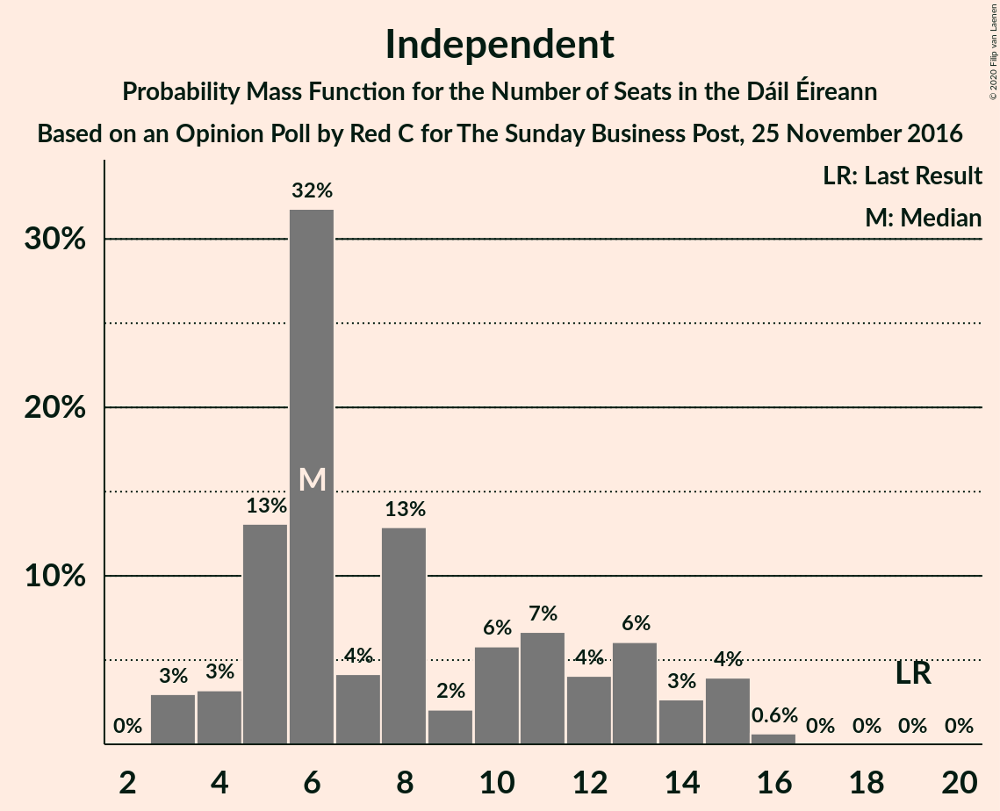
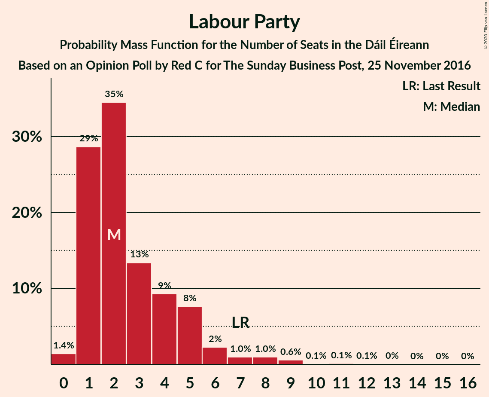
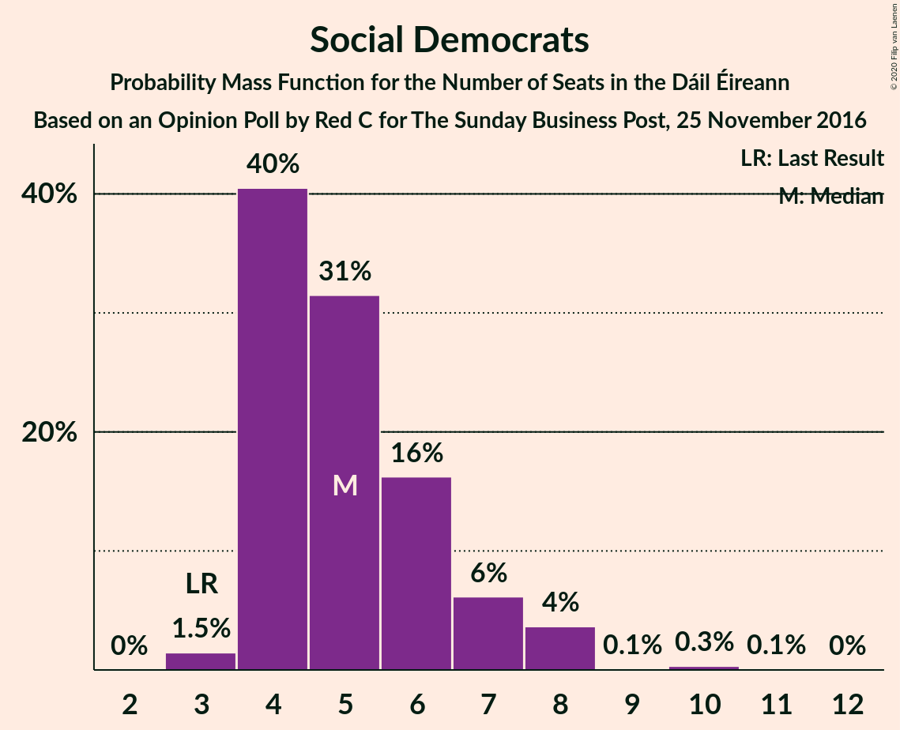
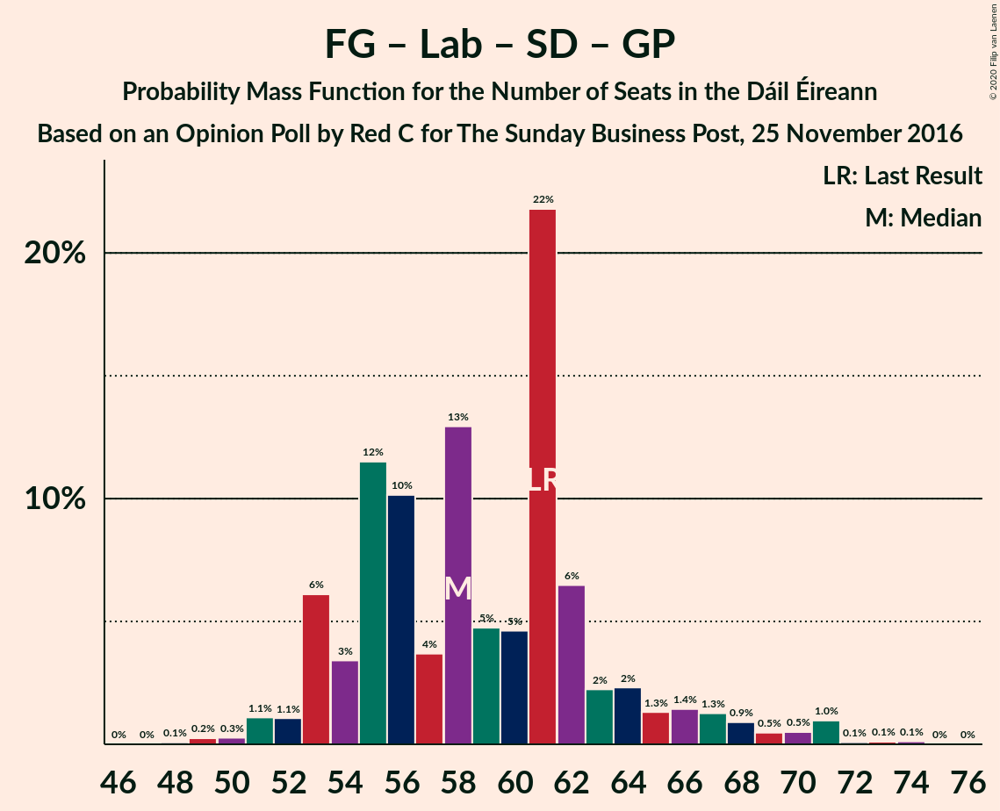
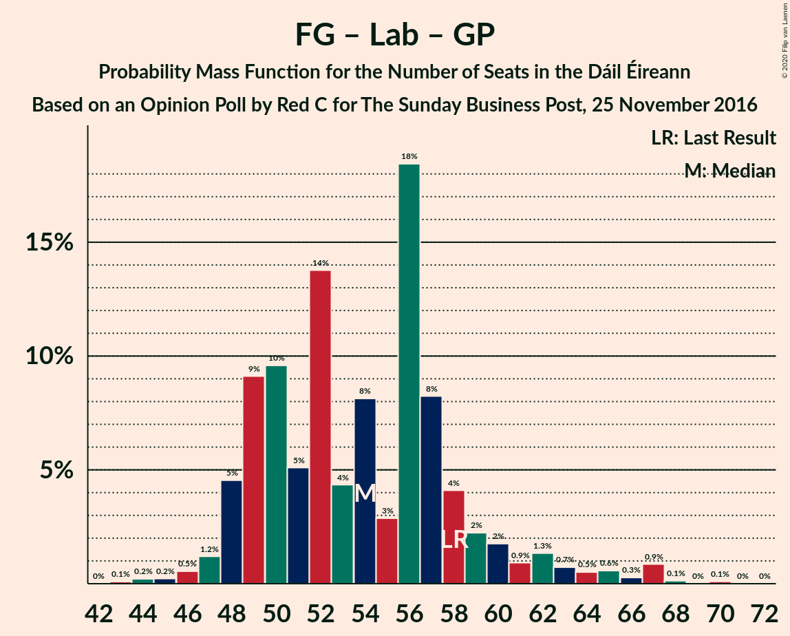

# Opinion Poll by Red C for The Sunday Business Post, 25 November 2016

<a href="#voting-intentions">Voting Intentions</a> | <a href="#seats">Seats</a> | <a href="#coalitions">Coalitions</a> | <a href="#technical-information">Technical Information</a>

## Voting Intentions

### Confidence Intervals

| Party | Last Result | Poll Result | 80% Confidence Interval | 90% Confidence Interval | 95% Confidence Interval | 99% Confidence Interval |
|:-----:|:-----------:|:-----------:|:-----------------------:|:-----------------------:|:-----------------------:|:-----------------------:|
| Fine Gael | 25.5% | 25.3% | 23.6–27.1% |23.1–27.6% |22.7–28.1% |21.9–29.0% |
| Fianna Fáil | 24.3% | 24.2% | 22.5–26.0% |22.1–26.5% |21.6–27.0% |20.9–27.8% |
| Sinn Féin | 13.8% | 16.2% | 14.8–17.8% |14.4–18.2% |14.0–18.6% |13.4–19.4% |
| Independent | 15.9% | 10.2% | 9.1–11.5% |8.7–11.9% |8.5–12.2% |8.0–12.9% |
| Labour Party | 6.6% | 5.1% | 4.3–6.1% |4.1–6.4% |3.9–6.6% |3.6–7.2% |
| Solidarity–People Before Profit | 3.9% | 5.1% | 4.3–6.1% |4.1–6.4% |3.9–6.6% |3.6–7.2% |
| Social Democrats | 3.0% | 4.0% | 3.3–4.9% |3.1–5.2% |2.9–5.4% |2.7–5.9% |
| Green Party/Comhaontas Glas | 2.7% | 3.0% | 2.4–3.8% |2.2–4.1% |2.1–4.3% |1.9–4.7% |
| Independents 4 Change | 1.5% | 1.3% | 0.9–1.9% |0.8–2.1% |0.8–2.2% |0.6–2.5% |
| Renua Ireland | 2.2% | 1.0% | 0.7–1.5% |0.6–1.7% |0.5–1.8% |0.4–2.1% |

*Note:* The poll result column reflects the actual value used in the calculations. Published results may vary slightly, and in addition be rounded to fewer digits.

## Seats

### Confidence Intervals

| Party | Last Result | Median | 80% Confidence Interval | 90% Confidence Interval | 95% Confidence Interval | 99% Confidence Interval |
|:-----:|:-----------:|:------:|:-----------------------:|:-----------------------:|:-----------------------:|:-----------------------:|
| <a href="#fine-gael">Fine Gael</a> | 49 | 49 | 44–55 |43–56 |42–58 |41–61 |
| <a href="#fianna-fáil">Fianna Fáil</a> | 44 | 48 | 44–53 |43–54 |40–56 |38–57 |
| <a href="#sinn-féin">Sinn Féin</a> | 23 | 33 | 31–35 |29–37 |28–37 |26–37 |
| <a href="#independent">Independent</a> | 19 | 6 | 5–13 |4–14 |3–15 |3–16 |
| <a href="#labour-party">Labour Party</a> | 7 | 2 | 1–5 |1–6 |1–7 |0–9 |
| <a href="#solidarity–people-before-profit">Solidarity–People Before Profit</a> | 6 | 9 | 7–10 |6–10 |5–10 |4–10 |
| <a href="#social-democrats">Social Democrats</a> | 3 | 5 | 4–7 |4–7 |4–8 |3–9 |
| <a href="#green-party/comhaontas-glas">Green Party/Comhaontas Glas</a> | 2 | 2 | 0–2 |0–2 |0–3 |0–3 |
| <a href="#independents-4-change">Independents 4 Change</a> | 4 | 3 | 1–5 |0–5 |0–5 |0–5 |
| <a href="#renua-ireland">Renua Ireland</a> | 0 | 0 | 0 |0 |0 |0 |

### Fine Gael

*For a full overview of the results for this party, see the [Fine Gael](party-finegael.html) page.*

| Number of Seats | Probability | Accumulated | Special Marks |
|:---------------:|:-----------:|:-----------:|:-------------:|
| 40 | 0.2% | 100% |  |
| 41 | 0.5% | 99.8% |  |
| 42 | 3% | 99.2% |  |
| 43 | 3% | 96% |  |
| 44 | 3% | 93% |  |
| 45 | 9% | 90% |  |
| 46 | 9% | 80% |  |
| 47 | 3% | 72% |  |
| 48 | 9% | 69% |  |
| 49 | 14% | 59% | Last Result, Median |
| 50 | 2% | 46% |  |
| 51 | 5% | 43% |  |
| 52 | 3% | 39% |  |
| 53 | 18% | 36% |  |
| 54 | 3% | 18% |  |
| 55 | 8% | 15% |  |
| 56 | 2% | 6% |  |
| 57 | 0.9% | 5% |  |
| 58 | 2% | 4% |  |
| 59 | 1.2% | 2% |  |
| 60 | 0.3% | 1.1% |  |
| 61 | 0.4% | 0.8% |  |
| 62 | 0.1% | 0.4% |  |
| 63 | 0% | 0.2% |  |
| 64 | 0.1% | 0.2% |  |
| 65 | 0.1% | 0.1% |  |
| 66 | 0% | 0% |  |

### Fianna Fáil

*For a full overview of the results for this party, see the [Fianna Fáil](party-fiannafáil.html) page.*

| Number of Seats | Probability | Accumulated | Special Marks |
|:---------------:|:-----------:|:-----------:|:-------------:|
| 36 | 0.1% | 100% |  |
| 37 | 0.1% | 99.9% |  |
| 38 | 0.7% | 99.8% |  |
| 39 | 0.5% | 99.1% |  |
| 40 | 1.1% | 98.6% |  |
| 41 | 1.3% | 97% |  |
| 42 | 0.7% | 96% |  |
| 43 | 0.9% | 95% |  |
| 44 | 5% | 95% | Last Result |
| 45 | 4% | 90% |  |
| 46 | 11% | 86% |  |
| 47 | 18% | 75% |  |
| 48 | 11% | 57% | Median |
| 49 | 10% | 46% |  |
| 50 | 6% | 36% |  |
| 51 | 10% | 30% |  |
| 52 | 7% | 20% |  |
| 53 | 8% | 14% |  |
| 54 | 1.3% | 6% |  |
| 55 | 2% | 4% |  |
| 56 | 2% | 3% |  |
| 57 | 0.4% | 0.6% |  |
| 58 | 0.1% | 0.1% |  |
| 59 | 0% | 0% |  |

### Sinn Féin

*For a full overview of the results for this party, see the [Sinn Féin](party-sinnféin.html) page.*

| Number of Seats | Probability | Accumulated | Special Marks |
|:---------------:|:-----------:|:-----------:|:-------------:|
| 22 | 0.1% | 100% |  |
| 23 | 0.1% | 99.9% | Last Result |
| 24 | 0.1% | 99.9% |  |
| 25 | 0.1% | 99.8% |  |
| 26 | 0.3% | 99.7% |  |
| 27 | 0.2% | 99.3% |  |
| 28 | 4% | 99.1% |  |
| 29 | 0.8% | 95% |  |
| 30 | 3% | 95% |  |
| 31 | 7% | 92% |  |
| 32 | 7% | 85% |  |
| 33 | 34% | 78% | Median |
| 34 | 31% | 44% |  |
| 35 | 3% | 13% |  |
| 36 | 4% | 10% |  |
| 37 | 5% | 6% |  |
| 38 | 0.2% | 0.4% |  |
| 39 | 0.1% | 0.2% |  |
| 40 | 0% | 0.1% |  |
| 41 | 0% | 0% |  |

### Independent

*For a full overview of the results for this party, see the [Independent](party-independent.html) page.*

| Number of Seats | Probability | Accumulated | Special Marks |
|:---------------:|:-----------:|:-----------:|:-------------:|
| 3 | 3% | 100% |  |
| 4 | 3% | 97% |  |
| 5 | 13% | 94% |  |
| 6 | 32% | 81% | Median |
| 7 | 4% | 49% |  |
| 8 | 13% | 45% |  |
| 9 | 2% | 32% |  |
| 10 | 6% | 30% |  |
| 11 | 7% | 24% |  |
| 12 | 4% | 17% |  |
| 13 | 6% | 13% |  |
| 14 | 3% | 7% |  |
| 15 | 4% | 5% |  |
| 16 | 0.6% | 0.6% |  |
| 17 | 0% | 0% |  |
| 18 | 0% | 0% |  |
| 19 | 0% | 0% | Last Result |

### Labour Party

*For a full overview of the results for this party, see the [Labour Party](party-labourparty.html) page.*

| Number of Seats | Probability | Accumulated | Special Marks |
|:---------------:|:-----------:|:-----------:|:-------------:|
| 0 | 1.4% | 100% |  |
| 1 | 29% | 98.6% |  |
| 2 | 35% | 70% | Median |
| 3 | 13% | 35% |  |
| 4 | 9% | 22% |  |
| 5 | 8% | 13% |  |
| 6 | 2% | 5% |  |
| 7 | 1.0% | 3% | Last Result |
| 8 | 1.0% | 2% |  |
| 9 | 0.6% | 1.0% |  |
| 10 | 0.1% | 0.4% |  |
| 11 | 0.1% | 0.3% |  |
| 12 | 0.1% | 0.2% |  |
| 13 | 0% | 0.1% |  |
| 14 | 0% | 0.1% |  |
| 15 | 0% | 0.1% |  |
| 16 | 0% | 0% |  |

### Solidarity–People Before Profit

*For a full overview of the results for this party, see the [Solidarity–People Before Profit](party-solidarity–peoplebeforeprofit.html) page.*

| Number of Seats | Probability | Accumulated | Special Marks |
|:---------------:|:-----------:|:-----------:|:-------------:|
| 3 | 0.1% | 100% |  |
| 4 | 0.8% | 99.9% |  |
| 5 | 4% | 99.1% |  |
| 6 | 3% | 95% | Last Result |
| 7 | 11% | 92% |  |
| 8 | 13% | 81% |  |
| 9 | 22% | 68% | Median |
| 10 | 46% | 46% |  |
| 11 | 0% | 0% |  |

### Social Democrats

*For a full overview of the results for this party, see the [Social Democrats](party-socialdemocrats.html) page.*

| Number of Seats | Probability | Accumulated | Special Marks |
|:---------------:|:-----------:|:-----------:|:-------------:|
| 3 | 1.5% | 100% | Last Result |
| 4 | 40% | 98.5% |  |
| 5 | 31% | 58% | Median |
| 6 | 16% | 27% |  |
| 7 | 6% | 10% |  |
| 8 | 4% | 4% |  |
| 9 | 0.1% | 0.5% |  |
| 10 | 0.3% | 0.4% |  |
| 11 | 0.1% | 0.1% |  |
| 12 | 0% | 0% |  |

### Green Party/Comhaontas Glas

*For a full overview of the results for this party, see the [Green Party/Comhaontas Glas](party-greenpartycomhaontasglas.html) page.*

| Number of Seats | Probability | Accumulated | Special Marks |
|:---------------:|:-----------:|:-----------:|:-------------:|
| 0 | 15% | 100% |  |
| 1 | 19% | 85% |  |
| 2 | 61% | 65% | Last Result, Median |
| 3 | 4% | 4% |  |
| 4 | 0.4% | 0.4% |  |
| 5 | 0% | 0% |  |

### Independents 4 Change

*For a full overview of the results for this party, see the [Independents 4 Change](party-independents4change.html) page.*

| Number of Seats | Probability | Accumulated | Special Marks |
|:---------------:|:-----------:|:-----------:|:-------------:|
| 0 | 9% | 100% |  |
| 1 | 13% | 91% |  |
| 2 | 15% | 78% |  |
| 3 | 27% | 63% | Median |
| 4 | 23% | 36% | Last Result |
| 5 | 13% | 13% |  |
| 6 | 0% | 0% |  |

### Renua Ireland

*For a full overview of the results for this party, see the [Renua Ireland](party-renuaireland.html) page.*

| Number of Seats | Probability | Accumulated | Special Marks |
|:---------------:|:-----------:|:-----------:|:-------------:|
| 0 | 99.7% | 100% | Last Result, Median |
| 1 | 0.1% | 0.3% |  |
| 2 | 0.2% | 0.2% |  |
| 3 | 0% | 0% |  |

## Coalitions

### Confidence Intervals

| Coalition | Last Result | Median | Majority? | 80% Confidence Interval | 90% Confidence Interval | 95% Confidence Interval | 99% Confidence Interval |
|:---------:|:-----------:|:------:|:---------:|:-----------------------:|:-----------------------:|:-----------------------:|:-----------------------:|
| Fine Gael – Fianna Fáil | 93 | 99 | 100% | 92–102 | 91–104 | 90–105 | 88–108 |
| Fianna Fáil – Sinn Féin | 67 | 81 | 54% | 77–87 | 75–87 | 73–89 | 70–91 |
| Fine Gael – Labour Party – Social Democrats – Green Party/Comhaontas Glas | 61 | 58 | 0% | 54–63 | 53–66 | 52–68 | 50–71 |
| Fianna Fáil – Labour Party – Social Democrats – Green Party/Comhaontas Glas | 56 | 57 | 0% | 52–62 | 52–64 | 51–65 | 45–67 |
| Fine Gael – Labour Party – Green Party/Comhaontas Glas | 58 | 54 | 0% | 49–58 | 48–61 | 48–63 | 45–67 |
| Fine Gael – Labour Party | 56 | 52 | 0% | 47–57 | 47–59 | 46–62 | 44–65 |
| Fianna Fáil – Labour Party – Green Party/Comhaontas Glas | 53 | 52 | 0% | 48–57 | 47–59 | 45–61 | 41–62 |
| Fianna Fáil – Labour Party | 51 | 51 | 0% | 47–56 | 46–57 | 44–60 | 39–60 |
| Fine Gael – Green Party/Comhaontas Glas | 51 | 51 | 0% | 46–56 | 45–58 | 43–60 | 43–62 |
| Fine Gael | 49 | 49 | 0% | 44–55 | 43–56 | 42–58 | 41–61 |
| Fianna Fáil – Green Party/Comhaontas Glas | 46 | 50 | 0% | 46–55 | 45–56 | 42–57 | 39–58 |

### Fine Gael – Fianna Fáil

| Number of Seats | Probability | Accumulated | Special Marks |
|:---------------:|:-----------:|:-----------:|:-------------:|
| 85 | 0.1% | 100% |  |
| 86 | 0.1% | 99.9% |  |
| 87 | 0.2% | 99.8% |  |
| 88 | 0.5% | 99.6% |  |
| 89 | 0.5% | 99.0% |  |
| 90 | 2% | 98.6% |  |
| 91 | 2% | 96% |  |
| 92 | 5% | 95% |  |
| 93 | 3% | 89% | Last Result |
| 94 | 3% | 87% |  |
| 95 | 6% | 84% |  |
| 96 | 10% | 78% |  |
| 97 | 4% | 68% | Median |
| 98 | 9% | 65% |  |
| 99 | 8% | 55% |  |
| 100 | 22% | 47% |  |
| 101 | 14% | 25% |  |
| 102 | 2% | 12% |  |
| 103 | 4% | 10% |  |
| 104 | 2% | 5% |  |
| 105 | 1.5% | 4% |  |
| 106 | 1.0% | 2% |  |
| 107 | 0.6% | 1.3% |  |
| 108 | 0.4% | 0.8% |  |
| 109 | 0.3% | 0.4% |  |
| 110 | 0.1% | 0.1% |  |
| 111 | 0% | 0% |  |

### Fianna Fáil – Sinn Féin

| Number of Seats | Probability | Accumulated | Special Marks |
|:---------------:|:-----------:|:-----------:|:-------------:|
| 67 | 0% | 100% | Last Result |
| 68 | 0% | 100% |  |
| 69 | 0.1% | 99.9% |  |
| 70 | 0.5% | 99.8% |  |
| 71 | 0.3% | 99.4% |  |
| 72 | 0.4% | 99.1% |  |
| 73 | 2% | 98.7% |  |
| 74 | 0.9% | 97% |  |
| 75 | 3% | 96% |  |
| 76 | 0.7% | 93% |  |
| 77 | 5% | 93% |  |
| 78 | 3% | 88% |  |
| 79 | 7% | 85% |  |
| 80 | 24% | 78% |  |
| 81 | 5% | 54% | Median, Majority |
| 82 | 5% | 49% |  |
| 83 | 14% | 43% |  |
| 84 | 8% | 30% |  |
| 85 | 4% | 22% |  |
| 86 | 6% | 18% |  |
| 87 | 7% | 12% |  |
| 88 | 1.4% | 5% |  |
| 89 | 2% | 4% |  |
| 90 | 0.7% | 2% |  |
| 91 | 0.7% | 0.9% |  |
| 92 | 0.2% | 0.3% |  |
| 93 | 0.1% | 0.1% |  |
| 94 | 0% | 0% |  |

### Fine Gael – Labour Party – Social Democrats – Green Party/Comhaontas Glas

| Number of Seats | Probability | Accumulated | Special Marks |
|:---------------:|:-----------:|:-----------:|:-------------:|
| 48 | 0.1% | 100% |  |
| 49 | 0.2% | 99.9% |  |
| 50 | 0.3% | 99.6% |  |
| 51 | 1.1% | 99.4% |  |
| 52 | 1.1% | 98% |  |
| 53 | 6% | 97% |  |
| 54 | 3% | 91% |  |
| 55 | 12% | 88% |  |
| 56 | 10% | 76% |  |
| 57 | 4% | 66% |  |
| 58 | 13% | 62% | Median |
| 59 | 5% | 49% |  |
| 60 | 5% | 45% |  |
| 61 | 22% | 40% | Last Result |
| 62 | 6% | 18% |  |
| 63 | 2% | 12% |  |
| 64 | 2% | 10% |  |
| 65 | 1.3% | 7% |  |
| 66 | 1.4% | 6% |  |
| 67 | 1.3% | 4% |  |
| 68 | 0.9% | 3% |  |
| 69 | 0.5% | 2% |  |
| 70 | 0.5% | 2% |  |
| 71 | 1.0% | 1.3% |  |
| 72 | 0.1% | 0.3% |  |
| 73 | 0.1% | 0.2% |  |
| 74 | 0.1% | 0.1% |  |
| 75 | 0% | 0% |  |

### Fianna Fáil – Labour Party – Social Democrats – Green Party/Comhaontas Glas

| Number of Seats | Probability | Accumulated | Special Marks |
|:---------------:|:-----------:|:-----------:|:-------------:|
| 44 | 0.4% | 100% |  |
| 45 | 0.1% | 99.6% |  |
| 46 | 0.4% | 99.4% |  |
| 47 | 0.2% | 99.0% |  |
| 48 | 0.6% | 98.8% |  |
| 49 | 0.2% | 98% |  |
| 50 | 0.4% | 98% |  |
| 51 | 2% | 98% |  |
| 52 | 7% | 96% |  |
| 53 | 4% | 89% |  |
| 54 | 6% | 86% |  |
| 55 | 17% | 80% |  |
| 56 | 8% | 62% | Last Result |
| 57 | 5% | 55% | Median |
| 58 | 9% | 49% |  |
| 59 | 6% | 41% |  |
| 60 | 4% | 34% |  |
| 61 | 15% | 31% |  |
| 62 | 7% | 16% |  |
| 63 | 4% | 10% |  |
| 64 | 2% | 6% |  |
| 65 | 2% | 4% |  |
| 66 | 1.4% | 2% |  |
| 67 | 0.5% | 0.9% |  |
| 68 | 0.3% | 0.4% |  |
| 69 | 0% | 0.1% |  |
| 70 | 0% | 0.1% |  |
| 71 | 0% | 0.1% |  |
| 72 | 0% | 0% |  |

### Fine Gael – Labour Party – Green Party/Comhaontas Glas

| Number of Seats | Probability | Accumulated | Special Marks |
|:---------------:|:-----------:|:-----------:|:-------------:|
| 43 | 0.1% | 100% |  |
| 44 | 0.2% | 99.9% |  |
| 45 | 0.2% | 99.7% |  |
| 46 | 0.5% | 99.5% |  |
| 47 | 1.2% | 98.9% |  |
| 48 | 5% | 98% |  |
| 49 | 9% | 93% |  |
| 50 | 10% | 84% |  |
| 51 | 5% | 74% |  |
| 52 | 14% | 69% |  |
| 53 | 4% | 56% | Median |
| 54 | 8% | 51% |  |
| 55 | 3% | 43% |  |
| 56 | 18% | 40% |  |
| 57 | 8% | 22% |  |
| 58 | 4% | 14% | Last Result |
| 59 | 2% | 9% |  |
| 60 | 2% | 7% |  |
| 61 | 0.9% | 5% |  |
| 62 | 1.3% | 5% |  |
| 63 | 0.7% | 3% |  |
| 64 | 0.5% | 2% |  |
| 65 | 0.6% | 2% |  |
| 66 | 0.3% | 1.4% |  |
| 67 | 0.9% | 1.1% |  |
| 68 | 0.1% | 0.2% |  |
| 69 | 0% | 0.1% |  |
| 70 | 0.1% | 0.1% |  |
| 71 | 0% | 0% |  |

### Fine Gael – Labour Party

| Number of Seats | Probability | Accumulated | Special Marks |
|:---------------:|:-----------:|:-----------:|:-------------:|
| 42 | 0.1% | 100% |  |
| 43 | 0.3% | 99.9% |  |
| 44 | 0.3% | 99.6% |  |
| 45 | 1.1% | 99.3% |  |
| 46 | 2% | 98% |  |
| 47 | 11% | 96% |  |
| 48 | 8% | 85% |  |
| 49 | 6% | 77% |  |
| 50 | 12% | 72% |  |
| 51 | 6% | 60% | Median |
| 52 | 9% | 54% |  |
| 53 | 2% | 45% |  |
| 54 | 19% | 43% |  |
| 55 | 4% | 24% |  |
| 56 | 3% | 20% | Last Result |
| 57 | 7% | 17% |  |
| 58 | 3% | 10% |  |
| 59 | 2% | 7% |  |
| 60 | 1.0% | 5% |  |
| 61 | 1.2% | 4% |  |
| 62 | 0.5% | 3% |  |
| 63 | 0.7% | 2% |  |
| 64 | 0.3% | 2% |  |
| 65 | 0.9% | 1.2% |  |
| 66 | 0.1% | 0.3% |  |
| 67 | 0% | 0.1% |  |
| 68 | 0.1% | 0.1% |  |
| 69 | 0% | 0% |  |

### Fianna Fáil – Labour Party – Green Party/Comhaontas Glas

| Number of Seats | Probability | Accumulated | Special Marks |
|:---------------:|:-----------:|:-----------:|:-------------:|
| 39 | 0% | 100% |  |
| 40 | 0.4% | 99.9% |  |
| 41 | 0.4% | 99.5% |  |
| 42 | 0.3% | 99.1% |  |
| 43 | 0.6% | 98.8% |  |
| 44 | 0.3% | 98% |  |
| 45 | 1.0% | 98% |  |
| 46 | 0.4% | 97% |  |
| 47 | 2% | 97% |  |
| 48 | 9% | 95% |  |
| 49 | 4% | 86% |  |
| 50 | 19% | 82% |  |
| 51 | 5% | 63% |  |
| 52 | 9% | 57% | Median |
| 53 | 6% | 48% | Last Result |
| 54 | 10% | 43% |  |
| 55 | 12% | 33% |  |
| 56 | 3% | 21% |  |
| 57 | 9% | 18% |  |
| 58 | 3% | 9% |  |
| 59 | 2% | 6% |  |
| 60 | 1.2% | 4% |  |
| 61 | 2% | 3% |  |
| 62 | 0.3% | 0.6% |  |
| 63 | 0.2% | 0.3% |  |
| 64 | 0.1% | 0.1% |  |
| 65 | 0% | 0% |  |

### Fianna Fáil – Labour Party

| Number of Seats | Probability | Accumulated | Special Marks |
|:---------------:|:-----------:|:-----------:|:-------------:|
| 38 | 0% | 100% |  |
| 39 | 0.5% | 99.9% |  |
| 40 | 0.5% | 99.5% |  |
| 41 | 0.3% | 99.0% |  |
| 42 | 0.6% | 98.7% |  |
| 43 | 0.4% | 98% |  |
| 44 | 0.9% | 98% |  |
| 45 | 0.9% | 97% |  |
| 46 | 4% | 96% |  |
| 47 | 2% | 92% |  |
| 48 | 22% | 90% |  |
| 49 | 7% | 68% |  |
| 50 | 10% | 61% | Median |
| 51 | 5% | 50% | Last Result |
| 52 | 9% | 46% |  |
| 53 | 14% | 37% |  |
| 54 | 3% | 23% |  |
| 55 | 9% | 20% |  |
| 56 | 4% | 11% |  |
| 57 | 2% | 7% |  |
| 58 | 1.1% | 4% |  |
| 59 | 0.6% | 3% |  |
| 60 | 2% | 3% |  |
| 61 | 0.2% | 0.4% |  |
| 62 | 0.1% | 0.2% |  |
| 63 | 0% | 0.1% |  |
| 64 | 0% | 0% |  |

### Fine Gael – Green Party/Comhaontas Glas

| Number of Seats | Probability | Accumulated | Special Marks |
|:---------------:|:-----------:|:-----------:|:-------------:|
| 41 | 0.1% | 100% |  |
| 42 | 0.3% | 99.9% |  |
| 43 | 2% | 99.6% |  |
| 44 | 2% | 97% |  |
| 45 | 4% | 95% |  |
| 46 | 4% | 91% |  |
| 47 | 9% | 87% |  |
| 48 | 7% | 78% |  |
| 49 | 5% | 71% |  |
| 50 | 12% | 66% |  |
| 51 | 10% | 54% | Last Result, Median |
| 52 | 3% | 44% |  |
| 53 | 4% | 40% |  |
| 54 | 4% | 37% |  |
| 55 | 22% | 33% |  |
| 56 | 4% | 11% |  |
| 57 | 1.0% | 7% |  |
| 58 | 2% | 6% |  |
| 59 | 1.2% | 4% |  |
| 60 | 0.6% | 3% |  |
| 61 | 1.0% | 2% |  |
| 62 | 0.4% | 0.9% |  |
| 63 | 0.2% | 0.5% |  |
| 64 | 0.1% | 0.3% |  |
| 65 | 0% | 0.2% |  |
| 66 | 0.1% | 0.2% |  |
| 67 | 0.1% | 0.1% |  |
| 68 | 0% | 0% |  |

### Fine Gael

| Number of Seats | Probability | Accumulated | Special Marks |
|:---------------:|:-----------:|:-----------:|:-------------:|
| 40 | 0.2% | 100% |  |
| 41 | 0.5% | 99.8% |  |
| 42 | 3% | 99.2% |  |
| 43 | 3% | 96% |  |
| 44 | 3% | 93% |  |
| 45 | 9% | 90% |  |
| 46 | 9% | 80% |  |
| 47 | 3% | 72% |  |
| 48 | 9% | 69% |  |
| 49 | 14% | 59% | Last Result, Median |
| 50 | 2% | 46% |  |
| 51 | 5% | 43% |  |
| 52 | 3% | 39% |  |
| 53 | 18% | 36% |  |
| 54 | 3% | 18% |  |
| 55 | 8% | 15% |  |
| 56 | 2% | 6% |  |
| 57 | 0.9% | 5% |  |
| 58 | 2% | 4% |  |
| 59 | 1.2% | 2% |  |
| 60 | 0.3% | 1.1% |  |
| 61 | 0.4% | 0.8% |  |
| 62 | 0.1% | 0.4% |  |
| 63 | 0% | 0.2% |  |
| 64 | 0.1% | 0.2% |  |
| 65 | 0.1% | 0.1% |  |
| 66 | 0% | 0% |  |

### Fianna Fáil – Green Party/Comhaontas Glas

| Number of Seats | Probability | Accumulated | Special Marks |
|:---------------:|:-----------:|:-----------:|:-------------:|
| 37 | 0% | 100% |  |
| 38 | 0.1% | 99.9% |  |
| 39 | 0.6% | 99.8% |  |
| 40 | 0.5% | 99.2% |  |
| 41 | 0.4% | 98.8% |  |
| 42 | 2% | 98% |  |
| 43 | 0.7% | 96% |  |
| 44 | 0.6% | 96% |  |
| 45 | 3% | 95% |  |
| 46 | 11% | 92% | Last Result |
| 47 | 5% | 82% |  |
| 48 | 5% | 77% |  |
| 49 | 19% | 72% |  |
| 50 | 11% | 53% | Median |
| 51 | 10% | 43% |  |
| 52 | 8% | 33% |  |
| 53 | 6% | 25% |  |
| 54 | 6% | 19% |  |
| 55 | 8% | 13% |  |
| 56 | 2% | 5% |  |
| 57 | 3% | 3% |  |
| 58 | 0.4% | 0.7% |  |
| 59 | 0.3% | 0.3% |  |
| 60 | 0% | 0.1% |  |
| 61 | 0% | 0% |  |

## Technical Information

### Opinion Poll

+ **Polling firm:** Red C
+ **Commissioner(s):** The Sunday Business Post
+ **Fieldwork period:** 25 November 2016

### Calculations

+ **Sample size:** 1000
+ **Simulations done:** 1,048,576
+ **Error estimate:** 2.58%

