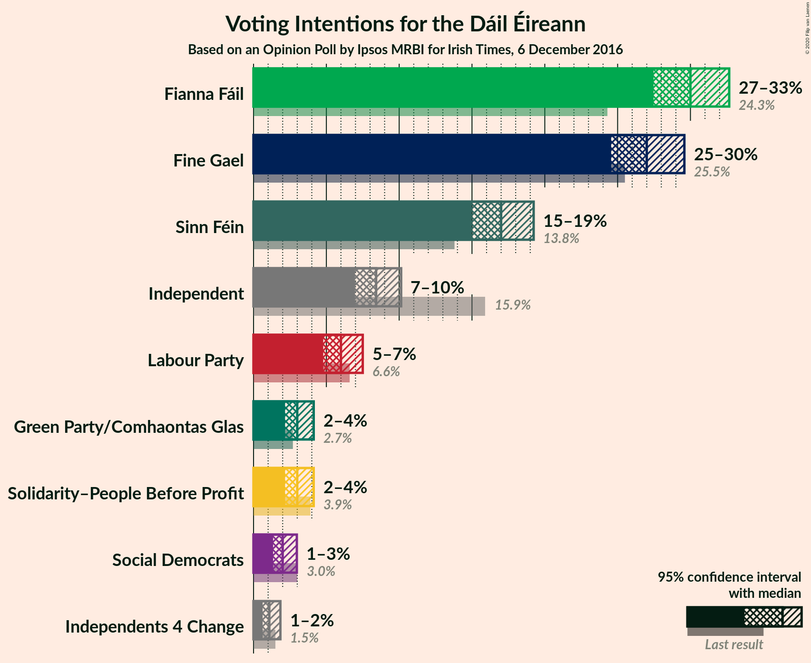
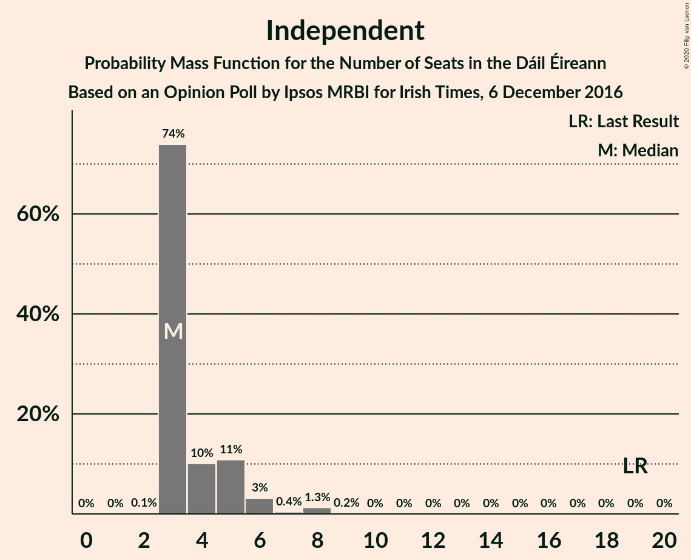
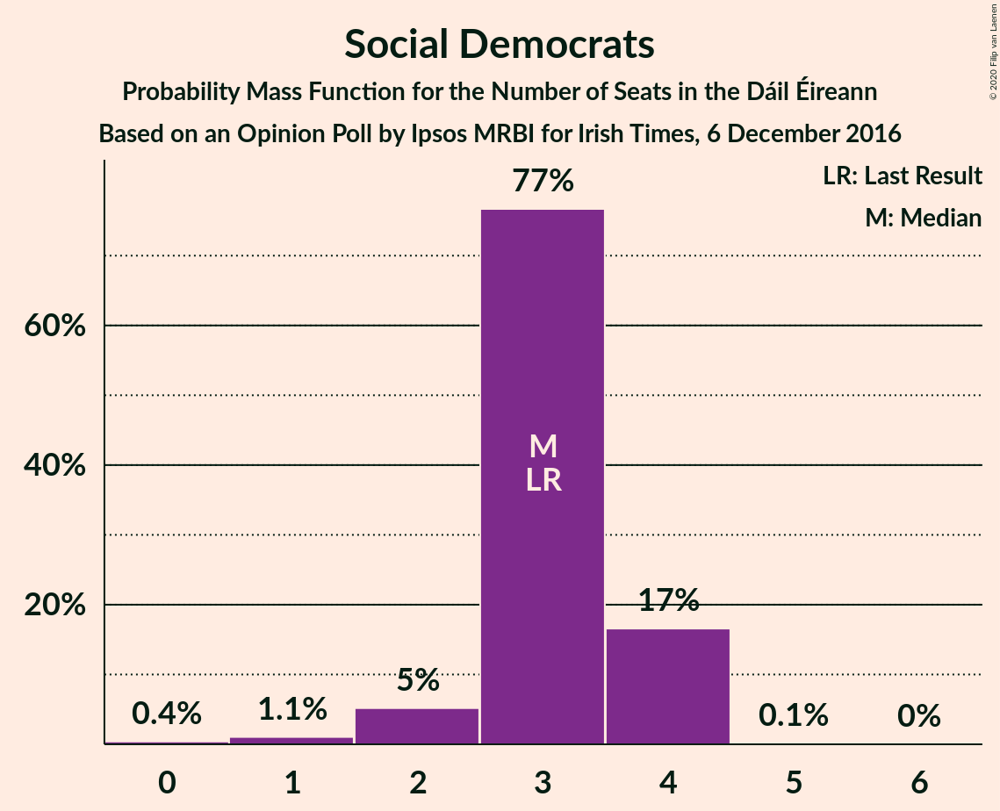

# Opinion Poll by Ipsos MRBI for Irish Times, 6 December 2016

<a href="#voting-intentions">Voting Intentions</a> | <a href="#seats">Seats</a> | <a href="#coalitions">Coalitions</a> | <a href="#technical-information">Technical Information</a>

## Voting Intentions

### Confidence Intervals

| Party | Last Result | Poll Result | 80% Confidence Interval | 90% Confidence Interval | 95% Confidence Interval | 99% Confidence Interval |
|:-----:|:-----------:|:-----------:|:-----------------------:|:-----------------------:|:-----------------------:|:-----------------------:|
| Fianna Fáil | 24.3% | 30.0% | 28.3–31.7% |27.9–32.2% |27.5–32.7% |26.7–33.5% |
| Fine Gael | 25.5% | 27.0% | 25.4–28.7% |25.0–29.2% |24.6–29.6% |23.8–30.4% |
| Sinn Féin | 13.8% | 17.0% | 15.7–18.5% |15.3–18.9% |15.0–19.2% |14.4–20.0% |
| Independent | 15.9% | 8.4% | 7.5–9.5% |7.2–9.8% |7.0–10.1% |6.5–10.7% |
| Labour Party | 6.6% | 6.0% | 5.2–7.0% |5.0–7.3% |4.8–7.5% |4.4–8.0% |
| Solidarity–People Before Profit | 3.9% | 3.0% | 2.5–3.7% |2.3–3.9% |2.2–4.1% |1.9–4.5% |
| Green Party/Comhaontas Glas | 2.7% | 3.0% | 2.5–3.7% |2.3–3.9% |2.2–4.1% |1.9–4.5% |
| Social Democrats | 3.0% | 2.0% | 1.6–2.6% |1.4–2.8% |1.3–3.0% |1.2–3.3% |
| Independents 4 Change | 1.5% | 1.1% | 0.8–1.6% |0.7–1.7% |0.6–1.8% |0.5–2.1% |

*Note:* The poll result column reflects the actual value used in the calculations. Published results may vary slightly, and in addition be rounded to fewer digits.

## Seats

### Confidence Intervals

| Party | Last Result | Median | 80% Confidence Interval | 90% Confidence Interval | 95% Confidence Interval | 99% Confidence Interval |
|:-----:|:-----------:|:------:|:-----------------------:|:-----------------------:|:-----------------------:|:-----------------------:|
| <a href="#fianna-fáil">Fianna Fáil</a> | 44 | 55 | 52–59 |51–59 |51–60 |49–61 |
| <a href="#fine-gael">Fine Gael</a> | 49 | 54 | 48–57 |47–58 |44–59 |43–60 |
| <a href="#sinn-féin">Sinn Féin</a> | 23 | 33 | 29–35 |28–37 |28–38 |26–38 |
| <a href="#independent">Independent</a> | 19 | 3 | 3–5 |3–6 |3–6 |3–8 |
| <a href="#labour-party">Labour Party</a> | 7 | 6 | 1–8 |1–10 |1–10 |1–14 |
| <a href="#solidarity–people-before-profit">Solidarity–People Before Profit</a> | 6 | 3 | 3–5 |3–6 |0–6 |0–9 |
| <a href="#green-party/comhaontas-glas">Green Party/Comhaontas Glas</a> | 2 | 1 | 0–2 |0–2 |0–2 |0–3 |
| <a href="#social-democrats">Social Democrats</a> | 3 | 3 | 3–4 |2–4 |2–4 |1–4 |
| <a href="#independents-4-change">Independents 4 Change</a> | 4 | 2 | 0–4 |0–4 |0–4 |0–5 |

### Fianna Fáil

*For a full overview of the results for this party, see the [Fianna Fáil](party-fiannafáil.html) page.*

| Number of Seats | Probability | Accumulated | Special Marks |
|:---------------:|:-----------:|:-----------:|:-------------:|
| 44 | 0% | 100% | Last Result |
| 45 | 0% | 100% |  |
| 46 | 0% | 100% |  |
| 47 | 0% | 100% |  |
| 48 | 0.1% | 100% |  |
| 49 | 0.8% | 99.9% |  |
| 50 | 0.6% | 99.1% |  |
| 51 | 8% | 98% |  |
| 52 | 2% | 91% |  |
| 53 | 5% | 89% |  |
| 54 | 25% | 83% |  |
| 55 | 19% | 58% | Median |
| 56 | 3% | 39% |  |
| 57 | 5% | 37% |  |
| 58 | 6% | 31% |  |
| 59 | 21% | 25% |  |
| 60 | 3% | 4% |  |
| 61 | 0.6% | 0.9% |  |
| 62 | 0.3% | 0.4% |  |
| 63 | 0% | 0% |  |

### Fine Gael

*For a full overview of the results for this party, see the [Fine Gael](party-finegael.html) page.*

| Number of Seats | Probability | Accumulated | Special Marks |
|:---------------:|:-----------:|:-----------:|:-------------:|
| 42 | 0.4% | 100% |  |
| 43 | 0.1% | 99.6% |  |
| 44 | 2% | 99.5% |  |
| 45 | 0.6% | 97% |  |
| 46 | 1.3% | 97% |  |
| 47 | 0.8% | 95% |  |
| 48 | 5% | 95% |  |
| 49 | 4% | 90% | Last Result |
| 50 | 4% | 86% |  |
| 51 | 9% | 81% |  |
| 52 | 16% | 72% |  |
| 53 | 6% | 57% |  |
| 54 | 25% | 51% | Median |
| 55 | 4% | 26% |  |
| 56 | 12% | 22% |  |
| 57 | 3% | 10% |  |
| 58 | 4% | 8% |  |
| 59 | 2% | 4% |  |
| 60 | 1.3% | 2% |  |
| 61 | 0.4% | 0.4% |  |
| 62 | 0% | 0% |  |

### Sinn Féin

*For a full overview of the results for this party, see the [Sinn Féin](party-sinnféin.html) page.*

| Number of Seats | Probability | Accumulated | Special Marks |
|:---------------:|:-----------:|:-----------:|:-------------:|
| 23 | 0% | 100% | Last Result |
| 24 | 0.1% | 100% |  |
| 25 | 0% | 99.9% |  |
| 26 | 0.6% | 99.9% |  |
| 27 | 0.3% | 99.3% |  |
| 28 | 7% | 99.0% |  |
| 29 | 4% | 92% |  |
| 30 | 4% | 88% |  |
| 31 | 3% | 84% |  |
| 32 | 12% | 80% |  |
| 33 | 24% | 68% | Median |
| 34 | 28% | 44% |  |
| 35 | 10% | 16% |  |
| 36 | 0.8% | 7% |  |
| 37 | 2% | 6% |  |
| 38 | 3% | 4% |  |
| 39 | 0.1% | 0.1% |  |
| 40 | 0% | 0% |  |

### Independent

*For a full overview of the results for this party, see the [Independent](party-independent.html) page.*

| Number of Seats | Probability | Accumulated | Special Marks |
|:---------------:|:-----------:|:-----------:|:-------------:|
| 2 | 0.1% | 100% |  |
| 3 | 74% | 99.9% | Median |
| 4 | 10% | 26% |  |
| 5 | 11% | 16% |  |
| 6 | 3% | 5% |  |
| 7 | 0.4% | 2% |  |
| 8 | 1.3% | 1.5% |  |
| 9 | 0.2% | 0.2% |  |
| 10 | 0% | 0% |  |
| 11 | 0% | 0% |  |
| 12 | 0% | 0% |  |
| 13 | 0% | 0% |  |
| 14 | 0% | 0% |  |
| 15 | 0% | 0% |  |
| 16 | 0% | 0% |  |
| 17 | 0% | 0% |  |
| 18 | 0% | 0% |  |
| 19 | 0% | 0% | Last Result |

### Labour Party

*For a full overview of the results for this party, see the [Labour Party](party-labourparty.html) page.*

| Number of Seats | Probability | Accumulated | Special Marks |
|:---------------:|:-----------:|:-----------:|:-------------:|
| 0 | 0.3% | 100% |  |
| 1 | 11% | 99.7% |  |
| 2 | 5% | 89% |  |
| 3 | 3% | 84% |  |
| 4 | 19% | 81% |  |
| 5 | 8% | 62% |  |
| 6 | 30% | 53% | Median |
| 7 | 10% | 23% | Last Result |
| 8 | 8% | 13% |  |
| 9 | 0.4% | 5% |  |
| 10 | 3% | 5% |  |
| 11 | 0.3% | 2% |  |
| 12 | 0.8% | 2% |  |
| 13 | 0.4% | 1.2% |  |
| 14 | 0.8% | 0.8% |  |
| 15 | 0% | 0.1% |  |
| 16 | 0% | 0% |  |

### Solidarity–People Before Profit

*For a full overview of the results for this party, see the [Solidarity–People Before Profit](party-solidarity–peoplebeforeprofit.html) page.*

| Number of Seats | Probability | Accumulated | Special Marks |
|:---------------:|:-----------:|:-----------:|:-------------:|
| 0 | 3% | 100% |  |
| 1 | 0.3% | 97% |  |
| 2 | 0.6% | 97% |  |
| 3 | 62% | 96% | Median |
| 4 | 11% | 34% |  |
| 5 | 15% | 23% |  |
| 6 | 6% | 7% | Last Result |
| 7 | 0.2% | 1.1% |  |
| 8 | 0.3% | 0.9% |  |
| 9 | 0.6% | 0.6% |  |
| 10 | 0% | 0% |  |

### Green Party/Comhaontas Glas

*For a full overview of the results for this party, see the [Green Party/Comhaontas Glas](party-greenpartycomhaontasglas.html) page.*

| Number of Seats | Probability | Accumulated | Special Marks |
|:---------------:|:-----------:|:-----------:|:-------------:|
| 0 | 35% | 100% |  |
| 1 | 19% | 65% | Median |
| 2 | 44% | 45% | Last Result |
| 3 | 1.0% | 1.1% |  |
| 4 | 0.1% | 0.1% |  |
| 5 | 0% | 0% |  |

### Social Democrats

*For a full overview of the results for this party, see the [Social Democrats](party-socialdemocrats.html) page.*

| Number of Seats | Probability | Accumulated | Special Marks |
|:---------------:|:-----------:|:-----------:|:-------------:|
| 0 | 0.4% | 100% |  |
| 1 | 1.1% | 99.6% |  |
| 2 | 5% | 98.5% |  |
| 3 | 77% | 93% | Last Result, Median |
| 4 | 17% | 17% |  |
| 5 | 0.1% | 0.1% |  |
| 6 | 0% | 0% |  |

### Independents 4 Change

*For a full overview of the results for this party, see the [Independents 4 Change](party-independents4change.html) page.*

| Number of Seats | Probability | Accumulated | Special Marks |
|:---------------:|:-----------:|:-----------:|:-------------:|
| 0 | 22% | 100% |  |
| 1 | 12% | 78% |  |
| 2 | 34% | 67% | Median |
| 3 | 2% | 33% |  |
| 4 | 31% | 31% | Last Result |
| 5 | 0.5% | 0.5% |  |
| 6 | 0% | 0% |  |

## Coalitions

### Confidence Intervals

| Coalition | Last Result | Median | Majority? | 80% Confidence Interval | 90% Confidence Interval | 95% Confidence Interval | 99% Confidence Interval |
|:---------:|:-----------:|:------:|:---------:|:-----------------------:|:-----------------------:|:-----------------------:|:-----------------------:|
| Fianna Fáil – Fine Gael | 93 | 108 | 100% | 105–113 | 103–115 | 102–115 | 100–116 |
| Fianna Fáil – Sinn Féin | 67 | 88 | 99.6% | 85–92 | 83–94 | 82–97 | 81–97 |
| Fianna Fáil – Labour Party – Green Party/Comhaontas Glas – Social Democrats | 56 | 64 | 0% | 62–70 | 60–71 | 60–72 | 58–75 |
| Fianna Fáil – Labour Party – Green Party/Comhaontas Glas | 53 | 61 | 0% | 59–67 | 58–68 | 57–69 | 54–72 |
| Fine Gael – Labour Party – Green Party/Comhaontas Glas – Social Democrats | 61 | 63 | 0% | 57–68 | 56–69 | 55–69 | 53–71 |
| Fianna Fáil – Labour Party | 51 | 60 | 0% | 57–65 | 57–67 | 56–68 | 53–70 |
| Fine Gael – Labour Party – Green Party/Comhaontas Glas | 58 | 60 | 0% | 54–64 | 53–66 | 52–66 | 50–68 |
| Fine Gael – Labour Party | 56 | 59 | 0% | 52–62 | 51–65 | 50–66 | 48–67 |
| Fianna Fáil – Green Party/Comhaontas Glas | 46 | 57 | 0% | 53–61 | 53–61 | 53–61 | 50–63 |
| Fine Gael – Green Party/Comhaontas Glas | 51 | 54 | 0% | 50–58 | 48–60 | 46–60 | 44–62 |
| Fine Gael | 49 | 54 | 0% | 48–57 | 47–58 | 44–59 | 43–60 |

### Fianna Fáil – Fine Gael

| Number of Seats | Probability | Accumulated | Special Marks |
|:---------------:|:-----------:|:-----------:|:-------------:|
| 93 | 0% | 100% | Last Result |
| 94 | 0% | 100% |  |
| 95 | 0% | 100% |  |
| 96 | 0% | 100% |  |
| 97 | 0% | 100% |  |
| 98 | 0.1% | 100% |  |
| 99 | 0.4% | 99.9% |  |
| 100 | 0.2% | 99.6% |  |
| 101 | 0.6% | 99.3% |  |
| 102 | 3% | 98.7% |  |
| 103 | 2% | 96% |  |
| 104 | 2% | 94% |  |
| 105 | 3% | 92% |  |
| 106 | 2% | 88% |  |
| 107 | 22% | 86% |  |
| 108 | 27% | 65% |  |
| 109 | 10% | 38% | Median |
| 110 | 9% | 28% |  |
| 111 | 3% | 18% |  |
| 112 | 4% | 16% |  |
| 113 | 3% | 11% |  |
| 114 | 1.2% | 8% |  |
| 115 | 7% | 7% |  |
| 116 | 0.6% | 0.6% |  |
| 117 | 0% | 0% |  |

### Fianna Fáil – Sinn Féin

| Number of Seats | Probability | Accumulated | Special Marks |
|:---------------:|:-----------:|:-----------:|:-------------:|
| 67 | 0% | 100% | Last Result |
| 68 | 0% | 100% |  |
| 69 | 0% | 100% |  |
| 70 | 0% | 100% |  |
| 71 | 0% | 100% |  |
| 72 | 0% | 100% |  |
| 73 | 0% | 100% |  |
| 74 | 0% | 100% |  |
| 75 | 0% | 100% |  |
| 76 | 0% | 100% |  |
| 77 | 0% | 100% |  |
| 78 | 0% | 100% |  |
| 79 | 0% | 100% |  |
| 80 | 0.3% | 99.9% |  |
| 81 | 0.9% | 99.6% | Majority |
| 82 | 1.4% | 98.7% |  |
| 83 | 4% | 97% |  |
| 84 | 1.4% | 94% |  |
| 85 | 4% | 92% |  |
| 86 | 7% | 88% |  |
| 87 | 29% | 81% |  |
| 88 | 8% | 53% | Median |
| 89 | 16% | 45% |  |
| 90 | 5% | 29% |  |
| 91 | 10% | 24% |  |
| 92 | 5% | 14% |  |
| 93 | 2% | 8% |  |
| 94 | 2% | 6% |  |
| 95 | 0.8% | 5% |  |
| 96 | 0.7% | 4% |  |
| 97 | 3% | 3% |  |
| 98 | 0% | 0% |  |

### Fianna Fáil – Labour Party – Green Party/Comhaontas Glas – Social Democrats

| Number of Seats | Probability | Accumulated | Special Marks |
|:---------------:|:-----------:|:-----------:|:-------------:|
| 56 | 0.1% | 100% | Last Result |
| 57 | 0.2% | 99.8% |  |
| 58 | 0.3% | 99.6% |  |
| 59 | 1.2% | 99.3% |  |
| 60 | 3% | 98% |  |
| 61 | 2% | 95% |  |
| 62 | 4% | 93% |  |
| 63 | 26% | 89% |  |
| 64 | 18% | 63% |  |
| 65 | 11% | 44% | Median |
| 66 | 8% | 34% |  |
| 67 | 8% | 25% |  |
| 68 | 2% | 17% |  |
| 69 | 4% | 15% |  |
| 70 | 4% | 12% |  |
| 71 | 4% | 7% |  |
| 72 | 2% | 3% |  |
| 73 | 0.4% | 2% |  |
| 74 | 0.5% | 1.2% |  |
| 75 | 0.7% | 0.7% |  |
| 76 | 0% | 0% |  |

### Fianna Fáil – Labour Party – Green Party/Comhaontas Glas

| Number of Seats | Probability | Accumulated | Special Marks |
|:---------------:|:-----------:|:-----------:|:-------------:|
| 53 | 0.1% | 100% | Last Result |
| 54 | 0.4% | 99.9% |  |
| 55 | 0.4% | 99.4% |  |
| 56 | 1.0% | 99.1% |  |
| 57 | 2% | 98% |  |
| 58 | 2% | 96% |  |
| 59 | 10% | 94% |  |
| 60 | 25% | 84% |  |
| 61 | 15% | 60% |  |
| 62 | 11% | 45% | Median |
| 63 | 10% | 34% |  |
| 64 | 8% | 24% |  |
| 65 | 3% | 17% |  |
| 66 | 1.2% | 14% |  |
| 67 | 6% | 12% |  |
| 68 | 4% | 7% |  |
| 69 | 1.3% | 3% |  |
| 70 | 0.4% | 2% |  |
| 71 | 0.4% | 1.2% |  |
| 72 | 0.7% | 0.8% |  |
| 73 | 0% | 0.1% |  |
| 74 | 0% | 0% |  |

### Fine Gael – Labour Party – Green Party/Comhaontas Glas – Social Democrats

| Number of Seats | Probability | Accumulated | Special Marks |
|:---------------:|:-----------:|:-----------:|:-------------:|
| 48 | 0.1% | 100% |  |
| 49 | 0% | 99.9% |  |
| 50 | 0% | 99.8% |  |
| 51 | 0% | 99.8% |  |
| 52 | 0% | 99.8% |  |
| 53 | 0.5% | 99.8% |  |
| 54 | 1.3% | 99.3% |  |
| 55 | 2% | 98% |  |
| 56 | 2% | 96% |  |
| 57 | 7% | 94% |  |
| 58 | 3% | 86% |  |
| 59 | 4% | 83% |  |
| 60 | 4% | 79% |  |
| 61 | 16% | 75% | Last Result |
| 62 | 3% | 59% |  |
| 63 | 27% | 56% |  |
| 64 | 7% | 29% | Median |
| 65 | 2% | 22% |  |
| 66 | 4% | 20% |  |
| 67 | 4% | 16% |  |
| 68 | 4% | 12% |  |
| 69 | 6% | 7% |  |
| 70 | 0.3% | 1.1% |  |
| 71 | 0.6% | 0.8% |  |
| 72 | 0.1% | 0.2% |  |
| 73 | 0% | 0% |  |

### Fianna Fáil – Labour Party

| Number of Seats | Probability | Accumulated | Special Marks |
|:---------------:|:-----------:|:-----------:|:-------------:|
| 51 | 0% | 100% | Last Result |
| 52 | 0.4% | 100% |  |
| 53 | 0.3% | 99.6% |  |
| 54 | 0.3% | 99.4% |  |
| 55 | 0.9% | 99.1% |  |
| 56 | 1.3% | 98% |  |
| 57 | 9% | 97% |  |
| 58 | 3% | 88% |  |
| 59 | 18% | 86% |  |
| 60 | 31% | 68% |  |
| 61 | 7% | 37% | Median |
| 62 | 5% | 30% |  |
| 63 | 5% | 25% |  |
| 64 | 7% | 20% |  |
| 65 | 5% | 13% |  |
| 66 | 1.0% | 8% |  |
| 67 | 4% | 7% |  |
| 68 | 1.0% | 3% |  |
| 69 | 0.6% | 2% |  |
| 70 | 0.6% | 1.0% |  |
| 71 | 0.2% | 0.4% |  |
| 72 | 0.2% | 0.2% |  |
| 73 | 0% | 0% |  |

### Fine Gael – Labour Party – Green Party/Comhaontas Glas

| Number of Seats | Probability | Accumulated | Special Marks |
|:---------------:|:-----------:|:-----------:|:-------------:|
| 45 | 0.1% | 100% |  |
| 46 | 0% | 99.9% |  |
| 47 | 0% | 99.8% |  |
| 48 | 0% | 99.8% |  |
| 49 | 0% | 99.8% |  |
| 50 | 2% | 99.8% |  |
| 51 | 0.5% | 98% |  |
| 52 | 2% | 98% |  |
| 53 | 2% | 96% |  |
| 54 | 8% | 94% |  |
| 55 | 3% | 86% |  |
| 56 | 4% | 83% |  |
| 57 | 5% | 79% |  |
| 58 | 17% | 74% | Last Result |
| 59 | 6% | 58% |  |
| 60 | 22% | 51% |  |
| 61 | 7% | 29% | Median |
| 62 | 2% | 22% |  |
| 63 | 3% | 20% |  |
| 64 | 8% | 17% |  |
| 65 | 0.7% | 9% |  |
| 66 | 6% | 8% |  |
| 67 | 2% | 2% |  |
| 68 | 0.7% | 0.8% |  |
| 69 | 0.1% | 0.2% |  |
| 70 | 0% | 0% |  |

### Fine Gael – Labour Party

| Number of Seats | Probability | Accumulated | Special Marks |
|:---------------:|:-----------:|:-----------:|:-------------:|
| 44 | 0.1% | 100% |  |
| 45 | 0% | 99.9% |  |
| 46 | 0% | 99.8% |  |
| 47 | 0% | 99.8% |  |
| 48 | 1.3% | 99.8% |  |
| 49 | 0.5% | 98.5% |  |
| 50 | 2% | 98% |  |
| 51 | 1.5% | 96% |  |
| 52 | 6% | 95% |  |
| 53 | 3% | 89% |  |
| 54 | 3% | 85% |  |
| 55 | 4% | 83% |  |
| 56 | 16% | 79% | Last Result |
| 57 | 5% | 63% |  |
| 58 | 8% | 58% |  |
| 59 | 3% | 50% |  |
| 60 | 21% | 48% | Median |
| 61 | 9% | 26% |  |
| 62 | 8% | 18% |  |
| 63 | 0.7% | 10% |  |
| 64 | 3% | 9% |  |
| 65 | 2% | 6% |  |
| 66 | 3% | 4% |  |
| 67 | 0.7% | 0.8% |  |
| 68 | 0% | 0.1% |  |
| 69 | 0% | 0.1% |  |
| 70 | 0% | 0% |  |

### Fianna Fáil – Green Party/Comhaontas Glas

| Number of Seats | Probability | Accumulated | Special Marks |
|:---------------:|:-----------:|:-----------:|:-------------:|
| 46 | 0% | 100% | Last Result |
| 47 | 0% | 100% |  |
| 48 | 0% | 100% |  |
| 49 | 0% | 100% |  |
| 50 | 1.1% | 99.9% |  |
| 51 | 0.6% | 98.9% |  |
| 52 | 0.4% | 98% |  |
| 53 | 9% | 98% |  |
| 54 | 24% | 89% |  |
| 55 | 6% | 65% |  |
| 56 | 9% | 59% | Median |
| 57 | 15% | 51% |  |
| 58 | 1.5% | 36% |  |
| 59 | 12% | 34% |  |
| 60 | 10% | 22% |  |
| 61 | 10% | 12% |  |
| 62 | 2% | 2% |  |
| 63 | 0.6% | 0.7% |  |
| 64 | 0% | 0.1% |  |
| 65 | 0% | 0% |  |

### Fine Gael – Green Party/Comhaontas Glas

| Number of Seats | Probability | Accumulated | Special Marks |
|:---------------:|:-----------:|:-----------:|:-------------:|
| 42 | 0.1% | 100% |  |
| 43 | 0.2% | 99.9% |  |
| 44 | 0.2% | 99.7% |  |
| 45 | 0.5% | 99.5% |  |
| 46 | 2% | 99.0% |  |
| 47 | 0.7% | 97% |  |
| 48 | 1.1% | 96% |  |
| 49 | 0.8% | 95% |  |
| 50 | 9% | 94% |  |
| 51 | 3% | 85% | Last Result |
| 52 | 3% | 82% |  |
| 53 | 11% | 79% |  |
| 54 | 33% | 68% |  |
| 55 | 9% | 35% | Median |
| 56 | 11% | 27% |  |
| 57 | 2% | 16% |  |
| 58 | 5% | 14% |  |
| 59 | 3% | 9% |  |
| 60 | 5% | 6% |  |
| 61 | 0.4% | 1.0% |  |
| 62 | 0.5% | 0.6% |  |
| 63 | 0% | 0% |  |

### Fine Gael

| Number of Seats | Probability | Accumulated | Special Marks |
|:---------------:|:-----------:|:-----------:|:-------------:|
| 42 | 0.4% | 100% |  |
| 43 | 0.1% | 99.6% |  |
| 44 | 2% | 99.5% |  |
| 45 | 0.6% | 97% |  |
| 46 | 1.3% | 97% |  |
| 47 | 0.8% | 95% |  |
| 48 | 5% | 95% |  |
| 49 | 4% | 90% | Last Result |
| 50 | 4% | 86% |  |
| 51 | 9% | 81% |  |
| 52 | 16% | 72% |  |
| 53 | 6% | 57% |  |
| 54 | 25% | 51% | Median |
| 55 | 4% | 26% |  |
| 56 | 12% | 22% |  |
| 57 | 3% | 10% |  |
| 58 | 4% | 8% |  |
| 59 | 2% | 4% |  |
| 60 | 1.3% | 2% |  |
| 61 | 0.4% | 0.4% |  |
| 62 | 0% | 0% |  |

## Technical Information

### Opinion Poll

+ **Polling firm:** Ipsos MRBI
+ **Commissioner(s):** Irish Times
+ **Fieldwork period:** 6 December 2016

### Calculations

+ **Sample size:** 1200
+ **Simulations done:** 131,072
+ **Error estimate:** 1.66%

