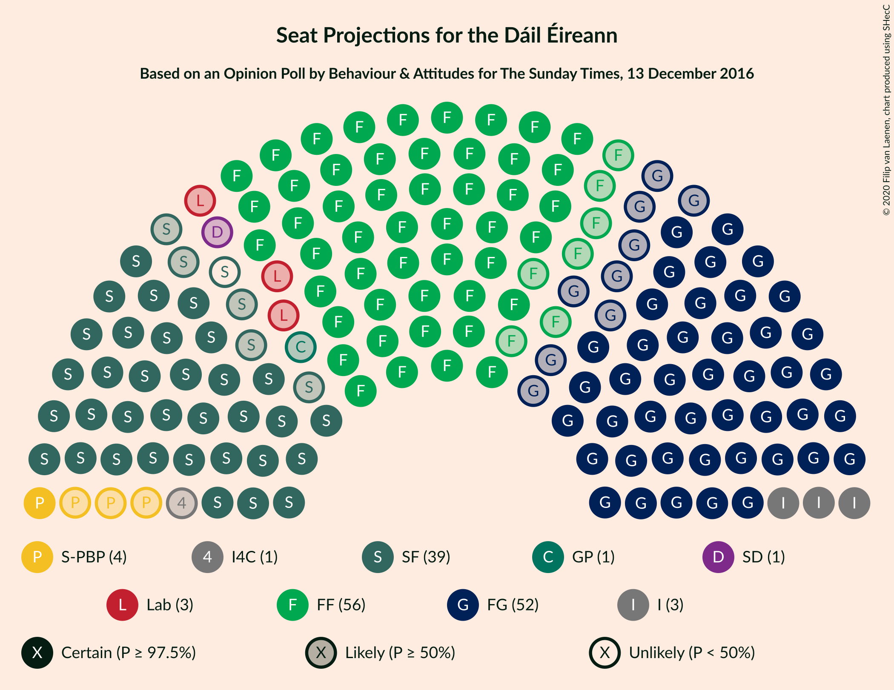
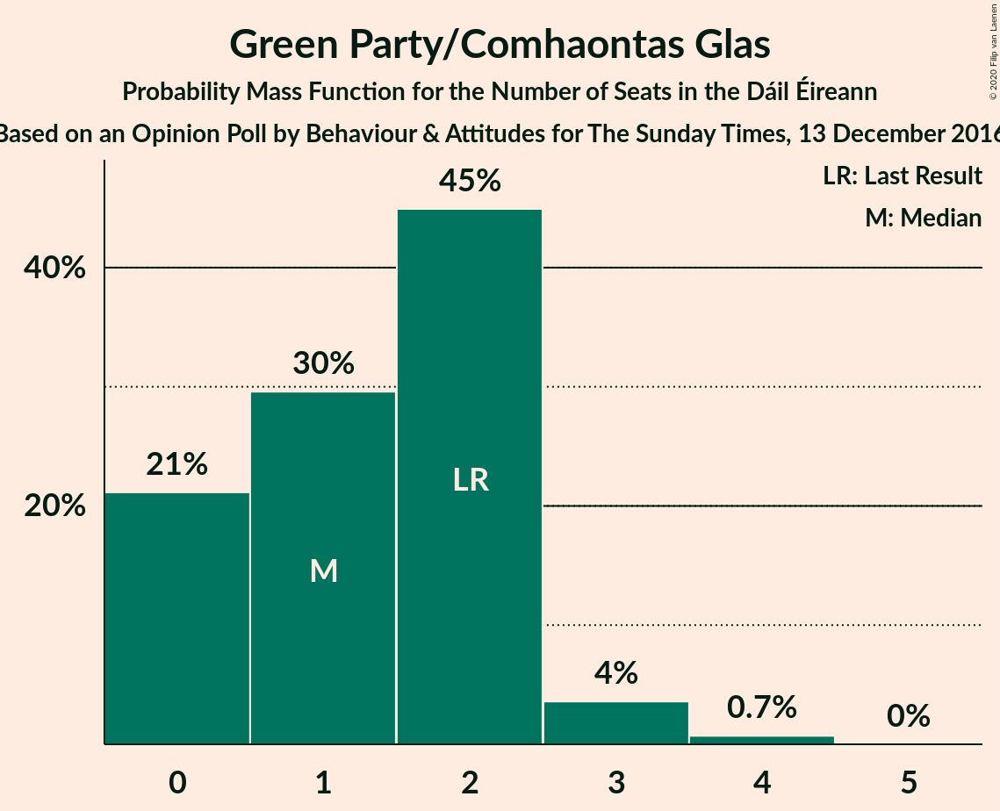
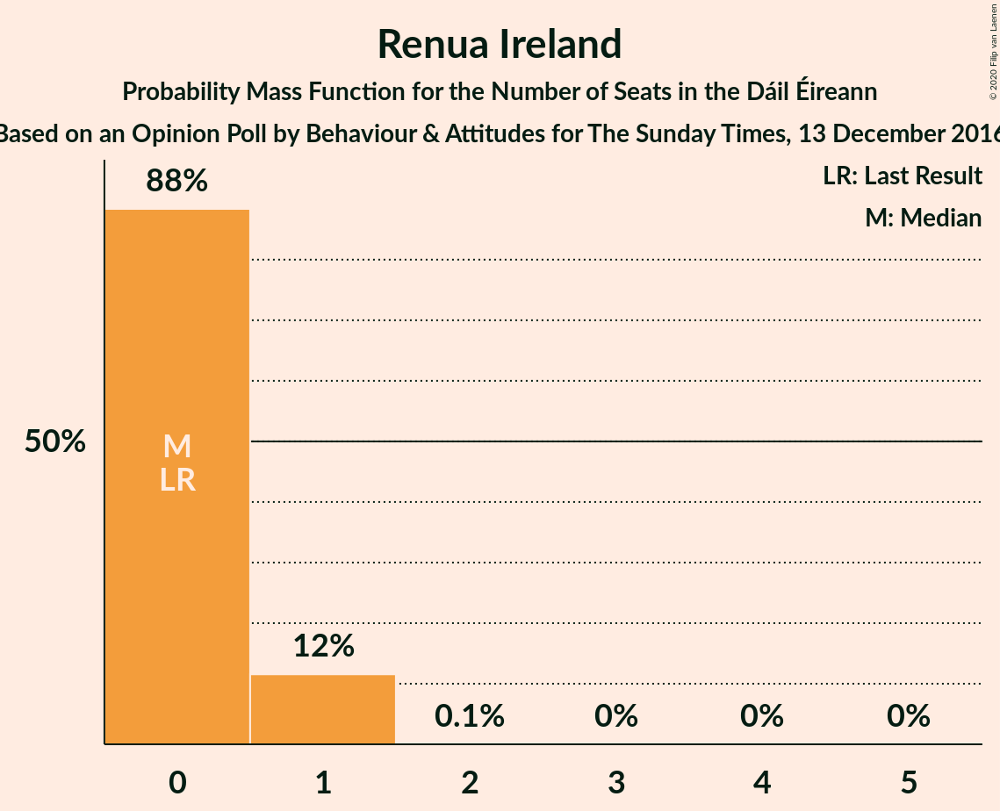
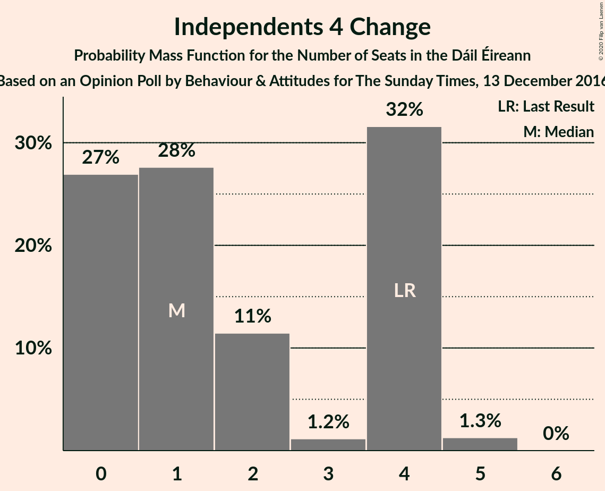
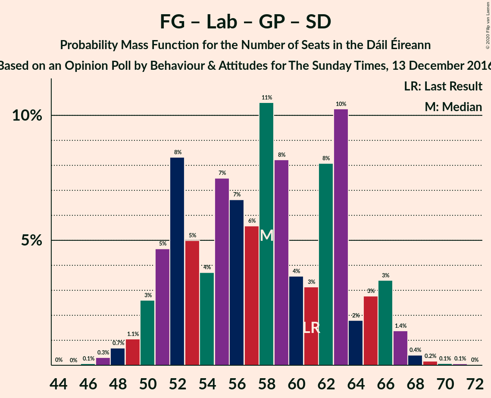
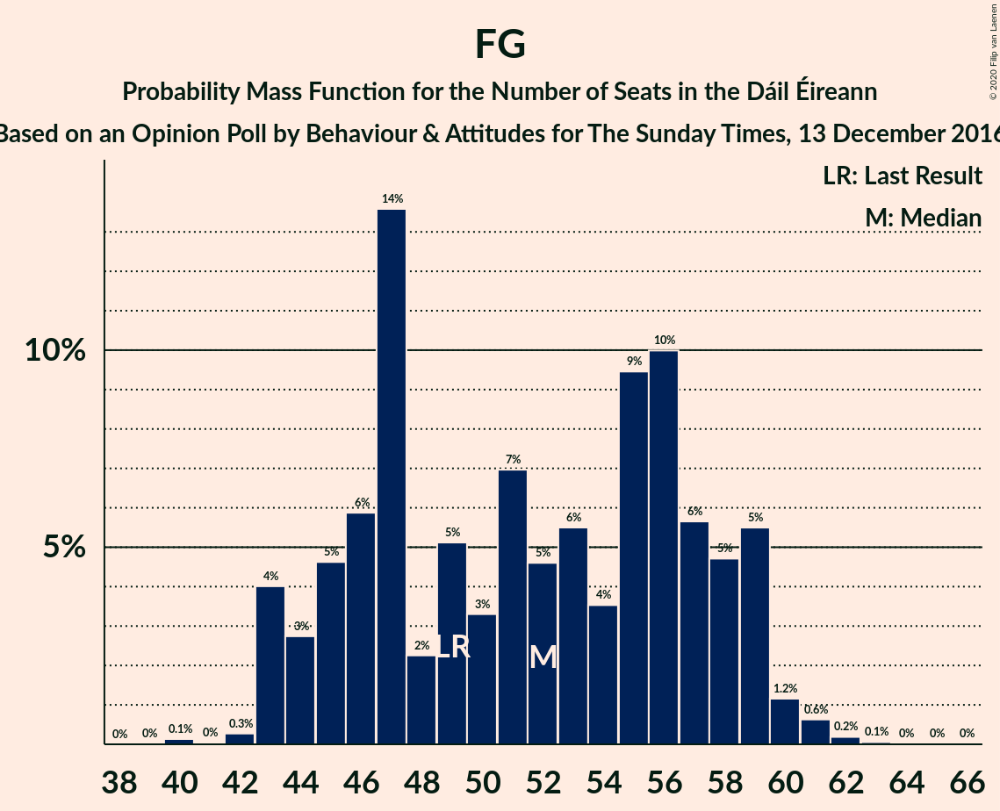

# Opinion Poll by Behaviour & Attitudes for The Sunday Times, 13 December 2016

<a href="#voting-intentions">Voting Intentions</a> | <a href="#seats">Seats</a> | <a href="#coalitions">Coalitions</a> | <a href="#technical-information">Technical Information</a>

## Voting Intentions

### Confidence Intervals

| Party | Last Result | Poll Result | 80% Confidence Interval | 90% Confidence Interval | 95% Confidence Interval | 99% Confidence Interval |
|:-----:|:-----------:|:-----------:|:-----------------------:|:-----------------------:|:-----------------------:|:-----------------------:|
| Fianna Fáil | 24.3% | 28.0% | 26.2–30.0% |25.7–30.5% |25.2–31.0% |24.4–32.0% |
| Fine Gael | 25.5% | 26.0% | 24.2–27.9% |23.7–28.4% |23.2–28.9% |22.4–29.8% |
| Sinn Féin | 13.8% | 19.0% | 17.5–20.8% |17.0–21.3% |16.6–21.7% |15.9–22.6% |
| Independent | 15.9% | 7.6% | 6.6–8.8% |6.3–9.2% |6.0–9.5% |5.6–10.1% |
| Labour Party | 6.6% | 5.0% | 4.2–6.0% |3.9–6.3% |3.7–6.6% |3.4–7.1% |
| Solidarity–People Before Profit | 3.9% | 3.0% | 2.4–3.9% |2.2–4.1% |2.1–4.4% |1.8–4.8% |
| Green Party/Comhaontas Glas | 2.7% | 3.0% | 2.4–3.9% |2.2–4.1% |2.1–4.4% |1.8–4.8% |
| Social Democrats | 3.0% | 1.0% | 0.7–1.5% |0.6–1.7% |0.5–1.8% |0.4–2.1% |
| Renua Ireland | 2.2% | 1.0% | 0.7–1.5% |0.6–1.7% |0.5–1.8% |0.4–2.1% |
| Independents 4 Change | 1.5% | 1.0% | 0.7–1.5% |0.6–1.7% |0.5–1.8% |0.4–2.1% |

*Note:* The poll result column reflects the actual value used in the calculations. Published results may vary slightly, and in addition be rounded to fewer digits.

## Seats

### Confidence Intervals

| Party | Last Result | Median | 80% Confidence Interval | 90% Confidence Interval | 95% Confidence Interval | 99% Confidence Interval |
|:-----:|:-----------:|:------:|:-----------------------:|:-----------------------:|:-----------------------:|:-----------------------:|
| <a href="#fianna-fáil">Fianna Fáil</a> | 44 | 58 | 53–58 |52–59 |51–60 |48–60 |
| <a href="#fine-gael">Fine Gael</a> | 49 | 49 | 45–56 |44–57 |44–57 |43–62 |
| <a href="#sinn-féin">Sinn Féin</a> | 23 | 38 | 34–41 |34–41 |34–43 |30–43 |
| <a href="#independent">Independent</a> | 19 | 3 | 3–5 |3–6 |3–6 |2–8 |
| <a href="#labour-party">Labour Party</a> | 7 | 3 | 2–8 |0–8 |0–8 |0–8 |
| <a href="#solidarity–people-before-profit">Solidarity–People Before Profit</a> | 6 | 3 | 2–4 |2–5 |1–6 |0–9 |
| <a href="#green-party/comhaontas-glas">Green Party/Comhaontas Glas</a> | 2 | 2 | 1–2 |0–3 |0–4 |0–4 |
| <a href="#social-democrats">Social Democrats</a> | 3 | 1 | 0–2 |0–2 |0–3 |0–4 |
| <a href="#renua-ireland">Renua Ireland</a> | 0 | 0 | 0 |0–1 |0–1 |0–1 |
| <a href="#independents-4-change">Independents 4 Change</a> | 4 | 1 | 0–4 |0–4 |0–4 |0–5 |

### Fianna Fáil

*For a full overview of the results for this party, see the [Fianna Fáil](party-fiannafáil.html) page.*

| Number of Seats | Probability | Accumulated | Special Marks |
|:---------------:|:-----------:|:-----------:|:-------------:|
| 43 | 0% | 100% |  |
| 44 | 0% | 99.9% | Last Result |
| 45 | 0.1% | 99.9% |  |
| 46 | 0% | 99.8% |  |
| 47 | 0.1% | 99.8% |  |
| 48 | 0.8% | 99.7% |  |
| 49 | 0.2% | 98.9% |  |
| 50 | 0.4% | 98.8% |  |
| 51 | 1.2% | 98% |  |
| 52 | 3% | 97% |  |
| 53 | 7% | 94% |  |
| 54 | 3% | 87% |  |
| 55 | 5% | 84% |  |
| 56 | 3% | 78% |  |
| 57 | 14% | 75% |  |
| 58 | 56% | 61% | Median |
| 59 | 2% | 5% |  |
| 60 | 3% | 3% |  |
| 61 | 0.1% | 0.2% |  |
| 62 | 0.1% | 0.1% |  |
| 63 | 0% | 0% |  |

### Fine Gael

*For a full overview of the results for this party, see the [Fine Gael](party-finegael.html) page.*

| Number of Seats | Probability | Accumulated | Special Marks |
|:---------------:|:-----------:|:-----------:|:-------------:|
| 41 | 0.1% | 100% |  |
| 42 | 0.2% | 99.9% |  |
| 43 | 0.5% | 99.7% |  |
| 44 | 6% | 99.2% |  |
| 45 | 27% | 93% |  |
| 46 | 10% | 66% |  |
| 47 | 2% | 56% |  |
| 48 | 2% | 54% |  |
| 49 | 4% | 53% | Last Result, Median |
| 50 | 4% | 49% |  |
| 51 | 3% | 45% |  |
| 52 | 0.7% | 42% |  |
| 53 | 1.2% | 41% |  |
| 54 | 3% | 40% |  |
| 55 | 2% | 37% |  |
| 56 | 27% | 35% |  |
| 57 | 6% | 8% |  |
| 58 | 0.4% | 2% |  |
| 59 | 0.2% | 2% |  |
| 60 | 0.7% | 2% |  |
| 61 | 0.2% | 0.9% |  |
| 62 | 0.4% | 0.7% |  |
| 63 | 0.1% | 0.3% |  |
| 64 | 0.1% | 0.2% |  |
| 65 | 0% | 0.1% |  |
| 66 | 0.1% | 0.1% |  |
| 67 | 0% | 0% |  |

### Sinn Féin

*For a full overview of the results for this party, see the [Sinn Féin](party-sinnféin.html) page.*

| Number of Seats | Probability | Accumulated | Special Marks |
|:---------------:|:-----------:|:-----------:|:-------------:|
| 23 | 0% | 100% | Last Result |
| 24 | 0% | 100% |  |
| 25 | 0% | 100% |  |
| 26 | 0% | 100% |  |
| 27 | 0% | 100% |  |
| 28 | 0% | 100% |  |
| 29 | 0% | 100% |  |
| 30 | 0.5% | 99.9% |  |
| 31 | 0.2% | 99.5% |  |
| 32 | 0.1% | 99.2% |  |
| 33 | 1.3% | 99.1% |  |
| 34 | 10% | 98% |  |
| 35 | 1.2% | 87% |  |
| 36 | 24% | 86% |  |
| 37 | 3% | 62% |  |
| 38 | 28% | 59% | Median |
| 39 | 15% | 31% |  |
| 40 | 5% | 16% |  |
| 41 | 7% | 11% |  |
| 42 | 1.2% | 5% |  |
| 43 | 3% | 4% |  |
| 44 | 0.1% | 0.2% |  |
| 45 | 0% | 0.1% |  |
| 46 | 0% | 0% |  |

### Independent

*For a full overview of the results for this party, see the [Independent](party-independent.html) page.*

| Number of Seats | Probability | Accumulated | Special Marks |
|:---------------:|:-----------:|:-----------:|:-------------:|
| 1 | 0.2% | 100% |  |
| 2 | 2% | 99.8% |  |
| 3 | 59% | 98% | Median |
| 4 | 23% | 39% |  |
| 5 | 11% | 16% |  |
| 6 | 4% | 5% |  |
| 7 | 0.2% | 1.1% |  |
| 8 | 0.8% | 0.9% |  |
| 9 | 0.1% | 0.2% |  |
| 10 | 0% | 0% |  |
| 11 | 0% | 0% |  |
| 12 | 0% | 0% |  |
| 13 | 0% | 0% |  |
| 14 | 0% | 0% |  |
| 15 | 0% | 0% |  |
| 16 | 0% | 0% |  |
| 17 | 0% | 0% |  |
| 18 | 0% | 0% |  |
| 19 | 0% | 0% | Last Result |

### Labour Party

*For a full overview of the results for this party, see the [Labour Party](party-labourparty.html) page.*

| Number of Seats | Probability | Accumulated | Special Marks |
|:---------------:|:-----------:|:-----------:|:-------------:|
| 0 | 6% | 100% |  |
| 1 | 3% | 94% |  |
| 2 | 39% | 91% |  |
| 3 | 15% | 52% | Median |
| 4 | 0.9% | 37% |  |
| 5 | 2% | 37% |  |
| 6 | 3% | 35% |  |
| 7 | 0.9% | 32% | Last Result |
| 8 | 31% | 32% |  |
| 9 | 0.2% | 0.4% |  |
| 10 | 0.1% | 0.2% |  |
| 11 | 0% | 0.1% |  |
| 12 | 0.1% | 0.1% |  |
| 13 | 0% | 0% |  |

### Solidarity–People Before Profit

*For a full overview of the results for this party, see the [Solidarity–People Before Profit](party-solidarity–peoplebeforeprofit.html) page.*

| Number of Seats | Probability | Accumulated | Special Marks |
|:---------------:|:-----------:|:-----------:|:-------------:|
| 0 | 2% | 100% |  |
| 1 | 1.2% | 98% |  |
| 2 | 15% | 97% |  |
| 3 | 35% | 82% | Median |
| 4 | 37% | 47% |  |
| 5 | 6% | 9% |  |
| 6 | 0.7% | 3% | Last Result |
| 7 | 1.4% | 2% |  |
| 8 | 0.2% | 1.0% |  |
| 9 | 0.8% | 0.8% |  |
| 10 | 0% | 0% |  |

### Green Party/Comhaontas Glas

*For a full overview of the results for this party, see the [Green Party/Comhaontas Glas](party-greenpartycomhaontasglas.html) page.*

| Number of Seats | Probability | Accumulated | Special Marks |
|:---------------:|:-----------:|:-----------:|:-------------:|
| 0 | 10% | 100% |  |
| 1 | 31% | 90% |  |
| 2 | 53% | 60% | Last Result, Median |
| 3 | 4% | 6% |  |
| 4 | 3% | 3% |  |
| 5 | 0% | 0% |  |

### Social Democrats

*For a full overview of the results for this party, see the [Social Democrats](party-socialdemocrats.html) page.*

| Number of Seats | Probability | Accumulated | Special Marks |
|:---------------:|:-----------:|:-----------:|:-------------:|
| 0 | 35% | 100% |  |
| 1 | 22% | 65% | Median |
| 2 | 38% | 43% |  |
| 3 | 3% | 4% | Last Result |
| 4 | 1.3% | 1.3% |  |
| 5 | 0% | 0% |  |

### Renua Ireland

*For a full overview of the results for this party, see the [Renua Ireland](party-renuaireland.html) page.*

| Number of Seats | Probability | Accumulated | Special Marks |
|:---------------:|:-----------:|:-----------:|:-------------:|
| 0 | 94% | 100% | Last Result, Median |
| 1 | 6% | 6% |  |
| 2 | 0.1% | 0.1% |  |
| 3 | 0% | 0% |  |

### Independents 4 Change

*For a full overview of the results for this party, see the [Independents 4 Change](party-independents4change.html) page.*

| Number of Seats | Probability | Accumulated | Special Marks |
|:---------------:|:-----------:|:-----------:|:-------------:|
| 0 | 40% | 100% |  |
| 1 | 29% | 60% | Median |
| 2 | 5% | 32% |  |
| 3 | 1.3% | 26% |  |
| 4 | 24% | 25% | Last Result |
| 5 | 1.2% | 1.2% |  |
| 6 | 0% | 0% |  |

## Coalitions

### Confidence Intervals

| Coalition | Last Result | Median | Majority? | 80% Confidence Interval | 90% Confidence Interval | 95% Confidence Interval | 99% Confidence Interval |
|:---------:|:-----------:|:------:|:---------:|:-----------------------:|:-----------------------:|:-----------------------:|:-----------------------:|
| Fianna Fáil – Fine Gael | 93 | 104 | 100% | 102–114 | 101–114 | 101–114 | 99–116 |
| Fianna Fáil – Sinn Féin | 67 | 96 | 100% | 89–98 | 87–99 | 86–100 | 84–101 |
| Fianna Fáil – Labour Party – Green Party/Comhaontas Glas – Social Democrats | 56 | 62 | 0% | 58–70 | 57–70 | 57–70 | 54–70 |
| Fianna Fáil – Labour Party – Green Party/Comhaontas Glas | 53 | 61 | 0% | 57–68 | 56–68 | 56–68 | 52–68 |
| Fianna Fáil – Labour Party | 51 | 60 | 0% | 56–66 | 54–66 | 54–66 | 50–66 |
| Fine Gael – Labour Party – Green Party/Comhaontas Glas – Social Democrats | 61 | 57 | 0% | 53–60 | 51–63 | 50–63 | 48–67 |
| Fine Gael – Labour Party – Green Party/Comhaontas Glas | 58 | 55 | 0% | 51–59 | 51–61 | 50–62 | 47–66 |
| Fine Gael – Labour Party | 56 | 53 | 0% | 49–58 | 49–59 | 48–62 | 46–65 |
| Fianna Fáil – Green Party/Comhaontas Glas | 46 | 59 | 0% | 55–60 | 54–60 | 53–61 | 50–62 |
| Fine Gael – Green Party/Comhaontas Glas | 51 | 51 | 0% | 47–57 | 46–59 | 46–59 | 45–64 |
| Fine Gael | 49 | 49 | 0% | 45–56 | 44–57 | 44–57 | 43–62 |

### Fianna Fáil – Fine Gael

| Number of Seats | Probability | Accumulated | Special Marks |
|:---------------:|:-----------:|:-----------:|:-------------:|
| 93 | 0% | 100% | Last Result |
| 94 | 0% | 100% |  |
| 95 | 0.1% | 100% |  |
| 96 | 0% | 99.9% |  |
| 97 | 0% | 99.9% |  |
| 98 | 0.3% | 99.9% |  |
| 99 | 0.6% | 99.5% |  |
| 100 | 0.2% | 98.9% |  |
| 101 | 4% | 98.7% |  |
| 102 | 7% | 95% |  |
| 103 | 34% | 87% |  |
| 104 | 4% | 53% |  |
| 105 | 3% | 49% |  |
| 106 | 1.4% | 46% |  |
| 107 | 5% | 45% | Median |
| 108 | 1.2% | 40% |  |
| 109 | 4% | 39% |  |
| 110 | 2% | 35% |  |
| 111 | 1.0% | 33% |  |
| 112 | 5% | 32% |  |
| 113 | 0.1% | 27% |  |
| 114 | 25% | 27% |  |
| 115 | 0.7% | 2% |  |
| 116 | 0.5% | 1.0% |  |
| 117 | 0.4% | 0.4% |  |
| 118 | 0% | 0% |  |

### Fianna Fáil – Sinn Féin

| Number of Seats | Probability | Accumulated | Special Marks |
|:---------------:|:-----------:|:-----------:|:-------------:|
| 67 | 0% | 100% | Last Result |
| 68 | 0% | 100% |  |
| 69 | 0% | 100% |  |
| 70 | 0% | 100% |  |
| 71 | 0% | 100% |  |
| 72 | 0% | 100% |  |
| 73 | 0% | 100% |  |
| 74 | 0% | 100% |  |
| 75 | 0% | 100% |  |
| 76 | 0% | 100% |  |
| 77 | 0% | 100% |  |
| 78 | 0% | 100% |  |
| 79 | 0% | 100% |  |
| 80 | 0% | 100% |  |
| 81 | 0.1% | 100% | Majority |
| 82 | 0.1% | 99.9% |  |
| 83 | 0.2% | 99.8% |  |
| 84 | 0.1% | 99.5% |  |
| 85 | 0.6% | 99.4% |  |
| 86 | 2% | 98.8% |  |
| 87 | 4% | 97% |  |
| 88 | 1.0% | 93% |  |
| 89 | 5% | 92% |  |
| 90 | 2% | 87% |  |
| 91 | 0.7% | 86% |  |
| 92 | 3% | 85% |  |
| 93 | 2% | 82% |  |
| 94 | 25% | 79% |  |
| 95 | 5% | 55% |  |
| 96 | 40% | 50% | Median |
| 97 | 0.8% | 11% |  |
| 98 | 1.1% | 10% |  |
| 99 | 6% | 9% |  |
| 100 | 2% | 3% |  |
| 101 | 0.8% | 0.9% |  |
| 102 | 0% | 0% |  |

### Fianna Fáil – Labour Party – Green Party/Comhaontas Glas – Social Democrats

| Number of Seats | Probability | Accumulated | Special Marks |
|:---------------:|:-----------:|:-----------:|:-------------:|
| 46 | 0.1% | 100% |  |
| 47 | 0% | 99.9% |  |
| 48 | 0% | 99.9% |  |
| 49 | 0% | 99.9% |  |
| 50 | 0% | 99.9% |  |
| 51 | 0% | 99.9% |  |
| 52 | 0.1% | 99.9% |  |
| 53 | 0.2% | 99.8% |  |
| 54 | 0.8% | 99.6% |  |
| 55 | 0.3% | 98.8% |  |
| 56 | 0.5% | 98% | Last Result |
| 57 | 4% | 98% |  |
| 58 | 10% | 94% |  |
| 59 | 2% | 84% |  |
| 60 | 4% | 82% |  |
| 61 | 28% | 79% |  |
| 62 | 3% | 51% |  |
| 63 | 3% | 48% |  |
| 64 | 9% | 45% | Median |
| 65 | 3% | 36% |  |
| 66 | 1.0% | 33% |  |
| 67 | 0.3% | 32% |  |
| 68 | 0.2% | 31% |  |
| 69 | 6% | 31% |  |
| 70 | 25% | 25% |  |
| 71 | 0.1% | 0.1% |  |
| 72 | 0% | 0% |  |

### Fianna Fáil – Labour Party – Green Party/Comhaontas Glas

| Number of Seats | Probability | Accumulated | Special Marks |
|:---------------:|:-----------:|:-----------:|:-------------:|
| 46 | 0% | 100% |  |
| 47 | 0% | 99.9% |  |
| 48 | 0% | 99.9% |  |
| 49 | 0% | 99.9% |  |
| 50 | 0% | 99.9% |  |
| 51 | 0.1% | 99.9% |  |
| 52 | 0.9% | 99.8% |  |
| 53 | 0.2% | 98.9% | Last Result |
| 54 | 0.3% | 98.7% |  |
| 55 | 0.2% | 98% |  |
| 56 | 5% | 98% |  |
| 57 | 6% | 94% |  |
| 58 | 8% | 87% |  |
| 59 | 2% | 80% |  |
| 60 | 5% | 78% |  |
| 61 | 26% | 73% |  |
| 62 | 11% | 47% |  |
| 63 | 1.1% | 36% | Median |
| 64 | 1.2% | 35% |  |
| 65 | 3% | 34% |  |
| 66 | 0.2% | 31% |  |
| 67 | 0.2% | 31% |  |
| 68 | 31% | 31% |  |
| 69 | 0.3% | 0.4% |  |
| 70 | 0% | 0% |  |

### Fianna Fáil – Labour Party

| Number of Seats | Probability | Accumulated | Special Marks |
|:---------------:|:-----------:|:-----------:|:-------------:|
| 45 | 0% | 100% |  |
| 46 | 0% | 99.9% |  |
| 47 | 0% | 99.9% |  |
| 48 | 0% | 99.9% |  |
| 49 | 0% | 99.9% |  |
| 50 | 0.7% | 99.8% |  |
| 51 | 0.2% | 99.1% | Last Result |
| 52 | 0.5% | 99.0% |  |
| 53 | 0.2% | 98.5% |  |
| 54 | 3% | 98% |  |
| 55 | 5% | 95% |  |
| 56 | 4% | 90% |  |
| 57 | 10% | 86% |  |
| 58 | 3% | 76% |  |
| 59 | 0.7% | 74% |  |
| 60 | 35% | 73% |  |
| 61 | 2% | 38% | Median |
| 62 | 1.1% | 36% |  |
| 63 | 3% | 35% |  |
| 64 | 0.6% | 32% |  |
| 65 | 0.3% | 31% |  |
| 66 | 31% | 31% |  |
| 67 | 0% | 0.3% |  |
| 68 | 0.3% | 0.3% |  |
| 69 | 0% | 0% |  |

### Fine Gael – Labour Party – Green Party/Comhaontas Glas – Social Democrats

| Number of Seats | Probability | Accumulated | Special Marks |
|:---------------:|:-----------:|:-----------:|:-------------:|
| 47 | 0.1% | 100% |  |
| 48 | 0.6% | 99.9% |  |
| 49 | 0.5% | 99.3% |  |
| 50 | 2% | 98.8% |  |
| 51 | 5% | 97% |  |
| 52 | 0.7% | 92% |  |
| 53 | 10% | 92% |  |
| 54 | 4% | 82% |  |
| 55 | 7% | 78% | Median |
| 56 | 2% | 72% |  |
| 57 | 26% | 70% |  |
| 58 | 1.4% | 44% |  |
| 59 | 27% | 42% |  |
| 60 | 6% | 15% |  |
| 61 | 2% | 9% | Last Result |
| 62 | 0.8% | 7% |  |
| 63 | 4% | 6% |  |
| 64 | 0.3% | 2% |  |
| 65 | 0.7% | 2% |  |
| 66 | 0.6% | 1.3% |  |
| 67 | 0.2% | 0.7% |  |
| 68 | 0.1% | 0.5% |  |
| 69 | 0.3% | 0.4% |  |
| 70 | 0.1% | 0.2% |  |
| 71 | 0% | 0.1% |  |
| 72 | 0% | 0% |  |

### Fine Gael – Labour Party – Green Party/Comhaontas Glas

| Number of Seats | Probability | Accumulated | Special Marks |
|:---------------:|:-----------:|:-----------:|:-------------:|
| 46 | 0.1% | 100% |  |
| 47 | 0.6% | 99.9% |  |
| 48 | 0.2% | 99.2% |  |
| 49 | 0.6% | 99.1% |  |
| 50 | 2% | 98% |  |
| 51 | 14% | 96% |  |
| 52 | 0.1% | 82% |  |
| 53 | 5% | 82% |  |
| 54 | 6% | 77% | Median |
| 55 | 27% | 71% |  |
| 56 | 0.3% | 44% |  |
| 57 | 2% | 44% |  |
| 58 | 6% | 42% | Last Result |
| 59 | 29% | 36% |  |
| 60 | 0.5% | 7% |  |
| 61 | 4% | 7% |  |
| 62 | 0.7% | 3% |  |
| 63 | 0.3% | 2% |  |
| 64 | 0.2% | 2% |  |
| 65 | 1.0% | 2% |  |
| 66 | 0.3% | 0.7% |  |
| 67 | 0.1% | 0.4% |  |
| 68 | 0.2% | 0.3% |  |
| 69 | 0% | 0.1% |  |
| 70 | 0% | 0.1% |  |
| 71 | 0.1% | 0.1% |  |
| 72 | 0% | 0% |  |

### Fine Gael – Labour Party

| Number of Seats | Probability | Accumulated | Special Marks |
|:---------------:|:-----------:|:-----------:|:-------------:|
| 44 | 0.1% | 100% |  |
| 45 | 0.1% | 99.9% |  |
| 46 | 0.6% | 99.8% |  |
| 47 | 0.1% | 99.2% |  |
| 48 | 3% | 99.1% |  |
| 49 | 10% | 97% |  |
| 50 | 4% | 87% |  |
| 51 | 4% | 82% |  |
| 52 | 6% | 78% | Median |
| 53 | 27% | 72% |  |
| 54 | 3% | 45% |  |
| 55 | 0.9% | 42% |  |
| 56 | 3% | 41% | Last Result |
| 57 | 2% | 38% |  |
| 58 | 27% | 36% |  |
| 59 | 5% | 9% |  |
| 60 | 0.3% | 4% |  |
| 61 | 0.5% | 3% |  |
| 62 | 0.8% | 3% |  |
| 63 | 1.1% | 2% |  |
| 64 | 0.2% | 0.7% |  |
| 65 | 0.1% | 0.6% |  |
| 66 | 0.2% | 0.5% |  |
| 67 | 0.2% | 0.3% |  |
| 68 | 0% | 0.1% |  |
| 69 | 0.1% | 0.1% |  |
| 70 | 0% | 0% |  |

### Fianna Fáil – Green Party/Comhaontas Glas

| Number of Seats | Probability | Accumulated | Special Marks |
|:---------------:|:-----------:|:-----------:|:-------------:|
| 45 | 0.1% | 100% |  |
| 46 | 0% | 99.9% | Last Result |
| 47 | 0.1% | 99.9% |  |
| 48 | 0% | 99.8% |  |
| 49 | 0.1% | 99.8% |  |
| 50 | 1.0% | 99.7% |  |
| 51 | 0.3% | 98.6% |  |
| 52 | 0.2% | 98% |  |
| 53 | 1.2% | 98% |  |
| 54 | 4% | 97% |  |
| 55 | 7% | 93% |  |
| 56 | 6% | 87% |  |
| 57 | 4% | 81% |  |
| 58 | 6% | 77% |  |
| 59 | 35% | 71% |  |
| 60 | 32% | 35% | Median |
| 61 | 0.8% | 3% |  |
| 62 | 2% | 2% |  |
| 63 | 0% | 0.1% |  |
| 64 | 0.1% | 0.1% |  |
| 65 | 0% | 0% |  |

### Fine Gael – Green Party/Comhaontas Glas

| Number of Seats | Probability | Accumulated | Special Marks |
|:---------------:|:-----------:|:-----------:|:-------------:|
| 41 | 0.1% | 100% |  |
| 42 | 0% | 99.9% |  |
| 43 | 0.1% | 99.9% |  |
| 44 | 0.1% | 99.8% |  |
| 45 | 0.8% | 99.7% |  |
| 46 | 6% | 98.9% |  |
| 47 | 27% | 92% |  |
| 48 | 11% | 66% |  |
| 49 | 2% | 55% |  |
| 50 | 0.7% | 53% |  |
| 51 | 7% | 53% | Last Result, Median |
| 52 | 0.3% | 45% |  |
| 53 | 1.1% | 45% |  |
| 54 | 0.9% | 44% |  |
| 55 | 4% | 43% |  |
| 56 | 2% | 38% |  |
| 57 | 30% | 36% |  |
| 58 | 0.6% | 6% |  |
| 59 | 4% | 5% |  |
| 60 | 0.7% | 2% |  |
| 61 | 0.3% | 1.2% |  |
| 62 | 0% | 0.8% |  |
| 63 | 0.1% | 0.8% |  |
| 64 | 0.4% | 0.7% |  |
| 65 | 0.1% | 0.3% |  |
| 66 | 0.1% | 0.2% |  |
| 67 | 0% | 0% |  |

### Fine Gael

| Number of Seats | Probability | Accumulated | Special Marks |
|:---------------:|:-----------:|:-----------:|:-------------:|
| 41 | 0.1% | 100% |  |
| 42 | 0.2% | 99.9% |  |
| 43 | 0.5% | 99.7% |  |
| 44 | 6% | 99.2% |  |
| 45 | 27% | 93% |  |
| 46 | 10% | 66% |  |
| 47 | 2% | 56% |  |
| 48 | 2% | 54% |  |
| 49 | 4% | 53% | Last Result, Median |
| 50 | 4% | 49% |  |
| 51 | 3% | 45% |  |
| 52 | 0.7% | 42% |  |
| 53 | 1.2% | 41% |  |
| 54 | 3% | 40% |  |
| 55 | 2% | 37% |  |
| 56 | 27% | 35% |  |
| 57 | 6% | 8% |  |
| 58 | 0.4% | 2% |  |
| 59 | 0.2% | 2% |  |
| 60 | 0.7% | 2% |  |
| 61 | 0.2% | 0.9% |  |
| 62 | 0.4% | 0.7% |  |
| 63 | 0.1% | 0.3% |  |
| 64 | 0.1% | 0.2% |  |
| 65 | 0% | 0.1% |  |
| 66 | 0.1% | 0.1% |  |
| 67 | 0% | 0% |  |

## Technical Information

### Opinion Poll

+ **Polling firm:** Behaviour & Attitudes
+ **Commissioner(s):** The Sunday Times
+ **Fieldwork period:** 13 December 2016

### Calculations

+ **Sample size:** 924
+ **Simulations done:** 131,072
+ **Error estimate:** 3.00%

