# Opinion Poll by Behaviour & Attitudes for The Sunday Times, 21 January 2017

<a href="#voting-intentions">Voting Intentions</a> | <a href="#seats">Seats</a> | <a href="#coalitions">Coalitions</a> | <a href="#technical-information">Technical Information</a>

## Voting Intentions

### Confidence Intervals

| Party | Last Result | Poll Result | 80% Confidence Interval | 90% Confidence Interval | 95% Confidence Interval | 99% Confidence Interval |
|:-----:|:-----------:|:-----------:|:-----------------------:|:-----------------------:|:-----------------------:|:-----------------------:|
| Fianna Fáil | 24.3% | 28.7% | 26.8–30.6% |26.3–31.2% |25.8–31.7% |25.0–32.6% |
| Fine Gael | 25.5% | 22.7% | 21.0–24.5% |20.5–25.1% |20.1–25.5% |19.3–26.4% |
| Sinn Féin | 13.8% | 16.8% | 15.3–18.5% |14.9–19.0% |14.5–19.4% |13.9–20.2% |
| Independent | 15.9% | 12.5% | 11.2–14.0% |10.8–14.4% |10.5–14.8% |9.9–15.5% |
| Labour Party | 6.6% | 4.9% | 4.1–5.9% |3.9–6.2% |3.7–6.5% |3.3–7.0% |
| Solidarity–People Before Profit | 3.9% | 4.9% | 4.1–5.9% |3.9–6.2% |3.7–6.5% |3.3–7.0% |
| Green Party/Comhaontas Glas | 2.7% | 2.9% | 2.3–3.8% |2.2–4.0% |2.0–4.2% |1.8–4.7% |
| Independents 4 Change | 1.5% | 1.6% | 1.2–2.3% |1.1–2.5% |1.0–2.7% |0.8–3.0% |
| Social Democrats | 3.0% | 1.0% | 0.7–1.5% |0.6–1.7% |0.5–1.9% |0.4–2.2% |
| Renua Ireland | 2.2% | 0.2% | 0.1–0.6% |0.1–0.7% |0.1–0.8% |0.0–1.0% |

*Note:* The poll result column reflects the actual value used in the calculations. Published results may vary slightly, and in addition be rounded to fewer digits.

## Seats

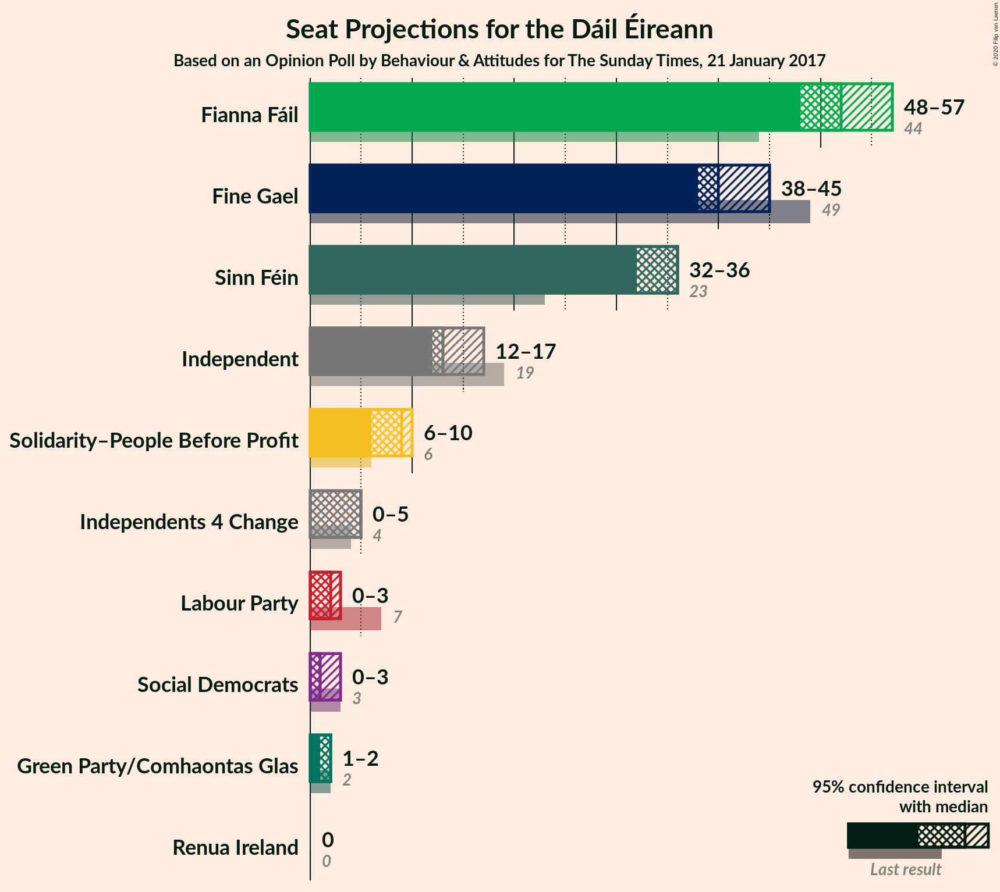

### Confidence Intervals

| Party | Last Result | Median | 80% Confidence Interval | 90% Confidence Interval | 95% Confidence Interval | 99% Confidence Interval |
|:-----:|:-----------:|:------:|:-----------------------:|:-----------------------:|:-----------------------:|:-----------------------:|
| <a href="#fianna-fáil">Fianna Fáil</a> | 44 | 52 | 52–54 |49–57 |48–57 |48–60 |
| <a href="#fine-gael">Fine Gael</a> | 49 | 40 | 40–44 |39–45 |38–45 |37–48 |
| <a href="#sinn-féin">Sinn Féin</a> | 23 | 36 | 33–36 |32–36 |32–36 |27–38 |
| <a href="#independent">Independent</a> | 19 | 13 | 13–16 |12–16 |12–17 |9–17 |
| <a href="#labour-party">Labour Party</a> | 7 | 2 | 0–2 |0–3 |0–3 |0–5 |
| <a href="#solidarity–people-before-profit">Solidarity–People Before Profit</a> | 6 | 9 | 7–10 |6–10 |6–10 |6–10 |
| <a href="#green-party/comhaontas-glas">Green Party/Comhaontas Glas</a> | 2 | 2 | 1–2 |1–2 |1–2 |0–3 |
| <a href="#independents-4-change">Independents 4 Change</a> | 4 | 5 | 2–5 |2–5 |0–5 |0–5 |
| <a href="#social-democrats">Social Democrats</a> | 3 | 1 | 1–3 |0–3 |0–3 |0–3 |
| <a href="#renua-ireland">Renua Ireland</a> | 0 | 0 | 0 |0 |0 |0 |

### Fianna Fáil

*For a full overview of the results for this party, see the [Fianna Fáil](party-fiannafáil.html) page.*

| Number of Seats | Probability | Accumulated | Special Marks |
|:---------------:|:-----------:|:-----------:|:-------------:|
| 44 | 0% | 100% | Last Result |
| 45 | 0.1% | 100% |  |
| 46 | 0% | 99.9% |  |
| 47 | 0.2% | 99.9% |  |
| 48 | 5% | 99.7% |  |
| 49 | 0.2% | 95% |  |
| 50 | 2% | 95% |  |
| 51 | 1.1% | 93% |  |
| 52 | 55% | 92% | Median |
| 53 | 23% | 37% |  |
| 54 | 6% | 15% |  |
| 55 | 0.5% | 9% |  |
| 56 | 2% | 9% |  |
| 57 | 5% | 7% |  |
| 58 | 0.9% | 2% |  |
| 59 | 0.2% | 0.8% |  |
| 60 | 0.2% | 0.6% |  |
| 61 | 0.1% | 0.4% |  |
| 62 | 0.3% | 0.3% |  |
| 63 | 0% | 0% |  |

### Fine Gael

*For a full overview of the results for this party, see the [Fine Gael](party-finegael.html) page.*

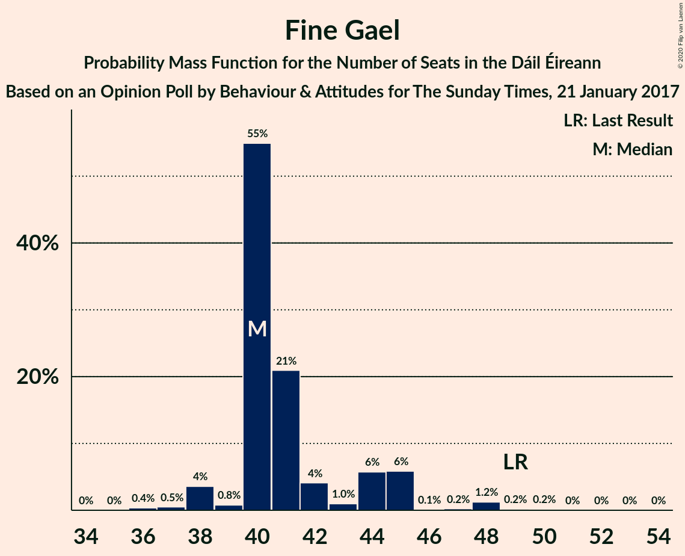

| Number of Seats | Probability | Accumulated | Special Marks |
|:---------------:|:-----------:|:-----------:|:-------------:|
| 34 | 0% | 100% |  |
| 35 | 0% | 99.9% |  |
| 36 | 0.4% | 99.9% |  |
| 37 | 0.5% | 99.5% |  |
| 38 | 4% | 99.0% |  |
| 39 | 0.8% | 95% |  |
| 40 | 55% | 95% | Median |
| 41 | 21% | 40% |  |
| 42 | 4% | 19% |  |
| 43 | 1.0% | 15% |  |
| 44 | 6% | 14% |  |
| 45 | 6% | 8% |  |
| 46 | 0.1% | 2% |  |
| 47 | 0.2% | 2% |  |
| 48 | 1.2% | 2% |  |
| 49 | 0.2% | 0.4% | Last Result |
| 50 | 0.2% | 0.3% |  |
| 51 | 0% | 0.1% |  |
| 52 | 0% | 0.1% |  |
| 53 | 0% | 0% |  |

### Sinn Féin

*For a full overview of the results for this party, see the [Sinn Féin](party-sinnféin.html) page.*

| Number of Seats | Probability | Accumulated | Special Marks |
|:---------------:|:-----------:|:-----------:|:-------------:|
| 23 | 0.2% | 100% | Last Result |
| 24 | 0% | 99.8% |  |
| 25 | 0.1% | 99.8% |  |
| 26 | 0.1% | 99.7% |  |
| 27 | 1.1% | 99.6% |  |
| 28 | 0.3% | 98.6% |  |
| 29 | 0.1% | 98% |  |
| 30 | 0.1% | 98% |  |
| 31 | 0.2% | 98% |  |
| 32 | 3% | 98% |  |
| 33 | 5% | 95% |  |
| 34 | 26% | 90% |  |
| 35 | 9% | 64% |  |
| 36 | 53% | 55% | Median |
| 37 | 1.1% | 2% |  |
| 38 | 0.3% | 0.5% |  |
| 39 | 0.1% | 0.2% |  |
| 40 | 0.2% | 0.2% |  |
| 41 | 0% | 0% |  |

### Independent

*For a full overview of the results for this party, see the [Independent](party-independent.html) page.*

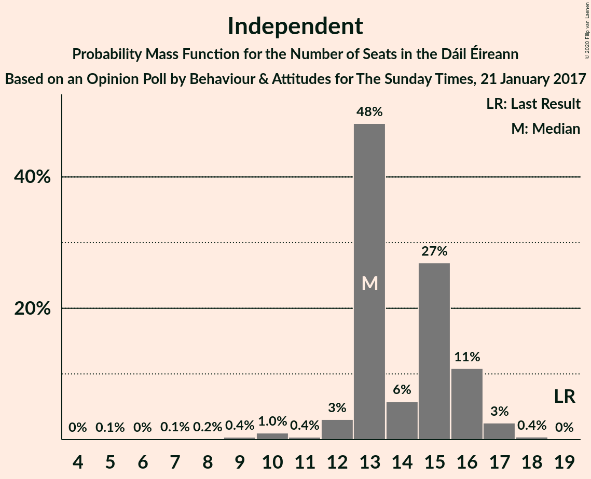

| Number of Seats | Probability | Accumulated | Special Marks |
|:---------------:|:-----------:|:-----------:|:-------------:|
| 5 | 0.1% | 100% |  |
| 6 | 0% | 99.9% |  |
| 7 | 0.1% | 99.9% |  |
| 8 | 0.2% | 99.7% |  |
| 9 | 0.4% | 99.6% |  |
| 10 | 1.0% | 99.2% |  |
| 11 | 0.4% | 98% |  |
| 12 | 3% | 98% |  |
| 13 | 48% | 95% | Median |
| 14 | 6% | 47% |  |
| 15 | 27% | 41% |  |
| 16 | 11% | 14% |  |
| 17 | 3% | 3% |  |
| 18 | 0.4% | 0.4% |  |
| 19 | 0% | 0% | Last Result |

### Labour Party

*For a full overview of the results for this party, see the [Labour Party](party-labourparty.html) page.*

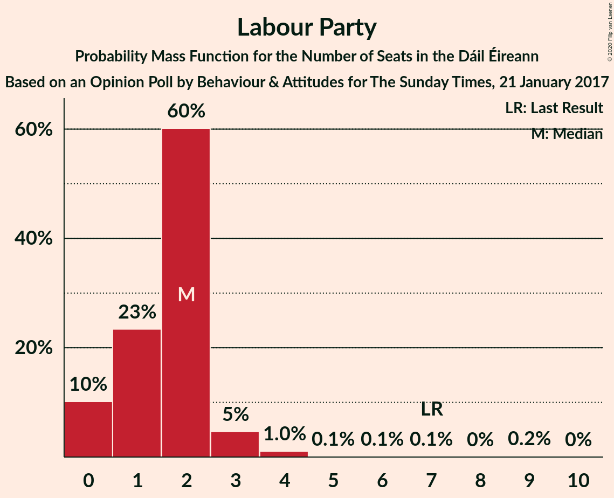

| Number of Seats | Probability | Accumulated | Special Marks |
|:---------------:|:-----------:|:-----------:|:-------------:|
| 0 | 10% | 100% |  |
| 1 | 23% | 90% |  |
| 2 | 60% | 66% | Median |
| 3 | 5% | 6% |  |
| 4 | 1.0% | 2% |  |
| 5 | 0.1% | 0.6% |  |
| 6 | 0.1% | 0.4% |  |
| 7 | 0.1% | 0.3% | Last Result |
| 8 | 0% | 0.2% |  |
| 9 | 0.2% | 0.2% |  |
| 10 | 0% | 0% |  |

### Solidarity–People Before Profit

*For a full overview of the results for this party, see the [Solidarity–People Before Profit](party-solidarity–peoplebeforeprofit.html) page.*

| Number of Seats | Probability | Accumulated | Special Marks |
|:---------------:|:-----------:|:-----------:|:-------------:|
| 3 | 0.1% | 100% |  |
| 4 | 0% | 99.9% |  |
| 5 | 0.3% | 99.9% |  |
| 6 | 8% | 99.6% | Last Result |
| 7 | 5% | 91% |  |
| 8 | 6% | 86% |  |
| 9 | 52% | 80% | Median |
| 10 | 29% | 29% |  |
| 11 | 0% | 0% |  |

### Green Party/Comhaontas Glas

*For a full overview of the results for this party, see the [Green Party/Comhaontas Glas](party-greenpartycomhaontasglas.html) page.*

| Number of Seats | Probability | Accumulated | Special Marks |
|:---------------:|:-----------:|:-----------:|:-------------:|
| 0 | 1.1% | 100% |  |
| 1 | 40% | 98.9% |  |
| 2 | 58% | 59% | Last Result, Median |
| 3 | 0.6% | 0.6% |  |
| 4 | 0% | 0% |  |

### Independents 4 Change

*For a full overview of the results for this party, see the [Independents 4 Change](party-independents4change.html) page.*

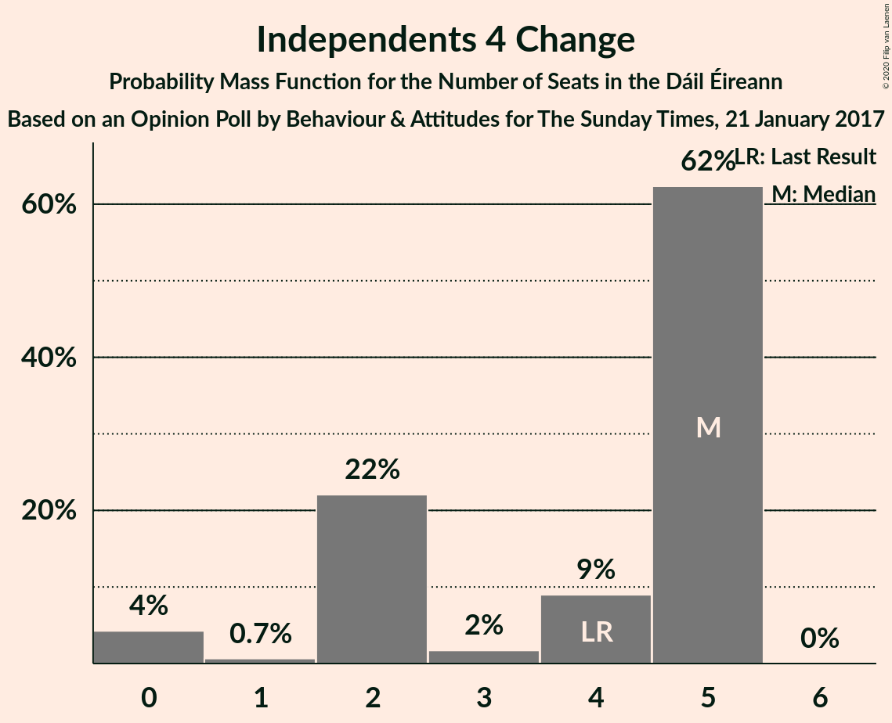

| Number of Seats | Probability | Accumulated | Special Marks |
|:---------------:|:-----------:|:-----------:|:-------------:|
| 0 | 4% | 100% |  |
| 1 | 0.7% | 96% |  |
| 2 | 22% | 95% |  |
| 3 | 2% | 73% |  |
| 4 | 9% | 71% | Last Result |
| 5 | 62% | 62% | Median |
| 6 | 0% | 0% |  |

### Social Democrats

*For a full overview of the results for this party, see the [Social Democrats](party-socialdemocrats.html) page.*

| Number of Seats | Probability | Accumulated | Special Marks |
|:---------------:|:-----------:|:-----------:|:-------------:|
| 0 | 8% | 100% |  |
| 1 | 55% | 92% | Median |
| 2 | 10% | 38% |  |
| 3 | 28% | 28% | Last Result |
| 4 | 0% | 0% |  |

### Renua Ireland

*For a full overview of the results for this party, see the [Renua Ireland](party-renuaireland.html) page.*

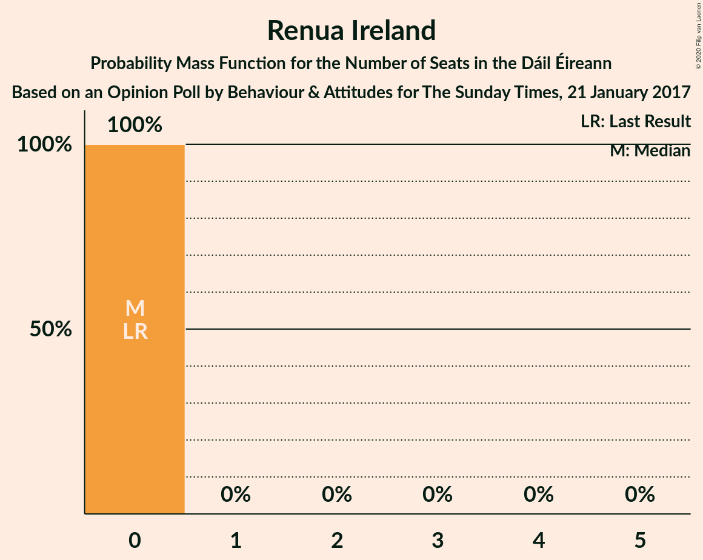

| Number of Seats | Probability | Accumulated | Special Marks |
|:---------------:|:-----------:|:-----------:|:-------------:|
| 0 | 100% | 100% | Last Result, Median |

## Coalitions

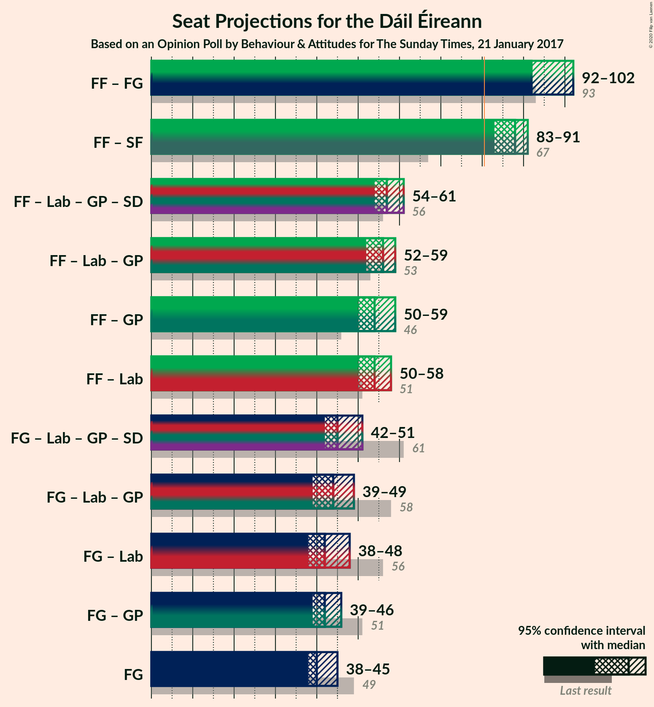

### Confidence Intervals

| Coalition | Last Result | Median | Majority? | 80% Confidence Interval | 90% Confidence Interval | 95% Confidence Interval | 99% Confidence Interval |
|:---------:|:-----------:|:------:|:---------:|:-----------------------:|:-----------------------:|:-----------------------:|:-----------------------:|
| Fianna Fáil – Fine Gael | 93 | 92 | 100% | 92–97 | 92–99 | 92–102 | 89–104 |
| Fianna Fáil – Sinn Féin | 67 | 88 | 99.7% | 87–88 | 83–91 | 83–91 | 81–94 |
| Fianna Fáil – Labour Party – Green Party/Comhaontas Glas – Social Democrats | 56 | 57 | 0% | 55–59 | 54–59 | 54–61 | 54–66 |
| Fianna Fáil – Labour Party – Green Party/Comhaontas Glas | 53 | 56 | 0% | 55–58 | 52–58 | 52–59 | 52–65 |
| Fianna Fáil – Green Party/Comhaontas Glas | 46 | 54 | 0% | 53–55 | 50–58 | 50–59 | 50–61 |
| Fianna Fáil – Labour Party | 51 | 54 | 0% | 53–57 | 51–57 | 50–58 | 50–63 |
| Fine Gael – Labour Party – Green Party/Comhaontas Glas – Social Democrats | 61 | 45 | 0% | 45–50 | 43–50 | 42–51 | 39–53 |
| Fine Gael – Labour Party – Green Party/Comhaontas Glas | 58 | 44 | 0% | 43–48 | 42–49 | 39–49 | 39–52 |
| Fine Gael – Labour Party | 56 | 42 | 0% | 42–46 | 41–48 | 38–48 | 38–50 |
| Fine Gael – Green Party/Comhaontas Glas | 51 | 42 | 0% | 41–46 | 40–46 | 39–46 | 38–50 |
| Fine Gael | 49 | 40 | 0% | 40–44 | 39–45 | 38–45 | 37–48 |

### Fianna Fáil – Fine Gael

| Number of Seats | Probability | Accumulated | Special Marks |
|:---------------:|:-----------:|:-----------:|:-------------:|
| 86 | 0.1% | 100% |  |
| 87 | 0% | 99.9% |  |
| 88 | 0.2% | 99.9% |  |
| 89 | 0.2% | 99.6% |  |
| 90 | 0.3% | 99.4% |  |
| 91 | 0.3% | 99.1% |  |
| 92 | 61% | 98.8% | Median |
| 93 | 0.5% | 38% | Last Result |
| 94 | 21% | 37% |  |
| 95 | 5% | 17% |  |
| 96 | 1.2% | 11% |  |
| 97 | 0.2% | 10% |  |
| 98 | 1.0% | 10% |  |
| 99 | 4% | 9% |  |
| 100 | 0.4% | 5% |  |
| 101 | 1.2% | 4% |  |
| 102 | 1.4% | 3% |  |
| 103 | 0% | 2% |  |
| 104 | 1.1% | 2% |  |
| 105 | 0% | 0.4% |  |
| 106 | 0.2% | 0.3% |  |
| 107 | 0% | 0.1% |  |
| 108 | 0% | 0.1% |  |
| 109 | 0% | 0.1% |  |
| 110 | 0% | 0% |  |

### Fianna Fáil – Sinn Féin

| Number of Seats | Probability | Accumulated | Special Marks |
|:---------------:|:-----------:|:-----------:|:-------------:|
| 67 | 0% | 100% | Last Result |
| 68 | 0% | 100% |  |
| 69 | 0% | 100% |  |
| 70 | 0% | 100% |  |
| 71 | 0% | 100% |  |
| 72 | 0% | 100% |  |
| 73 | 0% | 100% |  |
| 74 | 0% | 100% |  |
| 75 | 0% | 100% |  |
| 76 | 0.1% | 100% |  |
| 77 | 0% | 99.9% |  |
| 78 | 0% | 99.9% |  |
| 79 | 0% | 99.9% |  |
| 80 | 0.2% | 99.9% |  |
| 81 | 0.3% | 99.7% | Majority |
| 82 | 0.3% | 99.4% |  |
| 83 | 6% | 99.0% |  |
| 84 | 0.5% | 93% |  |
| 85 | 0.3% | 92% |  |
| 86 | 2% | 92% |  |
| 87 | 31% | 90% |  |
| 88 | 51% | 60% | Median |
| 89 | 3% | 9% |  |
| 90 | 0.7% | 6% |  |
| 91 | 3% | 5% |  |
| 92 | 0.1% | 2% |  |
| 93 | 0.1% | 2% |  |
| 94 | 2% | 2% |  |
| 95 | 0.2% | 0.4% |  |
| 96 | 0% | 0.2% |  |
| 97 | 0.2% | 0.2% |  |
| 98 | 0% | 0% |  |

### Fianna Fáil – Labour Party – Green Party/Comhaontas Glas – Social Democrats

| Number of Seats | Probability | Accumulated | Special Marks |
|:---------------:|:-----------:|:-----------:|:-------------:|
| 49 | 0.1% | 100% |  |
| 50 | 0% | 99.9% |  |
| 51 | 0% | 99.9% |  |
| 52 | 0.1% | 99.9% |  |
| 53 | 0.1% | 99.9% |  |
| 54 | 6% | 99.8% |  |
| 55 | 4% | 94% |  |
| 56 | 0.6% | 90% | Last Result |
| 57 | 52% | 89% | Median |
| 58 | 25% | 37% |  |
| 59 | 8% | 13% |  |
| 60 | 0.3% | 5% |  |
| 61 | 3% | 4% |  |
| 62 | 0.4% | 2% |  |
| 63 | 0.2% | 1.2% |  |
| 64 | 0.2% | 1.0% |  |
| 65 | 0.2% | 0.8% |  |
| 66 | 0.3% | 0.6% |  |
| 67 | 0% | 0.3% |  |
| 68 | 0.2% | 0.2% |  |
| 69 | 0% | 0.1% |  |
| 70 | 0% | 0.1% |  |
| 71 | 0% | 0% |  |

### Fianna Fáil – Labour Party – Green Party/Comhaontas Glas

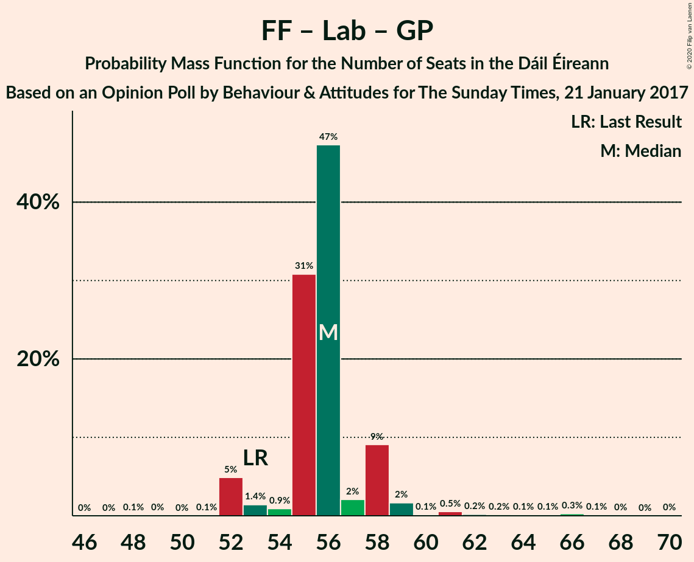

| Number of Seats | Probability | Accumulated | Special Marks |
|:---------------:|:-----------:|:-----------:|:-------------:|
| 48 | 0.1% | 100% |  |
| 49 | 0% | 99.9% |  |
| 50 | 0% | 99.9% |  |
| 51 | 0.1% | 99.9% |  |
| 52 | 5% | 99.8% |  |
| 53 | 1.4% | 95% | Last Result |
| 54 | 0.9% | 94% |  |
| 55 | 31% | 93% |  |
| 56 | 47% | 62% | Median |
| 57 | 2% | 14% |  |
| 58 | 9% | 12% |  |
| 59 | 2% | 3% |  |
| 60 | 0.1% | 2% |  |
| 61 | 0.5% | 2% |  |
| 62 | 0.2% | 1.0% |  |
| 63 | 0.2% | 0.8% |  |
| 64 | 0.1% | 0.7% |  |
| 65 | 0.1% | 0.6% |  |
| 66 | 0.3% | 0.5% |  |
| 67 | 0.1% | 0.2% |  |
| 68 | 0% | 0.1% |  |
| 69 | 0% | 0.1% |  |
| 70 | 0% | 0% |  |

### Fianna Fáil – Green Party/Comhaontas Glas

| Number of Seats | Probability | Accumulated | Special Marks |
|:---------------:|:-----------:|:-----------:|:-------------:|
| 46 | 0.1% | 100% | Last Result |
| 47 | 0% | 99.9% |  |
| 48 | 0% | 99.9% |  |
| 49 | 0.1% | 99.9% |  |
| 50 | 5% | 99.8% |  |
| 51 | 0.4% | 95% |  |
| 52 | 2% | 95% |  |
| 53 | 8% | 93% |  |
| 54 | 67% | 85% | Median |
| 55 | 8% | 17% |  |
| 56 | 1.2% | 10% |  |
| 57 | 2% | 9% |  |
| 58 | 5% | 7% |  |
| 59 | 2% | 3% |  |
| 60 | 0.2% | 0.8% |  |
| 61 | 0.2% | 0.6% |  |
| 62 | 0.1% | 0.4% |  |
| 63 | 0.3% | 0.3% |  |
| 64 | 0% | 0% |  |

### Fianna Fáil – Labour Party

| Number of Seats | Probability | Accumulated | Special Marks |
|:---------------:|:-----------:|:-----------:|:-------------:|
| 47 | 0.1% | 100% |  |
| 48 | 0% | 99.9% |  |
| 49 | 0.1% | 99.9% |  |
| 50 | 5% | 99.9% |  |
| 51 | 2% | 95% | Last Result |
| 52 | 0.5% | 94% |  |
| 53 | 4% | 93% |  |
| 54 | 75% | 89% | Median |
| 55 | 1.1% | 15% |  |
| 56 | 1.2% | 14% |  |
| 57 | 10% | 12% |  |
| 58 | 1.0% | 3% |  |
| 59 | 0.2% | 2% |  |
| 60 | 0.5% | 1.5% |  |
| 61 | 0.3% | 1.0% |  |
| 62 | 0.1% | 0.7% |  |
| 63 | 0.1% | 0.6% |  |
| 64 | 0% | 0.5% |  |
| 65 | 0.3% | 0.5% |  |
| 66 | 0.1% | 0.2% |  |
| 67 | 0% | 0.1% |  |
| 68 | 0% | 0.1% |  |
| 69 | 0% | 0% |  |

### Fine Gael – Labour Party – Green Party/Comhaontas Glas – Social Democrats

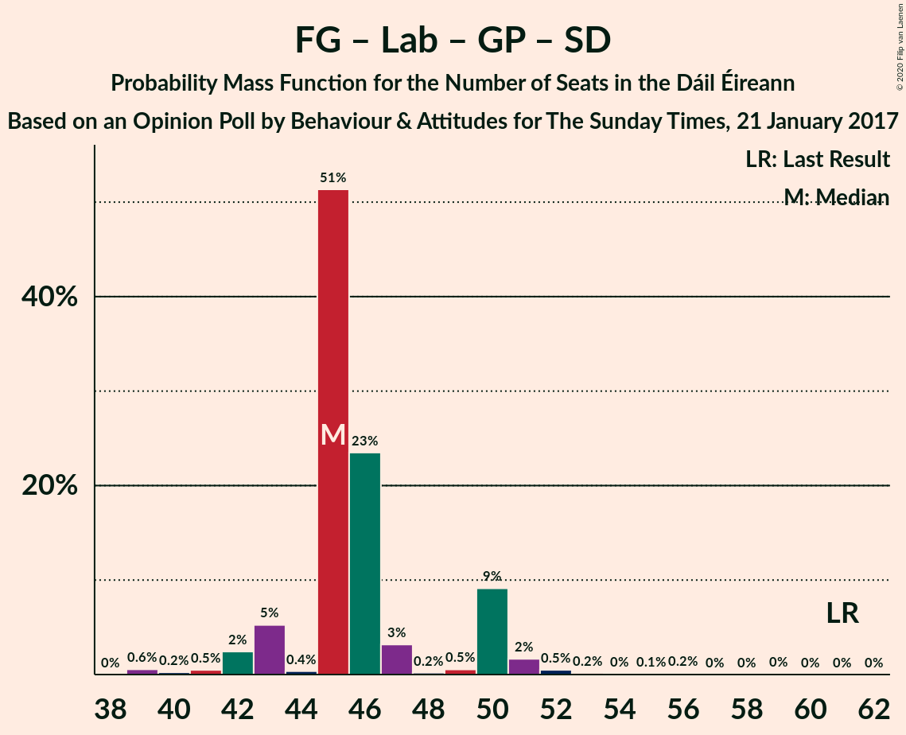

| Number of Seats | Probability | Accumulated | Special Marks |
|:---------------:|:-----------:|:-----------:|:-------------:|
| 38 | 0% | 100% |  |
| 39 | 0.6% | 99.9% |  |
| 40 | 0.2% | 99.4% |  |
| 41 | 0.5% | 99.1% |  |
| 42 | 2% | 98.7% |  |
| 43 | 5% | 96% |  |
| 44 | 0.4% | 91% |  |
| 45 | 51% | 91% | Median |
| 46 | 23% | 39% |  |
| 47 | 3% | 16% |  |
| 48 | 0.2% | 13% |  |
| 49 | 0.5% | 12% |  |
| 50 | 9% | 12% |  |
| 51 | 2% | 3% |  |
| 52 | 0.5% | 1.0% |  |
| 53 | 0.2% | 0.5% |  |
| 54 | 0% | 0.4% |  |
| 55 | 0.1% | 0.3% |  |
| 56 | 0.2% | 0.2% |  |
| 57 | 0% | 0.1% |  |
| 58 | 0% | 0.1% |  |
| 59 | 0% | 0.1% |  |
| 60 | 0% | 0% |  |
| 61 | 0% | 0% | Last Result |

### Fine Gael – Labour Party – Green Party/Comhaontas Glas

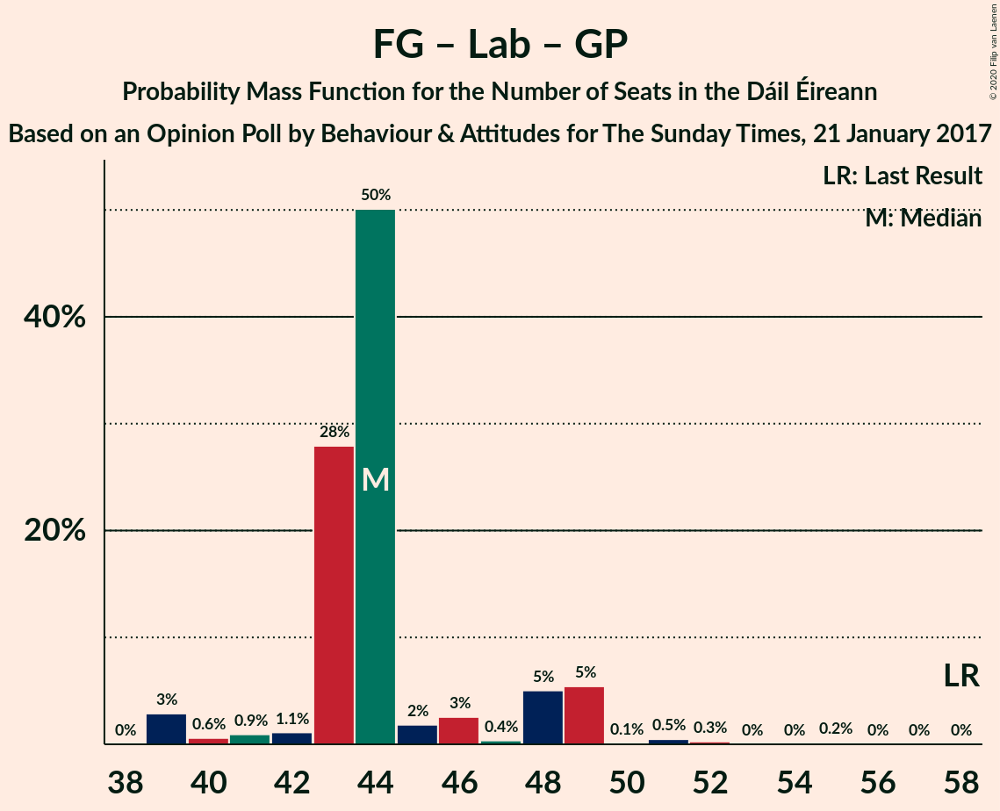

| Number of Seats | Probability | Accumulated | Special Marks |
|:---------------:|:-----------:|:-----------:|:-------------:|
| 38 | 0% | 100% |  |
| 39 | 3% | 99.9% |  |
| 40 | 0.6% | 97% |  |
| 41 | 0.9% | 96% |  |
| 42 | 1.1% | 96% |  |
| 43 | 28% | 94% |  |
| 44 | 50% | 66% | Median |
| 45 | 2% | 16% |  |
| 46 | 3% | 15% |  |
| 47 | 0.4% | 12% |  |
| 48 | 5% | 12% |  |
| 49 | 5% | 7% |  |
| 50 | 0.1% | 1.1% |  |
| 51 | 0.5% | 1.0% |  |
| 52 | 0.3% | 0.5% |  |
| 53 | 0% | 0.3% |  |
| 54 | 0% | 0.2% |  |
| 55 | 0.2% | 0.2% |  |
| 56 | 0% | 0.1% |  |
| 57 | 0% | 0.1% |  |
| 58 | 0% | 0% | Last Result |

### Fine Gael – Labour Party

| Number of Seats | Probability | Accumulated | Special Marks |
|:---------------:|:-----------:|:-----------:|:-------------:|
| 35 | 0% | 100% |  |
| 36 | 0% | 99.9% |  |
| 37 | 0.1% | 99.9% |  |
| 38 | 3% | 99.8% |  |
| 39 | 0.7% | 97% |  |
| 40 | 0.6% | 96% |  |
| 41 | 1.2% | 96% |  |
| 42 | 78% | 94% | Median |
| 43 | 1.4% | 17% |  |
| 44 | 1.4% | 15% |  |
| 45 | 2% | 14% |  |
| 46 | 5% | 12% |  |
| 47 | 0.3% | 7% |  |
| 48 | 5% | 6% |  |
| 49 | 0.3% | 1.2% |  |
| 50 | 0.6% | 0.9% |  |
| 51 | 0% | 0.3% |  |
| 52 | 0% | 0.3% |  |
| 53 | 0% | 0.3% |  |
| 54 | 0.2% | 0.2% |  |
| 55 | 0% | 0.1% |  |
| 56 | 0% | 0% | Last Result |

### Fine Gael – Green Party/Comhaontas Glas

| Number of Seats | Probability | Accumulated | Special Marks |
|:---------------:|:-----------:|:-----------:|:-------------:|
| 35 | 0% | 100% |  |
| 36 | 0.3% | 99.9% |  |
| 37 | 0.1% | 99.7% |  |
| 38 | 0.2% | 99.6% |  |
| 39 | 3% | 99.4% |  |
| 40 | 1.1% | 96% |  |
| 41 | 8% | 95% |  |
| 42 | 67% | 87% | Median |
| 43 | 0.3% | 19% |  |
| 44 | 5% | 19% |  |
| 45 | 0.4% | 14% |  |
| 46 | 11% | 13% |  |
| 47 | 0.2% | 2% |  |
| 48 | 0.6% | 2% |  |
| 49 | 1.2% | 2% |  |
| 50 | 0.1% | 0.5% |  |
| 51 | 0.3% | 0.4% | Last Result |
| 52 | 0% | 0.1% |  |
| 53 | 0.1% | 0.1% |  |
| 54 | 0% | 0% |  |

### Fine Gael

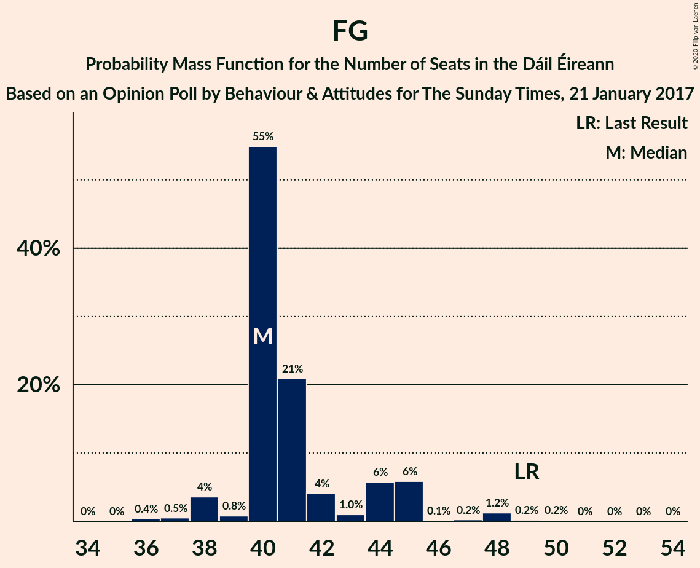

| Number of Seats | Probability | Accumulated | Special Marks |
|:---------------:|:-----------:|:-----------:|:-------------:|
| 34 | 0% | 100% |  |
| 35 | 0% | 99.9% |  |
| 36 | 0.4% | 99.9% |  |
| 37 | 0.5% | 99.5% |  |
| 38 | 4% | 99.0% |  |
| 39 | 0.8% | 95% |  |
| 40 | 55% | 95% | Median |
| 41 | 21% | 40% |  |
| 42 | 4% | 19% |  |
| 43 | 1.0% | 15% |  |
| 44 | 6% | 14% |  |
| 45 | 6% | 8% |  |
| 46 | 0.1% | 2% |  |
| 47 | 0.2% | 2% |  |
| 48 | 1.2% | 2% |  |
| 49 | 0.2% | 0.4% | Last Result |
| 50 | 0.2% | 0.3% |  |
| 51 | 0% | 0.1% |  |
| 52 | 0% | 0.1% |  |
| 53 | 0% | 0% |  |

## Technical Information

### Opinion Poll

+ **Polling firm:** Behaviour & Attitudes
+ **Commissioner(s):** The Sunday Times
+ **Fieldwork period:** 21 January 2017

### Calculations

+ **Sample size:** 921
+ **Simulations done:** 131,072
+ **Error estimate:** 1.08%

