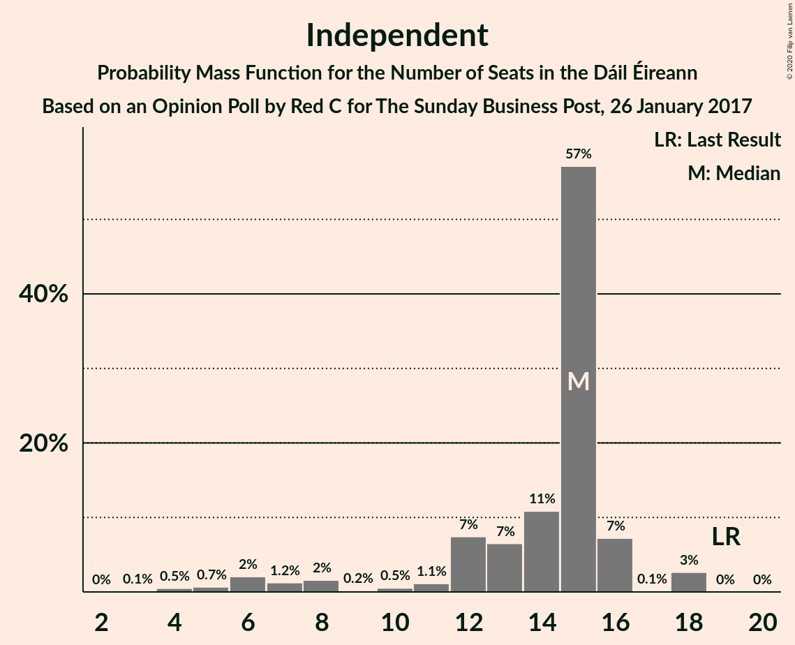
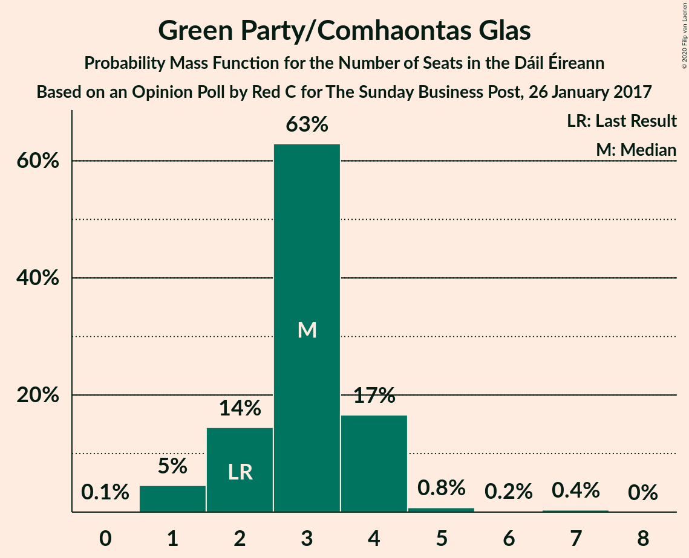
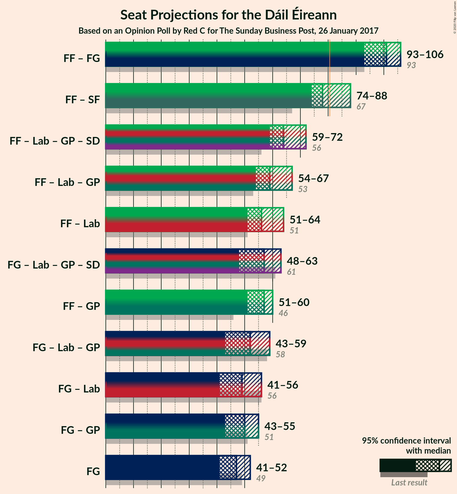
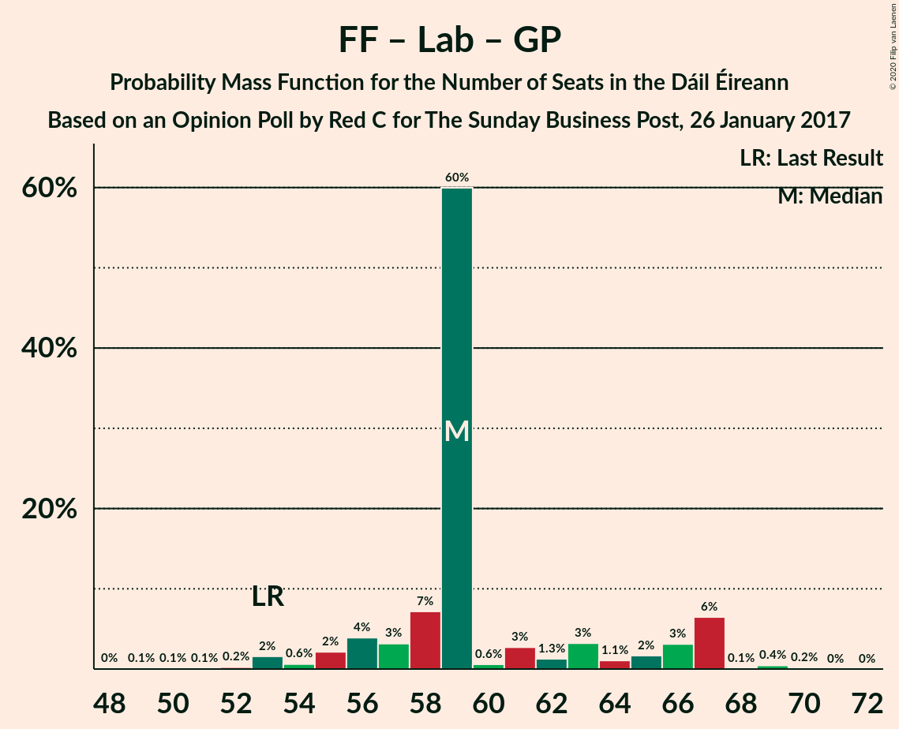
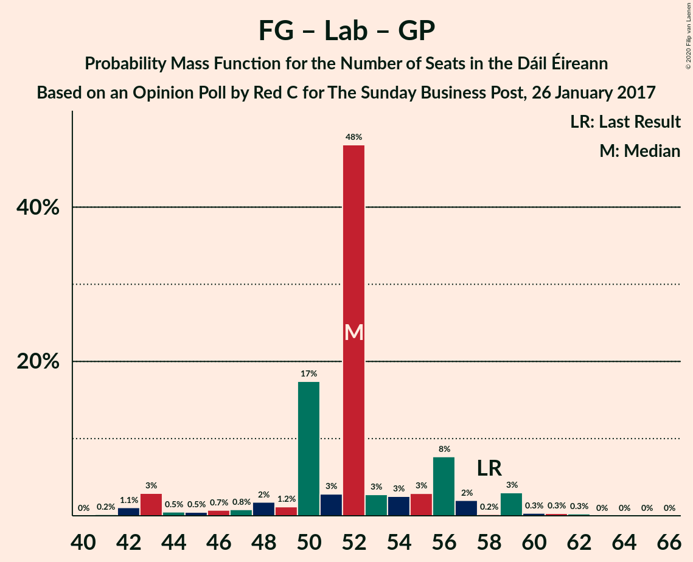

# Opinion Poll by Red C for The Sunday Business Post, 26 January 2017

<a href="#voting-intentions">Voting Intentions</a> | <a href="#seats">Seats</a> | <a href="#coalitions">Coalitions</a> | <a href="#technical-information">Technical Information</a>

## Voting Intentions

### Confidence Intervals

| Party | Last Result | Poll Result | 80% Confidence Interval | 90% Confidence Interval | 95% Confidence Interval | 99% Confidence Interval |
|:-----:|:-----------:|:-----------:|:-----------------------:|:-----------------------:|:-----------------------:|:-----------------------:|
| Fianna Fáil | 24.3% | 27.2% | 25.2–28.9% |24.8–29.4% |24.3–29.8% |23.5–30.7% |
| Fine Gael | 25.5% | 24.2% | 22.3–25.8% |21.9–26.3% |21.5–26.7% |20.7–27.6% |
| Sinn Féin | 13.8% | 14.1% | 12.7–15.5% |12.3–16.0% |12.0–16.3% |11.4–17.1% |
| Independent | 15.9% | 11.9% | 10.6–13.3% |10.3–13.7% |10.0–14.0% |9.4–14.7% |
| Labour Party | 6.6% | 5.0% | 4.2–6.0% |4.0–6.3% |3.8–6.5% |3.4–7.0% |
| Solidarity–People Before Profit | 3.9% | 4.0% | 3.3–4.9% |3.1–5.2% |2.9–5.4% |2.6–5.9% |
| Social Democrats | 3.0% | 4.0% | 3.3–4.9% |3.1–5.2% |2.9–5.4% |2.6–5.9% |
| Green Party/Comhaontas Glas | 2.7% | 4.0% | 3.3–4.9% |3.1–5.2% |2.9–5.4% |2.6–5.9% |
| Independents 4 Change | 1.5% | 1.5% | 1.1–2.1% |1.0–2.3% |0.9–2.5% |0.7–2.8% |
| Renua Ireland | 2.2% | 0.3% | 0.7–1.5% |0.6–1.7% |0.5–1.8% |0.4–2.1% |

*Note:* The poll result column reflects the actual value used in the calculations. Published results may vary slightly, and in addition be rounded to fewer digits.

## Seats

### Confidence Intervals

| Party | Last Result | Median | 80% Confidence Interval | 90% Confidence Interval | 95% Confidence Interval | 99% Confidence Interval |
|:-----:|:-----------:|:------:|:-----------------------:|:-----------------------:|:-----------------------:|:-----------------------:|
| <a href="#fianna-fáil">Fianna Fáil</a> | 44 | 54 | 52–56 |50–57 |48–58 |46–59 |
| <a href="#fine-gael">Fine Gael</a> | 49 | 47 | 43–48 |41–50 |41–52 |38–57 |
| <a href="#sinn-féin">Sinn Féin</a> | 23 | 24 | 22–30 |21–33 |19–34 |19–34 |
| <a href="#independent">Independent</a> | 19 | 15 | 12–16 |8–16 |6–18 |4–18 |
| <a href="#labour-party">Labour Party</a> | 7 | 2 | 0–8 |0–9 |0–9 |0–9 |
| <a href="#solidarity–people-before-profit">Solidarity–People Before Profit</a> | 6 | 6 | 5–7 |4–8 |4–9 |3–9 |
| <a href="#social-democrats">Social Democrats</a> | 3 | 5 | 4–5 |4–7 |3–8 |3–8 |
| <a href="#green-party/comhaontas-glas">Green Party/Comhaontas Glas</a> | 2 | 3 | 2–4 |2–4 |1–4 |1–6 |
| <a href="#independents-4-change">Independents 4 Change</a> | 4 | 4 | 3–5 |1–5 |1–5 |0–5 |
| <a href="#renua-ireland">Renua Ireland</a> | 0 | 0 | 0 |0 |0 |0–2 |

### Fianna Fáil

*For a full overview of the results for this party, see the [Fianna Fáil](party-fiannafáil.html) page.*

| Number of Seats | Probability | Accumulated | Special Marks |
|:---------------:|:-----------:|:-----------:|:-------------:|
| 44 | 0% | 100% | Last Result |
| 45 | 0.3% | 99.9% |  |
| 46 | 0.6% | 99.6% |  |
| 47 | 0.3% | 99.0% |  |
| 48 | 1.4% | 98.7% |  |
| 49 | 0.2% | 97% |  |
| 50 | 3% | 97% |  |
| 51 | 1.2% | 94% |  |
| 52 | 7% | 93% |  |
| 53 | 5% | 86% |  |
| 54 | 44% | 81% | Median |
| 55 | 23% | 37% |  |
| 56 | 6% | 14% |  |
| 57 | 4% | 8% |  |
| 58 | 3% | 4% |  |
| 59 | 0.8% | 1.1% |  |
| 60 | 0.3% | 0.3% |  |
| 61 | 0% | 0% |  |

### Fine Gael

*For a full overview of the results for this party, see the [Fine Gael](party-finegael.html) page.*

| Number of Seats | Probability | Accumulated | Special Marks |
|:---------------:|:-----------:|:-----------:|:-------------:|
| 36 | 0.1% | 100% |  |
| 37 | 0.2% | 99.9% |  |
| 38 | 1.2% | 99.7% |  |
| 39 | 0.1% | 98.5% |  |
| 40 | 0.5% | 98% |  |
| 41 | 4% | 98% |  |
| 42 | 3% | 93% |  |
| 43 | 3% | 91% |  |
| 44 | 5% | 87% |  |
| 45 | 4% | 82% |  |
| 46 | 16% | 78% |  |
| 47 | 47% | 61% | Median |
| 48 | 8% | 15% |  |
| 49 | 1.4% | 7% | Last Result |
| 50 | 1.0% | 5% |  |
| 51 | 2% | 5% |  |
| 52 | 0.6% | 3% |  |
| 53 | 1.4% | 2% |  |
| 54 | 0.1% | 0.7% |  |
| 55 | 0% | 0.6% |  |
| 56 | 0% | 0.6% |  |
| 57 | 0.3% | 0.6% |  |
| 58 | 0.2% | 0.3% |  |
| 59 | 0% | 0.1% |  |
| 60 | 0% | 0% |  |

### Sinn Féin

*For a full overview of the results for this party, see the [Sinn Féin](party-sinnféin.html) page.*

| Number of Seats | Probability | Accumulated | Special Marks |
|:---------------:|:-----------:|:-----------:|:-------------:|
| 17 | 0% | 100% |  |
| 18 | 0.1% | 99.9% |  |
| 19 | 3% | 99.9% |  |
| 20 | 2% | 97% |  |
| 21 | 2% | 95% |  |
| 22 | 5% | 93% |  |
| 23 | 1.1% | 88% | Last Result |
| 24 | 47% | 86% | Median |
| 25 | 2% | 39% |  |
| 26 | 15% | 37% |  |
| 27 | 4% | 23% |  |
| 28 | 7% | 19% |  |
| 29 | 2% | 12% |  |
| 30 | 2% | 10% |  |
| 31 | 1.3% | 9% |  |
| 32 | 2% | 8% |  |
| 33 | 0.8% | 5% |  |
| 34 | 4% | 5% |  |
| 35 | 0.1% | 0.2% |  |
| 36 | 0.1% | 0.1% |  |
| 37 | 0% | 0% |  |

### Independent

*For a full overview of the results for this party, see the [Independent](party-independent.html) page.*

| Number of Seats | Probability | Accumulated | Special Marks |
|:---------------:|:-----------:|:-----------:|:-------------:|
| 3 | 0.1% | 100% |  |
| 4 | 0.5% | 99.9% |  |
| 5 | 0.7% | 99.4% |  |
| 6 | 2% | 98.7% |  |
| 7 | 1.2% | 97% |  |
| 8 | 2% | 95% |  |
| 9 | 0.2% | 94% |  |
| 10 | 0.5% | 94% |  |
| 11 | 1.1% | 93% |  |
| 12 | 7% | 92% |  |
| 13 | 7% | 85% |  |
| 14 | 11% | 78% |  |
| 15 | 57% | 67% | Median |
| 16 | 7% | 10% |  |
| 17 | 0.1% | 3% |  |
| 18 | 3% | 3% |  |
| 19 | 0% | 0% | Last Result |

### Labour Party

*For a full overview of the results for this party, see the [Labour Party](party-labourparty.html) page.*

| Number of Seats | Probability | Accumulated | Special Marks |
|:---------------:|:-----------:|:-----------:|:-------------:|
| 0 | 17% | 100% |  |
| 1 | 10% | 83% |  |
| 2 | 50% | 73% | Median |
| 3 | 3% | 22% |  |
| 4 | 2% | 19% |  |
| 5 | 1.3% | 18% |  |
| 6 | 4% | 16% |  |
| 7 | 3% | 13% | Last Result |
| 8 | 1.3% | 10% |  |
| 9 | 9% | 9% |  |
| 10 | 0.1% | 0.2% |  |
| 11 | 0% | 0.1% |  |
| 12 | 0% | 0% |  |

### Solidarity–People Before Profit

*For a full overview of the results for this party, see the [Solidarity–People Before Profit](party-solidarity–peoplebeforeprofit.html) page.*

| Number of Seats | Probability | Accumulated | Special Marks |
|:---------------:|:-----------:|:-----------:|:-------------:|
| 3 | 2% | 100% |  |
| 4 | 4% | 98% |  |
| 5 | 16% | 94% |  |
| 6 | 61% | 77% | Last Result, Median |
| 7 | 9% | 16% |  |
| 8 | 3% | 7% |  |
| 9 | 3% | 4% |  |
| 10 | 0.4% | 0.4% |  |
| 11 | 0% | 0% |  |

### Social Democrats

*For a full overview of the results for this party, see the [Social Democrats](party-socialdemocrats.html) page.*

| Number of Seats | Probability | Accumulated | Special Marks |
|:---------------:|:-----------:|:-----------:|:-------------:|
| 3 | 5% | 100% | Last Result |
| 4 | 32% | 95% |  |
| 5 | 54% | 63% | Median |
| 6 | 3% | 9% |  |
| 7 | 3% | 7% |  |
| 8 | 3% | 3% |  |
| 9 | 0.1% | 0.4% |  |
| 10 | 0.2% | 0.3% |  |
| 11 | 0.1% | 0.1% |  |
| 12 | 0% | 0% |  |

### Green Party/Comhaontas Glas

*For a full overview of the results for this party, see the [Green Party/Comhaontas Glas](party-greenpartycomhaontasglas.html) page.*

| Number of Seats | Probability | Accumulated | Special Marks |
|:---------------:|:-----------:|:-----------:|:-------------:|
| 0 | 0.1% | 100% |  |
| 1 | 5% | 99.9% |  |
| 2 | 14% | 95% | Last Result |
| 3 | 63% | 81% | Median |
| 4 | 17% | 18% |  |
| 5 | 0.8% | 1.3% |  |
| 6 | 0.2% | 0.6% |  |
| 7 | 0.4% | 0.4% |  |
| 8 | 0% | 0% |  |

### Independents 4 Change

*For a full overview of the results for this party, see the [Independents 4 Change](party-independents4change.html) page.*

| Number of Seats | Probability | Accumulated | Special Marks |
|:---------------:|:-----------:|:-----------:|:-------------:|
| 0 | 1.3% | 100% |  |
| 1 | 4% | 98.7% |  |
| 2 | 3% | 95% |  |
| 3 | 2% | 91% |  |
| 4 | 68% | 89% | Last Result, Median |
| 5 | 21% | 21% |  |
| 6 | 0% | 0% |  |

### Renua Ireland

*For a full overview of the results for this party, see the [Renua Ireland](party-renuaireland.html) page.*

| Number of Seats | Probability | Accumulated | Special Marks |
|:---------------:|:-----------:|:-----------:|:-------------:|
| 0 | 98.8% | 100% | Last Result, Median |
| 1 | 0.1% | 1.2% |  |
| 2 | 1.1% | 1.1% |  |
| 3 | 0% | 0% |  |

## Coalitions

### Confidence Intervals

| Coalition | Last Result | Median | Majority? | 80% Confidence Interval | 90% Confidence Interval | 95% Confidence Interval | 99% Confidence Interval |
|:---------:|:-----------:|:------:|:---------:|:-----------------------:|:-----------------------:|:-----------------------:|:-----------------------:|
| Fianna Fáil – Fine Gael | 93 | 101 | 100% | 95–103 | 94–105 | 93–106 | 91–110 |
| Fianna Fáil – Sinn Féin | 67 | 78 | 30% | 77–83 | 76–86 | 74–88 | 71–90 |
| Fianna Fáil – Labour Party – Green Party/Comhaontas Glas – Social Democrats | 56 | 64 | 0% | 61–70 | 60–71 | 59–72 | 57–73 |
| Fianna Fáil – Labour Party – Green Party/Comhaontas Glas | 53 | 59 | 0% | 57–66 | 56–67 | 54–67 | 52–69 |
| Fianna Fáil – Labour Party | 51 | 56 | 0% | 54–63 | 53–64 | 51–64 | 50–67 |
| Fine Gael – Labour Party – Green Party/Comhaontas Glas – Social Democrats | 61 | 57 | 0% | 53–60 | 51–62 | 48–63 | 47–65 |
| Fianna Fáil – Green Party/Comhaontas Glas | 46 | 57 | 0% | 55–59 | 53–59 | 51–60 | 48–62 |
| Fine Gael – Labour Party – Green Party/Comhaontas Glas | 58 | 52 | 0% | 50–56 | 45–57 | 43–59 | 42–61 |
| Fine Gael – Labour Party | 56 | 49 | 0% | 46–53 | 43–55 | 41–56 | 39–60 |
| Fine Gael – Green Party/Comhaontas Glas | 51 | 50 | 0% | 46–51 | 43–53 | 43–55 | 41–59 |
| Fine Gael | 49 | 47 | 0% | 43–48 | 41–50 | 41–52 | 38–57 |

### Fianna Fáil – Fine Gael

| Number of Seats | Probability | Accumulated | Special Marks |
|:---------------:|:-----------:|:-----------:|:-------------:|
| 88 | 0.1% | 100% |  |
| 89 | 0.1% | 99.8% |  |
| 90 | 0.1% | 99.7% |  |
| 91 | 1.2% | 99.6% |  |
| 92 | 0.5% | 98% |  |
| 93 | 2% | 98% | Last Result |
| 94 | 1.4% | 96% |  |
| 95 | 5% | 95% |  |
| 96 | 1.0% | 90% |  |
| 97 | 3% | 89% |  |
| 98 | 2% | 86% |  |
| 99 | 7% | 84% |  |
| 100 | 4% | 78% |  |
| 101 | 59% | 73% | Median |
| 102 | 2% | 14% |  |
| 103 | 3% | 12% |  |
| 104 | 1.3% | 8% |  |
| 105 | 4% | 7% |  |
| 106 | 1.1% | 3% |  |
| 107 | 0.1% | 1.5% |  |
| 108 | 0.5% | 1.4% |  |
| 109 | 0% | 0.9% |  |
| 110 | 0.6% | 0.9% |  |
| 111 | 0.2% | 0.3% |  |
| 112 | 0% | 0.1% |  |
| 113 | 0% | 0.1% |  |
| 114 | 0.1% | 0.1% |  |
| 115 | 0% | 0% |  |

### Fianna Fáil – Sinn Féin

| Number of Seats | Probability | Accumulated | Special Marks |
|:---------------:|:-----------:|:-----------:|:-------------:|
| 67 | 0% | 100% | Last Result |
| 68 | 0% | 100% |  |
| 69 | 0% | 100% |  |
| 70 | 0.3% | 99.9% |  |
| 71 | 0.3% | 99.7% |  |
| 72 | 0.1% | 99.3% |  |
| 73 | 0.1% | 99.3% |  |
| 74 | 2% | 99.2% |  |
| 75 | 0.7% | 97% |  |
| 76 | 4% | 96% |  |
| 77 | 8% | 92% |  |
| 78 | 42% | 84% | Median |
| 79 | 4% | 42% |  |
| 80 | 8% | 38% |  |
| 81 | 13% | 30% | Majority |
| 82 | 5% | 17% |  |
| 83 | 6% | 12% |  |
| 84 | 0.5% | 6% |  |
| 85 | 0.5% | 6% |  |
| 86 | 0.4% | 5% |  |
| 87 | 2% | 5% |  |
| 88 | 1.3% | 3% |  |
| 89 | 1.2% | 2% |  |
| 90 | 0.8% | 0.9% |  |
| 91 | 0% | 0.1% |  |
| 92 | 0% | 0.1% |  |
| 93 | 0% | 0% |  |

### Fianna Fáil – Labour Party – Green Party/Comhaontas Glas – Social Democrats

| Number of Seats | Probability | Accumulated | Special Marks |
|:---------------:|:-----------:|:-----------:|:-------------:|
| 53 | 0.1% | 100% |  |
| 54 | 0% | 99.9% |  |
| 55 | 0.1% | 99.9% |  |
| 56 | 0.2% | 99.7% | Last Result |
| 57 | 0.1% | 99.5% |  |
| 58 | 2% | 99.5% |  |
| 59 | 0.9% | 98% |  |
| 60 | 6% | 97% |  |
| 61 | 2% | 91% |  |
| 62 | 1.3% | 89% |  |
| 63 | 17% | 87% |  |
| 64 | 46% | 70% | Median |
| 65 | 3% | 24% |  |
| 66 | 2% | 21% |  |
| 67 | 3% | 19% |  |
| 68 | 2% | 16% |  |
| 69 | 2% | 14% |  |
| 70 | 4% | 11% |  |
| 71 | 4% | 8% |  |
| 72 | 3% | 3% |  |
| 73 | 0.5% | 0.8% |  |
| 74 | 0.1% | 0.3% |  |
| 75 | 0.2% | 0.2% |  |
| 76 | 0% | 0.1% |  |
| 77 | 0% | 0% |  |

### Fianna Fáil – Labour Party – Green Party/Comhaontas Glas

| Number of Seats | Probability | Accumulated | Special Marks |
|:---------------:|:-----------:|:-----------:|:-------------:|
| 49 | 0.1% | 100% |  |
| 50 | 0.1% | 99.9% |  |
| 51 | 0.1% | 99.8% |  |
| 52 | 0.2% | 99.7% |  |
| 53 | 2% | 99.5% | Last Result |
| 54 | 0.6% | 98% |  |
| 55 | 2% | 97% |  |
| 56 | 4% | 95% |  |
| 57 | 3% | 91% |  |
| 58 | 7% | 88% |  |
| 59 | 60% | 81% | Median |
| 60 | 0.6% | 21% |  |
| 61 | 3% | 20% |  |
| 62 | 1.3% | 18% |  |
| 63 | 3% | 16% |  |
| 64 | 1.1% | 13% |  |
| 65 | 2% | 12% |  |
| 66 | 3% | 10% |  |
| 67 | 6% | 7% |  |
| 68 | 0.1% | 0.7% |  |
| 69 | 0.4% | 0.6% |  |
| 70 | 0.2% | 0.2% |  |
| 71 | 0% | 0% |  |

### Fianna Fáil – Labour Party

| Number of Seats | Probability | Accumulated | Special Marks |
|:---------------:|:-----------:|:-----------:|:-------------:|
| 46 | 0.1% | 100% |  |
| 47 | 0.2% | 99.9% |  |
| 48 | 0% | 99.7% |  |
| 49 | 0.1% | 99.7% |  |
| 50 | 2% | 99.6% |  |
| 51 | 0.4% | 98% | Last Result |
| 52 | 2% | 97% |  |
| 53 | 5% | 95% |  |
| 54 | 2% | 90% |  |
| 55 | 15% | 88% |  |
| 56 | 50% | 73% | Median |
| 57 | 2% | 23% |  |
| 58 | 2% | 21% |  |
| 59 | 2% | 19% |  |
| 60 | 3% | 18% |  |
| 61 | 2% | 15% |  |
| 62 | 3% | 13% |  |
| 63 | 0.8% | 10% |  |
| 64 | 9% | 9% |  |
| 65 | 0.2% | 0.8% |  |
| 66 | 0% | 0.7% |  |
| 67 | 0.5% | 0.6% |  |
| 68 | 0.1% | 0.1% |  |
| 69 | 0% | 0% |  |

### Fine Gael – Labour Party – Green Party/Comhaontas Glas – Social Democrats

| Number of Seats | Probability | Accumulated | Special Marks |
|:---------------:|:-----------:|:-----------:|:-------------:|
| 45 | 0.1% | 100% |  |
| 46 | 0% | 99.9% |  |
| 47 | 0.4% | 99.9% |  |
| 48 | 3% | 99.4% |  |
| 49 | 1.3% | 97% |  |
| 50 | 0.1% | 95% |  |
| 51 | 1.2% | 95% |  |
| 52 | 1.3% | 94% |  |
| 53 | 4% | 93% |  |
| 54 | 14% | 89% |  |
| 55 | 2% | 76% |  |
| 56 | 4% | 73% |  |
| 57 | 44% | 69% | Median |
| 58 | 5% | 25% |  |
| 59 | 5% | 20% |  |
| 60 | 6% | 15% |  |
| 61 | 4% | 9% | Last Result |
| 62 | 0.5% | 5% |  |
| 63 | 2% | 5% |  |
| 64 | 2% | 2% |  |
| 65 | 0.4% | 0.8% |  |
| 66 | 0.1% | 0.4% |  |
| 67 | 0.2% | 0.4% |  |
| 68 | 0% | 0.1% |  |
| 69 | 0% | 0.1% |  |
| 70 | 0% | 0.1% |  |
| 71 | 0% | 0% |  |

### Fianna Fáil – Green Party/Comhaontas Glas

| Number of Seats | Probability | Accumulated | Special Marks |
|:---------------:|:-----------:|:-----------:|:-------------:|
| 46 | 0% | 100% | Last Result |
| 47 | 0.3% | 100% |  |
| 48 | 0.2% | 99.6% |  |
| 49 | 0.7% | 99.5% |  |
| 50 | 0.2% | 98.8% |  |
| 51 | 1.2% | 98.6% |  |
| 52 | 0.9% | 97% |  |
| 53 | 3% | 96% |  |
| 54 | 1.4% | 93% |  |
| 55 | 4% | 92% |  |
| 56 | 5% | 87% |  |
| 57 | 49% | 83% | Median |
| 58 | 14% | 34% |  |
| 59 | 17% | 20% |  |
| 60 | 0.9% | 3% |  |
| 61 | 2% | 2% |  |
| 62 | 0.4% | 0.6% |  |
| 63 | 0.1% | 0.2% |  |
| 64 | 0% | 0.1% |  |
| 65 | 0.1% | 0.1% |  |
| 66 | 0% | 0% |  |

### Fine Gael – Labour Party – Green Party/Comhaontas Glas

| Number of Seats | Probability | Accumulated | Special Marks |
|:---------------:|:-----------:|:-----------:|:-------------:|
| 41 | 0.2% | 100% |  |
| 42 | 1.1% | 99.8% |  |
| 43 | 3% | 98.7% |  |
| 44 | 0.5% | 96% |  |
| 45 | 0.5% | 95% |  |
| 46 | 0.7% | 95% |  |
| 47 | 0.8% | 94% |  |
| 48 | 2% | 93% |  |
| 49 | 1.2% | 92% |  |
| 50 | 17% | 90% |  |
| 51 | 3% | 73% |  |
| 52 | 48% | 70% | Median |
| 53 | 3% | 22% |  |
| 54 | 3% | 19% |  |
| 55 | 3% | 17% |  |
| 56 | 8% | 14% |  |
| 57 | 2% | 6% |  |
| 58 | 0.2% | 4% | Last Result |
| 59 | 3% | 4% |  |
| 60 | 0.3% | 1.0% |  |
| 61 | 0.3% | 0.7% |  |
| 62 | 0.3% | 0.4% |  |
| 63 | 0% | 0.1% |  |
| 64 | 0% | 0.1% |  |
| 65 | 0% | 0.1% |  |
| 66 | 0% | 0% |  |

### Fine Gael – Labour Party

| Number of Seats | Probability | Accumulated | Special Marks |
|:---------------:|:-----------:|:-----------:|:-------------:|
| 37 | 0% | 100% |  |
| 38 | 0.1% | 99.9% |  |
| 39 | 1.0% | 99.8% |  |
| 40 | 0.1% | 98.8% |  |
| 41 | 3% | 98.7% |  |
| 42 | 0.3% | 96% |  |
| 43 | 0.8% | 95% |  |
| 44 | 0.5% | 95% |  |
| 45 | 1.3% | 94% |  |
| 46 | 14% | 93% |  |
| 47 | 5% | 79% |  |
| 48 | 2% | 74% |  |
| 49 | 48% | 72% | Median |
| 50 | 4% | 24% |  |
| 51 | 4% | 20% |  |
| 52 | 3% | 16% |  |
| 53 | 6% | 13% |  |
| 54 | 1.3% | 7% |  |
| 55 | 2% | 6% |  |
| 56 | 2% | 4% | Last Result |
| 57 | 1.3% | 2% |  |
| 58 | 0.1% | 0.7% |  |
| 59 | 0.1% | 0.6% |  |
| 60 | 0.4% | 0.5% |  |
| 61 | 0% | 0.1% |  |
| 62 | 0% | 0.1% |  |
| 63 | 0% | 0% |  |

### Fine Gael – Green Party/Comhaontas Glas

| Number of Seats | Probability | Accumulated | Special Marks |
|:---------------:|:-----------:|:-----------:|:-------------:|
| 38 | 0% | 100% |  |
| 39 | 0.1% | 99.9% |  |
| 40 | 0.1% | 99.8% |  |
| 41 | 1.1% | 99.7% |  |
| 42 | 0.8% | 98.6% |  |
| 43 | 4% | 98% |  |
| 44 | 2% | 94% |  |
| 45 | 2% | 92% |  |
| 46 | 3% | 91% |  |
| 47 | 8% | 88% |  |
| 48 | 6% | 80% |  |
| 49 | 4% | 74% |  |
| 50 | 57% | 70% | Median |
| 51 | 7% | 14% | Last Result |
| 52 | 2% | 7% |  |
| 53 | 0.6% | 5% |  |
| 54 | 0.9% | 5% |  |
| 55 | 2% | 4% |  |
| 56 | 0.7% | 1.4% |  |
| 57 | 0.1% | 0.7% |  |
| 58 | 0.1% | 0.6% |  |
| 59 | 0.4% | 0.5% |  |
| 60 | 0% | 0.1% |  |
| 61 | 0% | 0.1% |  |
| 62 | 0% | 0.1% |  |
| 63 | 0% | 0.1% |  |
| 64 | 0% | 0% |  |

### Fine Gael

| Number of Seats | Probability | Accumulated | Special Marks |
|:---------------:|:-----------:|:-----------:|:-------------:|
| 36 | 0.1% | 100% |  |
| 37 | 0.2% | 99.9% |  |
| 38 | 1.2% | 99.7% |  |
| 39 | 0.1% | 98.5% |  |
| 40 | 0.5% | 98% |  |
| 41 | 4% | 98% |  |
| 42 | 3% | 93% |  |
| 43 | 3% | 91% |  |
| 44 | 5% | 87% |  |
| 45 | 4% | 82% |  |
| 46 | 16% | 78% |  |
| 47 | 47% | 61% | Median |
| 48 | 8% | 15% |  |
| 49 | 1.4% | 7% | Last Result |
| 50 | 1.0% | 5% |  |
| 51 | 2% | 5% |  |
| 52 | 0.6% | 3% |  |
| 53 | 1.4% | 2% |  |
| 54 | 0.1% | 0.7% |  |
| 55 | 0% | 0.6% |  |
| 56 | 0% | 0.6% |  |
| 57 | 0.3% | 0.6% |  |
| 58 | 0.2% | 0.3% |  |
| 59 | 0% | 0.1% |  |
| 60 | 0% | 0% |  |

## Technical Information

### Opinion Poll

+ **Polling firm:** Red C
+ **Commissioner(s):** The Sunday Business Post
+ **Fieldwork period:** 26 January 2017

### Calculations

+ **Sample size:** 997
+ **Simulations done:** 131,072
+ **Error estimate:** 1.08%

