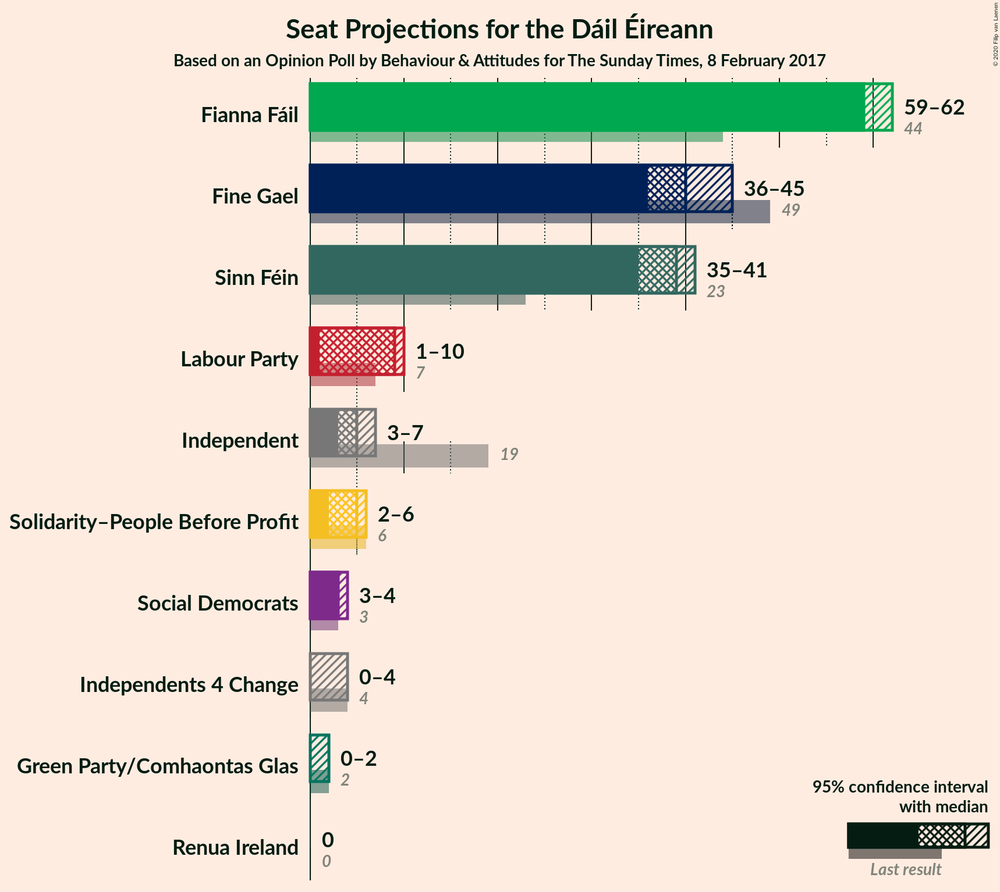
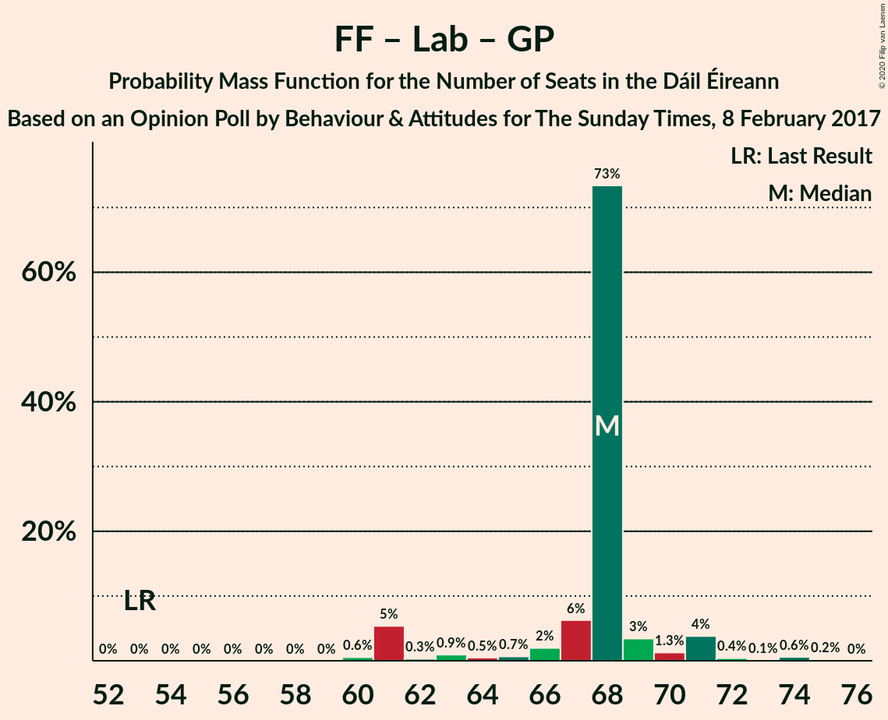
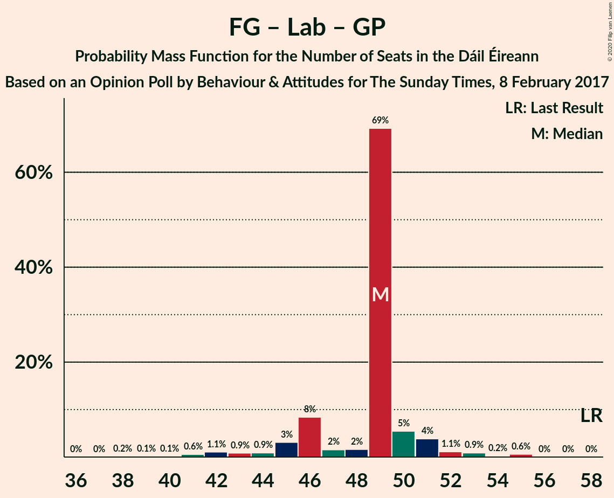
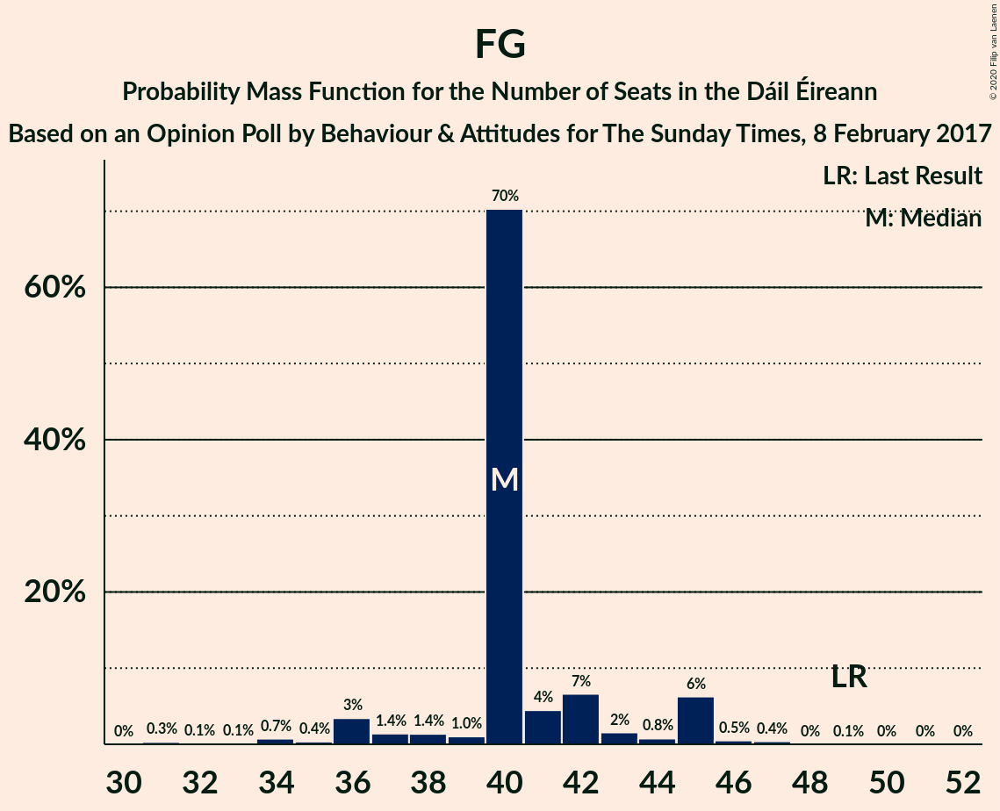

# Opinion Poll by Behaviour & Attitudes for The Sunday Times, 8 February 2017

<a href="#voting-intentions">Voting Intentions</a> | <a href="#seats">Seats</a> | <a href="#coalitions">Coalitions</a> | <a href="#technical-information">Technical Information</a>

## Voting Intentions

### Confidence Intervals

| Party | Last Result | Poll Result | 80% Confidence Interval | 90% Confidence Interval | 95% Confidence Interval | 99% Confidence Interval |
|:-----:|:-----------:|:-----------:|:-----------------------:|:-----------------------:|:-----------------------:|:-----------------------:|
| Fianna Fáil | 24.3% | 31.9% | 30.0–33.9% |29.5–34.5% |29.1–35.0% |28.2–35.9% |
| Fine Gael | 25.5% | 20.9% | 19.3–22.7% |18.9–23.2% |18.5–23.6% |17.7–24.5% |
| Sinn Féin | 13.8% | 19.0% | 17.4–20.7% |17.0–21.1% |16.6–21.6% |15.9–22.4% |
| Independent | 15.9% | 8.5% | 7.4–9.8% |7.1–10.1% |6.9–10.4% |6.4–11.1% |
| Labour Party | 6.6% | 6.0% | 5.1–7.1% |4.8–7.4% |4.6–7.7% |4.2–8.2% |
| Solidarity–People Before Profit | 3.9% | 3.0% | 2.4–3.9% |2.3–4.1% |2.1–4.3% |1.9–4.8% |
| Social Democrats | 3.0% | 2.0% | 1.5–2.7% |1.4–2.9% |1.3–3.1% |1.1–3.5% |
| Green Party/Comhaontas Glas | 2.7% | 2.0% | 1.5–2.7% |1.4–2.9% |1.3–3.1% |1.1–3.5% |
| Independents 4 Change | 1.5% | 1.0% | 0.7–1.6% |0.6–1.8% |0.6–1.9% |0.4–2.2% |
| Renua Ireland | 2.2% | 0.2% | 0.1–0.6% |0.1–0.7% |0.1–0.8% |0.0–1.0% |

*Note:* The poll result column reflects the actual value used in the calculations. Published results may vary slightly, and in addition be rounded to fewer digits.

## Seats

### Confidence Intervals

| Party | Last Result | Median | 80% Confidence Interval | 90% Confidence Interval | 95% Confidence Interval | 99% Confidence Interval |
|:-----:|:-----------:|:------:|:-----------------------:|:-----------------------:|:-----------------------:|:-----------------------:|
| <a href="#fianna-fáil">Fianna Fáil</a> | 44 | 59 | 59–61 |59–62 |59–62 |56–63 |
| <a href="#fine-gael">Fine Gael</a> | 49 | 40 | 40–42 |36–45 |36–45 |33–47 |
| <a href="#sinn-féin">Sinn Féin</a> | 23 | 39 | 37–39 |36–40 |35–41 |33–41 |
| <a href="#independent">Independent</a> | 19 | 5 | 4–5 |4–6 |3–7 |3–9 |
| <a href="#labour-party">Labour Party</a> | 7 | 9 | 6–9 |1–9 |1–10 |1–12 |
| <a href="#solidarity–people-before-profit">Solidarity–People Before Profit</a> | 6 | 5 | 3–5 |3–5 |2–6 |1–9 |
| <a href="#social-democrats">Social Democrats</a> | 3 | 3 | 3 |3–4 |3–4 |1–4 |
| <a href="#green-party/comhaontas-glas">Green Party/Comhaontas Glas</a> | 2 | 0 | 0 |0–1 |0–2 |0–2 |
| <a href="#independents-4-change">Independents 4 Change</a> | 4 | 0 | 0–3 |0–4 |0–4 |0–4 |
| <a href="#renua-ireland">Renua Ireland</a> | 0 | 0 | 0 |0 |0 |0 |

### Fianna Fáil

*For a full overview of the results for this party, see the [Fianna Fáil](party-fiannafáil.html) page.*

| Number of Seats | Probability | Accumulated | Special Marks |
|:---------------:|:-----------:|:-----------:|:-------------:|
| 44 | 0% | 100% | Last Result |
| 45 | 0% | 100% |  |
| 46 | 0% | 100% |  |
| 47 | 0% | 100% |  |
| 48 | 0% | 100% |  |
| 49 | 0% | 100% |  |
| 50 | 0% | 100% |  |
| 51 | 0% | 100% |  |
| 52 | 0% | 100% |  |
| 53 | 0% | 100% |  |
| 54 | 0% | 100% |  |
| 55 | 0.1% | 99.9% |  |
| 56 | 0.3% | 99.8% |  |
| 57 | 0.6% | 99.5% |  |
| 58 | 0.9% | 98.9% |  |
| 59 | 77% | 98% | Median |
| 60 | 9% | 21% |  |
| 61 | 5% | 11% |  |
| 62 | 5% | 6% |  |
| 63 | 0.6% | 1.1% |  |
| 64 | 0.5% | 0.5% |  |
| 65 | 0% | 0% |  |

### Fine Gael

*For a full overview of the results for this party, see the [Fine Gael](party-finegael.html) page.*

| Number of Seats | Probability | Accumulated | Special Marks |
|:---------------:|:-----------:|:-----------:|:-------------:|
| 30 | 0% | 100% |  |
| 31 | 0.3% | 99.9% |  |
| 32 | 0.1% | 99.6% |  |
| 33 | 0.1% | 99.5% |  |
| 34 | 0.7% | 99.4% |  |
| 35 | 0.4% | 98.6% |  |
| 36 | 3% | 98% |  |
| 37 | 1.4% | 95% |  |
| 38 | 1.4% | 93% |  |
| 39 | 1.0% | 92% |  |
| 40 | 70% | 91% | Median |
| 41 | 4% | 21% |  |
| 42 | 7% | 16% |  |
| 43 | 2% | 10% |  |
| 44 | 0.8% | 8% |  |
| 45 | 6% | 7% |  |
| 46 | 0.5% | 1.1% |  |
| 47 | 0.4% | 0.5% |  |
| 48 | 0% | 0.2% |  |
| 49 | 0.1% | 0.1% | Last Result |
| 50 | 0% | 0.1% |  |
| 51 | 0% | 0.1% |  |
| 52 | 0% | 0% |  |

### Sinn Féin

*For a full overview of the results for this party, see the [Sinn Féin](party-sinnféin.html) page.*

| Number of Seats | Probability | Accumulated | Special Marks |
|:---------------:|:-----------:|:-----------:|:-------------:|
| 23 | 0% | 100% | Last Result |
| 24 | 0% | 100% |  |
| 25 | 0% | 100% |  |
| 26 | 0% | 100% |  |
| 27 | 0% | 100% |  |
| 28 | 0% | 100% |  |
| 29 | 0% | 100% |  |
| 30 | 0% | 100% |  |
| 31 | 0% | 100% |  |
| 32 | 0.1% | 99.9% |  |
| 33 | 1.0% | 99.9% |  |
| 34 | 0.9% | 98.8% |  |
| 35 | 0.9% | 98% |  |
| 36 | 2% | 97% |  |
| 37 | 8% | 95% |  |
| 38 | 10% | 87% |  |
| 39 | 69% | 78% | Median |
| 40 | 4% | 8% |  |
| 41 | 3% | 4% |  |
| 42 | 0.2% | 0.4% |  |
| 43 | 0.2% | 0.2% |  |
| 44 | 0% | 0.1% |  |
| 45 | 0% | 0% |  |

### Independent

*For a full overview of the results for this party, see the [Independent](party-independent.html) page.*

| Number of Seats | Probability | Accumulated | Special Marks |
|:---------------:|:-----------:|:-----------:|:-------------:|
| 3 | 3% | 100% |  |
| 4 | 11% | 97% |  |
| 5 | 78% | 86% | Median |
| 6 | 3% | 7% |  |
| 7 | 4% | 5% |  |
| 8 | 0.3% | 0.9% |  |
| 9 | 0.4% | 0.6% |  |
| 10 | 0.1% | 0.2% |  |
| 11 | 0.1% | 0.1% |  |
| 12 | 0% | 0.1% |  |
| 13 | 0% | 0.1% |  |
| 14 | 0% | 0% |  |
| 15 | 0% | 0% |  |
| 16 | 0% | 0% |  |
| 17 | 0% | 0% |  |
| 18 | 0% | 0% |  |
| 19 | 0% | 0% | Last Result |

### Labour Party

*For a full overview of the results for this party, see the [Labour Party](party-labourparty.html) page.*

| Number of Seats | Probability | Accumulated | Special Marks |
|:---------------:|:-----------:|:-----------:|:-------------:|
| 0 | 0.3% | 100% |  |
| 1 | 6% | 99.7% |  |
| 2 | 0.9% | 94% |  |
| 3 | 0.5% | 93% |  |
| 4 | 0.3% | 92% |  |
| 5 | 2% | 92% |  |
| 6 | 3% | 90% |  |
| 7 | 6% | 87% | Last Result |
| 8 | 5% | 82% |  |
| 9 | 74% | 77% | Median |
| 10 | 2% | 3% |  |
| 11 | 0.5% | 1.3% |  |
| 12 | 0.4% | 0.8% |  |
| 13 | 0.3% | 0.5% |  |
| 14 | 0.1% | 0.2% |  |
| 15 | 0% | 0.1% |  |
| 16 | 0% | 0.1% |  |
| 17 | 0% | 0.1% |  |
| 18 | 0% | 0% |  |

### Solidarity–People Before Profit

*For a full overview of the results for this party, see the [Solidarity–People Before Profit](party-solidarity–peoplebeforeprofit.html) page.*

| Number of Seats | Probability | Accumulated | Special Marks |
|:---------------:|:-----------:|:-----------:|:-------------:|
| 0 | 0.4% | 100% |  |
| 1 | 2% | 99.6% |  |
| 2 | 0.7% | 98% |  |
| 3 | 7% | 97% |  |
| 4 | 3% | 90% |  |
| 5 | 82% | 87% | Median |
| 6 | 3% | 5% | Last Result |
| 7 | 0.9% | 2% |  |
| 8 | 0.3% | 0.9% |  |
| 9 | 0.7% | 0.7% |  |
| 10 | 0% | 0% |  |

### Social Democrats

*For a full overview of the results for this party, see the [Social Democrats](party-socialdemocrats.html) page.*

| Number of Seats | Probability | Accumulated | Special Marks |
|:---------------:|:-----------:|:-----------:|:-------------:|
| 1 | 0.7% | 100% |  |
| 2 | 0.8% | 99.3% |  |
| 3 | 89% | 98.5% | Last Result, Median |
| 4 | 10% | 10% |  |
| 5 | 0.1% | 0.1% |  |
| 6 | 0% | 0% |  |

### Green Party/Comhaontas Glas

*For a full overview of the results for this party, see the [Green Party/Comhaontas Glas](party-greenpartycomhaontasglas.html) page.*

| Number of Seats | Probability | Accumulated | Special Marks |
|:---------------:|:-----------:|:-----------:|:-------------:|
| 0 | 92% | 100% | Median |
| 1 | 4% | 8% |  |
| 2 | 4% | 4% | Last Result |
| 3 | 0% | 0% |  |

### Independents 4 Change

*For a full overview of the results for this party, see the [Independents 4 Change](party-independents4change.html) page.*

| Number of Seats | Probability | Accumulated | Special Marks |
|:---------------:|:-----------:|:-----------:|:-------------:|
| 0 | 79% | 100% | Median |
| 1 | 4% | 21% |  |
| 2 | 4% | 17% |  |
| 3 | 6% | 13% |  |
| 4 | 7% | 7% | Last Result |
| 5 | 0.2% | 0.2% |  |
| 6 | 0% | 0% |  |

### Renua Ireland

*For a full overview of the results for this party, see the [Renua Ireland](party-renuaireland.html) page.*

| Number of Seats | Probability | Accumulated | Special Marks |
|:---------------:|:-----------:|:-----------:|:-------------:|
| 0 | 100% | 100% | Last Result, Median |

## Coalitions

### Confidence Intervals

| Coalition | Last Result | Median | Majority? | 80% Confidence Interval | 90% Confidence Interval | 95% Confidence Interval | 99% Confidence Interval |
|:---------:|:-----------:|:------:|:---------:|:-----------------------:|:-----------------------:|:-----------------------:|:-----------------------:|
| Fianna Fáil – Fine Gael | 93 | 99 | 100% | 99–103 | 98–105 | 96–105 | 94–107 |
| Fianna Fáil – Sinn Féin | 67 | 98 | 100% | 97–99 | 96–101 | 95–103 | 93–103 |
| Fianna Fáil – Labour Party – Green Party/Comhaontas Glas – Social Democrats | 56 | 71 | 0% | 69–72 | 65–74 | 65–74 | 64–77 |
| Fianna Fáil – Labour Party – Green Party/Comhaontas Glas | 53 | 68 | 0% | 66–68 | 61–71 | 61–71 | 60–74 |
| Fianna Fáil – Labour Party | 51 | 68 | 0% | 66–68 | 61–70 | 61–71 | 60–74 |
| Fianna Fáil – Green Party/Comhaontas Glas | 46 | 59 | 0% | 59–61 | 59–62 | 59–62 | 57–64 |
| Fine Gael – Labour Party – Green Party/Comhaontas Glas – Social Democrats | 61 | 52 | 0% | 50–53 | 48–54 | 46–55 | 43–58 |
| Fine Gael – Labour Party – Green Party/Comhaontas Glas | 58 | 49 | 0% | 46–50 | 45–51 | 43–52 | 41–55 |
| Fine Gael – Labour Party | 56 | 49 | 0% | 46–49 | 45–50 | 43–52 | 40–55 |
| Fine Gael | 49 | 40 | 0% | 40–42 | 36–45 | 36–45 | 33–47 |
| Fine Gael – Green Party/Comhaontas Glas | 51 | 40 | 0% | 40–44 | 36–45 | 36–45 | 33–47 |

### Fianna Fáil – Fine Gael

| Number of Seats | Probability | Accumulated | Special Marks |
|:---------------:|:-----------:|:-----------:|:-------------:|
| 90 | 0% | 100% |  |
| 91 | 0% | 99.9% |  |
| 92 | 0.1% | 99.9% |  |
| 93 | 0.2% | 99.8% | Last Result |
| 94 | 0.7% | 99.7% |  |
| 95 | 0.5% | 98.9% |  |
| 96 | 1.0% | 98% |  |
| 97 | 2% | 97% |  |
| 98 | 3% | 96% |  |
| 99 | 69% | 92% | Median |
| 100 | 3% | 23% |  |
| 101 | 7% | 20% |  |
| 102 | 3% | 13% |  |
| 103 | 2% | 10% |  |
| 104 | 0.9% | 8% |  |
| 105 | 7% | 8% |  |
| 106 | 0.3% | 0.9% |  |
| 107 | 0.2% | 0.5% |  |
| 108 | 0.1% | 0.3% |  |
| 109 | 0.1% | 0.1% |  |
| 110 | 0% | 0.1% |  |
| 111 | 0% | 0% |  |

### Fianna Fáil – Sinn Féin

| Number of Seats | Probability | Accumulated | Special Marks |
|:---------------:|:-----------:|:-----------:|:-------------:|
| 67 | 0% | 100% | Last Result |
| 68 | 0% | 100% |  |
| 69 | 0% | 100% |  |
| 70 | 0% | 100% |  |
| 71 | 0% | 100% |  |
| 72 | 0% | 100% |  |
| 73 | 0% | 100% |  |
| 74 | 0% | 100% |  |
| 75 | 0% | 100% |  |
| 76 | 0% | 100% |  |
| 77 | 0% | 100% |  |
| 78 | 0% | 100% |  |
| 79 | 0% | 100% |  |
| 80 | 0% | 100% |  |
| 81 | 0% | 100% | Majority |
| 82 | 0% | 100% |  |
| 83 | 0% | 100% |  |
| 84 | 0% | 100% |  |
| 85 | 0% | 100% |  |
| 86 | 0% | 100% |  |
| 87 | 0% | 100% |  |
| 88 | 0% | 100% |  |
| 89 | 0% | 100% |  |
| 90 | 0% | 100% |  |
| 91 | 0.1% | 99.9% |  |
| 92 | 0.1% | 99.8% |  |
| 93 | 0.3% | 99.7% |  |
| 94 | 1.2% | 99.4% |  |
| 95 | 1.1% | 98% |  |
| 96 | 2% | 97% |  |
| 97 | 13% | 95% |  |
| 98 | 70% | 81% | Median |
| 99 | 3% | 12% |  |
| 100 | 3% | 8% |  |
| 101 | 1.1% | 5% |  |
| 102 | 0.8% | 4% |  |
| 103 | 3% | 3% |  |
| 104 | 0.2% | 0.2% |  |
| 105 | 0% | 0% |  |

### Fianna Fáil – Labour Party – Green Party/Comhaontas Glas – Social Democrats

| Number of Seats | Probability | Accumulated | Special Marks |
|:---------------:|:-----------:|:-----------:|:-------------:|
| 56 | 0% | 100% | Last Result |
| 57 | 0% | 100% |  |
| 58 | 0% | 100% |  |
| 59 | 0% | 100% |  |
| 60 | 0% | 100% |  |
| 61 | 0% | 100% |  |
| 62 | 0% | 100% |  |
| 63 | 0.2% | 99.9% |  |
| 64 | 0.6% | 99.7% |  |
| 65 | 6% | 99.1% |  |
| 66 | 0.7% | 94% |  |
| 67 | 0.5% | 93% |  |
| 68 | 0.7% | 92% |  |
| 69 | 2% | 92% |  |
| 70 | 5% | 89% |  |
| 71 | 73% | 84% | Median |
| 72 | 4% | 11% |  |
| 73 | 1.5% | 7% |  |
| 74 | 4% | 5% |  |
| 75 | 0.6% | 2% |  |
| 76 | 0.1% | 1.0% |  |
| 77 | 0.6% | 0.9% |  |
| 78 | 0.2% | 0.3% |  |
| 79 | 0% | 0% |  |

### Fianna Fáil – Labour Party – Green Party/Comhaontas Glas

| Number of Seats | Probability | Accumulated | Special Marks |
|:---------------:|:-----------:|:-----------:|:-------------:|
| 53 | 0% | 100% | Last Result |
| 54 | 0% | 100% |  |
| 55 | 0% | 100% |  |
| 56 | 0% | 100% |  |
| 57 | 0% | 100% |  |
| 58 | 0% | 100% |  |
| 59 | 0% | 100% |  |
| 60 | 0.6% | 99.9% |  |
| 61 | 5% | 99.4% |  |
| 62 | 0.3% | 94% |  |
| 63 | 0.9% | 94% |  |
| 64 | 0.5% | 93% |  |
| 65 | 0.7% | 92% |  |
| 66 | 2% | 92% |  |
| 67 | 6% | 90% |  |
| 68 | 73% | 83% | Median |
| 69 | 3% | 10% |  |
| 70 | 1.3% | 6% |  |
| 71 | 4% | 5% |  |
| 72 | 0.4% | 1.4% |  |
| 73 | 0.1% | 1.0% |  |
| 74 | 0.6% | 0.9% |  |
| 75 | 0.2% | 0.3% |  |
| 76 | 0% | 0% |  |

### Fianna Fáil – Labour Party

| Number of Seats | Probability | Accumulated | Special Marks |
|:---------------:|:-----------:|:-----------:|:-------------:|
| 51 | 0% | 100% | Last Result |
| 52 | 0% | 100% |  |
| 53 | 0% | 100% |  |
| 54 | 0% | 100% |  |
| 55 | 0% | 100% |  |
| 56 | 0% | 100% |  |
| 57 | 0% | 100% |  |
| 58 | 0% | 100% |  |
| 59 | 0% | 100% |  |
| 60 | 0.6% | 99.9% |  |
| 61 | 5% | 99.3% |  |
| 62 | 0.5% | 94% |  |
| 63 | 0.9% | 93% |  |
| 64 | 0.7% | 92% |  |
| 65 | 2% | 92% |  |
| 66 | 5% | 90% |  |
| 67 | 4% | 85% |  |
| 68 | 71% | 81% | Median |
| 69 | 3% | 9% |  |
| 70 | 0.9% | 6% |  |
| 71 | 4% | 5% |  |
| 72 | 0.3% | 1.2% |  |
| 73 | 0.1% | 0.9% |  |
| 74 | 0.6% | 0.8% |  |
| 75 | 0.2% | 0.3% |  |
| 76 | 0% | 0% |  |

### Fianna Fáil – Green Party/Comhaontas Glas

| Number of Seats | Probability | Accumulated | Special Marks |
|:---------------:|:-----------:|:-----------:|:-------------:|
| 46 | 0% | 100% | Last Result |
| 47 | 0% | 100% |  |
| 48 | 0% | 100% |  |
| 49 | 0% | 100% |  |
| 50 | 0% | 100% |  |
| 51 | 0% | 100% |  |
| 52 | 0% | 100% |  |
| 53 | 0% | 100% |  |
| 54 | 0% | 100% |  |
| 55 | 0.1% | 99.9% |  |
| 56 | 0.3% | 99.8% |  |
| 57 | 0.2% | 99.6% |  |
| 58 | 1.2% | 99.4% |  |
| 59 | 74% | 98% | Median |
| 60 | 9% | 24% |  |
| 61 | 8% | 15% |  |
| 62 | 5% | 8% |  |
| 63 | 1.5% | 2% |  |
| 64 | 0.8% | 1.0% |  |
| 65 | 0.1% | 0.1% |  |
| 66 | 0.1% | 0.1% |  |
| 67 | 0% | 0% |  |

### Fine Gael – Labour Party – Green Party/Comhaontas Glas – Social Democrats

| Number of Seats | Probability | Accumulated | Special Marks |
|:---------------:|:-----------:|:-----------:|:-------------:|
| 40 | 0.1% | 100% |  |
| 41 | 0% | 99.9% |  |
| 42 | 0.1% | 99.8% |  |
| 43 | 0.2% | 99.7% |  |
| 44 | 0.5% | 99.5% |  |
| 45 | 1.0% | 99.0% |  |
| 46 | 0.9% | 98% |  |
| 47 | 0.6% | 97% |  |
| 48 | 3% | 96% |  |
| 49 | 3% | 93% |  |
| 50 | 7% | 91% |  |
| 51 | 0.9% | 83% |  |
| 52 | 70% | 82% | Median |
| 53 | 5% | 12% |  |
| 54 | 4% | 7% |  |
| 55 | 0.8% | 3% |  |
| 56 | 1.0% | 2% |  |
| 57 | 0.2% | 0.9% |  |
| 58 | 0.6% | 0.7% |  |
| 59 | 0.1% | 0.1% |  |
| 60 | 0% | 0.1% |  |
| 61 | 0% | 0% | Last Result |

### Fine Gael – Labour Party – Green Party/Comhaontas Glas

| Number of Seats | Probability | Accumulated | Special Marks |
|:---------------:|:-----------:|:-----------:|:-------------:|
| 37 | 0% | 100% |  |
| 38 | 0.2% | 99.9% |  |
| 39 | 0.1% | 99.8% |  |
| 40 | 0.1% | 99.7% |  |
| 41 | 0.6% | 99.5% |  |
| 42 | 1.1% | 99.0% |  |
| 43 | 0.9% | 98% |  |
| 44 | 0.9% | 97% |  |
| 45 | 3% | 96% |  |
| 46 | 8% | 93% |  |
| 47 | 2% | 85% |  |
| 48 | 2% | 83% |  |
| 49 | 69% | 81% | Median |
| 50 | 5% | 12% |  |
| 51 | 4% | 7% |  |
| 52 | 1.1% | 3% |  |
| 53 | 0.9% | 2% |  |
| 54 | 0.2% | 0.9% |  |
| 55 | 0.6% | 0.7% |  |
| 56 | 0% | 0.1% |  |
| 57 | 0% | 0.1% |  |
| 58 | 0% | 0% | Last Result |

### Fine Gael – Labour Party

| Number of Seats | Probability | Accumulated | Special Marks |
|:---------------:|:-----------:|:-----------:|:-------------:|
| 37 | 0% | 100% |  |
| 38 | 0.2% | 99.9% |  |
| 39 | 0.1% | 99.7% |  |
| 40 | 0.2% | 99.6% |  |
| 41 | 0.6% | 99.4% |  |
| 42 | 1.0% | 98.8% |  |
| 43 | 1.3% | 98% |  |
| 44 | 1.3% | 96% |  |
| 45 | 5% | 95% |  |
| 46 | 7% | 91% |  |
| 47 | 1.5% | 84% |  |
| 48 | 2% | 83% |  |
| 49 | 71% | 81% | Median |
| 50 | 5% | 10% |  |
| 51 | 2% | 4% |  |
| 52 | 1.0% | 3% |  |
| 53 | 0.9% | 2% |  |
| 54 | 0.2% | 0.8% |  |
| 55 | 0.5% | 0.6% |  |
| 56 | 0% | 0.1% | Last Result |
| 57 | 0% | 0.1% |  |
| 58 | 0% | 0% |  |

### Fine Gael

| Number of Seats | Probability | Accumulated | Special Marks |
|:---------------:|:-----------:|:-----------:|:-------------:|
| 30 | 0% | 100% |  |
| 31 | 0.3% | 99.9% |  |
| 32 | 0.1% | 99.6% |  |
| 33 | 0.1% | 99.5% |  |
| 34 | 0.7% | 99.4% |  |
| 35 | 0.4% | 98.6% |  |
| 36 | 3% | 98% |  |
| 37 | 1.4% | 95% |  |
| 38 | 1.4% | 93% |  |
| 39 | 1.0% | 92% |  |
| 40 | 70% | 91% | Median |
| 41 | 4% | 21% |  |
| 42 | 7% | 16% |  |
| 43 | 2% | 10% |  |
| 44 | 0.8% | 8% |  |
| 45 | 6% | 7% |  |
| 46 | 0.5% | 1.1% |  |
| 47 | 0.4% | 0.5% |  |
| 48 | 0% | 0.2% |  |
| 49 | 0.1% | 0.1% | Last Result |
| 50 | 0% | 0.1% |  |
| 51 | 0% | 0.1% |  |
| 52 | 0% | 0% |  |

### Fine Gael – Green Party/Comhaontas Glas

| Number of Seats | Probability | Accumulated | Special Marks |
|:---------------:|:-----------:|:-----------:|:-------------:|
| 30 | 0% | 100% |  |
| 31 | 0.3% | 99.9% |  |
| 32 | 0.1% | 99.7% |  |
| 33 | 0.1% | 99.5% |  |
| 34 | 0.7% | 99.5% |  |
| 35 | 0.4% | 98.8% |  |
| 36 | 3% | 98% |  |
| 37 | 1.0% | 95% |  |
| 38 | 0.8% | 94% |  |
| 39 | 0.7% | 93% |  |
| 40 | 70% | 92% | Median |
| 41 | 6% | 23% |  |
| 42 | 5% | 17% |  |
| 43 | 2% | 12% |  |
| 44 | 3% | 11% |  |
| 45 | 6% | 8% |  |
| 46 | 0.6% | 1.3% |  |
| 47 | 0.5% | 0.7% |  |
| 48 | 0.1% | 0.2% |  |
| 49 | 0.1% | 0.1% |  |
| 50 | 0% | 0.1% |  |
| 51 | 0% | 0.1% | Last Result |
| 52 | 0% | 0% |  |

## Technical Information

### Opinion Poll

+ **Polling firm:** Behaviour & Attitudes
+ **Commissioner(s):** The Sunday Times
+ **Fieldwork period:** 8 February 2017

### Calculations

+ **Sample size:** 955
+ **Simulations done:** 524,288
+ **Error estimate:** 1.02%

