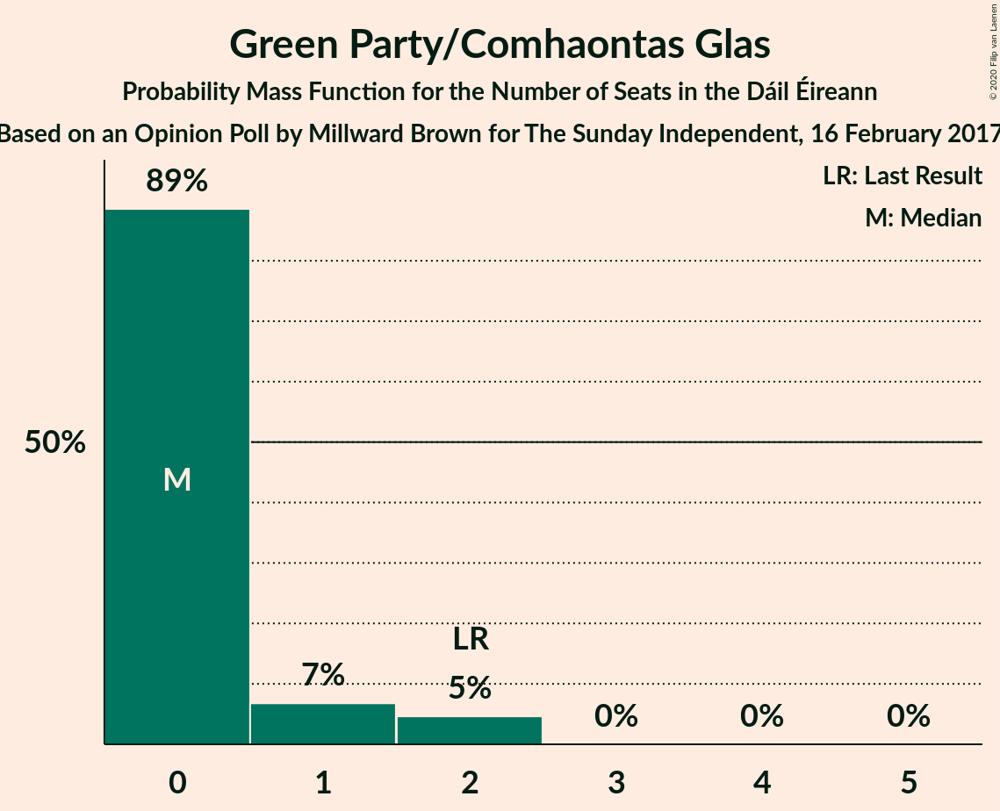
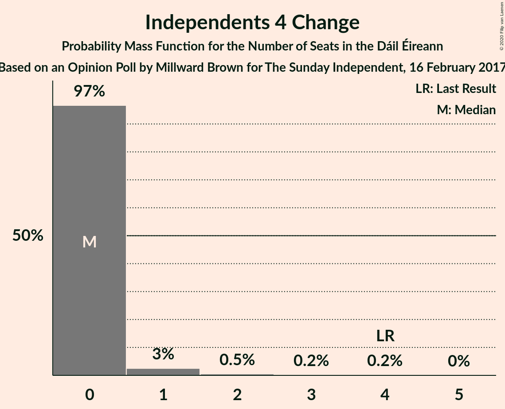
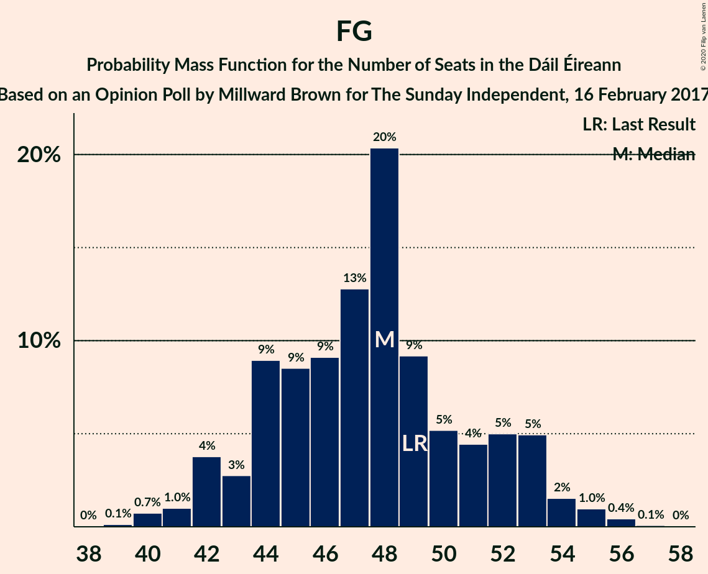

# Opinion Poll by Millward Brown for The Sunday Independent, 16 February 2017

<a href="#voting-intentions">Voting Intentions</a> | <a href="#seats">Seats</a> | <a href="#coalitions">Coalitions</a> | <a href="#technical-information">Technical Information</a>

## Voting Intentions

### Confidence Intervals

| Party | Last Result | Poll Result | 80% Confidence Interval | 90% Confidence Interval | 95% Confidence Interval | 99% Confidence Interval |
|:-----:|:-----------:|:-----------:|:-----------------------:|:-----------------------:|:-----------------------:|:-----------------------:|
| Fianna Fáil | 24.3% | 33.0% | 31.1–35.0% |30.6–35.6% |30.1–36.1% |29.2–37.0% |
| Fine Gael | 25.5% | 25.0% | 23.3–26.9% |22.8–27.4% |22.4–27.8% |21.6–28.7% |
| Sinn Féin | 13.8% | 20.0% | 18.4–21.7% |18.0–22.2% |17.6–22.6% |16.9–23.5% |
| Labour Party | 6.6% | 6.0% | 5.2–7.1% |4.9–7.5% |4.7–7.7% |4.3–8.3% |
| Independent | 15.9% | 3.3% | 2.7–4.2% |2.5–4.5% |2.4–4.7% |2.1–5.1% |
| Solidarity–People Before Profit | 3.9% | 3.0% | 2.4–3.9% |2.3–4.1% |2.1–4.3% |1.9–4.8% |
| Social Democrats | 3.0% | 2.0% | 1.5–2.7% |1.4–2.9% |1.3–3.1% |1.1–3.5% |
| Green Party/Comhaontas Glas | 2.7% | 2.0% | 1.5–2.7% |1.4–2.9% |1.3–3.1% |1.1–3.5% |
| Independents 4 Change | 1.5% | 0.4% | 0.2–0.8% |0.2–1.0% |0.2–1.1% |0.1–1.3% |

*Note:* The poll result column reflects the actual value used in the calculations. Published results may vary slightly, and in addition be rounded to fewer digits.

## Seats

### Confidence Intervals

| Party | Last Result | Median | 80% Confidence Interval | 90% Confidence Interval | 95% Confidence Interval | 99% Confidence Interval |
|:-----:|:-----------:|:------:|:-----------------------:|:-----------------------:|:-----------------------:|:-----------------------:|
| <a href="#fianna-fáil">Fianna Fáil</a> | 44 | 59 | 58–62 |58–62 |58–63 |56–64 |
| <a href="#fine-gael">Fine Gael</a> | 49 | 48 | 44–52 |44–52 |43–53 |41–56 |
| <a href="#sinn-féin">Sinn Féin</a> | 23 | 39 | 35–40 |34–41 |34–42 |32–44 |
| <a href="#labour-party">Labour Party</a> | 7 | 8 | 4–9 |3–11 |3–11 |2–12 |
| <a href="#independent">Independent</a> | 19 | 0 | 0 |0 |0 |0–1 |
| <a href="#solidarity–people-before-profit">Solidarity–People Before Profit</a> | 6 | 3 | 2–5 |2–5 |1–6 |0–9 |
| <a href="#social-democrats">Social Democrats</a> | 3 | 3 | 3–4 |2–4 |1–4 |0–4 |
| <a href="#green-party/comhaontas-glas">Green Party/Comhaontas Glas</a> | 2 | 0 | 0 |0–2 |0–2 |0–2 |
| <a href="#independents-4-change">Independents 4 Change</a> | 4 | 0 | 0 |0 |0–1 |0–2 |

### Fianna Fáil

*For a full overview of the results for this party, see the [Fianna Fáil](party-fiannafáil.html) page.*

| Number of Seats | Probability | Accumulated | Special Marks |
|:---------------:|:-----------:|:-----------:|:-------------:|
| 44 | 0% | 100% | Last Result |
| 45 | 0% | 100% |  |
| 46 | 0% | 100% |  |
| 47 | 0% | 100% |  |
| 48 | 0% | 100% |  |
| 49 | 0% | 100% |  |
| 50 | 0% | 100% |  |
| 51 | 0% | 100% |  |
| 52 | 0% | 100% |  |
| 53 | 0% | 100% |  |
| 54 | 0.3% | 100% |  |
| 55 | 0.1% | 99.7% |  |
| 56 | 1.1% | 99.6% |  |
| 57 | 0.8% | 98.6% |  |
| 58 | 40% | 98% |  |
| 59 | 14% | 58% | Median |
| 60 | 16% | 44% |  |
| 61 | 6% | 28% |  |
| 62 | 19% | 22% |  |
| 63 | 2% | 3% |  |
| 64 | 0.6% | 0.6% |  |
| 65 | 0% | 0% |  |

### Fine Gael

*For a full overview of the results for this party, see the [Fine Gael](party-finegael.html) page.*

| Number of Seats | Probability | Accumulated | Special Marks |
|:---------------:|:-----------:|:-----------:|:-------------:|
| 39 | 0.1% | 100% |  |
| 40 | 0.2% | 99.8% |  |
| 41 | 1.0% | 99.7% |  |
| 42 | 0.8% | 98.7% |  |
| 43 | 0.7% | 98% |  |
| 44 | 9% | 97% |  |
| 45 | 7% | 88% |  |
| 46 | 4% | 81% |  |
| 47 | 9% | 77% |  |
| 48 | 29% | 68% | Median |
| 49 | 18% | 38% | Last Result |
| 50 | 5% | 21% |  |
| 51 | 0.7% | 16% |  |
| 52 | 12% | 15% |  |
| 53 | 0.9% | 3% |  |
| 54 | 1.2% | 2% |  |
| 55 | 0.4% | 1.3% |  |
| 56 | 0.8% | 0.9% |  |
| 57 | 0% | 0.1% |  |
| 58 | 0% | 0% |  |

### Sinn Féin

*For a full overview of the results for this party, see the [Sinn Féin](party-sinnféin.html) page.*

| Number of Seats | Probability | Accumulated | Special Marks |
|:---------------:|:-----------:|:-----------:|:-------------:|
| 23 | 0% | 100% | Last Result |
| 24 | 0% | 100% |  |
| 25 | 0% | 100% |  |
| 26 | 0% | 100% |  |
| 27 | 0% | 100% |  |
| 28 | 0% | 100% |  |
| 29 | 0% | 100% |  |
| 30 | 0% | 100% |  |
| 31 | 0.3% | 100% |  |
| 32 | 0.2% | 99.7% |  |
| 33 | 0.9% | 99.4% |  |
| 34 | 8% | 98% |  |
| 35 | 1.3% | 90% |  |
| 36 | 9% | 89% |  |
| 37 | 18% | 81% |  |
| 38 | 12% | 63% |  |
| 39 | 18% | 51% | Median |
| 40 | 24% | 33% |  |
| 41 | 5% | 9% |  |
| 42 | 2% | 4% |  |
| 43 | 0.9% | 2% |  |
| 44 | 0.5% | 1.0% |  |
| 45 | 0.4% | 0.4% |  |
| 46 | 0% | 0% |  |

### Labour Party

*For a full overview of the results for this party, see the [Labour Party](party-labourparty.html) page.*

| Number of Seats | Probability | Accumulated | Special Marks |
|:---------------:|:-----------:|:-----------:|:-------------:|
| 2 | 0.8% | 100% |  |
| 3 | 6% | 99.2% |  |
| 4 | 17% | 94% |  |
| 5 | 5% | 76% |  |
| 6 | 3% | 71% |  |
| 7 | 10% | 68% | Last Result |
| 8 | 45% | 58% | Median |
| 9 | 3% | 13% |  |
| 10 | 0.3% | 10% |  |
| 11 | 8% | 10% |  |
| 12 | 0.8% | 1.1% |  |
| 13 | 0.1% | 0.4% |  |
| 14 | 0.2% | 0.3% |  |
| 15 | 0% | 0.1% |  |
| 16 | 0% | 0.1% |  |
| 17 | 0% | 0.1% |  |
| 18 | 0% | 0% |  |

### Independent

*For a full overview of the results for this party, see the [Independent](party-independent.html) page.*

| Number of Seats | Probability | Accumulated | Special Marks |
|:---------------:|:-----------:|:-----------:|:-------------:|
| 0 | 98% | 100% | Median |
| 1 | 1.4% | 2% |  |
| 2 | 0.1% | 0.1% |  |
| 3 | 0% | 0% |  |
| 4 | 0% | 0% |  |
| 5 | 0% | 0% |  |
| 6 | 0% | 0% |  |
| 7 | 0% | 0% |  |
| 8 | 0% | 0% |  |
| 9 | 0% | 0% |  |
| 10 | 0% | 0% |  |
| 11 | 0% | 0% |  |
| 12 | 0% | 0% |  |
| 13 | 0% | 0% |  |
| 14 | 0% | 0% |  |
| 15 | 0% | 0% |  |
| 16 | 0% | 0% |  |
| 17 | 0% | 0% |  |
| 18 | 0% | 0% |  |
| 19 | 0% | 0% | Last Result |

### Solidarity–People Before Profit

*For a full overview of the results for this party, see the [Solidarity–People Before Profit](party-solidarity–peoplebeforeprofit.html) page.*

| Number of Seats | Probability | Accumulated | Special Marks |
|:---------------:|:-----------:|:-----------:|:-------------:|
| 0 | 1.3% | 100% |  |
| 1 | 3% | 98.7% |  |
| 2 | 29% | 96% |  |
| 3 | 47% | 67% | Median |
| 4 | 7% | 20% |  |
| 5 | 10% | 13% |  |
| 6 | 1.3% | 3% | Last Result |
| 7 | 0.2% | 2% |  |
| 8 | 0.1% | 1.3% |  |
| 9 | 1.2% | 1.2% |  |
| 10 | 0% | 0% |  |

### Social Democrats

*For a full overview of the results for this party, see the [Social Democrats](party-socialdemocrats.html) page.*

| Number of Seats | Probability | Accumulated | Special Marks |
|:---------------:|:-----------:|:-----------:|:-------------:|
| 0 | 1.1% | 100% |  |
| 1 | 2% | 98.9% |  |
| 2 | 4% | 97% |  |
| 3 | 64% | 93% | Last Result, Median |
| 4 | 29% | 29% |  |
| 5 | 0% | 0.1% |  |
| 6 | 0% | 0% |  |

### Green Party/Comhaontas Glas

*For a full overview of the results for this party, see the [Green Party/Comhaontas Glas](party-greenpartycomhaontasglas.html) page.*

| Number of Seats | Probability | Accumulated | Special Marks |
|:---------------:|:-----------:|:-----------:|:-------------:|
| 0 | 90% | 100% | Median |
| 1 | 2% | 10% |  |
| 2 | 8% | 8% | Last Result |
| 3 | 0% | 0% |  |

### Independents 4 Change

*For a full overview of the results for this party, see the [Independents 4 Change](party-independents4change.html) page.*

| Number of Seats | Probability | Accumulated | Special Marks |
|:---------------:|:-----------:|:-----------:|:-------------:|
| 0 | 96% | 100% | Median |
| 1 | 3% | 4% |  |
| 2 | 0.4% | 0.7% |  |
| 3 | 0.1% | 0.3% |  |
| 4 | 0.2% | 0.2% | Last Result |
| 5 | 0% | 0% |  |

## Coalitions

### Confidence Intervals

| Coalition | Last Result | Median | Majority? | 80% Confidence Interval | 90% Confidence Interval | 95% Confidence Interval | 99% Confidence Interval |
|:---------:|:-----------:|:------:|:---------:|:-----------------------:|:-----------------------:|:-----------------------:|:-----------------------:|
| Fianna Fáil – Fine Gael | 93 | 107 | 100% | 104–111 | 103–112 | 103–112 | 100–115 |
| Fianna Fáil – Sinn Féin | 67 | 98 | 100% | 94–99 | 94–101 | 94–102 | 92–104 |
| Fianna Fáil – Labour Party – Green Party/Comhaontas Glas – Social Democrats | 56 | 70 | 0% | 66–73 | 66–76 | 66–76 | 65–76 |
| Fianna Fáil – Labour Party – Green Party/Comhaontas Glas | 53 | 66 | 0% | 64–70 | 62–73 | 62–73 | 61–73 |
| Fianna Fáil – Labour Party | 51 | 66 | 0% | 63–70 | 62–72 | 62–73 | 61–73 |
| Fianna Fáil – Green Party/Comhaontas Glas | 46 | 59 | 0% | 58–62 | 58–62 | 58–63 | 56–64 |
| Fine Gael – Labour Party – Green Party/Comhaontas Glas – Social Democrats | 61 | 58 | 0% | 55–63 | 54–63 | 53–63 | 49–65 |
| Fine Gael – Labour Party – Green Party/Comhaontas Glas | 58 | 55 | 0% | 53–59 | 52–60 | 50–60 | 47–62 |
| Fine Gael – Labour Party | 56 | 55 | 0% | 53–59 | 51–60 | 50–60 | 46–62 |
| Fine Gael – Green Party/Comhaontas Glas | 51 | 48 | 0% | 45–52 | 44–52 | 43–54 | 41–56 |
| Fine Gael | 49 | 48 | 0% | 44–52 | 44–52 | 43–53 | 41–56 |

### Fianna Fáil – Fine Gael

| Number of Seats | Probability | Accumulated | Special Marks |
|:---------------:|:-----------:|:-----------:|:-------------:|
| 93 | 0% | 100% | Last Result |
| 94 | 0% | 100% |  |
| 95 | 0% | 100% |  |
| 96 | 0% | 100% |  |
| 97 | 0% | 100% |  |
| 98 | 0% | 100% |  |
| 99 | 0.1% | 99.9% |  |
| 100 | 0.4% | 99.8% |  |
| 101 | 0.9% | 99.4% |  |
| 102 | 0.8% | 98.5% |  |
| 103 | 7% | 98% |  |
| 104 | 3% | 91% |  |
| 105 | 4% | 88% |  |
| 106 | 31% | 84% |  |
| 107 | 14% | 53% | Median |
| 108 | 2% | 39% |  |
| 109 | 7% | 37% |  |
| 110 | 6% | 30% |  |
| 111 | 15% | 24% |  |
| 112 | 7% | 9% |  |
| 113 | 0.1% | 2% |  |
| 114 | 0.6% | 2% |  |
| 115 | 0.5% | 0.9% |  |
| 116 | 0.1% | 0.4% |  |
| 117 | 0.2% | 0.2% |  |
| 118 | 0% | 0% |  |

### Fianna Fáil – Sinn Féin

| Number of Seats | Probability | Accumulated | Special Marks |
|:---------------:|:-----------:|:-----------:|:-------------:|
| 67 | 0% | 100% | Last Result |
| 68 | 0% | 100% |  |
| 69 | 0% | 100% |  |
| 70 | 0% | 100% |  |
| 71 | 0% | 100% |  |
| 72 | 0% | 100% |  |
| 73 | 0% | 100% |  |
| 74 | 0% | 100% |  |
| 75 | 0% | 100% |  |
| 76 | 0% | 100% |  |
| 77 | 0% | 100% |  |
| 78 | 0% | 100% |  |
| 79 | 0% | 100% |  |
| 80 | 0% | 100% |  |
| 81 | 0% | 100% | Majority |
| 82 | 0% | 100% |  |
| 83 | 0% | 100% |  |
| 84 | 0% | 100% |  |
| 85 | 0% | 100% |  |
| 86 | 0% | 100% |  |
| 87 | 0% | 100% |  |
| 88 | 0% | 100% |  |
| 89 | 0% | 100% |  |
| 90 | 0.1% | 100% |  |
| 91 | 0.2% | 99.9% |  |
| 92 | 1.2% | 99.8% |  |
| 93 | 0.4% | 98.6% |  |
| 94 | 12% | 98% |  |
| 95 | 3% | 86% |  |
| 96 | 5% | 84% |  |
| 97 | 8% | 79% |  |
| 98 | 40% | 71% | Median |
| 99 | 22% | 31% |  |
| 100 | 3% | 9% |  |
| 101 | 3% | 6% |  |
| 102 | 1.4% | 3% |  |
| 103 | 0.8% | 2% |  |
| 104 | 0.4% | 0.8% |  |
| 105 | 0.2% | 0.5% |  |
| 106 | 0.3% | 0.3% |  |
| 107 | 0% | 0% |  |

### Fianna Fáil – Labour Party – Green Party/Comhaontas Glas – Social Democrats

| Number of Seats | Probability | Accumulated | Special Marks |
|:---------------:|:-----------:|:-----------:|:-------------:|
| 56 | 0% | 100% | Last Result |
| 57 | 0% | 100% |  |
| 58 | 0% | 100% |  |
| 59 | 0% | 100% |  |
| 60 | 0% | 100% |  |
| 61 | 0% | 100% |  |
| 62 | 0% | 100% |  |
| 63 | 0.1% | 100% |  |
| 64 | 0.2% | 99.8% |  |
| 65 | 1.2% | 99.6% |  |
| 66 | 9% | 98% |  |
| 67 | 3% | 90% |  |
| 68 | 6% | 87% |  |
| 69 | 28% | 81% |  |
| 70 | 20% | 53% | Median |
| 71 | 19% | 33% |  |
| 72 | 1.3% | 14% |  |
| 73 | 4% | 12% |  |
| 74 | 1.0% | 8% |  |
| 75 | 1.5% | 7% |  |
| 76 | 6% | 6% |  |
| 77 | 0.1% | 0.2% |  |
| 78 | 0.1% | 0.1% |  |
| 79 | 0% | 0% |  |

### Fianna Fáil – Labour Party – Green Party/Comhaontas Glas

| Number of Seats | Probability | Accumulated | Special Marks |
|:---------------:|:-----------:|:-----------:|:-------------:|
| 53 | 0% | 100% | Last Result |
| 54 | 0% | 100% |  |
| 55 | 0% | 100% |  |
| 56 | 0% | 100% |  |
| 57 | 0% | 100% |  |
| 58 | 0% | 100% |  |
| 59 | 0% | 100% |  |
| 60 | 0.1% | 100% |  |
| 61 | 1.0% | 99.9% |  |
| 62 | 4% | 98.9% |  |
| 63 | 4% | 94% |  |
| 64 | 3% | 90% |  |
| 65 | 8% | 87% |  |
| 66 | 39% | 78% |  |
| 67 | 5% | 40% | Median |
| 68 | 21% | 35% |  |
| 69 | 2% | 14% |  |
| 70 | 3% | 12% |  |
| 71 | 1.0% | 8% |  |
| 72 | 1.5% | 7% |  |
| 73 | 6% | 6% |  |
| 74 | 0.1% | 0.2% |  |
| 75 | 0.1% | 0.1% |  |
| 76 | 0% | 0% |  |

### Fianna Fáil – Labour Party

| Number of Seats | Probability | Accumulated | Special Marks |
|:---------------:|:-----------:|:-----------:|:-------------:|
| 51 | 0% | 100% | Last Result |
| 52 | 0% | 100% |  |
| 53 | 0% | 100% |  |
| 54 | 0% | 100% |  |
| 55 | 0% | 100% |  |
| 56 | 0% | 100% |  |
| 57 | 0% | 100% |  |
| 58 | 0% | 100% |  |
| 59 | 0% | 100% |  |
| 60 | 0.1% | 100% |  |
| 61 | 1.0% | 99.9% |  |
| 62 | 5% | 98.8% |  |
| 63 | 5% | 94% |  |
| 64 | 3% | 89% |  |
| 65 | 9% | 86% |  |
| 66 | 44% | 78% |  |
| 67 | 5% | 34% | Median |
| 68 | 15% | 28% |  |
| 69 | 2% | 13% |  |
| 70 | 3% | 11% |  |
| 71 | 2% | 8% |  |
| 72 | 1.4% | 6% |  |
| 73 | 4% | 4% |  |
| 74 | 0.1% | 0.2% |  |
| 75 | 0.1% | 0.1% |  |
| 76 | 0% | 0% |  |

### Fianna Fáil – Green Party/Comhaontas Glas

| Number of Seats | Probability | Accumulated | Special Marks |
|:---------------:|:-----------:|:-----------:|:-------------:|
| 46 | 0% | 100% | Last Result |
| 47 | 0% | 100% |  |
| 48 | 0% | 100% |  |
| 49 | 0% | 100% |  |
| 50 | 0% | 100% |  |
| 51 | 0% | 100% |  |
| 52 | 0% | 100% |  |
| 53 | 0% | 100% |  |
| 54 | 0.3% | 100% |  |
| 55 | 0.1% | 99.7% |  |
| 56 | 1.0% | 99.7% |  |
| 57 | 0.7% | 98.6% |  |
| 58 | 34% | 98% |  |
| 59 | 14% | 64% | Median |
| 60 | 21% | 50% |  |
| 61 | 6% | 29% |  |
| 62 | 18% | 22% |  |
| 63 | 2% | 4% |  |
| 64 | 2% | 2% |  |
| 65 | 0.1% | 0.2% |  |
| 66 | 0.1% | 0.1% |  |
| 67 | 0% | 0% |  |

### Fine Gael – Labour Party – Green Party/Comhaontas Glas – Social Democrats

| Number of Seats | Probability | Accumulated | Special Marks |
|:---------------:|:-----------:|:-----------:|:-------------:|
| 47 | 0.3% | 100% |  |
| 48 | 0.1% | 99.7% |  |
| 49 | 0.2% | 99.6% |  |
| 50 | 0.1% | 99.4% |  |
| 51 | 0.7% | 99.3% |  |
| 52 | 0.7% | 98.5% |  |
| 53 | 1.1% | 98% |  |
| 54 | 2% | 97% |  |
| 55 | 5% | 95% |  |
| 56 | 3% | 90% |  |
| 57 | 22% | 87% |  |
| 58 | 18% | 65% |  |
| 59 | 26% | 47% | Median |
| 60 | 3% | 21% |  |
| 61 | 4% | 18% | Last Result |
| 62 | 1.2% | 15% |  |
| 63 | 12% | 13% |  |
| 64 | 0.5% | 1.5% |  |
| 65 | 0.9% | 1.0% |  |
| 66 | 0.1% | 0.2% |  |
| 67 | 0% | 0.1% |  |
| 68 | 0% | 0% |  |

### Fine Gael – Labour Party – Green Party/Comhaontas Glas

| Number of Seats | Probability | Accumulated | Special Marks |
|:---------------:|:-----------:|:-----------:|:-------------:|
| 45 | 0.4% | 100% |  |
| 46 | 0% | 99.6% |  |
| 47 | 0.2% | 99.6% |  |
| 48 | 0.8% | 99.4% |  |
| 49 | 0.8% | 98.5% |  |
| 50 | 1.1% | 98% |  |
| 51 | 1.3% | 97% |  |
| 52 | 3% | 95% |  |
| 53 | 23% | 92% |  |
| 54 | 3% | 69% |  |
| 55 | 18% | 66% |  |
| 56 | 27% | 48% | Median |
| 57 | 3% | 21% |  |
| 58 | 4% | 18% | Last Result |
| 59 | 6% | 14% |  |
| 60 | 7% | 8% |  |
| 61 | 0.8% | 1.5% |  |
| 62 | 0.4% | 0.6% |  |
| 63 | 0.1% | 0.2% |  |
| 64 | 0% | 0.1% |  |
| 65 | 0% | 0% |  |

### Fine Gael – Labour Party

| Number of Seats | Probability | Accumulated | Special Marks |
|:---------------:|:-----------:|:-----------:|:-------------:|
| 45 | 0.4% | 100% |  |
| 46 | 0.2% | 99.6% |  |
| 47 | 0.1% | 99.4% |  |
| 48 | 0.9% | 99.3% |  |
| 49 | 0.9% | 98% |  |
| 50 | 1.1% | 98% |  |
| 51 | 1.4% | 96% |  |
| 52 | 4% | 95% |  |
| 53 | 27% | 91% |  |
| 54 | 3% | 64% |  |
| 55 | 14% | 62% |  |
| 56 | 30% | 48% | Last Result, Median |
| 57 | 3% | 18% |  |
| 58 | 1.5% | 15% |  |
| 59 | 6% | 14% |  |
| 60 | 6% | 7% |  |
| 61 | 0.8% | 1.5% |  |
| 62 | 0.5% | 0.6% |  |
| 63 | 0.1% | 0.1% |  |
| 64 | 0.1% | 0.1% |  |
| 65 | 0% | 0% |  |

### Fine Gael – Green Party/Comhaontas Glas

| Number of Seats | Probability | Accumulated | Special Marks |
|:---------------:|:-----------:|:-----------:|:-------------:|
| 39 | 0.1% | 100% |  |
| 40 | 0.1% | 99.8% |  |
| 41 | 1.0% | 99.8% |  |
| 42 | 0.8% | 98.7% |  |
| 43 | 0.6% | 98% |  |
| 44 | 7% | 97% |  |
| 45 | 4% | 90% |  |
| 46 | 6% | 86% |  |
| 47 | 12% | 80% |  |
| 48 | 27% | 68% | Median |
| 49 | 18% | 41% |  |
| 50 | 8% | 24% |  |
| 51 | 1.0% | 16% | Last Result |
| 52 | 12% | 15% |  |
| 53 | 1.0% | 3% |  |
| 54 | 0.3% | 3% |  |
| 55 | 1.4% | 2% |  |
| 56 | 0.8% | 0.9% |  |
| 57 | 0.1% | 0.1% |  |
| 58 | 0% | 0% |  |

### Fine Gael

| Number of Seats | Probability | Accumulated | Special Marks |
|:---------------:|:-----------:|:-----------:|:-------------:|
| 39 | 0.1% | 100% |  |
| 40 | 0.2% | 99.8% |  |
| 41 | 1.0% | 99.7% |  |
| 42 | 0.8% | 98.7% |  |
| 43 | 0.7% | 98% |  |
| 44 | 9% | 97% |  |
| 45 | 7% | 88% |  |
| 46 | 4% | 81% |  |
| 47 | 9% | 77% |  |
| 48 | 29% | 68% | Median |
| 49 | 18% | 38% | Last Result |
| 50 | 5% | 21% |  |
| 51 | 0.7% | 16% |  |
| 52 | 12% | 15% |  |
| 53 | 0.9% | 3% |  |
| 54 | 1.2% | 2% |  |
| 55 | 0.4% | 1.3% |  |
| 56 | 0.8% | 0.9% |  |
| 57 | 0% | 0.1% |  |
| 58 | 0% | 0% |  |

## Technical Information

### Opinion Poll

+ **Polling firm:** Millward Brown
+ **Commissioner(s):** The Sunday Independent
+ **Fieldwork period:** 16 February 2017

### Calculations

+ **Sample size:** 960
+ **Simulations done:** 131,072
+ **Error estimate:** 3.60%

