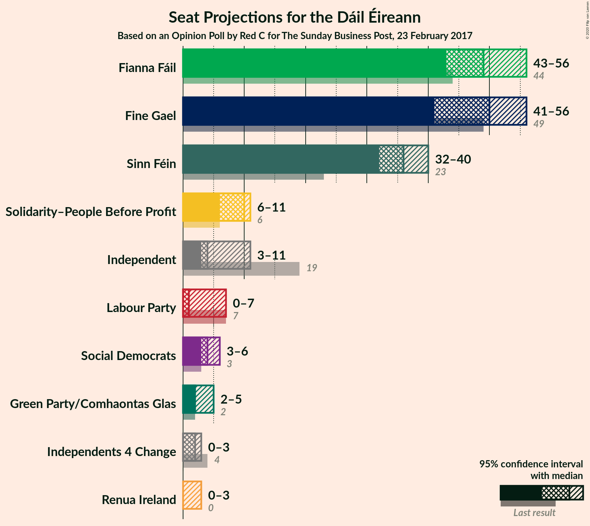
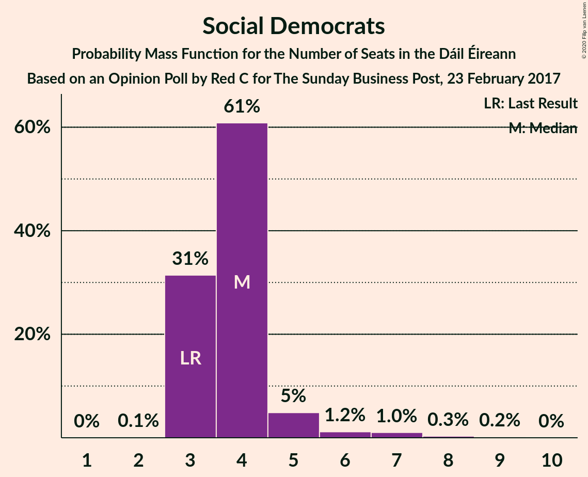
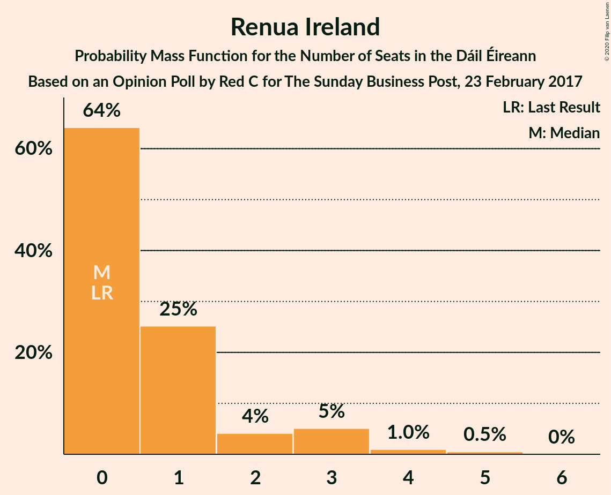
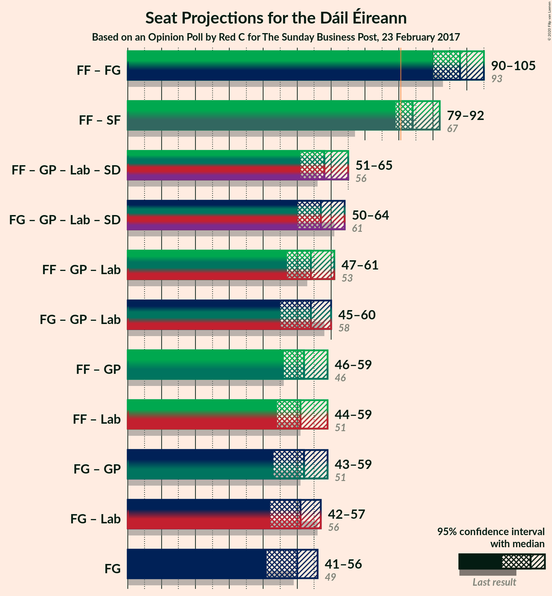
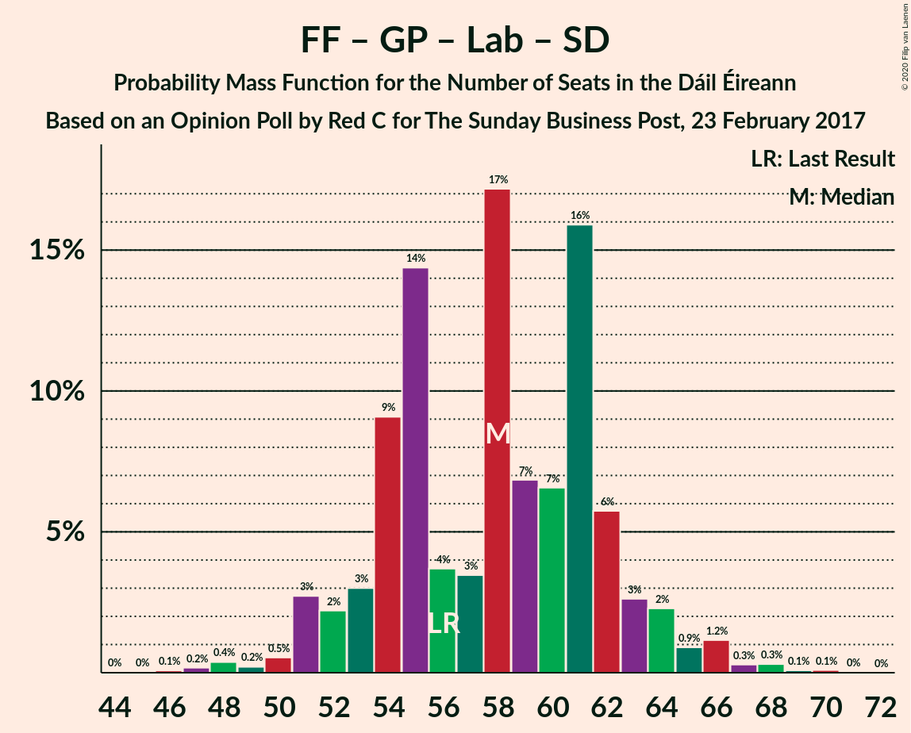
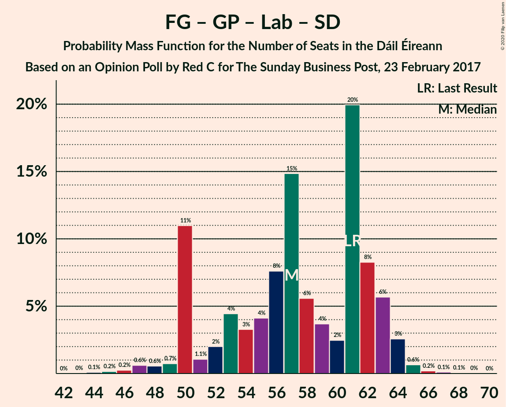
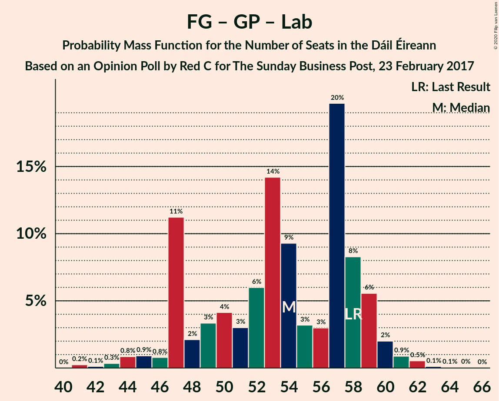

# Opinion Poll by Red C for The Sunday Business Post, 23 February 2017

<a href="#voting-intentions">Voting Intentions</a> | <a href="#seats">Seats</a> | <a href="#coalitions">Coalitions</a> | <a href="#technical-information">Technical Information</a>

## Voting Intentions

### Confidence Intervals

| Party | Last Result | Poll Result | 80% Confidence Interval | 90% Confidence Interval | 95% Confidence Interval | 99% Confidence Interval |
|:-----:|:-----------:|:-----------:|:-----------------------:|:-----------------------:|:-----------------------:|:-----------------------:|
| Fianna Fáil | 24.3% | 26.0% | 24.3–27.8% |23.8–28.3% |23.4–28.8% |22.6–29.7% |
| Fine Gael | 25.5% | 24.0% | 22.3–25.8% |21.9–26.3% |21.5–26.7% |20.7–27.6% |
| Sinn Féin | 13.8% | 19.0% | 17.5–20.7% |17.1–21.2% |16.7–21.6% |16.0–22.4% |
| Independent | 15.9% | 8.5% | 7.4–9.7% |7.1–10.0% |6.9–10.4% |6.4–11.0% |
| Solidarity–People Before Profit | 3.9% | 6.0% | 5.1–7.1% |4.9–7.4% |4.7–7.6% |4.3–8.2% |
| Labour Party | 6.6% | 4.0% | 3.3–4.9% |3.1–5.2% |2.9–5.4% |2.6–5.9% |
| Green Party/Comhaontas Glas | 2.7% | 4.0% | 3.3–4.9% |3.1–5.2% |2.9–5.4% |2.6–5.9% |
| Social Democrats | 3.0% | 3.0% | 2.4–3.8% |2.2–4.0% |2.1–4.2% |1.8–4.7% |
| Independents 4 Change | 1.5% | 1.1% | 0.8–1.7% |0.7–1.8% |0.6–2.0% |0.5–2.3% |
| Renua Ireland | 2.2% | 1.0% | 0.7–1.5% |0.6–1.7% |0.5–1.8% |0.4–2.1% |

*Note:* The poll result column reflects the actual value used in the calculations. Published results may vary slightly, and in addition be rounded to fewer digits.

## Seats

### Confidence Intervals

| Party | Last Result | Median | 80% Confidence Interval | 90% Confidence Interval | 95% Confidence Interval | 99% Confidence Interval |
|:-----:|:-----------:|:------:|:-----------------------:|:-----------------------:|:-----------------------:|:-----------------------:|
| <a href="#fianna-fáil">Fianna Fáil</a> | 44 | 49 | 46–54 |44–54 |43–56 |41–59 |
| <a href="#fine-gael">Fine Gael</a> | 49 | 50 | 43–54 |42–55 |41–56 |38–58 |
| <a href="#sinn-féin">Sinn Féin</a> | 23 | 36 | 33–38 |33–39 |32–40 |32–41 |
| <a href="#independent">Independent</a> | 19 | 4 | 3–8 |3–9 |3–11 |3–13 |
| <a href="#solidarity–people-before-profit">Solidarity–People Before Profit</a> | 6 | 10 | 8–11 |8–11 |6–11 |4–11 |
| <a href="#labour-party">Labour Party</a> | 7 | 1 | 0–5 |0–6 |0–7 |0–8 |
| <a href="#green-party/comhaontas-glas">Green Party/Comhaontas Glas</a> | 2 | 2 | 2–4 |2–5 |2–5 |0–6 |
| <a href="#social-democrats">Social Democrats</a> | 3 | 4 | 3–4 |3–5 |3–6 |3–8 |
| <a href="#independents-4-change">Independents 4 Change</a> | 4 | 2 | 2–3 |1–3 |0–3 |0–3 |
| <a href="#renua-ireland">Renua Ireland</a> | 0 | 0 | 0–2 |0–3 |0–3 |0–4 |

### Fianna Fáil

*For a full overview of the results for this party, see the [Fianna Fáil](party-fiannafáil.html) page.*

| Number of Seats | Probability | Accumulated | Special Marks |
|:---------------:|:-----------:|:-----------:|:-------------:|
| 37 | 0% | 100% |  |
| 38 | 0.1% | 99.9% |  |
| 39 | 0.1% | 99.8% |  |
| 40 | 0.2% | 99.8% |  |
| 41 | 0.7% | 99.6% |  |
| 42 | 0.7% | 98.9% |  |
| 43 | 1.0% | 98% |  |
| 44 | 4% | 97% | Last Result |
| 45 | 2% | 93% |  |
| 46 | 14% | 91% |  |
| 47 | 17% | 77% |  |
| 48 | 6% | 60% |  |
| 49 | 11% | 54% | Median |
| 50 | 6% | 43% |  |
| 51 | 8% | 37% |  |
| 52 | 6% | 29% |  |
| 53 | 3% | 23% |  |
| 54 | 15% | 20% |  |
| 55 | 1.3% | 4% |  |
| 56 | 0.9% | 3% |  |
| 57 | 1.1% | 2% |  |
| 58 | 0.5% | 1.1% |  |
| 59 | 0.3% | 0.6% |  |
| 60 | 0.2% | 0.3% |  |
| 61 | 0% | 0% |  |

### Fine Gael

*For a full overview of the results for this party, see the [Fine Gael](party-finegael.html) page.*

| Number of Seats | Probability | Accumulated | Special Marks |
|:---------------:|:-----------:|:-----------:|:-------------:|
| 36 | 0.1% | 100% |  |
| 37 | 0.3% | 99.9% |  |
| 38 | 0.3% | 99.6% |  |
| 39 | 0.5% | 99.2% |  |
| 40 | 0.9% | 98.7% |  |
| 41 | 2% | 98% |  |
| 42 | 2% | 96% |  |
| 43 | 12% | 94% |  |
| 44 | 3% | 82% |  |
| 45 | 4% | 79% |  |
| 46 | 5% | 75% |  |
| 47 | 5% | 71% |  |
| 48 | 6% | 66% |  |
| 49 | 8% | 61% | Last Result |
| 50 | 14% | 52% | Median |
| 51 | 6% | 38% |  |
| 52 | 14% | 32% |  |
| 53 | 8% | 19% |  |
| 54 | 2% | 10% |  |
| 55 | 5% | 8% |  |
| 56 | 1.4% | 3% |  |
| 57 | 0.8% | 2% |  |
| 58 | 0.7% | 1.1% |  |
| 59 | 0.4% | 0.4% |  |
| 60 | 0% | 0% |  |

### Sinn Féin

*For a full overview of the results for this party, see the [Sinn Féin](party-sinnféin.html) page.*

| Number of Seats | Probability | Accumulated | Special Marks |
|:---------------:|:-----------:|:-----------:|:-------------:|
| 23 | 0% | 100% | Last Result |
| 24 | 0% | 100% |  |
| 25 | 0% | 100% |  |
| 26 | 0% | 100% |  |
| 27 | 0% | 100% |  |
| 28 | 0% | 100% |  |
| 29 | 0% | 100% |  |
| 30 | 0.1% | 100% |  |
| 31 | 0.1% | 99.9% |  |
| 32 | 3% | 99.8% |  |
| 33 | 18% | 97% |  |
| 34 | 11% | 79% |  |
| 35 | 10% | 68% |  |
| 36 | 33% | 58% | Median |
| 37 | 12% | 25% |  |
| 38 | 6% | 13% |  |
| 39 | 3% | 6% |  |
| 40 | 3% | 4% |  |
| 41 | 1.1% | 1.2% |  |
| 42 | 0.1% | 0.1% |  |
| 43 | 0% | 0% |  |

### Independent

*For a full overview of the results for this party, see the [Independent](party-independent.html) page.*

| Number of Seats | Probability | Accumulated | Special Marks |
|:---------------:|:-----------:|:-----------:|:-------------:|
| 3 | 31% | 100% |  |
| 4 | 20% | 69% | Median |
| 5 | 7% | 48% |  |
| 6 | 14% | 41% |  |
| 7 | 15% | 28% |  |
| 8 | 5% | 12% |  |
| 9 | 3% | 8% |  |
| 10 | 1.2% | 5% |  |
| 11 | 2% | 3% |  |
| 12 | 0.4% | 2% |  |
| 13 | 1.2% | 1.4% |  |
| 14 | 0.1% | 0.2% |  |
| 15 | 0% | 0.1% |  |
| 16 | 0.1% | 0.1% |  |
| 17 | 0% | 0% |  |
| 18 | 0% | 0% |  |
| 19 | 0% | 0% | Last Result |

### Solidarity–People Before Profit

*For a full overview of the results for this party, see the [Solidarity–People Before Profit](party-solidarity–peoplebeforeprofit.html) page.*

| Number of Seats | Probability | Accumulated | Special Marks |
|:---------------:|:-----------:|:-----------:|:-------------:|
| 4 | 0.9% | 100% |  |
| 5 | 1.3% | 99.1% |  |
| 6 | 1.0% | 98% | Last Result |
| 7 | 2% | 97% |  |
| 8 | 16% | 95% |  |
| 9 | 7% | 79% |  |
| 10 | 38% | 72% | Median |
| 11 | 34% | 34% |  |
| 12 | 0.1% | 0.1% |  |
| 13 | 0% | 0.1% |  |
| 14 | 0% | 0% |  |

### Labour Party

*For a full overview of the results for this party, see the [Labour Party](party-labourparty.html) page.*

| Number of Seats | Probability | Accumulated | Special Marks |
|:---------------:|:-----------:|:-----------:|:-------------:|
| 0 | 11% | 100% |  |
| 1 | 48% | 89% | Median |
| 2 | 17% | 41% |  |
| 3 | 6% | 24% |  |
| 4 | 5% | 19% |  |
| 5 | 8% | 13% |  |
| 6 | 2% | 5% |  |
| 7 | 1.2% | 4% | Last Result |
| 8 | 2% | 2% |  |
| 9 | 0.1% | 0.2% |  |
| 10 | 0.1% | 0.1% |  |
| 11 | 0% | 0% |  |

### Green Party/Comhaontas Glas

*For a full overview of the results for this party, see the [Green Party/Comhaontas Glas](party-greenpartycomhaontasglas.html) page.*

| Number of Seats | Probability | Accumulated | Special Marks |
|:---------------:|:-----------:|:-----------:|:-------------:|
| 0 | 0.6% | 100% |  |
| 1 | 2% | 99.4% |  |
| 2 | 57% | 98% | Last Result, Median |
| 3 | 8% | 41% |  |
| 4 | 28% | 33% |  |
| 5 | 5% | 5% |  |
| 6 | 0.2% | 0.5% |  |
| 7 | 0.4% | 0.4% |  |
| 8 | 0% | 0% |  |

### Social Democrats

*For a full overview of the results for this party, see the [Social Democrats](party-socialdemocrats.html) page.*

| Number of Seats | Probability | Accumulated | Special Marks |
|:---------------:|:-----------:|:-----------:|:-------------:|
| 2 | 0.1% | 100% |  |
| 3 | 31% | 99.8% | Last Result |
| 4 | 61% | 68% | Median |
| 5 | 5% | 8% |  |
| 6 | 1.2% | 3% |  |
| 7 | 1.0% | 2% |  |
| 8 | 0.3% | 0.5% |  |
| 9 | 0.2% | 0.2% |  |
| 10 | 0% | 0% |  |

### Independents 4 Change

*For a full overview of the results for this party, see the [Independents 4 Change](party-independents4change.html) page.*

| Number of Seats | Probability | Accumulated | Special Marks |
|:---------------:|:-----------:|:-----------:|:-------------:|
| 0 | 3% | 100% |  |
| 1 | 2% | 97% |  |
| 2 | 59% | 95% | Median |
| 3 | 36% | 36% |  |
| 4 | 0% | 0% | Last Result |

### Renua Ireland

*For a full overview of the results for this party, see the [Renua Ireland](party-renuaireland.html) page.*

| Number of Seats | Probability | Accumulated | Special Marks |
|:---------------:|:-----------:|:-----------:|:-------------:|
| 0 | 64% | 100% | Last Result, Median |
| 1 | 25% | 36% |  |
| 2 | 4% | 11% |  |
| 3 | 5% | 7% |  |
| 4 | 1.0% | 1.5% |  |
| 5 | 0.5% | 0.5% |  |
| 6 | 0% | 0% |  |

## Coalitions

### Confidence Intervals

| Coalition | Last Result | Median | Majority? | 80% Confidence Interval | 90% Confidence Interval | 95% Confidence Interval | 99% Confidence Interval |
|:---------:|:-----------:|:------:|:---------:|:-----------------------:|:-----------------------:|:-----------------------:|:-----------------------:|
| Fianna Fáil – Fine Gael | 93 | 98 | 100% | 93–103 | 92–103 | 90–105 | 86–107 |
| Fianna Fáil – Sinn Féin | 67 | 84 | 91% | 81–90 | 80–91 | 79–92 | 77–94 |
| Fianna Fáil – Green Party/Comhaontas Glas – Labour Party – Social Democrats | 56 | 58 | 0% | 54–62 | 52–64 | 51–65 | 48–68 |
| Fine Gael – Green Party/Comhaontas Glas – Labour Party – Social Democrats | 61 | 57 | 0% | 50–62 | 50–63 | 50–64 | 46–65 |
| Fianna Fáil – Green Party/Comhaontas Glas – Labour Party | 53 | 54 | 0% | 49–58 | 49–60 | 47–61 | 44–64 |
| Fine Gael – Green Party/Comhaontas Glas – Labour Party | 58 | 54 | 0% | 47–58 | 47–59 | 45–60 | 43–62 |
| Fianna Fáil – Green Party/Comhaontas Glas | 46 | 52 | 0% | 48–56 | 47–58 | 46–59 | 43–63 |
| Fianna Fáil – Labour Party | 51 | 51 | 0% | 47–56 | 45–57 | 44–59 | 42–60 |
| Fine Gael – Green Party/Comhaontas Glas | 51 | 52 | 0% | 45–57 | 45–58 | 43–59 | 41–61 |
| Fine Gael – Labour Party | 56 | 51 | 0% | 45–55 | 45–57 | 42–57 | 38–60 |
| Fine Gael | 49 | 50 | 0% | 43–54 | 42–55 | 41–56 | 38–58 |

### Fianna Fáil – Fine Gael

| Number of Seats | Probability | Accumulated | Special Marks |
|:---------------:|:-----------:|:-----------:|:-------------:|
| 83 | 0% | 100% |  |
| 84 | 0% | 99.9% |  |
| 85 | 0.1% | 99.9% |  |
| 86 | 0.4% | 99.8% |  |
| 87 | 0.4% | 99.4% |  |
| 88 | 1.1% | 99.0% |  |
| 89 | 0.4% | 98% |  |
| 90 | 0.7% | 98% |  |
| 91 | 2% | 97% |  |
| 92 | 3% | 95% |  |
| 93 | 3% | 92% | Last Result |
| 94 | 3% | 90% |  |
| 95 | 3% | 87% |  |
| 96 | 6% | 84% |  |
| 97 | 24% | 78% |  |
| 98 | 13% | 54% |  |
| 99 | 6% | 41% | Median |
| 100 | 7% | 35% |  |
| 101 | 7% | 28% |  |
| 102 | 10% | 21% |  |
| 103 | 7% | 11% |  |
| 104 | 2% | 5% |  |
| 105 | 1.1% | 3% |  |
| 106 | 1.1% | 2% |  |
| 107 | 0.4% | 0.6% |  |
| 108 | 0.1% | 0.1% |  |
| 109 | 0% | 0.1% |  |
| 110 | 0.1% | 0.1% |  |
| 111 | 0% | 0% |  |

### Fianna Fáil – Sinn Féin

| Number of Seats | Probability | Accumulated | Special Marks |
|:---------------:|:-----------:|:-----------:|:-------------:|
| 67 | 0% | 100% | Last Result |
| 68 | 0% | 100% |  |
| 69 | 0% | 100% |  |
| 70 | 0% | 100% |  |
| 71 | 0% | 100% |  |
| 72 | 0% | 100% |  |
| 73 | 0.1% | 100% |  |
| 74 | 0% | 99.9% |  |
| 75 | 0.1% | 99.8% |  |
| 76 | 0.1% | 99.7% |  |
| 77 | 0.5% | 99.7% |  |
| 78 | 0.4% | 99.2% |  |
| 79 | 2% | 98.8% |  |
| 80 | 5% | 97% |  |
| 81 | 3% | 91% | Majority |
| 82 | 23% | 88% |  |
| 83 | 12% | 65% |  |
| 84 | 12% | 53% |  |
| 85 | 4% | 41% | Median |
| 86 | 5% | 37% |  |
| 87 | 5% | 32% |  |
| 88 | 5% | 27% |  |
| 89 | 3% | 22% |  |
| 90 | 12% | 19% |  |
| 91 | 4% | 7% |  |
| 92 | 2% | 3% |  |
| 93 | 0.3% | 0.8% |  |
| 94 | 0.2% | 0.5% |  |
| 95 | 0.2% | 0.3% |  |
| 96 | 0% | 0.2% |  |
| 97 | 0.1% | 0.1% |  |
| 98 | 0% | 0% |  |

### Fianna Fáil – Green Party/Comhaontas Glas – Labour Party – Social Democrats

| Number of Seats | Probability | Accumulated | Special Marks |
|:---------------:|:-----------:|:-----------:|:-------------:|
| 45 | 0% | 100% |  |
| 46 | 0.1% | 99.9% |  |
| 47 | 0.2% | 99.9% |  |
| 48 | 0.4% | 99.7% |  |
| 49 | 0.2% | 99.3% |  |
| 50 | 0.5% | 99.1% |  |
| 51 | 3% | 98.6% |  |
| 52 | 2% | 96% |  |
| 53 | 3% | 94% |  |
| 54 | 9% | 91% |  |
| 55 | 14% | 82% |  |
| 56 | 4% | 67% | Last Result, Median |
| 57 | 3% | 63% |  |
| 58 | 17% | 60% |  |
| 59 | 7% | 43% |  |
| 60 | 7% | 36% |  |
| 61 | 16% | 29% |  |
| 62 | 6% | 14% |  |
| 63 | 3% | 8% |  |
| 64 | 2% | 5% |  |
| 65 | 0.9% | 3% |  |
| 66 | 1.2% | 2% |  |
| 67 | 0.3% | 0.8% |  |
| 68 | 0.3% | 0.5% |  |
| 69 | 0.1% | 0.2% |  |
| 70 | 0.1% | 0.1% |  |
| 71 | 0% | 0% |  |

### Fine Gael – Green Party/Comhaontas Glas – Labour Party – Social Democrats

| Number of Seats | Probability | Accumulated | Special Marks |
|:---------------:|:-----------:|:-----------:|:-------------:|
| 44 | 0.1% | 100% |  |
| 45 | 0.2% | 99.9% |  |
| 46 | 0.2% | 99.7% |  |
| 47 | 0.6% | 99.5% |  |
| 48 | 0.6% | 98.9% |  |
| 49 | 0.7% | 98% |  |
| 50 | 11% | 98% |  |
| 51 | 1.1% | 87% |  |
| 52 | 2% | 86% |  |
| 53 | 4% | 84% |  |
| 54 | 3% | 79% |  |
| 55 | 4% | 76% |  |
| 56 | 8% | 72% |  |
| 57 | 15% | 64% | Median |
| 58 | 6% | 49% |  |
| 59 | 4% | 44% |  |
| 60 | 2% | 40% |  |
| 61 | 20% | 38% | Last Result |
| 62 | 8% | 18% |  |
| 63 | 6% | 9% |  |
| 64 | 3% | 4% |  |
| 65 | 0.6% | 1.0% |  |
| 66 | 0.2% | 0.4% |  |
| 67 | 0.1% | 0.2% |  |
| 68 | 0.1% | 0.1% |  |
| 69 | 0% | 0% |  |

### Fianna Fáil – Green Party/Comhaontas Glas – Labour Party

| Number of Seats | Probability | Accumulated | Special Marks |
|:---------------:|:-----------:|:-----------:|:-------------:|
| 42 | 0% | 100% |  |
| 43 | 0.2% | 99.9% |  |
| 44 | 0.3% | 99.8% |  |
| 45 | 0.3% | 99.5% |  |
| 46 | 0.4% | 99.2% |  |
| 47 | 3% | 98.8% |  |
| 48 | 0.7% | 96% |  |
| 49 | 6% | 95% |  |
| 50 | 7% | 90% |  |
| 51 | 14% | 82% |  |
| 52 | 5% | 69% | Median |
| 53 | 5% | 64% | Last Result |
| 54 | 15% | 60% |  |
| 55 | 8% | 44% |  |
| 56 | 6% | 37% |  |
| 57 | 7% | 30% |  |
| 58 | 15% | 23% |  |
| 59 | 3% | 8% |  |
| 60 | 1.4% | 5% |  |
| 61 | 2% | 4% |  |
| 62 | 1.0% | 2% |  |
| 63 | 0.4% | 0.9% |  |
| 64 | 0.4% | 0.6% |  |
| 65 | 0.1% | 0.2% |  |
| 66 | 0% | 0.1% |  |
| 67 | 0% | 0% |  |

### Fine Gael – Green Party/Comhaontas Glas – Labour Party

| Number of Seats | Probability | Accumulated | Special Marks |
|:---------------:|:-----------:|:-----------:|:-------------:|
| 40 | 0% | 100% |  |
| 41 | 0.2% | 99.9% |  |
| 42 | 0.1% | 99.7% |  |
| 43 | 0.3% | 99.6% |  |
| 44 | 0.8% | 99.2% |  |
| 45 | 0.9% | 98% |  |
| 46 | 0.8% | 97% |  |
| 47 | 11% | 97% |  |
| 48 | 2% | 85% |  |
| 49 | 3% | 83% |  |
| 50 | 4% | 80% |  |
| 51 | 3% | 76% |  |
| 52 | 6% | 73% |  |
| 53 | 14% | 67% | Median |
| 54 | 9% | 53% |  |
| 55 | 3% | 43% |  |
| 56 | 3% | 40% |  |
| 57 | 20% | 37% |  |
| 58 | 8% | 17% | Last Result |
| 59 | 6% | 9% |  |
| 60 | 2% | 4% |  |
| 61 | 0.9% | 2% |  |
| 62 | 0.5% | 0.8% |  |
| 63 | 0.1% | 0.2% |  |
| 64 | 0.1% | 0.1% |  |
| 65 | 0% | 0% |  |

### Fianna Fáil – Green Party/Comhaontas Glas

| Number of Seats | Probability | Accumulated | Special Marks |
|:---------------:|:-----------:|:-----------:|:-------------:|
| 40 | 0% | 100% |  |
| 41 | 0.1% | 99.9% |  |
| 42 | 0.2% | 99.8% |  |
| 43 | 0.3% | 99.7% |  |
| 44 | 0.5% | 99.4% |  |
| 45 | 0.4% | 98.9% |  |
| 46 | 3% | 98.6% | Last Result |
| 47 | 1.3% | 96% |  |
| 48 | 6% | 94% |  |
| 49 | 14% | 88% |  |
| 50 | 16% | 74% |  |
| 51 | 6% | 57% | Median |
| 52 | 5% | 52% |  |
| 53 | 13% | 47% |  |
| 54 | 6% | 34% |  |
| 55 | 4% | 28% |  |
| 56 | 16% | 24% |  |
| 57 | 2% | 7% |  |
| 58 | 2% | 5% |  |
| 59 | 2% | 4% |  |
| 60 | 0.6% | 2% |  |
| 61 | 0.5% | 1.3% |  |
| 62 | 0.2% | 0.7% |  |
| 63 | 0.2% | 0.6% |  |
| 64 | 0.3% | 0.4% |  |
| 65 | 0% | 0.1% |  |
| 66 | 0% | 0% |  |

### Fianna Fáil – Labour Party

| Number of Seats | Probability | Accumulated | Special Marks |
|:---------------:|:-----------:|:-----------:|:-------------:|
| 39 | 0% | 100% |  |
| 40 | 0.1% | 99.9% |  |
| 41 | 0.3% | 99.9% |  |
| 42 | 0.7% | 99.6% |  |
| 43 | 0.3% | 98.9% |  |
| 44 | 1.2% | 98.6% |  |
| 45 | 4% | 97% |  |
| 46 | 1.1% | 94% |  |
| 47 | 14% | 93% |  |
| 48 | 10% | 79% |  |
| 49 | 5% | 69% |  |
| 50 | 9% | 64% | Median |
| 51 | 7% | 56% | Last Result |
| 52 | 9% | 49% |  |
| 53 | 7% | 40% |  |
| 54 | 6% | 33% |  |
| 55 | 6% | 27% |  |
| 56 | 15% | 20% |  |
| 57 | 2% | 6% |  |
| 58 | 1.0% | 4% |  |
| 59 | 2% | 3% |  |
| 60 | 0.6% | 0.8% |  |
| 61 | 0.1% | 0.2% |  |
| 62 | 0.1% | 0.1% |  |
| 63 | 0% | 0.1% |  |
| 64 | 0% | 0% |  |

### Fine Gael – Green Party/Comhaontas Glas

| Number of Seats | Probability | Accumulated | Special Marks |
|:---------------:|:-----------:|:-----------:|:-------------:|
| 39 | 0.1% | 100% |  |
| 40 | 0.1% | 99.9% |  |
| 41 | 0.5% | 99.8% |  |
| 42 | 0.7% | 99.3% |  |
| 43 | 1.5% | 98.6% |  |
| 44 | 2% | 97% |  |
| 45 | 11% | 95% |  |
| 46 | 3% | 84% |  |
| 47 | 2% | 81% |  |
| 48 | 4% | 78% |  |
| 49 | 4% | 74% |  |
| 50 | 5% | 70% |  |
| 51 | 6% | 65% | Last Result |
| 52 | 15% | 59% | Median |
| 53 | 9% | 43% |  |
| 54 | 3% | 34% |  |
| 55 | 4% | 31% |  |
| 56 | 11% | 27% |  |
| 57 | 9% | 15% |  |
| 58 | 4% | 7% |  |
| 59 | 2% | 3% |  |
| 60 | 0.6% | 1.3% |  |
| 61 | 0.5% | 0.6% |  |
| 62 | 0% | 0.1% |  |
| 63 | 0.1% | 0.1% |  |
| 64 | 0% | 0% |  |

### Fine Gael – Labour Party

| Number of Seats | Probability | Accumulated | Special Marks |
|:---------------:|:-----------:|:-----------:|:-------------:|
| 36 | 0.1% | 100% |  |
| 37 | 0.1% | 99.9% |  |
| 38 | 0.3% | 99.8% |  |
| 39 | 0.2% | 99.5% |  |
| 40 | 0.4% | 99.3% |  |
| 41 | 0.4% | 99.0% |  |
| 42 | 1.3% | 98.6% |  |
| 43 | 1.3% | 97% |  |
| 44 | 0.9% | 96% |  |
| 45 | 12% | 95% |  |
| 46 | 2% | 83% |  |
| 47 | 4% | 81% |  |
| 48 | 5% | 78% |  |
| 49 | 6% | 73% |  |
| 50 | 6% | 67% |  |
| 51 | 13% | 61% | Median |
| 52 | 6% | 48% |  |
| 53 | 13% | 42% |  |
| 54 | 8% | 29% |  |
| 55 | 11% | 20% |  |
| 56 | 5% | 10% | Last Result |
| 57 | 3% | 5% |  |
| 58 | 0.7% | 2% |  |
| 59 | 0.7% | 1.4% |  |
| 60 | 0.5% | 0.6% |  |
| 61 | 0% | 0.1% |  |
| 62 | 0.1% | 0.1% |  |
| 63 | 0% | 0% |  |

### Fine Gael

| Number of Seats | Probability | Accumulated | Special Marks |
|:---------------:|:-----------:|:-----------:|:-------------:|
| 36 | 0.1% | 100% |  |
| 37 | 0.3% | 99.9% |  |
| 38 | 0.3% | 99.6% |  |
| 39 | 0.5% | 99.2% |  |
| 40 | 0.9% | 98.7% |  |
| 41 | 2% | 98% |  |
| 42 | 2% | 96% |  |
| 43 | 12% | 94% |  |
| 44 | 3% | 82% |  |
| 45 | 4% | 79% |  |
| 46 | 5% | 75% |  |
| 47 | 5% | 71% |  |
| 48 | 6% | 66% |  |
| 49 | 8% | 61% | Last Result |
| 50 | 14% | 52% | Median |
| 51 | 6% | 38% |  |
| 52 | 14% | 32% |  |
| 53 | 8% | 19% |  |
| 54 | 2% | 10% |  |
| 55 | 5% | 8% |  |
| 56 | 1.4% | 3% |  |
| 57 | 0.8% | 2% |  |
| 58 | 0.7% | 1.1% |  |
| 59 | 0.4% | 0.4% |  |
| 60 | 0% | 0% |  |

## Technical Information

### Opinion Poll

+ **Polling firm:** Red C
+ **Commissioner(s):** The Sunday Business Post
+ **Fieldwork period:** 23 February 2017

### Calculations

+ **Sample size:** 1004
+ **Simulations done:** 1,048,576
+ **Error estimate:** 0.79%

