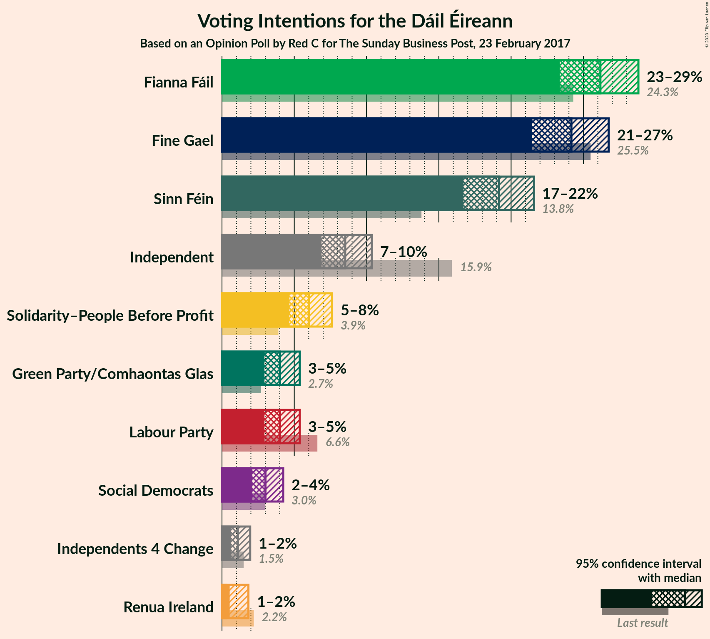
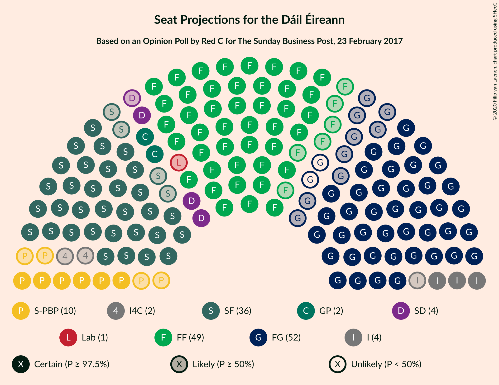
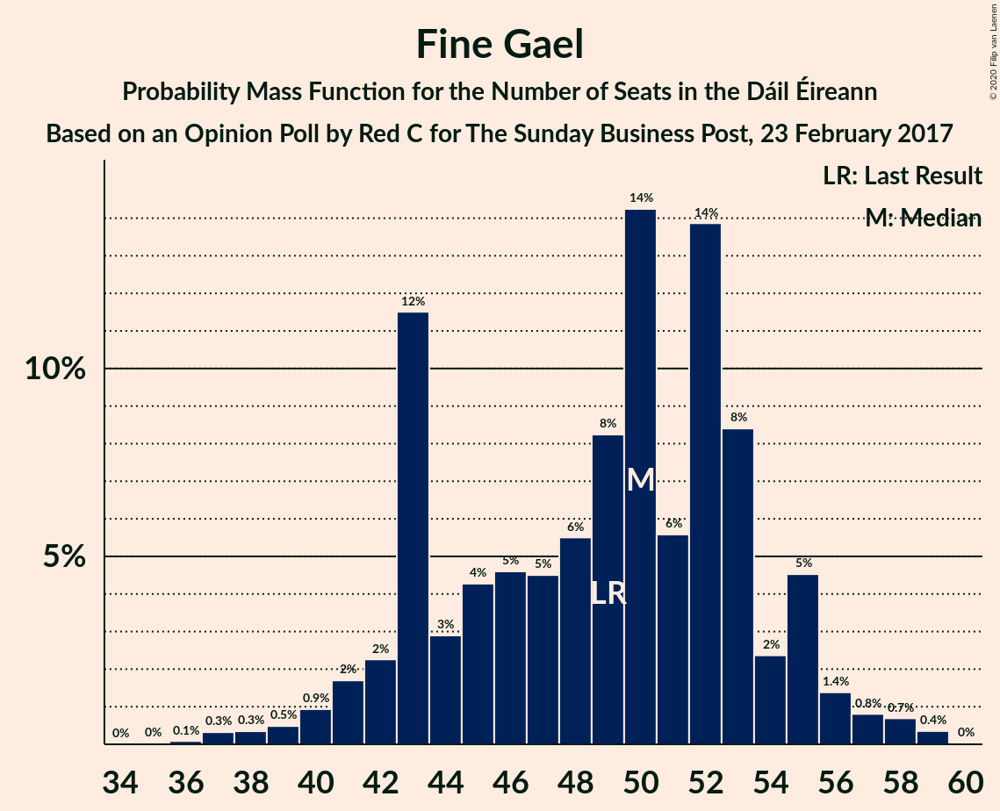

# Opinion Poll by Red C for The Sunday Business Post, 23 February 2017

<a href="#voting-intentions">Voting Intentions</a> | <a href="#seats">Seats</a> | <a href="#coalitions">Coalitions</a> | <a href="#technical-information">Technical Information</a>

## Voting Intentions

### Confidence Intervals

| Party | Last Result | Poll Result | 80% Confidence Interval | 90% Confidence Interval | 95% Confidence Interval | 99% Confidence Interval |
|:-----:|:-----------:|:-----------:|:-----------------------:|:-----------------------:|:-----------------------:|:-----------------------:|
| Fianna Fáil | 24.3% | 26.0% | 24.3–27.8% |23.8–28.3% |23.4–28.8% |22.6–29.7% |
| Fine Gael | 25.5% | 24.0% | 22.3–25.8% |21.9–26.3% |21.5–26.7% |20.7–27.6% |
| Sinn Féin | 13.8% | 19.0% | 17.5–20.7% |17.1–21.2% |16.7–21.6% |16.0–22.4% |
| Independent | 15.9% | 8.5% | 7.4–9.7% |7.1–10.0% |6.9–10.4% |6.4–11.0% |
| Solidarity–People Before Profit | 3.9% | 6.0% | 5.1–7.1% |4.9–7.4% |4.7–7.6% |4.3–8.2% |
| Labour Party | 6.6% | 4.0% | 3.3–4.9% |3.1–5.2% |2.9–5.4% |2.6–5.9% |
| Green Party/Comhaontas Glas | 2.7% | 4.0% | 3.3–4.9% |3.1–5.2% |2.9–5.4% |2.6–5.9% |
| Social Democrats | 3.0% | 3.0% | 2.4–3.8% |2.2–4.0% |2.1–4.2% |1.8–4.7% |
| Independents 4 Change | 1.5% | 1.1% | 0.8–1.7% |0.7–1.8% |0.6–2.0% |0.5–2.3% |
| Renua Ireland | 2.2% | 1.0% | 0.7–1.5% |0.6–1.7% |0.5–1.8% |0.4–2.1% |

*Note:* The poll result column reflects the actual value used in the calculations. Published results may vary slightly, and in addition be rounded to fewer digits.

## Seats

### Confidence Intervals

| Party | Last Result | Median | 80% Confidence Interval | 90% Confidence Interval | 95% Confidence Interval | 99% Confidence Interval |
|:-----:|:-----------:|:------:|:-----------------------:|:-----------------------:|:-----------------------:|:-----------------------:|
| <a href="#fianna-fáil">Fianna Fáil</a> | 44 | 52 | 47–56 |47–58 |46–59 |43–60 |
| <a href="#fine-gael">Fine Gael</a> | 49 | 48 | 42–52 |41–53 |40–54 |38–56 |
| <a href="#sinn-féin">Sinn Féin</a> | 23 | 36 | 34–39 |34–40 |34–41 |33–43 |
| <a href="#independent">Independent</a> | 19 | 4 | 3–7 |3–8 |3–10 |3–10 |
| <a href="#solidarity–people-before-profit">Solidarity–People Before Profit</a> | 6 | 10 | 9–10 |7–11 |6–11 |6–11 |
| <a href="#labour-party">Labour Party</a> | 7 | 1 | 0–4 |0–4 |0–4 |0–5 |
| <a href="#green-party/comhaontas-glas">Green Party/Comhaontas Glas</a> | 2 | 2 | 2–3 |2–4 |1–4 |0–7 |
| <a href="#social-democrats">Social Democrats</a> | 3 | 4 | 3–5 |3–5 |3–6 |3–6 |
| <a href="#independents-4-change">Independents 4 Change</a> | 4 | 1 | 0–4 |0–5 |0–5 |0–5 |
| <a href="#renua-ireland">Renua Ireland</a> | 0 | 0 | 0 |0 |0 |0–1 |

### Fianna Fáil

*For a full overview of the results for this party, see the [Fianna Fáil](party-fiannafáil.html) page.*

| Number of Seats | Probability | Accumulated | Special Marks |
|:---------------:|:-----------:|:-----------:|:-------------:|
| 41 | 0% | 100% |  |
| 42 | 0.2% | 99.9% |  |
| 43 | 1.0% | 99.7% |  |
| 44 | 0.2% | 98.7% | Last Result |
| 45 | 0.7% | 98.5% |  |
| 46 | 0.9% | 98% |  |
| 47 | 9% | 97% |  |
| 48 | 5% | 88% |  |
| 49 | 8% | 83% |  |
| 50 | 7% | 75% |  |
| 51 | 11% | 68% |  |
| 52 | 22% | 57% | Median |
| 53 | 3% | 35% |  |
| 54 | 12% | 32% |  |
| 55 | 6% | 20% |  |
| 56 | 5% | 14% |  |
| 57 | 1.2% | 9% |  |
| 58 | 3% | 8% |  |
| 59 | 3% | 5% |  |
| 60 | 1.1% | 1.1% |  |
| 61 | 0% | 0% |  |

### Fine Gael

*For a full overview of the results for this party, see the [Fine Gael](party-finegael.html) page.*

| Number of Seats | Probability | Accumulated | Special Marks |
|:---------------:|:-----------:|:-----------:|:-------------:|
| 36 | 0.2% | 100% |  |
| 37 | 0% | 99.8% |  |
| 38 | 0.5% | 99.8% |  |
| 39 | 2% | 99.3% |  |
| 40 | 0.4% | 98% |  |
| 41 | 3% | 97% |  |
| 42 | 5% | 94% |  |
| 43 | 4% | 89% |  |
| 44 | 5% | 85% |  |
| 45 | 5% | 79% |  |
| 46 | 3% | 74% |  |
| 47 | 16% | 72% |  |
| 48 | 11% | 56% | Median |
| 49 | 20% | 45% | Last Result |
| 50 | 3% | 25% |  |
| 51 | 6% | 22% |  |
| 52 | 10% | 16% |  |
| 53 | 2% | 6% |  |
| 54 | 2% | 4% |  |
| 55 | 1.2% | 2% |  |
| 56 | 0.2% | 0.7% |  |
| 57 | 0.2% | 0.5% |  |
| 58 | 0.2% | 0.2% |  |
| 59 | 0% | 0.1% |  |
| 60 | 0% | 0.1% |  |
| 61 | 0% | 0% |  |

### Sinn Féin

*For a full overview of the results for this party, see the [Sinn Féin](party-sinnféin.html) page.*

| Number of Seats | Probability | Accumulated | Special Marks |
|:---------------:|:-----------:|:-----------:|:-------------:|
| 23 | 0% | 100% | Last Result |
| 24 | 0% | 100% |  |
| 25 | 0% | 100% |  |
| 26 | 0% | 100% |  |
| 27 | 0% | 100% |  |
| 28 | 0% | 100% |  |
| 29 | 0% | 100% |  |
| 30 | 0% | 100% |  |
| 31 | 0% | 100% |  |
| 32 | 0.4% | 100% |  |
| 33 | 0.2% | 99.6% |  |
| 34 | 20% | 99.4% |  |
| 35 | 0.8% | 79% |  |
| 36 | 40% | 78% | Median |
| 37 | 20% | 38% |  |
| 38 | 3% | 18% |  |
| 39 | 6% | 14% |  |
| 40 | 5% | 8% |  |
| 41 | 1.2% | 3% |  |
| 42 | 0.4% | 1.3% |  |
| 43 | 0.6% | 1.0% |  |
| 44 | 0.1% | 0.3% |  |
| 45 | 0.2% | 0.2% |  |
| 46 | 0% | 0.1% |  |
| 47 | 0% | 0% |  |

### Independent

*For a full overview of the results for this party, see the [Independent](party-independent.html) page.*

| Number of Seats | Probability | Accumulated | Special Marks |
|:---------------:|:-----------:|:-----------:|:-------------:|
| 2 | 0.2% | 100% |  |
| 3 | 34% | 99.8% |  |
| 4 | 29% | 66% | Median |
| 5 | 18% | 37% |  |
| 6 | 9% | 19% |  |
| 7 | 2% | 10% |  |
| 8 | 4% | 8% |  |
| 9 | 0.4% | 4% |  |
| 10 | 3% | 4% |  |
| 11 | 0.2% | 0.4% |  |
| 12 | 0.1% | 0.2% |  |
| 13 | 0.1% | 0.2% |  |
| 14 | 0% | 0.1% |  |
| 15 | 0.1% | 0.1% |  |
| 16 | 0% | 0% |  |
| 17 | 0% | 0% |  |
| 18 | 0% | 0% |  |
| 19 | 0% | 0% | Last Result |

### Solidarity–People Before Profit

*For a full overview of the results for this party, see the [Solidarity–People Before Profit](party-solidarity–peoplebeforeprofit.html) page.*

| Number of Seats | Probability | Accumulated | Special Marks |
|:---------------:|:-----------:|:-----------:|:-------------:|
| 5 | 0.1% | 100% |  |
| 6 | 3% | 99.9% | Last Result |
| 7 | 2% | 97% |  |
| 8 | 3% | 95% |  |
| 9 | 17% | 92% |  |
| 10 | 69% | 75% | Median |
| 11 | 5% | 5% |  |
| 12 | 0.1% | 0.1% |  |
| 13 | 0% | 0% |  |

### Labour Party

*For a full overview of the results for this party, see the [Labour Party](party-labourparty.html) page.*

| Number of Seats | Probability | Accumulated | Special Marks |
|:---------------:|:-----------:|:-----------:|:-------------:|
| 0 | 24% | 100% |  |
| 1 | 31% | 76% | Median |
| 2 | 27% | 45% |  |
| 3 | 2% | 18% |  |
| 4 | 15% | 16% |  |
| 5 | 0.7% | 1.0% |  |
| 6 | 0.1% | 0.3% |  |
| 7 | 0.2% | 0.2% | Last Result |
| 8 | 0.1% | 0.1% |  |
| 9 | 0% | 0% |  |

### Green Party/Comhaontas Glas

*For a full overview of the results for this party, see the [Green Party/Comhaontas Glas](party-greenpartycomhaontasglas.html) page.*

| Number of Seats | Probability | Accumulated | Special Marks |
|:---------------:|:-----------:|:-----------:|:-------------:|
| 0 | 2% | 100% |  |
| 1 | 1.5% | 98% |  |
| 2 | 81% | 96% | Last Result, Median |
| 3 | 10% | 16% |  |
| 4 | 4% | 6% |  |
| 5 | 0.7% | 2% |  |
| 6 | 0.2% | 1.0% |  |
| 7 | 0.8% | 0.8% |  |
| 8 | 0% | 0% |  |

### Social Democrats

*For a full overview of the results for this party, see the [Social Democrats](party-socialdemocrats.html) page.*

| Number of Seats | Probability | Accumulated | Special Marks |
|:---------------:|:-----------:|:-----------:|:-------------:|
| 3 | 13% | 100% | Last Result |
| 4 | 75% | 87% | Median |
| 5 | 10% | 13% |  |
| 6 | 3% | 3% |  |
| 7 | 0.1% | 0.2% |  |
| 8 | 0% | 0% |  |

### Independents 4 Change

*For a full overview of the results for this party, see the [Independents 4 Change](party-independents4change.html) page.*

| Number of Seats | Probability | Accumulated | Special Marks |
|:---------------:|:-----------:|:-----------:|:-------------:|
| 0 | 11% | 100% |  |
| 1 | 42% | 89% | Median |
| 2 | 8% | 47% |  |
| 3 | 2% | 39% |  |
| 4 | 30% | 38% | Last Result |
| 5 | 8% | 8% |  |
| 6 | 0% | 0% |  |

### Renua Ireland

*For a full overview of the results for this party, see the [Renua Ireland](party-renuaireland.html) page.*

| Number of Seats | Probability | Accumulated | Special Marks |
|:---------------:|:-----------:|:-----------:|:-------------:|
| 0 | 99.4% | 100% | Last Result, Median |
| 1 | 0.5% | 0.6% |  |
| 2 | 0.1% | 0.1% |  |
| 3 | 0% | 0% |  |

## Coalitions

### Confidence Intervals

| Coalition | Last Result | Median | Majority? | 80% Confidence Interval | 90% Confidence Interval | 95% Confidence Interval | 99% Confidence Interval |
|:---------:|:-----------:|:------:|:---------:|:-----------------------:|:-----------------------:|:-----------------------:|:-----------------------:|
| Fianna Fáil – Fine Gael | 93 | 101 | 100% | 94–103 | 94–104 | 94–105 | 91–106 |
| Fianna Fáil – Sinn Féin | 67 | 88 | 99.4% | 84–94 | 83–95 | 83–97 | 80–98 |
| Fianna Fáil – Green Party/Comhaontas Glas – Labour Party – Social Democrats | 56 | 60 | 0% | 55–64 | 55–66 | 54–66 | 51–68 |
| Fine Gael – Green Party/Comhaontas Glas – Labour Party – Social Democrats | 61 | 57 | 0% | 50–61 | 48–62 | 47–63 | 45–64 |
| Fianna Fáil – Green Party/Comhaontas Glas – Labour Party | 53 | 56 | 0% | 52–60 | 51–62 | 50–62 | 47–64 |
| Fianna Fáil – Green Party/Comhaontas Glas | 46 | 54 | 0% | 49–59 | 49–61 | 48–62 | 47–63 |
| Fianna Fáil – Labour Party | 51 | 54 | 0% | 49–57 | 49–59 | 47–60 | 45–61 |
| Fine Gael – Green Party/Comhaontas Glas – Labour Party | 58 | 53 | 0% | 46–57 | 45–57 | 43–59 | 41–60 |
| Fine Gael – Green Party/Comhaontas Glas | 51 | 50 | 0% | 45–54 | 44–56 | 43–56 | 41–59 |
| Fine Gael – Labour Party | 56 | 51 | 0% | 43–55 | 42–55 | 41–55 | 38–57 |
| Fine Gael | 49 | 48 | 0% | 42–52 | 41–53 | 40–54 | 38–56 |

### Fianna Fáil – Fine Gael

| Number of Seats | Probability | Accumulated | Special Marks |
|:---------------:|:-----------:|:-----------:|:-------------:|
| 87 | 0% | 100% |  |
| 88 | 0.1% | 99.9% |  |
| 89 | 0% | 99.8% |  |
| 90 | 0.2% | 99.8% |  |
| 91 | 0.4% | 99.6% |  |
| 92 | 0.2% | 99.2% |  |
| 93 | 1.2% | 99.0% | Last Result |
| 94 | 9% | 98% |  |
| 95 | 2% | 89% |  |
| 96 | 7% | 86% |  |
| 97 | 9% | 79% |  |
| 98 | 7% | 70% |  |
| 99 | 4% | 63% |  |
| 100 | 6% | 59% | Median |
| 101 | 31% | 53% |  |
| 102 | 4% | 23% |  |
| 103 | 10% | 18% |  |
| 104 | 5% | 9% |  |
| 105 | 3% | 3% |  |
| 106 | 0.2% | 0.6% |  |
| 107 | 0.4% | 0.4% |  |
| 108 | 0% | 0% |  |

### Fianna Fáil – Sinn Féin

| Number of Seats | Probability | Accumulated | Special Marks |
|:---------------:|:-----------:|:-----------:|:-------------:|
| 67 | 0% | 100% | Last Result |
| 68 | 0% | 100% |  |
| 69 | 0% | 100% |  |
| 70 | 0% | 100% |  |
| 71 | 0% | 100% |  |
| 72 | 0% | 100% |  |
| 73 | 0% | 100% |  |
| 74 | 0% | 100% |  |
| 75 | 0% | 100% |  |
| 76 | 0% | 100% |  |
| 77 | 0.1% | 99.9% |  |
| 78 | 0.2% | 99.8% |  |
| 79 | 0.1% | 99.6% |  |
| 80 | 0.1% | 99.5% |  |
| 81 | 0.5% | 99.4% | Majority |
| 82 | 1.3% | 98.9% |  |
| 83 | 3% | 98% |  |
| 84 | 14% | 94% |  |
| 85 | 11% | 81% |  |
| 86 | 4% | 70% |  |
| 87 | 2% | 66% |  |
| 88 | 20% | 64% | Median |
| 89 | 12% | 44% |  |
| 90 | 10% | 32% |  |
| 91 | 6% | 22% |  |
| 92 | 4% | 16% |  |
| 93 | 1.2% | 12% |  |
| 94 | 3% | 11% |  |
| 95 | 3% | 7% |  |
| 96 | 1.1% | 4% |  |
| 97 | 1.4% | 3% |  |
| 98 | 1.2% | 1.5% |  |
| 99 | 0.3% | 0.3% |  |
| 100 | 0% | 0% |  |

### Fianna Fáil – Green Party/Comhaontas Glas – Labour Party – Social Democrats

| Number of Seats | Probability | Accumulated | Special Marks |
|:---------------:|:-----------:|:-----------:|:-------------:|
| 49 | 0% | 100% |  |
| 50 | 0.2% | 99.9% |  |
| 51 | 0.3% | 99.8% |  |
| 52 | 0.9% | 99.4% |  |
| 53 | 0.1% | 98.6% |  |
| 54 | 1.2% | 98% |  |
| 55 | 9% | 97% |  |
| 56 | 4% | 88% | Last Result |
| 57 | 17% | 84% |  |
| 58 | 5% | 67% |  |
| 59 | 3% | 62% | Median |
| 60 | 23% | 59% |  |
| 61 | 9% | 36% |  |
| 62 | 10% | 27% |  |
| 63 | 5% | 16% |  |
| 64 | 4% | 11% |  |
| 65 | 2% | 7% |  |
| 66 | 3% | 5% |  |
| 67 | 0.6% | 2% |  |
| 68 | 1.0% | 1.4% |  |
| 69 | 0.1% | 0.4% |  |
| 70 | 0.2% | 0.3% |  |
| 71 | 0% | 0% |  |

### Fine Gael – Green Party/Comhaontas Glas – Labour Party – Social Democrats

| Number of Seats | Probability | Accumulated | Special Marks |
|:---------------:|:-----------:|:-----------:|:-------------:|
| 44 | 0.4% | 100% |  |
| 45 | 1.3% | 99.6% |  |
| 46 | 0.2% | 98% |  |
| 47 | 1.4% | 98% |  |
| 48 | 2% | 97% |  |
| 49 | 3% | 94% |  |
| 50 | 5% | 91% |  |
| 51 | 5% | 86% |  |
| 52 | 6% | 81% |  |
| 53 | 2% | 75% |  |
| 54 | 8% | 73% |  |
| 55 | 10% | 65% | Median |
| 56 | 5% | 55% |  |
| 57 | 26% | 51% |  |
| 58 | 9% | 24% |  |
| 59 | 2% | 15% |  |
| 60 | 3% | 14% |  |
| 61 | 3% | 11% | Last Result |
| 62 | 5% | 8% |  |
| 63 | 2% | 3% |  |
| 64 | 0.4% | 0.7% |  |
| 65 | 0.3% | 0.3% |  |
| 66 | 0% | 0.1% |  |
| 67 | 0% | 0.1% |  |
| 68 | 0% | 0.1% |  |
| 69 | 0% | 0% |  |

### Fianna Fáil – Green Party/Comhaontas Glas – Labour Party

| Number of Seats | Probability | Accumulated | Special Marks |
|:---------------:|:-----------:|:-----------:|:-------------:|
| 45 | 0% | 100% |  |
| 46 | 0.2% | 99.9% |  |
| 47 | 0.3% | 99.7% |  |
| 48 | 0.4% | 99.5% |  |
| 49 | 0.6% | 99.0% |  |
| 50 | 1.2% | 98% |  |
| 51 | 6% | 97% |  |
| 52 | 8% | 92% |  |
| 53 | 17% | 83% | Last Result |
| 54 | 4% | 67% |  |
| 55 | 4% | 63% | Median |
| 56 | 28% | 59% |  |
| 57 | 5% | 31% |  |
| 58 | 9% | 26% |  |
| 59 | 6% | 17% |  |
| 60 | 5% | 12% |  |
| 61 | 1.0% | 7% |  |
| 62 | 4% | 6% |  |
| 63 | 0.7% | 2% |  |
| 64 | 0.8% | 1.2% |  |
| 65 | 0.1% | 0.3% |  |
| 66 | 0.2% | 0.2% |  |
| 67 | 0% | 0% |  |

### Fianna Fáil – Green Party/Comhaontas Glas

| Number of Seats | Probability | Accumulated | Special Marks |
|:---------------:|:-----------:|:-----------:|:-------------:|
| 44 | 0.1% | 100% |  |
| 45 | 0.2% | 99.9% |  |
| 46 | 0.1% | 99.7% | Last Result |
| 47 | 2% | 99.6% |  |
| 48 | 0.8% | 98% |  |
| 49 | 9% | 97% |  |
| 50 | 5% | 88% |  |
| 51 | 7% | 83% |  |
| 52 | 10% | 77% |  |
| 53 | 10% | 66% |  |
| 54 | 20% | 56% | Median |
| 55 | 4% | 36% |  |
| 56 | 11% | 32% |  |
| 57 | 4% | 21% |  |
| 58 | 6% | 17% |  |
| 59 | 3% | 11% |  |
| 60 | 3% | 9% |  |
| 61 | 3% | 6% |  |
| 62 | 2% | 3% |  |
| 63 | 0.9% | 1.2% |  |
| 64 | 0.1% | 0.3% |  |
| 65 | 0.2% | 0.2% |  |
| 66 | 0% | 0% |  |

### Fianna Fáil – Labour Party

| Number of Seats | Probability | Accumulated | Special Marks |
|:---------------:|:-----------:|:-----------:|:-------------:|
| 42 | 0% | 100% |  |
| 43 | 0.2% | 99.9% |  |
| 44 | 0% | 99.7% |  |
| 45 | 0.4% | 99.7% |  |
| 46 | 1.2% | 99.2% |  |
| 47 | 0.9% | 98% |  |
| 48 | 0.6% | 97% |  |
| 49 | 7% | 97% |  |
| 50 | 5% | 90% |  |
| 51 | 17% | 85% | Last Result |
| 52 | 7% | 68% |  |
| 53 | 4% | 61% | Median |
| 54 | 27% | 57% |  |
| 55 | 5% | 30% |  |
| 56 | 10% | 24% |  |
| 57 | 5% | 14% |  |
| 58 | 4% | 10% |  |
| 59 | 2% | 6% |  |
| 60 | 2% | 3% |  |
| 61 | 0.9% | 1.0% |  |
| 62 | 0% | 0.1% |  |
| 63 | 0% | 0% |  |

### Fine Gael – Green Party/Comhaontas Glas – Labour Party

| Number of Seats | Probability | Accumulated | Special Marks |
|:---------------:|:-----------:|:-----------:|:-------------:|
| 40 | 0.4% | 100% |  |
| 41 | 0.3% | 99.6% |  |
| 42 | 1.1% | 99.3% |  |
| 43 | 1.5% | 98% |  |
| 44 | 1.1% | 97% |  |
| 45 | 3% | 96% |  |
| 46 | 6% | 92% |  |
| 47 | 5% | 86% |  |
| 48 | 5% | 81% |  |
| 49 | 3% | 75% |  |
| 50 | 1.3% | 72% |  |
| 51 | 16% | 71% | Median |
| 52 | 4% | 55% |  |
| 53 | 29% | 51% |  |
| 54 | 8% | 22% |  |
| 55 | 2% | 14% |  |
| 56 | 2% | 12% |  |
| 57 | 7% | 11% |  |
| 58 | 0.6% | 3% | Last Result |
| 59 | 2% | 3% |  |
| 60 | 0.7% | 1.0% |  |
| 61 | 0.2% | 0.3% |  |
| 62 | 0% | 0.1% |  |
| 63 | 0% | 0.1% |  |
| 64 | 0% | 0.1% |  |
| 65 | 0% | 0% |  |

### Fine Gael – Green Party/Comhaontas Glas

| Number of Seats | Probability | Accumulated | Special Marks |
|:---------------:|:-----------:|:-----------:|:-------------:|
| 40 | 0.4% | 100% |  |
| 41 | 0.3% | 99.6% |  |
| 42 | 1.4% | 99.3% |  |
| 43 | 3% | 98% |  |
| 44 | 2% | 95% |  |
| 45 | 5% | 93% |  |
| 46 | 7% | 88% |  |
| 47 | 6% | 81% |  |
| 48 | 3% | 75% |  |
| 49 | 15% | 72% |  |
| 50 | 10% | 57% | Median |
| 51 | 21% | 47% | Last Result |
| 52 | 6% | 26% |  |
| 53 | 5% | 20% |  |
| 54 | 7% | 15% |  |
| 55 | 1.1% | 8% |  |
| 56 | 4% | 7% |  |
| 57 | 0.6% | 2% |  |
| 58 | 0.5% | 2% |  |
| 59 | 0.5% | 1.0% |  |
| 60 | 0.3% | 0.4% |  |
| 61 | 0% | 0.1% |  |
| 62 | 0% | 0.1% |  |
| 63 | 0% | 0.1% |  |
| 64 | 0% | 0% |  |

### Fine Gael – Labour Party

| Number of Seats | Probability | Accumulated | Special Marks |
|:---------------:|:-----------:|:-----------:|:-------------:|
| 37 | 0.2% | 100% |  |
| 38 | 0.4% | 99.8% |  |
| 39 | 1.3% | 99.4% |  |
| 40 | 0.3% | 98% |  |
| 41 | 2% | 98% |  |
| 42 | 1.3% | 96% |  |
| 43 | 6% | 95% |  |
| 44 | 5% | 88% |  |
| 45 | 4% | 84% |  |
| 46 | 5% | 79% |  |
| 47 | 3% | 75% |  |
| 48 | 1.3% | 71% |  |
| 49 | 16% | 70% | Median |
| 50 | 2% | 54% |  |
| 51 | 28% | 51% |  |
| 52 | 10% | 24% |  |
| 53 | 3% | 14% |  |
| 54 | 0.4% | 11% |  |
| 55 | 8% | 10% |  |
| 56 | 1.1% | 2% | Last Result |
| 57 | 0.4% | 0.9% |  |
| 58 | 0.4% | 0.5% |  |
| 59 | 0% | 0.1% |  |
| 60 | 0% | 0.1% |  |
| 61 | 0% | 0% |  |

### Fine Gael

| Number of Seats | Probability | Accumulated | Special Marks |
|:---------------:|:-----------:|:-----------:|:-------------:|
| 36 | 0.2% | 100% |  |
| 37 | 0% | 99.8% |  |
| 38 | 0.5% | 99.8% |  |
| 39 | 2% | 99.3% |  |
| 40 | 0.4% | 98% |  |
| 41 | 3% | 97% |  |
| 42 | 5% | 94% |  |
| 43 | 4% | 89% |  |
| 44 | 5% | 85% |  |
| 45 | 5% | 79% |  |
| 46 | 3% | 74% |  |
| 47 | 16% | 72% |  |
| 48 | 11% | 56% | Median |
| 49 | 20% | 45% | Last Result |
| 50 | 3% | 25% |  |
| 51 | 6% | 22% |  |
| 52 | 10% | 16% |  |
| 53 | 2% | 6% |  |
| 54 | 2% | 4% |  |
| 55 | 1.2% | 2% |  |
| 56 | 0.2% | 0.7% |  |
| 57 | 0.2% | 0.5% |  |
| 58 | 0.2% | 0.2% |  |
| 59 | 0% | 0.1% |  |
| 60 | 0% | 0.1% |  |
| 61 | 0% | 0% |  |

## Technical Information

### Opinion Poll

+ **Polling firm:** Red C
+ **Commissioner(s):** The Sunday Business Post
+ **Fieldwork period:** 23 February 2017

### Calculations

+ **Sample size:** 1004
+ **Simulations done:** 131,072
+ **Error estimate:** 1.75%

