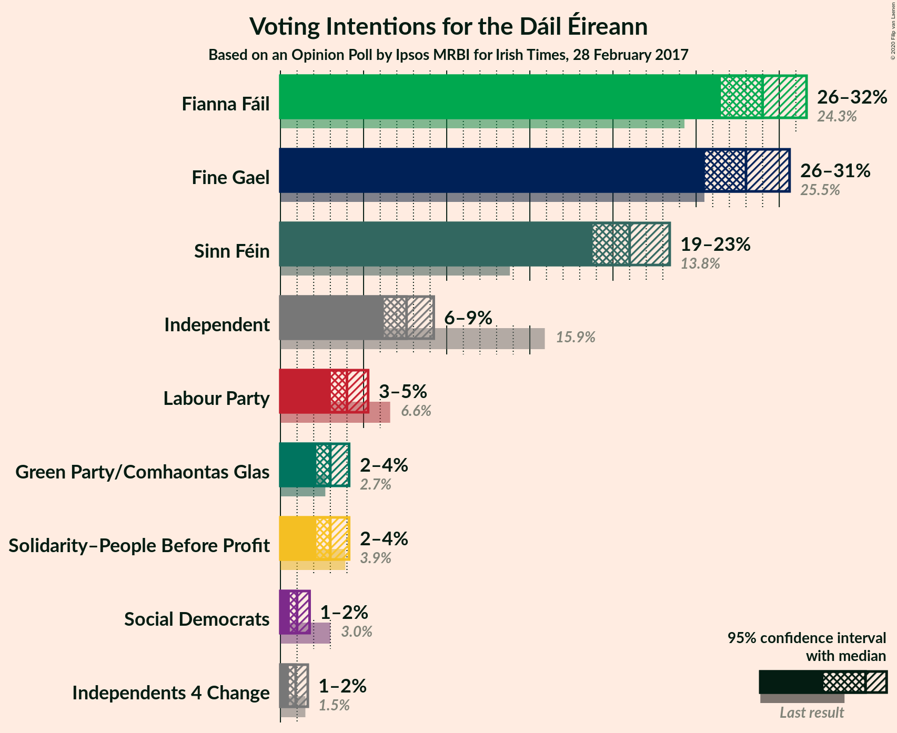
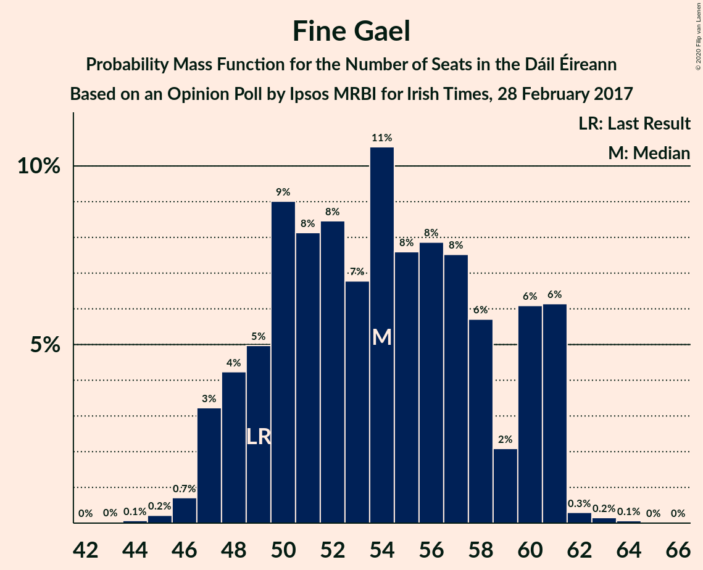
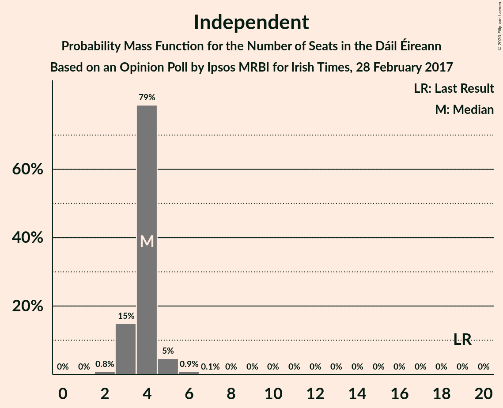
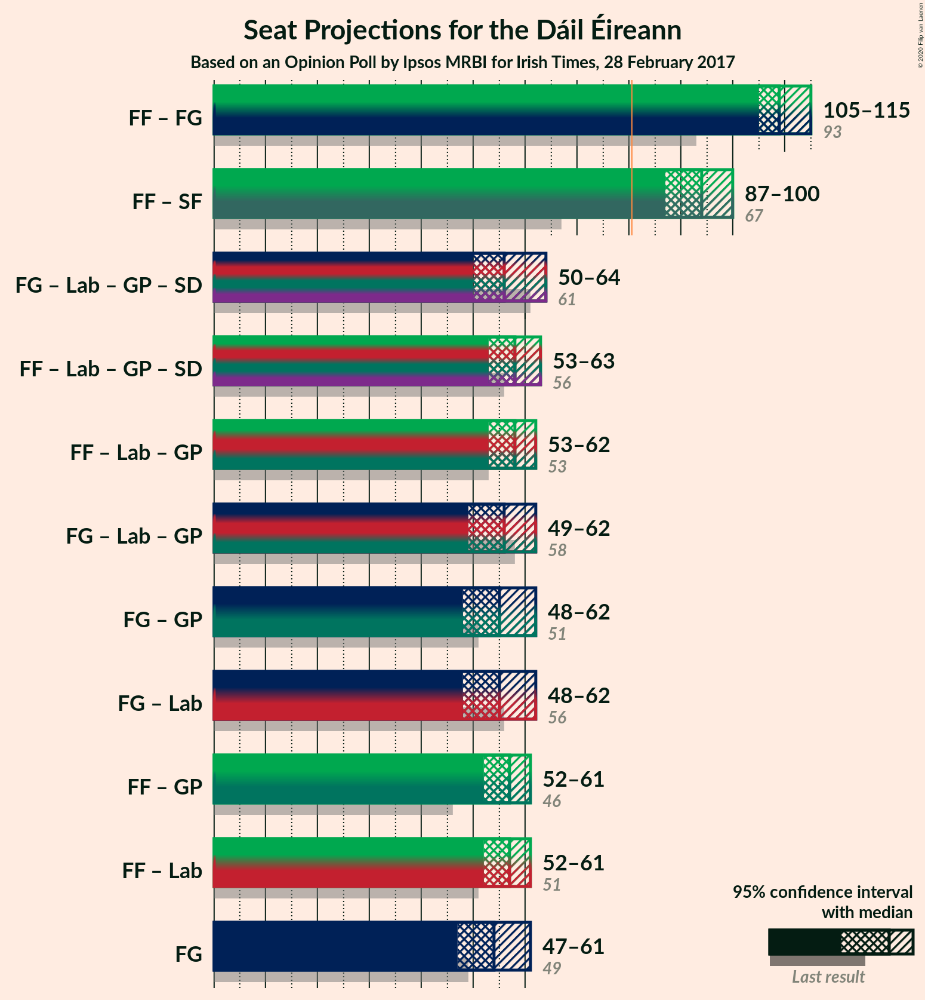
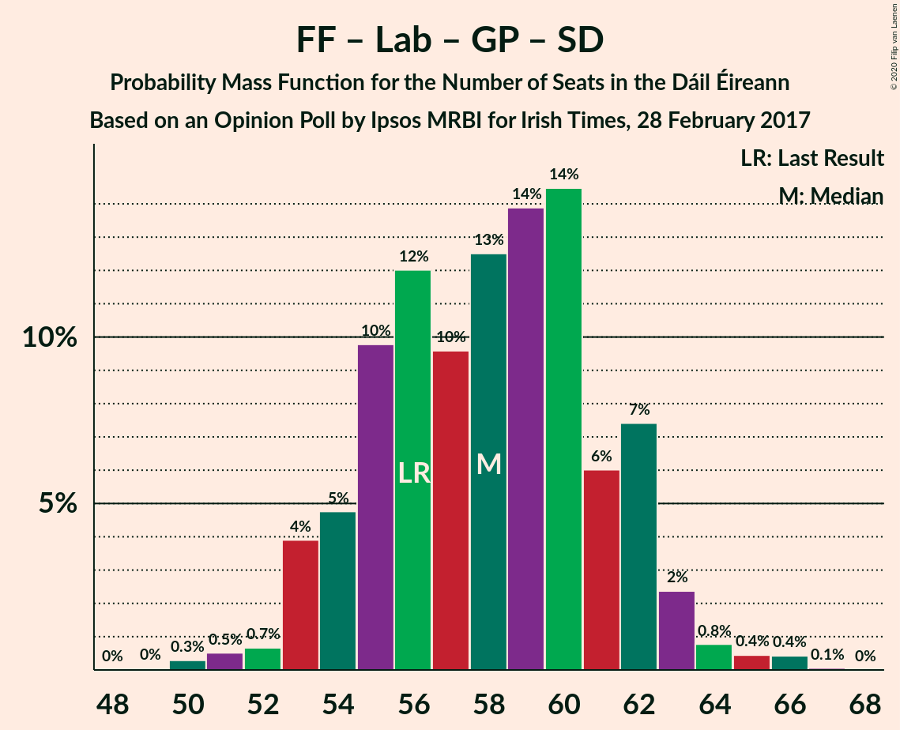
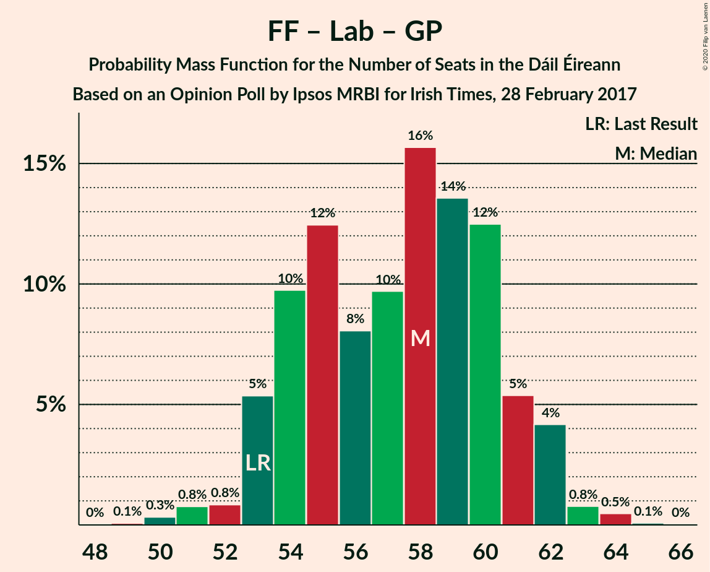

# Opinion Poll by Ipsos MRBI for Irish Times, 28 February 2017

<a href="#voting-intentions">Voting Intentions</a> | <a href="#seats">Seats</a> | <a href="#coalitions">Coalitions</a> | <a href="#technical-information">Technical Information</a>

## Voting Intentions

### Confidence Intervals

| Party | Last Result | Poll Result | 80% Confidence Interval | 90% Confidence Interval | 95% Confidence Interval | 99% Confidence Interval |
|:-----:|:-----------:|:-----------:|:-----------------------:|:-----------------------:|:-----------------------:|:-----------------------:|
| Fianna Fáil | 24.3% | 29.0% | 27.4–30.7% |26.9–31.2% |26.5–31.6% |25.7–32.5% |
| Fine Gael | 25.5% | 28.0% | 26.4–29.7% |25.9–30.2% |25.5–30.6% |24.8–31.4% |
| Sinn Féin | 13.8% | 21.0% | 19.5–22.6% |19.1–23.0% |18.8–23.4% |18.1–24.2% |
| Independent | 15.9% | 7.6% | 6.7–8.7% |6.4–9.0% |6.2–9.2% |5.8–9.8% |
| Labour Party | 6.6% | 4.0% | 3.4–4.8% |3.2–5.1% |3.0–5.3% |2.7–5.7% |
| Solidarity–People Before Profit | 3.9% | 3.0% | 2.5–3.7% |2.3–3.9% |2.2–4.1% |1.9–4.5% |
| Green Party/Comhaontas Glas | 2.7% | 3.0% | 2.5–3.7% |2.3–3.9% |2.2–4.1% |1.9–4.5% |
| Social Democrats | 3.0% | 1.0% | 0.7–1.5% |0.6–1.6% |0.6–1.8% |0.5–2.0% |
| Independents 4 Change | 1.5% | 0.9% | 0.6–1.4% |0.6–1.5% |0.5–1.6% |0.4–1.9% |

*Note:* The poll result column reflects the actual value used in the calculations. Published results may vary slightly, and in addition be rounded to fewer digits.

## Seats

### Confidence Intervals

| Party | Last Result | Median | 80% Confidence Interval | 90% Confidence Interval | 95% Confidence Interval | 99% Confidence Interval |
|:-----:|:-----------:|:------:|:-----------------------:|:-----------------------:|:-----------------------:|:-----------------------:|
| <a href="#fianna-fáil">Fianna Fáil</a> | 44 | 56 | 52–58 |52–59 |51–59 |49–59 |
| <a href="#fine-gael">Fine Gael</a> | 49 | 54 | 49–60 |48–61 |47–61 |46–62 |
| <a href="#sinn-féin">Sinn Féin</a> | 23 | 39 | 35–42 |34–42 |34–43 |34–44 |
| <a href="#independent">Independent</a> | 19 | 4 | 3–4 |3–5 |3–5 |2–6 |
| <a href="#labour-party">Labour Party</a> | 7 | 1 | 0–3 |0–3 |0–4 |0–6 |
| <a href="#solidarity–people-before-profit">Solidarity–People Before Profit</a> | 6 | 4 | 2–4 |1–5 |1–5 |0–7 |
| <a href="#green-party/comhaontas-glas">Green Party/Comhaontas Glas</a> | 2 | 1 | 0–2 |0–2 |0–2 |0–3 |
| <a href="#social-democrats">Social Democrats</a> | 3 | 0 | 0–2 |0–3 |0–3 |0–4 |
| <a href="#independents-4-change">Independents 4 Change</a> | 4 | 1 | 0–4 |0–4 |0–4 |0–4 |

### Fianna Fáil

*For a full overview of the results for this party, see the [Fianna Fáil](party-fiannafáil.html) page.*

| Number of Seats | Probability | Accumulated | Special Marks |
|:---------------:|:-----------:|:-----------:|:-------------:|
| 44 | 0% | 100% | Last Result |
| 45 | 0% | 100% |  |
| 46 | 0% | 100% |  |
| 47 | 0.1% | 99.9% |  |
| 48 | 0.3% | 99.9% |  |
| 49 | 0.5% | 99.5% |  |
| 50 | 0.9% | 99.0% |  |
| 51 | 3% | 98% |  |
| 52 | 8% | 95% |  |
| 53 | 11% | 88% |  |
| 54 | 16% | 77% |  |
| 55 | 6% | 61% |  |
| 56 | 18% | 54% | Median |
| 57 | 18% | 37% |  |
| 58 | 11% | 18% |  |
| 59 | 7% | 7% |  |
| 60 | 0.2% | 0.2% |  |
| 61 | 0% | 0% |  |

### Fine Gael

*For a full overview of the results for this party, see the [Fine Gael](party-finegael.html) page.*

| Number of Seats | Probability | Accumulated | Special Marks |
|:---------------:|:-----------:|:-----------:|:-------------:|
| 43 | 0% | 100% |  |
| 44 | 0.1% | 99.9% |  |
| 45 | 0.2% | 99.9% |  |
| 46 | 0.7% | 99.7% |  |
| 47 | 3% | 98.9% |  |
| 48 | 4% | 96% |  |
| 49 | 5% | 91% | Last Result |
| 50 | 9% | 87% |  |
| 51 | 8% | 77% |  |
| 52 | 8% | 69% |  |
| 53 | 7% | 61% |  |
| 54 | 11% | 54% | Median |
| 55 | 8% | 44% |  |
| 56 | 8% | 36% |  |
| 57 | 8% | 28% |  |
| 58 | 6% | 21% |  |
| 59 | 2% | 15% |  |
| 60 | 6% | 13% |  |
| 61 | 6% | 7% |  |
| 62 | 0.3% | 0.6% |  |
| 63 | 0.2% | 0.3% |  |
| 64 | 0.1% | 0.1% |  |
| 65 | 0% | 0% |  |

### Sinn Féin

*For a full overview of the results for this party, see the [Sinn Féin](party-sinnféin.html) page.*

| Number of Seats | Probability | Accumulated | Special Marks |
|:---------------:|:-----------:|:-----------:|:-------------:|
| 23 | 0% | 100% | Last Result |
| 24 | 0% | 100% |  |
| 25 | 0% | 100% |  |
| 26 | 0% | 100% |  |
| 27 | 0% | 100% |  |
| 28 | 0% | 100% |  |
| 29 | 0% | 100% |  |
| 30 | 0% | 100% |  |
| 31 | 0% | 100% |  |
| 32 | 0.1% | 100% |  |
| 33 | 0.2% | 99.9% |  |
| 34 | 5% | 99.7% |  |
| 35 | 13% | 94% |  |
| 36 | 7% | 81% |  |
| 37 | 4% | 74% |  |
| 38 | 12% | 70% |  |
| 39 | 12% | 58% | Median |
| 40 | 20% | 47% |  |
| 41 | 15% | 27% |  |
| 42 | 7% | 11% |  |
| 43 | 4% | 4% |  |
| 44 | 0.5% | 0.6% |  |
| 45 | 0% | 0% |  |

### Independent

*For a full overview of the results for this party, see the [Independent](party-independent.html) page.*

| Number of Seats | Probability | Accumulated | Special Marks |
|:---------------:|:-----------:|:-----------:|:-------------:|
| 2 | 0.8% | 100% |  |
| 3 | 15% | 99.2% |  |
| 4 | 79% | 84% | Median |
| 5 | 5% | 6% |  |
| 6 | 0.9% | 1.0% |  |
| 7 | 0.1% | 0.1% |  |
| 8 | 0% | 0% |  |
| 9 | 0% | 0% |  |
| 10 | 0% | 0% |  |
| 11 | 0% | 0% |  |
| 12 | 0% | 0% |  |
| 13 | 0% | 0% |  |
| 14 | 0% | 0% |  |
| 15 | 0% | 0% |  |
| 16 | 0% | 0% |  |
| 17 | 0% | 0% |  |
| 18 | 0% | 0% |  |
| 19 | 0% | 0% | Last Result |

### Labour Party

*For a full overview of the results for this party, see the [Labour Party](party-labourparty.html) page.*

| Number of Seats | Probability | Accumulated | Special Marks |
|:---------------:|:-----------:|:-----------:|:-------------:|
| 0 | 44% | 100% |  |
| 1 | 37% | 56% | Median |
| 2 | 9% | 19% |  |
| 3 | 8% | 10% |  |
| 4 | 1.3% | 3% |  |
| 5 | 0.8% | 1.4% |  |
| 6 | 0.4% | 0.5% |  |
| 7 | 0.1% | 0.2% | Last Result |
| 8 | 0% | 0% |  |

### Solidarity–People Before Profit

*For a full overview of the results for this party, see the [Solidarity–People Before Profit](party-solidarity–peoplebeforeprofit.html) page.*

| Number of Seats | Probability | Accumulated | Special Marks |
|:---------------:|:-----------:|:-----------:|:-------------:|
| 0 | 0.9% | 100% |  |
| 1 | 7% | 99.1% |  |
| 2 | 9% | 92% |  |
| 3 | 8% | 83% |  |
| 4 | 66% | 75% | Median |
| 5 | 7% | 9% |  |
| 6 | 1.4% | 2% | Last Result |
| 7 | 0.2% | 0.5% |  |
| 8 | 0.2% | 0.3% |  |
| 9 | 0.1% | 0.1% |  |
| 10 | 0% | 0% |  |

### Green Party/Comhaontas Glas

*For a full overview of the results for this party, see the [Green Party/Comhaontas Glas](party-greenpartycomhaontasglas.html) page.*

| Number of Seats | Probability | Accumulated | Special Marks |
|:---------------:|:-----------:|:-----------:|:-------------:|
| 0 | 31% | 100% |  |
| 1 | 29% | 69% | Median |
| 2 | 40% | 41% | Last Result |
| 3 | 0.6% | 0.8% |  |
| 4 | 0.1% | 0.2% |  |
| 5 | 0% | 0% |  |

### Social Democrats

*For a full overview of the results for this party, see the [Social Democrats](party-socialdemocrats.html) page.*

| Number of Seats | Probability | Accumulated | Special Marks |
|:---------------:|:-----------:|:-----------:|:-------------:|
| 0 | 62% | 100% | Median |
| 1 | 18% | 38% |  |
| 2 | 11% | 19% |  |
| 3 | 7% | 8% | Last Result |
| 4 | 1.0% | 1.0% |  |
| 5 | 0% | 0% |  |

### Independents 4 Change

*For a full overview of the results for this party, see the [Independents 4 Change](party-independents4change.html) page.*

| Number of Seats | Probability | Accumulated | Special Marks |
|:---------------:|:-----------:|:-----------:|:-------------:|
| 0 | 39% | 100% |  |
| 1 | 34% | 61% | Median |
| 2 | 10% | 27% |  |
| 3 | 5% | 18% |  |
| 4 | 12% | 12% | Last Result |
| 5 | 0.2% | 0.2% |  |
| 6 | 0% | 0% |  |

## Coalitions

### Confidence Intervals

| Coalition | Last Result | Median | Majority? | 80% Confidence Interval | 90% Confidence Interval | 95% Confidence Interval | 99% Confidence Interval |
|:---------:|:-----------:|:------:|:---------:|:-----------------------:|:-----------------------:|:-----------------------:|:-----------------------:|
| Fianna Fáil – Fine Gael | 93 | 109 | 100% | 106–114 | 105–115 | 105–115 | 103–115 |
| Fianna Fáil – Sinn Féin | 67 | 94 | 100% | 89–99 | 88–100 | 87–100 | 85–102 |
| Fine Gael – Labour Party – Green Party/Comhaontas Glas – Social Democrats | 61 | 56 | 0% | 52–62 | 51–63 | 50–64 | 48–65 |
| Fianna Fáil – Labour Party – Green Party/Comhaontas Glas – Social Democrats | 56 | 58 | 0% | 54–62 | 53–62 | 53–63 | 51–65 |
| Fianna Fáil – Labour Party – Green Party/Comhaontas Glas | 53 | 58 | 0% | 54–61 | 53–62 | 53–62 | 51–64 |
| Fine Gael – Labour Party – Green Party/Comhaontas Glas | 58 | 56 | 0% | 51–61 | 50–62 | 49–62 | 48–64 |
| Fine Gael – Green Party/Comhaontas Glas | 51 | 55 | 0% | 50–61 | 49–61 | 48–62 | 47–63 |
| Fine Gael – Labour Party | 56 | 55 | 0% | 50–60 | 48–61 | 48–62 | 46–63 |
| Fianna Fáil – Green Party/Comhaontas Glas | 46 | 57 | 0% | 53–60 | 53–60 | 52–61 | 50–61 |
| Fianna Fáil – Labour Party | 51 | 57 | 0% | 53–59 | 52–60 | 52–61 | 49–62 |
| Fine Gael | 49 | 54 | 0% | 49–60 | 48–61 | 47–61 | 46–62 |

### Fianna Fáil – Fine Gael

| Number of Seats | Probability | Accumulated | Special Marks |
|:---------------:|:-----------:|:-----------:|:-------------:|
| 93 | 0% | 100% | Last Result |
| 94 | 0% | 100% |  |
| 95 | 0% | 100% |  |
| 96 | 0% | 100% |  |
| 97 | 0% | 100% |  |
| 98 | 0% | 100% |  |
| 99 | 0% | 100% |  |
| 100 | 0% | 100% |  |
| 101 | 0.1% | 100% |  |
| 102 | 0.2% | 99.8% |  |
| 103 | 0.5% | 99.7% |  |
| 104 | 1.1% | 99.2% |  |
| 105 | 5% | 98% |  |
| 106 | 11% | 93% |  |
| 107 | 8% | 82% |  |
| 108 | 21% | 74% |  |
| 109 | 11% | 53% |  |
| 110 | 12% | 42% | Median |
| 111 | 7% | 30% |  |
| 112 | 5% | 23% |  |
| 113 | 4% | 18% |  |
| 114 | 7% | 14% |  |
| 115 | 6% | 6% |  |
| 116 | 0.2% | 0.3% |  |
| 117 | 0.1% | 0.1% |  |
| 118 | 0% | 0% |  |

### Fianna Fáil – Sinn Féin

| Number of Seats | Probability | Accumulated | Special Marks |
|:---------------:|:-----------:|:-----------:|:-------------:|
| 67 | 0% | 100% | Last Result |
| 68 | 0% | 100% |  |
| 69 | 0% | 100% |  |
| 70 | 0% | 100% |  |
| 71 | 0% | 100% |  |
| 72 | 0% | 100% |  |
| 73 | 0% | 100% |  |
| 74 | 0% | 100% |  |
| 75 | 0% | 100% |  |
| 76 | 0% | 100% |  |
| 77 | 0% | 100% |  |
| 78 | 0% | 100% |  |
| 79 | 0% | 100% |  |
| 80 | 0% | 100% |  |
| 81 | 0% | 100% | Majority |
| 82 | 0% | 100% |  |
| 83 | 0.2% | 100% |  |
| 84 | 0.2% | 99.8% |  |
| 85 | 0.3% | 99.6% |  |
| 86 | 0.3% | 99.3% |  |
| 87 | 2% | 99.0% |  |
| 88 | 3% | 97% |  |
| 89 | 8% | 94% |  |
| 90 | 5% | 86% |  |
| 91 | 7% | 81% |  |
| 92 | 9% | 74% |  |
| 93 | 10% | 66% |  |
| 94 | 11% | 56% |  |
| 95 | 5% | 45% | Median |
| 96 | 14% | 40% |  |
| 97 | 6% | 26% |  |
| 98 | 10% | 20% |  |
| 99 | 4% | 10% |  |
| 100 | 5% | 6% |  |
| 101 | 1.1% | 2% |  |
| 102 | 0.5% | 0.5% |  |
| 103 | 0% | 0.1% |  |
| 104 | 0% | 0% |  |

### Fine Gael – Labour Party – Green Party/Comhaontas Glas – Social Democrats

| Number of Seats | Probability | Accumulated | Special Marks |
|:---------------:|:-----------:|:-----------:|:-------------:|
| 46 | 0.1% | 100% |  |
| 47 | 0.1% | 99.9% |  |
| 48 | 0.5% | 99.8% |  |
| 49 | 1.1% | 99.3% |  |
| 50 | 3% | 98% |  |
| 51 | 3% | 96% |  |
| 52 | 12% | 93% |  |
| 53 | 5% | 81% |  |
| 54 | 8% | 76% |  |
| 55 | 13% | 68% |  |
| 56 | 7% | 55% | Median |
| 57 | 6% | 48% |  |
| 58 | 8% | 42% |  |
| 59 | 8% | 35% |  |
| 60 | 5% | 27% |  |
| 61 | 9% | 22% | Last Result |
| 62 | 6% | 14% |  |
| 63 | 5% | 8% |  |
| 64 | 2% | 3% |  |
| 65 | 0.3% | 0.7% |  |
| 66 | 0.2% | 0.4% |  |
| 67 | 0.1% | 0.2% |  |
| 68 | 0% | 0.1% |  |
| 69 | 0% | 0% |  |

### Fianna Fáil – Labour Party – Green Party/Comhaontas Glas – Social Democrats

| Number of Seats | Probability | Accumulated | Special Marks |
|:---------------:|:-----------:|:-----------:|:-------------:|
| 49 | 0% | 100% |  |
| 50 | 0.3% | 99.9% |  |
| 51 | 0.5% | 99.6% |  |
| 52 | 0.7% | 99.1% |  |
| 53 | 4% | 98% |  |
| 54 | 5% | 95% |  |
| 55 | 10% | 90% |  |
| 56 | 12% | 80% | Last Result |
| 57 | 10% | 68% |  |
| 58 | 13% | 58% | Median |
| 59 | 14% | 46% |  |
| 60 | 14% | 32% |  |
| 61 | 6% | 18% |  |
| 62 | 7% | 12% |  |
| 63 | 2% | 4% |  |
| 64 | 0.8% | 2% |  |
| 65 | 0.4% | 0.9% |  |
| 66 | 0.4% | 0.5% |  |
| 67 | 0.1% | 0.1% |  |
| 68 | 0% | 0% |  |

### Fianna Fáil – Labour Party – Green Party/Comhaontas Glas

| Number of Seats | Probability | Accumulated | Special Marks |
|:---------------:|:-----------:|:-----------:|:-------------:|
| 48 | 0% | 100% |  |
| 49 | 0.1% | 99.9% |  |
| 50 | 0.3% | 99.9% |  |
| 51 | 0.8% | 99.5% |  |
| 52 | 0.8% | 98.8% |  |
| 53 | 5% | 98% | Last Result |
| 54 | 10% | 93% |  |
| 55 | 12% | 83% |  |
| 56 | 8% | 70% |  |
| 57 | 10% | 62% |  |
| 58 | 16% | 53% | Median |
| 59 | 14% | 37% |  |
| 60 | 12% | 23% |  |
| 61 | 5% | 11% |  |
| 62 | 4% | 6% |  |
| 63 | 0.8% | 1.4% |  |
| 64 | 0.5% | 0.6% |  |
| 65 | 0.1% | 0.1% |  |
| 66 | 0% | 0% |  |

### Fine Gael – Labour Party – Green Party/Comhaontas Glas

| Number of Seats | Probability | Accumulated | Special Marks |
|:---------------:|:-----------:|:-----------:|:-------------:|
| 45 | 0% | 100% |  |
| 46 | 0.1% | 99.9% |  |
| 47 | 0.1% | 99.9% |  |
| 48 | 0.7% | 99.7% |  |
| 49 | 2% | 99.0% |  |
| 50 | 2% | 97% |  |
| 51 | 5% | 94% |  |
| 52 | 11% | 89% |  |
| 53 | 6% | 77% |  |
| 54 | 8% | 71% |  |
| 55 | 12% | 63% |  |
| 56 | 9% | 51% | Median |
| 57 | 6% | 42% |  |
| 58 | 4% | 36% | Last Result |
| 59 | 11% | 31% |  |
| 60 | 5% | 20% |  |
| 61 | 8% | 16% |  |
| 62 | 6% | 8% |  |
| 63 | 1.1% | 2% |  |
| 64 | 1.1% | 1.4% |  |
| 65 | 0.1% | 0.3% |  |
| 66 | 0.1% | 0.2% |  |
| 67 | 0.1% | 0.1% |  |
| 68 | 0% | 0% |  |

### Fine Gael – Green Party/Comhaontas Glas

| Number of Seats | Probability | Accumulated | Special Marks |
|:---------------:|:-----------:|:-----------:|:-------------:|
| 44 | 0% | 100% |  |
| 45 | 0% | 99.9% |  |
| 46 | 0.1% | 99.9% |  |
| 47 | 0.5% | 99.8% |  |
| 48 | 2% | 99.3% |  |
| 49 | 3% | 97% |  |
| 50 | 6% | 95% |  |
| 51 | 5% | 88% | Last Result |
| 52 | 10% | 83% |  |
| 53 | 10% | 73% |  |
| 54 | 11% | 63% |  |
| 55 | 8% | 52% | Median |
| 56 | 11% | 44% |  |
| 57 | 4% | 33% |  |
| 58 | 8% | 29% |  |
| 59 | 4% | 21% |  |
| 60 | 6% | 16% |  |
| 61 | 7% | 11% |  |
| 62 | 3% | 4% |  |
| 63 | 0.8% | 1.1% |  |
| 64 | 0.1% | 0.3% |  |
| 65 | 0.1% | 0.1% |  |
| 66 | 0% | 0.1% |  |
| 67 | 0% | 0% |  |

### Fine Gael – Labour Party

| Number of Seats | Probability | Accumulated | Special Marks |
|:---------------:|:-----------:|:-----------:|:-------------:|
| 44 | 0% | 100% |  |
| 45 | 0.1% | 99.9% |  |
| 46 | 0.4% | 99.9% |  |
| 47 | 0.9% | 99.5% |  |
| 48 | 4% | 98.6% |  |
| 49 | 3% | 95% |  |
| 50 | 11% | 92% |  |
| 51 | 6% | 81% |  |
| 52 | 6% | 76% |  |
| 53 | 8% | 70% |  |
| 54 | 11% | 62% |  |
| 55 | 9% | 51% | Median |
| 56 | 3% | 42% | Last Result |
| 57 | 11% | 39% |  |
| 58 | 6% | 28% |  |
| 59 | 6% | 22% |  |
| 60 | 7% | 17% |  |
| 61 | 6% | 10% |  |
| 62 | 3% | 4% |  |
| 63 | 0.5% | 1.0% |  |
| 64 | 0.3% | 0.5% |  |
| 65 | 0.1% | 0.1% |  |
| 66 | 0% | 0% |  |

### Fianna Fáil – Green Party/Comhaontas Glas

| Number of Seats | Probability | Accumulated | Special Marks |
|:---------------:|:-----------:|:-----------:|:-------------:|
| 46 | 0% | 100% | Last Result |
| 47 | 0% | 100% |  |
| 48 | 0.1% | 100% |  |
| 49 | 0.1% | 99.9% |  |
| 50 | 0.8% | 99.8% |  |
| 51 | 1.3% | 99.0% |  |
| 52 | 1.3% | 98% |  |
| 53 | 8% | 96% |  |
| 54 | 15% | 88% |  |
| 55 | 14% | 74% |  |
| 56 | 9% | 59% |  |
| 57 | 10% | 50% | Median |
| 58 | 17% | 40% |  |
| 59 | 9% | 23% |  |
| 60 | 9% | 14% |  |
| 61 | 4% | 4% |  |
| 62 | 0.2% | 0.2% |  |
| 63 | 0% | 0% |  |

### Fianna Fáil – Labour Party

| Number of Seats | Probability | Accumulated | Special Marks |
|:---------------:|:-----------:|:-----------:|:-------------:|
| 47 | 0% | 100% |  |
| 48 | 0.1% | 99.9% |  |
| 49 | 0.5% | 99.8% |  |
| 50 | 0.4% | 99.3% |  |
| 51 | 1.2% | 98.9% | Last Result |
| 52 | 4% | 98% |  |
| 53 | 10% | 93% |  |
| 54 | 12% | 84% |  |
| 55 | 8% | 72% |  |
| 56 | 11% | 64% |  |
| 57 | 17% | 53% | Median |
| 58 | 19% | 36% |  |
| 59 | 9% | 17% |  |
| 60 | 5% | 8% |  |
| 61 | 2% | 3% |  |
| 62 | 0.5% | 0.7% |  |
| 63 | 0.1% | 0.1% |  |
| 64 | 0% | 0% |  |

### Fine Gael

| Number of Seats | Probability | Accumulated | Special Marks |
|:---------------:|:-----------:|:-----------:|:-------------:|
| 43 | 0% | 100% |  |
| 44 | 0.1% | 99.9% |  |
| 45 | 0.2% | 99.9% |  |
| 46 | 0.7% | 99.7% |  |
| 47 | 3% | 98.9% |  |
| 48 | 4% | 96% |  |
| 49 | 5% | 91% | Last Result |
| 50 | 9% | 87% |  |
| 51 | 8% | 77% |  |
| 52 | 8% | 69% |  |
| 53 | 7% | 61% |  |
| 54 | 11% | 54% | Median |
| 55 | 8% | 44% |  |
| 56 | 8% | 36% |  |
| 57 | 8% | 28% |  |
| 58 | 6% | 21% |  |
| 59 | 2% | 15% |  |
| 60 | 6% | 13% |  |
| 61 | 6% | 7% |  |
| 62 | 0.3% | 0.6% |  |
| 63 | 0.2% | 0.3% |  |
| 64 | 0.1% | 0.1% |  |
| 65 | 0% | 0% |  |

## Technical Information

### Opinion Poll

+ **Polling firm:** Ipsos MRBI
+ **Commissioner(s):** Irish Times
+ **Fieldwork period:** 28 February 2017

### Calculations

+ **Sample size:** 1200
+ **Simulations done:** 1,048,576
+ **Error estimate:** 2.82%

