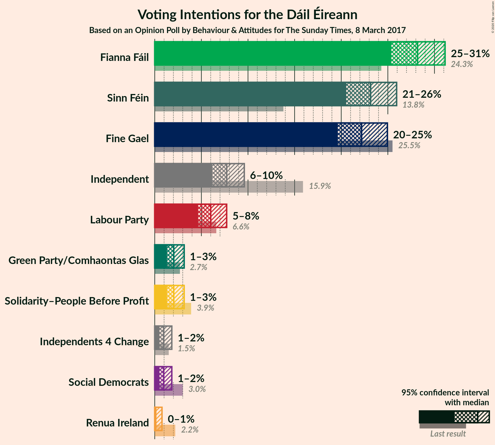
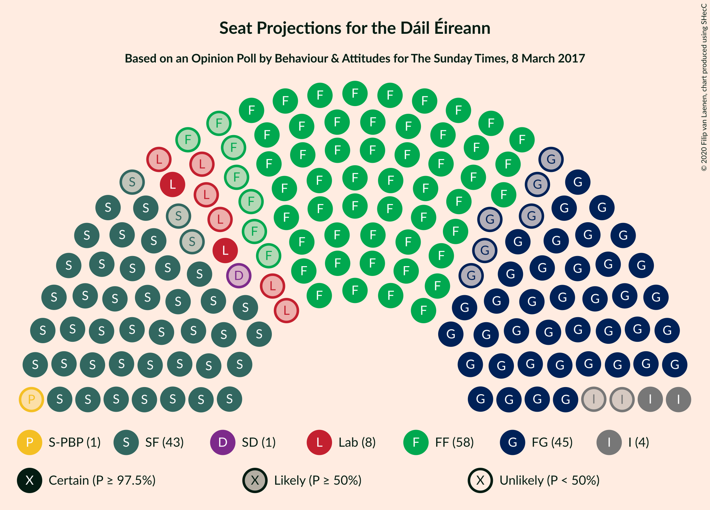
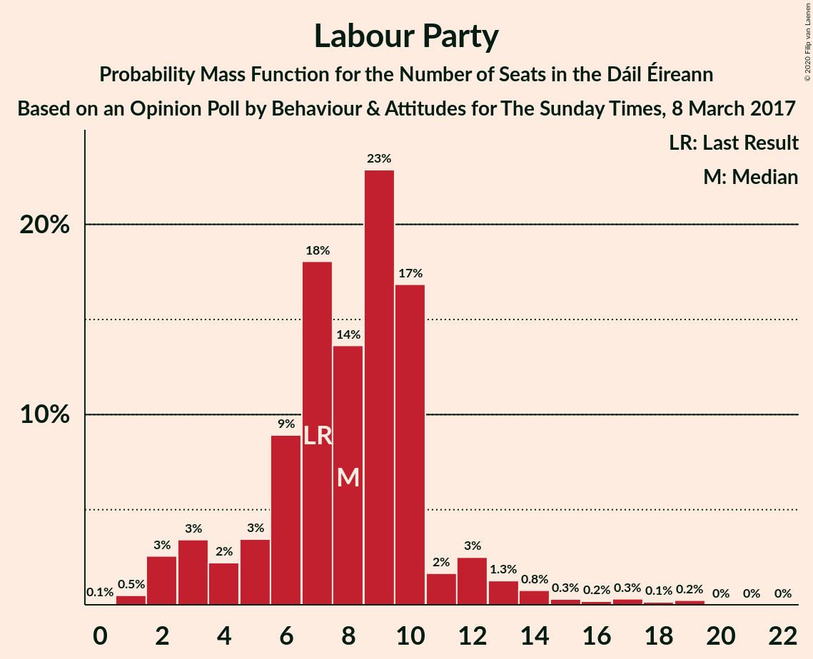
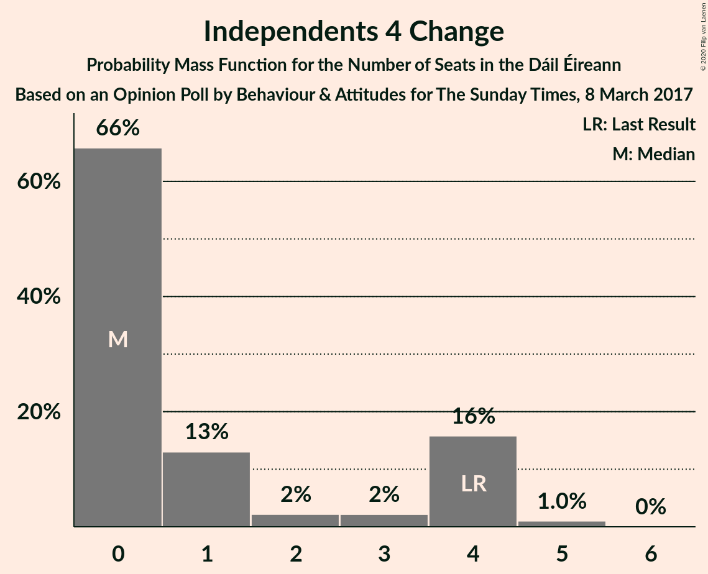
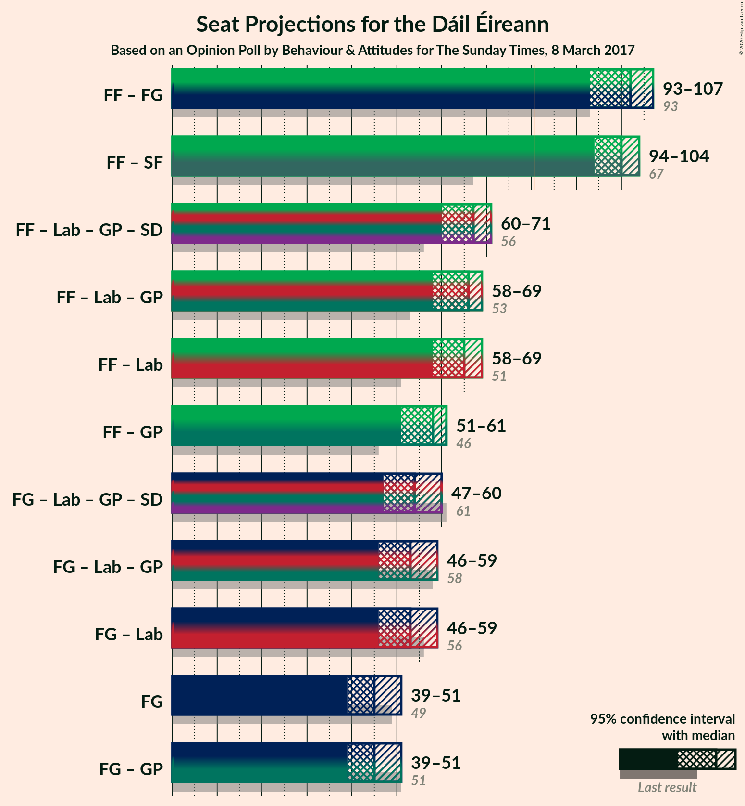
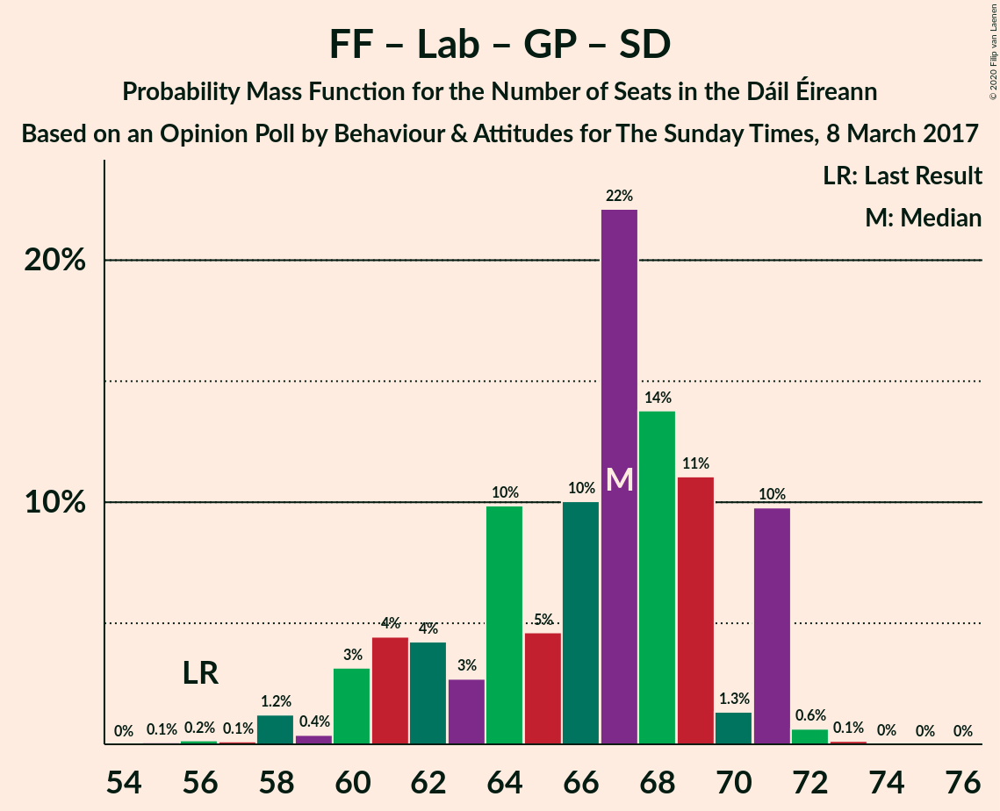
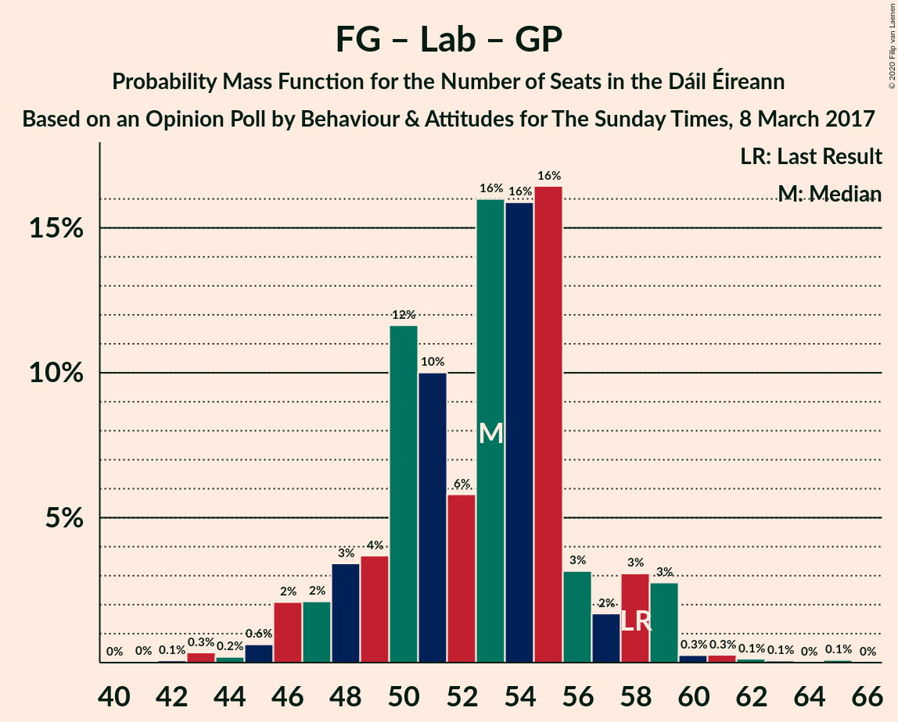

# Opinion Poll by Behaviour & Attitudes for The Sunday Times, 8 March 2017

<a href="#voting-intentions">Voting Intentions</a> | <a href="#seats">Seats</a> | <a href="#coalitions">Coalitions</a> | <a href="#technical-information">Technical Information</a>

## Voting Intentions

### Confidence Intervals

| Party | Last Result | Poll Result | 80% Confidence Interval | 90% Confidence Interval | 95% Confidence Interval | 99% Confidence Interval |
|:-----:|:-----------:|:-----------:|:-----------------------:|:-----------------------:|:-----------------------:|:-----------------------:|
| Fianna Fáil | 24.3% | 28.2% | 26.3–30.1% |25.8–30.7% |25.4–31.1% |24.5–32.1% |
| Sinn Féin | 13.8% | 23.1% | 21.4–25.0% |20.9–25.5% |20.5–25.9% |19.7–26.8% |
| Fine Gael | 25.5% | 22.2% | 20.5–24.0% |20.0–24.5% |19.6–25.0% |18.8–25.8% |
| Independent | 15.9% | 7.7% | 6.7–8.9% |6.4–9.3% |6.2–9.6% |5.7–10.2% |
| Labour Party | 6.6% | 6.0% | 5.1–7.1% |4.8–7.4% |4.6–7.7% |4.3–8.3% |
| Solidarity–People Before Profit | 3.9% | 2.0% | 1.6–2.8% |1.4–3.0% |1.3–3.2% |1.1–3.6% |
| Green Party/Comhaontas Glas | 2.7% | 2.0% | 1.6–2.8% |1.4–3.0% |1.3–3.2% |1.1–3.6% |
| Social Democrats | 3.0% | 1.0% | 0.7–1.5% |0.6–1.7% |0.5–1.8% |0.4–2.1% |
| Independents 4 Change | 1.5% | 1.0% | 0.7–1.5% |0.6–1.7% |0.5–1.8% |0.4–2.1% |
| Renua Ireland | 2.2% | 0.2% | 0.1–0.6% |0.1–0.7% |0.1–0.8% |0.0–1.0% |

*Note:* The poll result column reflects the actual value used in the calculations. Published results may vary slightly, and in addition be rounded to fewer digits.

## Seats

### Confidence Intervals

| Party | Last Result | Median | 80% Confidence Interval | 90% Confidence Interval | 95% Confidence Interval | 99% Confidence Interval |
|:-----:|:-----------:|:------:|:-----------------------:|:-----------------------:|:-----------------------:|:-----------------------:|
| <a href="#fianna-fáil">Fianna Fáil</a> | 44 | 58 | 53–59 |52–60 |51–60 |48–61 |
| <a href="#sinn-féin">Sinn Féin</a> | 23 | 43 | 41–46 |40–48 |40–49 |39–50 |
| <a href="#fine-gael">Fine Gael</a> | 49 | 45 | 41–47 |40–50 |39–51 |36–52 |
| <a href="#independent">Independent</a> | 19 | 4 | 2–5 |2–7 |2–7 |2–8 |
| <a href="#labour-party">Labour Party</a> | 7 | 8 | 5–10 |3–12 |2–13 |1–17 |
| <a href="#solidarity–people-before-profit">Solidarity–People Before Profit</a> | 6 | 1 | 0–3 |0–3 |0–5 |0–5 |
| <a href="#green-party/comhaontas-glas">Green Party/Comhaontas Glas</a> | 2 | 0 | 0–1 |0–1 |0–2 |0–2 |
| <a href="#social-democrats">Social Democrats</a> | 3 | 1 | 0–3 |0–3 |0–3 |0–3 |
| <a href="#independents-4-change">Independents 4 Change</a> | 4 | 0 | 0–4 |0–4 |0–4 |0–5 |
| <a href="#renua-ireland">Renua Ireland</a> | 0 | 0 | 0 |0 |0 |0 |

### Fianna Fáil

*For a full overview of the results for this party, see the [Fianna Fáil](party-fiannafáil.html) page.*

| Number of Seats | Probability | Accumulated | Special Marks |
|:---------------:|:-----------:|:-----------:|:-------------:|
| 44 | 0% | 100% | Last Result |
| 45 | 0% | 99.9% |  |
| 46 | 0.2% | 99.9% |  |
| 47 | 0.1% | 99.7% |  |
| 48 | 0.1% | 99.6% |  |
| 49 | 0.5% | 99.4% |  |
| 50 | 0.5% | 99.0% |  |
| 51 | 2% | 98% |  |
| 52 | 3% | 97% |  |
| 53 | 4% | 93% |  |
| 54 | 3% | 89% |  |
| 55 | 9% | 86% |  |
| 56 | 12% | 77% |  |
| 57 | 12% | 65% |  |
| 58 | 38% | 53% | Median |
| 59 | 10% | 15% |  |
| 60 | 4% | 5% |  |
| 61 | 2% | 2% |  |
| 62 | 0.1% | 0.1% |  |
| 63 | 0% | 0% |  |

### Sinn Féin

*For a full overview of the results for this party, see the [Sinn Féin](party-sinnféin.html) page.*

| Number of Seats | Probability | Accumulated | Special Marks |
|:---------------:|:-----------:|:-----------:|:-------------:|
| 23 | 0% | 100% | Last Result |
| 24 | 0% | 100% |  |
| 25 | 0% | 100% |  |
| 26 | 0% | 100% |  |
| 27 | 0% | 100% |  |
| 28 | 0% | 100% |  |
| 29 | 0% | 100% |  |
| 30 | 0% | 100% |  |
| 31 | 0% | 100% |  |
| 32 | 0% | 100% |  |
| 33 | 0% | 100% |  |
| 34 | 0% | 100% |  |
| 35 | 0% | 100% |  |
| 36 | 0% | 100% |  |
| 37 | 0% | 100% |  |
| 38 | 0.2% | 100% |  |
| 39 | 1.1% | 99.7% |  |
| 40 | 8% | 98.6% |  |
| 41 | 7% | 90% |  |
| 42 | 19% | 84% |  |
| 43 | 15% | 65% | Median |
| 44 | 28% | 50% |  |
| 45 | 9% | 21% |  |
| 46 | 6% | 12% |  |
| 47 | 0.5% | 6% |  |
| 48 | 2% | 6% |  |
| 49 | 3% | 3% |  |
| 50 | 0.8% | 0.8% |  |
| 51 | 0% | 0% |  |

### Fine Gael

*For a full overview of the results for this party, see the [Fine Gael](party-finegael.html) page.*

| Number of Seats | Probability | Accumulated | Special Marks |
|:---------------:|:-----------:|:-----------:|:-------------:|
| 33 | 0.1% | 100% |  |
| 34 | 0.1% | 99.9% |  |
| 35 | 0.1% | 99.8% |  |
| 36 | 0.5% | 99.7% |  |
| 37 | 0.8% | 99.2% |  |
| 38 | 0.7% | 98% |  |
| 39 | 2% | 98% |  |
| 40 | 3% | 96% |  |
| 41 | 5% | 93% |  |
| 42 | 10% | 88% |  |
| 43 | 15% | 78% |  |
| 44 | 11% | 63% |  |
| 45 | 24% | 52% | Median |
| 46 | 15% | 28% |  |
| 47 | 3% | 13% |  |
| 48 | 3% | 10% |  |
| 49 | 2% | 7% | Last Result |
| 50 | 2% | 5% |  |
| 51 | 2% | 3% |  |
| 52 | 1.2% | 2% |  |
| 53 | 0.2% | 0.4% |  |
| 54 | 0.1% | 0.1% |  |
| 55 | 0% | 0% |  |

### Independent

*For a full overview of the results for this party, see the [Independent](party-independent.html) page.*

| Number of Seats | Probability | Accumulated | Special Marks |
|:---------------:|:-----------:|:-----------:|:-------------:|
| 1 | 0.1% | 100% |  |
| 2 | 10% | 99.9% |  |
| 3 | 26% | 90% |  |
| 4 | 48% | 64% | Median |
| 5 | 6% | 15% |  |
| 6 | 4% | 9% |  |
| 7 | 4% | 6% |  |
| 8 | 2% | 2% |  |
| 9 | 0.3% | 0.4% |  |
| 10 | 0.1% | 0.2% |  |
| 11 | 0.1% | 0.1% |  |
| 12 | 0% | 0% |  |
| 13 | 0% | 0% |  |
| 14 | 0% | 0% |  |
| 15 | 0% | 0% |  |
| 16 | 0% | 0% |  |
| 17 | 0% | 0% |  |
| 18 | 0% | 0% |  |
| 19 | 0% | 0% | Last Result |

### Labour Party

*For a full overview of the results for this party, see the [Labour Party](party-labourparty.html) page.*

| Number of Seats | Probability | Accumulated | Special Marks |
|:---------------:|:-----------:|:-----------:|:-------------:|
| 0 | 0.1% | 100% |  |
| 1 | 0.5% | 99.9% |  |
| 2 | 3% | 99.4% |  |
| 3 | 3% | 97% |  |
| 4 | 2% | 93% |  |
| 5 | 3% | 91% |  |
| 6 | 9% | 88% |  |
| 7 | 18% | 79% | Last Result |
| 8 | 14% | 61% | Median |
| 9 | 23% | 47% |  |
| 10 | 17% | 24% |  |
| 11 | 2% | 7% |  |
| 12 | 3% | 6% |  |
| 13 | 1.3% | 3% |  |
| 14 | 0.8% | 2% |  |
| 15 | 0.3% | 1.2% |  |
| 16 | 0.2% | 0.9% |  |
| 17 | 0.3% | 0.8% |  |
| 18 | 0.1% | 0.4% |  |
| 19 | 0.2% | 0.3% |  |
| 20 | 0% | 0.1% |  |
| 21 | 0% | 0% |  |

### Solidarity–People Before Profit

*For a full overview of the results for this party, see the [Solidarity–People Before Profit](party-solidarity–peoplebeforeprofit.html) page.*

| Number of Seats | Probability | Accumulated | Special Marks |
|:---------------:|:-----------:|:-----------:|:-------------:|
| 0 | 49% | 100% |  |
| 1 | 9% | 51% | Median |
| 2 | 25% | 42% |  |
| 3 | 12% | 17% |  |
| 4 | 2% | 5% |  |
| 5 | 3% | 3% |  |
| 6 | 0.1% | 0.1% | Last Result |
| 7 | 0% | 0% |  |

### Green Party/Comhaontas Glas

*For a full overview of the results for this party, see the [Green Party/Comhaontas Glas](party-greenpartycomhaontasglas.html) page.*

| Number of Seats | Probability | Accumulated | Special Marks |
|:---------------:|:-----------:|:-----------:|:-------------:|
| 0 | 66% | 100% | Median |
| 1 | 30% | 34% |  |
| 2 | 3% | 3% | Last Result |
| 3 | 0% | 0% |  |

### Social Democrats

*For a full overview of the results for this party, see the [Social Democrats](party-socialdemocrats.html) page.*

| Number of Seats | Probability | Accumulated | Special Marks |
|:---------------:|:-----------:|:-----------:|:-------------:|
| 0 | 19% | 100% |  |
| 1 | 62% | 81% | Median |
| 2 | 2% | 19% |  |
| 3 | 16% | 17% | Last Result |
| 4 | 0.4% | 0.4% |  |
| 5 | 0% | 0% |  |

### Independents 4 Change

*For a full overview of the results for this party, see the [Independents 4 Change](party-independents4change.html) page.*

| Number of Seats | Probability | Accumulated | Special Marks |
|:---------------:|:-----------:|:-----------:|:-------------:|
| 0 | 66% | 100% | Median |
| 1 | 13% | 34% |  |
| 2 | 2% | 21% |  |
| 3 | 2% | 19% |  |
| 4 | 16% | 17% | Last Result |
| 5 | 1.0% | 1.0% |  |
| 6 | 0% | 0% |  |

### Renua Ireland

*For a full overview of the results for this party, see the [Renua Ireland](party-renuaireland.html) page.*

| Number of Seats | Probability | Accumulated | Special Marks |
|:---------------:|:-----------:|:-----------:|:-------------:|
| 0 | 100% | 100% | Last Result, Median |

## Coalitions

### Confidence Intervals

| Coalition | Last Result | Median | Majority? | 80% Confidence Interval | 90% Confidence Interval | 95% Confidence Interval | 99% Confidence Interval |
|:---------:|:-----------:|:------:|:---------:|:-----------------------:|:-----------------------:|:-----------------------:|:-----------------------:|
| Fianna Fáil – Fine Gael | 93 | 102 | 100% | 97–104 | 95–106 | 93–107 | 90–108 |
| Fianna Fáil – Sinn Féin | 67 | 100 | 100% | 97–103 | 95–103 | 94–104 | 92–106 |
| Fianna Fáil – Labour Party – Green Party/Comhaontas Glas – Social Democrats | 56 | 67 | 0% | 62–71 | 60–71 | 60–71 | 58–72 |
| Fianna Fáil – Labour Party – Green Party/Comhaontas Glas | 53 | 66 | 0% | 60–68 | 59–68 | 58–69 | 57–70 |
| Fianna Fáil – Labour Party | 51 | 65 | 0% | 60–68 | 59–68 | 58–69 | 56–70 |
| Fianna Fáil – Green Party/Comhaontas Glas | 46 | 58 | 0% | 54–59 | 52–60 | 51–61 | 48–62 |
| Fine Gael – Labour Party – Green Party/Comhaontas Glas – Social Democrats | 61 | 54 | 0% | 50–58 | 48–59 | 47–60 | 45–62 |
| Fine Gael – Labour Party – Green Party/Comhaontas Glas | 58 | 53 | 0% | 49–56 | 47–58 | 46–59 | 43–61 |
| Fine Gael – Labour Party | 56 | 53 | 0% | 48–56 | 47–58 | 46–59 | 43–61 |
| Fine Gael | 49 | 45 | 0% | 41–47 | 40–50 | 39–51 | 36–52 |
| Fine Gael – Green Party/Comhaontas Glas | 51 | 45 | 0% | 41–48 | 40–50 | 39–51 | 36–52 |

### Fianna Fáil – Fine Gael

| Number of Seats | Probability | Accumulated | Special Marks |
|:---------------:|:-----------:|:-----------:|:-------------:|
| 87 | 0.1% | 100% |  |
| 88 | 0.3% | 99.9% |  |
| 89 | 0.1% | 99.6% |  |
| 90 | 0.2% | 99.5% |  |
| 91 | 0.6% | 99.4% |  |
| 92 | 0.5% | 98.8% |  |
| 93 | 1.0% | 98% | Last Result |
| 94 | 1.4% | 97% |  |
| 95 | 2% | 96% |  |
| 96 | 2% | 94% |  |
| 97 | 5% | 92% |  |
| 98 | 6% | 87% |  |
| 99 | 8% | 81% |  |
| 100 | 9% | 73% |  |
| 101 | 12% | 64% |  |
| 102 | 11% | 52% |  |
| 103 | 19% | 41% | Median |
| 104 | 14% | 22% |  |
| 105 | 2% | 7% |  |
| 106 | 2% | 5% |  |
| 107 | 3% | 4% |  |
| 108 | 0.8% | 0.9% |  |
| 109 | 0.1% | 0.1% |  |
| 110 | 0% | 0% |  |

### Fianna Fáil – Sinn Féin

| Number of Seats | Probability | Accumulated | Special Marks |
|:---------------:|:-----------:|:-----------:|:-------------:|
| 67 | 0% | 100% | Last Result |
| 68 | 0% | 100% |  |
| 69 | 0% | 100% |  |
| 70 | 0% | 100% |  |
| 71 | 0% | 100% |  |
| 72 | 0% | 100% |  |
| 73 | 0% | 100% |  |
| 74 | 0% | 100% |  |
| 75 | 0% | 100% |  |
| 76 | 0% | 100% |  |
| 77 | 0% | 100% |  |
| 78 | 0% | 100% |  |
| 79 | 0% | 100% |  |
| 80 | 0% | 100% |  |
| 81 | 0% | 100% | Majority |
| 82 | 0% | 100% |  |
| 83 | 0% | 100% |  |
| 84 | 0% | 100% |  |
| 85 | 0% | 100% |  |
| 86 | 0% | 100% |  |
| 87 | 0% | 100% |  |
| 88 | 0% | 100% |  |
| 89 | 0.1% | 99.9% |  |
| 90 | 0.1% | 99.9% |  |
| 91 | 0.2% | 99.8% |  |
| 92 | 0.4% | 99.6% |  |
| 93 | 0.3% | 99.2% |  |
| 94 | 2% | 98.9% |  |
| 95 | 2% | 97% |  |
| 96 | 3% | 95% |  |
| 97 | 5% | 91% |  |
| 98 | 10% | 87% |  |
| 99 | 10% | 77% |  |
| 100 | 25% | 67% |  |
| 101 | 5% | 42% | Median |
| 102 | 21% | 37% |  |
| 103 | 12% | 16% |  |
| 104 | 3% | 5% |  |
| 105 | 1.0% | 2% |  |
| 106 | 0.9% | 1.1% |  |
| 107 | 0.1% | 0.2% |  |
| 108 | 0.1% | 0.1% |  |
| 109 | 0% | 0% |  |

### Fianna Fáil – Labour Party – Green Party/Comhaontas Glas – Social Democrats

| Number of Seats | Probability | Accumulated | Special Marks |
|:---------------:|:-----------:|:-----------:|:-------------:|
| 55 | 0.1% | 100% |  |
| 56 | 0.2% | 99.9% | Last Result |
| 57 | 0.1% | 99.7% |  |
| 58 | 1.2% | 99.6% |  |
| 59 | 0.4% | 98% |  |
| 60 | 3% | 98% |  |
| 61 | 4% | 95% |  |
| 62 | 4% | 90% |  |
| 63 | 3% | 86% |  |
| 64 | 10% | 83% |  |
| 65 | 5% | 74% |  |
| 66 | 10% | 69% |  |
| 67 | 22% | 59% | Median |
| 68 | 14% | 37% |  |
| 69 | 11% | 23% |  |
| 70 | 1.3% | 12% |  |
| 71 | 10% | 11% |  |
| 72 | 0.6% | 0.8% |  |
| 73 | 0.1% | 0.2% |  |
| 74 | 0% | 0.1% |  |
| 75 | 0% | 0% |  |

### Fianna Fáil – Labour Party – Green Party/Comhaontas Glas

| Number of Seats | Probability | Accumulated | Special Marks |
|:---------------:|:-----------:|:-----------:|:-------------:|
| 52 | 0% | 100% |  |
| 53 | 0% | 99.9% | Last Result |
| 54 | 0% | 99.9% |  |
| 55 | 0.2% | 99.9% |  |
| 56 | 0.2% | 99.7% |  |
| 57 | 1.4% | 99.5% |  |
| 58 | 1.0% | 98% |  |
| 59 | 4% | 97% |  |
| 60 | 4% | 94% |  |
| 61 | 4% | 89% |  |
| 62 | 3% | 86% |  |
| 63 | 10% | 83% |  |
| 64 | 6% | 73% |  |
| 65 | 8% | 68% |  |
| 66 | 18% | 60% | Median |
| 67 | 17% | 41% |  |
| 68 | 20% | 24% |  |
| 69 | 2% | 4% |  |
| 70 | 1.4% | 2% |  |
| 71 | 0.1% | 0.2% |  |
| 72 | 0% | 0.1% |  |
| 73 | 0% | 0% |  |

### Fianna Fáil – Labour Party

| Number of Seats | Probability | Accumulated | Special Marks |
|:---------------:|:-----------:|:-----------:|:-------------:|
| 51 | 0% | 100% | Last Result |
| 52 | 0% | 100% |  |
| 53 | 0% | 99.9% |  |
| 54 | 0% | 99.9% |  |
| 55 | 0.2% | 99.9% |  |
| 56 | 0.3% | 99.7% |  |
| 57 | 1.4% | 99.4% |  |
| 58 | 2% | 98% |  |
| 59 | 4% | 96% |  |
| 60 | 4% | 92% |  |
| 61 | 3% | 88% |  |
| 62 | 10% | 85% |  |
| 63 | 5% | 75% |  |
| 64 | 5% | 71% |  |
| 65 | 20% | 65% |  |
| 66 | 8% | 46% | Median |
| 67 | 16% | 38% |  |
| 68 | 19% | 22% |  |
| 69 | 2% | 3% |  |
| 70 | 1.2% | 1.3% |  |
| 71 | 0.1% | 0.2% |  |
| 72 | 0% | 0.1% |  |
| 73 | 0% | 0% |  |

### Fianna Fáil – Green Party/Comhaontas Glas

| Number of Seats | Probability | Accumulated | Special Marks |
|:---------------:|:-----------:|:-----------:|:-------------:|
| 44 | 0% | 100% |  |
| 45 | 0% | 99.9% |  |
| 46 | 0.2% | 99.9% | Last Result |
| 47 | 0.1% | 99.7% |  |
| 48 | 0.1% | 99.6% |  |
| 49 | 0.5% | 99.5% |  |
| 50 | 0.3% | 99.0% |  |
| 51 | 1.3% | 98.7% |  |
| 52 | 4% | 97% |  |
| 53 | 3% | 93% |  |
| 54 | 3% | 90% |  |
| 55 | 9% | 87% |  |
| 56 | 7% | 78% |  |
| 57 | 15% | 72% |  |
| 58 | 27% | 56% | Median |
| 59 | 21% | 30% |  |
| 60 | 5% | 9% |  |
| 61 | 3% | 4% |  |
| 62 | 1.3% | 1.5% |  |
| 63 | 0.2% | 0.2% |  |
| 64 | 0% | 0% |  |

### Fine Gael – Labour Party – Green Party/Comhaontas Glas – Social Democrats

| Number of Seats | Probability | Accumulated | Special Marks |
|:---------------:|:-----------:|:-----------:|:-------------:|
| 41 | 0% | 100% |  |
| 42 | 0% | 99.9% |  |
| 43 | 0.1% | 99.9% |  |
| 44 | 0.2% | 99.8% |  |
| 45 | 0.3% | 99.5% |  |
| 46 | 1.0% | 99.2% |  |
| 47 | 2% | 98% |  |
| 48 | 2% | 96% |  |
| 49 | 4% | 95% |  |
| 50 | 4% | 91% |  |
| 51 | 9% | 87% |  |
| 52 | 10% | 78% |  |
| 53 | 10% | 68% |  |
| 54 | 13% | 58% | Median |
| 55 | 17% | 45% |  |
| 56 | 11% | 28% |  |
| 57 | 2% | 17% |  |
| 58 | 9% | 15% |  |
| 59 | 2% | 6% |  |
| 60 | 2% | 4% |  |
| 61 | 0.8% | 2% | Last Result |
| 62 | 1.0% | 1.4% |  |
| 63 | 0.2% | 0.4% |  |
| 64 | 0.1% | 0.3% |  |
| 65 | 0% | 0.1% |  |
| 66 | 0.1% | 0.1% |  |
| 67 | 0% | 0% |  |

### Fine Gael – Labour Party – Green Party/Comhaontas Glas

| Number of Seats | Probability | Accumulated | Special Marks |
|:---------------:|:-----------:|:-----------:|:-------------:|
| 40 | 0% | 100% |  |
| 41 | 0% | 99.9% |  |
| 42 | 0.1% | 99.9% |  |
| 43 | 0.3% | 99.8% |  |
| 44 | 0.2% | 99.5% |  |
| 45 | 0.6% | 99.3% |  |
| 46 | 2% | 98.6% |  |
| 47 | 2% | 97% |  |
| 48 | 3% | 94% |  |
| 49 | 4% | 91% |  |
| 50 | 12% | 87% |  |
| 51 | 10% | 76% |  |
| 52 | 6% | 66% |  |
| 53 | 16% | 60% | Median |
| 54 | 16% | 44% |  |
| 55 | 16% | 28% |  |
| 56 | 3% | 12% |  |
| 57 | 2% | 8% |  |
| 58 | 3% | 7% | Last Result |
| 59 | 3% | 4% |  |
| 60 | 0.3% | 0.8% |  |
| 61 | 0.3% | 0.6% |  |
| 62 | 0.1% | 0.3% |  |
| 63 | 0.1% | 0.2% |  |
| 64 | 0% | 0.1% |  |
| 65 | 0.1% | 0.1% |  |
| 66 | 0% | 0% |  |

### Fine Gael – Labour Party

| Number of Seats | Probability | Accumulated | Special Marks |
|:---------------:|:-----------:|:-----------:|:-------------:|
| 39 | 0% | 100% |  |
| 40 | 0% | 99.9% |  |
| 41 | 0.1% | 99.9% |  |
| 42 | 0.1% | 99.8% |  |
| 43 | 0.5% | 99.7% |  |
| 44 | 0.4% | 99.3% |  |
| 45 | 1.3% | 98.8% |  |
| 46 | 2% | 98% |  |
| 47 | 3% | 96% |  |
| 48 | 5% | 93% |  |
| 49 | 7% | 88% |  |
| 50 | 8% | 81% |  |
| 51 | 10% | 73% |  |
| 52 | 7% | 63% |  |
| 53 | 24% | 56% | Median |
| 54 | 6% | 33% |  |
| 55 | 16% | 27% |  |
| 56 | 3% | 11% | Last Result |
| 57 | 2% | 8% |  |
| 58 | 3% | 6% |  |
| 59 | 2% | 3% |  |
| 60 | 0.3% | 0.8% |  |
| 61 | 0.2% | 0.5% |  |
| 62 | 0.1% | 0.3% |  |
| 63 | 0.1% | 0.2% |  |
| 64 | 0% | 0.1% |  |
| 65 | 0.1% | 0.1% |  |
| 66 | 0% | 0% |  |

### Fine Gael

| Number of Seats | Probability | Accumulated | Special Marks |
|:---------------:|:-----------:|:-----------:|:-------------:|
| 33 | 0.1% | 100% |  |
| 34 | 0.1% | 99.9% |  |
| 35 | 0.1% | 99.8% |  |
| 36 | 0.5% | 99.7% |  |
| 37 | 0.8% | 99.2% |  |
| 38 | 0.7% | 98% |  |
| 39 | 2% | 98% |  |
| 40 | 3% | 96% |  |
| 41 | 5% | 93% |  |
| 42 | 10% | 88% |  |
| 43 | 15% | 78% |  |
| 44 | 11% | 63% |  |
| 45 | 24% | 52% | Median |
| 46 | 15% | 28% |  |
| 47 | 3% | 13% |  |
| 48 | 3% | 10% |  |
| 49 | 2% | 7% | Last Result |
| 50 | 2% | 5% |  |
| 51 | 2% | 3% |  |
| 52 | 1.2% | 2% |  |
| 53 | 0.2% | 0.4% |  |
| 54 | 0.1% | 0.1% |  |
| 55 | 0% | 0% |  |

### Fine Gael – Green Party/Comhaontas Glas

| Number of Seats | Probability | Accumulated | Special Marks |
|:---------------:|:-----------:|:-----------:|:-------------:|
| 33 | 0% | 100% |  |
| 34 | 0.1% | 99.9% |  |
| 35 | 0.1% | 99.8% |  |
| 36 | 0.4% | 99.7% |  |
| 37 | 0.8% | 99.3% |  |
| 38 | 0.3% | 98% |  |
| 39 | 1.4% | 98% |  |
| 40 | 2% | 97% |  |
| 41 | 5% | 94% |  |
| 42 | 8% | 89% |  |
| 43 | 12% | 82% |  |
| 44 | 15% | 69% |  |
| 45 | 24% | 55% | Median |
| 46 | 6% | 31% |  |
| 47 | 13% | 25% |  |
| 48 | 4% | 12% |  |
| 49 | 2% | 8% |  |
| 50 | 2% | 6% |  |
| 51 | 2% | 4% | Last Result |
| 52 | 1.4% | 2% |  |
| 53 | 0.2% | 0.4% |  |
| 54 | 0.1% | 0.2% |  |
| 55 | 0% | 0% |  |

## Technical Information

### Opinion Poll

+ **Polling firm:** Behaviour & Attitudes
+ **Commissioner(s):** The Sunday Times
+ **Fieldwork period:** 8 March 2017

### Calculations

+ **Sample size:** 934
+ **Simulations done:** 1,048,575
+ **Error estimate:** 1.02%

