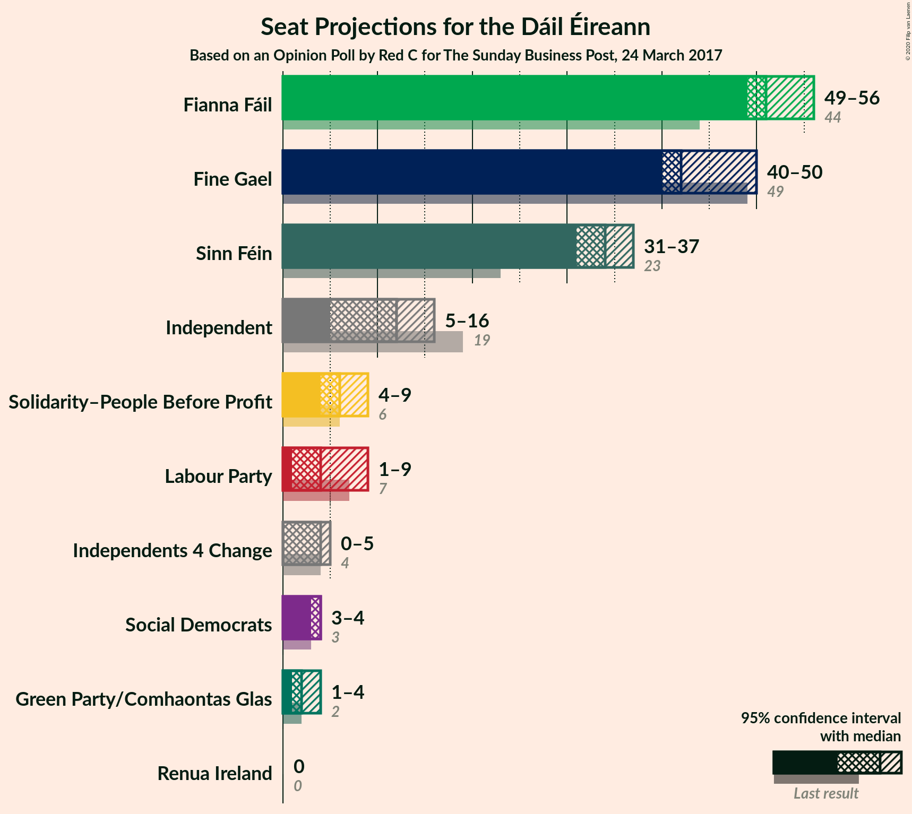
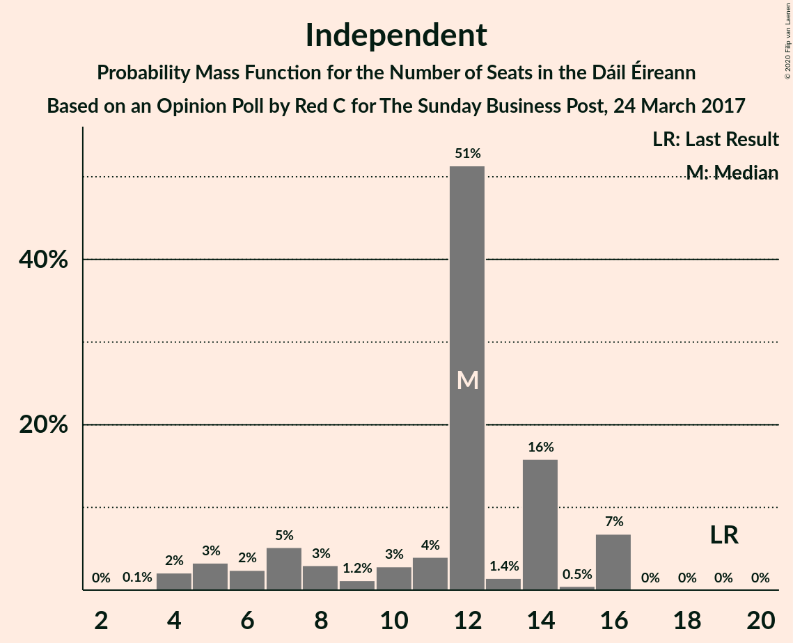
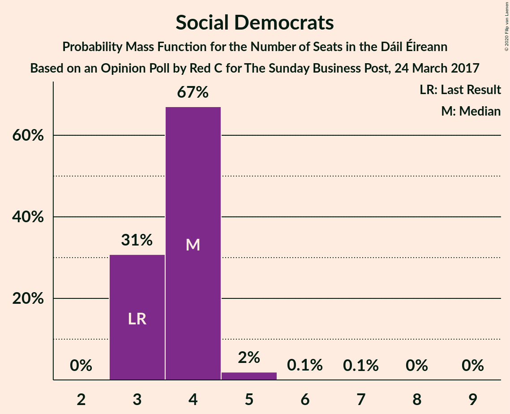
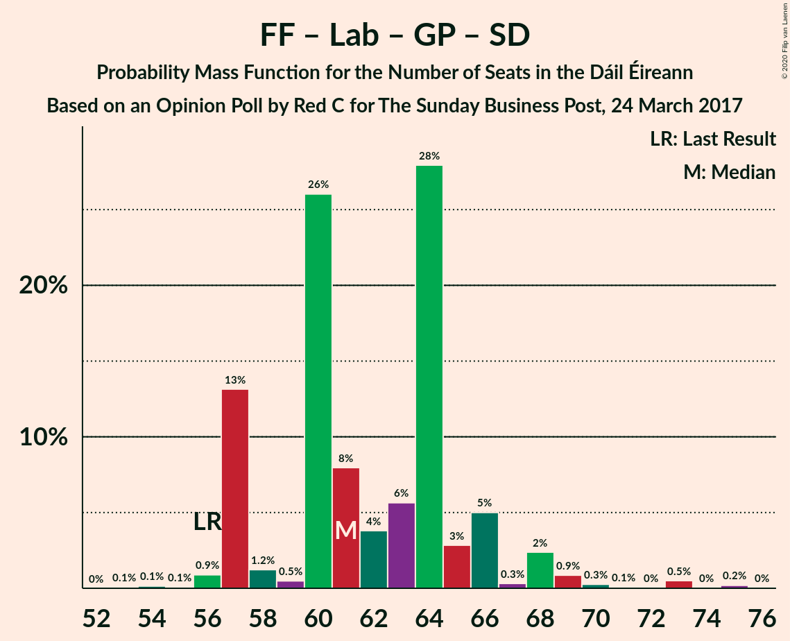
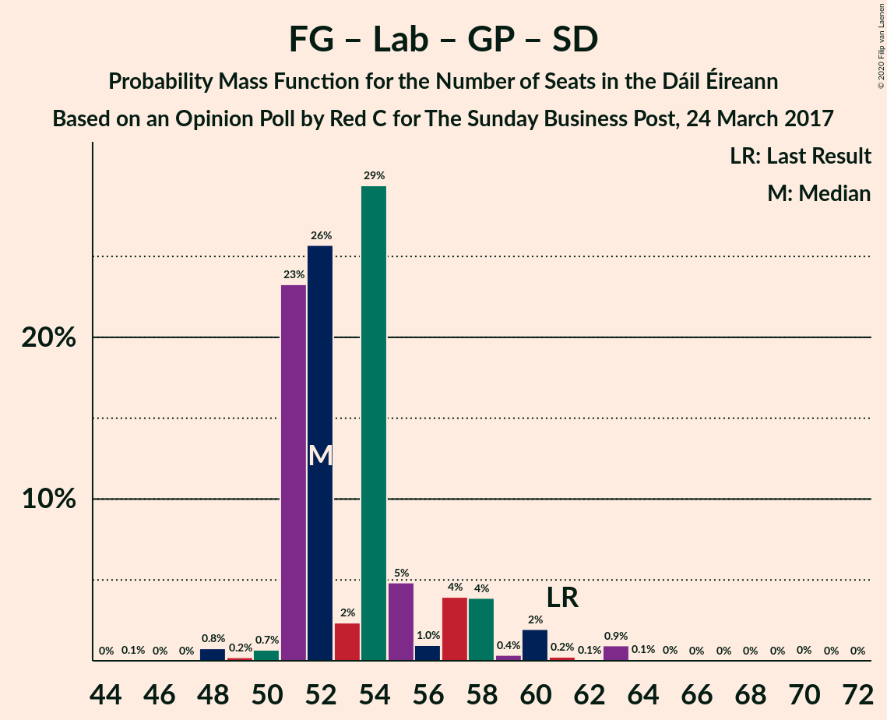
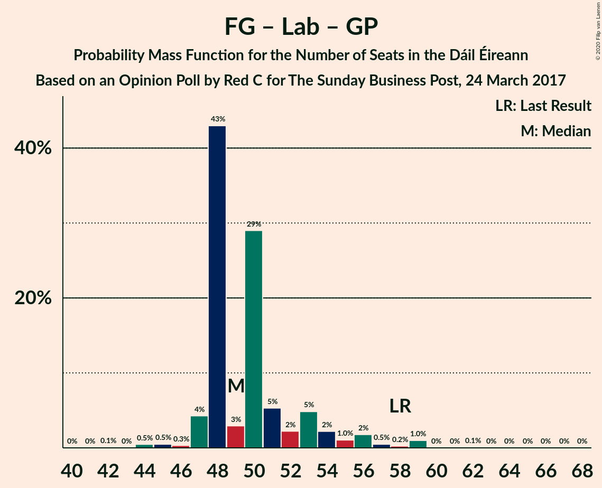

# Opinion Poll by Red C for The Sunday Business Post, 24 March 2017

<a href="#voting-intentions">Voting Intentions</a> | <a href="#seats">Seats</a> | <a href="#coalitions">Coalitions</a> | <a href="#technical-information">Technical Information</a>

## Voting Intentions

### Confidence Intervals

| Party | Last Result | Poll Result | 80% Confidence Interval | 90% Confidence Interval | 95% Confidence Interval | 99% Confidence Interval |
|:-----:|:-----------:|:-----------:|:-----------------------:|:-----------------------:|:-----------------------:|:-----------------------:|
| Fianna Fáil | 24.3% | 25.9% | 24.2–27.7% |23.7–28.3% |23.3–28.7% |22.5–29.6% |
| Fine Gael | 25.5% | 23.9% | 22.2–25.7% |21.8–26.2% |21.4–26.6% |20.6–27.5% |
| Sinn Féin | 13.8% | 16.9% | 15.5–18.5% |15.1–19.0% |14.7–19.4% |14.1–20.2% |
| Independent | 15.9% | 11.0% | 9.8–12.3% |9.4–12.7% |9.2–13.0% |8.6–13.7% |
| Labour Party | 6.6% | 6.0% | 5.1–7.1% |4.9–7.4% |4.7–7.6% |4.3–8.2% |
| Solidarity–People Before Profit | 3.9% | 4.0% | 3.3–4.9% |3.1–5.2% |2.9–5.4% |2.6–5.9% |
| Green Party/Comhaontas Glas | 2.7% | 4.0% | 3.3–4.9% |3.1–5.2% |2.9–5.4% |2.6–5.9% |
| Social Democrats | 3.0% | 3.0% | 2.4–3.8% |2.2–4.0% |2.1–4.2% |1.8–4.7% |
| Independents 4 Change | 1.5% | 1.4% | 1.0–2.0% |0.9–2.2% |0.8–2.3% |0.7–2.7% |
| Renua Ireland | 2.2% | 0.3% | 0.2–0.7% |0.1–0.8% |0.1–0.9% |0.1–1.1% |

*Note:* The poll result column reflects the actual value used in the calculations. Published results may vary slightly, and in addition be rounded to fewer digits.

## Seats

### Confidence Intervals

| Party | Last Result | Median | 80% Confidence Interval | 90% Confidence Interval | 95% Confidence Interval | 99% Confidence Interval |
|:-----:|:-----------:|:------:|:-----------------------:|:-----------------------:|:-----------------------:|:-----------------------:|
| <a href="#fianna-fáil">Fianna Fáil</a> | 44 | 51 | 49–54 |49–56 |49–56 |46–59 |
| <a href="#fine-gael">Fine Gael</a> | 49 | 42 | 41–45 |40–47 |40–50 |38–54 |
| <a href="#sinn-féin">Sinn Féin</a> | 23 | 34 | 33–35 |32–37 |31–37 |28–38 |
| <a href="#independent">Independent</a> | 19 | 12 | 7–14 |5–16 |5–16 |4–16 |
| <a href="#labour-party">Labour Party</a> | 7 | 4 | 3–7 |1–9 |1–9 |1–16 |
| <a href="#solidarity–people-before-profit">Solidarity–People Before Profit</a> | 6 | 6 | 5–8 |5–9 |4–9 |3–10 |
| <a href="#green-party/comhaontas-glas">Green Party/Comhaontas Glas</a> | 2 | 2 | 2–3 |1–4 |1–4 |1–6 |
| <a href="#social-democrats">Social Democrats</a> | 3 | 4 | 3–4 |3–4 |3–4 |3–5 |
| <a href="#independents-4-change">Independents 4 Change</a> | 4 | 4 | 2–5 |0–5 |0–5 |0–5 |
| <a href="#renua-ireland">Renua Ireland</a> | 0 | 0 | 0 |0 |0 |0 |

### Fianna Fáil

*For a full overview of the results for this party, see the [Fianna Fáil](party-fiannafáil.html) page.*

| Number of Seats | Probability | Accumulated | Special Marks |
|:---------------:|:-----------:|:-----------:|:-------------:|
| 39 | 0% | 100% |  |
| 40 | 0% | 99.9% |  |
| 41 | 0% | 99.9% |  |
| 42 | 0% | 99.9% |  |
| 43 | 0.1% | 99.9% |  |
| 44 | 0% | 99.8% | Last Result |
| 45 | 0.1% | 99.8% |  |
| 46 | 0.2% | 99.6% |  |
| 47 | 0.2% | 99.5% |  |
| 48 | 0.3% | 99.3% |  |
| 49 | 14% | 99.0% |  |
| 50 | 30% | 85% |  |
| 51 | 34% | 54% | Median |
| 52 | 5% | 20% |  |
| 53 | 5% | 15% |  |
| 54 | 4% | 10% |  |
| 55 | 0.8% | 6% |  |
| 56 | 4% | 6% |  |
| 57 | 0.3% | 1.4% |  |
| 58 | 0.3% | 1.1% |  |
| 59 | 0.7% | 0.8% |  |
| 60 | 0% | 0.2% |  |
| 61 | 0.2% | 0.2% |  |
| 62 | 0% | 0% |  |

### Fine Gael

*For a full overview of the results for this party, see the [Fine Gael](party-finegael.html) page.*

| Number of Seats | Probability | Accumulated | Special Marks |
|:---------------:|:-----------:|:-----------:|:-------------:|
| 34 | 0.1% | 100% |  |
| 35 | 0.1% | 99.9% |  |
| 36 | 0.1% | 99.8% |  |
| 37 | 0.1% | 99.6% |  |
| 38 | 1.2% | 99.5% |  |
| 39 | 0.4% | 98% |  |
| 40 | 7% | 98% |  |
| 41 | 27% | 91% |  |
| 42 | 29% | 65% | Median |
| 43 | 22% | 36% |  |
| 44 | 0.4% | 13% |  |
| 45 | 6% | 13% |  |
| 46 | 0.3% | 7% |  |
| 47 | 2% | 7% |  |
| 48 | 2% | 5% |  |
| 49 | 0.5% | 3% | Last Result |
| 50 | 0.9% | 3% |  |
| 51 | 0.5% | 2% |  |
| 52 | 0.4% | 1.3% |  |
| 53 | 0% | 1.0% |  |
| 54 | 0.8% | 0.9% |  |
| 55 | 0.1% | 0.2% |  |
| 56 | 0% | 0.1% |  |
| 57 | 0% | 0.1% |  |
| 58 | 0% | 0% |  |

### Sinn Féin

*For a full overview of the results for this party, see the [Sinn Féin](party-sinnféin.html) page.*

| Number of Seats | Probability | Accumulated | Special Marks |
|:---------------:|:-----------:|:-----------:|:-------------:|
| 23 | 0% | 100% | Last Result |
| 24 | 0% | 100% |  |
| 25 | 0.1% | 100% |  |
| 26 | 0% | 99.9% |  |
| 27 | 0% | 99.8% |  |
| 28 | 0.6% | 99.8% |  |
| 29 | 1.2% | 99.2% |  |
| 30 | 0.2% | 98% |  |
| 31 | 1.4% | 98% |  |
| 32 | 3% | 96% |  |
| 33 | 10% | 94% |  |
| 34 | 35% | 84% | Median |
| 35 | 40% | 49% |  |
| 36 | 4% | 9% |  |
| 37 | 4% | 5% |  |
| 38 | 1.0% | 1.3% |  |
| 39 | 0.1% | 0.3% |  |
| 40 | 0% | 0.2% |  |
| 41 | 0.1% | 0.2% |  |
| 42 | 0% | 0% |  |

### Independent

*For a full overview of the results for this party, see the [Independent](party-independent.html) page.*

| Number of Seats | Probability | Accumulated | Special Marks |
|:---------------:|:-----------:|:-----------:|:-------------:|
| 3 | 0.1% | 100% |  |
| 4 | 2% | 99.9% |  |
| 5 | 3% | 98% |  |
| 6 | 2% | 95% |  |
| 7 | 5% | 92% |  |
| 8 | 3% | 87% |  |
| 9 | 1.2% | 84% |  |
| 10 | 3% | 83% |  |
| 11 | 4% | 80% |  |
| 12 | 51% | 76% | Median |
| 13 | 1.4% | 25% |  |
| 14 | 16% | 23% |  |
| 15 | 0.5% | 7% |  |
| 16 | 7% | 7% |  |
| 17 | 0% | 0.1% |  |
| 18 | 0% | 0% |  |
| 19 | 0% | 0% | Last Result |

### Labour Party

*For a full overview of the results for this party, see the [Labour Party](party-labourparty.html) page.*

| Number of Seats | Probability | Accumulated | Special Marks |
|:---------------:|:-----------:|:-----------:|:-------------:|
| 0 | 0.1% | 100% |  |
| 1 | 7% | 99.9% |  |
| 2 | 2% | 93% |  |
| 3 | 18% | 91% |  |
| 4 | 25% | 72% | Median |
| 5 | 2% | 47% |  |
| 6 | 13% | 45% |  |
| 7 | 25% | 33% | Last Result |
| 8 | 2% | 8% |  |
| 9 | 4% | 6% |  |
| 10 | 0.3% | 2% |  |
| 11 | 1.0% | 2% |  |
| 12 | 0.1% | 0.7% |  |
| 13 | 0.1% | 0.6% |  |
| 14 | 0% | 0.5% |  |
| 15 | 0% | 0.5% |  |
| 16 | 0.1% | 0.5% |  |
| 17 | 0.4% | 0.4% |  |
| 18 | 0% | 0% |  |

### Solidarity–People Before Profit

*For a full overview of the results for this party, see the [Solidarity–People Before Profit](party-solidarity–peoplebeforeprofit.html) page.*

| Number of Seats | Probability | Accumulated | Special Marks |
|:---------------:|:-----------:|:-----------:|:-------------:|
| 1 | 0.1% | 100% |  |
| 2 | 0.1% | 99.9% |  |
| 3 | 2% | 99.8% |  |
| 4 | 2% | 98% |  |
| 5 | 39% | 96% |  |
| 6 | 46% | 58% | Last Result, Median |
| 7 | 1.5% | 12% |  |
| 8 | 2% | 10% |  |
| 9 | 7% | 8% |  |
| 10 | 0.7% | 0.7% |  |
| 11 | 0% | 0% |  |

### Green Party/Comhaontas Glas

*For a full overview of the results for this party, see the [Green Party/Comhaontas Glas](party-greenpartycomhaontasglas.html) page.*

| Number of Seats | Probability | Accumulated | Special Marks |
|:---------------:|:-----------:|:-----------:|:-------------:|
| 0 | 0.1% | 100% |  |
| 1 | 5% | 99.9% |  |
| 2 | 82% | 94% | Last Result, Median |
| 3 | 7% | 12% |  |
| 4 | 5% | 6% |  |
| 5 | 0.1% | 1.1% |  |
| 6 | 0.8% | 0.9% |  |
| 7 | 0.2% | 0.2% |  |
| 8 | 0% | 0% |  |

### Social Democrats

*For a full overview of the results for this party, see the [Social Democrats](party-socialdemocrats.html) page.*

| Number of Seats | Probability | Accumulated | Special Marks |
|:---------------:|:-----------:|:-----------:|:-------------:|
| 3 | 31% | 100% | Last Result |
| 4 | 67% | 69% | Median |
| 5 | 2% | 2% |  |
| 6 | 0.1% | 0.3% |  |
| 7 | 0.1% | 0.1% |  |
| 8 | 0% | 0.1% |  |
| 9 | 0% | 0% |  |

### Independents 4 Change

*For a full overview of the results for this party, see the [Independents 4 Change](party-independents4change.html) page.*

| Number of Seats | Probability | Accumulated | Special Marks |
|:---------------:|:-----------:|:-----------:|:-------------:|
| 0 | 6% | 100% |  |
| 1 | 2% | 94% |  |
| 2 | 7% | 92% |  |
| 3 | 0.4% | 85% |  |
| 4 | 40% | 85% | Last Result, Median |
| 5 | 45% | 45% |  |
| 6 | 0% | 0% |  |

### Renua Ireland

*For a full overview of the results for this party, see the [Renua Ireland](party-renuaireland.html) page.*

| Number of Seats | Probability | Accumulated | Special Marks |
|:---------------:|:-----------:|:-----------:|:-------------:|
| 0 | 100% | 100% | Last Result, Median |

## Coalitions

### Confidence Intervals

| Coalition | Last Result | Median | Majority? | 80% Confidence Interval | 90% Confidence Interval | 95% Confidence Interval | 99% Confidence Interval |
|:---------:|:-----------:|:------:|:---------:|:-----------------------:|:-----------------------:|:-----------------------:|:-----------------------:|
| Fianna Fáil – Fine Gael | 93 | 92 | 100% | 92–99 | 90–101 | 90–103 | 87–105 |
| Fianna Fáil – Sinn Féin | 67 | 85 | 99.1% | 84–88 | 83–89 | 83–90 | 80–92 |
| Fianna Fáil – Labour Party – Green Party/Comhaontas Glas – Social Democrats | 56 | 61 | 0% | 57–65 | 57–66 | 57–68 | 56–73 |
| Fianna Fáil – Labour Party – Green Party/Comhaontas Glas | 53 | 58 | 0% | 54–62 | 54–62 | 54–65 | 52–70 |
| Fianna Fáil – Labour Party | 51 | 56 | 0% | 52–59 | 52–60 | 52–63 | 50–68 |
| Fine Gael – Labour Party – Green Party/Comhaontas Glas – Social Democrats | 61 | 52 | 0% | 51–57 | 51–58 | 51–60 | 48–63 |
| Fianna Fáil – Green Party/Comhaontas Glas | 46 | 53 | 0% | 51–57 | 51–57 | 51–58 | 49–60 |
| Fine Gael – Labour Party – Green Party/Comhaontas Glas | 58 | 49 | 0% | 48–53 | 47–54 | 47–56 | 44–59 |
| Fine Gael – Labour Party | 56 | 46 | 0% | 46–51 | 46–52 | 45–53 | 42–57 |
| Fine Gael – Green Party/Comhaontas Glas | 51 | 44 | 0% | 43–48 | 42–50 | 42–53 | 40–56 |
| Fine Gael | 49 | 42 | 0% | 41–45 | 40–47 | 40–50 | 38–54 |

### Fianna Fáil – Fine Gael

| Number of Seats | Probability | Accumulated | Special Marks |
|:---------------:|:-----------:|:-----------:|:-------------:|
| 84 | 0.1% | 100% |  |
| 85 | 0.2% | 99.8% |  |
| 86 | 0.1% | 99.7% |  |
| 87 | 0.1% | 99.6% |  |
| 88 | 0.1% | 99.5% |  |
| 89 | 0.6% | 99.4% |  |
| 90 | 7% | 98.8% |  |
| 91 | 0.5% | 92% |  |
| 92 | 62% | 91% |  |
| 93 | 4% | 29% | Last Result, Median |
| 94 | 7% | 26% |  |
| 95 | 1.0% | 19% |  |
| 96 | 1.3% | 18% |  |
| 97 | 2% | 17% |  |
| 98 | 3% | 14% |  |
| 99 | 4% | 11% |  |
| 100 | 0.7% | 7% |  |
| 101 | 2% | 7% |  |
| 102 | 2% | 5% |  |
| 103 | 0.7% | 3% |  |
| 104 | 0.7% | 2% |  |
| 105 | 1.5% | 2% |  |
| 106 | 0.1% | 0.1% |  |
| 107 | 0% | 0% |  |

### Fianna Fáil – Sinn Féin

| Number of Seats | Probability | Accumulated | Special Marks |
|:---------------:|:-----------:|:-----------:|:-------------:|
| 67 | 0% | 100% | Last Result |
| 68 | 0% | 100% |  |
| 69 | 0% | 100% |  |
| 70 | 0% | 100% |  |
| 71 | 0% | 100% |  |
| 72 | 0% | 100% |  |
| 73 | 0% | 100% |  |
| 74 | 0% | 99.9% |  |
| 75 | 0.1% | 99.9% |  |
| 76 | 0% | 99.8% |  |
| 77 | 0.1% | 99.8% |  |
| 78 | 0% | 99.7% |  |
| 79 | 0% | 99.7% |  |
| 80 | 0.6% | 99.7% |  |
| 81 | 0.2% | 99.1% | Majority |
| 82 | 0.8% | 98.9% |  |
| 83 | 4% | 98% |  |
| 84 | 23% | 94% |  |
| 85 | 48% | 71% | Median |
| 86 | 6% | 24% |  |
| 87 | 4% | 18% |  |
| 88 | 7% | 15% |  |
| 89 | 5% | 8% |  |
| 90 | 0.8% | 3% |  |
| 91 | 0.7% | 2% |  |
| 92 | 1.0% | 1.1% |  |
| 93 | 0.1% | 0.2% |  |
| 94 | 0% | 0% |  |

### Fianna Fáil – Labour Party – Green Party/Comhaontas Glas – Social Democrats

| Number of Seats | Probability | Accumulated | Special Marks |
|:---------------:|:-----------:|:-----------:|:-------------:|
| 53 | 0.1% | 100% |  |
| 54 | 0.1% | 99.9% |  |
| 55 | 0.1% | 99.7% |  |
| 56 | 0.9% | 99.7% | Last Result |
| 57 | 13% | 98.8% |  |
| 58 | 1.2% | 86% |  |
| 59 | 0.5% | 84% |  |
| 60 | 26% | 84% |  |
| 61 | 8% | 58% | Median |
| 62 | 4% | 50% |  |
| 63 | 6% | 46% |  |
| 64 | 28% | 40% |  |
| 65 | 3% | 13% |  |
| 66 | 5% | 10% |  |
| 67 | 0.3% | 5% |  |
| 68 | 2% | 4% |  |
| 69 | 0.9% | 2% |  |
| 70 | 0.3% | 1.1% |  |
| 71 | 0.1% | 0.9% |  |
| 72 | 0% | 0.8% |  |
| 73 | 0.5% | 0.7% |  |
| 74 | 0% | 0.2% |  |
| 75 | 0.2% | 0.2% |  |
| 76 | 0% | 0% |  |

### Fianna Fáil – Labour Party – Green Party/Comhaontas Glas

| Number of Seats | Probability | Accumulated | Special Marks |
|:---------------:|:-----------:|:-----------:|:-------------:|
| 49 | 0% | 100% |  |
| 50 | 0.1% | 99.9% |  |
| 51 | 0.2% | 99.9% |  |
| 52 | 0.7% | 99.7% |  |
| 53 | 0.4% | 99.0% | Last Result |
| 54 | 13% | 98.7% |  |
| 55 | 1.3% | 85% |  |
| 56 | 25% | 84% |  |
| 57 | 2% | 59% | Median |
| 58 | 11% | 58% |  |
| 59 | 5% | 47% |  |
| 60 | 30% | 41% |  |
| 61 | 0.6% | 11% |  |
| 62 | 6% | 11% |  |
| 63 | 0.5% | 5% |  |
| 64 | 1.0% | 4% |  |
| 65 | 2% | 3% |  |
| 66 | 0.9% | 2% |  |
| 67 | 0.1% | 0.9% |  |
| 68 | 0.1% | 0.8% |  |
| 69 | 0.1% | 0.7% |  |
| 70 | 0.4% | 0.6% |  |
| 71 | 0% | 0.2% |  |
| 72 | 0.2% | 0.2% |  |
| 73 | 0% | 0% |  |

### Fianna Fáil – Labour Party

| Number of Seats | Probability | Accumulated | Special Marks |
|:---------------:|:-----------:|:-----------:|:-------------:|
| 46 | 0% | 100% |  |
| 47 | 0% | 99.9% |  |
| 48 | 0.1% | 99.9% |  |
| 49 | 0.2% | 99.8% |  |
| 50 | 0.7% | 99.6% |  |
| 51 | 0.4% | 99.0% | Last Result |
| 52 | 14% | 98.5% |  |
| 53 | 2% | 85% |  |
| 54 | 28% | 83% |  |
| 55 | 2% | 55% | Median |
| 56 | 8% | 53% |  |
| 57 | 4% | 45% |  |
| 58 | 27% | 41% |  |
| 59 | 5% | 14% |  |
| 60 | 5% | 9% |  |
| 61 | 0.2% | 4% |  |
| 62 | 0.6% | 4% |  |
| 63 | 2% | 3% |  |
| 64 | 0.6% | 1.5% |  |
| 65 | 0.1% | 0.9% |  |
| 66 | 0.1% | 0.8% |  |
| 67 | 0% | 0.7% |  |
| 68 | 0.5% | 0.7% |  |
| 69 | 0% | 0.2% |  |
| 70 | 0.2% | 0.2% |  |
| 71 | 0% | 0% |  |

### Fine Gael – Labour Party – Green Party/Comhaontas Glas – Social Democrats

| Number of Seats | Probability | Accumulated | Special Marks |
|:---------------:|:-----------:|:-----------:|:-------------:|
| 45 | 0.1% | 100% |  |
| 46 | 0% | 99.9% |  |
| 47 | 0% | 99.9% |  |
| 48 | 0.8% | 99.9% |  |
| 49 | 0.2% | 99.1% |  |
| 50 | 0.7% | 98.9% |  |
| 51 | 23% | 98% |  |
| 52 | 26% | 75% | Median |
| 53 | 2% | 49% |  |
| 54 | 29% | 47% |  |
| 55 | 5% | 18% |  |
| 56 | 1.0% | 13% |  |
| 57 | 4% | 12% |  |
| 58 | 4% | 8% |  |
| 59 | 0.4% | 4% |  |
| 60 | 2% | 4% |  |
| 61 | 0.2% | 2% | Last Result |
| 62 | 0.1% | 1.3% |  |
| 63 | 0.9% | 1.2% |  |
| 64 | 0.1% | 0.3% |  |
| 65 | 0% | 0.2% |  |
| 66 | 0% | 0.2% |  |
| 67 | 0% | 0.1% |  |
| 68 | 0% | 0.1% |  |
| 69 | 0% | 0.1% |  |
| 70 | 0% | 0.1% |  |
| 71 | 0% | 0% |  |

### Fianna Fáil – Green Party/Comhaontas Glas

| Number of Seats | Probability | Accumulated | Special Marks |
|:---------------:|:-----------:|:-----------:|:-------------:|
| 42 | 0.1% | 100% |  |
| 43 | 0% | 99.9% |  |
| 44 | 0% | 99.9% |  |
| 45 | 0% | 99.9% |  |
| 46 | 0.1% | 99.8% | Last Result |
| 47 | 0.1% | 99.8% |  |
| 48 | 0.2% | 99.7% |  |
| 49 | 0.2% | 99.5% |  |
| 50 | 0.3% | 99.3% |  |
| 51 | 14% | 99.1% |  |
| 52 | 30% | 85% |  |
| 53 | 32% | 55% | Median |
| 54 | 5% | 23% |  |
| 55 | 2% | 17% |  |
| 56 | 2% | 15% |  |
| 57 | 10% | 13% |  |
| 58 | 2% | 3% |  |
| 59 | 0.3% | 1.4% |  |
| 60 | 0.9% | 1.1% |  |
| 61 | 0.1% | 0.3% |  |
| 62 | 0% | 0.2% |  |
| 63 | 0.2% | 0.2% |  |
| 64 | 0% | 0% |  |

### Fine Gael – Labour Party – Green Party/Comhaontas Glas

| Number of Seats | Probability | Accumulated | Special Marks |
|:---------------:|:-----------:|:-----------:|:-------------:|
| 42 | 0.1% | 100% |  |
| 43 | 0% | 99.9% |  |
| 44 | 0.5% | 99.9% |  |
| 45 | 0.5% | 99.4% |  |
| 46 | 0.3% | 98.9% |  |
| 47 | 4% | 98.6% |  |
| 48 | 43% | 94% | Median |
| 49 | 3% | 51% |  |
| 50 | 29% | 48% |  |
| 51 | 5% | 19% |  |
| 52 | 2% | 14% |  |
| 53 | 5% | 12% |  |
| 54 | 2% | 7% |  |
| 55 | 1.0% | 5% |  |
| 56 | 2% | 4% |  |
| 57 | 0.5% | 2% |  |
| 58 | 0.2% | 1.5% | Last Result |
| 59 | 1.0% | 1.2% |  |
| 60 | 0% | 0.3% |  |
| 61 | 0% | 0.2% |  |
| 62 | 0.1% | 0.2% |  |
| 63 | 0% | 0.1% |  |
| 64 | 0% | 0.1% |  |
| 65 | 0% | 0.1% |  |
| 66 | 0% | 0.1% |  |
| 67 | 0% | 0% |  |

### Fine Gael – Labour Party

| Number of Seats | Probability | Accumulated | Special Marks |
|:---------------:|:-----------:|:-----------:|:-------------:|
| 38 | 0.1% | 100% |  |
| 39 | 0.1% | 99.9% |  |
| 40 | 0.1% | 99.8% |  |
| 41 | 0.1% | 99.7% |  |
| 42 | 0.4% | 99.6% |  |
| 43 | 0.3% | 99.2% |  |
| 44 | 0.7% | 99.0% |  |
| 45 | 2% | 98% |  |
| 46 | 51% | 97% | Median |
| 47 | 2% | 46% |  |
| 48 | 26% | 44% |  |
| 49 | 4% | 17% |  |
| 50 | 2% | 13% |  |
| 51 | 5% | 11% |  |
| 52 | 1.1% | 6% |  |
| 53 | 3% | 5% |  |
| 54 | 0.3% | 2% |  |
| 55 | 0.5% | 2% |  |
| 56 | 0.2% | 1.4% | Last Result |
| 57 | 1.0% | 1.2% |  |
| 58 | 0% | 0.2% |  |
| 59 | 0% | 0.2% |  |
| 60 | 0% | 0.2% |  |
| 61 | 0% | 0.1% |  |
| 62 | 0% | 0.1% |  |
| 63 | 0% | 0.1% |  |
| 64 | 0% | 0.1% |  |
| 65 | 0% | 0% |  |

### Fine Gael – Green Party/Comhaontas Glas

| Number of Seats | Probability | Accumulated | Special Marks |
|:---------------:|:-----------:|:-----------:|:-------------:|
| 38 | 0.1% | 100% |  |
| 39 | 0.1% | 99.9% |  |
| 40 | 0.8% | 99.8% |  |
| 41 | 0.3% | 99.0% |  |
| 42 | 7% | 98.6% |  |
| 43 | 27% | 92% |  |
| 44 | 33% | 65% | Median |
| 45 | 18% | 33% |  |
| 46 | 1.1% | 15% |  |
| 47 | 3% | 14% |  |
| 48 | 1.0% | 11% |  |
| 49 | 3% | 10% |  |
| 50 | 2% | 6% |  |
| 51 | 2% | 5% | Last Result |
| 52 | 0.3% | 3% |  |
| 53 | 1.4% | 3% |  |
| 54 | 0.2% | 1.4% |  |
| 55 | 0.2% | 1.2% |  |
| 56 | 0.8% | 0.9% |  |
| 57 | 0.1% | 0.2% |  |
| 58 | 0% | 0.1% |  |
| 59 | 0% | 0.1% |  |
| 60 | 0% | 0% |  |

### Fine Gael

| Number of Seats | Probability | Accumulated | Special Marks |
|:---------------:|:-----------:|:-----------:|:-------------:|
| 34 | 0.1% | 100% |  |
| 35 | 0.1% | 99.9% |  |
| 36 | 0.1% | 99.8% |  |
| 37 | 0.1% | 99.6% |  |
| 38 | 1.2% | 99.5% |  |
| 39 | 0.4% | 98% |  |
| 40 | 7% | 98% |  |
| 41 | 27% | 91% |  |
| 42 | 29% | 65% | Median |
| 43 | 22% | 36% |  |
| 44 | 0.4% | 13% |  |
| 45 | 6% | 13% |  |
| 46 | 0.3% | 7% |  |
| 47 | 2% | 7% |  |
| 48 | 2% | 5% |  |
| 49 | 0.5% | 3% | Last Result |
| 50 | 0.9% | 3% |  |
| 51 | 0.5% | 2% |  |
| 52 | 0.4% | 1.3% |  |
| 53 | 0% | 1.0% |  |
| 54 | 0.8% | 0.9% |  |
| 55 | 0.1% | 0.2% |  |
| 56 | 0% | 0.1% |  |
| 57 | 0% | 0.1% |  |
| 58 | 0% | 0% |  |

## Technical Information

### Opinion Poll

+ **Polling firm:** Red C
+ **Commissioner(s):** The Sunday Business Post
+ **Fieldwork period:** 24 March 2017

### Calculations

+ **Sample size:** 1004
+ **Simulations done:** 131,072
+ **Error estimate:** 1.59%

