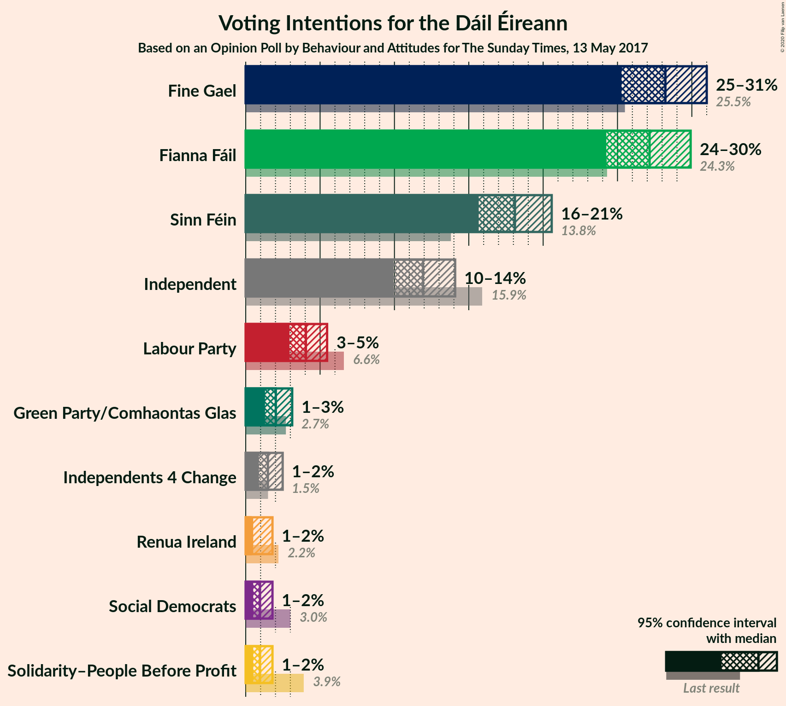
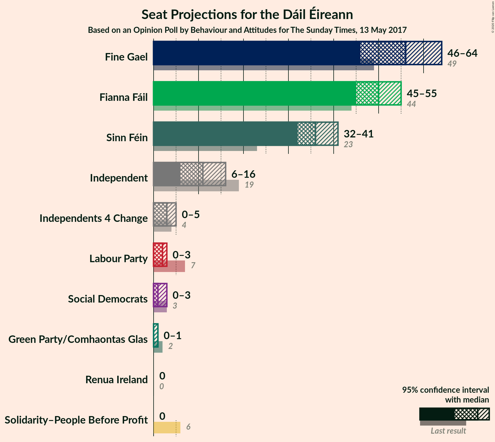
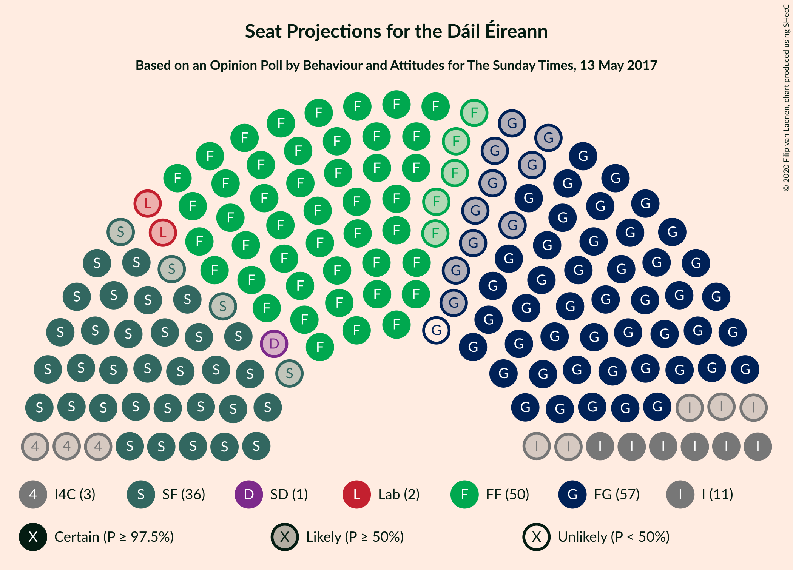
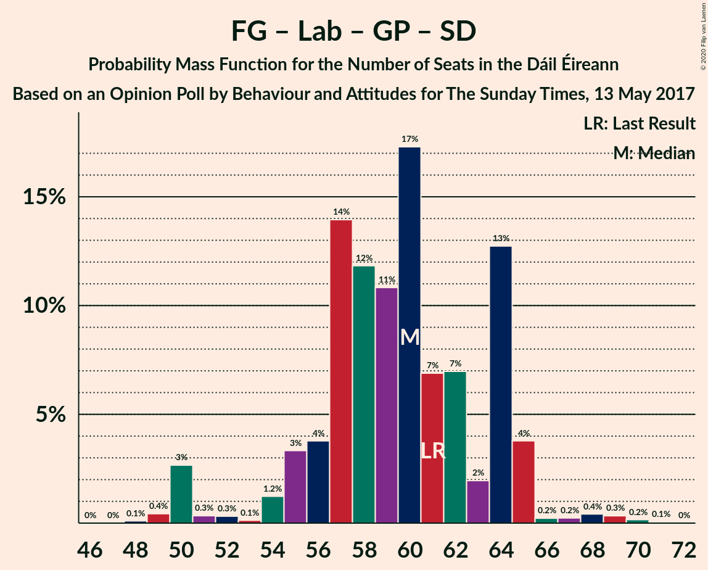

# Opinion Poll by Behaviour and Attitudes for The Sunday Times, 13 May 2017

<a href="#voting-intentions">Voting Intentions</a> | <a href="#seats">Seats</a> | <a href="#coalitions">Coalitions</a> | <a href="#technical-information">Technical Information</a>

## Voting Intentions

### Confidence Intervals

| Party | Last Result | Poll Result | 80% Confidence Interval | 90% Confidence Interval | 95% Confidence Interval | 99% Confidence Interval |
|:-----:|:-----------:|:-----------:|:-----------------------:|:-----------------------:|:-----------------------:|:-----------------------:|
| Fine Gael | 25.5% | 28.2% | 26.2–30.0% |25.7–30.5% |25.3–31.0% |24.4–31.9% |
| Fianna Fáil | 24.3% | 27.2% | 25.2–28.9% |24.7–29.4% |24.2–29.9% |23.4–30.8% |
| Sinn Féin | 13.8% | 18.1% | 16.5–19.7% |16.0–20.1% |15.7–20.6% |15.0–21.4% |
| Independent | 15.9% | 11.9% | 10.6–13.3% |10.2–13.7% |9.9–14.1% |9.4–14.8% |
| Labour Party | 6.6% | 4.0% | 3.3–5.0% |3.1–5.2% |2.9–5.5% |2.6–6.0% |
| Green Party/Comhaontas Glas | 2.7% | 2.0% | 1.5–2.7% |1.4–2.9% |1.3–3.1% |1.1–3.5% |
| Independents 4 Change | 1.5% | 1.5% | 1.1–2.1% |1.0–2.3% |0.9–2.5% |0.7–2.8% |
| Solidarity–People Before Profit | 3.9% | 1.0% | 0.7–1.5% |0.6–1.7% |0.5–1.8% |0.4–2.1% |
| Social Democrats | 3.0% | 1.0% | 0.7–1.5% |0.6–1.7% |0.5–1.8% |0.4–2.1% |
| Renua Ireland | 2.2% | 0.3% | 0.7–1.5% |0.6–1.7% |0.5–1.8% |0.4–2.1% |

*Note:* The poll result column reflects the actual value used in the calculations. Published results may vary slightly, and in addition be rounded to fewer digits.

## Seats

### Confidence Intervals

| Party | Last Result | Median | 80% Confidence Interval | 90% Confidence Interval | 95% Confidence Interval | 99% Confidence Interval |
|:-----:|:-----------:|:------:|:-----------------------:|:-----------------------:|:-----------------------:|:-----------------------:|
| <a href="#fine-gael">Fine Gael</a> | 49 | 56 | 52–61 |51–62 |46–64 |46–65 |
| <a href="#fianna-fáil">Fianna Fáil</a> | 44 | 50 | 48–55 |46–55 |45–55 |42–58 |
| <a href="#sinn-féin">Sinn Féin</a> | 23 | 36 | 33–37 |33–40 |32–41 |28–42 |
| <a href="#independent">Independent</a> | 19 | 11 | 7–16 |7–16 |6–16 |6–16 |
| <a href="#labour-party">Labour Party</a> | 7 | 2 | 0–2 |0–3 |0–3 |0–4 |
| <a href="#green-party/comhaontas-glas">Green Party/Comhaontas Glas</a> | 2 | 0 | 0–1 |0–1 |0–1 |0–3 |
| <a href="#independents-4-change">Independents 4 Change</a> | 4 | 3 | 0–5 |0–5 |0–5 |0–5 |
| <a href="#solidarity–people-before-profit">Solidarity–People Before Profit</a> | 6 | 0 | 0 |0 |0 |0–1 |
| <a href="#social-democrats">Social Democrats</a> | 3 | 1 | 1–2 |1–3 |0–3 |0–3 |
| <a href="#renua-ireland">Renua Ireland</a> | 0 | 0 | 0 |0 |0 |0 |

### Fine Gael

*For a full overview of the results for this party, see the [Fine Gael](party-finegael.html) page.*

| Number of Seats | Probability | Accumulated | Special Marks |
|:---------------:|:-----------:|:-----------:|:-------------:|
| 44 | 0.1% | 100% |  |
| 45 | 0.1% | 99.9% |  |
| 46 | 3% | 99.8% |  |
| 47 | 0.3% | 97% |  |
| 48 | 0.3% | 96% |  |
| 49 | 0.3% | 96% | Last Result |
| 50 | 0.3% | 96% |  |
| 51 | 3% | 95% |  |
| 52 | 5% | 93% |  |
| 53 | 13% | 87% |  |
| 54 | 2% | 75% |  |
| 55 | 15% | 73% |  |
| 56 | 9% | 58% | Median |
| 57 | 13% | 50% |  |
| 58 | 2% | 37% |  |
| 59 | 15% | 34% |  |
| 60 | 2% | 20% |  |
| 61 | 11% | 17% |  |
| 62 | 3% | 6% |  |
| 63 | 0.1% | 3% |  |
| 64 | 3% | 3% |  |
| 65 | 0.2% | 0.6% |  |
| 66 | 0.1% | 0.5% |  |
| 67 | 0.2% | 0.4% |  |
| 68 | 0.1% | 0.1% |  |
| 69 | 0% | 0% |  |

### Fianna Fáil

*For a full overview of the results for this party, see the [Fianna Fáil](party-fiannafáil.html) page.*

| Number of Seats | Probability | Accumulated | Special Marks |
|:---------------:|:-----------:|:-----------:|:-------------:|
| 40 | 0.1% | 100% |  |
| 41 | 0.3% | 99.9% |  |
| 42 | 0.5% | 99.6% |  |
| 43 | 0.4% | 99.1% |  |
| 44 | 0.3% | 98.7% | Last Result |
| 45 | 3% | 98% |  |
| 46 | 2% | 96% |  |
| 47 | 2% | 94% |  |
| 48 | 13% | 92% |  |
| 49 | 21% | 79% |  |
| 50 | 9% | 58% | Median |
| 51 | 0.8% | 49% |  |
| 52 | 13% | 48% |  |
| 53 | 16% | 35% |  |
| 54 | 2% | 19% |  |
| 55 | 15% | 17% |  |
| 56 | 0.5% | 2% |  |
| 57 | 0.8% | 2% |  |
| 58 | 0.4% | 0.9% |  |
| 59 | 0.2% | 0.5% |  |
| 60 | 0.2% | 0.2% |  |
| 61 | 0% | 0% |  |

### Sinn Féin

*For a full overview of the results for this party, see the [Sinn Féin](party-sinnféin.html) page.*

| Number of Seats | Probability | Accumulated | Special Marks |
|:---------------:|:-----------:|:-----------:|:-------------:|
| 23 | 0% | 100% | Last Result |
| 24 | 0% | 100% |  |
| 25 | 0% | 100% |  |
| 26 | 0% | 100% |  |
| 27 | 0.2% | 100% |  |
| 28 | 0.4% | 99.8% |  |
| 29 | 0.6% | 99.4% |  |
| 30 | 0.1% | 98.8% |  |
| 31 | 1.1% | 98.7% |  |
| 32 | 0.6% | 98% |  |
| 33 | 27% | 97% |  |
| 34 | 10% | 70% |  |
| 35 | 10% | 61% |  |
| 36 | 17% | 50% | Median |
| 37 | 25% | 33% |  |
| 38 | 2% | 8% |  |
| 39 | 1.0% | 6% |  |
| 40 | 0.3% | 5% |  |
| 41 | 3% | 5% |  |
| 42 | 2% | 2% |  |
| 43 | 0.1% | 0.1% |  |
| 44 | 0% | 0% |  |

### Independent

*For a full overview of the results for this party, see the [Independent](party-independent.html) page.*

| Number of Seats | Probability | Accumulated | Special Marks |
|:---------------:|:-----------:|:-----------:|:-------------:|
| 4 | 0.3% | 100% |  |
| 5 | 0.1% | 99.7% |  |
| 6 | 2% | 99.6% |  |
| 7 | 12% | 97% |  |
| 8 | 8% | 85% |  |
| 9 | 15% | 77% |  |
| 10 | 3% | 62% |  |
| 11 | 10% | 59% | Median |
| 12 | 5% | 48% |  |
| 13 | 7% | 43% |  |
| 14 | 5% | 36% |  |
| 15 | 1.0% | 31% |  |
| 16 | 30% | 30% |  |
| 17 | 0% | 0% |  |
| 18 | 0% | 0% |  |
| 19 | 0% | 0% | Last Result |

### Labour Party

*For a full overview of the results for this party, see the [Labour Party](party-labourparty.html) page.*

| Number of Seats | Probability | Accumulated | Special Marks |
|:---------------:|:-----------:|:-----------:|:-------------:|
| 0 | 20% | 100% |  |
| 1 | 5% | 80% |  |
| 2 | 68% | 75% | Median |
| 3 | 6% | 7% |  |
| 4 | 0.7% | 0.8% |  |
| 5 | 0.1% | 0.2% |  |
| 6 | 0.1% | 0.1% |  |
| 7 | 0% | 0% | Last Result |

### Green Party/Comhaontas Glas

*For a full overview of the results for this party, see the [Green Party/Comhaontas Glas](party-greenpartycomhaontasglas.html) page.*

| Number of Seats | Probability | Accumulated | Special Marks |
|:---------------:|:-----------:|:-----------:|:-------------:|
| 0 | 73% | 100% | Median |
| 1 | 25% | 27% |  |
| 2 | 0.6% | 2% | Last Result |
| 3 | 2% | 2% |  |
| 4 | 0% | 0% |  |

### Independents 4 Change

*For a full overview of the results for this party, see the [Independents 4 Change](party-independents4change.html) page.*

| Number of Seats | Probability | Accumulated | Special Marks |
|:---------------:|:-----------:|:-----------:|:-------------:|
| 0 | 13% | 100% |  |
| 1 | 18% | 87% |  |
| 2 | 16% | 69% |  |
| 3 | 19% | 54% | Median |
| 4 | 22% | 35% | Last Result |
| 5 | 13% | 13% |  |
| 6 | 0% | 0% |  |

### Solidarity–People Before Profit

*For a full overview of the results for this party, see the [Solidarity–People Before Profit](party-solidarity–peoplebeforeprofit.html) page.*

| Number of Seats | Probability | Accumulated | Special Marks |
|:---------------:|:-----------:|:-----------:|:-------------:|
| 0 | 99.0% | 100% | Median |
| 1 | 0.8% | 1.0% |  |
| 2 | 0.1% | 0.1% |  |
| 3 | 0% | 0% |  |
| 4 | 0% | 0% |  |
| 5 | 0% | 0% |  |
| 6 | 0% | 0% | Last Result |

### Social Democrats

*For a full overview of the results for this party, see the [Social Democrats](party-socialdemocrats.html) page.*

| Number of Seats | Probability | Accumulated | Special Marks |
|:---------------:|:-----------:|:-----------:|:-------------:|
| 0 | 3% | 100% |  |
| 1 | 81% | 97% | Median |
| 2 | 9% | 17% |  |
| 3 | 7% | 8% | Last Result |
| 4 | 0% | 0% |  |

### Renua Ireland

*For a full overview of the results for this party, see the [Renua Ireland](party-renuaireland.html) page.*

| Number of Seats | Probability | Accumulated | Special Marks |
|:---------------:|:-----------:|:-----------:|:-------------:|
| 0 | 100% | 100% | Last Result, Median |

## Coalitions

### Confidence Intervals

| Coalition | Last Result | Median | Majority? | 80% Confidence Interval | 90% Confidence Interval | 95% Confidence Interval | 99% Confidence Interval |
|:---------:|:-----------:|:------:|:---------:|:-----------------------:|:-----------------------:|:-----------------------:|:-----------------------:|
| Fine Gael – Fianna Fáil | 93 | 108 | 100% | 104–113 | 101–113 | 100–113 | 98–114 |
| Fianna Fáil – Sinn Féin | 67 | 85 | 95% | 81–91 | 81–92 | 78–94 | 77–97 |
| Fine Gael – Labour Party – Green Party/Comhaontas Glas – Social Democrats | 61 | 60 | 0% | 56–64 | 54–65 | 50–65 | 49–69 |
| Fine Gael – Labour Party – Green Party/Comhaontas Glas | 58 | 59 | 0% | 55–63 | 53–64 | 49–64 | 48–67 |
| Fine Gael – Labour Party | 56 | 58 | 0% | 54–63 | 53–63 | 48–64 | 47–66 |
| Fine Gael – Green Party/Comhaontas Glas | 51 | 57 | 0% | 53–61 | 51–62 | 47–64 | 46–65 |
| Fine Gael | 49 | 56 | 0% | 52–61 | 51–62 | 46–64 | 46–65 |
| Fianna Fáil – Labour Party – Green Party/Comhaontas Glas – Social Democrats | 56 | 55 | 0% | 50–59 | 49–59 | 46–59 | 45–63 |
| Fianna Fáil – Labour Party – Green Party/Comhaontas Glas | 53 | 53 | 0% | 48–58 | 48–58 | 45–58 | 43–61 |
| Fianna Fáil – Labour Party | 51 | 52 | 0% | 48–57 | 48–57 | 45–57 | 43–61 |
| Fianna Fáil – Green Party/Comhaontas Glas | 46 | 51 | 0% | 48–56 | 46–56 | 45–56 | 42–59 |

### Fine Gael – Fianna Fáil

| Number of Seats | Probability | Accumulated | Special Marks |
|:---------------:|:-----------:|:-----------:|:-------------:|
| 93 | 0% | 100% | Last Result |
| 94 | 0% | 100% |  |
| 95 | 0% | 100% |  |
| 96 | 0.2% | 99.9% |  |
| 97 | 0.2% | 99.7% |  |
| 98 | 0.2% | 99.6% |  |
| 99 | 0.9% | 99.4% |  |
| 100 | 2% | 98% |  |
| 101 | 3% | 97% |  |
| 102 | 2% | 94% |  |
| 103 | 0.4% | 91% |  |
| 104 | 11% | 91% |  |
| 105 | 7% | 80% |  |
| 106 | 7% | 73% | Median |
| 107 | 14% | 66% |  |
| 108 | 31% | 52% |  |
| 109 | 2% | 21% |  |
| 110 | 2% | 19% |  |
| 111 | 3% | 17% |  |
| 112 | 3% | 14% |  |
| 113 | 11% | 12% |  |
| 114 | 0.5% | 0.7% |  |
| 115 | 0.1% | 0.2% |  |
| 116 | 0.1% | 0.1% |  |
| 117 | 0% | 0% |  |

### Fianna Fáil – Sinn Féin

| Number of Seats | Probability | Accumulated | Special Marks |
|:---------------:|:-----------:|:-----------:|:-------------:|
| 67 | 0% | 100% | Last Result |
| 68 | 0% | 100% |  |
| 69 | 0% | 100% |  |
| 70 | 0% | 100% |  |
| 71 | 0% | 100% |  |
| 72 | 0% | 100% |  |
| 73 | 0% | 100% |  |
| 74 | 0% | 100% |  |
| 75 | 0.1% | 100% |  |
| 76 | 0.1% | 99.9% |  |
| 77 | 0.5% | 99.7% |  |
| 78 | 2% | 99.2% |  |
| 79 | 0.3% | 97% |  |
| 80 | 2% | 97% |  |
| 81 | 13% | 95% | Majority |
| 82 | 11% | 83% |  |
| 83 | 4% | 72% |  |
| 84 | 4% | 67% |  |
| 85 | 14% | 63% |  |
| 86 | 2% | 50% | Median |
| 87 | 6% | 48% |  |
| 88 | 2% | 42% |  |
| 89 | 10% | 40% |  |
| 90 | 13% | 30% |  |
| 91 | 10% | 17% |  |
| 92 | 4% | 7% |  |
| 93 | 0.7% | 3% |  |
| 94 | 0.1% | 3% |  |
| 95 | 0% | 2% |  |
| 96 | 2% | 2% |  |
| 97 | 0.4% | 0.7% |  |
| 98 | 0.1% | 0.3% |  |
| 99 | 0% | 0.2% |  |
| 100 | 0% | 0.2% |  |
| 101 | 0.2% | 0.2% |  |
| 102 | 0% | 0% |  |

### Fine Gael – Labour Party – Green Party/Comhaontas Glas – Social Democrats

| Number of Seats | Probability | Accumulated | Special Marks |
|:---------------:|:-----------:|:-----------:|:-------------:|
| 48 | 0.1% | 100% |  |
| 49 | 0.4% | 99.9% |  |
| 50 | 3% | 99.5% |  |
| 51 | 0.3% | 97% |  |
| 52 | 0.3% | 96% |  |
| 53 | 0.1% | 96% |  |
| 54 | 1.2% | 96% |  |
| 55 | 3% | 95% |  |
| 56 | 4% | 91% |  |
| 57 | 14% | 88% |  |
| 58 | 12% | 74% |  |
| 59 | 11% | 62% | Median |
| 60 | 17% | 51% |  |
| 61 | 7% | 34% | Last Result |
| 62 | 7% | 27% |  |
| 63 | 2% | 20% |  |
| 64 | 13% | 18% |  |
| 65 | 4% | 5% |  |
| 66 | 0.2% | 1.4% |  |
| 67 | 0.2% | 1.2% |  |
| 68 | 0.4% | 1.0% |  |
| 69 | 0.3% | 0.5% |  |
| 70 | 0.2% | 0.2% |  |
| 71 | 0.1% | 0.1% |  |
| 72 | 0% | 0% |  |

### Fine Gael – Labour Party – Green Party/Comhaontas Glas

| Number of Seats | Probability | Accumulated | Special Marks |
|:---------------:|:-----------:|:-----------:|:-------------:|
| 47 | 0.4% | 100% |  |
| 48 | 0.1% | 99.6% |  |
| 49 | 3% | 99.4% |  |
| 50 | 0.3% | 97% |  |
| 51 | 0.3% | 96% |  |
| 52 | 0.3% | 96% |  |
| 53 | 1.2% | 96% |  |
| 54 | 4% | 94% |  |
| 55 | 2% | 90% |  |
| 56 | 15% | 88% |  |
| 57 | 13% | 73% |  |
| 58 | 10% | 60% | Last Result, Median |
| 59 | 22% | 50% |  |
| 60 | 8% | 28% |  |
| 61 | 2% | 20% |  |
| 62 | 0.9% | 18% |  |
| 63 | 11% | 17% |  |
| 64 | 5% | 6% |  |
| 65 | 0.2% | 1.4% |  |
| 66 | 0.4% | 1.2% |  |
| 67 | 0.5% | 0.8% |  |
| 68 | 0.1% | 0.2% |  |
| 69 | 0.1% | 0.1% |  |
| 70 | 0% | 0% |  |

### Fine Gael – Labour Party

| Number of Seats | Probability | Accumulated | Special Marks |
|:---------------:|:-----------:|:-----------:|:-------------:|
| 46 | 0.1% | 100% |  |
| 47 | 0.4% | 99.9% |  |
| 48 | 3% | 99.4% |  |
| 49 | 0.3% | 97% |  |
| 50 | 0.4% | 96% |  |
| 51 | 0.4% | 96% |  |
| 52 | 0.3% | 96% |  |
| 53 | 1.3% | 95% |  |
| 54 | 5% | 94% |  |
| 55 | 15% | 89% |  |
| 56 | 2% | 73% | Last Result |
| 57 | 13% | 72% |  |
| 58 | 9% | 58% | Median |
| 59 | 27% | 50% |  |
| 60 | 2% | 22% |  |
| 61 | 2% | 20% |  |
| 62 | 0.9% | 18% |  |
| 63 | 12% | 17% |  |
| 64 | 4% | 5% |  |
| 65 | 0.2% | 1.4% |  |
| 66 | 0.8% | 1.2% |  |
| 67 | 0.3% | 0.4% |  |
| 68 | 0.1% | 0.2% |  |
| 69 | 0% | 0% |  |

### Fine Gael – Green Party/Comhaontas Glas

| Number of Seats | Probability | Accumulated | Special Marks |
|:---------------:|:-----------:|:-----------:|:-------------:|
| 45 | 0.1% | 100% |  |
| 46 | 0.5% | 99.8% |  |
| 47 | 3% | 99.3% |  |
| 48 | 0.3% | 96% |  |
| 49 | 0.4% | 96% |  |
| 50 | 0.4% | 96% |  |
| 51 | 2% | 95% | Last Result |
| 52 | 2% | 93% |  |
| 53 | 6% | 91% |  |
| 54 | 11% | 86% |  |
| 55 | 14% | 74% |  |
| 56 | 10% | 60% | Median |
| 57 | 8% | 50% |  |
| 58 | 8% | 43% |  |
| 59 | 15% | 35% |  |
| 60 | 2% | 20% |  |
| 61 | 10% | 17% |  |
| 62 | 4% | 7% |  |
| 63 | 0.1% | 4% |  |
| 64 | 2% | 3% |  |
| 65 | 0.5% | 0.9% |  |
| 66 | 0% | 0.5% |  |
| 67 | 0.2% | 0.4% |  |
| 68 | 0.1% | 0.2% |  |
| 69 | 0.1% | 0.1% |  |
| 70 | 0% | 0% |  |

### Fine Gael

| Number of Seats | Probability | Accumulated | Special Marks |
|:---------------:|:-----------:|:-----------:|:-------------:|
| 44 | 0.1% | 100% |  |
| 45 | 0.1% | 99.9% |  |
| 46 | 3% | 99.8% |  |
| 47 | 0.3% | 97% |  |
| 48 | 0.3% | 96% |  |
| 49 | 0.3% | 96% | Last Result |
| 50 | 0.3% | 96% |  |
| 51 | 3% | 95% |  |
| 52 | 5% | 93% |  |
| 53 | 13% | 87% |  |
| 54 | 2% | 75% |  |
| 55 | 15% | 73% |  |
| 56 | 9% | 58% | Median |
| 57 | 13% | 50% |  |
| 58 | 2% | 37% |  |
| 59 | 15% | 34% |  |
| 60 | 2% | 20% |  |
| 61 | 11% | 17% |  |
| 62 | 3% | 6% |  |
| 63 | 0.1% | 3% |  |
| 64 | 3% | 3% |  |
| 65 | 0.2% | 0.6% |  |
| 66 | 0.1% | 0.5% |  |
| 67 | 0.2% | 0.4% |  |
| 68 | 0.1% | 0.1% |  |
| 69 | 0% | 0% |  |

### Fianna Fáil – Labour Party – Green Party/Comhaontas Glas – Social Democrats

| Number of Seats | Probability | Accumulated | Special Marks |
|:---------------:|:-----------:|:-----------:|:-------------:|
| 41 | 0% | 100% |  |
| 42 | 0.1% | 99.9% |  |
| 43 | 0.1% | 99.9% |  |
| 44 | 0.2% | 99.7% |  |
| 45 | 0.2% | 99.5% |  |
| 46 | 2% | 99.3% |  |
| 47 | 0.6% | 97% |  |
| 48 | 0.7% | 97% |  |
| 49 | 6% | 96% |  |
| 50 | 13% | 90% |  |
| 51 | 10% | 78% |  |
| 52 | 3% | 68% |  |
| 53 | 8% | 64% | Median |
| 54 | 2% | 57% |  |
| 55 | 19% | 55% |  |
| 56 | 14% | 36% | Last Result |
| 57 | 0.4% | 22% |  |
| 58 | 4% | 22% |  |
| 59 | 16% | 18% |  |
| 60 | 0.2% | 2% |  |
| 61 | 0.5% | 2% |  |
| 62 | 0.3% | 1.2% |  |
| 63 | 0.8% | 0.9% |  |
| 64 | 0% | 0.1% |  |
| 65 | 0% | 0.1% |  |
| 66 | 0% | 0% |  |

### Fianna Fáil – Labour Party – Green Party/Comhaontas Glas

| Number of Seats | Probability | Accumulated | Special Marks |
|:---------------:|:-----------:|:-----------:|:-------------:|
| 41 | 0.1% | 100% |  |
| 42 | 0.2% | 99.9% |  |
| 43 | 0.3% | 99.7% |  |
| 44 | 0.1% | 99.4% |  |
| 45 | 2% | 99.3% |  |
| 46 | 0.4% | 97% |  |
| 47 | 0.7% | 97% |  |
| 48 | 7% | 96% |  |
| 49 | 12% | 89% |  |
| 50 | 10% | 78% |  |
| 51 | 3% | 68% |  |
| 52 | 13% | 64% | Median |
| 53 | 5% | 51% | Last Result |
| 54 | 9% | 46% |  |
| 55 | 15% | 37% |  |
| 56 | 0.8% | 22% |  |
| 57 | 6% | 21% |  |
| 58 | 13% | 15% |  |
| 59 | 0.6% | 2% |  |
| 60 | 0.2% | 1.2% |  |
| 61 | 0.6% | 1.0% |  |
| 62 | 0.4% | 0.4% |  |
| 63 | 0% | 0.1% |  |
| 64 | 0% | 0% |  |

### Fianna Fáil – Labour Party

| Number of Seats | Probability | Accumulated | Special Marks |
|:---------------:|:-----------:|:-----------:|:-------------:|
| 40 | 0.1% | 100% |  |
| 41 | 0.1% | 99.9% |  |
| 42 | 0.2% | 99.8% |  |
| 43 | 0.3% | 99.6% |  |
| 44 | 0.4% | 99.3% |  |
| 45 | 2% | 98.9% |  |
| 46 | 0.3% | 97% |  |
| 47 | 1.0% | 96% |  |
| 48 | 6% | 96% |  |
| 49 | 12% | 89% |  |
| 50 | 10% | 77% |  |
| 51 | 9% | 67% | Last Result |
| 52 | 9% | 58% | Median |
| 53 | 4% | 49% |  |
| 54 | 10% | 46% |  |
| 55 | 14% | 35% |  |
| 56 | 4% | 21% |  |
| 57 | 15% | 17% |  |
| 58 | 0.2% | 2% |  |
| 59 | 0.7% | 2% |  |
| 60 | 0.3% | 1.2% |  |
| 61 | 0.6% | 0.8% |  |
| 62 | 0.2% | 0.3% |  |
| 63 | 0% | 0.1% |  |
| 64 | 0% | 0% |  |

### Fianna Fáil – Green Party/Comhaontas Glas

| Number of Seats | Probability | Accumulated | Special Marks |
|:---------------:|:-----------:|:-----------:|:-------------:|
| 41 | 0.3% | 100% |  |
| 42 | 0.4% | 99.7% |  |
| 43 | 0.6% | 99.3% |  |
| 44 | 0.2% | 98.8% |  |
| 45 | 2% | 98.6% |  |
| 46 | 2% | 96% | Last Result |
| 47 | 1.2% | 94% |  |
| 48 | 13% | 93% |  |
| 49 | 15% | 80% |  |
| 50 | 14% | 65% | Median |
| 51 | 3% | 51% |  |
| 52 | 11% | 48% |  |
| 53 | 13% | 37% |  |
| 54 | 5% | 24% |  |
| 55 | 3% | 18% |  |
| 56 | 14% | 15% |  |
| 57 | 0.7% | 2% |  |
| 58 | 0.3% | 1.0% |  |
| 59 | 0.4% | 0.7% |  |
| 60 | 0.2% | 0.3% |  |
| 61 | 0% | 0% |  |

## Technical Information

### Opinion Poll

+ **Polling firm:** Behaviour and Attitudes
+ **Commissioner(s):** The Sunday Times
+ **Fieldwork period:** 13 May 2017

### Calculations

+ **Sample size:** 939
+ **Simulations done:** 131,072
+ **Error estimate:** 1.33%

