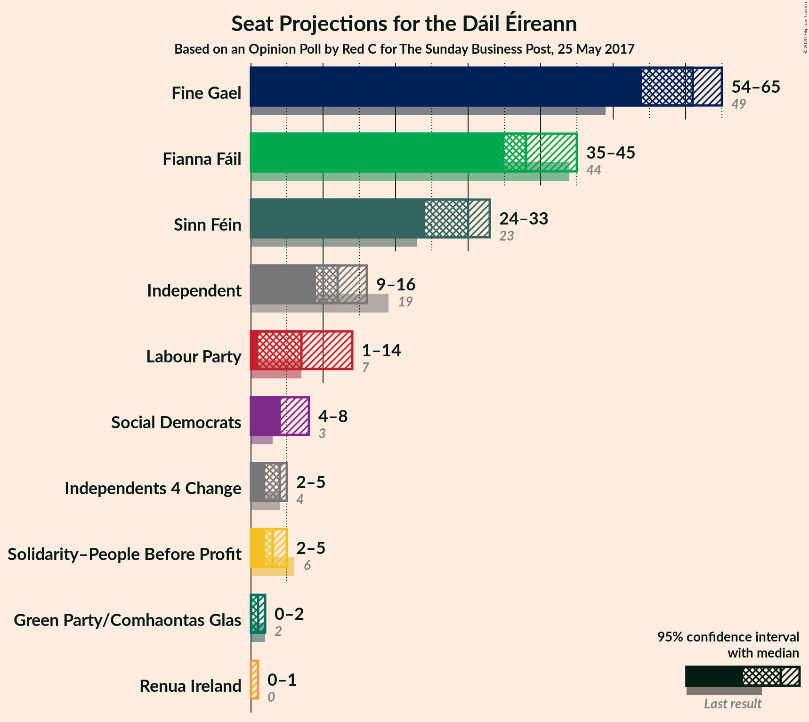
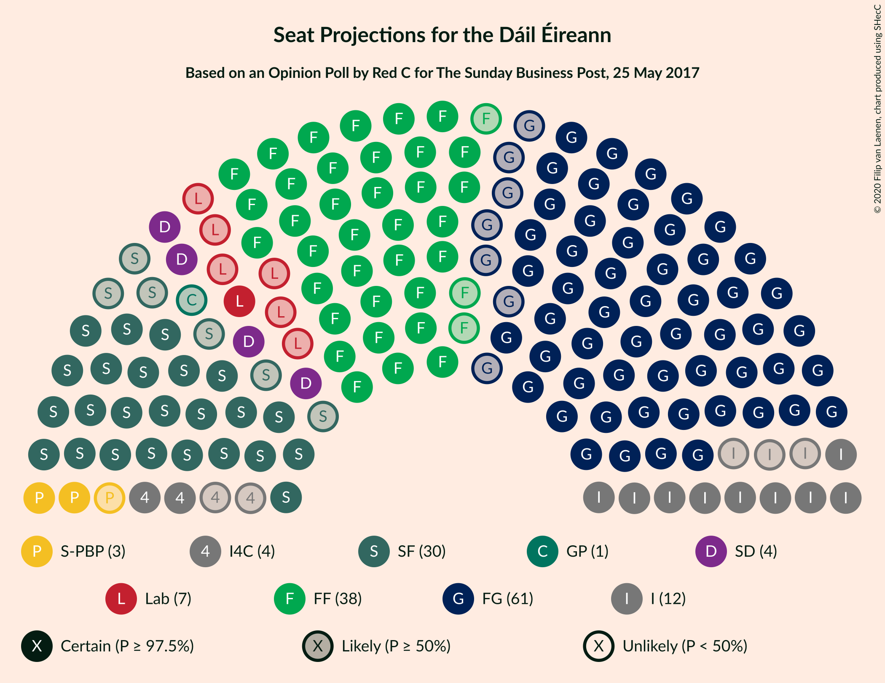
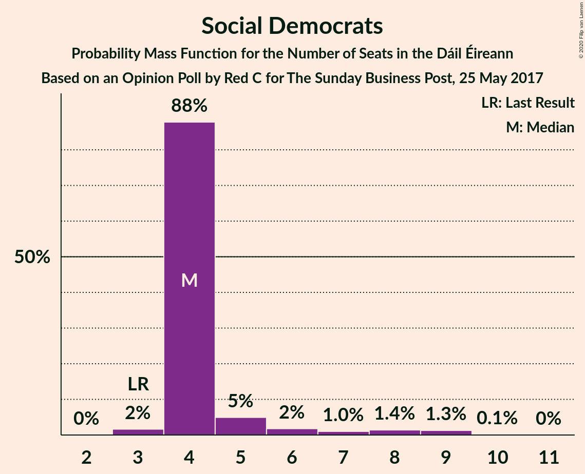
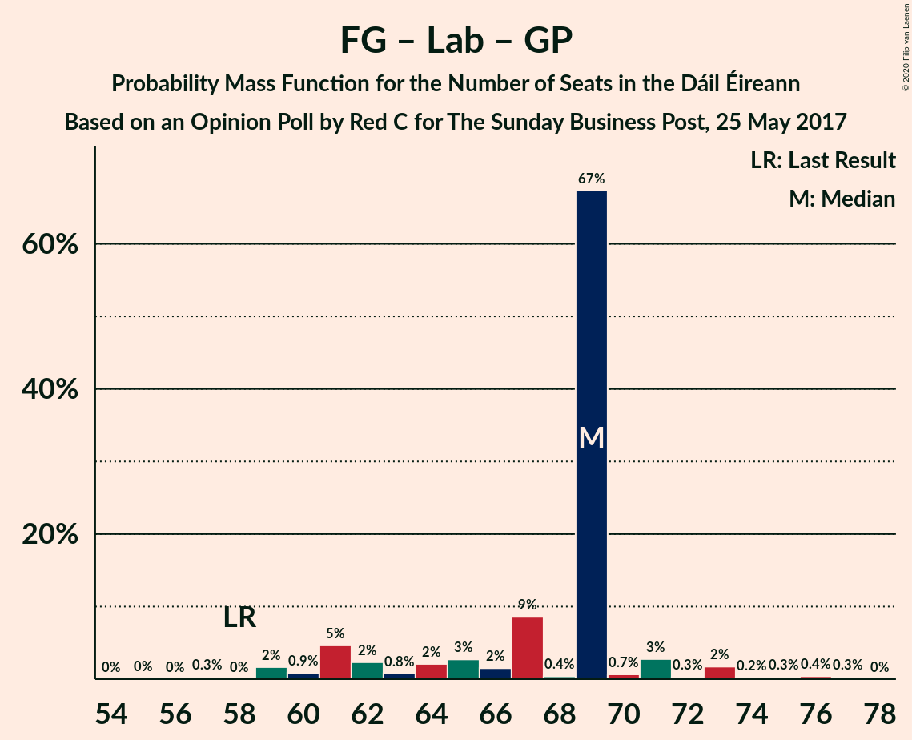

# Opinion Poll by Red C for The Sunday Business Post, 25 May 2017

<a href="#voting-intentions">Voting Intentions</a> | <a href="#seats">Seats</a> | <a href="#coalitions">Coalitions</a> | <a href="#technical-information">Technical Information</a>

## Voting Intentions

### Confidence Intervals

| Party | Last Result | Poll Result | 80% Confidence Interval | 90% Confidence Interval | 95% Confidence Interval | 99% Confidence Interval |
|:-----:|:-----------:|:-----------:|:-----------------------:|:-----------------------:|:-----------------------:|:-----------------------:|
| Fine Gael | 25.5% | 29.0% | 27.2–30.9% |26.7–31.4% |26.3–31.9% |25.4–32.8% |
| Fianna Fáil | 24.3% | 21.0% | 19.4–22.7% |19.0–23.2% |18.6–23.7% |17.9–24.5% |
| Sinn Féin | 13.8% | 15.0% | 13.7–16.6% |13.3–17.0% |13.0–17.4% |12.3–18.2% |
| Independent | 15.9% | 12.6% | 11.4–14.1% |11.0–14.5% |10.7–14.9% |10.2–15.6% |
| Labour Party | 6.6% | 6.0% | 5.1–7.1% |4.9–7.4% |4.7–7.6% |4.3–8.2% |
| Social Democrats | 3.0% | 4.0% | 3.3–4.9% |3.1–5.2% |2.9–5.4% |2.6–5.9% |
| Solidarity–People Before Profit | 3.9% | 3.0% | 2.4–3.8% |2.2–4.0% |2.1–4.2% |1.8–4.7% |
| Green Party/Comhaontas Glas | 2.7% | 3.0% | 2.4–3.8% |2.2–4.0% |2.1–4.2% |1.8–4.7% |
| Independents 4 Change | 1.5% | 1.6% | 1.2–2.2% |1.1–2.4% |1.0–2.6% |0.8–2.9% |
| Renua Ireland | 2.2% | 1.0% | 0.7–1.5% |0.6–1.7% |0.5–1.8% |0.4–2.1% |

*Note:* The poll result column reflects the actual value used in the calculations. Published results may vary slightly, and in addition be rounded to fewer digits.

## Seats

### Confidence Intervals

| Party | Last Result | Median | 80% Confidence Interval | 90% Confidence Interval | 95% Confidence Interval | 99% Confidence Interval |
|:-----:|:-----------:|:------:|:-----------------------:|:-----------------------:|:-----------------------:|:-----------------------:|
| <a href="#fine-gael">Fine Gael</a> | 49 | 61 | 56–62 |54–63 |54–65 |50–66 |
| <a href="#fianna-fáil">Fianna Fáil</a> | 44 | 38 | 37–39 |35–43 |35–45 |34–46 |
| <a href="#sinn-féin">Sinn Féin</a> | 23 | 30 | 29–32 |26–33 |24–33 |21–35 |
| <a href="#independent">Independent</a> | 19 | 12 | 12–16 |11–16 |9–16 |5–16 |
| <a href="#labour-party">Labour Party</a> | 7 | 7 | 4–9 |2–10 |1–14 |1–16 |
| <a href="#social-democrats">Social Democrats</a> | 3 | 4 | 4–5 |4–6 |4–8 |3–9 |
| <a href="#solidarity–people-before-profit">Solidarity–People Before Profit</a> | 6 | 3 | 3–4 |2–4 |2–5 |1–6 |
| <a href="#green-party/comhaontas-glas">Green Party/Comhaontas Glas</a> | 2 | 1 | 1 |0–2 |0–2 |0–2 |
| <a href="#independents-4-change">Independents 4 Change</a> | 4 | 4 | 3–5 |3–5 |2–5 |0–5 |
| <a href="#renua-ireland">Renua Ireland</a> | 0 | 0 | 0 |0 |0–1 |0–2 |

### Fine Gael

*For a full overview of the results for this party, see the [Fine Gael](party-finegael.html) page.*

| Number of Seats | Probability | Accumulated | Special Marks |
|:---------------:|:-----------:|:-----------:|:-------------:|
| 48 | 0% | 100% |  |
| 49 | 0% | 99.9% | Last Result |
| 50 | 0.5% | 99.9% |  |
| 51 | 0.1% | 99.4% |  |
| 52 | 0.2% | 99.3% |  |
| 53 | 1.1% | 99.1% |  |
| 54 | 4% | 98% |  |
| 55 | 3% | 94% |  |
| 56 | 2% | 91% |  |
| 57 | 3% | 89% |  |
| 58 | 6% | 86% |  |
| 59 | 2% | 80% |  |
| 60 | 0.9% | 79% |  |
| 61 | 67% | 78% | Median |
| 62 | 2% | 11% |  |
| 63 | 5% | 9% |  |
| 64 | 1.1% | 4% |  |
| 65 | 2% | 3% |  |
| 66 | 0.2% | 0.7% |  |
| 67 | 0.4% | 0.5% |  |
| 68 | 0% | 0% |  |

### Fianna Fáil

*For a full overview of the results for this party, see the [Fianna Fáil](party-fiannafáil.html) page.*

| Number of Seats | Probability | Accumulated | Special Marks |
|:---------------:|:-----------:|:-----------:|:-------------:|
| 31 | 0.1% | 100% |  |
| 32 | 0.1% | 99.9% |  |
| 33 | 0.1% | 99.8% |  |
| 34 | 0.3% | 99.7% |  |
| 35 | 5% | 99.4% |  |
| 36 | 2% | 95% |  |
| 37 | 9% | 93% |  |
| 38 | 69% | 83% | Median |
| 39 | 5% | 14% |  |
| 40 | 2% | 9% |  |
| 41 | 1.5% | 7% |  |
| 42 | 0.5% | 6% |  |
| 43 | 0.9% | 5% |  |
| 44 | 0.3% | 4% | Last Result |
| 45 | 3% | 4% |  |
| 46 | 0.2% | 0.5% |  |
| 47 | 0.1% | 0.3% |  |
| 48 | 0.1% | 0.2% |  |
| 49 | 0.1% | 0.1% |  |
| 50 | 0% | 0% |  |

### Sinn Féin

*For a full overview of the results for this party, see the [Sinn Féin](party-sinnféin.html) page.*

| Number of Seats | Probability | Accumulated | Special Marks |
|:---------------:|:-----------:|:-----------:|:-------------:|
| 20 | 0.1% | 100% |  |
| 21 | 0.4% | 99.9% |  |
| 22 | 0.4% | 99.5% |  |
| 23 | 1.4% | 99.1% | Last Result |
| 24 | 0.7% | 98% |  |
| 25 | 0.4% | 97% |  |
| 26 | 2% | 97% |  |
| 27 | 0.7% | 95% |  |
| 28 | 3% | 94% |  |
| 29 | 6% | 91% |  |
| 30 | 68% | 86% | Median |
| 31 | 5% | 18% |  |
| 32 | 6% | 13% |  |
| 33 | 4% | 6% |  |
| 34 | 1.3% | 2% |  |
| 35 | 0.5% | 0.6% |  |
| 36 | 0.1% | 0.1% |  |
| 37 | 0% | 0% |  |

### Independent

*For a full overview of the results for this party, see the [Independent](party-independent.html) page.*

| Number of Seats | Probability | Accumulated | Special Marks |
|:---------------:|:-----------:|:-----------:|:-------------:|
| 5 | 1.3% | 100% |  |
| 6 | 0.1% | 98.7% |  |
| 7 | 0.1% | 98.6% |  |
| 8 | 0.4% | 98.6% |  |
| 9 | 2% | 98% |  |
| 10 | 0.4% | 96% |  |
| 11 | 2% | 96% |  |
| 12 | 66% | 94% | Median |
| 13 | 9% | 28% |  |
| 14 | 1.2% | 19% |  |
| 15 | 1.1% | 18% |  |
| 16 | 16% | 16% |  |
| 17 | 0% | 0% |  |
| 18 | 0% | 0% |  |
| 19 | 0% | 0% | Last Result |

### Labour Party

*For a full overview of the results for this party, see the [Labour Party](party-labourparty.html) page.*

| Number of Seats | Probability | Accumulated | Special Marks |
|:---------------:|:-----------:|:-----------:|:-------------:|
| 1 | 4% | 100% |  |
| 2 | 1.4% | 96% |  |
| 3 | 3% | 94% |  |
| 4 | 5% | 91% |  |
| 5 | 5% | 87% |  |
| 6 | 5% | 82% |  |
| 7 | 65% | 77% | Last Result, Median |
| 8 | 1.3% | 12% |  |
| 9 | 4% | 10% |  |
| 10 | 3% | 7% |  |
| 11 | 0.5% | 4% |  |
| 12 | 0.6% | 3% |  |
| 13 | 0.1% | 3% |  |
| 14 | 2% | 3% |  |
| 15 | 0.1% | 1.0% |  |
| 16 | 0.9% | 0.9% |  |
| 17 | 0% | 0% |  |

### Social Democrats

*For a full overview of the results for this party, see the [Social Democrats](party-socialdemocrats.html) page.*

| Number of Seats | Probability | Accumulated | Special Marks |
|:---------------:|:-----------:|:-----------:|:-------------:|
| 3 | 2% | 100% | Last Result |
| 4 | 88% | 98% | Median |
| 5 | 5% | 11% |  |
| 6 | 2% | 6% |  |
| 7 | 1.0% | 4% |  |
| 8 | 1.4% | 3% |  |
| 9 | 1.3% | 1.4% |  |
| 10 | 0.1% | 0.1% |  |
| 11 | 0% | 0% |  |

### Solidarity–People Before Profit

*For a full overview of the results for this party, see the [Solidarity–People Before Profit](party-solidarity–peoplebeforeprofit.html) page.*

| Number of Seats | Probability | Accumulated | Special Marks |
|:---------------:|:-----------:|:-----------:|:-------------:|
| 0 | 0.1% | 100% |  |
| 1 | 2% | 99.9% |  |
| 2 | 4% | 98% |  |
| 3 | 80% | 94% | Median |
| 4 | 9% | 14% |  |
| 5 | 4% | 5% |  |
| 6 | 0.9% | 0.9% | Last Result |
| 7 | 0% | 0.1% |  |
| 8 | 0% | 0% |  |

### Green Party/Comhaontas Glas

*For a full overview of the results for this party, see the [Green Party/Comhaontas Glas](party-greenpartycomhaontasglas.html) page.*

| Number of Seats | Probability | Accumulated | Special Marks |
|:---------------:|:-----------:|:-----------:|:-------------:|
| 0 | 9% | 100% |  |
| 1 | 81% | 91% | Median |
| 2 | 9% | 10% | Last Result |
| 3 | 0.2% | 0.3% |  |
| 4 | 0.1% | 0.1% |  |
| 5 | 0% | 0% |  |

### Independents 4 Change

*For a full overview of the results for this party, see the [Independents 4 Change](party-independents4change.html) page.*

| Number of Seats | Probability | Accumulated | Special Marks |
|:---------------:|:-----------:|:-----------:|:-------------:|
| 0 | 0.7% | 100% |  |
| 1 | 0.2% | 99.3% |  |
| 2 | 4% | 99.1% |  |
| 3 | 9% | 95% |  |
| 4 | 70% | 86% | Last Result, Median |
| 5 | 16% | 16% |  |
| 6 | 0% | 0% |  |

### Renua Ireland

*For a full overview of the results for this party, see the [Renua Ireland](party-renuaireland.html) page.*

| Number of Seats | Probability | Accumulated | Special Marks |
|:---------------:|:-----------:|:-----------:|:-------------:|
| 0 | 96% | 100% | Last Result, Median |
| 1 | 2% | 4% |  |
| 2 | 1.1% | 1.1% |  |
| 3 | 0% | 0% |  |

## Coalitions

### Confidence Intervals

| Coalition | Last Result | Median | Majority? | 80% Confidence Interval | 90% Confidence Interval | 95% Confidence Interval | 99% Confidence Interval |
|:---------:|:-----------:|:------:|:---------:|:-----------------------:|:-----------------------:|:-----------------------:|:-----------------------:|
| Fine Gael – Fianna Fáil | 93 | 99 | 100% | 95–99 | 93–102 | 91–104 | 90–105 |
| Fine Gael – Labour Party – Social Democrats – Green Party/Comhaontas Glas | 61 | 73 | 0.3% | 68–73 | 65–75 | 65–77 | 62–80 |
| Fianna Fáil – Sinn Féin | 67 | 68 | 0% | 66–70 | 65–73 | 62–74 | 59–76 |
| Fine Gael – Labour Party – Green Party/Comhaontas Glas | 58 | 69 | 0% | 63–69 | 61–71 | 60–73 | 59–76 |
| Fine Gael – Labour Party | 56 | 68 | 0% | 62–68 | 60–70 | 58–71 | 57–75 |
| Fine Gael – Green Party/Comhaontas Glas | 51 | 62 | 0% | 57–63 | 55–64 | 55–66 | 51–67 |
| Fine Gael | 49 | 61 | 0% | 56–62 | 54–63 | 54–65 | 50–66 |
| Fianna Fáil – Labour Party – Social Democrats – Green Party/Comhaontas Glas | 56 | 50 | 0% | 47–53 | 46–56 | 44–58 | 41–61 |
| Fianna Fáil – Labour Party – Green Party/Comhaontas Glas | 53 | 46 | 0% | 43–48 | 41–52 | 40–53 | 37–57 |
| Fianna Fáil – Labour Party | 51 | 45 | 0% | 42–48 | 40–51 | 39–52 | 36–55 |
| Fianna Fáil – Green Party/Comhaontas Glas | 46 | 39 | 0% | 37–40 | 37–44 | 36–46 | 35–47 |

### Fine Gael – Fianna Fáil

| Number of Seats | Probability | Accumulated | Special Marks |
|:---------------:|:-----------:|:-----------:|:-------------:|
| 87 | 0.2% | 100% |  |
| 88 | 0% | 99.8% |  |
| 89 | 0.2% | 99.8% |  |
| 90 | 0.6% | 99.6% |  |
| 91 | 2% | 99.0% |  |
| 92 | 1.3% | 96% |  |
| 93 | 1.1% | 95% | Last Result |
| 94 | 2% | 94% |  |
| 95 | 5% | 92% |  |
| 96 | 3% | 87% |  |
| 97 | 2% | 84% |  |
| 98 | 4% | 82% |  |
| 99 | 67% | 77% | Median |
| 100 | 3% | 10% |  |
| 101 | 0.4% | 7% |  |
| 102 | 2% | 7% |  |
| 103 | 1.4% | 5% |  |
| 104 | 3% | 3% |  |
| 105 | 0.2% | 0.7% |  |
| 106 | 0.2% | 0.5% |  |
| 107 | 0.1% | 0.3% |  |
| 108 | 0.1% | 0.2% |  |
| 109 | 0.1% | 0.1% |  |
| 110 | 0% | 0% |  |

### Fine Gael – Labour Party – Social Democrats – Green Party/Comhaontas Glas

| Number of Seats | Probability | Accumulated | Special Marks |
|:---------------:|:-----------:|:-----------:|:-------------:|
| 58 | 0% | 100% |  |
| 59 | 0% | 99.9% |  |
| 60 | 0% | 99.9% |  |
| 61 | 0% | 99.9% | Last Result |
| 62 | 0.8% | 99.9% |  |
| 63 | 0.1% | 99.1% |  |
| 64 | 0.4% | 99.0% |  |
| 65 | 5% | 98.5% |  |
| 66 | 1.1% | 94% |  |
| 67 | 0.8% | 92% |  |
| 68 | 2% | 92% |  |
| 69 | 3% | 89% |  |
| 70 | 2% | 87% |  |
| 71 | 7% | 84% |  |
| 72 | 2% | 78% |  |
| 73 | 68% | 76% | Median |
| 74 | 1.0% | 7% |  |
| 75 | 2% | 6% |  |
| 76 | 0.6% | 4% |  |
| 77 | 2% | 4% |  |
| 78 | 0.2% | 1.4% |  |
| 79 | 0.5% | 1.3% |  |
| 80 | 0.5% | 0.8% |  |
| 81 | 0% | 0.3% | Majority |
| 82 | 0.3% | 0.3% |  |
| 83 | 0% | 0% |  |

### Fianna Fáil – Sinn Féin

| Number of Seats | Probability | Accumulated | Special Marks |
|:---------------:|:-----------:|:-----------:|:-------------:|
| 58 | 0.1% | 100% |  |
| 59 | 0.4% | 99.9% |  |
| 60 | 0.3% | 99.5% |  |
| 61 | 2% | 99.2% |  |
| 62 | 0.3% | 98% |  |
| 63 | 0.1% | 97% |  |
| 64 | 0.7% | 97% |  |
| 65 | 3% | 97% |  |
| 66 | 4% | 94% |  |
| 67 | 4% | 90% | Last Result |
| 68 | 70% | 86% | Median |
| 69 | 3% | 15% |  |
| 70 | 3% | 12% |  |
| 71 | 2% | 9% |  |
| 72 | 1.3% | 7% |  |
| 73 | 1.4% | 6% |  |
| 74 | 3% | 5% |  |
| 75 | 0.6% | 2% |  |
| 76 | 0.8% | 1.1% |  |
| 77 | 0% | 0.2% |  |
| 78 | 0% | 0.2% |  |
| 79 | 0.1% | 0.1% |  |
| 80 | 0% | 0% |  |

### Fine Gael – Labour Party – Green Party/Comhaontas Glas

| Number of Seats | Probability | Accumulated | Special Marks |
|:---------------:|:-----------:|:-----------:|:-------------:|
| 55 | 0% | 100% |  |
| 56 | 0% | 99.9% |  |
| 57 | 0.3% | 99.9% |  |
| 58 | 0% | 99.6% | Last Result |
| 59 | 2% | 99.6% |  |
| 60 | 0.9% | 98% |  |
| 61 | 5% | 97% |  |
| 62 | 2% | 92% |  |
| 63 | 0.8% | 90% |  |
| 64 | 2% | 89% |  |
| 65 | 3% | 87% |  |
| 66 | 2% | 84% |  |
| 67 | 9% | 83% |  |
| 68 | 0.4% | 74% |  |
| 69 | 67% | 74% | Median |
| 70 | 0.7% | 7% |  |
| 71 | 3% | 6% |  |
| 72 | 0.3% | 3% |  |
| 73 | 2% | 3% |  |
| 74 | 0.2% | 1.1% |  |
| 75 | 0.3% | 1.0% |  |
| 76 | 0.4% | 0.7% |  |
| 77 | 0.3% | 0.3% |  |
| 78 | 0% | 0% |  |

### Fine Gael – Labour Party

| Number of Seats | Probability | Accumulated | Special Marks |
|:---------------:|:-----------:|:-----------:|:-------------:|
| 53 | 0% | 100% |  |
| 54 | 0% | 99.9% |  |
| 55 | 0.3% | 99.9% |  |
| 56 | 0% | 99.6% | Last Result |
| 57 | 1.1% | 99.6% |  |
| 58 | 1.2% | 98% |  |
| 59 | 1.2% | 97% |  |
| 60 | 5% | 96% |  |
| 61 | 0.7% | 91% |  |
| 62 | 3% | 90% |  |
| 63 | 2% | 88% |  |
| 64 | 2% | 86% |  |
| 65 | 1.5% | 84% |  |
| 66 | 3% | 83% |  |
| 67 | 6% | 80% |  |
| 68 | 66% | 74% | Median |
| 69 | 2% | 8% |  |
| 70 | 2% | 5% |  |
| 71 | 1.0% | 3% |  |
| 72 | 1.3% | 2% |  |
| 73 | 0.3% | 1.1% |  |
| 74 | 0.2% | 0.9% |  |
| 75 | 0.4% | 0.7% |  |
| 76 | 0.3% | 0.3% |  |
| 77 | 0% | 0% |  |

### Fine Gael – Green Party/Comhaontas Glas

| Number of Seats | Probability | Accumulated | Special Marks |
|:---------------:|:-----------:|:-----------:|:-------------:|
| 50 | 0% | 100% |  |
| 51 | 0.5% | 99.9% | Last Result |
| 52 | 0% | 99.4% |  |
| 53 | 0.3% | 99.4% |  |
| 54 | 0.3% | 99.1% |  |
| 55 | 5% | 98.8% |  |
| 56 | 0.7% | 94% |  |
| 57 | 4% | 93% |  |
| 58 | 5% | 89% |  |
| 59 | 3% | 84% |  |
| 60 | 3% | 81% |  |
| 61 | 0.4% | 79% |  |
| 62 | 67% | 78% | Median |
| 63 | 5% | 11% |  |
| 64 | 2% | 6% |  |
| 65 | 0.9% | 4% |  |
| 66 | 2% | 3% |  |
| 67 | 0.2% | 0.6% |  |
| 68 | 0.4% | 0.5% |  |
| 69 | 0% | 0% |  |

### Fine Gael

| Number of Seats | Probability | Accumulated | Special Marks |
|:---------------:|:-----------:|:-----------:|:-------------:|
| 48 | 0% | 100% |  |
| 49 | 0% | 99.9% | Last Result |
| 50 | 0.5% | 99.9% |  |
| 51 | 0.1% | 99.4% |  |
| 52 | 0.2% | 99.3% |  |
| 53 | 1.1% | 99.1% |  |
| 54 | 4% | 98% |  |
| 55 | 3% | 94% |  |
| 56 | 2% | 91% |  |
| 57 | 3% | 89% |  |
| 58 | 6% | 86% |  |
| 59 | 2% | 80% |  |
| 60 | 0.9% | 79% |  |
| 61 | 67% | 78% | Median |
| 62 | 2% | 11% |  |
| 63 | 5% | 9% |  |
| 64 | 1.1% | 4% |  |
| 65 | 2% | 3% |  |
| 66 | 0.2% | 0.7% |  |
| 67 | 0.4% | 0.5% |  |
| 68 | 0% | 0% |  |

### Fianna Fáil – Labour Party – Social Democrats – Green Party/Comhaontas Glas

| Number of Seats | Probability | Accumulated | Special Marks |
|:---------------:|:-----------:|:-----------:|:-------------:|
| 38 | 0.1% | 100% |  |
| 39 | 0% | 99.9% |  |
| 40 | 0% | 99.9% |  |
| 41 | 0.8% | 99.9% |  |
| 42 | 0.6% | 99.1% |  |
| 43 | 0.2% | 98.5% |  |
| 44 | 1.0% | 98% |  |
| 45 | 0.9% | 97% |  |
| 46 | 2% | 96% |  |
| 47 | 6% | 94% |  |
| 48 | 3% | 88% |  |
| 49 | 1.0% | 85% |  |
| 50 | 69% | 84% | Median |
| 51 | 0.8% | 15% |  |
| 52 | 4% | 14% |  |
| 53 | 2% | 11% |  |
| 54 | 0.9% | 8% |  |
| 55 | 0.8% | 8% |  |
| 56 | 4% | 7% | Last Result |
| 57 | 0.2% | 3% |  |
| 58 | 1.3% | 3% |  |
| 59 | 0.1% | 1.3% |  |
| 60 | 0.1% | 1.2% |  |
| 61 | 1.1% | 1.1% |  |
| 62 | 0% | 0.1% |  |
| 63 | 0% | 0% |  |

### Fianna Fáil – Labour Party – Green Party/Comhaontas Glas

| Number of Seats | Probability | Accumulated | Special Marks |
|:---------------:|:-----------:|:-----------:|:-------------:|
| 34 | 0.1% | 100% |  |
| 35 | 0% | 99.9% |  |
| 36 | 0% | 99.9% |  |
| 37 | 1.0% | 99.9% |  |
| 38 | 1.0% | 98.9% |  |
| 39 | 0.4% | 98% |  |
| 40 | 2% | 98% |  |
| 41 | 2% | 96% |  |
| 42 | 2% | 94% |  |
| 43 | 5% | 92% |  |
| 44 | 4% | 86% |  |
| 45 | 0.5% | 83% |  |
| 46 | 70% | 82% | Median |
| 47 | 1.0% | 12% |  |
| 48 | 2% | 11% |  |
| 49 | 2% | 9% |  |
| 50 | 0.6% | 8% |  |
| 51 | 0.5% | 7% |  |
| 52 | 4% | 7% |  |
| 53 | 0.1% | 3% | Last Result |
| 54 | 1.3% | 2% |  |
| 55 | 0.1% | 1.2% |  |
| 56 | 0% | 1.1% |  |
| 57 | 1.0% | 1.1% |  |
| 58 | 0% | 0% |  |

### Fianna Fáil – Labour Party

| Number of Seats | Probability | Accumulated | Special Marks |
|:---------------:|:-----------:|:-----------:|:-------------:|
| 33 | 0.1% | 100% |  |
| 34 | 0% | 99.9% |  |
| 35 | 0% | 99.9% |  |
| 36 | 2% | 99.9% |  |
| 37 | 0.4% | 98% |  |
| 38 | 0.4% | 98% |  |
| 39 | 2% | 98% |  |
| 40 | 3% | 96% |  |
| 41 | 2% | 93% |  |
| 42 | 5% | 91% |  |
| 43 | 3% | 86% |  |
| 44 | 2% | 83% |  |
| 45 | 65% | 82% | Median |
| 46 | 6% | 16% |  |
| 47 | 0.2% | 11% |  |
| 48 | 3% | 10% |  |
| 49 | 0.3% | 7% |  |
| 50 | 1.1% | 7% |  |
| 51 | 3% | 6% | Last Result |
| 52 | 0.6% | 3% |  |
| 53 | 0.9% | 2% |  |
| 54 | 0.1% | 1.1% |  |
| 55 | 0.9% | 1.1% |  |
| 56 | 0.1% | 0.2% |  |
| 57 | 0% | 0% |  |

### Fianna Fáil – Green Party/Comhaontas Glas

| Number of Seats | Probability | Accumulated | Special Marks |
|:---------------:|:-----------:|:-----------:|:-------------:|
| 32 | 0% | 100% |  |
| 33 | 0.1% | 99.9% |  |
| 34 | 0% | 99.8% |  |
| 35 | 0.4% | 99.8% |  |
| 36 | 4% | 99.4% |  |
| 37 | 5% | 95% |  |
| 38 | 4% | 90% |  |
| 39 | 72% | 86% | Median |
| 40 | 5% | 14% |  |
| 41 | 2% | 9% |  |
| 42 | 0.5% | 7% |  |
| 43 | 1.4% | 6% |  |
| 44 | 0.6% | 5% |  |
| 45 | 0.4% | 4% |  |
| 46 | 3% | 4% | Last Result |
| 47 | 0.4% | 0.8% |  |
| 48 | 0.1% | 0.4% |  |
| 49 | 0.1% | 0.3% |  |
| 50 | 0.1% | 0.2% |  |
| 51 | 0% | 0% |  |

## Technical Information

### Opinion Poll

+ **Polling firm:** Red C
+ **Commissioner(s):** The Sunday Business Post
+ **Fieldwork period:** 25 May 2017

### Calculations

+ **Sample size:** 1004
+ **Simulations done:** 131,072
+ **Error estimate:** 1.39%

