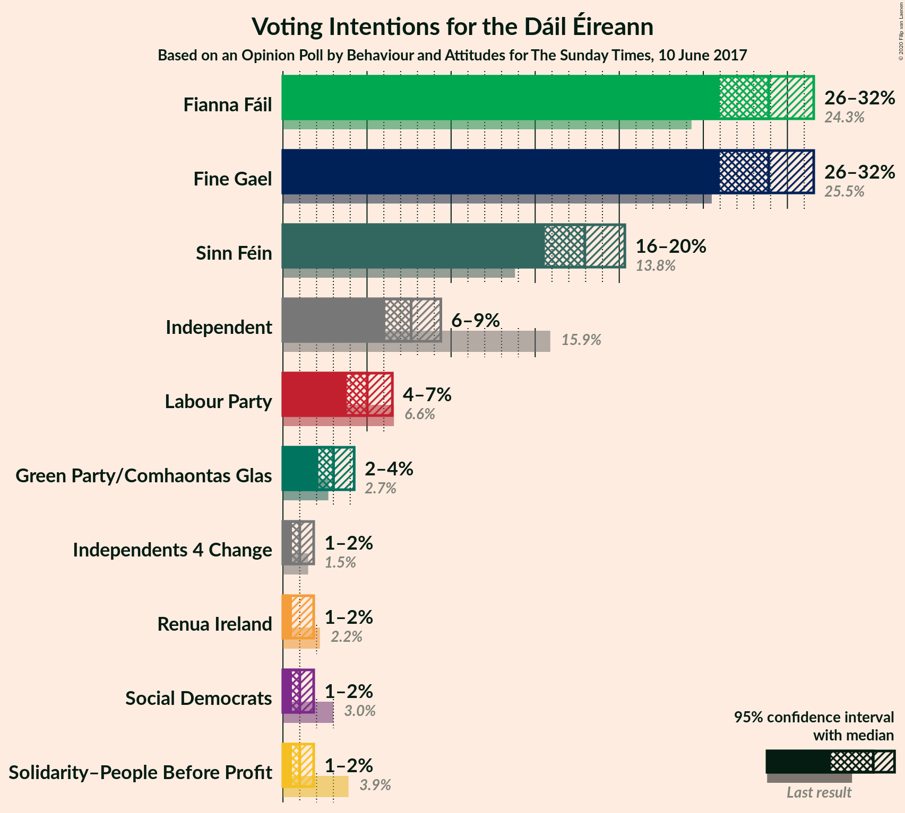
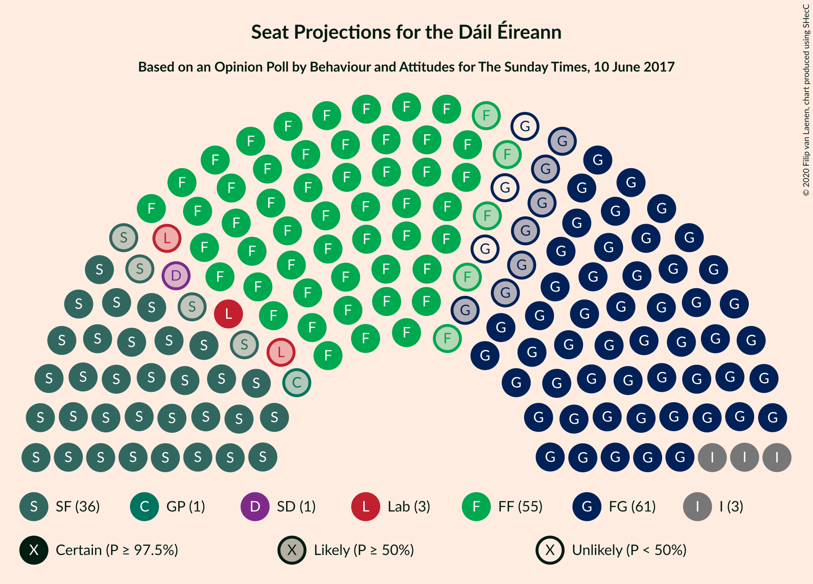
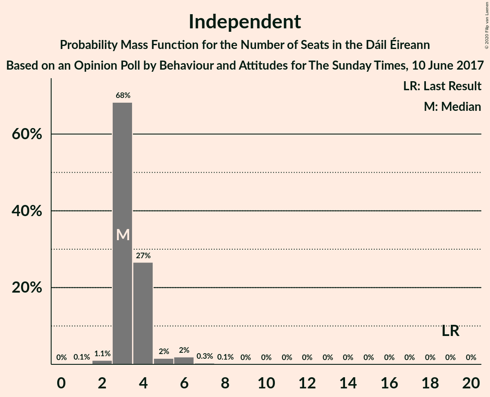
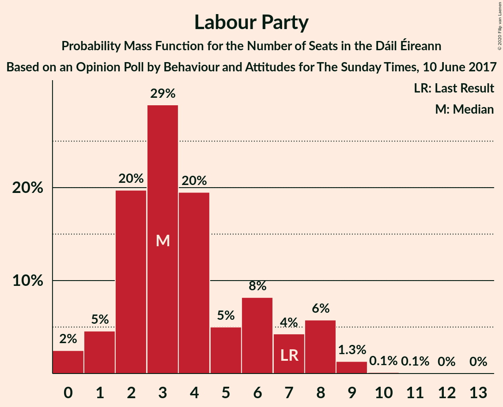
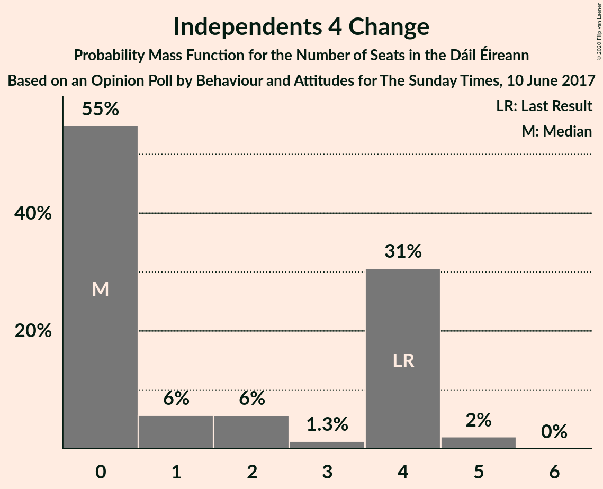
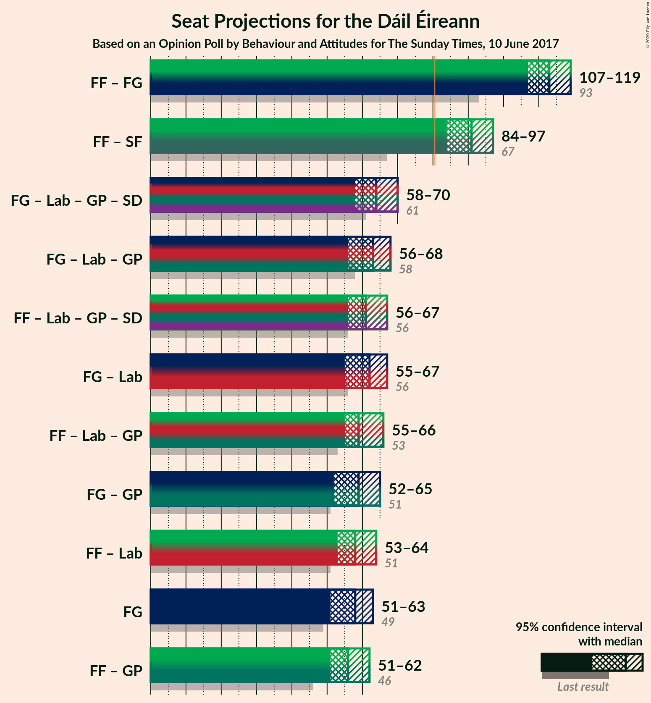
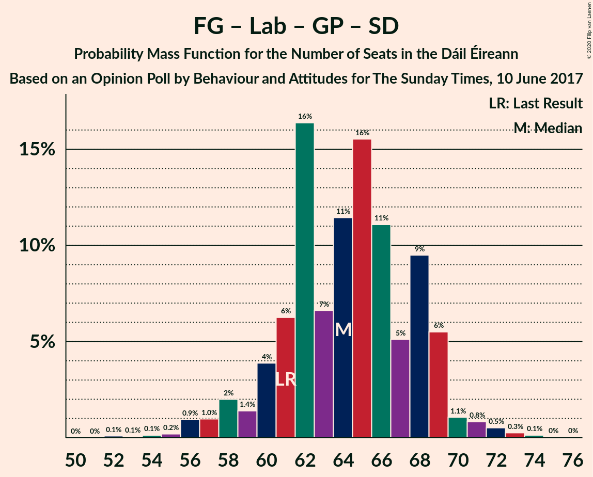
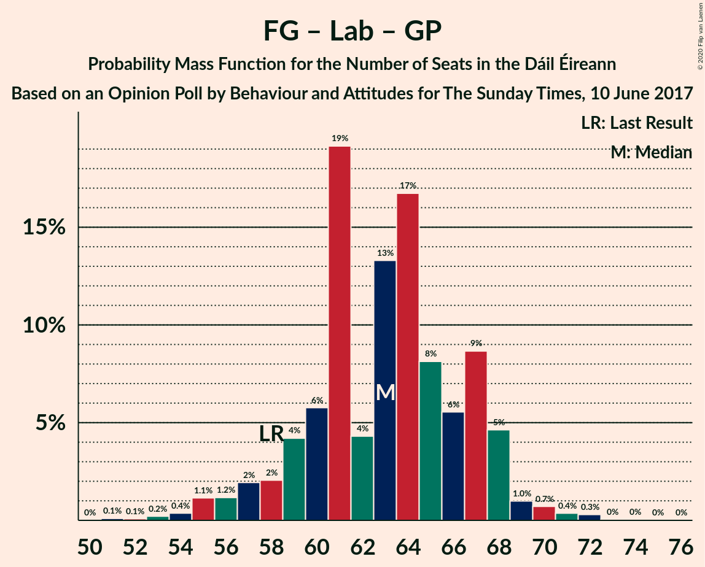
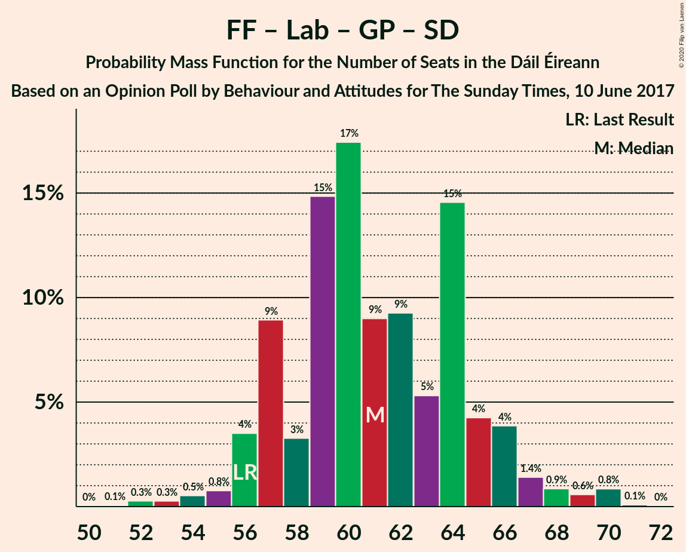
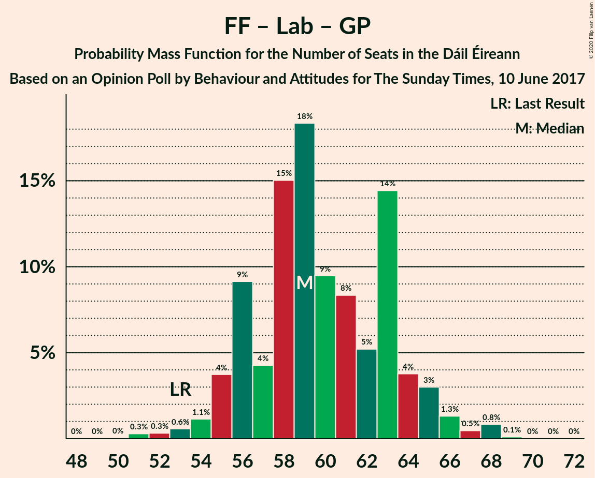

# Opinion Poll by Behaviour and Attitudes for The Sunday Times, 10 June 2017

<a href="#voting-intentions">Voting Intentions</a> | <a href="#seats">Seats</a> | <a href="#coalitions">Coalitions</a> | <a href="#technical-information">Technical Information</a>

## Voting Intentions

### Confidence Intervals

| Party | Last Result | Poll Result | 80% Confidence Interval | 90% Confidence Interval | 95% Confidence Interval | 99% Confidence Interval |
|:-----:|:-----------:|:-----------:|:-----------------------:|:-----------------------:|:-----------------------:|:-----------------------:|
| Fine Gael | 25.5% | 28.7% | 26.9–30.6% |26.4–31.1% |26.0–31.6% |25.1–32.5% |
| Fianna Fáil | 24.3% | 28.7% | 26.9–30.6% |26.4–31.1% |26.0–31.6% |25.1–32.5% |
| Sinn Féin | 13.8% | 17.8% | 16.4–19.5% |15.9–19.9% |15.6–20.3% |14.9–21.1% |
| Independent | 15.9% | 7.6% | 6.6–8.7% |6.3–9.1% |6.1–9.4% |5.7–10.0% |
| Labour Party | 6.6% | 5.0% | 4.2–6.0% |4.0–6.3% |3.8–6.5% |3.4–7.0% |
| Green Party/Comhaontas Glas | 2.7% | 3.0% | 2.4–3.8% |2.2–4.0% |2.1–4.2% |1.8–4.7% |
| Solidarity–People Before Profit | 3.9% | 1.0% | 0.7–1.5% |0.6–1.7% |0.5–1.8% |0.4–2.1% |
| Social Democrats | 3.0% | 1.0% | 0.7–1.5% |0.6–1.7% |0.5–1.8% |0.4–2.1% |
| Renua Ireland | 2.2% | 1.0% | 0.7–1.5% |0.6–1.7% |0.5–1.8% |0.4–2.1% |
| Independents 4 Change | 1.5% | 1.0% | 0.7–1.5% |0.6–1.7% |0.5–1.8% |0.4–2.1% |

*Note:* The poll result column reflects the actual value used in the calculations. Published results may vary slightly, and in addition be rounded to fewer digits.

## Seats

### Confidence Intervals

| Party | Last Result | Median | 80% Confidence Interval | 90% Confidence Interval | 95% Confidence Interval | 99% Confidence Interval |
|:-----:|:-----------:|:------:|:-----------------------:|:-----------------------:|:-----------------------:|:-----------------------:|
| <a href="#fine-gael">Fine Gael</a> | 49 | 58 | 55–61 |52–62 |51–63 |48–65 |
| <a href="#fianna-fáil">Fianna Fáil</a> | 44 | 55 | 51–58 |50–60 |50–60 |47–61 |
| <a href="#sinn-féin">Sinn Féin</a> | 23 | 36 | 33–38 |33–39 |32–40 |30–41 |
| <a href="#independent">Independent</a> | 19 | 3 | 3–4 |3–4 |3–5 |2–6 |
| <a href="#labour-party">Labour Party</a> | 7 | 3 | 2–7 |1–8 |1–8 |0–9 |
| <a href="#green-party/comhaontas-glas">Green Party/Comhaontas Glas</a> | 2 | 1 | 0–3 |0–3 |0–3 |0–4 |
| <a href="#solidarity–people-before-profit">Solidarity–People Before Profit</a> | 6 | 0 | 0 |0 |0 |0–1 |
| <a href="#social-democrats">Social Democrats</a> | 3 | 1 | 1–2 |1–3 |0–3 |0–3 |
| <a href="#renua-ireland">Renua Ireland</a> | 0 | 0 | 0 |0 |0 |0 |
| <a href="#independents-4-change">Independents 4 Change</a> | 4 | 0 | 0–4 |0–4 |0–4 |0–5 |

### Fine Gael

*For a full overview of the results for this party, see the [Fine Gael](party-finegael.html) page.*

| Number of Seats | Probability | Accumulated | Special Marks |
|:---------------:|:-----------:|:-----------:|:-------------:|
| 46 | 0.1% | 100% |  |
| 47 | 0.2% | 99.9% |  |
| 48 | 0.4% | 99.8% |  |
| 49 | 0.4% | 99.4% | Last Result |
| 50 | 0.9% | 99.0% |  |
| 51 | 2% | 98% |  |
| 52 | 1.1% | 96% |  |
| 53 | 1.3% | 95% |  |
| 54 | 3% | 94% |  |
| 55 | 6% | 90% |  |
| 56 | 17% | 84% |  |
| 57 | 6% | 67% |  |
| 58 | 14% | 62% | Median |
| 59 | 11% | 48% |  |
| 60 | 9% | 37% |  |
| 61 | 18% | 27% |  |
| 62 | 5% | 9% |  |
| 63 | 2% | 4% |  |
| 64 | 1.1% | 2% |  |
| 65 | 0.8% | 1.0% |  |
| 66 | 0.2% | 0.3% |  |
| 67 | 0.1% | 0.1% |  |
| 68 | 0% | 0% |  |

### Fianna Fáil

*For a full overview of the results for this party, see the [Fianna Fáil](party-fiannafáil.html) page.*

| Number of Seats | Probability | Accumulated | Special Marks |
|:---------------:|:-----------:|:-----------:|:-------------:|
| 44 | 0.1% | 100% | Last Result |
| 45 | 0.1% | 99.9% |  |
| 46 | 0.2% | 99.8% |  |
| 47 | 0.3% | 99.6% |  |
| 48 | 0.5% | 99.3% |  |
| 49 | 1.2% | 98.9% |  |
| 50 | 4% | 98% |  |
| 51 | 4% | 94% |  |
| 52 | 5% | 90% |  |
| 53 | 23% | 84% |  |
| 54 | 8% | 62% |  |
| 55 | 13% | 53% | Median |
| 56 | 9% | 41% |  |
| 57 | 10% | 32% |  |
| 58 | 13% | 22% |  |
| 59 | 3% | 8% |  |
| 60 | 4% | 5% |  |
| 61 | 1.4% | 2% |  |
| 62 | 0.2% | 0.2% |  |
| 63 | 0% | 0% |  |

### Sinn Féin

*For a full overview of the results for this party, see the [Sinn Féin](party-sinnféin.html) page.*

| Number of Seats | Probability | Accumulated | Special Marks |
|:---------------:|:-----------:|:-----------:|:-------------:|
| 23 | 0% | 100% | Last Result |
| 24 | 0% | 100% |  |
| 25 | 0% | 100% |  |
| 26 | 0% | 100% |  |
| 27 | 0% | 99.9% |  |
| 28 | 0.1% | 99.9% |  |
| 29 | 0.1% | 99.8% |  |
| 30 | 0.4% | 99.7% |  |
| 31 | 1.3% | 99.3% |  |
| 32 | 2% | 98% |  |
| 33 | 8% | 96% |  |
| 34 | 9% | 89% |  |
| 35 | 15% | 80% |  |
| 36 | 24% | 65% | Median |
| 37 | 29% | 41% |  |
| 38 | 6% | 12% |  |
| 39 | 3% | 7% |  |
| 40 | 2% | 3% |  |
| 41 | 1.2% | 2% |  |
| 42 | 0.2% | 0.4% |  |
| 43 | 0.1% | 0.2% |  |
| 44 | 0% | 0% |  |

### Independent

*For a full overview of the results for this party, see the [Independent](party-independent.html) page.*

| Number of Seats | Probability | Accumulated | Special Marks |
|:---------------:|:-----------:|:-----------:|:-------------:|
| 1 | 0.1% | 100% |  |
| 2 | 1.1% | 99.9% |  |
| 3 | 68% | 98.9% | Median |
| 4 | 27% | 31% |  |
| 5 | 2% | 4% |  |
| 6 | 2% | 2% |  |
| 7 | 0.3% | 0.5% |  |
| 8 | 0.1% | 0.1% |  |
| 9 | 0% | 0% |  |
| 10 | 0% | 0% |  |
| 11 | 0% | 0% |  |
| 12 | 0% | 0% |  |
| 13 | 0% | 0% |  |
| 14 | 0% | 0% |  |
| 15 | 0% | 0% |  |
| 16 | 0% | 0% |  |
| 17 | 0% | 0% |  |
| 18 | 0% | 0% |  |
| 19 | 0% | 0% | Last Result |

### Labour Party

*For a full overview of the results for this party, see the [Labour Party](party-labourparty.html) page.*

| Number of Seats | Probability | Accumulated | Special Marks |
|:---------------:|:-----------:|:-----------:|:-------------:|
| 0 | 2% | 100% |  |
| 1 | 5% | 98% |  |
| 2 | 20% | 93% |  |
| 3 | 29% | 73% | Median |
| 4 | 20% | 44% |  |
| 5 | 5% | 25% |  |
| 6 | 8% | 20% |  |
| 7 | 4% | 12% | Last Result |
| 8 | 6% | 7% |  |
| 9 | 1.3% | 2% |  |
| 10 | 0.1% | 0.3% |  |
| 11 | 0.1% | 0.2% |  |
| 12 | 0% | 0.1% |  |
| 13 | 0% | 0% |  |

### Green Party/Comhaontas Glas

*For a full overview of the results for this party, see the [Green Party/Comhaontas Glas](party-greenpartycomhaontasglas.html) page.*

| Number of Seats | Probability | Accumulated | Special Marks |
|:---------------:|:-----------:|:-----------:|:-------------:|
| 0 | 36% | 100% |  |
| 1 | 28% | 64% | Median |
| 2 | 20% | 36% | Last Result |
| 3 | 15% | 15% |  |
| 4 | 0.5% | 0.6% |  |
| 5 | 0.1% | 0.1% |  |
| 6 | 0% | 0% |  |

### Solidarity–People Before Profit

*For a full overview of the results for this party, see the [Solidarity–People Before Profit](party-solidarity–peoplebeforeprofit.html) page.*

| Number of Seats | Probability | Accumulated | Special Marks |
|:---------------:|:-----------:|:-----------:|:-------------:|
| 0 | 98% | 100% | Median |
| 1 | 2% | 2% |  |
| 2 | 0% | 0% |  |
| 3 | 0% | 0% |  |
| 4 | 0% | 0% |  |
| 5 | 0% | 0% |  |
| 6 | 0% | 0% | Last Result |

### Social Democrats

*For a full overview of the results for this party, see the [Social Democrats](party-socialdemocrats.html) page.*

| Number of Seats | Probability | Accumulated | Special Marks |
|:---------------:|:-----------:|:-----------:|:-------------:|
| 0 | 4% | 100% |  |
| 1 | 72% | 96% | Median |
| 2 | 19% | 24% |  |
| 3 | 5% | 5% | Last Result |
| 4 | 0.3% | 0.3% |  |
| 5 | 0% | 0% |  |

### Renua Ireland

*For a full overview of the results for this party, see the [Renua Ireland](party-renuaireland.html) page.*

| Number of Seats | Probability | Accumulated | Special Marks |
|:---------------:|:-----------:|:-----------:|:-------------:|
| 0 | 100% | 100% | Last Result, Median |

### Independents 4 Change

*For a full overview of the results for this party, see the [Independents 4 Change](party-independents4change.html) page.*

| Number of Seats | Probability | Accumulated | Special Marks |
|:---------------:|:-----------:|:-----------:|:-------------:|
| 0 | 55% | 100% | Median |
| 1 | 6% | 45% |  |
| 2 | 6% | 40% |  |
| 3 | 1.3% | 34% |  |
| 4 | 31% | 33% | Last Result |
| 5 | 2% | 2% |  |
| 6 | 0% | 0% |  |

## Coalitions

### Confidence Intervals

| Coalition | Last Result | Median | Majority? | 80% Confidence Interval | 90% Confidence Interval | 95% Confidence Interval | 99% Confidence Interval |
|:---------:|:-----------:|:------:|:---------:|:-----------------------:|:-----------------------:|:-----------------------:|:-----------------------:|
| Fianna Fáil – Fine Gael | 93 | 113 | 100% | 109–116 | 108–118 | 107–119 | 105–119 |
| Fianna Fáil – Sinn Féin | 67 | 91 | 99.8% | 87–95 | 85–96 | 84–97 | 82–100 |
| Fine Gael – Labour Party – Green Party/Comhaontas Glas – Social Democrats | 61 | 64 | 0% | 61–68 | 59–69 | 58–70 | 56–72 |
| Fine Gael – Labour Party – Green Party/Comhaontas Glas | 58 | 63 | 0% | 59–67 | 57–68 | 56–68 | 54–71 |
| Fianna Fáil – Labour Party – Green Party/Comhaontas Glas – Social Democrats | 56 | 61 | 0% | 57–65 | 56–66 | 56–67 | 53–70 |
| Fine Gael – Labour Party | 56 | 62 | 0% | 58–65 | 56–67 | 55–67 | 52–69 |
| Fianna Fáil – Labour Party – Green Party/Comhaontas Glas | 53 | 59 | 0% | 56–63 | 55–65 | 55–66 | 52–68 |
| Fine Gael – Green Party/Comhaontas Glas | 51 | 59 | 0% | 56–64 | 54–64 | 52–65 | 50–67 |
| Fianna Fáil – Labour Party | 51 | 58 | 0% | 55–62 | 54–63 | 53–64 | 50–66 |
| Fine Gael | 49 | 58 | 0% | 55–61 | 52–62 | 51–63 | 48–65 |
| Fianna Fáil – Green Party/Comhaontas Glas | 46 | 56 | 0% | 52–60 | 52–61 | 51–62 | 49–63 |

### Fianna Fáil – Fine Gael

| Number of Seats | Probability | Accumulated | Special Marks |
|:---------------:|:-----------:|:-----------:|:-------------:|
| 93 | 0% | 100% | Last Result |
| 94 | 0% | 100% |  |
| 95 | 0% | 100% |  |
| 96 | 0% | 100% |  |
| 97 | 0% | 100% |  |
| 98 | 0% | 100% |  |
| 99 | 0% | 100% |  |
| 100 | 0% | 100% |  |
| 101 | 0% | 100% |  |
| 102 | 0% | 99.9% |  |
| 103 | 0.1% | 99.9% |  |
| 104 | 0.3% | 99.8% |  |
| 105 | 0.7% | 99.5% |  |
| 106 | 0.8% | 98.8% |  |
| 107 | 2% | 98% |  |
| 108 | 4% | 96% |  |
| 109 | 3% | 91% |  |
| 110 | 9% | 88% |  |
| 111 | 8% | 79% |  |
| 112 | 8% | 71% |  |
| 113 | 16% | 62% | Median |
| 114 | 19% | 47% |  |
| 115 | 7% | 28% |  |
| 116 | 10% | 20% |  |
| 117 | 2% | 10% |  |
| 118 | 3% | 8% |  |
| 119 | 4% | 4% |  |
| 120 | 0.2% | 0.4% |  |
| 121 | 0.2% | 0.3% |  |
| 122 | 0% | 0.1% |  |
| 123 | 0% | 0% |  |

### Fianna Fáil – Sinn Féin

| Number of Seats | Probability | Accumulated | Special Marks |
|:---------------:|:-----------:|:-----------:|:-------------:|
| 67 | 0% | 100% | Last Result |
| 68 | 0% | 100% |  |
| 69 | 0% | 100% |  |
| 70 | 0% | 100% |  |
| 71 | 0% | 100% |  |
| 72 | 0% | 100% |  |
| 73 | 0% | 100% |  |
| 74 | 0% | 100% |  |
| 75 | 0% | 100% |  |
| 76 | 0% | 100% |  |
| 77 | 0% | 100% |  |
| 78 | 0% | 100% |  |
| 79 | 0% | 100% |  |
| 80 | 0.2% | 100% |  |
| 81 | 0.1% | 99.8% | Majority |
| 82 | 0.3% | 99.7% |  |
| 83 | 0.6% | 99.4% |  |
| 84 | 2% | 98.8% |  |
| 85 | 2% | 97% |  |
| 86 | 3% | 95% |  |
| 87 | 5% | 92% |  |
| 88 | 14% | 86% |  |
| 89 | 11% | 72% |  |
| 90 | 6% | 61% |  |
| 91 | 12% | 55% | Median |
| 92 | 12% | 43% |  |
| 93 | 8% | 31% |  |
| 94 | 8% | 23% |  |
| 95 | 8% | 14% |  |
| 96 | 3% | 6% |  |
| 97 | 2% | 3% |  |
| 98 | 0.5% | 2% |  |
| 99 | 0.4% | 1.1% |  |
| 100 | 0.5% | 0.7% |  |
| 101 | 0.1% | 0.1% |  |
| 102 | 0% | 0% |  |

### Fine Gael – Labour Party – Green Party/Comhaontas Glas – Social Democrats

| Number of Seats | Probability | Accumulated | Special Marks |
|:---------------:|:-----------:|:-----------:|:-------------:|
| 52 | 0.1% | 100% |  |
| 53 | 0.1% | 99.9% |  |
| 54 | 0.1% | 99.8% |  |
| 55 | 0.2% | 99.7% |  |
| 56 | 0.9% | 99.5% |  |
| 57 | 1.0% | 98.6% |  |
| 58 | 2% | 98% |  |
| 59 | 1.4% | 96% |  |
| 60 | 4% | 94% |  |
| 61 | 6% | 90% | Last Result |
| 62 | 16% | 84% |  |
| 63 | 7% | 68% | Median |
| 64 | 11% | 61% |  |
| 65 | 16% | 50% |  |
| 66 | 11% | 34% |  |
| 67 | 5% | 23% |  |
| 68 | 9% | 18% |  |
| 69 | 6% | 8% |  |
| 70 | 1.1% | 3% |  |
| 71 | 0.8% | 2% |  |
| 72 | 0.5% | 1.0% |  |
| 73 | 0.3% | 0.5% |  |
| 74 | 0.1% | 0.2% |  |
| 75 | 0% | 0.1% |  |
| 76 | 0% | 0% |  |

### Fine Gael – Labour Party – Green Party/Comhaontas Glas

| Number of Seats | Probability | Accumulated | Special Marks |
|:---------------:|:-----------:|:-----------:|:-------------:|
| 51 | 0.1% | 100% |  |
| 52 | 0.1% | 99.9% |  |
| 53 | 0.2% | 99.8% |  |
| 54 | 0.4% | 99.6% |  |
| 55 | 1.1% | 99.2% |  |
| 56 | 1.2% | 98% |  |
| 57 | 2% | 97% |  |
| 58 | 2% | 95% | Last Result |
| 59 | 4% | 93% |  |
| 60 | 6% | 89% |  |
| 61 | 19% | 83% |  |
| 62 | 4% | 64% | Median |
| 63 | 13% | 59% |  |
| 64 | 17% | 46% |  |
| 65 | 8% | 29% |  |
| 66 | 6% | 21% |  |
| 67 | 9% | 16% |  |
| 68 | 5% | 7% |  |
| 69 | 1.0% | 2% |  |
| 70 | 0.7% | 1.5% |  |
| 71 | 0.4% | 0.8% |  |
| 72 | 0.3% | 0.4% |  |
| 73 | 0% | 0.1% |  |
| 74 | 0% | 0.1% |  |
| 75 | 0% | 0% |  |

### Fianna Fáil – Labour Party – Green Party/Comhaontas Glas – Social Democrats

| Number of Seats | Probability | Accumulated | Special Marks |
|:---------------:|:-----------:|:-----------:|:-------------:|
| 50 | 0% | 100% |  |
| 51 | 0.1% | 99.9% |  |
| 52 | 0.3% | 99.9% |  |
| 53 | 0.3% | 99.6% |  |
| 54 | 0.5% | 99.3% |  |
| 55 | 0.8% | 98.8% |  |
| 56 | 4% | 98% | Last Result |
| 57 | 9% | 95% |  |
| 58 | 3% | 86% |  |
| 59 | 15% | 82% |  |
| 60 | 17% | 67% | Median |
| 61 | 9% | 50% |  |
| 62 | 9% | 41% |  |
| 63 | 5% | 32% |  |
| 64 | 15% | 26% |  |
| 65 | 4% | 12% |  |
| 66 | 4% | 8% |  |
| 67 | 1.4% | 4% |  |
| 68 | 0.9% | 2% |  |
| 69 | 0.6% | 2% |  |
| 70 | 0.8% | 1.0% |  |
| 71 | 0.1% | 0.1% |  |
| 72 | 0% | 0% |  |

### Fine Gael – Labour Party

| Number of Seats | Probability | Accumulated | Special Marks |
|:---------------:|:-----------:|:-----------:|:-------------:|
| 49 | 0.1% | 100% |  |
| 50 | 0% | 99.9% |  |
| 51 | 0.2% | 99.9% |  |
| 52 | 0.4% | 99.7% |  |
| 53 | 1.1% | 99.3% |  |
| 54 | 0.6% | 98% |  |
| 55 | 1.3% | 98% |  |
| 56 | 2% | 96% | Last Result |
| 57 | 4% | 94% |  |
| 58 | 2% | 90% |  |
| 59 | 3% | 88% |  |
| 60 | 12% | 84% |  |
| 61 | 20% | 72% | Median |
| 62 | 7% | 52% |  |
| 63 | 9% | 46% |  |
| 64 | 22% | 36% |  |
| 65 | 5% | 15% |  |
| 66 | 4% | 9% |  |
| 67 | 3% | 5% |  |
| 68 | 1.1% | 2% |  |
| 69 | 0.2% | 0.7% |  |
| 70 | 0.3% | 0.4% |  |
| 71 | 0.1% | 0.2% |  |
| 72 | 0% | 0.1% |  |
| 73 | 0% | 0% |  |

### Fianna Fáil – Labour Party – Green Party/Comhaontas Glas

| Number of Seats | Probability | Accumulated | Special Marks |
|:---------------:|:-----------:|:-----------:|:-------------:|
| 48 | 0% | 100% |  |
| 49 | 0% | 99.9% |  |
| 50 | 0% | 99.9% |  |
| 51 | 0.3% | 99.9% |  |
| 52 | 0.3% | 99.6% |  |
| 53 | 0.6% | 99.3% | Last Result |
| 54 | 1.1% | 98.7% |  |
| 55 | 4% | 98% |  |
| 56 | 9% | 94% |  |
| 57 | 4% | 85% |  |
| 58 | 15% | 80% |  |
| 59 | 18% | 65% | Median |
| 60 | 9% | 47% |  |
| 61 | 8% | 38% |  |
| 62 | 5% | 29% |  |
| 63 | 14% | 24% |  |
| 64 | 4% | 10% |  |
| 65 | 3% | 6% |  |
| 66 | 1.3% | 3% |  |
| 67 | 0.5% | 1.5% |  |
| 68 | 0.8% | 1.0% |  |
| 69 | 0.1% | 0.2% |  |
| 70 | 0% | 0.1% |  |
| 71 | 0% | 0% |  |

### Fine Gael – Green Party/Comhaontas Glas

| Number of Seats | Probability | Accumulated | Special Marks |
|:---------------:|:-----------:|:-----------:|:-------------:|
| 48 | 0.2% | 100% |  |
| 49 | 0.1% | 99.8% |  |
| 50 | 0.4% | 99.7% |  |
| 51 | 0.5% | 99.3% | Last Result |
| 52 | 1.4% | 98.8% |  |
| 53 | 2% | 97% |  |
| 54 | 2% | 95% |  |
| 55 | 2% | 94% |  |
| 56 | 8% | 92% |  |
| 57 | 15% | 84% |  |
| 58 | 10% | 69% |  |
| 59 | 11% | 59% | Median |
| 60 | 10% | 48% |  |
| 61 | 17% | 38% |  |
| 62 | 5% | 21% |  |
| 63 | 4% | 16% |  |
| 64 | 8% | 12% |  |
| 65 | 2% | 3% |  |
| 66 | 0.5% | 1.1% |  |
| 67 | 0.3% | 0.6% |  |
| 68 | 0.2% | 0.3% |  |
| 69 | 0.1% | 0.1% |  |
| 70 | 0% | 0% |  |

### Fianna Fáil – Labour Party

| Number of Seats | Probability | Accumulated | Special Marks |
|:---------------:|:-----------:|:-----------:|:-------------:|
| 48 | 0.1% | 100% |  |
| 49 | 0.2% | 99.9% |  |
| 50 | 0.2% | 99.7% |  |
| 51 | 0.4% | 99.5% | Last Result |
| 52 | 0.9% | 99.1% |  |
| 53 | 2% | 98% |  |
| 54 | 2% | 96% |  |
| 55 | 5% | 94% |  |
| 56 | 17% | 89% |  |
| 57 | 13% | 73% |  |
| 58 | 10% | 60% | Median |
| 59 | 11% | 50% |  |
| 60 | 12% | 39% |  |
| 61 | 7% | 27% |  |
| 62 | 13% | 20% |  |
| 63 | 4% | 8% |  |
| 64 | 2% | 4% |  |
| 65 | 1.1% | 2% |  |
| 66 | 1.0% | 1.4% |  |
| 67 | 0.3% | 0.4% |  |
| 68 | 0% | 0.1% |  |
| 69 | 0% | 0% |  |

### Fine Gael

| Number of Seats | Probability | Accumulated | Special Marks |
|:---------------:|:-----------:|:-----------:|:-------------:|
| 46 | 0.1% | 100% |  |
| 47 | 0.2% | 99.9% |  |
| 48 | 0.4% | 99.8% |  |
| 49 | 0.4% | 99.4% | Last Result |
| 50 | 0.9% | 99.0% |  |
| 51 | 2% | 98% |  |
| 52 | 1.1% | 96% |  |
| 53 | 1.3% | 95% |  |
| 54 | 3% | 94% |  |
| 55 | 6% | 90% |  |
| 56 | 17% | 84% |  |
| 57 | 6% | 67% |  |
| 58 | 14% | 62% | Median |
| 59 | 11% | 48% |  |
| 60 | 9% | 37% |  |
| 61 | 18% | 27% |  |
| 62 | 5% | 9% |  |
| 63 | 2% | 4% |  |
| 64 | 1.1% | 2% |  |
| 65 | 0.8% | 1.0% |  |
| 66 | 0.2% | 0.3% |  |
| 67 | 0.1% | 0.1% |  |
| 68 | 0% | 0% |  |

### Fianna Fáil – Green Party/Comhaontas Glas

| Number of Seats | Probability | Accumulated | Special Marks |
|:---------------:|:-----------:|:-----------:|:-------------:|
| 46 | 0.1% | 100% | Last Result |
| 47 | 0.1% | 99.9% |  |
| 48 | 0.2% | 99.8% |  |
| 49 | 0.7% | 99.6% |  |
| 50 | 1.2% | 98.9% |  |
| 51 | 2% | 98% |  |
| 52 | 5% | 95% |  |
| 53 | 11% | 90% |  |
| 54 | 9% | 78% |  |
| 55 | 12% | 70% |  |
| 56 | 14% | 58% | Median |
| 57 | 15% | 44% |  |
| 58 | 6% | 29% |  |
| 59 | 12% | 23% |  |
| 60 | 5% | 11% |  |
| 61 | 2% | 6% |  |
| 62 | 3% | 4% |  |
| 63 | 0.6% | 0.7% |  |
| 64 | 0.1% | 0.1% |  |
| 65 | 0% | 0% |  |

## Technical Information

### Opinion Poll

+ **Polling firm:** Behaviour and Attitudes
+ **Commissioner(s):** The Sunday Times
+ **Fieldwork period:** 10 June 2017

### Calculations

+ **Sample size:** 1004
+ **Simulations done:** 1,048,576
+ **Error estimate:** 1.65%

