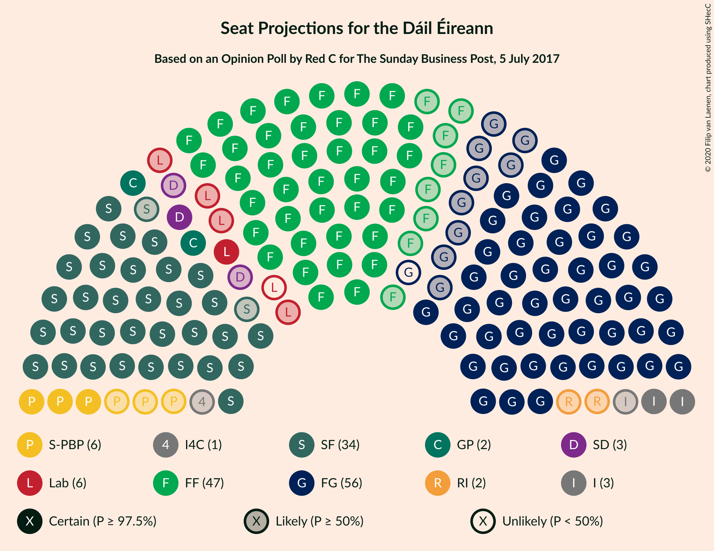
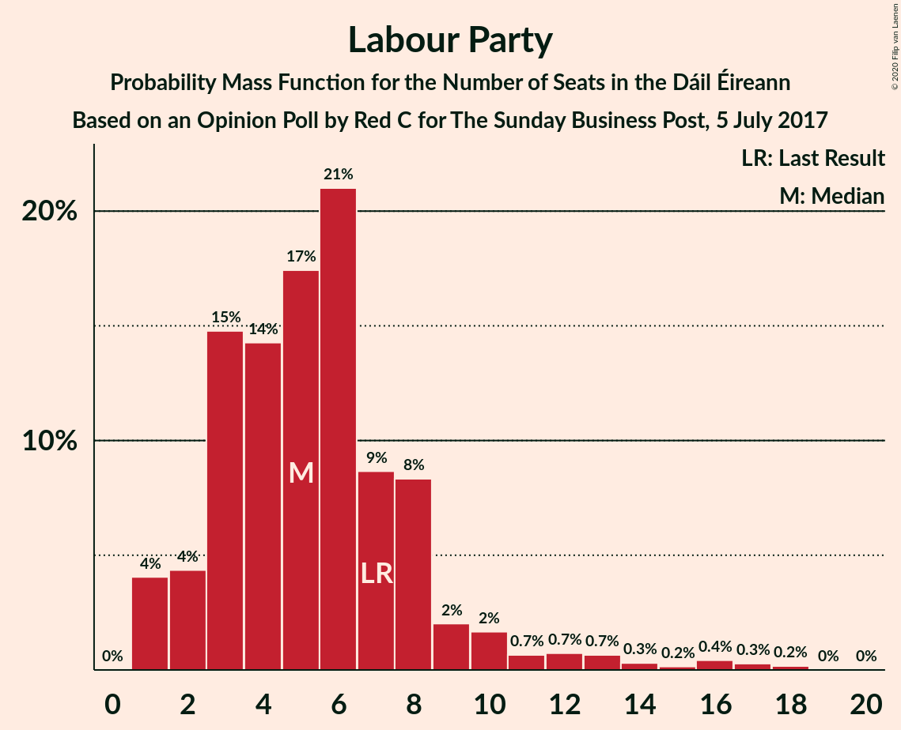
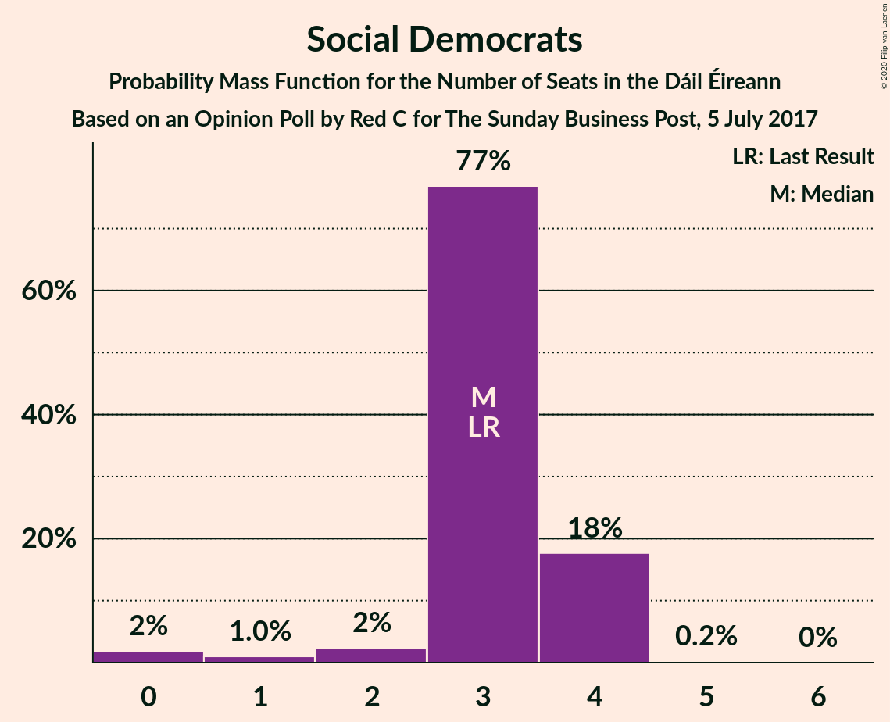
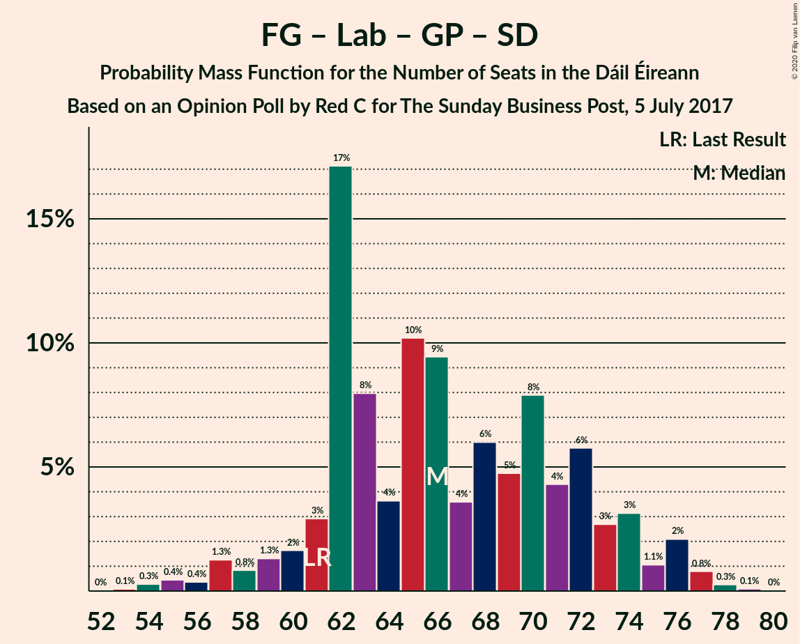
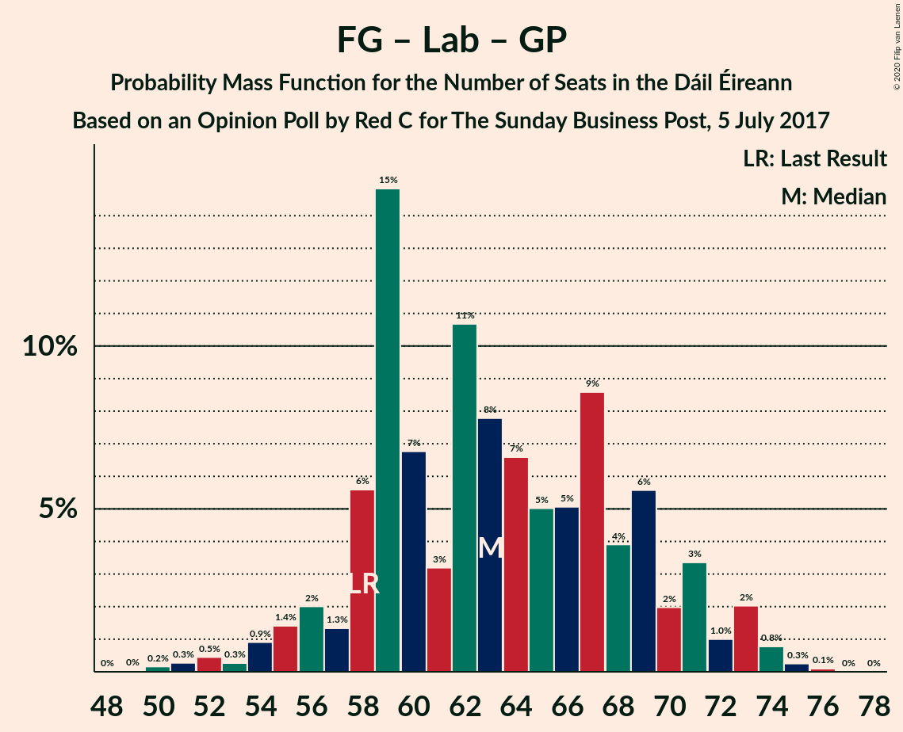
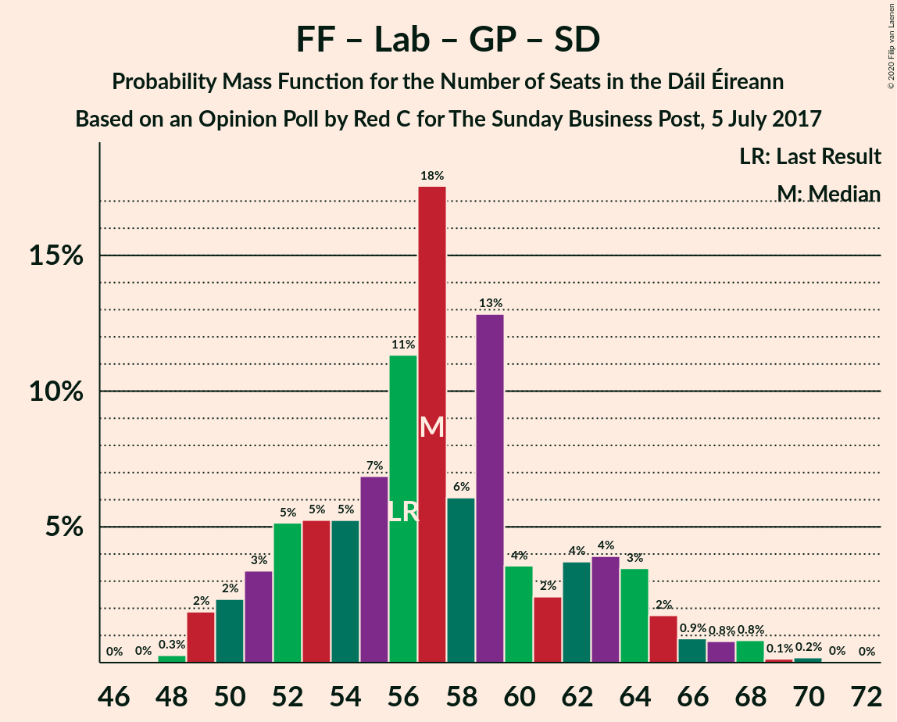
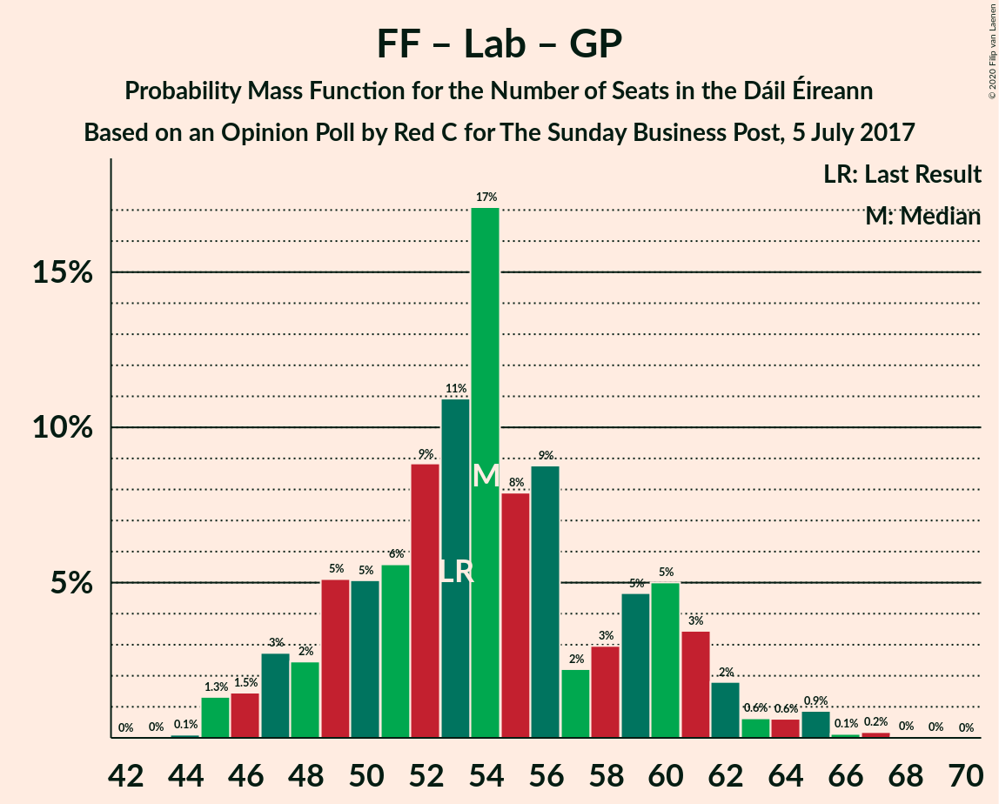

# Opinion Poll by Red C for The Sunday Business Post, 5 July 2017

<a href="#voting-intentions">Voting Intentions</a> | <a href="#seats">Seats</a> | <a href="#coalitions">Coalitions</a> | <a href="#technical-information">Technical Information</a>

## Voting Intentions

### Confidence Intervals

| Party | Last Result | Poll Result | 80% Confidence Interval | 90% Confidence Interval | 95% Confidence Interval | 99% Confidence Interval |
|:-----:|:-----------:|:-----------:|:-----------------------:|:-----------------------:|:-----------------------:|:-----------------------:|
| Fine Gael | 25.5% | 27.0% | 25.3–28.9% |24.8–29.4% |24.3–29.8% |23.5–30.7% |
| Fianna Fáil | 24.3% | 24.0% | 22.3–25.8% |21.9–26.3% |21.4–26.7% |20.7–27.6% |
| Sinn Féin | 13.8% | 18.0% | 16.5–19.6% |16.1–20.1% |15.7–20.5% |15.0–21.3% |
| Independent | 15.9% | 6.8% | 5.9–7.9% |5.6–8.3% |5.4–8.5% |5.0–9.1% |
| Labour Party | 6.6% | 6.0% | 5.1–7.1% |4.9–7.4% |4.7–7.7% |4.3–8.2% |
| Solidarity–People Before Profit | 3.9% | 4.0% | 3.3–4.9% |3.1–5.2% |2.9–5.4% |2.7–5.9% |
| Green Party/Comhaontas Glas | 2.7% | 4.0% | 3.3–4.9% |3.1–5.2% |2.9–5.4% |2.7–5.9% |
| Renua Ireland | 2.2% | 3.0% | 2.4–3.8% |2.2–4.1% |2.1–4.3% |1.9–4.7% |
| Social Democrats | 3.0% | 2.0% | 1.5–2.7% |1.4–2.9% |1.3–3.1% |1.1–3.4% |
| Independents 4 Change | 1.5% | 0.9% | 0.6–1.4% |0.5–1.6% |0.5–1.7% |0.4–2.0% |

*Note:* The poll result column reflects the actual value used in the calculations. Published results may vary slightly, and in addition be rounded to fewer digits.

## Seats

### Confidence Intervals

| Party | Last Result | Median | 80% Confidence Interval | 90% Confidence Interval | 95% Confidence Interval | 99% Confidence Interval |
|:-----:|:-----------:|:------:|:-----------------------:|:-----------------------:|:-----------------------:|:-----------------------:|
| <a href="#fine-gael">Fine Gael</a> | 49 | 55 | 49–62 |47–64 |46–64 |44–65 |
| <a href="#fianna-fáil">Fianna Fáil</a> | 44 | 47 | 41–50 |40–51 |39–53 |37–55 |
| <a href="#sinn-féin">Sinn Féin</a> | 23 | 34 | 32–38 |32–38 |32–39 |31–41 |
| <a href="#independent">Independent</a> | 19 | 3 | 3 |3–4 |2–4 |1–5 |
| <a href="#labour-party">Labour Party</a> | 7 | 5 | 3–8 |2–10 |1–12 |1–16 |
| <a href="#solidarity–people-before-profit">Solidarity–People Before Profit</a> | 6 | 6 | 3–9 |3–9 |3–9 |3–10 |
| <a href="#green-party/comhaontas-glas">Green Party/Comhaontas Glas</a> | 2 | 2 | 2–4 |2–4 |2–5 |0–5 |
| <a href="#renua-ireland">Renua Ireland</a> | 0 | 2 | 0–5 |0–5 |0–6 |0–6 |
| <a href="#social-democrats">Social Democrats</a> | 3 | 3 | 3–4 |2–4 |1–4 |0–4 |
| <a href="#independents-4-change">Independents 4 Change</a> | 4 | 1 | 0–3 |0–4 |0–4 |0–5 |

### Fine Gael

*For a full overview of the results for this party, see the [Fine Gael](party-finegael.html) page.*

| Number of Seats | Probability | Accumulated | Special Marks |
|:---------------:|:-----------:|:-----------:|:-------------:|
| 42 | 0.1% | 100% |  |
| 43 | 0.2% | 99.9% |  |
| 44 | 0.5% | 99.7% |  |
| 45 | 0.8% | 99.2% |  |
| 46 | 2% | 98% |  |
| 47 | 4% | 97% |  |
| 48 | 3% | 93% |  |
| 49 | 3% | 90% | Last Result |
| 50 | 4% | 87% |  |
| 51 | 4% | 83% |  |
| 52 | 10% | 79% |  |
| 53 | 7% | 69% |  |
| 54 | 7% | 62% |  |
| 55 | 7% | 55% | Median |
| 56 | 11% | 48% |  |
| 57 | 3% | 37% |  |
| 58 | 7% | 33% |  |
| 59 | 3% | 26% |  |
| 60 | 5% | 23% |  |
| 61 | 5% | 17% |  |
| 62 | 3% | 13% |  |
| 63 | 3% | 10% |  |
| 64 | 6% | 7% |  |
| 65 | 0.9% | 1.0% |  |
| 66 | 0% | 0% |  |

### Fianna Fáil

*For a full overview of the results for this party, see the [Fianna Fáil](party-fiannafáil.html) page.*

| Number of Seats | Probability | Accumulated | Special Marks |
|:---------------:|:-----------:|:-----------:|:-------------:|
| 36 | 0.1% | 100% |  |
| 37 | 0.7% | 99.9% |  |
| 38 | 0.8% | 99.1% |  |
| 39 | 1.5% | 98% |  |
| 40 | 4% | 97% |  |
| 41 | 4% | 93% |  |
| 42 | 5% | 89% |  |
| 43 | 3% | 84% |  |
| 44 | 6% | 81% | Last Result |
| 45 | 11% | 76% |  |
| 46 | 9% | 64% |  |
| 47 | 30% | 55% | Median |
| 48 | 7% | 25% |  |
| 49 | 4% | 18% |  |
| 50 | 6% | 14% |  |
| 51 | 3% | 8% |  |
| 52 | 2% | 5% |  |
| 53 | 1.0% | 3% |  |
| 54 | 0.5% | 2% |  |
| 55 | 0.7% | 1.2% |  |
| 56 | 0.3% | 0.5% |  |
| 57 | 0.1% | 0.2% |  |
| 58 | 0% | 0.1% |  |
| 59 | 0% | 0% |  |

### Sinn Féin

*For a full overview of the results for this party, see the [Sinn Féin](party-sinnféin.html) page.*

| Number of Seats | Probability | Accumulated | Special Marks |
|:---------------:|:-----------:|:-----------:|:-------------:|
| 23 | 0% | 100% | Last Result |
| 24 | 0% | 100% |  |
| 25 | 0% | 100% |  |
| 26 | 0% | 100% |  |
| 27 | 0% | 100% |  |
| 28 | 0.1% | 100% |  |
| 29 | 0.1% | 99.9% |  |
| 30 | 0.2% | 99.8% |  |
| 31 | 0.3% | 99.6% |  |
| 32 | 10% | 99.3% |  |
| 33 | 12% | 90% |  |
| 34 | 34% | 78% | Median |
| 35 | 18% | 43% |  |
| 36 | 5% | 25% |  |
| 37 | 3% | 20% |  |
| 38 | 12% | 16% |  |
| 39 | 2% | 4% |  |
| 40 | 2% | 2% |  |
| 41 | 0.6% | 0.8% |  |
| 42 | 0.1% | 0.2% |  |
| 43 | 0% | 0% |  |

### Independent

*For a full overview of the results for this party, see the [Independent](party-independent.html) page.*

| Number of Seats | Probability | Accumulated | Special Marks |
|:---------------:|:-----------:|:-----------:|:-------------:|
| 1 | 0.9% | 100% |  |
| 2 | 2% | 99.1% |  |
| 3 | 88% | 97% | Median |
| 4 | 7% | 9% |  |
| 5 | 1.4% | 2% |  |
| 6 | 0.1% | 0.2% |  |
| 7 | 0% | 0% |  |
| 8 | 0% | 0% |  |
| 9 | 0% | 0% |  |
| 10 | 0% | 0% |  |
| 11 | 0% | 0% |  |
| 12 | 0% | 0% |  |
| 13 | 0% | 0% |  |
| 14 | 0% | 0% |  |
| 15 | 0% | 0% |  |
| 16 | 0% | 0% |  |
| 17 | 0% | 0% |  |
| 18 | 0% | 0% |  |
| 19 | 0% | 0% | Last Result |

### Labour Party

*For a full overview of the results for this party, see the [Labour Party](party-labourparty.html) page.*

| Number of Seats | Probability | Accumulated | Special Marks |
|:---------------:|:-----------:|:-----------:|:-------------:|
| 1 | 4% | 100% |  |
| 2 | 4% | 96% |  |
| 3 | 15% | 92% |  |
| 4 | 14% | 77% |  |
| 5 | 17% | 63% | Median |
| 6 | 21% | 45% |  |
| 7 | 9% | 24% | Last Result |
| 8 | 8% | 15% |  |
| 9 | 2% | 7% |  |
| 10 | 2% | 5% |  |
| 11 | 0.7% | 3% |  |
| 12 | 0.7% | 3% |  |
| 13 | 0.7% | 2% |  |
| 14 | 0.3% | 1.4% |  |
| 15 | 0.2% | 1.1% |  |
| 16 | 0.4% | 0.9% |  |
| 17 | 0.3% | 0.5% |  |
| 18 | 0.2% | 0.2% |  |
| 19 | 0% | 0% |  |

### Solidarity–People Before Profit

*For a full overview of the results for this party, see the [Solidarity–People Before Profit](party-solidarity–peoplebeforeprofit.html) page.*

| Number of Seats | Probability | Accumulated | Special Marks |
|:---------------:|:-----------:|:-----------:|:-------------:|
| 2 | 0.1% | 100% |  |
| 3 | 13% | 99.8% |  |
| 4 | 17% | 87% |  |
| 5 | 14% | 70% |  |
| 6 | 12% | 55% | Last Result, Median |
| 7 | 12% | 43% |  |
| 8 | 3% | 31% |  |
| 9 | 28% | 28% |  |
| 10 | 0.5% | 0.5% |  |
| 11 | 0% | 0% |  |

### Green Party/Comhaontas Glas

*For a full overview of the results for this party, see the [Green Party/Comhaontas Glas](party-greenpartycomhaontasglas.html) page.*

| Number of Seats | Probability | Accumulated | Special Marks |
|:---------------:|:-----------:|:-----------:|:-------------:|
| 0 | 0.9% | 100% |  |
| 1 | 0.9% | 99.1% |  |
| 2 | 49% | 98% | Last Result, Median |
| 3 | 36% | 50% |  |
| 4 | 10% | 13% |  |
| 5 | 3% | 3% |  |
| 6 | 0% | 0.1% |  |
| 7 | 0% | 0% |  |

### Renua Ireland

*For a full overview of the results for this party, see the [Renua Ireland](party-renuaireland.html) page.*

| Number of Seats | Probability | Accumulated | Special Marks |
|:---------------:|:-----------:|:-----------:|:-------------:|
| 0 | 11% | 100% | Last Result |
| 1 | 1.5% | 89% |  |
| 2 | 55% | 87% | Median |
| 3 | 8% | 33% |  |
| 4 | 13% | 25% |  |
| 5 | 9% | 12% |  |
| 6 | 3% | 3% |  |
| 7 | 0.1% | 0.2% |  |
| 8 | 0% | 0% |  |

### Social Democrats

*For a full overview of the results for this party, see the [Social Democrats](party-socialdemocrats.html) page.*

| Number of Seats | Probability | Accumulated | Special Marks |
|:---------------:|:-----------:|:-----------:|:-------------:|
| 0 | 2% | 100% |  |
| 1 | 1.0% | 98% |  |
| 2 | 2% | 97% |  |
| 3 | 77% | 95% | Last Result, Median |
| 4 | 18% | 18% |  |
| 5 | 0.2% | 0.2% |  |
| 6 | 0% | 0% |  |

### Independents 4 Change

*For a full overview of the results for this party, see the [Independents 4 Change](party-independents4change.html) page.*

| Number of Seats | Probability | Accumulated | Special Marks |
|:---------------:|:-----------:|:-----------:|:-------------:|
| 0 | 50% | 100% |  |
| 1 | 20% | 50% | Median |
| 2 | 11% | 30% |  |
| 3 | 9% | 19% |  |
| 4 | 9% | 9% | Last Result |
| 5 | 0.6% | 0.6% |  |
| 6 | 0% | 0% |  |

## Coalitions

### Confidence Intervals

| Coalition | Last Result | Median | Majority? | 80% Confidence Interval | 90% Confidence Interval | 95% Confidence Interval | 99% Confidence Interval |
|:---------:|:-----------:|:------:|:---------:|:-----------------------:|:-----------------------:|:-----------------------:|:-----------------------:|
| Fine Gael – Fianna Fáil | 93 | 101 | 100% | 97–106 | 95–107 | 94–109 | 88–109 |
| Fianna Fáil – Sinn Féin | 67 | 81 | 61% | 75–86 | 74–87 | 74–88 | 71–90 |
| Fine Gael – Labour Party – Green Party/Comhaontas Glas – Social Democrats | 61 | 66 | 0% | 62–73 | 60–74 | 58–76 | 55–77 |
| Fine Gael – Labour Party – Green Party/Comhaontas Glas | 58 | 63 | 0% | 58–69 | 56–71 | 55–73 | 52–74 |
| Fine Gael – Labour Party | 56 | 60 | 0% | 55–67 | 54–69 | 53–71 | 49–72 |
| Fianna Fáil – Labour Party – Green Party/Comhaontas Glas – Social Democrats | 56 | 57 | 0% | 52–63 | 51–64 | 50–66 | 49–68 |
| Fine Gael – Green Party/Comhaontas Glas | 51 | 58 | 0% | 51–64 | 49–66 | 48–66 | 47–67 |
| Fine Gael | 49 | 55 | 0% | 49–62 | 47–64 | 46–64 | 44–65 |
| Fianna Fáil – Labour Party – Green Party/Comhaontas Glas | 53 | 54 | 0% | 49–60 | 47–61 | 46–62 | 45–65 |
| Fianna Fáil – Labour Party | 51 | 51 | 0% | 47–57 | 45–59 | 44–60 | 43–63 |
| Fianna Fáil – Green Party/Comhaontas Glas | 46 | 49 | 0% | 43–53 | 42–54 | 42–55 | 39–58 |

### Fine Gael – Fianna Fáil

| Number of Seats | Probability | Accumulated | Special Marks |
|:---------------:|:-----------:|:-----------:|:-------------:|
| 85 | 0% | 100% |  |
| 86 | 0.1% | 99.9% |  |
| 87 | 0.2% | 99.9% |  |
| 88 | 0.2% | 99.7% |  |
| 89 | 0.2% | 99.5% |  |
| 90 | 0.3% | 99.3% |  |
| 91 | 0.3% | 99.0% |  |
| 92 | 0.7% | 98.7% |  |
| 93 | 0.4% | 98% | Last Result |
| 94 | 1.2% | 98% |  |
| 95 | 3% | 96% |  |
| 96 | 4% | 94% |  |
| 97 | 4% | 90% |  |
| 98 | 4% | 87% |  |
| 99 | 15% | 83% |  |
| 100 | 11% | 68% |  |
| 101 | 11% | 58% |  |
| 102 | 4% | 46% | Median |
| 103 | 10% | 42% |  |
| 104 | 13% | 33% |  |
| 105 | 6% | 20% |  |
| 106 | 6% | 14% |  |
| 107 | 4% | 8% |  |
| 108 | 1.5% | 4% |  |
| 109 | 3% | 3% |  |
| 110 | 0.1% | 0.1% |  |
| 111 | 0% | 0% |  |

### Fianna Fáil – Sinn Féin

| Number of Seats | Probability | Accumulated | Special Marks |
|:---------------:|:-----------:|:-----------:|:-------------:|
| 67 | 0% | 100% | Last Result |
| 68 | 0% | 100% |  |
| 69 | 0% | 100% |  |
| 70 | 0.3% | 100% |  |
| 71 | 0.7% | 99.7% |  |
| 72 | 0.5% | 99.0% |  |
| 73 | 0.8% | 98.5% |  |
| 74 | 4% | 98% |  |
| 75 | 7% | 94% |  |
| 76 | 3% | 86% |  |
| 77 | 5% | 83% |  |
| 78 | 4% | 78% |  |
| 79 | 7% | 74% |  |
| 80 | 6% | 67% |  |
| 81 | 20% | 61% | Median, Majority |
| 82 | 7% | 41% |  |
| 83 | 5% | 34% |  |
| 84 | 7% | 30% |  |
| 85 | 12% | 23% |  |
| 86 | 5% | 11% |  |
| 87 | 2% | 6% |  |
| 88 | 2% | 4% |  |
| 89 | 1.0% | 2% |  |
| 90 | 0.5% | 1.0% |  |
| 91 | 0.1% | 0.4% |  |
| 92 | 0.2% | 0.3% |  |
| 93 | 0% | 0.1% |  |
| 94 | 0% | 0.1% |  |
| 95 | 0% | 0% |  |

### Fine Gael – Labour Party – Green Party/Comhaontas Glas – Social Democrats

| Number of Seats | Probability | Accumulated | Special Marks |
|:---------------:|:-----------:|:-----------:|:-------------:|
| 53 | 0.1% | 100% |  |
| 54 | 0.3% | 99.9% |  |
| 55 | 0.4% | 99.6% |  |
| 56 | 0.4% | 99.2% |  |
| 57 | 1.3% | 98.8% |  |
| 58 | 0.8% | 98% |  |
| 59 | 1.3% | 97% |  |
| 60 | 2% | 95% |  |
| 61 | 3% | 94% | Last Result |
| 62 | 17% | 91% |  |
| 63 | 8% | 74% |  |
| 64 | 4% | 66% |  |
| 65 | 10% | 62% | Median |
| 66 | 9% | 52% |  |
| 67 | 4% | 42% |  |
| 68 | 6% | 39% |  |
| 69 | 5% | 33% |  |
| 70 | 8% | 28% |  |
| 71 | 4% | 20% |  |
| 72 | 6% | 16% |  |
| 73 | 3% | 10% |  |
| 74 | 3% | 7% |  |
| 75 | 1.1% | 4% |  |
| 76 | 2% | 3% |  |
| 77 | 0.8% | 1.2% |  |
| 78 | 0.3% | 0.4% |  |
| 79 | 0.1% | 0.1% |  |
| 80 | 0% | 0% |  |

### Fine Gael – Labour Party – Green Party/Comhaontas Glas

| Number of Seats | Probability | Accumulated | Special Marks |
|:---------------:|:-----------:|:-----------:|:-------------:|
| 49 | 0% | 100% |  |
| 50 | 0.2% | 99.9% |  |
| 51 | 0.3% | 99.8% |  |
| 52 | 0.5% | 99.5% |  |
| 53 | 0.3% | 99.1% |  |
| 54 | 0.9% | 98.8% |  |
| 55 | 1.4% | 98% |  |
| 56 | 2% | 96% |  |
| 57 | 1.3% | 94% |  |
| 58 | 6% | 93% | Last Result |
| 59 | 15% | 88% |  |
| 60 | 7% | 73% |  |
| 61 | 3% | 66% |  |
| 62 | 11% | 63% | Median |
| 63 | 8% | 52% |  |
| 64 | 7% | 44% |  |
| 65 | 5% | 38% |  |
| 66 | 5% | 33% |  |
| 67 | 9% | 28% |  |
| 68 | 4% | 19% |  |
| 69 | 6% | 15% |  |
| 70 | 2% | 10% |  |
| 71 | 3% | 8% |  |
| 72 | 1.0% | 4% |  |
| 73 | 2% | 3% |  |
| 74 | 0.8% | 1.1% |  |
| 75 | 0.3% | 0.4% |  |
| 76 | 0.1% | 0.1% |  |
| 77 | 0% | 0% |  |

### Fine Gael – Labour Party

| Number of Seats | Probability | Accumulated | Special Marks |
|:---------------:|:-----------:|:-----------:|:-------------:|
| 47 | 0.1% | 100% |  |
| 48 | 0.1% | 99.9% |  |
| 49 | 0.3% | 99.7% |  |
| 50 | 0.4% | 99.4% |  |
| 51 | 0.5% | 99.1% |  |
| 52 | 1.0% | 98.6% |  |
| 53 | 2% | 98% |  |
| 54 | 5% | 96% |  |
| 55 | 3% | 91% |  |
| 56 | 13% | 88% | Last Result |
| 57 | 9% | 75% |  |
| 58 | 3% | 66% |  |
| 59 | 9% | 64% |  |
| 60 | 5% | 55% | Median |
| 61 | 11% | 49% |  |
| 62 | 4% | 39% |  |
| 63 | 6% | 35% |  |
| 64 | 4% | 28% |  |
| 65 | 7% | 24% |  |
| 66 | 3% | 17% |  |
| 67 | 5% | 14% |  |
| 68 | 2% | 9% |  |
| 69 | 3% | 7% |  |
| 70 | 0.8% | 4% |  |
| 71 | 2% | 3% |  |
| 72 | 0.8% | 1.2% |  |
| 73 | 0.3% | 0.3% |  |
| 74 | 0.1% | 0.1% |  |
| 75 | 0% | 0% |  |

### Fianna Fáil – Labour Party – Green Party/Comhaontas Glas – Social Democrats

| Number of Seats | Probability | Accumulated | Special Marks |
|:---------------:|:-----------:|:-----------:|:-------------:|
| 47 | 0% | 100% |  |
| 48 | 0.3% | 99.9% |  |
| 49 | 2% | 99.7% |  |
| 50 | 2% | 98% |  |
| 51 | 3% | 95% |  |
| 52 | 5% | 92% |  |
| 53 | 5% | 87% |  |
| 54 | 5% | 82% |  |
| 55 | 7% | 76% |  |
| 56 | 11% | 70% | Last Result |
| 57 | 18% | 58% | Median |
| 58 | 6% | 41% |  |
| 59 | 13% | 35% |  |
| 60 | 4% | 22% |  |
| 61 | 2% | 18% |  |
| 62 | 4% | 16% |  |
| 63 | 4% | 12% |  |
| 64 | 3% | 8% |  |
| 65 | 2% | 5% |  |
| 66 | 0.9% | 3% |  |
| 67 | 0.8% | 2% |  |
| 68 | 0.8% | 1.2% |  |
| 69 | 0.1% | 0.4% |  |
| 70 | 0.2% | 0.3% |  |
| 71 | 0% | 0.1% |  |
| 72 | 0% | 0% |  |

### Fine Gael – Green Party/Comhaontas Glas

| Number of Seats | Probability | Accumulated | Special Marks |
|:---------------:|:-----------:|:-----------:|:-------------:|
| 44 | 0% | 100% |  |
| 45 | 0.1% | 99.9% |  |
| 46 | 0.3% | 99.8% |  |
| 47 | 0.8% | 99.6% |  |
| 48 | 2% | 98.8% |  |
| 49 | 2% | 97% |  |
| 50 | 4% | 95% |  |
| 51 | 3% | 91% | Last Result |
| 52 | 2% | 88% |  |
| 53 | 4% | 86% |  |
| 54 | 1.3% | 82% |  |
| 55 | 11% | 80% |  |
| 56 | 8% | 70% |  |
| 57 | 8% | 62% | Median |
| 58 | 9% | 53% |  |
| 59 | 7% | 44% |  |
| 60 | 7% | 38% |  |
| 61 | 6% | 31% |  |
| 62 | 6% | 24% |  |
| 63 | 5% | 18% |  |
| 64 | 3% | 13% |  |
| 65 | 3% | 9% |  |
| 66 | 6% | 6% |  |
| 67 | 0.7% | 0.7% |  |
| 68 | 0% | 0% |  |

### Fine Gael

| Number of Seats | Probability | Accumulated | Special Marks |
|:---------------:|:-----------:|:-----------:|:-------------:|
| 42 | 0.1% | 100% |  |
| 43 | 0.2% | 99.9% |  |
| 44 | 0.5% | 99.7% |  |
| 45 | 0.8% | 99.2% |  |
| 46 | 2% | 98% |  |
| 47 | 4% | 97% |  |
| 48 | 3% | 93% |  |
| 49 | 3% | 90% | Last Result |
| 50 | 4% | 87% |  |
| 51 | 4% | 83% |  |
| 52 | 10% | 79% |  |
| 53 | 7% | 69% |  |
| 54 | 7% | 62% |  |
| 55 | 7% | 55% | Median |
| 56 | 11% | 48% |  |
| 57 | 3% | 37% |  |
| 58 | 7% | 33% |  |
| 59 | 3% | 26% |  |
| 60 | 5% | 23% |  |
| 61 | 5% | 17% |  |
| 62 | 3% | 13% |  |
| 63 | 3% | 10% |  |
| 64 | 6% | 7% |  |
| 65 | 0.9% | 1.0% |  |
| 66 | 0% | 0% |  |

### Fianna Fáil – Labour Party – Green Party/Comhaontas Glas

| Number of Seats | Probability | Accumulated | Special Marks |
|:---------------:|:-----------:|:-----------:|:-------------:|
| 44 | 0.1% | 100% |  |
| 45 | 1.3% | 99.9% |  |
| 46 | 1.5% | 98.6% |  |
| 47 | 3% | 97% |  |
| 48 | 2% | 94% |  |
| 49 | 5% | 92% |  |
| 50 | 5% | 87% |  |
| 51 | 6% | 82% |  |
| 52 | 9% | 76% |  |
| 53 | 11% | 67% | Last Result |
| 54 | 17% | 56% | Median |
| 55 | 8% | 39% |  |
| 56 | 9% | 31% |  |
| 57 | 2% | 23% |  |
| 58 | 3% | 20% |  |
| 59 | 5% | 17% |  |
| 60 | 5% | 13% |  |
| 61 | 3% | 8% |  |
| 62 | 2% | 4% |  |
| 63 | 0.6% | 2% |  |
| 64 | 0.6% | 2% |  |
| 65 | 0.9% | 1.3% |  |
| 66 | 0.1% | 0.4% |  |
| 67 | 0.2% | 0.3% |  |
| 68 | 0% | 0.1% |  |
| 69 | 0% | 0% |  |

### Fianna Fáil – Labour Party

| Number of Seats | Probability | Accumulated | Special Marks |
|:---------------:|:-----------:|:-----------:|:-------------:|
| 40 | 0.1% | 100% |  |
| 41 | 0% | 99.9% |  |
| 42 | 0.1% | 99.9% |  |
| 43 | 2% | 99.8% |  |
| 44 | 1.2% | 98% |  |
| 45 | 3% | 97% |  |
| 46 | 2% | 94% |  |
| 47 | 5% | 92% |  |
| 48 | 6% | 86% |  |
| 49 | 6% | 80% |  |
| 50 | 15% | 74% |  |
| 51 | 16% | 59% | Last Result |
| 52 | 11% | 43% | Median |
| 53 | 9% | 32% |  |
| 54 | 3% | 22% |  |
| 55 | 1.3% | 19% |  |
| 56 | 4% | 18% |  |
| 57 | 3% | 13% |  |
| 58 | 4% | 10% |  |
| 59 | 2% | 6% |  |
| 60 | 1.4% | 3% |  |
| 61 | 0.4% | 2% |  |
| 62 | 0.6% | 2% |  |
| 63 | 0.7% | 1.1% |  |
| 64 | 0.1% | 0.3% |  |
| 65 | 0.1% | 0.2% |  |
| 66 | 0.1% | 0.1% |  |
| 67 | 0% | 0% |  |

### Fianna Fáil – Green Party/Comhaontas Glas

| Number of Seats | Probability | Accumulated | Special Marks |
|:---------------:|:-----------:|:-----------:|:-------------:|
| 39 | 0.6% | 100% |  |
| 40 | 0.6% | 99.3% |  |
| 41 | 0.6% | 98.8% |  |
| 42 | 4% | 98% |  |
| 43 | 4% | 94% |  |
| 44 | 5% | 89% |  |
| 45 | 3% | 85% |  |
| 46 | 5% | 82% | Last Result |
| 47 | 8% | 77% |  |
| 48 | 7% | 69% |  |
| 49 | 13% | 62% | Median |
| 50 | 25% | 49% |  |
| 51 | 4% | 25% |  |
| 52 | 6% | 20% |  |
| 53 | 8% | 14% |  |
| 54 | 3% | 6% |  |
| 55 | 1.4% | 3% |  |
| 56 | 0.7% | 2% |  |
| 57 | 0.8% | 1.3% |  |
| 58 | 0.3% | 0.5% |  |
| 59 | 0.1% | 0.2% |  |
| 60 | 0.1% | 0.1% |  |
| 61 | 0% | 0% |  |

## Technical Information

### Opinion Poll

+ **Polling firm:** Red C
+ **Commissioner(s):** The Sunday Business Post
+ **Fieldwork period:** 5 July 2017

### Calculations

+ **Sample size:** 1000
+ **Simulations done:** 1,048,576
+ **Error estimate:** 1.87%

