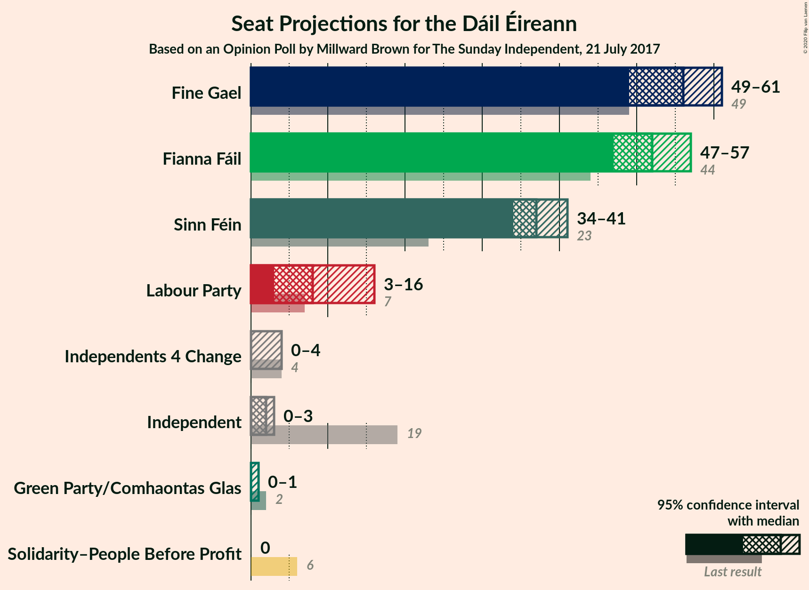
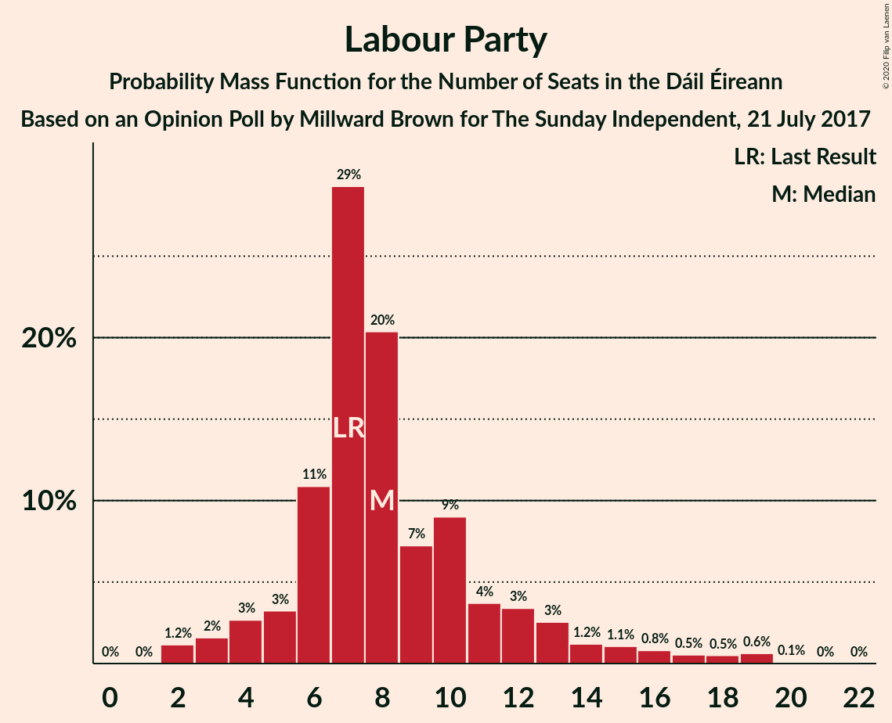
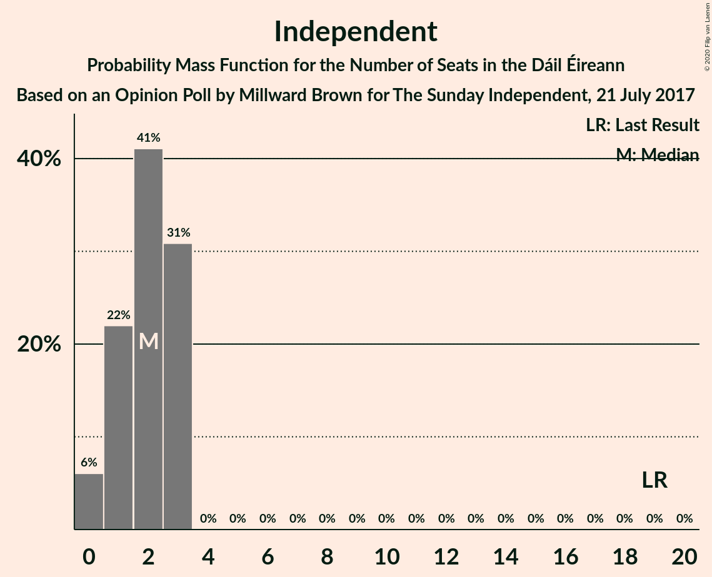
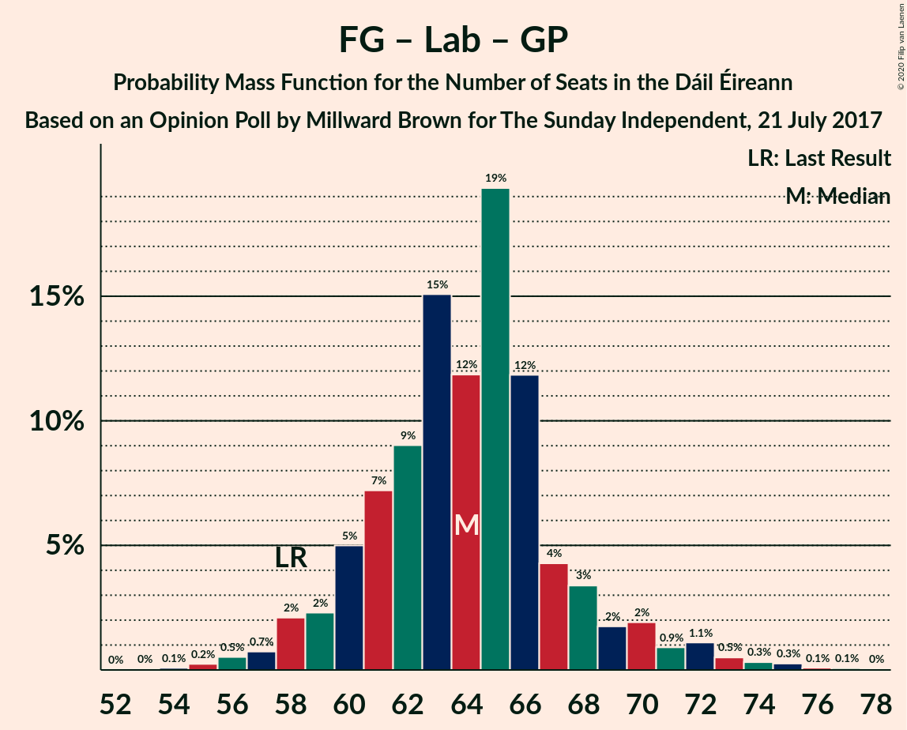

# Opinion Poll by Millward Brown for The Sunday Independent, 21 July 2017

<a href="#voting-intentions">Voting Intentions</a> | <a href="#seats">Seats</a> | <a href="#coalitions">Coalitions</a> | <a href="#technical-information">Technical Information</a>

## Voting Intentions

### Confidence Intervals

| Party | Last Result | Poll Result | 80% Confidence Interval | 90% Confidence Interval | 95% Confidence Interval | 99% Confidence Interval |
|:-----:|:-----------:|:-----------:|:-----------------------:|:-----------------------:|:-----------------------:|:-----------------------:|
| Fine Gael | 25.5% | 29.7% | 27.9–31.7% |27.3–32.2% |26.9–32.7% |26.0–33.6% |
| Fianna Fáil | 24.3% | 28.7% | 26.8–30.6% |26.3–31.1% |25.9–31.6% |25.0–32.6% |
| Sinn Féin | 13.8% | 19.8% | 18.2–21.5% |17.7–22.0% |17.4–22.4% |16.6–23.3% |
| Labour Party | 6.6% | 6.9% | 5.9–8.1% |5.7–8.4% |5.5–8.7% |5.0–9.3% |
| Independent | 15.9% | 5.9% | 5.0–7.0% |4.7–7.3% |4.5–7.5% |4.1–8.1% |
| Green Party/Comhaontas Glas | 2.7% | 2.0% | 1.5–2.7% |1.4–2.9% |1.3–3.1% |1.1–3.5% |
| Solidarity–People Before Profit | 3.9% | 0.9% | 0.6–1.5% |0.6–1.6% |0.5–1.8% |0.4–2.1% |
| Independents 4 Change | 1.5% | 0.7% | 0.5–1.2% |0.4–1.4% |0.4–1.5% |0.3–1.8% |

*Note:* The poll result column reflects the actual value used in the calculations. Published results may vary slightly, and in addition be rounded to fewer digits.

## Seats

### Confidence Intervals

| Party | Last Result | Median | 80% Confidence Interval | 90% Confidence Interval | 95% Confidence Interval | 99% Confidence Interval |
|:-----:|:-----------:|:------:|:-----------------------:|:-----------------------:|:-----------------------:|:-----------------------:|
| <a href="#fine-gael">Fine Gael</a> | 49 | 57 | 52–59 |51–60 |49–62 |46–63 |
| <a href="#fianna-fáil">Fianna Fáil</a> | 44 | 52 | 50–56 |48–56 |47–58 |43–59 |
| <a href="#sinn-féin">Sinn Féin</a> | 23 | 37 | 35–40 |35–40 |34–42 |33–43 |
| <a href="#labour-party">Labour Party</a> | 7 | 8 | 6–11 |5–14 |4–16 |2–18 |
| <a href="#independent">Independent</a> | 19 | 2 | 1–3 |0–3 |0–3 |0–3 |
| <a href="#green-party/comhaontas-glas">Green Party/Comhaontas Glas</a> | 2 | 0 | 0 |0–1 |0–2 |0–2 |
| <a href="#solidarity–people-before-profit">Solidarity–People Before Profit</a> | 6 | 0 | 0 |0 |0 |0 |
| <a href="#independents-4-change">Independents 4 Change</a> | 4 | 0 | 0–2 |0–3 |0–4 |0–4 |

### Fine Gael

*For a full overview of the results for this party, see the [Fine Gael](party-finegael.html) page.*

| Number of Seats | Probability | Accumulated | Special Marks |
|:---------------:|:-----------:|:-----------:|:-------------:|
| 46 | 0.6% | 100% |  |
| 47 | 0.5% | 99.4% |  |
| 48 | 0.6% | 98.8% |  |
| 49 | 1.2% | 98% | Last Result |
| 50 | 0.8% | 97% |  |
| 51 | 4% | 96% |  |
| 52 | 2% | 92% |  |
| 53 | 10% | 90% |  |
| 54 | 10% | 80% |  |
| 55 | 9% | 69% |  |
| 56 | 4% | 60% |  |
| 57 | 24% | 56% | Median |
| 58 | 20% | 32% |  |
| 59 | 4% | 12% |  |
| 60 | 3% | 7% |  |
| 61 | 1.5% | 5% |  |
| 62 | 2% | 3% |  |
| 63 | 0.8% | 1.3% |  |
| 64 | 0.2% | 0.5% |  |
| 65 | 0.2% | 0.3% |  |
| 66 | 0.1% | 0.1% |  |
| 67 | 0% | 0% |  |

### Fianna Fáil

*For a full overview of the results for this party, see the [Fianna Fáil](party-fiannafáil.html) page.*

| Number of Seats | Probability | Accumulated | Special Marks |
|:---------------:|:-----------:|:-----------:|:-------------:|
| 41 | 0.1% | 100% |  |
| 42 | 0.1% | 99.9% |  |
| 43 | 0.3% | 99.7% |  |
| 44 | 0.3% | 99.4% | Last Result |
| 45 | 0.3% | 99.1% |  |
| 46 | 0.8% | 98.8% |  |
| 47 | 2% | 98% |  |
| 48 | 3% | 96% |  |
| 49 | 1.5% | 93% |  |
| 50 | 12% | 92% |  |
| 51 | 14% | 80% |  |
| 52 | 30% | 66% | Median |
| 53 | 8% | 36% |  |
| 54 | 9% | 28% |  |
| 55 | 4% | 19% |  |
| 56 | 11% | 15% |  |
| 57 | 2% | 4% |  |
| 58 | 2% | 3% |  |
| 59 | 0.5% | 0.7% |  |
| 60 | 0.1% | 0.2% |  |
| 61 | 0% | 0% |  |

### Sinn Féin

*For a full overview of the results for this party, see the [Sinn Féin](party-sinnféin.html) page.*

| Number of Seats | Probability | Accumulated | Special Marks |
|:---------------:|:-----------:|:-----------:|:-------------:|
| 23 | 0% | 100% | Last Result |
| 24 | 0% | 100% |  |
| 25 | 0% | 100% |  |
| 26 | 0% | 100% |  |
| 27 | 0% | 100% |  |
| 28 | 0% | 100% |  |
| 29 | 0.1% | 100% |  |
| 30 | 0.1% | 99.9% |  |
| 31 | 0% | 99.8% |  |
| 32 | 0.1% | 99.8% |  |
| 33 | 2% | 99.7% |  |
| 34 | 2% | 98% |  |
| 35 | 7% | 96% |  |
| 36 | 11% | 89% |  |
| 37 | 40% | 79% | Median |
| 38 | 22% | 39% |  |
| 39 | 6% | 16% |  |
| 40 | 6% | 11% |  |
| 41 | 2% | 5% |  |
| 42 | 2% | 3% |  |
| 43 | 0.7% | 0.9% |  |
| 44 | 0.1% | 0.2% |  |
| 45 | 0% | 0.1% |  |
| 46 | 0% | 0% |  |

### Labour Party

*For a full overview of the results for this party, see the [Labour Party](party-labourparty.html) page.*

| Number of Seats | Probability | Accumulated | Special Marks |
|:---------------:|:-----------:|:-----------:|:-------------:|
| 2 | 1.4% | 100% |  |
| 3 | 0.8% | 98.6% |  |
| 4 | 2% | 98% |  |
| 5 | 3% | 96% |  |
| 6 | 8% | 92% |  |
| 7 | 31% | 85% | Last Result |
| 8 | 16% | 53% | Median |
| 9 | 16% | 37% |  |
| 10 | 8% | 21% |  |
| 11 | 4% | 13% |  |
| 12 | 1.3% | 9% |  |
| 13 | 2% | 7% |  |
| 14 | 1.3% | 5% |  |
| 15 | 0.4% | 4% |  |
| 16 | 2% | 3% |  |
| 17 | 0.5% | 1.1% |  |
| 18 | 0.2% | 0.6% |  |
| 19 | 0.3% | 0.4% |  |
| 20 | 0.1% | 0.2% |  |
| 21 | 0% | 0% |  |

### Independent

*For a full overview of the results for this party, see the [Independent](party-independent.html) page.*

| Number of Seats | Probability | Accumulated | Special Marks |
|:---------------:|:-----------:|:-----------:|:-------------:|
| 0 | 6% | 100% |  |
| 1 | 28% | 94% |  |
| 2 | 28% | 66% | Median |
| 3 | 38% | 38% |  |
| 4 | 0% | 0% |  |
| 5 | 0% | 0% |  |
| 6 | 0% | 0% |  |
| 7 | 0% | 0% |  |
| 8 | 0% | 0% |  |
| 9 | 0% | 0% |  |
| 10 | 0% | 0% |  |
| 11 | 0% | 0% |  |
| 12 | 0% | 0% |  |
| 13 | 0% | 0% |  |
| 14 | 0% | 0% |  |
| 15 | 0% | 0% |  |
| 16 | 0% | 0% |  |
| 17 | 0% | 0% |  |
| 18 | 0% | 0% |  |
| 19 | 0% | 0% | Last Result |

### Green Party/Comhaontas Glas

*For a full overview of the results for this party, see the [Green Party/Comhaontas Glas](party-greenpartycomhaontasglas.html) page.*

| Number of Seats | Probability | Accumulated | Special Marks |
|:---------------:|:-----------:|:-----------:|:-------------:|
| 0 | 95% | 100% | Median |
| 1 | 2% | 5% |  |
| 2 | 3% | 3% | Last Result |
| 3 | 0% | 0% |  |

### Solidarity–People Before Profit

*For a full overview of the results for this party, see the [Solidarity–People Before Profit](party-solidarity–peoplebeforeprofit.html) page.*

| Number of Seats | Probability | Accumulated | Special Marks |
|:---------------:|:-----------:|:-----------:|:-------------:|
| 0 | 99.7% | 100% | Median |
| 1 | 0.2% | 0.3% |  |
| 2 | 0% | 0.1% |  |
| 3 | 0.1% | 0.1% |  |
| 4 | 0% | 0% |  |
| 5 | 0% | 0% |  |
| 6 | 0% | 0% | Last Result |

### Independents 4 Change

*For a full overview of the results for this party, see the [Independents 4 Change](party-independents4change.html) page.*

| Number of Seats | Probability | Accumulated | Special Marks |
|:---------------:|:-----------:|:-----------:|:-------------:|
| 0 | 81% | 100% | Median |
| 1 | 7% | 19% |  |
| 2 | 3% | 13% |  |
| 3 | 4% | 9% |  |
| 4 | 5% | 5% | Last Result |
| 5 | 0% | 0% |  |

## Coalitions

### Confidence Intervals

| Coalition | Last Result | Median | Majority? | 80% Confidence Interval | 90% Confidence Interval | 95% Confidence Interval | 99% Confidence Interval |
|:---------:|:-----------:|:------:|:---------:|:-----------------------:|:-----------------------:|:-----------------------:|:-----------------------:|
| Fine Gael – Fianna Fáil | 93 | 109 | 100% | 105–110 | 103–112 | 102–113 | 99–114 |
| Fianna Fáil – Sinn Féin | 67 | 89 | 99.0% | 86–93 | 84–95 | 83–96 | 80–97 |
| Fine Gael – Labour Party – Green Party/Comhaontas Glas | 58 | 65 | 0% | 61–68 | 59–70 | 58–71 | 56–74 |
| Fine Gael – Labour Party | 56 | 64 | 0% | 61–68 | 59–70 | 58–71 | 56–74 |
| Fianna Fáil – Labour Party – Green Party/Comhaontas Glas | 53 | 60 | 0% | 57–65 | 55–66 | 54–68 | 52–69 |
| Fianna Fáil – Labour Party | 51 | 60 | 0% | 57–65 | 55–66 | 54–68 | 52–69 |
| Fine Gael | 49 | 57 | 0% | 52–59 | 51–60 | 49–62 | 46–63 |
| Fine Gael – Green Party/Comhaontas Glas | 51 | 57 | 0% | 53–59 | 51–60 | 49–62 | 46–64 |
| Fianna Fáil – Green Party/Comhaontas Glas | 46 | 52 | 0% | 50–56 | 48–56 | 47–58 | 43–59 |

### Fine Gael – Fianna Fáil

| Number of Seats | Probability | Accumulated | Special Marks |
|:---------------:|:-----------:|:-----------:|:-------------:|
| 93 | 0% | 100% | Last Result |
| 94 | 0% | 100% |  |
| 95 | 0% | 100% |  |
| 96 | 0% | 100% |  |
| 97 | 0.1% | 100% |  |
| 98 | 0.3% | 99.8% |  |
| 99 | 0.5% | 99.6% |  |
| 100 | 0.3% | 99.1% |  |
| 101 | 1.1% | 98.8% |  |
| 102 | 1.4% | 98% |  |
| 103 | 2% | 96% |  |
| 104 | 3% | 95% |  |
| 105 | 5% | 92% |  |
| 106 | 7% | 87% |  |
| 107 | 7% | 80% |  |
| 108 | 18% | 74% |  |
| 109 | 26% | 56% | Median |
| 110 | 21% | 30% |  |
| 111 | 3% | 9% |  |
| 112 | 2% | 6% |  |
| 113 | 1.3% | 3% |  |
| 114 | 1.4% | 2% |  |
| 115 | 0.3% | 0.5% |  |
| 116 | 0.1% | 0.2% |  |
| 117 | 0.1% | 0.1% |  |
| 118 | 0% | 0% |  |

### Fianna Fáil – Sinn Féin

| Number of Seats | Probability | Accumulated | Special Marks |
|:---------------:|:-----------:|:-----------:|:-------------:|
| 67 | 0% | 100% | Last Result |
| 68 | 0% | 100% |  |
| 69 | 0% | 100% |  |
| 70 | 0% | 100% |  |
| 71 | 0% | 100% |  |
| 72 | 0% | 100% |  |
| 73 | 0% | 100% |  |
| 74 | 0% | 100% |  |
| 75 | 0% | 100% |  |
| 76 | 0% | 100% |  |
| 77 | 0% | 100% |  |
| 78 | 0.1% | 100% |  |
| 79 | 0.2% | 99.8% |  |
| 80 | 0.6% | 99.6% |  |
| 81 | 0.3% | 99.0% | Majority |
| 82 | 0.4% | 98.7% |  |
| 83 | 1.3% | 98% |  |
| 84 | 3% | 97% |  |
| 85 | 3% | 94% |  |
| 86 | 4% | 91% |  |
| 87 | 5% | 87% |  |
| 88 | 15% | 82% |  |
| 89 | 18% | 67% | Median |
| 90 | 16% | 50% |  |
| 91 | 8% | 33% |  |
| 92 | 7% | 25% |  |
| 93 | 9% | 19% |  |
| 94 | 2% | 9% |  |
| 95 | 4% | 7% |  |
| 96 | 2% | 3% |  |
| 97 | 0.9% | 1.3% |  |
| 98 | 0.3% | 0.4% |  |
| 99 | 0.1% | 0.1% |  |
| 100 | 0% | 0% |  |

### Fine Gael – Labour Party – Green Party/Comhaontas Glas

| Number of Seats | Probability | Accumulated | Special Marks |
|:---------------:|:-----------:|:-----------:|:-------------:|
| 54 | 0% | 100% |  |
| 55 | 0.2% | 99.9% |  |
| 56 | 0.8% | 99.8% |  |
| 57 | 0.5% | 99.0% |  |
| 58 | 1.5% | 98.6% | Last Result |
| 59 | 4% | 97% |  |
| 60 | 2% | 93% |  |
| 61 | 12% | 91% |  |
| 62 | 8% | 79% |  |
| 63 | 3% | 71% |  |
| 64 | 16% | 68% |  |
| 65 | 19% | 52% | Median |
| 66 | 17% | 33% |  |
| 67 | 3% | 16% |  |
| 68 | 7% | 14% |  |
| 69 | 1.3% | 7% |  |
| 70 | 3% | 5% |  |
| 71 | 0.5% | 3% |  |
| 72 | 1.2% | 2% |  |
| 73 | 0.2% | 1.0% |  |
| 74 | 0.5% | 0.8% |  |
| 75 | 0.1% | 0.3% |  |
| 76 | 0.2% | 0.2% |  |
| 77 | 0.1% | 0.1% |  |
| 78 | 0% | 0% |  |

### Fine Gael – Labour Party

| Number of Seats | Probability | Accumulated | Special Marks |
|:---------------:|:-----------:|:-----------:|:-------------:|
| 54 | 0.1% | 100% |  |
| 55 | 0.2% | 99.9% |  |
| 56 | 0.8% | 99.7% | Last Result |
| 57 | 0.6% | 98.9% |  |
| 58 | 2% | 98% |  |
| 59 | 4% | 97% |  |
| 60 | 2% | 93% |  |
| 61 | 11% | 90% |  |
| 62 | 8% | 79% |  |
| 63 | 4% | 71% |  |
| 64 | 17% | 67% |  |
| 65 | 19% | 50% | Median |
| 66 | 16% | 31% |  |
| 67 | 2% | 16% |  |
| 68 | 7% | 13% |  |
| 69 | 2% | 7% |  |
| 70 | 3% | 5% |  |
| 71 | 0.5% | 3% |  |
| 72 | 1.2% | 2% |  |
| 73 | 0.2% | 0.9% |  |
| 74 | 0.5% | 0.8% |  |
| 75 | 0.1% | 0.3% |  |
| 76 | 0.2% | 0.2% |  |
| 77 | 0.1% | 0.1% |  |
| 78 | 0% | 0% |  |

### Fianna Fáil – Labour Party – Green Party/Comhaontas Glas

| Number of Seats | Probability | Accumulated | Special Marks |
|:---------------:|:-----------:|:-----------:|:-------------:|
| 50 | 0.1% | 100% |  |
| 51 | 0.2% | 99.9% |  |
| 52 | 0.5% | 99.6% |  |
| 53 | 0.2% | 99.1% | Last Result |
| 54 | 2% | 98.9% |  |
| 55 | 2% | 97% |  |
| 56 | 2% | 95% |  |
| 57 | 5% | 93% |  |
| 58 | 6% | 89% |  |
| 59 | 28% | 82% |  |
| 60 | 13% | 55% | Median |
| 61 | 10% | 42% |  |
| 62 | 5% | 32% |  |
| 63 | 5% | 27% |  |
| 64 | 10% | 22% |  |
| 65 | 4% | 12% |  |
| 66 | 4% | 8% |  |
| 67 | 1.2% | 4% |  |
| 68 | 2% | 3% |  |
| 69 | 0.9% | 1.2% |  |
| 70 | 0.2% | 0.3% |  |
| 71 | 0.1% | 0.1% |  |
| 72 | 0% | 0.1% |  |
| 73 | 0% | 0.1% |  |
| 74 | 0% | 0% |  |

### Fianna Fáil – Labour Party

| Number of Seats | Probability | Accumulated | Special Marks |
|:---------------:|:-----------:|:-----------:|:-------------:|
| 49 | 0% | 100% |  |
| 50 | 0.1% | 99.9% |  |
| 51 | 0.2% | 99.8% | Last Result |
| 52 | 0.5% | 99.6% |  |
| 53 | 0.3% | 99.1% |  |
| 54 | 2% | 98.8% |  |
| 55 | 2% | 97% |  |
| 56 | 2% | 95% |  |
| 57 | 6% | 93% |  |
| 58 | 6% | 87% |  |
| 59 | 27% | 81% |  |
| 60 | 13% | 54% | Median |
| 61 | 10% | 41% |  |
| 62 | 6% | 32% |  |
| 63 | 4% | 26% |  |
| 64 | 9% | 22% |  |
| 65 | 4% | 12% |  |
| 66 | 4% | 8% |  |
| 67 | 1.2% | 4% |  |
| 68 | 2% | 3% |  |
| 69 | 0.8% | 1.1% |  |
| 70 | 0.2% | 0.3% |  |
| 71 | 0% | 0.1% |  |
| 72 | 0% | 0.1% |  |
| 73 | 0% | 0.1% |  |
| 74 | 0% | 0% |  |

### Fine Gael

| Number of Seats | Probability | Accumulated | Special Marks |
|:---------------:|:-----------:|:-----------:|:-------------:|
| 46 | 0.6% | 100% |  |
| 47 | 0.5% | 99.4% |  |
| 48 | 0.6% | 98.8% |  |
| 49 | 1.2% | 98% | Last Result |
| 50 | 0.8% | 97% |  |
| 51 | 4% | 96% |  |
| 52 | 2% | 92% |  |
| 53 | 10% | 90% |  |
| 54 | 10% | 80% |  |
| 55 | 9% | 69% |  |
| 56 | 4% | 60% |  |
| 57 | 24% | 56% | Median |
| 58 | 20% | 32% |  |
| 59 | 4% | 12% |  |
| 60 | 3% | 7% |  |
| 61 | 1.5% | 5% |  |
| 62 | 2% | 3% |  |
| 63 | 0.8% | 1.3% |  |
| 64 | 0.2% | 0.5% |  |
| 65 | 0.2% | 0.3% |  |
| 66 | 0.1% | 0.1% |  |
| 67 | 0% | 0% |  |

### Fine Gael – Green Party/Comhaontas Glas

| Number of Seats | Probability | Accumulated | Special Marks |
|:---------------:|:-----------:|:-----------:|:-------------:|
| 46 | 0.6% | 100% |  |
| 47 | 0.5% | 99.4% |  |
| 48 | 0.5% | 98.9% |  |
| 49 | 1.2% | 98% |  |
| 50 | 0.6% | 97% |  |
| 51 | 4% | 97% | Last Result |
| 52 | 2% | 93% |  |
| 53 | 10% | 90% |  |
| 54 | 10% | 80% |  |
| 55 | 10% | 70% |  |
| 56 | 4% | 61% |  |
| 57 | 23% | 56% | Median |
| 58 | 20% | 34% |  |
| 59 | 6% | 14% |  |
| 60 | 3% | 8% |  |
| 61 | 2% | 5% |  |
| 62 | 2% | 3% |  |
| 63 | 0.9% | 1.5% |  |
| 64 | 0.2% | 0.5% |  |
| 65 | 0.2% | 0.4% |  |
| 66 | 0.1% | 0.1% |  |
| 67 | 0% | 0% |  |

### Fianna Fáil – Green Party/Comhaontas Glas

| Number of Seats | Probability | Accumulated | Special Marks |
|:---------------:|:-----------:|:-----------:|:-------------:|
| 41 | 0.1% | 100% |  |
| 42 | 0.1% | 99.9% |  |
| 43 | 0.3% | 99.8% |  |
| 44 | 0.3% | 99.4% |  |
| 45 | 0.2% | 99.1% |  |
| 46 | 0.7% | 98.9% | Last Result |
| 47 | 2% | 98% |  |
| 48 | 3% | 96% |  |
| 49 | 1.3% | 93% |  |
| 50 | 10% | 92% |  |
| 51 | 14% | 82% |  |
| 52 | 31% | 68% | Median |
| 53 | 8% | 37% |  |
| 54 | 10% | 29% |  |
| 55 | 4% | 19% |  |
| 56 | 11% | 16% |  |
| 57 | 2% | 4% |  |
| 58 | 2% | 3% |  |
| 59 | 0.6% | 0.9% |  |
| 60 | 0.2% | 0.3% |  |
| 61 | 0.1% | 0.1% |  |
| 62 | 0% | 0% |  |

## Technical Information

### Opinion Poll

+ **Polling firm:** Millward Brown
+ **Commissioner(s):** The Sunday Independent
+ **Fieldwork period:** 21 July 2017

### Calculations

+ **Sample size:** 956
+ **Simulations done:** 131,072
+ **Error estimate:** 2.07%

