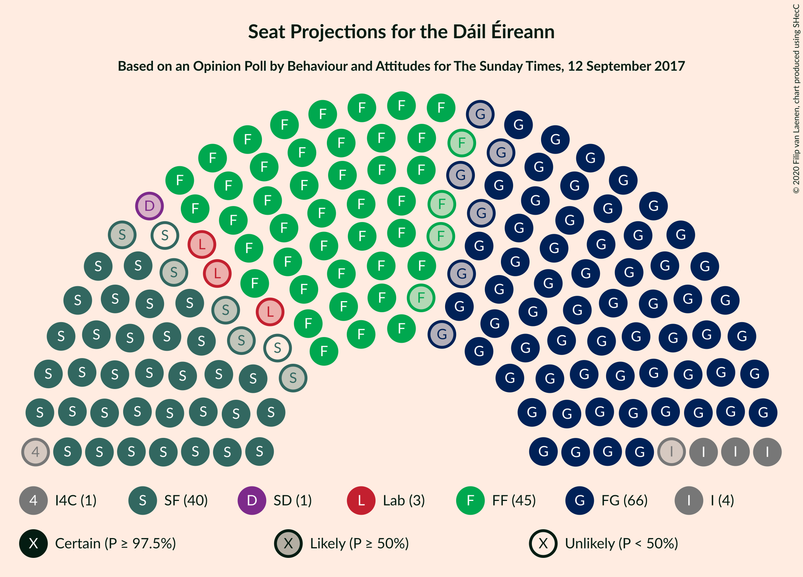
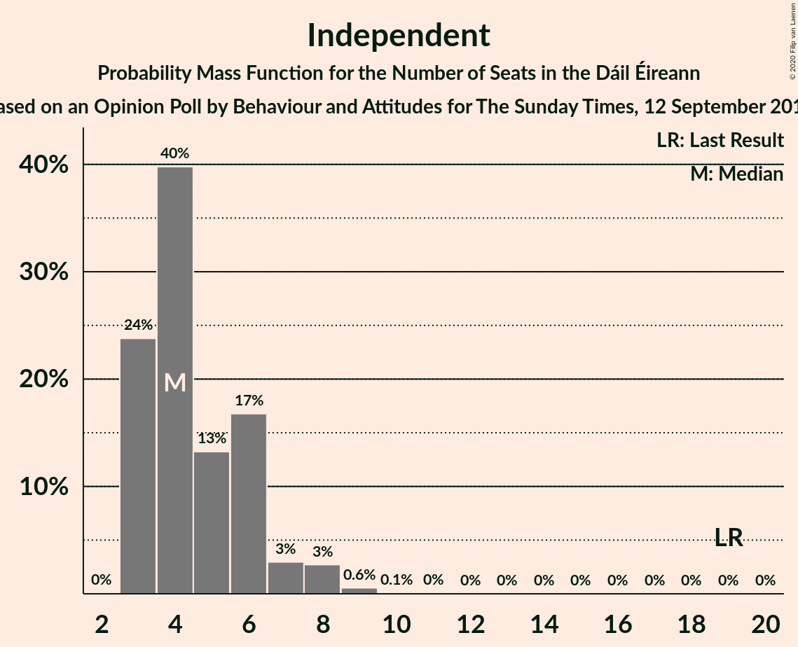
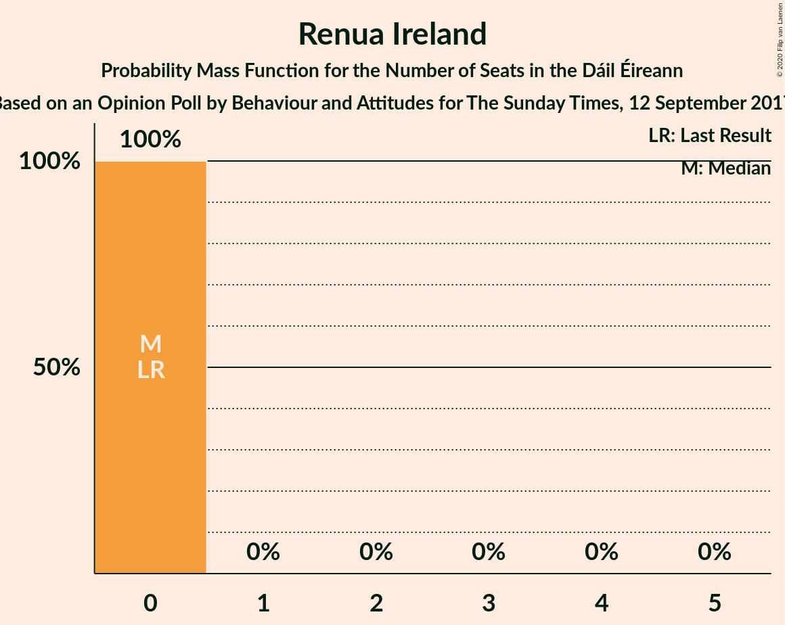
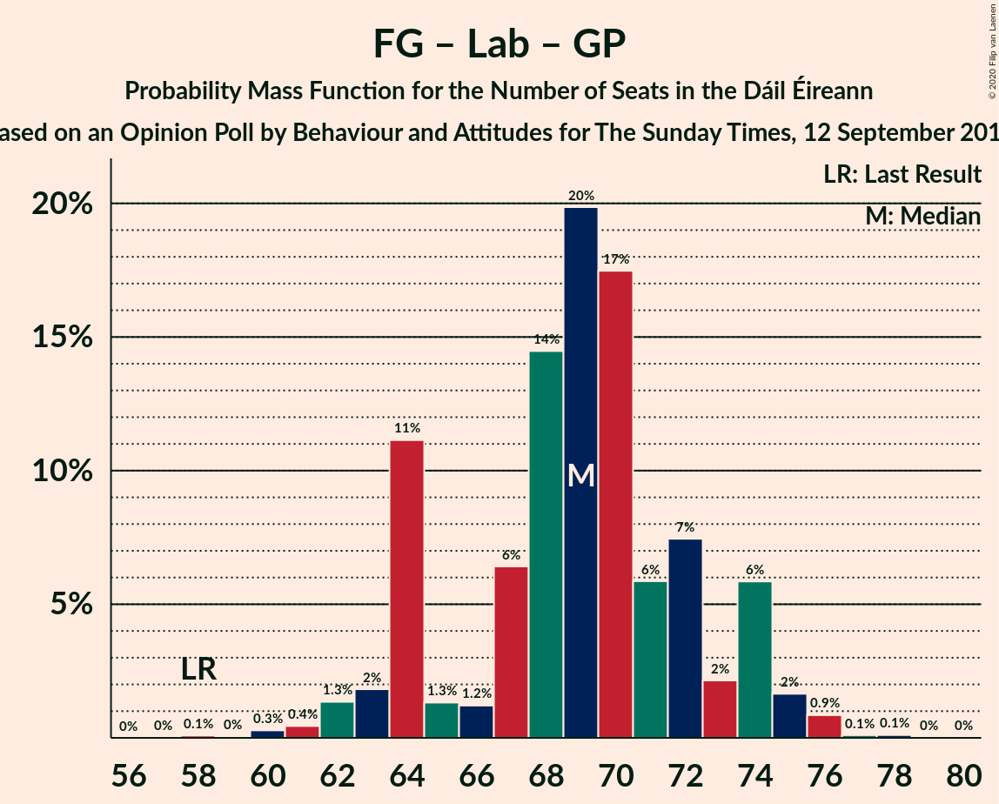

# Opinion Poll by Behaviour and Attitudes for The Sunday Times, 12 September 2017

<a href="#voting-intentions">Voting Intentions</a> | <a href="#seats">Seats</a> | <a href="#coalitions">Coalitions</a> | <a href="#technical-information">Technical Information</a>

## Voting Intentions

### Confidence Intervals

| Party | Last Result | Poll Result | 80% Confidence Interval | 90% Confidence Interval | 95% Confidence Interval | 99% Confidence Interval |
|:-----:|:-----------:|:-----------:|:-----------------------:|:-----------------------:|:-----------------------:|:-----------------------:|
| Fine Gael | 25.5% | 32.9% | 30.9–34.9% |30.4–35.5% |29.9–36.0% |29.0–36.9% |
| Fianna Fáil | 24.3% | 25.0% | 23.2–26.9% |22.7–27.4% |22.3–27.8% |21.5–28.8% |
| Sinn Féin | 13.8% | 19.0% | 17.4–20.7% |17.0–21.2% |16.6–21.6% |15.9–22.5% |
| Independent | 15.9% | 8.4% | 7.4–9.7% |7.1–10.1% |6.8–10.4% |6.3–11.0% |
| Labour Party | 6.6% | 5.0% | 4.2–6.1% |4.0–6.4% |3.8–6.6% |3.4–7.1% |
| Green Party/Comhaontas Glas | 2.7% | 2.0% | 1.5–2.8% |1.4–3.0% |1.3–3.2% |1.1–3.5% |
| Independents 4 Change | 1.5% | 1.1% | 0.7–1.6% |0.7–1.8% |0.6–2.0% |0.5–2.3% |
| Solidarity–People Before Profit | 3.9% | 1.0% | 0.7–1.5% |0.6–1.7% |0.5–1.8% |0.4–2.1% |
| Social Democrats | 3.0% | 1.0% | 0.7–1.5% |0.6–1.7% |0.5–1.8% |0.4–2.1% |
| Renua Ireland | 2.2% | 0.2% | 0.1–0.6% |0.1–0.7% |0.1–0.8% |0.0–1.0% |

*Note:* The poll result column reflects the actual value used in the calculations. Published results may vary slightly, and in addition be rounded to fewer digits.

## Seats

### Confidence Intervals

| Party | Last Result | Median | 80% Confidence Interval | 90% Confidence Interval | 95% Confidence Interval | 99% Confidence Interval |
|:-----:|:-----------:|:------:|:-----------------------:|:-----------------------:|:-----------------------:|:-----------------------:|
| <a href="#fine-gael">Fine Gael</a> | 49 | 66 | 61–68 |61–69 |60–69 |58–69 |
| <a href="#fianna-fáil">Fianna Fáil</a> | 44 | 45 | 42–52 |41–52 |41–53 |40–55 |
| <a href="#sinn-féin">Sinn Féin</a> | 23 | 38 | 35–41 |35–41 |33–41 |32–42 |
| <a href="#independent">Independent</a> | 19 | 4 | 3–6 |3–7 |3–8 |3–9 |
| <a href="#labour-party">Labour Party</a> | 7 | 3 | 1–8 |0–8 |0–8 |0–9 |
| <a href="#green-party/comhaontas-glas">Green Party/Comhaontas Glas</a> | 2 | 0 | 0–1 |0–2 |0–2 |0–3 |
| <a href="#independents-4-change">Independents 4 Change</a> | 4 | 1 | 0–4 |0–4 |0–4 |0–5 |
| <a href="#solidarity–people-before-profit">Solidarity–People Before Profit</a> | 6 | 0 | 0 |0 |0–1 |0–1 |
| <a href="#social-democrats">Social Democrats</a> | 3 | 1 | 0–3 |0–3 |0–3 |0–4 |
| <a href="#renua-ireland">Renua Ireland</a> | 0 | 0 | 0 |0 |0 |0 |

### Fine Gael

*For a full overview of the results for this party, see the [Fine Gael](party-finegael.html) page.*

| Number of Seats | Probability | Accumulated | Special Marks |
|:---------------:|:-----------:|:-----------:|:-------------:|
| 49 | 0% | 100% | Last Result |
| 50 | 0% | 100% |  |
| 51 | 0% | 100% |  |
| 52 | 0% | 100% |  |
| 53 | 0% | 100% |  |
| 54 | 0% | 100% |  |
| 55 | 0.1% | 100% |  |
| 56 | 0.1% | 99.9% |  |
| 57 | 0.1% | 99.8% |  |
| 58 | 0.7% | 99.7% |  |
| 59 | 0.9% | 99.0% |  |
| 60 | 3% | 98% |  |
| 61 | 6% | 95% |  |
| 62 | 10% | 89% |  |
| 63 | 2% | 79% |  |
| 64 | 8% | 77% |  |
| 65 | 10% | 68% |  |
| 66 | 30% | 59% | Median |
| 67 | 14% | 29% |  |
| 68 | 7% | 15% |  |
| 69 | 7% | 7% |  |
| 70 | 0.3% | 0.5% |  |
| 71 | 0.1% | 0.2% |  |
| 72 | 0% | 0% |  |

### Fianna Fáil

*For a full overview of the results for this party, see the [Fianna Fáil](party-fiannafáil.html) page.*

| Number of Seats | Probability | Accumulated | Special Marks |
|:---------------:|:-----------:|:-----------:|:-------------:|
| 38 | 0% | 100% |  |
| 39 | 0.3% | 99.9% |  |
| 40 | 2% | 99.7% |  |
| 41 | 6% | 98% |  |
| 42 | 12% | 92% |  |
| 43 | 11% | 80% |  |
| 44 | 18% | 69% | Last Result |
| 45 | 8% | 51% | Median |
| 46 | 10% | 43% |  |
| 47 | 3% | 34% |  |
| 48 | 4% | 31% |  |
| 49 | 3% | 27% |  |
| 50 | 4% | 24% |  |
| 51 | 4% | 20% |  |
| 52 | 13% | 16% |  |
| 53 | 1.5% | 4% |  |
| 54 | 0.5% | 2% |  |
| 55 | 2% | 2% |  |
| 56 | 0.1% | 0.1% |  |
| 57 | 0% | 0% |  |

### Sinn Féin

*For a full overview of the results for this party, see the [Sinn Féin](party-sinnféin.html) page.*

| Number of Seats | Probability | Accumulated | Special Marks |
|:---------------:|:-----------:|:-----------:|:-------------:|
| 23 | 0% | 100% | Last Result |
| 24 | 0% | 100% |  |
| 25 | 0% | 100% |  |
| 26 | 0% | 100% |  |
| 27 | 0% | 100% |  |
| 28 | 0% | 100% |  |
| 29 | 0% | 99.9% |  |
| 30 | 0.2% | 99.9% |  |
| 31 | 0.2% | 99.7% |  |
| 32 | 0.7% | 99.5% |  |
| 33 | 2% | 98.8% |  |
| 34 | 0.9% | 97% |  |
| 35 | 13% | 96% |  |
| 36 | 14% | 83% |  |
| 37 | 16% | 69% |  |
| 38 | 17% | 53% | Median |
| 39 | 8% | 36% |  |
| 40 | 11% | 28% |  |
| 41 | 16% | 17% |  |
| 42 | 0.4% | 0.9% |  |
| 43 | 0.2% | 0.5% |  |
| 44 | 0.2% | 0.3% |  |
| 45 | 0% | 0% |  |

### Independent

*For a full overview of the results for this party, see the [Independent](party-independent.html) page.*

| Number of Seats | Probability | Accumulated | Special Marks |
|:---------------:|:-----------:|:-----------:|:-------------:|
| 3 | 24% | 100% |  |
| 4 | 40% | 76% | Median |
| 5 | 13% | 36% |  |
| 6 | 17% | 23% |  |
| 7 | 3% | 6% |  |
| 8 | 3% | 3% |  |
| 9 | 0.6% | 0.7% |  |
| 10 | 0.1% | 0.1% |  |
| 11 | 0% | 0.1% |  |
| 12 | 0% | 0% |  |
| 13 | 0% | 0% |  |
| 14 | 0% | 0% |  |
| 15 | 0% | 0% |  |
| 16 | 0% | 0% |  |
| 17 | 0% | 0% |  |
| 18 | 0% | 0% |  |
| 19 | 0% | 0% | Last Result |

### Labour Party

*For a full overview of the results for this party, see the [Labour Party](party-labourparty.html) page.*

| Number of Seats | Probability | Accumulated | Special Marks |
|:---------------:|:-----------:|:-----------:|:-------------:|
| 0 | 7% | 100% |  |
| 1 | 9% | 93% |  |
| 2 | 20% | 84% |  |
| 3 | 27% | 64% | Median |
| 4 | 10% | 37% |  |
| 5 | 8% | 27% |  |
| 6 | 4% | 19% |  |
| 7 | 5% | 15% | Last Result |
| 8 | 9% | 10% |  |
| 9 | 0.7% | 1.1% |  |
| 10 | 0.3% | 0.4% |  |
| 11 | 0% | 0.1% |  |
| 12 | 0% | 0.1% |  |
| 13 | 0% | 0.1% |  |
| 14 | 0% | 0% |  |

### Green Party/Comhaontas Glas

*For a full overview of the results for this party, see the [Green Party/Comhaontas Glas](party-greenpartycomhaontasglas.html) page.*

| Number of Seats | Probability | Accumulated | Special Marks |
|:---------------:|:-----------:|:-----------:|:-------------:|
| 0 | 88% | 100% | Median |
| 1 | 5% | 12% |  |
| 2 | 7% | 7% | Last Result |
| 3 | 0.6% | 0.6% |  |
| 4 | 0% | 0% |  |

### Independents 4 Change

*For a full overview of the results for this party, see the [Independents 4 Change](party-independents4change.html) page.*

| Number of Seats | Probability | Accumulated | Special Marks |
|:---------------:|:-----------:|:-----------:|:-------------:|
| 0 | 29% | 100% |  |
| 1 | 32% | 71% | Median |
| 2 | 5% | 39% |  |
| 3 | 4% | 35% |  |
| 4 | 28% | 30% | Last Result |
| 5 | 2% | 2% |  |
| 6 | 0% | 0% |  |

### Solidarity–People Before Profit

*For a full overview of the results for this party, see the [Solidarity–People Before Profit](party-solidarity–peoplebeforeprofit.html) page.*

| Number of Seats | Probability | Accumulated | Special Marks |
|:---------------:|:-----------:|:-----------:|:-------------:|
| 0 | 97% | 100% | Median |
| 1 | 3% | 3% |  |
| 2 | 0% | 0.2% |  |
| 3 | 0.1% | 0.2% |  |
| 4 | 0% | 0% |  |
| 5 | 0% | 0% |  |
| 6 | 0% | 0% | Last Result |

### Social Democrats

*For a full overview of the results for this party, see the [Social Democrats](party-socialdemocrats.html) page.*

| Number of Seats | Probability | Accumulated | Special Marks |
|:---------------:|:-----------:|:-----------:|:-------------:|
| 0 | 19% | 100% |  |
| 1 | 62% | 81% | Median |
| 2 | 6% | 20% |  |
| 3 | 13% | 14% | Last Result |
| 4 | 0.6% | 0.6% |  |
| 5 | 0% | 0% |  |

### Renua Ireland

*For a full overview of the results for this party, see the [Renua Ireland](party-renuaireland.html) page.*

| Number of Seats | Probability | Accumulated | Special Marks |
|:---------------:|:-----------:|:-----------:|:-------------:|
| 0 | 100% | 100% | Last Result, Median |

## Coalitions

### Confidence Intervals

| Coalition | Last Result | Median | Majority? | 80% Confidence Interval | 90% Confidence Interval | 95% Confidence Interval | 99% Confidence Interval |
|:---------:|:-----------:|:------:|:---------:|:-----------------------:|:-----------------------:|:-----------------------:|:-----------------------:|
| Fine Gael – Fianna Fáil | 93 | 110 | 100% | 107–116 | 107–117 | 106–118 | 104–121 |
| Fianna Fáil – Sinn Féin | 67 | 84 | 76% | 79–88 | 79–90 | 78–91 | 76–92 |
| Fine Gael – Labour Party – Green Party/Comhaontas Glas – Social Democrats | 61 | 70 | 0% | 65–75 | 65–75 | 64–76 | 62–78 |
| Fine Gael – Labour Party – Green Party/Comhaontas Glas | 58 | 69 | 0% | 64–73 | 64–74 | 63–75 | 61–76 |
| Fine Gael – Labour Party | 56 | 69 | 0% | 64–72 | 64–73 | 63–74 | 61–76 |
| Fine Gael | 49 | 66 | 0% | 61–68 | 61–69 | 60–69 | 58–69 |
| Fine Gael – Green Party/Comhaontas Glas | 51 | 66 | 0% | 61–69 | 61–69 | 60–69 | 58–70 |
| Fianna Fáil – Labour Party – Green Party/Comhaontas Glas – Social Democrats | 56 | 50 | 0% | 46–56 | 46–58 | 44–59 | 41–60 |
| Fianna Fáil – Labour Party – Green Party/Comhaontas Glas | 53 | 49 | 0% | 45–55 | 44–57 | 43–58 | 41–59 |
| Fianna Fáil – Labour Party | 51 | 48 | 0% | 45–55 | 44–56 | 43–58 | 41–59 |
| Fianna Fáil – Green Party/Comhaontas Glas | 46 | 45 | 0% | 42–52 | 42–52 | 41–53 | 40–55 |

### Fine Gael – Fianna Fáil

| Number of Seats | Probability | Accumulated | Special Marks |
|:---------------:|:-----------:|:-----------:|:-------------:|
| 93 | 0% | 100% | Last Result |
| 94 | 0% | 100% |  |
| 95 | 0% | 100% |  |
| 96 | 0% | 100% |  |
| 97 | 0% | 100% |  |
| 98 | 0% | 100% |  |
| 99 | 0% | 100% |  |
| 100 | 0% | 100% |  |
| 101 | 0% | 100% |  |
| 102 | 0% | 100% |  |
| 103 | 0.2% | 99.9% |  |
| 104 | 0.9% | 99.8% |  |
| 105 | 0.6% | 98.9% |  |
| 106 | 2% | 98% |  |
| 107 | 9% | 96% |  |
| 108 | 8% | 86% |  |
| 109 | 9% | 78% |  |
| 110 | 24% | 69% |  |
| 111 | 6% | 45% | Median |
| 112 | 9% | 39% |  |
| 113 | 4% | 30% |  |
| 114 | 10% | 26% |  |
| 115 | 5% | 16% |  |
| 116 | 2% | 11% |  |
| 117 | 6% | 8% |  |
| 118 | 2% | 3% |  |
| 119 | 0.2% | 0.9% |  |
| 120 | 0.1% | 0.7% |  |
| 121 | 0.5% | 0.6% |  |
| 122 | 0% | 0% |  |

### Fianna Fáil – Sinn Féin

| Number of Seats | Probability | Accumulated | Special Marks |
|:---------------:|:-----------:|:-----------:|:-------------:|
| 67 | 0% | 100% | Last Result |
| 68 | 0% | 100% |  |
| 69 | 0% | 100% |  |
| 70 | 0% | 100% |  |
| 71 | 0% | 100% |  |
| 72 | 0% | 100% |  |
| 73 | 0.1% | 100% |  |
| 74 | 0.1% | 99.9% |  |
| 75 | 0.1% | 99.9% |  |
| 76 | 0.6% | 99.8% |  |
| 77 | 1.0% | 99.2% |  |
| 78 | 3% | 98% |  |
| 79 | 14% | 95% |  |
| 80 | 5% | 81% |  |
| 81 | 7% | 76% | Majority |
| 82 | 8% | 69% |  |
| 83 | 7% | 61% | Median |
| 84 | 8% | 54% |  |
| 85 | 16% | 46% |  |
| 86 | 9% | 31% |  |
| 87 | 7% | 21% |  |
| 88 | 5% | 14% |  |
| 89 | 1.4% | 9% |  |
| 90 | 4% | 8% |  |
| 91 | 1.3% | 4% |  |
| 92 | 2% | 2% |  |
| 93 | 0.1% | 0.3% |  |
| 94 | 0.1% | 0.2% |  |
| 95 | 0.1% | 0.2% |  |
| 96 | 0% | 0% |  |

### Fine Gael – Labour Party – Green Party/Comhaontas Glas – Social Democrats

| Number of Seats | Probability | Accumulated | Special Marks |
|:---------------:|:-----------:|:-----------:|:-------------:|
| 59 | 0.1% | 100% |  |
| 60 | 0.1% | 99.9% |  |
| 61 | 0.3% | 99.8% | Last Result |
| 62 | 0.4% | 99.6% |  |
| 63 | 0.5% | 99.2% |  |
| 64 | 3% | 98.6% |  |
| 65 | 9% | 95% |  |
| 66 | 2% | 86% |  |
| 67 | 4% | 84% |  |
| 68 | 6% | 80% |  |
| 69 | 10% | 74% |  |
| 70 | 24% | 64% | Median |
| 71 | 15% | 41% |  |
| 72 | 5% | 25% |  |
| 73 | 5% | 20% |  |
| 74 | 4% | 16% |  |
| 75 | 8% | 12% |  |
| 76 | 2% | 4% |  |
| 77 | 0.9% | 2% |  |
| 78 | 0.9% | 1.1% |  |
| 79 | 0.2% | 0.2% |  |
| 80 | 0% | 0% |  |

### Fine Gael – Labour Party – Green Party/Comhaontas Glas

| Number of Seats | Probability | Accumulated | Special Marks |
|:---------------:|:-----------:|:-----------:|:-------------:|
| 58 | 0.1% | 100% | Last Result |
| 59 | 0% | 99.9% |  |
| 60 | 0.3% | 99.9% |  |
| 61 | 0.4% | 99.6% |  |
| 62 | 1.3% | 99.1% |  |
| 63 | 2% | 98% |  |
| 64 | 11% | 96% |  |
| 65 | 1.3% | 85% |  |
| 66 | 1.2% | 83% |  |
| 67 | 6% | 82% |  |
| 68 | 14% | 76% |  |
| 69 | 20% | 61% | Median |
| 70 | 17% | 42% |  |
| 71 | 6% | 24% |  |
| 72 | 7% | 18% |  |
| 73 | 2% | 11% |  |
| 74 | 6% | 9% |  |
| 75 | 2% | 3% |  |
| 76 | 0.9% | 1.1% |  |
| 77 | 0.1% | 0.2% |  |
| 78 | 0.1% | 0.1% |  |
| 79 | 0% | 0% |  |

### Fine Gael – Labour Party

| Number of Seats | Probability | Accumulated | Special Marks |
|:---------------:|:-----------:|:-----------:|:-------------:|
| 56 | 0% | 100% | Last Result |
| 57 | 0% | 100% |  |
| 58 | 0.1% | 100% |  |
| 59 | 0% | 99.9% |  |
| 60 | 0.3% | 99.9% |  |
| 61 | 0.7% | 99.6% |  |
| 62 | 1.4% | 98.9% |  |
| 63 | 2% | 98% |  |
| 64 | 11% | 96% |  |
| 65 | 1.3% | 85% |  |
| 66 | 1.2% | 83% |  |
| 67 | 7% | 82% |  |
| 68 | 15% | 75% |  |
| 69 | 23% | 60% | Median |
| 70 | 14% | 37% |  |
| 71 | 5% | 23% |  |
| 72 | 10% | 17% |  |
| 73 | 3% | 7% |  |
| 74 | 2% | 4% |  |
| 75 | 0.7% | 1.4% |  |
| 76 | 0.5% | 0.7% |  |
| 77 | 0.1% | 0.2% |  |
| 78 | 0% | 0% |  |

### Fine Gael

| Number of Seats | Probability | Accumulated | Special Marks |
|:---------------:|:-----------:|:-----------:|:-------------:|
| 49 | 0% | 100% | Last Result |
| 50 | 0% | 100% |  |
| 51 | 0% | 100% |  |
| 52 | 0% | 100% |  |
| 53 | 0% | 100% |  |
| 54 | 0% | 100% |  |
| 55 | 0.1% | 100% |  |
| 56 | 0.1% | 99.9% |  |
| 57 | 0.1% | 99.8% |  |
| 58 | 0.7% | 99.7% |  |
| 59 | 0.9% | 99.0% |  |
| 60 | 3% | 98% |  |
| 61 | 6% | 95% |  |
| 62 | 10% | 89% |  |
| 63 | 2% | 79% |  |
| 64 | 8% | 77% |  |
| 65 | 10% | 68% |  |
| 66 | 30% | 59% | Median |
| 67 | 14% | 29% |  |
| 68 | 7% | 15% |  |
| 69 | 7% | 7% |  |
| 70 | 0.3% | 0.5% |  |
| 71 | 0.1% | 0.2% |  |
| 72 | 0% | 0% |  |

### Fine Gael – Green Party/Comhaontas Glas

| Number of Seats | Probability | Accumulated | Special Marks |
|:---------------:|:-----------:|:-----------:|:-------------:|
| 51 | 0% | 100% | Last Result |
| 52 | 0% | 100% |  |
| 53 | 0% | 100% |  |
| 54 | 0% | 100% |  |
| 55 | 0.1% | 100% |  |
| 56 | 0.1% | 99.9% |  |
| 57 | 0.1% | 99.8% |  |
| 58 | 0.7% | 99.7% |  |
| 59 | 0.7% | 99.0% |  |
| 60 | 3% | 98% |  |
| 61 | 6% | 95% |  |
| 62 | 11% | 90% |  |
| 63 | 2% | 79% |  |
| 64 | 8% | 77% |  |
| 65 | 8% | 69% |  |
| 66 | 28% | 61% | Median |
| 67 | 13% | 33% |  |
| 68 | 7% | 20% |  |
| 69 | 11% | 12% |  |
| 70 | 1.3% | 2% |  |
| 71 | 0.2% | 0.3% |  |
| 72 | 0.1% | 0.1% |  |
| 73 | 0% | 0% |  |

### Fianna Fáil – Labour Party – Green Party/Comhaontas Glas – Social Democrats

| Number of Seats | Probability | Accumulated | Special Marks |
|:---------------:|:-----------:|:-----------:|:-------------:|
| 41 | 0.6% | 100% |  |
| 42 | 0.1% | 99.4% |  |
| 43 | 0.9% | 99.3% |  |
| 44 | 2% | 98% |  |
| 45 | 1.5% | 97% |  |
| 46 | 7% | 95% |  |
| 47 | 10% | 88% |  |
| 48 | 19% | 79% |  |
| 49 | 5% | 60% | Median |
| 50 | 6% | 54% |  |
| 51 | 6% | 48% |  |
| 52 | 6% | 42% |  |
| 53 | 5% | 36% |  |
| 54 | 9% | 31% |  |
| 55 | 11% | 22% |  |
| 56 | 2% | 11% | Last Result |
| 57 | 3% | 8% |  |
| 58 | 2% | 5% |  |
| 59 | 3% | 4% |  |
| 60 | 0.6% | 1.1% |  |
| 61 | 0.2% | 0.5% |  |
| 62 | 0.2% | 0.3% |  |
| 63 | 0% | 0% |  |

### Fianna Fáil – Labour Party – Green Party/Comhaontas Glas

| Number of Seats | Probability | Accumulated | Special Marks |
|:---------------:|:-----------:|:-----------:|:-------------:|
| 40 | 0% | 100% |  |
| 41 | 0.7% | 99.9% |  |
| 42 | 0.4% | 99.2% |  |
| 43 | 3% | 98.8% |  |
| 44 | 2% | 96% |  |
| 45 | 6% | 94% |  |
| 46 | 6% | 88% |  |
| 47 | 22% | 82% |  |
| 48 | 8% | 60% | Median |
| 49 | 3% | 52% |  |
| 50 | 9% | 48% |  |
| 51 | 9% | 39% |  |
| 52 | 5% | 30% |  |
| 53 | 2% | 26% | Last Result |
| 54 | 12% | 23% |  |
| 55 | 3% | 11% |  |
| 56 | 3% | 8% |  |
| 57 | 2% | 5% |  |
| 58 | 2% | 3% |  |
| 59 | 1.0% | 1.3% |  |
| 60 | 0.2% | 0.3% |  |
| 61 | 0% | 0.1% |  |
| 62 | 0% | 0% |  |

### Fianna Fáil – Labour Party

| Number of Seats | Probability | Accumulated | Special Marks |
|:---------------:|:-----------:|:-----------:|:-------------:|
| 40 | 0.1% | 100% |  |
| 41 | 0.7% | 99.9% |  |
| 42 | 0.6% | 99.2% |  |
| 43 | 3% | 98.6% |  |
| 44 | 5% | 95% |  |
| 45 | 4% | 90% |  |
| 46 | 6% | 86% |  |
| 47 | 21% | 80% |  |
| 48 | 11% | 59% | Median |
| 49 | 5% | 48% |  |
| 50 | 5% | 43% |  |
| 51 | 9% | 38% | Last Result |
| 52 | 4% | 29% |  |
| 53 | 2% | 25% |  |
| 54 | 12% | 23% |  |
| 55 | 3% | 11% |  |
| 56 | 3% | 8% |  |
| 57 | 2% | 5% |  |
| 58 | 2% | 3% |  |
| 59 | 0.9% | 1.2% |  |
| 60 | 0.2% | 0.3% |  |
| 61 | 0% | 0.1% |  |
| 62 | 0% | 0% |  |

### Fianna Fáil – Green Party/Comhaontas Glas

| Number of Seats | Probability | Accumulated | Special Marks |
|:---------------:|:-----------:|:-----------:|:-------------:|
| 39 | 0.1% | 100% |  |
| 40 | 1.2% | 99.9% |  |
| 41 | 2% | 98.7% |  |
| 42 | 15% | 96% |  |
| 43 | 9% | 82% |  |
| 44 | 18% | 73% |  |
| 45 | 10% | 55% | Median |
| 46 | 10% | 45% | Last Result |
| 47 | 3% | 35% |  |
| 48 | 4% | 31% |  |
| 49 | 3% | 27% |  |
| 50 | 4% | 24% |  |
| 51 | 4% | 20% |  |
| 52 | 13% | 16% |  |
| 53 | 1.4% | 4% |  |
| 54 | 0.5% | 2% |  |
| 55 | 2% | 2% |  |
| 56 | 0.2% | 0.2% |  |
| 57 | 0% | 0% |  |

## Technical Information

### Opinion Poll

+ **Polling firm:** Behaviour and Attitudes
+ **Commissioner(s):** The Sunday Times
+ **Fieldwork period:** 12 September 2017

### Calculations

+ **Sample size:** 937
+ **Simulations done:** 1,048,575
+ **Error estimate:** 3.16%

