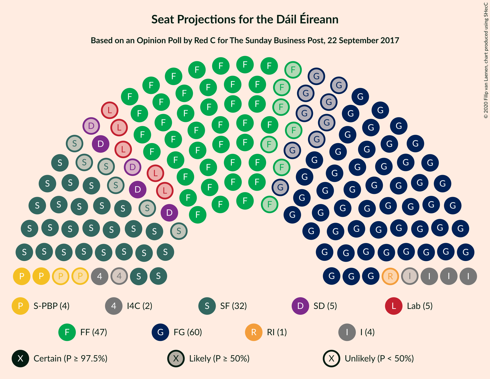
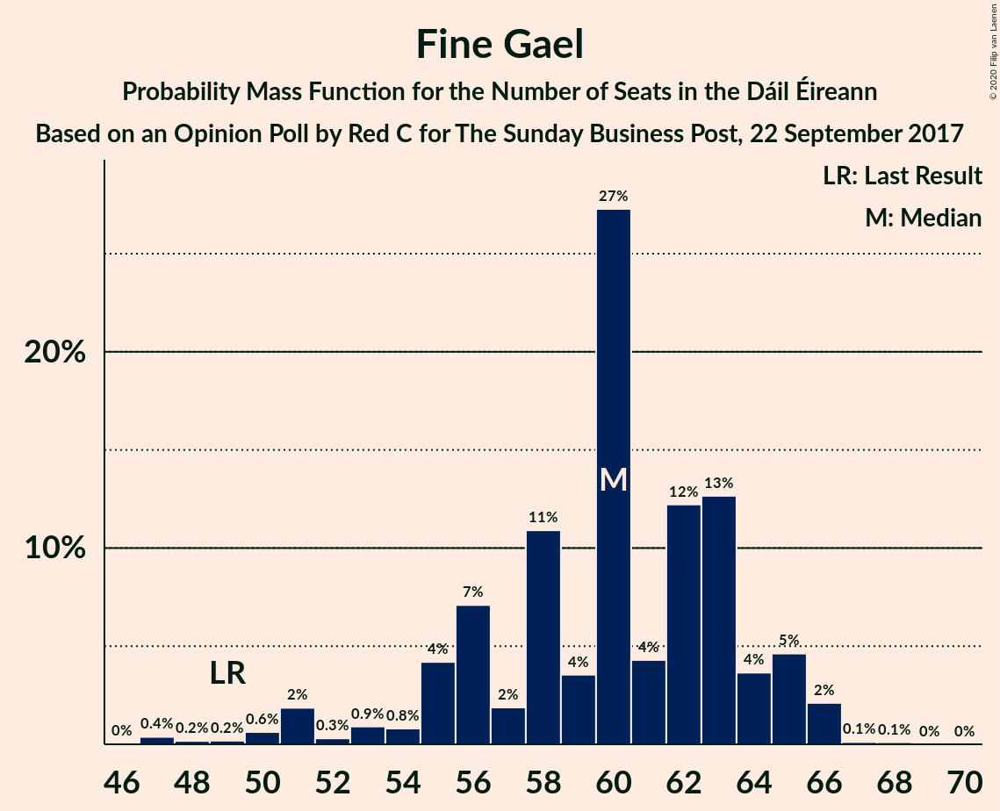
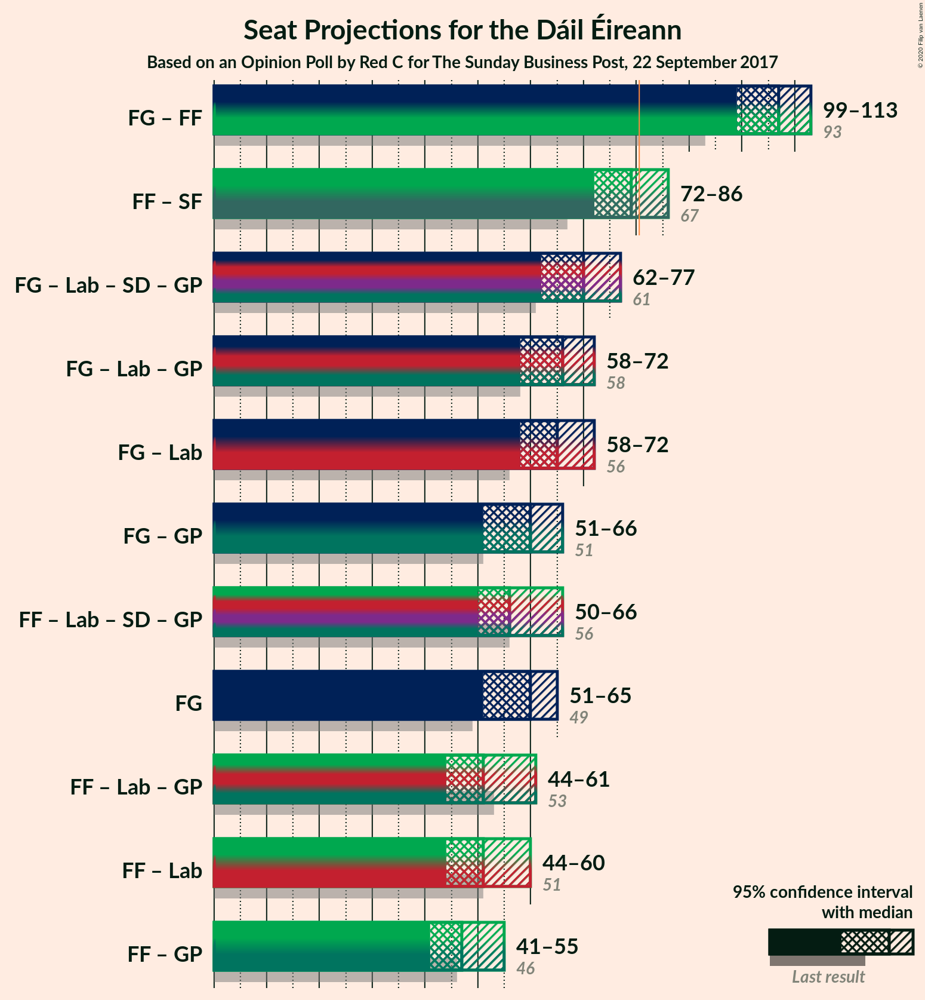
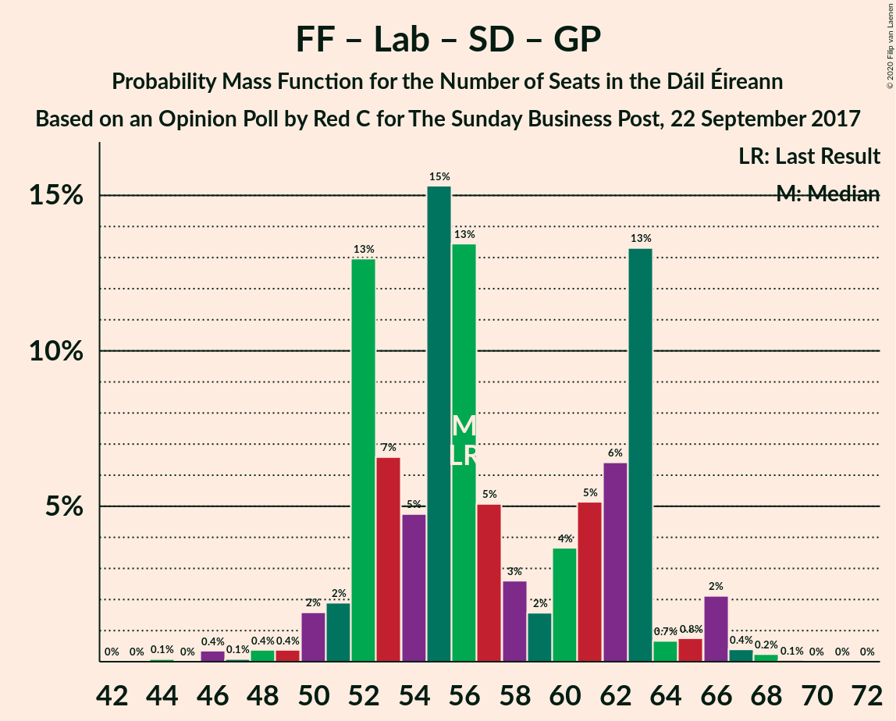

# Opinion Poll by Red C for The Sunday Business Post, 22 September 2017

<a href="#voting-intentions">Voting Intentions</a> | <a href="#seats">Seats</a> | <a href="#coalitions">Coalitions</a> | <a href="#technical-information">Technical Information</a>

## Voting Intentions

### Confidence Intervals

| Party | Last Result | Poll Result | 80% Confidence Interval | 90% Confidence Interval | 95% Confidence Interval | 99% Confidence Interval |
|:-----:|:-----------:|:-----------:|:-----------------------:|:-----------------------:|:-----------------------:|:-----------------------:|
| Fine Gael | 25.5% | 30.0% | 28.2–31.9% |27.7–32.4% |27.2–32.9% |26.4–33.8% |
| Fianna Fáil | 24.3% | 26.0% | 24.3–27.8% |23.8–28.3% |23.4–28.8% |22.6–29.7% |
| Sinn Féin | 13.8% | 16.0% | 14.6–17.6% |14.2–18.0% |13.9–18.4% |13.2–19.2% |
| Independent | 15.9% | 8.5% | 7.4–9.7% |7.1–10.0% |6.9–10.4% |6.4–11.0% |
| Labour Party | 6.6% | 5.0% | 4.2–6.0% |4.0–6.3% |3.8–6.5% |3.4–7.0% |
| Solidarity–People Before Profit | 3.9% | 4.0% | 3.3–4.9% |3.1–5.2% |2.9–5.4% |2.6–5.9% |
| Social Democrats | 3.0% | 4.0% | 3.3–4.9% |3.1–5.2% |2.9–5.4% |2.6–5.9% |
| Green Party/Comhaontas Glas | 2.7% | 2.0% | 1.5–2.7% |1.4–2.9% |1.3–3.1% |1.1–3.4% |
| Independents 4 Change | 1.5% | 1.1% | 0.8–1.7% |0.7–1.8% |0.6–2.0% |0.5–2.3% |
| Renua Ireland | 2.2% | 1.0% | 0.7–1.5% |0.6–1.7% |0.5–1.8% |0.4–2.1% |

*Note:* The poll result column reflects the actual value used in the calculations. Published results may vary slightly, and in addition be rounded to fewer digits.

## Seats

### Confidence Intervals

| Party | Last Result | Median | 80% Confidence Interval | 90% Confidence Interval | 95% Confidence Interval | 99% Confidence Interval |
|:-----:|:-----------:|:------:|:-----------------------:|:-----------------------:|:-----------------------:|:-----------------------:|
| <a href="#fine-gael">Fine Gael</a> | 49 | 61 | 58–63 |56–63 |53–66 |51–67 |
| <a href="#fianna-fáil">Fianna Fáil</a> | 44 | 51 | 47–53 |47–53 |44–55 |40–57 |
| <a href="#sinn-féin">Sinn Féin</a> | 23 | 32 | 30–33 |29–34 |28–34 |25–34 |
| <a href="#independent">Independent</a> | 19 | 3 | 3–4 |3–5 |3–5 |3–8 |
| <a href="#labour-party">Labour Party</a> | 7 | 2 | 1–7 |0–7 |0–7 |0–8 |
| <a href="#solidarity–people-before-profit">Solidarity–People Before Profit</a> | 6 | 4 | 3–6 |3–6 |3–8 |3–10 |
| <a href="#social-democrats">Social Democrats</a> | 3 | 5 | 4–6 |4–7 |4–8 |4–8 |
| <a href="#green-party/comhaontas-glas">Green Party/Comhaontas Glas</a> | 2 | 0 | 0–2 |0–2 |0–2 |0–2 |
| <a href="#independents-4-change">Independents 4 Change</a> | 4 | 2 | 0–4 |0–4 |0–5 |0–5 |
| <a href="#renua-ireland">Renua Ireland</a> | 0 | 0 | 0 |0 |0 |0 |

### Fine Gael

*For a full overview of the results for this party, see the [Fine Gael](party-finegael.html) page.*

| Number of Seats | Probability | Accumulated | Special Marks |
|:---------------:|:-----------:|:-----------:|:-------------:|
| 49 | 0.2% | 100% | Last Result |
| 50 | 0% | 99.8% |  |
| 51 | 0.3% | 99.8% |  |
| 52 | 0.5% | 99.5% |  |
| 53 | 2% | 98.9% |  |
| 54 | 0.8% | 97% |  |
| 55 | 0.8% | 96% |  |
| 56 | 0.6% | 95% |  |
| 57 | 1.4% | 94% |  |
| 58 | 7% | 93% |  |
| 59 | 6% | 86% |  |
| 60 | 3% | 80% |  |
| 61 | 53% | 77% | Median |
| 62 | 0.9% | 23% |  |
| 63 | 18% | 23% |  |
| 64 | 0.7% | 5% |  |
| 65 | 0.9% | 4% |  |
| 66 | 1.2% | 3% |  |
| 67 | 2% | 2% |  |
| 68 | 0.1% | 0.1% |  |
| 69 | 0% | 0% |  |

### Fianna Fáil

*For a full overview of the results for this party, see the [Fianna Fáil](party-fiannafáil.html) page.*

| Number of Seats | Probability | Accumulated | Special Marks |
|:---------------:|:-----------:|:-----------:|:-------------:|
| 40 | 0.5% | 100% |  |
| 41 | 0.2% | 99.4% |  |
| 42 | 0.3% | 99.2% |  |
| 43 | 1.3% | 98.9% |  |
| 44 | 0.5% | 98% | Last Result |
| 45 | 0.3% | 97% |  |
| 46 | 1.5% | 97% |  |
| 47 | 13% | 95% |  |
| 48 | 18% | 82% |  |
| 49 | 1.4% | 64% |  |
| 50 | 6% | 63% |  |
| 51 | 39% | 57% | Median |
| 52 | 4% | 18% |  |
| 53 | 10% | 14% |  |
| 54 | 1.1% | 4% |  |
| 55 | 2% | 3% |  |
| 56 | 0.1% | 0.7% |  |
| 57 | 0.4% | 0.7% |  |
| 58 | 0.2% | 0.3% |  |
| 59 | 0% | 0% |  |

### Sinn Féin

*For a full overview of the results for this party, see the [Sinn Féin](party-sinnféin.html) page.*

| Number of Seats | Probability | Accumulated | Special Marks |
|:---------------:|:-----------:|:-----------:|:-------------:|
| 20 | 0.1% | 100% |  |
| 21 | 0% | 99.9% |  |
| 22 | 0% | 99.9% |  |
| 23 | 0.3% | 99.9% | Last Result |
| 24 | 0.1% | 99.6% |  |
| 25 | 0.6% | 99.5% |  |
| 26 | 0.1% | 98.9% |  |
| 27 | 0.6% | 98.8% |  |
| 28 | 3% | 98% |  |
| 29 | 1.0% | 96% |  |
| 30 | 17% | 95% |  |
| 31 | 6% | 77% |  |
| 32 | 30% | 71% | Median |
| 33 | 36% | 41% |  |
| 34 | 5% | 5% |  |
| 35 | 0.3% | 0.4% |  |
| 36 | 0% | 0% |  |

### Independent

*For a full overview of the results for this party, see the [Independent](party-independent.html) page.*

| Number of Seats | Probability | Accumulated | Special Marks |
|:---------------:|:-----------:|:-----------:|:-------------:|
| 3 | 90% | 100% | Median |
| 4 | 3% | 10% |  |
| 5 | 5% | 7% |  |
| 6 | 2% | 2% |  |
| 7 | 0.2% | 0.7% |  |
| 8 | 0.2% | 0.5% |  |
| 9 | 0.3% | 0.3% |  |
| 10 | 0% | 0% |  |
| 11 | 0% | 0% |  |
| 12 | 0% | 0% |  |
| 13 | 0% | 0% |  |
| 14 | 0% | 0% |  |
| 15 | 0% | 0% |  |
| 16 | 0% | 0% |  |
| 17 | 0% | 0% |  |
| 18 | 0% | 0% |  |
| 19 | 0% | 0% | Last Result |

### Labour Party

*For a full overview of the results for this party, see the [Labour Party](party-labourparty.html) page.*

| Number of Seats | Probability | Accumulated | Special Marks |
|:---------------:|:-----------:|:-----------:|:-------------:|
| 0 | 9% | 100% |  |
| 1 | 39% | 91% |  |
| 2 | 26% | 51% | Median |
| 3 | 2% | 25% |  |
| 4 | 3% | 23% |  |
| 5 | 1.0% | 20% |  |
| 6 | 2% | 19% |  |
| 7 | 17% | 17% | Last Result |
| 8 | 0.4% | 0.5% |  |
| 9 | 0% | 0.2% |  |
| 10 | 0% | 0.1% |  |
| 11 | 0% | 0.1% |  |
| 12 | 0.1% | 0.1% |  |
| 13 | 0% | 0% |  |

### Solidarity–People Before Profit

*For a full overview of the results for this party, see the [Solidarity–People Before Profit](party-solidarity–peoplebeforeprofit.html) page.*

| Number of Seats | Probability | Accumulated | Special Marks |
|:---------------:|:-----------:|:-----------:|:-------------:|
| 3 | 15% | 100% |  |
| 4 | 42% | 85% | Median |
| 5 | 16% | 43% |  |
| 6 | 23% | 27% | Last Result |
| 7 | 2% | 5% |  |
| 8 | 0.6% | 3% |  |
| 9 | 2% | 2% |  |
| 10 | 0.8% | 0.8% |  |
| 11 | 0% | 0% |  |

### Social Democrats

*For a full overview of the results for this party, see the [Social Democrats](party-socialdemocrats.html) page.*

| Number of Seats | Probability | Accumulated | Special Marks |
|:---------------:|:-----------:|:-----------:|:-------------:|
| 3 | 0.1% | 100% | Last Result |
| 4 | 40% | 99.9% |  |
| 5 | 33% | 60% | Median |
| 6 | 21% | 27% |  |
| 7 | 3% | 7% |  |
| 8 | 3% | 3% |  |
| 9 | 0% | 0.3% |  |
| 10 | 0.3% | 0.3% |  |
| 11 | 0% | 0% |  |

### Green Party/Comhaontas Glas

*For a full overview of the results for this party, see the [Green Party/Comhaontas Glas](party-greenpartycomhaontasglas.html) page.*

| Number of Seats | Probability | Accumulated | Special Marks |
|:---------------:|:-----------:|:-----------:|:-------------:|
| 0 | 75% | 100% | Median |
| 1 | 7% | 25% |  |
| 2 | 18% | 18% | Last Result |
| 3 | 0% | 0% |  |

### Independents 4 Change

*For a full overview of the results for this party, see the [Independents 4 Change](party-independents4change.html) page.*

| Number of Seats | Probability | Accumulated | Special Marks |
|:---------------:|:-----------:|:-----------:|:-------------:|
| 0 | 29% | 100% |  |
| 1 | 20% | 71% |  |
| 2 | 19% | 51% | Median |
| 3 | 10% | 32% |  |
| 4 | 18% | 21% | Last Result |
| 5 | 3% | 3% |  |
| 6 | 0% | 0% |  |

### Renua Ireland

*For a full overview of the results for this party, see the [Renua Ireland](party-renuaireland.html) page.*

| Number of Seats | Probability | Accumulated | Special Marks |
|:---------------:|:-----------:|:-----------:|:-------------:|
| 0 | 99.7% | 100% | Last Result, Median |
| 1 | 0.2% | 0.3% |  |
| 2 | 0% | 0% |  |

## Coalitions

### Confidence Intervals

| Coalition | Last Result | Median | Majority? | 80% Confidence Interval | 90% Confidence Interval | 95% Confidence Interval | 99% Confidence Interval |
|:---------:|:-----------:|:------:|:---------:|:-----------------------:|:-----------------------:|:-----------------------:|:-----------------------:|
| Fine Gael – Fianna Fáil | 93 | 111 | 100% | 108–113 | 107–114 | 106–114 | 103–116 |
| Fianna Fáil – Sinn Féin | 67 | 81 | 63% | 80–86 | 77–86 | 75–86 | 72–88 |
| Fine Gael – Labour Party – Social Democrats – Green Party/Comhaontas Glas | 61 | 69 | 0% | 63–72 | 63–72 | 61–74 | 57–77 |
| Fine Gael – Labour Party – Green Party/Comhaontas Glas | 58 | 64 | 0% | 58–68 | 58–68 | 57–68 | 53–70 |
| Fine Gael – Labour Party | 56 | 63 | 0% | 58–68 | 58–68 | 56–68 | 53–70 |
| Fine Gael | 49 | 61 | 0% | 58–63 | 56–63 | 53–66 | 51–67 |
| Fine Gael – Green Party/Comhaontas Glas | 51 | 61 | 0% | 58–63 | 56–64 | 53–66 | 51–67 |
| Fianna Fáil – Labour Party – Social Democrats – Green Party/Comhaontas Glas | 56 | 58 | 0% | 53–62 | 53–62 | 51–63 | 48–65 |
| Fianna Fáil – Labour Party – Green Party/Comhaontas Glas | 53 | 53 | 0% | 49–58 | 49–58 | 47–58 | 43–61 |
| Fianna Fáil – Labour Party | 51 | 53 | 0% | 49–58 | 48–58 | 46–58 | 43–60 |
| Fianna Fáil – Green Party/Comhaontas Glas | 46 | 51 | 0% | 47–53 | 47–53 | 44–55 | 40–57 |

### Fine Gael – Fianna Fáil

| Number of Seats | Probability | Accumulated | Special Marks |
|:---------------:|:-----------:|:-----------:|:-------------:|
| 93 | 0% | 100% | Last Result |
| 94 | 0% | 100% |  |
| 95 | 0% | 100% |  |
| 96 | 0% | 100% |  |
| 97 | 0% | 100% |  |
| 98 | 0.1% | 100% |  |
| 99 | 0% | 99.9% |  |
| 100 | 0% | 99.9% |  |
| 101 | 0.2% | 99.9% |  |
| 102 | 0.1% | 99.7% |  |
| 103 | 0.2% | 99.5% |  |
| 104 | 0.8% | 99.3% |  |
| 105 | 0.4% | 98.5% |  |
| 106 | 2% | 98% |  |
| 107 | 4% | 97% |  |
| 108 | 4% | 93% |  |
| 109 | 18% | 88% |  |
| 110 | 14% | 71% |  |
| 111 | 14% | 57% |  |
| 112 | 32% | 43% | Median |
| 113 | 1.3% | 11% |  |
| 114 | 8% | 9% |  |
| 115 | 0.3% | 1.5% |  |
| 116 | 1.0% | 1.1% |  |
| 117 | 0% | 0.1% |  |
| 118 | 0% | 0.1% |  |
| 119 | 0% | 0% |  |

### Fianna Fáil – Sinn Féin

| Number of Seats | Probability | Accumulated | Special Marks |
|:---------------:|:-----------:|:-----------:|:-------------:|
| 67 | 0% | 100% | Last Result |
| 68 | 0% | 100% |  |
| 69 | 0.3% | 100% |  |
| 70 | 0% | 99.7% |  |
| 71 | 0.1% | 99.7% |  |
| 72 | 0.2% | 99.7% |  |
| 73 | 0.4% | 99.4% |  |
| 74 | 1.5% | 99.1% |  |
| 75 | 0.4% | 98% |  |
| 76 | 1.0% | 97% |  |
| 77 | 1.4% | 96% |  |
| 78 | 0.7% | 95% |  |
| 79 | 2% | 94% |  |
| 80 | 29% | 92% |  |
| 81 | 20% | 63% | Majority |
| 82 | 6% | 43% |  |
| 83 | 10% | 38% | Median |
| 84 | 13% | 28% |  |
| 85 | 3% | 14% |  |
| 86 | 10% | 12% |  |
| 87 | 0.4% | 1.4% |  |
| 88 | 0.6% | 1.0% |  |
| 89 | 0.2% | 0.4% |  |
| 90 | 0% | 0.3% |  |
| 91 | 0.2% | 0.2% |  |
| 92 | 0% | 0% |  |

### Fine Gael – Labour Party – Social Democrats – Green Party/Comhaontas Glas

| Number of Seats | Probability | Accumulated | Special Marks |
|:---------------:|:-----------:|:-----------:|:-------------:|
| 56 | 0.2% | 100% |  |
| 57 | 0.3% | 99.8% |  |
| 58 | 0.1% | 99.4% |  |
| 59 | 0.7% | 99.4% |  |
| 60 | 0.9% | 98.6% |  |
| 61 | 2% | 98% | Last Result |
| 62 | 0.4% | 96% |  |
| 63 | 7% | 96% |  |
| 64 | 3% | 89% |  |
| 65 | 2% | 86% |  |
| 66 | 0.5% | 84% |  |
| 67 | 4% | 84% |  |
| 68 | 19% | 80% | Median |
| 69 | 20% | 61% |  |
| 70 | 20% | 41% |  |
| 71 | 1.1% | 21% |  |
| 72 | 17% | 20% |  |
| 73 | 0.3% | 3% |  |
| 74 | 0.7% | 3% |  |
| 75 | 0.4% | 2% |  |
| 76 | 0.6% | 2% |  |
| 77 | 0.8% | 1.1% |  |
| 78 | 0.2% | 0.3% |  |
| 79 | 0.1% | 0.1% |  |
| 80 | 0% | 0% |  |

### Fine Gael – Labour Party – Green Party/Comhaontas Glas

| Number of Seats | Probability | Accumulated | Special Marks |
|:---------------:|:-----------:|:-----------:|:-------------:|
| 52 | 0.4% | 100% |  |
| 53 | 0.3% | 99.5% |  |
| 54 | 0.2% | 99.3% |  |
| 55 | 1.0% | 99.1% |  |
| 56 | 0.6% | 98% |  |
| 57 | 2% | 98% |  |
| 58 | 7% | 96% | Last Result |
| 59 | 2% | 89% |  |
| 60 | 5% | 87% |  |
| 61 | 1.1% | 82% |  |
| 62 | 3% | 81% |  |
| 63 | 18% | 78% | Median |
| 64 | 25% | 60% |  |
| 65 | 12% | 35% |  |
| 66 | 2% | 22% |  |
| 67 | 0.7% | 20% |  |
| 68 | 17% | 19% |  |
| 69 | 0.8% | 2% |  |
| 70 | 0.9% | 1.3% |  |
| 71 | 0% | 0.4% |  |
| 72 | 0% | 0.4% |  |
| 73 | 0.2% | 0.3% |  |
| 74 | 0.1% | 0.1% |  |
| 75 | 0% | 0% |  |

### Fine Gael – Labour Party

| Number of Seats | Probability | Accumulated | Special Marks |
|:---------------:|:-----------:|:-----------:|:-------------:|
| 52 | 0.4% | 100% |  |
| 53 | 0.3% | 99.5% |  |
| 54 | 0.7% | 99.3% |  |
| 55 | 0.4% | 98.5% |  |
| 56 | 0.6% | 98% | Last Result |
| 57 | 2% | 97% |  |
| 58 | 7% | 96% |  |
| 59 | 2% | 88% |  |
| 60 | 5% | 86% |  |
| 61 | 2% | 82% |  |
| 62 | 23% | 79% |  |
| 63 | 15% | 57% | Median |
| 64 | 7% | 42% |  |
| 65 | 13% | 35% |  |
| 66 | 2% | 22% |  |
| 67 | 0.7% | 20% |  |
| 68 | 18% | 19% |  |
| 69 | 0.6% | 2% |  |
| 70 | 0.7% | 1.1% |  |
| 71 | 0% | 0.4% |  |
| 72 | 0.2% | 0.4% |  |
| 73 | 0.1% | 0.2% |  |
| 74 | 0% | 0% |  |

### Fine Gael

| Number of Seats | Probability | Accumulated | Special Marks |
|:---------------:|:-----------:|:-----------:|:-------------:|
| 49 | 0.2% | 100% | Last Result |
| 50 | 0% | 99.8% |  |
| 51 | 0.3% | 99.8% |  |
| 52 | 0.5% | 99.5% |  |
| 53 | 2% | 98.9% |  |
| 54 | 0.8% | 97% |  |
| 55 | 0.8% | 96% |  |
| 56 | 0.6% | 95% |  |
| 57 | 1.4% | 94% |  |
| 58 | 7% | 93% |  |
| 59 | 6% | 86% |  |
| 60 | 3% | 80% |  |
| 61 | 53% | 77% | Median |
| 62 | 0.9% | 23% |  |
| 63 | 18% | 23% |  |
| 64 | 0.7% | 5% |  |
| 65 | 0.9% | 4% |  |
| 66 | 1.2% | 3% |  |
| 67 | 2% | 2% |  |
| 68 | 0.1% | 0.1% |  |
| 69 | 0% | 0% |  |

### Fine Gael – Green Party/Comhaontas Glas

| Number of Seats | Probability | Accumulated | Special Marks |
|:---------------:|:-----------:|:-----------:|:-------------:|
| 49 | 0.2% | 100% |  |
| 50 | 0% | 99.8% |  |
| 51 | 0.3% | 99.8% | Last Result |
| 52 | 0.2% | 99.5% |  |
| 53 | 2% | 99.3% |  |
| 54 | 1.4% | 97% |  |
| 55 | 0.8% | 96% |  |
| 56 | 0.6% | 95% |  |
| 57 | 1.2% | 95% |  |
| 58 | 7% | 93% |  |
| 59 | 5% | 86% |  |
| 60 | 2% | 81% |  |
| 61 | 35% | 79% | Median |
| 62 | 4% | 44% |  |
| 63 | 35% | 40% |  |
| 64 | 1.1% | 5% |  |
| 65 | 1.0% | 4% |  |
| 66 | 0.9% | 3% |  |
| 67 | 2% | 2% |  |
| 68 | 0.2% | 0.3% |  |
| 69 | 0.1% | 0.1% |  |
| 70 | 0% | 0% |  |

### Fianna Fáil – Labour Party – Social Democrats – Green Party/Comhaontas Glas

| Number of Seats | Probability | Accumulated | Special Marks |
|:---------------:|:-----------:|:-----------:|:-------------:|
| 47 | 0% | 100% |  |
| 48 | 1.1% | 99.9% |  |
| 49 | 0.5% | 98.9% |  |
| 50 | 0.6% | 98% |  |
| 51 | 0.6% | 98% |  |
| 52 | 0.1% | 97% |  |
| 53 | 11% | 97% |  |
| 54 | 0.3% | 86% |  |
| 55 | 2% | 85% |  |
| 56 | 6% | 83% | Last Result |
| 57 | 26% | 77% |  |
| 58 | 24% | 51% | Median |
| 59 | 1.5% | 28% |  |
| 60 | 2% | 26% |  |
| 61 | 3% | 25% |  |
| 62 | 18% | 21% |  |
| 63 | 2% | 3% |  |
| 64 | 0.4% | 1.5% |  |
| 65 | 0.9% | 1.1% |  |
| 66 | 0.1% | 0.2% |  |
| 67 | 0.1% | 0.1% |  |
| 68 | 0% | 0.1% |  |
| 69 | 0% | 0% |  |

### Fianna Fáil – Labour Party – Green Party/Comhaontas Glas

| Number of Seats | Probability | Accumulated | Special Marks |
|:---------------:|:-----------:|:-----------:|:-------------:|
| 42 | 0.4% | 100% |  |
| 43 | 0.5% | 99.6% |  |
| 44 | 1.3% | 99.1% |  |
| 45 | 0.1% | 98% |  |
| 46 | 0.1% | 98% |  |
| 47 | 0.5% | 98% |  |
| 48 | 0.8% | 97% |  |
| 49 | 13% | 96% |  |
| 50 | 0.5% | 83% |  |
| 51 | 20% | 82% |  |
| 52 | 12% | 63% |  |
| 53 | 25% | 51% | Last Result, Median |
| 54 | 2% | 25% |  |
| 55 | 1.3% | 24% |  |
| 56 | 0.8% | 22% |  |
| 57 | 2% | 22% |  |
| 58 | 17% | 20% |  |
| 59 | 1.4% | 2% |  |
| 60 | 0.2% | 0.9% |  |
| 61 | 0.6% | 0.7% |  |
| 62 | 0.1% | 0.1% |  |
| 63 | 0% | 0% |  |

### Fianna Fáil – Labour Party

| Number of Seats | Probability | Accumulated | Special Marks |
|:---------------:|:-----------:|:-----------:|:-------------:|
| 42 | 0.4% | 100% |  |
| 43 | 0.5% | 99.5% |  |
| 44 | 1.2% | 99.0% |  |
| 45 | 0.1% | 98% |  |
| 46 | 0.3% | 98% |  |
| 47 | 0.4% | 97% |  |
| 48 | 2% | 97% |  |
| 49 | 29% | 95% |  |
| 50 | 1.2% | 66% |  |
| 51 | 6% | 64% | Last Result |
| 52 | 8% | 59% |  |
| 53 | 25% | 50% | Median |
| 54 | 2% | 25% |  |
| 55 | 1.2% | 23% |  |
| 56 | 0.5% | 22% |  |
| 57 | 2% | 22% |  |
| 58 | 17% | 20% |  |
| 59 | 1.4% | 2% |  |
| 60 | 0.6% | 0.9% |  |
| 61 | 0.1% | 0.2% |  |
| 62 | 0.1% | 0.1% |  |
| 63 | 0% | 0% |  |

### Fianna Fáil – Green Party/Comhaontas Glas

| Number of Seats | Probability | Accumulated | Special Marks |
|:---------------:|:-----------:|:-----------:|:-------------:|
| 40 | 0.5% | 100% |  |
| 41 | 0.2% | 99.4% |  |
| 42 | 0.2% | 99.2% |  |
| 43 | 1.3% | 99.0% |  |
| 44 | 0.2% | 98% |  |
| 45 | 0.6% | 97% |  |
| 46 | 1.0% | 97% | Last Result |
| 47 | 12% | 96% |  |
| 48 | 3% | 84% |  |
| 49 | 1.5% | 81% |  |
| 50 | 19% | 80% |  |
| 51 | 41% | 60% | Median |
| 52 | 4% | 19% |  |
| 53 | 11% | 15% |  |
| 54 | 0.5% | 4% |  |
| 55 | 2% | 3% |  |
| 56 | 0.1% | 0.8% |  |
| 57 | 0.4% | 0.7% |  |
| 58 | 0.2% | 0.3% |  |
| 59 | 0% | 0% |  |

## Technical Information

### Opinion Poll

+ **Polling firm:** Red C
+ **Commissioner(s):** The Sunday Business Post
+ **Fieldwork period:** 22 September 2017

### Calculations

+ **Sample size:** 1004
+ **Simulations done:** 131,072
+ **Error estimate:** 1.91%

