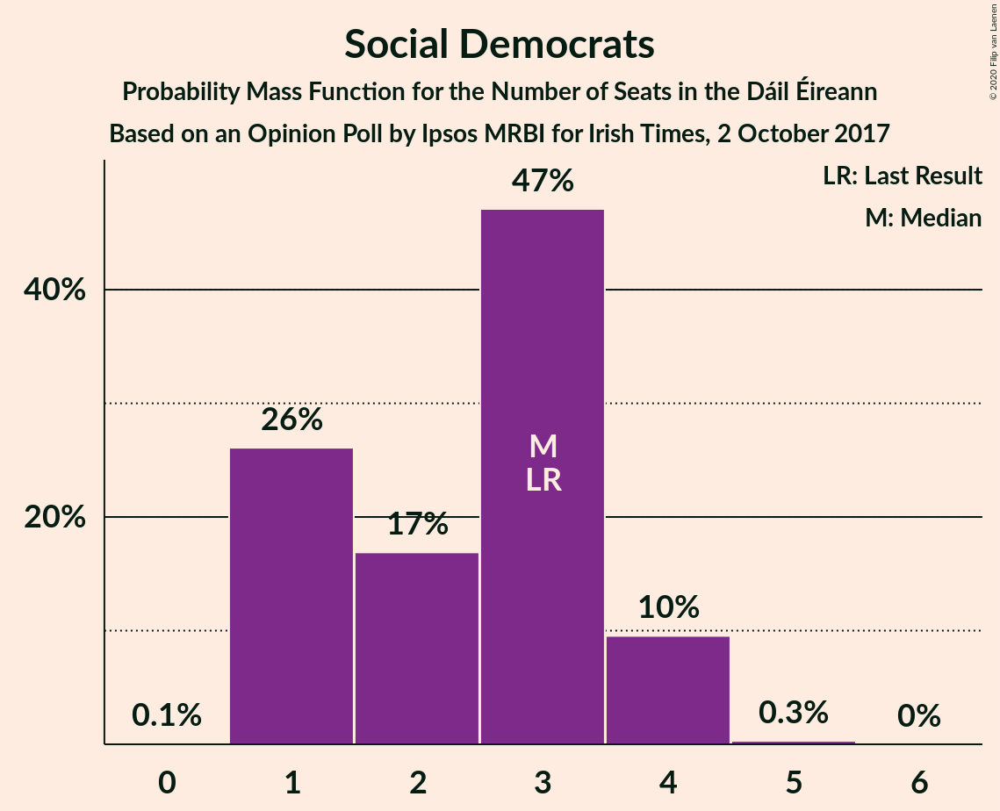
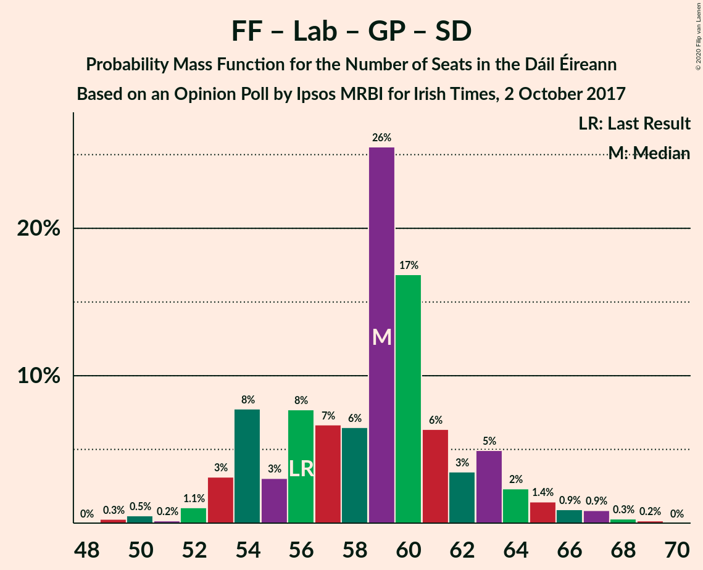
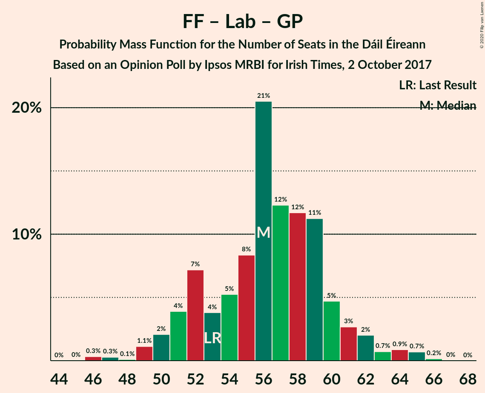

# Opinion Poll by Ipsos MRBI for Irish Times, 2 October 2017

<a href="#voting-intentions">Voting Intentions</a> | <a href="#seats">Seats</a> | <a href="#coalitions">Coalitions</a> | <a href="#technical-information">Technical Information</a>

## Voting Intentions

### Confidence Intervals

| Party | Last Result | Poll Result | 80% Confidence Interval | 90% Confidence Interval | 95% Confidence Interval | 99% Confidence Interval |
|:-----:|:-----------:|:-----------:|:-----------------------:|:-----------------------:|:-----------------------:|:-----------------------:|
| Fine Gael | 25.5% | 30.9% | 29.2–32.7% |28.8–33.2% |28.4–33.6% |27.6–34.4% |
| Fianna Fáil | 24.3% | 28.9% | 27.3–30.6% |26.8–31.1% |26.4–31.6% |25.7–32.4% |
| Sinn Féin | 13.8% | 18.9% | 17.5–20.4% |17.1–20.9% |16.8–21.2% |16.2–22.0% |
| Independent | 15.9% | 7.6% | 6.7–8.7% |6.4–9.0% |6.2–9.2% |5.8–9.8% |
| Labour Party | 6.6% | 4.0% | 3.4–4.8% |3.2–5.1% |3.0–5.3% |2.7–5.7% |
| Green Party/Comhaontas Glas | 2.7% | 3.0% | 2.5–3.7% |2.3–3.9% |2.2–4.1% |1.9–4.5% |
| Solidarity–People Before Profit | 3.9% | 2.0% | 1.6–2.6% |1.4–2.8% |1.3–3.0% |1.2–3.3% |
| Social Democrats | 3.0% | 2.0% | 1.6–2.6% |1.4–2.8% |1.3–3.0% |1.2–3.3% |
| Independents 4 Change | 1.5% | 0.9% | 0.6–1.4% |0.6–1.5% |0.5–1.6% |0.4–1.9% |
| Renua Ireland | 2.2% | 0.2% | 0.1–0.6% |0.1–0.7% |0.1–0.7% |0.0–0.9% |

*Note:* The poll result column reflects the actual value used in the calculations. Published results may vary slightly, and in addition be rounded to fewer digits.

## Seats

### Confidence Intervals

| Party | Last Result | Median | 80% Confidence Interval | 90% Confidence Interval | 95% Confidence Interval | 99% Confidence Interval |
|:-----:|:-----------:|:------:|:-----------------------:|:-----------------------:|:-----------------------:|:-----------------------:|
| <a href="#fine-gael">Fine Gael</a> | 49 | 58 | 58–63 |57–64 |53–65 |52–67 |
| <a href="#fianna-fáil">Fianna Fáil</a> | 44 | 55 | 51–55 |50–56 |48–58 |46–59 |
| <a href="#sinn-féin">Sinn Féin</a> | 23 | 35 | 32–35 |32–36 |32–37 |30–39 |
| <a href="#independent">Independent</a> | 19 | 4 | 3–4 |3–4 |3–5 |3–6 |
| <a href="#labour-party">Labour Party</a> | 7 | 1 | 0–3 |0–3 |0–5 |0–9 |
| <a href="#green-party/comhaontas-glas">Green Party/Comhaontas Glas</a> | 2 | 0 | 0–2 |0–3 |0–3 |0–3 |
| <a href="#solidarity–people-before-profit">Solidarity–People Before Profit</a> | 6 | 2 | 1–2 |1–2 |0–3 |0–4 |
| <a href="#social-democrats">Social Democrats</a> | 3 | 3 | 1–3 |1–4 |1–4 |1–4 |
| <a href="#independents-4-change">Independents 4 Change</a> | 4 | 2 | 1–2 |1–3 |1–3 |1–3 |
| <a href="#renua-ireland">Renua Ireland</a> | 0 | 0 | 0 |0 |0 |0 |

### Fine Gael

*For a full overview of the results for this party, see the [Fine Gael](party-finegael.html) page.*

| Number of Seats | Probability | Accumulated | Special Marks |
|:---------------:|:-----------:|:-----------:|:-------------:|
| 49 | 0% | 100% | Last Result |
| 50 | 0% | 100% |  |
| 51 | 0.2% | 99.9% |  |
| 52 | 0.4% | 99.8% |  |
| 53 | 2% | 99.3% |  |
| 54 | 0.8% | 97% |  |
| 55 | 0.6% | 97% |  |
| 56 | 0.5% | 96% |  |
| 57 | 2% | 96% |  |
| 58 | 56% | 94% | Median |
| 59 | 2% | 38% |  |
| 60 | 6% | 35% |  |
| 61 | 5% | 30% |  |
| 62 | 11% | 24% |  |
| 63 | 7% | 14% |  |
| 64 | 2% | 6% |  |
| 65 | 2% | 4% |  |
| 66 | 1.3% | 2% |  |
| 67 | 0.6% | 0.7% |  |
| 68 | 0% | 0% |  |

### Fianna Fáil

*For a full overview of the results for this party, see the [Fianna Fáil](party-fiannafáil.html) page.*

| Number of Seats | Probability | Accumulated | Special Marks |
|:---------------:|:-----------:|:-----------:|:-------------:|
| 43 | 0.1% | 100% |  |
| 44 | 0.1% | 99.8% | Last Result |
| 45 | 0.1% | 99.8% |  |
| 46 | 0.2% | 99.7% |  |
| 47 | 1.0% | 99.5% |  |
| 48 | 1.1% | 98% |  |
| 49 | 2% | 97% |  |
| 50 | 3% | 95% |  |
| 51 | 12% | 92% |  |
| 52 | 4% | 81% |  |
| 53 | 17% | 77% |  |
| 54 | 2% | 61% |  |
| 55 | 51% | 59% | Median |
| 56 | 4% | 8% |  |
| 57 | 0.6% | 4% |  |
| 58 | 2% | 3% |  |
| 59 | 0.9% | 1.2% |  |
| 60 | 0.3% | 0.3% |  |
| 61 | 0% | 0% |  |

### Sinn Féin

*For a full overview of the results for this party, see the [Sinn Féin](party-sinnféin.html) page.*

| Number of Seats | Probability | Accumulated | Special Marks |
|:---------------:|:-----------:|:-----------:|:-------------:|
| 23 | 0% | 100% | Last Result |
| 24 | 0% | 100% |  |
| 25 | 0% | 100% |  |
| 26 | 0% | 100% |  |
| 27 | 0% | 100% |  |
| 28 | 0% | 100% |  |
| 29 | 0% | 100% |  |
| 30 | 0.6% | 100% |  |
| 31 | 0.5% | 99.3% |  |
| 32 | 10% | 98.8% |  |
| 33 | 9% | 89% |  |
| 34 | 10% | 80% |  |
| 35 | 60% | 70% | Median |
| 36 | 6% | 10% |  |
| 37 | 3% | 4% |  |
| 38 | 0.4% | 1.1% |  |
| 39 | 0.7% | 0.8% |  |
| 40 | 0% | 0% |  |

### Independent

*For a full overview of the results for this party, see the [Independent](party-independent.html) page.*

| Number of Seats | Probability | Accumulated | Special Marks |
|:---------------:|:-----------:|:-----------:|:-------------:|
| 2 | 0.2% | 100% |  |
| 3 | 20% | 99.8% |  |
| 4 | 76% | 80% | Median |
| 5 | 4% | 4% |  |
| 6 | 0.5% | 0.7% |  |
| 7 | 0.1% | 0.1% |  |
| 8 | 0% | 0% |  |
| 9 | 0% | 0% |  |
| 10 | 0% | 0% |  |
| 11 | 0% | 0% |  |
| 12 | 0% | 0% |  |
| 13 | 0% | 0% |  |
| 14 | 0% | 0% |  |
| 15 | 0% | 0% |  |
| 16 | 0% | 0% |  |
| 17 | 0% | 0% |  |
| 18 | 0% | 0% |  |
| 19 | 0% | 0% | Last Result |

### Labour Party

*For a full overview of the results for this party, see the [Labour Party](party-labourparty.html) page.*

| Number of Seats | Probability | Accumulated | Special Marks |
|:---------------:|:-----------:|:-----------:|:-------------:|
| 0 | 20% | 100% |  |
| 1 | 56% | 80% | Median |
| 2 | 14% | 24% |  |
| 3 | 5% | 10% |  |
| 4 | 2% | 5% |  |
| 5 | 1.0% | 3% |  |
| 6 | 0.5% | 2% |  |
| 7 | 0.6% | 2% | Last Result |
| 8 | 0.6% | 1.3% |  |
| 9 | 0.5% | 0.7% |  |
| 10 | 0.2% | 0.2% |  |
| 11 | 0% | 0% |  |

### Green Party/Comhaontas Glas

*For a full overview of the results for this party, see the [Green Party/Comhaontas Glas](party-greenpartycomhaontasglas.html) page.*

| Number of Seats | Probability | Accumulated | Special Marks |
|:---------------:|:-----------:|:-----------:|:-------------:|
| 0 | 58% | 100% | Median |
| 1 | 10% | 42% |  |
| 2 | 23% | 31% | Last Result |
| 3 | 8% | 8% |  |
| 4 | 0% | 0.1% |  |
| 5 | 0.1% | 0.1% |  |
| 6 | 0% | 0% |  |

### Solidarity–People Before Profit

*For a full overview of the results for this party, see the [Solidarity–People Before Profit](party-solidarity–peoplebeforeprofit.html) page.*

| Number of Seats | Probability | Accumulated | Special Marks |
|:---------------:|:-----------:|:-----------:|:-------------:|
| 0 | 5% | 100% |  |
| 1 | 18% | 95% |  |
| 2 | 74% | 77% | Median |
| 3 | 2% | 3% |  |
| 4 | 0.8% | 0.8% |  |
| 5 | 0% | 0% |  |
| 6 | 0% | 0% | Last Result |

### Social Democrats

*For a full overview of the results for this party, see the [Social Democrats](party-socialdemocrats.html) page.*

| Number of Seats | Probability | Accumulated | Special Marks |
|:---------------:|:-----------:|:-----------:|:-------------:|
| 1 | 13% | 100% |  |
| 2 | 9% | 87% |  |
| 3 | 69% | 77% | Last Result, Median |
| 4 | 8% | 9% |  |
| 5 | 0.2% | 0.2% |  |
| 6 | 0% | 0% |  |

### Independents 4 Change

*For a full overview of the results for this party, see the [Independents 4 Change](party-independents4change.html) page.*

| Number of Seats | Probability | Accumulated | Special Marks |
|:---------------:|:-----------:|:-----------:|:-------------:|
| 1 | 11% | 100% |  |
| 2 | 81% | 89% | Median |
| 3 | 7% | 7% |  |
| 4 | 0% | 0% | Last Result |

### Renua Ireland

*For a full overview of the results for this party, see the [Renua Ireland](party-renuaireland.html) page.*

| Number of Seats | Probability | Accumulated | Special Marks |
|:---------------:|:-----------:|:-----------:|:-------------:|
| 0 | 99.9% | 100% | Last Result, Median |
| 1 | 0.1% | 0.1% |  |
| 2 | 0% | 0% |  |

## Coalitions

### Confidence Intervals

| Coalition | Last Result | Median | Majority? | 80% Confidence Interval | 90% Confidence Interval | 95% Confidence Interval | 99% Confidence Interval |
|:---------:|:-----------:|:------:|:---------:|:-----------------------:|:-----------------------:|:-----------------------:|:-----------------------:|
| Fine Gael – Fianna Fáil | 93 | 113 | 100% | 111–115 | 110–116 | 108–117 | 105–118 |
| Fianna Fáil – Sinn Féin | 67 | 90 | 99.3% | 84–90 | 83–90 | 82–93 | 80–95 |
| Fine Gael – Labour Party – Green Party/Comhaontas Glas – Social Democrats | 61 | 62 | 0% | 62–69 | 62–70 | 60–71 | 58–74 |
| Fine Gael – Labour Party – Green Party/Comhaontas Glas | 58 | 59 | 0% | 59–67 | 59–67 | 57–68 | 55–71 |
| Fine Gael – Green Party/Comhaontas Glas | 51 | 58 | 0% | 58–65 | 58–66 | 55–67 | 53–68 |
| Fine Gael – Labour Party | 56 | 59 | 0% | 59–65 | 59–65 | 56–66 | 54–69 |
| Fine Gael | 49 | 58 | 0% | 58–63 | 57–64 | 53–65 | 52–67 |
| Fianna Fáil – Labour Party – Green Party/Comhaontas Glas – Social Democrats | 56 | 59 | 0% | 56–60 | 55–63 | 54–64 | 52–66 |
| Fianna Fáil – Labour Party – Green Party/Comhaontas Glas | 53 | 56 | 0% | 53–58 | 52–61 | 51–62 | 49–63 |
| Fianna Fáil – Labour Party | 51 | 56 | 0% | 52–56 | 51–59 | 50–60 | 47–61 |
| Fianna Fáil – Green Party/Comhaontas Glas | 46 | 55 | 0% | 52–56 | 51–59 | 50–59 | 48–61 |

### Fine Gael – Fianna Fáil

| Number of Seats | Probability | Accumulated | Special Marks |
|:---------------:|:-----------:|:-----------:|:-------------:|
| 93 | 0% | 100% | Last Result |
| 94 | 0% | 100% |  |
| 95 | 0% | 100% |  |
| 96 | 0% | 100% |  |
| 97 | 0% | 100% |  |
| 98 | 0% | 100% |  |
| 99 | 0% | 100% |  |
| 100 | 0% | 100% |  |
| 101 | 0% | 100% |  |
| 102 | 0% | 100% |  |
| 103 | 0% | 100% |  |
| 104 | 0% | 100% |  |
| 105 | 0.8% | 99.9% |  |
| 106 | 0.1% | 99.1% |  |
| 107 | 0.9% | 99.0% |  |
| 108 | 1.1% | 98% |  |
| 109 | 2% | 97% |  |
| 110 | 3% | 95% |  |
| 111 | 6% | 93% |  |
| 112 | 6% | 87% |  |
| 113 | 55% | 81% | Median |
| 114 | 9% | 26% |  |
| 115 | 8% | 17% |  |
| 116 | 5% | 9% |  |
| 117 | 3% | 4% |  |
| 118 | 0.8% | 1.1% |  |
| 119 | 0.3% | 0.4% |  |
| 120 | 0.1% | 0.1% |  |
| 121 | 0% | 0% |  |

### Fianna Fáil – Sinn Féin

| Number of Seats | Probability | Accumulated | Special Marks |
|:---------------:|:-----------:|:-----------:|:-------------:|
| 67 | 0% | 100% | Last Result |
| 68 | 0% | 100% |  |
| 69 | 0% | 100% |  |
| 70 | 0% | 100% |  |
| 71 | 0% | 100% |  |
| 72 | 0% | 100% |  |
| 73 | 0% | 100% |  |
| 74 | 0% | 100% |  |
| 75 | 0% | 100% |  |
| 76 | 0% | 100% |  |
| 77 | 0% | 100% |  |
| 78 | 0% | 100% |  |
| 79 | 0.1% | 100% |  |
| 80 | 0.7% | 99.9% |  |
| 81 | 0.6% | 99.3% | Majority |
| 82 | 3% | 98.6% |  |
| 83 | 6% | 96% |  |
| 84 | 4% | 90% |  |
| 85 | 4% | 87% |  |
| 86 | 4% | 83% |  |
| 87 | 11% | 79% |  |
| 88 | 7% | 68% |  |
| 89 | 6% | 61% |  |
| 90 | 51% | 55% | Median |
| 91 | 0.4% | 4% |  |
| 92 | 0.7% | 4% |  |
| 93 | 2% | 3% |  |
| 94 | 0.7% | 1.3% |  |
| 95 | 0.6% | 0.7% |  |
| 96 | 0.1% | 0.1% |  |
| 97 | 0% | 0% |  |

### Fine Gael – Labour Party – Green Party/Comhaontas Glas – Social Democrats

| Number of Seats | Probability | Accumulated | Special Marks |
|:---------------:|:-----------:|:-----------:|:-------------:|
| 56 | 0.1% | 100% |  |
| 57 | 0.1% | 99.9% |  |
| 58 | 0.6% | 99.8% |  |
| 59 | 0.9% | 99.2% |  |
| 60 | 1.1% | 98% |  |
| 61 | 0.4% | 97% | Last Result |
| 62 | 52% | 97% | Median |
| 63 | 0.8% | 45% |  |
| 64 | 7% | 44% |  |
| 65 | 10% | 38% |  |
| 66 | 6% | 28% |  |
| 67 | 4% | 22% |  |
| 68 | 3% | 18% |  |
| 69 | 7% | 14% |  |
| 70 | 4% | 7% |  |
| 71 | 1.3% | 3% |  |
| 72 | 0.6% | 2% |  |
| 73 | 0.1% | 1.0% |  |
| 74 | 0.7% | 0.9% |  |
| 75 | 0.1% | 0.1% |  |
| 76 | 0% | 0% |  |

### Fine Gael – Labour Party – Green Party/Comhaontas Glas

| Number of Seats | Probability | Accumulated | Special Marks |
|:---------------:|:-----------:|:-----------:|:-------------:|
| 53 | 0.1% | 100% |  |
| 54 | 0.2% | 99.9% |  |
| 55 | 0.5% | 99.7% |  |
| 56 | 0.8% | 99.2% |  |
| 57 | 0.9% | 98% |  |
| 58 | 0.7% | 97% | Last Result |
| 59 | 51% | 97% | Median |
| 60 | 1.4% | 46% |  |
| 61 | 5% | 44% |  |
| 62 | 9% | 39% |  |
| 63 | 0.8% | 30% |  |
| 64 | 8% | 29% |  |
| 65 | 4% | 22% |  |
| 66 | 4% | 18% |  |
| 67 | 9% | 13% |  |
| 68 | 3% | 4% |  |
| 69 | 0.3% | 1.5% |  |
| 70 | 0.1% | 1.2% |  |
| 71 | 0.8% | 1.1% |  |
| 72 | 0.2% | 0.3% |  |
| 73 | 0% | 0.1% |  |
| 74 | 0.1% | 0.1% |  |
| 75 | 0% | 0% |  |

### Fine Gael – Green Party/Comhaontas Glas

| Number of Seats | Probability | Accumulated | Special Marks |
|:---------------:|:-----------:|:-----------:|:-------------:|
| 51 | 0% | 100% | Last Result |
| 52 | 0.1% | 99.9% |  |
| 53 | 0.7% | 99.9% |  |
| 54 | 0.3% | 99.2% |  |
| 55 | 2% | 98.8% |  |
| 56 | 0.9% | 97% |  |
| 57 | 0.8% | 96% |  |
| 58 | 51% | 95% | Median |
| 59 | 4% | 44% |  |
| 60 | 4% | 40% |  |
| 61 | 4% | 36% |  |
| 62 | 4% | 32% |  |
| 63 | 5% | 27% |  |
| 64 | 8% | 22% |  |
| 65 | 8% | 14% |  |
| 66 | 1.4% | 6% |  |
| 67 | 3% | 4% |  |
| 68 | 1.0% | 1.1% |  |
| 69 | 0.1% | 0.1% |  |
| 70 | 0% | 0% |  |

### Fine Gael – Labour Party

| Number of Seats | Probability | Accumulated | Special Marks |
|:---------------:|:-----------:|:-----------:|:-------------:|
| 51 | 0.1% | 100% |  |
| 52 | 0% | 99.9% |  |
| 53 | 0.1% | 99.9% |  |
| 54 | 1.0% | 99.8% |  |
| 55 | 1.3% | 98.8% |  |
| 56 | 0.6% | 98% | Last Result |
| 57 | 0.6% | 97% |  |
| 58 | 1.0% | 96% |  |
| 59 | 51% | 95% | Median |
| 60 | 6% | 44% |  |
| 61 | 7% | 39% |  |
| 62 | 9% | 31% |  |
| 63 | 6% | 22% |  |
| 64 | 2% | 16% |  |
| 65 | 9% | 14% |  |
| 66 | 3% | 5% |  |
| 67 | 1.0% | 2% |  |
| 68 | 0.5% | 1.3% |  |
| 69 | 0.4% | 0.8% |  |
| 70 | 0.2% | 0.4% |  |
| 71 | 0.1% | 0.2% |  |
| 72 | 0.1% | 0.1% |  |
| 73 | 0% | 0% |  |

### Fine Gael

| Number of Seats | Probability | Accumulated | Special Marks |
|:---------------:|:-----------:|:-----------:|:-------------:|
| 49 | 0% | 100% | Last Result |
| 50 | 0% | 100% |  |
| 51 | 0.2% | 99.9% |  |
| 52 | 0.4% | 99.8% |  |
| 53 | 2% | 99.3% |  |
| 54 | 0.8% | 97% |  |
| 55 | 0.6% | 97% |  |
| 56 | 0.5% | 96% |  |
| 57 | 2% | 96% |  |
| 58 | 56% | 94% | Median |
| 59 | 2% | 38% |  |
| 60 | 6% | 35% |  |
| 61 | 5% | 30% |  |
| 62 | 11% | 24% |  |
| 63 | 7% | 14% |  |
| 64 | 2% | 6% |  |
| 65 | 2% | 4% |  |
| 66 | 1.3% | 2% |  |
| 67 | 0.6% | 0.7% |  |
| 68 | 0% | 0% |  |

### Fianna Fáil – Labour Party – Green Party/Comhaontas Glas – Social Democrats

| Number of Seats | Probability | Accumulated | Special Marks |
|:---------------:|:-----------:|:-----------:|:-------------:|
| 50 | 0.1% | 100% |  |
| 51 | 0.1% | 99.9% |  |
| 52 | 1.0% | 99.8% |  |
| 53 | 1.0% | 98.8% |  |
| 54 | 2% | 98% |  |
| 55 | 1.2% | 96% |  |
| 56 | 12% | 94% | Last Result |
| 57 | 7% | 83% |  |
| 58 | 5% | 76% |  |
| 59 | 57% | 71% | Median |
| 60 | 4% | 13% |  |
| 61 | 2% | 9% |  |
| 62 | 0.9% | 8% |  |
| 63 | 4% | 7% |  |
| 64 | 1.4% | 3% |  |
| 65 | 0.8% | 2% |  |
| 66 | 0.3% | 0.7% |  |
| 67 | 0.3% | 0.4% |  |
| 68 | 0% | 0.1% |  |
| 69 | 0% | 0% |  |

### Fianna Fáil – Labour Party – Green Party/Comhaontas Glas

| Number of Seats | Probability | Accumulated | Special Marks |
|:---------------:|:-----------:|:-----------:|:-------------:|
| 47 | 0.1% | 100% |  |
| 48 | 0.1% | 99.9% |  |
| 49 | 0.7% | 99.9% |  |
| 50 | 0.5% | 99.1% |  |
| 51 | 2% | 98.6% |  |
| 52 | 3% | 97% |  |
| 53 | 5% | 93% | Last Result |
| 54 | 2% | 88% |  |
| 55 | 14% | 87% |  |
| 56 | 58% | 72% | Median |
| 57 | 4% | 14% |  |
| 58 | 2% | 10% |  |
| 59 | 1.2% | 8% |  |
| 60 | 0.9% | 7% |  |
| 61 | 2% | 6% |  |
| 62 | 3% | 4% |  |
| 63 | 0.3% | 0.7% |  |
| 64 | 0.1% | 0.4% |  |
| 65 | 0.2% | 0.3% |  |
| 66 | 0% | 0.1% |  |
| 67 | 0% | 0% |  |

### Fianna Fáil – Labour Party

| Number of Seats | Probability | Accumulated | Special Marks |
|:---------------:|:-----------:|:-----------:|:-------------:|
| 45 | 0.1% | 100% |  |
| 46 | 0% | 99.9% |  |
| 47 | 0.6% | 99.9% |  |
| 48 | 0.3% | 99.3% |  |
| 49 | 0.2% | 99.0% |  |
| 50 | 2% | 98.8% |  |
| 51 | 7% | 97% | Last Result |
| 52 | 2% | 90% |  |
| 53 | 15% | 89% |  |
| 54 | 4% | 73% |  |
| 55 | 8% | 69% |  |
| 56 | 52% | 61% | Median |
| 57 | 1.4% | 9% |  |
| 58 | 0.9% | 8% |  |
| 59 | 4% | 7% |  |
| 60 | 1.3% | 3% |  |
| 61 | 1.1% | 2% |  |
| 62 | 0.1% | 0.4% |  |
| 63 | 0.3% | 0.3% |  |
| 64 | 0% | 0.1% |  |
| 65 | 0% | 0% |  |

### Fianna Fáil – Green Party/Comhaontas Glas

| Number of Seats | Probability | Accumulated | Special Marks |
|:---------------:|:-----------:|:-----------:|:-------------:|
| 45 | 0.2% | 100% |  |
| 46 | 0.1% | 99.8% | Last Result |
| 47 | 0.2% | 99.8% |  |
| 48 | 0.2% | 99.6% |  |
| 49 | 2% | 99.4% |  |
| 50 | 2% | 98% |  |
| 51 | 3% | 96% |  |
| 52 | 6% | 94% |  |
| 53 | 8% | 87% |  |
| 54 | 8% | 79% |  |
| 55 | 60% | 71% | Median |
| 56 | 3% | 11% |  |
| 57 | 1.3% | 8% |  |
| 58 | 1.3% | 6% |  |
| 59 | 3% | 5% |  |
| 60 | 1.1% | 2% |  |
| 61 | 0.4% | 0.7% |  |
| 62 | 0.2% | 0.3% |  |
| 63 | 0% | 0% |  |

## Technical Information

### Opinion Poll

+ **Polling firm:** Ipsos MRBI
+ **Commissioner(s):** Irish Times
+ **Fieldwork period:** 2 October 2017

### Calculations

+ **Sample size:** 1200
+ **Simulations done:** 262,144
+ **Error estimate:** 1.37%

