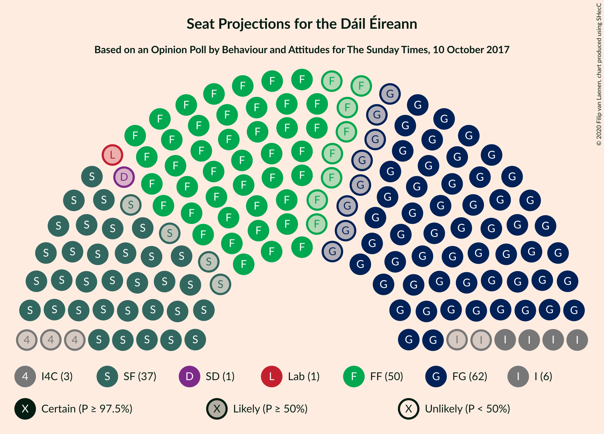
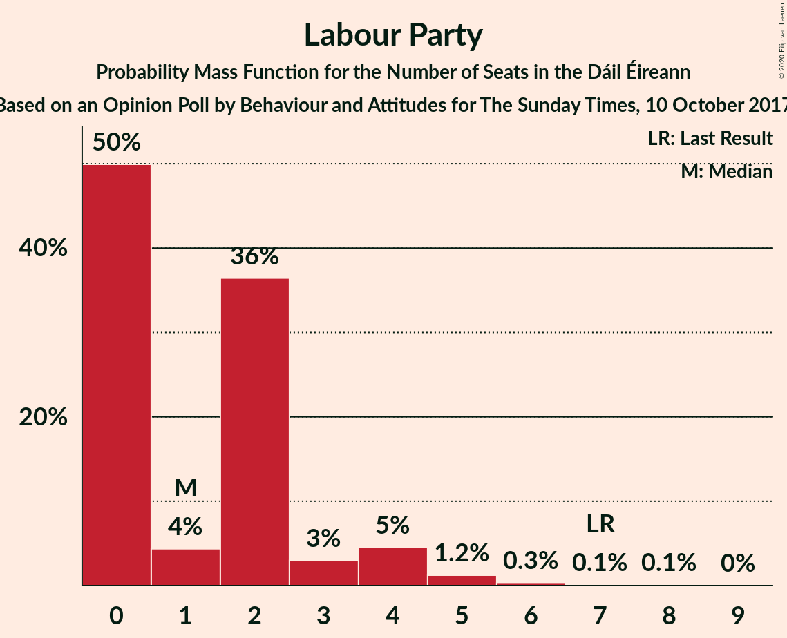
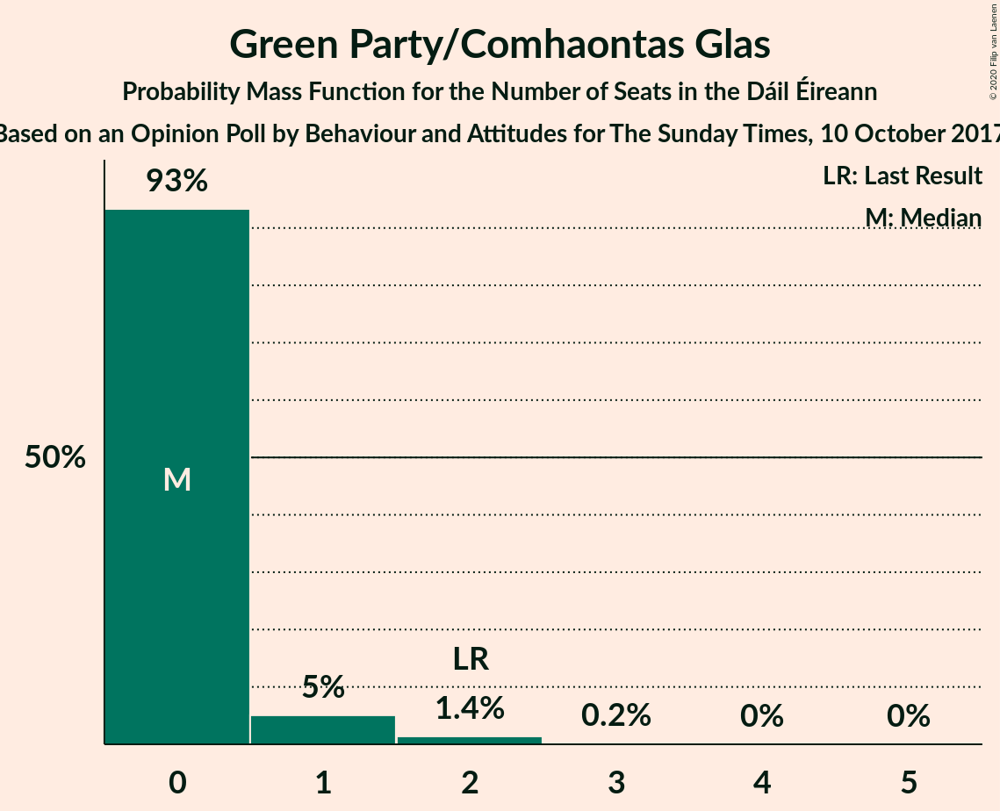
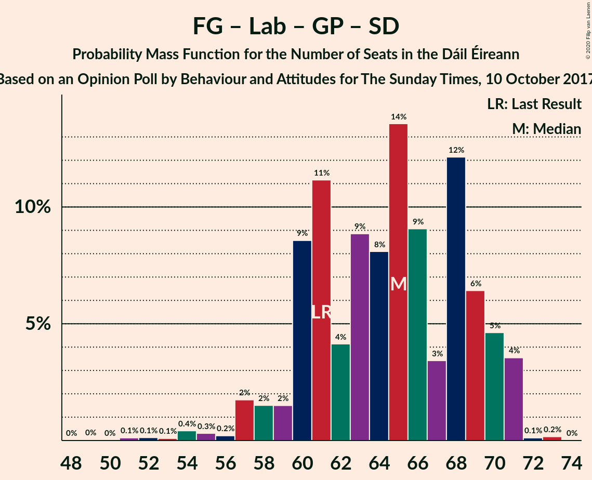
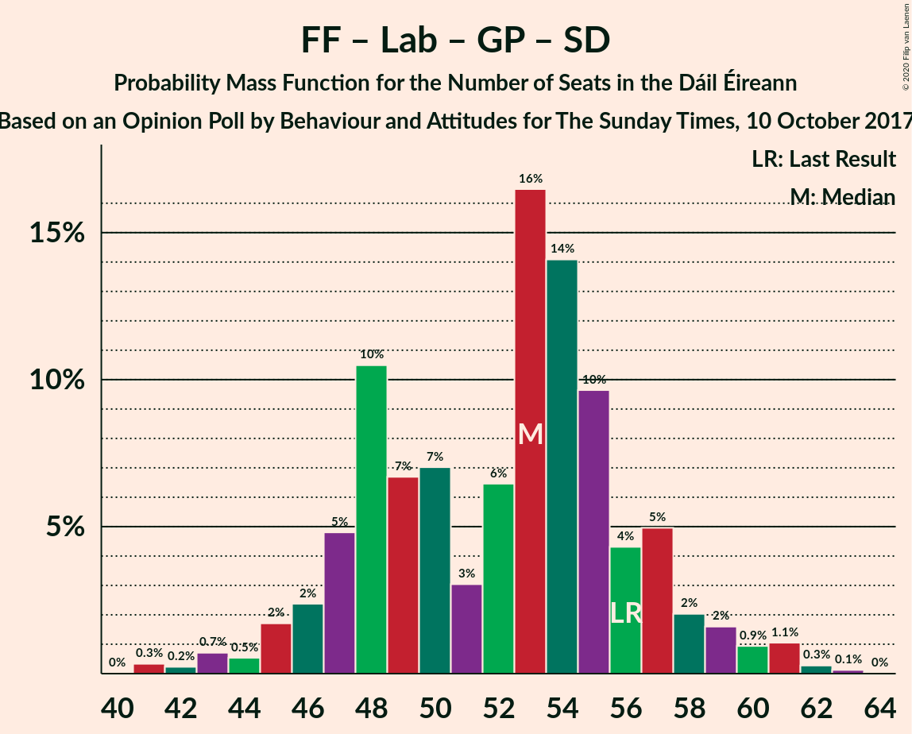

# Opinion Poll by Behaviour and Attitudes for The Sunday Times, 10 October 2017

<a href="#voting-intentions">Voting Intentions</a> | <a href="#seats">Seats</a> | <a href="#coalitions">Coalitions</a> | <a href="#technical-information">Technical Information</a>

## Voting Intentions

### Confidence Intervals

| Party | Last Result | Poll Result | 80% Confidence Interval | 90% Confidence Interval | 95% Confidence Interval | 99% Confidence Interval |
|:-----:|:-----------:|:-----------:|:-----------------------:|:-----------------------:|:-----------------------:|:-----------------------:|
| Fine Gael | 25.5% | 31.0% | 29.0–32.9% |28.5–33.5% |28.0–34.0% |27.1–35.0% |
| Fianna Fáil | 24.3% | 26.9% | 25.1–28.8% |24.6–29.4% |24.1–29.9% |23.3–30.8% |
| Sinn Féin | 13.8% | 18.9% | 17.3–20.7% |16.9–21.2% |16.5–21.6% |15.8–22.4% |
| Independent | 15.9% | 10.2% | 9.0–11.6% |8.6–11.9% |8.4–12.3% |7.8–13.0% |
| Labour Party | 6.6% | 4.0% | 3.3–5.0% |3.1–5.3% |2.9–5.5% |2.6–6.0% |
| Green Party/Comhaontas Glas | 2.7% | 2.0% | 1.5–2.7% |1.4–2.9% |1.2–3.1% |1.1–3.5% |
| Independents 4 Change | 1.5% | 1.3% | 0.9–1.9% |0.8–2.1% |0.7–2.3% |0.6–2.6% |
| Solidarity–People Before Profit | 3.9% | 1.0% | 0.7–1.6% |0.6–1.7% |0.5–1.9% |0.4–2.2% |
| Social Democrats | 3.0% | 1.0% | 0.7–1.6% |0.6–1.7% |0.5–1.9% |0.4–2.2% |
| Renua Ireland | 2.2% | 0.1% | 0.1–0.6% |0.1–0.7% |0.1–0.8% |0.0–1.0% |

*Note:* The poll result column reflects the actual value used in the calculations. Published results may vary slightly, and in addition be rounded to fewer digits.

## Seats

### Confidence Intervals

| Party | Last Result | Median | 80% Confidence Interval | 90% Confidence Interval | 95% Confidence Interval | 99% Confidence Interval |
|:-----:|:-----------:|:------:|:-----------------------:|:-----------------------:|:-----------------------:|:-----------------------:|
| <a href="#fine-gael">Fine Gael</a> | 49 | 62 | 58–67 |55–67 |54–68 |51–69 |
| <a href="#fianna-fáil">Fianna Fáil</a> | 44 | 50 | 45–54 |43–55 |42–57 |41–59 |
| <a href="#sinn-féin">Sinn Féin</a> | 23 | 37 | 34–40 |34–42 |33–42 |31–43 |
| <a href="#independent">Independent</a> | 19 | 6 | 4–9 |4–10 |4–11 |3–15 |
| <a href="#labour-party">Labour Party</a> | 7 | 1 | 0–2 |0–4 |0–4 |0–6 |
| <a href="#green-party/comhaontas-glas">Green Party/Comhaontas Glas</a> | 2 | 0 | 0 |0–1 |0–1 |0–2 |
| <a href="#independents-4-change">Independents 4 Change</a> | 4 | 3 | 0–5 |0–5 |0–5 |0–5 |
| <a href="#solidarity–people-before-profit">Solidarity–People Before Profit</a> | 6 | 0 | 0 |0 |0–1 |0–1 |
| <a href="#social-democrats">Social Democrats</a> | 3 | 1 | 0–3 |0–3 |0–3 |0–3 |
| <a href="#renua-ireland">Renua Ireland</a> | 0 | 0 | 0 |0 |0 |0 |

### Fine Gael

*For a full overview of the results for this party, see the [Fine Gael](party-finegael.html) page.*

| Number of Seats | Probability | Accumulated | Special Marks |
|:---------------:|:-----------:|:-----------:|:-------------:|
| 48 | 0.1% | 100% |  |
| 49 | 0.1% | 99.9% | Last Result |
| 50 | 0.1% | 99.8% |  |
| 51 | 0.4% | 99.6% |  |
| 52 | 0.1% | 99.3% |  |
| 53 | 0.4% | 99.2% |  |
| 54 | 1.5% | 98.7% |  |
| 55 | 2% | 97% |  |
| 56 | 1.0% | 95% |  |
| 57 | 2% | 94% |  |
| 58 | 2% | 92% |  |
| 59 | 10% | 90% |  |
| 60 | 10% | 80% |  |
| 61 | 15% | 70% |  |
| 62 | 16% | 55% | Median |
| 63 | 3% | 39% |  |
| 64 | 9% | 36% |  |
| 65 | 5% | 27% |  |
| 66 | 10% | 22% |  |
| 67 | 9% | 11% |  |
| 68 | 2% | 3% |  |
| 69 | 0.6% | 0.6% |  |
| 70 | 0% | 0.1% |  |
| 71 | 0% | 0% |  |

### Fianna Fáil

*For a full overview of the results for this party, see the [Fianna Fáil](party-fiannafáil.html) page.*

| Number of Seats | Probability | Accumulated | Special Marks |
|:---------------:|:-----------:|:-----------:|:-------------:|
| 39 | 0.1% | 100% |  |
| 40 | 0.3% | 99.9% |  |
| 41 | 1.5% | 99.5% |  |
| 42 | 2% | 98% |  |
| 43 | 4% | 96% |  |
| 44 | 2% | 92% | Last Result |
| 45 | 8% | 90% |  |
| 46 | 2% | 82% |  |
| 47 | 13% | 80% |  |
| 48 | 8% | 68% |  |
| 49 | 5% | 59% |  |
| 50 | 10% | 54% | Median |
| 51 | 3% | 45% |  |
| 52 | 10% | 41% |  |
| 53 | 13% | 31% |  |
| 54 | 12% | 18% |  |
| 55 | 3% | 7% |  |
| 56 | 1.2% | 4% |  |
| 57 | 1.1% | 3% |  |
| 58 | 0.5% | 2% |  |
| 59 | 1.1% | 1.2% |  |
| 60 | 0.1% | 0.1% |  |
| 61 | 0% | 0% |  |

### Sinn Féin

*For a full overview of the results for this party, see the [Sinn Féin](party-sinnféin.html) page.*

| Number of Seats | Probability | Accumulated | Special Marks |
|:---------------:|:-----------:|:-----------:|:-------------:|
| 23 | 0% | 100% | Last Result |
| 24 | 0% | 100% |  |
| 25 | 0% | 100% |  |
| 26 | 0% | 100% |  |
| 27 | 0% | 100% |  |
| 28 | 0% | 100% |  |
| 29 | 0% | 99.9% |  |
| 30 | 0.2% | 99.9% |  |
| 31 | 0.7% | 99.7% |  |
| 32 | 1.4% | 99.0% |  |
| 33 | 1.3% | 98% |  |
| 34 | 9% | 96% |  |
| 35 | 17% | 87% |  |
| 36 | 17% | 71% |  |
| 37 | 27% | 54% | Median |
| 38 | 14% | 27% |  |
| 39 | 2% | 13% |  |
| 40 | 3% | 11% |  |
| 41 | 2% | 8% |  |
| 42 | 5% | 6% |  |
| 43 | 0.4% | 0.5% |  |
| 44 | 0.1% | 0.1% |  |
| 45 | 0% | 0% |  |

### Independent

*For a full overview of the results for this party, see the [Independent](party-independent.html) page.*

| Number of Seats | Probability | Accumulated | Special Marks |
|:---------------:|:-----------:|:-----------:|:-------------:|
| 3 | 0.5% | 100% |  |
| 4 | 25% | 99.5% |  |
| 5 | 8% | 74% |  |
| 6 | 19% | 66% | Median |
| 7 | 17% | 48% |  |
| 8 | 16% | 31% |  |
| 9 | 9% | 15% |  |
| 10 | 3% | 6% |  |
| 11 | 2% | 3% |  |
| 12 | 0.4% | 2% |  |
| 13 | 0.7% | 1.4% |  |
| 14 | 0.2% | 0.7% |  |
| 15 | 0.4% | 0.6% |  |
| 16 | 0.2% | 0.2% |  |
| 17 | 0% | 0% |  |
| 18 | 0% | 0% |  |
| 19 | 0% | 0% | Last Result |

### Labour Party

*For a full overview of the results for this party, see the [Labour Party](party-labourparty.html) page.*

| Number of Seats | Probability | Accumulated | Special Marks |
|:---------------:|:-----------:|:-----------:|:-------------:|
| 0 | 50% | 100% |  |
| 1 | 4% | 50% | Median |
| 2 | 36% | 46% |  |
| 3 | 3% | 9% |  |
| 4 | 5% | 6% |  |
| 5 | 1.2% | 2% |  |
| 6 | 0.3% | 0.5% |  |
| 7 | 0.1% | 0.2% | Last Result |
| 8 | 0.1% | 0.1% |  |
| 9 | 0% | 0% |  |

### Green Party/Comhaontas Glas

*For a full overview of the results for this party, see the [Green Party/Comhaontas Glas](party-greenpartycomhaontasglas.html) page.*

| Number of Seats | Probability | Accumulated | Special Marks |
|:---------------:|:-----------:|:-----------:|:-------------:|
| 0 | 93% | 100% | Median |
| 1 | 5% | 7% |  |
| 2 | 1.4% | 2% | Last Result |
| 3 | 0.2% | 0.2% |  |
| 4 | 0% | 0% |  |

### Independents 4 Change

*For a full overview of the results for this party, see the [Independents 4 Change](party-independents4change.html) page.*

| Number of Seats | Probability | Accumulated | Special Marks |
|:---------------:|:-----------:|:-----------:|:-------------:|
| 0 | 14% | 100% |  |
| 1 | 23% | 86% |  |
| 2 | 11% | 63% |  |
| 3 | 6% | 52% | Median |
| 4 | 36% | 46% | Last Result |
| 5 | 10% | 10% |  |
| 6 | 0% | 0% |  |

### Solidarity–People Before Profit

*For a full overview of the results for this party, see the [Solidarity–People Before Profit](party-solidarity–peoplebeforeprofit.html) page.*

| Number of Seats | Probability | Accumulated | Special Marks |
|:---------------:|:-----------:|:-----------:|:-------------:|
| 0 | 97% | 100% | Median |
| 1 | 3% | 3% |  |
| 2 | 0.1% | 0.2% |  |
| 3 | 0.1% | 0.2% |  |
| 4 | 0.1% | 0.1% |  |
| 5 | 0% | 0% |  |
| 6 | 0% | 0% | Last Result |

### Social Democrats

*For a full overview of the results for this party, see the [Social Democrats](party-socialdemocrats.html) page.*

| Number of Seats | Probability | Accumulated | Special Marks |
|:---------------:|:-----------:|:-----------:|:-------------:|
| 0 | 26% | 100% |  |
| 1 | 45% | 74% | Median |
| 2 | 11% | 29% |  |
| 3 | 18% | 18% | Last Result |
| 4 | 0.1% | 0.1% |  |
| 5 | 0% | 0% |  |

### Renua Ireland

*For a full overview of the results for this party, see the [Renua Ireland](party-renuaireland.html) page.*

| Number of Seats | Probability | Accumulated | Special Marks |
|:---------------:|:-----------:|:-----------:|:-------------:|
| 0 | 100% | 100% | Last Result, Median |

## Coalitions

### Confidence Intervals

| Coalition | Last Result | Median | Majority? | 80% Confidence Interval | 90% Confidence Interval | 95% Confidence Interval | 99% Confidence Interval |
|:---------:|:-----------:|:------:|:---------:|:-----------------------:|:-----------------------:|:-----------------------:|:-----------------------:|
| Fine Gael – Fianna Fáil | 93 | 112 | 100% | 108–116 | 107–117 | 105–117 | 101–119 |
| Fianna Fáil – Sinn Féin | 67 | 86 | 89% | 80–92 | 79–94 | 78–95 | 77–96 |
| Fine Gael – Labour Party – Green Party/Comhaontas Glas – Social Democrats | 61 | 65 | 0% | 60–69 | 59–70 | 57–71 | 54–71 |
| Fine Gael – Labour Party – Green Party/Comhaontas Glas | 58 | 63 | 0% | 59–68 | 58–68 | 56–70 | 53–70 |
| Fine Gael – Labour Party | 56 | 63 | 0% | 59–68 | 57–68 | 56–70 | 53–70 |
| Fine Gael | 49 | 62 | 0% | 58–67 | 55–67 | 54–68 | 51–69 |
| Fine Gael – Green Party/Comhaontas Glas | 51 | 62 | 0% | 59–67 | 55–67 | 54–68 | 51–69 |
| Fianna Fáil – Labour Party – Green Party/Comhaontas Glas – Social Democrats | 56 | 53 | 0% | 47–57 | 46–58 | 45–59 | 42–61 |
| Fianna Fáil – Labour Party – Green Party/Comhaontas Glas | 53 | 52 | 0% | 46–55 | 44–57 | 44–58 | 41–61 |
| Fianna Fáil – Labour Party | 51 | 52 | 0% | 46–55 | 44–57 | 43–58 | 41–61 |
| Fianna Fáil – Green Party/Comhaontas Glas | 46 | 50 | 0% | 45–54 | 43–55 | 42–57 | 41–59 |

### Fine Gael – Fianna Fáil

| Number of Seats | Probability | Accumulated | Special Marks |
|:---------------:|:-----------:|:-----------:|:-------------:|
| 93 | 0% | 100% | Last Result |
| 94 | 0% | 100% |  |
| 95 | 0% | 100% |  |
| 96 | 0% | 100% |  |
| 97 | 0% | 100% |  |
| 98 | 0% | 100% |  |
| 99 | 0% | 100% |  |
| 100 | 0% | 99.9% |  |
| 101 | 0.5% | 99.9% |  |
| 102 | 0.1% | 99.4% |  |
| 103 | 0.3% | 99.3% |  |
| 104 | 0.5% | 98.9% |  |
| 105 | 1.0% | 98% |  |
| 106 | 2% | 97% |  |
| 107 | 5% | 95% |  |
| 108 | 3% | 91% |  |
| 109 | 15% | 87% |  |
| 110 | 7% | 73% |  |
| 111 | 12% | 66% |  |
| 112 | 10% | 54% | Median |
| 113 | 11% | 44% |  |
| 114 | 9% | 33% |  |
| 115 | 13% | 23% |  |
| 116 | 3% | 10% |  |
| 117 | 6% | 7% |  |
| 118 | 0.9% | 2% |  |
| 119 | 0.7% | 0.8% |  |
| 120 | 0.1% | 0.2% |  |
| 121 | 0% | 0.1% |  |
| 122 | 0% | 0% |  |

### Fianna Fáil – Sinn Féin

| Number of Seats | Probability | Accumulated | Special Marks |
|:---------------:|:-----------:|:-----------:|:-------------:|
| 67 | 0% | 100% | Last Result |
| 68 | 0% | 100% |  |
| 69 | 0% | 100% |  |
| 70 | 0% | 100% |  |
| 71 | 0% | 100% |  |
| 72 | 0% | 100% |  |
| 73 | 0% | 100% |  |
| 74 | 0% | 100% |  |
| 75 | 0.1% | 100% |  |
| 76 | 0.1% | 99.9% |  |
| 77 | 2% | 99.8% |  |
| 78 | 2% | 98% |  |
| 79 | 5% | 96% |  |
| 80 | 1.4% | 91% |  |
| 81 | 5% | 89% | Majority |
| 82 | 2% | 85% |  |
| 83 | 3% | 83% |  |
| 84 | 16% | 79% |  |
| 85 | 9% | 63% |  |
| 86 | 8% | 54% |  |
| 87 | 3% | 46% | Median |
| 88 | 7% | 43% |  |
| 89 | 11% | 36% |  |
| 90 | 4% | 25% |  |
| 91 | 10% | 21% |  |
| 92 | 3% | 11% |  |
| 93 | 1.4% | 8% |  |
| 94 | 4% | 7% |  |
| 95 | 1.0% | 3% |  |
| 96 | 1.3% | 2% |  |
| 97 | 0.2% | 0.5% |  |
| 98 | 0.1% | 0.3% |  |
| 99 | 0.1% | 0.1% |  |
| 100 | 0% | 0% |  |

### Fine Gael – Labour Party – Green Party/Comhaontas Glas – Social Democrats

| Number of Seats | Probability | Accumulated | Special Marks |
|:---------------:|:-----------:|:-----------:|:-------------:|
| 49 | 0% | 100% |  |
| 50 | 0% | 99.9% |  |
| 51 | 0.1% | 99.9% |  |
| 52 | 0.1% | 99.8% |  |
| 53 | 0.1% | 99.7% |  |
| 54 | 0.4% | 99.6% |  |
| 55 | 0.3% | 99.2% |  |
| 56 | 0.2% | 98.9% |  |
| 57 | 2% | 98.7% |  |
| 58 | 2% | 97% |  |
| 59 | 2% | 95% |  |
| 60 | 9% | 94% |  |
| 61 | 11% | 85% | Last Result |
| 62 | 4% | 74% |  |
| 63 | 9% | 70% |  |
| 64 | 8% | 61% | Median |
| 65 | 14% | 53% |  |
| 66 | 9% | 40% |  |
| 67 | 3% | 30% |  |
| 68 | 12% | 27% |  |
| 69 | 6% | 15% |  |
| 70 | 5% | 8% |  |
| 71 | 4% | 4% |  |
| 72 | 0.1% | 0.3% |  |
| 73 | 0.2% | 0.2% |  |
| 74 | 0% | 0% |  |

### Fine Gael – Labour Party – Green Party/Comhaontas Glas

| Number of Seats | Probability | Accumulated | Special Marks |
|:---------------:|:-----------:|:-----------:|:-------------:|
| 49 | 0% | 100% |  |
| 50 | 0.1% | 99.9% |  |
| 51 | 0.1% | 99.8% |  |
| 52 | 0.1% | 99.7% |  |
| 53 | 0.3% | 99.6% |  |
| 54 | 0.5% | 99.3% |  |
| 55 | 0.5% | 98.8% |  |
| 56 | 0.8% | 98% |  |
| 57 | 2% | 97% |  |
| 58 | 2% | 95% | Last Result |
| 59 | 7% | 93% |  |
| 60 | 4% | 86% |  |
| 61 | 12% | 82% |  |
| 62 | 15% | 70% |  |
| 63 | 8% | 55% | Median |
| 64 | 13% | 47% |  |
| 65 | 4% | 34% |  |
| 66 | 8% | 30% |  |
| 67 | 10% | 23% |  |
| 68 | 8% | 13% |  |
| 69 | 1.4% | 5% |  |
| 70 | 3% | 3% |  |
| 71 | 0% | 0.2% |  |
| 72 | 0.1% | 0.2% |  |
| 73 | 0% | 0% |  |

### Fine Gael – Labour Party

| Number of Seats | Probability | Accumulated | Special Marks |
|:---------------:|:-----------:|:-----------:|:-------------:|
| 49 | 0% | 100% |  |
| 50 | 0.1% | 99.9% |  |
| 51 | 0.2% | 99.8% |  |
| 52 | 0.1% | 99.7% |  |
| 53 | 0.3% | 99.6% |  |
| 54 | 0.6% | 99.2% |  |
| 55 | 0.4% | 98.6% |  |
| 56 | 0.9% | 98% | Last Result |
| 57 | 2% | 97% |  |
| 58 | 2% | 95% |  |
| 59 | 7% | 93% |  |
| 60 | 4% | 86% |  |
| 61 | 12% | 82% |  |
| 62 | 14% | 69% |  |
| 63 | 9% | 55% | Median |
| 64 | 12% | 46% |  |
| 65 | 4% | 33% |  |
| 66 | 7% | 29% |  |
| 67 | 10% | 22% |  |
| 68 | 8% | 12% |  |
| 69 | 1.1% | 4% |  |
| 70 | 3% | 3% |  |
| 71 | 0% | 0.1% |  |
| 72 | 0.1% | 0.1% |  |
| 73 | 0% | 0% |  |

### Fine Gael

| Number of Seats | Probability | Accumulated | Special Marks |
|:---------------:|:-----------:|:-----------:|:-------------:|
| 48 | 0.1% | 100% |  |
| 49 | 0.1% | 99.9% | Last Result |
| 50 | 0.1% | 99.8% |  |
| 51 | 0.4% | 99.6% |  |
| 52 | 0.1% | 99.3% |  |
| 53 | 0.4% | 99.2% |  |
| 54 | 1.5% | 98.7% |  |
| 55 | 2% | 97% |  |
| 56 | 1.0% | 95% |  |
| 57 | 2% | 94% |  |
| 58 | 2% | 92% |  |
| 59 | 10% | 90% |  |
| 60 | 10% | 80% |  |
| 61 | 15% | 70% |  |
| 62 | 16% | 55% | Median |
| 63 | 3% | 39% |  |
| 64 | 9% | 36% |  |
| 65 | 5% | 27% |  |
| 66 | 10% | 22% |  |
| 67 | 9% | 11% |  |
| 68 | 2% | 3% |  |
| 69 | 0.6% | 0.6% |  |
| 70 | 0% | 0.1% |  |
| 71 | 0% | 0% |  |

### Fine Gael – Green Party/Comhaontas Glas

| Number of Seats | Probability | Accumulated | Special Marks |
|:---------------:|:-----------:|:-----------:|:-------------:|
| 48 | 0.1% | 100% |  |
| 49 | 0.1% | 99.9% |  |
| 50 | 0.1% | 99.8% |  |
| 51 | 0.4% | 99.7% | Last Result |
| 52 | 0.1% | 99.3% |  |
| 53 | 0.4% | 99.2% |  |
| 54 | 1.4% | 98.8% |  |
| 55 | 2% | 97% |  |
| 56 | 0.9% | 95% |  |
| 57 | 2% | 94% |  |
| 58 | 2% | 92% |  |
| 59 | 10% | 90% |  |
| 60 | 10% | 80% |  |
| 61 | 13% | 70% |  |
| 62 | 17% | 57% | Median |
| 63 | 4% | 40% |  |
| 64 | 9% | 36% |  |
| 65 | 4% | 27% |  |
| 66 | 11% | 23% |  |
| 67 | 9% | 12% |  |
| 68 | 3% | 4% |  |
| 69 | 0.7% | 0.9% |  |
| 70 | 0.1% | 0.2% |  |
| 71 | 0% | 0% |  |

### Fianna Fáil – Labour Party – Green Party/Comhaontas Glas – Social Democrats

| Number of Seats | Probability | Accumulated | Special Marks |
|:---------------:|:-----------:|:-----------:|:-------------:|
| 41 | 0.3% | 100% |  |
| 42 | 0.2% | 99.6% |  |
| 43 | 0.7% | 99.4% |  |
| 44 | 0.5% | 98.7% |  |
| 45 | 2% | 98% |  |
| 46 | 2% | 96% |  |
| 47 | 5% | 94% |  |
| 48 | 10% | 89% |  |
| 49 | 7% | 79% |  |
| 50 | 7% | 72% |  |
| 51 | 3% | 65% |  |
| 52 | 6% | 62% | Median |
| 53 | 16% | 56% |  |
| 54 | 14% | 39% |  |
| 55 | 10% | 25% |  |
| 56 | 4% | 15% | Last Result |
| 57 | 5% | 11% |  |
| 58 | 2% | 6% |  |
| 59 | 2% | 4% |  |
| 60 | 0.9% | 2% |  |
| 61 | 1.1% | 1.5% |  |
| 62 | 0.3% | 0.4% |  |
| 63 | 0.1% | 0.2% |  |
| 64 | 0% | 0% |  |

### Fianna Fáil – Labour Party – Green Party/Comhaontas Glas

| Number of Seats | Probability | Accumulated | Special Marks |
|:---------------:|:-----------:|:-----------:|:-------------:|
| 39 | 0.1% | 100% |  |
| 40 | 0.1% | 99.9% |  |
| 41 | 0.5% | 99.8% |  |
| 42 | 0.6% | 99.3% |  |
| 43 | 1.1% | 98.7% |  |
| 44 | 3% | 98% |  |
| 45 | 2% | 94% |  |
| 46 | 3% | 92% |  |
| 47 | 14% | 89% |  |
| 48 | 3% | 74% |  |
| 49 | 8% | 71% |  |
| 50 | 6% | 64% |  |
| 51 | 6% | 58% | Median |
| 52 | 14% | 53% |  |
| 53 | 11% | 39% | Last Result |
| 54 | 12% | 27% |  |
| 55 | 7% | 16% |  |
| 56 | 3% | 9% |  |
| 57 | 3% | 6% |  |
| 58 | 1.1% | 3% |  |
| 59 | 0.6% | 2% |  |
| 60 | 0.3% | 1.3% |  |
| 61 | 0.9% | 1.0% |  |
| 62 | 0% | 0.1% |  |
| 63 | 0% | 0% |  |

### Fianna Fáil – Labour Party

| Number of Seats | Probability | Accumulated | Special Marks |
|:---------------:|:-----------:|:-----------:|:-------------:|
| 39 | 0.1% | 100% |  |
| 40 | 0.2% | 99.9% |  |
| 41 | 0.7% | 99.8% |  |
| 42 | 0.5% | 99.1% |  |
| 43 | 1.3% | 98.6% |  |
| 44 | 3% | 97% |  |
| 45 | 2% | 94% |  |
| 46 | 3% | 91% |  |
| 47 | 14% | 88% |  |
| 48 | 3% | 74% |  |
| 49 | 8% | 71% |  |
| 50 | 7% | 63% |  |
| 51 | 4% | 56% | Last Result, Median |
| 52 | 14% | 52% |  |
| 53 | 11% | 38% |  |
| 54 | 12% | 27% |  |
| 55 | 7% | 15% |  |
| 56 | 3% | 8% |  |
| 57 | 2% | 5% |  |
| 58 | 1.1% | 3% |  |
| 59 | 0.6% | 2% |  |
| 60 | 0.3% | 1.3% |  |
| 61 | 0.9% | 0.9% |  |
| 62 | 0% | 0% |  |

### Fianna Fáil – Green Party/Comhaontas Glas

| Number of Seats | Probability | Accumulated | Special Marks |
|:---------------:|:-----------:|:-----------:|:-------------:|
| 39 | 0.1% | 100% |  |
| 40 | 0.2% | 99.9% |  |
| 41 | 1.3% | 99.7% |  |
| 42 | 2% | 98% |  |
| 43 | 4% | 96% |  |
| 44 | 2% | 93% |  |
| 45 | 8% | 91% |  |
| 46 | 2% | 83% | Last Result |
| 47 | 13% | 81% |  |
| 48 | 7% | 68% |  |
| 49 | 6% | 61% |  |
| 50 | 10% | 55% | Median |
| 51 | 3% | 45% |  |
| 52 | 10% | 42% |  |
| 53 | 13% | 32% |  |
| 54 | 12% | 19% |  |
| 55 | 3% | 7% |  |
| 56 | 1.3% | 4% |  |
| 57 | 1.1% | 3% |  |
| 58 | 0.5% | 2% |  |
| 59 | 1.2% | 1.3% |  |
| 60 | 0.1% | 0.1% |  |
| 61 | 0% | 0% |  |

## Technical Information

### Opinion Poll

+ **Polling firm:** Behaviour and Attitudes
+ **Commissioner(s):** The Sunday Times
+ **Fieldwork period:** 10 October 2017

### Calculations

+ **Sample size:** 914
+ **Simulations done:** 1,048,575
+ **Error estimate:** 2.27%

