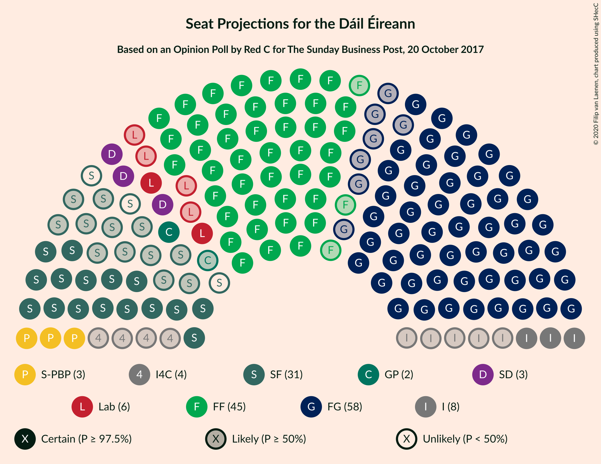
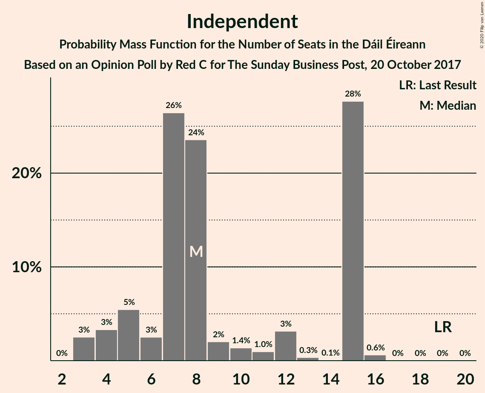
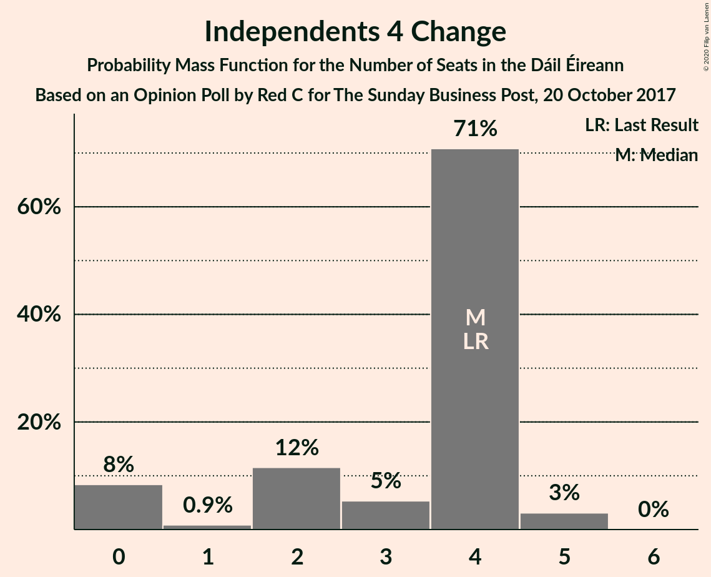
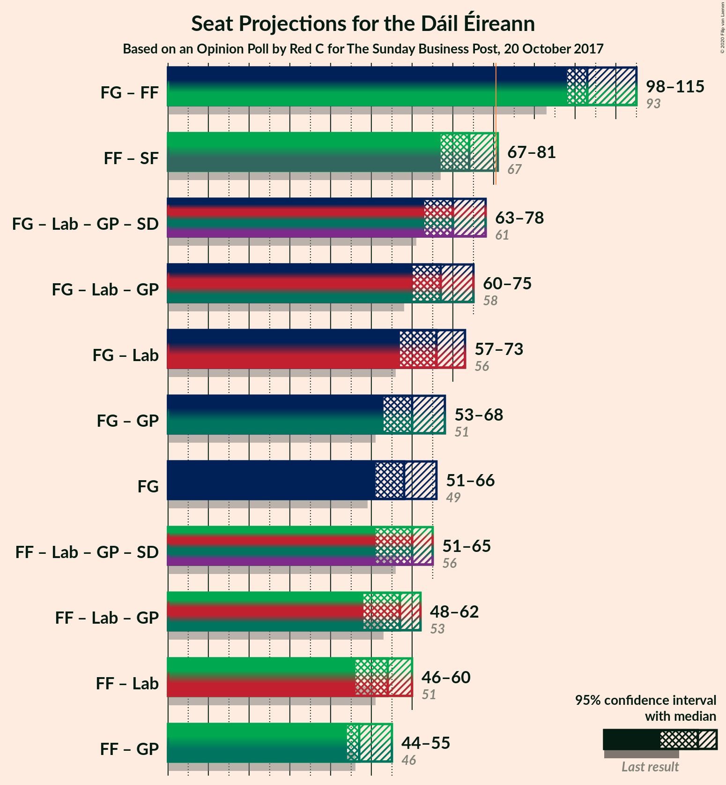
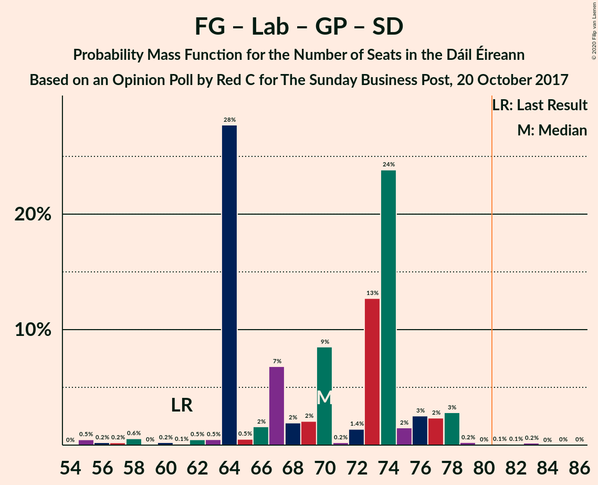
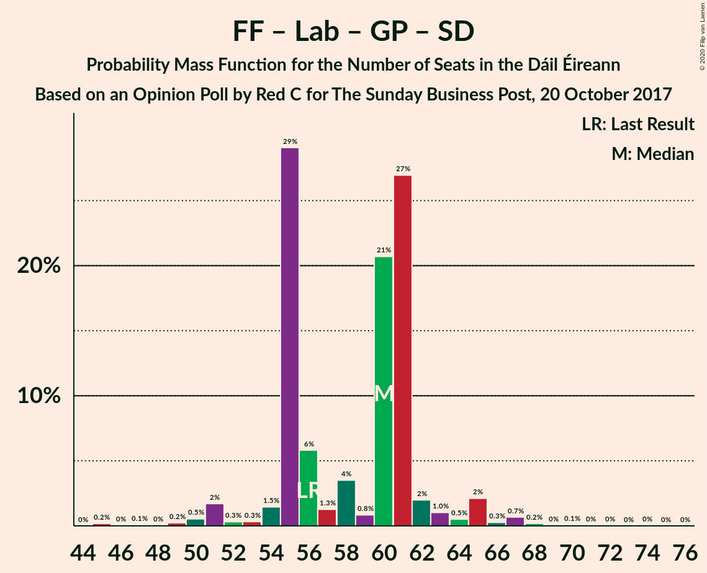
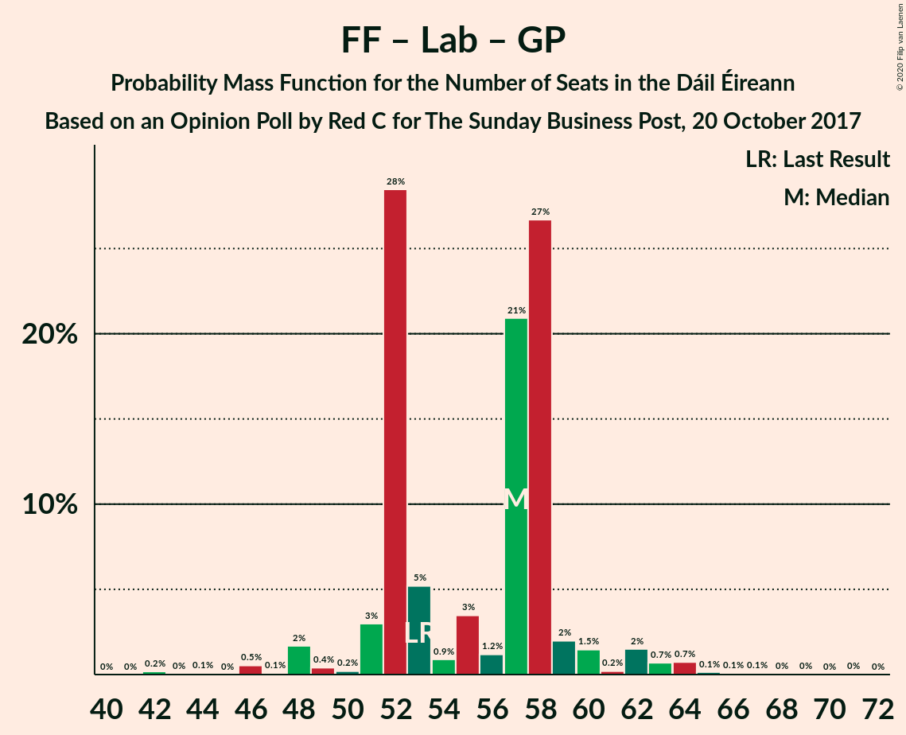

# Opinion Poll by Red C for The Sunday Business Post, 20 October 2017

<a href="#voting-intentions">Voting Intentions</a> | <a href="#seats">Seats</a> | <a href="#coalitions">Coalitions</a> | <a href="#technical-information">Technical Information</a>

## Voting Intentions

### Confidence Intervals

| Party | Last Result | Poll Result | 80% Confidence Interval | 90% Confidence Interval | 95% Confidence Interval | 99% Confidence Interval |
|:-----:|:-----------:|:-----------:|:-----------------------:|:-----------------------:|:-----------------------:|:-----------------------:|
| Fine Gael | 25.5% | 28.9% | 27.1–30.8% |26.6–31.3% |26.2–31.8% |25.3–32.7% |
| Fianna Fáil | 24.3% | 25.0% | 23.2–26.7% |22.7–27.2% |22.3–27.7% |21.5–28.6% |
| Sinn Féin | 13.8% | 14.0% | 12.6–15.4% |12.3–15.9% |11.9–16.2% |11.3–17.0% |
| Independent | 15.9% | 10.2% | 9.0–11.5% |8.7–11.9% |8.4–12.2% |7.9–12.8% |
| Labour Party | 6.6% | 6.0% | 5.1–7.1% |4.9–7.4% |4.7–7.6% |4.3–8.2% |
| Solidarity–People Before Profit | 3.9% | 4.0% | 3.3–4.9% |3.1–5.2% |2.9–5.4% |2.6–5.9% |
| Green Party/Comhaontas Glas | 2.7% | 4.0% | 3.3–4.9% |3.1–5.2% |2.9–5.4% |2.6–5.9% |
| Social Democrats | 3.0% | 2.0% | 1.5–2.7% |1.4–2.9% |1.3–3.1% |1.1–3.4% |
| Independents 4 Change | 1.5% | 1.3% | 0.9–1.9% |0.8–2.1% |0.8–2.2% |0.6–2.5% |
| Renua Ireland | 2.2% | 0.1% | 0.2–0.7% |0.1–0.8% |0.1–0.9% |0.1–1.1% |

*Note:* The poll result column reflects the actual value used in the calculations. Published results may vary slightly, and in addition be rounded to fewer digits.

## Seats

### Confidence Intervals

| Party | Last Result | Median | 80% Confidence Interval | 90% Confidence Interval | 95% Confidence Interval | 99% Confidence Interval |
|:-----:|:-----------:|:------:|:-----------------------:|:-----------------------:|:-----------------------:|:-----------------------:|
| <a href="#fine-gael">Fine Gael</a> | 49 | 58 | 54–63 |54–65 |51–66 |46–68 |
| <a href="#fianna-fáil">Fianna Fáil</a> | 44 | 45 | 45–49 |44–52 |42–53 |39–54 |
| <a href="#sinn-féin">Sinn Féin</a> | 23 | 28 | 24–31 |20–32 |16–33 |15–34 |
| <a href="#independent">Independent</a> | 19 | 8 | 5–15 |4–15 |3–15 |3–16 |
| <a href="#labour-party">Labour Party</a> | 7 | 6 | 5–11 |3–11 |2–11 |1–14 |
| <a href="#solidarity–people-before-profit">Solidarity–People Before Profit</a> | 6 | 3 | 3–6 |3–9 |3–9 |3–10 |
| <a href="#green-party/comhaontas-glas">Green Party/Comhaontas Glas</a> | 2 | 2 | 1–3 |1–3 |1–4 |1–5 |
| <a href="#social-democrats">Social Democrats</a> | 3 | 3 | 3 |3 |3–4 |1–4 |
| <a href="#independents-4-change">Independents 4 Change</a> | 4 | 4 | 2–4 |0–4 |0–5 |0–5 |
| <a href="#renua-ireland">Renua Ireland</a> | 0 | 0 | 0 |0 |0 |0 |

### Fine Gael

*For a full overview of the results for this party, see the [Fine Gael](party-finegael.html) page.*

| Number of Seats | Probability | Accumulated | Special Marks |
|:---------------:|:-----------:|:-----------:|:-------------:|
| 46 | 0.6% | 100% |  |
| 47 | 0.5% | 99.4% |  |
| 48 | 0.7% | 99.0% |  |
| 49 | 0.5% | 98% | Last Result |
| 50 | 0.1% | 98% |  |
| 51 | 0.4% | 98% |  |
| 52 | 0.4% | 97% |  |
| 53 | 0.5% | 97% |  |
| 54 | 34% | 96% |  |
| 55 | 3% | 63% |  |
| 56 | 0.4% | 59% |  |
| 57 | 0.2% | 59% |  |
| 58 | 24% | 59% | Median |
| 59 | 5% | 35% |  |
| 60 | 0.3% | 29% |  |
| 61 | 19% | 29% |  |
| 62 | 0.3% | 11% |  |
| 63 | 0.3% | 10% |  |
| 64 | 3% | 10% |  |
| 65 | 4% | 7% |  |
| 66 | 2% | 3% |  |
| 67 | 0.3% | 1.4% |  |
| 68 | 1.0% | 1.1% |  |
| 69 | 0.1% | 0.1% |  |
| 70 | 0% | 0% |  |

### Fianna Fáil

*For a full overview of the results for this party, see the [Fianna Fáil](party-fiannafáil.html) page.*

| Number of Seats | Probability | Accumulated | Special Marks |
|:---------------:|:-----------:|:-----------:|:-------------:|
| 37 | 0.1% | 100% |  |
| 38 | 0.3% | 99.9% |  |
| 39 | 0.5% | 99.6% |  |
| 40 | 0.2% | 99.1% |  |
| 41 | 0.3% | 99.0% |  |
| 42 | 1.4% | 98.7% |  |
| 43 | 2% | 97% |  |
| 44 | 2% | 96% | Last Result |
| 45 | 53% | 93% | Median |
| 46 | 2% | 41% |  |
| 47 | 15% | 39% |  |
| 48 | 13% | 23% |  |
| 49 | 2% | 11% |  |
| 50 | 3% | 9% |  |
| 51 | 0.5% | 6% |  |
| 52 | 2% | 5% |  |
| 53 | 1.4% | 3% |  |
| 54 | 1.2% | 1.5% |  |
| 55 | 0.2% | 0.3% |  |
| 56 | 0.1% | 0.1% |  |
| 57 | 0% | 0.1% |  |
| 58 | 0% | 0% |  |

### Sinn Féin

*For a full overview of the results for this party, see the [Sinn Féin](party-sinnféin.html) page.*

| Number of Seats | Probability | Accumulated | Special Marks |
|:---------------:|:-----------:|:-----------:|:-------------:|
| 15 | 1.1% | 100% |  |
| 16 | 2% | 98.9% |  |
| 17 | 0% | 97% |  |
| 18 | 0% | 97% |  |
| 19 | 0.1% | 97% |  |
| 20 | 5% | 97% |  |
| 21 | 0.3% | 92% |  |
| 22 | 0.1% | 92% |  |
| 23 | 2% | 92% | Last Result |
| 24 | 0.6% | 90% |  |
| 25 | 2% | 90% |  |
| 26 | 11% | 88% |  |
| 27 | 26% | 77% |  |
| 28 | 6% | 51% | Median |
| 29 | 29% | 45% |  |
| 30 | 0.9% | 16% |  |
| 31 | 7% | 15% |  |
| 32 | 4% | 8% |  |
| 33 | 3% | 3% |  |
| 34 | 0.6% | 0.6% |  |
| 35 | 0% | 0% |  |

### Independent

*For a full overview of the results for this party, see the [Independent](party-independent.html) page.*

| Number of Seats | Probability | Accumulated | Special Marks |
|:---------------:|:-----------:|:-----------:|:-------------:|
| 3 | 3% | 100% |  |
| 4 | 3% | 97% |  |
| 5 | 5% | 94% |  |
| 6 | 3% | 89% |  |
| 7 | 26% | 86% |  |
| 8 | 24% | 60% | Median |
| 9 | 2% | 36% |  |
| 10 | 1.4% | 34% |  |
| 11 | 1.0% | 33% |  |
| 12 | 3% | 32% |  |
| 13 | 0.3% | 29% |  |
| 14 | 0.1% | 28% |  |
| 15 | 28% | 28% |  |
| 16 | 0.6% | 0.6% |  |
| 17 | 0% | 0% |  |
| 18 | 0% | 0% |  |
| 19 | 0% | 0% | Last Result |

### Labour Party

*For a full overview of the results for this party, see the [Labour Party](party-labourparty.html) page.*

| Number of Seats | Probability | Accumulated | Special Marks |
|:---------------:|:-----------:|:-----------:|:-------------:|
| 0 | 0.1% | 100% |  |
| 1 | 1.3% | 99.9% |  |
| 2 | 3% | 98.7% |  |
| 3 | 2% | 95% |  |
| 4 | 2% | 93% |  |
| 5 | 34% | 91% |  |
| 6 | 14% | 57% | Median |
| 7 | 12% | 43% | Last Result |
| 8 | 3% | 32% |  |
| 9 | 2% | 29% |  |
| 10 | 0.8% | 27% |  |
| 11 | 25% | 26% |  |
| 12 | 0.1% | 1.1% |  |
| 13 | 0.2% | 1.0% |  |
| 14 | 0.5% | 0.8% |  |
| 15 | 0.2% | 0.3% |  |
| 16 | 0% | 0.1% |  |
| 17 | 0% | 0.1% |  |
| 18 | 0% | 0% |  |

### Solidarity–People Before Profit

*For a full overview of the results for this party, see the [Solidarity–People Before Profit](party-solidarity–peoplebeforeprofit.html) page.*

| Number of Seats | Probability | Accumulated | Special Marks |
|:---------------:|:-----------:|:-----------:|:-------------:|
| 3 | 78% | 100% | Median |
| 4 | 7% | 22% |  |
| 5 | 4% | 16% |  |
| 6 | 2% | 11% | Last Result |
| 7 | 2% | 10% |  |
| 8 | 2% | 8% |  |
| 9 | 5% | 6% |  |
| 10 | 0.8% | 0.8% |  |
| 11 | 0% | 0% |  |

### Green Party/Comhaontas Glas

*For a full overview of the results for this party, see the [Green Party/Comhaontas Glas](party-greenpartycomhaontasglas.html) page.*

| Number of Seats | Probability | Accumulated | Special Marks |
|:---------------:|:-----------:|:-----------:|:-------------:|
| 0 | 0.3% | 100% |  |
| 1 | 10% | 99.7% |  |
| 2 | 66% | 90% | Last Result, Median |
| 3 | 21% | 24% |  |
| 4 | 3% | 3% |  |
| 5 | 0.5% | 0.5% |  |
| 6 | 0% | 0% |  |

### Social Democrats

*For a full overview of the results for this party, see the [Social Democrats](party-socialdemocrats.html) page.*

| Number of Seats | Probability | Accumulated | Special Marks |
|:---------------:|:-----------:|:-----------:|:-------------:|
| 1 | 0.9% | 100% |  |
| 2 | 1.0% | 99.1% |  |
| 3 | 94% | 98% | Last Result, Median |
| 4 | 4% | 4% |  |
| 5 | 0% | 0% |  |

### Independents 4 Change

*For a full overview of the results for this party, see the [Independents 4 Change](party-independents4change.html) page.*

| Number of Seats | Probability | Accumulated | Special Marks |
|:---------------:|:-----------:|:-----------:|:-------------:|
| 0 | 8% | 100% |  |
| 1 | 0.9% | 92% |  |
| 2 | 12% | 91% |  |
| 3 | 5% | 79% |  |
| 4 | 71% | 74% | Last Result, Median |
| 5 | 3% | 3% |  |
| 6 | 0% | 0% |  |

### Renua Ireland

*For a full overview of the results for this party, see the [Renua Ireland](party-renuaireland.html) page.*

| Number of Seats | Probability | Accumulated | Special Marks |
|:---------------:|:-----------:|:-----------:|:-------------:|
| 0 | 100% | 100% | Last Result, Median |

## Coalitions

### Confidence Intervals

| Coalition | Last Result | Median | Majority? | 80% Confidence Interval | 90% Confidence Interval | 95% Confidence Interval | 99% Confidence Interval |
|:---------:|:-----------:|:------:|:---------:|:-----------------------:|:-----------------------:|:-----------------------:|:-----------------------:|
| Fine Gael – Fianna Fáil | 93 | 103 | 100% | 99–109 | 99–113 | 98–115 | 96–117 |
| Fianna Fáil – Sinn Féin | 67 | 74 | 3% | 71–78 | 68–79 | 67–81 | 64–86 |
| Fine Gael – Labour Party – Green Party/Comhaontas Glas – Social Democrats | 61 | 70 | 0.4% | 64–74 | 64–77 | 63–78 | 56–79 |
| Fine Gael – Labour Party – Green Party/Comhaontas Glas | 58 | 67 | 0.1% | 61–71 | 61–73 | 60–75 | 53–76 |
| Fine Gael – Labour Party | 56 | 66 | 0% | 59–69 | 59–72 | 57–73 | 51–74 |
| Fine Gael – Green Party/Comhaontas Glas | 51 | 60 | 0% | 56–65 | 56–67 | 53–68 | 48–70 |
| Fine Gael | 49 | 58 | 0% | 54–63 | 54–65 | 51–66 | 46–68 |
| Fianna Fáil – Labour Party – Green Party/Comhaontas Glas – Social Democrats | 56 | 60 | 0% | 55–61 | 55–62 | 51–65 | 49–67 |
| Fianna Fáil – Labour Party – Green Party/Comhaontas Glas | 53 | 57 | 0% | 52–58 | 51–59 | 48–62 | 46–64 |
| Fianna Fáil – Labour Party | 51 | 54 | 0% | 50–56 | 49–58 | 46–60 | 45–61 |
| Fianna Fáil – Green Party/Comhaontas Glas | 46 | 47 | 0% | 47–51 | 45–54 | 44–55 | 41–57 |

### Fine Gael – Fianna Fáil

| Number of Seats | Probability | Accumulated | Special Marks |
|:---------------:|:-----------:|:-----------:|:-------------:|
| 93 | 0% | 100% | Last Result |
| 94 | 0.3% | 99.9% |  |
| 95 | 0% | 99.7% |  |
| 96 | 0.8% | 99.7% |  |
| 97 | 0.5% | 98.9% |  |
| 98 | 1.3% | 98% |  |
| 99 | 28% | 97% |  |
| 100 | 0.1% | 69% |  |
| 101 | 8% | 68% |  |
| 102 | 0.1% | 61% |  |
| 103 | 25% | 60% | Median |
| 104 | 1.3% | 36% |  |
| 105 | 0.4% | 35% |  |
| 106 | 4% | 34% |  |
| 107 | 0.8% | 30% |  |
| 108 | 7% | 29% |  |
| 109 | 13% | 23% |  |
| 110 | 1.4% | 10% |  |
| 111 | 1.4% | 8% |  |
| 112 | 0.4% | 7% |  |
| 113 | 2% | 6% |  |
| 114 | 1.0% | 4% |  |
| 115 | 1.4% | 3% |  |
| 116 | 0% | 2% |  |
| 117 | 2% | 2% |  |
| 118 | 0% | 0% |  |

### Fianna Fáil – Sinn Féin

| Number of Seats | Probability | Accumulated | Special Marks |
|:---------------:|:-----------:|:-----------:|:-------------:|
| 60 | 0% | 100% |  |
| 61 | 0% | 99.9% |  |
| 62 | 0.2% | 99.9% |  |
| 63 | 0% | 99.7% |  |
| 64 | 0.3% | 99.7% |  |
| 65 | 0.9% | 99.4% |  |
| 66 | 0.3% | 98.5% |  |
| 67 | 2% | 98% | Last Result |
| 68 | 3% | 96% |  |
| 69 | 0.5% | 93% |  |
| 70 | 2% | 93% |  |
| 71 | 0.9% | 90% |  |
| 72 | 26% | 90% |  |
| 73 | 2% | 64% | Median |
| 74 | 38% | 61% |  |
| 75 | 8% | 23% |  |
| 76 | 0.4% | 16% |  |
| 77 | 3% | 15% |  |
| 78 | 7% | 12% |  |
| 79 | 2% | 5% |  |
| 80 | 0.1% | 3% |  |
| 81 | 0.9% | 3% | Majority |
| 82 | 0.3% | 2% |  |
| 83 | 0.9% | 2% |  |
| 84 | 0% | 0.9% |  |
| 85 | 0.1% | 0.9% |  |
| 86 | 0.7% | 0.8% |  |
| 87 | 0% | 0% |  |

### Fine Gael – Labour Party – Green Party/Comhaontas Glas – Social Democrats

| Number of Seats | Probability | Accumulated | Special Marks |
|:---------------:|:-----------:|:-----------:|:-------------:|
| 55 | 0.5% | 100% |  |
| 56 | 0.2% | 99.5% |  |
| 57 | 0.2% | 99.3% |  |
| 58 | 0.6% | 99.1% |  |
| 59 | 0% | 98.5% |  |
| 60 | 0.2% | 98% |  |
| 61 | 0.1% | 98% | Last Result |
| 62 | 0.5% | 98% |  |
| 63 | 0.5% | 98% |  |
| 64 | 28% | 97% |  |
| 65 | 0.5% | 69% |  |
| 66 | 2% | 69% |  |
| 67 | 7% | 67% |  |
| 68 | 2% | 61% |  |
| 69 | 2% | 59% | Median |
| 70 | 9% | 57% |  |
| 71 | 0.2% | 48% |  |
| 72 | 1.4% | 48% |  |
| 73 | 13% | 46% |  |
| 74 | 24% | 34% |  |
| 75 | 2% | 10% |  |
| 76 | 3% | 8% |  |
| 77 | 2% | 6% |  |
| 78 | 3% | 4% |  |
| 79 | 0.2% | 0.7% |  |
| 80 | 0% | 0.5% |  |
| 81 | 0.1% | 0.4% | Majority |
| 82 | 0.1% | 0.3% |  |
| 83 | 0.2% | 0.2% |  |
| 84 | 0% | 0.1% |  |
| 85 | 0% | 0% |  |

### Fine Gael – Labour Party – Green Party/Comhaontas Glas

| Number of Seats | Probability | Accumulated | Special Marks |
|:---------------:|:-----------:|:-----------:|:-------------:|
| 52 | 0.5% | 100% |  |
| 53 | 0.2% | 99.5% |  |
| 54 | 0.2% | 99.3% |  |
| 55 | 0.6% | 99.1% |  |
| 56 | 0% | 98.5% |  |
| 57 | 0.3% | 98% |  |
| 58 | 0% | 98% | Last Result |
| 59 | 0.5% | 98% |  |
| 60 | 0.6% | 98% |  |
| 61 | 28% | 97% |  |
| 62 | 0.4% | 69% |  |
| 63 | 0.8% | 69% |  |
| 64 | 8% | 68% |  |
| 65 | 2% | 61% |  |
| 66 | 2% | 58% | Median |
| 67 | 8% | 57% |  |
| 68 | 0.7% | 48% |  |
| 69 | 1.4% | 48% |  |
| 70 | 13% | 46% |  |
| 71 | 24% | 34% |  |
| 72 | 1.1% | 9% |  |
| 73 | 4% | 8% |  |
| 74 | 1.1% | 5% |  |
| 75 | 3% | 3% |  |
| 76 | 0.2% | 0.7% |  |
| 77 | 0.1% | 0.5% |  |
| 78 | 0.1% | 0.4% |  |
| 79 | 0% | 0.3% |  |
| 80 | 0.2% | 0.2% |  |
| 81 | 0% | 0.1% | Majority |
| 82 | 0% | 0% |  |

### Fine Gael – Labour Party

| Number of Seats | Probability | Accumulated | Special Marks |
|:---------------:|:-----------:|:-----------:|:-------------:|
| 49 | 0.5% | 100% |  |
| 50 | 0% | 99.5% |  |
| 51 | 0.2% | 99.5% |  |
| 52 | 0.3% | 99.3% |  |
| 53 | 0.6% | 99.1% |  |
| 54 | 0.2% | 98% |  |
| 55 | 0.5% | 98% |  |
| 56 | 0.1% | 98% | Last Result |
| 57 | 0.3% | 98% |  |
| 58 | 0.5% | 97% |  |
| 59 | 28% | 97% |  |
| 60 | 0.8% | 69% |  |
| 61 | 8% | 68% |  |
| 62 | 1.3% | 61% |  |
| 63 | 1.1% | 59% |  |
| 64 | 3% | 58% | Median |
| 65 | 1.0% | 55% |  |
| 66 | 7% | 54% |  |
| 67 | 12% | 47% |  |
| 68 | 2% | 36% |  |
| 69 | 24% | 33% |  |
| 70 | 0.9% | 9% |  |
| 71 | 1.0% | 8% |  |
| 72 | 4% | 7% |  |
| 73 | 3% | 3% |  |
| 74 | 0.2% | 0.7% |  |
| 75 | 0% | 0.4% |  |
| 76 | 0.1% | 0.4% |  |
| 77 | 0% | 0.3% |  |
| 78 | 0.2% | 0.2% |  |
| 79 | 0% | 0% |  |

### Fine Gael – Green Party/Comhaontas Glas

| Number of Seats | Probability | Accumulated | Special Marks |
|:---------------:|:-----------:|:-----------:|:-------------:|
| 48 | 0.6% | 100% |  |
| 49 | 0% | 99.4% |  |
| 50 | 0.7% | 99.4% |  |
| 51 | 0.3% | 98.7% | Last Result |
| 52 | 0.8% | 98% |  |
| 53 | 0.2% | 98% |  |
| 54 | 0.5% | 97% |  |
| 55 | 0.2% | 97% |  |
| 56 | 28% | 97% |  |
| 57 | 8% | 69% |  |
| 58 | 2% | 61% |  |
| 59 | 0.3% | 59% |  |
| 60 | 26% | 59% | Median |
| 61 | 2% | 33% |  |
| 62 | 6% | 31% |  |
| 63 | 3% | 25% |  |
| 64 | 11% | 22% |  |
| 65 | 0.9% | 11% |  |
| 66 | 3% | 10% |  |
| 67 | 5% | 7% |  |
| 68 | 1.1% | 3% |  |
| 69 | 0.4% | 1.5% |  |
| 70 | 1.0% | 1.1% |  |
| 71 | 0.1% | 0.1% |  |
| 72 | 0% | 0% |  |

### Fine Gael

| Number of Seats | Probability | Accumulated | Special Marks |
|:---------------:|:-----------:|:-----------:|:-------------:|
| 46 | 0.6% | 100% |  |
| 47 | 0.5% | 99.4% |  |
| 48 | 0.7% | 99.0% |  |
| 49 | 0.5% | 98% | Last Result |
| 50 | 0.1% | 98% |  |
| 51 | 0.4% | 98% |  |
| 52 | 0.4% | 97% |  |
| 53 | 0.5% | 97% |  |
| 54 | 34% | 96% |  |
| 55 | 3% | 63% |  |
| 56 | 0.4% | 59% |  |
| 57 | 0.2% | 59% |  |
| 58 | 24% | 59% | Median |
| 59 | 5% | 35% |  |
| 60 | 0.3% | 29% |  |
| 61 | 19% | 29% |  |
| 62 | 0.3% | 11% |  |
| 63 | 0.3% | 10% |  |
| 64 | 3% | 10% |  |
| 65 | 4% | 7% |  |
| 66 | 2% | 3% |  |
| 67 | 0.3% | 1.4% |  |
| 68 | 1.0% | 1.1% |  |
| 69 | 0.1% | 0.1% |  |
| 70 | 0% | 0% |  |

### Fianna Fáil – Labour Party – Green Party/Comhaontas Glas – Social Democrats

| Number of Seats | Probability | Accumulated | Special Marks |
|:---------------:|:-----------:|:-----------:|:-------------:|
| 45 | 0.2% | 100% |  |
| 46 | 0% | 99.8% |  |
| 47 | 0.1% | 99.8% |  |
| 48 | 0% | 99.7% |  |
| 49 | 0.2% | 99.7% |  |
| 50 | 0.5% | 99.5% |  |
| 51 | 2% | 98.9% |  |
| 52 | 0.3% | 97% |  |
| 53 | 0.3% | 97% |  |
| 54 | 1.5% | 97% |  |
| 55 | 29% | 95% |  |
| 56 | 6% | 66% | Last Result, Median |
| 57 | 1.3% | 60% |  |
| 58 | 4% | 59% |  |
| 59 | 0.8% | 55% |  |
| 60 | 21% | 55% |  |
| 61 | 27% | 34% |  |
| 62 | 2% | 7% |  |
| 63 | 1.0% | 5% |  |
| 64 | 0.5% | 4% |  |
| 65 | 2% | 3% |  |
| 66 | 0.3% | 1.3% |  |
| 67 | 0.7% | 1.0% |  |
| 68 | 0.2% | 0.4% |  |
| 69 | 0% | 0.2% |  |
| 70 | 0.1% | 0.2% |  |
| 71 | 0% | 0.1% |  |
| 72 | 0% | 0.1% |  |
| 73 | 0% | 0.1% |  |
| 74 | 0% | 0.1% |  |
| 75 | 0% | 0% |  |

### Fianna Fáil – Labour Party – Green Party/Comhaontas Glas

| Number of Seats | Probability | Accumulated | Special Marks |
|:---------------:|:-----------:|:-----------:|:-------------:|
| 42 | 0.2% | 100% |  |
| 43 | 0% | 99.8% |  |
| 44 | 0.1% | 99.8% |  |
| 45 | 0% | 99.7% |  |
| 46 | 0.5% | 99.7% |  |
| 47 | 0.1% | 99.2% |  |
| 48 | 2% | 99.1% |  |
| 49 | 0.4% | 97% |  |
| 50 | 0.2% | 97% |  |
| 51 | 3% | 97% |  |
| 52 | 28% | 94% |  |
| 53 | 5% | 65% | Last Result, Median |
| 54 | 0.9% | 60% |  |
| 55 | 3% | 59% |  |
| 56 | 1.2% | 56% |  |
| 57 | 21% | 55% |  |
| 58 | 27% | 34% |  |
| 59 | 2% | 7% |  |
| 60 | 1.5% | 5% |  |
| 61 | 0.2% | 4% |  |
| 62 | 2% | 3% |  |
| 63 | 0.7% | 2% |  |
| 64 | 0.7% | 1.1% |  |
| 65 | 0.1% | 0.4% |  |
| 66 | 0.1% | 0.2% |  |
| 67 | 0.1% | 0.2% |  |
| 68 | 0% | 0.1% |  |
| 69 | 0% | 0.1% |  |
| 70 | 0% | 0.1% |  |
| 71 | 0% | 0.1% |  |
| 72 | 0% | 0% |  |

### Fianna Fáil – Labour Party

| Number of Seats | Probability | Accumulated | Special Marks |
|:---------------:|:-----------:|:-----------:|:-------------:|
| 41 | 0.3% | 100% |  |
| 42 | 0% | 99.7% |  |
| 43 | 0.1% | 99.7% |  |
| 44 | 0.1% | 99.6% |  |
| 45 | 0.5% | 99.5% |  |
| 46 | 2% | 99.1% |  |
| 47 | 1.3% | 97% |  |
| 48 | 0.7% | 96% |  |
| 49 | 0.7% | 95% |  |
| 50 | 30% | 94% |  |
| 51 | 0.3% | 65% | Last Result, Median |
| 52 | 6% | 65% |  |
| 53 | 2% | 59% |  |
| 54 | 20% | 57% |  |
| 55 | 4% | 37% |  |
| 56 | 26% | 33% |  |
| 57 | 1.2% | 7% |  |
| 58 | 1.3% | 5% |  |
| 59 | 1.1% | 4% |  |
| 60 | 2% | 3% |  |
| 61 | 0.9% | 1.4% |  |
| 62 | 0.1% | 0.5% |  |
| 63 | 0.2% | 0.4% |  |
| 64 | 0% | 0.2% |  |
| 65 | 0% | 0.1% |  |
| 66 | 0% | 0.1% |  |
| 67 | 0.1% | 0.1% |  |
| 68 | 0% | 0% |  |

### Fianna Fáil – Green Party/Comhaontas Glas

| Number of Seats | Probability | Accumulated | Special Marks |
|:---------------:|:-----------:|:-----------:|:-------------:|
| 38 | 0.1% | 100% |  |
| 39 | 0.2% | 99.9% |  |
| 40 | 0.1% | 99.7% |  |
| 41 | 0.3% | 99.7% |  |
| 42 | 0.2% | 99.4% |  |
| 43 | 0.4% | 99.3% |  |
| 44 | 2% | 98.9% |  |
| 45 | 2% | 97% |  |
| 46 | 1.1% | 95% | Last Result |
| 47 | 52% | 94% | Median |
| 48 | 8% | 42% |  |
| 49 | 4% | 34% |  |
| 50 | 9% | 30% |  |
| 51 | 11% | 21% |  |
| 52 | 3% | 10% |  |
| 53 | 1.5% | 7% |  |
| 54 | 2% | 5% |  |
| 55 | 2% | 4% |  |
| 56 | 1.0% | 2% |  |
| 57 | 0.8% | 1.0% |  |
| 58 | 0% | 0.1% |  |
| 59 | 0.1% | 0.1% |  |
| 60 | 0% | 0% |  |

## Technical Information

### Opinion Poll

+ **Polling firm:** Red C
+ **Commissioner(s):** The Sunday Business Post
+ **Fieldwork period:** 20 October 2017

### Calculations

+ **Sample size:** 1002
+ **Simulations done:** 131,072
+ **Error estimate:** 1.60%

