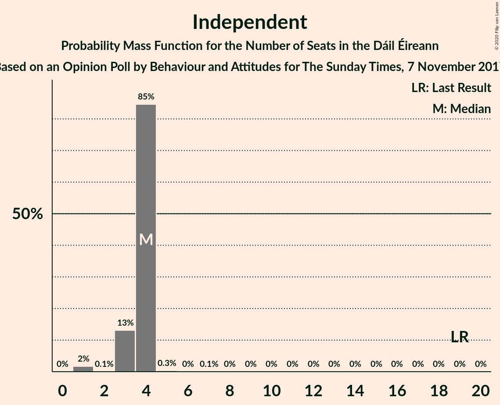
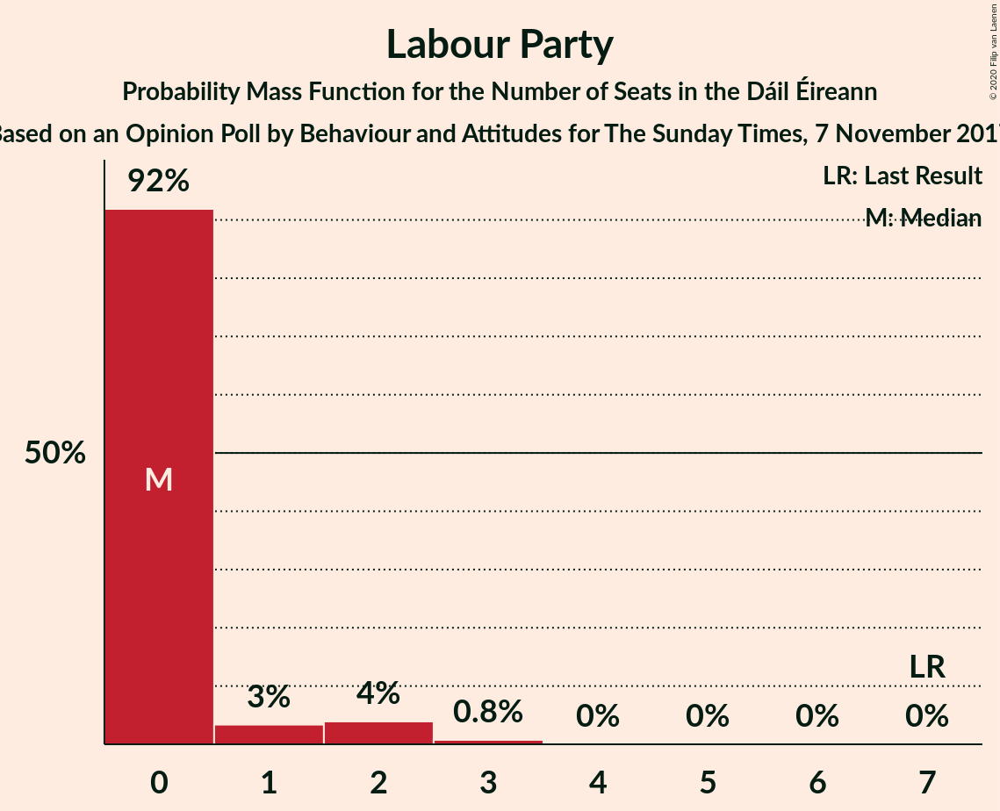
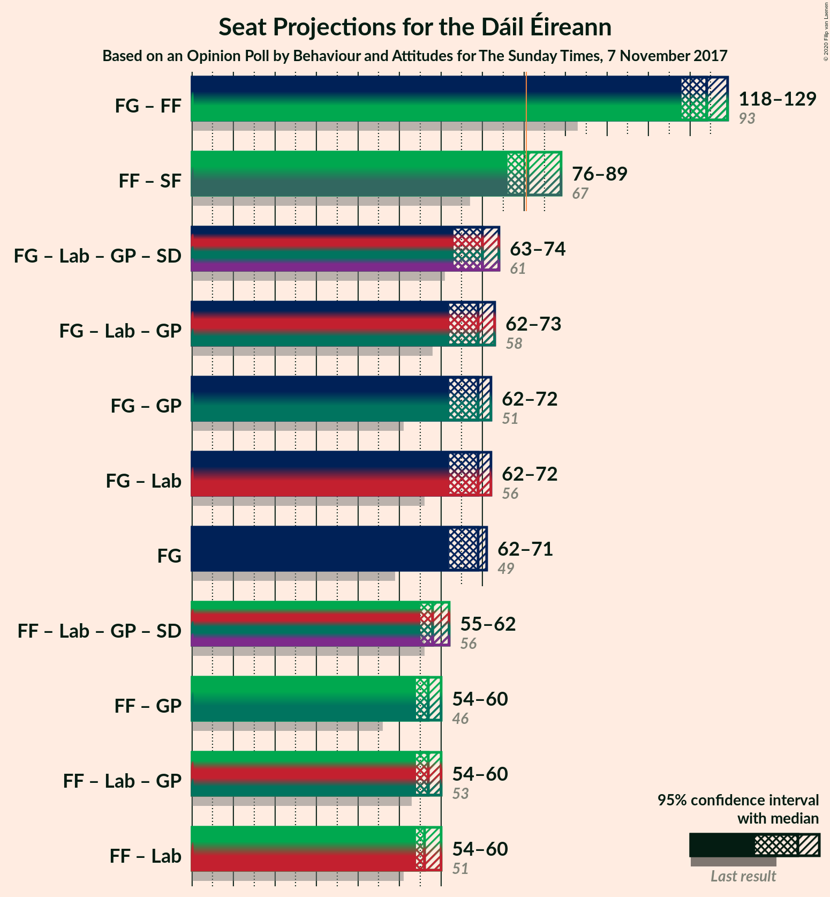

# Opinion Poll by Behaviour and Attitudes for The Sunday Times, 7 November 2017

<a href="#voting-intentions">Voting Intentions</a> | <a href="#seats">Seats</a> | <a href="#coalitions">Coalitions</a> | <a href="#technical-information">Technical Information</a>

## Voting Intentions

### Confidence Intervals

| Party | Last Result | Poll Result | 80% Confidence Interval | 90% Confidence Interval | 95% Confidence Interval | 99% Confidence Interval |
|:-----:|:-----------:|:-----------:|:-----------------------:|:-----------------------:|:-----------------------:|:-----------------------:|
| Fine Gael | 25.5% | 34.3% | 32.3–36.3% |31.7–36.9% |31.3–37.4% |30.3–38.4% |
| Fianna Fáil | 24.3% | 31.2% | 29.3–33.2% |28.8–33.8% |28.3–34.3% |27.4–35.3% |
| Sinn Féin | 13.8% | 14.1% | 12.8–15.7% |12.4–16.2% |12.0–16.6% |11.4–17.3% |
| Independent | 15.9% | 6.9% | 5.9–8.0% |5.6–8.4% |5.4–8.7% |5.0–9.3% |
| Labour Party | 6.6% | 3.0% | 2.4–3.9% |2.3–4.2% |2.1–4.4% |1.9–4.8% |
| Solidarity–People Before Profit | 3.9% | 3.0% | 2.4–3.9% |2.3–4.2% |2.1–4.4% |1.9–4.8% |
| Green Party/Comhaontas Glas | 2.7% | 2.1% | 1.6–2.8% |1.4–3.0% |1.3–3.2% |1.1–3.6% |
| Social Democrats | 3.0% | 1.0% | 0.7–1.6% |0.6–1.7% |0.5–1.9% |0.4–2.2% |
| Independents 4 Change | 1.5% | 0.9% | 0.6–1.4% |0.5–1.6% |0.4–1.7% |0.3–2.0% |
| Renua Ireland | 2.2% | 0.2% | 0.1–0.6% |0.1–0.7% |0.1–0.8% |0.0–1.0% |

*Note:* The poll result column reflects the actual value used in the calculations. Published results may vary slightly, and in addition be rounded to fewer digits.

## Seats

### Confidence Intervals

| Party | Last Result | Median | 80% Confidence Interval | 90% Confidence Interval | 95% Confidence Interval | 99% Confidence Interval |
|:-----:|:-----------:|:------:|:-----------------------:|:-----------------------:|:-----------------------:|:-----------------------:|
| <a href="#fine-gael">Fine Gael</a> | 49 | 69 | 63–70 |63–71 |62–71 |59–73 |
| <a href="#fianna-fáil">Fianna Fáil</a> | 44 | 56 | 55–57 |54–59 |54–59 |53–60 |
| <a href="#sinn-féin">Sinn Féin</a> | 23 | 24 | 21–29 |20–30 |19–31 |19–32 |
| <a href="#independent">Independent</a> | 19 | 4 | 3–4 |3–4 |3–4 |1–4 |
| <a href="#labour-party">Labour Party</a> | 7 | 0 | 0 |0–1 |0–2 |0–3 |
| <a href="#solidarity–people-before-profit">Solidarity–People Before Profit</a> | 6 | 4 | 3–5 |3–5 |2–5 |1–6 |
| <a href="#green-party/comhaontas-glas">Green Party/Comhaontas Glas</a> | 2 | 1 | 0–1 |0–1 |0–1 |0–1 |
| <a href="#social-democrats">Social Democrats</a> | 3 | 1 | 0–2 |0–4 |0–4 |0–4 |
| <a href="#independents-4-change">Independents 4 Change</a> | 4 | 2 | 0–4 |0–4 |0–4 |0–4 |
| <a href="#renua-ireland">Renua Ireland</a> | 0 | 0 | 0 |0 |0 |0 |

### Fine Gael

*For a full overview of the results for this party, see the [Fine Gael](party-finegael.html) page.*

| Number of Seats | Probability | Accumulated | Special Marks |
|:---------------:|:-----------:|:-----------:|:-------------:|
| 49 | 0% | 100% | Last Result |
| 50 | 0% | 100% |  |
| 51 | 0% | 100% |  |
| 52 | 0% | 100% |  |
| 53 | 0% | 100% |  |
| 54 | 0% | 100% |  |
| 55 | 0% | 100% |  |
| 56 | 0% | 100% |  |
| 57 | 0.1% | 100% |  |
| 58 | 0.1% | 99.8% |  |
| 59 | 0.5% | 99.8% |  |
| 60 | 0.8% | 99.2% |  |
| 61 | 0.9% | 98% |  |
| 62 | 2% | 98% |  |
| 63 | 6% | 95% |  |
| 64 | 7% | 89% |  |
| 65 | 5% | 82% |  |
| 66 | 4% | 76% |  |
| 67 | 12% | 72% |  |
| 68 | 8% | 60% |  |
| 69 | 20% | 52% | Median |
| 70 | 25% | 32% |  |
| 71 | 6% | 7% |  |
| 72 | 0.8% | 2% |  |
| 73 | 0.5% | 0.8% |  |
| 74 | 0.3% | 0.3% |  |
| 75 | 0% | 0% |  |

### Fianna Fáil

*For a full overview of the results for this party, see the [Fianna Fáil](party-fiannafáil.html) page.*

| Number of Seats | Probability | Accumulated | Special Marks |
|:---------------:|:-----------:|:-----------:|:-------------:|
| 44 | 0% | 100% | Last Result |
| 45 | 0% | 100% |  |
| 46 | 0% | 100% |  |
| 47 | 0% | 100% |  |
| 48 | 0% | 100% |  |
| 49 | 0.1% | 100% |  |
| 50 | 0% | 99.8% |  |
| 51 | 0% | 99.8% |  |
| 52 | 0% | 99.8% |  |
| 53 | 0.3% | 99.7% |  |
| 54 | 6% | 99.4% |  |
| 55 | 17% | 94% |  |
| 56 | 40% | 76% | Median |
| 57 | 28% | 37% |  |
| 58 | 2% | 8% |  |
| 59 | 5% | 6% |  |
| 60 | 0.9% | 1.0% |  |
| 61 | 0.1% | 0.1% |  |
| 62 | 0% | 0% |  |

### Sinn Féin

*For a full overview of the results for this party, see the [Sinn Féin](party-sinnféin.html) page.*

| Number of Seats | Probability | Accumulated | Special Marks |
|:---------------:|:-----------:|:-----------:|:-------------:|
| 18 | 0% | 100% |  |
| 19 | 3% | 99.9% |  |
| 20 | 7% | 97% |  |
| 21 | 5% | 91% |  |
| 22 | 5% | 86% |  |
| 23 | 21% | 81% | Last Result |
| 24 | 14% | 60% | Median |
| 25 | 4% | 45% |  |
| 26 | 8% | 41% |  |
| 27 | 18% | 34% |  |
| 28 | 1.0% | 16% |  |
| 29 | 6% | 15% |  |
| 30 | 6% | 9% |  |
| 31 | 2% | 4% |  |
| 32 | 0.8% | 1.2% |  |
| 33 | 0.2% | 0.4% |  |
| 34 | 0.2% | 0.2% |  |
| 35 | 0% | 0% |  |

### Independent

*For a full overview of the results for this party, see the [Independent](party-independent.html) page.*

| Number of Seats | Probability | Accumulated | Special Marks |
|:---------------:|:-----------:|:-----------:|:-------------:|
| 1 | 2% | 100% |  |
| 2 | 0.1% | 98% |  |
| 3 | 13% | 98% |  |
| 4 | 85% | 85% | Median |
| 5 | 0.3% | 0.5% |  |
| 6 | 0% | 0.1% |  |
| 7 | 0.1% | 0.1% |  |
| 8 | 0% | 0% |  |
| 9 | 0% | 0% |  |
| 10 | 0% | 0% |  |
| 11 | 0% | 0% |  |
| 12 | 0% | 0% |  |
| 13 | 0% | 0% |  |
| 14 | 0% | 0% |  |
| 15 | 0% | 0% |  |
| 16 | 0% | 0% |  |
| 17 | 0% | 0% |  |
| 18 | 0% | 0% |  |
| 19 | 0% | 0% | Last Result |

### Labour Party

*For a full overview of the results for this party, see the [Labour Party](party-labourparty.html) page.*

| Number of Seats | Probability | Accumulated | Special Marks |
|:---------------:|:-----------:|:-----------:|:-------------:|
| 0 | 92% | 100% | Median |
| 1 | 3% | 8% |  |
| 2 | 4% | 5% |  |
| 3 | 0.8% | 0.8% |  |
| 4 | 0% | 0% |  |
| 5 | 0% | 0% |  |
| 6 | 0% | 0% |  |
| 7 | 0% | 0% | Last Result |

### Solidarity–People Before Profit

*For a full overview of the results for this party, see the [Solidarity–People Before Profit](party-solidarity–peoplebeforeprofit.html) page.*

| Number of Seats | Probability | Accumulated | Special Marks |
|:---------------:|:-----------:|:-----------:|:-------------:|
| 0 | 0.3% | 100% |  |
| 1 | 2% | 99.7% |  |
| 2 | 0.9% | 98% |  |
| 3 | 22% | 97% |  |
| 4 | 62% | 74% | Median |
| 5 | 11% | 12% |  |
| 6 | 0.9% | 1.1% | Last Result |
| 7 | 0.3% | 0.3% |  |
| 8 | 0% | 0% |  |

### Green Party/Comhaontas Glas

*For a full overview of the results for this party, see the [Green Party/Comhaontas Glas](party-greenpartycomhaontasglas.html) page.*

| Number of Seats | Probability | Accumulated | Special Marks |
|:---------------:|:-----------:|:-----------:|:-------------:|
| 0 | 44% | 100% |  |
| 1 | 56% | 56% | Median |
| 2 | 0.2% | 0.2% | Last Result |
| 3 | 0% | 0% |  |

### Social Democrats

*For a full overview of the results for this party, see the [Social Democrats](party-socialdemocrats.html) page.*

| Number of Seats | Probability | Accumulated | Special Marks |
|:---------------:|:-----------:|:-----------:|:-------------:|
| 0 | 29% | 100% |  |
| 1 | 44% | 71% | Median |
| 2 | 20% | 27% |  |
| 3 | 1.3% | 7% | Last Result |
| 4 | 6% | 6% |  |
| 5 | 0% | 0% |  |

### Independents 4 Change

*For a full overview of the results for this party, see the [Independents 4 Change](party-independents4change.html) page.*

| Number of Seats | Probability | Accumulated | Special Marks |
|:---------------:|:-----------:|:-----------:|:-------------:|
| 0 | 15% | 100% |  |
| 1 | 30% | 85% |  |
| 2 | 28% | 55% | Median |
| 3 | 7% | 28% |  |
| 4 | 21% | 21% | Last Result |
| 5 | 0.2% | 0.2% |  |
| 6 | 0% | 0% |  |

### Renua Ireland

*For a full overview of the results for this party, see the [Renua Ireland](party-renuaireland.html) page.*

| Number of Seats | Probability | Accumulated | Special Marks |
|:---------------:|:-----------:|:-----------:|:-------------:|
| 0 | 100% | 100% | Last Result, Median |

## Coalitions

### Confidence Intervals

| Coalition | Last Result | Median | Majority? | 80% Confidence Interval | 90% Confidence Interval | 95% Confidence Interval | 99% Confidence Interval |
|:---------:|:-----------:|:------:|:---------:|:-----------------------:|:-----------------------:|:-----------------------:|:-----------------------:|
| Fine Gael – Fianna Fáil | 93 | 124 | 100% | 120–126 | 118–127 | 118–129 | 117–129 |
| Fianna Fáil – Sinn Féin | 67 | 81 | 59% | 77–85 | 76–87 | 76–89 | 75–91 |
| Fine Gael – Labour Party – Green Party/Comhaontas Glas – Social Democrats | 61 | 70 | 0% | 65–72 | 63–73 | 63–74 | 61–75 |
| Fine Gael – Labour Party – Green Party/Comhaontas Glas | 58 | 69 | 0% | 64–71 | 63–72 | 62–73 | 60–74 |
| Fine Gael – Green Party/Comhaontas Glas | 51 | 69 | 0% | 64–71 | 63–71 | 62–72 | 60–73 |
| Fine Gael – Labour Party | 56 | 69 | 0% | 63–71 | 63–71 | 62–72 | 59–74 |
| Fine Gael | 49 | 69 | 0% | 63–70 | 63–71 | 62–71 | 59–73 |
| Fianna Fáil – Labour Party – Green Party/Comhaontas Glas – Social Democrats | 56 | 58 | 0% | 55–60 | 55–61 | 55–62 | 54–63 |
| Fianna Fáil – Green Party/Comhaontas Glas | 46 | 57 | 0% | 55–58 | 54–59 | 54–60 | 53–61 |
| Fianna Fáil – Labour Party – Green Party/Comhaontas Glas | 53 | 57 | 0% | 55–59 | 54–60 | 54–60 | 53–61 |
| Fianna Fáil – Labour Party | 51 | 56 | 0% | 55–58 | 54–59 | 54–60 | 53–60 |

### Fine Gael – Fianna Fáil

| Number of Seats | Probability | Accumulated | Special Marks |
|:---------------:|:-----------:|:-----------:|:-------------:|
| 93 | 0% | 100% | Last Result |
| 94 | 0% | 100% |  |
| 95 | 0% | 100% |  |
| 96 | 0% | 100% |  |
| 97 | 0% | 100% |  |
| 98 | 0% | 100% |  |
| 99 | 0% | 100% |  |
| 100 | 0% | 100% |  |
| 101 | 0% | 100% |  |
| 102 | 0% | 100% |  |
| 103 | 0% | 100% |  |
| 104 | 0% | 100% |  |
| 105 | 0% | 100% |  |
| 106 | 0% | 100% |  |
| 107 | 0% | 100% |  |
| 108 | 0% | 100% |  |
| 109 | 0% | 100% |  |
| 110 | 0% | 100% |  |
| 111 | 0% | 100% |  |
| 112 | 0% | 100% |  |
| 113 | 0% | 100% |  |
| 114 | 0.1% | 100% |  |
| 115 | 0.1% | 99.9% |  |
| 116 | 0.3% | 99.8% |  |
| 117 | 0.9% | 99.5% |  |
| 118 | 5% | 98.6% |  |
| 119 | 3% | 93% |  |
| 120 | 5% | 91% |  |
| 121 | 5% | 86% |  |
| 122 | 5% | 81% |  |
| 123 | 3% | 76% |  |
| 124 | 29% | 72% |  |
| 125 | 14% | 43% | Median |
| 126 | 21% | 30% |  |
| 127 | 5% | 9% |  |
| 128 | 0.9% | 4% |  |
| 129 | 3% | 3% |  |
| 130 | 0.1% | 0.1% |  |
| 131 | 0% | 0% |  |

### Fianna Fáil – Sinn Féin

| Number of Seats | Probability | Accumulated | Special Marks |
|:---------------:|:-----------:|:-----------:|:-------------:|
| 67 | 0% | 100% | Last Result |
| 68 | 0% | 100% |  |
| 69 | 0% | 100% |  |
| 70 | 0% | 100% |  |
| 71 | 0% | 100% |  |
| 72 | 0% | 100% |  |
| 73 | 0% | 100% |  |
| 74 | 0% | 100% |  |
| 75 | 2% | 100% |  |
| 76 | 7% | 98% |  |
| 77 | 7% | 91% |  |
| 78 | 1.1% | 84% |  |
| 79 | 21% | 83% |  |
| 80 | 2% | 62% | Median |
| 81 | 15% | 59% | Majority |
| 82 | 21% | 44% |  |
| 83 | 7% | 24% |  |
| 84 | 4% | 16% |  |
| 85 | 2% | 12% |  |
| 86 | 0.9% | 10% |  |
| 87 | 5% | 9% |  |
| 88 | 0.6% | 4% |  |
| 89 | 2% | 3% |  |
| 90 | 0.8% | 1.4% |  |
| 91 | 0.4% | 0.6% |  |
| 92 | 0% | 0.1% |  |
| 93 | 0.1% | 0.1% |  |
| 94 | 0% | 0% |  |

### Fine Gael – Labour Party – Green Party/Comhaontas Glas – Social Democrats

| Number of Seats | Probability | Accumulated | Special Marks |
|:---------------:|:-----------:|:-----------:|:-------------:|
| 59 | 0% | 100% |  |
| 60 | 0.2% | 99.9% |  |
| 61 | 1.1% | 99.8% | Last Result |
| 62 | 0.4% | 98.7% |  |
| 63 | 5% | 98% |  |
| 64 | 2% | 93% |  |
| 65 | 8% | 91% |  |
| 66 | 0.5% | 83% |  |
| 67 | 2% | 83% |  |
| 68 | 2% | 80% |  |
| 69 | 20% | 78% |  |
| 70 | 16% | 57% |  |
| 71 | 9% | 41% | Median |
| 72 | 25% | 32% |  |
| 73 | 4% | 7% |  |
| 74 | 2% | 3% |  |
| 75 | 0.7% | 0.8% |  |
| 76 | 0% | 0% |  |

### Fine Gael – Labour Party – Green Party/Comhaontas Glas

| Number of Seats | Probability | Accumulated | Special Marks |
|:---------------:|:-----------:|:-----------:|:-------------:|
| 57 | 0.1% | 100% |  |
| 58 | 0.1% | 99.9% | Last Result |
| 59 | 0.2% | 99.8% |  |
| 60 | 0.8% | 99.6% |  |
| 61 | 1.0% | 98.7% |  |
| 62 | 0.2% | 98% |  |
| 63 | 7% | 97% |  |
| 64 | 7% | 90% |  |
| 65 | 0.8% | 83% |  |
| 66 | 7% | 82% |  |
| 67 | 3% | 75% |  |
| 68 | 17% | 72% |  |
| 69 | 15% | 56% |  |
| 70 | 11% | 41% | Median |
| 71 | 23% | 30% |  |
| 72 | 3% | 7% |  |
| 73 | 3% | 3% |  |
| 74 | 0.8% | 0.8% |  |
| 75 | 0% | 0% |  |

### Fine Gael – Green Party/Comhaontas Glas

| Number of Seats | Probability | Accumulated | Special Marks |
|:---------------:|:-----------:|:-----------:|:-------------:|
| 51 | 0% | 100% | Last Result |
| 52 | 0% | 100% |  |
| 53 | 0% | 100% |  |
| 54 | 0% | 100% |  |
| 55 | 0% | 100% |  |
| 56 | 0% | 100% |  |
| 57 | 0.1% | 100% |  |
| 58 | 0.1% | 99.9% |  |
| 59 | 0.2% | 99.8% |  |
| 60 | 1.0% | 99.6% |  |
| 61 | 1.0% | 98.5% |  |
| 62 | 2% | 98% |  |
| 63 | 5% | 95% |  |
| 64 | 8% | 90% |  |
| 65 | 0.6% | 82% |  |
| 66 | 6% | 82% |  |
| 67 | 3% | 75% |  |
| 68 | 17% | 72% |  |
| 69 | 15% | 55% |  |
| 70 | 12% | 40% | Median |
| 71 | 24% | 28% |  |
| 72 | 3% | 4% |  |
| 73 | 0.6% | 0.9% |  |
| 74 | 0.3% | 0.4% |  |
| 75 | 0% | 0% |  |

### Fine Gael – Labour Party

| Number of Seats | Probability | Accumulated | Special Marks |
|:---------------:|:-----------:|:-----------:|:-------------:|
| 56 | 0% | 100% | Last Result |
| 57 | 0.1% | 100% |  |
| 58 | 0.1% | 99.8% |  |
| 59 | 0.5% | 99.8% |  |
| 60 | 0.7% | 99.3% |  |
| 61 | 1.0% | 98.6% |  |
| 62 | 0.2% | 98% |  |
| 63 | 8% | 97% |  |
| 64 | 6% | 89% |  |
| 65 | 6% | 83% |  |
| 66 | 5% | 77% |  |
| 67 | 12% | 73% |  |
| 68 | 8% | 61% |  |
| 69 | 19% | 53% | Median |
| 70 | 23% | 33% |  |
| 71 | 7% | 11% |  |
| 72 | 3% | 4% |  |
| 73 | 0.4% | 1.1% |  |
| 74 | 0.6% | 0.7% |  |
| 75 | 0% | 0% |  |

### Fine Gael

| Number of Seats | Probability | Accumulated | Special Marks |
|:---------------:|:-----------:|:-----------:|:-------------:|
| 49 | 0% | 100% | Last Result |
| 50 | 0% | 100% |  |
| 51 | 0% | 100% |  |
| 52 | 0% | 100% |  |
| 53 | 0% | 100% |  |
| 54 | 0% | 100% |  |
| 55 | 0% | 100% |  |
| 56 | 0% | 100% |  |
| 57 | 0.1% | 100% |  |
| 58 | 0.1% | 99.8% |  |
| 59 | 0.5% | 99.8% |  |
| 60 | 0.8% | 99.2% |  |
| 61 | 0.9% | 98% |  |
| 62 | 2% | 98% |  |
| 63 | 6% | 95% |  |
| 64 | 7% | 89% |  |
| 65 | 5% | 82% |  |
| 66 | 4% | 76% |  |
| 67 | 12% | 72% |  |
| 68 | 8% | 60% |  |
| 69 | 20% | 52% | Median |
| 70 | 25% | 32% |  |
| 71 | 6% | 7% |  |
| 72 | 0.8% | 2% |  |
| 73 | 0.5% | 0.8% |  |
| 74 | 0.3% | 0.3% |  |
| 75 | 0% | 0% |  |

### Fianna Fáil – Labour Party – Green Party/Comhaontas Glas – Social Democrats

| Number of Seats | Probability | Accumulated | Special Marks |
|:---------------:|:-----------:|:-----------:|:-------------:|
| 50 | 0.1% | 100% |  |
| 51 | 0.1% | 99.9% |  |
| 52 | 0% | 99.8% |  |
| 53 | 0.1% | 99.8% |  |
| 54 | 0.5% | 99.7% |  |
| 55 | 17% | 99.2% |  |
| 56 | 7% | 83% | Last Result |
| 57 | 10% | 75% |  |
| 58 | 26% | 65% | Median |
| 59 | 12% | 40% |  |
| 60 | 22% | 28% |  |
| 61 | 1.4% | 6% |  |
| 62 | 4% | 5% |  |
| 63 | 0.5% | 0.7% |  |
| 64 | 0.1% | 0.2% |  |
| 65 | 0% | 0% |  |

### Fianna Fáil – Green Party/Comhaontas Glas

| Number of Seats | Probability | Accumulated | Special Marks |
|:---------------:|:-----------:|:-----------:|:-------------:|
| 46 | 0% | 100% | Last Result |
| 47 | 0% | 100% |  |
| 48 | 0% | 100% |  |
| 49 | 0.1% | 100% |  |
| 50 | 0.1% | 99.9% |  |
| 51 | 0% | 99.8% |  |
| 52 | 0% | 99.8% |  |
| 53 | 0.3% | 99.8% |  |
| 54 | 6% | 99.4% |  |
| 55 | 17% | 94% |  |
| 56 | 11% | 77% |  |
| 57 | 35% | 65% | Median |
| 58 | 23% | 31% |  |
| 59 | 4% | 8% |  |
| 60 | 3% | 3% |  |
| 61 | 0.4% | 0.5% |  |
| 62 | 0.1% | 0.1% |  |
| 63 | 0% | 0% |  |

### Fianna Fáil – Labour Party – Green Party/Comhaontas Glas

| Number of Seats | Probability | Accumulated | Special Marks |
|:---------------:|:-----------:|:-----------:|:-------------:|
| 49 | 0.1% | 100% |  |
| 50 | 0.1% | 99.9% |  |
| 51 | 0% | 99.8% |  |
| 52 | 0% | 99.8% |  |
| 53 | 0.3% | 99.8% | Last Result |
| 54 | 6% | 99.5% |  |
| 55 | 16% | 94% |  |
| 56 | 10% | 78% |  |
| 57 | 34% | 68% | Median |
| 58 | 22% | 34% |  |
| 59 | 6% | 11% |  |
| 60 | 5% | 6% |  |
| 61 | 0.6% | 0.8% |  |
| 62 | 0.1% | 0.2% |  |
| 63 | 0.1% | 0.1% |  |
| 64 | 0% | 0% |  |

### Fianna Fáil – Labour Party

| Number of Seats | Probability | Accumulated | Special Marks |
|:---------------:|:-----------:|:-----------:|:-------------:|
| 49 | 0.1% | 100% |  |
| 50 | 0% | 99.8% |  |
| 51 | 0% | 99.8% | Last Result |
| 52 | 0% | 99.8% |  |
| 53 | 0.3% | 99.7% |  |
| 54 | 6% | 99.4% |  |
| 55 | 16% | 94% |  |
| 56 | 36% | 77% | Median |
| 57 | 29% | 42% |  |
| 58 | 4% | 12% |  |
| 59 | 5% | 8% |  |
| 60 | 3% | 3% |  |
| 61 | 0.2% | 0.4% |  |
| 62 | 0.1% | 0.1% |  |
| 63 | 0% | 0% |  |

## Technical Information

### Opinion Poll

+ **Polling firm:** Behaviour and Attitudes
+ **Commissioner(s):** The Sunday Times
+ **Fieldwork period:** 7 November 2017

### Calculations

+ **Sample size:** 919
+ **Simulations done:** 131,072
+ **Error estimate:** 0.98%

