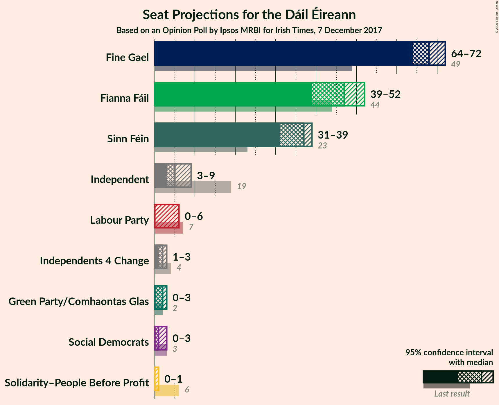
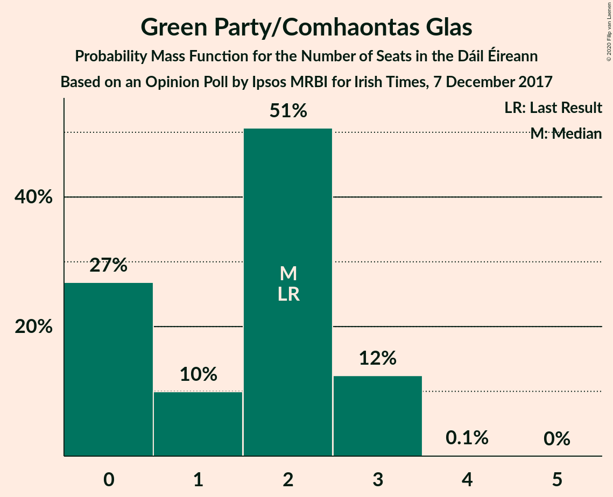
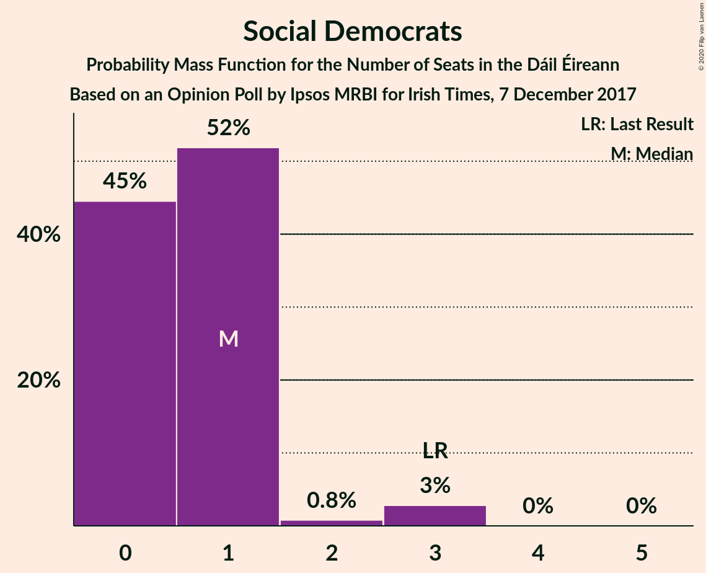
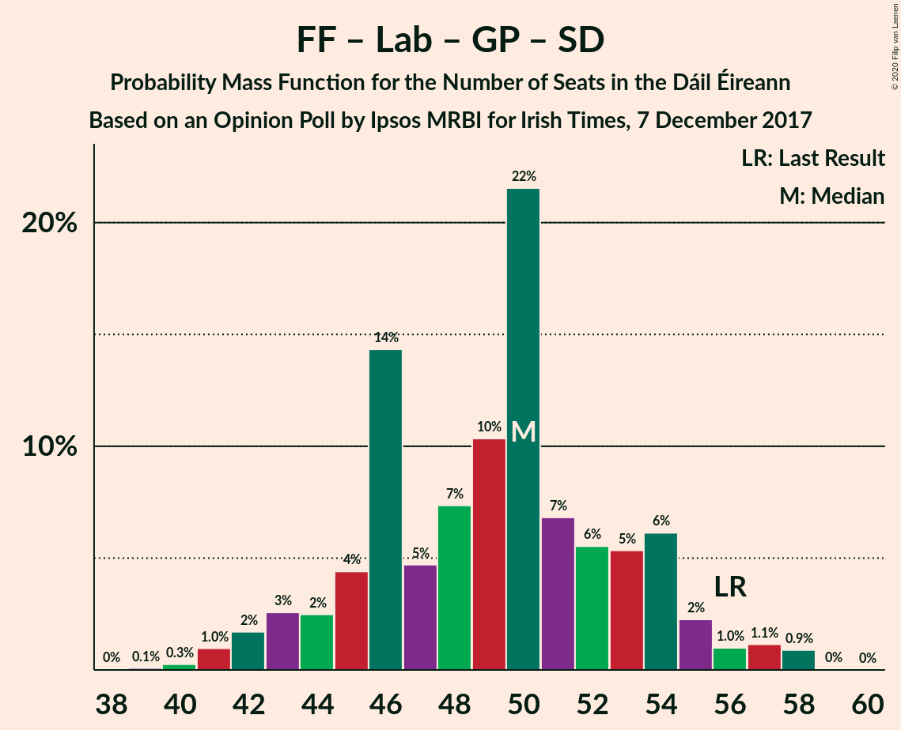
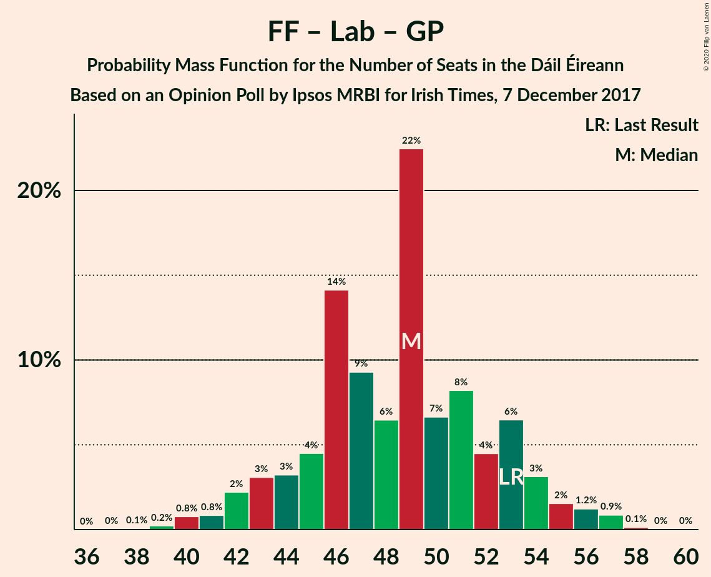

# Opinion Poll by Ipsos MRBI for Irish Times, 7 December 2017

<a href="#voting-intentions">Voting Intentions</a> | <a href="#seats">Seats</a> | <a href="#coalitions">Coalitions</a> | <a href="#technical-information">Technical Information</a>

## Voting Intentions

### Confidence Intervals

| Party | Last Result | Poll Result | 80% Confidence Interval | 90% Confidence Interval | 95% Confidence Interval | 99% Confidence Interval |
|:-----:|:-----------:|:-----------:|:-----------------------:|:-----------------------:|:-----------------------:|:-----------------------:|
| Fine Gael | 25.5% | 36.0% | 34.2–37.8% |33.8–38.3% |33.3–38.8% |32.5–39.6% |
| Fianna Fáil | 24.3% | 25.0% | 23.4–26.7% |23.0–27.1% |22.6–27.5% |21.9–28.3% |
| Sinn Féin | 13.8% | 19.0% | 17.6–20.5% |17.2–21.0% |16.9–21.3% |16.2–22.1% |
| Independent | 15.9% | 8.4% | 7.5–9.5% |7.2–9.8% |7.0–10.1% |6.5–10.7% |
| Labour Party | 6.6% | 4.0% | 3.4–4.8% |3.2–5.1% |3.0–5.3% |2.7–5.7% |
| Green Party/Comhaontas Glas | 2.7% | 3.0% | 2.5–3.7% |2.3–3.9% |2.2–4.1% |1.9–4.5% |
| Independents 4 Change | 1.5% | 1.1% | 0.8–1.6% |0.7–1.7% |0.6–1.8% |0.5–2.1% |
| Solidarity–People Before Profit | 3.9% | 1.0% | 0.7–1.5% |0.6–1.6% |0.6–1.8% |0.5–2.0% |
| Social Democrats | 3.0% | 1.0% | 0.7–1.5% |0.6–1.6% |0.6–1.8% |0.5–2.0% |

*Note:* The poll result column reflects the actual value used in the calculations. Published results may vary slightly, and in addition be rounded to fewer digits.

## Seats

### Confidence Intervals

| Party | Last Result | Median | 80% Confidence Interval | 90% Confidence Interval | 95% Confidence Interval | 99% Confidence Interval |
|:-----:|:-----------:|:------:|:-----------------------:|:-----------------------:|:-----------------------:|:-----------------------:|
| <a href="#fine-gael">Fine Gael</a> | 49 | 67 | 65–71 |64–72 |64–72 |62–72 |
| <a href="#fianna-fáil">Fianna Fáil</a> | 44 | 47 | 40–51 |40–54 |40–54 |38–54 |
| <a href="#sinn-féin">Sinn Féin</a> | 23 | 36 | 34–39 |33–39 |32–40 |31–41 |
| <a href="#independent">Independent</a> | 19 | 4 | 4–7 |4–8 |3–8 |3–9 |
| <a href="#labour-party">Labour Party</a> | 7 | 0 | 0–3 |0–5 |0–5 |0–5 |
| <a href="#green-party/comhaontas-glas">Green Party/Comhaontas Glas</a> | 2 | 2 | 0–3 |0–3 |0–3 |0–3 |
| <a href="#independents-4-change">Independents 4 Change</a> | 4 | 1 | 0–4 |0–4 |0–5 |0–5 |
| <a href="#solidarity–people-before-profit">Solidarity–People Before Profit</a> | 6 | 0 | 0 |0 |0 |0–1 |
| <a href="#social-democrats">Social Democrats</a> | 3 | 0 | 0–1 |0–3 |0–3 |0–4 |

### Fine Gael

*For a full overview of the results for this party, see the [Fine Gael](party-finegael.html) page.*

| Number of Seats | Probability | Accumulated | Special Marks |
|:---------------:|:-----------:|:-----------:|:-------------:|
| 49 | 0% | 100% | Last Result |
| 50 | 0% | 100% |  |
| 51 | 0% | 100% |  |
| 52 | 0% | 100% |  |
| 53 | 0% | 100% |  |
| 54 | 0% | 100% |  |
| 55 | 0% | 100% |  |
| 56 | 0% | 100% |  |
| 57 | 0% | 100% |  |
| 58 | 0% | 100% |  |
| 59 | 0% | 100% |  |
| 60 | 0% | 100% |  |
| 61 | 0% | 100% |  |
| 62 | 0.7% | 99.9% |  |
| 63 | 0.2% | 99.2% |  |
| 64 | 6% | 99.1% |  |
| 65 | 3% | 93% |  |
| 66 | 23% | 90% |  |
| 67 | 31% | 67% | Median |
| 68 | 12% | 36% |  |
| 69 | 7% | 24% |  |
| 70 | 4% | 18% |  |
| 71 | 6% | 13% |  |
| 72 | 8% | 8% |  |
| 73 | 0.2% | 0.2% |  |
| 74 | 0% | 0% |  |

### Fianna Fáil

*For a full overview of the results for this party, see the [Fianna Fáil](party-fiannafáil.html) page.*

| Number of Seats | Probability | Accumulated | Special Marks |
|:---------------:|:-----------:|:-----------:|:-------------:|
| 37 | 0.3% | 100% |  |
| 38 | 0.5% | 99.7% |  |
| 39 | 1.1% | 99.1% |  |
| 40 | 10% | 98% |  |
| 41 | 2% | 88% |  |
| 42 | 9% | 86% |  |
| 43 | 4% | 77% |  |
| 44 | 11% | 73% | Last Result |
| 45 | 4% | 63% |  |
| 46 | 5% | 59% |  |
| 47 | 27% | 54% | Median |
| 48 | 2% | 27% |  |
| 49 | 1.1% | 25% |  |
| 50 | 2% | 24% |  |
| 51 | 14% | 22% |  |
| 52 | 0.7% | 8% |  |
| 53 | 2% | 7% |  |
| 54 | 6% | 6% |  |
| 55 | 0% | 0% |  |

### Sinn Féin

*For a full overview of the results for this party, see the [Sinn Féin](party-sinnféin.html) page.*

| Number of Seats | Probability | Accumulated | Special Marks |
|:---------------:|:-----------:|:-----------:|:-------------:|
| 23 | 0% | 100% | Last Result |
| 24 | 0% | 100% |  |
| 25 | 0% | 100% |  |
| 26 | 0% | 100% |  |
| 27 | 0% | 100% |  |
| 28 | 0% | 100% |  |
| 29 | 0.1% | 100% |  |
| 30 | 0.3% | 99.9% |  |
| 31 | 0.2% | 99.6% |  |
| 32 | 3% | 99.4% |  |
| 33 | 5% | 97% |  |
| 34 | 3% | 92% |  |
| 35 | 21% | 88% |  |
| 36 | 24% | 68% | Median |
| 37 | 8% | 44% |  |
| 38 | 7% | 36% |  |
| 39 | 25% | 29% |  |
| 40 | 3% | 4% |  |
| 41 | 0.5% | 0.8% |  |
| 42 | 0.2% | 0.2% |  |
| 43 | 0% | 0% |  |

### Independent

*For a full overview of the results for this party, see the [Independent](party-independent.html) page.*

| Number of Seats | Probability | Accumulated | Special Marks |
|:---------------:|:-----------:|:-----------:|:-------------:|
| 3 | 4% | 100% |  |
| 4 | 56% | 96% | Median |
| 5 | 15% | 40% |  |
| 6 | 13% | 25% |  |
| 7 | 5% | 12% |  |
| 8 | 6% | 7% |  |
| 9 | 1.3% | 1.4% |  |
| 10 | 0.1% | 0.1% |  |
| 11 | 0% | 0% |  |
| 12 | 0% | 0% |  |
| 13 | 0% | 0% |  |
| 14 | 0% | 0% |  |
| 15 | 0% | 0% |  |
| 16 | 0% | 0% |  |
| 17 | 0% | 0% |  |
| 18 | 0% | 0% |  |
| 19 | 0% | 0% | Last Result |

### Labour Party

*For a full overview of the results for this party, see the [Labour Party](party-labourparty.html) page.*

| Number of Seats | Probability | Accumulated | Special Marks |
|:---------------:|:-----------:|:-----------:|:-------------:|
| 0 | 56% | 100% | Median |
| 1 | 18% | 44% |  |
| 2 | 13% | 26% |  |
| 3 | 4% | 13% |  |
| 4 | 1.1% | 8% |  |
| 5 | 7% | 7% |  |
| 6 | 0.2% | 0.3% |  |
| 7 | 0.1% | 0.1% | Last Result |
| 8 | 0.1% | 0.1% |  |
| 9 | 0% | 0% |  |

### Green Party/Comhaontas Glas

*For a full overview of the results for this party, see the [Green Party/Comhaontas Glas](party-greenpartycomhaontasglas.html) page.*

| Number of Seats | Probability | Accumulated | Special Marks |
|:---------------:|:-----------:|:-----------:|:-------------:|
| 0 | 23% | 100% |  |
| 1 | 23% | 77% |  |
| 2 | 37% | 53% | Last Result, Median |
| 3 | 16% | 17% |  |
| 4 | 0.1% | 0.1% |  |
| 5 | 0% | 0% |  |

### Independents 4 Change

*For a full overview of the results for this party, see the [Independents 4 Change](party-independents4change.html) page.*

| Number of Seats | Probability | Accumulated | Special Marks |
|:---------------:|:-----------:|:-----------:|:-------------:|
| 0 | 50% | 100% |  |
| 1 | 16% | 50% | Median |
| 2 | 7% | 34% |  |
| 3 | 9% | 27% |  |
| 4 | 15% | 18% | Last Result |
| 5 | 3% | 3% |  |
| 6 | 0% | 0% |  |

### Solidarity–People Before Profit

*For a full overview of the results for this party, see the [Solidarity–People Before Profit](party-solidarity–peoplebeforeprofit.html) page.*

| Number of Seats | Probability | Accumulated | Special Marks |
|:---------------:|:-----------:|:-----------:|:-------------:|
| 0 | 98% | 100% | Median |
| 1 | 2% | 2% |  |
| 2 | 0.1% | 0.4% |  |
| 3 | 0.2% | 0.2% |  |
| 4 | 0% | 0% |  |
| 5 | 0% | 0% |  |
| 6 | 0% | 0% | Last Result |

### Social Democrats

*For a full overview of the results for this party, see the [Social Democrats](party-socialdemocrats.html) page.*

| Number of Seats | Probability | Accumulated | Special Marks |
|:---------------:|:-----------:|:-----------:|:-------------:|
| 0 | 89% | 100% | Median |
| 1 | 4% | 11% |  |
| 2 | 2% | 8% |  |
| 3 | 5% | 6% | Last Result |
| 4 | 1.1% | 1.1% |  |
| 5 | 0% | 0% |  |

## Coalitions

### Confidence Intervals

| Coalition | Last Result | Median | Majority? | 80% Confidence Interval | 90% Confidence Interval | 95% Confidence Interval | 99% Confidence Interval |
|:---------:|:-----------:|:------:|:---------:|:-----------------------:|:-----------------------:|:-----------------------:|:-----------------------:|
| Fine Gael – Fianna Fáil | 93 | 114 | 100% | 109–118 | 108–118 | 107–119 | 106–119 |
| Fianna Fáil – Sinn Féin | 67 | 83 | 62% | 77–87 | 76–90 | 76–90 | 74–90 |
| Fine Gael – Labour Party – Green Party/Comhaontas Glas – Social Democrats | 61 | 69 | 0% | 67–74 | 64–74 | 64–75 | 64–76 |
| Fine Gael – Labour Party – Green Party/Comhaontas Glas | 58 | 69 | 0% | 67–74 | 64–74 | 64–74 | 64–76 |
| Fine Gael – Green Party/Comhaontas Glas | 51 | 69 | 0% | 67–73 | 64–73 | 64–73 | 64–74 |
| Fine Gael – Labour Party | 56 | 68 | 0% | 66–71 | 64–73 | 64–73 | 62–73 |
| Fine Gael | 49 | 67 | 0% | 65–71 | 64–72 | 64–72 | 62–72 |
| Fianna Fáil – Labour Party – Green Party/Comhaontas Glas – Social Democrats | 56 | 49 | 0% | 43–54 | 42–54 | 42–55 | 40–56 |
| Fianna Fáil – Labour Party – Green Party/Comhaontas Glas | 53 | 49 | 0% | 42–54 | 42–54 | 42–54 | 40–56 |
| Fianna Fáil – Green Party/Comhaontas Glas | 46 | 49 | 0% | 41–53 | 41–54 | 41–54 | 39–55 |
| Fianna Fáil – Labour Party | 51 | 47 | 0% | 41–53 | 41–54 | 41–54 | 38–54 |

### Fine Gael – Fianna Fáil

| Number of Seats | Probability | Accumulated | Special Marks |
|:---------------:|:-----------:|:-----------:|:-------------:|
| 93 | 0% | 100% | Last Result |
| 94 | 0% | 100% |  |
| 95 | 0% | 100% |  |
| 96 | 0% | 100% |  |
| 97 | 0% | 100% |  |
| 98 | 0% | 100% |  |
| 99 | 0% | 100% |  |
| 100 | 0% | 100% |  |
| 101 | 0% | 100% |  |
| 102 | 0% | 100% |  |
| 103 | 0% | 100% |  |
| 104 | 0.1% | 100% |  |
| 105 | 0.1% | 99.9% |  |
| 106 | 0.8% | 99.9% |  |
| 107 | 2% | 99.1% |  |
| 108 | 4% | 97% |  |
| 109 | 3% | 92% |  |
| 110 | 10% | 90% |  |
| 111 | 6% | 79% |  |
| 112 | 12% | 74% |  |
| 113 | 5% | 62% |  |
| 114 | 24% | 57% | Median |
| 115 | 2% | 33% |  |
| 116 | 2% | 30% |  |
| 117 | 11% | 28% |  |
| 118 | 14% | 17% |  |
| 119 | 3% | 4% |  |
| 120 | 0.1% | 0.4% |  |
| 121 | 0.2% | 0.3% |  |
| 122 | 0% | 0.1% |  |
| 123 | 0% | 0% |  |

### Fianna Fáil – Sinn Féin

| Number of Seats | Probability | Accumulated | Special Marks |
|:---------------:|:-----------:|:-----------:|:-------------:|
| 67 | 0% | 100% | Last Result |
| 68 | 0% | 100% |  |
| 69 | 0% | 100% |  |
| 70 | 0% | 100% |  |
| 71 | 0% | 100% |  |
| 72 | 0% | 100% |  |
| 73 | 0% | 100% |  |
| 74 | 0.6% | 99.9% |  |
| 75 | 0.7% | 99.4% |  |
| 76 | 9% | 98.7% |  |
| 77 | 2% | 90% |  |
| 78 | 6% | 88% |  |
| 79 | 11% | 82% |  |
| 80 | 9% | 71% |  |
| 81 | 5% | 62% | Majority |
| 82 | 3% | 57% |  |
| 83 | 4% | 54% | Median |
| 84 | 2% | 49% |  |
| 85 | 3% | 47% |  |
| 86 | 34% | 44% |  |
| 87 | 0.4% | 10% |  |
| 88 | 4% | 10% |  |
| 89 | 0.3% | 6% |  |
| 90 | 6% | 6% |  |
| 91 | 0% | 0% |  |

### Fine Gael – Labour Party – Green Party/Comhaontas Glas – Social Democrats

| Number of Seats | Probability | Accumulated | Special Marks |
|:---------------:|:-----------:|:-----------:|:-------------:|
| 61 | 0% | 100% | Last Result |
| 62 | 0% | 100% |  |
| 63 | 0.2% | 100% |  |
| 64 | 5% | 99.8% |  |
| 65 | 0.9% | 95% |  |
| 66 | 0.8% | 94% |  |
| 67 | 5% | 93% |  |
| 68 | 4% | 88% |  |
| 69 | 36% | 84% | Median |
| 70 | 7% | 48% |  |
| 71 | 10% | 41% |  |
| 72 | 6% | 31% |  |
| 73 | 11% | 26% |  |
| 74 | 11% | 14% |  |
| 75 | 1.4% | 3% |  |
| 76 | 0.9% | 1.4% |  |
| 77 | 0.2% | 0.5% |  |
| 78 | 0.1% | 0.3% |  |
| 79 | 0.1% | 0.1% |  |
| 80 | 0% | 0% |  |

### Fine Gael – Labour Party – Green Party/Comhaontas Glas

| Number of Seats | Probability | Accumulated | Special Marks |
|:---------------:|:-----------:|:-----------:|:-------------:|
| 58 | 0% | 100% | Last Result |
| 59 | 0% | 100% |  |
| 60 | 0% | 100% |  |
| 61 | 0% | 100% |  |
| 62 | 0.2% | 100% |  |
| 63 | 0.1% | 99.8% |  |
| 64 | 5% | 99.7% |  |
| 65 | 0.8% | 94% |  |
| 66 | 0.8% | 94% |  |
| 67 | 5% | 93% |  |
| 68 | 5% | 87% |  |
| 69 | 38% | 83% | Median |
| 70 | 8% | 45% |  |
| 71 | 11% | 37% |  |
| 72 | 5% | 26% |  |
| 73 | 10% | 21% |  |
| 74 | 10% | 11% |  |
| 75 | 0.9% | 1.4% |  |
| 76 | 0.4% | 0.6% |  |
| 77 | 0.1% | 0.1% |  |
| 78 | 0% | 0.1% |  |
| 79 | 0% | 0% |  |

### Fine Gael – Green Party/Comhaontas Glas

| Number of Seats | Probability | Accumulated | Special Marks |
|:---------------:|:-----------:|:-----------:|:-------------:|
| 51 | 0% | 100% | Last Result |
| 52 | 0% | 100% |  |
| 53 | 0% | 100% |  |
| 54 | 0% | 100% |  |
| 55 | 0% | 100% |  |
| 56 | 0% | 100% |  |
| 57 | 0% | 100% |  |
| 58 | 0% | 100% |  |
| 59 | 0% | 100% |  |
| 60 | 0% | 100% |  |
| 61 | 0% | 100% |  |
| 62 | 0.2% | 100% |  |
| 63 | 0.1% | 99.7% |  |
| 64 | 6% | 99.6% |  |
| 65 | 1.1% | 94% |  |
| 66 | 2% | 93% |  |
| 67 | 15% | 91% |  |
| 68 | 16% | 76% |  |
| 69 | 29% | 60% | Median |
| 70 | 7% | 31% |  |
| 71 | 10% | 24% |  |
| 72 | 3% | 14% |  |
| 73 | 11% | 12% |  |
| 74 | 0.7% | 0.9% |  |
| 75 | 0.1% | 0.2% |  |
| 76 | 0.1% | 0.1% |  |
| 77 | 0% | 0% |  |

### Fine Gael – Labour Party

| Number of Seats | Probability | Accumulated | Special Marks |
|:---------------:|:-----------:|:-----------:|:-------------:|
| 56 | 0% | 100% | Last Result |
| 57 | 0% | 100% |  |
| 58 | 0% | 100% |  |
| 59 | 0% | 100% |  |
| 60 | 0% | 100% |  |
| 61 | 0% | 100% |  |
| 62 | 0.6% | 100% |  |
| 63 | 0.1% | 99.4% |  |
| 64 | 5% | 99.3% |  |
| 65 | 0.4% | 94% |  |
| 66 | 7% | 93% |  |
| 67 | 28% | 86% | Median |
| 68 | 17% | 59% |  |
| 69 | 11% | 42% |  |
| 70 | 7% | 31% |  |
| 71 | 14% | 24% |  |
| 72 | 1.4% | 10% |  |
| 73 | 8% | 8% |  |
| 74 | 0.3% | 0.4% |  |
| 75 | 0% | 0.1% |  |
| 76 | 0% | 0.1% |  |
| 77 | 0% | 0% |  |

### Fine Gael

| Number of Seats | Probability | Accumulated | Special Marks |
|:---------------:|:-----------:|:-----------:|:-------------:|
| 49 | 0% | 100% | Last Result |
| 50 | 0% | 100% |  |
| 51 | 0% | 100% |  |
| 52 | 0% | 100% |  |
| 53 | 0% | 100% |  |
| 54 | 0% | 100% |  |
| 55 | 0% | 100% |  |
| 56 | 0% | 100% |  |
| 57 | 0% | 100% |  |
| 58 | 0% | 100% |  |
| 59 | 0% | 100% |  |
| 60 | 0% | 100% |  |
| 61 | 0% | 100% |  |
| 62 | 0.7% | 99.9% |  |
| 63 | 0.2% | 99.2% |  |
| 64 | 6% | 99.1% |  |
| 65 | 3% | 93% |  |
| 66 | 23% | 90% |  |
| 67 | 31% | 67% | Median |
| 68 | 12% | 36% |  |
| 69 | 7% | 24% |  |
| 70 | 4% | 18% |  |
| 71 | 6% | 13% |  |
| 72 | 8% | 8% |  |
| 73 | 0.2% | 0.2% |  |
| 74 | 0% | 0% |  |

### Fianna Fáil – Labour Party – Green Party/Comhaontas Glas – Social Democrats

| Number of Seats | Probability | Accumulated | Special Marks |
|:---------------:|:-----------:|:-----------:|:-------------:|
| 40 | 0.7% | 100% |  |
| 41 | 0.9% | 99.3% |  |
| 42 | 8% | 98% |  |
| 43 | 2% | 91% |  |
| 44 | 3% | 89% |  |
| 45 | 5% | 86% |  |
| 46 | 5% | 81% |  |
| 47 | 7% | 76% |  |
| 48 | 6% | 69% |  |
| 49 | 26% | 63% | Median |
| 50 | 4% | 36% |  |
| 51 | 11% | 33% |  |
| 52 | 2% | 22% |  |
| 53 | 2% | 21% |  |
| 54 | 16% | 19% |  |
| 55 | 2% | 3% |  |
| 56 | 0.6% | 0.7% | Last Result |
| 57 | 0.1% | 0.1% |  |
| 58 | 0% | 0% |  |

### Fianna Fáil – Labour Party – Green Party/Comhaontas Glas

| Number of Seats | Probability | Accumulated | Special Marks |
|:---------------:|:-----------:|:-----------:|:-------------:|
| 37 | 0.1% | 100% |  |
| 38 | 0.2% | 99.9% |  |
| 39 | 0.1% | 99.7% |  |
| 40 | 0.6% | 99.5% |  |
| 41 | 1.0% | 99.0% |  |
| 42 | 8% | 98% |  |
| 43 | 2% | 90% |  |
| 44 | 4% | 88% |  |
| 45 | 6% | 84% |  |
| 46 | 5% | 78% |  |
| 47 | 8% | 73% |  |
| 48 | 4% | 65% |  |
| 49 | 27% | 61% | Median |
| 50 | 4% | 35% |  |
| 51 | 10% | 31% |  |
| 52 | 2% | 21% |  |
| 53 | 1.1% | 19% | Last Result |
| 54 | 16% | 18% |  |
| 55 | 2% | 2% |  |
| 56 | 0.6% | 0.6% |  |
| 57 | 0% | 0% |  |

### Fianna Fáil – Green Party/Comhaontas Glas

| Number of Seats | Probability | Accumulated | Special Marks |
|:---------------:|:-----------:|:-----------:|:-------------:|
| 37 | 0.1% | 100% |  |
| 38 | 0.2% | 99.9% |  |
| 39 | 0.2% | 99.7% |  |
| 40 | 0.9% | 99.4% |  |
| 41 | 9% | 98.6% |  |
| 42 | 3% | 89% |  |
| 43 | 4% | 87% |  |
| 44 | 4% | 82% |  |
| 45 | 6% | 78% |  |
| 46 | 11% | 72% | Last Result |
| 47 | 8% | 61% |  |
| 48 | 2% | 53% |  |
| 49 | 25% | 51% | Median |
| 50 | 2% | 26% |  |
| 51 | 4% | 24% |  |
| 52 | 9% | 20% |  |
| 53 | 1.5% | 11% |  |
| 54 | 7% | 9% |  |
| 55 | 2% | 2% |  |
| 56 | 0% | 0% |  |

### Fianna Fáil – Labour Party

| Number of Seats | Probability | Accumulated | Special Marks |
|:---------------:|:-----------:|:-----------:|:-------------:|
| 37 | 0.3% | 100% |  |
| 38 | 0.4% | 99.7% |  |
| 39 | 1.0% | 99.3% |  |
| 40 | 0.8% | 98% |  |
| 41 | 9% | 98% |  |
| 42 | 2% | 88% |  |
| 43 | 7% | 87% |  |
| 44 | 4% | 80% |  |
| 45 | 6% | 76% |  |
| 46 | 5% | 69% |  |
| 47 | 29% | 64% | Median |
| 48 | 2% | 36% |  |
| 49 | 8% | 33% |  |
| 50 | 2% | 25% |  |
| 51 | 5% | 23% | Last Result |
| 52 | 0.9% | 17% |  |
| 53 | 10% | 16% |  |
| 54 | 6% | 6% |  |
| 55 | 0.1% | 0.1% |  |
| 56 | 0% | 0% |  |

## Technical Information

### Opinion Poll

+ **Polling firm:** Ipsos MRBI
+ **Commissioner(s):** Irish Times
+ **Fieldwork period:** 7 December 2017

### Calculations

+ **Sample size:** 1200
+ **Simulations done:** 131,072
+ **Error estimate:** 1.81%

