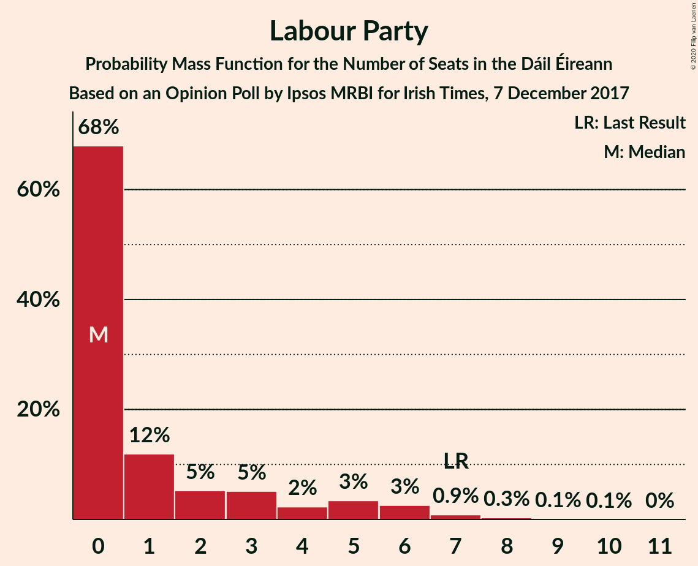
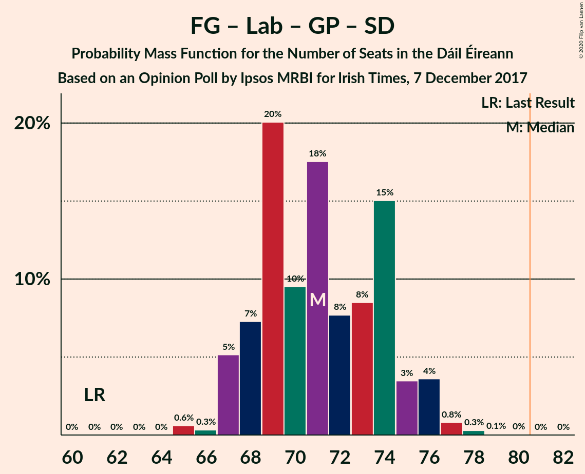
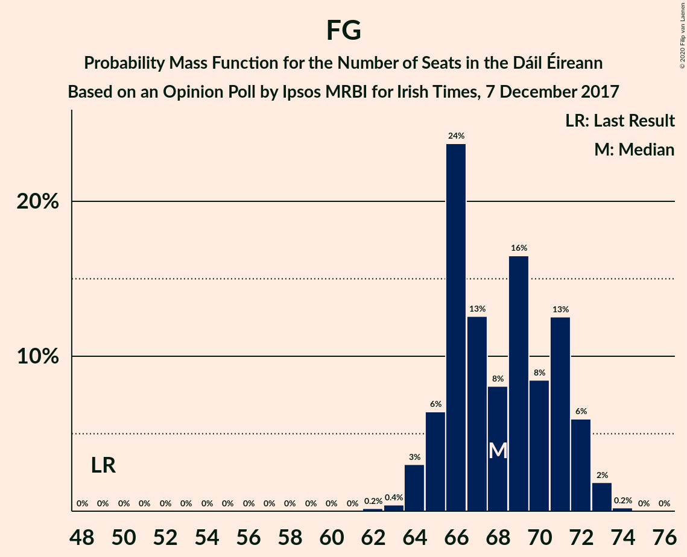

# Opinion Poll by Ipsos MRBI for Irish Times, 7 December 2017

<a href="#voting-intentions">Voting Intentions</a> | <a href="#seats">Seats</a> | <a href="#coalitions">Coalitions</a> | <a href="#technical-information">Technical Information</a>

## Voting Intentions

### Confidence Intervals

| Party | Last Result | Poll Result | 80% Confidence Interval | 90% Confidence Interval | 95% Confidence Interval | 99% Confidence Interval |
|:-----:|:-----------:|:-----------:|:-----------------------:|:-----------------------:|:-----------------------:|:-----------------------:|
| Fine Gael | 25.5% | 36.0% | 34.2–37.8% |33.8–38.3% |33.3–38.8% |32.5–39.6% |
| Fianna Fáil | 24.3% | 25.0% | 23.4–26.7% |23.0–27.1% |22.6–27.5% |21.9–28.3% |
| Sinn Féin | 13.8% | 19.0% | 17.6–20.5% |17.2–21.0% |16.9–21.3% |16.2–22.1% |
| Independent | 15.9% | 8.4% | 7.5–9.5% |7.2–9.8% |7.0–10.1% |6.5–10.7% |
| Labour Party | 6.6% | 4.0% | 3.4–4.8% |3.2–5.1% |3.0–5.3% |2.7–5.7% |
| Green Party/Comhaontas Glas | 2.7% | 3.0% | 2.5–3.7% |2.3–3.9% |2.2–4.1% |1.9–4.5% |
| Independents 4 Change | 1.5% | 1.1% | 0.8–1.6% |0.7–1.7% |0.6–1.8% |0.5–2.1% |
| Solidarity–People Before Profit | 3.9% | 1.0% | 0.7–1.5% |0.6–1.6% |0.6–1.8% |0.5–2.0% |
| Social Democrats | 3.0% | 1.0% | 0.7–1.5% |0.6–1.6% |0.6–1.8% |0.5–2.0% |

*Note:* The poll result column reflects the actual value used in the calculations. Published results may vary slightly, and in addition be rounded to fewer digits.

## Seats

### Confidence Intervals

| Party | Last Result | Median | 80% Confidence Interval | 90% Confidence Interval | 95% Confidence Interval | 99% Confidence Interval |
|:-----:|:-----------:|:------:|:-----------------------:|:-----------------------:|:-----------------------:|:-----------------------:|
| <a href="#fine-gael">Fine Gael</a> | 49 | 68 | 65–71 |65–72 |64–72 |63–73 |
| <a href="#fianna-fáil">Fianna Fáil</a> | 44 | 47 | 42–51 |40–51 |39–52 |38–52 |
| <a href="#sinn-féin">Sinn Féin</a> | 23 | 37 | 32–38 |31–38 |31–39 |31–40 |
| <a href="#independent">Independent</a> | 19 | 5 | 4–7 |4–8 |3–9 |3–10 |
| <a href="#labour-party">Labour Party</a> | 7 | 0 | 0–3 |0–5 |0–6 |0–8 |
| <a href="#green-party/comhaontas-glas">Green Party/Comhaontas Glas</a> | 2 | 2 | 0–3 |0–3 |0–3 |0–3 |
| <a href="#independents-4-change">Independents 4 Change</a> | 4 | 2 | 2 |1–3 |1–3 |1–3 |
| <a href="#solidarity–people-before-profit">Solidarity–People Before Profit</a> | 6 | 0 | 0 |0–1 |0–1 |0–1 |
| <a href="#social-democrats">Social Democrats</a> | 3 | 1 | 0–1 |0–1 |0–3 |0–3 |

### Fine Gael

*For a full overview of the results for this party, see the [Fine Gael](party-finegael.html) page.*

| Number of Seats | Probability | Accumulated | Special Marks |
|:---------------:|:-----------:|:-----------:|:-------------:|
| 49 | 0% | 100% | Last Result |
| 50 | 0% | 100% |  |
| 51 | 0% | 100% |  |
| 52 | 0% | 100% |  |
| 53 | 0% | 100% |  |
| 54 | 0% | 100% |  |
| 55 | 0% | 100% |  |
| 56 | 0% | 100% |  |
| 57 | 0% | 100% |  |
| 58 | 0% | 100% |  |
| 59 | 0% | 100% |  |
| 60 | 0% | 100% |  |
| 61 | 0% | 100% |  |
| 62 | 0.2% | 100% |  |
| 63 | 0.4% | 99.8% |  |
| 64 | 3% | 99.4% |  |
| 65 | 6% | 96% |  |
| 66 | 24% | 90% |  |
| 67 | 13% | 66% |  |
| 68 | 8% | 54% | Median |
| 69 | 16% | 46% |  |
| 70 | 8% | 29% |  |
| 71 | 13% | 21% |  |
| 72 | 6% | 8% |  |
| 73 | 2% | 2% |  |
| 74 | 0.2% | 0.2% |  |
| 75 | 0% | 0% |  |

### Fianna Fáil

*For a full overview of the results for this party, see the [Fianna Fáil](party-fiannafáil.html) page.*

| Number of Seats | Probability | Accumulated | Special Marks |
|:---------------:|:-----------:|:-----------:|:-------------:|
| 36 | 0% | 100% |  |
| 37 | 0.3% | 99.9% |  |
| 38 | 0.8% | 99.7% |  |
| 39 | 2% | 98.9% |  |
| 40 | 3% | 97% |  |
| 41 | 4% | 95% |  |
| 42 | 5% | 91% |  |
| 43 | 5% | 86% |  |
| 44 | 11% | 81% | Last Result |
| 45 | 7% | 70% |  |
| 46 | 11% | 63% |  |
| 47 | 26% | 52% | Median |
| 48 | 4% | 26% |  |
| 49 | 8% | 22% |  |
| 50 | 2% | 14% |  |
| 51 | 9% | 12% |  |
| 52 | 3% | 3% |  |
| 53 | 0.2% | 0.3% |  |
| 54 | 0% | 0% |  |

### Sinn Féin

*For a full overview of the results for this party, see the [Sinn Féin](party-sinnféin.html) page.*

| Number of Seats | Probability | Accumulated | Special Marks |
|:---------------:|:-----------:|:-----------:|:-------------:|
| 23 | 0% | 100% | Last Result |
| 24 | 0% | 100% |  |
| 25 | 0% | 100% |  |
| 26 | 0% | 100% |  |
| 27 | 0% | 100% |  |
| 28 | 0% | 100% |  |
| 29 | 0% | 100% |  |
| 30 | 0.1% | 100% |  |
| 31 | 6% | 99.8% |  |
| 32 | 6% | 94% |  |
| 33 | 12% | 88% |  |
| 34 | 8% | 76% |  |
| 35 | 7% | 68% |  |
| 36 | 10% | 62% |  |
| 37 | 37% | 51% | Median |
| 38 | 10% | 14% |  |
| 39 | 3% | 4% |  |
| 40 | 1.4% | 1.4% |  |
| 41 | 0% | 0% |  |

### Independent

*For a full overview of the results for this party, see the [Independent](party-independent.html) page.*

| Number of Seats | Probability | Accumulated | Special Marks |
|:---------------:|:-----------:|:-----------:|:-------------:|
| 3 | 5% | 100% |  |
| 4 | 31% | 95% |  |
| 5 | 34% | 64% | Median |
| 6 | 17% | 29% |  |
| 7 | 5% | 12% |  |
| 8 | 3% | 7% |  |
| 9 | 1.5% | 4% |  |
| 10 | 2% | 2% |  |
| 11 | 0.1% | 0.2% |  |
| 12 | 0% | 0.1% |  |
| 13 | 0% | 0% |  |
| 14 | 0% | 0% |  |
| 15 | 0% | 0% |  |
| 16 | 0% | 0% |  |
| 17 | 0% | 0% |  |
| 18 | 0% | 0% |  |
| 19 | 0% | 0% | Last Result |

### Labour Party

*For a full overview of the results for this party, see the [Labour Party](party-labourparty.html) page.*

| Number of Seats | Probability | Accumulated | Special Marks |
|:---------------:|:-----------:|:-----------:|:-------------:|
| 0 | 68% | 100% | Median |
| 1 | 12% | 32% |  |
| 2 | 5% | 20% |  |
| 3 | 5% | 15% |  |
| 4 | 2% | 10% |  |
| 5 | 3% | 7% |  |
| 6 | 3% | 4% |  |
| 7 | 0.9% | 1.4% | Last Result |
| 8 | 0.3% | 0.5% |  |
| 9 | 0.1% | 0.2% |  |
| 10 | 0.1% | 0.1% |  |
| 11 | 0% | 0% |  |

### Green Party/Comhaontas Glas

*For a full overview of the results for this party, see the [Green Party/Comhaontas Glas](party-greenpartycomhaontasglas.html) page.*

| Number of Seats | Probability | Accumulated | Special Marks |
|:---------------:|:-----------:|:-----------:|:-------------:|
| 0 | 27% | 100% |  |
| 1 | 10% | 73% |  |
| 2 | 51% | 63% | Last Result, Median |
| 3 | 12% | 13% |  |
| 4 | 0.1% | 0.1% |  |
| 5 | 0% | 0% |  |

### Independents 4 Change

*For a full overview of the results for this party, see the [Independents 4 Change](party-independents4change.html) page.*

| Number of Seats | Probability | Accumulated | Special Marks |
|:---------------:|:-----------:|:-----------:|:-------------:|
| 1 | 10% | 100% |  |
| 2 | 85% | 90% | Median |
| 3 | 5% | 5% |  |
| 4 | 0% | 0% | Last Result |

### Solidarity–People Before Profit

*For a full overview of the results for this party, see the [Solidarity–People Before Profit](party-solidarity–peoplebeforeprofit.html) page.*

| Number of Seats | Probability | Accumulated | Special Marks |
|:---------------:|:-----------:|:-----------:|:-------------:|
| 0 | 93% | 100% | Median |
| 1 | 7% | 7% |  |
| 2 | 0.3% | 0.3% |  |
| 3 | 0% | 0% |  |
| 4 | 0% | 0% |  |
| 5 | 0% | 0% |  |
| 6 | 0% | 0% | Last Result |

### Social Democrats

*For a full overview of the results for this party, see the [Social Democrats](party-socialdemocrats.html) page.*

| Number of Seats | Probability | Accumulated | Special Marks |
|:---------------:|:-----------:|:-----------:|:-------------:|
| 0 | 45% | 100% |  |
| 1 | 52% | 55% | Median |
| 2 | 0.8% | 4% |  |
| 3 | 3% | 3% | Last Result |
| 4 | 0% | 0% |  |

## Coalitions

### Confidence Intervals

| Coalition | Last Result | Median | Majority? | 80% Confidence Interval | 90% Confidence Interval | 95% Confidence Interval | 99% Confidence Interval |
|:---------:|:-----------:|:------:|:---------:|:-----------------------:|:-----------------------:|:-----------------------:|:-----------------------:|
| Fine Gael – Fianna Fáil | 93 | 114 | 100% | 110–119 | 109–119 | 108–120 | 106–121 |
| Fianna Fáil – Sinn Féin | 67 | 82 | 69% | 78–84 | 76–85 | 76–86 | 74–87 |
| Fine Gael – Labour Party – Green Party/Comhaontas Glas – Social Democrats | 61 | 71 | 0% | 68–74 | 67–75 | 67–76 | 65–77 |
| Fine Gael – Labour Party – Green Party/Comhaontas Glas | 58 | 70 | 0% | 67–74 | 67–75 | 66–76 | 65–77 |
| Fine Gael – Labour Party | 56 | 69 | 0% | 66–72 | 66–73 | 66–74 | 65–75 |
| Fine Gael – Green Party/Comhaontas Glas | 51 | 69 | 0% | 66–73 | 66–74 | 65–74 | 64–75 |
| Fine Gael | 49 | 68 | 0% | 65–71 | 65–72 | 64–72 | 63–73 |
| Fianna Fáil – Labour Party – Green Party/Comhaontas Glas – Social Democrats | 56 | 50 | 0% | 45–54 | 43–55 | 42–56 | 41–58 |
| Fianna Fáil – Labour Party – Green Party/Comhaontas Glas | 53 | 49 | 0% | 44–53 | 43–54 | 42–55 | 40–57 |
| Fianna Fáil – Green Party/Comhaontas Glas | 46 | 48 | 0% | 43–52 | 42–53 | 41–54 | 39–54 |
| Fianna Fáil – Labour Party | 51 | 47 | 0% | 43–51 | 41–52 | 40–53 | 39–55 |

### Fine Gael – Fianna Fáil

| Number of Seats | Probability | Accumulated | Special Marks |
|:---------------:|:-----------:|:-----------:|:-------------:|
| 93 | 0% | 100% | Last Result |
| 94 | 0% | 100% |  |
| 95 | 0% | 100% |  |
| 96 | 0% | 100% |  |
| 97 | 0% | 100% |  |
| 98 | 0% | 100% |  |
| 99 | 0% | 100% |  |
| 100 | 0% | 100% |  |
| 101 | 0% | 100% |  |
| 102 | 0% | 100% |  |
| 103 | 0.1% | 100% |  |
| 104 | 0.1% | 99.9% |  |
| 105 | 0.3% | 99.8% |  |
| 106 | 0.6% | 99.6% |  |
| 107 | 0.7% | 99.0% |  |
| 108 | 2% | 98% |  |
| 109 | 3% | 97% |  |
| 110 | 4% | 94% |  |
| 111 | 4% | 90% |  |
| 112 | 6% | 86% |  |
| 113 | 25% | 79% |  |
| 114 | 14% | 55% |  |
| 115 | 10% | 41% | Median |
| 116 | 6% | 31% |  |
| 117 | 9% | 24% |  |
| 118 | 5% | 15% |  |
| 119 | 5% | 10% |  |
| 120 | 3% | 5% |  |
| 121 | 2% | 2% |  |
| 122 | 0.1% | 0.1% |  |
| 123 | 0% | 0% |  |

### Fianna Fáil – Sinn Féin

| Number of Seats | Probability | Accumulated | Special Marks |
|:---------------:|:-----------:|:-----------:|:-------------:|
| 67 | 0% | 100% | Last Result |
| 68 | 0% | 100% |  |
| 69 | 0% | 100% |  |
| 70 | 0% | 100% |  |
| 71 | 0% | 100% |  |
| 72 | 0% | 100% |  |
| 73 | 0.2% | 100% |  |
| 74 | 0.7% | 99.8% |  |
| 75 | 0.9% | 99.1% |  |
| 76 | 4% | 98% |  |
| 77 | 4% | 94% |  |
| 78 | 4% | 90% |  |
| 79 | 4% | 86% |  |
| 80 | 13% | 82% |  |
| 81 | 7% | 69% | Majority |
| 82 | 15% | 62% |  |
| 83 | 14% | 47% |  |
| 84 | 26% | 33% | Median |
| 85 | 3% | 7% |  |
| 86 | 4% | 5% |  |
| 87 | 0.6% | 0.7% |  |
| 88 | 0.1% | 0.1% |  |
| 89 | 0% | 0% |  |

### Fine Gael – Labour Party – Green Party/Comhaontas Glas – Social Democrats

| Number of Seats | Probability | Accumulated | Special Marks |
|:---------------:|:-----------:|:-----------:|:-------------:|
| 61 | 0% | 100% | Last Result |
| 62 | 0% | 100% |  |
| 63 | 0% | 100% |  |
| 64 | 0% | 100% |  |
| 65 | 0.6% | 100% |  |
| 66 | 0.3% | 99.4% |  |
| 67 | 5% | 99.1% |  |
| 68 | 7% | 94% |  |
| 69 | 20% | 87% |  |
| 70 | 10% | 67% |  |
| 71 | 18% | 57% | Median |
| 72 | 8% | 40% |  |
| 73 | 8% | 32% |  |
| 74 | 15% | 23% |  |
| 75 | 3% | 8% |  |
| 76 | 4% | 5% |  |
| 77 | 0.8% | 1.2% |  |
| 78 | 0.3% | 0.4% |  |
| 79 | 0.1% | 0.1% |  |
| 80 | 0% | 0.1% |  |
| 81 | 0% | 0% | Majority |

### Fine Gael – Labour Party – Green Party/Comhaontas Glas

| Number of Seats | Probability | Accumulated | Special Marks |
|:---------------:|:-----------:|:-----------:|:-------------:|
| 58 | 0% | 100% | Last Result |
| 59 | 0% | 100% |  |
| 60 | 0% | 100% |  |
| 61 | 0% | 100% |  |
| 62 | 0% | 100% |  |
| 63 | 0% | 100% |  |
| 64 | 0.1% | 100% |  |
| 65 | 0.7% | 99.9% |  |
| 66 | 2% | 99.2% |  |
| 67 | 8% | 97% |  |
| 68 | 18% | 90% |  |
| 69 | 11% | 71% |  |
| 70 | 11% | 61% | Median |
| 71 | 15% | 50% |  |
| 72 | 9% | 34% |  |
| 73 | 13% | 26% |  |
| 74 | 7% | 13% |  |
| 75 | 3% | 6% |  |
| 76 | 3% | 3% |  |
| 77 | 0.5% | 0.7% |  |
| 78 | 0.1% | 0.2% |  |
| 79 | 0% | 0.1% |  |
| 80 | 0% | 0% |  |

### Fine Gael – Labour Party

| Number of Seats | Probability | Accumulated | Special Marks |
|:---------------:|:-----------:|:-----------:|:-------------:|
| 56 | 0% | 100% | Last Result |
| 57 | 0% | 100% |  |
| 58 | 0% | 100% |  |
| 59 | 0% | 100% |  |
| 60 | 0% | 100% |  |
| 61 | 0% | 100% |  |
| 62 | 0% | 100% |  |
| 63 | 0% | 100% |  |
| 64 | 0.2% | 100% |  |
| 65 | 1.3% | 99.8% |  |
| 66 | 18% | 98% |  |
| 67 | 14% | 81% |  |
| 68 | 11% | 67% | Median |
| 69 | 16% | 55% |  |
| 70 | 9% | 40% |  |
| 71 | 15% | 31% |  |
| 72 | 8% | 16% |  |
| 73 | 4% | 8% |  |
| 74 | 3% | 4% |  |
| 75 | 0.7% | 0.9% |  |
| 76 | 0.1% | 0.2% |  |
| 77 | 0.1% | 0.1% |  |
| 78 | 0% | 0% |  |

### Fine Gael – Green Party/Comhaontas Glas

| Number of Seats | Probability | Accumulated | Special Marks |
|:---------------:|:-----------:|:-----------:|:-------------:|
| 51 | 0% | 100% | Last Result |
| 52 | 0% | 100% |  |
| 53 | 0% | 100% |  |
| 54 | 0% | 100% |  |
| 55 | 0% | 100% |  |
| 56 | 0% | 100% |  |
| 57 | 0% | 100% |  |
| 58 | 0% | 100% |  |
| 59 | 0% | 100% |  |
| 60 | 0% | 100% |  |
| 61 | 0% | 100% |  |
| 62 | 0.1% | 100% |  |
| 63 | 0.2% | 99.9% |  |
| 64 | 0.5% | 99.7% |  |
| 65 | 3% | 99.3% |  |
| 66 | 8% | 97% |  |
| 67 | 8% | 88% |  |
| 68 | 19% | 80% |  |
| 69 | 13% | 61% |  |
| 70 | 11% | 48% | Median |
| 71 | 13% | 37% |  |
| 72 | 7% | 25% |  |
| 73 | 11% | 17% |  |
| 74 | 5% | 6% |  |
| 75 | 0.6% | 0.8% |  |
| 76 | 0.2% | 0.2% |  |
| 77 | 0% | 0% |  |

### Fine Gael

| Number of Seats | Probability | Accumulated | Special Marks |
|:---------------:|:-----------:|:-----------:|:-------------:|
| 49 | 0% | 100% | Last Result |
| 50 | 0% | 100% |  |
| 51 | 0% | 100% |  |
| 52 | 0% | 100% |  |
| 53 | 0% | 100% |  |
| 54 | 0% | 100% |  |
| 55 | 0% | 100% |  |
| 56 | 0% | 100% |  |
| 57 | 0% | 100% |  |
| 58 | 0% | 100% |  |
| 59 | 0% | 100% |  |
| 60 | 0% | 100% |  |
| 61 | 0% | 100% |  |
| 62 | 0.2% | 100% |  |
| 63 | 0.4% | 99.8% |  |
| 64 | 3% | 99.4% |  |
| 65 | 6% | 96% |  |
| 66 | 24% | 90% |  |
| 67 | 13% | 66% |  |
| 68 | 8% | 54% | Median |
| 69 | 16% | 46% |  |
| 70 | 8% | 29% |  |
| 71 | 13% | 21% |  |
| 72 | 6% | 8% |  |
| 73 | 2% | 2% |  |
| 74 | 0.2% | 0.2% |  |
| 75 | 0% | 0% |  |

### Fianna Fáil – Labour Party – Green Party/Comhaontas Glas – Social Democrats

| Number of Seats | Probability | Accumulated | Special Marks |
|:---------------:|:-----------:|:-----------:|:-------------:|
| 39 | 0.1% | 100% |  |
| 40 | 0.3% | 99.9% |  |
| 41 | 1.0% | 99.6% |  |
| 42 | 2% | 98.7% |  |
| 43 | 3% | 97% |  |
| 44 | 2% | 94% |  |
| 45 | 4% | 92% |  |
| 46 | 14% | 87% |  |
| 47 | 5% | 73% |  |
| 48 | 7% | 68% |  |
| 49 | 10% | 61% |  |
| 50 | 22% | 51% | Median |
| 51 | 7% | 29% |  |
| 52 | 6% | 22% |  |
| 53 | 5% | 17% |  |
| 54 | 6% | 11% |  |
| 55 | 2% | 5% |  |
| 56 | 1.0% | 3% | Last Result |
| 57 | 1.1% | 2% |  |
| 58 | 0.9% | 1.0% |  |
| 59 | 0% | 0.1% |  |
| 60 | 0% | 0% |  |

### Fianna Fáil – Labour Party – Green Party/Comhaontas Glas

| Number of Seats | Probability | Accumulated | Special Marks |
|:---------------:|:-----------:|:-----------:|:-------------:|
| 38 | 0.1% | 100% |  |
| 39 | 0.2% | 99.9% |  |
| 40 | 0.8% | 99.7% |  |
| 41 | 0.8% | 98.9% |  |
| 42 | 2% | 98% |  |
| 43 | 3% | 96% |  |
| 44 | 3% | 93% |  |
| 45 | 4% | 90% |  |
| 46 | 14% | 85% |  |
| 47 | 9% | 71% |  |
| 48 | 6% | 62% |  |
| 49 | 22% | 55% | Median |
| 50 | 7% | 33% |  |
| 51 | 8% | 26% |  |
| 52 | 4% | 18% |  |
| 53 | 6% | 13% | Last Result |
| 54 | 3% | 7% |  |
| 55 | 2% | 4% |  |
| 56 | 1.2% | 2% |  |
| 57 | 0.9% | 1.0% |  |
| 58 | 0.1% | 0.1% |  |
| 59 | 0% | 0% |  |

### Fianna Fáil – Green Party/Comhaontas Glas

| Number of Seats | Probability | Accumulated | Special Marks |
|:---------------:|:-----------:|:-----------:|:-------------:|
| 37 | 0% | 100% |  |
| 38 | 0.2% | 99.9% |  |
| 39 | 0.5% | 99.8% |  |
| 40 | 1.4% | 99.3% |  |
| 41 | 2% | 98% |  |
| 42 | 3% | 96% |  |
| 43 | 6% | 93% |  |
| 44 | 4% | 88% |  |
| 45 | 6% | 84% |  |
| 46 | 15% | 78% | Last Result |
| 47 | 11% | 63% |  |
| 48 | 7% | 53% |  |
| 49 | 23% | 46% | Median |
| 50 | 4% | 22% |  |
| 51 | 7% | 19% |  |
| 52 | 3% | 12% |  |
| 53 | 5% | 8% |  |
| 54 | 3% | 3% |  |
| 55 | 0.1% | 0.1% |  |
| 56 | 0% | 0% |  |

### Fianna Fáil – Labour Party

| Number of Seats | Probability | Accumulated | Special Marks |
|:---------------:|:-----------:|:-----------:|:-------------:|
| 37 | 0.1% | 100% |  |
| 38 | 0.3% | 99.9% |  |
| 39 | 0.8% | 99.6% |  |
| 40 | 2% | 98.7% |  |
| 41 | 2% | 97% |  |
| 42 | 4% | 95% |  |
| 43 | 3% | 91% |  |
| 44 | 10% | 88% |  |
| 45 | 7% | 77% |  |
| 46 | 10% | 71% |  |
| 47 | 24% | 60% | Median |
| 48 | 4% | 37% |  |
| 49 | 9% | 32% |  |
| 50 | 6% | 24% |  |
| 51 | 10% | 18% | Last Result |
| 52 | 3% | 8% |  |
| 53 | 3% | 5% |  |
| 54 | 0.5% | 2% |  |
| 55 | 1.0% | 1.2% |  |
| 56 | 0.2% | 0.2% |  |
| 57 | 0% | 0% |  |

## Technical Information

### Opinion Poll

+ **Polling firm:** Ipsos MRBI
+ **Commissioner(s):** Irish Times
+ **Fieldwork period:** 7 December 2017

### Calculations

+ **Sample size:** 1200
+ **Simulations done:** 1,048,575
+ **Error estimate:** 1.69%

