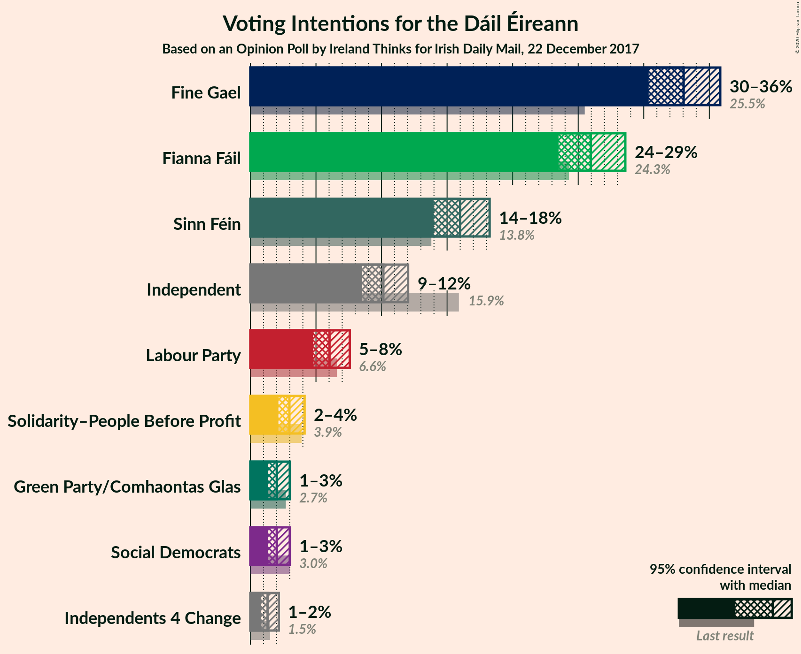
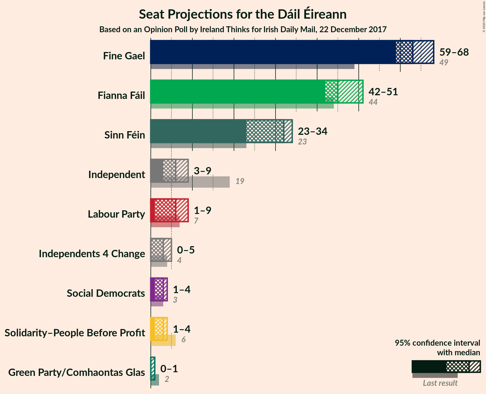
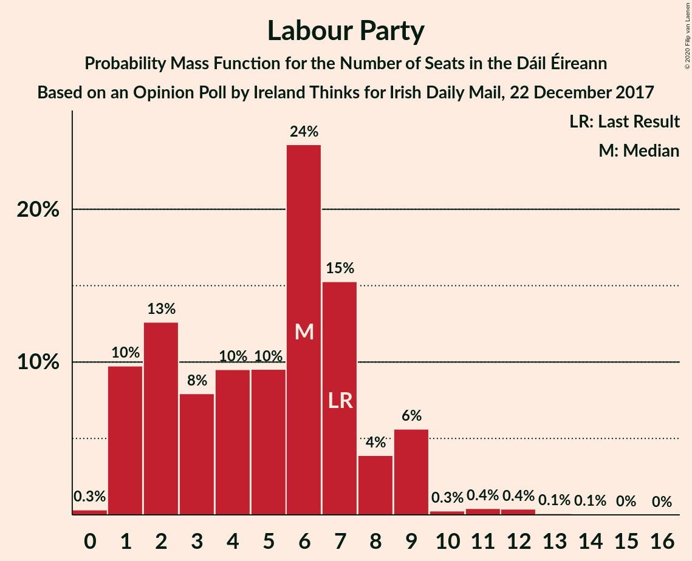
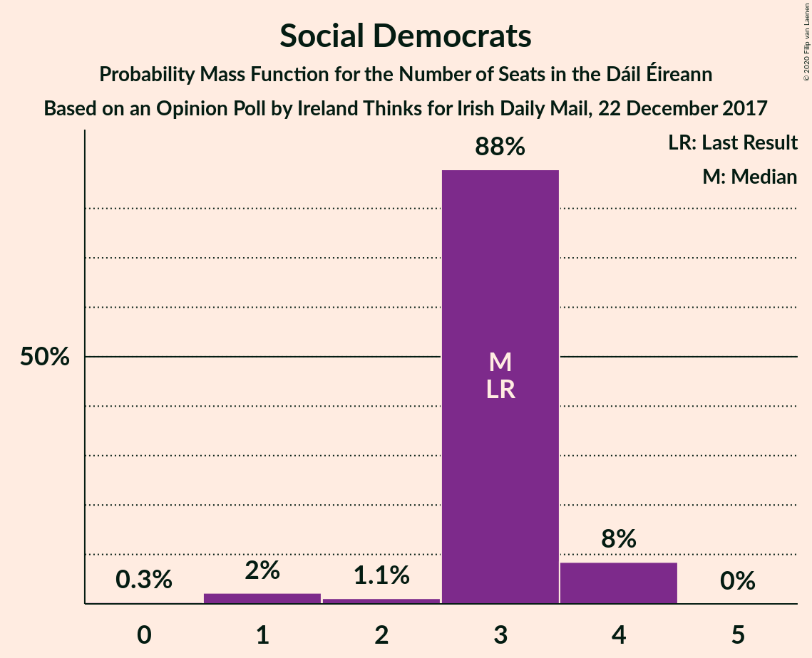
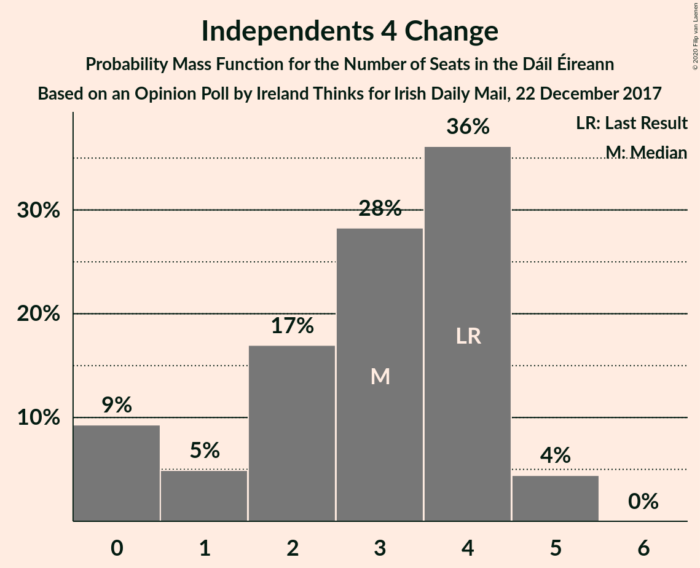
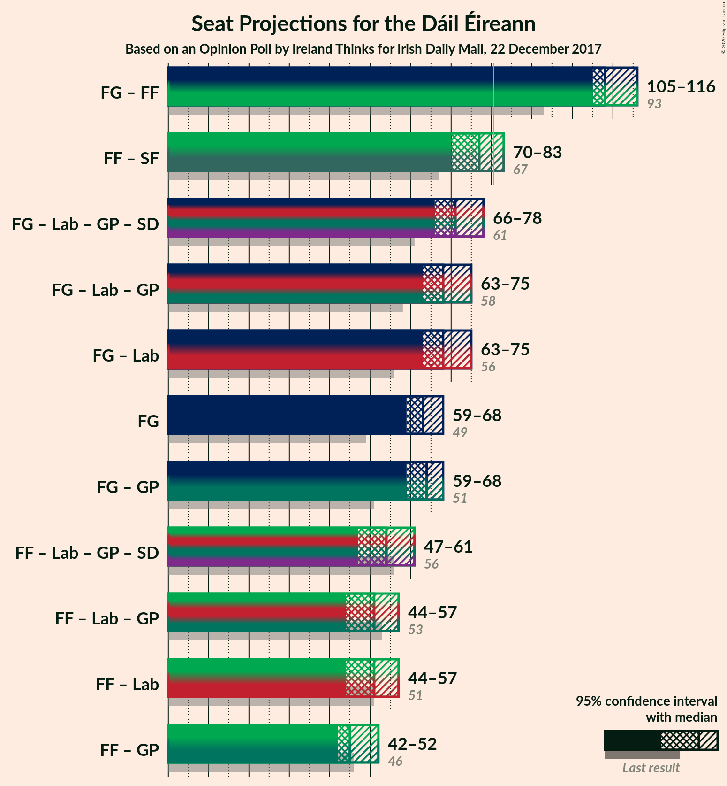
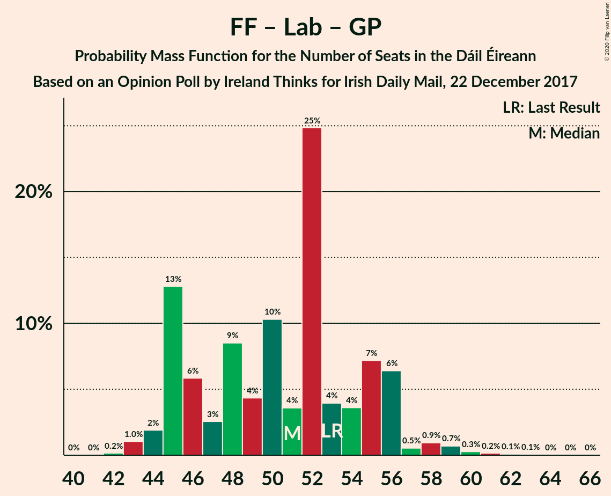

# Opinion Poll by Ireland Thinks for Irish Daily Mail, 22 December 2017

<a href="#voting-intentions">Voting Intentions</a> | <a href="#seats">Seats</a> | <a href="#coalitions">Coalitions</a> | <a href="#technical-information">Technical Information</a>

## Voting Intentions

### Confidence Intervals

| Party | Last Result | Poll Result | 80% Confidence Interval | 90% Confidence Interval | 95% Confidence Interval | 99% Confidence Interval |
|:-----:|:-----------:|:-----------:|:-----------------------:|:-----------------------:|:-----------------------:|:-----------------------:|
| Fine Gael | 25.5% | 33.0% | 31.3–34.9% |30.8–35.4% |30.4–35.8% |29.5–36.7% |
| Fianna Fáil | 24.3% | 26.0% | 24.3–27.7% |23.9–28.2% |23.5–28.6% |22.7–29.4% |
| Sinn Féin | 13.8% | 16.0% | 14.7–17.5% |14.3–17.9% |14.0–18.2% |13.4–19.0% |
| Independent | 15.9% | 10.1% | 9.1–11.4% |8.8–11.7% |8.5–12.0% |8.0–12.7% |
| Labour Party | 6.6% | 6.0% | 5.2–7.0% |5.0–7.3% |4.8–7.6% |4.4–8.1% |
| Solidarity–People Before Profit | 3.9% | 3.0% | 2.4–3.7% |2.3–3.9% |2.1–4.1% |1.9–4.5% |
| Social Democrats | 3.0% | 2.0% | 1.6–2.7% |1.4–2.8% |1.3–3.0% |1.2–3.4% |
| Green Party/Comhaontas Glas | 2.7% | 2.0% | 1.6–2.7% |1.4–2.8% |1.3–3.0% |1.2–3.4% |
| Independents 4 Change | 1.5% | 1.3% | 1.0–1.9% |0.9–2.0% |0.8–2.2% |0.7–2.5% |

*Note:* The poll result column reflects the actual value used in the calculations. Published results may vary slightly, and in addition be rounded to fewer digits.

## Seats

### Confidence Intervals

| Party | Last Result | Median | 80% Confidence Interval | 90% Confidence Interval | 95% Confidence Interval | 99% Confidence Interval |
|:-----:|:-----------:|:------:|:-----------------------:|:-----------------------:|:-----------------------:|:-----------------------:|
| <a href="#fine-gael">Fine Gael</a> | 49 | 61 | 61–66 |61–66 |60–67 |58–69 |
| <a href="#fianna-fáil">Fianna Fáil</a> | 44 | 46 | 44–50 |42–51 |42–51 |41–52 |
| <a href="#sinn-féin">Sinn Féin</a> | 23 | 31 | 27–32 |26–33 |26–33 |22–34 |
| <a href="#independent">Independent</a> | 19 | 7 | 5–7 |3–7 |3–8 |3–10 |
| <a href="#labour-party">Labour Party</a> | 7 | 6 | 1–6 |1–9 |1–9 |0–11 |
| <a href="#solidarity–people-before-profit">Solidarity–People Before Profit</a> | 6 | 3 | 3–4 |3–4 |3–4 |2–6 |
| <a href="#social-democrats">Social Democrats</a> | 3 | 3 | 3 |3 |3 |1–4 |
| <a href="#green-party/comhaontas-glas">Green Party/Comhaontas Glas</a> | 2 | 0 | 0 |0–1 |0–1 |0–1 |
| <a href="#independents-4-change">Independents 4 Change</a> | 4 | 3 | 3–4 |1–4 |0–5 |0–5 |

### Fine Gael

*For a full overview of the results for this party, see the [Fine Gael](party-finegael.html) page.*

| Number of Seats | Probability | Accumulated | Special Marks |
|:---------------:|:-----------:|:-----------:|:-------------:|
| 49 | 0% | 100% | Last Result |
| 50 | 0% | 100% |  |
| 51 | 0% | 100% |  |
| 52 | 0% | 100% |  |
| 53 | 0% | 100% |  |
| 54 | 0% | 100% |  |
| 55 | 0% | 100% |  |
| 56 | 0.1% | 99.9% |  |
| 57 | 0.1% | 99.9% |  |
| 58 | 0.4% | 99.8% |  |
| 59 | 0.3% | 99.4% |  |
| 60 | 3% | 99.1% |  |
| 61 | 47% | 96% | Median |
| 62 | 7% | 49% |  |
| 63 | 7% | 42% |  |
| 64 | 2% | 35% |  |
| 65 | 3% | 33% |  |
| 66 | 25% | 30% |  |
| 67 | 3% | 5% |  |
| 68 | 0.6% | 2% |  |
| 69 | 1.0% | 1.2% |  |
| 70 | 0.1% | 0.1% |  |
| 71 | 0% | 0% |  |

### Fianna Fáil

*For a full overview of the results for this party, see the [Fianna Fáil](party-fiannafáil.html) page.*

| Number of Seats | Probability | Accumulated | Special Marks |
|:---------------:|:-----------:|:-----------:|:-------------:|
| 38 | 0% | 100% |  |
| 39 | 0% | 99.9% |  |
| 40 | 0.3% | 99.9% |  |
| 41 | 0.7% | 99.6% |  |
| 42 | 5% | 98.9% |  |
| 43 | 2% | 94% |  |
| 44 | 23% | 91% | Last Result |
| 45 | 2% | 69% |  |
| 46 | 52% | 66% | Median |
| 47 | 2% | 15% |  |
| 48 | 0.6% | 13% |  |
| 49 | 2% | 12% |  |
| 50 | 3% | 10% |  |
| 51 | 6% | 8% |  |
| 52 | 1.3% | 2% |  |
| 53 | 0.2% | 0.5% |  |
| 54 | 0.2% | 0.3% |  |
| 55 | 0.1% | 0.2% |  |
| 56 | 0% | 0% |  |

### Sinn Féin

*For a full overview of the results for this party, see the [Sinn Féin](party-sinnféin.html) page.*

| Number of Seats | Probability | Accumulated | Special Marks |
|:---------------:|:-----------:|:-----------:|:-------------:|
| 21 | 0.2% | 100% |  |
| 22 | 0.8% | 99.8% |  |
| 23 | 0.1% | 99.0% | Last Result |
| 24 | 0.6% | 98.9% |  |
| 25 | 0.5% | 98% |  |
| 26 | 3% | 98% |  |
| 27 | 5% | 95% |  |
| 28 | 7% | 90% |  |
| 29 | 0.3% | 83% |  |
| 30 | 22% | 82% |  |
| 31 | 50% | 60% | Median |
| 32 | 2% | 10% |  |
| 33 | 6% | 8% |  |
| 34 | 2% | 2% |  |
| 35 | 0.2% | 0.3% |  |
| 36 | 0.1% | 0.1% |  |
| 37 | 0% | 0% |  |

### Independent

*For a full overview of the results for this party, see the [Independent](party-independent.html) page.*

| Number of Seats | Probability | Accumulated | Special Marks |
|:---------------:|:-----------:|:-----------:|:-------------:|
| 3 | 7% | 100% |  |
| 4 | 2% | 93% |  |
| 5 | 6% | 91% |  |
| 6 | 11% | 85% |  |
| 7 | 70% | 75% | Median |
| 8 | 2% | 4% |  |
| 9 | 2% | 2% |  |
| 10 | 0.1% | 0.6% |  |
| 11 | 0.1% | 0.5% |  |
| 12 | 0.3% | 0.4% |  |
| 13 | 0% | 0.1% |  |
| 14 | 0.1% | 0.1% |  |
| 15 | 0% | 0% |  |
| 16 | 0% | 0% |  |
| 17 | 0% | 0% |  |
| 18 | 0% | 0% |  |
| 19 | 0% | 0% | Last Result |

### Labour Party

*For a full overview of the results for this party, see the [Labour Party](party-labourparty.html) page.*

| Number of Seats | Probability | Accumulated | Special Marks |
|:---------------:|:-----------:|:-----------:|:-------------:|
| 0 | 0.6% | 100% |  |
| 1 | 25% | 99.4% |  |
| 2 | 2% | 74% |  |
| 3 | 4% | 73% |  |
| 4 | 7% | 68% |  |
| 5 | 2% | 61% |  |
| 6 | 49% | 59% | Median |
| 7 | 1.5% | 10% | Last Result |
| 8 | 1.5% | 8% |  |
| 9 | 6% | 7% |  |
| 10 | 0% | 1.1% |  |
| 11 | 0.9% | 1.1% |  |
| 12 | 0.1% | 0.2% |  |
| 13 | 0% | 0.1% |  |
| 14 | 0% | 0% |  |

### Solidarity–People Before Profit

*For a full overview of the results for this party, see the [Solidarity–People Before Profit](party-solidarity–peoplebeforeprofit.html) page.*

| Number of Seats | Probability | Accumulated | Special Marks |
|:---------------:|:-----------:|:-----------:|:-------------:|
| 0 | 0.1% | 100% |  |
| 1 | 0.4% | 99.9% |  |
| 2 | 1.0% | 99.5% |  |
| 3 | 65% | 98.6% | Median |
| 4 | 32% | 34% |  |
| 5 | 0.4% | 2% |  |
| 6 | 1.2% | 1.2% | Last Result |
| 7 | 0% | 0% |  |

### Social Democrats

*For a full overview of the results for this party, see the [Social Democrats](party-socialdemocrats.html) page.*

| Number of Seats | Probability | Accumulated | Special Marks |
|:---------------:|:-----------:|:-----------:|:-------------:|
| 0 | 0.3% | 100% |  |
| 1 | 1.0% | 99.7% |  |
| 2 | 0.3% | 98.7% |  |
| 3 | 96% | 98% | Last Result, Median |
| 4 | 2% | 2% |  |
| 5 | 0% | 0% |  |

### Green Party/Comhaontas Glas

*For a full overview of the results for this party, see the [Green Party/Comhaontas Glas](party-greenpartycomhaontasglas.html) page.*

| Number of Seats | Probability | Accumulated | Special Marks |
|:---------------:|:-----------:|:-----------:|:-------------:|
| 0 | 94% | 100% | Median |
| 1 | 6% | 6% |  |
| 2 | 0.1% | 0.1% | Last Result |
| 3 | 0% | 0% |  |

### Independents 4 Change

*For a full overview of the results for this party, see the [Independents 4 Change](party-independents4change.html) page.*

| Number of Seats | Probability | Accumulated | Special Marks |
|:---------------:|:-----------:|:-----------:|:-------------:|
| 0 | 5% | 100% |  |
| 1 | 1.3% | 95% |  |
| 2 | 2% | 94% |  |
| 3 | 52% | 92% | Median |
| 4 | 35% | 39% | Last Result |
| 5 | 4% | 4% |  |
| 6 | 0% | 0% |  |

## Coalitions

### Confidence Intervals

| Coalition | Last Result | Median | Majority? | 80% Confidence Interval | 90% Confidence Interval | 95% Confidence Interval | 99% Confidence Interval |
|:---------:|:-----------:|:------:|:---------:|:-----------------------:|:-----------------------:|:-----------------------:|:-----------------------:|
| Fine Gael – Fianna Fáil | 93 | 107 | 100% | 107–112 | 107–114 | 106–114 | 102–120 |
| Fianna Fáil – Sinn Féin | 67 | 77 | 2% | 74–78 | 73–79 | 73–80 | 68–83 |
| Fine Gael – Labour Party – Green Party/Comhaontas Glas – Social Democrats | 61 | 70 | 0.2% | 70–74 | 69–75 | 66–76 | 65–79 |
| Fine Gael – Labour Party – Green Party/Comhaontas Glas | 58 | 67 | 0% | 67–71 | 66–72 | 63–73 | 62–76 |
| Fine Gael – Labour Party | 56 | 67 | 0% | 67–71 | 66–72 | 63–73 | 62–76 |
| Fine Gael | 49 | 61 | 0% | 61–66 | 61–66 | 60–67 | 58–69 |
| Fine Gael – Green Party/Comhaontas Glas | 51 | 61 | 0% | 61–66 | 61–67 | 60–67 | 58–69 |
| Fianna Fáil – Labour Party – Green Party/Comhaontas Glas – Social Democrats | 56 | 55 | 0% | 48–58 | 48–59 | 48–59 | 46–63 |
| Fianna Fáil – Labour Party – Green Party/Comhaontas Glas | 53 | 52 | 0% | 45–55 | 45–56 | 45–56 | 43–60 |
| Fianna Fáil – Labour Party | 51 | 52 | 0% | 45–55 | 45–55 | 45–55 | 43–60 |
| Fianna Fáil – Green Party/Comhaontas Glas | 46 | 46 | 0% | 44–50 | 42–52 | 42–52 | 41–52 |

### Fine Gael – Fianna Fáil

| Number of Seats | Probability | Accumulated | Special Marks |
|:---------------:|:-----------:|:-----------:|:-------------:|
| 93 | 0% | 100% | Last Result |
| 94 | 0% | 100% |  |
| 95 | 0% | 100% |  |
| 96 | 0% | 100% |  |
| 97 | 0% | 100% |  |
| 98 | 0% | 100% |  |
| 99 | 0% | 100% |  |
| 100 | 0% | 100% |  |
| 101 | 0.1% | 100% |  |
| 102 | 0.7% | 99.9% |  |
| 103 | 0.1% | 99.2% |  |
| 104 | 0.2% | 99.1% |  |
| 105 | 0.7% | 98.9% |  |
| 106 | 2% | 98% |  |
| 107 | 49% | 97% | Median |
| 108 | 8% | 47% |  |
| 109 | 2% | 40% |  |
| 110 | 23% | 38% |  |
| 111 | 2% | 15% |  |
| 112 | 3% | 13% |  |
| 113 | 0.9% | 10% |  |
| 114 | 7% | 9% |  |
| 115 | 0.9% | 2% |  |
| 116 | 0.2% | 1.1% |  |
| 117 | 0% | 0.9% |  |
| 118 | 0.1% | 0.9% |  |
| 119 | 0.1% | 0.8% |  |
| 120 | 0.7% | 0.7% |  |
| 121 | 0% | 0% |  |

### Fianna Fáil – Sinn Féin

| Number of Seats | Probability | Accumulated | Special Marks |
|:---------------:|:-----------:|:-----------:|:-------------:|
| 66 | 0% | 100% |  |
| 67 | 0.1% | 99.9% | Last Result |
| 68 | 0.7% | 99.9% |  |
| 69 | 0.1% | 99.2% |  |
| 70 | 0.6% | 99.1% |  |
| 71 | 0.3% | 98% |  |
| 72 | 0.5% | 98% |  |
| 73 | 3% | 98% |  |
| 74 | 28% | 94% |  |
| 75 | 3% | 67% |  |
| 76 | 5% | 63% |  |
| 77 | 47% | 58% | Median |
| 78 | 5% | 11% |  |
| 79 | 0.9% | 6% |  |
| 80 | 3% | 5% |  |
| 81 | 0.3% | 2% | Majority |
| 82 | 0.3% | 2% |  |
| 83 | 1.3% | 2% |  |
| 84 | 0.1% | 0.3% |  |
| 85 | 0.2% | 0.2% |  |
| 86 | 0% | 0.1% |  |
| 87 | 0.1% | 0.1% |  |
| 88 | 0% | 0% |  |

### Fine Gael – Labour Party – Green Party/Comhaontas Glas – Social Democrats

| Number of Seats | Probability | Accumulated | Special Marks |
|:---------------:|:-----------:|:-----------:|:-------------:|
| 61 | 0% | 100% | Last Result |
| 62 | 0% | 100% |  |
| 63 | 0.1% | 99.9% |  |
| 64 | 0.2% | 99.9% |  |
| 65 | 1.2% | 99.7% |  |
| 66 | 2% | 98% |  |
| 67 | 0.3% | 96% |  |
| 68 | 0.4% | 96% |  |
| 69 | 1.1% | 96% |  |
| 70 | 70% | 94% | Median |
| 71 | 8% | 24% |  |
| 72 | 4% | 16% |  |
| 73 | 0.2% | 13% |  |
| 74 | 7% | 13% |  |
| 75 | 3% | 5% |  |
| 76 | 0.7% | 3% |  |
| 77 | 0.4% | 2% |  |
| 78 | 0.2% | 1.5% |  |
| 79 | 0.9% | 1.2% |  |
| 80 | 0.1% | 0.3% |  |
| 81 | 0% | 0.2% | Majority |
| 82 | 0% | 0.2% |  |
| 83 | 0.2% | 0.2% |  |
| 84 | 0% | 0% |  |

### Fine Gael – Labour Party – Green Party/Comhaontas Glas

| Number of Seats | Probability | Accumulated | Special Marks |
|:---------------:|:-----------:|:-----------:|:-------------:|
| 58 | 0% | 100% | Last Result |
| 59 | 0% | 100% |  |
| 60 | 0.1% | 99.9% |  |
| 61 | 0.1% | 99.9% |  |
| 62 | 1.2% | 99.8% |  |
| 63 | 2% | 98.6% |  |
| 64 | 0.3% | 96% |  |
| 65 | 0.4% | 96% |  |
| 66 | 1.2% | 96% |  |
| 67 | 71% | 94% | Median |
| 68 | 7% | 23% |  |
| 69 | 3% | 16% |  |
| 70 | 0.2% | 13% |  |
| 71 | 8% | 13% |  |
| 72 | 3% | 5% |  |
| 73 | 0.7% | 3% |  |
| 74 | 0.6% | 2% |  |
| 75 | 0.3% | 2% |  |
| 76 | 0.9% | 1.2% |  |
| 77 | 0.1% | 0.3% |  |
| 78 | 0% | 0.2% |  |
| 79 | 0% | 0.2% |  |
| 80 | 0.1% | 0.1% |  |
| 81 | 0% | 0% | Majority |

### Fine Gael – Labour Party

| Number of Seats | Probability | Accumulated | Special Marks |
|:---------------:|:-----------:|:-----------:|:-------------:|
| 56 | 0% | 100% | Last Result |
| 57 | 0% | 100% |  |
| 58 | 0% | 100% |  |
| 59 | 0% | 100% |  |
| 60 | 0.1% | 99.9% |  |
| 61 | 0.1% | 99.9% |  |
| 62 | 1.3% | 99.8% |  |
| 63 | 3% | 98.5% |  |
| 64 | 0.2% | 96% |  |
| 65 | 0.3% | 96% |  |
| 66 | 1.4% | 96% |  |
| 67 | 76% | 94% | Median |
| 68 | 2% | 18% |  |
| 69 | 3% | 16% |  |
| 70 | 0.2% | 13% |  |
| 71 | 8% | 13% |  |
| 72 | 3% | 5% |  |
| 73 | 0.7% | 3% |  |
| 74 | 0.4% | 2% |  |
| 75 | 0.5% | 1.5% |  |
| 76 | 0.7% | 1.0% |  |
| 77 | 0.1% | 0.3% |  |
| 78 | 0% | 0.2% |  |
| 79 | 0% | 0.2% |  |
| 80 | 0.1% | 0.1% |  |
| 81 | 0% | 0% | Majority |

### Fine Gael

| Number of Seats | Probability | Accumulated | Special Marks |
|:---------------:|:-----------:|:-----------:|:-------------:|
| 49 | 0% | 100% | Last Result |
| 50 | 0% | 100% |  |
| 51 | 0% | 100% |  |
| 52 | 0% | 100% |  |
| 53 | 0% | 100% |  |
| 54 | 0% | 100% |  |
| 55 | 0% | 100% |  |
| 56 | 0.1% | 99.9% |  |
| 57 | 0.1% | 99.9% |  |
| 58 | 0.4% | 99.8% |  |
| 59 | 0.3% | 99.4% |  |
| 60 | 3% | 99.1% |  |
| 61 | 47% | 96% | Median |
| 62 | 7% | 49% |  |
| 63 | 7% | 42% |  |
| 64 | 2% | 35% |  |
| 65 | 3% | 33% |  |
| 66 | 25% | 30% |  |
| 67 | 3% | 5% |  |
| 68 | 0.6% | 2% |  |
| 69 | 1.0% | 1.2% |  |
| 70 | 0.1% | 0.1% |  |
| 71 | 0% | 0% |  |

### Fine Gael – Green Party/Comhaontas Glas

| Number of Seats | Probability | Accumulated | Special Marks |
|:---------------:|:-----------:|:-----------:|:-------------:|
| 51 | 0% | 100% | Last Result |
| 52 | 0% | 100% |  |
| 53 | 0% | 100% |  |
| 54 | 0% | 100% |  |
| 55 | 0% | 100% |  |
| 56 | 0.1% | 99.9% |  |
| 57 | 0% | 99.9% |  |
| 58 | 0.4% | 99.8% |  |
| 59 | 0.3% | 99.4% |  |
| 60 | 3% | 99.1% |  |
| 61 | 48% | 96% | Median |
| 62 | 6% | 49% |  |
| 63 | 2% | 42% |  |
| 64 | 7% | 40% |  |
| 65 | 3% | 33% |  |
| 66 | 25% | 30% |  |
| 67 | 3% | 5% |  |
| 68 | 0.9% | 2% |  |
| 69 | 1.0% | 1.2% |  |
| 70 | 0.2% | 0.3% |  |
| 71 | 0% | 0.1% |  |
| 72 | 0% | 0% |  |

### Fianna Fáil – Labour Party – Green Party/Comhaontas Glas – Social Democrats

| Number of Seats | Probability | Accumulated | Special Marks |
|:---------------:|:-----------:|:-----------:|:-------------:|
| 45 | 0% | 100% |  |
| 46 | 0.9% | 99.9% |  |
| 47 | 0.6% | 99.1% |  |
| 48 | 23% | 98.5% |  |
| 49 | 1.1% | 75% |  |
| 50 | 2% | 74% |  |
| 51 | 3% | 72% |  |
| 52 | 0.9% | 69% |  |
| 53 | 2% | 68% |  |
| 54 | 2% | 66% |  |
| 55 | 46% | 64% | Median |
| 56 | 4% | 18% | Last Result |
| 57 | 0.7% | 14% |  |
| 58 | 7% | 14% |  |
| 59 | 5% | 7% |  |
| 60 | 0.2% | 2% |  |
| 61 | 0.7% | 2% |  |
| 62 | 0.1% | 1.1% |  |
| 63 | 0.7% | 1.0% |  |
| 64 | 0.2% | 0.3% |  |
| 65 | 0% | 0.1% |  |
| 66 | 0% | 0.1% |  |
| 67 | 0.1% | 0.1% |  |
| 68 | 0% | 0% |  |

### Fianna Fáil – Labour Party – Green Party/Comhaontas Glas

| Number of Seats | Probability | Accumulated | Special Marks |
|:---------------:|:-----------:|:-----------:|:-------------:|
| 42 | 0% | 100% |  |
| 43 | 0.9% | 99.9% |  |
| 44 | 0.6% | 99.1% |  |
| 45 | 24% | 98% |  |
| 46 | 0.3% | 74% |  |
| 47 | 2% | 74% |  |
| 48 | 3% | 72% |  |
| 49 | 1.0% | 70% |  |
| 50 | 3% | 69% |  |
| 51 | 2% | 66% |  |
| 52 | 46% | 64% | Median |
| 53 | 4% | 18% | Last Result |
| 54 | 0.7% | 14% |  |
| 55 | 6% | 14% |  |
| 56 | 5% | 7% |  |
| 57 | 0.2% | 2% |  |
| 58 | 0.9% | 2% |  |
| 59 | 0% | 1.1% |  |
| 60 | 0.7% | 1.1% |  |
| 61 | 0.1% | 0.3% |  |
| 62 | 0.2% | 0.2% |  |
| 63 | 0% | 0.1% |  |
| 64 | 0.1% | 0.1% |  |
| 65 | 0% | 0% |  |

### Fianna Fáil – Labour Party

| Number of Seats | Probability | Accumulated | Special Marks |
|:---------------:|:-----------:|:-----------:|:-------------:|
| 42 | 0.2% | 100% |  |
| 43 | 0.8% | 99.8% |  |
| 44 | 0.7% | 99.1% |  |
| 45 | 24% | 98% |  |
| 46 | 0.3% | 74% |  |
| 47 | 2% | 74% |  |
| 48 | 3% | 72% |  |
| 49 | 0.9% | 70% |  |
| 50 | 3% | 69% |  |
| 51 | 2% | 66% | Last Result |
| 52 | 46% | 64% | Median |
| 53 | 3% | 18% |  |
| 54 | 0.7% | 14% |  |
| 55 | 11% | 14% |  |
| 56 | 0.2% | 2% |  |
| 57 | 0.2% | 2% |  |
| 58 | 0.8% | 2% |  |
| 59 | 0% | 1.1% |  |
| 60 | 0.8% | 1.1% |  |
| 61 | 0.1% | 0.3% |  |
| 62 | 0.1% | 0.2% |  |
| 63 | 0% | 0.1% |  |
| 64 | 0.1% | 0.1% |  |
| 65 | 0% | 0% |  |

### Fianna Fáil – Green Party/Comhaontas Glas

| Number of Seats | Probability | Accumulated | Special Marks |
|:---------------:|:-----------:|:-----------:|:-------------:|
| 38 | 0% | 100% |  |
| 39 | 0% | 99.9% |  |
| 40 | 0.3% | 99.9% |  |
| 41 | 0.6% | 99.6% |  |
| 42 | 5% | 99.0% |  |
| 43 | 2% | 94% |  |
| 44 | 22% | 91% |  |
| 45 | 3% | 69% |  |
| 46 | 52% | 67% | Last Result, Median |
| 47 | 2% | 15% |  |
| 48 | 1.0% | 13% |  |
| 49 | 2% | 12% |  |
| 50 | 3% | 11% |  |
| 51 | 1.1% | 8% |  |
| 52 | 6% | 7% |  |
| 53 | 0.1% | 0.5% |  |
| 54 | 0.2% | 0.4% |  |
| 55 | 0.2% | 0.2% |  |
| 56 | 0% | 0% |  |

## Technical Information

### Opinion Poll

+ **Polling firm:** Ireland Thinks
+ **Commissioner(s):** Irish Daily Mail
+ **Fieldwork period:** 22 December 2017

### Calculations

+ **Sample size:** 1144
+ **Simulations done:** 131,072
+ **Error estimate:** 2.30%

