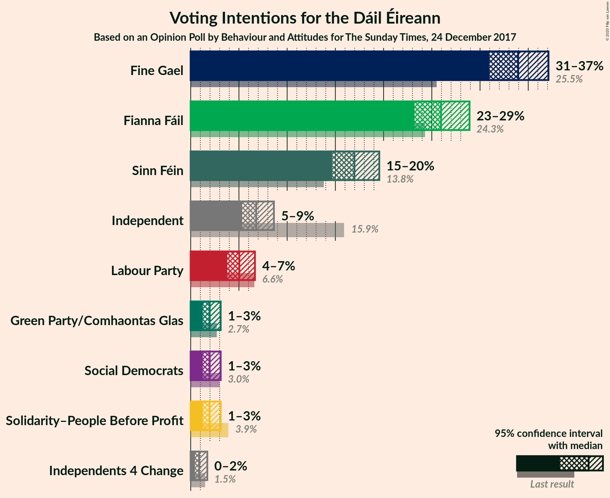
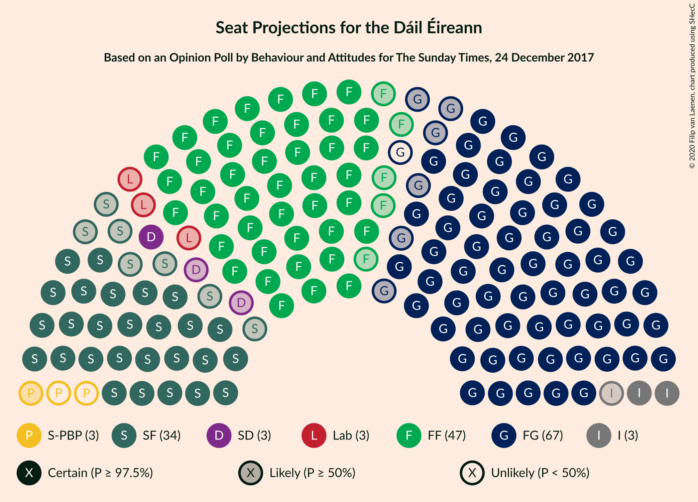
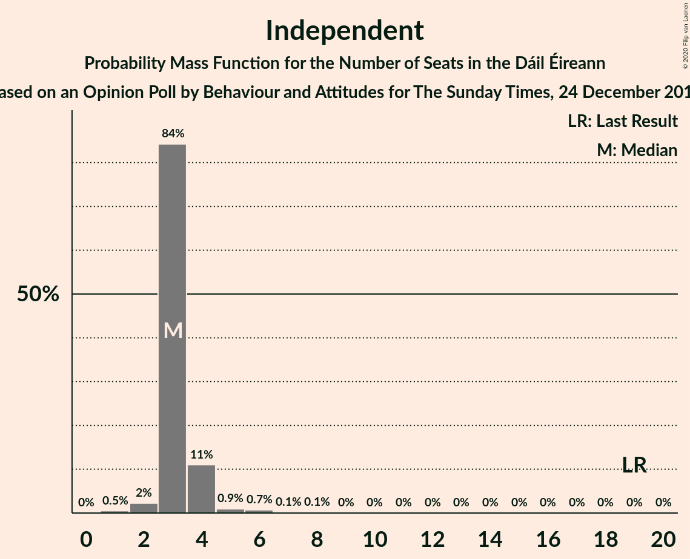

# Opinion Poll by Behaviour and Attitudes for The Sunday Times, 24 December 2017

<a href="#voting-intentions">Voting Intentions</a> | <a href="#seats">Seats</a> | <a href="#coalitions">Coalitions</a> | <a href="#technical-information">Technical Information</a>

## Voting Intentions

### Confidence Intervals

| Party | Last Result | Poll Result | 80% Confidence Interval | 90% Confidence Interval | 95% Confidence Interval | 99% Confidence Interval |
|:-----:|:-----------:|:-----------:|:-----------------------:|:-----------------------:|:-----------------------:|:-----------------------:|
| Fine Gael | 25.5% | 34.0% | 32.0–36.0% |31.4–36.6% |31.0–37.1% |30.0–38.1% |
| Fianna Fáil | 24.3% | 26.0% | 24.2–27.9% |23.7–28.4% |23.2–28.9% |22.4–29.8% |
| Sinn Féin | 13.8% | 17.0% | 15.5–18.7% |15.0–19.1% |14.7–19.6% |14.0–20.4% |
| Independent | 15.9% | 6.8% | 5.8–8.0% |5.6–8.3% |5.3–8.6% |4.9–9.2% |
| Labour Party | 6.6% | 5.0% | 4.2–6.1% |4.0–6.4% |3.8–6.7% |3.4–7.2% |
| Solidarity–People Before Profit | 3.9% | 2.0% | 1.5–2.7% |1.4–2.9% |1.2–3.1% |1.1–3.5% |
| Social Democrats | 3.0% | 2.0% | 1.5–2.7% |1.4–2.9% |1.2–3.1% |1.1–3.5% |
| Green Party/Comhaontas Glas | 2.7% | 2.0% | 1.5–2.7% |1.4–2.9% |1.2–3.1% |1.1–3.5% |
| Independents 4 Change | 1.5% | 0.9% | 0.6–1.4% |0.5–1.6% |0.4–1.7% |0.3–2.0% |

*Note:* The poll result column reflects the actual value used in the calculations. Published results may vary slightly, and in addition be rounded to fewer digits.

## Seats

### Confidence Intervals

| Party | Last Result | Median | 80% Confidence Interval | 90% Confidence Interval | 95% Confidence Interval | 99% Confidence Interval |
|:-----:|:-----------:|:------:|:-----------------------:|:-----------------------:|:-----------------------:|:-----------------------:|
| <a href="#fine-gael">Fine Gael</a> | 49 | 67 | 62–69 |60–69 |59–70 |58–71 |
| <a href="#fianna-fáil">Fianna Fáil</a> | 44 | 48 | 43–52 |43–53 |42–54 |41–55 |
| <a href="#sinn-féin">Sinn Féin</a> | 23 | 35 | 31–37 |29–37 |27–37 |25–39 |
| <a href="#independent">Independent</a> | 19 | 3 | 3–4 |3–4 |2–4 |2–5 |
| <a href="#labour-party">Labour Party</a> | 7 | 2 | 1–6 |0–7 |0–8 |0–8 |
| <a href="#solidarity–people-before-profit">Solidarity–People Before Profit</a> | 6 | 1 | 0–3 |0–3 |0–4 |0–4 |
| <a href="#social-democrats">Social Democrats</a> | 3 | 3 | 3–4 |3–4 |2–4 |0–5 |
| <a href="#green-party/comhaontas-glas">Green Party/Comhaontas Glas</a> | 2 | 0 | 0 |0–2 |0–2 |0–3 |
| <a href="#independents-4-change">Independents 4 Change</a> | 4 | 0 | 0–4 |0–4 |0–4 |0–4 |

### Fine Gael

*For a full overview of the results for this party, see the [Fine Gael](party-finegael.html) page.*

| Number of Seats | Probability | Accumulated | Special Marks |
|:---------------:|:-----------:|:-----------:|:-------------:|
| 49 | 0% | 100% | Last Result |
| 50 | 0% | 100% |  |
| 51 | 0% | 100% |  |
| 52 | 0% | 100% |  |
| 53 | 0% | 100% |  |
| 54 | 0% | 100% |  |
| 55 | 0% | 100% |  |
| 56 | 0% | 100% |  |
| 57 | 0.1% | 100% |  |
| 58 | 2% | 99.9% |  |
| 59 | 1.2% | 98% |  |
| 60 | 3% | 97% |  |
| 61 | 2% | 94% |  |
| 62 | 8% | 92% |  |
| 63 | 3% | 84% |  |
| 64 | 2% | 81% |  |
| 65 | 3% | 79% |  |
| 66 | 9% | 76% |  |
| 67 | 43% | 67% | Median |
| 68 | 4% | 24% |  |
| 69 | 17% | 21% |  |
| 70 | 3% | 4% |  |
| 71 | 0.3% | 0.5% |  |
| 72 | 0.1% | 0.2% |  |
| 73 | 0.1% | 0.1% |  |
| 74 | 0% | 0% |  |

### Fianna Fáil

*For a full overview of the results for this party, see the [Fianna Fáil](party-fiannafáil.html) page.*

| Number of Seats | Probability | Accumulated | Special Marks |
|:---------------:|:-----------:|:-----------:|:-------------:|
| 39 | 0.1% | 100% |  |
| 40 | 0.1% | 99.9% |  |
| 41 | 0.6% | 99.8% |  |
| 42 | 3% | 99.2% |  |
| 43 | 9% | 96% |  |
| 44 | 4% | 87% | Last Result |
| 45 | 4% | 83% |  |
| 46 | 26% | 80% |  |
| 47 | 3% | 53% |  |
| 48 | 18% | 51% | Median |
| 49 | 2% | 33% |  |
| 50 | 14% | 31% |  |
| 51 | 3% | 17% |  |
| 52 | 9% | 14% |  |
| 53 | 2% | 5% |  |
| 54 | 1.3% | 3% |  |
| 55 | 1.2% | 2% |  |
| 56 | 0.4% | 0.5% |  |
| 57 | 0.1% | 0.1% |  |
| 58 | 0% | 0% |  |

### Sinn Féin

*For a full overview of the results for this party, see the [Sinn Féin](party-sinnféin.html) page.*

| Number of Seats | Probability | Accumulated | Special Marks |
|:---------------:|:-----------:|:-----------:|:-------------:|
| 22 | 0.1% | 100% |  |
| 23 | 0% | 99.9% | Last Result |
| 24 | 0.1% | 99.9% |  |
| 25 | 2% | 99.8% |  |
| 26 | 0.1% | 98% |  |
| 27 | 0.6% | 98% |  |
| 28 | 2% | 97% |  |
| 29 | 1.3% | 96% |  |
| 30 | 3% | 95% |  |
| 31 | 3% | 92% |  |
| 32 | 12% | 89% |  |
| 33 | 12% | 77% |  |
| 34 | 14% | 65% |  |
| 35 | 28% | 51% | Median |
| 36 | 10% | 23% |  |
| 37 | 12% | 13% |  |
| 38 | 0.6% | 1.1% |  |
| 39 | 0.2% | 0.6% |  |
| 40 | 0.3% | 0.4% |  |
| 41 | 0% | 0% |  |

### Independent

*For a full overview of the results for this party, see the [Independent](party-independent.html) page.*

| Number of Seats | Probability | Accumulated | Special Marks |
|:---------------:|:-----------:|:-----------:|:-------------:|
| 1 | 0.2% | 100% |  |
| 2 | 3% | 99.8% |  |
| 3 | 65% | 97% | Median |
| 4 | 30% | 32% |  |
| 5 | 1.5% | 2% |  |
| 6 | 0.1% | 0.2% |  |
| 7 | 0.1% | 0.2% |  |
| 8 | 0% | 0% |  |
| 9 | 0% | 0% |  |
| 10 | 0% | 0% |  |
| 11 | 0% | 0% |  |
| 12 | 0% | 0% |  |
| 13 | 0% | 0% |  |
| 14 | 0% | 0% |  |
| 15 | 0% | 0% |  |
| 16 | 0% | 0% |  |
| 17 | 0% | 0% |  |
| 18 | 0% | 0% |  |
| 19 | 0% | 0% | Last Result |

### Labour Party

*For a full overview of the results for this party, see the [Labour Party](party-labourparty.html) page.*

| Number of Seats | Probability | Accumulated | Special Marks |
|:---------------:|:-----------:|:-----------:|:-------------:|
| 0 | 5% | 100% |  |
| 1 | 28% | 95% |  |
| 2 | 26% | 67% | Median |
| 3 | 12% | 41% |  |
| 4 | 6% | 29% |  |
| 5 | 4% | 23% |  |
| 6 | 10% | 19% |  |
| 7 | 5% | 9% | Last Result |
| 8 | 4% | 4% |  |
| 9 | 0.1% | 0.3% |  |
| 10 | 0% | 0.2% |  |
| 11 | 0.1% | 0.2% |  |
| 12 | 0% | 0% |  |

### Solidarity–People Before Profit

*For a full overview of the results for this party, see the [Solidarity–People Before Profit](party-solidarity–peoplebeforeprofit.html) page.*

| Number of Seats | Probability | Accumulated | Special Marks |
|:---------------:|:-----------:|:-----------:|:-------------:|
| 0 | 32% | 100% |  |
| 1 | 35% | 68% | Median |
| 2 | 4% | 33% |  |
| 3 | 26% | 29% |  |
| 4 | 3% | 3% |  |
| 5 | 0.1% | 0.1% |  |
| 6 | 0% | 0% | Last Result |

### Social Democrats

*For a full overview of the results for this party, see the [Social Democrats](party-socialdemocrats.html) page.*

| Number of Seats | Probability | Accumulated | Special Marks |
|:---------------:|:-----------:|:-----------:|:-------------:|
| 0 | 1.3% | 100% |  |
| 1 | 0.7% | 98.7% |  |
| 2 | 1.0% | 98% |  |
| 3 | 67% | 97% | Last Result, Median |
| 4 | 29% | 30% |  |
| 5 | 0.7% | 0.7% |  |
| 6 | 0% | 0% |  |

### Green Party/Comhaontas Glas

*For a full overview of the results for this party, see the [Green Party/Comhaontas Glas](party-greenpartycomhaontasglas.html) page.*

| Number of Seats | Probability | Accumulated | Special Marks |
|:---------------:|:-----------:|:-----------:|:-------------:|
| 0 | 92% | 100% | Median |
| 1 | 1.1% | 8% |  |
| 2 | 6% | 7% | Last Result |
| 3 | 0.8% | 0.8% |  |
| 4 | 0% | 0% |  |

### Independents 4 Change

*For a full overview of the results for this party, see the [Independents 4 Change](party-independents4change.html) page.*

| Number of Seats | Probability | Accumulated | Special Marks |
|:---------------:|:-----------:|:-----------:|:-------------:|
| 0 | 51% | 100% | Median |
| 1 | 8% | 49% |  |
| 2 | 25% | 41% |  |
| 3 | 2% | 16% |  |
| 4 | 14% | 14% | Last Result |
| 5 | 0.5% | 0.5% |  |
| 6 | 0% | 0% |  |

## Coalitions

### Confidence Intervals

| Coalition | Last Result | Median | Majority? | 80% Confidence Interval | 90% Confidence Interval | 95% Confidence Interval | 99% Confidence Interval |
|:---------:|:-----------:|:------:|:---------:|:-----------------------:|:-----------------------:|:-----------------------:|:-----------------------:|
| Fine Gael – Fianna Fáil | 93 | 113 | 100% | 110–119 | 108–119 | 108–119 | 107–121 |
| Fianna Fáil – Sinn Féin | 67 | 81 | 71% | 78–87 | 76–88 | 75–88 | 73–92 |
| Fine Gael – Labour Party – Green Party/Comhaontas Glas – Social Democrats | 61 | 72 | 0.2% | 68–76 | 68–77 | 67–78 | 64–80 |
| Fine Gael – Labour Party – Green Party/Comhaontas Glas | 58 | 69 | 0% | 65–73 | 64–74 | 63–75 | 60–76 |
| Fine Gael – Labour Party | 56 | 69 | 0% | 65–73 | 64–73 | 63–75 | 60–75 |
| Fine Gael – Green Party/Comhaontas Glas | 51 | 67 | 0% | 62–69 | 60–69 | 59–72 | 58–72 |
| Fine Gael | 49 | 67 | 0% | 62–69 | 60–69 | 59–70 | 58–71 |
| Fianna Fáil – Labour Party – Green Party/Comhaontas Glas – Social Democrats | 56 | 53 | 0% | 51–58 | 50–61 | 49–62 | 47–64 |
| Fianna Fáil – Labour Party – Green Party/Comhaontas Glas | 53 | 49 | 0% | 48–55 | 46–58 | 45–59 | 44–61 |
| Fianna Fáil – Labour Party | 51 | 49 | 0% | 47–55 | 46–58 | 45–59 | 43–61 |
| Fianna Fáil – Green Party/Comhaontas Glas | 46 | 48 | 0% | 44–52 | 43–53 | 43–54 | 41–56 |

### Fine Gael – Fianna Fáil

| Number of Seats | Probability | Accumulated | Special Marks |
|:---------------:|:-----------:|:-----------:|:-------------:|
| 93 | 0% | 100% | Last Result |
| 94 | 0% | 100% |  |
| 95 | 0% | 100% |  |
| 96 | 0% | 100% |  |
| 97 | 0% | 100% |  |
| 98 | 0% | 100% |  |
| 99 | 0% | 100% |  |
| 100 | 0% | 100% |  |
| 101 | 0% | 100% |  |
| 102 | 0% | 100% |  |
| 103 | 0% | 100% |  |
| 104 | 0% | 100% |  |
| 105 | 0% | 100% |  |
| 106 | 0.1% | 99.9% |  |
| 107 | 0.6% | 99.8% |  |
| 108 | 5% | 99.3% |  |
| 109 | 2% | 94% |  |
| 110 | 9% | 92% |  |
| 111 | 6% | 83% |  |
| 112 | 8% | 78% |  |
| 113 | 23% | 70% |  |
| 114 | 10% | 47% |  |
| 115 | 16% | 37% | Median |
| 116 | 2% | 21% |  |
| 117 | 3% | 19% |  |
| 118 | 1.1% | 16% |  |
| 119 | 13% | 15% |  |
| 120 | 0.3% | 1.1% |  |
| 121 | 0.6% | 0.8% |  |
| 122 | 0% | 0.2% |  |
| 123 | 0.1% | 0.2% |  |
| 124 | 0% | 0.1% |  |
| 125 | 0% | 0% |  |

### Fianna Fáil – Sinn Féin

| Number of Seats | Probability | Accumulated | Special Marks |
|:---------------:|:-----------:|:-----------:|:-------------:|
| 67 | 0% | 100% | Last Result |
| 68 | 0% | 100% |  |
| 69 | 0% | 100% |  |
| 70 | 0% | 100% |  |
| 71 | 0.1% | 100% |  |
| 72 | 0.2% | 99.9% |  |
| 73 | 1.4% | 99.8% |  |
| 74 | 0.4% | 98% |  |
| 75 | 1.2% | 98% |  |
| 76 | 3% | 97% |  |
| 77 | 3% | 94% |  |
| 78 | 4% | 91% |  |
| 79 | 8% | 87% |  |
| 80 | 9% | 79% |  |
| 81 | 26% | 71% | Majority |
| 82 | 23% | 45% |  |
| 83 | 6% | 22% | Median |
| 84 | 1.4% | 16% |  |
| 85 | 2% | 15% |  |
| 86 | 2% | 13% |  |
| 87 | 2% | 11% |  |
| 88 | 8% | 9% |  |
| 89 | 0.3% | 1.3% |  |
| 90 | 0.3% | 1.0% |  |
| 91 | 0% | 0.7% |  |
| 92 | 0.7% | 0.7% |  |
| 93 | 0% | 0% |  |

### Fine Gael – Labour Party – Green Party/Comhaontas Glas – Social Democrats

| Number of Seats | Probability | Accumulated | Special Marks |
|:---------------:|:-----------:|:-----------:|:-------------:|
| 61 | 0% | 100% | Last Result |
| 62 | 0% | 100% |  |
| 63 | 0.1% | 100% |  |
| 64 | 1.3% | 99.9% |  |
| 65 | 0.5% | 98.6% |  |
| 66 | 0.5% | 98% |  |
| 67 | 2% | 98% |  |
| 68 | 10% | 96% |  |
| 69 | 1.0% | 86% |  |
| 70 | 2% | 85% |  |
| 71 | 7% | 82% |  |
| 72 | 30% | 75% | Median |
| 73 | 16% | 45% |  |
| 74 | 8% | 29% |  |
| 75 | 4% | 21% |  |
| 76 | 8% | 17% |  |
| 77 | 5% | 9% |  |
| 78 | 2% | 4% |  |
| 79 | 0.4% | 1.5% |  |
| 80 | 0.8% | 1.0% |  |
| 81 | 0% | 0.2% | Majority |
| 82 | 0.1% | 0.2% |  |
| 83 | 0.1% | 0.1% |  |
| 84 | 0% | 0% |  |

### Fine Gael – Labour Party – Green Party/Comhaontas Glas

| Number of Seats | Probability | Accumulated | Special Marks |
|:---------------:|:-----------:|:-----------:|:-------------:|
| 58 | 0% | 100% | Last Result |
| 59 | 0% | 100% |  |
| 60 | 0.6% | 100% |  |
| 61 | 0.8% | 99.4% |  |
| 62 | 0.5% | 98.6% |  |
| 63 | 0.8% | 98% |  |
| 64 | 3% | 97% |  |
| 65 | 9% | 94% |  |
| 66 | 1.3% | 86% |  |
| 67 | 6% | 85% |  |
| 68 | 14% | 79% |  |
| 69 | 21% | 64% | Median |
| 70 | 16% | 43% |  |
| 71 | 7% | 27% |  |
| 72 | 4% | 21% |  |
| 73 | 12% | 17% |  |
| 74 | 2% | 5% |  |
| 75 | 3% | 4% |  |
| 76 | 0.9% | 1.2% |  |
| 77 | 0.1% | 0.3% |  |
| 78 | 0% | 0.2% |  |
| 79 | 0.1% | 0.2% |  |
| 80 | 0.1% | 0.1% |  |
| 81 | 0% | 0% | Majority |

### Fine Gael – Labour Party

| Number of Seats | Probability | Accumulated | Special Marks |
|:---------------:|:-----------:|:-----------:|:-------------:|
| 56 | 0% | 100% | Last Result |
| 57 | 0% | 100% |  |
| 58 | 0% | 100% |  |
| 59 | 0% | 100% |  |
| 60 | 0.6% | 100% |  |
| 61 | 0.8% | 99.4% |  |
| 62 | 0.5% | 98.6% |  |
| 63 | 0.8% | 98% |  |
| 64 | 3% | 97% |  |
| 65 | 9% | 94% |  |
| 66 | 1.1% | 86% |  |
| 67 | 6% | 84% |  |
| 68 | 16% | 79% |  |
| 69 | 21% | 63% | Median |
| 70 | 15% | 42% |  |
| 71 | 10% | 27% |  |
| 72 | 3% | 17% |  |
| 73 | 9% | 13% |  |
| 74 | 2% | 4% |  |
| 75 | 2% | 3% |  |
| 76 | 0.2% | 0.4% |  |
| 77 | 0.1% | 0.2% |  |
| 78 | 0% | 0.2% |  |
| 79 | 0.1% | 0.1% |  |
| 80 | 0.1% | 0.1% |  |
| 81 | 0% | 0% | Majority |

### Fine Gael – Green Party/Comhaontas Glas

| Number of Seats | Probability | Accumulated | Special Marks |
|:---------------:|:-----------:|:-----------:|:-------------:|
| 51 | 0% | 100% | Last Result |
| 52 | 0% | 100% |  |
| 53 | 0% | 100% |  |
| 54 | 0% | 100% |  |
| 55 | 0% | 100% |  |
| 56 | 0% | 100% |  |
| 57 | 0.1% | 100% |  |
| 58 | 2% | 99.9% |  |
| 59 | 1.2% | 98% |  |
| 60 | 3% | 97% |  |
| 61 | 2% | 94% |  |
| 62 | 8% | 92% |  |
| 63 | 3% | 84% |  |
| 64 | 3% | 82% |  |
| 65 | 2% | 79% |  |
| 66 | 6% | 77% |  |
| 67 | 44% | 71% | Median |
| 68 | 6% | 27% |  |
| 69 | 16% | 21% |  |
| 70 | 2% | 5% |  |
| 71 | 0.6% | 3% |  |
| 72 | 3% | 3% |  |
| 73 | 0.3% | 0.3% |  |
| 74 | 0% | 0% |  |

### Fine Gael

| Number of Seats | Probability | Accumulated | Special Marks |
|:---------------:|:-----------:|:-----------:|:-------------:|
| 49 | 0% | 100% | Last Result |
| 50 | 0% | 100% |  |
| 51 | 0% | 100% |  |
| 52 | 0% | 100% |  |
| 53 | 0% | 100% |  |
| 54 | 0% | 100% |  |
| 55 | 0% | 100% |  |
| 56 | 0% | 100% |  |
| 57 | 0.1% | 100% |  |
| 58 | 2% | 99.9% |  |
| 59 | 1.2% | 98% |  |
| 60 | 3% | 97% |  |
| 61 | 2% | 94% |  |
| 62 | 8% | 92% |  |
| 63 | 3% | 84% |  |
| 64 | 2% | 81% |  |
| 65 | 3% | 79% |  |
| 66 | 9% | 76% |  |
| 67 | 43% | 67% | Median |
| 68 | 4% | 24% |  |
| 69 | 17% | 21% |  |
| 70 | 3% | 4% |  |
| 71 | 0.3% | 0.5% |  |
| 72 | 0.1% | 0.2% |  |
| 73 | 0.1% | 0.1% |  |
| 74 | 0% | 0% |  |

### Fianna Fáil – Labour Party – Green Party/Comhaontas Glas – Social Democrats

| Number of Seats | Probability | Accumulated | Special Marks |
|:---------------:|:-----------:|:-----------:|:-------------:|
| 46 | 0.4% | 100% |  |
| 47 | 0.1% | 99.6% |  |
| 48 | 2% | 99.5% |  |
| 49 | 0.4% | 98% |  |
| 50 | 4% | 97% |  |
| 51 | 20% | 94% |  |
| 52 | 11% | 74% |  |
| 53 | 21% | 63% | Median |
| 54 | 14% | 42% |  |
| 55 | 3% | 28% |  |
| 56 | 3% | 24% | Last Result |
| 57 | 4% | 21% |  |
| 58 | 10% | 18% |  |
| 59 | 1.1% | 8% |  |
| 60 | 1.2% | 7% |  |
| 61 | 2% | 6% |  |
| 62 | 2% | 4% |  |
| 63 | 0.7% | 2% |  |
| 64 | 1.0% | 1.3% |  |
| 65 | 0.2% | 0.3% |  |
| 66 | 0% | 0% |  |

### Fianna Fáil – Labour Party – Green Party/Comhaontas Glas

| Number of Seats | Probability | Accumulated | Special Marks |
|:---------------:|:-----------:|:-----------:|:-------------:|
| 42 | 0.3% | 100% |  |
| 43 | 0.1% | 99.7% |  |
| 44 | 0.1% | 99.5% |  |
| 45 | 2% | 99.4% |  |
| 46 | 3% | 97% |  |
| 47 | 1.4% | 94% |  |
| 48 | 21% | 93% |  |
| 49 | 25% | 71% |  |
| 50 | 4% | 46% | Median |
| 51 | 13% | 42% |  |
| 52 | 4% | 28% |  |
| 53 | 4% | 25% | Last Result |
| 54 | 4% | 21% |  |
| 55 | 9% | 17% |  |
| 56 | 0.8% | 8% |  |
| 57 | 1.3% | 7% |  |
| 58 | 2% | 6% |  |
| 59 | 2% | 4% |  |
| 60 | 1.1% | 2% |  |
| 61 | 1.2% | 1.3% |  |
| 62 | 0% | 0.1% |  |
| 63 | 0% | 0% |  |

### Fianna Fáil – Labour Party

| Number of Seats | Probability | Accumulated | Special Marks |
|:---------------:|:-----------:|:-----------:|:-------------:|
| 42 | 0.4% | 100% |  |
| 43 | 0.1% | 99.6% |  |
| 44 | 0.2% | 99.5% |  |
| 45 | 2% | 99.3% |  |
| 46 | 7% | 97% |  |
| 47 | 3% | 91% |  |
| 48 | 19% | 87% |  |
| 49 | 23% | 68% |  |
| 50 | 4% | 46% | Median |
| 51 | 13% | 41% | Last Result |
| 52 | 4% | 28% |  |
| 53 | 3% | 24% |  |
| 54 | 4% | 20% |  |
| 55 | 9% | 17% |  |
| 56 | 1.0% | 7% |  |
| 57 | 1.0% | 6% |  |
| 58 | 1.4% | 5% |  |
| 59 | 2% | 4% |  |
| 60 | 1.3% | 2% |  |
| 61 | 1.0% | 1.1% |  |
| 62 | 0% | 0.1% |  |
| 63 | 0% | 0% |  |

### Fianna Fáil – Green Party/Comhaontas Glas

| Number of Seats | Probability | Accumulated | Special Marks |
|:---------------:|:-----------:|:-----------:|:-------------:|
| 39 | 0.1% | 100% |  |
| 40 | 0.1% | 99.9% |  |
| 41 | 0.6% | 99.8% |  |
| 42 | 0.4% | 99.3% |  |
| 43 | 8% | 98.9% |  |
| 44 | 6% | 91% |  |
| 45 | 4% | 85% |  |
| 46 | 26% | 82% | Last Result |
| 47 | 4% | 56% |  |
| 48 | 18% | 52% | Median |
| 49 | 2% | 33% |  |
| 50 | 15% | 32% |  |
| 51 | 3% | 17% |  |
| 52 | 9% | 14% |  |
| 53 | 2% | 6% |  |
| 54 | 1.1% | 3% |  |
| 55 | 1.4% | 2% |  |
| 56 | 0.5% | 0.7% |  |
| 57 | 0.1% | 0.1% |  |
| 58 | 0% | 0% |  |

## Technical Information

### Opinion Poll

+ **Polling firm:** Behaviour and Attitudes
+ **Commissioner(s):** The Sunday Times
+ **Fieldwork period:** 24 December 2017

### Calculations

+ **Sample size:** 913
+ **Simulations done:** 131,072
+ **Error estimate:** 2.03%

