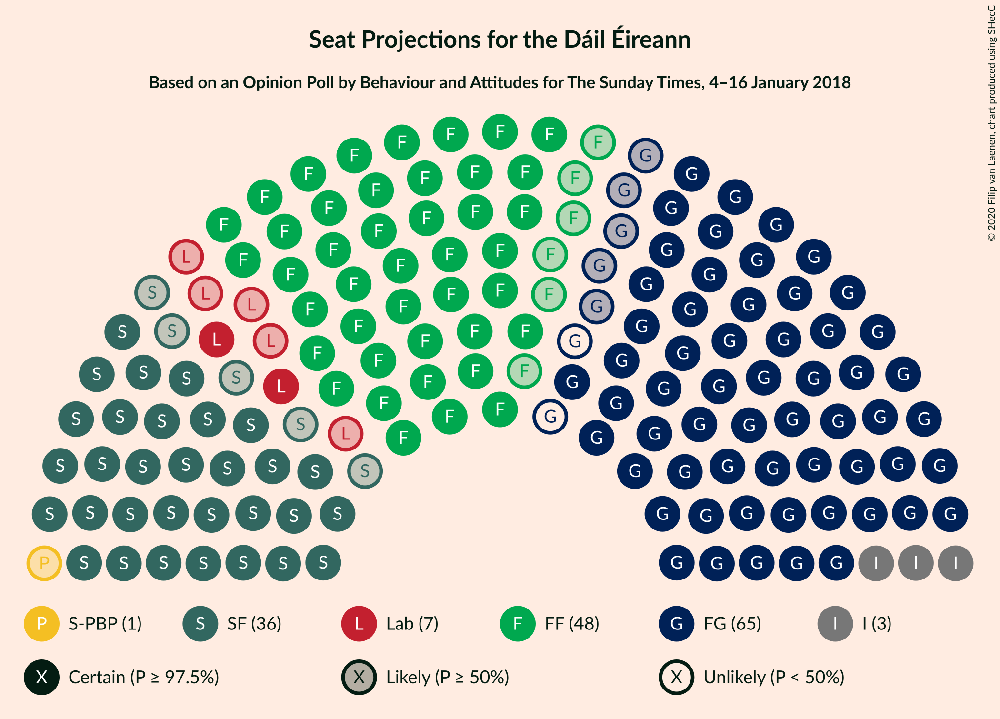
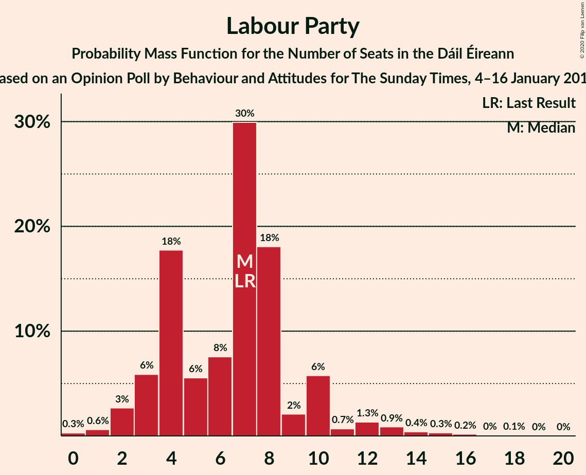
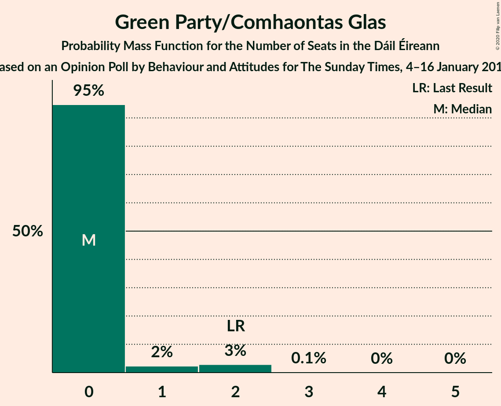
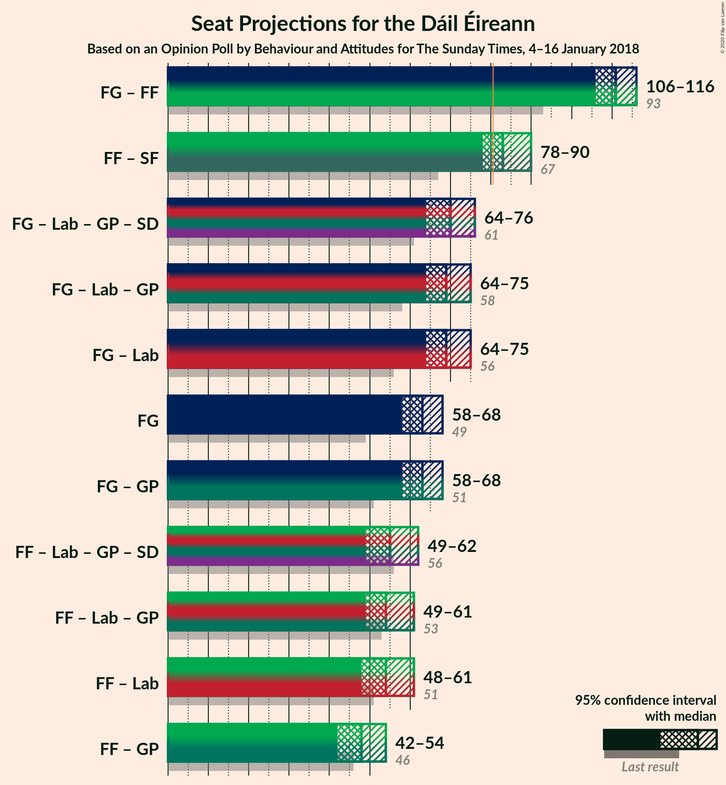
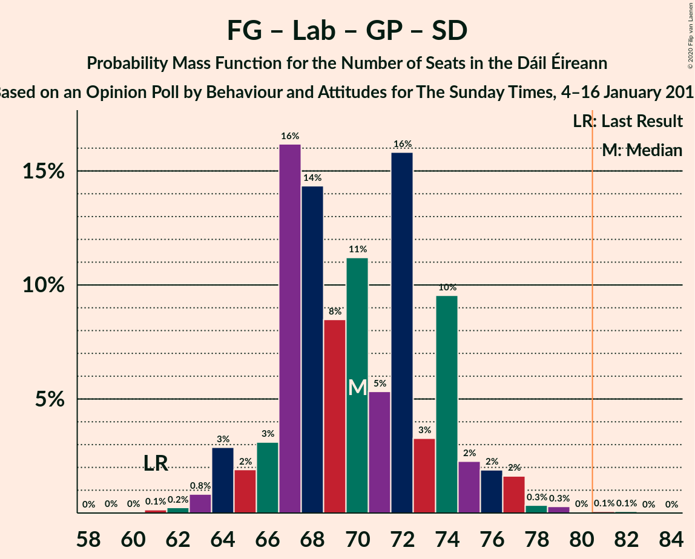
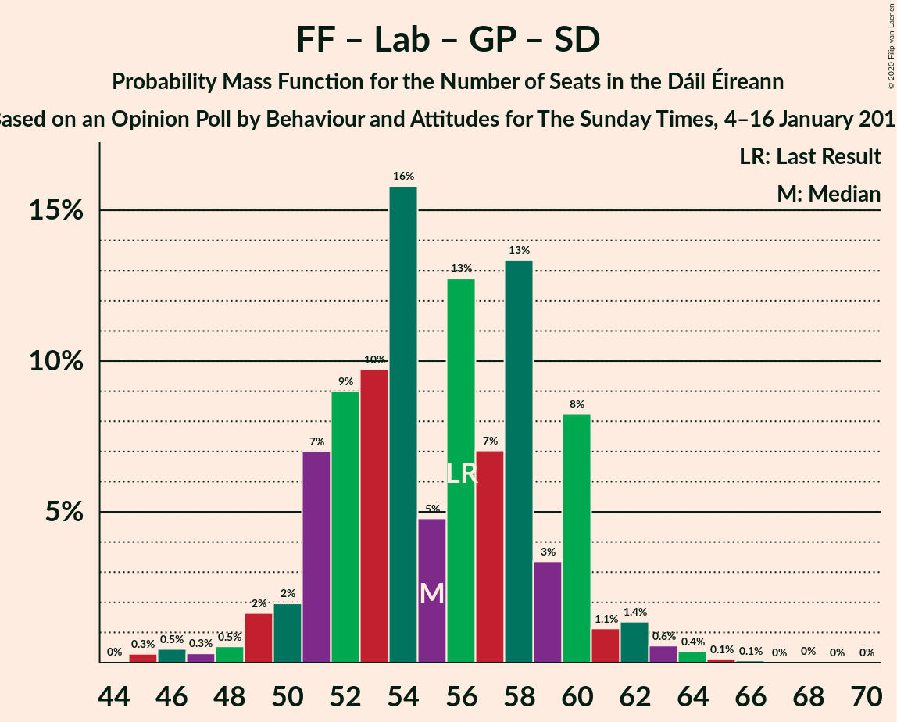

# Opinion Poll by Behaviour and Attitudes for The Sunday Times, 4–16 January 2018

<a href="#voting-intentions">Voting Intentions</a> | <a href="#seats">Seats</a> | <a href="#coalitions">Coalitions</a> | <a href="#technical-information">Technical Information</a>

## Voting Intentions

### Confidence Intervals

| Party | Last Result | Poll Result | 80% Confidence Interval | 90% Confidence Interval | 95% Confidence Interval | 99% Confidence Interval |
|:-----:|:-----------:|:-----------:|:-----------------------:|:-----------------------:|:-----------------------:|:-----------------------:|
| Fine Gael | 25.5% | 32.0% | 30.0–34.0% |29.5–34.6% |29.0–35.1% |28.1–36.0% |
| Fianna Fáil | 24.3% | 26.0% | 24.2–27.9% |23.7–28.4% |23.2–28.9% |22.4–29.9% |
| Sinn Féin | 13.8% | 18.0% | 16.5–19.8% |16.1–20.2% |15.7–20.7% |15.0–21.5% |
| Independent | 15.9% | 7.6% | 6.6–8.9% |6.3–9.2% |6.1–9.5% |5.6–10.1% |
| Labour Party | 6.6% | 6.0% | 5.1–7.1% |4.8–7.4% |4.6–7.7% |4.2–8.3% |
| Solidarity–People Before Profit | 3.9% | 2.0% | 1.5–2.7% |1.3–2.9% |1.2–3.1% |1.1–3.5% |
| Green Party/Comhaontas Glas | 2.7% | 2.0% | 1.5–2.7% |1.3–2.9% |1.2–3.1% |1.1–3.5% |
| Social Democrats | 3.0% | 1.0% | 0.7–1.5% |0.6–1.7% |0.5–1.9% |0.4–2.2% |
| Independents 4 Change | 1.5% | 1.0% | 0.7–1.5% |0.6–1.7% |0.5–1.9% |0.4–2.2% |

*Note:* The poll result column reflects the actual value used in the calculations. Published results may vary slightly, and in addition be rounded to fewer digits.

## Seats

### Confidence Intervals

| Party | Last Result | Median | 80% Confidence Interval | 90% Confidence Interval | 95% Confidence Interval | 99% Confidence Interval |
|:-----:|:-----------:|:------:|:-----------------------:|:-----------------------:|:-----------------------:|:-----------------------:|
| <a href="#fine-gael">Fine Gael</a> | 49 | 61 | 59–66 |57–68 |57–69 |57–69 |
| <a href="#fianna-fáil">Fianna Fáil</a> | 44 | 50 | 43–51 |43–54 |42–54 |40–55 |
| <a href="#sinn-féin">Sinn Féin</a> | 23 | 37 | 33–37 |31–37 |31–38 |28–40 |
| <a href="#independent">Independent</a> | 19 | 3 | 3–5 |3–5 |3–6 |3–6 |
| <a href="#labour-party">Labour Party</a> | 7 | 7 | 3–9 |3–12 |2–12 |1–14 |
| <a href="#solidarity–people-before-profit">Solidarity–People Before Profit</a> | 6 | 1 | 0–3 |0–3 |0–3 |0–4 |
| <a href="#green-party/comhaontas-glas">Green Party/Comhaontas Glas</a> | 2 | 0 | 0 |0–1 |0–2 |0–2 |
| <a href="#social-democrats">Social Democrats</a> | 3 | 0 | 0–3 |0–3 |0–3 |0–3 |
| <a href="#independents-4-change">Independents 4 Change</a> | 4 | 0 | 0–4 |0–4 |0–4 |0–5 |

### Fine Gael

*For a full overview of the results for this party, see the [Fine Gael](party-finegael.html) page.*

| Number of Seats | Probability | Accumulated | Special Marks |
|:---------------:|:-----------:|:-----------:|:-------------:|
| 49 | 0% | 100% | Last Result |
| 50 | 0% | 100% |  |
| 51 | 0% | 100% |  |
| 52 | 0% | 100% |  |
| 53 | 0% | 99.9% |  |
| 54 | 0.1% | 99.9% |  |
| 55 | 0.1% | 99.9% |  |
| 56 | 0.1% | 99.8% |  |
| 57 | 8% | 99.6% |  |
| 58 | 1.0% | 91% |  |
| 59 | 3% | 90% |  |
| 60 | 29% | 87% |  |
| 61 | 11% | 58% | Median |
| 62 | 4% | 47% |  |
| 63 | 15% | 43% |  |
| 64 | 5% | 27% |  |
| 65 | 6% | 22% |  |
| 66 | 9% | 16% |  |
| 67 | 0.7% | 7% |  |
| 68 | 1.2% | 6% |  |
| 69 | 5% | 5% |  |
| 70 | 0% | 0% |  |

### Fianna Fáil

*For a full overview of the results for this party, see the [Fianna Fáil](party-fiannafáil.html) page.*

| Number of Seats | Probability | Accumulated | Special Marks |
|:---------------:|:-----------:|:-----------:|:-------------:|
| 40 | 0.6% | 100% |  |
| 41 | 1.0% | 99.4% |  |
| 42 | 1.2% | 98% |  |
| 43 | 11% | 97% |  |
| 44 | 4% | 86% | Last Result |
| 45 | 4% | 82% |  |
| 46 | 7% | 78% |  |
| 47 | 9% | 71% |  |
| 48 | 3% | 62% |  |
| 49 | 8% | 59% |  |
| 50 | 7% | 50% | Median |
| 51 | 34% | 43% |  |
| 52 | 4% | 9% |  |
| 53 | 0.4% | 5% |  |
| 54 | 4% | 5% |  |
| 55 | 0.9% | 1.2% |  |
| 56 | 0.1% | 0.3% |  |
| 57 | 0.1% | 0.1% |  |
| 58 | 0% | 0% |  |

### Sinn Féin

*For a full overview of the results for this party, see the [Sinn Féin](party-sinnféin.html) page.*

| Number of Seats | Probability | Accumulated | Special Marks |
|:---------------:|:-----------:|:-----------:|:-------------:|
| 23 | 0% | 100% | Last Result |
| 24 | 0% | 100% |  |
| 25 | 0% | 100% |  |
| 26 | 0.1% | 99.9% |  |
| 27 | 0.1% | 99.8% |  |
| 28 | 0.8% | 99.7% |  |
| 29 | 0.7% | 98.9% |  |
| 30 | 0.1% | 98% |  |
| 31 | 3% | 98% |  |
| 32 | 1.0% | 95% |  |
| 33 | 15% | 94% |  |
| 34 | 8% | 78% |  |
| 35 | 10% | 71% |  |
| 36 | 9% | 61% |  |
| 37 | 47% | 52% | Median |
| 38 | 2% | 4% |  |
| 39 | 0.3% | 2% |  |
| 40 | 1.1% | 2% |  |
| 41 | 0.4% | 0.5% |  |
| 42 | 0.1% | 0.1% |  |
| 43 | 0% | 0% |  |

### Independent

*For a full overview of the results for this party, see the [Independent](party-independent.html) page.*

| Number of Seats | Probability | Accumulated | Special Marks |
|:---------------:|:-----------:|:-----------:|:-------------:|
| 1 | 0.1% | 100% |  |
| 2 | 0.3% | 99.9% |  |
| 3 | 78% | 99.6% | Median |
| 4 | 6% | 21% |  |
| 5 | 13% | 15% |  |
| 6 | 3% | 3% |  |
| 7 | 0% | 0.1% |  |
| 8 | 0.1% | 0.1% |  |
| 9 | 0% | 0% |  |
| 10 | 0% | 0% |  |
| 11 | 0% | 0% |  |
| 12 | 0% | 0% |  |
| 13 | 0% | 0% |  |
| 14 | 0% | 0% |  |
| 15 | 0% | 0% |  |
| 16 | 0% | 0% |  |
| 17 | 0% | 0% |  |
| 18 | 0% | 0% |  |
| 19 | 0% | 0% | Last Result |

### Labour Party

*For a full overview of the results for this party, see the [Labour Party](party-labourparty.html) page.*

| Number of Seats | Probability | Accumulated | Special Marks |
|:---------------:|:-----------:|:-----------:|:-------------:|
| 0 | 0.1% | 100% |  |
| 1 | 0.4% | 99.9% |  |
| 2 | 4% | 99.5% |  |
| 3 | 9% | 95% |  |
| 4 | 6% | 86% |  |
| 5 | 3% | 80% |  |
| 6 | 7% | 77% |  |
| 7 | 41% | 70% | Last Result, Median |
| 8 | 16% | 29% |  |
| 9 | 4% | 13% |  |
| 10 | 3% | 9% |  |
| 11 | 0.5% | 6% |  |
| 12 | 5% | 6% |  |
| 13 | 0.4% | 1.0% |  |
| 14 | 0.3% | 0.6% |  |
| 15 | 0.1% | 0.3% |  |
| 16 | 0.1% | 0.2% |  |
| 17 | 0.1% | 0.1% |  |
| 18 | 0% | 0.1% |  |
| 19 | 0% | 0% |  |

### Solidarity–People Before Profit

*For a full overview of the results for this party, see the [Solidarity–People Before Profit](party-solidarity–peoplebeforeprofit.html) page.*

| Number of Seats | Probability | Accumulated | Special Marks |
|:---------------:|:-----------:|:-----------:|:-------------:|
| 0 | 33% | 100% |  |
| 1 | 40% | 67% | Median |
| 2 | 11% | 27% |  |
| 3 | 15% | 16% |  |
| 4 | 0.7% | 0.8% |  |
| 5 | 0% | 0% |  |
| 6 | 0% | 0% | Last Result |

### Green Party/Comhaontas Glas

*For a full overview of the results for this party, see the [Green Party/Comhaontas Glas](party-greenpartycomhaontasglas.html) page.*

| Number of Seats | Probability | Accumulated | Special Marks |
|:---------------:|:-----------:|:-----------:|:-------------:|
| 0 | 93% | 100% | Median |
| 1 | 5% | 7% |  |
| 2 | 2% | 3% | Last Result |
| 3 | 0.1% | 0.1% |  |
| 4 | 0% | 0% |  |

### Social Democrats

*For a full overview of the results for this party, see the [Social Democrats](party-socialdemocrats.html) page.*

| Number of Seats | Probability | Accumulated | Special Marks |
|:---------------:|:-----------:|:-----------:|:-------------:|
| 0 | 83% | 100% | Median |
| 1 | 3% | 17% |  |
| 2 | 0.1% | 14% |  |
| 3 | 13% | 14% | Last Result |
| 4 | 0.3% | 0.3% |  |
| 5 | 0% | 0% |  |

### Independents 4 Change

*For a full overview of the results for this party, see the [Independents 4 Change](party-independents4change.html) page.*

| Number of Seats | Probability | Accumulated | Special Marks |
|:---------------:|:-----------:|:-----------:|:-------------:|
| 0 | 53% | 100% | Median |
| 1 | 3% | 47% |  |
| 2 | 12% | 44% |  |
| 3 | 15% | 31% |  |
| 4 | 15% | 16% | Last Result |
| 5 | 2% | 2% |  |
| 6 | 0% | 0% |  |

## Coalitions

### Confidence Intervals

| Coalition | Last Result | Median | Majority? | 80% Confidence Interval | 90% Confidence Interval | 95% Confidence Interval | 99% Confidence Interval |
|:---------:|:-----------:|:------:|:---------:|:-----------------------:|:-----------------------:|:-----------------------:|:-----------------------:|
| Fine Gael – Fianna Fáil | 93 | 111 | 100% | 106–115 | 106–115 | 106–115 | 102–119 |
| Fianna Fáil – Sinn Féin | 67 | 84 | 70% | 79–88 | 79–88 | 77–91 | 75–91 |
| Fine Gael – Labour Party – Green Party/Comhaontas Glas – Social Democrats | 61 | 69 | 0.3% | 66–75 | 64–75 | 64–76 | 63–78 |
| Fine Gael – Labour Party – Green Party/Comhaontas Glas | 58 | 68 | 0% | 65–73 | 64–75 | 63–76 | 63–78 |
| Fine Gael – Labour Party | 56 | 68 | 0% | 65–73 | 64–75 | 63–76 | 63–78 |
| Fine Gael | 49 | 61 | 0% | 59–66 | 57–68 | 57–69 | 57–69 |
| Fine Gael – Green Party/Comhaontas Glas | 51 | 61 | 0% | 59–66 | 57–68 | 57–69 | 57–69 |
| Fianna Fáil – Labour Party – Green Party/Comhaontas Glas – Social Democrats | 56 | 56 | 0% | 51–60 | 51–62 | 49–63 | 47–63 |
| Fianna Fáil – Labour Party – Green Party/Comhaontas Glas | 53 | 56 | 0% | 51–60 | 50–62 | 49–62 | 45–63 |
| Fianna Fáil – Labour Party | 51 | 56 | 0% | 51–60 | 50–62 | 49–62 | 45–63 |
| Fianna Fáil – Green Party/Comhaontas Glas | 46 | 50 | 0% | 43–52 | 43–54 | 42–54 | 40–55 |

### Fine Gael – Fianna Fáil

| Number of Seats | Probability | Accumulated | Special Marks |
|:---------------:|:-----------:|:-----------:|:-------------:|
| 93 | 0% | 100% | Last Result |
| 94 | 0% | 100% |  |
| 95 | 0% | 100% |  |
| 96 | 0% | 100% |  |
| 97 | 0% | 100% |  |
| 98 | 0% | 100% |  |
| 99 | 0% | 100% |  |
| 100 | 0.1% | 100% |  |
| 101 | 0.2% | 99.9% |  |
| 102 | 0.4% | 99.7% |  |
| 103 | 0.2% | 99.3% |  |
| 104 | 0.4% | 99.2% |  |
| 105 | 0.3% | 98.8% |  |
| 106 | 12% | 98.5% |  |
| 107 | 9% | 87% |  |
| 108 | 4% | 78% |  |
| 109 | 3% | 74% |  |
| 110 | 13% | 70% |  |
| 111 | 30% | 58% | Median |
| 112 | 5% | 28% |  |
| 113 | 7% | 23% |  |
| 114 | 2% | 15% |  |
| 115 | 11% | 13% |  |
| 116 | 0.3% | 2% |  |
| 117 | 0.8% | 2% |  |
| 118 | 0.1% | 0.9% |  |
| 119 | 0.7% | 0.8% |  |
| 120 | 0.1% | 0.1% |  |
| 121 | 0% | 0% |  |

### Fianna Fáil – Sinn Féin

| Number of Seats | Probability | Accumulated | Special Marks |
|:---------------:|:-----------:|:-----------:|:-------------:|
| 67 | 0% | 100% | Last Result |
| 68 | 0% | 100% |  |
| 69 | 0% | 100% |  |
| 70 | 0% | 100% |  |
| 71 | 0% | 100% |  |
| 72 | 0% | 100% |  |
| 73 | 0% | 100% |  |
| 74 | 0.2% | 99.9% |  |
| 75 | 0.4% | 99.7% |  |
| 76 | 0.6% | 99.3% |  |
| 77 | 2% | 98.8% |  |
| 78 | 2% | 97% |  |
| 79 | 7% | 96% |  |
| 80 | 18% | 88% |  |
| 81 | 2% | 70% | Majority |
| 82 | 6% | 68% |  |
| 83 | 11% | 62% |  |
| 84 | 6% | 51% |  |
| 85 | 7% | 45% |  |
| 86 | 2% | 39% |  |
| 87 | 0.9% | 37% | Median |
| 88 | 31% | 36% |  |
| 89 | 0.5% | 5% |  |
| 90 | 0.5% | 4% |  |
| 91 | 4% | 4% |  |
| 92 | 0.1% | 0.1% |  |
| 93 | 0% | 0.1% |  |
| 94 | 0% | 0% |  |

### Fine Gael – Labour Party – Green Party/Comhaontas Glas – Social Democrats

| Number of Seats | Probability | Accumulated | Special Marks |
|:---------------:|:-----------:|:-----------:|:-------------:|
| 60 | 0% | 100% |  |
| 61 | 0.1% | 99.9% | Last Result |
| 62 | 0.1% | 99.9% |  |
| 63 | 2% | 99.8% |  |
| 64 | 5% | 98% |  |
| 65 | 0.8% | 93% |  |
| 66 | 4% | 92% |  |
| 67 | 29% | 88% |  |
| 68 | 6% | 59% | Median |
| 69 | 14% | 53% |  |
| 70 | 4% | 39% |  |
| 71 | 13% | 35% |  |
| 72 | 7% | 22% |  |
| 73 | 1.5% | 15% |  |
| 74 | 2% | 14% |  |
| 75 | 7% | 11% |  |
| 76 | 3% | 5% |  |
| 77 | 0.3% | 1.4% |  |
| 78 | 0.6% | 1.1% |  |
| 79 | 0.1% | 0.5% |  |
| 80 | 0% | 0.3% |  |
| 81 | 0.3% | 0.3% | Majority |
| 82 | 0% | 0% |  |

### Fine Gael – Labour Party – Green Party/Comhaontas Glas

| Number of Seats | Probability | Accumulated | Special Marks |
|:---------------:|:-----------:|:-----------:|:-------------:|
| 58 | 0% | 100% | Last Result |
| 59 | 0.1% | 100% |  |
| 60 | 0% | 99.9% |  |
| 61 | 0.1% | 99.9% |  |
| 62 | 0.1% | 99.8% |  |
| 63 | 2% | 99.7% |  |
| 64 | 6% | 97% |  |
| 65 | 2% | 92% |  |
| 66 | 7% | 89% |  |
| 67 | 28% | 83% |  |
| 68 | 6% | 54% | Median |
| 69 | 12% | 48% |  |
| 70 | 4% | 36% |  |
| 71 | 14% | 32% |  |
| 72 | 7% | 18% |  |
| 73 | 1.5% | 11% |  |
| 74 | 1.0% | 10% |  |
| 75 | 5% | 9% |  |
| 76 | 3% | 3% |  |
| 77 | 0.1% | 0.8% |  |
| 78 | 0.5% | 0.6% |  |
| 79 | 0.1% | 0.1% |  |
| 80 | 0.1% | 0.1% |  |
| 81 | 0% | 0% | Majority |

### Fine Gael – Labour Party

| Number of Seats | Probability | Accumulated | Special Marks |
|:---------------:|:-----------:|:-----------:|:-------------:|
| 56 | 0% | 100% | Last Result |
| 57 | 0% | 100% |  |
| 58 | 0% | 100% |  |
| 59 | 0.1% | 100% |  |
| 60 | 0.1% | 99.9% |  |
| 61 | 0.1% | 99.9% |  |
| 62 | 0.1% | 99.7% |  |
| 63 | 2% | 99.6% |  |
| 64 | 7% | 97% |  |
| 65 | 2% | 90% |  |
| 66 | 5% | 88% |  |
| 67 | 28% | 82% |  |
| 68 | 7% | 54% | Median |
| 69 | 11% | 46% |  |
| 70 | 5% | 35% |  |
| 71 | 15% | 31% |  |
| 72 | 5% | 16% |  |
| 73 | 1.4% | 11% |  |
| 74 | 0.8% | 9% |  |
| 75 | 5% | 8% |  |
| 76 | 3% | 3% |  |
| 77 | 0.2% | 0.7% |  |
| 78 | 0.5% | 0.6% |  |
| 79 | 0% | 0.1% |  |
| 80 | 0% | 0.1% |  |
| 81 | 0% | 0% | Majority |

### Fine Gael

| Number of Seats | Probability | Accumulated | Special Marks |
|:---------------:|:-----------:|:-----------:|:-------------:|
| 49 | 0% | 100% | Last Result |
| 50 | 0% | 100% |  |
| 51 | 0% | 100% |  |
| 52 | 0% | 100% |  |
| 53 | 0% | 99.9% |  |
| 54 | 0.1% | 99.9% |  |
| 55 | 0.1% | 99.9% |  |
| 56 | 0.1% | 99.8% |  |
| 57 | 8% | 99.6% |  |
| 58 | 1.0% | 91% |  |
| 59 | 3% | 90% |  |
| 60 | 29% | 87% |  |
| 61 | 11% | 58% | Median |
| 62 | 4% | 47% |  |
| 63 | 15% | 43% |  |
| 64 | 5% | 27% |  |
| 65 | 6% | 22% |  |
| 66 | 9% | 16% |  |
| 67 | 0.7% | 7% |  |
| 68 | 1.2% | 6% |  |
| 69 | 5% | 5% |  |
| 70 | 0% | 0% |  |

### Fine Gael – Green Party/Comhaontas Glas

| Number of Seats | Probability | Accumulated | Special Marks |
|:---------------:|:-----------:|:-----------:|:-------------:|
| 51 | 0% | 100% | Last Result |
| 52 | 0% | 100% |  |
| 53 | 0% | 99.9% |  |
| 54 | 0% | 99.9% |  |
| 55 | 0.1% | 99.9% |  |
| 56 | 0.1% | 99.8% |  |
| 57 | 8% | 99.7% |  |
| 58 | 1.1% | 92% |  |
| 59 | 3% | 91% |  |
| 60 | 29% | 87% |  |
| 61 | 10% | 59% | Median |
| 62 | 4% | 48% |  |
| 63 | 15% | 44% |  |
| 64 | 5% | 29% |  |
| 65 | 6% | 24% |  |
| 66 | 11% | 18% |  |
| 67 | 0.8% | 7% |  |
| 68 | 1.3% | 6% |  |
| 69 | 5% | 5% |  |
| 70 | 0% | 0.1% |  |
| 71 | 0.1% | 0.1% |  |
| 72 | 0% | 0% |  |

### Fianna Fáil – Labour Party – Green Party/Comhaontas Glas – Social Democrats

| Number of Seats | Probability | Accumulated | Special Marks |
|:---------------:|:-----------:|:-----------:|:-------------:|
| 45 | 0.3% | 100% |  |
| 46 | 0.1% | 99.7% |  |
| 47 | 0.6% | 99.5% |  |
| 48 | 0.5% | 98.9% |  |
| 49 | 1.5% | 98% |  |
| 50 | 1.0% | 97% |  |
| 51 | 13% | 96% |  |
| 52 | 7% | 83% |  |
| 53 | 6% | 76% |  |
| 54 | 7% | 70% |  |
| 55 | 8% | 63% |  |
| 56 | 7% | 55% | Last Result |
| 57 | 6% | 48% | Median |
| 58 | 27% | 42% |  |
| 59 | 3% | 15% |  |
| 60 | 2% | 12% |  |
| 61 | 0.5% | 9% |  |
| 62 | 6% | 9% |  |
| 63 | 3% | 3% |  |
| 64 | 0.1% | 0.4% |  |
| 65 | 0.2% | 0.3% |  |
| 66 | 0% | 0.1% |  |
| 67 | 0% | 0.1% |  |
| 68 | 0% | 0.1% |  |
| 69 | 0% | 0% |  |

### Fianna Fáil – Labour Party – Green Party/Comhaontas Glas

| Number of Seats | Probability | Accumulated | Special Marks |
|:---------------:|:-----------:|:-----------:|:-------------:|
| 44 | 0.1% | 100% |  |
| 45 | 0.4% | 99.9% |  |
| 46 | 0.3% | 99.5% |  |
| 47 | 0.7% | 99.2% |  |
| 48 | 0.8% | 98% |  |
| 49 | 2% | 98% |  |
| 50 | 4% | 96% |  |
| 51 | 13% | 92% |  |
| 52 | 8% | 79% |  |
| 53 | 6% | 71% | Last Result |
| 54 | 7% | 65% |  |
| 55 | 6% | 58% |  |
| 56 | 8% | 52% |  |
| 57 | 5% | 44% | Median |
| 58 | 26% | 39% |  |
| 59 | 2% | 13% |  |
| 60 | 4% | 10% |  |
| 61 | 0.5% | 7% |  |
| 62 | 5% | 6% |  |
| 63 | 0.5% | 0.8% |  |
| 64 | 0% | 0.2% |  |
| 65 | 0.1% | 0.2% |  |
| 66 | 0% | 0.1% |  |
| 67 | 0% | 0% |  |

### Fianna Fáil – Labour Party

| Number of Seats | Probability | Accumulated | Special Marks |
|:---------------:|:-----------:|:-----------:|:-------------:|
| 43 | 0% | 100% |  |
| 44 | 0.1% | 99.9% |  |
| 45 | 0.4% | 99.9% |  |
| 46 | 0.4% | 99.4% |  |
| 47 | 0.6% | 99.1% |  |
| 48 | 0.9% | 98% |  |
| 49 | 2% | 98% |  |
| 50 | 4% | 96% |  |
| 51 | 13% | 92% | Last Result |
| 52 | 9% | 79% |  |
| 53 | 6% | 70% |  |
| 54 | 7% | 63% |  |
| 55 | 5% | 57% |  |
| 56 | 8% | 52% |  |
| 57 | 5% | 44% | Median |
| 58 | 28% | 39% |  |
| 59 | 0.6% | 11% |  |
| 60 | 4% | 10% |  |
| 61 | 1.0% | 7% |  |
| 62 | 5% | 6% |  |
| 63 | 0.5% | 0.7% |  |
| 64 | 0% | 0.2% |  |
| 65 | 0.1% | 0.2% |  |
| 66 | 0% | 0.1% |  |
| 67 | 0% | 0% |  |

### Fianna Fáil – Green Party/Comhaontas Glas

| Number of Seats | Probability | Accumulated | Special Marks |
|:---------------:|:-----------:|:-----------:|:-------------:|
| 40 | 0.5% | 100% |  |
| 41 | 0.9% | 99.4% |  |
| 42 | 1.2% | 98.5% |  |
| 43 | 11% | 97% |  |
| 44 | 4% | 86% |  |
| 45 | 4% | 82% |  |
| 46 | 6% | 78% | Last Result |
| 47 | 10% | 72% |  |
| 48 | 3% | 62% |  |
| 49 | 7% | 59% |  |
| 50 | 8% | 52% | Median |
| 51 | 31% | 44% |  |
| 52 | 5% | 12% |  |
| 53 | 2% | 7% |  |
| 54 | 4% | 5% |  |
| 55 | 0.9% | 1.2% |  |
| 56 | 0.1% | 0.3% |  |
| 57 | 0.2% | 0.2% |  |
| 58 | 0% | 0% |  |

## Technical Information

### Opinion Poll

+ **Polling firm:** Behaviour and Attitudes
+ **Commissioner(s):** The Sunday Times
+ **Fieldwork period:** 4–16 January 2018

### Calculations

+ **Sample size:** 920
+ **Simulations done:** 131,072
+ **Error estimate:** 3.43%

